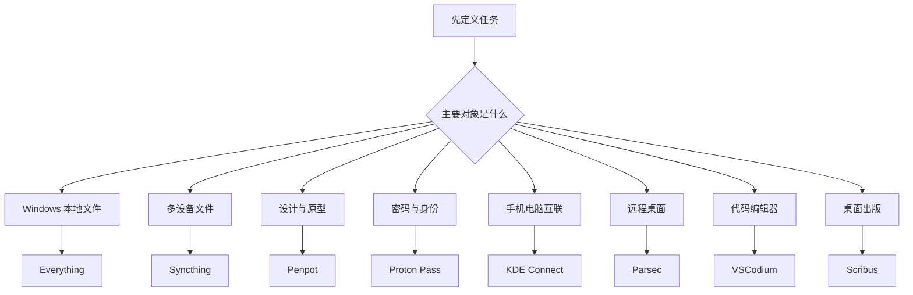
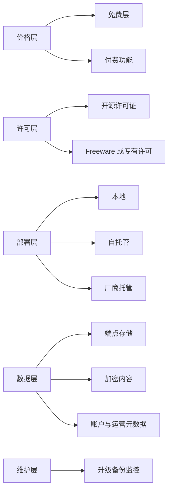
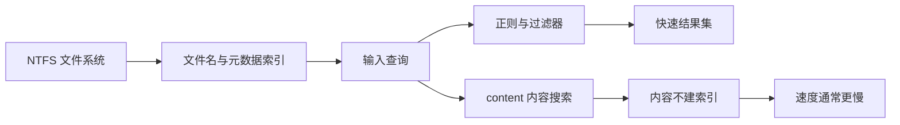
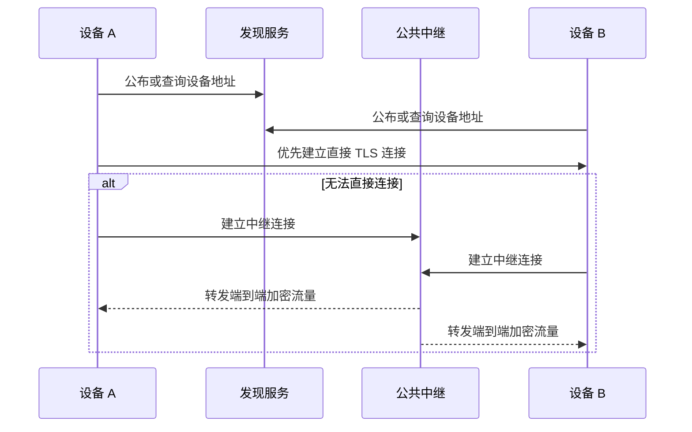
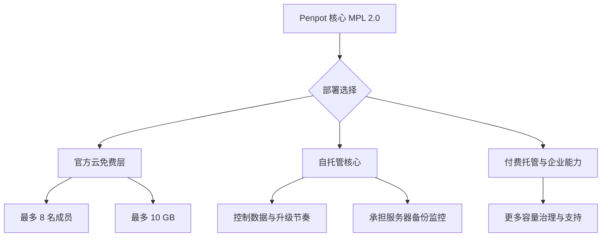
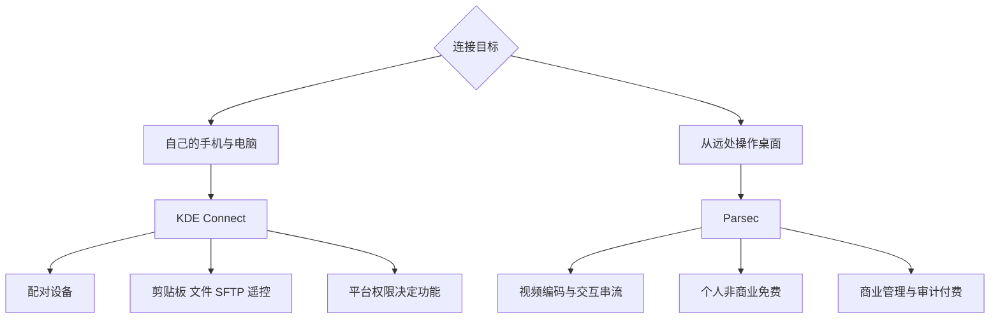
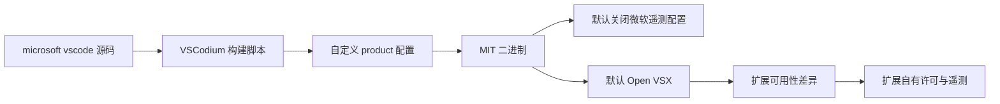
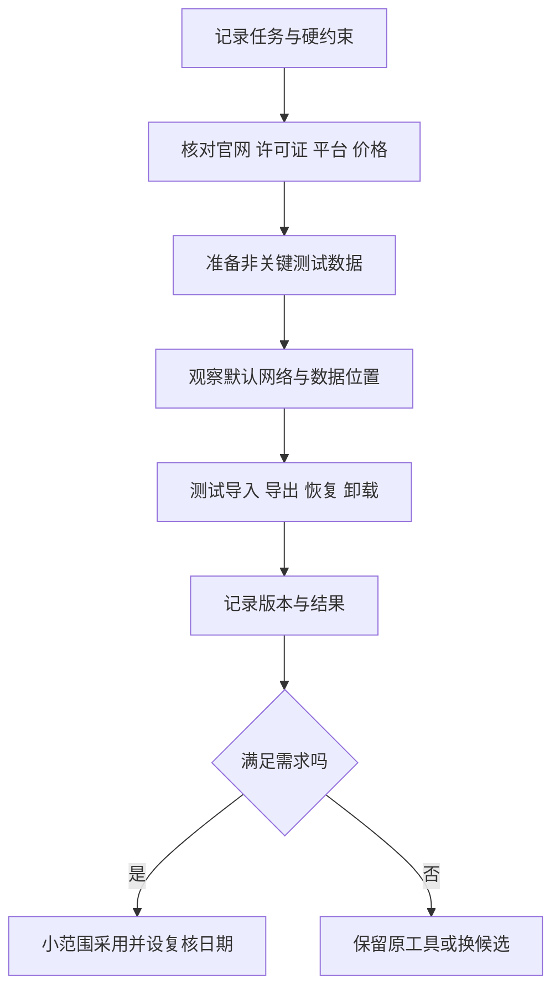

# 总结稿

[打开单页 HTML 总结](assets/bilibili-BV1CfgK6pExt-summary.html)

## 一句话结论

这 8 款工具不是一组可以无脑安装的“免费替代品”，而是 8 种不同取舍：**Everything 优化 Windows 本地检索，Syncthing 把同步存储权留在自己的设备，Penpot 在开放设计与托管服务之间提供选择，Proton Pass 用托管服务换跨设备零知识保险库，KDE Connect 强化设备直连，Parsec 用免费个人层换取明确的商用边界，VSCodium 用开源构建换扩展生态差异，Scribus 面向严肃桌面出版。** 免费、开源、自托管、P2P、端到端加密和无遥测是不同属性，不能互相代替。

> [!warning] 捕获时长不一致
> B 站 metadata 记录 **1330 秒（22:10）**，现有 316 段转录却在 **663.12 秒（11:03.12）**结束，仅为 49.86%。转录在 `[10:05–11:02]` 有完整总结与片尾跳转，不像突然截断；但现有 manifest 没有媒体流探测或关键帧时间戳，仍无法确认 11:03 后是额外内容、重复内容，还是 metadata 异常。**本笔记只总结 0–663.12 秒可验证内容，不声称覆盖完整 22:10，也不声称必然缺失半段。**

## 按使用场景选，而不是按“免费”选

| 任务 | 工具 | 已核实的核心价值 | 关键取舍 |
|---|---|---|---|
| Windows 找文件 | **Everything** | Windows freeware；文件名索引快，支持正则、过滤器，也支持 `content:` 内容搜索 | 不是开源软件；内容不建索引，内容搜索较慢；资源占用随规模变化。[官方 FAQ](https://www.voidtools.com/faq/) |
| 自己设备间同步文件 | **Syncthing** | MPL-2.0 开源；无中央文件存储，设备通信使用 TLS | 默认全局发现和公共中继会处理设备 ID、IP 或流量元数据；它是同步工具，不自动等于备份。官方 Android 客户端已于 2024 年停更归档。[安全模型](https://docs.syncthing.net/users/security.html)、[Android 仓库](https://github.com/syncthing/syncthing-android) |
| UI 设计、原型与开发协作 | **Penpot** | MPL-2.0 开源，可自托管；SVG/Web 标准和代码检查器有利于设计开发协作 | 自托管仍有服务器、备份和维护成本；云端免费层当前最多 8 名团队成员、10 GB，所谓无限文件仍受容量约束。[当前定价](https://penpot.app/pricing)、[数据模型](https://help.penpot.app/technical-guide/developer/data-model/) |
| 密码与身份项目跨设备管理 | **Proton Pass** | 当前免费层含无限登录项、笔记、信用卡、设备和 10 个别名；库内容采用端到端、零知识加密 | 托管的加密内容仍存于 Proton 服务器；服务仍处理账户与运营数据，E2EE 也不防已解锁终端。[免费层](https://proton.me/pass)、[安全模型](https://proton.me/pass/security) |
| 手机与电脑互联 | **KDE Connect** | 免费开源；支持文件/链接、剪贴板、SFTP 浏览、触控板与演示遥控；覆盖 Android、Windows、macOS、Linux、iOS | 平台能力不等价，尤其 iOS、Android 后台剪贴板受系统限制；“无需 KDE 云账户”不能扩大成所有插件绝无任何网络或数据处理。[官方页面](https://kdeconnect.kde.org/)、[功能限制](https://userbase.kde.org/KDEConnect) |
| 低延迟远程桌面 | **Parsec** | 免费个人层含低延迟 60 FPS、分享与加密 P2P 等核心能力 | 免费层只许可个人非商业使用，且没有多显示器、4:4:4、privacy mode、团队管理和审计等付费能力；实际延迟依赖硬件和网络。[当前计划与许可边界](https://parsec.app/pricing) |
| 更少微软定制的 Code - OSS 构建 | **VSCodium** | 官方构建流程基于 `vscode` 源码，发布 MIT 二进制并默认禁用微软遥测配置 | 默认使用 Open VSX 而非 Microsoft Marketplace；部分专有扩展/调试器受许可证或产品检查限制。扩展仍可能自行联网和遥测。[构建说明](https://github.com/VSCodium/vscodium/blob/master/README.md)、[扩展市场说明](https://github.com/VSCodium/vscodium/blob/master/docs/extensions.md) |
| 书籍、杂志与印刷版面 | **Scribus** | GPL 开源，支持 Windows、macOS、Linux，以及 CMYK、专色、ICC、PDF/X 等印前能力 | “印刷就绪”仍取决于字体、出血、色彩配置与印厂规范；不能直接打开 INDD，但可导入部分 IDML/IDMS 交换格式。[官方功能概览](https://github.com/scribusproject/scribus/blob/master/doc/en/index.html)、[规格](https://wiki.scribus.net/canvas/Help%3ASpecifications) |

## 六个容易混淆的词

1. **免费**：当前价格为零，不代表未来不变，也不代表没有功能、商业用途或账户限制。
2. **开源**：能审阅、修改和再分发源码，但仍要遵守许可证；开源本身不证明安全、无漏洞或无网络请求。
3. **自托管**：数据与服务控制面更多地在自己手中，同时把部署、升级、备份、监控与事故响应成本也交给自己。
4. **P2P**：内容可以在端点间传输，不表示不存在发现、中继、更新或认证基础设施。
5. **端到端／零知识**：服务商无法解密指定内容字段，不表示不处理账户、账单、IP、反滥用或其他元数据。
6. **无遥测**：要限定到某个发行版的默认配置；安装的扩展、语言服务器和账户功能可能有各自的数据流。

## 一个可执行的选型顺序

1. 先写清任务：搜索、同步、协作、密码、互联、远程、编码还是出版。
2. 再列硬约束：操作系统、商业/个人用途、是否必须离线、是否允许云账户、合规与数据驻留。
3. 核对当前官方文档：许可证、免费层、平台、维护状态、加密范围、遥测和扩展来源。
4. 用非关键数据做小规模试验，并记录版本、默认网络请求、导入导出与卸载路径。
5. 评估总成本：迁移、培训、备份、运维、支持、兼容性和退出成本，而不只看订阅价。

## 观众反馈：只作线索，不作总体结论

观众数据只有 **5 / 平台报告 7** 条顶层热门评论，候选 **5** 条；弹幕 **3** 条且只是 current-accessible，不是历史全集。最有价值的线索是观众提醒 Everything 新版本支持内容搜索，现已由[官方搜索文档](https://www.voidtools.com/en-us/support/everything/searching/)确认；“开源永远的神”则只是价值偏好，不能证明具体产品安全。该样本既非随机也非完整，不计算情绪或认可比例。

## 最稳妥的组合

- **本机效率**：Everything 解决“文件在哪里”，但敏感内容检索与索引范围要单独配置。
- **设备所有权**：Syncthing 负责同步，另配版本化、离线或异地备份；不要把双向同步当恢复方案。
- **设计协作**：先用 Penpot 云免费层验证流程，需要更强控制时再评估自托管总成本。
- **凭据安全**：Proton Pass 的密码学模型值得关注，但仍需启用强主密码、MFA、恢复方案和终端防护。
- **开发环境**：VSCodium 适合重视开源构建与默认遥测边界的人；先列出不可缺少的微软专有扩展再迁移。
- **印刷生产**：Scribus 适合先做 PDF/X、字体、出血和色彩打样，而不是只凭“支持 CMYK”直接交付印厂。

# 辅助理解

## 如何理解这期视频

这期视频真正有用的不是“8 款软件共省多少钱”，而是一张**任务—控制权—维护成本**地图。产品 Logo 只说明视频列举了谁；价格、加密、平台、许可证和维护状态必须回到当前官方资料。本理解稿只覆盖现有转录的 0–663.12 秒；metadata 的 1330 秒与完整片尾转录不一致，11:03 后内容是否缺失、重复或只是 metadata 异常仍未验证。

frame 1 是八款应用的目录帧，适合作为任务导航；它不能证明任一产品免费、开源、安全、跨平台或仍在维护。

## 1. 第一问：你到底要解决哪种任务

这一步能避免“都是免费软件，所以互为替代”的错误。Syncthing 不是云备份，KDE Connect 不是持续文件同步，Penpot 不是桌面出版工具，Scribus 也不是 Figma 式实时产品设计平台。

## 2. 第二问：免费、开源和隐私分别落在哪一层

Everything 是 freeware，不是开源；Penpot 核心开源且可自托管，但托管服务与企业支持可以收费；Proton Pass 的客户端开源且保险库零知识加密，但服务仍是厂商托管；Parsec 免费层有明确的非商业许可边界。**每一层都要分别核验。**

## 3. Everything：快来自索引，不代表只能搜文件名

frame 2 显示 Everything 的真实 Search 菜单，包括正则、大小写、路径和类型过滤；它能证明界面存在这些入口，不能证明所有磁盘都瞬时搜索。

[Everything 官方 FAQ](https://www.voidtools.com/faq/)明确说明它是 Windows freeware，名称索引通常很快，也给出了随文件数增长的内存示例；同时，[官方搜索文档](https://www.voidtools.com/en-us/support/everything/searching/)已经支持 `content:`。因此视频的“只搜名字、不搜内容”已不准确，但这不意味着内容被预先全文索引或搜索同样快。

## 4. Syncthing：没有中央文件仓库，不等于没有基础设施

[Syncthing 安全文档](https://docs.syncthing.net/users/security.html)确认设备流量受 TLS 保护，也说明全局发现默认会处理设备 ID 与 IP，公共中继默认可参与并看到设备标识与流量大小。[中继文档](https://docs.syncthing.net/users/relaying.html)强调中继看不到文件内容。准确结论是：**文件没有中央云副本，但连接可能依赖发现或中继服务。** 此外，官方 Android 客户端[已停止维护并归档](https://github.com/syncthing/syncthing-android)，移动端应重新核对客户端来源和维护者。

## 5. Penpot：开放格式降低摩擦，但自托管不是零成本

frame 3 展示免费、团队、企业与私有服务层，是“开源核心与商业服务可共存”的例子；画面价格强时效，不能离开当前官方页面引用。

[Penpot 当前价格页](https://penpot.app/pricing)确认 $0 Professional 方案的 8 名团队成员、10 GB 和无限设计文件；“无限”仍受存储容量限制。[官方数据模型](https://help.penpot.app/technical-guide/developer/data-model/)说明 shape 对应 SVG node，但也含 Penpot 特有属性，外部 SVG 导入是 best effort。开放标准可减少交付摩擦，却不保证完全无损兼容。

## 6. Proton Pass：内容不可读与服务无数据不是一回事

[Proton Pass 安全页](https://proton.me/pass/security)称用户名、网址、密码和笔记字段均端到端加密，Proton 无法读取库内内容；[产品隐私政策](https://proton.me/pass/privacy-policy)同时说明加密数据存于 Proton 服务器，并披露服务运营与别名基础设施。这里的正确心智模型是：**厂商不能解密指定内容，不等于服务不处理任何数据，也不等于终端被入侵后仍安全。**

## 7. KDE Connect 与 Parsec：都连接设备，但信任边界不同

[KDE Connect 官方下载页](https://kdeconnect.kde.org/download.html)列出 Android、Windows、macOS、Linux 与 iOS，但 [UserBase](https://userbase.kde.org/KDEConnect)也列出 iOS、Android 剪贴板与后台能力限制。[Parsec 当前价格页](https://parsec.app/pricing)则把免费 Personal Use 明确限于个人非商业，并把多显示器、4:4:4、privacy mode、管理和审计放在付费层。二者都不能只用“免费远程”概括。

## 8. VSCodium：遥测边界与扩展供应链必须一起看

frame 8 是“open source marketplace”的概念图，不是 Open VSX 实际页面；它只适合提示扩展来源差异。

[VSCodium README](https://github.com/VSCodium/vscodium/blob/master/README.md)确认它克隆 `vscode` 源码、自定义产品配置并禁用遥测；[扩展文档](https://github.com/VSCodium/vscodium/blob/master/docs/extensions.md)确认默认 Open VSX，部分微软扩展受许可证或产品检查限制。因此“默认减少微软遥测”成立，“安装后绝不会产生任何遥测或微软流量”不成立。

## 9. Scribus：是否能印，不只看一个 CMYK 复选框

frame 9 用实体书册说明桌面出版场景，但没有展示色彩管理、出血、字体嵌入或 PDF/X 设置，不能作为印前能力证据。

[Scribus 官方文档](https://github.com/scribusproject/scribus/blob/master/doc/en/index.html)确认 CMYK、专色、ICC 和 PDF 创建，[规格页](https://wiki.scribus.net/canvas/Help%3ASpecifications)进一步列出 PDF/X、字体嵌入、出血和印刷标记。Scribus 不能直接打开 INDD，但可导入部分 IDML/IDMS 交换格式；迁移前应先用真实文档做版式、字体和颜色回归测试。

## 10. 把推荐变成可复核实验

这比“看见免费就迁移”多花一点时间，却能提前暴露平台、许可、扩展、数据出口与恢复路径问题。

## 观众反馈放在证据末端

观众样本仅 **5 / 平台报告 7** 条顶层热门评论、候选 **5** 条，弹幕 **3** 条且非历史全集。评论提醒 Everything 新版本有内容搜索，这只是发现线索，最终由官方文档确认；“开源永远的神”是价值判断，不是许可证、安全或维护事实。样本不随机、不完整，不能推断总体认可比例或情绪。

## 外部事实核验

### 声明 1（00:26）

- 视频陈述：Everything 完全免费、无广告订阅、占用极低；读取 NTFS 主文件表，搜索文件名而非内容，并且只支持 Windows。
- 核验状态：部分确认
- 核验结果：部分确认。voidtools 官方 FAQ 将 Everything 定义为 Windows 文件名搜索工具和 Freeware，并给出约 35 MB RAM（约 25 万文件）与约 100 MB RAM（100 万文件）的示例；官方也说明 NTFS 索引通常很快。不过视频把‘不能搜索内容’说得过头：当前官方 FAQ 明确支持 `content:` 文件内容搜索，只是内容不建索引、速度较慢。‘几乎不占 CPU/内存’也不应写成无条件保证；资源占用随索引规模和操作而变。免费并不等于开源，Everything 是 freeware。
- 检索日期：2026-08-20
- 来源：
  - [Everything FAQ — voidtools](https://www.voidtools.com/faq/)（primary）
  - [Everything Search Syntax — voidtools](https://www.voidtools.com/en-us/support/everything/searching/)（primary）

### 声明 2（01:41）

- 视频陈述：Syncthing 完全免费开源，没有付费层级、高级版本，也永远不会有订阅。
- 核验状态：部分确认
- 核验结果：部分确认。Syncthing 官方仓库将全部代码置于 MPL-2.0 下，官网也明确称其开源；核心软件当前可免费取得。官方首页同时列出第三方商业支持，因此‘生态中不存在任何付费服务’不成立；更重要的是，‘永远不会订阅’是未来承诺，无法由当前许可证或官网永久证实。可靠写法是‘核心项目当前为 MPL-2.0 开源软件’，而不是保证未来商业模式。
- 检索日期：2026-08-20
- 来源：
  - [Syncthing official site](https://syncthing.net/)（primary）
  - [Syncthing LICENSE](https://github.com/syncthing/syncthing/blob/main/LICENSE)（primary）

### 声明 3（01:47）

- 视频陈述：文件不上传到别人服务器，而是经本地网或互联网建立加密 P2P 连接；中间没有公司服务器。
- 核验状态：部分确认
- 核验结果：核心文件存储与传输机密性得到确认，但‘完全没有服务器’不准确。官网称同步数据只存于用户计算机、设备流量使用 TLS；然而官方安全文档说明全局发现默认开启，会向发现服务器披露设备 ID 与外部 IP，公共中继默认也可参与并看到设备 ID、对端 ID 和流量大小。中继只能转发端到端加密数据、看不到文件内容，也不等同云存储。应写成‘无中央文件存储；可能使用发现和中继基础设施，内容仍端到端加密’，不能由此推出端点安全、备份或零元数据泄露。
- 检索日期：2026-08-20
- 来源：
  - [Security Principles — Syncthing](https://docs.syncthing.net/users/security.html)（primary）
  - [Relaying — Syncthing](https://docs.syncthing.net/users/relaying.html)（primary）

### 声明 4（02:04）

- 视频陈述：Syncthing 支持 Windows、macOS、Linux 和 Android。
- 核验状态：部分确认
- 核验结果：部分确认且 Android 表述需要重要修正。Syncthing 核心项目当前明确提供/描述 Windows、macOS、Linux 等桌面系统；但官方 `syncthing-android` 仓库已在 2024-12-03 归档，1.28.1 被标为最后版本。Android 上仍可能有社区维护封装或运行核心程序的方式，但不应再写成官方 Android 客户端仍持续受支持。
- 检索日期：2026-08-20
- 来源：
  - [Syncthing official site](https://syncthing.net/)（primary）
  - [syncthing-android — Discontinued](https://github.com/syncthing/syncthing-android)（primary）

### 声明 5（03:04）

- 视频陈述：Penpot 免费开源，自托管版本完全免费且不限用户数和项目数。
- 核验状态：部分确认
- 核验结果：核心事实确认，但成本与配额须拆开。Penpot 官方仓库以 MPL-2.0 发布，官方价格页提供 $0 的 Professional 方案并明确列出 self-host 入口。开源许可证允许自行部署核心软件，不代表服务器、备份、升级和运维零成本；托管云方案的成员数、存储、历史版本等限制也不能套用到自托管版，反之亦然。摘要不宜只写‘完全免费无限制’。
- 检索日期：2026-08-20
- 来源：
  - [Penpot official repository](https://github.com/penpot/penpot)（primary）
  - [Penpot Pricing](https://penpot.app/pricing)（primary）

### 声明 6（03:17）

- 视频陈述：云端免费套餐不限文件和项目，最多 8 名团队成员，约 10 GB 存储。
- 核验状态：已确认
- 核验结果：截至核验日确认。Penpot 官方价格页的 $0 Professional 方案列出最多 8 名团队成员、无限 viewers、最多 10 GB 存储和 unlimited design files；‘无限文件’仍受 10 GB 总存储约束，且页面还列出 7 天自动版本与删除恢复窗口。方案可能变化，摘要应标注核验日期。
- 检索日期：2026-08-20
- 来源：
  - [Penpot Pricing](https://penpot.app/pricing)（primary）

### 声明 7（03:31）

- 视频陈述：Penpot 构建在 SVG 开放 Web 标准上，因此设计师和开发者使用同一种底层格式，交付更容易。
- 核验状态：部分确认
- 核验结果：技术基础确认，效果结论需收窄。官方功能页和数据模型文档说明 Penpot 的 shape 对应 SVG node，提供 SVG markup、CSS/HTML 检视和开放格式导出。SVG 确为开放 Web 标准，但 Penpot shape 还有产品特有属性，非 Penpot SVG 的导入也只是 best effort；所以它可减少某些交付摩擦，却不能保证无损互操作或消除所有兼容问题。
- 检索日期：2026-08-20
- 来源：
  - [Penpot Features](https://penpot.app/features)（primary）
  - [Penpot Data Model](https://help.penpot.app/technical-guide/developer/data-model/)（primary）

### 声明 8（04:28）

- 视频陈述：Proton Pass 建立在瑞士严格的隐私法律之下。
- 核验状态：已确认
- 核验结果：核心确认但不是绝对安全背书。Proton 总隐私政策称服务由注册于日内瓦的 Proton AG 运营并受瑞士法律监管；服务条款对多数消费者与商业用户指定瑞士实体法和日内瓦法院，但美国消费者另有条款。产品隐私政策还说明加密数据服务器位于瑞士、德国或挪威，部分邮箱别名功能由欧洲云基础设施承载。司法辖区不能替代密码学、终端安全或服务条款审查。
- 检索日期：2026-08-20
- 来源：
  - [Proton Privacy Policy](https://proton.me/legal/privacy)（primary）
  - [Proton Pass Privacy Policy](https://proton.me/pass/privacy-policy)（primary）

### 声明 9（04:31）

- 视频陈述：免费版有无限密码、安全笔记、保存的信用卡和设备，外加 10 个隐藏邮箱别名。
- 核验状态：已确认
- 核验结果：截至核验日确认。Proton Pass 官方价格页列出 Free 方案包含 unlimited logins, notes and credit cards、unlimited devices、10 个 hide-my-email aliases，并且无需信用卡。官方支持页另列 2 个 vaults，表明‘无限项目/设备’不等于所有功能无限；高级 2FA、更多 vault、无限别名等仍属于付费层。
- 检索日期：2026-08-20
- 来源：
  - [Proton Pass](https://proton.me/pass)（primary）
  - [Set up Proton Pass browser extension](https://proton.me/support/pass-setup)（primary）

### 声明 10（04:47）

- 视频陈述：密码库在到达 Proton 服务器前已加密，连 Proton 也无法看到内容。
- 核验状态：已确认
- 核验结果：按官方架构说明确认。Proton 文档称每个 vault 使用独立密钥，客户端在上传前端到端加密，用户名、网址、密码和加密笔记等字段也加密，Proton 不知道用户密码，因而不能解密 Pass 数据；所有 Pass 应用目前也称为开源并接受独立审计。仍需避免把这扩张为‘Proton 不处理任何数据’：隐私政策列出账户、服务运营和反滥用所需数据，且加密内容仍存于 Proton 服务器；E2EE 也不防已解锁终端或恶意扩展。
- 检索日期：2026-08-20
- 来源：
  - [Proton Pass Security](https://proton.me/pass/security)（primary）
  - [What is a vault in Proton Pass?](https://proton.me/support/pass-vault)（primary）

### 声明 11（05:49）

- 视频陈述：KDE Connect 免费开源，兼容 Android 与 Windows、macOS、Linux；iPhone 也支持但功能受限。
- 核验状态：已确认
- 核验结果：确认。KDE Connect 官网明确称其 open source、free to use for any purpose；官方下载页列出 Linux、Android、Windows、macOS 和原生 iOS 端。iOS 不是完整功能等价：KDE UserBase 当前列出通知同步、短信、后台保持连接、虚拟显示等缺失项，剪贴板等功能也有限制。因此跨平台可用成立，但不能写成全平台功能一致。
- 检索日期：2026-08-20
- 来源：
  - [KDE Connect official site](https://kdeconnect.kde.org/)（primary）
  - [Download KDE Connect](https://kdeconnect.kde.org/download.html)（primary）
  - [KDE Connect UserBase](https://userbase.kde.org/KDEConnect)（primary）

### 声明 12（05:54）

- 视频陈述：通过同一 Wi‑Fi 连接，无需账户、中间没有服务器、没有公司处理数据，设备直接通信。
- 核验状态：部分确认
- 核验结果：部分确认但视频措辞过于绝对。官方使用文档以局域网发现、配对、TCP/UDP 端口为基础，也说明可经 OpenVPN 或手动 IP 跨网络连接；这支持其不是传统云账户型同步服务。官方材料并未为所有平台、插件、下载更新或用户配置作出‘绝无任何服务器/数据处理’的普遍保证。可靠写法是‘核心设备通信通常在已配对设备间直接进行，不要求 KDE 云账户；可通过局域网或用户配置的 VPN/路由连接’，不要把它写成完整隐私审计结论。
- 检索日期：2026-08-20
- 来源：
  - [KDE Connect UserBase](https://userbase.kde.org/KDEConnect)（primary）
  - [KDE Connect official site](https://kdeconnect.kde.org/)（primary）

### 声明 13（06:05）

- 视频陈述：连接后可共享剪贴板、发送文件/链接、经 SFTP 浏览手机、把手机当触控板或演示遥控器。
- 核验状态：已确认
- 核验结果：核心功能确认。KDE 官方首页和 UserBase 列出文件/链接分享、远程浏览、共享剪贴板、virtual input 与 presentation control，远程文件浏览使用 SFTP。功能受操作系统权限和版本影响：例如 Android 10+ 对后台剪贴板读取有限制，iOS 的共享剪贴板与后台连接也受限。摘要应说‘支持这些插件/能力’，而非保证所有设备默认双向无障碍。
- 检索日期：2026-08-20
- 来源：
  - [KDE Connect official site](https://kdeconnect.kde.org/)（primary）
  - [KDE Connect UserBase](https://userbase.kde.org/KDEConnect)（primary）

### 声明 14（07:20）

- 视频陈述：Parsec 为超低延迟而设计，秘诀是硬件加速视频编码和游戏串流技术。
- 核验状态：部分确认
- 核验结果：产品定位与功能部分确认，但不能把营销用语当通用性能保证。Parsec 当前价格页列出 low-latency、60 FPS desktop capture、加密 P2P 连接，并给出 Windows 10+ 与 macOS 10.15+ 的主机要求；实际时延、帧率与画质取决于主机编码器/GPU、客户端、网络路径、分辨率和付费功能。视频没有基准测试，‘超低’不能外推到任何连接。
- 检索日期：2026-08-20
- 来源：
  - [Parsec Plans and Pricing](https://parsec.app/pricing)（primary）

### 声明 15（07:34）

- 视频陈述：Parsec 对个人使用完全免费，商业用途需要付费方案。
- 核验状态：部分确认
- 核验结果：核心许可边界确认但‘完整体验’不成立。官方价格页说明 Personal Use (free) 与 Individuals/Warp 仅许可个人非商业使用，商业使用需要 Teams 或 Enterprise；免费层有 low-latency 60 FPS、分享、输入和加密 P2P 等核心功能，但不含多显示器、4:4:4、privacy mode、Wacom 压感、管理与审计等付费能力。免费不代表无账户、全功能或许可不变。
- 检索日期：2026-08-20
- 来源：
  - [Parsec Plans and Pricing](https://parsec.app/pricing)（primary）

### 声明 16（08:04）

- 视频陈述：VSCodium 从完全相同的开源源码编译，去掉微软品牌、遥测和专有许可；编辑器、调试和语言支持相同，不会发送使用数据给微软。
- 核验状态：部分确认
- 核验结果：构建来源与默认目标确认，但‘功能完全相同/绝不通信’过度。VSCodium 官方 README 说明构建脚本克隆微软 `vscode` 仓库、使用自定义 `product.json`，发布 MIT 许可二进制并禁用遥测，去除微软品牌与默认 gallery 等定制。差异会影响市场、专有调试器、远程开发和其他扩展；用户安装的扩展、语言服务器或账户服务也可自行联网和遥测。因此应写‘默认构建移除微软遥测配置’，不能承诺整个安装环境零遥测或零微软流量。
- 检索日期：2026-08-20
- 来源：
  - [VSCodium README](https://github.com/VSCodium/vscodium/blob/master/README.md)（primary）

### 声明 17（08:39）

- 视频陈述：官方 VS Code 扩展市场默认不包含；VSCodium 改用开源市场，少部分微软扩展无法使用。
- 核验状态：已确认
- 核验结果：确认。VSCodium 官方扩展文档称 `product.json` 默认指向由 Eclipse Foundation 运行的 Open VSX Registry；其解释微软市场条款限制非微软产品使用，且部分扩展的许可证或硬编码产品检查使其不能在 VSCodium 工作。Open VSX 目录与微软市场并不完全相同，用户可配置其他 gallery 或手动安装合法取得的 VSIX，但这不会消除扩展本身的许可证与兼容限制。
- 检索日期：2026-08-20
- 来源：
  - [VSCodium Extensions and Marketplace](https://github.com/VSCodium/vscodium/blob/master/docs/extensions.md)（primary）
  - [Open VSX official repository](https://github.com/eclipse-openvsx/openvsx)（primary）

### 声明 18（09:02）

- 视频陈述：Scribus 免费开源、跨 Windows/macOS/Linux，商业工作也免费，并支持 CMYK、专色和可直接印刷的 PDF。
- 核验状态：已确认
- 核验结果：核心确认。Scribus 官方项目文档称其为 open-source desktop publishing，列出 Linux、macOS、Windows，并明确支持 CMYK、spot colors、ICC 色彩管理和多种 PDF 创建；官方规格还列 PDF/X、字体嵌入、出血与印刷标记。GPL-2.0-or-later 允许商业使用软件和商业利用输出，但分发修改后的软件仍须遵守许可证。‘可直接印刷’取决于 PDF/X 版本、配置、字体、色彩配置和印厂要求，不是对任意导出的保证。
- 检索日期：2026-08-20
- 来源：
  - [Scribus built-in documentation overview](https://github.com/scribusproject/scribus/blob/master/doc/en/index.html)（primary）
  - [Scribus Specifications](https://wiki.scribus.net/canvas/Help%3ASpecifications)（primary）
  - [Scribus COPYING](https://github.com/scribusproject/scribus/blob/master/COPYING)（primary）

### 声明 19（09:36）

- 视频陈述：Scribus 无法打开 InDesign 原生文件。
- 核验状态：部分确认
- 核验结果：需要区分格式后才成立。Scribus 官方 1.5.2 规格列出可导入 Adobe InDesign XML 的 IDML/IDMS，但没有列出 InDesign 原生二进制 INDD。因而可靠写法是‘不能直接打开 INDD；可导入部分 InDesign 交换格式（如 IDML/IDMS），兼容性取决于版本与文档特性’，不能笼统说所有 InDesign 文件都不能打开。
- 检索日期：2026-08-20
- 来源：
  - [Scribus 1.5.2 Data Sheet](https://wiki.scribus.net/wiki/images/9/93/Scribus-specs-152.pdf)（primary）

### 声明 20（11:02）

- 视频陈述：捕获产物未讨论时长异常；manifest metadata.duration 为 1330 秒，而最后一段字幕在 663.12 秒结束。
- 核验状态：未验证
- 核验结果：未验证，必须保留为捕获元数据不一致。manifest 有 316 段字幕，覆盖 0.0–663.12 秒，只有 metadata 1330 秒的 49.86%；但 `[10:05–11:02]` 是语义完整的系列总结、订阅提示和片尾跳转，且视频简介章节只到约 07:55，字幕随后还完整覆盖 Scribus 和 outro。现有 manifest 没有媒体流探测结果或关键帧时间戳，不能判定是 Bilibili duration 加倍/异常、源音视频重复，还是捕获/ASR 在半程停止。下游必须披露 1330s 与 663.12s 的差异，不得称其为经验证的 22:10 全字幕，也不得断言必然漏了半段；需检查源媒体 11:03 之后的实际画面和音轨。
- 检索日期：2026-08-20
- 来源：
  - [Bilibili source page — BV1CfgK6pExt](https://www.bilibili.com/video/BV1CfgK6pExt/)（primary）

# Data

## 增强转写稿

# Corrected Transcript

## Terminology

- **Everything**：Windows 文件名索引与搜索工具；视频提到 NTFS Master File Table（MFT）。
- **Syncthing**：开源设备间文件同步工具；点对点传输不等于“绝不使用发现/中继基础设施”。
- **Penpot / Figma**：协作式界面设计与原型工具；Penpot 支持自托管，底层强调 SVG/Web 标准。
- **Proton Pass**：密码管理器；需区分端到端加密、零知识架构、服务端存储与账户元数据。
- **KDE Connect / LocalSend**：跨设备互联与局域网传输工具。
- **Parsec / TeamViewer**：远程桌面、低延迟串流与商业远程支持工具。
- **VSCodium / Visual Studio Code / Open VSX Registry**：基于 Code - OSS 源码的社区构建、微软发行版及默认扩展市场。
- **Scribus / Adobe InDesign**：开源桌面出版软件与商业桌面出版软件。
- **隐私术语**：P2P（点对点）、端到端加密（E2EE）、零知识、遥测、专有许可不可混为一谈。

## Transcript
[00:00] 在这个系列的前三部分里
[00:01] 我们已经替换掉了每年价值四千多美元的付费软件
[00:05] 但看了几千条评论之后
[00:07] 有一款应用反复出现
[00:09] 那就是Everything
[00:10] 说实话 我很惊讶Windows到现在都没内置一个这么好用的东西
[00:15] 如果你曾经搜过一个明明存在的文件
[00:17] 却只能看着Windows搜索转圈转半天
[00:20] 最后给你一堆完全不相关的结果
[00:23] 那Everything几乎能瞬间解决这个问题
[00:26] 这款应用完全免费
[00:27] 没有广告 没有订阅 而且极其轻量
[00:30] 即使一直开着 也几乎不占CPU或内存
[00:34] 你一打开它
[00:35] 它就会为你电脑上的每一个文件和文件夹建立索引
[00:38] 然后你一边打字，结果一边实时更新
[00:41] 即使在有几百万个文件的硬盘上
[00:43] 搜索通常也几乎是瞬间完成
[00:46] 它之所以这么快
[00:47] 是因为它不依赖Windows那个慢吞吞的搜索索引
[00:50] 相反 它直接读取硬盘的主文件表 MFT
[00:54] 这是NTFS硬盘上内置的数据库
[00:57] 里面已经包含了每个文件的信息
[01:00] Everything只需要几秒钟 就能建好自己的索引
[01:04] 如果你是高级用户，它还支持通配符
[01:07] 正则表达式和高级搜索过滤器
[01:10] 让你能轻松精准地找到想要的东西
[01:13] 不过 它也有一些局限
[01:15] 它搜索的是文件和文件夹的名字
[01:18] 而不是文档里面的文字内容
[01:20] 所以它的定位是帮你找到文件
[01:22] 而不是搜索文件内容
[01:24] 而且它只支持Windows
[01:26] 一旦你开始用Everything
[01:27] Windows 搜索就不只是显得慢
[01:30] 而是显得像坏了一样
[01:32] Syncthing：如果 Dropbox 没有月费呢？
[01:35] 更进一步
[01:36] 如果根本没有一家公司在存你的文件呢
[01:39] 这正是 Syncthing 在做的事
[01:41] 它是一款完全免费的开源应用
[01:43] 没有付费层级 没有高级版本
[01:45] 也永远不会有订阅
[01:47] Syncthing 不会把你的文件上传到别人的服务器上
[01:50] 而是创建一个加密的点对点连接
[01:53] 通过你的本地网络或互联网
[01:55] 直接在你自己的设备之间同步文件
[01:59] 因为中间没有公司服务器
[02:01] 你的数据永远不会脱离你的掌控
[02:04] 它支持 Windows、macOS、Linux 和 Android
[02:07] 所以不管你用哪些设备
[02:09] 都能轻松保持文件同步
[02:11] 和传统的云存储服务不同
[02:13] 它没有存储上限
[02:15] 也没有按 GB 收费的说法
[02:17] 因为 Syncthing 用的就是你自己的设备上
[02:19] 本来就有的存储空间
[02:21] Dropbox 的免费套餐
[02:23] 只给你大约 2 GB 的容量
[02:25] 就会催你升级
[02:26] 而 Syncthing 只受限于你自己硬盘的大小
[02:29] 不过它也有个取舍
[02:32] 由于没有常开的云端副本
[02:34] 两台设备通常需要同时在线
[02:36] 文件才能同步
[02:38] 一些高级用户会留一台网络附加存储NAS设备
[02:42] 甚至一台每月5美元的虚拟专用服务器VPS
[02:45] 全天候运行来解决这个问题
[02:47] 但对大多数人来说
[02:49] 这完全是可选的
[02:50] 如果你原本在付费使用 Dropbox 的 2 TB 套餐
[02:53] 换成 Syncthing 每年能帮你省下大约 120 美元
[02:57] Penpot
[02:58] 设计软件已经贵得离谱
[03:00] 这正是很多设计师开始关注 Penpot 的原因
[03:04] Penpot 是一款免费开源的设计和原型制作工具
[03:07] 已经迅速成为 Figma 最强有力的替代品之一
[03:11] 与大多数竞品不同
[03:12] 它的自托管版本完全免费
[03:14] 不限用户数也不限项目数
[03:17] 就连它的云端版本也有很慷慨的免费套餐
[03:20] 不限文件和项目数量
[03:21] 最多支持8名团队成员
[03:24] 还有大约10个G的存储空间
[03:26] 对大多数个人和小团队来说
[03:28] 绰绰有余
[03:29] Penpot 真正与众不同的地方在于
[03:31] 它构建在 SVG（可缩放矢量图形）之上
[03:34] 这是一种开放的 Web 标准
[03:36] 这意味着设计师和开发者使用的是同一种底层格式
[03:40] 交付设计给开发时容易得多
[03:42] 不用处理混乱的导出或兼容性问题
[03:45] 时机也恰到好处
[03:47] 在Figma调整定价之后
[03:49] 很多设计师开始寻找替代品
[03:51] 根据套餐不同
[03:52] Figma单个席位每月费用从大约15-75美元不等
[03:56] 而 Penpot 免费就能给大多数人他们所需的一切
[04:00] 不过也有几个取舍
[04:02] 它的插件生态比Figma小得多
[04:04] 而且Figma一些新的AI功能仍然没有直接对应的替代
[04:08] Penpot 就是在人们开始寻找出口时
[04:11] 恰好打开的那扇门
[04:13] Proton Pass
[04:14] 还记得第三部分里的 Proton VPN 吗
[04:16] 事实证明
[04:17] 他们还做了一款最好的免费密码管理器之一
[04:20] Proton Pass 来自 Proton VPN 和 Proton Mail
[04:23] 背后那个同样注重隐私的团队
[04:26] 和Proton的其他服务一样
[04:28] 它建立在瑞士严格的隐私法律之下
[04:31] 免费版异常慷慨
[04:32] 你获得无限密码
[04:34] 无限安全笔记
[04:35] 无限保存的信用卡和无限设备
[04:37] 外加10个隐藏邮箱别名
[04:40] 让你在注册网站时保护真实邮箱地址的隐私
[04:44] 最棒的是
[04:45] 你甚至不需要信用卡就能开始使用
[04:47] 一切都受端到端零知识加密保护
[04:50] 意味着你的密码库
[04:51] 在到达Proton服务器之前就以加密
[04:54] 连Proton也无法看到里面的内容
[04:56] 如果你需要更多邮箱别名和一些额外功能
[04:59] 有PassPlus套餐
[05:00] 按年付费每月大约 2.99 美元
[05:03] 但对大多数人来说
[05:04] 免费版已经绰绰有余
[05:06] 如果你看过这个系列的前几部分
[05:08] 你会记得我们为开源人群介绍过Bitwarden
[05:11] 为那些想完全掌控自己密码数据库的人
[05:14] 介绍过 KeePassXC
[05:16] Proton Pass 的位置介于两者之间
[05:19] 如果你已经在用Proton的生态系统
[05:21] 并且想把所有密码邮件和隐私工具
[05:23] 都放在一个帐户下
[05:24] 那它堪称完美
[05:26] 与许多付费密码管理器相比
[05:28] 改用 Proton Pass 每年能轻松省下
[05:30] 大约 36 美元
[05:32] Proton不断出现在这个系列中
[05:34] 原因很简单
[05:35] 他们不断免费送出别人
[05:36] 放在付费墙后面的功能
[05:39] KDE Connect
[05:40] 你的手机和电脑可以相距仅 6 英寸
[05:43] 但不知为何
[05:44] 他们仍然拒绝互相通信
[05:46] 这正是KDE Connect解决的问题
[05:49] 它是一款免费的开源应用
[05:51] 通过同一个 Wi-Fi 网络
[05:53] 连接你的手机和电脑
[05:54] 无需创建帐户
[05:56] 中间没有服务器
[05:57] 也没有公司处理你的数据
[05:59] 你的设备直接互相通信
[06:01] 连接后
[06:02] 你的手机开始感觉像是电脑的延伸
[06:05] 在手机上复制内容
[06:07] 通过共享剪贴板
[06:08] 直接粘贴到电脑上
[06:10] 还能在两者之间
[06:11] 即时发送文件或链接
[06:13] 它还让你能使用SFTP
[06:15] 直接从电脑浏览手机的存储空间
[06:18] 把手机变成无线触控板
[06:20] 或演示遥控器
[06:22] 它兼容安卓手机
[06:23] 以及 Windows、macOS
[06:25] 或Linux电脑
[06:26] 是弥合设备之间
[06:28] 鸿沟的最简单方法之一
[06:30] 如果你看过第三期
[06:31] 我们介绍了 LocalSend
[06:33] 它非常适合在设备之间
[06:35] 快速传文件
[06:36] KDE Connect 把这个想法推进了一大步
[06:39] 它不是一次性传输
[06:41] 而是在你的手机和电脑之间
[06:43] 建立一个持续的连接
[06:45] 最大的局限
[06:46] 是它在安卓上体验最好
[06:48] iPhone也支持
[06:49] 但苹果的限制
[06:50] 意味着有些功能会比较受限
[06:52] 它在Linux社区里
[06:54] 也比在Windows上更受欢迎
[06:55] 尽管在Windows上也能用得不错
[06:58] 快速问一下
[06:59] 这些应用里
[07:00] 你的电脑上已经装了几个
[07:02] 在评论区告诉我吧
[07:03] 如果这个系列真的帮你省了钱
[07:05] 别忘了点个赞
[07:06] 这对频道真的很有帮助
[07:08] Parsec
[07:09] 大多数远程桌面应用
[07:11] 等你真拿它干点什么的时候就不行了
[07:14] 这就是 Parsec 不一样的地方
[07:16] Parsec 最初是为云游戏打造的
[07:18] 只围绕一件事设计
[07:20] 超低延迟
[07:22] 它让你能从任何地方访问你的电脑
[07:24] 不管是拿笔记本连游戏台式机
[07:26] 还是躺在沙发上连办公电脑
[07:29] 秘诀就在于它的硬件加速视频编码
[07:31] 和游戏串流技术
[07:34] 个人使用的话
[07:34] Parsec 是完全免费的
[07:36] 如果你把它用于商业用途
[07:38] 就需要付费方案
[07:39] 但只要你不用它做商业活动
[07:41] 大概永远不需要掏钱
[07:43] 像 TeamViewer 这类工具
[07:45] 把大多数适合商业的功能
[07:47] 都锁在每月大约
[07:48] 25美元起步的付费方案里
[07:51] 而 Parsec 给个人用户的
[07:53] 是真正免费的体验
[07:54] VSCodium
[07:56] 每天有数百万开发者
[07:57] 在用Visual Studio Code
[07:59] 但大多数人没意识到
[08:00] 它还有一个更注重隐私的版本
[08:03] 它叫 VSCodium
[08:04] VSCodium 是微软 Visual Studio Code 的
[08:07] 免费开源构建版本
[08:09] 它从完全相同的开源源代码
[08:12] 编译而成
[08:13] 只是去掉了微软的品牌
[08:14] 遥测和专有许可
[08:16] 这意味着
[08:17] 你得到的是同一个编辑器
[08:19] 同样的调试工具
[08:20] 以及让VS Code
[08:21] 如此受欢迎的
[08:22] 同样的编程语言支持
[08:24] 只是软件不会悄悄把使用数据
[08:27] 发回微软
[08:28] 对于在乎隐私或更偏好
[08:30] 完全开源软件的开发者来说
[08:32] 这是个轻松的替换选择
[08:35] 有一个小小的取舍
[08:36] 由于微软不参与其中
[08:38] 官方Visual Studio Code
[08:39] 扩展市场默认并不包含在内
[08:42] VSCodium 改用 Open VSX Registry 这一开源扩展市场
[08:44] 而且微软自家的一小部分扩展
[08:47] 无法使用
[08:48] 对大多数开发者来说
[08:49] 这只是个小麻烦
[08:50] 算不上劝退点
[08:52] 和这个系列里的大多数应用不同
[08:54] 它不会帮你省钱
[08:55] 因为VS Code本来就已经免费了
[08:57] 相反
[08:58] 它关乎的是另一件事
[09:00] 你的数据
[09:01] Scribus
[09:02] Scribus 是一款免费开源的桌面出版程序
[09:05] 被广泛认为
[09:06] 是Adobe InDesign最好的免费替代品
[09:09] Scribus 专门用于制作书籍、杂志
[09:12] 宣传册、传单、报纸
[09:15] 海报以及其他专业印刷版面
[09:17] 它甚至支持对商业印刷真正重要的功能
[09:20] 包括CMYK色彩
[09:23] 专色和可直接印刷的PDF导出
[09:26] 它可以在 Windows、macOS 和 Linux 上运行
[09:29] 而且和许多免费替代品不同
[09:32] 即使用于商业工作也完全免费
[09:35] 也有几个缺点
[09:36] 它无法打开InDesign原生文件
[09:38] 界面确实显得过时
[09:40] 而且如果你以前从没用过桌面出版软件
[09:43] 会有一段实实在在的学习曲线
[09:46] 如果你目前付费使用Adobe InDesign
[09:48] 换成 Scribus
[09:49] 每年可以帮你省下大约260美元
[09:52] Scribus 是这个清单里的冷门宝藏
[09:55] 大多数人可能永远用不上
[09:57] 但如果你需要设计真正要印刷的东西
[10:00] 作为一款完全免费的软件
[10:02] 它的能力出人意料的强
[10:05] 就这些了
[10:06] 四个部分加起来
[10:07] 我们把每年超过4000美元的付费软件
[10:10] 换成了零花费
[10:11] 从Office Photoshop的替代品到隐私工具
[10:14] 即时搜索、远程访问和专业设计软件
[10:17] 几乎每个人都能在这里找到适合自己的东西
[10:20] 现在我想知道
[10:21] 整个系列里哪款应用
[10:23] 真正改变了你的使用配置
[10:25] 老实说
[10:26] 我们这次是不是终于全讲完了
[10:28] 还是你已经想到我们漏掉的了
[10:30] 如果这个系列帮你省了钱
[10:31] 就订阅吧
[10:32] 我们拆解你真正在用的技术和软件
[10:35] 让你不再为已经有优秀免费替代品的东西花钱
[10:39] 接下来是重点
[10:40] 这是第四部分
[10:42] 意味着在这之前还有一大堆你可能还没装的应用
[10:45] 所以
[10:46] 现在屏幕上有两个选择
[10:48] 如果你想从头开始
[10:50] 一个不落地看完
[10:51] 就点第一部分
[10:53] 一路看上来
[10:54] 但如果你更想直接看那些
[10:56] 为你实际使用电脑的方式打造的工具
[10:58] 就选最适合你的那个
[11:00] 不管怎样
[11:01] 点屏幕上的内容
[11:02] 我们那儿见

## 原始转写稿

[00:00] 在这个系列的前三部分里
[00:01] 我们已经替换掉了每年价值四千多美元的付费软件
[00:05] 但看了几千条评论之后
[00:07] 有一款应用反复出现
[00:09] 那就是Everything
[00:10] 说实话 我很惊讶Windows到现在都没内置一个这么好用的东西
[00:15] 如果你曾经搜过一个明明存在的文件
[00:17] 却只能看着Windows搜索转圈转半天
[00:20] 最后给你一堆完全不相关的结果
[00:23] 那Everything几乎能瞬间解决这个问题
[00:26] 这款应用完全免费
[00:27] 没有广告 没有订阅 而且极其轻量
[00:30] 即使一直开着 也几乎不占CPU或内存
[00:34] 你一打开它
[00:35] 它就会为你电脑上的每一个文件和文件夹建立索引
[00:38] 然后你一边打字 结果一边实施更新
[00:41] 即使在有几百万个文件的硬盘上
[00:43] 搜索通常也几乎是瞬间完成
[00:46] 它之所以这么快
[00:47] 是因为它不依赖Windows那个慢吞吞的搜索索引
[00:50] 相反 它直接读取硬盘的主文件表 MFT
[00:54] 这是NTFS硬盘上内置的数据库
[00:57] 里面已经包含了每个文件的信息
[01:00] Everything只需要几秒钟 就能建好自己的索引
[01:04] 如果你是高级用户 它还支持通配服
[01:07] 政责表达是和高级搜索过滤器
[01:10] 让你能轻松精准地找到想要的东西
[01:13] 不过 它也有一些局限
[01:15] 它搜索的是文件和文件夹的名字
[01:18] 而不是文档里面的文字内容
[01:20] 所以它的定位是帮你找到文件
[01:22] 而不是搜索文件内容
[01:24] 而且它只支持Windows
[01:26] 一旦你开始用Everything
[01:27] Windows在搜索就不只是显得慢
[01:30] 而是显得像坏了一样
[01:32] SinkThink 如果DrawBox没有约费呢
[01:35] 更进一步
[01:36] 如果根本没有一家公司在存你的文件呢
[01:39] 这正是SinkThink在做的是
[01:41] 它是一款完全免费的开源应用
[01:43] 没有付费层级 没有高级版本
[01:45] 也永远不会有订阅
[01:47] SinkThink不会把你的文件上传到别人的服务器上
[01:50] 而是创建一个加密的点对点连接
[01:53] 通过你的本地网络或互联网
[01:55] 直接在你自己的设备之间同步文件
[01:59] 因为中间没有公司服务器
[02:01] 你的数据永远不会脱离你的掌控
[02:04] 它支持Windows、MacOS、Linux和Android
[02:07] 所以不管你用哪些设备
[02:09] 都能轻松保持文件同步
[02:11] 和传统的云存储物不同
[02:13] 它没有存储上线
[02:15] 也没有按GP收费的说法
[02:17] 因为SinkThink用的就是你自己的设备上
[02:19] 本来就有的存储空间
[02:21] 抓Buzz的免费套餐
[02:23] 只给你大约两个G的容量
[02:25] 就会催你升级
[02:26] 而SinkThink只受限于你自己硬盘的大小
[02:29] 不过它也有个取舍
[02:32] 由于没有常开的云端副本
[02:34] 两台设备通常需要同时在线
[02:36] 文件才能同步
[02:38] 一些高级用户会留一台网络附加存储NAS设备
[02:42] 甚至一台每月5美元的虚拟专用服务器VPS
[02:45] 全天后运行来解决这个问题
[02:47] 但对大多数人来说
[02:49] 这完全是可选的
[02:50] 如果你原本在付费使用抓Buzz的两剃套餐
[02:53] 换成SinkThink每年能帮你省下大约120美元
[02:57] PanPort
[02:58] 设计软件已经贵得离谱
[03:00] 这正是很多设计师开始关注PanPort的原因
[03:04] PanPort是一款免费开源的设计和原型制作工具
[03:07] 已经迅速成为非个马最强有力的替代品之一
[03:11] 与大多数进品不同
[03:12] 它的自托管版本完全免费
[03:14] 不限用户数也不限项目数
[03:17] 就连它的云端版本也有很慷慨的免费套餐
[03:20] 不限文件和项目数量
[03:21] 最多支持8名团队成员
[03:24] 还有大约10个G的存储空间
[03:26] 对大多数个人和小团队来说
[03:28] 绰绰犹豫
[03:29] PanPort真正与众不同的地方在于
[03:31] 它构建在SVG可缩放使量图形之上
[03:34] 这是一种开放的外部标准
[03:36] 这意味着设计师和开发者使用的是同一种底层格式
[03:40] 交付设计给开发时容易得多
[03:42] 不用处理混乱的导出或兼容性问题
[03:45] 时机也恰到好处
[03:47] 在Figma调整定价之后
[03:49] 很多设计师开始寻找替代品
[03:51] 根据套餐不同
[03:52] Figma单个席位每月费用从大约15-75美元不等
[03:56] 而PanPort免费就能给大多数人他们所需的一切
[04:00] 不过也有几个取舍
[04:02] 它的插件生态比Figma小得多
[04:04] 而且Figma一些新的AI功能仍然没有直接对应的替代
[04:08] PanPort就是在人们开始寻找出口时
[04:11] 恰好打开的那扇门
[04:13] Proton Pass
[04:14] 还记得第三部分里的ProtonVPN吗
[04:16] 事实证明
[04:17] 他们还做了一款最好的免费密码管理器之一
[04:20] Proton Pass来自ProtonVPN和Proton Mail
[04:23] 背后那个同样注重隐私的团队
[04:26] 和Proton的其他服务一样
[04:28] 它建立在瑞士严格的隐私法律之下
[04:31] 免费版初期的慷慨
[04:32] 你获得无线密码
[04:34] 无线安全笔记
[04:35] 无线保存的信用卡和无线设备
[04:37] 外加10个隐藏邮箱别名
[04:40] 让你在注册网站时保护真实邮箱地址的隐私
[04:44] 最棒的是
[04:45] 你甚至不需要信用卡就能开始使用
[04:47] 一切都受端道端铃之使加密保护
[04:50] 意味着你的密码库
[04:51] 在到达Proton服务器之前就以加密
[04:54] 连Proton也无法看到里面的内容
[04:56] 如果你需要更多邮箱别名和一些额外功能
[04:59] 有PassPlus套餐
[05:00] 按年付费每月达约2.99美元
[05:03] 但对大多数人来说
[05:04] 免费版已经绰绰有余
[05:06] 如果你看过这个系列的前几部分
[05:08] 你会记得我们为开源人群介绍过Bitwarden
[05:11] 为那些想完全掌控自己密码数据库的人
[05:14] 介绍过KeyPassXC
[05:16] ProtonPass的位置介于两者之间
[05:19] 如果你已经在用Proton的生态系统
[05:21] 并且想把所有密码邮件和隐私工具
[05:23] 都放在一个帐户下
[05:24] 那它堪称完美
[05:26] 与许多付费密码管理器相比
[05:28] 改用ProtonPass每年能轻松省下
[05:30] 达约36美元
[05:32] Proton不断出现在这个系列中
[05:34] 原因很简单
[05:35] 他们不断免费送出别人
[05:36] 放在付费墙后面的功能
[05:39] KDE Connect
[05:40] 你的手机和电脑可以相聚仅6英寸
[05:43] 但不知为何
[05:44] 他们仍然拒绝互相通信
[05:46] 这正是KDE Connect解决的问题
[05:49] 它是一款免费的开源应用
[05:51] 通过同一个WiFi网络
[05:53] 连接你的手机和电脑
[05:54] 无需创建帐户
[05:56] 中间没有服务器
[05:57] 也没有公司处理你的数据
[05:59] 你的设备直接互相通信
[06:01] 连接后
[06:02] 你的手机开始感觉像是电脑的延伸
[06:05] 在手机上复制内容
[06:07] 通过共享剪贴板
[06:08] 直接粘贴到电脑上
[06:10] 还能在两者之间
[06:11] 及时发送文件或链接
[06:13] 它还让你能使用SFTP
[06:15] 直接从电脑浏览手机的存储空间
[06:18] 把手机变成无线触控板
[06:20] 或掩饰遥控器
[06:22] 它兼容安卓手机
[06:23] 以及Windows、MacOS
[06:25] 或Linux电脑
[06:26] 是迷和设备之间
[06:28] 鸿沟的最简单方法之一
[06:30] 如果你看过第三期
[06:31] 我们介绍了LocalSand
[06:33] 它非常适合在设备之间
[06:35] 快速传文件
[06:36] KDE Connect把这个想法推荐了一大步
[06:39] 它不是一次性传输
[06:41] 而是在你的手机和电脑之间
[06:43] 建立一个持续的连接
[06:45] 最大的局限
[06:46] 是它在安卓上体验最好
[06:48] iPhone也支持
[06:49] 但苹果的限制
[06:50] 意味着有些功能会比较受限
[06:52] 它在Linux社区里
[06:54] 也比在Windows上更受欢迎
[06:55] 尽管在Windows上也能用得不错
[06:58] 快速问一下
[06:59] 这些应用里
[07:00] 你的电脑上已经装了几个
[07:02] 在评论区告诉我吧
[07:03] 如果这个系列真的帮你省了钱
[07:05] 别忘了点个赞
[07:06] 这对频道真的很有帮助
[07:08] Parsack
[07:09] 大多数远程桌面应用
[07:11] 等你真拿它干点什么的时候就不行了
[07:14] 这就是Parsack不一样的地方
[07:16] Parsack最初是为云游戏打造的
[07:18] 只为绕一件事设计
[07:20] 超低延迟
[07:22] 它让你能从任何地方访问你的电脑
[07:24] 不管是拿笔记本连游戏台式机
[07:26] 还是摊在沙发上连办公电脑
[07:29] 秘诀就在于它的硬件加速视频编码
[07:31] 和游戏串流技术之一
[07:34] 个人使用的话
[07:34] Parsack是完全免费的
[07:36] 如果你把它用于商业用途
[07:38] 就需要付费方案
[07:39] 但只要你不用它做商业活动
[07:41] 大概永远不需要掏钱
[07:43] 像Tim Bior这类工具
[07:45] 把大多数适合商业的功能
[07:47] 都锁在每月大约
[07:48] 25美元起步的付费方案里
[07:51] 而Parsack给个人用户的
[07:53] 是真正免费的体验
[07:54] Versus Codium
[07:56] 每天有数百万开发者
[07:57] 在用Visual Studio Code
[07:59] 但大多数人没意识到
[08:00] 它还有一个更注重隐私的版本
[08:03] 它叫VS Codium
[08:04] Versus Codium是微软Visual Studio Code的
[08:07] 免费开源构建版本
[08:09] 它从完全相同的开源源代码
[08:12] 编译而成
[08:13] 只是去掉了微软的品牌
[08:14] 谣测和专用许可
[08:16] 这意味着
[08:17] 你得到的是同一个编辑器
[08:19] 同样的调试工具
[08:20] 以及让VS Code
[08:21] 如此受欢迎的
[08:22] 同样的编程语言支持
[08:24] 只是软件不会悄悄把使用数据
[08:27] 发挥微软
[08:28] 对于在乎隐私或更偏好
[08:30] 完全开源软件的开发者来说
[08:32] 这是个轻松的替换选择
[08:35] 有一个小小的取舍
[08:36] 由于微软不参与其中
[08:38] 官方Visual Studio Code
[08:39] 扩展市场默认并不包含在内
[08:42] Vercocodium改用一个开源市场
[08:44] 而且微软自家的一小部分扩展
[08:47] 无法使用
[08:48] 对大多数开发者来说
[08:49] 这只是个小麻烦
[08:50] 算不上圈退点
[08:52] 和这个系列里的大多数应用不同
[08:54] 它不会帮你省钱
[08:55] 因为VS Code本来就已经免费了
[08:57] 相反
[08:58] 它关乎的是另一件事
[09:00] 你的数据
[09:01] Scribes
[09:02] Scribes是一款免费开源的桌面出版程序
[09:05] 被广泛认为
[09:06] 是Adobe InDesign最好的免费替代品
[09:09] Scribes专门用于制作书籍、杂志
[09:12] 宣传册、传单、报纸
[09:15] 海报以及其他专业印刷版面
[09:17] 它甚至支持对商业印刷真正重要的功能
[09:20] 包括CMYK色彩
[09:23] 专色和可直接印刷的PDF导出
[09:26] 它可以在Windows、MacOS和Lenex上运行
[09:29] 而且和许多免费替代品不同
[09:32] 即使用于商业工作也完全免费
[09:35] 也有几个缺点
[09:36] 它无法打开InDesign原生文件
[09:38] 界面确实显得过时
[09:40] 而且如果你以前从没用过桌面出版软件
[09:43] 会有一段实实在在的学习曲线
[09:46] 如果你目前付费使用Adobe InDesign
[09:48] 换成Scribes
[09:49] 每年可以帮你省下大约260美元
[09:52] Scribes是这个清单里的冷门宝藏
[09:55] 大多数人可能永远用不上
[09:57] 但如果你需要设计真正要印刷的东西
[10:00] 作为一款完全免费的软件
[10:02] 它的能力出人意料的强
[10:05] 就这些了
[10:06] 四个部分加起来
[10:07] 我们把每年超过4000美元的付费软件
[10:10] 换成了零花费
[10:11] 从Office Photoshop的替代品到隐私工具
[10:14] 即是搜索 远程访问和专业设计软件
[10:17] 几乎每个人都能在这里找到适合自己的东西
[10:20] 现在我想知道
[10:21] 整个系列里哪款应用
[10:23] 真正改变了你的使用配置
[10:25] 老实说
[10:26] 我们这次是不是终于全讲完了
[10:28] 还是你已经想到我们漏掉的了
[10:30] 如果这个系列帮你省了钱
[10:31] 就订阅吧
[10:32] 我们拆解你真正在用的技术和软件
[10:35] 让你不再为已经有优秀免费替代品的东西花钱
[10:39] 接下来是重点
[10:40] 这是第四部分
[10:42] 意味着在这之前还有一大堆你可能还没装的应用
[10:45] 所以
[10:46] 现在屏幕上有两个选择
[10:48] 如果你想从头开始
[10:50] 一个不落地看完
[10:51] 就点第一部分
[10:53] 一路看上来
[10:54] 但如果你更想直接看那些
[10:56] 为你实际使用电脑的方式打造的工具
[10:58] 就选最适合你的那个
[11:00] 不管怎样
[11:01] 点屏幕上的内容
[11:02] 我们那儿见

## 原始关键帧

### 关键帧 1

### 关键帧 2

### 关键帧 3

### 关键帧 4

### 关键帧 5

### 关键帧 6

### 关键帧 7

### 关键帧 8

### 关键帧 9

### 关键帧 10

## 补充原始数据

- [bilibili-BV1CfgK6pExt-comments.jsonl](assets/bilibili-BV1CfgK6pExt-comments.jsonl)
- [bilibili-BV1CfgK6pExt-comment-candidates.json](assets/bilibili-BV1CfgK6pExt-comment-candidates.json)
- [bilibili-BV1CfgK6pExt-danmaku.jsonl](assets/bilibili-BV1CfgK6pExt-danmaku.jsonl)
- [bilibili-BV1CfgK6pExt-danmaku-analysis.json](assets/bilibili-BV1CfgK6pExt-danmaku-analysis.json)
- [bilibili-BV1CfgK6pExt-summary.html](assets/bilibili-BV1CfgK6pExt-summary.html)
