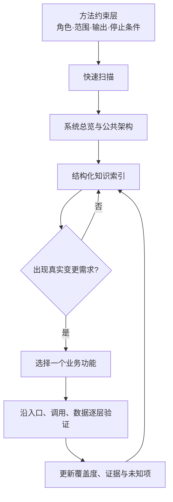
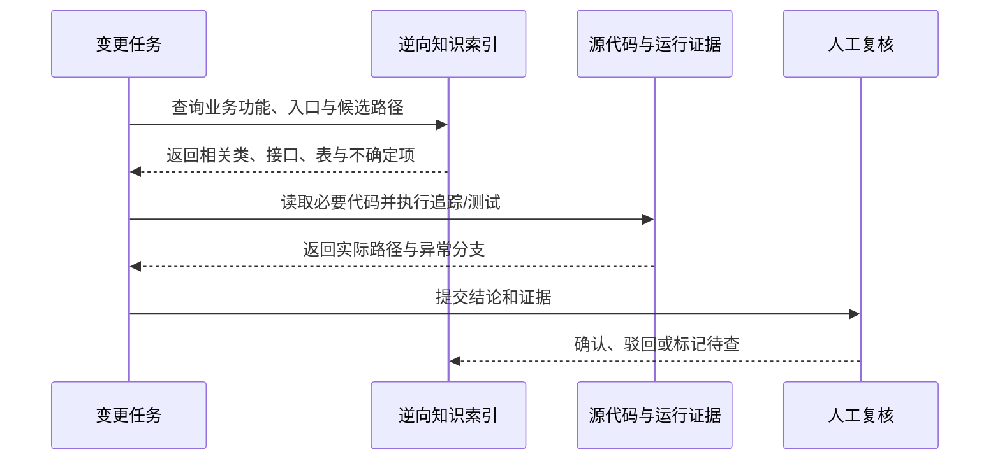
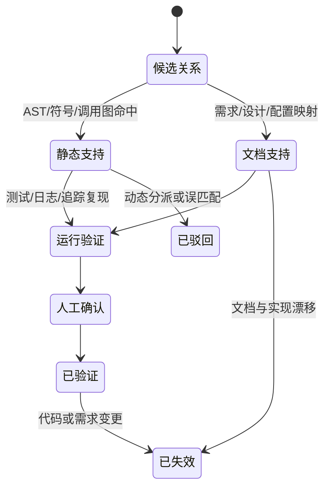

# 总结稿

[打开单页 HTML 总结](assets/bilibili-BV1hag36jEDs-summary.html)

## 核心结论

这段视频提出的不是传统意义上“把旧代码翻译成一份文档”，而是一套**给人和 AI 共用的分层逆向模型**：先用最小上下文恢复系统总览、公共技术架构和结构索引，再在真实需求出现时，沿“业务场景 → 功能 → 页面/入口 → 组件与接口 → 调用链 → 数据存储”按需下钻，最后用一致性检查把结果固化为可检索的知识资产。

这是一种值得试验的方法建议，而不是已经被视频证明的通用产品能力。画面展示了提示词、流程图和结构化产物示例，但没有给出真实项目的准确率、召回率、人工校正成本或对照实验。

## 为什么要把逆向产物做成“模型”

讲者把产物分成两类受众：一类文档给人阅读，另一类结构化模型给 AI 检索。其设想是让 AI 先查系统索引，定位相关类、依赖、调用关系和数据表，再打开少量细节代码，而不是每次从全库扫描开始（[01:25]–[02:12]）。

Everything 的索引类比在基本机制上成立：官方说明它会索引名称和路径，使已索引信息可以快速搜索（[Everything 官方索引说明](https://www.voidtools.com/en-us/support/everything/indexes/)）。但这只是检索思想的类比，不能据此推断代码知识图谱与 Everything 使用相同的数据结构或覆盖全部文件内容。

## 视频提出的三层工作流

1. **方法约束层**：先定义角色、扫描边界、最小上下文原则、输出格式与停止条件，减少 AI 无目的地遍历代码。
2. **逆向执行层**：从快速扫描开始，依次恢复总体架构、业务语义、数据模型、功能、API、映射关系，再建立索引并做一致性检查。
3. **结构化知识输出层**：沉淀系统总览、业务功能、核心类与依赖、接口、任务、数据库表及其关联，成为后续变更的导航入口。

视频进一步主张“先全局、后局部”：总览层在前期建立；单个功能的最深层逆向可等到新功能或变更需求真正到来时再做（[04:42]–[05:39]）。这样能避免一开始试图完整复原所有细节，但也意味着索引必须持续标注覆盖度、来源和未确认关系。

## 三种产物不能混为一谈

- **代码结构图谱**：函数、类、导入、继承、调用边等源码级关系。
- **业务到技术追踪链**：业务场景与页面、接口、服务、任务、数据表之间的对应关系。
- **按需深化的分层记忆**：记录哪些区域已验证、哪些只是候选路径，以及下一次变更应从哪里继续。

视频以 CodeGraph 解释第一层，并类比为 UML 类图的静态结构加序列图的动态调用关系（[02:56]–[03:43]）。核查日存在多个同名 CodeGraph/codegraph 仓库，视频没有给出组织名、URL 或版本，因此不能把某个仓库的功能、语言支持、许可证和基准直接归给它。至少一个同名项目确实公开了函数、类、导入与调用链图工具（[codegraph-ai/CodeGraph](https://github.com/codegraph-ai/CodeGraph)），但静态调用图不等于完整的运行时序列图，也不会自动恢复跨系统业务语义。

## “全调用链穿透”还缺什么

讲者认为，仅有源码结构不足以恢复“业务场景 → 功能 → 组件/接口 → 数据库表”的完整链条，还要补充需求、用户场景和数据库设计资料（[04:19]–[04:34]）。研究支持需求到代码追踪是一个独立问题，且需求资料质量会影响恢复效果；不过“必须拥有这三类文档”不是无例外定律，实际还可能依赖测试、日志、配置、路由、运行时追踪和人工领域知识（[需求到代码追踪实证研究](https://doi.org/10.1016/j.jksuci.2024.102118)、[需求质量与追踪恢复研究](https://arxiv.org/abs/2606.11834)）。

## 高风险数字：只能当作待复现实验

- 视频转述“约节省 50% token”（[02:21]）。某一同名项目在特定模型、三轮任务和七个仓库的修订基准中报告平均 56%，但另一真实集成测试反而出现总 token 增加；因此它不是通用收益（[修订基准](https://github.com/colbymchenry/codegraph/blob/main/docs/benchmarks/residual-context-occupancy.md)、[OpenCodeReview 集成测试](https://github.com/colbymchenry/codegraph/issues/1056)）。
- 视频转述“处理时间提效 30% 以上”（[02:28]）。不同一手试验分别出现约 46%、20% 和 1.7% 的时间变化，且“提效”未定义为壁钟时间、吞吐还是人工工时，所以该数字未获普遍确认。

可信的验证方式不是引用百分比，而是在自己的代码库上固定模型、版本、任务、缓存和工具权限，比较有无逆向索引时的答案正确性、覆盖率、总 token、工具调用、壁钟时间与人工复核成本。

## 观众讨论与补充

仅抓取到平台报告的 3 条热门顶层评论，均为 0 赞、0 回复；嵌套回复未收集，当前可访问弹幕为 0。这一小样本不能代表总体意见，也不能把“没有弹幕”解释成观众无反应。

其中两条只是 AI 笔记账号的召唤/推广互动，未进入内容补充。唯一较相关的评论用“缓存命中、索引优化、模型即索引”调侃 token 节省。它适合作为验证问题：结构化调用链知识是否真的减少重复检索？但这仍是观众类比，不是性能证据。

## 实操清单

- 为每条关系保留来源：静态分析、运行时追踪、文档映射、AI 推断或人工确认。
- 对“业务 → 技术”链设置验证门：入口可复现、调用路径可追踪、读写表可确认、异常分支有记录。
- 把“未知、候选、已验证、已失效”作为一等状态，避免把 AI 推断固化成事实。
- 先在一个高频变更功能上做小型 A/B，而不是一开始逆向全库。
- 报告模型与工具版本、仓库 commit、任务集、缓存策略和人工复核规则，避免不可复现的百分比。

## 一句话判断

视频最有价值的地方是把逆向工程从“一次性文档生成”改造成“可检索、分层、按需深化并持续验证的知识基础设施”；但它展示的是方法框架与样例，效果必须在具体项目上通过可复现评测证明。

# 辅助理解

## 辅助理解：从代码结构到业务追踪

源码图谱回答“谁依赖谁、谁调用谁”；业务追踪链回答“用户要做什么、从哪个入口进入、经过哪些实现、最终读写什么”；分层记忆回答“当前知道到什么程度、哪些关系已经验证”。

Frame 9 展示了业务功能、接口、任务与层级目录被组织到同一视图的示例。它能说明目标产物长什么样，但截图本身不能证明映射自动生成、路径完整或内容正确。

## 分层逆向：先建立导航，再按需求下钻

Frame 4 是全片最重要的流程画面：它把方法约束、逆向执行和结构化输出分开。关键不是扫描步骤越多越好，而是每一步都有输入、输出、证据等级和停止条件。

## 最小上下文不是“少看代码”，而是“先缩小候选范围”

Frame 2 展示了“高效逆向扫描器”和“最小上下文快速扫描”的提示结构。它是一份作者工作流示例，不等于已有跨项目基准证明该提示能稳定节省 token 或时间。

## 证据等级：不要让推断悄悄升级成事实

建议每条边至少保存：来源工件、仓库 commit、生成工具/模型版本、时间、置信度、验证状态与反例。这样“全调用链”才是可审计的追踪网络，而不只是一张漂亮图。

## 如何验证 50% token 与 30% 时间主张

只比较 token 不够：索引可能减少文件读取，却增加常驻上下文；只比较时间也不够：更快但漏掉动态调用并无价值。必须把正确性和人工复核成本放在效率指标之前。

## CodeGraph 名称与能力边界

核查日存在多个同名 CodeGraph/codegraph 项目。视频未给出唯一仓库，因此可确认的只有“公开生态中确实存在代码语义图、调用图和 AI 检索工具”这一类别事实，不能把某个仓库的具体基准或支持语言自动归给视频。静态代码图也不等同于完整 UML 序列图：反射、动态分派、配置驱动路由和跨服务调用往往需要运行证据补齐。

## 外部事实核验

### 声明 1（01:37）

- 视频陈述：Everything 对电脑上的文件建立索引，因此能快速搜索文件。
- 核验状态：已确认
- 核验结果：确认核心描述。Everything 官方说明它是 Windows 文件名搜索引擎，首次运行时会为本地 NTFS 卷建立索引；索引始终包含名称和路径，其他属性可选，已索引信息可以即时搜索。边界是：视频只把它用作代码模型的检索类比，不能由此推断 CodeGraph 或讲者模型采用与 Everything 相同的内部数据结构；Everything 默认也不等于对所有文件内容做全文索引。
- 检索日期：2026-08-20
- 来源：
  - [Everything — Indexes](https://www.voidtools.com/en-us/support/everything/indexes/)（primary）
  - [Using Everything](https://www.voidtools.com/support/everything/using_everything/)（primary）

### 声明 2（02:15）

- 视频陈述：CodeGraph 是网上可见的开源项目，可用于对源代码做逆向建模。
- 核验状态：部分确认
- 核验结果：只能部分确认项目类别，无法确认视频具体指哪个同名仓库。核查日存在多个名为 CodeGraph/codegraph 的公开仓库；例如 codegraph-ai/CodeGraph 自述会从代码库构建函数、类、导入和调用链的语义图，并通过 MCP 工具供 AI 使用。另一个 colbymchenry/codegraph 也主打预索引代码知识图谱。由于视频未给出组织名、URL、版本或截图中可辨识的仓库标识，不能把任一仓库的语言支持、许可证、基准或功能清单直接归给视频所称项目。
- 检索日期：2026-08-20
- 来源：
  - [codegraph-ai/CodeGraph](https://github.com/codegraph-ai/CodeGraph)（primary）
  - [colbymchenry/codegraph](https://github.com/colbymchenry/codegraph)（primary）

### 声明 3（02:21）

- 视频陈述：网上他人的经验和测算显示，整个 token 消耗量可以节约 50%。
- 核验状态：部分确认
- 核验结果：存在量级相近的一手项目基准，但不能确认它就是视频引用的测算，也不能外推为通用结果。colbymchenry/codegraph 的 2026-08-05 修订基准在特定 Sonnet、三轮、七仓库 A/B 场景中报告平均节约 56% token，各仓库约 41%–65%；文档同时承认此前因只读取最后一轮 usage 而误报，并强调不同实验制度不可混引。另一个真实集成基准甚至报告加入 CodeGraph 后总 token 从 79.5M 增至 89.6M。故“约 50%”只能写成特定项目、模型、问题、仓库、工具策略和计量口径下的结果，不能写成逆向建模的稳定收益。
- 检索日期：2026-08-20
- 来源：
  - [Residual context occupancy — corrected CodeGraph benchmark](https://github.com/colbymchenry/codegraph/blob/main/docs/benchmarks/residual-context-occupancy.md)（primary）
  - [OpenCodeReview integration benchmark — CodeGraph issue #1056](https://github.com/colbymchenry/codegraph/issues/1056)（primary）

### 声明 4（02:28）

- 视频陈述：AI 分析处理的时间可以提效 30% 以上。
- 核验状态：未验证
- 核验结果：未确认可普遍达到 30% 以上，且“提效”口径不明确。一手项目资料显示结果高度依赖实验：colbymchenry/codegraph 的项目说明曾报告某套七仓库 A/B 试验平均节省 46% 时间；其另一套三轮 Sonnet 试验平均仅节省 20%，各仓库也有差异；OpenCodeReview 在 200 个 PR 的集成基准中只观察到 1.7% wall-clock 缩短。视频没有给出具体仓库、模型、任务、硬件、缓存、并发和“处理时间”定义，因此 30%+ 应保留为未定位来源的项目经验数字，而非产品保证。
- 检索日期：2026-08-20
- 来源：
  - [colbymchenry/codegraph project instructions and benchmark references](https://github.com/colbymchenry/codegraph/blob/main/CLAUDE.md)（primary）
  - [Residual context occupancy — corrected CodeGraph benchmark](https://github.com/colbymchenry/codegraph/blob/main/docs/benchmarks/residual-context-occupancy.md)（primary）
  - [OpenCodeReview integration benchmark — CodeGraph issue #1056](https://github.com/colbymchenry/codegraph/issues/1056)（primary）

### 声明 5（02:56）

- 视频陈述：CodeGraph 分析类、关系、属性和对象方法调用约束，并融合成知识图谱。
- 核验状态：部分确认
- 核验结果：对至少一个可能的同名项目部分确认。codegraph-ai/CodeGraph 官方仓库明确描述函数、类、导入和调用链的语义图，并提供符号搜索、调用者/被调用者、调用图、依赖图与图遍历工具；工具文档也展示类/函数节点与 Calls、Contains 等边的遍历。它支持的是具体解析器、语言和静态/混合分析所能恢复的关系，不保证动态分派、反射、运行时生成代码或跨系统业务语义全部准确。由于视频没有唯一标识仓库，不能断言该功能清单必然属于讲者使用的那个 CodeGraph。
- 检索日期：2026-08-20
- 来源：
  - [codegraph-ai/CodeGraph](https://github.com/codegraph-ai/CodeGraph)（primary）
  - [CodeGraph Tool Calling Guide](https://github.com/codegraph-ai/CodeGraph/blob/main/docs/tool-calling-guide.md)（primary）

### 声明 6（03:16）

- 视频陈述：可把图谱简单理解为把 UML 类图中的关联、依赖、继承，与序列图中的动态调用融合起来。
- 核验状态：部分确认
- 核验结果：这是有帮助但不严格等价的解释性类比。OMG UML 2.5.1 规范确实包含结构分类器/类关系与交互/消息序列等建模概念；CodeGraph 文档也提供类、继承、导入、调用者/被调用者和调用图。但静态代码图的 call edges 通常是从代码分析恢复的可能调用关系，不自动等于某个具体运行场景的 UML Sequence Diagram；序列图还涉及参与者、生命线、消息顺序和交互片段。应写成“帮助理解的类比”，不能写成 CodeGraph 已完整恢复标准 UML 类图和序列图。
- 检索日期：2026-08-20
- 来源：
  - [OMG Unified Modeling Language Specification 2.5.1](https://www.omg.org/spec/UML/)（primary）
  - [CodeGraph Tool Calling Guide](https://github.com/codegraph-ai/CodeGraph/blob/main/docs/tool-calling-guide.md)（primary）

### 声明 7（04:19）

- 视频陈述：要逆向出业务到技术实现的完整调用链，除源代码外还需要补充业务需求、用户场景和数据库设计文档。
- 核验状态：部分确认
- 核验结果：研究支持“多种工件有助于需求到代码追踪”，但不支持“任何项目都必需这三类文档”的无例外定律。需求到代码追踪研究把 requirements 与 code artifacts 的连接视为独立恢复任务，并指出该领域缺乏统一基准；相关实证研究还显示需求文本质量与是否包含实现细节会影响不同追踪方法的表现。这支持讲者的实践判断：仅靠结构化源码图难以自动获得完整业务语义，额外需求与设计资料往往能提供对齐线索。可是具体所需材料取决于系统、框架、日志/测试/配置可用性和目标粒度；“数据库设计文档”也不适用于所有系统。
- 检索日期：2026-08-20
- 来源：
  - [An empirical study on the state-of-the-art methods for requirement-to-code traceability link recovery](https://doi.org/10.1016/j.jksuci.2024.102118)（primary）
  - [How Requirements Quality Makes (or Breaks) Traceability Link Recovery](https://arxiv.org/abs/2606.11834)（primary）

# Data

## 增强转写稿

# 校正字幕

- Video ID: `BV1hag36jEDs`
- 领域：source-code reverse engineering, knowledge graphs, architecture recovery, traceability, and AI-assisted software maintenance
- 编辑边界：保留全部原始片段、时间戳及顺序；只修正高置信专名、技术术语和明显 ASR 损坏。无法可靠还原的口语残片保持原样，不以推断补写。
- 证据边界：字幕中的数字、历史叙述、产品能力、性能指标和未来判断仍是视频陈述；校正不等于事实核验。

## 术语表

- 源代码逆向建模：从既有代码恢复供人或 AI 使用的文档、模型和调用链。
- CodeGraph：视频所称的开源代码图谱项目；具体仓库、版本和指标需要外部核验。
- Everything：Windows 文件索引/搜索工具，被用作“先查索引、再查原文件”的类比。
- UML：视频将类图的静态关系与序列图的动态调用关系用于解释知识图谱。
- 分层逆向：先恢复系统总览与公共技术架构，再按需求深入单个功能的完整调用链。

## 逐字稿
[00:00] Hello，大家好，我是人月聊 IT。
[00:03] 今天準備接著聊一下已有的軟件項目的逆向建模和逆向工程
[00:08] 因為在今年年初我錄視頻的時候就講到了
[00:11] 我其實今年核心的研究的重點就兩個
[00:14] 一個就是本體建模一個就是逆向工程
[00:18] 那麼對於逆向工程實際我今天主要就講兩個問題
[00:22] 第一個就是我們為什麼要去做逆向建模這個工作
[00:25] 第二個就是逆向建模的工作
[00:28] 究竟應該怎麼樣去做
[00:30] 第一個為什麼要做逆向建模
[00:32] 實際在我前年的時候我已經用AI輔助工具去做了我們已有項目的逆向工程
[00:38] 包括逆向出完整的需求文档、用户操作手册等文档。
[00:44] 但是從今年開始我做的逆向工程思路變了
[00:48] 因為逆向工程有兩個作用
[00:50] 第一個就是逆向一個文檔給人看
[00:53] 第二個就是我需要逆向一套模型給AI看
[00:57] 為什麼要逆向一套模型給AI看
[01:00] 就是方便AI快速的去理解我已有的源代码項目
[01:05] 方便AI去做新功能方便AI去做變更和影響分析
[01:11] 或者方便 AI 把已有的、类似 Python 或 PHP 写的项目
[01:17] 复刻或者转化为 Java 的微服务项目。
[01:21] 這一些就是你逆向模型最重要的一個作用
[01:25] 有了這個逆向模型以後起到兩個關鍵的作用
[01:29] 就第一個
[01:30] 它在整個後續做新功能或者是變更影響分析的時候
[01:35] 它的速度快了
[01:37] 类似于在自己的电脑上安装 Everything 一样的道理。
[01:42] 它对电脑上的文件都建立了索引。
[01:47] 所以它很快速的就能夠幫我搜索到文件
[01:49] 那麼逆向完的這麼一個逆向模型
[01:52] 你就可以理解成是你所有源代码文件的這麼一個元模型
[01:57] 它在問題分析和解決的時候它可以先搜索這個逆向模型
[02:00] 然後再去找細節的代碼文件
[02:03] 那速度自然而然就快了
[02:05] 第二個就是什麼呢消耗的token是更少了
[02:09] 因為我每次都不需要去做全量代码的閱讀和掃描了
[02:12] 因为每次都不需要做全量代码的阅读和扫描了。
[02:15] 包括類似於CodeGraph這種開源項目
[02:18] 网上看别人分享的经验和测算，
[02:21] 整個token的消耗量可以節約50%
[02:24] 整個
[02:25] AI分析
[02:27] 處理的時間
[02:28] 可以提效30%以上
[02:31] 這個時候逆向工程和逆向建模的作用
[02:33] 就真正的出來了
[02:35] 第二個問題就是
[02:37] 如何去做
[02:39] 相應的逆向建模
[02:41] 因為昨天我寫了一篇公眾號文章以後就有朋友在留言問
[02:44] 我現在做的逆向建模的提示詞
[02:47] 跟類似於CodeGraph這麼一些開源項目
[02:50] 核心的一些差異或者是區別在哪裡
[02:53] 所以大家可以先看一下CodeGraph做了一個什麼事情
[02:56] CodeGraph仍然是基於你的源代码項目去進行了逆向的建模
[03:02] 它分析的核心是你已有的對象的類
[03:05] 關係屬性
[03:06] 包括對象裡面方法調用之間的關係約束
[03:12] 這樣的話把這些東西融合起來形成了一個完整的知識圖譜
[03:16] 如果再简单理解，可以理解为把传统 UML 设计里的
[03:21] 涉及到的类、
[03:23] 關係圖包括類之間的關聯依賴關係繼承關係
[03:26] 以及实现核心业务逻辑的序列图内容，
[03:30] 序列圖的核心的內容
[03:32] 全部融合到了一起
[03:34] 形成了一個知識圖譜
[03:36] 所以說這個知識圖譜裡面既有類之間的靜態結構關係
[03:40] 又有類之間的方法動態調用的行為關係
[03:43] 這樣形成了一個知識圖譜但是為什麼
[03:46] CodeGraph實際的逆向
[03:48] 沒辦法解決我需要的完整的問題
[03:51] 我的問題其實包括兩個方面
[03:53] 第一個方面就是我需要通過逆向以後
[03:56] 真正的實現
[03:58] 前端的從業務場景到業務功能
[04:02] 從業務功能到組件對象接口
[04:05] 從組件對象
[04:07] 到我底層的數據庫表之間
[04:09] 完整
[04:10] 穿透的
[04:11] 這麼一個業務調用或者叫技術實現的調用鏈條
[04:16] 對於CodeGraph它其實是沒辦法完整的實現的
[04:19] 包括我自己在做逆向的過程中也發現我要實現這個完整的調用鏈條的逆向
[04:25] 我還需要去除了源代码以外
[04:27] 補充相應的業務需求用戶場景的文檔補充我核心的一些數據庫設計的文檔
[04:34] 這樣的話AI才能夠逆向出完完整整的調用鏈
[04:38] 第二個點就是我希望整個逆向的過程
[04:42] 它是一種分層記憶和分層逆向的過程
[04:46] 我的第一層的逆向核心是建立總的架構
[04:50] 這個總的架構就代表你要回答整個系統裡面有哪一些業務功能
[04:54] 每个业务功能涉及到哪些核心类、相关类，
[04:58] 又依赖哪些对象类，这些对象类最终操作底层的哪些数据库表。
[05:04] 我首先要去逆向這些內容包括你整個源代码項目它有哪一些公共的技術組件
[05:10] 它關鍵的分層的底層的技術架構是怎麼樣的
[05:14] 我把這些東西逆向清楚以後我再去做單個功能的逆向
[05:20] 而單個功能的逆向我們完全可以等到當你真的要去做某一個新功能或者是需求變更的時候
[05:26] 你再去做最最下層的這個逆向
[05:29] 這樣的話就是說什麼了我們既能夠总览整個源代码項目的全局
[05:35] 又能夠從底層深入的貫徹到最底層
[05:39] 細化到每個功能詳細的實現
[05:42] 包括功能菜单、界面布局、实际调用和依赖的对象，
[05:49] 最終落地存儲的數據庫
[05:52] 這種構建出來的完整的逆向工程才是我們真正需要的逆向工程
[05:58] 好了如果大家感興趣具體的一些細節可以參考一下
[06:03] 我前天發的一篇公眾號的文章有詳細的一些關鍵的描述
[06:07] 好了今天的關於逆向工程簡單的分享就到這裡
[06:11] 再見

## 原始转写稿

[00:00] hello 大家好 我是任越來提
[00:03] 今天準備接著聊一下已有的軟件項目的逆向建模和逆向工程
[00:08] 因為在今年年初我錄視頻的時候就講到了
[00:11] 我其實今年核心的研究的重點就兩個
[00:14] 一個就是本體建模一個就是逆向工程
[00:18] 那麼對於逆向工程實際我今天主要就講兩個問題
[00:22] 第一個就是我們為什麼要去做逆向建模這個工作
[00:25] 第二個就是逆向建模的工作
[00:28] 究竟應該怎麼樣去做
[00:30] 第一個為什麼要做逆向建模
[00:32] 實際在我前年的時候我已經用AI輔助工具去做了我們已有項目的逆向工程
[00:38] 包括逆向出完整的類似於需求文檔用副操作手冊這些文檔
[00:44] 但是從今年開始我做的逆向工程思路變了
[00:48] 因為逆向工程有兩個作用
[00:50] 第一個就是逆向一個文檔給人看
[00:53] 第二個就是我需要逆向一套模型給AI看
[00:57] 為什麼要逆向一套模型給AI看
[01:00] 就是方便AI快速的去理解我已有的原代碼項目
[01:05] 方便AI去做新功能方便AI去做變更和影響分析
[01:11] 或者是方便AI把我已有的一個類似於Pansel或者是PHP寫的項目
[01:17] 把它復刻或者是轉化為我的java的微幅項目
[01:21] 這一些就是你逆向模型最重要的一個作用
[01:25] 有了這個逆向模型以後起到兩個關鍵的作用
[01:29] 就第一個
[01:30] 它在整個後續做新功能或者是變更影響分析的時候
[01:35] 它的速度快了
[01:37] 類似於我們在我們自己的電腦上面裝了一個Averyson一樣的道理
[01:42] 它對我所有的電腦上面的文件都建了一個二級所以
[01:47] 所以它很快速的就能夠幫我搜索到文件
[01:49] 那麼逆向完的這麼一個逆向模型
[01:52] 你就可以理解成是你所有原代碼文件的這麼一個原模型
[01:57] 它在問題分析和解決的時候它可以先搜索這個逆向模型
[02:00] 然後再去找細節的代碼文件
[02:03] 那速度自然而然就快了
[02:05] 第二個就是什麼呢消耗的token是更少了
[02:09] 因為我每次都不需要去做權量代碼的閱讀和掃描了
[02:12] 自然而然我消耗的token就少了
[02:15] 包括類似於CodeGraph這種開源項目
[02:18] 往上看實際別人分享的經驗和車算來看
[02:21] 整個token的消耗量可以節約50%
[02:24] 整個
[02:25] AI分析
[02:27] 處理的時間
[02:28] 可以提效30%以上
[02:31] 這個時候逆向工程和逆向建模的作用
[02:33] 就真正的出來了
[02:35] 第二個問題就是
[02:37] 如何去做
[02:39] 相應的逆向建模
[02:41] 因為昨天我寫了一篇公眾號文章以後就有朋友在留言問
[02:44] 我現在做的逆向建模的提示詞
[02:47] 跟類似於CodeGraph這麼一些開源項目
[02:50] 核心的一些差異或者是區別在哪裡
[02:53] 所以大家可以先看一下CodeGraph做了一個什麼事情
[02:56] CodeGraph仍然是基於你的原代碼項目去進行了逆向的建模
[03:02] 它分析的核心是你已有的對象的類
[03:05] 關係屬性
[03:06] 包括對象裡面方法調用之間的關係約束
[03:12] 這樣的話把這些東西揉合起來形成了一個完整的知識圖譜
[03:16] 如果再簡單的理解你可以理解為將我們傳統的UML設計裡面
[03:21] 你設計到的類的
[03:23] 關係圖包括類之間的關聯依賴關係繼承關係
[03:26] 然後我們去實現我核心的業務邏輯化的
[03:30] 序列圖的核心的內容
[03:32] 全部揉合到了一起
[03:34] 形成了一個知識圖譜
[03:36] 所以說這個知識圖譜裡面既有類之間的靜態結構關係
[03:40] 又有類之間的方法動態調用的行為關係
[03:43] 這樣形成了一個知識圖譜但是為什麼
[03:46] CodeGraph實際的逆向
[03:48] 沒辦法解決我需要的完整的問題
[03:51] 我的問題其實包括兩個方面
[03:53] 第一個方面就是我需要通過逆向以後
[03:56] 真正的實現
[03:58] 前端的從業務場景到業務功能
[04:02] 從業務功能到組件對象接口
[04:05] 從組件對象
[04:07] 到我底層的數據庫表之間
[04:09] 完整
[04:10] 穿透的
[04:11] 這麼一個業務調用或者叫技術實現的調用鏈條
[04:16] 對於CodeGraph它其實是沒辦法完整的實現的
[04:19] 包括我自己在做逆向的過程中也發現我要實現這個完整的調用鏈條的逆向
[04:25] 我還需要去除了原代碼以外
[04:27] 補充相應的業務需求用戶場景的文檔補充我核心的一些數據庫設計的文檔
[04:34] 這樣的話AI才能夠逆向出完完整整的調用鏈
[04:38] 第二個點就是我希望整個逆向的過程
[04:42] 它是一種分層記憶和分層逆向的過程
[04:46] 我的第一層的逆向核心是建立總的架構
[04:50] 這個總的架構就代表你要回答整個系統裡面有哪一些業務功能
[04:54] 每個業務功能設計到哪一些核心的類向類
[04:58] 又依賴了哪一些對象類這些對象類最終又操作了你底層的哪些數據庫
[05:04] 我首先要去逆向這些內容包括你整個原代碼項目它有哪一些公共的技術組件
[05:10] 它關鍵的分層的底層的技術架構是怎麼樣的
[05:14] 我把這些東西逆向清除以後我再去做單個功能的逆向
[05:20] 而單個功能的逆向我們完全可以等到當你真的要去做某一個新功能或者是需求變更的時候
[05:26] 你再去做最最下層的這個逆向
[05:29] 這樣的話就是說什麼了我們既能夠總染整個原代碼項目的全局
[05:35] 又能夠從底層深入的貫徹到最底層
[05:39] 細化到每個功能詳細的實現
[05:42] 包括它的功能菜單介面的布局實際的調用的世界依賴的對象
[05:49] 最終落地存儲的數據庫
[05:52] 這種構建出來的完整的逆向工程才是我們真正需要的逆向工程
[05:58] 好了如果大家感興趣具體的一些細節可以參考一下
[06:03] 我前天發的一篇公眾號的文章有詳細的一些關鍵的描述
[06:07] 好了今天的關於逆向工程簡單的分享就到這裡
[06:11] 再見

## 原始关键帧

### 关键帧 1

### 关键帧 2

### 关键帧 3

### 关键帧 4

### 关键帧 5

### 关键帧 6

### 关键帧 7

### 关键帧 8

### 关键帧 9

### 关键帧 10

## 补充原始数据

- [bilibili-BV1hag36jEDs-comments.jsonl](assets/bilibili-BV1hag36jEDs-comments.jsonl)
- [bilibili-BV1hag36jEDs-comment-candidates.json](assets/bilibili-BV1hag36jEDs-comment-candidates.json)
- [bilibili-BV1hag36jEDs-danmaku.jsonl](assets/bilibili-BV1hag36jEDs-danmaku.jsonl)
- [bilibili-BV1hag36jEDs-danmaku-analysis.json](assets/bilibili-BV1hag36jEDs-danmaku-analysis.json)
- [bilibili-BV1hag36jEDs-visual-summary.png](assets/bilibili-BV1hag36jEDs-visual-summary.png)
- [bilibili-BV1hag36jEDs-summary.html](assets/bilibili-BV1hag36jEDs-summary.html)
