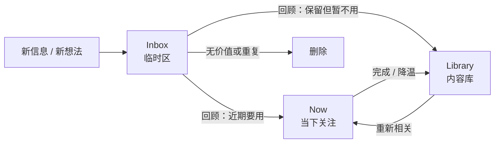
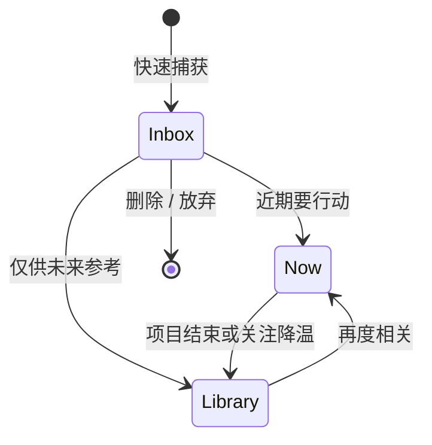

# 总结稿

[打开单页 HTML 总结](assets/bilibili-BV15MgG6QEz4-summary.html)

## 核心结论

INL 是讲者根据个人知识管理实践总结出的组织框架：把信息分成 **Inbox（临时区）—Now（当下关注）—Library（内容库）**。它试图解决的不是“如何设计一棵完美目录树”，而是如何让当前注意力与长期资料分开，同时给来不及归档的信息保留缓冲区。[00:08–00:18]

这是一套作者经验与方法建议，不是经过对照实验验证的通用定律。视频中“更快找到重点”“减少整理量”等效果应理解为讲者的实践判断。[00:18–00:23]

## 三个区域分别解决什么

| 区域 | 角色 | 进入条件 | 退出条件 |
|---|---|---|---|
| Inbox | 低摩擦捕获 | 现在没有精力分类，或信息尚不确定 | 定期回顾后移入 Now、Library 或删除 |
| Now | 注意力工作台 | 当前项目、近期会反复使用、当下最重要 | 不再活跃时移回 Library |
| Library | 长期资料库 | 有保存价值但当前不需要持续暴露 | 再度相关时提升到 Now |

讲者先介绍 Now 与 Library：从全部资料中抽出当前关注内容，避免它们与历史积累混在同一视野里。[00:34–01:06] 随后加入 Inbox，允许在疲惫或忙乱时先捕获、后整理，从而给二分结构增加弹性。[03:29–05:14]

## INL 不是固定目录，而是一种递归视角

视频强调，这三个区域可以出现在多个层级：

- **知识库层级**：把常用笔记放入 Now，其余放入 Library。[00:41–01:06]
- **文件夹层级**：在一个庞大分类中突出常用子类，折叠其余内容。[01:09–01:45]
- **单篇笔记层级**：把一两句提炼结论作为 Now，把完整论证放在 Library/批注中。[01:51–03:25]
- **捕获层级**：手机备忘录、知识库入口或某篇笔记内部都可以设置 Inbox。[04:22–05:05]
- **其他场景**：讲者还把同一思路用于浏览器书签，并用图书馆的热门区、书架和还书车作类比。[09:51–10:33]

因此，INL 更接近“当前注意力 / 非当前资料 / 待处理输入”的标记法，而不是要求所有工具采用相同文件夹结构。

## 可执行的最小版本

1. 建立一个唯一、明显的 Inbox，先确保捕获动作足够快。
2. 建立一个容量受限的 Now，只放近期真正会使用的内容。
3. 其余有保留价值的材料进入 Library，不要求它们持续出现在视野中。
4. 设定固定回顾触发器，例如每周一次，处理 Inbox 并把过期内容从 Now 降级。
5. 当某个文件夹或单篇笔记再次膨胀时，局部重复同一分区，而不是无限增加全局目录层级。

第 4 步与 Now 的容量限制是 AI 辅助补充的实施护栏：视频强调“以后一起整理”，但没有给出统一周期或数量上限。

## 适用边界

- **Inbox 不是永久仓库**：缺少回顾触发器时，它只会把混乱推迟。
- **Now 不是“所有重要内容”**：它代表当前注意力；容量过大就会重新失去聚焦。
- **Library 仍需要可检索性**：结构简化不等于可以忽视命名、搜索与备份。
- **嵌套要克制**：视频主张在不同层级递归使用，但层级过多本身也会降低易用性。[05:28–06:20]
- **效果取决于执行习惯与任务类型**：本视频没有提供对照实验或长期量化数据。

## 观众讨论与补充

> 以下是观众意见，不是视频事实或效果证明。评论样本为未登录状态下的热门顶层评论：平台报告 66 条、抓取 33 条、候选 20 条，不含嵌套回复；弹幕仅取得当前可访问的 4/14 条，不能代表整体观众。

- 一位 Obsidian 用户考虑把 INL 与“单文件夹 + 标签 + 多层索引 + Dataview”组合，但担心重点区需要手动维护。这直接指出了框架的持续维护成本。
- 有观众把偏离主线的零碎内容先放 Inbox，主观上认为能减少当场决定归档位置的负担。
- 另一种路线是弱化层级浏览，改用语义搜索；这提示 INL 不是唯一的信息发现方式。
- 跨工具实践（例如用单人群收集链接）说明这套思路不依赖某个软件，但工具可靠性仍会影响实际体验。

弹幕只有 4 条，其中两条规范化为“很不错”；样本过小，不能据此推断总体情绪。03:00–03:30 是唯一相对密集时间段（2 条），但聚合数据无法把具体文本与时间精确对应。

## 核验状态

事实核查模式为 `auto`，没有提取到必须外部验证的重要客观或时效性主张。讲者的“12 年经验”、方法原创性及效果均保留为个人自述；未将注意力类比或观众反馈升级为科学证据。

# 辅助理解

## 一张图理解 INL

关键不是一次性把所有东西分对，而是把两种动作拆开：**捕获时降低摩擦，回顾时再做判断**。Now 与 Library 管理注意力，Inbox 管理当下精力不足带来的延迟决策。[03:29–05:14]

## 第一层：把“现在要看什么”从“拥有过什么”中分离

讲者的起点是一个简单问题：当下使用的笔记与所有历史笔记混在一起，视野就会被积累淹没。Now 只暴露当前关注内容，Library 承载其余资料。[00:34–01:06]

这张示例图把笔记分成 `Now Project` 与 `Library`。它证明的是视频如何表达这套框架，而不是证明该框架普遍提高效率。

## 第二层：同一视角可以嵌套，但不等于无限加目录

视频把 NL 视角递归到文件夹、分类和单篇笔记：每到一个层级，都把少数当前重点显露出来，把完整材料留在后方。[01:09–03:25]

单篇笔记示例中，核心原则在表层，原因和关联留在下一层。这里的价值在于“摘要与证据分层”，而不是强制每篇笔记采用同一种模板。

可以用三个问题判断是否需要局部嵌套：

1. 打开这一层时，最常执行的动作是什么？
2. 哪些内容必须第一眼可见？
3. 哪些内容只需可检索，不必持续暴露？

如果继续嵌套只是在复制目录，而没有改变注意力入口，就不应增加一层。

## 第三层：Inbox 是缓冲，不是归宿

讲者用玄关类比 Inbox：疲惫时先把东西放在一个可控位置，等精力恢复后再归位。[03:38–04:20] 对知识库而言，手机备忘录、统一收件入口、某个项目下的临时段落都可以承担这一角色。[04:22–05:05]

实践时应额外加入两个护栏：

- **回顾触发器**：例如每周一次，而不是模糊地“以后再整理”。
- **Now 容量限制**：只保留真正活跃的少数事项；否则 Now 会退化为第二个 Library。

这两个护栏是 AI 辅助实施建议，不是视频给出的统一规则。

## 从“重要/不重要”改写为“当前/非当前”

帧 8 把 Key/Minor、Now/Library 与“常用/不常用”联系起来。更稳妥的理解是：**Library 里的内容并非不重要，只是当前不需要占据注意力**。这样能避免把长期资料误判为低价值，也能让内容在 Now 与 Library 之间双向流动。[07:51–08:24]

## 何时适合，何时不适合

| 情况 | INL 可能提供的帮助 | 需要警惕 |
|---|---|---|
| 输入很多、当场没精力分类 | Inbox 将捕获与归档拆开 | 不回顾会形成堆积 |
| 历史资料很多、当前任务很少 | Now 缩小工作视野 | Now 过大时效果消失 |
| 同一资料会周期性重新活跃 | Now ↔ Library 可逆流转 | 迁移规则过复杂会增加维护成本 |
| 依赖搜索而非浏览结构 | 可保留 Inbox/Now，Library 主要靠检索 | 不必为了框架强建层级 |
| 强合规、强审计的资料库 | 可将 Now 作为工作视图 | 正式分类、权限和留存规则不能被替代 |

## 观众材料怎样补充边界

热门评论候选中，有 Obsidian 用户希望把 INL 加到标签、索引和 Dataview 工作流中，同时担心手动维护；也有人建议直接使用语义搜索。这两种反馈共同提醒：**注意力视图和检索能力可以组合，但都会带来维护、可靠性或隐私成本**。

这些只是经过匿名化的观众个人经验/建议。评论为热门排序候选（抓取 33 条、候选 20 条），弹幕只取得 4 条当前可访问记录；不能把它们当成代表性调查或视频结论的证明。

## 最小自测

- 我是否有一个明确且唯一的捕获入口？
- Inbox 是否有下一次明确回顾时间？
- Now 中的每项内容是否会在近期实际使用？
- Library 的内容是否仍能通过命名、链接或搜索找回？
- 我是在减少视野噪声，还是只把同一套目录复制到了更多层级？

## 外部事实核验

> 外部事实核验已完成（2026-08-21），未发现值得独立核验的客观声明。

# Data

## 增强转写稿

[00:00] 你是不是有几百个笔记，积灰了都懒得打开
[00:03] 今天我们要介绍一个方法
[00:04] 可以让你不怎么整理就能快速找到重点
[00:06] 我们只需要三个字母
[00:08] I、N、L
[00:09] i是Inbox
[00:11] 也就是临时区
[00:12] n是Now
[00:13] 也就是当下关注
[00:14] l是Library
[00:15] 也就是内容库
[00:17] 这看起来平平无奇
[00:18] 但它是我在笔记领域12年来最重要的一个发现
[00:22] 那下面我们直接用它
[00:23] 在用的过程中你会慢慢体会到它的优势
[00:28] 我们这个部分会先用思维导图做展示方便理解
[00:31] 然后再引用到Notion、Obsidian
[00:33] 备忘录这些常用软件里
[00:34] 首先笔记为什么不好用
[00:36] 就是你当下用的笔记和所有笔记全部混在一起了
[00:40] 那怎么办呢
[00:40] 就分开
[00:41] 我们建两个文件夹
[00:43] 就是Library和Now
[00:44] Library就放你的所有笔记
[00:47] 然后你从里面抽出你当前关注的笔记
[00:51] 放到Now里
[00:52] 那现在你工作时
[00:53] 只要关注Now至一个文件夹
[00:56] 里面内容上而且全都是你当前的重点
[00:59] 那就很好用
[01:00] 那这个Now和Library就是我们说的NL 结构
[01:04] 也就是一个重点和非重点的结构
[01:06] 那用了NL你就可以聚焦重点了
[01:09] 那随着我们这样用
[01:10] Library里面的笔记肯定越来越多越来越乱
[01:13] 但我们偶尔还是要看它
[01:15] 那怎么办呢
[01:16] 诶我们可以套用刚刚的办法
[01:18] 比如说我们假设它变成这样
[01:20] 里面有九个子类
[01:21] 但我们平常用的只有这三个子类
[01:23] 那我们就把这三个子类拿出来
[01:25] 其他全部这样折叠起来
[01:28] 你看现在上面是重点
[01:30] 就像我们刚说的Now
[01:32] 这里面是非重点
[01:33] 就像是Library
[01:34] 这相当于是又建了一层NL 结构
[01:37] 同样这里面每个子类都可以这样
[01:39] 再建NL
[01:41] 那这样的话我们就通过一个嵌套的NL 结构
[01:43] 实际上是把每一层的重点都抽出来了
[01:45] 那现在不管你打开哪一层
[01:48] 第一眼看到的都是这一层的重点
[01:51] 但是重点虽然提出来了
[01:53] 里面包含的笔记可能还是很多
[01:55] 我们能不能有一种方式
[01:56] 连这些重点笔记都不用看
[01:58] 就能获得重点
[01:59] 但可以我们再套一层NL 结构
[02:02] 首先我们把这些笔记当作是Library
[02:05] 这样
[02:06] 然后我们自己总结或者叫蒸馏出一个重点
[02:10] 可能就一句话两句话
[02:11] 像这样
[02:12] 这就是Now
[02:14] 你看
[02:15] 现在又形成了一个NL
[02:17] 那现在也在大多数场景下
[02:19] 根本不用翻看这里面的所有的笔记
[02:21] 你只要看这一两句话就行了
[02:23] 是不是超级好用
[02:24] 好 我们总结一下
[02:26] 我们前面说了三个例子
[02:27] 相信你已经看出NL 结构的好处了
[02:30] 它其实不是一个具体的结构
[02:32] 你看这三个例子
[02:33] 他们的结构其实长得不一样
[02:34] 但他们背后都是同一套思维
[02:36] 就是聚焦重点
[02:38] 所有用了之后
[02:39] 不管你的注意力在哪里
[02:41] 看到有多深
[02:42] 看到的都是当前的重点
[02:44] 那对当前来说
[02:45] 效率最高使用上就最好用
[02:47] 它其实不止一次
[02:48] 我们卖个关子
[02:49] 我们先看它在Notion怎么用
[02:51] Notion里面肯定会有些常用笔记
[02:53] 现在你就可以把它们拖下来
[02:55] 像这样
[02:56] 然后不常用的组织折叠起来
[02:58] 像这样
[02:58] 这就形成了一个NL 结构
[03:01] Obsidian同理
[03:02] 如果是三栏式笔记
[03:04] 你也可以在文件夹里面建
[03:06] 像这样原理都是一样的
[03:08] 那对于笔记本身
[03:09] 我们把笔记总结成要点
[03:11] 然后原来的笔记放到批注里
[03:13] 或者是评论里
[03:15] 这就形成了一个内部的NL 结构
[03:17] 这是Now key 这是Library
[03:19] 那现在大部分时间
[03:20] 我们只要看这几个笔记
[03:22] 笔记里每段话
[03:23] 只要看这几句话就行了
[03:25] 那整体上就很好用
[03:27] 这就是NL的做过用法
[03:29] 但现在还有个问题
[03:30] 这个体系好是好
[03:31] 但是放笔记的时候还是很麻烦
[03:33] 所以我们要引为一个帮手
[03:35] 就是NL的最后一环
[03:37] Inbox
[03:38] Inbox指的是临时区
[03:40] 这个理念并不新鲜
[03:41] 但是关于要不要用它
[03:42] 一直特别有争议
[03:44] 有人说不要放
[03:45] 因为你加一旦有这样一个位置
[03:46] 比如说玄关
[03:47] 那你什么东西都要往上放
[03:49] 它就会变得特别特别混乱
[03:51] 听起来很有道理 对吧
[03:52] 但是我工作一天回来都累死了
[03:55] 我根本没有精力去物归原位
[03:57] 那没有玄关
[03:58] 我就会随手放到
[03:59] 比如说电视柜上 地上 沙发上
[04:02] 那结果原本整齐的地方也变乱了
[04:05] 其实人有精力的潮汐
[04:07] 大部分是有懒 偶尔的勤奋
[04:09] 那好的办法必须要顺应这个潮汐
[04:11] 也就是顺应人性才能长久
[04:13] 所以Inbox必须要
[04:15] 它让你在特别懒的时候
[04:16] 或者工作的焦头烂额的时候
[04:18] 不需要物归原位
[04:19] 你先放到这里
[04:20] 以后再一起整理就好
[04:22] 那如何用到笔记整理呢
[04:24] 首先最常见的用法就是
[04:25] 你想到什么 但又懒得整理
[04:27] 那你记到手机备忘录里
[04:28] 有空再一起整理
[04:30] 那备忘录相较你的知识库
[04:32] 就相当于是一个大的Inbox
[04:34] 那用知识库是
[04:35] 你可能 诶 忽然想到什么
[04:36] 但又懒得分类
[04:37] 你就可以在下面直接加个Inbox
[04:39] 放到这里
[04:41] 好 你现在加了一堆想要去分类了
[04:43] 但你发现你已经遮住重点区了
[04:46] 那你这个新笔记加进来
[04:47] 还有想它和KIN的关系
[04:49] 比如要不要优化它就会麻烦
[04:51] 那怎么办呢
[04:52] 还是一样
[04:53] 我们直接加个Inbox
[04:55] 来放进来
[04:56] 然后现在不管
[04:57] 等你精力更好
[04:58] 或者要用的时候
[04:59] 然后再去整理
[05:00] 也就是说
[05:01] 你可以在笔记的各个层级
[05:03] 方方面面
[05:04] 都可以塞一个Inbox结构
[05:05] 来顺应你的精力潮息
[05:07] 就会好用又不乱
[05:09] 所以这个Inbox
[05:10] 其实是给我们刚说的NL 结构
[05:12] 加了一个弹性
[05:13] 他们三个放到一起
[05:14] 这个体系才真正可行
[05:16] 好 我们现在把NL分别说完了
[05:19] 如果你觉得这个体系很好
[05:20] 现在请点个赞吧
[05:22] 谢谢
[05:24] 那接下来
[05:24] 我们把他们三个放到一起来看
[05:28] 我们先来讨论一下
[05:29] 笔记为什么会乱
[05:30] 首先随着笔记越来越多
[05:32] 你会建立文件夹
[05:33] 这样一层一层就管理它的复杂度
[05:35] 但是层级多了就不好用
[05:37] 所以你会无意识地
[05:38] 把它们拖到最外面
[05:40] 像这样
[05:41] 这下来是这个样子
[05:42] 那我们大脑有个特性
[05:43] 就是它有一个预值
[05:45] 你在这个范围里
[05:46] 不管多乱你都能掌控
[05:47] 但一旦超出这个范围
[05:49] 你的大脑就掌控不了了
[05:50] 这个体系就会迅速崩溃了
[05:52] 所以你一开始拖几个
[05:54] 可能还挺好用
[05:55] 但慢慢的它变得越来越多
[05:57] 这样 这样
[05:59] 哇 大脑就处理不了了
[06:00] 那现在你就只能只顾眼前了
[06:02] 所以你就只能把重要的东西
[06:04] 往上放再往上放
[06:06] 最后整个知识库就变得乱七八糟
[06:08] 这里其实就存在一个
[06:09] 复杂度和易用性之间的根本矛盾
[06:11] 你想解决后来
[06:13] 它就会层级深就不好用
[06:14] 你想要好用
[06:15] 就需要用曾经浅的结构
[06:17] 它就不能管理这个复杂度
[06:19] 就会乱
[06:20] 听起来很无解 对吧
[06:21] 诶 我们的INL结构就能解决这个烦恼
[06:24] 其实你看刚刚
[06:25] 我们把这个拖到最外面
[06:27] 像这样
[06:28] 它就形成了一种NL结构
[06:30] 上面是Library
[06:31] 下面是你现在要用的
[06:32] 是NOW
[06:33] 但是刚刚是一个无意识的结构
[06:36] 现在我们给它加一个区隔
[06:37] 比如加一个空白的文件夹
[06:39] 让它清晰的有意识的分离开
[06:41] 然后对Library就上面的
[06:44] 我们在内部加一个Inbox结构
[06:46] 然后也让它清晰的区隔出来
[06:48] 那现在如果下面就是NOW里
[06:50] 有一些不常用了
[06:51] 你就可以拖到上面就是Library里
[06:54] 那它就会自动排序了下面的Inbox里
[06:56] 等你以后有空在这里整理
[06:58] 你看现在这个INL结构
[07:00] 它既有易用性
[07:01] 就是下面的NOW
[07:03] 用得通过上面的Library来管理复杂度
[07:05] 然后加上这个Inbox的设计
[07:08] 又让这个体系有了弹性
[07:10] 既易用又不会损伤这个笔记结构
[07:13] 这样就完美解决了
[07:14] 我们刚说的笔记易用性和复杂度之间的矛盾
[07:17] 看到这里相信已经体会到
[07:19] INL的根本价值了
[07:20] 它实际上是把人的这种无意识的行为
[07:23] 翻译成了一种显化的有意识的结构
[07:26] 而这种行为其实就是人的注意力机制
[07:30] 这个世界是很复杂的
[07:31] 所以我们人就发现出了一种
[07:33] 非常重要的消除复杂度的方法
[07:35] 就是注意力机制
[07:37] 简单来说就是你的注意力在哪里
[07:39] 你关注什么
[07:39] 它才重要
[07:40] 你不关注的都不重要
[07:42] 比如你现在看我的视频
[07:44] 你的注意力在这里
[07:45] 屏幕外的所有
[07:46] 此刻你全都忽视了
[07:48] 而INL就是把这个注意力机制给显化出来了
[07:51] 我们最前面说了三个例子
[07:53] 先你看看
[07:54] 当你的注意力在项目上
[07:55] 它就会表现为Now project
[07:57] 就类似于Paro或者仿单笔记
[07:59] 当你注意知识的时候
[08:01] 就是Now key
[08:02] 当你使用的时候
[08:03] 它就会表现为重不重要
[08:04] 常不常用，等等
[08:06] 这些我们以前都知道
[08:07] 但它们更多是一种直觉并不稳定
[08:10] 你用这种者可能就会飘移
[08:11] 就像前面这个例子
[08:13] 一开始是好好的
[08:14] 后面就会乱了
[08:15] 那只有把他们显化出来
[08:17] 你才能去刻意分辨
[08:18] 刻意练习
[08:19] 才能让你的笔记不管注意到哪里
[08:21] 注意得有多深
[08:23] 一眼都能看到重点
[08:24] 同时稳定
[08:25] 而且这个注意力机制
[08:27] 在人性的这个大框里
[08:28] 是非常底层的存在
[08:29] 有它也称出了非常非常多人性
[08:32] 比如聚光灯效应
[08:33] 眼不见为净等等
[08:34] 所以我们一旦用了INL 结构
[08:36] 我们就可以利用这些人性了
[08:38] 比如说我们以前总觉得笔记有种沉重感
[08:41] 你都不想打开
[08:42] 其实就是重要和不重要混在一起了
[08:44] 那现在我们通过这种INL 结构
[08:46] 你看上面你不关注
[08:48] 所以它在你的心理就是不重要的笔记
[08:50] 那你就不在乎了
[08:51] 它在你的认知里就相当于是没有了
[08:54] 你的脑子里只会有你现在下面
[08:56] 这些关注的笔记
[08:57] 那现在你的笔记库就从所有笔记
[09:00] 变成了你的心理上的这几个笔记
[09:02] 那就完全心理大减负了
[09:04] 这个心理很微妙
[09:06] 你得用了才能真正懂
[09:07] 而且因为你不在乎
[09:09] 所以这个Library里
[09:10] 你也可以做更深的层级
[09:12] 也没有负担
[09:13] 那就能进行更好的管理了
[09:15] 再比如说
[09:16] 以前笔记梳理是一件很麻烦的事情
[09:18] 你要梳理关系
[09:19] 去除废话
[09:20] 合并语义等等
[09:21] 但现在
[09:22] 用我们前面说的Nokin
[09:23] 这样
[09:24] 你看你一旦书里出来这个重点
[09:27] 那剩下的乱七八糟就不重要了
[09:29] 所以你不在乎了
[09:30] 所以你全都可以不管了
[09:32] 你不用再整理了
[09:33] 那这就可以极大的减少笔记整理的工作量了
[09:36] 好
[09:37] 这一节我们完整的说完了
[09:38] INL 结构的用法和价值
[09:40] 相信你已经看到了
[09:41] 它其实不只是一个笔记分类的方法
[09:43] 它是一个基于人性的非常底层的东西
[09:46] 所以它可以用在生活的方方面面
[09:48] 我们来简单演示一下
[09:51] 比如很多人的浏览器书签都超级乱
[09:53] 但现在我们就可以套用INL来整理
[09:55] 做外面放最常用的书签
[09:57] 当中是No
[09:58] 其他都丢到 Library里
[09:59] 里面可以再嵌套INL
[10:01] 这些都也没有关系
[10:02] 因为你不在乎
[10:03] 下面再加一个Inbox
[10:05] 现在外面如果有些书签你不用了
[10:07] 就可以直接拖进来
[10:09] 它就会出现的Inbox里
[10:11] 等有空在整理
[10:12] 这样浏览器就会非常非常好用
[10:16] 我在写这边稿子的时候
[10:17] 是在图书馆
[10:18] 然后我后来看到这个场景
[10:20] 这不就是一个生活中的INL吗
[10:22] 你看这个书柜就相当于是Library
[10:25] 然后它前面放了这些热门的
[10:27] 就相当于是No
[10:28] 那有很多人拿完书就懒得放回去
[10:30] 就随意放了
[10:31] 所以它专门设计了一个临时小车
[10:33] 这不就是Inbox吗
[10:35] 所以视频最后我要再次强调一下
[10:37] 这个INL它不是我设计的一个
[10:39] 专门的笔记结构
[10:40] 它就是把我们无意识的人性给显化出来
[10:43] 实际上关于人的理论都是这样的
[10:45] 比如说认知行为疗法
[10:47] 转念
[10:47] PDCA
[10:48] GTD等等
[10:49] 这些理论没有发明之前
[10:50] 人类下意识都会做
[10:52] 但是发现之后
[10:53] 也不能说发明
[10:54] 就是把他们显化出来之后
[10:56] 你就不需要靠天赋了
[10:57] 它就变成了一种可以刻意练习的能力了
[11:00] INL也是
[11:01] 好 以上就是本期视频的全部内容
[11:04] 我在视频一开始就说了
[11:05] 这个是我在笔记领域12年来最重要的一个发现
[11:08] 它也是我们二八笔记法的核心
[11:10] 这个别人还没有说过
[11:12] 希望我有把它说清楚
[11:13] 让他们体会到它的妙处
[11:15] 如果对你有帮助
[11:16] 请一定一定要给我一键三连
[11:18] 这里这里
[11:19] 这对我有非常非常大的鼓励
[11:21] 谢谢 谢谢
[11:22] 我们下期再见

## 原始转写稿

[00:00] 你是不是有几百个笔迹超级软都懒得打开
[00:03] 今天我们要介绍一个方法
[00:04] 可以让你不怎么整理就能快速找到重点
[00:06] 我们只需要三个字母
[00:08] i,n,l
[00:09] i是inbox
[00:11] 也就是临史区
[00:12] n是now
[00:13] 也就是当下关注
[00:14] l是library
[00:15] 也就是内容户
[00:17] 这看起来平民无奇
[00:18] 但它是我在笔迹领域12年来最重要的一个发现
[00:22] 那下面我们直接用它
[00:23] 在用的过程中你会慢慢体会到它的优势
[00:28] 我们这个部分会先用思维岛读作展示方便理解
[00:31] 然后再引用到noting obsidian
[00:33] 不要忘录这些常用软件里
[00:34] 首先笔迹为什么不好用
[00:36] 就是你当下用的笔迹和所有笔迹全部混在一起了
[00:40] 那怎么办呢
[00:40] 就分开
[00:41] 我们建两个文件夹
[00:43] 就是library和now
[00:44] library就放你的所有笔迹
[00:47] 然后你从里面抽出你当前关注的笔迹
[00:51] 放到now里
[00:52] 那现在你工作时
[00:53] 只要关注now至一个文件夹
[00:56] 里面内容上而且全都是你当前的重点
[00:59] 那就很好用
[01:00] 那这个now和library就是我们说的nl结构
[01:04] 也就是一个重点和非重点的结构
[01:06] 那用了nl你就可以聚焦重点了
[01:09] 那随着我们这样用
[01:10] library里面的笔迹肯定越来越多越来越乱
[01:13] 但我们偶尔还是要看它
[01:15] 那怎么办呢
[01:16] 诶我们可以套用刚刚的办法
[01:18] 比如说我们假设它变成这样
[01:20] 里面有九个字类
[01:21] 但我们平常用的只有这三个字类
[01:23] 那我们就把这三个字类拿出来
[01:25] 其他全部这样折叠起来
[01:28] 你看现在上面是重点
[01:30] 就像我们刚说的now
[01:32] 这里面是非重点
[01:33] 就像是library
[01:34] 这相当于是又建了一层nl结构
[01:37] 同样这里面每个字类都可以这样
[01:39] 再建nl
[01:41] 那这样的话我们就通过一个嵌套的nl结构
[01:43] 实际上是把每一层的重点都抽出来了
[01:45] 那现在不管你打开哪一层
[01:48] 第一眼看到的都是这一层的重点
[01:51] 但是重点虽然提出来了
[01:53] 里面包含的笔迹可能还是很多
[01:55] 我们能不能有一种方式
[01:56] 连这些重点笔迹都不用看
[01:58] 就能获得重点
[01:59] 但可以我们再套一层nl结构
[02:02] 首先我们把这些笔迹当作是library
[02:05] 这样
[02:06] 然后我们自己总结或者叫真流出一个重点
[02:10] 可能就一句话两句话
[02:11] 像这样
[02:12] 这就是now
[02:14] 你看
[02:15] 现在又形成了一个nl
[02:17] 那现在也在大多数场景下
[02:19] 根本不用翻看这里面的所有的笔迹
[02:21] 你只要看这一两句话就行了
[02:23] 是不是超级好用
[02:24] 好 我们总结一下
[02:26] 我们前面说了三个例子
[02:27] 相信你已经看出nl结构的好处了
[02:30] 它其实不是一个具体的结构
[02:32] 你看这三个例子
[02:33] 他们的结构其实长得不一样
[02:34] 但他们背后都是同一套思维
[02:36] 就是聚焦重点
[02:38] 所有用了之后
[02:39] 不管你的注意力在哪里
[02:41] 看到有多深
[02:42] 看到的都是当前的重点
[02:44] 那对当前来说
[02:45] 效率最高使用上就最好用
[02:47] 它其实不止一次
[02:48] 我们卖个官子
[02:49] 我们先看它在now性怎么用
[02:51] now性里面肯定会有些常用笔迹
[02:53] 现在你就可以把它们拖下来
[02:55] 像这样
[02:56] 然后不常用的组织折叠起来
[02:58] 像这样
[02:58] 这就形成了一个nl结构
[03:01] Obsidian同理
[03:02] 如果是三栏式笔迹
[03:04] 你也可以在文件夹里面建
[03:06] 像这样原理都是一样的
[03:08] 那对于笔迹本身
[03:09] 我们把笔迹总结成药店
[03:11] 然后原来的笔迹放到p助理
[03:13] 或者是评论里
[03:15] 这就形成了一个内部的nl结构
[03:17] 这是no king 这是library
[03:19] 那现在大部分时间
[03:20] 我们只要看这几个笔迹
[03:22] 笔迹里每段话
[03:23] 只要看这几句话就行了
[03:25] 那整体上就很好用
[03:27] 这就是nl的做过用法
[03:29] 但现在还有个问题
[03:30] 这个体系好是好
[03:31] 但是放笔迹的时候还是很麻烦
[03:33] 所以我们要引为一个帮手
[03:35] 就是nl的最后一环
[03:37] inbox
[03:38] inbox指的是临时区
[03:40] 这个理念并不新鲜
[03:41] 但是关于要不要用它
[03:42] 一直特别有争议
[03:44] 有人说不要放
[03:45] 因为你加一旦有这样一个位置
[03:46] 比如说插截
[03:47] 那你什么东西都要往上放
[03:49] 它就会变得特别特别混乱
[03:51] 听起来很有道理 对吧
[03:52] 但是我工作一天回来都累死了
[03:55] 我根本没有经历去物贵原位
[03:57] 那没有插戟
[03:58] 我就会随手放到
[03:59] 比如说电视柜上 地上 沙发上
[04:02] 那结果原本整齐的地方也变乱了
[04:05] 其实人有经历的吵析
[04:07] 大部分是有懒 偶尔的勤奋
[04:09] 那好的办法必须要顺应这个吵析
[04:11] 也就是顺应人性才能长久
[04:13] 所以inbox必须要
[04:15] 它让你在特别懒的时候
[04:16] 或者工作的交透懒恶的时候
[04:18] 不需要物贵原位
[04:19] 你先放到这里
[04:20] 以后再一起整理就好
[04:22] 那如何用到笔记整理呢
[04:24] 首先最常念的用法就是
[04:25] 你想到什么 带有懒的整理
[04:27] 那你记到手机备忘录里
[04:28] 有空再一起整理
[04:30] 那备忘录相较你的知识库
[04:32] 就相当于是一个大的inbox
[04:34] 那用知识库是
[04:35] 你可能 诶 忽然想到什么
[04:36] 带有懒的分类
[04:37] 你就可以在下面直接加个inbox
[04:39] 放到这里
[04:41] 好 你现在加了一堆想要去分类了
[04:43] 但你发现你已经遮住重点KIN了
[04:46] 那你这个新笔记加进来
[04:47] 还有想它和KIN的关系
[04:49] 比如要不要优化它就会麻烦
[04:51] 那怎么办呢
[04:52] 还是一样
[04:53] 我们直接加个inbox
[04:55] 来放进来
[04:56] 然后现在不管
[04:57] 等你经历更好
[04:58] 或者要用的时候
[04:59] 然后再去整理
[05:00] 也就是说
[05:01] 你可以在笔记的各个层级
[05:03] 方法秘密
[05:04] 都可以塞一个inbox结构
[05:05] 来顺应你的经历潮息
[05:07] 就会好用又不乱
[05:09] 所以这个inbox
[05:10] 其实是给我们刚说的nl结构
[05:12] 加了一个弹性
[05:13] 他们三个放到一起
[05:14] 这个体系才真正可行
[05:16] 好 我们现在把nl分别说完了
[05:19] 如果你觉得这个体系很好
[05:20] 现在请点个赞吧
[05:22] 谢谢
[05:24] 那接下来
[05:24] 我们把他们三个放到一起来看
[05:28] 我们先来讨论一下
[05:29] 笔记为什么会乱
[05:30] 首先随着笔记越来越多
[05:32] 你会建立文件夹
[05:33] 这样一层一层就管理它的负责度
[05:35] 但是曾经多了就不好用
[05:37] 所以你会无意识地
[05:38] 把它们拖到最外面
[05:40] 像这样
[05:41] 这下来是这个样子
[05:42] 那我们大脑有个特性
[05:43] 就是它有一个预值
[05:45] 你在这个范围里
[05:46] 不管多乱你都能掌控
[05:47] 但一旦抄住这个范围
[05:49] 你的大脑就掌控不了了
[05:50] 这个体系就会迅速崩溃了
[05:52] 所以你一开始拖几个
[05:54] 可能还挺好用
[05:55] 但慢慢的它变得越来越多
[05:57] 这样 这样
[05:59] 哇 大脑就处理不了了
[06:00] 那现在你就只能只顾眼前了
[06:02] 所以你就只能把重要的东西
[06:04] 往上放再往上放
[06:06] 最后整个知识库就变得乱七八糟
[06:08] 这里其实就存在一个
[06:09] 复杂度和异用性之间的根本矛盾
[06:11] 你想解决后来
[06:13] 它就会层级深就不好用
[06:14] 你想要好用
[06:15] 就需要用曾经浅的结构
[06:17] 它就不能管理这个复杂度
[06:19] 就会乱
[06:20] 听起来很无解 对吧
[06:21] 诶 我们的音L结构就能解决这个烦恼
[06:24] 其实你看刚刚
[06:25] 我们把这个拖到最外面
[06:27] 像这样
[06:28] 它就形成了一种NL结构
[06:30] 上面是Library
[06:31] 下面是你现在要用的
[06:32] 是NOW
[06:33] 但是刚刚是一个无意识的状态
[06:36] 现在我们给它加一个区隔
[06:37] 比如加一个空白的文件夹
[06:39] 让它清晰的有意识的分离开
[06:41] 然后对Library就上面的
[06:44] 我们在内部加一个Inbox结构
[06:46] 然后也让它清晰的居隔出来
[06:48] 那现在如果下面就是NOW里
[06:50] 有一些不常用了
[06:51] 你就可以拖到上面就是Library里
[06:54] 那它就会自动排序了下面的Inbox里
[06:56] 等你以后有空在这里整理
[06:58] 你看现在这个音L结构
[07:00] 它既有异用性
[07:01] 就是下面的NOW
[07:03] 用得通过上面的Library来管理复杂度
[07:05] 然后加上这个Inbox的设计
[07:08] 又让这个体系久了一个弹性
[07:10] 既易用又不会损伤这个笔记结构
[07:13] 这样就完美解决了
[07:14] 我们刚说的笔记异用性和复杂度之间的矛盾
[07:17] 看到这里相应已经体会到
[07:19] Inl的根本价值了
[07:20] 它实际上是把人的这种无意识的行为
[07:23] 翻译成了一种显化的有意识的结构
[07:26] 而这种行为其实就是人的注意力机制
[07:30] 这个世界是很复杂的
[07:31] 所以我们人就发现出了一种
[07:33] 非常重要的销唆复杂度的方法
[07:35] 就是注意力机制
[07:37] 简单来说就是你的注意力在哪里
[07:39] 你关注什么
[07:39] 它在重要
[07:40] 你不关注的都不重要
[07:42] 比如你现在看我的视频
[07:44] 你的注意力在这里
[07:45] 屏幕外的所有
[07:46] 此刻你全都忽视了
[07:48] 而Inl就是把这个注意力机制给显化出来了
[07:51] 我们最前面说了三个例子
[07:53] 先你看看
[07:54] 当你的注意力在项目上
[07:55] 它就会表现为no project
[07:57] 就类似于Paro或者仿单笔记
[07:59] 当你注意知识的时候
[08:01] 就是no king
[08:02] 当你使用的时候
[08:03] 它就会表现为重重要
[08:04] 常不常用等等
[08:06] 这些我们以前都知道
[08:07] 但它们更多是一种直觉并不稳定
[08:10] 你用这种者可能就会飘移
[08:11] 就像前面这个例子
[08:13] 一开始是好好的
[08:14] 后面就会乱了
[08:15] 那只有把他们显化出来
[08:17] 你才能去刻意分辨
[08:18] 刻意练习
[08:19] 才能让你的笔记不管注意到哪里
[08:21] 注意得有多深
[08:23] 一眼都能看到重点
[08:24] 同时稳定
[08:25] 而且这个注意力机制
[08:27] 在人性的这个大框里
[08:28] 是非常底层的存在
[08:29] 有它也称出了非常非常多人性
[08:32] 比如巨光灯效应
[08:33] 眼不见尾镜等等
[08:34] 所以我们一旦用了Inl结构
[08:36] 我们就可以利用这些人性了
[08:38] 比如说我们以前总觉得笔记有种沉重感
[08:41] 你都不想打开
[08:42] 其实就是重要和不重要混在一起了
[08:44] 那现在我们通过这种Inl结构
[08:46] 你看上面你不关注
[08:48] 所以它在你的心理就是不重要的笔记
[08:50] 那你就不在乎了
[08:51] 它在你的认知里就相当于是没有了
[08:54] 你的脑子里只会有你现在下面
[08:56] 这些关注的笔记
[08:57] 那现在你的笔记库就从所有笔记
[09:00] 变成了你的心理上的这几个笔记
[09:02] 那就完全心理大减幅了
[09:04] 这个心理很微妙
[09:06] 你得用了才能真正懂
[09:07] 而且因为你不在乎
[09:09] 所以这个Library里
[09:10] 你也可以做更深的层级
[09:12] 也没有负担
[09:13] 那就能进行更好的管理了
[09:15] 再比如说
[09:16] 以前笔记书里是一件很麻烦的事情
[09:18] 你要书里关系
[09:19] 去除废话
[09:20] 合并语意等等
[09:21] 但现在
[09:22] 用我们前面说的Nokin
[09:23] 这样
[09:24] 你看你一旦书里出来这个重点
[09:27] 那剩下的乱七八糟就不重要了
[09:29] 所以你不在乎了
[09:30] 所以你全都可以不管了
[09:32] 你不用再整理了
[09:33] 那这就可以极大的减少笔记整理的工作量了
[09:36] 好
[09:37] 这一节我们完整的说完了
[09:38] Inl结构的用法和价值
[09:40] 相信你已经看到了
[09:41] 它其实不只是一个笔记分类的方法
[09:43] 它是一个机率人性的非常底层的东西
[09:46] 所以它可以用在生活的方方面面
[09:48] 我们来简单演示一下
[09:51] 比如很多人的留言级书件都超级乱
[09:53] 但现在我们就可以套用Inl来整理
[09:55] 做外面放最常用的书籤
[09:57] 当中是No
[09:58] 其他都对到Library里
[09:59] 里面可以再嵌套Inl
[10:01] 这些都也没有关系
[10:02] 因为你不在乎
[10:03] 下面再加一个Inbox
[10:05] 现在外面如果有些书籤你不用了
[10:07] 就可以直接拖进来
[10:09] 它就会出现的Inbox里
[10:11] 等有空在整理
[10:12] 这样榴栏期就会非常非常好用
[10:16] 我在写这边稿子的时候
[10:17] 是在图书馆
[10:18] 然后我后来看到这个场景
[10:20] 这不就是一个生活中的Inl吗
[10:22] 你看这个书柜就相当于是Library
[10:25] 然后它前面放了这些热门的
[10:27] 就相当于是No
[10:28] 那有很多人拿完书就懒得放回去
[10:30] 就随意放了
[10:31] 所以它专门设计了一个临时小车
[10:33] 这不就是Inbox吗
[10:35] 所以视频最后我要再次强调一下
[10:37] 这个Inl它不是我设计的一个
[10:39] 专门的笔记结构
[10:40] 它就是把我们无意识的人性给显化出来
[10:43] 实际上关于人的理论都是这样的
[10:45] 比如说认识行为了法
[10:47] 转念
[10:47] PDCI
[10:48] GDD等等
[10:49] 这些理论没有发明之前
[10:50] 人类下一次都会做
[10:52] 但是发明之后
[10:53] 也不能说发明
[10:54] 就是把他们显化出来之后
[10:56] 你就不需要靠天赋了
[10:57] 它就变成了一种可以刻意练习的能力了
[11:00] Inl也是
[11:01] 好 以上就是本期视频的全部内容
[11:04] 我在视频一开始就说了
[11:05] 这个是我在笔记领域12年来最重要的一个发现
[11:08] 它也是我们α笔记法的核心
[11:10] 这个别人还没有说过
[11:12] 希望我有把它说清楚
[11:13] 让他们体会到它的妙处
[11:15] 如果对你有帮助
[11:16] 请一定一定要给我一键三连
[11:18] 这里这里
[11:19] 这对我有非常非常大的鼓励
[11:21] 谢谢 谢谢
[11:22] 我们下期再见

## 原始关键帧

### 关键帧 1

### 关键帧 2

### 关键帧 3

### 关键帧 4

### 关键帧 5

### 关键帧 6

### 关键帧 7

### 关键帧 8

### 关键帧 9

### 关键帧 10

## 补充原始数据

- [bilibili-BV15MgG6QEz4-comments.jsonl](assets/bilibili-BV15MgG6QEz4-comments.jsonl)
- [bilibili-BV15MgG6QEz4-comment-candidates.json](assets/bilibili-BV15MgG6QEz4-comment-candidates.json)
- [bilibili-BV15MgG6QEz4-danmaku.jsonl](assets/bilibili-BV15MgG6QEz4-danmaku.jsonl)
- [bilibili-BV15MgG6QEz4-danmaku-analysis.json](assets/bilibili-BV15MgG6QEz4-danmaku-analysis.json)
- [bilibili-BV15MgG6QEz4-visual-summary.png](assets/bilibili-BV15MgG6QEz4-visual-summary.png)
- [bilibili-BV15MgG6QEz4-summary.html](assets/bilibili-BV15MgG6QEz4-summary.html)
