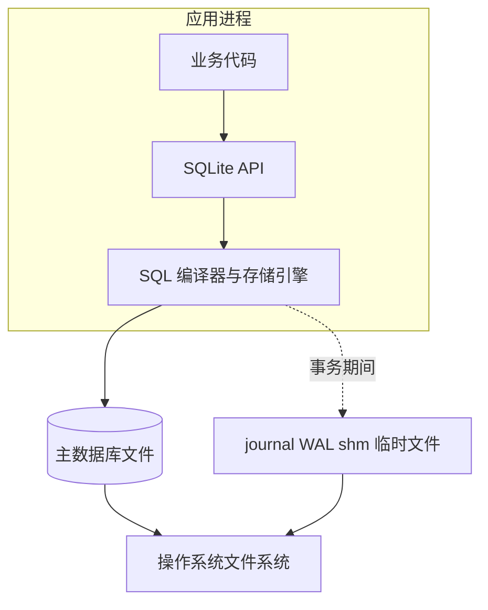
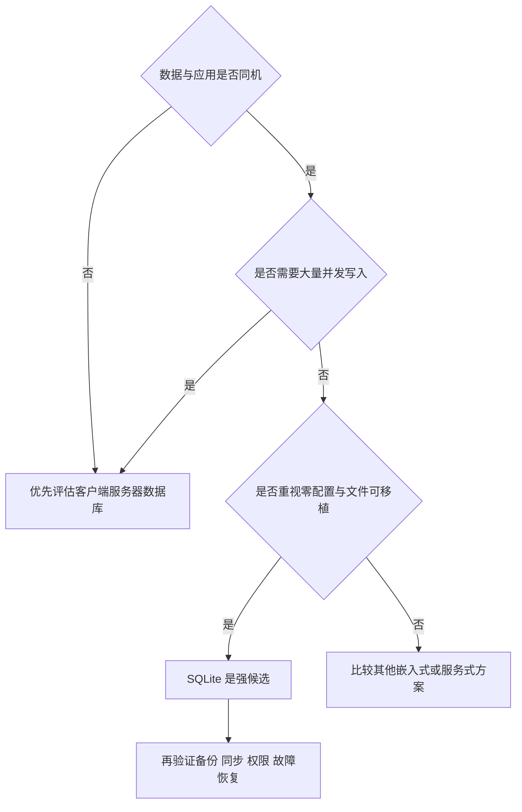
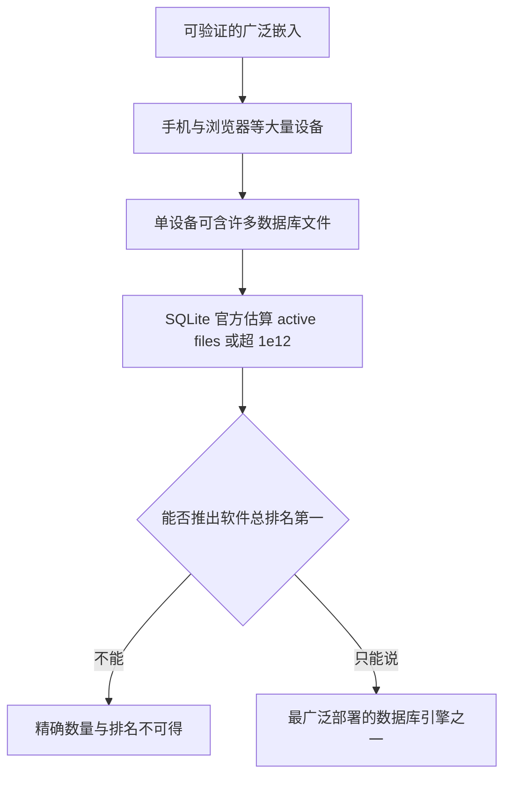
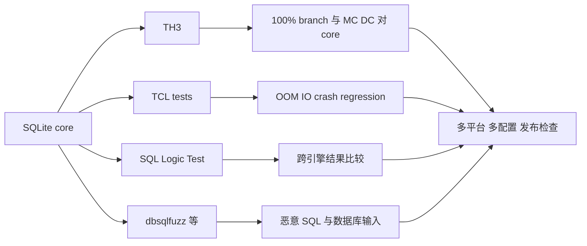
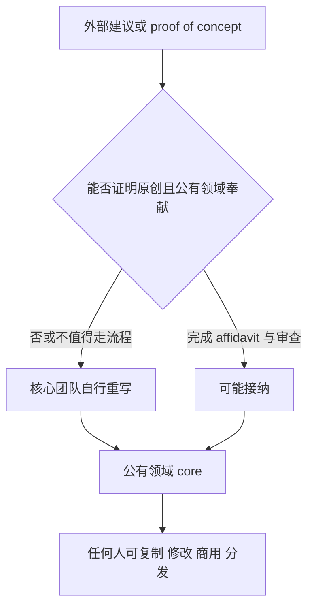
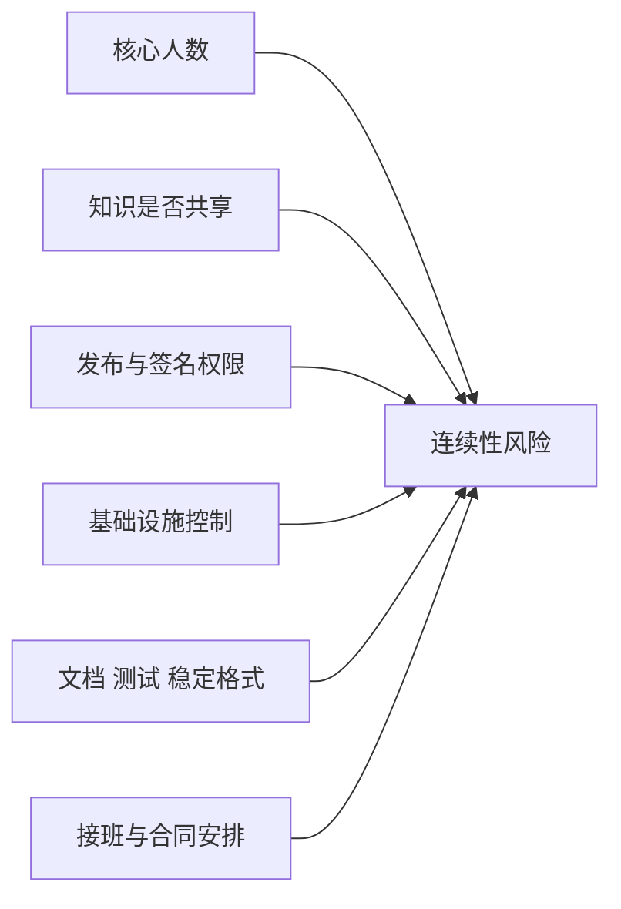
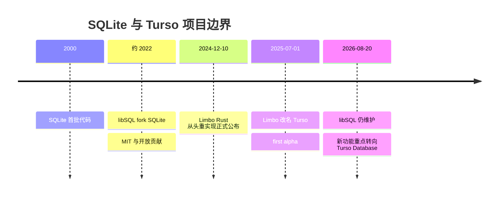
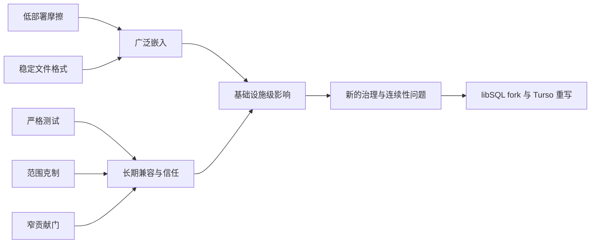

# 总结稿

[打开单页 HTML 总结](assets/bilibili-BV19URKBLEUj-summary.html)

## 一句话结论

SQLite 的传奇不在于“一个文件解决所有数据库问题”，而在于它把**数据库引擎嵌入应用进程、消除独立服务器依赖**，再用稳定文件格式、极重测试和克制治理守住二十多年兼容性；它的代价则是并发与功能边界、贡献门槛和关键知识集中。Turso/libSQL 的故事正是对这些边界的另一种回答。

## 从舰船工单到嵌入式数据库

视频的起源叙事有当事人采访支持，但应写得更准确：Richard Hipp 为 Bath Iron Works 的 DDG-79 USS Oscar Austin 损管辅助程序工作时，既有 Informix 服务偶尔不可用，他的应用因而报错并收到工单。这促使他思考“为什么应用不能直接从磁盘读写数据库”。SQLite 并非该舰项目的正式生产数据库；项目恢复后，它主要用于开发与测试，客户仍使用 Informix。[Richard Hipp 的 CoRecursive 原采访](https://corecursive.com/066-sqlite-with-richard-hipp/)也只把“政府停摆”表述为其回忆中的 funding hiatus。更稳妥的结论是：**一次合同/资金空档给了他把进程内 SQL 引擎写出来的时间**，而不是把 SQLite 的诞生归因于一个已经独立证实的全国性停摆。

## “serverless + 单文件”究竟是什么意思

SQLite 的 serverless 是经典含义：数据库引擎与应用处于同一进程，应用直接访问磁盘文件，没有中间数据库服务器；不是“云厂商替你管理服务器”的 neo-serverless。[SQLite 官方 serverless 说明](https://www.sqlite.org/serverless.html)也同时指出代价：独立服务器能提供更强隔离和更细粒度并发控制。

主数据库可被视为一个跨平台文件，便于复制、嵌入和长期保存；但事务期间可能生成 journal、WAL、shared-memory 或临时文件，所以“运行时永远只有一个文件”并不准确。[SQLite 单文件说明](https://www.sqlite.org/onefile.html)

## 广泛部署：事实很强，排名要保守

SQLite 官方把它称为最广泛部署的数据库引擎，并列出 Android、iPhone/iOS、Mac、Windows 10/11、Firefox、Chrome、Safari 等大量分布场景；AOSP 也维护 SQLite 源码，Android 从 API level 1 起提供 SQLiteDatabase。[SQLite 的部署说明](https://www.sqlite.org/mostdeployed.html)、[Android 官方 API](https://developer.android.com/reference/android/database/sqlite/package-summary)

但“超过一万亿个活跃数据库”是项目方估算：超过 40 亿部活跃智能手机、每台数百个数据库文件，由此推测 active-use files 可能超过 1e12。官方同页明确说精确数量与排名不可得，并认为 SQLite 在所有软件组件中可能仅次于 libz，也可能因静态链接实例多而反超。因此不要把它改写成“一万亿用户/设备”或已审计的“人类史第一”。“每架飞机都有”也过度外推；官方只能支持 A350 XWB flight software 等具体案例。[SQLite 已知用户](https://www.sqlite.org/famous.html)

## 测试：航空级方法，不等于航空认证

TH3 的设计受到航空厂商和 DO-178B 严格测试要求启发，并对 **SQLite core** 达到 100% branch coverage 与 100% MC/DC；FTS3、RTREE 等扩展不在这一 100% 口径内。[TH3 官方说明](https://www.sqlite.org/th3.html)、[How SQLite Is Tested](https://www.sqlite.org/testing.html)

视频中的 155.8 KSLOC、92053.1 KSLOC（约 9205 万行）测试代码/脚本与 590:1 比例，来自 SQLite 3.42.0（2023-05-16）的官方口径；distinct cases、参数化实例、soak tests 与 fuzz mutations 是不同单位，不能相加成一个“测试用例总数”。官方当前列出的 release soak 约 2.485 亿 tests，也没有支持“每次发布固定至少三天”的绝对时长。最重要的限定是：**采用 DO-178B 相关保证方法，不等于 SQLite 整体获得 DO-178B 认证，更不等于零缺陷。**

## 公有领域与窄贡献门

SQLite 的交付核心代码和文档由作者置于公有领域，允许复制、修改、商用和再分发；但部分构建脚本、专有扩展与 TH3 可能另有许可，某些司法辖区也需要 Warranty of Title。[SQLite Copyright](https://www.sqlite.org/copyright.html)

“完全不接受外部代码”是错误的绝对化。SQLite 的准确定位是 **open-source, not open-contribution**：随机互联网补丁通常不接收，贡献者需要提交 public-domain affidavit；项目可能把 proof-of-concept 从头重写。[贡献政策](https://www.sqlite.org/copyright-release.html)

“恰好三个人维护一万亿数据库”在 2026-08-20 无法由当前官方页面确认。旧 crew 页面曾列 Hipp、Dan Kennedy、Joe Mistachkin；当前页面撤下名单，只说团队分布在三个大洲。[SQLite Developers](https://www.sqlite.org/crew.html) 同样，bus factor 不能由人数直接推出，它还取决于发布权限、知识分布、测试/文档、基础设施与接班安排。

项目的三行 blessing 与《圣本笃会规》Code of Ethics 确实存在，但它们是伦理承诺和源码文本，不是公有领域法律效力或可靠性的来源。[SQLite Code of Ethics](https://www.sqlite.org/codeofethics.html)

## libSQL 与 Rust 重写：不要混成同一个项目

- **约 2022 年：libSQL**。Turso 团队 fork SQLite，强调 MIT 与开放贡献；当前 libSQL 提供 embedded replicas、remote access 等能力，但仍继承 SQLite 的 single-writer 等基础限制。[libSQL 官方仓库](https://github.com/tursodatabase/libsql)
- **2024-12-10：Limbo**。Turso 宣布从头用 Rust 重实现 SQLite，目标是兼容 SQL 语言和文件格式；当时仍是实验。[Introducing Limbo](https://turso.tech/blog/introducing-limbo-a-complete-rewrite-of-sqlite-in-rust)
- **2025-07-01 起：Turso Database**。Limbo 改名 Turso 并发布 first alpha。它不是 libSQL fork；当前兼容性文档仍把 SQLite query language 与 C API 标为部分支持，不能称为已经完整替代 SQLite。[Turso compatibility](https://github.com/tursodatabase/turso/blob/main/COMPAT.md)

## 观众讨论（从属信息）

观众补充了原型开发的低部署成本、PR 的长期维护负担，也质疑“最广泛”、微信采用史、SQLite 是否“上报用户数”、以及泛化性能优势。它们是开发者经验、历史记忆与核验问题，不是事实证据；尤其“后门”不能由一条疑问成立，性能也必须给出版本、事务、同步、并发、缓存、硬件和数据集。

样本仅为抓取 **16 / 平台报告 32** 条顶层热门评论，候选 16 条，无嵌套回复正文，存在热门偏差；弹幕只有 **8 条 current-accessible**，不是历史全集，最大 30 秒桶也只有 2 条，因此不能推断热点、比例或总体情绪。

## 最值得带走的判断框架

选择 SQLite，不是因为“最流行”，而是因为你的问题是否符合它的边界：单机/边缘、低运维、本地事务、文件级可移植与长期兼容。评估治理也不要在“闭源式独裁”与“完全开放”之间二选一：SQLite 用极窄贡献门维护公有领域与兼容性，libSQL/Turso 用开放贡献和新架构探索更多并发与功能。两条路线解决的是不同风险。

# 辅助理解

## 如何理解这期视频

这期视频表面在讲“最广泛的软件传奇”，更深的主题其实是：**一个基础组件如何用极小部署摩擦获得分布规模，又如何用测试、兼容承诺与治理门槛控制变化成本。** 需要把四层证据分开：Hipp 的历史回忆、SQLite 的官方技术/治理事实、视频作者的叙事判断，以及观众经验。

## 1. 起源：真正被消除的是外部故障域

Hipp 在 DDG-79 Oscar Austin 相关损管辅助项目中需要读取 Informix 数据。当外部数据库服务不可用时，他的应用只能报错，却仍承担支持工单。这个经历让他把问题重新定义为：若数据规模和访问模式允许，数据库是否可以变成应用内部的库，直接读写本地文件？[原采访](https://corecursive.com/066-sqlite-with-richard-hipp/)

这不是“SQLite 在军舰上取代 Informix”的证据。SQLite 后来在该项目中主要用于开发/测试，正式客户仍坚持原系统。所谓政府停摆也只应写成 Hipp 回忆中的 funding hiatus；另一份原采访只说客户没有批准方案，他几个月后用自己的时间开始写，首个代码在 2000-05-29 check-in。

frame 2 只呈现“为什么不能直接从磁盘读”的问题句，是叙事入口，不是架构图或历史证据。

## 2. 架构：同进程、无独立服务器、主数据库单文件

[SQLite 官方定义](https://www.sqlite.org/serverless.html)中的 serverless 是 classic serverless：引擎与应用在同一进程、线程和地址空间中，不通过 TCP/IP 向独立数据库服务发请求。这减少安装、配置、认证、网络和运维故障面，但也放弃了服务器进程带来的隔离、集中访问控制与更细并发调度。

因此“一个文件”描述的是主数据库与稳定文件格式，而不是所有运行状态。官方页面明确说明事务可产生临时 journal；WAL 模式还可能出现 WAL/shared-memory 辅助文件。[Single-file database](https://www.sqlite.org/onefile.html)

可以把选型边界简化为：

这不是硬性决策树，而是帮助避免“SQLite 很流行，所以任何场景都适合”的推理错误。

## 3. 部署规模：从可验证分布到不可精确排名

SQLite 官方列举 Android、iOS、Mac、Windows 10/11、Firefox、Chrome、Safari 等场景；Android 还有 AOSP `platform/external/sqlite` 和 API level 1 起的 SQLiteDatabase 作为独立一手证据。[Android AOSP SQLite](https://android.googlesource.com/platform/external/sqlite.git/)、[Android API](https://developer.android.com/reference/android/database/sqlite/package-summary)

frame 5 是视频内移动市场背景图，没有可见数据来源，不能据此计算 SQLite 份额或一万亿部署。

[SQLite 的官方估算页](https://www.sqlite.org/mostdeployed.html)自己保留了关键不确定性：超过 40 亿部活跃手机、每台数百个 SQLite 文件，因此可能超过一万亿 active databases；但项目也称所有软件组件的精确排名不可能，并把 libz 视为强竞争者。文件数不是用户数、设备数或独立安装数。具体产品采用也必须按版本核对，不能从“嵌入 SQLite”推出“所有数据都保存在 SQLite”。

## 4. 测试：把不同计量单位拆开

SQLite 的可靠性工程不是一个“测试行数很大”的单指标，而是多套独立 harness、异常注入、覆盖率、模糊测试、回归测试和发布 checklist 的组合。[How SQLite Is Tested](https://www.sqlite.org/testing.html)

关键口径：

- 155.8 KSLOC core、92053.1 KSLOC test code/scripts、590 倍都绑定 SQLite 3.42.0（2023-05-16）。
- TH3 当前页面列出的 distinct cases、参数化 full-coverage instances、release soak tests 是不同单位。
- dbsqlfuzz 的每日 mutations 也不是普通功能测试用例数。
- 100% branch/MC/DC 针对 core；FTS3、RTREE 等扩展不在该 100% 范围。

[TH3 历史](https://www.sqlite.org/th3.html)说明其设计受航空制造商与 DO-178B 严格测试标准启发；这支持“采用相关保证技术”，不支持“SQLite 整体获得 DO-178B 认证”。覆盖率也只是说明测试触达条件/分支，不能数学证明无 bug 或无安全问题。

## 5. 治理：公有领域与贡献门是一体两面

SQLite 把交付核心代码与文档置于公有领域。为了防止版权来源污染，贡献者及雇主代表需签署 public-domain affidavit；随机互联网补丁通常不直接接收，小补丁也可能被核心团队从头重写。[SQLite Copyright](https://www.sqlite.org/copyright.html)

所以准确标签是 **open-source, not open-contribution**，不是“闭源”，也不是“绝不接受外部代码”。公共领域还不自动覆盖专有扩展、TH3、部分构建脚本、商标或某些司法辖区问题；需要法律凭证的组织可购买 Warranty of Title。

frame 6 显示视频中的 Joe Mistachkin 人物卡，只能说明叙事对象。旧官方 crew 页面曾列 Richard Hipp、Dan Kennedy、Joe Mistachkin；[当前 crew 页面](https://www.sqlite.org/crew.html)已撤下名单，只称团队分布于三个大洲，因此“2026 年恰好三个人维护”未获当前官方确认。

同样，bus factor 不是人数：

没有这些变量，就不能把 bus factor 直接写成 3。SQLite 的源码、文档、稳定文件格式、测试和 consortium 可能降低一部分风险，但本次核查也没有找到可公开验证的完整 succession plan。

项目的三行 blessing 和《圣本笃会规》[Code of Ethics](https://www.sqlite.org/codeofethics.html)是真实项目文本；它们说明伦理承诺，不是公共领域法律机制或可靠性测试。

## 6. 分叉：libSQL 与 Turso Rust 重写是两次不同选择

视频把 Turso 线索讲成“开放社区反抗封闭维护”，但技术上必须分三层：[libSQL 官方仓库](https://github.com/tursodatabase/libsql)是 SQLite fork；Turso 云产品曾以 libSQL 为引擎；后来的 Turso Database 则是 Rust 新实现。

[Introducing Limbo](https://turso.tech/blog/introducing-limbo-a-complete-rewrite-of-sqlite-in-rust)把 2024 项目称为 from-scratch reimplementation、MIT、当时仍是 experiment。当前 [Turso compatibility](https://github.com/tursodatabase/turso/blob/main/COMPAT.md)承诺可返回 SQLite、支持 SQLite 文件格式，但 query language 与 C API 仍是部分支持。因此 Rust 能减少某类内存安全风险，不等于已经达到 SQLite 的兼容、可靠性、性能或生态成熟度。

这组分叉体现的不是简单的“开放优于封闭”，而是不同优化目标：

| 路线 | 优先守住 | 主要代价/风险 |
|---|---|---|
| SQLite | 兼容、范围克制、来源可追溯、极重测试 | 贡献摩擦、功能演进慢、关键知识集中疑问 |
| libSQL | SQLite 兼容基础上的开放贡献、复制与远程访问 | 仍继承 fork 与 single-writer 等基础约束 |
| Turso Database | Rust、新架构、并发和新能力 | 兼容仍在推进，可靠性与生态需长期验证 |

## 7. 观众意见只能作为问题生成器

评论中的“原型都先上 SQLite”“PR 像免费小狗”“中小 CRUD 吊打 MySQL”“微信好像用 SQLite”“是否有上报后门”各自属于个人经验、维护隐喻、无条件 benchmark、历史记忆和安全疑问。正确用法是生成核查问题，而不是替视频背书。

尤其要区分：SQLite core 的网络行为、宿主应用自己的遥测、第三方发行包的自动更新是三层责任边界。“后门”需要源码和网络行为证据；性能需要 SQLite/MySQL 版本、硬件、事务模式、同步级别、并发、缓存、数据集和查询。

样本只覆盖抓取 **16 / 平台报告 32** 条顶层热门评论，候选 16 条，无嵌套回复正文且有热门偏差；弹幕只有 **8 条 current-accessible**，不是历史全集，最大桶仅 2 条。不能计算观点比例，也不能推断热点或总体情绪。

## 8. 最终理解

SQLite 的成功是一个乘法式结果：

真正可迁移的方法不是复制 SQLite 的所有选择，而是明确自己的不变量：你究竟要最小部署面、可移植文件、强并发、开放贡献、法律来源纯净，还是快速功能演进？一旦优先级不同，最合理的架构和治理也会不同。

## 外部事实核验

### 声明 1（00:41）

- 视频陈述：Hipp 在导弹驱逐舰项目中遇到 Informix 宕机，因此写出了 SQLite。
- 核验状态：部分确认
- 核验结果：原采访支持核心起源故事，但需要收窄。CoRecursive 对 Hipp 的原采访记载：他是 Bath Iron Works 的承包商，项目是 DDG-79 Oscar Austin 的 Automated Common Diagrams 损管辅助程序，管路与阀门数据放在既有数据库中；服务器不可用会让他的应用报错并引来工单。Hipp 随后希望应用能直接读写磁盘而不依赖外部数据库服务器。不过 SQLite 并未作为该舰项目的正式生产组件诞生；采访称项目恢复后主要把它用于开发/测试，客户仍坚持 Informix。Informix 问题也被 Hipp 描述为既有系统的配置/可用性问题，不能写成数据库本身在海上技术失效。
- 检索日期：2026-08-20
- 来源：
  - [The Untold Story of SQLite | CoRecursive Podcast](https://corecursive.com/066-sqlite-with-richard-hipp/)（primary）
  - [Interview with Richard Hipp](https://camilocs.substack.com/p/entrevista-a-richard-hipp)（primary）

### 声明 2（03:20）

- 视频陈述：政府预算争执让项目暂停，Hipp 因而在空档期写 SQLite。
- 核验状态：部分确认
- 核验结果：只能确认这是 Hipp 的回忆，不能升级为已独立证实的‘2000 年联邦政府停摆’。CoRecursive 原采访中，Hipp 使用的是 funding hiatus，并回忆某场政治争执导致政府合同暂停、自己失业数月；另一份对 Hipp 的原采访则更谨慎，只说客户没有批准嵌入式数据库方案，他几个月后在自己的时间开始写，首个代码于 2000-05-29 check-in。可靠写法是‘Hipp 回忆一次合同/资金空档给了他开发时间’，不要把具体全国性政府停摆或单一因果写死。
- 检索日期：2026-08-20
- 来源：
  - [The Untold Story of SQLite | CoRecursive Podcast](https://corecursive.com/066-sqlite-with-richard-hipp/)（primary）
  - [Interview with Richard Hipp](https://camilocs.substack.com/p/entrevista-a-richard-hipp)（primary）

### 声明 3（03:34）

- 视频陈述：SQLite 没有服务器，数据库就是一个文件，程序直接读取它。
- 核验状态：已确认
- 核验结果：确认，但‘serverless’必须按 SQLite 的 classic serverless 定义理解：数据库引擎与应用在同一进程/地址空间内，直接读写磁盘文件，没有中间数据库服务器，不是云计算语境的托管 serverless。官方 single-file 页面确认一个 SQLite 数据库是单一磁盘文件并可跨架构复制，但事务期间可创建 journal、WAL、shared-memory 或临时辅助文件，因此‘永远只有一个文件’并不精确。
- 检索日期：2026-08-20
- 来源：
  - [SQLite Is Serverless](https://www.sqlite.org/serverless.html)（primary）
  - [SQLite: Single File Database](https://www.sqlite.org/onefile.html)（primary）

### 声明 4（00:00）

- 视频陈述：SQLite 是史上最广泛的软件，活跃数据库超过一万亿。
- 核验状态：部分确认
- 核验结果：‘最广泛部署的数据库引擎’有 SQLite 官方自述支持；‘一万亿活跃数据库’是项目方估算，不是审计统计。官方页面的推理是：超过 40 亿部活跃智能手机，每台通常有数百个 SQLite 文件，因此 active-use database files 可能超过 1e12。该页同时明确说精确数量和排名无法获得，并把 SQLite 对所有软件组件的排名称为 best guess，甚至估计可能仅次于 libz；按静态链接实例数计算又可能反超。故不能无保留写成‘已证实的人类史第一’、一万亿用户或一万亿设备。
- 检索日期：2026-08-20
- 来源：
  - [Most Widely Deployed SQL Database Engine](https://www.sqlite.org/mostdeployed.html)（primary）

### 声明 5（14:09）

- 视频陈述：SQLite 在每部手机、每个浏览器、每个桌面系统乃至每架飞机里。
- 核验状态：部分确认
- 核验结果：广泛分布成立，绝对化不成立。SQLite 官方当前列举 Android、iPhone/iOS、Mac、Windows 10/11 以及 Firefox、Chrome、Safari；Android 一侧还有独立的一手证据：AOSP 维护 platform/external/sqlite 仓库，Android 官方 API 从 API level 1 起提供 SQLiteDatabase，并明确提醒 SQLite 版本随 Android 版本变化。SQLite 官方 famous-users 页面还列出 Airbus 确认 A350 XWB flight software 使用 SQLite。以上不能推出所有 Android 分支、所有浏览器派生版、所有历史版本、所有飞机或每个设备都必然包含同一 SQLite 版本；应用采用也不等于其全部数据都存入 SQLite。
- 检索日期：2026-08-20
- 来源：
  - [Most Widely Deployed SQL Database Engine](https://www.sqlite.org/mostdeployed.html)（primary）
  - [Well-Known Users of SQLite](https://www.sqlite.org/famous.html)（primary）
  - [platform/external/sqlite.git - Git at Google](https://android.googlesource.com/platform/external/sqlite.git/)（primary）
  - [android.database.sqlite | API reference | Android Developers](https://developer.android.com/reference/android/database/sqlite/package-summary)（primary）

### 声明 6（12:21）

- 视频陈述：Android 暴露问题后，SQLite 采用航空 DO-178B 方法，在机器码层面做到 100% MC/DC。
- 核验状态：部分确认
- 核验结果：核心测试表述确认，但因果与认证必须限定。SQLite 官方 TH3 历史称：航空制造商的兴趣促使团队设计 TH3 以支持 DO-178B 的严格测试标准；TH3 在 2009-07-25 达到 100% MC/DC。当前测试页称 TH3 对 SQLite core 提供 100% branch coverage 和 100% MC/DC，扩展如 FTS3/RTREE 不包含在该 100% 范围内；覆盖先用 gcov 验证测试套件，再用交付编译选项重编并运行实际测试。官方没有在这些页面宣称 SQLite 整体获得 DO-178B 认证，因此不能写成‘SQLite 已获航空认证’。这些来源也没有证明测试扩张单由 Android 崩溃触发。
- 检索日期：2026-08-20
- 来源：
  - [TH3](https://www.sqlite.org/th3.html)（primary）
  - [How SQLite Is Tested](https://www.sqlite.org/testing.html)（primary）
  - [Quality Management](https://www.sqlite.org/qmplan.html)（primary）

### 声明 7（12:36）

- 视频陈述：约 15.5 万行 SQLite 对应 9200 万测试行，比例 590:1，发布前要跑数天、数十亿用例。
- 核验状态：部分确认
- 核验结果：数量的主体来自 SQLite 官方页面，但必须附版本与口径。测试页明确把 155.8 KSLOC、92053.1 KSLOC test code/scripts 和 590 倍绑定到 SQLite 3.42.0（2023-05-16）；当前同页列出 TH3 约 1055.4 KSLOC、50362 个 distinct cases、约 240 万 full-coverage instances、release soak 约 2.485 亿 tests，另称 dbsqlfuzz 每日约十亿 mutations。不同数字分别是源码行、测试脚本行、distinct case、参数化实例、soak tests 和 fuzz mutations，不能相加成同一个‘测试用例数’。官方说各测试在多平台/多配置上必须通过后才能发布，但当前页面未支持‘每次固定至少三天’这一绝对时长。
- 检索日期：2026-08-20
- 来源：
  - [How SQLite Is Tested](https://www.sqlite.org/testing.html)（primary）

### 声明 8（14:16）

- 视频陈述：一万亿数据库只由三个人维护。
- 核验状态：未验证
- 核验结果：截至核验日不能从当前官方页面确认‘恰好三人’。SQLite 旧版官方 crew 页面曾列出 Hipp、Kennedy、Mistachkin；当前 crew 页面已撤下姓名，只说维护团队分布在三个大洲，并提示需要精确名单时联系 lead developer。因而可以说项目长期由很小的核心团队主导，但不能把旧页面名单当成 2026-08-20 的完整劳动投入或精确 headcount；也不能用估算的一万亿数据库文件直接计算每位维护者负担。
- 检索日期：2026-08-20
- 来源：
  - [SQLite Developers](https://www.sqlite.org/crew.html)（primary）
  - [SQLite Developers (archived matrix page)](https://www2.sqlite.org/matrix/crew.html)（primary）

### 声明 9（15:22）

- 视频陈述：外部人不能贡献代码，项目只由核心三人写。
- 核验状态：存在矛盾
- 核验结果：绝对说法被官方政策否定。SQLite 自称 open-source but not open-contribution：不会接受未提交 public-domain affidavit 的随机互联网补丁，但存在正式接纳流程；小改动通常不值得走该流程，项目也欢迎 proof-of-concept，只是可能从头重写。准确表述是‘不采用常规开放 PR 模式，对代码来源和公有领域声明设置很高门槛’，而不是‘任何外部代码都不可能进入’。
- 检索日期：2026-08-20
- 来源：
  - [SQLite Copyright](https://www.sqlite.org/copyright.html)（primary）
  - [Copyright Release for Contributions To SQLite](https://www.sqlite.org/copyright-release.html)（primary）

### 声明 10（15:35）

- 视频陈述：SQLite 没有许可证，代码属于公有领域，任何人都可复制修改商用。
- 核验状态：已确认
- 核验结果：对 SQLite 官方交付的 core code/documentation 基本确认。官方称作者及其雇主代表签署 affidavit，把贡献置于 public domain，允许复制、修改、发布、使用、编译、销售和分发。边界是：部分构建脚本可能使用其他开源许可证，专有扩展和 TH3 另有许可；某些司法辖区不承认公有领域奉献，因此 Hwaci 另售 Warranty of Title。故不能把公有领域简化成所有周边文件、扩展、商标或第三方组件都‘没有任何法律边界’。
- 检索日期：2026-08-20
- 来源：
  - [SQLite Copyright](https://www.sqlite.org/copyright.html)（primary）
  - [SQLite Pro Support](https://www.sqlite.org/prosupport.html)（primary）

### 声明 11（17:25）

- 视频陈述：SQLite 的行为准则来自圣本笃会规，源码以祈祷文代替法律声明。
- 核验状态：已确认
- 核验结果：项目文本层面的事实确认，但不应心理化或因果化。SQLite 官方 Code of Ethics 说明该文档最初为客户供应商表单中的 Code of Conduct 而创建，后来改名；项目创始人与当时开发者承诺按《圣本笃会规》第四章的 instruments of good works 约束自身行为。官方 distinctive-features 页面也展示源码 blessing，内容是行善、宽恕与自由分享。它是项目伦理承诺和源码页眉文本，不是公有领域法律效力本身的来源，也不能由此推断维护者个人信仰或软件可靠性。
- 检索日期：2026-08-20
- 来源：
  - [Code Of Ethics](https://www.sqlite.org/codeofethics.html)（primary）
  - [Distinctive Features Of SQLite](https://www.sqlite.org/different.html)（primary）

### 声明 12（21:17）

- 视频陈述：核心知识集中在三人手中，任何一人离开都会形成严重单点风险。
- 核验状态：未验证
- 核验结果：无法从核查的一手资料计算 bus factor。当前 crew 页面不公开精确名单，仅说团队分布在三个大洲；公开源码、稳定文件格式、文档、Fossil 历史、测试体系、付费支持和 consortium 都可能缓解部分连续性风险，但不等于已经证明完整 succession plan。bus factor 不是维护者人数的同义词，需要关键发布权限、签名/基础设施、知识分布和接班安排等证据。视频的集中风险可以保留为治理问题，不能写成已测量的数值事实。
- 检索日期：2026-08-20
- 来源：
  - [SQLite Developers](https://www.sqlite.org/crew.html)（primary）
  - [SQLite Source Repository](https://www.sqlite.org/src)（primary）
  - [SQLite Consortium](https://www.sqlite.org/consortium.html)（primary）

### 声明 13（23:17）

- 视频陈述：2022 年 10 月，Turso 创建 libSQL；一年内加入复制、server mode、向量搜索和大量贡献者。
- 核验状态：部分确认
- 核验结果：项目边界确认，精确的‘2022 年 10 月’在本次一手材料中仅由后续周年叙述间接支持。Turso 2023-10-03 的官方回顾称 one year ago 宣布 SQLite fork；2024-12-10 回顾称 two years ago fork。当前官方仓库明确：libSQL 是由 Turso 维护的 SQLite fork，MIT、open contribution，提供 embedded replicas 和 remote access，并仍继承 SQLite single-writer 等基础限制。Turso 2024-12-10 官方文章当时报告超过 12k stars、85 contributors、native replication 和 vector search，但这些是当时项目方快照，不能无日期写成永恒状态，也不应把 stars 当采用率。libSQL fork 与后来的 Rust 重写不是同一个代码库边界。
- 检索日期：2026-08-20
- 来源：
  - [tursodatabase/libsql](https://github.com/tursodatabase/libsql)（primary）
  - [We're bringing libSQL into the Turso family](https://turso.tech/blog/were-bringing-libsql-into-the-turso-family-8cc1a653448e)（primary）
  - [Introducing Limbo: A complete rewrite of SQLite in Rust](https://turso.tech/blog/introducing-limbo-a-complete-rewrite-of-sqlite-in-rust)（primary）

### 声明 14（24:35）

- 视频陈述：2024 年 Turso 宣布以 Rust 从零重写 SQLite。
- 核验状态：已确认
- 核验结果：确认核心时间线，并需使用官方的 reimplementation/from scratch 表述而非无来源的法律化 clean-room 定性。Turso 于 2024-12-10 宣布 Limbo：Rust、从头重实现、目标兼容 SQLite 语言和文件格式、MIT，且当时仍是 official experiment。2025-07-01 官方发布 first alpha 并把 Limbo 正式命名为 Turso。当前 libSQL 仓库明确区分：libSQL 是 C 为主的 SQLite fork；Turso database 是从头用 Rust 写的 SQLite-compatible 新实现，不是 fork。当前 Turso compatibility 文档称 SQLite 文件格式已支持，而 query language 与 C API 仍是部分支持；因此不能写成已经完整等价、自动更安全/更可靠或已经替代 SQLite。
- 检索日期：2026-08-20
- 来源：
  - [Introducing Limbo: A complete rewrite of SQLite in Rust](https://turso.tech/blog/introducing-limbo-a-complete-rewrite-of-sqlite-in-rust)（primary）
  - [Introducing the first alpha of Turso: The next evolution of SQLite](https://turso.tech/blog/turso-the-next-evolution-of-sqlite)（primary）
  - [tursodatabase/turso: Turso SQLite Compatibility](https://github.com/tursodatabase/turso/blob/main/COMPAT.md)（primary）
  - [tursodatabase/libsql](https://github.com/tursodatabase/libsql)（primary）

# Data

## 增强转写稿

# Corrected Transcript

- Video ID: `BV19URKBLEUj`
- Domain: SQLite history, embedded databases, software assurance, governance, and public-domain stewardship
- Editorial rule: all timestamp tokens and source-line order are preserved. Only high-confidence ASR terminology, proper names, punctuation, and clearly corrupted phrases were corrected; the severely damaged passage at `[24:56–25:23]` is retained rather than reconstructed.
- Evidence boundary: the transcript mixes Richard Hipp interview excerpts, project history, narrator interpretation, deployment estimates, and product claims. Corrections do not verify those claims.

## Terminology

- **SQLite** — embedded SQL database engine; not “Sequel Light” or “Syqlite.”
- **D. Richard Hipp** — creator and principal architect of SQLite.
- **Informix** — the client/server database involved in the early naval-project story.
- **USS Oscar Austin (DDG-79)** — U.S. Navy guided-missile destroyer built by Bath Iron Works.
- **AOL / Motorola / Symbian / Android** — companies/platforms in the adoption narrative.
- **DO-178B** — airborne-software assurance guidance; do not equate compliance-inspired testing with automatic certification of SQLite itself.
- **MC/DC** — modified condition/decision coverage.
- **Turso / libSQL** — Turso is the company/product organization; libSQL is the SQLite fork announced in 2022.
- **Rust** — memory-safe systems programming language used for Turso’s later clean-room database effort.
- **public domain** — SQLite’s core code is dedicated to the public domain; this is distinct from an OSI license such as MIT, Apache, or GPL.
- **bus factor** — concentration risk from depending on very few maintainers.

## Transcript
[00:00] What's the most used piece of software in human history?
[00:03] Windows, Chrome, iOS?
[00:07] No, there are over 1 trillion active SQLite databases on earth right now.
[00:14] It's on every iPhone, every Android, every copy of Chrome, Safari, Firefox, every Mac, every Windows.
[00:22] If you have a phone in your pocket, you're running hundreds of SQLite databases at this very moment.
[00:27] And almost nobody knows what it is.
[00:30] How did the most important software on earth become the most invisible?
[00:41] It was the year 2000, the Y2K Panics settled, the NASDAQ hits a record high during the dot-com boom.
[00:50] Tech could only go up from here.
[00:55] But not on the DDG-79, USS Oscar Austin,a guided missile destroyer in Maine.
[01:01] One piece of software kept failing at the worst possible times.
[01:04] And Richard Hipp was a contractor on that ship.
[01:07] It was contracted with Bath Iron Works.
[01:10] And Bath Iron Works was building DDG-79.
[01:13] They had a damage control system.
[01:16] It's just an information system for the sailors so that they take damage to the ship.
[01:20] You need to be able to turn valves and circuit breakers off to isolate the damage.
[01:24] And then turn others on in order to get necessary support to critical systems.
[01:31] But Richard wasn't a database guy.
[01:32] He had a PhD in computational linguistics and masters in electrical engineering.
[01:38] He ran a small consulting company with his wife out of Charlotte, North Carolina.
[01:43] She was the president and he was the head of research.
[01:47] During the 1990s,there were two extreme players in the world of enterprise databases.
[01:52] Oracle and Informix.
[01:55] And to say they were obsessed with beating one another is an understatement.
[01:58] Informix put a billboard outside of Oracle's headquarters saying dinosaur crossing,claiming they're old and frail.
[02:06] But all of that corporate warfare didn't matter much when the servers just stopped working.
[02:12] cannot connect to database server.
[02:14] All the data to compute this was stored on an Informix database.
[02:19] Software that I wrote to solve this,you know,they double-click on it to bring it up.
[02:23] And if the Informix database engine is down,I'd paint a dialog box saying database unavailable.
[02:31] And that would happen,and they'd call me up and complain to my software.
[02:35] And I think this is not a good situation.
[02:39] I don't want to take the blame because some system administrator took down the database engine.
[02:46] That's when Richard asked himself,why,why do I need a separate process to store this data?
[02:52] Why can't I just read it directly from the disk myself?
[02:54] And that way,if the machine is healthy enough that they can double-click on my application,it should be read today,right?
[03:00] But sadly,there were not many solutions.
[03:02] Remember,you couldn't just Google something around this time.
[03:06] Then someone Richard worked with said,why don't you just write one?
[03:13] And Richard did the thing that all programmers are guilty of,added to his list of side projects to do.
[03:19] Eventually,of course.
[03:20] Well,eventually came sooner than expected.
[03:23] A government funding dispute shut down contracts across the country,and Richard was one of those casualties.
[03:29] To occupy its free time,he decided to work on that very project that he tried to find before.
[03:34] A SQL database that didn't need a server.
[03:38] What if it was just a file?
[03:42] SQLite skips the separate database server entirely.
[03:45] Your app opens a file on your disk and just reads the data directly.
[03:49] There's no middleman or dependency on an outside service,it's just one file.
[03:55] And just like that,SQLite was created.
[04:00] Then,even better news,his contract renewed for the ship project,and things will be easier this time.
[04:05] We have a SQL database that will make things ten times easier.
[04:13] Well, unfortunately, the hope didn’t last long, and Informix was here to stay. But hey, maybe someone will find this useful for their small project online.
[04:25] So,Richard uploads SQLite to his own company's website under open source software.
[04:29] That way,anyone can use it.
[04:32] Now,back to work.
[04:36] It didn't take long before people caught on what Richard actually posted online.
[04:40] The flexibility that a one file database provided had a ton of use cases.
[04:47] One of those posts would show the true potential of what SQLite can do.
[04:51] Someone was able to put SQLite on a Palm Pilot,a computer that can fit in your pocket.
[05:02] If you were in business,you had a Palm Pilot.
[05:05] One of the biggest limitations,no internet,and only two to eight megabytes of RAM.
[05:10] So,the fact thatsomeone was able to put an entire SQL database onto it,was revolutionary to say the least.
[05:16] The newsgroup went crazy.Tinkerers started to download SQLite to try it out on their own projects.
[05:21] People would give their feedback,and this made Richard continue working on it in a spare time.
[05:27] Emails,downloads,newsgroups,it was growing rapidly,and then a phone call.
[05:36] It was Motorola.
[05:39] They'd seen what SQLite could do on devices like the Palm Pilot.
[05:43] They wanted it baked into their brand new mobile phone OS.
[05:47] Can you do that?
[05:49] Sure.I'll get back to you tomorrow with a budget.
[05:55] Immediate Panic.How do you price out a software that is open source and free?
[05:59] How does that even work?At the end of the day,there really isn't a way you can put a price on it.
[06:04] It's about the hard work and labor that goes into the $80,000.
[06:16] So,Richard brought on three other people he worked with to integrate SQLite into the new mobile phone operating system.
[06:23] Richard received the most money he'd ever received in his life by making free software.
[06:29] How does that work?It wasn't long before another call came in.
[06:33] This time,AOL.
[06:37] If you're too young to remember,AOL wasn't just an internet company,it was the internet back then.
[06:43] Version 5.0,the easiest just got easier.
[06:46] Like it in and you're good to go.Even my grandpa can do it.
[06:49] AOL's got it all.You've got mail,you've got pictures.
[06:52] Every house in America would open up their mailboxes and see yet another free minute CD.
[06:57] And AOL wanted SQLite on all of those.
[07:00] SQLite would provide the benefits of having a database while taking only a tiny fraction of the space.
[07:06] If Motorola was a game changer,then this was a life changer.
[07:11] They flew Richard out to discuss contract specifics.
[07:14] During the negotiations,he decided to show off a feature that he was developing specifically for AOL.
[07:20] Temporary indexes.It's like a shortcut for finding data faster.
[07:25] Instead of the database scanning through every single row,the index tells it exactly where to look.
[07:30] Except this was temporary.It exists while you need it and disappears when you don't.
[07:36] As this was being presented,Richard realized something crucial in the sentence.It's completely broken.
[07:50] If one user creates a temp index and another user updates the table,the index goes stale.
[07:59] He just bragged about a feature that was completely broken.
[08:02] But nobody noticed.
[08:04] Hopefully.
[08:06] Motorola.AOL.Richard's side project was becoming a real business.
[08:11] But the call that would change everything came from London.Symbian.
[08:15] The operating system that powered Nokia,the biggest phone company on the planet at the time.
[08:22] They wanted Richard to fly out and meet with them.Thanksgiving day.
[08:28] Richard landed in London and was surprised by what they told them.
[08:31] They told me that they had a bake-off. All nine other vendors had the opportunity to tune their database for the operating system.
[08:38] They had a bake off and I won.
[08:40] And I didn't even know this was happening.
[08:42] They had ten different database engines. This was them telling me; I had no person on it.
[08:47] The other nine,seven of them were closed proprietary.
[08:55] But Symbian had one concern.They called it the bus factor.
[09:00] As in,how many people have to get hit by a bus before this project dies?
[09:05] It probably sounded nicer on paper.
[09:08] For SQLite,that number was way too low.
[09:12] So Richard tried to set up a consortium,a formal structure where companies could fund SQLite's development and guarantee its longevity.
[09:19] Something we see to this very day.He put together this whole plan,voting rates for members,corporate governance,the works,the boring stuff.
[09:29] But then his phone rang again.It was Mitchell Baker, the head of the Mozilla Foundation,a lawyer by training.
[09:35] She said that he was doing everything wrong.
[09:38] The developers make all the decisions.The companies get the honor of contributing money.
[09:43] No voting rights on what goes into the code.No corporate governance over the technical direction.
[09:47] The developers are in control,period.
[09:50] But how did they get people to join under those conditions?
[09:55] And that's when Mitchell pledged Mozilla being a founding member of the consortium.
[10:00] Sure enough,Symbian,Mozilla,and Adobe became the founding members of the SQLite Consortium.
[10:05] The project finally had financial backing.But here's the thing,the consortium funded the project.It didn't open it up.
[10:13] Richard didn't start accepting code from the public.He didn't even put it on GitHub.He didn't invite contributions.
[10:19] The money came in, but the contribution process stayed closed. The whole world could depend on SQLite, but SQLite would not depend on the whole world.
[10:26] Every line of SQLite would continue to be written by the people who understand the entire system.
[10:31] That was the deal.That was always going to be the deal.
[10:35] And by the mid-2000s,all major smartphones were running SQLite.
[10:41] Richard had seen early phone development from every angle.Motorola,Nokia,Symbian.
[10:47] Then in 2005,Google called.They were working on a prototype phone.
[10:51] It had a full keyboard at the bottom,and a small screen at the top,like a BlackBerry.
[10:56] They were debugging SQLite on the phone,and had it connected to a workstation,running a full debugger on a mobile device.
[11:02] Nobody else can do that.
[11:04] But then,the phone actually rang.An actual phone call on the prototype,the engineer looked at it and answered.
[11:12] Richard played it cool,but inside his mind was exploding.
[11:16] They were debugging software on a phone that was connected to the public cell network.
[11:21] Motorola couldn't do that.Nokia couldn't do that.
[11:26] They were still using breadboard prototypes that couldn't even make calls.
[11:30] This early prototype was where Android first started.
[11:34] In that moment,Richard knew.Android was going to be huge,and he couldn't tell anyone.
[11:40] Not Motorola,not Symbian,not Nokia.He just had to watch it happen.
[11:46] Android launched.SQLite shipped on every single device.Millions of phones,then tens of millions,then hundreds of millions.
[11:54] But that's when the bugs started showing up.They were getting crash reports constantly.
[11:59] The scale had exposed every edge case,every assumption,every corner they never tested.
[12:04] The thing that worked perfectly for years was suddenly breaking everywhere.A small team drowning in bug reports from millions of users on the world's fastest growing platform.
[12:14] What now?
[12:16] Being such a small team,they could have folded,but instead,Richard did something kind of insane.
[12:21] Around the same time,he'd been doing work for Rockwell Collins,an avionics manufacturer.
[12:26] They introduced him to DO-178B, a software-development assurance standard used for airborne systems.
[12:32] The stuff that makes sure planes don't crash.So,pretty secure.
[12:36] Richard decided to hold SQLite,a free open source database to the same standard as commercial flight software.
[12:43] He spent an entire year,60 hour weeks,12 hour days,every single day writing tests to achieve 100% MC/DC coverage.
[12:51] That's modified condition,decision coverage at the machine code level.
[12:55] Every single branch in the compiled binary had to be tested both ways.
[12:59] 155,000 lines of source code,92 million lines of tests,a 590 to 1 ratio.
[13:07] Before every release,they ran billions of individual test cases across multiple operating systems,multiple architectures,for at least 3 days straight.
[13:15] What I did find is when I tested the DO-178B level,the bugs just largely went away.
[13:21] How many would you get?How much was it from the start versus how much was it after?
[13:26] I don't have hard numbers for you,but it got to the point we just didn't hear from.
[13:30] Right.So,it was kind of like,you know,you got so many a day to like,like almost like you'd wake up to it to like,you wouldn't hear from for a couple of weeks or so.
[13:39] One year of brutal grinding work and then near silence for almost a decade.
[13:52] growth didn't stop.If anything,it was rising at a much more rapid pace.
[13:59] Android kept growing.The iPhone launched and shipped with SQLite.Every browser adopted it.Every major operating system bundled it.The Airbus A350 runs it.
[14:09] WhatsApp stores messages in it. Your iMessage, your Spotify library, your Dropbox sync, Adobe Photoshop, Skype.
[14:16] There are now more active SQLite databases on earth than there are human beings.And throughout all of this,Motorola,AOL,Symbian,Google,the Android crisis,the team never got big.
[14:27] Dan Kennedy,an Australian developer living in Southeast Asia joined in 2002.Joe Mistachkin came on too.And that was it.3 people,a trillion databases.
[14:38] And they weren't hiring.Let's just sit with that for a sec.MongoDB,a database with a fraction of SQLite's deployment.
[14:45] went public at $4 billion valuation,Snowflake IPO at $33 billion,Redis Labs raised $350 million,hundreds of engineers,thousands,massive campuses,billions of funding.
[14:59] Richard never took $1 VC money,never IPO'd,never been acquired.He still runs the same small company with his wife in Charlotte,North Carolina.
[15:08] She's still the president and he's still the head of research.So how does a three-person team maintain something this massive?How does that even work?
[15:22] It works because almost nobody else is allowed to touch it. SQLite does not accept many outside contributions; it largely hasn’t throughout its existence.
[15:35] You can copy it, sell it, modify it, but you generally cannot contribute code to it. But why? Because SQLite is in the public domain—not under the MIT License, Apache License, or GPL.
[15:47] No license at all.And to keep that status bulletproof,every single line has to be clean.If even one of the copyrighted code gets in,the entire public domain status could be challenged.
[15:58] The first version of SQLite used GDBM,a GPL license library.If he'd kept it,SQLite would have been locked into the GPL forever.It could never have shipped on the iPhone,or Photoshop,or the Airbus A350.
[16:11] So he rewrote the storage engine from scratch.When he needed the algorithm,he pulled the art of computer programming off his shelf and built it.
[16:19] Except the book only describes searching and inserting into a b-tree,deleting,and exercise for the reader.So Richard had to solve the homework before he could build the database.
[16:29] He wrote his own parser generator,his own version control,his own bug tracker,even his text editor.Every dependency avoided was a future crisis prevented.
[16:50] Years later,SQLite's architecture independently converged on the same optimizations as PostgreSQL,a database built by the entire teams at Berkeley.
[17:03] Everything,the architecture,the history,the reasoning behind every decision lives in three people's heads.SQLite might be the most extreme version of that in computing history.
[17:13] Three people,a trillion databases,and they don't accept help.So what kind of person looks at all of this and puts a prayer where the license should be?
[17:25] In 2018,the open source world was going through a major wave.Every major project was adopting a code of conduct,community guidelines for how contributors and maintainers should behave.It was becoming expected in every open source project.
[17:39] So the pressure, of course, came to SQLite. Richard submitted the Rule of Saint Benedict, a 1,500-year-old set of rules written for monks that included guidance like ‘prefer nothing more than the love of Christ’ and ‘be not addicted to wine.’
[17:53] And the internet did what the internet does.Outrage, confusion,hot takes,think pieces.
[18:01] Why a prayer instead of a license? Oh, a prayer rather than a license. So this was in July 2000; it was just the SQL parser, and it used GDBM.
[18:15] The first one was GDBM,but no option.GDBM,it's a hashing store,and I wanted to be able to do range queries,and for that you need a B-tree or something like that.So I said,well,I'm going to change the back end,something different.
[18:31] I looked at Berkeley DB.The documentation of Berkeley DB was such that I recognized I'm going to have to write test programs to understand how it actually works.So I thought,hey,I'll just write my own.
[18:42] Richard's response,the item Mozilla's community participation guidelines as the official code of conduct for external interactions.Fine,done.
[18:51] And he renamed the rule of Saint Benedict to a code of ethics,the internal standard the developers hold themselves to.But the whole incident pulled back a curtain on something that had always been there.
[19:01] Where every other piece of software has a license file like the MIT,the Apache,the GPL,SQLite has this,at the top of every single source file where the copyright notice should be.May you do good and not evil.May you find forgiveness for yourself and forgive others.May you share freely,never taking more than you give.
[19:19] At that time,there were really,there was a GPL,there was the Berkeley license,and there was the MIT License.That was it.We didn't have five billion different licenses like you do today.And I looked at the MIT and Berkeley and,you know,I mean,they're really open and everything.They're great.
[19:40] But there's a bunch of legalese and all of the stuff.Why do we need any of this?What is the point of this?I can't just say public domain and be done with it.I wrote every line of code this month,myself.Let's just call it public domain.And I need something to put in the header comment.So I came up with that cheesy blessing.
[19:59] So I did it that way.You know,what I do differently knowing than what I know now,perhaps,but it's worked out.
[20:06] It's a blessing,a prayer where a legal document should be.It's been there since the beginning.And this is who Richard Hipp is.A devout Christian from Charlotte who put a prayer in his source code and a monastic rule in his code of ethics.And the entire tech industry just depends on it.
[20:21] But here's the thing about building a fortress.The same walls that keeps threats out also keeps progress in.In December of 2018,the same year Richard submitted the rule of St. Benedict as his code of conduct.
[20:34] A security team at Tencent discovered a vulnerability in SQLite. They called it Magellan, a remote-code-execution flaw in the FTS3 extension that theoretically affected Chromium-based browsers.
[20:47] Billions of devices.Richard's team patched it before Tencent even went public.The system worked.But then Richard got on Twitter and called the reports,greatly exaggerated.He accused the researchers of being motivated to spin it as a bigger deal than it was.
[21:02] And he was probably right.There's no evidence that Magellan was ever exploited in the wild.But the image it painted,a three-person team publicly waving off security researchers from one of the biggest tech companies in the world,made a lot of people uncomfortable.
[21:17] Because there was a pattern forming.Companies asked for a code of conduct.Richard gave them a 1500 year old rule and only added standard guidelines after the backlash forced his hand.Symbian raised the bus factor 20 years ago.Still,three people.
[21:32] He built the TH3 test suite,partly hoping to sell it to avionics companies.They've sold exactly zero.The engineering was flawless,but the world around SQLite kept changing.And Richard's answer to every outside concern was the same answer it had always been.I've got this.
[21:48] He'd even say himself in interviews.Meanwhile,developers were building applications that SQLite was never designed for.Edge computing,serverless functions,AI workloads that need vector search and replication.Features that the closed contribution model meant they couldn't add and couldn't even propose.
[22:05] Now,it's worth saying something here.SQLite isn't completely closed to contributors.That's a common misconception.Apple has contributed code.Google has contributed.But every contribution requires meetings with lawyers,signed affidavits, documents stored in a fire safe at the office.It's not that outside code can't get in.It's that the friction is so high that most people just don't even bother trying.
[22:27] And for a lot of developers,they did try.One project called dqlite tried to contribute replication code directly to SQLite.The answer was just no,not going to happen.Glauber Costa has seen what he called a pile of bodies.People who tried to contribute SQLite and failed.
[22:47] Costa was the CEO of a startup called Turso. He and his co-founder Pekka Enberg had spent years in Linux kernel development, where the culture was built on open contribution.Linus Torvalds said Linux would never run on anything but his PC.And then 30 years of community contributions made it run on everything.Costa and Enberg were building a product that depended heavily on SQLite.They needed to modify it.Add replication,server mode,things SQLite wasn't designed to do.And they just couldn't.
[23:17] So in October 2022, they made a decision: they forked SQLite as libSQL. But they didn’t write a single line of new code—not one.They sat down and asked themselves what is the minimum amount of code that we need to write to prove this is worth doing.And after a few days of deliberation,they had their answer.Zero.
[23:37] They wrote a manifesto instead.A letter that said SQLite is open source but does not accept contributions.Community improvements cannot be widely enjoyed.We want to change that.In two weeks they have 1500 GitHub stars.The previous product a year of actual engineering work had a thousand.This thing with no code changes had 50% more interest in 14 days.And the community had been waiting for someone to do this.They just needed someone to go first.
[24:08] Then a year,over 80 contributors,a proper code of conduct,an MIT License,native replication,vector search built directly into the SQL engine.Everything Richard deliberately chose not to do.And Costa was clear.He wasn't angry at Richard.He wasn't trying to take something from him.Two different traditions,two different answers to the same question.But Turso didn't stop at a fork.
[24:35] In 2024, they announced they were rewriting SQLite entirely from scratch in Rust, a memory-safe language—not building on Richard’s code anymore, but replacing it with a clean-room implementation. A fork still depends on the original; a rewrite depends on nothing. They wanted to control their own destiny.
[24:56] 所以現在這兩種故事的版本是兩種版本
[24:59] 一位男人在Charlotte 花了25年建築了一個人手上的東西
[25:03] 他拒絕了外面的幫助 因為每次他在別人的工作上依舊他都花了他所有的錢
[25:08] 他對於建築、測試、保持小團隊的意見
[25:12] 他把他在搜尋的資料搜索搜索搜索到 2050 年代
[25:16] 這會令他89 歲的年輕人
[25:18] 還有一位團隊的研究員 看見同一位男人的真正的犯規
[25:23] 那" depending on him, was the risk that the fortress that he built to protect SQLite had also frozen it in place, that the stubbornness that made it great was the stubbornness that wouldn't let it evolve."
[25:36] Richard never responded publicly, not to the manifesto, not to the fork, not to the rewrite.
[25:41] The most he'd ever said about the possibility was years earlier in a podcast interview, no lawsuit, no angry blog posts, no defensive twitter thread, just silence and permission he'd given in advance.
[25:52] "Because that's the whole point of public domain. That's what the blessing says. May you share freely, never taking more than you give. And someone finally took them up on it."
[26:02] "Everybody's doing this all the time, because we're apparently the king of the hill. We're the ones to knock off. Every morning I wake up and I'm thinking well this'll be the last day, somebody's gonna come up with something better than SQLite and the ride will be over. But it just keeps going.
[26:17] "I'm gonna keep doing this as long as I'm able to. The manifesto talks about how we need to develop software according to the GitHub model. If you're not doing it this way you're doing it wrong. Turns out I get to choose how I do it myself, or how I write my own software, and that's not the way I want to do it.
[26:35] "And if you want to do it that way, that's fine. I enjoy doing this, and I don't think it would have been enjoyable if I'd spent all my days trying to deal with pull requests. Suppose you have a pull request for SQLite. Hey, I've got this new feature for SQLite. Here's the pull request.
[26:49] "When you're wanting me to pull that into the tree, you want me to maintain it for you, to document it for you, to test it for you, to maintain it for you for the next 25 years. Linus Torvaldss is famous for saying there's free as in beer and free as in speech, but there's another kind of freedom. Free as in puppies.
[27:09] "Well, look, I've got a free puppy for you, okay? Yeah. You see where this is going? A pull request is a free puppy."
[27:20] "And then you just got a kennel at the end of the day, full of puppies. Yeah, you're just like, yeah, and you can't just throw them out, okay? You're morally obligated to take care of them through natural life. I don't want any free puppies."
[27:38] "The USS Oscar Austin was commissioned in the year 2000. The same year Richard Hipp wrote the first version of SQLite during a government shutdown. The Navy insisted on keeping Informix. The software that was supposed to use SQLite never officially did. The side project that a contractor built out of frustration with a crashing database on a warship ended up on every phone, every browser, every plane, and every device that you touched.
[28:02] And the guy who built it, he never left Charlotte. No logo, no conference, three developers. A blessing where everyone else puts a license and a trillion databases that nobody thinks about. And then, he went back to work.
[28:21] "Subscribe if you want more stories like this. I'll leave links to all the podcast interviews with Richard and all the other sources in the description. They're worth your time. And thank you again to Richard for talking with me for about an hour. The full podcast interview is down below if you want to go see it. Thank you so much."
[28:51] "Subscribe if you want more stories like this. I'll leave links to all the podcast interviews with Richard and a trillion databases that nobody thinks about."

## 原始转写稿

[00:00] What's the most used piece of software in human history?
[00:03] Windows、Chrome、IOS?
[00:07] No, there are over 1 trillion active SQLite databases on earth right now.
[00:14] It's on every iPhone, every Android, every copy of Chrome, Safari, Firefox, every Mac, every Windows.
[00:22] If you have a phone in your pocket, you're running hundreds of SQLite databases at this very moment.
[00:27] And almost nobody knows what it is.
[00:30] How did the most important software on earth become the most invisible?
[00:41] It was the year 2000, the Y2K Panics settled, the NASDAQ hits a record high during the dot-com boom.
[00:50] Tech could only go up from here.
[00:55] But not on the DDG-79,Oscar Austin,a guided missile destroyer in Maine.
[01:01] One piece of software kept failing at the worst possible times.
[01:04] And Richard Hib was a contractor on that ship.
[01:07] It was contracted with Bath Ironworks.
[01:10] And Bath Ironworks was building DDG-79.
[01:13] They had a damage control system.
[01:16] It's just an information system for the sailors so that they take damage to the ship.
[01:20] You need to be able to turn valves and circuit breakers off to isolate the damage.
[01:24] And then turn others on in order to get necessary support to critical systems.
[01:31] But Richard wasn't a database guy.
[01:32] He had a PhD in computational linguistics and masters in electrical engineering.
[01:38] He ran a small consulted company with his wife out of Charlotte, North Carolina.
[01:43] She was the president and he was the head of research.
[01:47] During the 1990s,there were two extreme players in the world of enterprise databases.
[01:52] Oracle and Informix.
[01:55] And to say they were obsessed with beating one another is an understatement.
[01:58] Informix put a billboard outside of Oracle's headquarters saying dinosaur crossing,claiming they're old and frail.
[02:06] But all of that corporate warfare didn't matter much when the servers just stopped working.
[02:12] cannot connect to database server.
[02:14] All the data to compute this was stored on an Informix database.
[02:19] Software that I wrote to solve this,you know,they double-click on it to bring it up.
[02:23] And if the Informix database engine is down,I'd paint a dialog box saying database unavailable.
[02:31] And that would happen,and they'd call me up and complain to my software.
[02:35] And I think this is not a good situation.
[02:39] I don't want to take the blame because some system administrator took down the database engine.
[02:46] That's when Richard asked himself,why,why do I need a separate process to store this data?
[02:52] Why can't I just read it directly from the disk myself?
[02:54] And that way,if the machine is healthy enough that they can double-click on my application,it should be read today,right?
[03:00] But sadly,there were not many solutions.
[03:02] Remember,you couldn't just Google something around this time.
[03:06] Then someone Richard worked with said,why don't you just write one?
[03:13] And Richard did the thing that all programmers are guilty of,added to his list of side projects to do.
[03:19] Eventually,of course.
[03:20] Well,eventually came sooner than expected.
[03:23] A government funding dispute shut down contracts across the country,and Richard was one of those casualties.
[03:29] To occupy its free time,he decided to work on that very project that he tried to find before.
[03:34] A SQL database that didn't need a server.
[03:38] What if it was just a file?
[03:42] Sqlite skips the server entirely.
[03:45] Your app opens a file on your disk and just reads the data directly.
[03:49] There's no middleman or dependency on an outside service,it's just one file.
[03:55] And just like that,Sqlite was created.
[04:00] Then,even better news,his contract renewed for the ship project,and things will be easier this time.
[04:05] We have a SQL database that will make things ten times easier.
[04:13] Well,unfortunately,the hype did last long,and Formex was here to stay,but hey,maybe someone will find this useful for their small project online.
[04:25] So,Richard uploadsSqlite to his own company's website under open source software.
[04:29] That way,anyone can use it.
[04:32] Now,back to work.
[04:36] It didn't take long before people caught on what Richard actually posted online.
[04:40] The flexibility that a one file database provided had a ton of use cases.
[04:47] One of those posts would show the true potential of what SQLite can do.
[04:51] Someone was able to put SQLite on a palm pilot,a computer that can fit in your pocket.
[05:02] If you were in business,you had a palm pilot.
[05:05] One of the biggest limitations,no internet,and only two to eight megabytes of RAM.
[05:10] So,the fact thatsomeone was able to put an entire SQL database onto it,was revolutionary to say the least.
[05:16] The newsgroup went crazy.Tinkerers started to downloadSqlite to try it out on their own projects.
[05:21] People would give their feedback,and this made Richard continue working on it in a spare time.
[05:27] Emails,downloads,newsgroups,it was growing rapidly,and then a phone call.
[05:36] It was Motorola.
[05:39] They'd seen what SQLite could do on devices like the palm pilot.
[05:43] They wanted it baked into their brand new mobile phone OS.
[05:47] Can you do that?
[05:49] Sure.I'll get back to you tomorrow with a budget.
[05:55] Immediate Panic.How do you price out a software that is open source and free?
[05:59] How does that even work?At the end of the day,there really isn't a way you can put a price on it.
[06:04] It's about the hard work and labor that goes into the $80,000.
[06:16] So,Richard brought on three other people he worked with to integrate SQLite into the new mobile phone operating system.
[06:23] Richard received the most money he'd ever received in his life by making free software.
[06:29] How does that work?It wasn't long before another call came in.
[06:33] This time,AOL.
[06:37] If you're too young to remember,AOL wasn't just an internet company,it was the internet back then.
[06:43] Version 5.0,the easiest just got easier.
[06:46] Like it in and you're good to go.Even my grandpa can do it.
[06:49] AOL's got it all.You've got mail,you've got pictures.
[06:52] Every house in America would open up their mailboxes and see yet another free minute CD.
[06:57] And AOL wanted SQLite on all of those.
[07:00] SQLite would provide the benefits of having a database while taking only a tiny fraction of the space.
[07:06] If Motorola was a game changer,then this was a life changer.
[07:11] They flew Richard out to discuss contract specifics.
[07:14] During the negotiations,he decided to show off a feature that he was developing specifically for AOL.
[07:20] Temporary indexes.It's like a shortcut for finding data faster.
[07:25] Instead of the database scanning through every single row,the index tells it exactly where to look.
[07:30] Except this was temporary.It exists while you need it and disappears when you don't.
[07:36] As this was being presented,Richard realized something crucial in the sentence.It's completely broken.
[07:50] If one user creates a temp index and another user updates the table,the index goes stale.
[07:59] He just bragged about a feature that was completely broken.
[08:02] But nobody noticed.
[08:04] Hopefully.
[08:06] Motorola.AOL.Richard's side project was becoming a real business.
[08:11] But the call that would change everything came from London.Symbian.
[08:15] The operating system that powered Nokia,the biggest phone company on the planet at the time.
[08:22] They wanted Richard to fly out and meet with them.Thanksgiving day.
[08:28] Richard landed in London and was surprised by what they told them.
[08:31] They told me that they had a bake off.All nine other than they all had the opportunity to tune their database for the operating system.
[08:38] They had a bake off and I won.
[08:40] And I didn't even know this was happening.
[08:42] They had ten different database engines.If this was them telling me,I had no person on it.
[08:47] The other nine,seven of them were closed to pride here.
[08:55] But Symbian had one concern.They called it the bus factor.
[09:00] As in,how many people have to get hit by a bus before this project dies?
[09:05] It probably sounded nicer on paper.
[09:08] For Sequel Light,that number was way too low.
[09:12] So Richard tried to set up a consortium,a formal structure where companies could fund Sequel Light's development and guarantee its longevity.
[09:19] Something we see to this very day.He put together this whole plan,voting rates for members,corporate governments,the works,the boring stuff.
[09:29] But then his phone rang again.It was Mitchell Baker,the head of the Mozilla Foundation,a lawyer by training.
[09:35] She said that he was doing everything wrong.
[09:38] The developers make all the decisions.The companies get the honor of contributing money.
[09:43] No voting rights on what goes into the code.No corporate governments over the technical direction.
[09:47] The developers are in control,period.
[09:50] But how did they get people to join under those conditions?
[09:55] And that's when Mitchell pledged Mozilla being a founding member of the consortium.
[10:00] Sure enough,Symbian,Mozilla,and Adobe became the founding members of the Sequel Light Consortium.
[10:05] The project finally had financial backing.But here's the thing,the consortium funded the project.It didn't open it up.
[10:13] Richard didn't start accepting code from the public.He didn't even put it on GitHub.He didn't invite contributions.
[10:19] The money came in,but the code stayed closed.The whole world could depend on Sequel Light,but Sequel Light would not depend on the whole world.
[10:26] Every line of Sequel Light would continue to be written by the people who understand the entire system.
[10:31] That was the deal.That was always going to be the deal.
[10:35] And by the mid-2000s,all major smartphones were running Sequel Light.
[10:41] Richard had seen early phone development from every angle.Motorola,Nokia,Symbian.
[10:47] Then in 2005,Google called.They were working on a prototype phone.
[10:51] It had a full keyboard at the bottom,and a small screen at the top,like a blackberry.
[10:56] They were debugging Sequel Light on the phone,and had it connected to a workstation,running a full debugger on a mobile device.
[11:02] Nobody else can do that.
[11:04] But then,the phone actually rang.An actual phone call on the prototype,the engineer looked at it and answered.
[11:12] Richard played it cool,but inside his mind was exploding.
[11:16] They were debugging software on a phone that was connected to the public cell network.
[11:21] Motorola couldn't do that.Nokia couldn't do that.
[11:26] They were still using breadboard prototypes that couldn't even make calls.
[11:30] This early prototype was where Android first started.
[11:34] In that moment,Richard knew.Android was going to be huge,and he couldn't tell anyone.
[11:40] Not Motorola,not Symbian,not Nokia.He just had to watch it happen.
[11:46] Android launched.Sequel Light shipped on every single device.Millions of phones,then tens of millions,then hundreds of millions.
[11:54] But that's when the bugs started showing up.They were getting crash reports constantly.
[11:59] The scale had exposed every edge case,every assumption,every corner they never tested.
[12:04] The thing that worked perfectly for years was suddenly breaking everywhere.A small team drowning in bug reports from millions of users on the world's fastest growing platform.
[12:14] What now?
[12:16] Being such a small team,they could have folded,but instead,Richard did something kind of insane.
[12:21] Around the same time,he'd been doing work for Rockwell Collins,an avionics manufacturer.
[12:26] They introduced him to DO178B,a quality standard used for safety critical aviation software.
[12:32] The stuff that makes sure planes don't crash.So,pretty secure.
[12:36] Richard decided to hold Sequel Light,a free open source database to the same standard as commercial flight software.
[12:43] He spent an entire year,60 hour weeks,12 hour days,every single day writing tests to achieve 100% MCDC coverage.
[12:51] That's modified condition,decision coverage at the machine code level.
[12:55] Every single branch in the compiled binary had to be tested both ways.
[12:59] 155,000 lines of source code,92 million lines of tests,a 590 to 1 ratio.
[13:07] Before every release,they ran billions of individual test cases across multiple operating systems,multiple architectures,for at least 3 days straight.
[13:15] What I did find is when I tested the DO178B level,the bugs just largely went away.
[13:21] How many would you get?How much was it from the start versus how much was it after?
[13:26] I don't have hard numbers for you,but it got to the point we just didn't hear from.
[13:30] Right.So,it was kind of like,you know,you got so many a day to like,like almost like you'd wake up to it to like,you wouldn't hear from for a couple of weeks or so.
[13:39] One year of brutal grinding work and then near silence for almost a decade.
[13:52] growth didn't stop.If anything,it was rising at a much more rapid pace.
[13:59] Android kept growing.The iPhone launched and shipped with SQLite.Every browser adopted it.Every major operating system bundled it.The Airbus A350 runs it.
[14:09] What'sapp stores every message you've ever sent in it.Your iMessages,your Spotify library,your Dropbox Sync,a Toby Photoshop,Skype.
[14:16] There are now more active SQLite databases on earth than there are human beings.And throughout all of this,Motorola,AOL,Symbian,Google,the Android crisis,the team never got big.
[14:27] Dan Kennedy,an Australian developer living in Southeast Asia joined in 2002.Joe Moustachkin came on too.And that was it.3 people,a trillion databases.
[14:38] And they weren't hiring.Let's just sit with that for a sec.MongoDB,a database with a fraction of SQLite's deployment.
[14:45] went public at $4 billion valuation,Snowflake IPO at $33 billion,Redis Labs raised $350 million,hundreds of engineers,thousands,massive campuses,billions of funding.
[14:59] Richard never took $1 VC money,never IPO'd,never been acquired.He still runs the same small company with his wife in Charlotte,North Carolina.
[15:08] She's still the president and he's still the head of research.So how does a three-person team maintain something this massive?How does that even work?
[15:22] It works because nobody else is allowed to touch it.Syqlite does not accept much outside contributions.It hasn't for its entire existence.
[15:35] You can copy it,sell it,modify it,but you cannot contribute code to it.But why?Because SQLite is a public domain,not MIT license,not Apache,not GPL.
[15:47] No license at all.And to keep that status bulletproof,every single line has to be clean.If even one of the copyrighted code gets in,the entire public domain status could be challenged.
[15:58] The first version of SQLite used GDPM,a GPL license library.If he'd kept it,Syqlite would have been locked into the GPL forever.It could never have shipped on the iPhone,or Photoshop,or the Airbus A350.
[16:11] So he rewrote the storage engine from scratch.When he needed the algorithm,he pulled the art of computer programming off his shelf and built it.
[16:19] Except the book only describes searching and inserting into a b-tree,deleting,and exercise for the reader.So Richard had to solve the homework before he could build the database.
[16:29] He wrote his own parser generator,his own version control,his own bug tracker,even his text editor.Every dependency avoided was a future crisis prevented.
[16:50] Years later,Syqlite's architecture independently converged on the same optimizations as PostgreSQL,a database built by the entire teams at Berkeley.
[17:03] Everything,the architecture,the history,the reasoning behind every decision lives in three people's heads.Syqlite might be the most extreme version of that in computing history.
[17:13] Three people,a trillion databases,and they don't accept help.So what kind of person looks at all of this and puts a prayer where the license should be?
[17:25] In 2018,the open source world was going through a major wave.Every major project was adopting a code of conduct,community guidelines for how contributors and maintainers should behave.It was becoming expected in every open source project.
[17:39] So the pressure,of course,came to Syqlite.Richards omitted the rule of St. Benedict,a 1500-year-old set of rules written for monks and included guidance like prefer nothing more than the love of Christ,and be not addicted to wine.
[17:53] And the internet did what the internet does.Outrage,infusion,hot takes,think pieces.
[18:01] Why a prayer instead of a license?Oh,a prayer rather than a license.So this was in 20th of July,it was just the SQL parser,and it used gdbm.
[18:15] The first one was gdbm,but no option.Gdbm,it's a hashing store,and I wanted to be able to do range queries,and for that you need a B-tree or something like that.So I said,well,I'm going to change the back end,something different.
[18:31] I looked at BerkeleyDB.The documentation of BerkeleyDB was such that I recognized I'm going to have to write test programs to understand how it actually works.So I thought,hey,I'll just write my own.
[18:42] Richard's response,the item Mozilla's community participation guidelines as the official code of conduct for external interactions.Fine,done.
[18:51] And he renamed the rule of Saint Benedict to a code of ethics,the internal standard the developers hold themselves to.But the whole incident pulled back a curtain on something that had always been there.
[19:01] Where every other piece of software has a license file like the MIT,the Apache,the GPL,SQLite has this,at the top of every single source file where the copyright notice should be.May you do good and not evil.May you find forgiveness for yourself and forgive others.May you share freely,never taking more than you give.
[19:19] At that time,there were really,there was a GPL,there was the Berkeley license,and there was the MIT license.That was it.We didn't have five billion different licenses like you do today.And I looked at the MIT and Berkeley and,you know,I mean,they're really open and everything.They're great.
[19:40] But there's a bunch of legalese and all of the stuff.Why do we need any of this?What is the point of this?I can't just say public domain and be done with it.I wrote every line of code this month,myself.Let's just call it public domain.And I need something to put in the header comment.So I came up with that cheesy blessing.
[19:59] So I did it that way.You know,what I do differently knowing than what I know now,perhaps,but it's worked out.
[20:06] It's a blessing,a prayer where a legal document should be.It's been there since the beginning.And this is who Richard Hipp is.A devout Christian from Charlotte who put a prayer in his source code and a monistic rule in his code of ethics.And the entire tech industry just depends on it.
[20:21] But here's the thing about building a fortress.The same walls that keeps threats out also keeps progress in.In December of 2018,the same year Richard submitted the rule of St. Benedict as his code of conduct.
[20:34] A security team at Tencent discovered a vulnerability in SQLite.They called it Megalyn,a remote code execution flaw in FTS3 extension that theoretically affected every chromium-based browser on Earth.
[20:47] Billions of devices.Richard's team patched it before Tencent even went public.The system worked.But then Richard got on Twitter and called the reports,greatly exaggerated.He accused the researchers of being motivated to spin it as a bigger deal than it was.
[21:02] And he was probably right.There's no evidence that Megalyn was ever exploited in the wild.But the image it painted,a three-person team publicly waving off security researchers from one of the biggest tech companies in the world,made a lot of people uncomfortable.
[21:17] Because there was a pattern forming.Companies asked for a code of conduct.Richard gave them a 1500 year old rule and only added standard guidelines after the backlash forced his hand.Symbian raised the bus factor 20 years ago.Still,three people.
[21:32] He built the Th3 test suite,partly hoping to sell it to avionics companies.They've sold exactly zero.The engineering was flawless,but the world around SQLite kept changing.And Richard's answer to every outside concern was the same answer it had always been.I've got this.
[21:48] He'd even say himself in interviews.Meanwhile,developers were building applications that SQLite was never designed for.Edge computing,serverless functions,AI workloads that need vector search and replication.Features that the closed contribution model meant they couldn't add and couldn't even propose.
[22:05] Now,it's worth saying something here.SQLite isn't completely closed to contributors.That's a common misconception.Apple has contributed code.Google has contributed.But every contribution requires meetings with lawyers,signed affidavits, documents stored in a fire safe at the office.It's not that outside code can't get in.It's that the friction is so high that most people just don't even bother trying.
[22:27] And for a lot of developers,they did try.One project called DQlite tried to contribute replication code directly to SQLite.The answer was just no,not going to happen.Globercoaster has seen what he called a pile of bodies.People who tried to contribute SQLite and failed.
[22:47] Costa was the CEO of a startup called TURSO.He and his co-founder Peca Enberg had spent years in Linux kernel development where the entire culture was built on open contribution.Linus Torvald said Linux would never run on anything but his PC.And then 30 years of community contributions made it run on everything.Costa and Enberg were building a product that depended heavily on SQLite.They needed to modify it.At replication,server mode,things SQLite wasn't designed to do.And they just couldn't.
[23:17] So in October of 2022,they made a decision.They forked SQLite.But they didn't write a single line of new code.Not one.They sat down and asked themselves what is the minimum amount of code that we need to write to prove this is worth doing.And after a few days of deliberation,they had their answer.Zero.
[23:37] They wrote a manifesto instead.A letter that said SQLite is open source but does not accept contributions.Community improvements cannot be widely enjoyed.We want to change that.In two weeks they have 1500 GitHub stars.The previous product a year of actual engineering work had a thousand.This thing with no code changes had 50% more interest in 14 days.And the community had been waiting for someone to do this.They just needed someone to go first.
[24:08] Then a year,over 80 contributors,a proper code of conduct,an MIT license,native replication,vector search big directly into the SQL engine.Everything Richard deliberately chose not to do.And Costa was clear.He wasn't angry at Richard.He wasn't trying to take something from him.Two different traditions,two different answers to the same question.But Terso didn't stop at a fork.
[24:35] In 2024,they announced they were rewriting SQLite entirely from scratch.In Rust,a memory safe language.Not building on Richard's code anymore.Replacing it.A clean room implementation with no ties to the original architecture.A fork still depends on the original.A rewrite depends on nothing.They wanted to control their own destiny.
[24:56] 所以現在這兩種故事的版本是兩種版本
[24:59] 一位男人在Charlotte 花了25年建築了一個人手上的東西
[25:03] 他拒絕了外面的幫助 因為每次他在別人的工作上依舊他都花了他所有的錢
[25:08] 他對於建築、測試、保持小團隊的意見
[25:12] 他把他在搜尋的資料搜索搜索搜索到 2050 年代
[25:16] 這會令他89 歲的年輕人
[25:18] 還有一位團隊的研究員 看見同一位男人的真正的犯規
[25:23] 那" depending on him, was the risk that the fortress that he built to protect Sequelite had also frozen it in place, that the stubbornness that made it great was the stubbornness that wouldn't let it evolve."
[25:36] Richard never responded publicly, not to the manifesto, not to the fork, not to the rewrite.
[25:41] The most he'd ever said about the possibility was years earlier in a podcast interview, no lawsuit, no angry blog posts, no defensive twitter thread, just silence and permission he'd given in advance.
[25:52] "Because that's the whole point of public domain. That's what the blessing says. May you share freely, never taking more than you give. And someone finally took them up on it."
[26:02] "Everybody's doing this all the time, because we're apparently the king of the hill. We're the ones to knock off. Every morning I wake up and I'm thinking well this'll be the last day, somebody's gonna come up with something better than Sequelite and the ride will be over. But it just keeps going.
[26:17] "I'm gonna keep doing this as long as I'm able to. The manifesto talks about how we need to develop software according to the GitHub model. If you're not doing it this way you're doing it wrong. Turns out I get to choose how I do it myself, or how I write my own software, and that's not the way I want to do it.
[26:35] "And if you want to do it that way, that's fine. I enjoy doing this, and I don't think it would have been enjoyable if I'd spent all my days trying to deal with pull requests. Suppose you have a pull request for Sequelite. Hey, I've got this new feature for Sequelite. Here's the pull request.
[26:49] "When you're wanting me to pull that into the tree, you want me to maintain it for you, to document it for you, to test it for you, to maintain it for you for the next 25 years. Linus Torvalds is famous for saying there's free as in beer and free as in speech, but there's another kind of freedom. Free as in puppies.
[27:09] "Well, look, I've got a free puppy for you, okay? Yeah. You see where this is going? A pull request is a free puppy."
[27:20] "And then you just got a kennel at the end of the day, full of puppies. Yeah, you're just like, yeah, and you can't just throw them out, okay? You're morally obligated to take care of them through natural life. I don't want any free puppies."
[27:38] "The USS Oscar Austin was commissioned in the year 2000. The same year Richard Hipp wrote the first version of Sequelite during a government shutdown. The Navy insisted on keeping informics. The software that was supposed to use Sequelite never officially did. The side project that a contractor built out of frustration with a crashing database on a warship ended up on every phone, every browser, every plane, and every device that you touched.
[28:02] And the guy who built it, he never left Charlotte. No logo, no conference, three developers. A blessing where everyone else puts a license and a trillion databases that nobody thinks about. And then, he went back to work.
[28:21] "Subscribe if you want more stories like this. I'll leave links to all the podcast interviews with Richard and all the other sources in the description. They're worth your time. And thank you again to Richard for talking with me for about an hour. The full podcast interview is down below if you want to go see it. Thank you so much."
[28:51] "Subscribe if you want more stories like this. I'll leave links to all the podcast interviews with Richard and a trillion databases that nobody thinks about."

## 原始关键帧

### 关键帧 1

### 关键帧 2

### 关键帧 3

### 关键帧 4

### 关键帧 5

### 关键帧 6

### 关键帧 7

### 关键帧 8

### 关键帧 9

### 关键帧 10

## 补充原始数据

- [bilibili-BV19URKBLEUj-comments.jsonl](assets/bilibili-BV19URKBLEUj-comments.jsonl)
- [bilibili-BV19URKBLEUj-comment-candidates.json](assets/bilibili-BV19URKBLEUj-comment-candidates.json)
- [bilibili-BV19URKBLEUj-danmaku.jsonl](assets/bilibili-BV19URKBLEUj-danmaku.jsonl)
- [bilibili-BV19URKBLEUj-danmaku-analysis.json](assets/bilibili-BV19URKBLEUj-danmaku-analysis.json)
- [bilibili-BV19URKBLEUj-summary.html](assets/bilibili-BV19URKBLEUj-summary.html)
