# 总结稿

## 核心摘要

**视频内容：** 这期视频讨论的不是“用更多 Agent”，而是把一个 Agent Loop 中混在一起的权力拆开：执行者负责推进任务，检查者独立验证，方向判断者重新审视目标、成本与风险；必要时，流程还能回退、换路、阻断或升级给人。所谓 Graph Engineering，不是淘汰 Loop，而是组织多个 Loop 及其他节点之间的关系。每个 Agent 节点内部仍可能运行 Loop；Graph 负责状态、分支、汇合、重试、权限、预算和人工闸口。

视频把演进关系概括为：Prompt Engineering 关注提示词，Context Engineering 关注模型能看到什么，Harness 补上工具、权限与运行环境，Loop 根据反馈持续行动，而 Graph 进一步规定多个有状态节点如何协作和纠偏。节点不必都是 Agent，也可以是工具、确定性程序、验证器或人。关键不在方框数量，而在每个节点获得的信息、拥有的权限，以及它的判断能否真正改变路径。

## 从“接力”到“纠偏”

**视频内容：** 简单的“研究 Agent → 写作 Agent → 排版 Agent”只是接力，不一定构成有纠偏能力的 Graph。有效的检查关口必须有实际否决权：可以退回结果、切换路线、阻止继续执行，或要求人工介入。为避免下游在错误前提上继续加速，交接至少应包含：

- 成果：已经产出了什么；
- 证据：测试、来源、约束核对等可复查材料；
- 限制：结果的适用边界与已知缺陷；
- 未解决问题：尚未验证的假设和剩余风险；
- 动作边界：下一节点允许与禁止做什么。

检查节点不应一边评审、一边顺手改掉被检查对象；搜索节点也未必需要生产环境权限。角色分开以后，信息与工具权限也要随之分开。重试次数、模型调用上限、预算、停止条件与人工批准点，应在失败发生前定义。

## Loop 与 Graph 的选择

**视频内容：** 单个 Loop 简单、反应快、改计划方便，适合短小、严格顺序、共享状态强的任务。如果每一步都依赖上一步，多个 Agent 还频繁修改同一份内容，Graph 往往只会增加交接、冲突和成本。

Graph 更适合以下情形：

- 任务能拆成相对独立的部分，并允许并行探索；
- 不同部分需要不同上下文、工具或权限；
- 中间结果可单独验收，失败时只需局部重做；
- 独立检查、反例搜索或人工否决确实能降低风险；
- 局部恢复与独立判断带来的收益，大于协调成本。

**AI 辅助推断：** 可以把架构升级条件压缩为一句话：**先用最小可行 Loop；只有当系统需要“独立判断权”和“路径纠偏权”时，才升级为 Graph。** 如果新增节点不能退回、换路或叫停，它们多半只是更昂贵的流水线，而不是治理结构。

## 成本证据与边界

**外部核验补充：** Anthropic 的工程文章确实报告，其特定多 Agent Research 系统约使用普通聊天 **15 倍**的 Token；这是该系统的经验数据，不能泛化为所有多 Agent 架构的固定倍率。[Anthropic：How we built our multi-agent research system](https://www.anthropic.com/engineering/multi-agent-research-system)

**外部核验补充：** 当前主论文 v3 在 260 种配置、六个基准上报告，多 Agent 相对单 Agent 的变化从可分解金融推理的 +80.8% 到顺序规划的 -70.0%；作者单位包含 Google Research、Google DeepMind 与 MIT，支持视频的方向性判断与机构归属。Google Research 在 2026 年 1 月的较早博客总结使用的是当时的 180 种配置版本。[主论文 v3](https://arxiv.org/abs/2512.08296v3) · [Google Research 早期总结](https://research.google/blog/towards-a-science-of-scaling-agent-systems-when-and-why-agent-systems-work/)

## 与相关笔记的连接

[[clips/当 AI 开始编排工程：一个可观测的软件工厂如何运转.md|当 AI 开始编排工程：一个可观测的软件工厂如何运转]]强调可观测记录、确定性检查、规则和人的最终判断；本视频进一步补上了组织层面的分权：执行、验证、否决、换路、预算与交接证据应由谁掌握。两者合起来，可以把 Agent 系统理解为一套“可观测的控制面 + 可纠偏的权力结构”。

# 辅助理解

## 辅助理解：Graph 不是更多 Agent，而是重新分配判断权

**视频内容：** Loop 负责让局部工作持续向前；Graph 负责连接多个 Loop，并规定谁执行、谁验证、谁能否决、失败后回到哪里，以及何时必须交给人。这个区别首先是治理问题，其次才是拓扑问题。

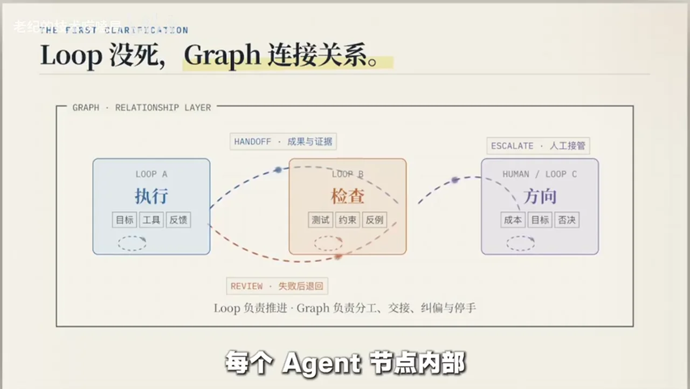

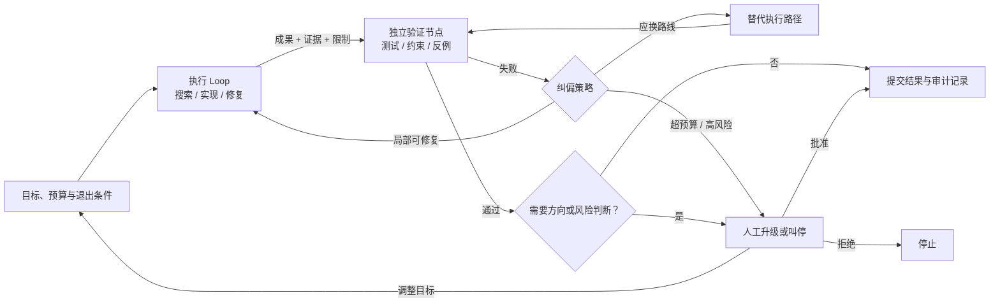

这张图的重点不是“有几个 Agent”，而是验证节点的输出能否改变路径。如果失败只能继续向前，所谓 Graph 仍是一条包装得更复杂的流水线。

## 三种 Loop，各自回答不同问题

**视频内容：** 视频用三种 Loop 解释为何需要分权：

| Loop | 核心问题          | 典型工作           | 不应独占的权力             |
| ---- | ------------- | -------------- | ------------------- |
| 做事循环 | 怎样把任务推进？      | 搜索、写代码、生成内容、修复 | 宣布自己的结果最终合格         |
| 检查循环 | 结果真的通过了吗？     | 跑测试、核对约束、找反例   | 一边检查一边悄悄修改被检查对象     |
| 方向循环 | 目标、成本和风险仍合理吗？ | 复核需求、预算、用户接受度  | 在缺少业务责任人的情况下批准高风险动作 |

**AI 辅助推断：** “独立”不等于一定换一个模型，而是至少要打破同一套上下文、假设和权限的闭环。验证可以由确定性测试、规则程序、另一个 Agent 或人承担；选择哪一种，取决于判断是否能被形式化，以及错误代价有多高。

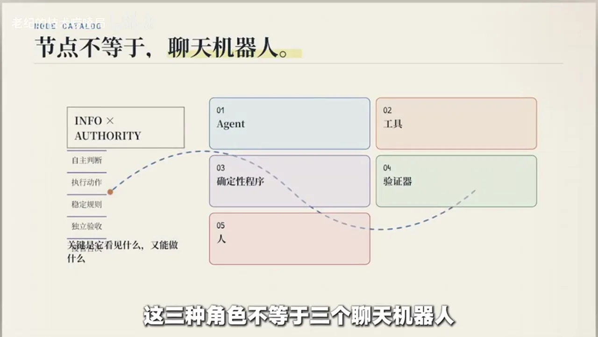

## 交接不是一句“完成了”，而是一份信任契约

**视频内容：** Graph 的脆弱点常在节点之间。上游只交付结论，下游便只能相信其自我解释；这会把错误假设沿图放大。最低限度的交接包应覆盖成果、证据、限制、未验证假设，以及后续动作的允许/禁止边界。

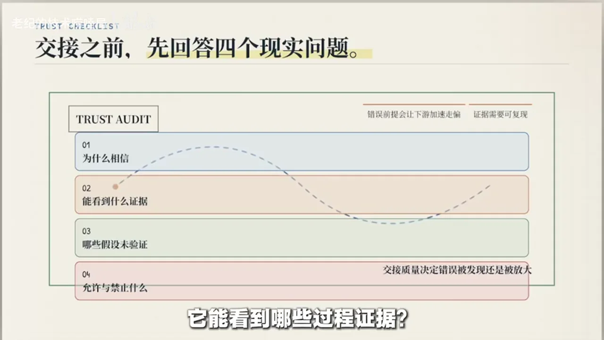

可将交接契约写成以下检查表：

- **产物**：文件、决策、数据或变更的明确位置与版本；
- **证据**：实际执行过的测试、来源、日志和约束核对；
- **未决项**：没有检查什么、为什么没检查、风险落在哪里；
- **权限**：接收节点可以读、写、部署或删除什么；
- **控制**：最大重试次数、调用预算、超限后的升级对象；
- **退出**：通过、退回、换路、等待人工与停止的明确条件。

这与 [[clips/当 AI 开始编排工程：一个可观测的软件工厂如何运转.md|可观测的软件工厂]] 的观点互补：可观测性负责留下“发生了什么”的证据，Graph 的分权结构负责决定“谁能据此做什么”。只有记录而没有否决权，审计可能沦为事后旁观；只有否决权而没有证据，判断又难以复查。

## 为什么 Graph 可以动态，但边界不能动态失控

**视频内容：** Graph 不必把每条任务支路预先画死。稳定的权限、验收、预算和人工闸口可以提前定义；具体拆成几份、走哪条支路，则可在运行中调整。动态的是任务路径，不应是安全边界。

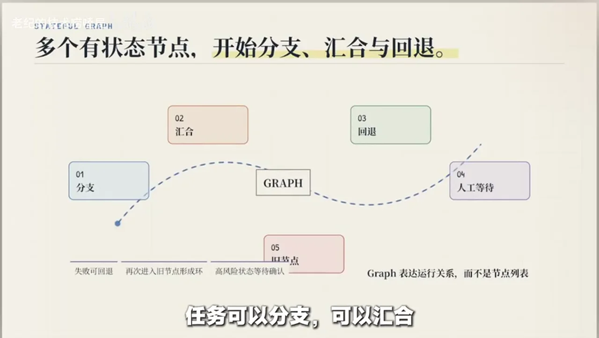

**AI 辅助推断：** 比较稳妥的设计是“外层确定、内层自适应”：

1. 外层固定可用工具、数据范围、预算、验收和升级规则；
2. 内层允许 Agent 按任务生成子任务与依赖；
3. 每次跨节点都携带可审计交接包；
4. 任何高影响动作都必须穿过确定性门禁或人工闸口；
5. 重试不只是“再来一次”，而应改变信息、策略或执行者，否则只是重复消耗。

## Loop / Graph 决策表

| 判断维度 | 更适合单 Loop       | 更适合 Graph        |
| ---- | --------------- | ---------------- |
| 依赖关系 | 严格顺序，后一步高度依赖前一步 | 可拆分、可并行、可局部恢复    |
| 工作状态 | 多步骤频繁修改同一份状态    | 各分支有相对独立的产物      |
| 验收方式 | 最终结果一次性验收即可     | 中间结果可独立验证        |
| 权限需求 | 工具与权限基本一致       | 不同角色需明显隔离权限      |
| 错误代价 | 低，失败后整体重跑便宜     | 高，需要独立检查、否决或人工升级 |
| 协调成本 | 交接成本可能高于收益      | 并行与局部恢复足以覆盖协调成本  |

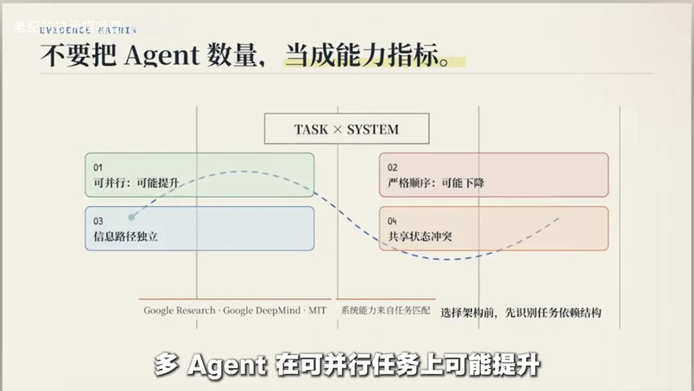

**视频内容：** 不要把 Agent 数量当作能力指标。Anthropic 的公开工程文章报告，其特定多 Agent Research 系统约使用普通聊天 15 倍 Token，这说明并行探索会带来显著调用与协调成本；该倍率并非所有系统的通则。[Anthropic 官方工程文章](https://www.anthropic.com/engineering/multi-agent-research-system)

**外部核验补充：** 当前主论文 v3 在 260 种配置、六个基准上报告，多 Agent 相对单 Agent 的变化从可分解金融推理的 +80.8% 到顺序规划的 -70.0%；作者单位包含 Google Research、Google DeepMind 与 MIT。Google Research 在 2026 年 1 月的较早博客总结使用的是当时的 180 种配置版本。[主论文 v3](https://arxiv.org/abs/2512.08296v3) · [Google Research 早期总结](https://research.google/blog/towards-a-science-of-scaling-agent-systems-when-and-why-agent-systems-work/)

## 落地时先问的三个问题

**AI 辅助推断（决策指南）：**

1. **单个 Loop 的具体失效点是什么？** 是上下文过长、权限过宽、检查不独立，还是任务确实需要并行？
2. **新增节点是否拥有真实纠偏能力？** 它能否退回、换路、阻断或升级，而不只是继续传递结果？
3. **净收益是否为正？** 独立判断、并行探索和局部恢复的收益，是否大于额外 Token、等待、冲突与审计成本？

若答案不清楚，就从一个目标明确、权限受限、退出条件清楚的 Loop 开始；只有当独立验收、权限隔离或局部恢复成为实际需求时，再把它升级为 Graph。**Loop 是执行单元，Graph 是纠偏结构。**

# Data

## 增强转写稿

[00:00] 百米决赛刚冲线，运动员还没喘匀，有人突然掏出裁判哨，又给自己数起计分牌。
[00:05] 冠军是我，判罚有效。听着像段子，可换成 Agent，很多系统正这么工作：自己写代码、跑测试，再亲自宣布通过。
[00:12] 问题不只在它可能跑错，而是从起跑、判罚到计分，赛场始终只有它一个人。
[00:17] 你再塞进几个 Agent，如果大家只会往前冲，系统依然不会纠偏。
[00:22] 系统真正要做的，就是重新分权：谁执行，谁检查，谁能退回、换路，甚至吹停比赛。Graph Engineering 这个词在 7 月突然火了。
[00:31] OpenClaw 作者 Peter Steinberger 发了一句提问：我们还在聊 Loop，还是已经转向 Graph？
[00:36] 这句只有九个英文单词的推文，很快拿到近 300 万浏览。
[00:40] 几个小时后，Hamel Husain 发了一张动图，标题更直接：Loop Engineering 已死，Graph Engineering 登场。
[00:46] 但有人追问定义时，他自己回了一句：“没人知道它是什么。”一个没有统一定义的词。
[00:51] 我们先把最容易误解的地方说清楚：Graph 没有把 Loop 淘汰。
[00:54] 每个 Agent 节点内部，通常还在跑自己的 Loop；Graph 处理的是多个 Loop 之间的关系。
[01:00] 为什么之前大家先聊 Loop？因为 Agent 工程还有一层更大的背景，叫 Harness。模型不是你造的。
[01:07] 你给它准备的提示词、上下文、工具和运行环境，都属于 Harness。
[01:11] Prompt Engineering 研究一条提示词怎么写；Context Engineering 研究模型该看到哪些信息；
[01:15] Loop Engineering 再往前一步。
[01:19] 它让模型根据状态和反馈持续运行。Loop 一直是 Agent 的基础：它看到结果，决定下一步；
[01:26] 接着调用工具，观察变化，再继续修正。目标、上下文、权限、验证方法和退出条件，都在这个循环里。
[01:34] 单个 Loop 的优势很明显：它简单、反应快，改计划也方便。小任务里，一个清楚的 Loop 往往最好用。
[01:41] 麻烦出现在任务变长以后。Loop 本身也有不同形式：有的按对话回合推进，有的盯着目标，没完成就继续；
[01:48] 有的按时间定期运行，还有的会主动观察环境，再决定是否行动。
[01:53] 无论哪一种，核心都是反馈回来以后继续调整。
[01:56] 如果生产结果、检查结果和方向判断，都由同一个 Loop 完成，它看到的是同一套上下文，
[02:02] 沿用的是同一套假设，还可能相信自己刚刚给出的解释。执行得很顺，不代表方向就是对的。
[02:08] 这是需要拆开的。不只是工作步骤，更重要的是判断权：有人负责把事情做出来，有人独立检查结果，
[02:14] 还要有人隔一段时间重新看目标有没有走偏。我们可以把它们看成三种 Loop。
[02:19] 第一种是做事循环。它搜索资料、写代码、生成内容、修复问题，目标是把眼前工作往前推。
[02:26] 第二种是检查循环。它不接着替执行者干活；它应该跑测试、核对约束、找反例。它关心的不是你做了多少，
[02:33] 而是结果到底能不能通过。
[02:35] 第三种是方向循环。它看得更慢，也看得更远：同一个问题为什么反复出现？成本还值不值得？用户真的接受这个结果吗？
[02:43] 最初目标还合理吗？
[02:45] 注意，这三种角色不等于三个聊天机器人。
[02:48] Graph 里的节点可以是 Agent，也可以是工具、确定性程序、验证器或者人。
[02:53] 关键不是节点名字，关键是它拿到什么信息，又拥有什么权限。
[02:58] 社区目前比较清楚的一点是，Graph 会组织多个执行单元：谁先做，谁能并行，检查失败后退回哪里，
[03:05] 什么时候必须让人介入。这些关系比图上有多少方框更重要。
[03:09] 但社区还有不少问题没谈拢：多大规模才值得从 Loop 交到 Graph？路线应该提前画好，
[03:14] 还是在运行中生成？多个 Agent 只是接力，还是要互相校准？这些问题现在都没有统一答案。
[03:20] 大家相对同意的是，稳定步骤和权限要先受约束；但具体任务分支和角色可以动态到什么程度，
[03:27] 这部分仍在探索。所以 Graph Engineering 现在更像一组工程问题，还不是一份固定标准：节点、状态、分支和重试。
[03:35] 其实早已有成熟实践。LangGraph 和 AutoGen 都在处理图式工作流，传统工作流系统也一直在做类似控制。
[03:42] 这轮讨论的新意不是发明了图，而是图里的 Agent 越来越自主，也越来越难预测。
[03:48] 如果所有箭头都只指向继续，那它只是一条画得更复杂的流水线。
[03:52] 真正的检查关口必须能改变路径：它可以退回、换路、阻断，或者升级给人。
[03:58] 这也是 Graph 和普通接力工作流的区别。研究 Agent 做完交给写作 Agent，写作 Agent 再交给排版 Agent，这当然是协作，
[04:06] 但它还不一定具备纠偏能力。更强的做法是让一个 Agent 实现，另一个独立评审，再有一个专门找反例。
[04:14] 必要时还要有人重新检查最初目标。它们不只接力，还会互相挑战，甚至阻断彼此。
[04:20] 这里最容易踩的坑是交接太空。上游只说一句“我完成了”，下游只能继续相信它。有效交接至少要带四类东西：
[04:28] 成果、证据、限制，还有没解决的问题。交接还要回答几个现实问题：接收方为什么该相信这份结果？
[04:36] 它能看到哪些过程证据？哪些假设还没验证？下一步允许做什么，又禁止做什么？这些信息缺一块，
[04:42] 下游就可能在错误前提上继续加速。比如实现 Loop 交出代码，同时交出测试结果和已知限制；检查 Loop 不听它怎么解释自己，
[04:51] 而是直接运行测试、核对约束，再主动找反例，这样检查才有独立性。检查失败以后，路径也要写清楚：退回给谁？
[05:00] 允许重试几次？什么时候升级给人？已经花掉多少预算？这些都不能等出事后再决定。权限也要跟着角色收紧。
[05:08] 负责检查的节点，不该顺手改掉自己正在检查的结果；负责搜索的节点，也未必需要生产环境权限。职责分开以后，工具权限也要分开。
[05:18] 还有预算和人工闸口：一个节点最多能调用多少次模型？失败几次后必须停？
[05:24] 哪些动作需要人确认？如果这些边界不清楚，动态 Graph 很容易一路扩张，结果可能是任务没完成，成本先失控。
[05:32] Graph 也不一定要提前画死。稳定步骤、权限、验收和人工闸口可以先定好；这次任务到底拆几份、走哪条支路，可以边做边调。
[05:43] 外层先定边界，内部再按任务变化。有人把运行中临时形成的任务依赖叫作 Work Graph，这个说法有助于理解，
[05:51] 但它还不是统一术语，更不是已经验证完成的工程结论。不要看到新名词，就急着把所有流程改名。
[05:58] 而且 Work Graph 这个词本身有歧义。有人用它描述一次运行里临时形成的任务依赖，但 Asana 早就用 Work Graph
[06:06] 指另一套工作数据模型。同一个名字并不代表同一种技术定义。换成程序结构来看会更直观：Prompt Engineering 像单参数函数，
[06:15] Context Engineering 像拿到多组上下文的函数；Harness 再把工具、权限和运行环境接进来；Loop 让程序读取反馈、持续调整；
[06:24] 到 Graph，多个带状态的节点被连到一起。任务可以分支，可以汇合；检查失败后可以回退，必要时还能停下来等人确认。
[06:33] 路径里如果重新进入旧节点，就会出现环。有限状态机可以帮助理解这种控制关系：系统根据结果在不同状态之间切换，直到满足退出条件。
[06:43] 但这只是类比。图论和状态机都不是今天才出现的新技术。真正变化的是 Agent 节点本身：它会自己拆任务、改计划、调用工具，
[06:52] 还可能直接修改真实环境。过去工作流和分布式系统里的控制方法，现在要面对更自主、更不确定的节点。
[06:59] 这也是传统 Workflow 和 Agent Graph 的差别。传统步骤通常按预设逻辑执行，Agent 节点却可能自己找路、临时改计划。
[07:08] 它还能调用工具影响真实环境。控制对象变得更主动以后，验收、权限和否决权都要重新设计。
[07:15] 那什么任务值得用 Graph？任务最好能拆成相对独立的部分，不同部分需要不同信息、工具或权限；
[07:22] 中间结果可以单独验收，失败后也只需重做局部。广泛搜索和并行探索通常更适合多 Agent，因为多个方向可以同时推进。
[07:31] 某一路失败，也不必推倒全部结果。这些协调成本，可能换来更快的探索和局部恢复。比如多 Agent Research：一个节点查技术资料，
[07:41] 另一个查市场信息，还有节点核对来源和矛盾点。这些方向能并行展开，各路结果再汇总，比一条线从头查到尾更有机会获得收益。
[07:50] 严格顺序的任务就不一样。每一步都依赖上一步，所有 Agent 还频繁修改同一份内容。这时多开几个 Agent 可能只会增加沟通和冲突，一个清楚的 Loop 更省事。
[08:00] 成本也不能忽略。Anthropic 的官方工程文章提到，多 Agent Research 系统的 Token 使用量大约是普通聊天的 15 倍。15 倍不是小数目，它意味着更多调用、更长等待，还有更多协调失败的机会。
[08:14] Google Research、Google DeepMind 和 MIT 的实验也给出一个提醒：多 Agent 在可并行任务上可能提升，但在严格顺序任务里表现可能下降。
[08:23] 所以不要把 Agent 数量当成系统能力的直接指标。下次再看到一张 Graph，可以先问三个问题：它比一个 Loop 多解决了什么关系？
[08:32] 检查结果能不能真的退回、换路或叫停？新增的协调成本，是否小于独立判断和局部恢复带来的收益？
[08:39] 如果这三个问题都答不清，Graph 很可能只是架构图变复杂了。如果任务能拆开，中间结果能独立验收，还确实需要不同信息、工具或权限，这时 Graph 才更可能带来净收益。
[08:52] Loop 没死，它继续负责让局部工作往前走；Graph 要解决的是多个 Loop 怎么分工、交接、纠偏和停手。从一个清楚的 Loop 开始，需要分权时再画 Graph。
[09:03] 记住这句话：做不到纠偏，Graph 只是一张更贵的流程图；做得到，工程问题才会从“一个 Agent 怎样反复做事”，变成“多个 Loop 怎样协作，又怎样避免一起走偏”。

## 原始转写稿

[00:00] 百米决赛刚冲现,运动员还没喘云,有人突然套出裁判哨,又给自己数起计分牌。
[00:05] 冠军是我,判罚有效,听着像段子,可换成agent,很多系统正这么工作,自己写代码跑测试,再亲自宣布,
[00:12] 通过问题不止在他可能跑错,而是从起跑,判罚到计分,赛场始终只有他一个人。
[00:17] 你再赛进几个agent,如果大家只会往前冲,系统依然不会久偏。
[00:22] 是,冠军要做的,就是重新分权,谁执行,谁检查,谁能退回,换路,甚至吹停比赛,graph engineering这个词在7月突然火了。
[00:31] Open Cloud作者,Peter Steinberger,发了一句提问,我们还在聊loop,还是已经转向graph。
[00:36] 这句只有九个英文单词的推文,很快拿到近300万浏览。
[00:40] 几个小时后,Hammelsson发了一张动图,标题更直接,loop engineering 以死graph engineering 登场,
[00:46] 但有人追问定义时,他自己回了一句,没人知道他是什么,一个没有统一定义的词,
[00:51] 我们先把最容易误解的地方说清楚,graph 没有把loop 淘汰,
[00:54] 每个agent 节点内部,通常还在跑自己的loop,graph 处理的是多个loop 之间的关系。
[01:00] 为什么之前大家先聊loop,因为agent 工程还有一层更大的背景,叫harness,模型不是你造的。
[01:07] 你给他准备的提示词,唱下文,工具和运行环境,都属于harness.
[01:11] prompt engineering,研究一条提示词怎么写,compact engineering,
[01:15] 研究模型该看到哪些信息,loop engineering 再往前一步,
[01:19] 他让模型根据状态和反馈,持续运行,loop 一直是agent 的基础,他看到结果,决定下一步。
[01:26] 接着,调用工具,观察变化,再继续修正,目标,上下文,权限,验证方法和退出条件,都在这个循环里。
[01:34] 单个loop 的优势很明显,它简单,反应快,改计划也方便,小任务里,一个清楚的loop 往往最好用。
[01:41] 麻烦出现在任务变长以后,loop 本身也有不同形式,有的按对话回合推进,有的盯着目标,没完成就继续,
[01:48] 有的按时间定期运行,还有的会主动观察环境,再决定是否行动。
[01:53] 无论哪一种,核心都是反馈回来以后继续调整。
[01:56] 如果生产结果、检查结果和方向判断,都有同一个loop 完成,他看到的是同一套上下文,
[02:02] 演用的是同一套假设,还可能相信自己刚刚给出的解释,执行得很顺,不代表方向就是对的。
[02:08] 这是需要拆开的,不只是工作步骤,更重要的是判断权,有人负责把事情做出来,有人独立检查结果,
[02:14] 还要有人隔一段时间重新看目标有没有走偏,我们可以把他们看成三种loop。
[02:19] 第一种是做事循环,他搜索资料,写代码,生成内容,修复问题,他的目标是把眼前工作往前推。
[02:26] 第二种是检查循环,他不接着替执行者干活,他应该跑测试,核对约束,找反例,他关心的不是你做了多少,
[02:33] 而是结果到底能不能通过。
[02:35] 第三种是方向循环,他看得更慢,也看得更远,同一个问题为什么反复出现,成本还值不值得,用户真的接受这个结果吗?
[02:43] 最初目标还合理吗?
[02:45] 注意,这三种角色不等于三个聊天机器人。
[02:48] graph里的节点可以是agent,也可以是工具,确定性程序,验证器,或者人。
[02:53] 关键不是节点名字,关键是他拿到什么信息,又拥有什么权限。
[02:58] 社区目前比较清楚的一点是graph会组织多个执行单元,谁先做,谁能并行,检查失败后退回哪里,
[03:05] 什么时候必须让人介入,这些关系比图上有多少方框更重要,
[03:09] 但社区还有不少问题没弹拢,多大规模才值得从loop交到graph,路线应该提前画好,
[03:14] 还是运行中在生成,多个agent只是接力,还是要互相较准,这些问题现在都没有统一答案,
[03:20] 大家相对同意的是,稳定步骤和权限要先受约束,但具体任务分支和角色可以动态到什么程度,
[03:27] 这部分仍在探索,所以graph engineer现在更像一组工程问题,还不是一份固定标准,节点,状态,分支和宠事,
[03:35] 其实早已有成熟时间,landgraph和autogen都在处理图示工作流,传统工作流系统也一直在做类似控制,
[03:42] 这轮讨论的心意不是发明了图,而是图里的agent越来越自主,也越来越难预测,
[03:48] 如果所有箭头都只指向继续,那它只是一条画得更复杂的流水线,
[03:52] 真正的检查关口必须能改变路径,它可以退回,换路,阻断,或者升级给人,
[03:58] 这也是graph和普通接力工作流的区别,研究agent做完交给写作agent,写作agent再交给排版agent,这当然是写作,
[04:06] 但它还不一定具备揪篇能力,更强的做法是让一个agent实现另一个独立评审,再有一个专门找反例,
[04:14] 必要时还要有人重新检查最初目标,他们不只接力,还会互相挑战,甚至阻断彼此,
[04:20] 这里最容易踩的坑是交接太空,上游只说一句我完成了,下游只能继续相信它,有效交接至少要带四类东西,
[04:28] 成果,证据,限制,还有没解决的问题,交接还要回答几个现实问题,接收方为什么该相信这份结果,
[04:36] 它能看到哪些过程证据,哪些假设还没验证,下一步允许做什么又禁止做什么,这些信息缺一块,
[04:42] 下游就可能在错误前提上继续加速,比如实现loop交出代码,同时交出测试结果和已知限制,检查loop不听它怎么解释自己,
[04:51] 而是直接运行测试和对约束,再主动找反例,这样检查才有独立性,检查失败以后路径也要写清楚,退回给谁,
[05:00] 允许重视几次,什么时候升级给人,已经花掉多少预算,这些都不能等出事后再决定,全线也要跟着角色收紧,
[05:08] 负责检查的节点,不该顺手改掉自己正在检查的结果,负责搜索的节点,也未必需要生产环境权限,职责分开以后工具权限也要分开,
[05:18] 还有预算和人工扎口,一个节点最多能调用多少次模型,失败几次后必须停,
[05:24] 哪些动作需要人确认,如果这些边界不清楚,动态graph很容易一路扩张,结果可能是任务没完成,成本先失控,
[05:32] graph也不一定要提前化死,稳定步骤,权限,验收和人工扎口,可以先定好,这次任务到底拆几分,走哪条之路,可以边做边调,
[05:43] 外层先定边界,内部再按任务变化,有人把运行中临时形成的任务依赖叫做workgraph,这个说法有助于理解,
[05:51] 但它还不是统一术语,更不是已经验证完成的工程结论,不要看到新名词,就急着把所有流程改名,
[05:58] 而且workgraph这个词本身有奇异,有人用它描述一次运行里临时形成的任务依赖,但assana早就用workgraph,
[06:06] 只另一套工作数据模型,同一个名字并不代表同一种技术定义,换成程序结构来看会更直观,prompt engineering向单参数含述,
[06:15] context engineering向拿到多组上下文的含述,harness再把工具权限和运行环境接进来,loop让程序读取反馈,持续调整,
[06:24] 到graph,多个带状态的节点被连到一起,任务可以分支,可以汇合,检查失败后可以回退,必要时还能停下来等人确认,
[06:33] 路径里如果重新进入旧节点,就会出现还,有限状态机可以帮助理解这种控制关系,系统根据结果在不同状态之间切换,直到满足退出条件,
[06:43] 但这只是类比,图论和状态机都不是今天才出现的新技术,真正变化的是agents节点本身,它会自己拆任务,改计划,调用工具,
[06:52] 还可能直接修改真实环境,过去工作流和分布式系统里的控制方法,现在要面对更自主,更不确定的节点,
[06:59] 这也是传统workflow和agentgraph的差别,传统步骤通常按预设逻辑执行,agents节点却可能自己找路,临时改计划,
[07:08] 它还能调用工具影响真实环境,控制对象变得更主动以后,验收,权限和否决权都要重新设计,
[07:15] 那什么任务值得用graph,任务最好能拆成相对独立的部分,不同部分需要不同信息工具或权限,
[07:22] 中间结果可以单独验收,失败后也只想重做局部,广泛搜索和并行探索,通常更适合多agents,因为多个方向可以同时推进,
[07:31] 走一路失败,也不必推导全部结果,这是协调成本,可能换来更快的探索和局部恢复,比如多agentresearch,一个节点查技术资料,
[07:41] 另一个查市场信息,还有节点核对来源和矛盾点,这些方向能并行展开,各路结果在会总,比一条线从头查到尾更有机会受益,
[07:50] 严格顺序的任务就不一样,每一步都依赖上一步,所有agent还频繁修改同一份内容,这时多开几个agent可能只会增加沟通和冲突,一个清楚的路负更省事,
[08:00] 成本也不能忽略,EnterPublic的官方工程文章提到多agentresearch系统的token使用量,大约是普通聊天的15倍,15倍不是小数目,他意味着更多调用,更常等待,还有更多协调失败的机会。
[08:14] Google Research,Google DeepMind和MIT的实验也给出一个提醒,多agent在可并行任务上可能提升,但在严格顺序任务里表现可能下降,
[08:23] 所以不要把agent数量当成系统能力的直接指标,下次再看到一张graph可以先问三个问题,他比一个loop多解决了什么关系,
[08:32] 检查结果能不能真的退回换路或叫停,新增的协调成本,是否小于独立判断和局部恢复带来的收益。
[08:39] 如果这三个问题都答不清,graph很可能只是架构图便复杂了,如果任务能拆开,中间结果能独立验收,还确实需要不同信息、工具或权限,这时graph才更可能带来进手意。
[08:52] loop没死,他继续负责让局部工作往前走,graph要解决的是多个loop怎么分工、交接、揪篇和停手,从一个清楚的loop开始,需要分拳时再划graph。
[09:03] 记住这句话,做不到揪篇,graph只是一张更贵的流程图,做得到,工程问题才会从一个agent怎样反复做事,变成多个loop怎样协作,又怎样避免一起走篇。

## 原始关键帧

### 关键帧 1

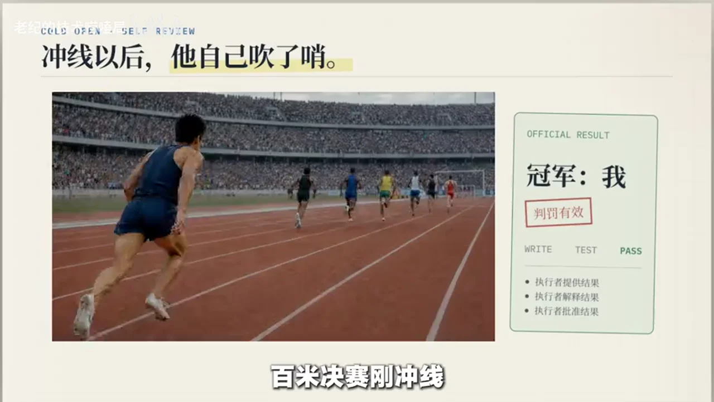

### 关键帧 2

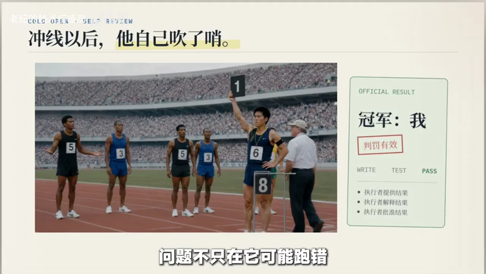

### 关键帧 3

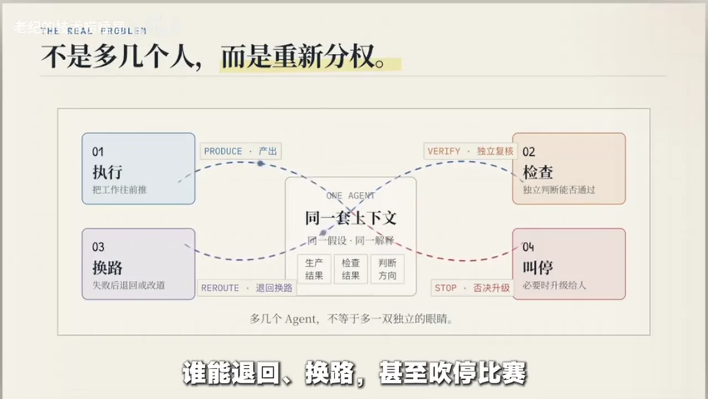

### 关键帧 4

### 关键帧 5

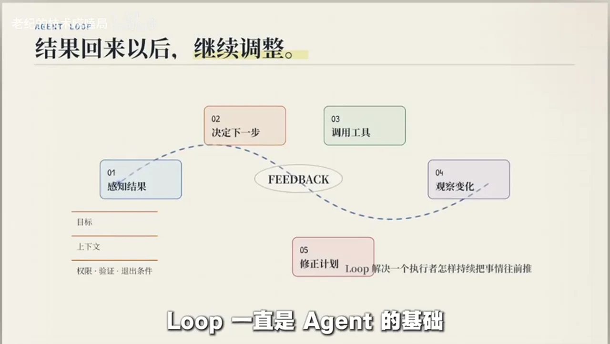

### 关键帧 6

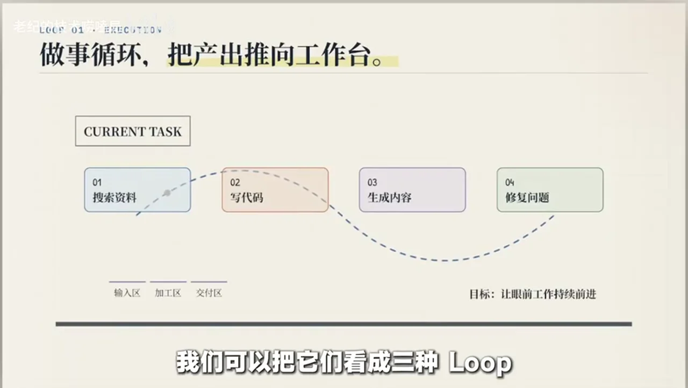

### 关键帧 7

### 关键帧 8

### 关键帧 9

### 关键帧 10

