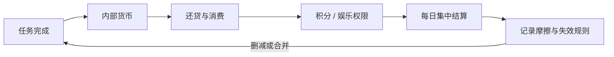

# 总结稿

[打开单页 HTML 总结](assets/bilibili-BV1o5ud6kEx9-summary.html)

## 核心结论

作者复盘个人“大图书馆 1.4”自我激励系统：把学习、健康与内容生产任务换成内部货币，再用于消费、借贷、积分和娱乐权限；同时用奥卡姆剃刀式的“如无必要，勿增实体”删减无效模块、合并流程并改为每日集中结算。[00:00–08:05] 视频价值在于展示个人规则系统的迭代过程，不构成普遍有效的行为科学方案。

## 1.4 的主要调整

- 合并缺乏约束力的模块，减少重复实体和纸面记录。[02:04–03:14]
- 把任务收益、还贷、消费与积分纳入每日结算路径，倾向睡前集中对账而非每次即时处理。[03:14–04:51]
- 为阅读、书法、自媒体、英语、减肥和知识点设置个人化货币/兑换表，并反思盖章等操作是否冗余。[08:00–09:42]
- 保留借贷、逾期、双倍偿还、停贷以及娱乐权限等规则，但作者也承认系统继续变复杂，并提醒新手风险。[11:00–20:02]
- 结尾邀请观众讨论自己的系统与利率设计。[29:01–32:03]

## 证据边界

> [!warning] 个人经验，不是普遍因果结论
> 画面能证明作者在 Obsidian 中记录、迭代并自报使用这套规则；不能证明货币、债务、惩罚或抽奖会普遍提升自律。`fact-check.json` 没有提取需外部核验的客观事实主张。

- 奖励数值、结算顺序、娱乐限制和利率都只适合视为个人参数。
- 债务、双倍偿还和停贷可能增加羞耻、回避或维护负担；不应包装成通用建议。
- Gemini/AI 参与是作者工作流陈述，不保证模型记忆、规则执行或结算可靠。
- 最可迁移的方法是：从最小闭环开始、记录摩擦、定期删除无效规则，并允许无惩罚退出。

## 观众讨论与补充

本次仅 7 条热门顶层候选（平台报告 32）和 0 条当前可访问弹幕。值得保留的从属意见包括：复杂后会降低使用意愿；建议扩展文化娱乐类别；询问是否直接交给 Gemini。它们提示采用成本、范围和上手说明问题，但嵌套回复不可见，也不是效果证据。热门样本不能代表总体。

# 辅助理解

## 辅助理解

### 把它看成个人实验，而不是模板

系统覆盖多个生活领域，并借助 Gemini 与 Obsidian 记录规则。[00:00–03:14] 评估它时要区分：作者的规则、自报体验、可观察行为记录，以及尚未验证的因果解释。

### 最小闭环

最小版本只需四件事：一个目标行为、一种即时记录、一种有限奖励、一个固定复盘日。若新字段、币种或惩罚不能改变决策，就先删掉。视频的 1.4 合并与日结正是在降低运行成本。[02:04–04:51]

### 复杂度预算

| 新规则带来的收益 | 新规则带来的成本 |
|---|---|
| 更精细区分任务 | 更多记忆与对账 |
| 延迟满足和游戏感 | 规则套利、负债压力 |
| 更强约束 | 失败后的回避和弃用 |

### 安全的个人 A/B 复盘

1. 每次只改变一条规则，运行固定周期。
2. 记录完成率之外的摩擦：耗时、漏记、压力和退出冲动。
3. 预设删除条件，而不是不断补丁。
4. 不把内部“债务”与道德价值绑定，保留暂停和重置机制。

> [!note] 观众小样本中的复杂度担忧，与作者的删减目标相呼应；这是一条设计审查线索，不是对效果的统计验证。

## 外部事实核验

> 外部事实核验已完成（2026-08-27），未发现值得独立核验的客观声明。

# Data

## 增强转写稿

[00:00] 大家好,欢迎来到本期大图书馆1.4,是的,我们已经更新到1.4了
[00:05] 1.3为什么没有拍呢?是因为那时候比较混乱,就觉得这个系统有比较大的一个运行问题
[00:11] 然后这几天通过这个快速增长这个积分,所以说这个系统就运行得非常欣欣向荣啊
[00:19] 然后现在主要的目的呢,就是把整一个系统进行精简化,就像拿一把奥卡姆剃刀一样
[00:27] 它就是其实我发现运行这个系统,它不需要特别多的项目
[00:31] 它最好运行的越干净越好,所以说我对于第一次的1.1版本进行一个大操刀
[00:38] 首先呢,更改是关于这个第一个打卡部门是完全砍去的
[00:43] 因为我发现其实跟AI打卡和你自己去打卡是一样的
[00:47] 但我觉得这个部分不代表它没用
[00:50] 其实1.2这个版本它是属于是让你能够一步一步进入到这个系统当中的
[00:56] 这个东西我现在不需要它了,但不代表它之前存在的那部分没有小作用
[01:02] 然后所以说现在1.4的版本,我现在就不强制打卡,AI打卡了,全部转为纸质记录
[01:08] 但是需要进行一个记账统计来防止出现兑换错误
[01:13] 第二个部门是这个货币系统,这个我们等会儿再说哈,这个比较多
[01:18] 包括我这个笔记改了一个版,这样可能更好看一点
[01:21] 然后第三个部门,以前的这个风控与审计部,我也把它进行了一个取消
[01:26] 因为我发现它的这个运行逻辑有点问题
[01:29] 就是,如果你要制定一个惩罚措施,你不能用
[01:34] 如果你做得不好就没有干什么的权利来惩罚
[01:37] 就比如说,如果我出现了积分个话没有进行增长的话,我就不能使用商店
[01:43] 其实不能用使用商店这个事情,不需要我用规则写出来
[01:48] 因为我没有积分,我就无法消费
[01:51] 所以说,有时候你在负债,或者说当你状态不好的时候
[01:56] 你确实是需要用一个惩罚来唤醒你的计划
[01:59] 其实是这样的规则是完全纸面的,它就纯属是一个
[02:04] 无用的东西放在这里,没有具备约束能力
[02:08] 所以我就把它跟接待处融合了
[02:11] 然后这个版本其实主要更新的还是接待处和消费系统
[02:14] 还有积分系统,其实各个地方都有一些小的改动
[02:19] 先做一个版本汇报,首先是1.3版本
[02:24] 进行了一个1.2版本的一个改化
[02:27] 因为大家只能看到我1.2版本嘛
[02:30] 1.2版本的那两个处更新,一个是购物的更新
[02:34] 就是各种各样的线下消费
[02:38] 包括在待处的更新就是关于如果还不了债
[02:42] 就达报债款的这个两条情况都太难了
[02:46] 所以我觉得如果状态不好,那么这两条债款
[02:50] 这两条款目能把你直接拖向破产
[02:54] 所以说1.3进行了一个全部重构
[02:58] 然后但是我发现我重构完了这个东西也有点难
[03:03] 我们就一个一个来说
[03:06] 所以说早知道1.3做视频了
[03:10] 其实这个更改的路径其实是我觉得挺有意思的
[03:14] 大家可以通过更改路径来从中提取到对你有用的部分
[03:17] 因为对我来说1.3是个混乱的时期
[03:21] 我就怕觉得大家都是在水视频所以我压根没拍
[03:23] 那我就精简一点说,可能会比较麻烦
[03:26] 首先这些蓝框的区域就是已经不会变的
[03:29] 对于某一个体系的一个解释,所以把它高高挂起
[03:32] 剩下的话就是提头写什么版本,就是什么版本更新的
[03:36] 首先我们在货币系统里面主要更新的第一个区域就是
[03:41] 每日货币的结算路径要进行一个公式
[03:44] 为了保证因为AI系统不再参与到打卡和计算
[03:48] 所以要保证人力自己去对话的时候不要说任何错误
[03:52] 昨天晚上就出现了一个错误
[03:53] 就是我忘记了到底有没有去拿这个货币
[03:57] 所以我们进行一个规范操作,SOP
[04:00] 首先就是先拿货币,归还贷款
[04:03] 然后支付消费的款目
[04:05] 然后如果支付不了就进入贷款
[04:08] 然后之后再去管积分,就是货币管,管积分
[04:12] 先拿取积分,然后消费积分
[04:15] 然后如果有特殊桌的任务,我就再去进行一个抽奖
[04:20] 之后最后一步就是要建立一个表格压浪东西
[04:25] 来记录每日份的收支
[04:26] 然后剩余积分和剩余的金币以及运行的版本
[04:31] 然后这里我觉得我想了一下其实这条准则
[04:35] 虽然说看起来规范那其实是有可操作的地方
[04:39] 这个需要看你觉得你是哪一种类型去更改吧
[04:45] 对于我来说我现在的最大问题就是我会记错
[04:48] 所以我选择全部在晚上睡觉之前去先结算
[04:52] 但是其实货币系统和积分系统是两种奖励
[04:56] 因为货币系统是一个长期运行
[04:59] 积分它是可以进行你完成这个任务
[05:02] 就给你积分来形成一个怎么说饭市吧
[05:06] 可以让你觉得消费是及时的然后赚取金币的现况也是及时的
[05:10] 所以说我觉得其实积分这个系统很适合你在完成任务的时候就当下拿走
[05:17] 像我第二条说的它是一个及时反馈的过程
[05:20] 它其实是一个比较爽的一个过程
[05:22] 所以说你可以把单独拎出来
[05:25] 你可以像我一样就是全部放到晚上
[05:29] 当然你也可以选择全部都在完成之后直接去弄
[05:33] 当然这三条都是你可以自己去选择的
[05:35] 每一条都有它自己的弊端
[05:37] 就看你自己是一个什么样的情况
[05:39] 所以这是一个小小的更新
[05:41] 一个完善之后任务栏这部分我把任务栏的纸质部分同步到的这里
[05:48] 然后任务栏更改的一些小项
[05:50] 首先是因为我之前说过我的减肥的健康币
[05:54] 它的获取难度过大
[05:56] 所以我又想了一下
[05:58] 你看书籍其实这个东西
[06:00] 比如说漫画是每天都可以拿的
[06:02] 就读一本漫画很赞的
[06:04] 然后可能文学或者社科类
[06:06] 两三天就可以拿三四分
[06:09] 也就是说书籍这个东西是一天可以至少挣一个的
[06:13] 英语我现在是一天能看精读能看六篇
[06:16] 所以我英语现在大概是能转八到十二个这个范畴
[06:20] 那它是因为我的计分系统导致了
[06:22] 这个货币赚得比较多
[06:24] 我们把它排除在外的话
[06:25] 书法的话也是一天内两个小时
[06:27] 就是刚开始起步的一个范围
[06:29] 那自媒体我要是每天发视频
[06:31] 也是一天可以发一个的
[06:32] 那笔记也差不多
[06:34] 大概是一天可以到一到两个
[06:36] 所以说我才发现我这个减肥相关的这个
[06:40] 货币它设定的难度比较高
[06:41] 所以我进行了一个转换
[06:43] 但是没有降低任务难度
[06:45] 任务还是这些任务
[06:46] 只不过任务和货币之间的兑换的
[06:49] 这个效率变高了
[06:50] 比如说我控制饮食是五换一嘛
[06:53] 那这是正常的
[06:54] 早起也是
[06:55] 但是我分两个档次
[06:56] 因为最近你在早起嘛
[06:58] 然后七点半之前是两个章
[07:00] 然后七点半到九点是一个章
[07:03] 之后每五个章换一个章
[07:05] 最后其实之前大了改向的是这个专项运动
[07:08] 以前是完成30分钟运动给一个章
[07:11] 现在是完成10分钟运动给一个章
[07:13] 这样的话其实可以保证
[07:15] 如果我每天运动一个小时就肯定能获得一个章
[07:18] 这才是一个正常的兑换比例嘛
[07:20] 所以说大概是改了一项这个内容
[07:22] 大家也可以去想一想
[07:23] 就按照你每天每一个类型就能转一个B的这个效率去
[07:29] 评估一下这个任务和货币之间的兑换率
[07:32] 是不是过难或过简单
[07:34] 就是就把主力排出去
[07:36] 一定要把英语这个主力排出去
[07:37] 因为要是一线以英语看齐的话
[07:40] 这个系统就没有办法去衡量了
[07:42] 毕竟精英分系统导致英语这个东西
[07:44] 它是一个过大笔众的一个情况
[07:47] 再之后的话
[07:48] 我发现我这个集章处
[07:49] 其实我也进行了一个物理上的小改变
[07:52] 就规则上没有变动
[07:53] 只不过我一开始是控制饮食是一个章的A图案
[07:58] 然后运动是B图案
[07:59] 吃饭是C图案
[08:00] 这样会导致盖的时候出现没必要的冗杂
[08:05] 因为我不需要通过集章来看
[08:07] 我今天到底运动了什么
[08:09] 吃了什么
[08:10] 因为我在我的日记本上有记录
[08:12] 所以说我决定只要是就是这里
[08:15] 每一种货币的兑换
[08:17] 仅可以用一个一章来代替
[08:19] 因为他们都是几换一嘛
[08:22] 就不论就是饮食开一夜
[08:25] 饮食和早起开一夜
[08:26] 然后专项运动它是六换一嘛
[08:28] 那就自己开一夜
[08:29] 这样就可以不用来回导换这个印章
[08:32] 大概是这样子
[08:33] 就可以减少一些运行的成本
[08:36] 时间成本
[08:38] 最后就是消费区
[08:39] 消费区1.4版本其实没有进行改革
[08:42] 因为最近没消费
[08:44] 然后大部分都是咖啡店进行学习
[08:52] 我还是对这个小点也是进行了一个改的
[08:54] 因为现在的知识点币
[08:56] 还能通过影视笔记和读书笔记来赚取
[09:00] 但这两个东西还是有限的
[09:01] 所以说我就写了一条补充条例
[09:04] 就如果无法通过笔记来换取知识点渠道
[09:08] 对于我来说
[09:09] 一天去看一个课程
[09:10] 其实是一个满类的过程
[09:11] 大概需要两三个小时
[09:13] 那么如果去一次咖啡店
[09:15] 需要一个知识点的话
[09:16] 它就太贵了
[09:17] 所以就可以改为两银币或者三银币
[09:19] 两银帮或者三银帮一份
[09:21] 因为银帮的东西现在对我来说
[09:22] 实在是跟流水一般的就来到我的账户里
[09:26] 我昨天算了一下
[09:28] 我昨天的累积获得银帮应该得有40个
[09:34] 所以说现在这个银帮有点
[09:36] 确实有点不太值钱
[09:38] 然后改良了一下
[09:40] 这个是一点下的版本
[09:40] 也没跟大家说过
[09:41] 所以我也说一下
[09:43] 首先1.2的改革效果不好
[09:45] 因为1.2改革效果太难了
[09:48] 难就难在这个任意货币抽取上
[09:51] 因为英语这东西它太多了
[09:53] 导致剩下其他这个东西
[09:55] 它要是抽一个的痛度和英语抽一个的痛度
[10:00] 是不一样的
[10:01] 抽奖这方面还是保留了
[10:03] 因为我觉得抽奖这个机制是可以激励你去
[10:07] 每一个方面都顾到的
[10:09] 不会说只去形成一种日常的模式
[10:14] 就一直去只做这一些方面
[10:15] 因为6个方面
[10:17] 你肯定每天又没有做到的地方
[10:19] 那么通过抽奖到你没有这个方面的货币
[10:23] 到你需要还债的地步
[10:25] 那你就会去做这个方面的东西
[10:28] 这算是一种激励的一个小技巧
[10:31] 所以说抽奖的这个
[10:32] 抽需要付什么货币这东西还是留下来了
[10:35] 但就是难度没那么高
[10:37] 电影票、游戏和咖啡店这些
[10:39] 我都不说了
[10:40] 主要还是说这个
[10:41] 线下KKA1加无印还有这个网购
[10:45] 但我都是放在一张表上去写的
[10:47] 首先就是分了四个档次
[10:48] 首先是0到20、20、20、40、40到80、80到100
[10:51] 大家能看见
[10:52] 然后还是是
[10:54] 这个N怎么理解的
[10:55] 就是举下的10位数
[10:57] 比如说我是一个20块钱的东西
[10:59] 那我就只需要付两个货币
[11:00] 任意两个货币就可以了
[11:02] 如果是20到40这个阶段
[11:05] 我就是需要付
[11:06] 比如说我花了30块钱
[11:08] 我就需要付两个任意的货币加抽
[11:12] 通过摇晒的方式来决定
[11:15] 到底要用哪一个
[11:16] 那我就是需要付两个英镑加上抽的
[11:19] 这一个货币就可以了
[11:21] 一个货币的还款难度是比较低的
[11:25] 所以说大概也就是这个样子
[11:27] 之后这个
[11:28] 比如说到了50块钱的时候
[11:30] 我需要给三个任意货币
[11:33] 之后要抽两个
[11:34] 这两个是要抽两次的
[11:35] 并不是说抽一种的两个
[11:37] 而是抽两次
[11:39] 当然如果你觉得这方面
[11:41] 你可能会还的比较好一点
[11:43] 你可以去看一下1.2这一部分的这个系统
[11:46] 会更加难一点
[11:47] 大家都可以去尝试一下
[11:49] 我这个就是一个简单一点的
[11:51] 简易一点的难度
[11:54] 之后剩下的话就是食品这方面
[11:56] 我也是稍微写的简单了一点
[11:59] 比如说没有进行那么多种类的定义
[12:04] 主要的思路还是在正常物品10换1的基础上
[12:09] 对于食物这种物品进行10换2的一个程度
[12:14] 然后因为大餐这个事情
[12:15] 很多人请我吃饭
[12:17] 这真没办法
[12:17] 我是真不想去
[12:18] 但是真不能不去
[12:20] 所以说如果我自己想去
[12:22] 那我就需要付钱
[12:23] 但如果别人请客的话
[12:24] 我就不付了
[12:25] 因为别人请客的话
[12:26] 其实我也不会吃太多
[12:27] 所以说就进行一个饶数自己
[12:31] 这是网购
[12:32] 网购的话
[12:33] 还是那句话就是非必要消费
[12:35] 举个例子
[12:35] 我昨天其实买了一个活液纸
[12:38] 但这个活液纸我买的时候
[12:39] 不是因为我喜欢它
[12:41] 对它好看而买这个活液纸
[12:43] 而是因为我没有活液纸了
[12:44] 我没有这个类型的活液纸
[12:46] 我去买的活液纸
[12:47] 所以它就不需要进入消费区
[12:49] 但是你也可以选择记住
[12:50] 这个就看大家自己
[12:52] 好
[12:52] 来到我们重磅改革
[12:54] 我们现在讲1.3的接待处
[12:56] 1.3的接待处进行了一个
[12:59] 还债时间的扩大
[13:01] 因为1.2的接待处的还债时间
[13:04] 做得非常潦草
[13:06] 就是说1-5个货币大概还几天
[13:09] 然后5个以上还几天
[13:10] 其实这个方法我是不赞成的
[13:14] 因为每个货币它的获取难度不同
[13:17] 就像是我刚刚说的
[13:18] 可能英报你欠10个我也能一天还
[13:20] 但是你要是欠知识点币的话
[13:22] 我觉得可能就需要好几天
[13:24] 所以说我会根据每个货币
[13:27] 它的归还难度的情况
[13:30] 来决定它的归还时间
[13:32] 这个表看起来虎人
[13:33] 但其实也就那样
[13:35] 大家来看一眼
[13:37] 首先我们把第一当做欠债当天
[13:40] 比如说今天8月8号
[13:43] 那如果我欠了一个英报
[13:45] 我就必须要在第二天还
[13:47] 就是8月9号还
[13:48] 如果我欠了两个到5个英报
[13:51] 我就必须要在第四还
[13:53] 就是8月8+3等于8月11还
[13:58] 你大概懂吗
[13:59] 然后解释一下这个2*n-1是什么意思
[14:02] 这个好像肯定才更复杂一点
[14:04] 比如说我欠一个健康币
[14:07] 然后我需要在第四还
[14:09] 就是8月1号欠了
[14:11] 我需要在8月11还
[14:13] 对吧
[14:14] 中间隔了4天
[14:15] 第四吗
[14:16] 然后如果我欠了两到5个
[14:18] 就是在8月11的基础上
[14:21] 每多欠一个多加两天的欠债时间
[14:27] 2n-1就比如说n
[14:29] 就是这个借债数量
[14:31] 把2带进去的话就是2*1
[14:33] 意思就是说只要多一个
[14:35] 我就多两天的时间
[14:37] 比如说3的话那么就是4天
[14:42] 对吧
[14:43] 4的话就是6天
[14:46] 对吧
[14:46] 就是这4+6天
[14:49] 往后延6天就行
[14:51] 懂了吗
[14:52] 应该懂懂
[14:52] 不懂的话可以去评论区问我
[14:54] 意思类推这也是一样的
[14:57] 当时是做了一个比较详细的一个划分
[15:00] 然后还是把我之前的大博的条款留住了
[15:04] 就是说若在欠债期间不能按时间规缓
[15:07] 则对剩余货币进行双倍处理
[15:10] 我还特意写了一个警告
[15:11] 就是真的这个条目能够决定
[15:14] 你能不能坚持到这个系统
[15:16] 因为你要是状态不好
[15:18] 它就负债容易非常多
[15:20] 所以说此条慎重实施
[15:22] 若负债过多可忽略此条
[15:23] 很有可能导致系统负面
[15:25] 建议此系统执行两个月以上之后
[15:27] 再按需实施
[15:29] 若在或在实施此条中加入适当奖励
[15:33] 此条为困难难堵 心事无辱
[15:35] 就是大家在想一个系统的时候
[15:37] 会觉得欠债必须要有一个单单
[15:39] 但是其实你实施之后就会发现
[15:42] 你作为一个人
[15:43] 负债是不能激励你的
[15:46] 因为它并不是钱
[15:47] 你可以去挑战一下
[15:49] 但是要是确实容易丧失行动力的话
[15:53] 那就把它停一下
[15:54] 没有关系的
[15:55] 咱就是上帝
[15:56] 之后的话就是正常的一条条款
[16:00] 就是说如果你获得了欠债货币
[16:02] 你就必须要先入于还款
[16:03] 不能入于消费
[16:05] 再的话就是一个
[16:06] 若三次没有在指引时间内还款
[16:09] 就会在30天内不再进行贷款服务
[16:12] 这条其实也非常需要你自己的自控力
[16:15] 因为一旦不能开放贷款服务的话
[16:18] 整个系统其实就是崩溃的
[16:20] 我觉得应该没有人能做到不超前消费
[16:24] 这个超前消费它是一个
[16:27] 不自觉的一个情况
[16:28] 我只能用这个系统来遏止我的
[16:31] 即使消费
[16:32] 就比如说我杀到了一个好东西
[16:34] 我直接去买
[16:34] 这样的行为在我这里已经达到完全的遏止了
[16:37] 以至于大家给我推荐输
[16:39] 我现在都不去买了
[16:40] 但其实这个系统能带给我的一个好处
[16:43] 但是它不能有用到说
[16:47] 就完全不控制住超前消费
[16:50] 超前消费这个东西实在是对我来说
[16:53] 实在是难以用这个系统来控制
[16:55] 还是一个非常强大的自知力的
[16:57] 所以说如果你出现了三次未有还款
[17:00] 如果直接停掉Bank loan的话
[17:03] 其实这个系统最重要的一个泄洪的环节
[17:07] 它就没有了
[17:08] 其实就非常难
[17:10] 你这三十天可能就是一个完全困难的程度了
[17:13] 所以说也是建议不要去开
[17:16] 建立希望你能先在建立起一个自律生活之后
[17:20] 再加入这个条款
[17:22] 这条款就相当于是一个高高挂起的条款
[17:24] 但是在前期这个高高挂起
[17:27] 起到威慑程度的这个条款是很容易被触碰到的话
[17:30] 那就很容易出发崩溃
[17:32] 大家能理解
[17:33] 那么我跟大家说一说我这1.4版本
[17:36] 今天刚刚改了一个版本
[17:37] 首先就是兑换款时间
[17:39] 不做任何限制
[17:40] 这是一个重大突破
[17:43] 其实是1.1就是这么说的
[17:45] 就是回归到1.1版本
[17:47] 第二的话是
[17:49] 用户的借款账户最多借10个货币
[17:54] 就是无论是哪一种
[17:55] 总共的货币数量只能借10个
[17:58] 如果在每天结算之后
[18:00] 发现你的用户的借款超过了10个
[18:04] 则对每多出的一个货币
[18:07] 争收100g分
[18:08] 比如说我现在借11个
[18:10] 我多了一个
[18:11] 那么今天你就必须要上交100g分
[18:14] 来当一个多借款的一个税吧
[18:18] 之后如果第二天你还是会多出
[18:22] 比如说可能
[18:23] 我第一天结算的时候发现有13个
[18:26] 那我多了交了300g分
[18:27] 我第二天通过努力
[18:29] 借到了11个
[18:30] 但是还是要多交100g分
[18:33] 因为你还是多了
[18:34] 懂吗
[18:35] 它不是按次收费
[18:36] 它是按天收费的
[18:37] 这样的话
[18:38] 其实一方面是我遇到了一个问题
[18:41] 就是g分过多无法消费
[18:43] 所以说要给g分一个往外出的一个口子
[18:47] 第二点的话
[18:47] 算是一个很痛的感觉
[18:49] 因为挣100g分其实蛮难的
[18:52] 肯定是要学两页英语的
[18:54] 那你要是超过了这个数字
[18:57] 就说明你真的已经消极代工了
[18:59] 其实这个10个货币的上限
[19:02] 其实是有点大的
[19:03] 要的话我可能会写5个
[19:05] 或者说是7个8个
[19:06] 但我怕又因为这个数字导致又崩溃了
[19:10] 所以就先高高挂体一下
[19:12] 大家可以跟人去需求来调这个数字
[19:14] 然后这样的话就可以有及时的动感
[19:18] 就像我刚才说的那样
[19:20] 就说你不能通过
[19:22] 如果你不做好什么东西
[19:23] 就没有干什么事情的权利来惩罚
[19:27] 因为没有干什么事情的权利
[19:28] 这个东西有点不够肉疼
[19:31] 不够就是及时
[19:34] 而且他如果不干这个权利的话
[19:36] 你可能会就像借高利贷要越滚越深
[19:40] 但我们作为一个就是机器向上的系统
[19:43] 我们不能这个样子
[19:44] 所以说我们可以进行一个小程度的一个惩罚
[19:47] 就是g分的惩罚
[19:49] 因为你本来就欠货币
[19:50] 你再去滚货币
[19:53] 那就诚实高利贷 对不对
[19:54] 所以说就用别的系统的g分来进行一个惩罚
[19:58] 之后第三条是
[20:00] 在负债期间若获得欠债
[20:02] 还是一样的 这不念了
[20:04] 第四条的话是
[20:05] 就是高高挂体的一个东西
[20:07] 我觉得每一个这种监管部门
[20:09] 都需要一个高高挂体的条款
[20:12] 就是说
[20:13] 如果你达到这个条款
[20:15] 你会损失严重
[20:18] 所以说最后会让你有一种心理警戒感
[20:20] 你要给你自己的活动区域画一个地方
[20:23] 你告诉我自己这是红线
[20:25] 我要是卖过去的话
[20:26] 我要付出惨重态价
[20:28] 所以说我就会比较关注这个事情
[20:29] 那么在接下处的红线的话就是这个
[20:32] 如果账户内存在一笔30天内
[20:34] 仍未还欠的欠债 则计失信
[20:37] 就用户只要失信
[20:38] 需立即提交500g分以赎罪
[20:41] 若无g分
[20:42] 则需要用货币抵债
[20:44] 汇率为任意一货币等于 25–30 积分
[20:47] 好 这是我形变出来的 总结一下
[20:49] 为什么这么说
[20:50] 因为如果我要是把一笔未还欠的欠款
[20:56] 在这些一个双倍处罚
[20:58] 那我还是会还不清
[21:00] 我没有做到
[21:01] 就是它并不是一个机利项的
[21:03] 它会让你华入这个下沉
[21:06] 华入这个深渊当中
[21:07] 所以说我们就用还是那个思路
[21:10] 还是用g分来去惩罚
[21:13] 那么惩罚的强度是第一是利己
[21:16] 就无论你现在有什么消费
[21:18] 需要干什么样的东西想要买多不行
[21:21] 你就必须要提交500g分
[21:23] 而且如果你没有这个g分
[21:25] 你要用以抵债的话
[21:27] 这个汇率是怎么算的呢
[21:28] 这笔没有还个欠款
[21:31] 一定不是阴帮 对吧
[21:32] 因为阴帮有非常多
[21:34] 那么肯定不是阴帮
[21:35] 我们就拿阴帮和g分之间的东西来对话
[21:39] 因为我每完成一个阴帮任务的话
[21:42] 就比如说读一本汇本是30g分
[21:44] 一阴帮 然后读一个经读的话
[21:48] 是50g分两阴帮
[21:49] 那大概就是说25到30g分的话
[21:52] 就是一个阴帮
[21:53] 所以就把汇率设成最最最普通的
[21:57] 就是接待处它就是一个托底的东西
[22:00] 而不是把你逼到绝路的一个东西了
[22:03] 就是这个还蛮符合这个系统的调性的
[22:07] 大概是这样可能会再优化一下
[22:09] 反正今晚试试一下
[22:12] 其实还有更新的我们继续
[22:13] 大家加油撑一下我们马上讲完了
[22:16] 首先大图书馆的旅行规则
[22:18] 篮框依旧是这些不会改动的东西
[22:21] 之后主要改动的话是级分相关的消费区域
[22:27] 首先是1.3版本我把2和3停了
[22:30] 因为欠债过多
[22:32] 导致没有力气学
[22:35] 但我一直在玩的话
[22:37] 那就会完全负债
[22:38] 所以说当时把这两项停了
[22:40] 但现在的话我就恢复了一项关于短剧和游戏的
[22:45] 我们就来看这个消费的现行的消费表
[22:50] 其实没有太大变化
[22:51] 我觉得阅读这一方面是完全大家可以完全照办的
[22:54] 是非常棒的
[22:55] 增加了一条新条款
[22:57] 就是说因为我们平常不是50级分换30分钟
[23:02] 如果当日兑换了这个阅读
[23:04] 但是没有使用就完全没有使用
[23:06] 完全没有读
[23:07] 那么可以累计到下次使用不限期
[23:10] 但是一旦开始阅读
[23:12] 但没有完成全部阅读时间
[23:14] 比如说你买了60分钟
[23:15] 但你只读了50
[23:16] 这个剩余时间是不能累计的
[23:18] 这就算是一个补充条款
[23:19] 也不知道在防时呀
[23:21] 就防自己
[23:22] 然后统计一下
[23:24] 现在这个级分的一个消费情况
[23:26] 主要就是阅读短剧游戏还有观影
[23:30] 这个短剧和游戏是我昨天刚恢复的
[23:32] 也就是说我昨天看的时候
[23:33] 进行了一个消费
[23:34] 我觉得还可以
[23:36] 然后观影的话就是今天刚刚实行的
[23:38] 打算看一看能不能承受住
[23:41] 把观影也进入级分消费
[23:43] 然后为什么就是又重启了呢
[23:46] 是因为我算了一笔账
[23:49] 因为我怕级分这方面太严苛
[23:51] 因为每天学英语这个东西
[23:52] 是看你自己的状态的
[23:54] 我一开始一天只能读一页
[23:56] 至多两页
[23:57] 但是从6号开始678
[24:00] 我分别读了5页6页7页
[24:03] 就这个东西是因为我有了这个东西的基础
[24:07] 有领域的基础
[24:08] 再加上我能适应角色的台词了
[24:11] 然后可能因为它是个法律剧
[24:12] 那些专有名词都是我已经通过
[24:15] 前十几天的铺垫
[24:18] 它有一个进展之后
[24:20] 它就会没那么难了
[24:22] 所以说现在的级分好转
[24:25] 是一个学习的遍安成果
[24:28] 但是我们需要计算的是什么呢
[24:30] 就是不能因为我赚得多了
[24:33] 就导致我的消费变高了
[24:36] 这不是纯给自己找事吗
[24:37] 对吧
[24:37] 所以说我要去作为一个系统的
[24:40] 这个规划者
[24:40] 我要去计算
[24:43] 我每天现在安排的是每天学两个小时
[24:46] 那我最高能得来的收益就是三百级分
[24:49] 那么在当天
[24:50] 我应该会给自己安排读一个小时的书
[24:53] 它需要
[24:56] 它需要50级分嘛
[24:57] 因为买30送30嘛
[24:59] 50级分
[25:00] 然后我大概会要舆论
[25:02] 半个小时到一个小时
[25:03] 那么最多下来的话
[25:04] 就是110级分到150多级分
[25:07] 大概是这个样子
[25:09] 也就是说150级分
[25:10] 我一天必须要读三页书
[25:12] 这个
[25:14] 叫什么
[25:15] 台词
[25:15] 对吧
[25:16] 那么其实这算是一个比较好的情况
[25:19] 就是我又学了
[25:20] 我又玩了
[25:21] 虽然说没有全部攒下来
[25:23] 但是我起码没有负债
[25:25] 但如果我当时没有这么高的学习的
[25:30] 嗯
[25:31] 信头
[25:32] 可能
[25:33] 一天只能看个一两夜
[25:35] 那我是不是就负担不起
[25:37] 我的日常的阅读和娱乐呢
[25:40] 对吧
[25:40] 那如果我负担不起
[25:42] 就导致这个系统是一个水车
[25:44] 因为
[25:45] 可能这一段时间学习比较好
[25:49] 我赚到了级分之后
[25:50] 我可能会皮踏了
[25:51] 我不想学了
[25:53] 那我就会更多的去消费我的级分
[25:56] 这个系统带多就带多点
[25:57] 只要你
[25:59] 去休息
[26:00] 就可能会出现负债了
[26:01] 因为你没有收益了
[26:02] 但是最多你可以多到三百四百去
[26:05] 因为游戏这东西非常上瘾了
[26:06] 你要是一休息
[26:07] 真的可能是玩到四个小时
[26:09] 那就是天价了
[26:11] 所以说
[26:11] 就是也跟大家说
[26:12] 就是说
[26:13] 你自己这个系统
[26:14] 不能因为你赚得多了
[26:16] 你就给自己提高要求说
[26:17] 啊我今天赚这么多了
[26:18] 我消费要贴上去
[26:19] 不能的
[26:21] 所以不要为难自己
[26:23] 不要动之前的任何东西
[26:25] 就是这个系统一旦跑起来
[26:27] 一旦你有了好的称国
[26:28] 就不要动任何东西
[26:30] 不要给自己生难度
[26:31] 也不要这样难度
[26:32] 因为你的现在的好的级分
[26:34] 是你之前学习带来的
[26:36] 而不是这个系统的bug带来的
[26:38] 好吧
[26:39] ok
[26:40] 然后我想完这段话之后
[26:42] 我就突然发现
[26:44] 我是一个有吞吞鼠鼠心的人
[26:46] 就是我是一特别喜欢攒钱的人
[26:47] 进牛座吗
[26:48] 一毛步吧
[26:49] 确实是
[26:50] 所以说对于级分这么东西
[26:52] 如果我一天能赚300到400级分
[26:55] 我会很想把它存起来
[26:57] 哎
[26:57] 所以我就突发即享写了一个存款区
[27:00] 我觉得这个是非常吸引人的
[27:02] 首先是这样
[27:03] 都是死期
[27:04] 比如说我存五百五百块
[27:07] 五百这个级分
[27:09] 我一开始觉得这些东西就是
[27:11] 没有经济上行时期的美啊
[27:13] 所以说改的稍微盈利的
[27:15] 稍微多一点
[27:16] 你看到这个一千块
[27:18] 大家30天能赚201的时候我觉得就蛮不匆汉
[27:22] 首先是
[27:23] 按照这个表格来说
[27:25] 如果我们存五百五百级分
[27:27] 然后存10天
[27:28] 那么我们一天赚一级分
[27:30] 也就是10级分
[27:31] 一起类腿
[27:32] 20的话就是一天两级分
[27:34] 一共40
[27:35] 就是这个钱
[27:36] 五十五百块钱
[27:37] 你放进银行里20天
[27:38] 你就能得40级分
[27:39] 是不是非常少
[27:40] 对吧
[27:41] 所以说目的是啥
[27:43] 目的是
[27:44] 有一个条款叫
[27:45] 成功完成存款
[27:47] 我项目五次 则升级为VIP
[27:50] 比如说我完成
[27:52] 五次这条
[27:54] 那么我就可以
[27:55] double我的利息
[27:57] 但这东西
[27:59] 难就难在
[28:00] 好就好在
[28:01] 你可以做在家做的数钱
[28:03] 对吧
[28:04] 难就难在
[28:05] 如果你因为消费
[28:07] 导致你必须要从
[28:10] 这个存款区提出五百块来支付女的
[28:13] 这场消费的时候
[28:14] 你需要还款
[28:17] 你就拿不走任何利息
[28:18] 也就是说即使你放在银行九天了
[28:22] 你最后一天发现你要用它
[28:24] 那么我也不会给你利息
[28:26] 难就难在这个点上
[28:28] OK
[28:28] 然后还有的话就是
[28:30] 其实大额存款会稍微
[28:33] 好存一点
[28:34] 比如说
[28:35] 一千块
[28:36] 一千块三十天
[28:38] 它能得二百一
[28:39] 对吧
[28:40] 这个就是
[28:40] 我觉得非常好的一个利率了
[28:44] 但是相应的
[28:46] 这些小的话就没有那么好存
[28:49] 这利率感觉还是有点下惊了
[28:52] 感觉怎么还是这么难
[28:54] 五百块存三十天
[28:56] 只能赚九十分
[28:59] 有没有就是干过银行的
[29:01] 或者说是了解这些的
[29:02] 你觉得这利率怎么样
[29:04] 我觉得还可以
[29:06] 没有那么简单
[29:06] 没那么难
[29:07] 但是有点太不起人了
[29:08] 纹字肉啊
[29:09] 纯纹字肉
[29:11] 之后这个VIP就像我刚才说的
[29:12] 只要你存购五个项目
[29:14] 你就可以开启这个
[29:16] 比如说
[29:16] 那么在这一行里面
[29:19] 你存了一千块
[29:21] 存了十天
[29:22] 你就可以获得四十
[29:25] 然后存三十天
[29:26] 你就可以获得二百四
[29:28] 就是稍微提了一下
[29:30] 之后还有一个BUFF
[29:31] 除了这个提显安苟
[29:32] 取款需要还
[29:33] 亏款利息之外
[29:34] 每到三十天这个卡
[29:36] 你除了获得九十七分以外
[29:38] 还可以在到期的时候
[29:39] 从银行里在随机货币中
[29:42] 抽取一个货币
[29:43] 拿走
[29:44] 就是抽的
[29:45] 不是随便拿的
[29:46] 就是你要到几
[29:47] 你就可以赠送你一个货币
[29:49] 那么在大于三十天
[29:50] 比如说
[29:51] 都是按整的算
[29:52] 三十一三十二之间
[29:53] 都算三十
[29:55] 如果你选择了
[29:56] 这三十天大概就是说
[29:57] 比如说四十天
[29:58] 五十天
[29:59] 你是要去给银行一个
[30:00] 许可的
[30:01] 一个承诺的
[30:02] 不可能说是你
[30:03] 你到了三十一三十二了
[30:05] 你想提出来
[30:06] 还能拿到钱
[30:07] 那是不行的
[30:08] 就比如说
[30:08] 到四十天的时候
[30:10] 你就可以是每天四几分
[30:11] 也就是四四十六一百六十分
[30:14] 同样的
[30:15] 你还可以每多十天多抽一个币
[30:17] 也就是说
[30:18] 把一个钱
[30:19] 长期存
[30:21] 存在三十天以上
[30:22] 是比较好的一个利息
[30:24] 因为它可以多
[30:26] 获得
[30:27] 这个货币
[30:28] 大概就是这样
[30:28] 可能确实是有点文字肉
[30:30] 但
[30:31] 放着也是放着对吧
[30:33] 现在大家存款
[30:34] 不就是为了这句话吗
[30:35] 放着也是放着
[30:36] 还不如放银行
[30:37] 还能点利率呢
[30:40] 就是这样
[30:40] 所以说突发气墙想到了一个
[30:42] 感觉还可以
[30:43] 总之
[30:44] 这就是我们的一点四
[30:47] 我觉得改版到现在
[30:48] 已经是非常棒的存在了
[30:50] 因为我现在因为
[30:51] 这个系统也好
[30:53] 自己学习的动力很大
[30:56] 这个系统运行了
[30:57] 我看有几天
[30:59] 大家有
[31:00] 我看一下主页好了
[31:02] 看一下
[31:05] 看一下B站主页
[31:06] 因为我
[31:08] 我没记错的话
[31:09] 这个视频发1.1发的当天
[31:12] 是我运行的开始
[31:14] 在哪
[31:16] 在这
[31:17] 7月16号到现在是8月8号
[31:19] 大概过了一个月
[31:21] 就是效果非常好
[31:23] 非常推荐大家
[31:24] 也动一个类似的系统
[31:26] 然后给大家念念现在的这个
[31:30] 成为副婆了
[31:31] 念念现在的收入是
[31:33] 截止到8月7号
[31:34] 我的货币收入是
[31:37] 四个收币21个英镑
[31:39] 四个粉丝
[31:40] 一个字节
[31:41] 一个码
[31:43] 属于是除了知识点之外
[31:44] 就可以凑齐做大餐吃了
[31:47] 之后
[31:48] 积分系统的话是675分
[31:52] 打算可以存个钱
[31:54] ok 那么这个就是本期的内容了
[31:58] 大家想讨论一些细节的话
[31:59] 也请在评论区告诉告诉我
[32:02] 你们有什么好的想法呀
[32:03] 你们自己的系统是怎么搞的呀
[32:05] 然后我下次决定
[32:08] 只要改版我会直接更新的
[32:10] 希望大家不要嫌我水呀
[32:11] 因为确实是改东西越多
[32:13] 要是一次讲两个系统的话
[32:15] 两期的话有点复杂
[32:17] 那就是这样喽
[32:18] 我们下期再见

## 原始转写稿

[00:00] 大家好,欢迎来到本期大图书馆1.4,是的,我们已经更新到1.4了
[00:05] 1.3为什么没有拍呢?是因为那时候比较混乱,就觉得这个系统有比较大的一个运行问题
[00:11] 然后这几天通过这个快速增长这个积分,所以说这个系统就运行得非常新鲜像荣啊
[00:19] 然后现在主要的目的呢,就是把整一个系统进行精减化,就像拿一把奥卡姆剔刀一样
[00:27] 它就是其实我发现运行这个系统,它不需要特别多的项目
[00:31] 它最好运行的越干净越好,所以说我对于第一次的1.1版本进行一个大操刀
[00:38] 首先呢,更改是关于这个第一个打卡部门是完全砍去的
[00:43] 因为我发现其实跟AI打卡和你自己去打卡是一样的
[00:47] 但我觉得这个部分不代表它没用
[00:50] 其实1.2这个版本它是属于是让你能够一步一步进入到这个系统当中的
[00:56] 这个东西我现在不需要它了,但不代表它之前存在的那部分没有小作用
[01:02] 然后所以说现在1.4的版本,我现在就不强制打卡,AI打卡了,全部转为直直记录
[01:08] 但是需要进行一个记账统计来防止出现兑换错误
[01:13] 第二个部门是这个货币系统,这个我们等会儿再说哈,这个比较多
[01:18] 包括我这个笔记改了一个版,这样可能更好看一点
[01:21] 然后第三个部门,以前的这个风控与审计部,我也把它进行了一个取消
[01:26] 因为我发现它的这个运行逻辑有点问题
[01:29] 就是,如果你要制定一个惩罚措施,你不能用
[01:34] 如果你做得不好就没有干什么的权利来惩罚
[01:37] 就比如说,如果我出现了积分个话没有进行增长的话,我就不能使用商店
[01:43] 其实不能用使用商店这个事情,不需要我用规则写出来
[01:48] 因为我没有积分,我就不为消费
[01:51] 所以说,有时候你在负债,或者说当你状态不好的时候
[01:56] 你确实是需要用一个惩罚来唤醒你的计划
[01:59] 其实是这样的规则是完全纸面的,它就纯属是一个
[02:04] 无用的东西放在这里,没有具备约束能力
[02:08] 所以我就把它跟接待处融合了
[02:11] 然后这个版本其实主要更新的还是接待处和消费系统
[02:14] 还有积分系统,其实各个地方都有一些小的改动
[02:19] 先做一个版本汇报,首先是1.3版本
[02:24] 进行了一个1.2版本的一个改化
[02:27] 因为大家只能看到我1.2版本嘛
[02:30] 1.2版本的那两个处更新,一个是购物的更新
[02:34] 就是各种各样的线下消费
[02:38] 包括在待处的更新就是关于如果还不了债
[02:42] 就达报债款的这个两条情况都太难了
[02:46] 所以我觉得如果状态不好,那么这两条债款
[02:50] 这两条款目能把你直接拖向破产
[02:54] 所以说1.3进行了一个全部重购
[02:58] 然后但是我发现我重购完了这个东西也有点难
[03:03] 我们就一个一个来说
[03:06] 所以说早知道1.3做视频了
[03:10] 其实这个更改的路径其实是我觉得挺有意思的
[03:14] 大家可以通过更改路径来从中提取到对你有用的部分
[03:17] 因为对我来说1.3是个祸乱的时期
[03:21] 我就怕觉得大家都是在水视频所以我压根没拍
[03:23] 那我就精减一点说,可能会比较麻烦
[03:26] 首先这些篮框的区域就是已经不会变的
[03:29] 对于某一个体系的一个解释,所以把它高高挂起
[03:32] 剩下的话就是提头写什么版本,就是什么版本更新的
[03:36] 首先我们在货币系统里面主要更新的第一个区域就是
[03:41] 每日货币的结算路径要进行一个公式
[03:44] 为了保证因为AI系统不再参与到打卡和计算
[03:48] 所以要保证人力自己去对话的时候不要说任何错误
[03:52] 昨天晚上就出现了一个错误
[03:53] 就是我忘记了到底有没有去拿这个货币
[03:57] 所以我们进行一个规范操作,SOP
[04:00] 首先就是先拿货币,归还贷款
[04:03] 然后支付消费的款目
[04:05] 然后如果支付不了就进入贷款
[04:08] 然后之后再去管积分,就是货币管,管积分
[04:12] 先拿取积分,然后消费积分
[04:15] 然后如果有特殊桌的任务,我就再去进行一个抽奖
[04:20] 之后最后一步就是要建立一个表格压浪东西
[04:25] 来记录每日份的收支
[04:26] 然后剩余积分和剩余的金币以及运行的版本
[04:31] 然后这里我觉得我想了一下其实这条准则
[04:35] 虽然说看起来规范那其实是有可操作的地方
[04:39] 这个需要看你觉得你是哪一种类型去更改吧
[04:45] 对于我来说我现在的最大问题就是我会记错
[04:48] 所以我选择全部在晚上睡觉之前去先解算
[04:52] 但是其实货币系统和积分系统是两种奖励
[04:56] 因为货币系统是一个长期运行
[04:59] 积分它是可以进行你完成这个任务
[05:02] 就给你积分来形成一个怎么说饭市吧
[05:06] 可以让你觉得消费是及时的然后赚取金币的现况也是及时的
[05:10] 所以说我觉得其实积分这个系统很适合你在完成任务的时候就当下拿走
[05:17] 像我第二条说的它是一个及时反馈的过程
[05:20] 它其实是一个比较爽的一个过程
[05:22] 所以说你可以把单独拎出来
[05:25] 你可以像我一样就是全部放到晚上
[05:29] 当然你也可以选择全部都在完成之后直接去弄
[05:33] 当然这三条都是你可以自己去选择的
[05:35] 每一条都有它自己的弊端
[05:37] 就看你自己是一个什么样的情况
[05:39] 所以这是一个小小的更新
[05:41] 一个完善之后任务栏这部分我把任务栏的纸质部分同步到的这里
[05:48] 然后任务栏更改的一些小项
[05:50] 首先是因为我之前说过我的减肥的健康币
[05:54] 它的获取难度过大
[05:56] 所以我又想了一下
[05:58] 你看书籍其实这个东西
[06:00] 比如说漫画是每天都可以拿的
[06:02] 就读一本漫画很赞的
[06:04] 然后可能文学或者社科类
[06:06] 两三天就可以拿三四分
[06:09] 也就是说书籍这个东西是一天可以至少证一个的
[06:13] 英语我现在是一天能看经读能看六篇
[06:16] 所以我英语现在大概是能转八到十二个这个范畴
[06:20] 那它是因为我的计分系统导致了
[06:22] 这个货币转得比较多
[06:24] 我们把它排除在外的话
[06:25] 书法的话也是一天内两个小时
[06:27] 就是刚开始起步的一个范围
[06:29] 那自媒体我要是每天发视频
[06:31] 也是一天可以发一个的
[06:32] 那笔记也差不多
[06:34] 大概是一天可以到一到两个
[06:36] 所以说我才发现我这个减肥相关的这个
[06:40] 货币它设定的难度比较高
[06:41] 所以我进行了一个转换
[06:43] 但是没有降低任务难度
[06:45] 任务还是这些任务
[06:46] 只不过任务和货币之间的兑换的
[06:49] 这个效率变高了
[06:50] 比如说我控制饮食是五换一嘛
[06:53] 那这是正常的
[06:54] 早起也是
[06:55] 但是我分两个档次
[06:56] 因为最近你在早起嘛
[06:58] 然后七点半之前是两个章
[07:00] 然后七点半到九点是一个章
[07:03] 之后每五个章换一个章
[07:05] 最后其实之前大了改向的是这个专项运动
[07:08] 以前是完成30分钟运动给一个章
[07:11] 现在是完成10分钟运动给一个章
[07:13] 这样的话其实可以保证
[07:15] 如果我每天运动一个小时就肯定能获得一个章
[07:18] 这才是一个正常的兑换比例嘛
[07:20] 所以说大概是改了一项这个内容
[07:22] 大家也可以去想一想
[07:23] 就按照你每天每一个类型就能转一个B的这个效率去
[07:29] 评估一下这个任务和货币之间的兑换率
[07:32] 是不是过难或过简单
[07:34] 就是就把主力排出去
[07:36] 一定要把英语这个主力排出去
[07:37] 因为要是一线以英语看齐的话
[07:40] 这个系统就没有办法去衡量了
[07:42] 毕竟精英分系统导致英语这个东西
[07:44] 它是一个过大笔众的一个情况
[07:47] 再之后的话
[07:48] 我发现我这个几章处
[07:49] 其实我也进行了一个物理上的小改变
[07:52] 就规则上没有变动
[07:53] 只不过我一开始是控制饮食是一个章的A图案
[07:58] 然后运动是B图案
[07:59] 吃饭是C图案
[08:00] 这样会导致盖的时候出现没必要的融杂
[08:05] 因为我不需要通过几章来看
[08:07] 我今天到底运动了什么
[08:09] 吃了什么
[08:10] 因为我在我的日记本上有记录
[08:12] 所以说我决定只要是就是这里
[08:15] 每一种货币的兑换
[08:17] 仅可以用一个一章来代替
[08:19] 因为他们都是几换一嘛
[08:22] 就不论就是饮食开一夜
[08:25] 饮食和早起开一夜
[08:26] 然后专项运动它是六换一嘛
[08:28] 那就自己开一夜
[08:29] 这样就可以不用来回导换这个印章
[08:32] 大概是这样子
[08:33] 就可以减少一些运行的成本
[08:36] 时间成本
[08:38] 最后就是消费区
[08:39] 消费区1.4版本其实没有进行改革
[08:42] 因为最近没消费
[08:44] 然后大部分都是咖啡店进行学习
[08:52] 我还是对这个小点也是进行了一个改的
[08:54] 因为现在的知识点币
[08:56] 还能通过影视笔记和读书笔记来赚取
[09:00] 但这两个东西还是有限的
[09:01] 所以说我就写了一条补充条例
[09:04] 就如果无法通过笔记来换取知识点渠道
[09:08] 对于我来说
[09:09] 一天去看一个课程
[09:10] 其实是一个满类的过程
[09:11] 大概需要两三个小时
[09:13] 那么如果去一次咖啡店
[09:15] 需要一个知识点的话
[09:16] 它就太贵了
[09:17] 所以就可以改为两银币或者三银币
[09:19] 两银帮或者三银帮一份
[09:21] 因为银帮的东西现在对我来说
[09:22] 实在是跟流水一般的就来到我的账户里
[09:26] 我昨天算了一下
[09:28] 我昨天的累积获得银帮应该得有40个
[09:34] 所以说现在这个银帮有点
[09:36] 确实有点不太值钱
[09:38] 然后改良了一下
[09:40] 这个是一点下的版本
[09:40] 也没跟大家说过
[09:41] 所以我也说一下
[09:43] 首先1.2的改革效果不好
[09:45] 因为1.2改革效果太难了
[09:48] 难就难在这个任意货币抽取上
[09:51] 因为英语这东西它太多了
[09:53] 导致剩下其他这个东西
[09:55] 它要是抽一个的痛度和英语抽一个的痛度
[10:00] 是不一样的
[10:01] 抽奖这方面还是保留了
[10:03] 因为我觉得抽奖这个机制是可以激励你去
[10:07] 每一个方面都顾到的
[10:09] 不会说只去形成一种日常的模式
[10:14] 就一直去只做这一些方面
[10:15] 因为6个方面
[10:17] 你肯定每天又没有做到的地方
[10:19] 那么通过抽奖到你没有这个方面的货币
[10:23] 到你需要还债的地步
[10:25] 那你就会去做这个方面的东西
[10:28] 这算是一种激励的一个小技巧
[10:31] 所以说抽奖的这个
[10:32] 抽需要付什么货币这东西还是留下来了
[10:35] 但就是难度没那么高
[10:37] 电影票、游戏和咖啡店这些
[10:39] 我都不说了
[10:40] 主要还是说这个
[10:41] 线下KKA1加无印还有这个网购
[10:45] 但我都是放在一张表上去写的
[10:47] 首先就是分了四个档次
[10:48] 首先是0到20、20、20、40、40到80、80到100
[10:51] 大家能看见
[10:52] 然后还是是
[10:54] 这个N怎么理解的
[10:55] 就是举下的10位数
[10:57] 比如说我是一个20块钱的东西
[10:59] 那我就只需要付两个货币
[11:00] 任意两个货币就可以了
[11:02] 如果是20到40这个阶段
[11:05] 我就是需要付
[11:06] 比如说我花了30块钱
[11:08] 我就需要付两个任意的货币加抽
[11:12] 通过摇晒的方式来决定
[11:15] 到底要用哪一个
[11:16] 那我就是需要付两个英镑加上抽的
[11:19] 这一个货币就可以了
[11:21] 一个货币的还款难度是比较低的
[11:25] 所以说大概也就是这个样子
[11:27] 之后这个
[11:28] 比如说到了50块钱的时候
[11:30] 我需要给三个任意货币
[11:33] 之后要抽两个
[11:34] 这两个是要抽两次的
[11:35] 并不是说抽一种的两个
[11:37] 而是抽两次
[11:39] 当然如果你觉得这方面
[11:41] 你可能会还的比较好一点
[11:43] 你可以去看一下1.2这一部分的这个系统
[11:46] 会更加难一点
[11:47] 大家都可以去尝试一下
[11:49] 我这个就是一个简单一点的
[11:51] 简易一点的难度
[11:54] 之后剩下的话就是食品这方面
[11:56] 我也是稍微写的简单了一点
[11:59] 比如说没有进行那么多种类的定义
[12:04] 主要的思路还是在正常物品10换1的基础上
[12:09] 对于食物这种物品进行10换2的一个程度
[12:14] 然后因为大餐这个事情
[12:15] 很多人请我吃饭
[12:17] 这真没办法
[12:17] 我是真不想去
[12:18] 但是真不能不去
[12:20] 所以说如果我自己想去
[12:22] 那我就需要付钱
[12:23] 但如果别人请客的话
[12:24] 我就不付了
[12:25] 因为别人请客的话
[12:26] 其实我也不会吃太多
[12:27] 所以说就进行一个饶数自己
[12:31] 这是网购
[12:32] 网购的话
[12:33] 还是那句话就是非必要消费
[12:35] 举个例子
[12:35] 我昨天其实买了一个活液纸
[12:38] 但这个活液纸我买的时候
[12:39] 不是因为我喜欢它
[12:41] 对它好看而买这个活液纸
[12:43] 而是因为我没有活液纸了
[12:44] 我没有这个类型的活液纸
[12:46] 我去买的活液纸
[12:47] 所以它就不需要进入消费区
[12:49] 但是你也可以选择记住
[12:50] 这个就看大家自己
[12:52] 好
[12:52] 来到我们重磅改革
[12:54] 我们现在讲1.3的接待处
[12:56] 1.3的接待处进行了一个
[12:59] 还债时间的扩大
[13:01] 因为1.2的接待处的还债时间
[13:04] 做得非常潦草
[13:06] 就是说1-5个货币大概还几天
[13:09] 然后5个以上还几天
[13:10] 其实这个方法我是不赞成的
[13:14] 因为每个货币它的货损难度不同
[13:17] 就像是我刚刚说的
[13:18] 可能英报你欠10个我也能一天还
[13:20] 但是你要是欠知识点币的话
[13:22] 我觉得可能就需要好几天
[13:24] 所以说我会根据每个货币
[13:27] 它的归还难度的情况
[13:30] 来决定它的归还时间
[13:32] 这个表看起来虎人
[13:33] 但其实也就那样
[13:35] 大家来看一眼
[13:37] 首先我们把第一当做欠债当天
[13:40] 比如说今天8月8号
[13:43] 那如果我欠了一个英报
[13:45] 我就必须要在第二天还
[13:47] 就是8月9号还
[13:48] 如果我欠了两个到5个英报
[13:51] 我就必须要在第四还
[13:53] 就是8月8+3等于8月11还
[13:58] 你大概懂吗
[13:59] 然后解释一下这个2*n-1是什么意思
[14:02] 这个好像肯定才更复杂一点
[14:04] 比如说我欠一个健康币
[14:07] 然后我需要在第四还
[14:09] 就是8月1号欠了
[14:11] 我需要在8月11还
[14:13] 对吧
[14:14] 中间隔了4天
[14:15] 第四吗
[14:16] 然后如果我欠了两到5个
[14:18] 就是在8月11的基础上
[14:21] 每多欠一个多加两天的欠债时间
[14:27] 2n-1就比如说n
[14:29] 就是这个借债数量
[14:31] 把2带进去的话就是2*1
[14:33] 意思就是说只要多一个
[14:35] 我就多两天的时间
[14:37] 比如说3的话那么就是4天
[14:42] 对吧
[14:43] 4的话就是6天
[14:46] 对吧
[14:46] 就是这4+6天
[14:49] 往后延6天就行
[14:51] 懂了吗
[14:52] 应该懂懂
[14:52] 不懂的话可以去评论区问我
[14:54] 意思类推这也是一样的
[14:57] 当时是做了一个比较详细的一个划分
[15:00] 然后还是把我之前的大博的条款留住了
[15:04] 就是说若在欠债期间不能按时间规缓
[15:07] 责对剩余货币进行双倍处理
[15:10] 我还特意写了一个警告
[15:11] 就是真的这个条目能够决定
[15:14] 你能不能坚持到这个系统
[15:16] 因为你要是状态不好
[15:18] 它就负债容易非常多
[15:20] 所以说此条慎重实施
[15:22] 若负债过多可忽略此条
[15:23] 很有可能导致系统负面
[15:25] 建议此系统执行两个月以上之后
[15:27] 再按需实施
[15:29] 若在或在实施此条中加入适当奖励
[15:33] 此条为困难难堵 心事无辱
[15:35] 就是大家在想一个系统的时候
[15:37] 会觉得欠债必须要有一个单单
[15:39] 但是其实你实施之后就会发现
[15:42] 你作为一个人
[15:43] 负债是不能激励你的
[15:46] 因为它并不是钱
[15:47] 你可以去挑战一下
[15:49] 但是要是确实容易丧失行动力的话
[15:53] 那就把它停一下
[15:54] 没有关系的
[15:55] 咱就是上帝
[15:56] 之后的话就是正常的一条条款
[16:00] 就是说如果你获得了欠债货币
[16:02] 你就必须要先入于还款
[16:03] 不能入于消费
[16:05] 再的话就是一个
[16:06] 若三次没有在指引时间内还款
[16:09] 就会在30天内不再进行贷款服务
[16:12] 这条其实也非常需要你自己的自控力
[16:15] 因为一旦不能开放贷款服务的话
[16:18] 整个系统其实就是崩溃的
[16:20] 我觉得应该没有人能做到不超前消费
[16:24] 这个超前消费它是一个
[16:27] 不自觉的一个情况
[16:28] 我只能用这个系统来遏止我的
[16:31] 即使消费
[16:32] 就比如说我杀到了一个好东西
[16:34] 我直接去买
[16:34] 这样的行为在我这里已经达到完全的遏止了
[16:37] 以至于大家给我推荐输
[16:39] 我现在都不去买了
[16:40] 但其实这个系统能带给我的一个好处
[16:43] 但是它不能有用到说
[16:47] 就完全不控制住超前消费
[16:50] 超前消费这个东西实在是对我来说
[16:53] 实在是难以用这个系统来控制
[16:55] 还是一个非常强大的自知力的
[16:57] 所以说如果你出现了三次未有还款
[17:00] 如果直接停掉Bank loan的话
[17:03] 其实这个系统最重要的一个泄洪的环节
[17:07] 它就没有了
[17:08] 其实就非常难
[17:10] 你这三十天可能就是一个完全困难的程度了
[17:13] 所以说也是建议不要去开
[17:16] 建立希望你能先在建立起一个自律生活之后
[17:20] 再加入这个条款
[17:22] 这条款就相当于是一个高高挂起的条款
[17:24] 但是在前期这个高高挂起
[17:27] 起到威慑程度的这个条款是很容易被触碰到的话
[17:30] 那就很容易出发崩溃
[17:32] 大家能理解
[17:33] 那么我跟大家说一说我这1.4版本
[17:36] 今天刚刚改了一个版本
[17:37] 首先就是兑换款时间
[17:39] 不做任何限制
[17:40] 这是一个重大突破
[17:43] 其实是1.1就是这么说的
[17:45] 就是回归到1.1版本
[17:47] 第二的话是
[17:49] 用户的借过款账户最多借10个货币
[17:54] 就是无论是哪一种
[17:55] 总共的货币数量只能借10个
[17:58] 如果在每天结算之后
[18:00] 发现你的用户的借款超过了10个
[18:04] 则对每多出的一个货币
[18:07] 争收100g分
[18:08] 比如说我现在借11个
[18:10] 我多了一个
[18:11] 那么今天你就必须要上交100g分
[18:14] 来当一个多借款的一个税吧
[18:18] 之后如果第二天你还是会多出
[18:22] 比如说可能
[18:23] 我第一天结算的时候发现有13个
[18:26] 那我多了交了300g分
[18:27] 我第二天通过努力
[18:29] 借到了11个
[18:30] 但是还是要多交100g分
[18:33] 因为你还是多了
[18:34] 懂吗
[18:35] 它不是按次收费
[18:36] 它是按天收费的
[18:37] 这样的话
[18:38] 其实一方面是我遇到了一个问题
[18:41] 就是g分过多无法消费
[18:43] 所以说要给g分一个往外出的一个口子
[18:47] 第二点的话
[18:47] 算是一个很痛的感觉
[18:49] 因为挣100g分其实蛮难的
[18:52] 肯定是要学两页英语的
[18:54] 那你要是超过了这个数字
[18:57] 就说明你真的已经消极代工了
[18:59] 其实这个10个货币的上限
[19:02] 其实是有点大的
[19:03] 要的话我可能会写5个
[19:05] 或者说是7个8个
[19:06] 但我怕又因为这个数字导致又崩溃了
[19:10] 所以就先高高挂体一下
[19:12] 大家可以跟人去需求来调这个数字
[19:14] 然后这样的话就可以有及时的动感
[19:18] 就像我刚才说的那样
[19:20] 就说你不能通过
[19:22] 如果你不做好什么东西
[19:23] 就没有干什么事情的权利来惩罚
[19:27] 因为没有干什么事情的权利
[19:28] 这个东西有点不够肉疼
[19:31] 不够就是及时
[19:34] 而且他如果不干这个权利的话
[19:36] 你可能会就像借高利贷要越滚越深
[19:40] 但我们作为一个就是机器向上的系统
[19:43] 我们不能这个样子
[19:44] 所以说我们可以进行一个小程度的一个惩罚
[19:47] 就是g分的惩罚
[19:49] 因为你本来就欠货币
[19:50] 你再去滚货币
[19:53] 那就诚实高利贷 对不对
[19:54] 所以说就用别的系统的g分来进行一个惩罚
[19:58] 之后第三条是
[20:00] 在负债期间若获得欠债
[20:02] 还是一样的 这不念了
[20:04] 第四条的话是
[20:05] 就是高高挂体的一个东西
[20:07] 我觉得每一个这种监管部门
[20:09] 都需要一个高高挂体的条款
[20:12] 就是说
[20:13] 如果你达到这个条款
[20:15] 你会损失严重
[20:18] 所以说最后会让你有一种心理警戒感
[20:20] 你要给你自己的活动区域画一个地方
[20:23] 你告诉我自己这是红线
[20:25] 我要是卖过去的话
[20:26] 我要付出惨重态价
[20:28] 所以说我就会比较关注这个事情
[20:29] 那么在接下处的红线的话就是这个
[20:32] 如果账户内存在一笔30天内
[20:34] 仍未还欠的欠债 则计失信
[20:37] 就用户只要失信
[20:38] 需立即提交500g分以赎罪
[20:41] 若无g分
[20:42] 则需要用货币抵债
[20:44] 汇率为任意以货币等于25-30g分
[20:47] 好 这是我形变出来的 总结一下
[20:49] 为什么这么说
[20:50] 因为如果我要是把一笔未还欠的欠款
[20:56] 在这些一个双倍处罚
[20:58] 那我还是会还不清
[21:00] 我没有做到
[21:01] 就是它并不是一个机利项的
[21:03] 它会让你华入这个下沉
[21:06] 华入这个深渊当中
[21:07] 所以说我们就用还是那个思路
[21:10] 还是用g分来去惩罚
[21:13] 那么惩罚的强度是第一是利己
[21:16] 就无论你现在有什么消费
[21:18] 需要干什么样的东西想要买多不行
[21:21] 你就必须要提交500g分
[21:23] 而且如果你没有这个g分
[21:25] 你要用以抵债的话
[21:27] 这个汇率是怎么算的呢
[21:28] 这笔没有还个欠款
[21:31] 一定不是阴帮 对吧
[21:32] 因为阴帮有非常多
[21:34] 那么肯定不是阴帮
[21:35] 我们就拿阴帮和g分之间的东西来对话
[21:39] 因为我每完成一个阴帮任务的话
[21:42] 就比如说读一本汇本是30g分
[21:44] 一阴帮 然后读一个经读的话
[21:48] 是50g分两阴帮
[21:49] 那大概就是说25到30g分的话
[21:52] 就是一个阴帮
[21:53] 所以就把汇率设成最最最普通的
[21:57] 就是接待处它就是一个托底的东西
[22:00] 而不是把你逼到绝路的一个东西了
[22:03] 就是这个还蛮符合这个系统的调性的
[22:07] 大概是这样可能会再优化一下
[22:09] 反正今晚试试一下
[22:12] 其实还有更新的我们继续
[22:13] 大家加油撑一下我们马上讲完了
[22:16] 首先大图书馆的旅行规则
[22:18] 篮框依旧是这些不会改动的东西
[22:21] 之后主要改动的话是级分相关的消费区域
[22:27] 首先是1.3版本我把2和3停了
[22:30] 因为欠债过多
[22:32] 导致没有力气学
[22:35] 但我一直在玩的话
[22:37] 那就会完全负债
[22:38] 所以说当时把这两项停了
[22:40] 但现在的话我就恢复了一项关于短剧和游戏的
[22:45] 我们就来看这个消费的现行的消费表
[22:50] 其实没有太大变化
[22:51] 我觉得阅读这一方面是完全大家可以完全照办的
[22:54] 是非常棒的
[22:55] 增加了一条新条款
[22:57] 就是说因为我们平常不是50级分换30分钟
[23:02] 如果当日兑换了这个阅读
[23:04] 但是没有使用就完全没有使用
[23:06] 完全没有读
[23:07] 那么可以累计到下次使用不限期
[23:10] 但是一旦开始阅读
[23:12] 但没有完成全部阅读时间
[23:14] 比如说你买了60分钟
[23:15] 但你只读了50
[23:16] 这个剩余时间是不能累计的
[23:18] 这就算是一个补充条款
[23:19] 也不知道在防时呀
[23:21] 就防自己
[23:22] 然后统计一下
[23:24] 现在这个级分的一个消费情况
[23:26] 主要就是阅读短剧游戏还有观影
[23:30] 这个短剧和游戏是我昨天刚恢复的
[23:32] 也就是说我昨天看的时候
[23:33] 进行了一个消费
[23:34] 我觉得还可以
[23:36] 然后观影的话就是今天刚刚实行的
[23:38] 打算看一看能不能承受住
[23:41] 把观影也进入级分消费
[23:43] 然后为什么就是又重启了呢
[23:46] 是因为我算了一笔账
[23:49] 因为我怕级分这方面太严苛
[23:51] 因为每天学英语这个东西
[23:52] 是看你自己的状态的
[23:54] 我一开始一天只能读一页
[23:56] 至多两页
[23:57] 但是从6号开始678
[24:00] 我分别读了5页6页7页
[24:03] 就这个东西是因为我有了这个东西的基础
[24:07] 有领域的基础
[24:08] 再加上我能适应角色的台词了
[24:11] 然后可能因为它是个法律剧
[24:12] 那些专有名词都是我已经通过
[24:15] 前十几天的铺垫
[24:18] 它有一个进展之后
[24:20] 它就会没那么难了
[24:22] 所以说现在的级分好转
[24:25] 是一个学习的遍安成果
[24:28] 但是我们需要计算的是什么呢
[24:30] 就是不能因为我赚得多了
[24:33] 就导致我的消费变高了
[24:36] 这不是纯给自己找事吗
[24:37] 对吧
[24:37] 所以说我要去作为一个系统的
[24:40] 这个规划者
[24:40] 我要去计算
[24:43] 我每天现在安排的是每天学两个小时
[24:46] 那我最高能得来的收益就是三百级分
[24:49] 那么在当天
[24:50] 我应该会给自己安排读一个小时的书
[24:53] 它需要
[24:56] 它需要50级分嘛
[24:57] 因为买30送30嘛
[24:59] 50级分
[25:00] 然后我大概会要舆论
[25:02] 半个小时到一个小时
[25:03] 那么最多下来的话
[25:04] 就是110级分到150多级分
[25:07] 大概是这个样子
[25:09] 也就是说150级分
[25:10] 我一天必须要读三页书
[25:12] 这个
[25:14] 叫什么
[25:15] 台词
[25:15] 对吧
[25:16] 那么其实这算是一个比较好的情况
[25:19] 就是我又学了
[25:20] 我又玩了
[25:21] 虽然说没有全部攒下来
[25:23] 但是我起码没有负债
[25:25] 但如果我当时没有这么高的学习的
[25:30] 嗯
[25:31] 信头
[25:32] 可能
[25:33] 一天只能看个一两夜
[25:35] 那我是不是就负担不起
[25:37] 我的日常的阅读和娱乐呢
[25:40] 对吧
[25:40] 那如果我负担不起
[25:42] 就导致这个系统是一个水车
[25:44] 因为
[25:45] 可能这一段时间学习比较好
[25:49] 我赚到了级分之后
[25:50] 我可能会皮踏了
[25:51] 我不想学了
[25:53] 那我就会更多的去消费我的级分
[25:56] 这个系统带多就带多点
[25:57] 只要你
[25:59] 去休息
[26:00] 就可能会出现负债了
[26:01] 因为你没有收益了
[26:02] 但是最多你可以多到三百四百去
[26:05] 因为游戏这东西非常上瘾了
[26:06] 你要是一休息
[26:07] 真的可能是玩到四个小时
[26:09] 那就是天价了
[26:11] 所以说
[26:11] 就是也跟大家说
[26:12] 就是说
[26:13] 你自己这个系统
[26:14] 不能因为你赚得多了
[26:16] 你就给自己提高要求说
[26:17] 啊我今天赚这么多了
[26:18] 我消费要贴上去
[26:19] 不能的
[26:21] 所以不要为难自己
[26:23] 不要动之前的任何东西
[26:25] 就是这个系统一旦跑起来
[26:27] 一旦你有了好的称国
[26:28] 就不要动任何东西
[26:30] 不要给自己生难度
[26:31] 也不要这样难度
[26:32] 因为你的现在的好的级分
[26:34] 是你之前学习带来的
[26:36] 而不是这个系统的bug带来的
[26:38] 好吧
[26:39] ok
[26:40] 然后我想完这段话之后
[26:42] 我就突然发现
[26:44] 我是一个有吞吞鼠鼠心的人
[26:46] 就是我是一特别喜欢攒钱的人
[26:47] 进牛座吗
[26:48] 一毛步吧
[26:49] 确实是
[26:50] 所以说对于级分这么东西
[26:52] 如果我一天能赚300到400级分
[26:55] 我会很想把它存起来
[26:57] 哎
[26:57] 所以我就突发即享写了一个存款区
[27:00] 我觉得这个是非常吸引人的
[27:02] 首先是这样
[27:03] 都是死期
[27:04] 比如说我存五百五百块
[27:07] 五百这个级分
[27:09] 我一开始觉得这些东西就是
[27:11] 没有经济上行时期的美啊
[27:13] 所以说改的稍微盈利的
[27:15] 稍微多一点
[27:16] 你看到这个一千块
[27:18] 大家30天能赚201的时候我觉得就蛮不匆汉
[27:22] 首先是
[27:23] 按照这个表格来说
[27:25] 如果我们存五百五百级分
[27:27] 然后存10天
[27:28] 那么我们一天赚一级分
[27:30] 也就是10级分
[27:31] 一起类腿
[27:32] 20的话就是一天两级分
[27:34] 一共40
[27:35] 就是这个钱
[27:36] 五十五百块钱
[27:37] 你放进银行里20天
[27:38] 你就能得40级分
[27:39] 是不是非常少
[27:40] 对吧
[27:41] 所以说目的是啥
[27:43] 目的是
[27:44] 有一个条款叫
[27:45] 成功完成存款
[27:47] 我项目五次 则升级为VIP
[27:50] 比如说我完成
[27:52] 五次这条
[27:54] 那么我就可以
[27:55] double我的利息
[27:57] 但这东西
[27:59] 难就难在
[28:00] 好就好在
[28:01] 你可以做在家做的数钱
[28:03] 对吧
[28:04] 难就难在
[28:05] 如果你因为消费
[28:07] 导致你必须要从
[28:10] 这个存款区提出五百块来支付女的
[28:13] 这场消费的时候
[28:14] 你需要还款
[28:17] 你就拿不走任何利息
[28:18] 也就是说即使你放在银行九天了
[28:22] 你最后一天发现你要用它
[28:24] 那么我也不会给你利息
[28:26] 难就难在这个点上
[28:28] OK
[28:28] 然后还有的话就是
[28:30] 其实大额存款会稍微
[28:33] 好存一点
[28:34] 比如说
[28:35] 一千块
[28:36] 一千块三十天
[28:38] 它能得二百一
[28:39] 对吧
[28:40] 这个就是
[28:40] 我觉得非常好的一个利率了
[28:44] 但是相应的
[28:46] 这些小的话就没有那么好存
[28:49] 这利率感觉还是有点下惊了
[28:52] 感觉怎么还是这么难
[28:54] 五百块存三十天
[28:56] 只能赚九十分
[28:59] 有没有就是干过银行的
[29:01] 或者说是了解这些的
[29:02] 你觉得这利率怎么样
[29:04] 我觉得还可以
[29:06] 没有那么简单
[29:06] 没那么难
[29:07] 但是有点太不起人了
[29:08] 纹字肉啊
[29:09] 纯纹字肉
[29:11] 之后这个VIP就像我刚才说的
[29:12] 只要你存购五个项目
[29:14] 你就可以开启这个
[29:16] 比如说
[29:16] 那么在这一行里面
[29:19] 你存了一千块
[29:21] 存了十天
[29:22] 你就可以获得四十
[29:25] 然后存三十天
[29:26] 你就可以获得二百四
[29:28] 就是稍微提了一下
[29:30] 之后还有一个BUFF
[29:31] 除了这个提显安苟
[29:32] 取款需要还
[29:33] 亏款利息之外
[29:34] 每到三十天这个卡
[29:36] 你除了获得九十七分以外
[29:38] 还可以在到期的时候
[29:39] 从银行里在随机货币中
[29:42] 抽取一个货币
[29:43] 拿走
[29:44] 就是抽的
[29:45] 不是随便拿的
[29:46] 就是你要到几
[29:47] 你就可以赠送你一个货币
[29:49] 那么在大于三十天
[29:50] 比如说
[29:51] 都是按整的算
[29:52] 三十一三十二之间
[29:53] 都算三十
[29:55] 如果你选择了
[29:56] 这三十天大概就是说
[29:57] 比如说四十天
[29:58] 五十天
[29:59] 你是要去给银行一个
[30:00] 许可的
[30:01] 一个承诺的
[30:02] 不可能说是你
[30:03] 你到了三十一三十二了
[30:05] 你想提出来
[30:06] 还能拿到钱
[30:07] 那是不行的
[30:08] 就比如说
[30:08] 到四十天的时候
[30:10] 你就可以是每天四几分
[30:11] 也就是四四十六一百六十分
[30:14] 同样的
[30:15] 你还可以每多十天多抽一个币
[30:17] 也就是说
[30:18] 把一个钱
[30:19] 长期存
[30:21] 存在三十天以上
[30:22] 是比较好的一个利息
[30:24] 因为它可以多
[30:26] 获得
[30:27] 这个货币
[30:28] 大概就是这样
[30:28] 可能确实是有点文字肉
[30:30] 但
[30:31] 放着也是放着对吧
[30:33] 现在大家存款
[30:34] 不就是为了这句话吗
[30:35] 放着也是放着
[30:36] 还不如放银行
[30:37] 还能点利率呢
[30:40] 就是这样
[30:40] 所以说突发气墙想到了一个
[30:42] 感觉还可以
[30:43] 总之
[30:44] 这就是我们的一点四
[30:47] 我觉得改版到现在
[30:48] 已经是非常棒的存在了
[30:50] 因为我现在因为
[30:51] 这个系统也好
[30:53] 自己学习的动力很大
[30:56] 这个系统运行了
[30:57] 我看有几天
[30:59] 大家有
[31:00] 我看一下主页好了
[31:02] 看一下
[31:05] 看一下B站主页
[31:06] 因为我
[31:08] 我没记错的话
[31:09] 这个视频发1.1发的当天
[31:12] 是我运行的开始
[31:14] 在哪
[31:16] 在这
[31:17] 7月16号到现在是8月8号
[31:19] 大概过了一个月
[31:21] 就是效果非常好
[31:23] 非常推荐大家
[31:24] 也动一个类似的系统
[31:26] 然后给大家念念现在的这个
[31:30] 成为副婆了
[31:31] 念念现在的收入是
[31:33] 截止到8月7号
[31:34] 我的货币收入是
[31:37] 四个收币21个英镑
[31:39] 四个粉丝
[31:40] 一个字节
[31:41] 一个码
[31:43] 属于是除了知识点之外
[31:44] 就可以凑齐做大餐吃了
[31:47] 之后
[31:48] 积分系统的话是675分
[31:52] 打算可以存个钱
[31:54] ok 那么这个就是本期的内容了
[31:58] 大家想讨论一些细节的话
[31:59] 也请在评论区告诉告诉我
[32:02] 你们有什么好的想法呀
[32:03] 你们自己的系统是怎么搞的呀
[32:05] 然后我下次决定
[32:08] 只要改版我会直接更新的
[32:10] 希望大家不要嫌我水呀
[32:11] 因为确实是改东西越多
[32:13] 要是一次讲两个系统的话
[32:15] 两期的话有点复杂
[32:17] 那就是这样喽
[32:18] 我们下期再见

## 原始关键帧

### 关键帧 1

### 关键帧 2

### 关键帧 3

### 关键帧 4

### 关键帧 5

### 关键帧 6

### 关键帧 7

### 关键帧 8

### 关键帧 9

### 关键帧 10

## 补充原始数据

- [bilibili-BV1o5ud6kEx9-comments.jsonl](assets/bilibili-BV1o5ud6kEx9-comments.jsonl)
- [bilibili-BV1o5ud6kEx9-comment-candidates.json](assets/bilibili-BV1o5ud6kEx9-comment-candidates.json)
- [bilibili-BV1o5ud6kEx9-danmaku.jsonl](assets/bilibili-BV1o5ud6kEx9-danmaku.jsonl)
- [bilibili-BV1o5ud6kEx9-danmaku-analysis.json](assets/bilibili-BV1o5ud6kEx9-danmaku-analysis.json)
- [bilibili-BV1o5ud6kEx9-summary.html](assets/bilibili-BV1o5ud6kEx9-summary.html)
