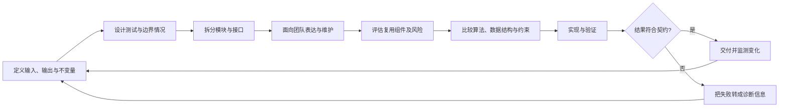
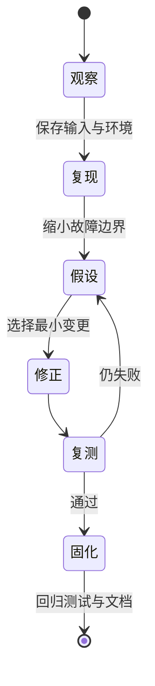

# 总结稿

[打开单页 HTML 总结](assets/bilibili-BV1gcu864ELv-summary.html)

## 核心结论

“像程序员一样思考”不在于先写出更多代码，而在于先把问题转成**可验证的行为、可协作的边界、可复用的决策与可迭代的过程**。视频给出的五条主线是：先定义黑盒契约，再设计模块关系；为团队而写；复用成熟组件但理解其边界；先比较过程与权衡再落到语言；把失败当作反馈。

## 五个思维转变

1. **从实现跳转到契约（[00:21–01:45]）**：先回答输入是什么、输出应满足什么、怎样测试、未来怎样扩展，再决定内部实现。空列表、单元素、重复元素等边界情况应在编码前进入测试设计。
2. **从单个函数跳转到系统关系（[01:14–01:44]）**：把系统拆成通过明确接口协作的模块，可以隔离认知负担；但“修改一个模块不影响其他模块”并非自动成立，仍取决于接口兼容、副作用、状态、性能与依赖隔离。
3. **从个人可运行跳转到团队可维护（[01:47–02:58]）**：命名、约定、文档和可扩展性都是协作成本的一部分。代码的下一位读者和维护者，往往不是今天的作者。
4. **从重复造轮子跳转到审慎复用（[02:59–04:13]）**：成熟组件能节省时间，但复用不是盲抄；需要理解威胁模型、配置、失败模式与维护责任。
5. **从语法熟练跳转到过程建模（[04:14–06:23]）**：先比较算法、数据结构、约束和取舍，再翻译成某门语言；第一版方案不是终点，错误和 bug 应进入“观察—诊断—修正—复测”的反馈回路。

## 重要事实校正

视频在 **[03:17]** 把 OAuth、JWT 说成已经解决认证问题的“库或框架”，这会混淆概念：**OAuth 2.0 是授权框架**，用于授权第三方获得有限访问权限；**JWT 是令牌格式**，规定一类紧凑声明的表示方式。二者都不是即插即用的认证库，也不会单独解决身份验证、凭据存储、会话、撤销和实现安全问题。参见 [RFC 6749：OAuth 2.0 Authorization Framework](https://www.rfc-editor.org/info/rfc6749) 与 [RFC 7519：JSON Web Token](https://www.rfc-editor.org/info/rfc7519)。

视频在 **[03:58]** 声称使用预构建库会自然带来行业标准、集成和选型能力；这更适合作为教育建议，而非已验证的普遍因果结论。学习效果仍取决于是否阅读文档、验证行为并理解边界。

## 一套可执行的编码前检查

- **契约**：输入、输出、不变量、错误与边界条件是什么？
- **验证**：正常、边界、失败路径怎样测试？
- **结构**：模块职责和依赖方向是否清楚？更改会破坏哪些调用者？
- **协作**：命名、约定、文档是否让他人无需猜测作者思路？
- **复用**：组件究竟解决什么问题？谁维护？安全更新、配置和退出方案是什么？
- **迭代**：出现失败时，如何记录假设、定位原因、修正并防止回归？

## 观众讨论与补充

当前只有 **2 条热门顶层评论候选、0 条当前可访问弹幕**，且热门排序有偏差、没有嵌套回复，不能外推总体观众态度。一条评论批评视频重复和冗余；另一条只简短认可“黑箱思维”。前者可提醒笔记压缩重复表达，后者仅说明个体认同，二者都不是视频事实或方法有效性的证据。

## 证据边界

- 画面主要是文字卡、emoji 与 B-roll，用于教学强调，不证明就业比例、开发周期或方法效果。
- 黑盒图是简化模型；现实设计还需要处理安全、状态、副作用、性能和运行环境。
- “失败是反馈”是有用的学习框架，不是保证每次失败都会自动带来进步的因果规律。

# 辅助理解

## 把“程序员思维”看成一条闭环

视频的五部分不是彼此独立的口号，而可以拼成一条循环：先界定行为，再建立模块边界；让团队能够理解和维护；审慎选择可复用组件；基于约束选择过程；最后用测试与失败反馈修正前面的假设。

## 第一层：先画黑盒，再打开黑盒

在 **[00:21–01:45]**，黑盒方法先固定“外部可观察行为”：输入、输出、错误和测试。它的价值不是永远忽略内部，而是**推迟内部细节的优先级**，让实现服务于契约。

可以用三步把它落地：

1. 写出行为契约：例如合并两个列表时，顺序、重复项、空输入和错误输入应如何处理。
2. 写出验证例：正常路径之外，至少覆盖空列表、单元素与重复元素。
3. 再比较实现：依据数据规模、稳定性、内存和调用环境选择算法，而不是让第一个想到的代码反过来定义需求。

“目标驱动”不等于接口一写就获得隔离。视频在 **[01:27–01:32]** 关于模块可独立更新的说法需要加条件：只有接口契约保持兼容、共享状态和副作用受控、性能与安全假设没有被破坏时，更改才可能被局部化。

## 第二层：代码是团队沟通媒介

在 **[01:47–02:58]**，视频把协作从“软技能”提升为设计条件。可读命名、编码约定和文档的目标，不是追求形式整齐，而是减少下一位维护者恢复上下文所需的猜测。

一个实用判断是：如果同事必须先听作者长篇解释才能安全修改代码，那么关键意图尚未被代码、测试或文档承载。反过来，注释也不应重复语法，而应解释约束、权衡和“不这样做”的原因。

## 第三层：复用的是能力，不是安全保证

在 **[02:59–04:13]**，视频鼓励使用成熟组件，把精力留给项目独特问题；同时要求理解工具而非盲目复制。认证例子必须严格校正：

- **OAuth 2.0 是授权框架**，描述第三方如何获得有限访问权限；它不是认证库。参见 [RFC 6749](https://www.rfc-editor.org/info/rfc6749)。
- **JWT 是令牌格式**，描述紧凑声明的表示方式；它不是认证框架，更不会自动处理登录、会话和撤销。参见 [RFC 7519](https://www.rfc-editor.org/info/rfc7519)。

因此，“不要重复造轮子”的工程版本应是：选择维护良好的实现，确认它匹配威胁模型，理解默认配置与失败方式，持续更新，并为撤换预留边界。标准提供共同语言，不替你完成安全设计。

## 第四层：从语言语法上升到约束与过程

在 **[04:14–05:41]**，视频要求先问“问题怎样被解决”，再问“某门语言怎样写”。面对排序任务，要比较时间、空间、稳定性与输入规模；面对插入/删除任务，要先明确访问模式和约束，再选择数据结构。

这是一种可迁移能力：语言变化时，约束分析、复杂度、数据建模、接口设计与测试方法仍可复用。但视频在 **[05:19–05:20]** 所说的“会容易 100 倍”属于修辞，并没有量化证据，不应作为效果数字引用。

## 第五层：让失败进入可控反馈回路

在 **[05:42–06:23]**，视频把错误视为反馈。更精确地说，失败只有经过结构化处理才会产生学习：保留复现条件，区分症状与原因，提出可证伪假设，最小化修改，然后用自动化测试防止回归。

## 观众讨论与补充

本次只有 2 条热门顶层候选评论：一条认为视频表达重复，一条简短认同黑箱思维；当前可访问弹幕为 0。样本受热门排序影响、不含嵌套回复，也不是历史讨论全集，因此不能推断整体情绪。两条评论可分别作为“压缩表达”和“概念吸引力”的提示，但都不能证明视频方法有效或无效。

## 最小实践模板

下一次接到功能需求时，先不要打开编辑器，写下以下六行：

1. 我能观察到的输入与输出是什么？
2. 哪些边界、错误和不变量必须成立？
3. 哪些模块负责什么，依赖方向是什么？
4. 谁会阅读、调用、维护或替换它？
5. 哪些能力应复用，选择依据和安全责任是什么？
6. 失败后怎样复现、诊断、复测并防止回归？

如果这六行仍含糊，继续写代码通常只会把含糊藏进实现。

## 外部事实核验

### 声明 1（03:17）

- 视频陈述：OAuth 或 JWT 是经过充分测试的库/框架，已经解决用户认证问题。
- 核验状态：存在矛盾
- 核验结果：表述混淆概念。OAuth 2.0 是让第三方获得有限访问权限的授权框架；JWT 是一种紧凑的令牌表示格式。它们不是认证库，也不会单独解决完整的用户认证、会话、凭据存储、撤销和实现安全问题。
- 检索日期：2026-08-25
- 来源：
  - [RFC 6749: The OAuth 2.0 Authorization Framework](https://www.rfc-editor.org/info/rfc6749)（primary）
  - [RFC 7519: JSON Web Token (JWT)](https://www.rfc-editor.org/info/rfc7519)（primary）

### 声明 2（03:58）

- 视频陈述：使用预构建的库和框架会让开发者接触行业标准并学习集成、阅读他人代码和工具选型。
- 核验状态：未验证
- 核验结果：这是一般性教育判断，效果取决于学习方式和项目实践，视频没有提出可独立验证的具体比例或因果量化结论。按 auto 模式不作事实性确认。
- 检索日期：2026-08-25
- 来源：未找到可链接来源

# Data

## 增强转写稿

[00:00] Most coders want to work in big tech
[00:01] But most coders won't
[00:02] Most coders want to become good programmers
[00:04] But the reality is most coders won't
[00:06] And the reason why is because a good coder
[00:08] Does not equal a good programmer
[00:10] Think of coding like writing sentences
[00:11] And think of programming like writing an entire storyline
[00:14] And if you can't think like a programmer
[00:16] Well, how do you expect to do that?
[00:18] So this is how to think like a programmer
[00:21] The black box method
[00:22] Let's say you need to develop some code
[00:23] That takes in two lists and outputs the merge result
[00:26] Of these two lists
[00:27] A good programmer will immediately think of two things
[00:29] How to test this code and how to scale
[00:32] And notice how we haven't actually implemented any code yet
[00:34] This is what the black box method is
[00:36] Essentially, we know the inputs and outputs of our code
[00:39] But we deliberately don't worry about the internal workings just yet
[00:42] Now, why is this important?
[00:43] Well, first, it forces you to focus on the bigger picture
[00:46] By treating your code as a black box
[00:47] You have clear expectations for what the code should do
[00:50] For example, if I give it two lists
[00:52] One containing 135 and the other 246
[00:55] The output should be 1-6
[00:56] How the code achieves this isn't important at this stage
[00:59] But what matters is that it takes these inputs
[01:01] And reliably produces the correct output
[01:03] For one, this allows you to create test cases
[01:05] With edge scenarios like empty lists
[01:07] Lists with only one item or repeating elements
[01:10] And two, this method is essential
[01:12] To help modularize and scale your code
[01:14] Because let's say you have a much bigger project
[01:16] With several components
[01:17] By thinking in terms of black boxes
[01:18] You naturally break your system
[01:20] Into several independent parts that interact with each other
[01:23] This allows you to focus on relationships
[01:25] And a clear goal-driven design when coding
[01:27] This also means that if one of these boxes needs to be updated
[01:30] Or optimized, you can do so without affecting
[01:32] The rest of the system
[01:33] So basically, the black box method
[01:35] Is just a cooler term for abstraction
[01:36] And as you can tell, abstraction allows you to manage complexity
[01:39] By breaking down a problem into much smaller pieces
[01:42] Without getting bogged down in the details too early
[01:44] Which is an essential mindset for a programmer
[01:47] Collaboration isn't just a soft skill
[01:49] It's a core skill for any successful programmer
[01:51] If you're not good at collaborating with others
[01:53] How do you expect to ever land a tech job?
[01:55] For example, let's say you need to come up with an algorithm
[01:57] That's going to be reused in other parts of the code base
[01:59] This isn't something you can just whip up in isolation
[02:02] And call it a day
[02:03] You need to think about things like
[02:04] How this algorithm will fit into the existing system
[02:06] How it'll interact with other components
[02:08] And how other team members will use it
[02:10] So basically you need to realize
[02:12] You're not just writing code for yourself
[02:13] You're writing it for your team
[02:15] And the last thing they want is to look at your code
[02:17] And not understand it at all
[02:18] So it's up to you to ensure that your code is clean
[02:20] Well documented and easy to understand
[02:22] Make sure you use meaningful names,follow coding conventions
[02:25] And use comments
[02:26] Basically try and make your code as easy to understand as possible
[02:29] You'll know you're on the right track
[02:30] When your teammates can pick up your code
[02:32] And understand it
[02:32] Without needing a deep dive into your thought process
[02:35] And you also need to recognize
[02:36] That the algorithm you write today
[02:38] Might be maintained by someone else tomorrow
[02:40] So it's important you consider
[02:41] How your coding decisions can impact the team in the long run
[02:44] Will it be easy to update the requirements change?
[02:46] Have you built it in a way
[02:47] That makes it easy for extensions or refactoring?
[02:50] And the more you think about these things
[02:51] The more of a habit they'll become
[02:53] And trust me
[02:53] If you can get in the habit
[02:54] Of making readable and adjustable code
[02:56] You'll already be thinking
[02:57] More like a programmer than a coder
[02:59] Improve the wheel
[03:00] This one might be controversial
[03:01] But in my experience
[03:02] A good programmer knows when to use other code
[03:05] For their advantage
[03:05] Now when I say use other code
[03:07] I don't just mean use ChatGPT
[03:08] To write your whole project
[03:10] Let's say you need to develop
[03:11] Some sort of user authentication system
[03:13] You could spend weeks or even months
[03:15] Developing this from scratch
[03:16] But why do that when there's countless
[03:18] Well-tested libraries and frameworks
[03:20] Like OAuth or JWT
[03:21] Which have already solved this problem
[03:23] So basically what I'm saying is
[03:24] You need to gain the habit
[03:26] Of using tools like these
[03:27] To solve your problems for you
[03:29] It's not about being lazy
[03:30] It's about being smart
[03:31] As a programmer
[03:32] Your time and energy
[03:33] Are the most important things you have
[03:34] And they should be spent
[03:35] On the parts of the project
[03:36] That truly require your unique input
[03:39] But let me be clear
[03:40] Using other code doesn't mean
[03:41] Just blindly copying and pasting
[03:42] Without understanding
[03:43] What's happening under the hood
[03:45] You should always take the time
[03:46] To learn the tools you're working with
[03:47] This way you're not just assembling code
[03:49] You're building a deep understanding
[03:51] Of the systems as well
[03:52] Now some might argue
[03:53] That using pre-built libraries
[03:54] Or frameworks means
[03:55] You're not really learning or improving
[03:57] But that's not true at all
[03:58] In fact, by using these tools
[04:00] You're exposing yourself
[04:01] To the industry standards
[04:02] And new ways of thinking
[04:03] You're learning how to integrate
[04:04] Different components
[04:05] How to read and understand
[04:07] Other people's code
[04:08] And how to make informed decisions
[04:09] About which tools are right for the job
[04:11] Which are all essential skills
[04:13] To think like a programmer
[04:14] Think in terms of processes
[04:16] If you're a beginner
[04:17] You've probably spent
[04:18] The majority of your time
[04:19] Mastering one or two programming languages
[04:21] And this is great
[04:21] Because it helps you build
[04:22] A strong foundation
[04:23] But what happens
[04:24] When you need to learn a new language
[04:26] Because let's face it
[04:27] Every company uses
[04:28] Different technology
[04:28] And you'll inevitably need to adapt
[04:30] The key is to think
[04:31] In terms of processes
[04:32] Rather than just code
[04:34] Because when you focus
[04:34] Only on the specifics
[04:36] Of one or two languages
[04:37] You limit yourself
[04:38] To that language's paradigm
[04:39] But programming is more than
[04:41] Just knowing how to write for loops
[04:42] Or functions in Python
[04:43] It's about understanding
[04:44] The underlying concepts
[04:46] And methodologies
[04:46] That are used everywhere
[04:47] So you need to start by really understanding
[04:49] The different possible solutions
[04:51] For a problem
[04:52] Before even thinking about the code
[04:53] For example
[04:54] If you're asked to build a feature
[04:55] That sorts a list of items
[04:57] Instead of immediately writing code
[04:58] Think about the process
[04:59] What's the most efficient way
[05:01] To sort this data
[05:01] What are the trade-offs
[05:02] Between different sorting algorithms
[05:04] Or let's say you get asked to create a class
[05:05] That can insert and remove elements
[05:07] You need to think about
[05:08] Which data structures will be best fit
[05:10] For your specific constraints
[05:11] And specifications
[05:12] These are all examples
[05:13] Of what makes a good programmer
[05:14] Knowing what to use
[05:15] And when to use it
[05:16] And if you get really good
[05:17] At understanding these processes
[05:19] Figuring out how to apply it into code
[05:20] Will become 100 times easier
[05:22] Because from here
[05:23] All you have to do is convert your process
[05:25] Into the specifics of whatever language you're using
[05:27] And it's also important to understand
[05:29] That your first process
[05:30] Might not always be the best
[05:32] So it's up to you
[05:33] To be willing to iterate on your ideas
[05:35] And adapt your approaches
[05:36] Because overall
[05:37] If you want to think like a programmer
[05:39] You need to be willing to adapt to new ideas
[05:41] And change your existing one
[05:42] Let's talk about something
[05:43] That can make or break a programmer
[05:44] Failure
[05:45] In programming, failure is not just inevitable
[05:47] It's valuable
[05:48] Every error, bug, and failure
[05:50] To solve a problem
[05:51] Is one step towards your learning
[05:52] You see pretty much everyone
[05:53] At every level makes mistakes
[05:55] And it's impossible
[05:56] To be right perfect code all the time
[05:57] Which is why you need to start seeing bugs
[05:59] As an opportunity to understand your code
[06:01] And to better improve it
[06:02] You need to recognize
[06:03] That failure isn't a setback
[06:05] It's feedback
[06:06] When something goes wrong
[06:07] View it as an opportunity
[06:08] To learn from your mistake
[06:09] This mindset is crucial
[06:10] Because programming is all about
[06:12] Problem solving
[06:13] And real-world problems
[06:14] Are often really messy and error-prone
[06:16] So instead of viewing failure as a roadblock
[06:18] If you really want to be a good programmer
[06:20] You need to continuously improve on your failures
[06:23] And not be discouraged
[06:24] Overall, I hope I helped you
[06:25] Gain a better understanding
[06:26] Of how to think like a programmer

## 原始转写稿

[00:00] Most coders want to work in big tech
[00:01] But most coders won't
[00:02] Most coders want to become good programmers
[00:04] But the reality is most coders won't
[00:06] And the reason why is because a good coder
[00:08] Does not equal a good programmer
[00:10] Think of coding like writing sentences
[00:11] And think of programming like writing an entire storyline
[00:14] And if you can't think like a programmer
[00:16] Well, how do you expect to do that?
[00:18] So this is how to think like a programmer
[00:21] The black box method
[00:22] Let's say you need to develop some code
[00:23] That takes in two lists and outputs the merge result
[00:26] Of these two lists
[00:27] A good programmer will immediately think of two things
[00:29] How to test this code and how to scale
[00:32] And notice how we haven't actually implemented any code yet
[00:34] This is what the black box method is
[00:36] Essentially, we know the inputs and outputs of our code
[00:39] But we deliberately don't worry about the internal workings just yet
[00:42] Now, why is this important?
[00:43] Well, first, it forces you to focus on the bigger picture
[00:46] By training your code as a black box
[00:47] You have clear expectations for what the code should do
[00:50] For example, if I give it two lists
[00:52] One containing 135 and the other 246
[00:55] The output should be 1-6
[00:56] How the code achieves this isn't important at this stage
[00:59] But what matters is that it takes these inputs
[01:01] And reliably produces the correct output
[01:03] For one, this allows you to create test cases
[01:05] With edge scenarios like empty lists
[01:07] Lists with only one item or repeating elements
[01:10] And two, this method is essential
[01:12] To help modularize and scale your code
[01:14] Because let's say you have a much bigger project
[01:16] With several components
[01:17] By thinking in terms of black boxes
[01:18] You naturally break your system
[01:20] Into several independent parts that interact with each other
[01:23] This allows you to focus on relationships
[01:25] And a clear goal-driven design when coding
[01:27] This also means that if one of these boxes needs to be updated
[01:30] Or optimized, you can do so without affecting
[01:32] The rest of the system
[01:33] So basically, the black box method
[01:35] Is just a cooler term for abstraction
[01:36] And as you can tell, abstraction allows you to manage complexity
[01:39] By breaking down a problem into much smaller pieces
[01:42] Without getting bogged down in the details too early
[01:44] Which is an essential mindset for a programmer
[01:47] Collaboration isn't just a soft skill
[01:49] It's a core skill for any successful program
[01:51] If you're not good at collaborating with others
[01:53] How do you expect to ever land a tech job?
[01:55] For example, let's say you need to come up with an algorithm
[01:57] That's going to be reused in other parts of the code base
[01:59] This isn't something you can just whip up in isolation
[02:02] And call it a day
[02:03] You need to think about things like
[02:04] How this algorithm will fit into the existing system
[02:06] How it'll interact with other components
[02:08] And how other team members will use it
[02:10] So basically you need to realize
[02:12] You're not just writing code for yourself
[02:13] You're writing it for your team
[02:15] And the last thing they want is to look at your code
[02:17] And not understand it at all
[02:18] So it's up to you to ensure that your code is clean
[02:20] Well documented and easy to understand
[02:22] Make sure you use meaningful names,follow coding conventions
[02:25] And use comments
[02:26] Basically try and make your code as easy to understand as possible
[02:29] You'll know you're on the right track
[02:30] When your teammates can pick up your code
[02:32] And understand it
[02:32] Without needing a deep dive into your thought process
[02:35] And you also need to recognize
[02:36] That the algorithm you write today
[02:38] Might be maintained by someone else tomorrow
[02:40] So it's important you consider
[02:41] How your coding decisions can impact the team in the longer
[02:44] Will it be easy to update the requirements change?
[02:46] Have you built it in a way
[02:47] That makes it easy for extensions or refactoring?
[02:50] And the more you think about these things
[02:51] The more of a habit they'll become
[02:53] And trust me
[02:53] If you can get in the habit
[02:54] Of making readable and adjustable code
[02:56] You'll already be thinking
[02:57] More like a programmer than a coder
[02:59] Improve the wheel
[03:00] This one might be controversial
[03:01] But in my experience
[03:02] A good programmer knows when to use other code
[03:05] For their advantage
[03:05] Now when I say use other code
[03:07] I don't just mean use chatGBT
[03:08] To write your whole project
[03:10] Let's say you need to develop
[03:11] Some sort of user authentication system
[03:13] You could spend weeks or even months
[03:15] Developing this from scratch
[03:16] But why do that when there's countless
[03:18] Well-tested libraries and frameworks
[03:20] Like OAuth or JWT
[03:21] Which have already solved this problem
[03:23] So basically what I'm saying is
[03:24] You need again the habit
[03:26] Of using tools like these
[03:27] To solve your problems for you
[03:29] It's not about being lazy
[03:30] It's about being smart
[03:31] As a programmer
[03:32] Your time and energy
[03:33] Are the most important things you have
[03:34] And they should be spent
[03:35] On the parts of the project
[03:36] That truly require your unique input
[03:39] But let me be clear
[03:40] Using other code doesn't mean
[03:41] Just blindly copying and pasting
[03:42] Without understanding
[03:43] What's happening under the hood
[03:45] You should always take the time
[03:46] To learn the tools you're working with
[03:47] This way you're not just assembling code
[03:49] You're building a deep understanding
[03:51] Of the systems as well
[03:52] Now some might argue
[03:53] That using pre-built libraries
[03:54] Or frameworks means
[03:55] You're not really learning or improving
[03:57] But that's not true at all
[03:58] In fact, by using these tools
[04:00] You're exposing yourself
[04:01] To the industry standards
[04:02] And new ways of thinking
[04:03] You're learning how to integrate
[04:04] Different components
[04:05] How to read and understand
[04:07] Other people's code
[04:08] And how to make informed decisions
[04:09] About which tools are right for the job
[04:11] Which are all essential skills
[04:13] To think like a programmer
[04:14] Think in terms of processes
[04:16] If you're a beginner
[04:17] You've probably spent
[04:18] The majority of your time
[04:19] Mastering one or two programming languages
[04:21] And this is great
[04:21] Because it helps you build
[04:22] A strong foundation
[04:23] But what happens
[04:24] When you need to learn a new language
[04:26] Because let's face it
[04:27] Every company uses
[04:28] Different technology
[04:28] And you'll inevitably need to adapt
[04:30] The key is to think
[04:31] In terms of processes
[04:32] Rather than just code
[04:34] Because when you focus
[04:34] Only on the specifics
[04:36] Of one or two languages
[04:37] You limit yourself
[04:38] To that language's paradigm
[04:39] But programming is more than
[04:41] Just knowing how to write for loops
[04:42] Or functions in Python
[04:43] It's about understanding
[04:44] The underlying concepts
[04:46] And methodologies
[04:46] That are used everywhere
[04:47] So you need to start by really understanding
[04:49] The different possible solutions
[04:51] For a problem
[04:52] Before even thinking about the code
[04:53] For example
[04:54] If you're asked to build a feature
[04:55] That sorts a list of items
[04:57] Instead of immediately writing code
[04:58] Think about the process
[04:59] What's the most efficient way
[05:01] To sort this data
[05:01] What are the trade-offs
[05:02] Between different sorting algorithms
[05:04] Or let's say you get asked to create a class
[05:05] That can insert and remove elements
[05:07] You need to think about
[05:08] Which data structures will be best fit
[05:10] For your specific constraints
[05:11] And specifications
[05:12] These are all examples
[05:13] Of what makes a good programmer
[05:14] Knowing what to use
[05:15] And when to use it
[05:16] And if you get really good
[05:17] At understanding these processes
[05:19] Figuring out how to apply it into code
[05:20] Will become 100 times easier
[05:22] Because from here
[05:23] All you have to do is convert your process
[05:25] Into the specifics of whatever language you're using
[05:27] And it's also important to understand
[05:29] That your first processes
[05:30] Might not always be the best
[05:32] So it's up to you
[05:33] To be willing to iterate on your ideas
[05:35] And adapt your approaches
[05:36] Because overall
[05:37] If you want to think like a programmer
[05:39] You need to be willing to adapt to new ideas
[05:41] And change your existing one
[05:42] Let's talk about something
[05:43] That can make or break a programmer
[05:44] Failure
[05:45] In programming, failure is not just inevitable
[05:47] It's valuable
[05:48] Every error, bug, and failure
[05:50] To solve a problem
[05:51] Is one step towards your learning
[05:52] You see pretty much everyone
[05:53] At every level makes mistakes
[05:55] And it's impossible
[05:56] To be right perfect code all the time
[05:57] Which is why you need to start seeing bugs
[05:59] As an opportunity to understand your code
[06:01] And to better improve it
[06:02] You need to recognize
[06:03] That failure isn't a setback
[06:05] It's feedback
[06:06] When something goes wrong
[06:07] View it as an opportunity
[06:08] To learn from your mistake
[06:09] This mindset is crucial
[06:10] Because programming is all about
[06:12] Problem solving
[06:13] And real-world problems
[06:14] Are often really messy and error-prone
[06:16] So instead of viewing failure as a roadblock
[06:18] If you really want to be a good programmer
[06:20] You need to continuously improve on your failures
[06:23] And not be discouraged
[06:24] Overall, I hope I helped you
[06:25] Gain a better understanding
[06:26] Of how to think like a programmer

## 原始关键帧

### 关键帧 1

### 关键帧 2

### 关键帧 3

### 关键帧 4

### 关键帧 5

### 关键帧 6

### 关键帧 7

### 关键帧 8

### 关键帧 9

### 关键帧 10

## 补充原始数据

- [bilibili-BV1gcu864ELv-comments.jsonl](assets/bilibili-BV1gcu864ELv-comments.jsonl)
- [bilibili-BV1gcu864ELv-comment-candidates.json](assets/bilibili-BV1gcu864ELv-comment-candidates.json)
- [bilibili-BV1gcu864ELv-danmaku.jsonl](assets/bilibili-BV1gcu864ELv-danmaku.jsonl)
- [bilibili-BV1gcu864ELv-danmaku-analysis.json](assets/bilibili-BV1gcu864ELv-danmaku-analysis.json)
- [bilibili-BV1gcu864ELv-visual-summary.png](assets/bilibili-BV1gcu864ELv-visual-summary.png)
- [bilibili-BV1gcu864ELv-summary.html](assets/bilibili-BV1gcu864ELv-summary.html)
