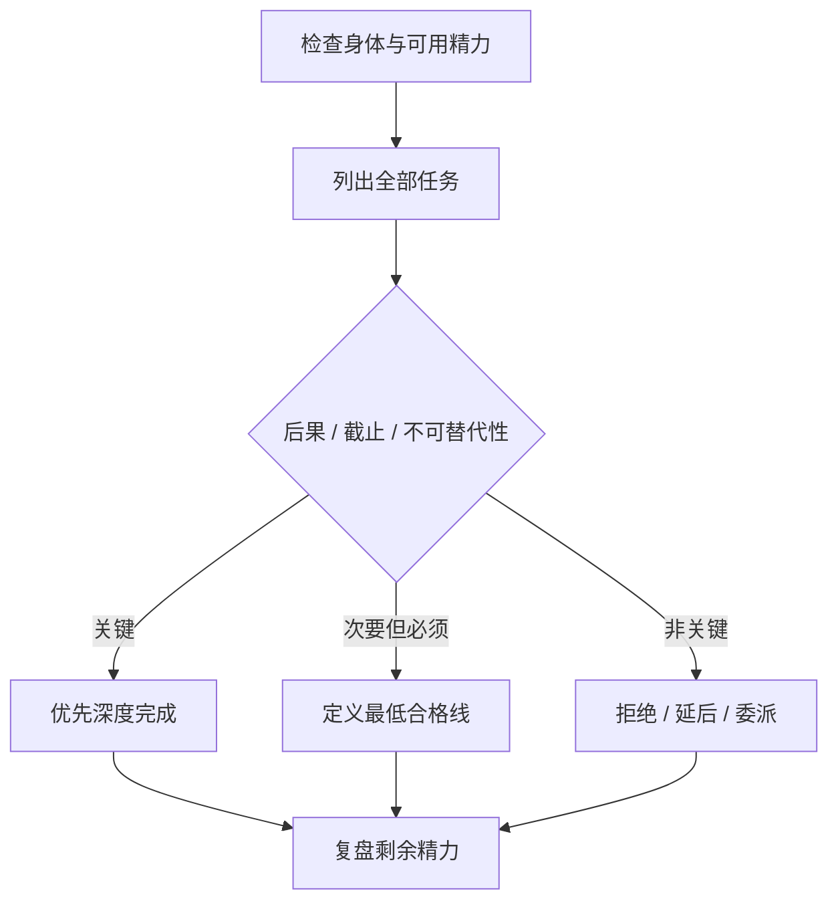

# 总结稿

[打开单页 HTML 总结](assets/bilibili-BV1Ss3a6vETL-summary.html)

## 中心论点

面对实验、复习等并行任务，视频给出四条经验：先保护精力，再分清主次，对非关键事项接受“够用”，并学会拒绝。[00:13–03:54] 这是一套个人经验框架，不是医学、组织管理或生产力效果的普遍证据。

## 四条建议

1. **先保证身体与精力**：讲者用“精力槽”比喻规律运动与持续工作能力，强调有时问题不是没有时间，而是耗竭。[00:13–01:00]
2. **分清主次**：识别必须完成、可延后与不重要的任务，先抓主要任务。[01:38–01:53]
3. **让次要事项达到够用**：视频称为“糊弄学”，意指不要在对自己不关键的事项上过度投入。[01:54–02:23]
4. **拒绝不关键请求**：认识到组织不会因个人拒绝少数非关键事项就停止运转，把时间与精力留给重要工作。[02:24–03:54]

## 实践化改写

- 先检查睡眠、饮食、运动、疾病与持续压力；“精力槽”只是经验比喻，不是可量化医学模型。
- 给任务标注：后果、截止时间、不可逆性、是否只能由我完成。
- “够用”必须满足最低质量、安全与诚信边界，不能用于实验造假、学术不端或把风险转嫁给他人。
- 拒绝时说明优先级冲突、可交付范围和替代时间；若主次由导师、组织或考试制度决定，需要协商，而不只是个人排序。

## 事实核查边界

`fact-check.json` 未提取需要外部核验的客观事实主张。运动、精力随年龄变化、burnout 和组织可替代性在视频中均以讲者经验或概括出现，本文不把它们升级为医学或管理学定论。

## 观众讨论与补充

本次只有 2 条热门顶层评论与 1 条 current-accessible 弹幕，样本不足。较有价值的评论指出“分不清主次，主次不由我决定”，补充了外部权力与制度约束；另一条“快多个agent窗口”语义不完整，只能低置信度理解为工具并行建议。唯一弹幕位于 00:30–01:00、burst score 0，不能称热点，也没有原文可判断它是否回应运动/精力段。观众意见不是方法有效性的证明。

# 辅助理解

## 辅助理解

问题入口是“实验与复习同时压来，怎样高效完成”。固定人像只证明讲者在回答，不证明方法效果。[00:03–00:09]

“精力槽”手势适合表现讲者的经验比喻：先保证身体、规律运动，再谈效率。[00:26–01:00] 这是视频观点，不是医学量表。

字幕“第二点是分清主次”锚定决策核心。[01:42] 真正落地要加入外部约束：哪些优先级由本人决定，哪些需要与导师、团队或家人协商。

结尾进入“拒绝”收束，但截图本身没有完整结论，需结合 [03:21–03:54]：拒绝非关键事项是为了保留重要任务所需资源。

### 三种内容边界

| 类型 | 内容 | 处理方式 |
|---|---|---|
| 视频经验 | 精力、主次、够用、拒绝 | 转成可执行问题，不普遍化 |
| 观众补充 | 主次可能不由本人决定 | 作为约束条件，不是事实证明 |
| AI 辅助推断 | 用后果/期限/不可替代性做决策器 | 明确为综合工具，非视频原话 |

### AI 辅助推断：拒绝前的最低检查

拒绝或降级任务前，确认不会违反安全、法律、学术诚信和明确承诺；若无法拒绝，至少协商范围、顺序、期限和资源。这样比单纯“糊弄过去”更可执行。

## 外部事实核验

> 外部事实核验已完成（2026-08-28），未发现值得独立核验的客观声明。

# Data

## 增强转写稿

[00:00] 余玉说最近快考试了又开始做实验
[00:03] 复习好紧张好累呀，怎么高效完成这些任务啊老师
[00:07] 这是个好问题
[00:09] 就又要做实验又要复习，好紧张好累，怎么高效地完成这些任务
[00:13] 我说点我的经验第一你们现在二十岁左右可能没理解但是
[00:19] 稍微年纪再大一点二十大几的时候你就会出现精力远远不如
[00:24] 十八九岁的时候那种情况
[00:26] 所以对基础的怎么高效地完成这所有的任务首先保证身体
[00:31] 你身体的精力是一个跟血槽似的常锻炼的人精力槽就会特别长
[00:38] 你随着年龄越大你会经历的速度圆满那个槽会逐渐往下减如果你不锻炼的话
[00:44] 所以说保持一个规律的体育运动非常重要
[00:47] 这个是完成一切任务的一个基石就是你的精力得够用
[00:50] 他不是时间的问题其实我现在发现啊尤其是读博同学
[00:54] 有好多同学他根本不是时间不够用他就是没精力了他就不想干了他不是让他
[00:59] 所以真跟精力槽有关
[01:00] 保持一个规律的体育运动
[01:03] 再一个就是高效地完成任务其实大家上网搜索的那种
[01:06] 什么效率课呀什么精力管理什么
[01:09] 这种成功学不是成功学这不是成功学这真有用
[01:13] 我管他叫仕途经济学问类的书籍
[01:16] 没有任何一点讽刺意味，但是说这话的人贾宝玉是
[01:20] 讽刺的仕途经济学问的但是我我我把我看的书其中有一类叫仕途经济学问没有任何讽刺的意思
[01:27] 就是说
[01:27] 他是实用的书
[01:28] 你看了这个书之后你就会
[01:31] 学到一些实用的一些技能和心态
[01:34] 这些书其实你上网一搜有很多
[01:36] 视频一搜有很多
[01:38] 怎么快速高效完成任务而且所有的视频都会有一条
[01:42] 就是分清主次分清哪个任务是必须的
[01:46] 哪些任务不是必须的或没那么重要
[01:49] 只要分清主次
[01:50] 是吧抓住主要的任务完成
[01:53] 就问题不大
[01:54] 再一个就是
[01:55] 糊弄学
[01:56] 第三点第一点就是经历第二点是分清主次第三点是糊弄学
[02:01] 就有很多人他其实主要的事情做得很好次要的事情不重要事情人也能糊弄挺好
[02:06] 糊弄学是个大学问
[02:08] 有机会仔细讲
[02:09] 但总之就是说
[02:11] 把一个对你来说不重要的事给它糊弄过去
[02:15] 这件事可能对别人来说是重要对于这些人来说你糊弄这个事
[02:19] 他们
[02:20] 觉得你还弄挺好
[02:22] 这是个大学问
[02:23] 糊弄学
[02:24] 带一个第四点学会拒绝
[02:27] 这是我一直到30
[02:29] 多岁才学会的一个事
[02:32] 首先是一个心法
[02:33] 你一定要知道是地球离了你还会照样转
[02:37] 就每一个人大概率我现在敢说这个话
[02:40] 全世界上大概率的
[02:42] 你既不是爱因斯坦也不是霍金
[02:45] 可以不客气的说对于人类社会的正常运转大家都是多一个不多、少一个不少的
[02:52] 当然对你的亲戚朋友来说你很重要
[02:54] 但是对于你的经济角色你的老板你的什么导师
[02:58] 对于这种
[03:00] 经济学角色来说
[03:02] 大家真的多你不多，少你不少
[03:05] 有了这个心法之后
[03:07] 你就
[03:08] 明白
[03:09] 你拒绝
[03:10] 好多事情
[03:12] 并不对人家有真正的任何影响
[03:14] 当然我不是说你领导人干啥我不干你导师让你弄啥我不弄
[03:19] 不是这意思
[03:20] 恰恰相反
[03:21] 你拒绝那些不重要不关键的事情
[03:24] 有几个好处其中一个好处就是你能把时间和精力留下来给最重要的事情
[03:29] 这是第一个好处
[03:31] 第二个好处就是
[03:32] 有了我刚说的那套心法之后你要知道没了你地球照样转
[03:36] 在经济社会角色里你消失了对整个
[03:40] 组织也好对整个社会也好没有任何影响
[03:43] 大家都多一个不多，少一个不少这么一个状态
[03:45] 所以说你拒绝别人的事
[03:48] 对被拒绝的那个人其实没有太大影响
[03:51] 所以你要想明白这点第四点怎么高效的完成
[03:54] 这些重要的事情第四点就是拒绝

## 原始转写稿

[00:00] 余玉说最近快考试了又开始做实验
[00:03] 夫妻好紧张好累呀怎么高校完成这些任务啊老师
[00:07] 这是个好问题
[00:09] 就又要做实验又要夫妻好紧张好累怎么高校的完成这些任务
[00:13] 我说点我的经验第一你们现在二十岁左右可能没理解但是
[00:19] 稍微年纪再大一点二十大级的时候你就会出现经历远远不如
[00:24] 十八九岁的时候那种情况
[00:26] 所以对基础的怎么高校的完成这所有的任务首先保证身体
[00:31] 你身体的经历是一个跟雪槽似的长锻炼的人经历槽就会特别长
[00:38] 你随着年龄越大你会经历的速度圆满那个槽会逐渐往下减如果你不锻炼的话
[00:44] 所以说保持一个规律的体育运动非常重要
[00:47] 这个是完成一切任务的一个及时就是你的经历得够用
[00:50] 他不是时间的问题其实我现在发现啊尤其是独博同学
[00:54] 有好多同学他根本不是时间不够用他就是没经历了他就不想干了他不是让他
[00:59] 所以真跟经历槽有关
[01:00] 保持一个规律的体育运动
[01:03] 再一个就是高校的完成任务其实大家上网搜索的那种
[01:06] 什么效率课呀什么经历管理什么
[01:09] 这种成功学不是成功学这不是成功学这真有用
[01:13] 我管他叫试图经济学问类的书籍
[01:16] 没有任何一点讽刺以为但是说这话的人贾宝玉是
[01:20] 讽刺的试图经济学问的但是我我我把我看的书其中有一类叫试图经济学问没有任何讽刺的意思
[01:27] 就是说
[01:27] 他是实用的书
[01:28] 你看了这个书之后你就会
[01:31] 学到一些使用的一些技能和心态
[01:34] 这些书其实你上网一搜有很多
[01:36] 视频一搜有很多
[01:38] 怎么快速高校完成任务而且所有的视频都会有一条
[01:42] 就是分清主次分清哪个任务是必须的
[01:46] 哪些任务不是必须的或没那么重要
[01:49] 只要分清主次
[01:50] 是吧抓住主要的任务完成
[01:53] 就问题不大
[01:54] 再一个就是
[01:55] 互弄学
[01:56] 第三点第一点就是经历第二点是分清主次第三点是互弄学
[02:01] 就有很多人他其实主要的事情做得很好次要的事情不重要事情人也能互弄挺好
[02:06] 互弄学是个大学
[02:08] 有机会仔细讲
[02:09] 但总之就是说
[02:11] 把一个对你来说不重要的事给他互弄过去
[02:15] 这件事可能对别人来说是重要对于这些人来说你互弄这个事
[02:19] 他们
[02:20] 觉得你还弄挺好
[02:22] 这是个大学问
[02:23] 互弄学
[02:24] 带一个第四点学会剧语
[02:27] 这是我一直到30
[02:29] 多岁才学会的一个事
[02:32] 首先是一个新法
[02:33] 你一定要知道是地球离了你还会召用转
[02:37] 就每一个人大概率我现在敢说这个话
[02:40] 全世界上大概率的
[02:42] 你既不是爱因斯坦也不是货金
[02:45] 可以不客气的说对于人类社会的浓浓运转大家都是多一个不多少一个不少的
[02:52] 当然对你的亲亲朋友来说你很重要
[02:54] 但是对于你的经济角色你的老板你的什么导师
[02:58] 对于这种
[03:00] 经济学角色来说
[03:02] 大家真的多你不多少你不少
[03:05] 有了这个新法之后
[03:07] 你就
[03:08] 明白
[03:09] 你拒绝
[03:10] 好多事情
[03:12] 并不对人家有真正的任何影响
[03:14] 当然我不是说你领导人干啥我不干你导师让你弄啥我不弄
[03:19] 不是这意思
[03:20] 恰恰相反
[03:21] 你拒绝那些不重要不关键的事情
[03:24] 有几个好处其中一个好处就是你能把时间和精力留下来给最重要的事情
[03:29] 这是第一个好处
[03:31] 第二个好处就是
[03:32] 有了我刚说的那套新法之后你要知道没了你地球召用转
[03:36] 在经济社会角色里你消失了对整个
[03:40] 组织也好对整个社会也好没有任何影响
[03:43] 大家都多一步都少一步都少这么一个状态
[03:45] 所以说你拒绝别人的事
[03:48] 对被拒绝的那个人其实没有太大影响
[03:51] 所以你要想明白这点第四点怎么高效的完成
[03:54] 这些重要的事情第四点就是拒绝

## 原始关键帧

### 关键帧 1

### 关键帧 2

### 关键帧 3

### 关键帧 4

### 关键帧 5

### 关键帧 6

### 关键帧 7

### 关键帧 8

### 关键帧 9

### 关键帧 10

## 补充原始数据

- [bilibili-BV1Ss3a6vETL-comments.jsonl](assets/bilibili-BV1Ss3a6vETL-comments.jsonl)
- [bilibili-BV1Ss3a6vETL-comment-candidates.json](assets/bilibili-BV1Ss3a6vETL-comment-candidates.json)
- [bilibili-BV1Ss3a6vETL-danmaku.jsonl](assets/bilibili-BV1Ss3a6vETL-danmaku.jsonl)
- [bilibili-BV1Ss3a6vETL-danmaku-analysis.json](assets/bilibili-BV1Ss3a6vETL-danmaku-analysis.json)
- [bilibili-BV1Ss3a6vETL-summary.html](assets/bilibili-BV1Ss3a6vETL-summary.html)
