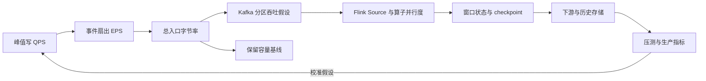

# 总结稿

[打开单页 HTML 总结](assets/bilibili-BV1hnhg6tEy4-summary.html)

## 核心结论

这段视频给出一条实时数据系统的估算链：先区分人驱动与服务驱动流量，再由写 QPS 推导事件速率（EPS）和总入口字节率，随后把这一基线分解到 Kafka、Flink、状态与下游存储。[00:00–08:19] 它最有价值的不是示例数字，而是“先统一单位、再逐层列约束、最后用压测校准”的结构化思路。

## 方法脉络

1. **业务量到字节率**：明确峰值写 QPS、每次请求产生的事件数与平均事件大小，得到 `入口字节率 = QPS × 每请求事件数 × 平均事件字节数`。[05:15–08:19]
2. **Kafka 并行度**：视频用“单分区约 10 MB/s”反推约 12 个分区并留余量。[08:25–09:03] 这个吞吐值不是 Kafka 官方上限，只能作为待压测假设。
3. **Kafka 容量**：保留期、压缩与复制确实要计入磁盘规划，但视频在 [09:56] 给出的乘法若输入已经是全 topic 总入口带宽，再乘分区数会重复计数。更稳妥的基线是：`总入口字节率 × 保留秒数 × 压缩后比例 × 复制因子`，再加索引、segment、重分配与安全余量。
4. **Flink 计算与状态**：并行度受 Kafka 分区、算子成本、窗口、key 基数、状态后端和反压共同影响。[14:03–21:16] Source 并行度与分区数相等常便于充分利用，但不是硬性等式。
5. **扩缩容与下游**：视频讨论增加分区以及 Redis、ClickHouse、Elasticsearch、HDFS 等落地选择。[25:12–28:27] 增加 Kafka 分区不必然要求重启集群；配置动态分区发现时，Flink 也不必然重启。

## 事实核查边界

> [!warning] 公式反证
> [09:56] 的 Kafka 磁盘公式把“全 topic 总带宽”再次乘以 partition 数，会把分片误当复制。partition 分摊数据；真正复制日志的是 replication factor。参见 [Kafka 基本操作](https://kafka.apache.org/40/operations/basic-kafka-operations/) 与 [broker 配置](https://kafka.apache.org/43/generated/kafka_config.html)。

- [08:25] “单分区 10 MB/s”未获官方通用上限支持；应以目标硬件、消息大小、批处理、压缩、`acks` 与复制策略实测。
- [14:08] Flink Source reader 可以处理多个 partition split，并行度高于分区数则会出现空闲 subtask；相等是选择而非规则。参见 [Flink Kafka Connector](https://nightlies.apache.org/flink/flink-docs-release-1.20/docs/connectors/datastream/kafka/)。
- [25:48] Kafka 支持在线增加分区；Flink Kafka Source 可配置动态发现。改变分区数仍可能影响 key 路由与消费分配，必须评估语义影响。

## 可执行清单

- 统一峰值窗口与单位，区分平均值、峰值和突发值。
- 把“经验吞吐”写成可替换参数，而不是产品常数。
- 分别预算 broker 磁盘、Flink checkpoint、运行时 state、结果库与历史归档。
- 在目标配置上压测，并用 consumer lag、反压、checkpoint 时延和磁盘水位做回灌校准。

## 观众讨论与补充

本次只有 1 条热门顶层候选评论，正文仅为 “Note”，0 赞、0 回复；当前可访问弹幕为 0。它无法提供可解释的观点、情绪或热点，也不能代表总体观众。热门排序有偏差、嵌套回复未采集，弹幕并非历史全集；观众材料不作为视频事实证据。

# 辅助理解

## 辅助理解

把视频中的草图理解成一个**估算闭环**，而不是一次把所有数字算死的公式。

### 三种容易混淆的“倍数”

| 倍数 | 为什么出现 | 是否复制数据 |
|---|---|---|
| 每请求事件数 | 一次业务写入可能产生多个事件 | 是业务扇出 |
| partition 数 | 将 topic 数据分片以支持吞吐与消费并行 | **不会**让每条记录出现 N 份 |
| replication factor | 为容错保存日志副本 | 会增加 broker 存储量 |

所以，若 `R` 已经是全 topic 压缩前入口字节率，容量基线应从 `R × retention × compression_ratio × replication_factor` 出发；不能再乘 partition 数。[09:56]

### 从流量到并行度，不是一步除法

视频把总带宽除以每分区经验吞吐，适合作为初始候选值。[08:25–09:03] 真正落地还要同时检查：key 是否倾斜、生产端批量与压缩、broker/磁盘/网络、`acks`、消费处理成本，以及容灾和扩容余量。Flink 侧也要分开估算 Source、CPU 密集算子、I/O 算子和有状态算子；Kafka partition 只是上游可并行 split 的一个约束。[14:03–21:16]

### 设计评审的四个追问

1. 入口量是峰值还是均值，峰值窗口多长？
2. 哪些参数来自业务事实，哪些只是经验假设？
3. checkpoint、state 与最终存储是否被重复或遗漏计算？
4. 哪些运行指标会触发重新估算与扩缩容？

> [!note] 证据层级
> 截图证明视频采用了怎样的估算框架；官方文档说明机制边界；最终容量数字必须由目标环境压测和生产观测决定。

## 外部事实核验

### 声明 1（08:25）

- 视频陈述：Kafka 单个 partition 的最高写入带宽大约是 10 MB/s，因此可用总入口带宽除以 10 MB/s 得到分区数。
- 核验状态：未验证
- 核验结果：Kafka 官方文档没有给出通用的 10 MB/s 单分区上限。分区决定数据分片和消费者最大并行度，但实际吞吐取决于 broker/磁盘/网络、消息批次、压缩、acks、复制和负载分布；10 MB/s 只能作为待压测的经验假设。
- 检索日期：2026-08-27
- 来源：
  - [Apache Kafka: Basic Kafka Operations](https://kafka.apache.org/40/operations/basic-kafka-operations/)（primary）

### 声明 2（09:56）

- 视频陈述：Kafka 磁盘容量可按保留秒数 × replication factor × partition 数 × 压缩率 × 总入口带宽计算。
- 核验状态：存在矛盾
- 核验结果：若“总入口带宽”已经汇总了整个 topic，再乘 partition 数会重复计数。分区把 topic 数据分片，复制因子才会复制日志。更合理的基线是总入口字节率 × 保留秒数 × 复制因子 × 压缩后比例，再加 segment、索引、重分配和安全余量。
- 检索日期：2026-08-27
- 来源：
  - [Apache Kafka: Basic Kafka Operations](https://kafka.apache.org/40/operations/basic-kafka-operations/)（primary）
  - [Apache Kafka broker configurations](https://kafka.apache.org/43/generated/kafka_config.html)（primary）

### 声明 3（14:08）

- 视频陈述：Flink Kafka source 的 task parallelism 应与 Kafka partition 数完全相等。
- 核验状态：存在矛盾
- 核验结果：Flink 将 Kafka topic partition 作为 source split 并分配给并行 reader；一个 reader 可以处理多个 split，而 parallelism 高于 partition 数时会出现空闲 subtask。因此相等常是便于满并行利用的配置选择，不是必须条件。
- 检索日期：2026-08-27
- 来源：
  - [Apache Flink Kafka connector](https://nightlies.apache.org/flink/flink-docs-release-1.20/docs/connectors/datastream/kafka/)（primary）
  - [Apache Flink Data Sources](https://nightlies.apache.org/flink/flink-docs-master/docs/internals/sources/)（primary）

### 声明 4（25:48）

- 视频陈述：增加 Kafka topic 的 partition 数需要重启 Kafka 集群，并会使订阅该 topic 的所有 Flink 作业重启。
- 核验状态：存在矛盾
- 核验结果：Kafka 官方工具支持在线用 kafka-topics --alter 增加分区，不要求重启集群；Flink Kafka Source 还能配置动态分区发现以在不重启作业的情况下发现新分区。增加分区会触发消费分配变化并可能改变按 key 取模的路由，但“集群和所有作业必然重启”不成立。
- 检索日期：2026-08-27
- 来源：
  - [Apache Kafka: Modifying topics](https://kafka.apache.org/40/operations/basic-kafka-operations/)（primary）
  - [Apache Flink Kafka Source: Dynamic Partition Discovery](https://nightlies.apache.org/flink/flink-docs-release-1.13/docs/connectors/datastream/kafka/)（primary）

# Data

## 增强转写稿

[00:00] Hello everyone welcome back to the system design in 30 minutes in this recording we are going to talk about something about the real-time traffic or real-time component traffic and data service capacity estimation.
[00:16] In previous introductions we only focused on the traditional system to estimate to first check a lot whether the system is user-oriented or human-oriented or service-oriented.
[00:31] And then we based on the different type of the system to estimate the QPS and transfer the QPS or spell the QPS into the read QPS and write QPS and then calculate the total data capacity or the storage resource we need to prepare for something like that.
[00:54] And recently I am resolved a problem like a trending system where the other system design questions that depends on the real-time data estimate or real-time data calculation.
[01:09] So I think maybe we can introduce some point to support us just follow the same parties to answer the questions in a very short time.
[01:19] We have to accumulate those knowledge and add them to everyday practice and when we attending the online interview and we can react in a very short time.
[01:31] So we are also going to read up that problems that follow some parties and we remember the parties and the tips to help us better calculate the value in a very short time rather than just remembering those values and it's not so flexible.
[01:51] So this is a very simple diagram and I want to explain the complete flow but actually the data retention or the Kafka should be generated to the flink job.
[02:06] And this diagram just want to show us when we estimate a real-time processing platform or service what points we need to take consideration of or any points we can extract in.
[02:19] Or it could be the bottleneck of the system.
[02:22] So this is a very simple diagram that events adjusted to the system go through the Kafka and to the Kafka we need to take consideration of the Kafka retention and the traffic here.
[02:35] This should be a bottleneck.
[02:37] How many partitions we should be create to receive the request or the how many partitions we need to create to receive the coming event to make sure there is not any lags between the event producer to the Kafka here.
[02:54] And another part we may pay attention to is suppose we are going to store the data where the db request not db request the data request where data request is transferred from the event.
[03:07] On the disk and how many disk resources shall we allocate for holding the data at most seven days.
[03:15] And this is the storage capacity estimation we call it as the Kafka retention.
[03:21] And when the Kafka internal data subscribed by the FlinkJob and we know that there is another possible risk point where it could be the bottleneck.
[03:33] And we also need to estimate the traffic in this flow.
[03:36] And every time we set up a FlinkJob and we need to pay attention to the memory and also the disk.
[03:44] And also the calculated result should be ingested into Elasticsearch or ClickHouse.
[03:52] It is ES for Elasticsearch and how many resources we can allocate.
[03:57] We should allocate on those components.
[04:00] And we also need to pay attention to when the results coming from the FlinkJob and they want to endure into the downstream component.
[04:08] It has a parallelism and how to guarantee the parallelism will not become a very high pressure to the downstream components.
[04:19] Those flows also may pay attention to.
[04:22] It doesn't mean that we need to iterate every important point during the interview.
[04:28] But we need to customize to pick up the bottlenecks, the points that can help us retrieve or achieve a highest score after our interview and make a smart combination during the interview.
[04:45] Right?
[04:46] So this is the region I took this video.
[04:49] So let's go through this flow.
[04:51] It's just the same as the traditional system design.It is divided by the human oriented or the service oriented.
[04:58] Right?
[04:59] So if we are dealing with a Uber system design Uber and we need to collect the users GPS and the users actions will affect the downstream where the ingestion scales of the event that ingested to the Kafka.
[05:15] And if it is the service oriented just take the previous questions we have already handled that is the log collector and the servers object is not human.
[05:27] It is the upstream service and the third party service where the other service and the service corresponded instance that we want to collect the generate to the log entries and they are can be called as a service oriented.
[05:44] No matter to the human oriented and service oriented we have introduced how to calculate the QPS.Right?
[05:52] And because the EPS is usually referring to the ingestion.So ingestion we can also translate into the write traffic.So no matter the human oriented and service oriented we should transfer the total QPS into the write QPS.
[06:10] So based on the user's free example.User social media application.Every user every day posts every three 10 posts.So this can be translated into the write QPS.
[06:24] And we know the DAU is also an entry point.Right?So use the DAU multiply the DAU multiply the 10 posts every user.This is the write traffic every day.
[06:36] And the write traffic every day divided 66400 it is the write QPS.This can be treated as the write traffic.And so it is the service oriented.
[06:53] We got the total QPS by assume the total request every day.And then request every day transferred into the QPS.Divided 86300 and we got the total QPS.
[07:12] And based on the assumed ratio of the read and write we can calculate the write QPS.So here the following steps are exactly the same.
[07:22] We just leverage here got the total read QPS of the human oriented service and the total read QPS of the total of the service oriented service.
[07:35] Then we can make assumptions here.Modify or convert the QPS into the EPS.And we can make an assumption.
[07:44] For example,one request may map to 10 events.So suppose we got a 1K QPS.It can translate it into the 10K EPS.
[07:58] And with the help of the EPS we can estimate for example to a log entry oriented event.The size of the event could be the say 5 to 10KB.
[08:09] Multiply them together.EPS multiply the event size.It is the bandwidth of the ingestion for the ingestion bandwidth.
[08:19] And based on that we can calculate the ingestion bandwidth is 100 MB/s.
[08:25] With the help of the 100 MB/s we also have the assumptions of every Kafka partition.Highest bandwidth is about 10 MB/s.So use the 100 MB/s divided to the 10 MB/s.
[08:41] We got the partition number.So we can even estimate the partition number by using the 100 MB/s divided to the 10 MB/s.
[08:52] This is the partition number x to 10.
[08:56] And when we define the partition we usually add a headroom about 2 to 3.
[09:03] So we got approximately 12 partitions.
[09:07] And after that we finished the traffic estimation to the Kafka and we move over to the storage capacity estimation.
[09:16] And suppose we are going to hold the data for at most 7 days.And we got partition numbers is equal to 12 after taking consideration of the headrooms.
[09:29] So 12 partitions and we also need to support the fault tolerance.So the replication number should be at least 3.
[09:43] Total storage we are estimating the disk resource we need to allocate on the Kafka cluster for holding all the retention required for at least for at most 7 days.
[09:56] That is to say total disk resource is equal to this number.It is equal to 7.
[10:05] Translate it into the second time in a second in total.Multiply 86400 and then multiply the replication number 3 and multiply total partitions.
[10:24] That is 12.And we also need to take consideration of the compression ratio because we are not simply stored the data into the disk raw data.
[10:35] Sometimes we need to transfer the data into and go through some compressed algorithms to save a lot of disk resource.
[10:43] So also take consideration of the compression ratio 0.3 and then multiply the bandwidth here 100 MB/s.
[10:54] This calculated value is the compression ratio 0.3 partitions and this is the total disk resource and it also replaces the storage capacity we can allocate.
[11:23] Calculator 7 multiply approximately equal to the data value and multiply by 3 and multiply by 2 and multiply 0.3 and multiply 0.1.
[11:51] It is approximately equal to TB in total.
[12:00] So this is the final value we need to allocate for holding all the data for at most 7 days.
[12:06] So if we want to store it for at most 30 minutes and we can make this value much lesser than the character value.
[12:23] So this is the complete estimation based on the Kafka flow and it can support those human oriented, service oriented as opposed as long as you calculate the previous conditions and assumptions translated those conditions into the QPS.
[12:40] And add two assumptions here.You can translate it to the EPS and ingestion bandwidth based on that.
[12:47] So this is the flow here and let's take consideration of the flink flow.
[12:54] So when we talk about the flink flow,the first point is estimate the flink task advances and a common value of every task can handle 1 to 2 MB/s.
[13:07] But do not worry about that because the Kafka is very good at manipulating high throughput data and it can store the data for a while.
[13:17] So the traffic pressures attached to the flink is not usually equal to the Kafka.
[13:24] So the Kafka can store the data on the disk layers and can gradually feed the data to the flink.
[13:32] So they are not exactly equal to each other.
[13:36] And that's the thing that the flink bandwidth is 1 to 2 MB/s.
[13:41] And then we can estimate,suppose the traffic flow to here,it is,for example,we got twice partitions in total here.
[13:55] So it can handle approximately at most 24 MB/s every second.
[14:03] And then we can estimate the flink task parallelism number.
[14:08] The flink task parallelism number,it is,I think it is exactly the same as the partitions to the Kafka partition.
[14:16] They are,they should be equal to each other.
[14:18] And based on that,we can estimate those 3 points.
[14:22] One of them is a checkpoint.
[14:24] Checkpoint is usually stored into the disk layer,local disk layer for the HDFS.
[14:29] suppose we are going to store the checkpoint,where the snapshot,where at the most 10 days.
[14:37] And every day the interval,every 30 seconds generate a snapshot.
[14:43] And just calculate based on that 10 days.
[14:48] And multiply the rate,it contains 10 days,how many seconds.
[14:56] And divide the 30 seconds,this is the second,30 seconds.
[15:03] And we will calculate it as about this one,this one.
[15:08] We will create the snapshot numbers,it is equals to 3.
[15:17] 30,000,30,000 snapshots,and each snapshot will occupy 2KB,10 days.
[15:29] We will generate the 2KB,multiply 30K.
[15:34] And this K is 1000,and we will modify this one into the MD.
[15:41] Then we will allocate to 60 MD,disk resource,not so much.
[15:48] So this is the estimation of the checkpoint.
[15:51] Checkpoint is the snapshot,and we keep an interval,just like a heartbeat.
[15:57] Every 10 seconds,in this case,no.
[16:00] Every 30 seconds generate a piece of the file.
[16:04] And this file just contains all the contact information,and we treat it as a snapshot to the disk.
[16:11] And organized by the timestamp or something like that.
[16:14] And for example,overflink,just to make an assumption,overflink is a long time running job.
[16:21] We're streaming job,something like that.
[16:23] So we need to start the snapshot for at most 10 days,and this is the resource on the disk.
[16:31] We allocate for holding the snapshot for at most 10 days.
[16:36] So this is the estimation of the checkpoint.
[16:38] During the real interview,we will not dive into this checkpoint.
[16:42] But we need to have a brief line to help us to better understand what we are actually that problem.
[16:49] We can react to this question.
[16:53] So another storage capacity estimation is the state.
[16:59] State store is a piece of the memory,holded by the tm,which is the TaskManager.
[17:06] Task memory,it's in charge of distributing the task to the workers of the flink job.
[17:13] And the workers will in charge of calculating in a distributed way.
[17:18] And the locally calculated results will be aggregate to the task manager to do the aggregation on that.
[17:27] So every time we talk about the state,it's referring to a memory resource.
[17:33] We allocate the TaskManager.
[17:36] And based on the state,the most important factor is the window length.
[17:43] Which means that every time we aggregate a value,it's based on the window less.
[17:49] For example,we create a 30 minutes window.
[17:53] Let's just take it as the simplest window type and as the fixed window,30 minutes window.
[17:58] And another factor is the window parallelism.
[18:01] For example,we can create multiple windows,random in parallel,in each task of the flink,
[18:09] or each job of the flink.
[18:12] And so in parallel,we will have approximately 115 lines of the window.
[18:19] And each window will have the highest requirement of the memory resources requirement to the memory.
[18:29] And when it comes to the aggregation calculate,and during the aggregation calculate,
[18:37] it will keep every global unique aggregate key inside of the window size.
[18:44] So based on that preconditions,we can calculate based on that.
[18:48] And another condition we may pay attention to is,calculate.
[18:53] Every window can hold how many unique IDs.
[18:58] This can be estimated by the DAU or the unique IDs today.
[19:02] For example,our DAU,it has at most 5,000 every day.
[19:07] It means that different users will be active,interact with our application.
[19:14] 5,000 can translate into how many seconds,how many minutes.
[19:20] It can be translated into the 5,000 one day,one day,16 minutes,24 minutes,24 hours,and continue this one.
[19:35] So we got 5,000,24 multiplied by 60,and then we can continue estimate.
[19:51] 30 minutes,compines how many user sessions located inside of one window.
[20:04] Right.
[20:09] Let's use the calculators,calculate for the second time,24,multiply 60 total minutes every day.
[20:18] And it should be divided by the 5,000,5,000,this value.
[20:28] And continue multiply,this means that every minute contains how many user sessions.
[20:34] And every lines of the window is 30 minutes,multiply 30 is just like 4 multiplied 30.
[20:43] 120 unique queries.
[20:49] Let's move it here.
[20:53] Move it to here.
[20:56] So based on that,we can calculate one window,compines unique ID is 120.
[21:06] And the unique ID,let's assume it is approximately 10,100 that,right.
[21:16] One window,13 minutes lines,100,3 zeros,into the k.
[21:33] 25 divided by 2 is 4kb,each window should contain.And we have 5 windows parallel,so 5 multiplied by 4kb.
[21:46] It is equal to,let's say 20kb,memory in total to the Flink state,memory,estimation.
[22:02] Well,this is my previous assumptions.
[22:14] And when we talk about the state,it is referring to the memory space that we need to prepare for a think job.
[22:21] And sometimes if this value increase and the state requirement to the memory is increased to,and we need to allocate to a proper values based on the QPS and the DAU,right.
[22:36] So if we are,this is a system to the human-oriented,the DAU will play the role.
[22:41] And the unique IDs per day,this is prepared for the service-oriented.
[22:49] And there is another concept that I want to introduce is the spills.
[22:53] For example,we only allocate this 20kb,and we only allocate the 30kb in total to the state.
[23:05] I think it can be configured,because something provides a lot of configuration options,configure options,sorry.
[23:13] So the 20 divided by 30 is approximately 60%.
[23:24] And there is a threshold,that is,suppose the usage of the memory is approximately equals to 5%.
[23:34] It means that we cannot hold so many requirements inside of the memory,and we have to spill several of the data requirements to the disk to protect.
[23:46] There should not be a OOM to the memory layer.So half of the data are stored into the disk,and the disk space estimation can also be taken into consideration to the storage estimation,even though this number is very light.
[24:02] And here is another point that I want to introduce,after we introduce both Flink and Kafka,their traffic estimations here,is suppose our Flink task,which is the partition where parallelism number exactly equals to the Kafka partition number,and cannot handle so many data in the short time,which means that we got a bottleneck here.
[24:28] And the bottleneck is taken,and this can introduced in the section of failure scenario discussion,for example we can see a lot of phenomenon,that's the signal of consumer,that is increasing.
[24:52] And the pressures reflect to each of the Flink task,and we can see the failure rate of the Flink task is increasing to,which means that our Flink cannot handle so many traffic or so much ingestion,that's the upstreams of the Kafka can provide.
[25:12] And there are two strategies to handle,that we can explain our discussion in this area.One of the solution is,we can modify the Kafka partition number like a repartition of the Kafka,to increase the Kafka partitions.This is a kind of horizontal scale,to increase the concurrency,where the downstream Flink task number will be automatically increased too.
[25:37] But it also have some pros and cons,the prongs is,it is a traditional cloud-native solution to that,to resolve this problem,and it is more flexible,right?
[25:48] But it also have some coins,the coin is that,your upstream Kafka,it is not the,you are not,you are the task,you are the job of the Flink,you are not one,you are just one of the subscribers of the upstream Kafka.
[26:04] And once modified the partition numbers,the Kafka cluster need to restart,and that's restart,suppose your upstream Kafka is subscribed by the other Flink jobs,and those Flink jobs will also be restart,and restart will introduce a lot of data in accurate,and you will introduce a lot of logic to guarantee the accuracies.
[26:28] And you will be required,something like that,so those pros and cons,you need to take consideration of,and another strategy is,even though you are a numbers of Flink task numbers,which is the prodigies of your Flink,it is fixed,but you can do the vertical scale,for example,you can only restart your Flink task by allocating more CPU and resources,allocate to the Flink task,right?
[26:57] allocate more resources to speed up the throughput of that Flink job,alright,so this should be the second part,a little bit longer here,and the last part is the long term storage,I will not dive into that part,because it really depends on the business requirements.
[27:18] It's just like the situation we discussed at the beginning of this video,that is,your Flink job is focusing on aggregate a thousand required into one calculated result,so your input data scale is not exactly the same as output data scale,it depends on your Flink job internal calculated logic,right?
[27:46] So,we will not use the coming requirements to depend on the downstream data storage side,or something like that,but we may take consideration of one list of data scales we need to calculate,and the connections with traffic here,right?
[28:08] So,the HDFS has ever lost the choice to saving or receiving the required coming from the Flink,because the disk is very slow,and you will get the calculation in a very short time,but the required storage into the HDFS will take a very long time.
[28:27] We usually used a strategy here,that create a async job,very task,to save the data to the Redis,and then gradually synchronize the data to the HDFS,right?
[28:43] And to the ClickHouse,the ClickHouse is very good at clearing,but writing is not so good,so we can add a Kafka,showing the similar partitions as the upstream,and every event will gradually attach or synchronize to the ClickHouse or something like that.
[29:07] And so,I think those are all the things that I want to introduce in this recording,and when we are designing some real data,where the real time traffic were processing platform,and we can divide it into two flows.
[29:24] And once we get the EPS,we can estimate the doc Kafka partitions,and the storage capacity estimation based on that.
[29:32] So,I think those are all the things that I want to introduce in this video,and in our coming videos,we are going to pick up several strategies,where the partitions we introduce in this video,and to check a lot,whether it can integrate to the,to ever answer correctly,versalously.

## 原始转写稿

[00:00] Hello everyone welcome back to the system design in 30 minutes in this recording we are going to talk about something about the real-time traffic or real-time component traffic and data service capacity estimation.
[00:16] In previous introductions we only focused on the traditional system to estimate to first check a lot whether the system is user-oriented or human-oriented or service-oriented.
[00:31] And then we based on the different type of the system to estimate the QPS and transfer the QPS or spell the QPS into the read QPS and read QPS and then calculate the total data capacity or the storage resource we need to prepare for something like that.
[00:54] And recently I am resolved a problem like a trending system where the other system design questions that depends on the real-time data estimate or real-time data calculation.
[01:09] So I think maybe we can introduce some point to support us just follow the same parties to answer the questions in a very short time.
[01:19] We have to accumulate those knowledge and add them to everyday practice and when we attending the online interview and we can react in a very short time.
[01:31] So we are also going to read up that problems that follow some parties and we remember the parties and the tips to help us better calculate the value in a very short time rather than just remembering those values and it's not so flexible.
[01:51] So this is a very simple diagram and I want to explain the complete flow but actually the data retention or the Kafka should be generated to the flink job.
[02:06] And this diagram just want to show us when we estimate a real-time processing platform or service what points we need to take consideration of or any points we can extract in.
[02:19] Or it could be the bottleneck of the system.
[02:22] So this is a very simple diagram that events adjusted to the system go through the Kafka and to the Kafka we need to take consideration of the Kafka retention and the traffic here.
[02:35] This should be a bottleneck.
[02:37] How many partitions we should be create to receive the request or the how many partitions we need to create to receive the coming event to make sure there is not any lags between the event producer to the Kafka here.
[02:54] And another part we may pay attention to is suppose we are going to store the data where the db request not db request the data request where data request is transferred from the event.
[03:07] On the disk and how many disk resources shall we allocate for holding the data at most seven days.
[03:15] And this is the storage capacity estimation we call it as the Kafka retention.
[03:21] And when the Kafka internal data subscribed by the FlinkJob and we know that there is another possible risk point where it could be the bottleneck.
[03:33] And we also need to estimate the traffic in this flow.
[03:36] And every time we set up a FlinkJob and we need to pay attention to the memory and also the disk.
[03:44] And also the calculated result should be endured into after the release fake house.
[03:52] It's the FS for the elastic search and how many resources we can allocate.
[03:57] We should allocate on those components.
[04:00] And we also need to pay attention to when the results coming from the FlinkJob and they want to endure into the downstream component.
[04:08] It has a parallelism and how to guarantee the parallelism will not become a very high pressure to the downstream components.
[04:19] Those flows also may pay attention to.
[04:22] It doesn't mean that we need to iterate every important point during the interview.
[04:28] But we need to customize to pick up the bottlenecks, the points that can help us retrieve or achieve a highest score after our interview and make a smart combination during the interview.
[04:45] Right?
[04:46] So this is the region I took this video.
[04:49] So let's go through this flow.
[04:51] It's just the same as the traditional system design.It is divided by the human oriented or the service oriented.
[04:58] Right?
[04:59] So if we are dealing with a Uber system design Uber and we need to collect the users GPS and the users actions will affect the downstream where the ingestion scales of the event that ingested to the Kafka.
[05:15] And if it is the service oriented just take the previous questions we have already handled that is the log collector and the servers object is not human.
[05:27] It is the upstream service and the third party service where the other service and the service corresponded instance that we want to collect the generate to the log entries and they are can be called as a service oriented.
[05:44] No matter to the human oriented and service oriented we have introduced how to calculate the QPS.Right?
[05:52] And because the EPS is usually referring to the ingestion.So ingestion we can also translate into the red traffic.So no matter the human oriented and service oriented we should transfer the total QPS into the right QPS.
[06:10] So based on the user's free example.User social media application.Every user every day posts every three 10 posts.So this can be translated into the red QPS.
[06:24] And we know the DAU is also an entry point.Right?So use the DAU multiply the DAU multiply the 10 posts every user.This is the red traffic every day.
[06:36] And the red traffic every day divided 66400 it is the red QPS.This can be treated as the red traffic.And so it is the service oriented.
[06:53] We got the total QPS by assume the total request every day.And then request every day transferred into the QPS.Divided 86300 and we got the total QPS.
[07:12] And based on the assumed ratio of the read and write we can calculate the right QPS.So here the following steps are exactly the same.
[07:22] We just leverage here got the total read QPS of the human oriented service and the total read QPS of the total of the service oriented service.
[07:35] Then we can make assumptions here.Modify or convert the QPS into the EPS.And we can make an exception.
[07:44] For example,one request may make my team to 10 invent.So suppose we got a 1K QPS.It can translate it into the 10K EPS.
[07:58] And with the help of the EPS we can estimate for example to a log entry oriented event.The size of the event could be the say 5 to 10KB.
[08:09] Multiply them together.EPS multiply the event size.It is the bandwidth of the ingestion for the ingestion bandwidth.
[08:19] And based on that we can calculate the ingestion bandwidth is 100MB.
[08:25] With the help of the 100MB we also have the exceptions of every QPCAP partitions.Highest bandwidth is about 10MVPS.So use the 100MB divided to the 10MVPS.
[08:41] We got the partition number.So we can even estimate the partition number by using the 10MB divided to the 10MVPS.
[08:52] This is the partition number x to 10.
[08:56] And when we define the partition we usually add a headroom about 2 to 3.
[09:03] So we got approximately 2 partitions.
[09:07] And after that we finished the traffic estimation to the Kafka and we move over to the storage capacity estimation.
[09:16] And suppose we are going to hold the data for at most 7 days.And we got partition numbers is equal to 12 after taking consideration of the headrooms.
[09:29] So 12 partitions and we also need to support the file tolerance.So the replication number should be at least 3.
[09:43] Total storage we are estimating the disk resource we need to allocate on the Kafka cluster for holding all the retention required for at least for at most 7 days.
[09:56] That is to say total disk resource is equal to this number.It is equal to 7.
[10:05] Translate it into the second time in a second in total.Multiply 86400 and then multiply the replication number 3 and multiply total partitions.
[10:24] That is 12.And we also need to take consideration of the compression ratio because we are not simply stored the data into the disk raw data.
[10:35] Sometimes we need to transfer the data into and go through some compressed algorithms to save a lot of disk resource.
[10:43] So also take consideration of the compression ratio 0.3 and then multiply the bandwidth here 100MB.
[10:54] This calculated value is the compression ratio 0.3 partitions and this is the total disk resource and it also replaces the storage capacity we can allocate.
[11:23] Calculator 7 multiply approximately equal to the data value and multiply by 3 and multiply by 2 and multiply 0.3 and multiply 0.1.
[11:51] It is approximately equal to TB in total.
[12:00] So this is the final value we need to allocate for holding all the data for at most 7 days.
[12:06] So if we want to store it for at most 30 minutes and we can make this value much lesser than the character value.
[12:23] So this is the complete estimation based on the Kafka flow and it can support those human oriented, service oriented as opposed as long as you calculate the previous conditions and assumptions translated those conditions into the QPS.
[12:40] And add two assumptions here.You can translate it to the EPS and ingestion bandwidth based on that.
[12:47] So this is the flow here and let's take consideration of the flink flow.
[12:54] So when we talk about the flink flow,the first point is estimate the flink task advances and a common value of every task can handle 1 to 2 MBPS.
[13:07] But do not worry about that because the Kafka is very good at manipulating high throughput data and it can store the data for a while.
[13:17] So the traffic pressures attached to the flink is not usually equal to the Kafka.
[13:24] So the Kafka can store the data on the disk layers and can gradually feed the data to the flink.
[13:32] So they are not exactly equal to each other.
[13:36] And that's the thing that the flink bandwidth is 1 to 2 MBPS.
[13:41] And then we can estimate,suppose the traffic flow to here,it is,for example,we got twice partitions in total here.
[13:55] So it can handle approximately at most 24 MBPS every second.
[14:03] And then we can estimate the flink task parallelism number.
[14:08] The flink task parallelism number,it is,I think it is exactly the same as the partitions to the Kafka partition.
[14:16] They are,they should be equal to each other.
[14:18] And based on that,we can estimate those 3 points.
[14:22] One of them is a trick point.
[14:24] Trick point is usually stored into the disk layer,local disk layer for the SDFS.
[14:29] suppose we are going to store the trick point,where the snapshot,where at the most 10 days.
[14:37] And every day the interval,every 30 seconds generate a snapshot.
[14:43] And just calculate based on that 10 days.
[14:48] And multiply the rate,it contains 10 days,how many seconds.
[14:56] And divide the 30 seconds,this is the second,30 seconds.
[15:03] And we will calculate it as about this one,this one.
[15:08] We will create the snapshot numbers,it is equals to 3.
[15:17] 30,000,30,000 snapshots,and each snapshot will occupy 2KB,10 days.
[15:29] We will generate the 2KB,multiply 30K.
[15:34] And this K is 1000,and we will modify this one into the MD.
[15:41] Then we will allocate to 60 MD,disk resource,not so much.
[15:48] So this is the estimation of the trick point.
[15:51] Trick point is the snapshot,and we keep an interval,just like a heartbeat.
[15:57] Every 10 seconds,in this case,no.
[16:00] Every 30 seconds generate a piece of the file.
[16:04] And this file just contains all the contact information,and we treat it as a snapshot to the disk.
[16:11] And organized by the timestamp or something like that.
[16:14] And for example,overflink,just to make an exception,overflink is a long time running job.
[16:21] We're streaming job,something like that.
[16:23] So we need to start the snapshot for at most 10 days,and this is the resource on the disk.
[16:31] We allocate for holding the snapshot for at most 10 days.
[16:36] So this is the estimation of the trick point.
[16:38] During the real interview,we will not dive into this trick point.
[16:42] But we need to have a brief line to help us to better understand what we are actually that problem.
[16:49] We can react to this question.
[16:53] So another storage capacity estimation is the state store.
[16:59] State store is a piece of the memory,holded by the tm,which is the task memory.
[17:06] Task memory,it's in charge of distributing the task to the workers of the flink job.
[17:13] And the workers will in charge of calculating in a distributed way.
[17:18] And the locally calculated results will be aggregate to the task manager to do the aggregation on that.
[17:27] So every time we talk about the state store,it's referring to a memory resource.
[17:33] We allocate the task memory.
[17:36] And based on the state store,the most important factor is the window length.
[17:43] Which means that every time we aggregate a value,it's based on the window less.
[17:49] For example,we create a 30 minutes window.
[17:53] Let's just take it as the simplest window type and as the 6th window,30 minutes window.
[17:58] And another factor is the window parallelism.
[18:01] For example,we can create multiple windows,random in parallel,in each task of the flink,
[18:09] or each job of the flink.
[18:12] And so in parallel,we will have approximately 115 lines of the window.
[18:19] And each window will have the highest requirement of the memory resources requirement to the memory.
[18:29] And when it comes to the aggregation calculate,and during the aggregation calculate,
[18:37] it will keep every global unique aggregate key inside of the window size.
[18:44] So based on that preconditions,we can calculate based on that.
[18:48] And another condition we may pay attention to is,calculate.
[18:53] Every window can hold how many unique IDs.
[18:58] This can be estimated by the DAU or the unique IDs today.
[19:02] For example,our DAU,it has at most 5,000 every day.
[19:07] It means that different users will be active,interact with our application.
[19:14] 5,000 can translate into how many seconds,how many minutes.
[19:20] It can be translated into the 5,000 one day,one day,16 minutes,24 minutes,24 hours,and continue this one.
[19:35] So we got 5,000,24 multiplied by 60,and then we can continue estimate.
[19:51] 30 minutes,compines how many user sessions located inside of one window.
[20:04] Right.
[20:09] Let's use the calculators,calculate for the second time,24,multiply 60 total minutes every day.
[20:18] And it should be divided by the 5,000,5,000,this value.
[20:28] And continue multiply,this means that every minute contains how many user sessions.
[20:34] And every lines of the window is 30 minutes,multiply 30 is just like 4 multiplied 30.
[20:43] 120 unique queries.
[20:49] Let's move it here.
[20:53] Move it to here.
[20:56] So based on that,we can calculate one window,compines unique ID is 120.
[21:06] And the unique ID,let's assume it is approximately 10,100 that,right.
[21:16] One window,13 minutes lines,100,3 zeros,into the k.
[21:33] 25 divided by 2 is 4kb,each window should contain.And we have 5 windows parallel,so 5 multiplied by 4kb.
[21:46] It is equal to,let's say 20kb,memory in total to the sprinkler of state store,memory,estimation.
[22:02] Well,this is my previous assumptions.
[22:14] And when we talk about the state store,it is referring to the memory space that we need to prepare for a think job.
[22:21] And sometimes if this value increase and the state store requirement to the memory is increased to,and we need to allocate to a proper values based on the QPS and the DAU,right.
[22:36] So if we are,this is a system to the human-oriented,the DAU will play the role.
[22:41] And the unique IDs per day,this is prepared for the service-oriented.
[22:49] And there is another concept that I want to introduce is the spills.
[22:53] For example,we only allocate this 20kb,and we only allocate the 30kb in total to the state store.
[23:05] I think it can be configured,because something provides a lot of configuration options,configure options,sorry.
[23:13] So the 20 divided by 30 is approximately 60%.
[23:24] And there is a threshold,that is,suppose the usage of the memory is approximately equals to 5%.
[23:34] It means that we cannot hold so many requirements inside of the memory,and we have to spill several of the data requirements to the disk to protect.
[23:46] There should not be a OOM to the memory layer.So half of the data are stored into the disk,and the disk space estimation can also be taken into consideration to the storage estimation,even though this number is very light.
[24:02] And here is another point that I want to introduce,after we introduce both Flink and Kafka,their traffic estimations here,is suppose our Flink task,which is the partition where parallelism number exactly equals to the Kafka partition number,and cannot handle so many data in the short time,which means that we got a bottleneck here.
[24:28] And the bottleneck is taken,and this can introduced in the section of failure scenario discussion,for example we can see a lot of phenomenon,that's the signal of consumer,that is increasing.
[24:52] And the pressures reflect to each of the Flink task,and we can see the failure rate of the Flink task is increasing to,which means that our Flink cannot handle so many traffic or so many image,that's the upstreams of the Kafka can provide.
[25:12] And there are two strategies to handle,that we can explain our discussion in this area.One of the solution is,we can modify the Kafka partition number like a repartition of the Kafka,to increase the Kafka partitions.This is a kind of horizontal scale,to increase the concurrency,where the downstream Flink task number will be automatically increased too.
[25:37] But it also have some prongs and coins,the prongs is,it is a traditional clonative solution to that,to resolve this problem,and it is more flexible,right?
[25:48] But it also have some coins,the coin is that,your upstream Kafka,it is not the,you are not,you are the task,you are the job of the Flink,you are not one,you are just one of the subscribers of the upstream Kafka.
[26:04] And once modified the partition numbers,the Kafka cluster need to restart,and that's restart,suppose your upstream Kafka is subscribed by the other Flink jobs,and those Flink jobs will also be restart,and restart will introduce a lot of data in accurate,and you will introduce a lot of logic to guarantee the accuracies.
[26:28] And you will be required,something like that,so those prongs and coins,you need to take consideration of,and another strategy is,even though you are a numbers of Flink task numbers,which is the prodigies of your Flink,it is fixed,but you can do the vertical scale,for example,you can only restart your Flink task by allocating more CPU and resources,allocate to the Flink task,right?
[26:57] allocate more resources to speed up the throughput of that Flink job,alright,so this should be the second part,a little bit longer here,and the last part is the long term storage,I will not dive into that part,because it really depends on the business requirements.
[27:18] It's just like the situation we discussed at the beginning of this video,that is,your Flink job is focusing on aggregate a thousand required into one calculated result,so your input data scale is not exactly the same as output data scale,it depends on your Flink job internal calculated logic,right?
[27:46] So,we will not use the coming requirements to depend on the downstream data storage side,or something like that,but we may take consideration of one list of data scales we need to calculate,and the connections with traffic here,right?
[28:08] So,the SDFS has ever lost the choice to saving or receiving the required coming from the Flink,because the disk is very slow,and you will get the calculation in a very short time,but the required storage into the SDFS will take a very long time.
[28:27] We usually used a strategy here,that create a SVNC job,very task,to save the data to the radius,and then gradually synchronize the data to the SDFS,right?
[28:43] And to the Quickhouse,the Quickhouse is very good at clearing,but writing is not so good,so we can add a Kafka,showing the similar partitions as the upstream,and every event will gradually attach or synchronize to the Quickhouse or something like that.
[29:07] And so,I think those are all the things that I want to introduce in this recording,and when we are designing some real data,where the real time traffic were processing platform,and we can divide it into two flows.
[29:24] And once we get the EPS,we can estimate the doc Kafka partitions,and the storage capacity estimation based on that.
[29:32] So,I think those are all the things that I want to introduce in this video,and in our coming videos,we are going to pick up several strategies,where the partitions we introduce in this video,and to check a lot,whether it can integrate to the,to ever answer correctly,versalously.

## 原始关键帧

### 关键帧 1

### 关键帧 2

### 关键帧 3

### 关键帧 4

### 关键帧 5

### 关键帧 6

### 关键帧 7

### 关键帧 8

### 关键帧 9

### 关键帧 10

## 补充原始数据

- [bilibili-BV1hnhg6tEy4-comments.jsonl](assets/bilibili-BV1hnhg6tEy4-comments.jsonl)
- [bilibili-BV1hnhg6tEy4-comment-candidates.json](assets/bilibili-BV1hnhg6tEy4-comment-candidates.json)
- [bilibili-BV1hnhg6tEy4-danmaku.jsonl](assets/bilibili-BV1hnhg6tEy4-danmaku.jsonl)
- [bilibili-BV1hnhg6tEy4-danmaku-analysis.json](assets/bilibili-BV1hnhg6tEy4-danmaku-analysis.json)
- [bilibili-BV1hnhg6tEy4-summary.html](assets/bilibili-BV1hnhg6tEy4-summary.html)
