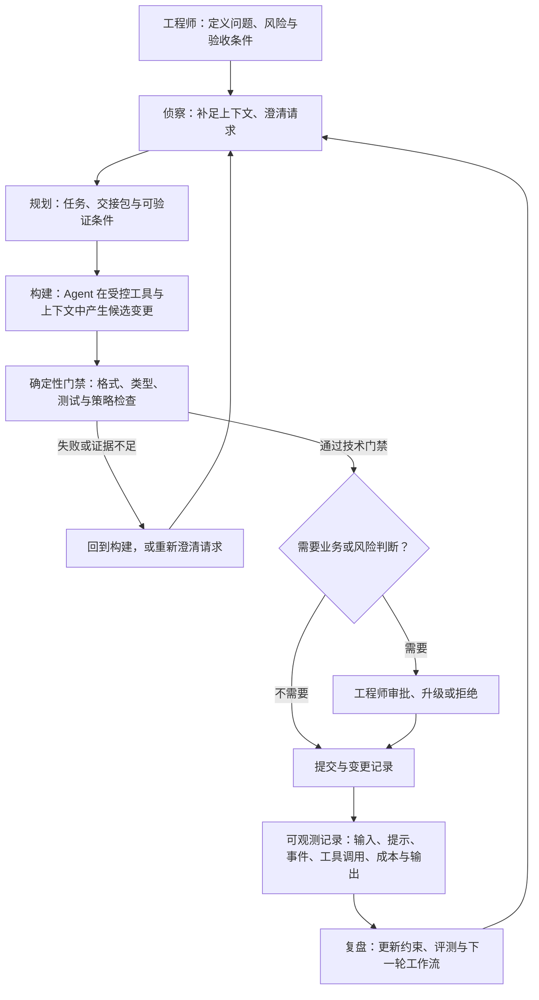
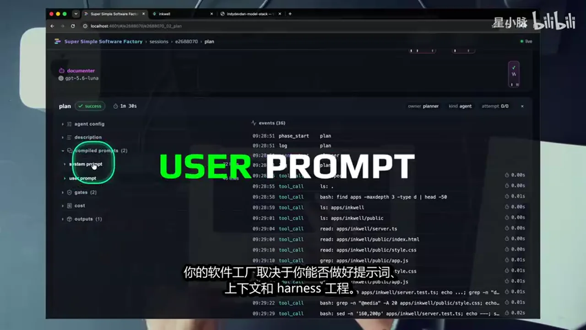
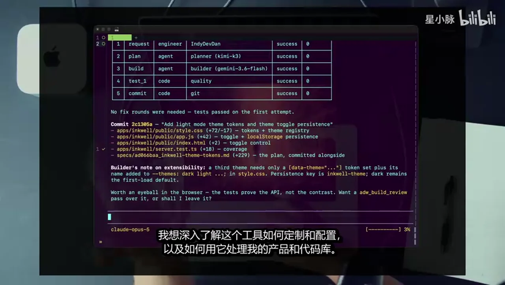
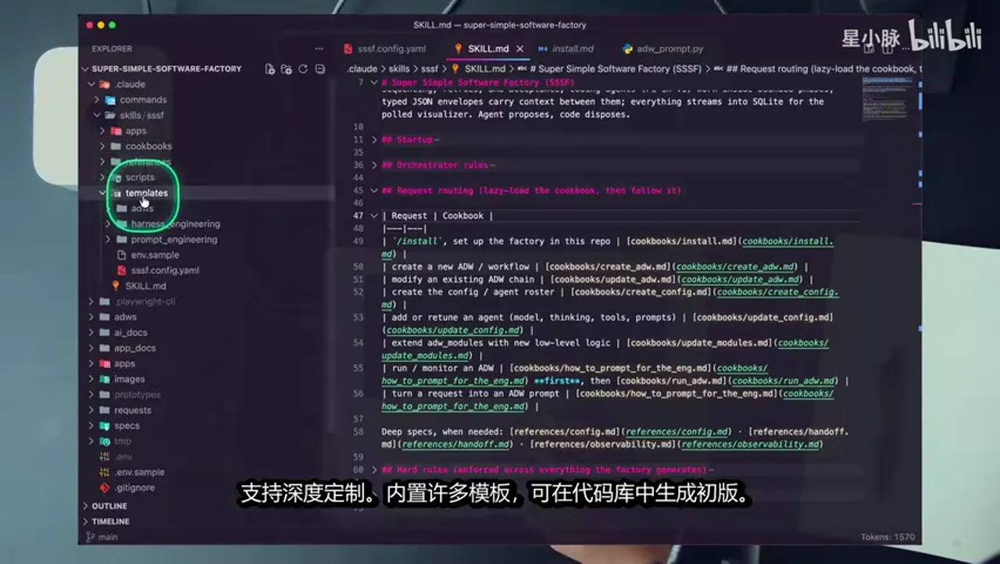
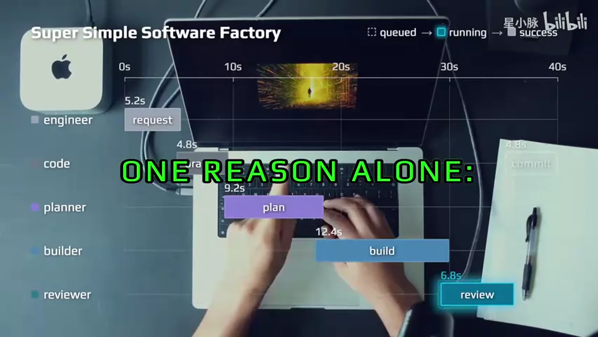
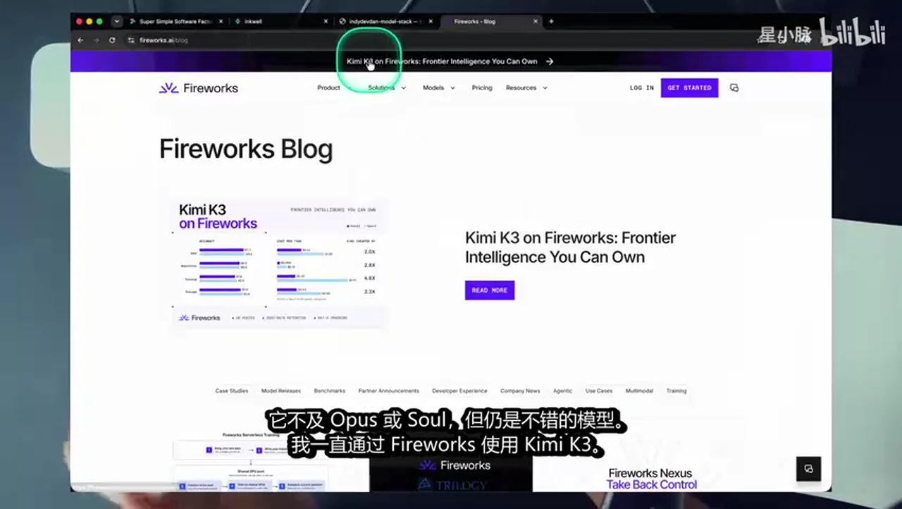
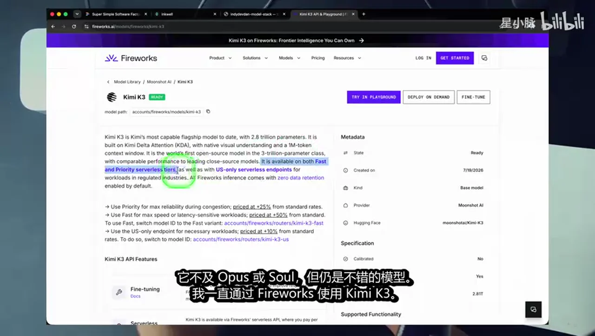
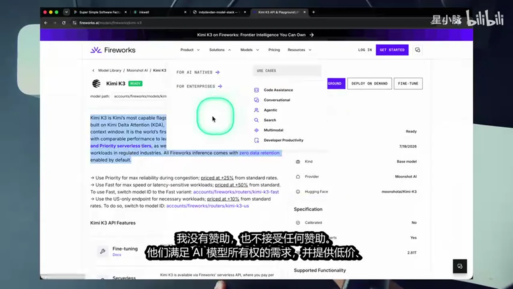
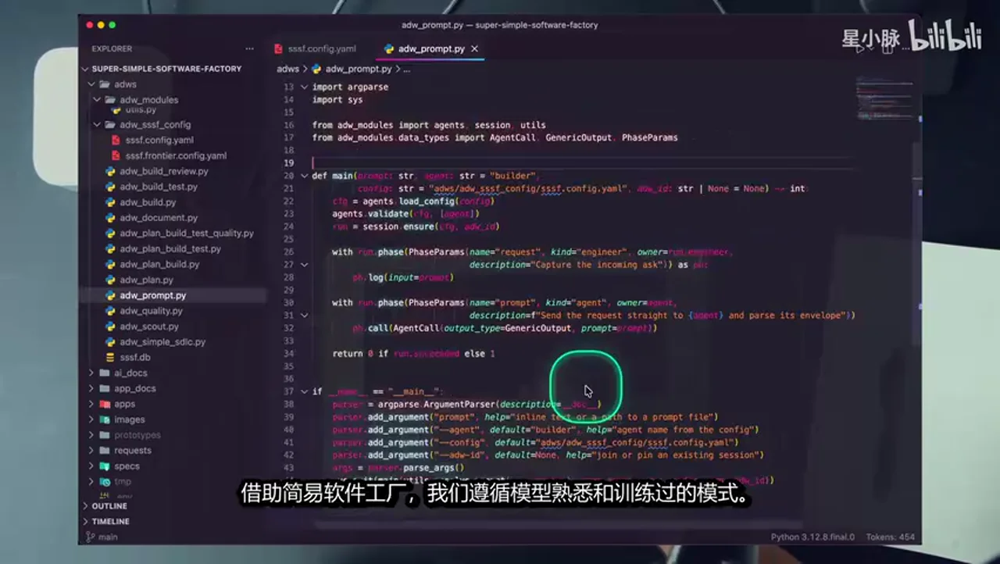
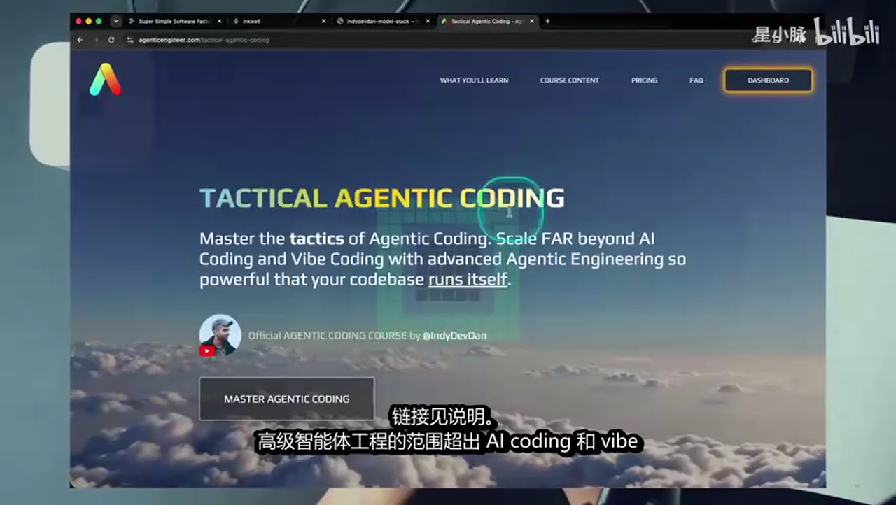

# 总结稿

## 核心摘要

这支视频是讲者对 **Super Simple Software Factory（SSSF）** 的一次架构讲解和演示。它提出的不是一套已经被独立验证的“全自动软件工厂”标准，而是一种工程组织思路：让 Agent 负责产生候选方案与执行步骤，让确定性代码、测试和规则承担可重复的控制，让工程师保留目标、风险和最终验收的判断权。

讲者把这套思路概括为三项原则：**可观测、可定制、可复用**。从演示界面看，工作流会把请求、规划、构建、审查、提交等阶段串起来，并显示运行状态和耗时。{{frame:1}} 这有助于把一次 Agent 执行从“黑箱对话”变成可以追踪的工程过程；但该画面只是视频中的产品/原型呈现，不能据此推断所有项目都具备相同的运行数据、能力或可靠性。

视频中所说的 “Agentic Engineering（智能体工程）” 的关键，不是单独调用一个模型，而是把模型、提示词、上下文、工具、输出格式、规则和人工判断组织为一个可运行的工作流。讲者把这一层称作 Agent Harness（智能体运行/约束层），并用侦察、规划、构建、复盘/审查来描述主要阶段。其核心取舍是：

- Agent 擅长在不完整信息下提出方案、生成候选代码或调用工具；
- 确定性代码适合格式化、类型检查、测试、结构校验和流程路由；
- 人类应保留需求边界、风险接受度、上线和最终业务正确性的责任。

## 把“可观测”当作控制面，而非装饰面

讲者强调，应记录系统提示词、用户提示词、配置、事件、工具调用、成本和输出，以便复盘某次工作流为何成功或失败。{{frame:2}} 这个方向有通用工程依据：OpenAI Agents SDK 的官方 tracing 文档说明，追踪可以记录 agent run、模型生成、工具调用、handoff、guardrail 和自定义事件，用于调试、可视化与监控。[Tracing | OpenAI Agents SDK](https://openai.github.io/openai-agents-js/guides/tracing/)

不过，“记录得更全”不等于“系统自动更可靠”。追踪资料可能包含输入与输出中的敏感信息，因此还需要明确哪些字段可采集、保留多久、谁能访问以及如何脱敏。视频展示了界面中的提示词与事件面板，但并未独立证明 SSSF 在所有仓库、模型或团队中都能完整记录这些信息。

## 用阶段和门禁替代一次性长提示词

视频将一次开发请求拆为大致的链路：先侦察和补足上下文，再形成规划与交接包；随后构建、调用工具、执行检查；最后审查、处理失败并记录变更。终端截图展示了一次从 request 到 plan、build、test、commit 均为成功的运行轨迹，也留下了“是否还需要额外 build review”的问题。{{frame:6}}

这个画面能说明“阶段化执行和显式测试”是讲者希望实现的流程形态，却不能证明测试覆盖充分、变更必然安全，也不能证明其中已经发生了人工审批。更稳妥的做法是把技术门禁与业务门禁分开：前者可由格式、类型、测试、策略检查等自动化规则承担；后者——例如需求是否真正满足、是否可接受安全/成本/上线风险——仍须由负责的人明确批准或升级处理。

视频还提到 JSON、结构化输入输出和规则驱动的交接。通用层面上，JSON Schema 可以验证类型、属性和必填字段等结构约束。[Creating your first schema | JSON Schema](https://json-schema.org/learn/getting-started-step-by-step) 但结构正确不等于语义、业务或安全正确；测试质量、规则覆盖率和人工验收条件仍需针对具体仓库定义。

## 代码、配置与交接包如何协同

讲者的主张是“Agent 提议，代码决定”：工作流把确定性规则、配置和脚本放在可审查的代码/配置层，将会话、任务、上下文和输出传给下一阶段。视频中的 SKILL.md 截图展示了请求路由、硬规则、目录约定和结构化交接的设想。{{frame:8}} 这可以作为理解“控制平面”的辅助材料，但单张截图无法证明其完整的数据模型、权限边界、依赖兼容性或跨仓库安装效果。

对于页面抓取这一类工具任务，视频说可以利用页面源信息来定义目标。Playwright 官方文档确实支持通过 locator 定位 DOM 元素，并建议使用更具韧性的定位方式。[Locators | Playwright](https://playwright.dev/docs/locators) [Best Practices | Playwright](https://playwright.dev/docs/best-practices) 这不构成绕过反爬机制的能力说明，也不替代站点授权、使用条款和具体任务的可靠性验证。

## 对模型与基础设施说法的收窄

视频以 Kimi K3、Fireworks 等为例说明可替换的模型和托管基础设施。已能确认的是：Moonshot 的官方页面介绍了 Kimi K3 及其公开定位；[Kimi K3 | Moonshot AI](https://www.moonshot.cn/en) Fireworks 的官方文档说明其 Serverless 服务的多租户形态和零持久保留的默认政策范围，同时也提示元数据、缓存或特性例外等边界。[Serverless Overview | Fireworks AI Docs](https://docs.fireworks.ai/serverless/overview) [Zero Data Retention | Fireworks AI Docs](https://docs.fireworks.ai/guides/security_compliance/data_handling)

因此，视频中涉及具体模型排名、价格、速度、地区、数据主权、“首个前沿开源权重模型”等说法，都不应视为当前可迁移的选型结论：它们缺少明确版本、区域、计费条件和对照测试。实际接入前应按所用模型、供应商条款、数据分类、延迟和成本记录重新测量。

## 事实核验结果与适用边界

本次核验共检查 10 条可外部核验的主张：**5 条部分确认，5 条未验证**。

- **部分确认的通用机制**：Agent tracing/可观测记录、DOM locator、Kimi K3 的公开存在与部分公开定位、Fireworks Serverless 的文档化政策、JSON Schema 的结构校验能力。
- **仍未验证、应保留为讲者方案或目标的主张**：SSSF 可在无人参与下可靠运行数百/数千个任务；可将 skill 一键部署到新仓库；可稳定、可重复地把 80% 日常工作交给 Agent；模型幻觉会随模型升级而下降；以及视频中的具体模型/价格/性能比较和“第一”类排名断言。

最有价值的学习点不是接受“自动化比例”承诺，而是建立可检查的闭环：先限定任务和验收条件，再让 Agent 生成并执行候选步骤，用可重复的门禁收集证据，最后由人对高风险或业务性决定负责。该闭环能降低不可见性，但不能自动消除模型错误、需求歧义或运营风险。

# 辅助理解

## 辅助理解：把 Agent 工作流看成一条可审计的工程闭环

下图依据视频对 SSSF 的叙述重组为一个学习模型：它描述的是讲者倡议的工程结构，不是已由本次视频独立证明的生产协议。关键是把“生成候选结果”“自动技术门禁”和“人类业务判断”分层，而不要把它们混成一次无法解释的长对话。

### 1. 可观测记录回答的是“发生了什么”

视频把提示词、配置、事件、工具调用、成本和输出放在可查看的控制面中。 这和通用 Agent tracing 的思路相符：追踪记录可帮助调试、可视化和监控一个 run 中的模型生成、工具调用、handoff 与 guardrail。[Tracing | OpenAI Agents SDK](https://openai.github.io/openai-agents-js/guides/tracing/)

它的正确目标是缩短定位问题的路径，而非证明系统天然可信。开始记录前，应先定义：哪些输入/输出会含敏感数据、哪些字段需要脱敏、保留期限、访问权限，以及一次失败时如何关联到具体请求、版本、模型和规则。视频中的 UI 只说明讲者重视这些信息，不足以证明任意工作流都已有完备审计能力。

### 2. 自动门禁提供“证据”，但不替代验收

视频的 request → plan → build → test → commit 轨迹把阶段结果放到同一执行表中。 它有助于理解为什么应让工作流产出可检查的中间证据，而不是只要求模型给出最终答案。结构化输出、JSON、格式检查、类型检查和测试都可以承担一部分确定性约束。

JSON Schema 官方说明支持校验类型、属性和必填字段等结构规则。[Creating your first schema | JSON Schema](https://json-schema.org/learn/getting-started-step-by-step) 但“符合 schema”只说明结构合格；它不证明业务需求被满足、测试足够、权限正确或上线安全。因而图中的“技术门禁通过”之后仍保留了人为的业务/风险判断节点。视频画面没有清楚展示实际人工批准，不能把该节点误写成已发生的自动或人工事实。

### 3. 人与 Agent 的边界应写进流程

从视频的表达看，Agent 更适合生成计划、候选代码、工具操作或复盘建议；代码和规则更适合承担可重复的路由、格式、测试和策略检查；工程师负责提出目标、定义验收和承担风险。这个分工是合理的设计启发，不是对所有任务都成立的经验定律。

可将每个步骤追问为三类问题：

- **Agent 可以猜吗？** 可以时，输出要成为候选物，而非未经审查的事实。
- **代码可以判吗？** 可以时，把判断转成可运行的 schema、测试、策略或阈值。
- **必须由人决定吗？** 涉及业务取舍、不可逆操作、安全边界或发布责任时，应显式要求审批、拒绝或升级。

### 4. “控制平面”要有可审查的交接契约

视频展示的 SKILL.md 包含请求路由、硬规则、仓库目录和结构化交接的想法。 这种控制平面的价值在于：下一阶段不必只依赖自然语言回忆，而能接收明确的任务、约束、输入来源、预期输出和失败处理方式。

实践时，可把交接包最小化为：任务 ID、输入版本、允许的工具/权限、期望的结构化输出、完成条件、失败状态和人工升级路径。截图中提到的结构化 envelope 或 SQLite 输入只是讲者演示线索；单一画面不足以说明真实的数据模型、权限控制、依赖项或跨仓库兼容性。

### 5. 从“可运行演示”到“可托管系统”之间还缺什么

视频提出可在较大规模下运行任务、把 skill 部署到新仓库，以及稳定自动化大量日常工作的愿景；这些均未在本次材料中得到足够的公开证据支持。尤其不能把“数百/数千任务无人运行”“80% 工作自动化”“幻觉必然下降”写成性能指标或交付承诺。

若要把这类方案用于真实项目，至少应补齐以下验证清单：

- 用一组代表性任务和明确失败定义测量成功率、返工率、人工介入率、延迟和成本；
- 对模型、版本、区域、计费和提示/工具配置做可复现记录，而不沿用视频中的排名或价格印象；
- 为抓取、代码执行、写入、提交和部署设置最小权限、授权检查、隔离与回滚；
- 区分“测试通过”“满足业务需求”“获准发布”三种不同的状态；
- 定期抽样复核 trace 与产物，确认自动门禁没有掩盖系统性错误。

### 6. 对外部能力主张的收窄读法

Playwright 的 locator 可以帮助在 DOM 中定位元素，但不等于可以绕过反爬机制或忽略站点授权。[Locators | Playwright](https://playwright.dev/docs/locators) Fireworks 的文档说明 Serverless 与零持久保留默认政策的适用范围，但这不等价于绝对的数据主权或适用于所有功能的无数据保留。[Serverless Overview | Fireworks AI Docs](https://docs.fireworks.ai/serverless/overview) [Zero Data Retention | Fireworks AI Docs](https://docs.fireworks.ai/guides/security_compliance/data_handling) Moonshot 的官方介绍可以确认 Kimi K3 的公开存在，却不足以确认视频中“首个前沿开源权重模型”或任意模型优劣比较。[Kimi K3 | Moonshot AI](https://www.moonshot.cn/en)

因此，本视频最稳健的结论是：值得借鉴的是“可观测 + 明确交接 + 自动门禁 + 人工负责”的闭环思路；尚需在具体仓库、任务集、权限模型和长期运行数据中检验的，则是 SSSF 的可靠性、可移植性和自动化比例承诺。

# Data

## 增强转写稿

[00:00] 工程师们,我是 Indie Dev Dan,如果你在构建替你工作的智能体系统,请继续看
[00:04] 这对你有用,盲目写垃圾代码,不适合看本片
[00:09] 请关闭页面,谢谢,下次见
[00:11] 软件工厂常被误解,也常被低估
[00:14] 关键在于,他们唯一的作用,是让你更好的利用提示词
[00:17] 就这样,你能获得多少助力,取决于你对软件工厂的投入质量
[00:22] 在基础层级,串联几个智能体,简单配置,即可替你多做些事
[00:27] 在最高层级,你构建智能体加代码的系统,无需你参与,也能稳定运行
[00:32] 有时,甚至比你表现更好
[00:34] 本期,我会分享我的简易软件工厂Super Simple Software Factory,说明如何发挥这种助力
[00:40] 这个工厂融合了我们在频道和 Tactical Agentic Coding (TAC) 中讨论的核心理念
[00:45] 单为智能体工程的下一阶段,从头重建
[00:48] 如果你明白智能体加代码,胜过单独的智能体,想在智能体时代获得更多优势
[00:54] 就继续看,一起拆解这个简易软件工厂
[00:57] 我在这个简易软件工厂中,融入了三个关键的设计原则,可观测,可定制,可复用
[01:03] 这些都是在智能体时代开展工作,不可或缺的要素,可观测性,至关重要
[01:08] 如果无法衡量智能体的表现,就无法改进它们
[01:11] 我们可以点击这里的任意一个AI开发流程
[01:14] 在一个视图中准确查看整个过程发生了什么
[01:17] 我们有Kimi K3, Gemini 3.6 Flash, GPT 5.6 Terra, GPT 5.6 Senna等多种模型可供使用
[01:24] 可以在性能,速度和成本之间,做出不同取舍
[01:28] 软件工厂让你能够将这些模型协同使用
[01:31] 如今,最优秀的工程师正在构建智能体系统
[01:34] 他们已经不再纠结哪个模型最好,模型选择依然重要
[01:37] 但它的重要性每天都在降低
[01:39] 软件工厂是你用来扩展计算能力,放大影响力的系统
[01:42] 我标出了价值创造的三个参与者,我这位工程师执行任务的代码以及智能体
[01:48] 这不只是让一堆智能体并行运行,或采用不同的团队配置
[01:53] 在合适时机结合工程师,代码和智能体,才能取得最佳结果
[01:58] 智能体加代码,胜过单独使用智能体,后面会继续讲
[02:02] 这里可查各项内容,如Kimi K3的计划、事件和配置
[02:07] 我们能看到编译提示,包括系统和用户提示
[02:10] 你的软件工厂取决于你能否做好提示词、上下文和Harness工程
[02:15] 我们可以进入智能体配置查看工具所用的Coding Agent和GTD Agent Harness
[02:21] 这套软件工厂让我能完成智能体工程中的各项子工程
[02:25] 我说的是提示词、上下文、Harness工程以及被误称为循环工程的SDLC管理
[02:30] 上期视频拆解了循环工程,它只是对SDLC的不准确改称
[02:36] 连接、渐渐接,现在运行简易软件工厂,实际执行是什么样
[02:40] 打开中端看看,我现在用Harder做中端复用
[02:43] 我已改用Harder Tamax好工具,但Harder更符合我的需求
[02:47] 更易定制和配置,也更简单、更快
[02:50] 我启动 Pi Coding Agent,我们将在这里运行全新的 Opus 五模型
[02:55] 简易软件工厂的关键特性是具备Agentic Access
[02:59] 这意味着我们能按智能体速度推进,系统由我们操作
[03:02] 需要时也可以只启动命令自行操作
[03:06] 你可以看到规划和构建流程,但既然能按智能体速度推进
[03:10] 何必这样做,让智能体带我们协调系统启动流程
[03:14] 运行这个提示词解析应用功能,并提出三项增强建议
[03:18] 现在智能体会开始工作,了解并按需加载其余所需技能
[03:23] 我们用Opus五表现不错,它会写入提示词并启动流程
[03:27] 我打开后台工具可以看到它也开始工作,因此可以实施观察
[03:31] 可以看到我们运行一个简单的ADW Scouter Workflow
[03:35] 然后逐步进入软件工厂中更复杂的提示词和AI开发流程
[03:40] 我们运行一个Scouter Agent工程师可以查看请求
[03:43] 通过智能体将请求输入系统后,它优化了我的提示词,使其更清晰、简洁
[03:49] 我也已将这种提示词工程融入简易软件工厂
[03:52] 现在Scouter Agent正在运行,并会汇报结果
[03:56] 这里是简单的两阶段工作流,先接收请求
[03:59] 再由一名工程师和一个Scouter Agent处理
[04:02] 我们运行Gemini 3.6 Flash,它是一款成本效益较高的模型
[04:07] 模型站记录着全部模型,前沿模型,Workhorse,和在设备上运行的轻量模型
[04:13] Gemini 3.6 Flash是低价AD Workhorse
[04:16] 可以看到它的输入成本为1.50美元,除LUNA外几乎胜过其上的所有模型
[04:22] LUNA也是OpenAI的另一个好选择,但我不再指定着一个模型
[04:25] 关键是在合适的成本,速度和性能下,选择合适的模型
[04:29] 现在关键在于模型站,而软件工厂正是实现它的方法
[04:33] 打开智能题可以看到流程结果
[04:35] 一次ADW AI Developer Workflow运行,制作了应用侦察
[04:40] 这是软件工厂中很简单的基本单元
[04:43] 进行侦查,查看代码,查找信息,并提出想法
[04:46] 问题很简单,拆解应用,提议三个功能,定义完成标准
[04:50] 智能体正是这样做的,这里有三项建议功能
[04:53] 可以看到我们在构建INQUEL写作应用,这就是它的样子
[04:57] 我用一个极简应用测试,完善并构建软件工厂
[05:01] 这里有实用快捷键,可进入专注模式放大缩小
[05:05] 并随时创建新想法,在软件工厂中运行更高级的AI开发工作流
[05:10] 我想展示这个工具的作用,上网可以看到
[05:12] 我通过提示工程,让边拍智能题展示软件工厂的全部工作流
[05:16] 可见预期的各项流程,简单提示词,侦察,规划,构建,复盘
[05:21] 运行代码检查,格式化,类型检查和文档流程,再执行组合工作流
[05:26] 也就是替你完成主要工作的核心流程
[05:29] 可见规划,构建,测试,评审等循环,以及ADW,简化的SDLC等完整流程
[05:35] 先运行中间步骤,Tactical Agentic Coding 的会员对此应当很熟悉
[05:40] 你可能已掌握这些理念,启动新工作流
[05:43] 我想用经典浅色模式,粘贴提示后运行ADW的 PLAN、BUILD、TEST 与默认深色模式做对比
[05:50] 并构建设计系统,以便以后添加其他主题
[05:54] 启动后,我们会得到结合代码与智能体的三部工作流
[05:57] 稍后再拆解应用内部,并在可观测试系统中查看其运行状态
[06:02] 现在有规划器和构建器,可以看到我们使用KIMI K3
[06:06] 这是一款不错的模型,它确实不及OPUS 4.8、SOLE等高性能模型
[06:10] 但它是首个达到前沿水平的开放权重模型,这是一个重要进展
[06:14] 你可能也发现,这模型很爱思考,它的速度和性能不及OPUS
[06:19] 它不及OPUS或SOLE,但仍是不错的模型
[06:22] 我一直通过Fireworks使用KIMI K3,Fireworks提供快速和优先级的SERVERLESS层
[06:26] 以及仅限美国的SERVERLESS endpoint,是较早提供这类服务的之一
[06:30] 上周我们讨论过,付费使用 Anthropic 时,它是否会获取你的数据
[06:34] 相关视频渐渐接,Fireworks正在回应AI所有权的需求
[06:38] 我没有赞助,也不接受任何赞助,他们满足AI模型所有权的需求
[06:42] 并提供低价、灵活且不获取全部数据的SERVERLESS推理
[06:46] 看看SDLC的进展,可以看到,两个智能体已经完成这个工作流
[06:50] 我们添加浅色模式与默认深色模式对比,先看智能体是否完成工作
[06:54] 他们确实完成了,点击浅色按钮,颜色就反转
[06:58] 具体怎么实现,我们搭建了简易软件工厂,用工作流、规划并构建任务
[07:02] 之后进行了两次代码验证,验证失败时任务会退回构建、智能体修正
[07:07] 功能很简单,无需庞大工作流
[07:10] 我们用KIMI K3进行规划,再用Gemini Sunflower实现计划中的内容
[07:14] 串联一些智能体,同时明白,并非所有工作都必须由智能体完成
[07:19] 这是个重要理念,工程师可能会严重忽视
[07:22] 现在大家都很看好智能体,我认为这很不错,我明白,也完全理解
[07:26] 但大家陷入AI狂热后,似乎忘了代码几乎不花钱
[07:29] 运行速度极快,还能瞬间修改
[07:31] 人们如今重新认识到,代码真正属于自己,而AI模型并不属于我们
[07:36] 我们只是租用它们,代码至关重要,我将其纳入工作流,在软件工厂中视为一等公民
[07:42] 建议你也这样做,这不是推销,工具对你免费,连接建描述
[07:46] 这是我开发并分享的开源软件,我想说明未来的方向
[07:49] 因为事情不只是单个智能体,这不只是多智能体编排或编排器的问题
[07:54] 规模已远超于此,发展成了软件工厂,实践中可见
[07:58] 我和工程师交流,亲自构建时,已不再从提示词层面思考
[08:03] 我不再从技能层面思考,也不再只考虑所需的智能体团队
[08:07] 尽管这很重要,我思考的是,完成工作所需的完整端到端开发工作流
[08:12] 我用智能体构建它,这是ADW AI开发工作流
[08:16] 这样我能在应用中反复复现期待的成果
[08:19] 系统具备可复用性,可观测性和可定制性,再谈谈可定制性和可复用性
[08:24] 这里具备完整的可观测性,这并非新概念
[08:27] 大家都有自己的智能体框架,用来查看完成了哪些工作
[08:30] 我们先看看计划,了解这里发生了什么
[08:32] 规划工作已经执行,有详细的系统和用户提示词
[08:36] 我们可以深入查看智能体配置
[08:37] 关键是通过添加确定性规则检查,确保工作确实完成
[08:41] 这是代码,计划步骤莫伟会运行
[08:44] 此外还有该智能体阶段执行的成本明细
[08:47] 此外我们还有输出结果,通过创建共享目录传递上下文
[08:51] 可查看ADW规划,感兴趣再看代码
[08:54] 我还在读,代码库中的关键部分不必全读,但核心内容一定要读
[08:59] 尤其要反复运行代码时,越要用于生产,越该深入了解其运行过程
[09:04] 交接很清晰,计划生成了一些主题头康
[09:07] 此外它给下个智能体留了备注便于交接
[09:09] 这是确定性类型智能体输出,JSON并进行格式化和验证
[09:14] 做失败,智能体也必须正确输出结果,确定性贯穿我智能体流程的每一步
[09:19] 智能体必须输出特定类型和结构
[09:23] 确保AI开发工作,流中智能体与代码组合的一致性
[09:27] 我不做一次性工作,要让系统无需我干预,也能可靠执行数百,甚至数千次
[09:32] 关键在于软件工厂能让智能体运行而无需你干预
[09:36] 关键在这,接下来是构建步骤,它做什么,可查看编译和用户提示词,以及构建任务的实际提示
[09:43] 这是上一个交接包,是规划器传来的工作
[09:45] 它具备所需上下文,任务和报告格式
[09:48] 关注本频道的话,你很熟悉这种提示词格式,指令,变量,工作流,报告
[09:53] 随后它会把输出传给下一个智能体,变更文件以及构建智能体需要跟踪的内容
[09:59] 我们能看到所有工具调用更好理解系统
[10:01] 无测量就无法改进,这就是简易软件工厂
[10:05] 这很简单,我在做几项关键调整,直接处理工程工作和传入提示词
[10:09] 我确保直接处理代码,并按需,定制智能体,完成工作
[10:13] 代码加智能体,胜过单用智能体,许多工程师会把一切塞进技能和一堆智能体
[10:19] 你总要付出代价,可能是错误或幻觉
[10:22] 随着模型进步,幻觉问题正逐渐减轻
[10:24] 不只是这些,还有成本,速度和性能,智能体可能在执行本可通过确定性代码路径运行的测试
[10:32] 如果出错,就交给智能体,但为什么要把已通过的测试送回智能体的上下文窗口
[10:38] 理解实际运作机制有多一项优势
[10:41] vibcoding和智能体工程之间有条件线,扩大规模,做点更有意思的是
[10:46] 我想深入了解这个工具如何定制和配置,以及如何用它处理我的产品和代码库
[10:52] 我们会运行完整SDLC,可以想见我在这个ADW上投入了更多时间
[10:57] 为Inquil加入并排Markdown查看器,目前应用没有Markdown渲染器
[11:01] 写作也需要这个功能,需要强调和突出重点
[11:04] 我们加上这个功能,配好切换器,覆盖测试并知识开关
[11:08] 此外还有一条指令,采用最先进配置完成工作
[11:11] 我们可以定制系统中的每个模型、角色、Agent Harness和工具等
[11:16] 我们先看智能体启动这个流程,它正在研究并了解系统
[11:19] 稍后我们会查看前沿配置,确认成员名单,现在用SDLC和当前提示启动流程
[11:26] 现在回到可观测系统,就能看到它正在运行
[11:29] 简单SDLC、规划器用 Claude Opus 5
[11:32] Anthropic推出前沿强模,据称它胜过飞泼物,但我没这种感觉
[11:37] 也许是价格影响判断,我仍觉得飞泼物更强
[11:41] 请在评论中说说看,Opus 5是否超过飞泼物我不这么认为
[11:45] 总之,它们都属前沿水平,我认为它表现不错
[11:48] 价格只有飞泼物的一半,因此更适合作为首选
[11:52] 在关键场景中,只要条件允许我仍会用飞泼物,因为我认为它稍高一档
[11:57] 我看过所有基准测试,也知道结果显示Opus 5胜过飞泼物
[12:00] 但自己的基准测试和实际执行带来不同感受
[12:03] 我们用前沿流程给 Inquil 加 Markdown 双栏视图
[12:07] 接下来会运行完整SDLC,我来展示一些底层细节
[12:11] 了解系统运作,才能正确改进,我们先看看代码库
[12:15] 我用 VS Code 查看代码,目前没理由用其他工具,主要只是查看代码
[12:20] 我在 VS Code 里写提示词时,也会输入整个流程围绕 SSSF（Super Simple Software Factory）
[12:25] 这个应用的核心思路是,智能体提出方案,由代码裁决
[12:29] 你的代码始终验证刚刚发生的情况,执行确定型操作,并控制整个工作流
[12:34] 参加过 Tactical Agentic Coding 就会很熟悉
[12:36] 代码库里有个ADWs目录,存放端到端运行的ADW
[12:40] 当前运行的工作流是这里最大的,底部是简单SDLC内容相对精简
[12:45] 一共180行,大家可能不太想看这些代码
[12:48] 我仍会查看主线代码中的关键部分,确保可扩展,并让智能体正常运行
[12:53] 我与智能体协作构建流程分阶段,我们用 Python 的 with 与 yield 表示代码块的进入和退出
[12:59] 这构成了,要执行了一项工作,这里是规划阶段
[13:02] 这里有Name搜索,工程师类型的Request,以及Plan
[13:06] 意思是Commit,Plan,Build,Test,出错就修复审查并修改,出错就记录并提交文的
[13:13] 智能体与代码分开,用代码判断,可以看到如何划分
[13:17] 我先清楚对Engineer Agents和Code的搜索
[13:20] 我们为自己和智能体划清边界,每项都是对常用 Agentic Coding 工具的智能体调用
[13:25] 进入 ADW Modules,我运行的是 Pi Coding Agent,已在这里完成配置
[13:30] 最后,只会运行已定制的 Pi Coding Agent
[13:33] 我们简化一下,只看配置,配置很简单
[13:35] 核心,四项Context,Model Prompt,Tool,可定制智能体
[13:40] 始终如此,对齐核心,思要素就能掌握智能体
[13:43] 在基础配置中,我们通过 Fireworks 运行 Kimi K3 并设为高推理级别
[13:48] 这里有提示工程,系统用户提示,以及Harness工程
[13:51] 在频道里,我们一直在拆解不同类型的 Pi Coding Agent 定制 Agent Harness
[13:55] 持续构建并大多公开分享
[13:58] 也有一部分只面向 Tactical Agentic Coding 或 Agent Horizon 会员
[14:02] 归根结底是为 SDLC 中每个要运行的智能体整理核心四要素
[14:06] 这个模式会不断重复
[14:08] Viewer也一样,指定工具提示和智能体的运行方式
[14:11] 让它专门化我们构建定制Agent Harness
[14:14] 因为每个智能体都可拥有具备特定能力的专属Agent Harness
[14:18] 如你所见,我为 Planner 和 Scouter Agent 添加了子智能体支持
[14:22] 需要时它可以启动自己的子智能体
[14:24] 这只是构建并专门化各个智能体所执行Agent Harness的一个势力
[14:29] 这很重要
[14:29] 正如频道里所说Agent Harness能承担复杂任务
[14:32] 这就是配置文件系统会读取它
[14:34] 真正关键的是把它与实际运行的ADW结合起来
[14:38] 我们来看最简单的ADW
[14:39] 提示它接收输入并运行智能体
[14:42] 我们有PH调用这是一次智能体调用
[14:44] 搜索Face后可以看到相应的CaS
[14:46] 它只负责验证最终调用智能体运行
[14:49] 这个调用会启动智能体执行作用正如你所想
[14:53] 它会直接进入 Pi Coding Agent 运行 Round Workflow
[14:56] 我们可以折叠内容快速查看
[14:58] 这里有Round流程 并按参数 模式
[15:00] 和 JSON Provider 配置 Pi Coding Agent
[15:02] 代码不用细改 只是分享一下 这里很简单
[15:05] 我们遵循模型熟悉的模式,不发明 DSL
[15:07] 唯一自定义的是 YAML 配置文件
[15:10] 接住简易软件工厂
[15:11] 我们遵循模型熟悉和训练过的模式
[15:14] 就是Python YAML智能体和一个Skill
[15:17] 检查一下工作流 已完成 这是盖篮
[15:19] 合在一起 就是这样 很有价值
[15:22] 模型可完全定制 可在任意位置使用任意模型
[15:25] 有完整的成本分析 知道各项工作的成本
[15:28] 也有完整的智能体配置 分阶段进行
[15:31] 规划 构建 审查 一个智能体
[15:33] 一条提示 一个目标
[15:34] 我们保持流程聚焦
[15:35] 必要是可用Session ID和ADW ID重启工作流
[15:39] 讲清这个理念会让你的工程时间更有区别
[15:42] 不只有智能体 还会通过确定性检查验证工作
[15:45] 再聚此继续 这里还有不少可扩展内容
[15:47] 例如,我直接在主分支运行,实际应使用分支
[15:50] 你需要把智能体放进沙箱 隔离运行
[15:54] 之后还会进行合并 重点在于
[15:56] 这是一个可观测、可定制、可复用的系统
[15:59] 能以智能体的速度修改
[16:01] 可以直接查看这里 它只是在提交计划
[16:04] 智能体构建后 我们会立即运行测试套件
[16:07] 出现问题就反馈给智能体
[16:09] 没有问题 接着审查 审查 做什么
[16:11] 审查智能体再问 成果符合要求吗
[16:13] 这里的配置使用Opus模型
[16:15] 目前一切正常 接着提交再对比变更
[16:18] 为什么对比变更 为后续工程师和智能体记录工作
[16:22] 可以看到它很简洁 流程经历 并提供更多灵活性
[16:26] 不止堆前沿模型 也不浪费头康
[16:28] 我们不只追求talking上线
[16:30] 而是思考系统如何在数百数千次运行中
[16:33] 稳定完成目标 智能体工程的艺术与科学
[16:37] 不只是眼下这件事 而是第一百次
[16:39] 还要考虑第一千次 以高杠杆扩展算力
[16:43] 放大影响 获得灵活性 选择空间和可扩展性
[16:47] 核心思路很简单 它名为Super Simple Software Factory
[16:50] 为了下一阶段的智能体工程,我需要重建一个可复用系统
[16:53] 用来构建工作中的AI开发工作流
[16:56] 很明显 新一批工程师正在构建这些系统
[16:59] 它叠加代码与智能体 需要人工介入时
[17:01] 也有多种后续方向
[17:03] 接下来可从这里谈起 这个系统下一步会怎样
[17:06] 它支持原子级定制 先确认功能完成 再刷新
[17:09] 打开芬兰仕图 预览在这 能看到那条线
[17:12] 我试试下画线 再试项目符号
[17:14] 你好 再试项目符号 列表和标题
[17:17] 二级标题 可以看到模型生成的结果 符合预期
[17:20] 进入预览模式 可在此查看编辑和芬兰
[17:23] 运行正常 SDLC 已完成构建和验证
[17:26] 这些模型足以完成提示的工作
[17:28] 其实单个智能体就能完成这项工作
[17:30] 我完全认可这一点 工程师会问 多大规模才需要它
[17:34] 这可能还不是所需规模
[17:35] 但以接近 未来会为你节省时间
[17:38] 系统规模和复杂度上升后 验证将成为必要环节
[17:41] 无论交给在时间或成本上更昂贵的智能体
[17:44] 你都要付出代价
[17:46] 于此同时 我和其他工程师将扩展算力
[17:48] 结合工程师 智能体和代码
[17:50] 尤其是代码与智能体以高杠杆方式扩大影响
[17:53] 我已经能想到评论区会说什么
[17:55] 请再往前想一步 考虑规模和生产环境
[17:58] 考虑标准 关注第一千次运行
[18:00] 而非第一次或第十次
[18:02] 这个系统下一步能怎样发展 接下来是什么
[18:04] 这个简易软件工厂是原子化工具
[18:06] 各组建可组合 我已教会智能体如何操作
[18:09] 这个工具为何易扩展、可复用
[18:12] Cloud Skills SSSF 我构建了一个skill 让智能体操作这个系统
[18:17] 我构建了一个skill 让这个软件工厂能融入新的代码库
[18:20] 代码库链接件描述 课论后运行install命令
[18:23] 银骚会运行这个工作流
[18:25] 让智能体把全部内容复制到代码库
[18:28] 这是可复用的系统,可部署到各个代码库
[18:31] 我分享的很多内容 自己也需要
[18:33] 我需要一套可复用、可扩展、可定制的 ADW 系统
[18:37] 用来构建软件工厂
[18:38] 我构建了它 也会持续投入时间 完善这套工具
[18:41] 因为它可观测、可定制、可复用、开箱即用
[18:44] 所需内容与全部操作指南都在此处
[18:47] 我喜欢把 Skill 设计为围绕一个核心
[18:50] 简易软件工厂 可在任意代码库部署
[18:52] 并运行可重复使用的智能体和代码
[18:55] 这就是核心思路操作手册 包含按需加载的操作
[18:58] 也是智能体执行时可逐步采用的上下文
[19:01] 进入渲染视图,查看请求路由
[19:04] 请求路由 包括在新仓库设置工厂 创建或修改ADW 创建配置
[19:09] 设置新的Agent Racer等
[19:10] 我教会智能体运行Super Simple Software Factory
[19:13] 这就是Agentic Access 是智能体工程五大支柱之一
[19:17] 如果几乎所有事都亲手做 进展就太慢
[19:19] 除非你在构建一个构建系统的系统
[19:22] 我正是这么做的 这一理念 在智能体时代 成立
[19:25] 能教智能体的是为何不教 系统就是例子
[19:28] 支持深度定制 内置许多模板 可在代码库中生成出版
[19:32] 以后目标是定制它打造自己的版本
[19:35] 我设置的测试和计划质量标准 并不一定是你所需的
[19:38] 如如此类 它可定制且原子化 软件工厂能放大提示词作用
[19:43] 效果取决于你为软件工厂的AI开发流程 投入的精力 时间和资源
[19:48] 很多工程工作 已不必再做 这一点依然成立
[19:51] 所以你为什么还在做
[19:53] 我常提醒自己和其他工程师 不要只是在这里反复写提示词
[19:57] 该转变了 卖出下一步构建软件工厂
[19:59] 将它部署到云端,搭建沙箱,把工程中80%的杂务可靠
[20:03] 可重复地交给智能体,让你专注于智能体无法独立完成的真正创新难题
[20:09] 可用SSSF借鉴思路 整合进自己的软件工厂
[20:12] 我每周在频道的目标是带来以有想法及其辨体新想法
[20:17] 以及展示如何结合智能体与代码 通过工程规模化 完成工作的案例
[20:22] 要构建有价值的软件 归根结底这才是重点
[20:25] 能高水平编排智能资源来完成工作的人 更容易取得成果
[20:30] 他们目前走在前面 软件工厂是下一种眼镜
[20:33] 下一步是智能体加代码 而非仅智能体
[20:37] AI时代正进入关键阶段 不运行软件工厂就会落后
[20:41] 这又是一次命名上的转折 我想简明说明
[20:43] 以便你了解 构建需要时间 SSSF能让你更早上手
[20:47] 记住,Vibe Coding 就是不理解系统的运作,也不去查看
[20:50] 智能体工程是充分了解系统运作 以至无需频繁查看
[20:55] 要追求智能体工程的上线,而非 Vibe Coding 的下线
[20:58] 想了解软件工厂的 AI 开发工作流,请看 Tactical Agentic Coding
[21:02] 连接件说明 高级智能体工程的范围 超出AI Coding和 Vibe Coding
[21:07] 在理想状态下 代码库可以自行运行
[21:10] 这是当前工程关注的方向 它面向前20%的工程师
[21:14] 如果你是新手 或只做 Vibe Coding 这可能不适合你
[21:17] 做实际工程的话 可以了解一下 很有参考价值
[21:20] 这里的理念有助于推进职业发展
[21:22] 已有数千名工程师参加过 Tactical Agentic Coding
[21:25] 我亲手从零构建了它 不想付费 也没关系
[21:28] 连接件说明 SSSF 将免费提供
[21:31] 想知道我为何在这期视频中一次也没提 Loop Engineering
[21:34] 请看说明中链接的第一期视频
[21:36] 你真正需要的是 SDLC,不是 Loop Engineering
[21:40] 那期视频深入讲解了软件工厂的构建理念
[21:43] 感兴趣就看看 每周一见 保持专注 继续构建

## 原始转写稿

[00:00] 工程师们,我是indie devdian,如果你在构建替你工作的智能体系统,请继续看
[00:04] 这对你有用,盲目写垃圾代码,不适合看本片
[00:09] 请关闭页面,谢谢,下次见
[00:11] 软件工厂常被误解,也常被低估
[00:14] 关键在于,他们唯一的作用,是让你更好的利用提示词
[00:17] 就这样,你能获得多少助力,取决于你对软件工厂的投入质量
[00:22] 在基础层级,传练几个智能体,简单配置,即可替你多做些事
[00:27] 在最高层级,你构建智能体加代码的系统,无需你参与,也能稳定运行
[00:32] 有时,甚至比你表现更好
[00:34] 本期,我会分享我的简易软件工厂Super Simple Software Factory,说明如何发挥这种助力
[00:40] 这个工厂融合了我们在频道和Tactical Agented Coding TAC中讨论的核心理念
[00:45] 单为智能体工程的下一阶段,从头重建
[00:48] 如果你明白智能体加代码,胜过单独的智能体,想在智能体时代获得更多优势
[00:54] 就继续看,一起拆解这个简易软件工厂
[00:57] 我在这个简易软件工厂中,融入了三个关键的设计原则,可观测,可定制,可附用
[01:03] 这些都是在智能体时代开展工作,不可或缺的要素,可观测性,至关重要
[01:08] 如果无法衡量智能体的表现,就无法改进它们
[01:11] 我们可以点击这里的任意一个AI开发流程
[01:14] 在用到试图中准确查看整个过程发生了什么
[01:17] 我们有Kimi K3, Gemini 3.6 Flash, GPT 5.6 Terra, GPT 5.6 Senna等多种模型可供使用
[01:24] 可以在性能,速度和成本之间,做出不同取舍
[01:28] 软件工厂让你能够将这些模型协同使用
[01:31] 如今,最优秀的工程师正在构建智能体系统
[01:34] 他们已经不再纠结哪个模型最好,模型选择依然重要
[01:37] 但它的重要性每天都在降低
[01:39] 软件工厂是你用来扩展计算能力,放大影响力的系统
[01:42] 我标出了价值创造的三个参与者,我这位工程师执行任务的代码以及智能体
[01:48] 这不只是让一堆智能体并行运行,或采用不同的团队配置
[01:53] 在合适时机结合工程师,代码和智能体,才能取得最佳结果
[01:58] 智能体加代码,胜过单独使用智能体,后面会继续讲
[02:02] 这里可查各项内容,如Kimi K3的计划、事件和配置
[02:07] 我们能看到编译提示,包括系统和用户提示
[02:10] 你的软件工厂取决于你能否做好提示词、上下文和Harness工程
[02:15] 我们可以进入智能体配置查看工具所用的Coding Agent和GTD Agent Harness
[02:21] 这套软件工厂让我能完成智能体工程中的各项子工程
[02:25] 我说的是提示词、上下文、Harness工程以及被误称为循环工程的SDLC管理
[02:30] 上期视频拆解了循环工程,它只是对SDLC的不准确改称
[02:36] 连接、渐渐接,现在运行简易软件工厂,实际执行是什么样
[02:40] 打开中端看看,我现在用Harder做中端复用
[02:43] 我已改用Harder Tamax好工具,但Harder更符合我的需求
[02:47] 更易定制和配置,也更简单、更快
[02:50] 我启动PyCoding Agent,我们将在这里运行全新的Opus五模型
[02:55] 简易软件工厂的关键特性是具备Agentic Access
[02:59] 这意味着我们能按智能体速度推进,系统由我们操作
[03:02] 需要时也可以只启动命令自行操作
[03:06] 你可以看到规划和构建流程,但既然能按智能体速度推进
[03:10] 何必这样做,让智能体带我们协调系统启动流程
[03:14] 运行这个提示词解析应用功能,并提出三项增强建议
[03:18] 现在智能体会开始工作,了解并按需加载其余所需技能
[03:23] 我们用Opus五表现不错,它会写入提示词并启动流程
[03:27] 我打开后台工具可以看到它也开始工作,因此可以实施观察
[03:31] 可以看到我们运行一个简单的ADW Scouter Workflow
[03:35] 然后逐步进入软件工厂中更复杂的提示词和AI开发流程
[03:40] 我们运行一个Scouter Agent工程师可以查看请求
[03:43] 通过智能体将请求输入系统后,它优化了我的提示词,使其更清晰、简洁
[03:49] 我也已将这种提示词工程融入简易软件工厂
[03:52] 现在Scouter Agent正在运行,并会汇报结果
[03:56] 这里是简单的两阶段工作流,先接收请求
[03:59] 再由一名工程师和一个Scouter Agent处理
[04:02] 我们运行Gemini 3.6 Flash,它是一款成本效益较高的模型
[04:07] 模型站记录着全部模型,前沿模型,Workhorse,和在设备上运行的轻量模型
[04:13] Gemini 3.6 Flash是低价AD Workhorse
[04:16] 可以看到它的输入成本为1.50美元,除LUNA外几乎胜过其上的所有模型
[04:22] LUNA也是OpenAI的另一个好选择,但我不再指定着一个模型
[04:25] 关键是在合适的成本,速度和性能下,选择合适的模型
[04:29] 现在关键在于模型站,而软件工厂正是实现它的方法
[04:33] 打开智能题可以看到流程结果
[04:35] 一次ADW AI Developer Workflow运行,制作了应用侦查
[04:40] 这是软件工厂中很简单的基本单元
[04:43] 进行侦查,查看代码,查找信息,并提出想法
[04:46] 问题很简单,拆解应用,提议三个功能,定义完成标准
[04:50] 日能题正是这样做的,这里有三项建议功能
[04:53] 可以看到我们在构建INQUEL写作应用,这就是它的样子
[04:57] 我用一个极简应用测试,完善并构建软件工厂
[05:01] 这里有实用快捷键,可进入专注模式放大缩小
[05:05] 并随时创建新想法,在软件工厂中运行更高级的AI开发工作流
[05:10] 我想展示这个工具的作用,上网可以看到
[05:12] 我通过提示工程,让边拍智能题展示软件工厂的全部工作流
[05:16] 可见预期的各项流程,简单提示词,侦查,规划,构建,制简
[05:21] 运行代码检查,格式化,类型检查和文档流程,再执行组合工作流
[05:26] 也就是替你完成主要工作的核心流程
[05:29] 可见规划,构建,测试,评审等循环,以及ADW,简化的SDLC等完整流程
[05:35] 先运行中间步骤,Mactical Agented Coding的会员对此应当很熟悉
[05:40] 你可能已掌握这些理念,启动新工作流
[05:43] 我想用经典前色模式,粘贴提示后运行ADW的PLAN, BUILD, TEST与默认深色模式做对比
[05:50] 并构建设计系统,以便以后添加其他主题
[05:54] 启动后,我们会得到结合代码与智能体的三部工作流
[05:57] 稍后再拆解应用内部,并在可观测试系统中查看其运行状态
[06:02] 现在有规划器和构建器,可以看到我们使用KIMI K3
[06:06] 这是一款不错的模型,它确实不及OPUS 4.8、SOLE等高性能模型
[06:10] 但它是首个达到前沿水平的开放全中模型,这是一个重要进展
[06:14] 你可能也发现,这模型很爱思考,它的速度和性能不及OPUS
[06:19] 它不及OPUS或SOLE,但仍是不错的模型
[06:22] 我一直通过Fireworks使用KIMI K3,Fireworks提供快速和优先级的SERVERLESS层
[06:26] 以及仅限美国的SERVERLESS endpoint,是较早提供这类服务的之一
[06:30] 上周我们讨论过,付费使用anthropic时,它是否会获取你的数据
[06:34] 相关视频渐渐接,Fireworks正在回应AI所有权的需求
[06:38] 我没有赞助,也不接受任何赞助,他们满足AI模型所有权的需求
[06:42] 并提供低价、灵活且不获取全部数据的SERVERLESS推理
[06:46] 看看SDLC的进展,可以看到,两个智能体已经完成这个工作流
[06:50] 我们添加浅色模式与默认深色模式对比,先看智能体是否完成工作
[06:54] 他们确实完成了,点击浅色按钮,颜色就反转
[06:58] 具体怎么实现,我们搭建了简易软件工厂,用工作流、规划并构建任务
[07:02] 之后进行了两次代码验证,验证失败时任务会退回构建、智能体修正
[07:07] 功能很简单,无需庞大工作流
[07:10] 我们用KIMI K3进行规划,再用Gemini Sunflower实现计划中的内容
[07:14] 穿连一些智能体,同时明白,并非所有工作都必须由智能体完成
[07:19] 这是个重要理念,工程师可能会严重忽视
[07:22] 现在大家都很看好智能体,我认为这很不错,我明白,也完全理解
[07:26] 但大家陷入AI狂热后,似乎忘了代码几乎不花钱
[07:29] 运行速度极快,还能瞬间修改
[07:31] 人们如今重新认识到,代码真正属于自己,而AI模型并不属于我们
[07:36] 我们只是足用他们,代码至关重要,我将其纳入工作流,在软件工厂中视为一等公民
[07:42] 建议你也这样做,这不是推销,工具对你免费,连接建描述
[07:46] 这是我开发并分享的开源软件,我想说明未来的方向
[07:49] 因为事情不只是单个智能体,这不只是多智能体编排或编排器的问题
[07:54] 规模已远超于此,发展成了软件工厂,实践中可见
[07:58] 我和工程师交流,亲自构建时,已不再从提示词层面思考
[08:03] 我不再从技能层面思考,也不再只考虑所需的智能体团队
[08:07] 尽管这很重要,我思考的是,完成工作所需的完整端到端开发工作流
[08:12] 我用智能体构建它,这是ADW AI开发工作流
[08:16] 这样我能在应用中反复复线期待的成果
[08:19] 系统具备可复用性,可观测性和可定制性,再谈谈可定制性和可复用性
[08:24] 这里具备完整的可观测性,这并非新概念
[08:27] 大家都有自己的智能体框架,用来查看完成了哪些工作
[08:30] 我们先看看计划,了解这里发生了什么
[08:32] 规划工作已经执行,有详细的系统和用户提示词
[08:36] 我们可以深入查看智能体配置
[08:37] 关键是通过添加确定性规检查,确保工作确实完成
[08:41] 这是代码,计划步骤莫伟会运行
[08:44] 此外还有该智能体阶段执行的成本名系
[08:47] 此外我们还有输出结果,通过创建共享目录传递上下文
[08:51] 可查看ADW绘画,感兴趣再看代码
[08:54] 我还在读,代码库中的关键部分不必全读,但核心内容一定要读
[08:59] 尤其要反复运行代码时,越要用于生产,越该深入了解其运行过程
[09:04] 交接很清晰,计划生成了一些主题头康
[09:07] 此外它给下个智能体留了备注便于交接
[09:09] 这是确定性类型智能体输出,JSON并进行格式化和验证
[09:14] 做失败,智能体也必须正确输出结果,确定性贯穿我智能体流程的每一步
[09:19] 智能体必须输出特定类型和结构
[09:23] 确保AI开发工作,流中智能体与代码组合的一致性
[09:27] 我不做一次性工作,要让系统无需我干预,也能可靠执行数百,甚至数千次
[09:32] 关键在于软件工厂能让智能体运行而无需你干预
[09:36] 关键在这,接下来是构建步骤,它做什么,可查看编译和用户提示词,以及构建任务的实际提示
[09:43] 这是上一个交接包,是规划器传来的工作
[09:45] 它具备所需上下文,任务和报告格式
[09:48] 关注本频道的话,你很熟悉这种提示词格式,指令,辨量,工作流,报告
[09:53] 随后它会把输出传给下一个智能体,辨更文件以及构建智能体需要跟踪的内容
[09:59] 我们能看到所有工具调用更好理解系统
[10:01] 无测量就无法改进,这就是简易软件工厂
[10:05] 这很简单,我在做几项关键调整,直接处理工程工作和传入提示词
[10:09] 我确保直接处理代码,并按需,定制智能体,完成工作
[10:13] 代码加智能体,胜过担用智能体,许多工程师会把一切塞进技能和一堆智能体
[10:19] 你总要付出代价,可能是错误或幻觉
[10:22] 随着模型进步,幻觉问题正逐渐减轻
[10:24] 不只是这些,还有成本,速度和性能,智能体可能在执行本可通过确定性代码路径运行的测试
[10:32] 如果出错,就交给智能体,但为什么要把已通过的测试送回智能体的上下文窗口
[10:38] 理解实际运作机制有多一项优势
[10:41] vibcoding和智能体工程之间有条件线,扩大规模,做点更有意思的是
[10:46] 我想深入了解这个工具如何定制和配置,以及如何用它处理我的产品和代码库
[10:52] 我们会运行完整SDLC,可以想见我在这个ADW上投入了更多时间
[10:57] 为Inquil加入并排Markdown查看器,目前应用没有Markdown渲染器
[11:01] 写作也需要这个功能,需要强调和突出重点
[11:04] 我们加上这个功能,配好切换器,覆盖测试并知识开关
[11:08] 此外还有一条指令,采用最先进配置完成工作
[11:11] 我们可以定制系统中的每个模型、角色、Agent Harness和工具等
[11:16] 我们先看智能体启动这个流程,它正在研究并了解系统
[11:19] 稍后我们会查看前沿配置,确认成员名单,现在用SDLC和当前提示启动流程
[11:26] 现在回到可观测试系统,就能看到它正在运行
[11:29] 简单SDLC、规划器用Cautopus 5
[11:32] Anthropic推出前沿强模,据称它胜过飞泼物,但我没这种感觉
[11:37] 也许是价格影响判断,我仍觉得飞泼物更强
[11:41] 请在评论中说说看,Opus 5是否超过飞泼物我不这么认为
[11:45] 总之,它们都属前沿水平,我认为它表现不错
[11:48] 价格只有飞泼物的一半,因此更适合作为首选
[11:52] 在关键场景中,只要条件允许我仍会用飞泼物,因为我认为它稍高一档
[11:57] 我看过所有基准测试,也知道结果显示Opus 5胜过飞泼物
[12:00] 但自己的基准测试和实际执行带来不同感受
[12:03] 我们用前沿流程给Inquil加Markdown双栏试图
[12:07] 接下来会运行完整SDLC,我来展示一些底层细节
[12:11] 了解系统运作,才能正确改进,我们先看看代码库
[12:15] 我用VSCO查看代码,目前没理由用其他工具,主要只是查看代码
[12:20] 我在VSCO里写提示词时,也会输入整个流程围绕SSSF Super Simple Software Factory
[12:25] 这个应用的核心思路是,智能体提出方案,由代码裁决
[12:29] 你的代码始终验证刚刚发生的情况,执行确定型操作,并控制整个工作流
[12:34] 参加过Tactical Agent Decoding就会很熟悉
[12:36] 代码库里有个ADWs目录,存放端到端运行的ADW
[12:40] 当前运行的工作流是这里最大的,底部是简单SDLC内容相对精简
[12:45] 一共180行,大家可能不太想看这些代码
[12:48] 我仍会查看主线代码中的关键部分,确保可扩展,并让智能体正常运行
[12:53] 我与智能体协作构建流程分阶段,我们用Python的Width与G表示代码块的进入和退出
[12:59] 这构成了,要执行了一项工作,这里是规划阶段
[13:02] 这里有Name搜索,工程师类型的Request,以及Plan
[13:06] 意思是Commit,Plan,Build,Test,出错就修复审查并修改,出错就记录并提交文的
[13:13] 智能体与代码分开,用看判断,可以看到如何划分
[13:17] 我先清楚对Engineer Agents和Code的搜索
[13:20] 我们为自己和智能体化清边界,每项都是对常用Agentic Coding工具的智能体调用
[13:25] 进入ADW Modules,我运行的是PI Coding Agent,已在这里完成配置
[13:30] 最后,只会运行已定制的PyCoding Agent
[13:33] 我们简化一下,只看配置,配置很简单
[13:35] 核心,四项Context,Model Prompt,Tool,可定制智能体
[13:40] 始终如此,对齐核心,思要素就能掌握智能体
[13:43] 在基础配置中,我们通过FireCore运行Kimi K3并设为高推理级别
[13:48] 这里有提示工程,系统用户提示,以及Harness工程
[13:51] 在频道里,我们一直在拆解不同类型的PI Coding Agent定制Agent Harness
[13:55] 持续构建并大多公开分享
[13:58] 也有一部分只面向Tactical Agents Coding或Agent Horizon会员
[14:02] 微根结底是为SDLC中每个腰运行的智能体整理核心思要素
[14:06] 这个模式会不断重复
[14:08] Viewer也一样,指定工具提示和智能体的运行方式
[14:11] 让它专门化我们构建定制Agent Harness
[14:14] 因为每个智能体都可拥有具备特定能力的专属Agent Harness
[14:18] 如你所见,我为Planer和Scouter Agent添加了辞智能体支持
[14:22] 需要时它可以启动自己的辞智能体
[14:24] 这只是构建并专门化各个智能体所执行Agent Harness的一个势力
[14:29] 这很重要
[14:29] 正如频道里所说Agent Harness能承担复杂任务
[14:32] 这就是配置文件系统会读取它
[14:34] 真正关键的是把它与实际运行的ADW结合起来
[14:38] 我们来看最简单的ADW
[14:39] 提示它接收输入并运行智能体
[14:42] 我们有PH调用这是一次智能体调用
[14:44] 搜索Face后可以看到相应的CaS
[14:46] 它只负责验证最终调用智能体运行
[14:49] 这个调用会启动智能体执行作用正如你所想
[14:53] 它会直接进入Pycoding Agent运行Round Workflow
[14:56] 我们可以折叠内容快速查看
[14:58] 这里有Round流程 并按参数 模式
[15:00] 和Jason Provider配置Pycoding Agent
[15:02] 代码不用细改 只是分享一下 这里很简单
[15:05] 我们遵循模型熟悉的模式 不发明DSO
[15:07] 唯一自定义的是YML配置文件
[15:10] 接住简易软件工厂
[15:11] 我们遵循模型熟悉和训练过的模式
[15:14] 就是Python YAML智能体和一个Skill
[15:17] 检查一下工作流 已完成 这是盖篮
[15:19] 合在一起 就是这样 很有价值
[15:22] 模型可完全定制 可在任意位置使用任意模型
[15:25] 有完整的成本分析 知道各项工作的成本
[15:28] 也有完整的智能体配置 分阶段进行
[15:31] 规划 构建 审查 一个智能体
[15:33] 一条提示 一个目标
[15:34] 我们保持流程聚焦
[15:35] 必要是可用Session ID和ADW ID重启工作流
[15:39] 讲清这个理念会让你的工程时间更有区别
[15:42] 不只有智能体 还会通过确定性检查验证工作
[15:45] 再聚此继续 这里还有不少可扩展内容
[15:47] 例如 我直接在注分支运行 实际应使用分支
[15:50] 你需要把智能体放进沙箱 隔离运行
[15:54] 之后还会进行合并 重点在于
[15:56] 这是一个可观测 可定制 可附用的系统
[15:59] 能以智能体的速度修改
[16:01] 可以直接查看这里 它只是在提交计划
[16:04] 智能体构建后 我们会立即运行测试套件
[16:07] 出现问题就反馈给智能体
[16:09] 没有问题 接着审查 审查 做什么
[16:11] 审查智能体再问 成果符合要求吗
[16:13] 这里的配置使用Opus模型
[16:15] 目前一切正常 接着提交再对比变更
[16:18] 为什么对比变更 为后续工程师和智能体记录工作
[16:22] 可以看到它很简洁 流程经历 并提供更多灵活性
[16:26] 不止堆前沿模型 也不浪费头康
[16:28] 我们不只追求talking上线
[16:30] 而是思考系统如何在数百数千次运行中
[16:33] 稳定完成目标 智能体工程的艺术与科学
[16:37] 不只是眼下这件事 而是第一百次
[16:39] 还要考虑第一千次 以高杠杆扩展算力
[16:43] 放大影响 获得灵活性 选择空间和可扩展性
[16:47] 核心思路很简单 它名为Super Simple Software Factory
[16:50] 为了下一阶段的智能体工程 我需要重建一个可服用系统
[16:53] 用来构建工作中的AI开发工作流
[16:56] 很明显 新一批工程师正在构建这些系统
[16:59] 它叠加代码与智能体 需要人工介入时
[17:01] 也有多种后续方向
[17:03] 接下来可从这里谈起 这个系统下一步会怎样
[17:06] 它支持原子级定制 先确认功能完成 再刷新
[17:09] 打开芬兰仕图 预览在这 能看到那条线
[17:12] 我试试下画线 再试项目符号
[17:14] 你好 再试项目符号 列表和标题
[17:17] 二级标题 可以看到模型生成的结果 符合预期
[17:20] 进入预览模式 可在此查看编辑和芬兰
[17:23] 运行正常 SDLC 已完成构建和验证
[17:26] 这些模型足以完成提示的工作
[17:28] 其实单个智能体就能完成这项工作
[17:30] 我完全认可这一点 工程师会问 多大规模才需要它
[17:34] 这可能还不是所需规模
[17:35] 但以接近 未来会为你节省时间
[17:38] 系统规模和复杂度上升后 验证将成为必要环节
[17:41] 无论交给在时间或成本上更昂贵的智能体
[17:44] 你都要付出代价
[17:46] 于此同时 我和其他工程师将扩展算力
[17:48] 结合工程师 智能体和代码
[17:50] 尤其是代码与智能体以高杠杆方式扩大影响
[17:53] 我已经能想到评论区会说什么
[17:55] 请再往前想一步 考虑规模和生产环境
[17:58] 考虑标准 关注第一千次运行
[18:00] 而非第一次或第十次
[18:02] 这个系统下一步能怎样发展 接下来是什么
[18:04] 这个简易软件工厂是原子化工具
[18:06] 各组建可组合 我已教会智能体如何操作
[18:09] 这个工具为何易扩展可附用
[18:12] Cloud Skills SSSF 我构建了一个skill 让智能体操作这个系统
[18:17] 我构建了一个skill 让这个软件工厂能融入新的代码库
[18:20] 代码库链接件描述 课论后运行install命令
[18:23] 银骚会运行这个工作流
[18:25] 让智能体把全部内容复制到代码库
[18:28] 这是可附用的系统 可部署到各个代码库
[18:31] 我分享的很多内容 自己也需要
[18:33] 我需要一套可附用 可扩展 可定制的adw系统
[18:37] 用来构建软件工厂
[18:38] 我构建了它 也会持续投入时间 完善这套工具
[18:41] 因为它可观测 可定制 可附用 开箱挤用
[18:44] 所需内容与全部操作指南都在此处
[18:47] 我喜欢把习议设计为围绕一个核心
[18:50] 简易软件工厂 可在任意代码库部署
[18:52] 并运行可重复使用的智能体和代码
[18:55] 这就是核心思路操作手册 包含按需加载的操作
[18:58] 也是智能体执行时可逐步采用的上下文
[19:01] 进入渲染试图 查看请求路由
[19:04] 请求路由 包括在新仓库设置工厂 创建或修改ADW 创建配置
[19:09] 设置新的Agent Racer等
[19:10] 我教会智能体运行Super Simple Software Factory
[19:13] 这就是Agentic Access 是智能体工程五大支柱之一
[19:17] 如果几乎所有事都亲手做 进展就太慢
[19:19] 除非你在构建一个构建系统的系统
[19:22] 我正是这么做的 这一理念 在智能体时代 成立
[19:25] 能教智能体的是为何不教 系统就是例子
[19:28] 支持深度定制 内置许多模板 可在代码库中生成出版
[19:32] 以后目标是定制它打造自己的版本
[19:35] 我设置的测试和计划质量标准 并不一定是你所需的
[19:38] 如如此类 它可定制且原子化 软件工厂能放大提示词作用
[19:43] 效果取决于你为软件工厂的AI开发流程 投入的精力 时间和资源
[19:48] 很多工程工作 已不必再做 这一点依然成立
[19:51] 所以你为什么还在做
[19:53] 我常提醒自己和其他工程师 不要只是在这里反复写提示词
[19:57] 该转变了 卖出下一步构建软件工厂
[19:59] 将它部署到云端 大建沙箱 把工程中80%的杂务可靠
[20:03] 可重复地交给智能体战 让你专注于智能体无法独立完成的真正创新难题
[20:09] 可用SSSF借鉴思路 整合进自己的软件工厂
[20:12] 我每周在频道的目标是带来以有想法及其辨体新想法
[20:17] 以及展示如何结合智能体与代码 通过工程规模化 完成工作的案例
[20:22] 要构建有价值的软件 归根结底这才是重点
[20:25] 能高水平编排智能资源来完成工作的人 更容易取得成果
[20:30] 他们目前走在前面 软件工厂是下一种眼镜
[20:33] 下一步是智能体加代码 而非仅智能体
[20:37] AI时代正进入关键阶段 不运行软件工厂就会落后
[20:41] 这又是一次命名上的转折 我想简明说明
[20:43] 以便你了解 构建需要时间 SSSF能让你更早上手
[20:47] 记住 Vibecoding就是不理解系统的运作 也不去查看
[20:50] 智能体工程是充分了解系统运作 以至无需频繁查看
[20:55] 要追求智能体工程的上线 而非 Vibecoding的下线
[20:58] 想了解软件工厂的AI开发工作流 请看 Tactical Agent Coding
[21:02] 连接件说明 高级智能体工程的范围 超出AI Coding和 Vibecoding
[21:07] 在理想状态下 代码库可以自行运行
[21:10] 这是当前工程关注的方向 它面向前20%的工程师
[21:14] 如果你是新手 或只做 Vibecoding 这可能不适合你
[21:17] 做实际工程的话 可以了解一下 很有参考价值
[21:20] 这里的理念有助于推进职业发展
[21:22] 已有数千名工程师参加过 Tactical Agent Coding
[21:25] 我亲手从零构建了它 不想付费 也没关系
[21:28] 连接件说明 SSSF 将免费提供
[21:31] 想知道我为何在这期视频中 一次也没提露 Engineering
[21:34] 请看说明中链接的第一期视频
[21:36] 你真正需要的是 SCDLC 不是 Loop Engineering
[21:40] 那期视频深入讲解了软件工厂的构建理念
[21:43] 感兴趣就看看 每周一见 保持专注 继续构建

## 原始关键帧

### 关键帧 1

### 关键帧 2

### 关键帧 3

### 关键帧 4

### 关键帧 5

### 关键帧 6

### 关键帧 7

### 关键帧 8

### 关键帧 9

### 关键帧 10

