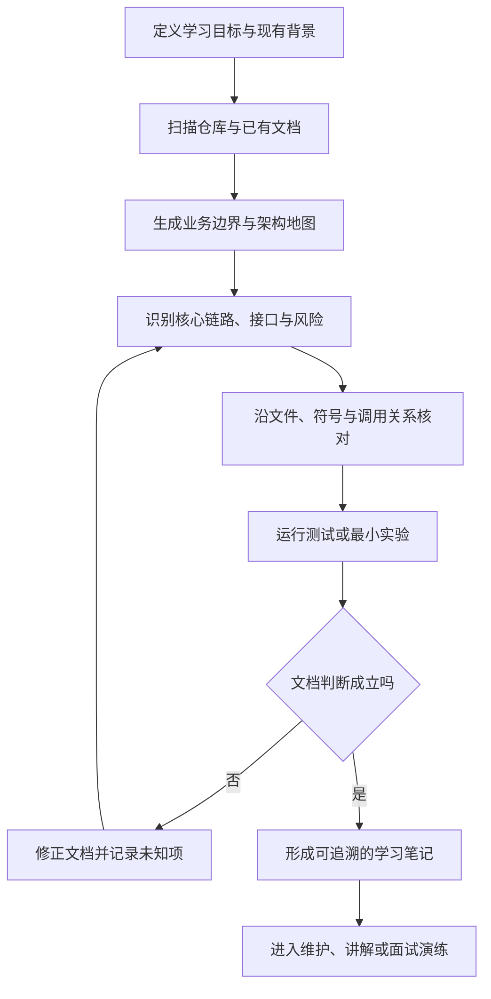

# 总结稿

## 核心摘要

**视频内容：** 作者演示了一套用 Lark CLI 与 Claude Code 制作的 skill，用 AI 快速为陌生代码库生成学习文档。产物包括架构图、核心流程、时序图、技术栈与中间件说明、风险表格，以及面向简历表达和面试准备的材料。它要解决的不是某一行代码怎么写，而是新人拿到仓库后缺少全局地图：不知道项目服务什么需求、有哪些核心链路和接口、为什么选择某种技术方案。

视频认为，可视化与结构化文档比从头顺序阅读代码更高效。演示画面确实能确认文档中出现流程图、表格、架构说明和面试模板；但“文档全部由 AI 生成”“任意 Claude Code 或 Codex 环境都可使用”“生成得非常完美”均是作者的第一方陈述，本次没有找到可链接的公开仓库、安装页或独立评测，不应升级为已外部验证的事实。作者还称将免费分享该 skill，但视频中的未来承诺不能等同于当前已有可下载版本。

## 方法的实际价值

1. **先建立项目地图。** 从业务目标、用户角色和系统边界入手，再定位核心流程、接口、数据流和中间件，而不是一开始陷入文件细节。
2. **把扫描结果转成多种表示。** 架构图回答“组件如何连接”，时序图回答“请求怎样流动”，风险表回答“哪里容易出错”，代码索引回答“证据在哪里”。
3. **围绕问题回到代码。** AI 文档适合作为导航和假设清单，不是代码事实本身；关键链路、边界条件和技术取舍仍要沿文件、调用关系、测试和运行结果核对。
4. **区分学习与包装。** 简历模板和面试问题可以帮助组织表达，但不应把 AI 扫描过的项目写成自己的真实交付经历，也不能用文档熟悉度冒充维护能力。

## 证据边界

- 视频只展示了一次产品化演示，没有提供生成耗时、错误率、覆盖率、对照实验或真实维护任务结果，因此“比读代码高效很多”属于作者判断。
- “能生成 Mermaid”在观众区被直接追问，但视频只展示了流程图画面，未说明具体图形格式和稳定性；应将其作为待验证的工具能力。
- **AI 辅助推断：** 最可靠的用法是让 AI 先压缩搜索空间，再用代码证据验证关键结论。文档质量的最低标准不是画面漂亮，而是每个重要判断能回链到文件、符号、配置、测试或运行记录。

## 与相关笔记的连接

[[clips/AI辅助构建-任意一个领域的可视化知识体系.md|AI 辅助构建任意领域的可视化知识体系]]讨论如何用树、矩阵、图谱和路线为陌生领域建立结构；本视频把同一思路缩小到代码库，用架构、流程、风险和面试问题形成入门地图。组合阅读可以看到：可视化适合暴露范围与关系，但结构化外观不能替代对底层节点、依赖边和原始证据的复核。

[[clips/Matt Skills _ 你的代码库还没准备好迎接AI？这样改才能让AI真正高效工作.md|你的代码库还没准备好迎接 AI？]]强调目录、模块边界、接口和测试决定 AI 能否正确导航代码库；本视频则从学习者视角生成一张外部导览图。两者合起来说明，AI 文档可以降低首次进入成本，但长期可理解性最终仍取决于代码库自身是否有清晰边界和快速验证反馈。

# 辅助理解

## 陌生代码库学习的正确顺序：先建地图，再验证路线

视频展示的方法可以理解为一次“代码库侦察”：AI 先扫描项目，把散落在文件中的业务概念、组件和调用关系压缩成可浏览文档；学习者再据此选择最值得进入的代码路径。

这张图刻意增加了视频演示中没有充分展开的“核对”环节。**AI 辅助推断：** 如果跳过代码与运行验证，AI 文档只是高质量候选地图；只有重要节点能回到证据，地图才逐渐成为可依赖的知识。

## 三类最有价值的学习产物

### 1. 架构与核心业务流

帧 3 把管理员、租户管理系统、租户 A/B、业务系统和不同 `tenant_id` 数据边界放在同一流程中。这样的图最适合回答：请求从哪里进入、跨过哪些边界、数据怎样隔离。随后应选一条代表性路径，在代码中定位入口、服务调用、持久化和权限检查，确认图中的每条关键边。

### 2. 风险地图

帧 4 将数据隔离、性能隔离、权限隔离、功能定制、成本控制和可观测性组织成技术挑战表。它的价值不是宣告这些问题已经被实现正确，而是为阅读排序：先检查高后果、高跨域的风险，再看普通工具代码。

可以给每项风险增加四个证据字段：

| 字段 | 要回答的问题 |
|---|---|
| 代码位置 | 哪些文件、符号或配置实现它？ |
| 机制 | 通过过滤、鉴权、队列、限流还是隔离资源实现？ |
| 验证 | 哪个测试或运行实验能证明它有效？ |
| 未知项 | 哪些边界条件尚未查清？ |

### 3. 问题驱动的深挖模板

帧 10 展示的长任务推演按 WHY、WHAT、HOW、代码落地、正确/错误示范、时序图和面试追问展开。相较于“解释整个仓库”，这种问题驱动方式更容易控制范围：先问一个具体机制为什么存在，再追到代码与失败案例，最后要求自己复述或修改。

**AI 辅助推断：** 最好的学习文档应当逐渐把读者送回仓库，而不是让读者永远停留在摘要层。若某节没有文件引用、关键符号、验证步骤或明确的未知项，它更像一篇概览，而不是维护手册。

## 简历与面试材料的使用边界

视频把“简历怎么写、怎样展示、面试官可能问什么”作为重要产物。它可以帮助学习者把架构知识转成自测问题，但要守住经历真实性：

- 可以写成学习项目、源码阅读或复现练习，并明确自己完成了什么；
- 不能把仓库原作者的设计、AI 生成的描述或未亲自验证的性能结论写成自己的生产成果；
- 面试问题应配套证据任务，例如定位一次调用、解释一种失败模式、运行一个测试或做小改动，而不只背答案。

## 观众讨论与补充

评论数据仅覆盖平台报告的 157 条顶层热评中的 50 条，不含楼中楼；当前可访问弹幕只有 3 条，因此不能据此推断总体观众态度或学习效果。

- 观众“我就是钰D”指出，如果不实际进入代码验证，只扫 AI 文档，很难成为代码库维护者。这是个人实践判断，却准确补上了视频演示的主要边界：地图能加速定位，维护责任仍要求理解执行路径、边界条件和实现细节。
- 观众“大葱蘸豆”表示，自己学习 LangChain/LangGraph 时不如后端代码顺手。这提示生成文档无法完全消除领域模型与框架背景差异；相同导览应根据学习者起点调整深度和术语。
- 观众“SereinSos”追问能否直接生成 Mermaid。视频画面证明出现了流程图，却没有说明格式，因此该问题应保留为能力验证项，而不是默认答案为“可以稳定生成”。

大量“求 skill”或“已三连”的评论只反映资源兴趣，不能证明该方法已经提升真实维护能力。

## 一次可复用的最小实践

1. 选择一个真实维护问题，而不是要求 AI “完整解释仓库”；
2. 让 AI 输出业务边界、核心链路、三项最高风险及对应文件引用；
3. 手工抽查一条链路和一项风险，确认符号、调用方向与配置；
4. 运行已有测试，或为关键假设设计一个最小实验；
5. 把错误、缺口和术语修正回写文档；
6. 最后不看文档，自己画一次流程并解释失败场景。

完成这六步，产物才从“AI 生成的漂亮导览”转向“经学习者核对的代码库地图”。

## 外部事实核验

> 外部事实核验已完成（2026-08-14），未发现值得独立核验的客观声明。

# Data

## 增强转写稿

[00:00] 哈嘍 大家好啊 这里是千千我用 Lark CLI 加Claude Code开发了一个skill
[00:05] 然后来帮助我快速高效的去学习一个陌生的代码仓
[00:09] 然后今天想跟大家做一个分享
[00:11] OK 那首先你可以看到我的这个文档全部都是由AI生成的
[00:15] 不管你用的是Claude Code还是Codex
[00:18] 你只要介绍Laqsala你就可以生成这样子的文档
[00:21] 不管说是这种流程图还是说这种结构化的表达以及这种表格
[00:27] 那它都可以给你生成的非常完美
[00:29] 不管你是一个在学习的学生还是说一个在工作的成员
[00:34] 我觉得都可以去试一下这种思路
[00:36] 就是我们在学习一个陌生的项目的时候
[00:39] 最大的痛点就是拿到这个项目不知道它是做什么的
[00:43] 是为了解决什么需求的
[00:44] 以及第二就是它有哪些核心的链路 核心的接口
[00:48] 以及我们选择了怎么样的技术栈或者说中间件去解决某些特定场景下的问题
[00:54] 你可以看到这种架构图 然后这些时序图 然后包括这样子结构化的表格
[01:01] 都是由 AI 生成的
[01:02] 然后这种可视化的学习是要比你单纯的去看代码
[01:06] 和看文字是要高效很多的
[01:08] OK 以及最重要的一点
[01:10] 我知道大多数人还是想走捷径的
[01:12] 拿到一个项目其实更多的不想去看代码
[01:14] 其实想看那种直接生成好的文档
[01:16] 告诉你简历怎么写
[01:18] 以及在面试的时候会有哪些问题以及怎么回答
[01:20] 那我的skill也考虑到这个情况 它会告诉你简历怎么写
[01:25] 以及怎么跟面试官展示
[01:27] 以及面试官它可能会有哪些问题是你需要去好好准备的
[01:31] 你可以看到我这里已经跑了很多个方向一些比较知名的项目了
[01:36] 然后丢到我的社区文档里面供大家去学习了
[01:39] 然后这个skill我会免费分享给大家
[01:41] 不过还是希望大家可以点一下关注

## 原始转写稿

[00:00] 哈嘍 大家好啊 这里是千千我用Laqsala加Cloud Code开发了一个skill
[00:05] 然后来帮助我快速高校的去学习一个陌生的弹码丧
[00:09] 然后今天想跟大家做一个分享
[00:11] OK 那首先你可以看到我的这个文档全部都是由AI生成的
[00:15] 不管你用的是Cloud Code还是Codex
[00:18] 你只要介绍Laqsala你就可以生成这样子的文档
[00:21] 不管说是这种流程图还是说这种结构化的表达以及这种表格
[00:27] 那它都可以给你生成的非常完美
[00:29] 不管你是一个在学习的学生还是说一个在工作的成员
[00:34] 我觉得都可以去试一下这种思路
[00:36] 就是我们在学习一个陌生的项目的时候
[00:39] 最大的痛点就是拿到这个项目不知道它是做什么的
[00:43] 是为了解决什么需求的
[00:44] 以及第二就是它有哪些核心的链路 核心的接口
[00:48] 以及我们选择了怎么样的技术站或者说中间间去解决某些特定场景下的问题
[00:54] 你可以看到这种再构图 然后这些持续图 然后包括这样子结构化的表格
[01:01] 都是有AI生成的
[01:02] 然后这种可实化的学习是要比你单纯的去看待
[01:06] 和文字是要高效很多的
[01:08] OK 以及最重要的一点
[01:10] 我知道大多数人还是想走接近的
[01:12] 拿到一个项目其实更多的不想去看待
[01:14] 其实想看那种职业生成好的文档
[01:16] 告诉你简历怎么写
[01:18] 以及在面试的时候会有哪些问题以及怎么回答
[01:20] 那我的skill也考虑到这个情况 它会告诉你简历怎么写
[01:25] 以及怎么跟面试官展示
[01:27] 以及面试官它可能会有哪些问题是你需要去好好准备的
[01:31] 你可以看到我这里已经跑了很多个方向一些比较知名的项目了
[01:36] 然后丢到我的社区文档里面供大家去学习了
[01:39] 然后这个skill我会免费分享给大家
[01:41] 不过还是希望大家可以点一下关注

## 原始关键帧

### 关键帧 1

### 关键帧 2

### 关键帧 3

### 关键帧 4

### 关键帧 5

### 关键帧 6

### 关键帧 7

### 关键帧 8

### 关键帧 9

### 关键帧 10

## 补充原始数据

- [bilibili-BV1BWur6gECq-comments.jsonl](assets/bilibili-BV1BWur6gECq-comments.jsonl)
- [bilibili-BV1BWur6gECq-comment-candidates.json](assets/bilibili-BV1BWur6gECq-comment-candidates.json)
- [bilibili-BV1BWur6gECq-danmaku.jsonl](assets/bilibili-BV1BWur6gECq-danmaku.jsonl)
- [bilibili-BV1BWur6gECq-danmaku-analysis.json](assets/bilibili-BV1BWur6gECq-danmaku-analysis.json)
