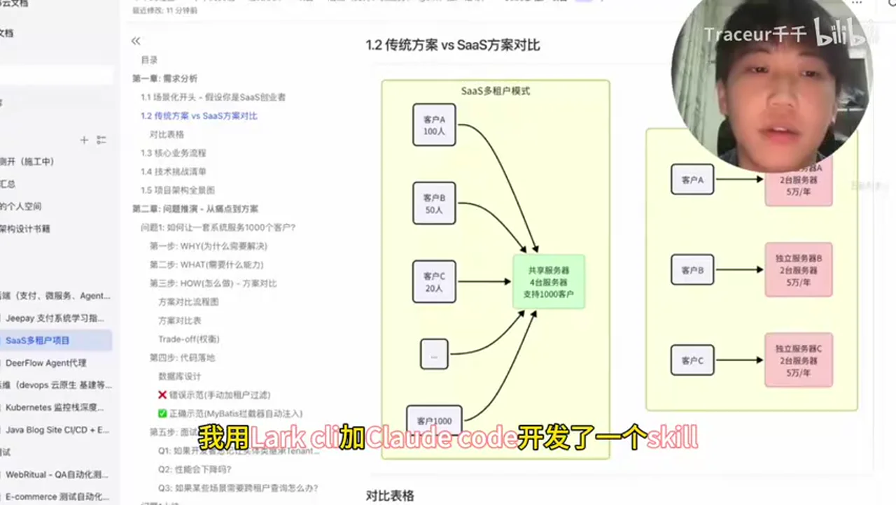
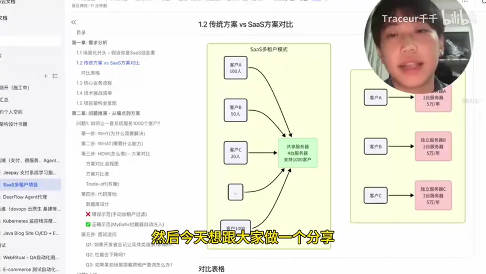
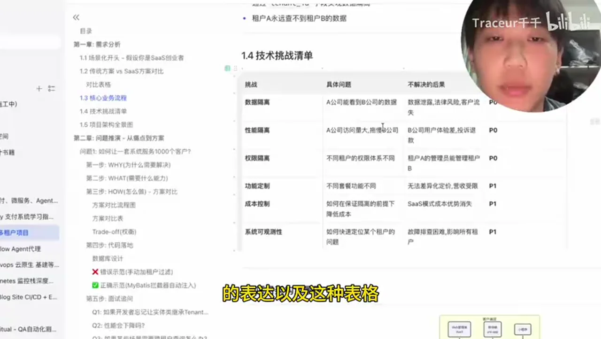
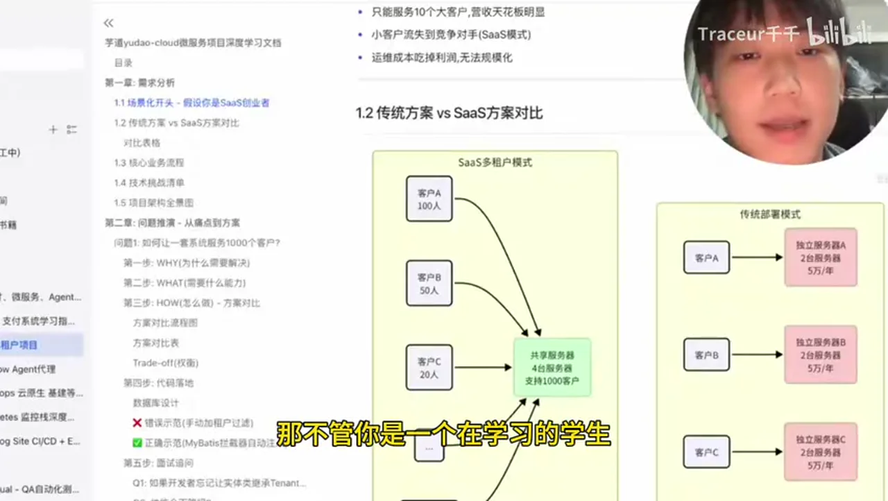
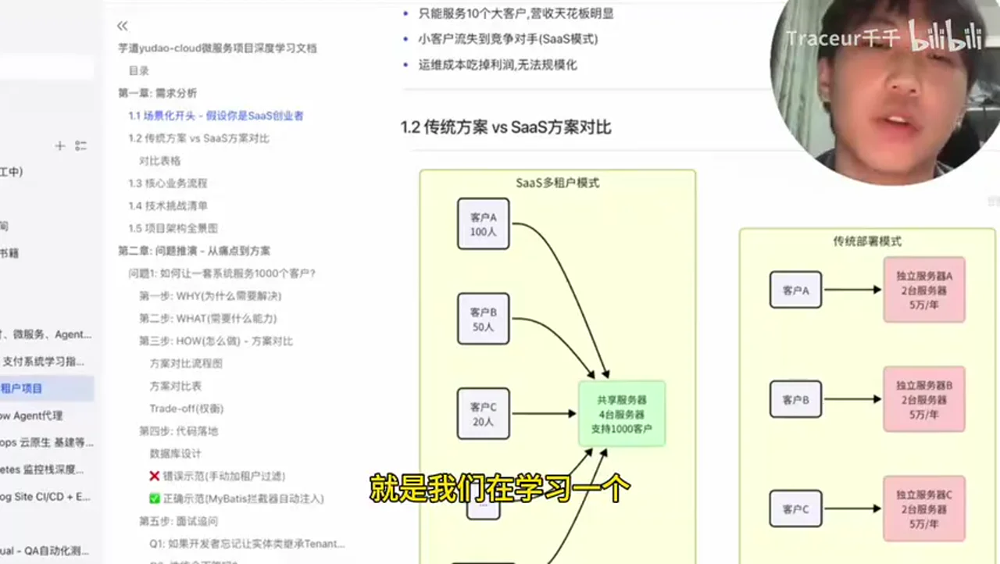
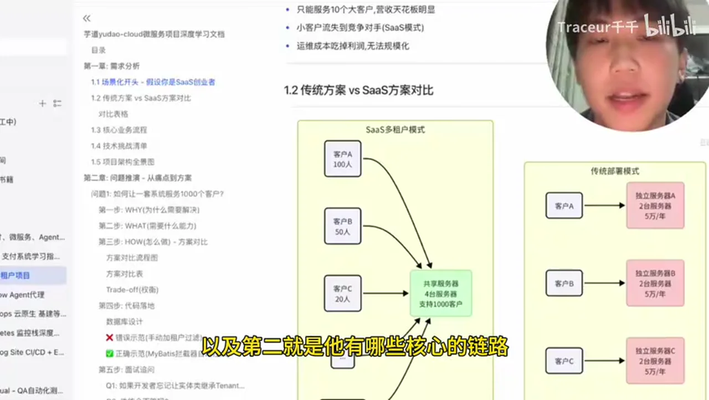
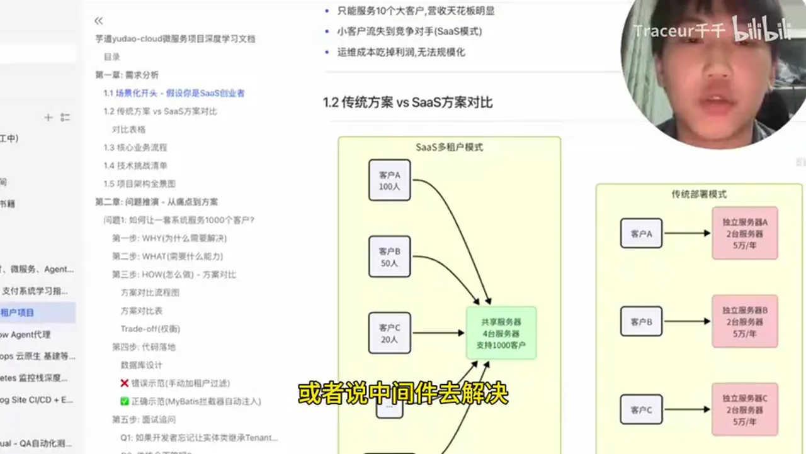

# 总结稿

暂无总结。

# 辅助理解

# Data

## 原始转写稿

[00:00] 哈嘍 大家好啊 这里是千千我用Laqsala加Cloud Code开发了一个skill
[00:05] 然后来帮助我快速高校的去学习一个陌生的弹码丧
[00:09] 然后今天想跟大家做一个分享
[00:11] OK 那首先你可以看到我的这个文档全部都是由AI生成的
[00:15] 不管你用的是Cloud Code还是Codex
[00:18] 你只要介绍Laqsala你就可以生成这样子的文档
[00:21] 不管说是这种流程图还是说这种结构化的表达以及这种表格
[00:27] 那它都可以给你生成的非常完美
[00:29] 不管你是一个在学习的学生还是说一个在工作的成员
[00:34] 我觉得都可以去试一下这种思路
[00:36] 就是我们在学习一个陌生的项目的时候
[00:39] 最大的痛点就是拿到这个项目不知道它是做什么的
[00:43] 是为了解决什么需求的
[00:44] 以及第二就是它有哪些核心的链路 核心的接口
[00:48] 以及我们选择了怎么样的技术站或者说中间间去解决某些特定场景下的问题
[00:54] 你可以看到这种再构图 然后这些持续图 然后包括这样子结构化的表格
[01:01] 都是有AI生成的
[01:02] 然后这种可实化的学习是要比你单纯的去看待
[01:06] 和文字是要高效很多的
[01:08] OK 以及最重要的一点
[01:10] 我知道大多数人还是想走接近的
[01:12] 拿到一个项目其实更多的不想去看待
[01:14] 其实想看那种职业生成好的文档
[01:16] 告诉你简历怎么写
[01:18] 以及在面试的时候会有哪些问题以及怎么回答
[01:20] 那我的skill也考虑到这个情况 它会告诉你简历怎么写
[01:25] 以及怎么跟面试官展示
[01:27] 以及面试官它可能会有哪些问题是你需要去好好准备的
[01:31] 你可以看到我这里已经跑了很多个方向一些比较知名的项目了
[01:36] 然后丢到我的社区文档里面供大家去学习了
[01:39] 然后这个skill我会免费分享给大家
[01:41] 不过还是希望大家可以点一下关注

## 原始关键帧

### 关键帧 1

### 关键帧 2

### 关键帧 3

### 关键帧 4

### 关键帧 5

### 关键帧 6

### 关键帧 7

### 关键帧 8

### 关键帧 9

### 关键帧 10

