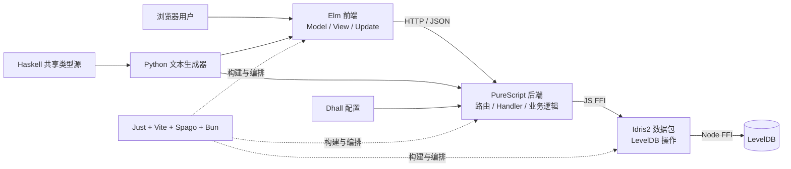
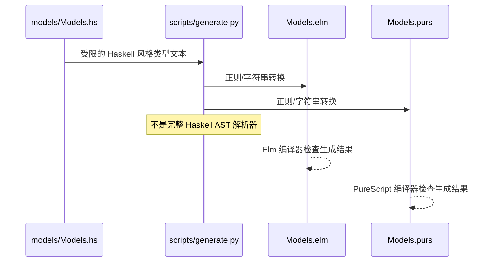
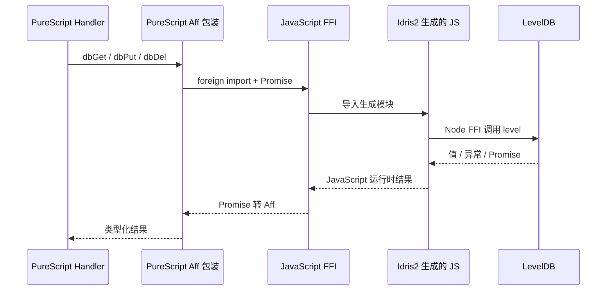
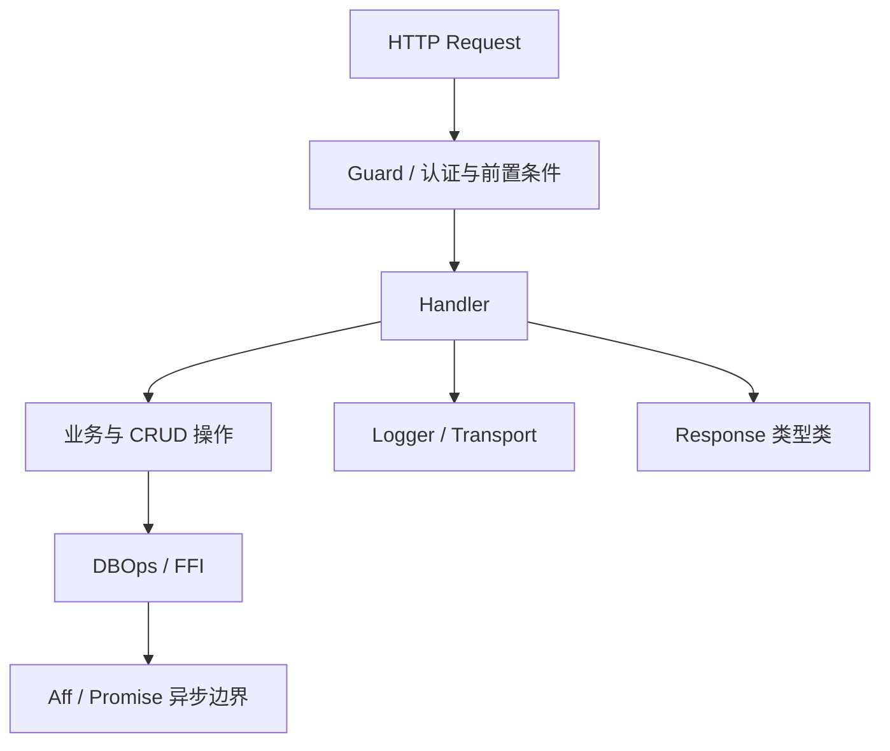
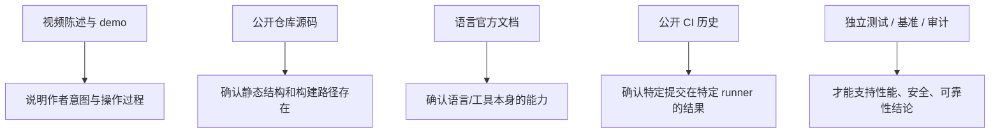
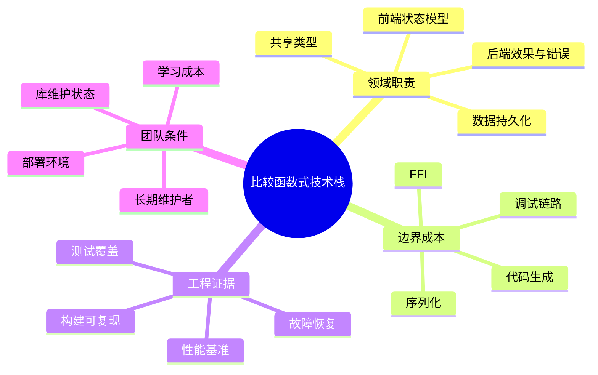

# 总结稿

[打开单页 HTML 总结](assets/bilibili-BV1QZub6bEfz-summary.html)

## 一句话总结

GardenMansion 的价值不在于“用四门语言把 CRUD 写复杂”，而在于把一个小型合租管理应用当成实验台：Elm 负责前端，PureScript 负责后端，Idris2 包装 LevelDB，Haskell 充当共享类型定义源；Python、JavaScript FFI、Dhall、Vite、Just 与 Bun 则把这些边界接起来。公开仓库能验证这套静态架构确实存在，但 demo 不能证明它适合生产、性能更高或天然更安全。

## 项目在做什么

视频先把项目定性为兴趣驱动的实验，而不是生产系统（[00:20–00:48]）。公开仓库的 README、模型与 handler 支持其基本定位：这是一个 self-hosted 的合租管理应用，覆盖登录、用户、留言、费用等 CRUD；仓库同时明确标记 experimental。换句话说，合理的问题不是“为何一个 CRUD 需要这么多语言”，而是“每种语言被安排去展示哪一种函数式设计能力”。[公开仓库 README](https://github.com/biyuehu/GardenMansion/blob/main/README.md)

{{frame:2}}

架构图把核心职责分成四层：

1. **Elm 前端**：以 Model、View、Update 组织交互，并通过 HTTP/JSON 与后端通信（[01:29–03:40]）。
2. **PureScript 后端**：承担路由、handler、业务逻辑、认证、日志和请求/响应抽象（[09:13–14:22]）。
3. **Idris2 数据层**：通过 Node FFI 包装 `level`，编译为 JavaScript，再由 PureScript FFI 调用（[05:57–07:22]）。
4. **Haskell 类型源**：在 `models/Models.hs` 定义共享结构，由 Python 脚本生成 Elm 与 PureScript 类型（[03:55–05:37]）。

这里的“四门函数式语言”专指 Elm、PureScript、Idris2、Haskell。Dhall 是配置语言；Python 做代码生成；TypeScript/JavaScript 负责启动、构建和 FFI 胶水；Vite、Just、Bun、Spago 则属于工具链。把它们全部计入“函数式语言数量”会混淆职责。

## 最值得理解的两条跨语言链路

### 1. 共享类型生成链

在 [03:55–05:37]，作者说明不想让前后端任一方成为类型定义的“偏袒对象”，因此用 Haskell 文件充当中立的源，再用 Python 输出 Elm 与 PureScript 定义。仓库核查确认 `scripts/generate.py` 使用正则与字符串替换处理受限语法，而不是解析完整 Haskell AST。[生成脚本](https://github.com/biyuehu/GardenMansion/blob/main/scripts/generate.py)

这带来一个重要边界：**单一来源减少手工漂移，不等于生成器对任意 Haskell 类型都正确**。当类型语法超出脚本假设时，文本转换可能失败或静默地产生错误，因此生成产物仍需要编译与契约测试。

### 2. 数据库 FFI 链

在 [05:57–07:22]，LevelDB 调用从 Idris2 开始：`Db.idr` 用 Node FFI 调用 `level` 包；Idris2 用 Node code generator 产出 JavaScript；`server/src/Romi/Db.js` 再把生成模块映射成 PureScript foreign imports；PureScript 最终将 Promise 包装成 `Aff`。[Idris2 包装](https://github.com/biyuehu/GardenMansion/blob/main/db/src/Db.idr) · [JavaScript 桥](https://github.com/biyuehu/GardenMansion/blob/main/server/src/Romi/Db.js) · [PureScript 包装](https://github.com/biyuehu/GardenMansion/blob/main/server/src/Romi/Db.purs)

这种链路展示了类型化边界如何层层收窄，但也增加构建、调试和错误定位的成本。类型签名只能约束各自语言看得见的部分；FFI 另一侧的运行时值、异常与协议仍需验证。

## PureScript 后端的“函数式味道”

{{frame:4}}

视频在 [09:13–14:22] 逐步展示后端抽象：handler 处理 CRUD 请求，`Romi.Core` 把环境、错误、异步效果、路由与响应组合起来，日志 transport 也被独立封装。代码画面能确认这些结构存在；它不能独立证明抽象没有缺陷或比常规框架更快。

{{frame:5}}

作者在 [07:04] 说 PureScript“不太适合生产”，又在 [08:53] 强调享受从零搭建特殊技术栈。这两点都应保留为**个人体验与创作动机**，而不是语言的普遍结论。PureScript 官方能确认的是：它编译到 JavaScript、支持 FFI、具备行多态和类型类等表达能力；库维护、部署复杂度和团队熟悉度仍需按项目评估。[PureScript 官方网站](https://www.purescript.org/)

## 构建与运行成本

仓库当前使用 Dhall 配置服务器，Vite 构建前端，Just 串联类型生成、Elm/PureScript/Idris2 构建与测试，Bun 安装依赖并打包（[07:46–08:29]）。作者关于“从 npm 转向 Bun”的说法属于开发史自述；当前仓库只能确认现状。[Justfile](https://github.com/biyuehu/GardenMansion/blob/main/justfile) · [CI workflow](https://github.com/biyuehu/GardenMansion/blob/main/.github/workflows/ci.yml)

视频在 [21:09] 称某些 CI 接近 20 分钟。公开 Actions 历史确有多次约 19–21 分钟的运行，但这是特定 runner、提交、网络与缓存条件下的项目数据，不能外推为函数式语言固有性能。[示例 CI run](https://github.com/biyuehu/GardenMansion/actions/runs/31123837501)

## 事实核查中的关键修正

- **Elm 与 FRP**（[02:23]）：Elm 确实源自函数式响应式编程研究，但 Elm 0.17 后日常模型以 Elm Architecture 为主。Elm 官方明确说 Redux 受其启发；本次没有找到 React 官方一手材料支持“React 本身参考 Elm”，不应把 React 与 Redux 混写。[Elm Architecture](https://guide.elm-lang.org/architecture/) · [A Farewell to FRP](https://elm-lang.org/news/farewell-to-frp)
- **React 绑定**（[01:24]）：PureScript 确有 React 绑定，但旧 `purescript-react` 的页面版本很早；存在绑定不等于某个具体库今天仍是推荐选项。[Pursuit 条目](https://pursuit.purescript.org/packages/purescript-react/6.0.0)
- **许可证**（[19:20]）：仓库声明 `GPL-3.0-or-later`；不要据此自动判断所有第三方依赖、生成物和外部资产都适用同一许可证。[LICENSE](https://github.com/biyuehu/GardenMansion/blob/main/LICENSE)
- **Koka**（[20:09]）：官方将 Koka 定义为带效果类型与处理器的强类型函数式风格研究语言；“给 Haskell 加效果系统”只是作者的类比，不是兼容性描述。[Koka 官方文档](https://koka-lang.github.io/koka/doc/index.html)

## 如何评价这个实验

可以从四个问题出发，而不是数语言数量：

1. **边界是否清晰？** 每种语言是否承担了可以独立说明的职责？
2. **约束是否穿透 FFI？** 编译期保证在哪个边界结束，运行时验证在哪里补上？
3. **收益是否抵消工具链成本？** 类型共享、效果建模与依赖类型实验，是否值得更慢的构建和更复杂的调试？
4. **证据是什么？** README、架构图和 demo 是设计与实现线索；生产质量还需要测试、威胁建模、故障恢复、性能基准和运维记录。

## 观众讨论与补充

样本只有 6 条热门顶层评论候选，平台接口报告可见 10 条；热门排序、未收集嵌套回复都会造成偏差。当前可访问弹幕为 0，这不代表“观众没有反应”。

- 有观众因看到 Idris 感到新奇；这是样本内的主观感受，不是语言流行度统计。
- 多条评论希望加入 Rust、F# 或 Agda；这些是比较愿望，不能形成需求排名。
- 一条评论用 Scala 表达“语法阅读成本”和 `fold` 抽象收益之间的权衡；它提示了一个更好的比较维度，但不构成性能或生产力证据。

如果扩展实验，应该先统一评价口径：实现相同 CRUD、错误处理、数据库边界、构建时间、部署复杂度与维护成本，再讨论替换语言，而不是只增加技术栈。

## 结论

GardenMansion 是一份可检查的跨语言函数式架构样本，而不是生产选型结论。它最有教育价值的地方，是把“类型源—代码生成—FFI—效果包装—构建编排”这些平时被框架隐藏的边界显式化。学习时应同时看到两面：类型与抽象可以让约束更清楚，边界和工具越多也意味着更多生成、互操作、调试与运维风险。

# 辅助理解

## 辅助理解：先看职责，不要先数语言

GardenMansion 可以理解为四个核心函数式语言层，加上一组胶水与工具层：

这张架构图适合回答“谁负责什么”，但它是项目设计材料，不是运行正确性证明。

## 两条不同的“类型流”

### 静态类型生成

这里的收益是单一来源和减少手工复制；风险是生成器只理解它编码过的语法子集。因此还需要编译检查和跨端 JSON 契约测试。

### 运行时数据库调用

每跨过一次 FFI，编译器的可见范围都会变化。边界上的编码、异常、空值、资源关闭和版本兼容不能只靠一端的类型签名解决。

## PureScript 后端抽象如何分层

视频展示的 handler 负责把请求、认证与 CRUD 操作组织起来；核心抽象再把环境、错误、异步效果与响应类型组合。

这种组织方式的价值是把作用域和约束写出来；代价是抽象层与调试路径增加。是否“更好”取决于团队、故障模型和维护周期，不由代码颜色或类型数量决定。

## 证据分层

- README、架构图与源码支持“项目怎么设计、包含什么”。
- 官方文档支持“语言能做什么”，不支持“这个项目已经把能力用对”。
- 一次 CRUD demo 支持“功能曾被展示”，不支持生产负载、故障恢复或安全性。
- 约 20 分钟 CI 是该仓库特定运行记录，不是语言速度排行榜。

## 一个更公平的语言比较框架

观众希望加入 Rust、F#、Agda，或讨论 Scala 的语法与 `fold`，这些都可以成为后续实验方向；但必须在相同 CRUD、错误模型、数据库、部署和测量方法下比较，否则只是在比较印象。

## 阅读时记住的四条边界

1. Elm 有 FRP 历史，但当前核心是 Elm Architecture；官方明确提到 Redux 受其影响，本次没有 React 官方一手证据证明 React 本身参考 Elm。
2. PureScript 可编译到 JavaScript、使用 FFI，也有 React 绑定；“存在库”不等于某个库今天仍适合选型。
3. Koka 确有效果类型与处理器；“给 Haskell 加效果系统”只是类比。
4. 项目声明 GPL-3.0-or-later，但第三方依赖与外部资产仍需分别看许可证。

## 外部事实核验

### 声明 1（00:20）

- 视频陈述：GardenMansion 使用多门函数式语言，是一个内容不大的全栈 CRUD 应用。
- 核验状态：已确认
- 核验结果：截至 2026-08-20，作者公开的 GitHub 镜像仓库仍可访问，README 将其定义为 full-stack、self-hosted 的 shared-flat management platform，并明确列出 Elm 前端、PureScript 后端、Idris2 数据库包、Haskell 共享类型定义；仓库中也存在登录、用户、留言、费用等模型与 CRUD handler。核心项目定位和语言分工得到确认。但这只能确认公开源码与作者自述的实现范围，不能由一个 demo 推出生产可用性、性能、安全性或普遍架构优势；README 自己也把项目标为 experimental。
- 检索日期：2026-08-20
- 来源：
  - [biyuehu/GardenMansion README](https://github.com/biyuehu/GardenMansion/blob/main/README.md)（primary）
  - [GardenMansion shared models](https://github.com/biyuehu/GardenMansion/blob/main/models/Models.hs)（primary）
  - [GardenMansion PureScript handlers](https://github.com/biyuehu/GardenMansion/blob/main/server/src/App/Handler.purs)（primary）

### 声明 2（01:15）

- 视频陈述：PureScript 编译到 JavaScript，处在 JavaScript 生态。
- 核验状态：已确认
- 核验结果：确认。PureScript 官方主页和官方编译器仓库都把它描述为编译到 JavaScript 的强类型函数式语言；官方资料还明确说可编译为可读 JavaScript、轻松复用既有 JavaScript，并通过 FFI 实现互操作。这里的“处在 JavaScript 生态”应理解为输出目标与互操作能力，不等于所有 npm 包都有现成、完备且类型安全的 PureScript 封装。
- 检索日期：2026-08-20
- 来源：
  - [PureScript official website](https://www.purescript.org/)（primary）
  - [purescript/purescript](https://github.com/purescript/purescript)（primary）
  - [purescript-effect: Using Effects via the FFI](https://github.com/purescript/purescript-effect#using-effects-via-the-foreign-function-interface)（primary）

### 声明 3（01:24）

- 视频陈述：PureScript 可以写前端，也有 React 的绑定。
- 核验状态：已确认
- 核验结果：存在性确认。PureScript 包索引 Pursuit 收录了低层 React 绑定 `purescript-react`，也有较新的 `purescript-react-basic` 等方案。视频只声称“有绑定”，这一点成立；但旧 `purescript-react` 页面显示的是 2018 年发布的 6.0.0，不能据此推断具体库在 2026 年仍是推荐方案或维护状态良好，选型必须核对目标包的当前版本。
- 检索日期：2026-08-20
- 来源：
  - [purescript-react 6.0.0 on Pursuit](https://pursuit.purescript.org/packages/purescript-react/6.0.0)（primary）
  - [purescript-react-basic](https://github.com/lumihq/purescript-react-basic)（primary）

### 声明 4（02:23）

- 视频陈述：Elm 把响应式编程带到前端，React 这类框架发展时参考过 Elm。
- 核验状态：部分确认
- 核验结果：部分确认。Elm 官方资料明确说 Elm 源自 Evan Czaplicki 的 FRP 研究；当前 Elm 前端模型以 Model、View、Update 为核心的 Elm Architecture 为主，Elm 0.17 后官方甚至用“A Farewell to FRP”说明 signals/传统 FRP 已退出日常模型。Elm 官方指南明确点名 Redux 受 Elm Architecture 启发，但本次未找到 React 官方或 React 原作者的一手材料证明 React 本身的发展直接参考 Elm。可靠写法应是“Elm 对后来一些单向数据流架构（官方明确举例 Redux）有影响”，不能把 React 与 Redux 混写。
- 检索日期：2026-08-20
- 来源：
  - [Elm Advanced Topics: Functional Reactive Programming](https://elm-lang.org/docs/advanced-topics)（primary）
  - [The Elm Architecture](https://guide.elm-lang.org/architecture/)（primary）
  - [A Farewell to FRP](https://elm-lang.org/news/farewell-to-frp)（primary）

### 声明 5（03:55）

- 视频陈述：项目用 Haskell 定义前后端共享数据类型，再用 Python 做文本处理，生成 Elm 和 PureScript 的类型定义。
- 核验状态：已确认
- 核验结果：确认公开仓库当前实现。`models/Models.hs` 含请求、响应和页面模型的 Haskell 风格定义；`scripts/generate.py` 从该文件的 Types Definition 标记后读取文本，以正则和字符串替换分别生成 `client/src/Models.elm` 与 `server/src/Models.purs`；Justfile 的 `gen` 任务直接运行该脚本。应注意这不是解析完整 Haskell AST 的通用代码生成器，而是面向该项目受限语法的文本变换，超出脚本支持的类型结构可能失败或产生不正确输出。
- 检索日期：2026-08-20
- 来源：
  - [GardenMansion Haskell model definitions](https://github.com/biyuehu/GardenMansion/blob/main/models/Models.hs)（primary）
  - [GardenMansion type generation script](https://github.com/biyuehu/GardenMansion/blob/main/scripts/generate.py)（primary）
  - [GardenMansion Justfile](https://github.com/biyuehu/GardenMansion/blob/main/justfile)（primary）

### 声明 6（05:57）

- 视频陈述：数据库使用 LevelDB，由 Idris2 封装并编译到 JavaScript，然后 PureScript 通过 JavaScript FFI 调用。
- 核验状态：已确认
- 核验结果：确认仓库中的静态调用链。Idris2 `Db.idr` 通过 Node FFI 创建 `level` 包的 `Level` 并包装 get/put/del/batch；Justfile 用 `idris2 --cg node --build` 构建数据库包；`server/src/Romi/Db.js` 从生成的 `db/build/exec/Main.js` 导入导出并映射为 FFI primitive；对应 `Db.purs` 声明 foreign imports 并包装为 `Aff` 操作。Idris2 官方文档也确认内置 Node/JavaScript code generator 与 FFI。以上证明源码设计与构建路径存在，不等于已独立运行测试其正确性、吞吐量或故障恢复能力。
- 检索日期：2026-08-20
- 来源：
  - [GardenMansion Idris2 LevelDB wrapper](https://github.com/biyuehu/GardenMansion/blob/main/db/src/Db.idr)（primary）
  - [GardenMansion JavaScript FFI bridge](https://github.com/biyuehu/GardenMansion/blob/main/server/src/Romi/Db.js)（primary）
  - [GardenMansion PureScript database wrapper](https://github.com/biyuehu/GardenMansion/blob/main/server/src/Romi/Db.purs)（primary）
  - [Idris2 JavaScript and Node code generators](https://idris2.readthedocs.io/en/latest/backends/javascript.html)（primary）

### 声明 7（07:58）

- 视频陈述：服务器配置用 Dhall，前端构建用 Vite，Just 负责编排；包管理从 npm 转向 Bun。
- 核验状态：部分确认
- 核验结果：截至核验日，仓库配置支持这组陈述：`server/sena.dhall` 定义服务器配置结构和默认值；Justfile 调用 `bun vite`、`bun vite build`、Spago、Idris2 和 `bun build`；根目录与 client 都有 bun lockfile，CI 通过 setup-bun 并执行 `bun install`。但“从 npm 转向 Bun”是作者的开发史自述，当前快照只能确认现在使用 Bun，不能仅由仓库反推出迁移的确切时间和完整过程。
- 检索日期：2026-08-20
- 来源：
  - [GardenMansion Dhall server configuration](https://github.com/biyuehu/GardenMansion/blob/main/server/sena.dhall)（primary）
  - [GardenMansion Justfile](https://github.com/biyuehu/GardenMansion/blob/main/justfile)（primary）
  - [GardenMansion CI workflow](https://github.com/biyuehu/GardenMansion/blob/main/.github/workflows/ci.yml)（primary）

### 声明 8（19:20）

- 视频陈述：这个项目大部分代码采用 GPL 3.0 许可证。
- 核验状态：已确认
- 核验结果：核心结论确认，但视频的“大部分”表述不够精确。仓库根目录 LICENSE 是 GPL version 3 正文，其标准附加说明包含“version 3 or any later version”；README 明确写 `GPL-3.0-or-later`，GitHub 仓库元数据识别为 GPL-3.0。未发现逐子目录的许可证清单，因此最稳妥的说法是“仓库声明 GPL-3.0-or-later”，不要凭本次核查断言所有第三方依赖、生成物或外部资产自动适用同一许可证。
- 检索日期：2026-08-20
- 来源：
  - [GardenMansion LICENSE](https://github.com/biyuehu/GardenMansion/blob/main/LICENSE)（primary）
  - [GardenMansion README license declaration](https://github.com/biyuehu/GardenMansion/blob/main/README.md#license)（primary）

### 声明 9（20:09）

- 视频陈述：Koka 很像 Haskell，可以类比成给 Haskell 加了一个效果系统。
- 核验状态：部分确认
- 核验结果：核心语言能力确认，类比需降格。Koka 官方文档把它定义为 strongly typed functional-style language with effect types and handlers，并系统记录 effect typing 与 effect handlers；截至 2026-08-20，官方还明确把 Koka v3 标为正在开发、尚不适合生产的研究语言。“给 Haskell 加效果系统”只是作者帮助理解的类比，并非 Koka 官方的语言定义，也不能据此推断两者语法、语义、运行时或生态兼容。
- 检索日期：2026-08-20
- 来源：
  - [The Koka Programming Language](https://koka-lang.github.io/koka/doc/index.html)（primary）
  - [Koka language documentation](https://koka-lang.github.io/koka/doc/book.html)（primary）

### 声明 10（21:09）

- 视频陈述：这个项目的某些 CI 可能会执行将近 20 分钟。
- 核验状态：已确认
- 核验结果：确认，而且是带时间范围的项目事实。公开 Actions 记录显示：2026-08-06 的一次成功运行从 17:41:06 到 18:02:10，约 21 分钟；2026-07-19 的成功运行约 21 分钟；2026-07-17 的成功运行约 19 分钟。workflow 同时安装 Bun、PureScript/Spago、Elm、Chez Scheme 与 Idris2，再执行生成、前后端/数据库构建和测试，这解释了冷启动成本。该数据只描述特定 GitHub runner、提交、网络和缓存条件，不能外推为语言固有性能或每次 CI 都需 20 分钟。
- 检索日期：2026-08-20
- 来源：
  - [GardenMansion CI run 31123837501](https://github.com/biyuehu/GardenMansion/actions/runs/31123837501)（primary）
  - [GardenMansion CI run 29692699857](https://github.com/biyuehu/GardenMansion/actions/runs/29692699857)（primary）
  - [GardenMansion CI workflow](https://github.com/biyuehu/GardenMansion/blob/main/.github/workflows/ci.yml)（primary）

# Data

## 增强转写稿

# 校正字幕

- Video ID: `BV1QZub6bEfz`
- 领域：functional programming, full-stack web architecture, Elm, PureScript, Idris2, Haskell, and build tooling
- 编辑边界：保留全部原始片段、时间戳及顺序；只修正高置信专名、技术术语和明显 ASR 损坏。无法可靠还原的口语残片保持原样，不以推断补写。
- 证据边界：字幕中的数字、历史叙述、产品能力、性能指标和未来判断仍是视频陈述；校正不等于事实核验。

## 术语表

- GardenMansion：作者展示的合租管理 CRUD 项目。
- 四门核心函数式语言：Elm（前端）、PureScript（后端）、Idris2（LevelDB 封装）、Haskell（共享类型定义）。
- Dhall：后端应用配置；UnoCSS：原子化 CSS；Vite：开发/构建；Just：任务调度；Bun：运行与包管理。
- FFI（Foreign Function Interface）：PureScript、Idris2 与 JavaScript/Node HTTP、LevelDB 之间的互操作边界。
- Spago：PureScript 的包管理与构建工具。

## 逐字稿
[00:00] 欢迎收看本期视频。可以看到，这是一个非常猎奇的项目。
[00:04] 它用的 Language 非常多，这里显示得不全，还不止这些。
[00:08] 然后它叫 GardenMansion，也是非常疯狂，有这么多语言。
[00:13] 这个不是为了堆而堆的,因为这个语言它确实用到了这么多的语言
[00:20] 没办法，然后它是一个全栈项目。
[00:25] 这个不重要，它本身内容其实没多大，也就是一个基本的 CRUD 应用。
[00:32] 然后这里有一个 Feature，可以看，居然全是 Haskell-like。
[00:38] 然后安全和高学的一个语言就是说的
[00:40] 当然它肯定不是一个真正的 production project。
[00:44] 也不是实验项目，就是纯为了玩的一个兴趣项目。
[00:48] 算是一种表达吧,一个Prince
[00:51] 然后你看到它这个stack是有这么多东西,我们这边直接看这个架构图就可以了
[00:57] 再看
[01:03] 来这个架构图
[01:06] 最开始我是想用 PureScript，它是非常 Haskell-like 的语言。
[01:11] 它本身就是一个 Haskell-like、Haskell-like 的方言。
[01:15] 或者说它编译到 JavaScript，处在 JavaScript 生态，所以说。
[01:20] 就是想用 PureScript 这门语言做一点东西。
[01:24] 写前端吗？它可以写，它有 React 的绑定，也不错，不过我没用过。
[01:29] 所以我觉得,不让它做前端,让它做后端,那么前端就好了,前端,正好
[01:34] Elm 也是一门语言，但它不如 PureScript 那么厉害。
[01:39] PureScript 还是保留很多 Haskell-like 的特性。
[01:43] 但是它扩展了一些东西，比如行多态。
[01:47] 类型类是 Haskell、PureScript 的传统；还有 I/O，它不叫 I/O，叫 Effect。
[01:54] 所以说 Elm 这边的类型系统比较简单。
[02:00] 当然,比一些主流的编程连,肯定它是负达的多啊
[02:04] 只是说相较 Haskell，它比较简单，类型类不能定义，只由有限的几个内置类组成。
[02:11] 不过,它是专门来写前端的,它没法写后端的地方的话,它编一些,也是下层的,没有外部提供出来
[02:20] 所以我就让它专门来写前端,因为它挺好对抗
[02:23] 因为 Elm 带来的是响应式编程的概念。
[02:29] 它把它带到了一个wrag带到了前端,然后像react这种框架,它在发展的时候,其实就参考了Elm的语言
[02:37] Elm也算是一个多米修士的纯准,对,就有了
[02:42] 然后前端这边还要用 CSS；我最讨厌写 CSS，也讨厌类似 Tailwind CSS 的写法。
[02:49] 所以我用了一个原子化 CSS 框架，也是我经常用的 UnoCSS。
[02:55] 为什么不用另一个更知名的 CSS 原子化方案？因为我讨厌它，而且它不够自由。
[03:03] 然后就近台这边,还是用一些HTML,所以这边就已经1234个语言了
[03:11] 这边的构建用的是 Vite。
[03:17] 那个我们这里是首写了一个Elm的一个插件,在这里
[03:23] 不不不,不是这个,是另一个项目的事吧,对,另一个项目的事是搞错了
[03:31] 然后就是插件和一个对接,然后呢,它是需要一个教学的CS,所以现在又加了一名语言了
[03:40] 插件和 Elm 对接需要一点 TypeScript，所以又加了一门语言。
[03:47] 在CS里面,根本就不用担心,你却也是权,你这样还敢想
[03:51] 然后这个可以怎么办,我想用一种优养的方式,我不想用EMD类型,不能用最爱的方式
[03:55] 因为这像偏袒某一方，所以我请来了 Haskell 本尊。
[04:02] 我们用 Haskell 定义前后端共享的数据类型。
[04:13] 这是它定义的,Haskell定义的
[04:16] 这三门语言就是 PureScript、Elm 和 Haskell，语法非常像。
[04:24] 我还是有点小也不同的,所以呢,我肯定不至于去找个AST,比如我上哪儿去给你找AST,对吧
[04:32] 所以我要做转,我要怎么做,就直接做文本处理,我用什么做呢,Haskell吗
[04:38] 不是在合理吧,Haskell它是明,毕竟需要编译的语言,不是做了一个比较矫格的语言
[04:44] 那TS吗,TS吗?不太合适吧,它比这两个太C like了,Python,对的,我们请到Python过来,Python它很Haskell吗,它其实不Haskell
[04:56] 但是它比TS更有那种味道,首先它是有缩进的
[05:02] 缩进在Python连不是一个好东西,我很讨厌
[05:06] 因为它没Memory的部落,你整个毛线的缩进,但是它是很像的,反回来它是一个箭头的
[05:15] 这个就非常的一个传统了,非常的像函数式类型的定义了,对吧
[05:21] 所以它是有那么一点点的灵活,一种ML的精髓存在
[05:27] 所以我就让它来做一个深层,它分别深层的一个Elm 前端的,还有PureScript的一个类型定义的存在
[05:37] 总之就做一箭子替换就可以了
[05:40] 然后呢,现在三个Haskell家族的语言,我想是不是可以再来一个语言呢
[05:51] 我把 Idris2 请了过来。Idris2 能做什么呢？
[05:57] 那就做数据库处理吧，因此数据库使用了 LevelDB。
[06:04] LevelDB 又由 Idris2 来封装。
[06:11] Idris2 是 PureScript 后端的数据库封装。
[06:14] 所以我把 Idris2 编译到 JavaScript。
[06:18] 然后再由 PureScript 通过 JavaScript FFI 调用。
[06:25] 然后就给PureScript也来,封装也来,然后在PureScript它又传了一个16的一个抽象
[06:35] 为一个LevelDB的一个抽象的种子,就是比较弯弯的,我完全没想必要啊,最后呢,我们的一个,不,还是这个,就我们PureScript,我们试试了一个自己封装的一个后端环节啊
[06:50] 因为我一开始想找一些线程,但发现根本找不到,还有一些人其实能找到的就是太老了
[06:56] 然后还得学习它的一套语法,不止的,它不仅是封装啊,因为仍而干嘛,它就变坏嘛,对吧
[07:04] 这也让我深刻领悟到 PureScript 真的不太适合生产。
[07:11] 主要基于 LevelDB 的 binding，做了非常简单的包装。
[07:22] 还有 Request 和 Response 的抽象，以及 JSON 序列化。
[07:34] 这个项目它开发作业比较长的,它是从去年9月就开始创建的,然后呢,直接,啊,到现在,到上个月才完工,现在才有时间,时间来录这个视频,嗯,
[07:46] 我逐渐开始把项目从 Node 转到 Bun，这个也不例外。
[07:58] 配置使用 Dhall，做服务器配置。
[08:12] 做一个 task runner；包管理原来用 npm，后来转向 Bun。
[08:29] 所以我用了 Just，负责编排构建流程。
[08:53] 其实我还是很享受从零,搭建一个特别的一个技术在的一个,开始一个模板,啊,还不要不错的,啊,然后我们来看一下一个具体的代码吧,先来看一下,啊,对,先来看一下这个,这个后轮的,
[09:13] 一看就说十八个裸花,啊,就已经,我们区区闹了,反正的话,ASP,它就是普普克克力,它是有点问题,也就是,我现在不要在这里给你打开啊,
[09:25] OK,你看到这里,一个utls,没啥好说,就是基本的一个新装,然后这个就是Models,Models的话,那就是直接转一个,你就可以看,那这些妹,妹的话,然后就是,这核心的,来这个,挪饼,它就是一个框架,然后我们是新装,那一个,然后我这就是它一个核心,
[09:42] 然后这里是一个快乐,然后它这里是一个,然后这些简单,那个分钟,就进了,做得很简,没得不,不复杂,然后这些Response,一个出现啊,然后还有一个Response,对吧,然后就是一个Response,一个出现啊,
[10:03] OK,这Main,然后有一个类型类,出现了一个,然后对,这里Response,它也定一个类型类,就是Response,啊,还是不是说了,它比较符合一个习惯,因为我不知道为了写就写,要符合一个习惯的类型类,然后呢,那一个db,db的话,
[10:22] 这就是从,一个Idris2来弄过来的,你可以看到这里,就能直接导了,这Idris2的一个构建出来一个名件,JS,然后就,就做了一些发电影,然后就交给.
[10:34] PureScript,它也不是完全是纯风中,我们就是它等了一个叫做dbops的一个东西,它的话,算是一种,非常,我不知道能不能成为ORM的吧,就是非常微型的一个东西,
[10:47] 就不至于让你直接去调这些语句,这些函数,这些超过了一个增深改杂,一个函数,然后建立一个抽象啊,一般翻入类型,
[10:56] 但cool,cool的话,是比较核心的一个名,现在读明,读明的话,它是个Monad,
[11:02] 那都用了一个SF,还有一个Reader,然后有af,af的话,它是progress来面的东西,然后f它在桌面专门保持一个异度,对,
[11:14] 然后它从不就是af,这个跟hasker还是不同的,f,af就叫Effect嘛,然后Guard,Guard的话,就是抽象一个星球,然后代理,然后这一个,然后Handler,Handler的话,就是,
[11:29] 呃,一个Guard再包装一层,来,算是返回,Guard不一定要返回,它可以传回一个任何理念,可以接着传,可以变化那个类型,
[11:39] 它是非常有函数式的味道的,东西是spot函数式的,它是Router,然后Router,OK,你们看一下,然后Logger的话,我们这里也包装了一个,
[11:49] 一个打印的cool,它是从一个,我当时写的,当时我从,就很久以前两年前嘛,可能就写了一个ts,写了个Logger,
[12:00] 我们把它相对破了过来,那个味道,然后Transport,Transport的话,还是支持早涩的,你看这个,这个老爸我随意用的,
[12:10] 我也是两年前写的一个,根据就扣它的功率的一个,然后这个就是一个简单的一个,还有一个Transport的概念,
[12:19] Transport的概念呢,就是什么呢,它,也当时那儿传过来,就是,你就是好几种Transport的,然后,
[12:25] 然后这里就我们,博士里只选这个Transport,就打印到控制的,你也可以选文件啊,或者一个网络传输,打一个日子的,
[12:32] 对吧,然后因为我们这个统一的日子的出像,就在这里,也就是一个出像在这里,
[12:39] 然后我们看APSF,就是goop,然后就是打印的东西,然后复始,输去cool,然后在这里,
[12:46] 然后这个长量就给你,然后就尬的,尬的吧,就是一堆,就是尝试过去这个,但是这个尝试,就是它不一定会拦截,然后要求的话就是你,
[12:56] 那没有你就不能给我来,然后这个,对,这一堆,还有一个slack车,拿到东西这个,
[13:03] 对,然后这个什么,实际上,实际上,实际上的话,就是使用一个,或者是什么,也是,我都很喜欢那个,比较轻的,也不那么重的,可以让我留,那更多余,让我自己去发挥它,啊,不错,不错。
[13:16] 然后一个tips,有吧,就是对于,从第一个那些东西,就有一个具体的话,就还有一坨,然后给我们加了一个环境,环境就自己这里定义了。
[13:27] I got it,这个,那个application,对,completion,然后这个车子,看到它非常神明,是非常的优美,这也就是我们这个asker中原的美了,对,
[13:39] 现在真的像一句话一样,就是肉,把第一个路由,然后一个gate,然后一个路径,然后一个操作啊,就是,然后handle就在这里,handle的话,我没有把一个路由的处理,以及那个service给分离出来,我觉得没必要。
[13:51] 那个java,不是囤一坨吗,我为什么非得分离开,我的鞋子挺舒服的,说说,因为这个本来是小的像我,然后验证验证,放我这里比较做的粗草,没有装的眼睛啊,也没有用一些马库啊,不要,不要,然后。
[14:11] 我们就这样,然后这边还有个面链贴,就是,因为你也知道的,它构建,它构建出来,它是,然后一个面,还是你的字雕了,它会真正的窒息啊,对。
[14:22] 然后这个就是,构建出来的一个bundle的,这个由Bun一个Bun的简子,对,那我来看前段这边。
[14:32] 那么就是,先看一段Idris2这边吧,刚刚没说呢,一段Idris2,全是第一个sync,就是java,一个promise,一个封装成一个,啊,就一个莫纳的,那些都是一个基本的东西。
[14:50] 然后这个database,database,这个本来就出现了,你看了,它这里也封装了那么多,然后,这几个人也做了一个差不多的类似的,然后它直接调了一些封装的方法,然后这个demo,
[15:01] demo是,这个本管这个,证明来测试了,应该三组的按键,然后这里我进了几个xport,函数啊,对,然后主要是就会compress,我们最后就是导致了一些,这样才能到那边,
[15:14] 像pcb粉里面那个dcfli能拿到,然后,先说一台吧,刚看过吧,大概就这样,然后,这我八个遍,不过我基本有demo费嘛,都是用txt写的嘛,我看我一开始不用txt写的,应该是用txt写的吧,不可以啊,那应该,可能是给按改的吧,好吧。
[15:42] 就说,我一不绕啊,可能,写的下面有个多可能是不可能的吧,我再看这边的话,我们首先是用Vite,Vite的话,然后这里有几个三键对于虚拟线程,然后这边还有一个代理,对,代理互动的,
[15:55] 它也是个非常,强度的分解的项目,不过我生成的人,或是比较,一个,不是,也不是,就是真的用手把它弄得一起的,因为,
[16:04] 这边,不得它做了一个静态文件,分发幅切的啊,一个又一个常规的,手段还是很小的这个,不得,全都是在,
[16:19] 胜位头吧,可能,大部分前代大部分是都花在一个后端的一个抽象上啊,还有这个一个里面,还有这个整个的一个,像一个调度啊,还有一个很有趣的吧,
[16:31] 然后那当时我在一个新的写单上,其实也不读,阿英华是要写起来的,然后这个写的比较快有钱的那块就是当时,
[16:39] 你都都是加碧AZM,比如这个,还不会确实我AK都写完了,这个肯定可以加碧用啊,然后APD里有什么呢,可以看一下这里吧,
[16:47] 这个是一块钱的一个纪录文件,然后再来看这边,AK,这个就是对接,然后这个是罗勒斯,这个是你生成的,然后不是ZAP,就是ZAP吧,就是,
[17:02] 但是呢,我个人就是人形的TS,就不要写DS了,因为如果有很多人是直接支持你把这个TS,就可能冲冲起来,都要冲冲起来,然后这个UTS呢,也是一种东西,
[17:17] Aerman他的学期真的很高,他很小小的心跳,他能让你赶到Haskell,因为他的话,他SSP还有安装本都是非常轻松的,比PureScript还好使还稳定一些,
[17:32] 而且什么的,太多强大的一个类型面子的特性,就是,我人妹说,所以Elm里面,因为我发现,如果你不Elm里面,其实,也不是,那时候就是说我他三个功能,我就对一个页面的本来单纯一点,没必要拆分该,他本身就只是,只有一个组件的啊,
[17:52] 说我都没必要拆分该,还好玩我就,因为我当时让Elm感觉跟他们难受的,所以呢,做页面本身那种没有拆开的,我们把一些东西都推不推过来,他也可以拆开了,
[18:03] 我就是,还,这些是什么东西,不过他,如果Elm库尔长有点问题,就是他这里,点是不太提示,你在TS的TS里面,他就是有一个正常的一个结束,不过他还是有一些少这样的一个,CS的一个胶水,这些掉的事情,最后呢,其实,
[18:23] 我挖死,给看一看,对不起,不要封闭,就不在这里打死,然后就非常的有趣,然后说呢,他是比较有趣的,因为我后面还想过,然后就,这个说了蛮好的,就是李哈,他这个,他,不是一个纯粹的标准员,也不是一个编程员,他这个配置,配置编程员员啊,像小时候的名词,总之呢,他的语法也是很划算,我选了他,因为当时PureScript,
[18:52] 也是用了这玩意做配置,不过上个月,回来重复的时候,我发现,PureScript新版卷不用他的卷,用那个压,
[19:03] 我这个,有点气笑了,不过他还好,总之,也是对位了,也是函数4嘛,这个,啊,然后过程期间呢,就,我还是想写一个SR ID,哈斯克来做的,不过这个,他又写了一些问题了,我没有放弃这个项目,
[19:20] 我一直写,写了一些,我没有放弃这个项目,因为他这个半神品,半神品,他这个学生跳了一个,整个项目都是GPR3.0解译,大部分项目都是用那个解译,因为你不要写完,然后后面画一个加二的声态,就是Dhall声明态里面,他还有一个,也是一个哈斯克来的语言,他是,哈斯克的语法算是,是面前的Dhall声明,我画一个语言叫,Bridge吧,好像是这样,好像是这样叫的吧,反正,他死了,
[19:50] 死了很久了 没什么
[19:52] 挨回生产的时候 当你把握你家 然后我去外面拉进来 也干不了什么
[19:57] 然后的话 在这个项目结束的一段时间 上读吧
[20:01] 可是严若更 效果变成了 都做了一个扩卡
[20:05] 然后后面又去跑这个节目 Koka这个语言的 Koka你
[20:09] 在这里 他语言的话 我就发现他其实也很Haskell
[20:13] 他就相当于是给Haskell加了一个效果系统
[20:19] 然后我们想 随隐形状 好像 其实觉得 这个也可以加进来的能词
[20:24] 因为项目本来就已经告一段那种 然后这我们还是跑一下吧
[20:30] 那个 我说我们跑一下 这个到底啥效果的吧
[20:34] 我们先将范围直接点
[20:37] Haskell C
[20:43] Haskell C
[20:44] 好 然后这边是前端 这边是后端
[20:47] 然后的 这个项目呢 它是高历 它是比较正经的
[20:52] 所以它GitHub本来不让它留屁吧
[20:54] 就几乎在 选的比较留屁 选的有点客气
[20:57] 但是这个还该有的有的 这个CI也是有的
[21:01] 很难播的点 就是它安装一的也是真的 有点慢
[21:06] 反正这个 现在安装方 安装一的也是很慢的
[21:09] 所以说它这个会有些可能会执行将近20分钟的CI
[21:13] 好 先看一下 先看到这个 这个样子 然后登出 不登出
[21:18] 因为我的密码我们设计是Route登出 再看到这个样子
[21:25] 然后一个留言可以删除我们是管理员
[21:29] 然后一个书改密码 然后呢 还有这个封禁 这个A也是
[21:33] 然后这边一个房间管理 它是一个 对 它是一个租房管理的一个系统
[21:39] 我们可以租一个金额 可以删除的话
[21:46] 我们就是 可以回顾它
[21:50] 你可以不回复 直接拍一个 一个冬年 然后是有情况
[21:55] 是有的话 既然有管理员这边的添加一个新的室友
[21:58] 然后这边可以对大家进行一个封禁
[22:01] 然后封禁之后呢 它封禁就像那个软删除吧
[22:05] 你无法登入了 然后再删除 彻底彻底删除
[22:09] 再试试一下
[22:14] 删除之后就更不了了 能不能看一下是吧
[22:20] 然后
[22:25] 可以看到这个冬学院的 能不能删除之类的
[22:31] 这个显示有点问题 还有一点Bug我靠
[22:40] 然后 它这个样子 这边是一个 不能打印 它是一个比较详细的
[22:49] 我们就这样吧

## 原始转写稿

[00:00] 欢迎收看本期视频可以看到这是一个非常雷霆的项目
[00:04] 它的Language非常多的,这里显示它不全好,不止这点
[00:08] 然后它叫Battergy也是非常的疯狂,有这么多的
[00:13] 这个不是为了堆而堆的,因为这个语言它确实用到了这么多的语言
[00:20] 没办法,然后它是一个权在的一个项目
[00:25] 这个不重要,它本身内容其实没多大,它这个也要基本的一个赛语言用
[00:32] 然后这里有一个future词,可以看,就是居不全是,还不是里面
[00:38] 然后安全和高学的一个语言就是说的
[00:40] 然后咱们说的它肯定不是一个真的一个proxy语词
[00:44] 也不是一个实验的项目,就是一个传闻玩的一个兴趣
[00:48] 算是一种表达吧,一个Prince
[00:51] 然后你看到它这个stack是有这么多东西,我们这边直接看这个架构图就可以了
[00:57] 再看
[01:03] 来这个架构图
[01:06] 最开始我是想用一个proxy语言,它是非常的hust like
[01:11] 它本身就是一个hust like,hust like的方言
[01:15] 或者说它是编译到一个JS,它是一个在futureJS生态码,所以说
[01:20] 它就是想用proxyprpr的语言,做一点东西
[01:24] 写前端吗,它可以写,它有一个reactor的一个绑定,它是不错的,不过我们用过
[01:29] 所以我觉得,不让它做前端,让它做后端,那么前端就好了,前端,正好
[01:34] 12am它也是一个语言,但它不如proxyprpr那么厉害了
[01:39] proxyprpr它还是值得很多一个hust like的特性
[01:43] 但是它在扩展的一些东西,比如说一个行动态
[01:47] 一个典语房,这个是hust,proxypr的一个字一个窗门一下,还有I/O的话它不叫I/O,它叫一个if they're
[01:54] 然后呢,所以说,amn这边呢,它类型,系统比较简单吧
[02:00] 当然,比一些主流的编程连,肯定它是负达的多啊
[02:04] 只是说,效率hust跟我们比较简单,它的类型类,不能定义,它是由有限的几个类质的
[02:11] 不过,它是专门来写前端的,它没法写后端的地方的话,它编一些,也是下层的,没有外部提供出来
[02:20] 所以我就让它专门来写前端,因为它挺好对抗
[02:23] 因为12am它就是一个叫做响应式编程的一个概念
[02:29] 它把它带到了一个wrag带到了前端,然后像react这种框架,它在发展的时候,其实就参考了12am的语言
[02:37] 12am也算是一个多米修士的纯准,对,就有了
[02:42] 然后我们就让它写前端,然后CS,我最讨厌一些CS,我最讨厌一些类制类廉的CS
[02:49] 所以呢,没有用,我用了一个原则化的框架,是最爱的,也是我经常用的路路CS
[02:55] 为什么不用另一个更致明的CS的原则方式,因为我讨厌它,然后它不够自由
[03:03] 然后就近台这边,还是用一些HTML,所以这边就已经1234个语言了
[03:11] 然后呢,再看这边,这边的构建呢,就是用的那个wraith了,对吧
[03:17] 那个我们这里是首写了一个12名的一个插件,在这里
[03:23] 不不不,不是这个,是另一个项目的事吧,对,另一个项目的事是搞错了
[03:31] 然后就是插件和一个对接,然后呢,它是需要一个教学的CS,所以现在又加了一名语言了
[03:40] 然后最后呢,这很搞的一点,就是你前后端都这样了,我们应该定一个如何定义类型的,对吧
[03:47] 在CS里面,根本就不用担心,你却也是权,你这样还敢想
[03:51] 然后这个可以怎么办,我想用一种优养的方式,我不想用EMD类型,不能用最爱的方式
[03:55] 因为这像片谈的模一方,那是我请来了Husker本尊,对的
[04:02] 来到这边,我们用Husker定义前后端的共享的一个数据类型,可以看到在这里
[04:13] 这是它定义的,Husker定义的
[04:16] 然后呢,这个两个语法是很像的,所以呢,我也不,这三名语言就Sparp.amr的Husker,那语言非常像的
[04:24] 我还是有点小也不同的,所以呢,我肯定不至于去找个AST,比如我上哪儿去给你找AST,对吧
[04:32] 所以我要做转,我要怎么做,就直接做文本处理,我用什么做呢,Husker吗
[04:38] 不是在合理吧,Husker它是明,毕竟需要编译的语言,不是做了一个比较矫格的语言
[04:44] 那TS吗,TS吗?不太合适吧,它比这两个太C like了,Python,对的,我们请到Python过来,Python它很Husker吗,它其实不Husker
[04:56] 但是它比TS更有那种味道,首先它是有缩进的
[05:02] 缩进在Python连不是一个好东西,我很讨厌
[05:06] 因为它没Memory的部落,你整个毛线的缩进,但是它是很像的,反回来它是一个箭头的
[05:15] 这个就非常的一个传统了,非常的像韩式类型的定义了,对吧
[05:21] 所以它是有那么一点点的灵活,一种MRI的精髓存在
[05:27] 所以我就让它来做一个深层,它分别深层的一个ERM前端的,还有Scribbr的一个类型定义的存在
[05:37] 总之就做一箭子替换就可以了
[05:40] 然后呢,现在三个Husker家族的语言,我想是不是可以再来一个语言呢
[05:51] 对吧,我把意德里斯一个请了过来,意德里斯能做啥呢,这个可能让我老回来,我想了一下
[05:57] 没糟了,这样做一个数据库处理吧,因此我们用,我们的数据库呢,使用了LayerDB
[06:04] 然后LayerDB的话,它又是由意德里斯来
[06:11] 然后意德里斯呢,它是一个Scribbr的一个后端的
[06:14] 所以我把它编译到了一个节省,然后节省呢
[06:18] 然后我们又用Scribbr,明天它用一个节省,在这,然后我们应该对节省
[06:25] 然后就给Proscribbr也来,封装也来,然后在Proscribbr它又传了一个16的一个抽象
[06:35] 为一个RMDB的一个抽象的种子,就是比较弯弯的,我完全没想必要啊,最后呢,我们的一个,不,还是这个,就我们Proscribbr,我们试试了一个自己封装的一个后端环节啊
[06:50] 因为我一开始想找一些线程,但发现根本找不到,还有一些人其实能找到的就是太老了
[06:56] 然后还得学习它的一套语法,不止的,它不仅是封装啊,因为仍而干嘛,它就变坏嘛,对吧
[07:04] 嗯,这个其实也很痛苦,也让我深圳领悟到,真的不是很适合一个深圳的生产啊
[07:11] 然后它的主要就是基于一个RMDB的庇固啊,嗯,它非常的简单的包装啊,但它RMDB的庇固它本身也不是太低层的,所以还好吧,顺其的啊
[07:22] 然后还有Requested而Pros的一个抽象,还有其他的一些节省序类,嗯,然后是一个运行,是运行,是什么,最开始一直都是用的漏点,然后我最后不需要,我讨厌的,这个,这个,啊,
[07:34] 这个项目它开发作业比较长的,它是从去年9月就开始创建的,然后呢,直接,啊,到现在,到上个月才完工,现在才有时间,时间来录这个视频,嗯,
[07:46] 总的呐,我这个在前几个月,我这个,然后逐渐开始把我作为的所有项目都能尽量转,一到一棒的时候转,就转一转,所以这个也不例外了,放太箱太快了,真的,
[07:58] 感动,这就不是什么偏偏的样子,这些人比的,是说,然后呢,然后就配置配置的话,就是DHAR,DHAR的话,就是它做一个服务器的配置吧,
[08:12] 做一个taster runner,taster runner,帮我们用什么,用npm,用bump,啊,啊,exon,啊,还没用bump,还没转一个bump,就,就可能不只用npm,太,太lug了,太雕位了,对吧,我用了这么多元一个,还有用npm,太,太npm了,
[08:29] 太,太npm了,所以我就用了个gast,那是不错的吧,那就是版本的同时用npm,怎么说呢,这个项目最,开始最,呃,烦的时候,就是做一个个人,配置,呃,一个构建,流程的一个调度了啊,对,可以,行啊,当在弄好的时候就不错了,
[08:53] 其实我还是很享受从零,搭建一个特别的一个技术在的一个,开始一个模板,啊,还不要不错的,啊,然后我们来看一下一个具体的代码吧,先来看一下,啊,对,先来看一下这个,这个后轮的,
[09:13] 一看就说十八个裸花,啊,就已经,我们区区闹了,反正的话,ASP,它就是普普克克力,它是有点问题,也就是,我现在不要在这里给你打开啊,
[09:25] OK,你看到这里,一个utls,没啥好说,就是基本的一个新装,然后这个就是Moros,Moros的话,那就是直接转一个,你就可以看,那这些妹,妹的话,然后就是,这核心的,来这个,挪饼,它就是一个框架,然后我们是新装,那一个,然后我这就是它一个核心,
[09:42] 然后这里是一个快乐,然后它这里是一个,然后这些简单,那个分钟,就进了,做得很简,没得不,不复杂,然后这些Response,一个出现啊,然后还有一个Response,对吧,然后就是一个Response,一个出现啊,
[10:03] OK,这Messian,然后有一个类型类,出现了一个,然后对,这里Response,它也定一个类型类,就是Response,啊,还是不是说了,它比较符合一个习惯,因为我不知道为了写就写,要符合一个习惯的类型类,然后呢,那一个db,db的话,
[10:22] 这就是从,一个理事来弄过来的,你可以看到这里,就能直接导了,这理事的一个构建出来一个名件,JS,然后就,就做了一些发电影,然后就交给.
[10:34] TouchBipers,它也不是完全是纯风中,我们就是它等了一个叫做dbops的一个东西,它的话,算是一种,非常,我不知道能不能成为orim的吧,就是非常微型的一个东西,
[10:47] 就不至于让你直接去调这些语句,这些函数,这些超过了一个增深改杂,一个函数,然后建立一个抽象啊,一般翻入类型,
[10:56] 但cool,cool的话,是比较核心的一个名,现在读明,读明的话,它是个monoderm,
[11:02] 那都用了一个SF,还有一个radar,然后有af,af的话,它是progress来面的东西,然后f它在桌面专门保持一个异度,对,
[11:14] 然后它从不就是af,这个跟hasker还是不同的,f,af就叫iul嘛,然后gard,gard的话,就是抽象一个星球,然后代理,然后这一个,然后hander,hander的话,就是,
[11:29] 呃,一个gard再包装一层,来,算是返回,gard不一定要返回,它可以传回一个任何理念,可以接着传,可以变化那个类型,
[11:39] 它是非常有韩式的味道的,东西是spot韩式的,它是肉者,然后肉者,OK,你们看一下,然后logo的话,我们这里也包装了一个,
[11:49] 一个打印的cool,它是从一个,我当时写的,当时我从,就很久以前两年前嘛,可能就写了一个ts,写了个logo,
[12:00] 我们把它相对破了过来,那个味道,然后tresport,tresport的话,还是支持早涩的,你看这个,这个老爸我随意用的,
[12:10] 我也是两年前写的一个,根据就扣它的功率的一个,然后这个就是一个简单的一个,还有一个tresport的概念,
[12:19] tresport的概念呢,就是什么呢,它,也当时那儿传过来,就是,你就是好几种tresport的,然后,
[12:25] 然后这里就我们,博士里只选这个tresport,就打印到控制的,你也可以选文件啊,或者一个网络传输,打一个日子的,
[12:32] 对吧,然后因为我们这个统一的日子的出像,就在这里,也就是一个出像在这里,
[12:39] 然后我们看APSF,就是goop,然后就是打印的东西,然后复始,输去cool,然后在这里,
[12:46] 然后这个长量就给你,然后就尬的,尬的吧,就是一堆,就是尝试过去这个,但是这个尝试,就是它不一定会拦截,然后要求的话就是你,
[12:56] 那没有你就不能给我来,然后这个,对,这一堆,还有一个slack车,拿到东西这个,
[13:03] 对,然后这个什么,实际上,实际上,实际上的话,就是使用一个,或者是什么,也是,我都很喜欢那个,比较轻的,也不那么重的,可以让我留,那更多余,让我自己去发挥它,啊,不错,不错。
[13:16] 然后一个tips,有吧,就是对于,从第一个那些东西,就有一个具体的话,就还有一坨,然后给我们加了一个环境,环境就自己这里定义了。
[13:27] I got it,这个,那个application,对,completion,然后这个车子,看到它非常神明,是非常的优美,这也就是我们这个asker中原的美了,对,
[13:39] 现在真的像一句话一样,就是肉,把第一个路由,然后一个gate,然后一个路径,然后一个操作啊,就是,然后handle就在这里,handle的话,我没有把一个路由的处理,以及那个sourace给分离出来,我觉得没必要。
[13:51] 那个java,不是囤一坨吗,我为什么非得分离开,我的鞋子挺舒服的,说说,因为这个本来是小的像我,然后验证验证,放我这里比较做的粗草,没有装的眼睛啊,也没有用一些马库啊,不要,不要,然后。
[14:11] 我们就这样,然后这边还有个面链贴,就是,因为你也知道的,它构建,它构建出来,它是,然后一个面,还是你的字雕了,它会真正的窒息啊,对。
[14:22] 然后这个就是,构建出来的一个brown的,这个由bump一个bump的简子,对,那我来看前段这边。
[14:32] 那么就是,先看一段理事这边吧,刚刚没说呢,一段理事,全是第一个sync,就是java,一个promise,一个封装成一个,啊,就一个莫纳的,那些都是一个基本的东西。
[14:50] 然后这个debase,debase,这个本来就出现了,你看了,它这里也封装了那么多,然后,这几个人也做了一个差不多的类似的,然后它直接调了一些封装的方法,然后这个demo,
[15:01] demo是,这个本管这个,证明来测试了,应该三组的按键,然后这里我进了几个xport,函数啊,对,然后主要是就会compress,我们最后就是导致了一些,这样才能到那边,
[15:14] 像pcb粉里面那个dcfli能拿到,然后,先说一台吧,刚看过吧,大概就这样,然后,这我八个遍,不过我基本有demo费嘛,都是用txt写的嘛,我看我一开始不用txt写的,应该是用txt写的吧,不可以啊,那应该,可能是给按改的吧,好吧。
[15:42] 就说,我一不绕啊,可能,写的下面有个多可能是不可能的吧,我再看这边的话,我们首先是用wit,wit的话,然后这里有几个三键对于虚拟线程,然后这边还有一个代理,对,代理互动的,
[15:55] 它也是个非常,强度的分解的项目,不过我生成的人,或是比较,一个,不是,也不是,就是真的用手把它弄得一起的,因为,
[16:04] 这边,不得它做了一个静态文件,分发幅切的啊,一个又一个常规的,手段还是很小的这个,不得,全都是在,
[16:19] 胜位头吧,可能,大部分前代大部分是都花在一个后端的一个抽象上啊,还有这个一个里面,还有这个整个的一个,像一个调度啊,还有一个很有趣的吧,
[16:31] 然后那当时我在一个新的写单上,其实也不读,阿英华是要写起来的,然后这个写的比较快有钱的那块就是当时,
[16:39] 你都都是加碧AZM,比如这个,还不会确实我AK都写完了,这个肯定可以加碧用啊,然后APD里有什么呢,可以看一下这里吧,
[16:47] 这个是一块钱的一个纪录文件,然后再来看这边,AK,这个就是对接,然后这个是罗勒斯,这个是你生成的,然后不是ZAP,就是ZAP吧,就是,
[17:02] 但是呢,我个人就是人形的TS,就不要写DS了,因为如果有很多人是直接支持你把这个TS,就可能冲冲起来,都要冲冲起来,然后这个UTS呢,也是一种东西,
[17:17] Aerman他的学期真的很高,他很小小的心跳,他能让你赶到Husker,因为他的话,他SSP还有安装本都是非常轻松的,比Proscribe还好使还稳定一些,
[17:32] 而且什么的,太多强大的一个类型面子的特性,就是,我人妹说,所以Cyber里面,因为我发现,如果你不Cyber里面,其实,也不是,那时候就是说我他三个功能,我就对一个页面的本来单纯一点,没必要拆分该,他本身就只是,只有一个组件的啊,
[17:52] 说我都没必要拆分该,还好玩我就,因为我当时让Aman感觉跟他们难受的,所以呢,做页面本身那种没有拆开的,我们把一些东西都推不推过来,他也可以拆开了,
[18:03] 我就是,还,这些是什么东西,不过他,如果Cyber库尔长有点问题,就是他这里,点是不太提示,你在TS的TS里面,他就是有一个正常的一个结束,不过他还是有一些少这样的一个,CS的一个胶水,这些掉的事情,最后呢,其实,
[18:23] 我挖死,给看一看,对不起,不要封闭,就不在这里打死,然后就非常的有趣,然后说呢,他是比较有趣的,因为我后面还想过,然后就,这个说了蛮好的,就是李哈,他这个,他,不是一个纯粹的标准员,也不是一个编程员,他这个配置,配置编程员员啊,像小时候的名词,总之呢,他的语法也是很划算,我选了他,因为当时Prosperpt,
[18:52] 也是用了这玩意做配置,不过上个月,回来重复的时候,我发现,Prosperpt新版卷不用他的卷,用那个压,
[19:03] 我这个,有点气笑了,不过他还好,总之,也是对位了,也是韩束4嘛,这个,啊,然后过程期间呢,就,我还是想写一个SR ID,哈斯克来做的,不过这个,他又写了一些问题了,我没有放弃这个项目,
[19:20] 我一直写,写了一些,我没有放弃这个项目,因为他这个半神品,半神品,他这个学生跳了一个,整个项目都是GPR3.0解译,大部分项目都是用那个解译,因为你不要写完,然后后面画一个加二的声态,就是Gerryman声明态里面,他还有一个,也是一个哈斯克来的语言,他是,哈斯克的语法算是,是面前的Gerryman声明,我画一个语言叫,Bridge吧,好像是这样,好像是这样叫的吧,反正,他死了,
[19:50] 死了很久了 没什么
[19:52] 挨回生产的时候 当你把握你家 然后我去外面拉进来 也干不了什么
[19:57] 然后的话 在这个项目结束的一段时间 上读吧
[20:01] 可是严若更 效果变成了 都做了一个扩卡
[20:05] 然后后面又去跑这个节目 幽灵省这个语言的 幽灵省你
[20:09] 在这里 他语言的话 我就发现他其实也很Husker
[20:13] 他就相当于是给Husker加了一个效果系统
[20:19] 然后我们想 随隐形状 好像 其实觉得 这个也可以加进来的能词
[20:24] 因为项目本来就已经告一段那种 然后这我们还是跑一下吧
[20:30] 那个 我说我们跑一下 这个到底啥效果的吧
[20:34] 我们先将范围直接点
[20:37] Husker C
[20:43] Husker C
[20:44] 好 然后这边是墙前的 这边是墙后端
[20:47] 然后的 这个项目呢 它是高历 它是比较正经的
[20:52] 所以它G-Route本来不让它留屁吧
[20:54] 就几乎在 选的比较留屁 选的有点客气
[20:57] 但是这个还该有的有的 这个CID也是有的
[21:01] 很难播的点 就是它安装一的也是真的 有点慢
[21:06] 反正这个 现在安装方 安装一的也是很慢的
[21:09] 所以说它这个会有些可能会执行将近20分钟的CID
[21:13] 好 先看一下 先看到这个 这个样子 然后登出 不登出
[21:18] 因为我的密码我们设计是Route登出 再看到这个样子
[21:25] 然后一个留言可以删除我们是管理员
[21:29] 然后一个书改密码 然后呢 还有这个风计 这个A也是
[21:33] 然后这边一个Film管理 它是一个 对 它是一个租房管理的一个系统
[21:39] 我们可以租一个金额 可以删除的话
[21:46] 我们就是 可以回顾它
[21:50] 你可以不回复 直接拍一个 一个冬年 然后是有情况
[21:55] 是有的话 既然有管理员这边的添加一个新的室友
[21:58] 然后这边可以对大家进行一个风计
[22:01] 然后风计之后呢 它风计就像那个软删除吧
[22:05] 你无法登入了 然后再删除 彻底彻底删除
[22:09] 再试试一下
[22:14] 删除之后就更不了了 能不能看一下是吧
[22:20] 然后
[22:25] 可以看到这个冬学院的 能不能删除之类的
[22:31] 这个显示有点问题 还有一点Bug我靠
[22:40] 然后 它这个样子 这边是一个 不能打印 它是一个比较详细的
[22:49] 我们就这样吧

## 原始关键帧

### 关键帧 1

### 关键帧 2

### 关键帧 3

### 关键帧 4

### 关键帧 5

### 关键帧 6

### 关键帧 7

### 关键帧 8

### 关键帧 9

### 关键帧 10

## 补充原始数据

- [bilibili-BV1QZub6bEfz-comments.jsonl](assets/bilibili-BV1QZub6bEfz-comments.jsonl)
- [bilibili-BV1QZub6bEfz-comment-candidates.json](assets/bilibili-BV1QZub6bEfz-comment-candidates.json)
- [bilibili-BV1QZub6bEfz-danmaku.jsonl](assets/bilibili-BV1QZub6bEfz-danmaku.jsonl)
- [bilibili-BV1QZub6bEfz-danmaku-analysis.json](assets/bilibili-BV1QZub6bEfz-danmaku-analysis.json)
- [bilibili-BV1QZub6bEfz-visual-summary.png](assets/bilibili-BV1QZub6bEfz-visual-summary.png)
- [bilibili-BV1QZub6bEfz-summary.html](assets/bilibili-BV1QZub6bEfz-summary.html)
