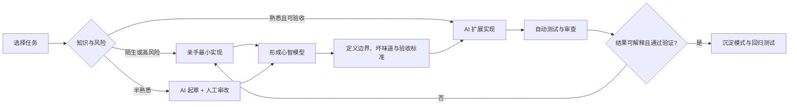
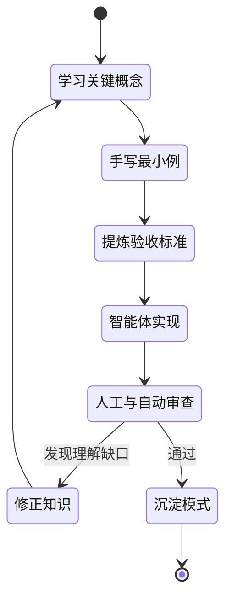

# 总结稿

[打开单页 HTML 总结](assets/bilibili-BV1Hh8p6LEUF-summary.html)

## 核心结论

视频并不主张拒绝 AI，而是把“手写代码”重新定位为一种**建立判断力的训练**：在陌生语言、关键依赖、高层架构和高风险模块中，人先通过亲手实现形成心智模型，再让智能体扩展、改进和做对抗性审查。优势不在敲键盘本身，而在于你是否有能力发现生成代码的坏味道、约束智能体并判断结果是否正确。[04:17–06:17]

## 为什么仍要保留手写环节

- **补齐知识盲区**：作者的媒体引擎虽然能运行，却因缺乏 FFmpeg 知识而难以判断方案是否正确；他通过手写简单管线建立概念理解。[04:17–05:29]
- **学习语言以提升审查能力**：读书、亲自实现，再用 LLM 补充解释，使作者更容易识别 Rust 代码中的“布尔值蔓延”等建模问题。[06:21–08:25]
- **理解依赖的隐含约束**：在实时音频回调中，阻塞式同步会危及及时交付；已有手写经验让作者能识别智能体引入互斥锁的风险。[08:40–10:05]
- **先由人定义高层边界**：作者先写特征、高层类型、方法与函数签名，再让智能体完成实现，以保留对整体设计阻力的直接反馈。[10:18–11:44]
- **维护代码库心智模型**：对想深入理解的模式先手写，再让智能体改进或复制到其他位置，以降低“项目能跑但作者不懂”的风险。[11:51–13:29]
- **高风险区域采用双重保障**：支付、认证等严重后果区域由人保持深入理解，同时借助智能体或审查工具寻找遗漏。[13:10–13:47]

## 事实核查边界

- **CPAL 实时音频：部分确认。** CPAL 官方文档说明现代平台的回调通常运行在负责及时交付音频数据的专用高优先级线程，并以非阻塞为目标；等待互斥锁确有实时性风险，但不代表每次都会爆音。[CPAL crate documentation](https://docs.rs/cpal/latest/cpal/index.html) [08:54–09:46]
- **Rust `unimplemented!`：确认。** 该宏适合原型或暂未实现的方法，使周边代码先完成类型检查；真正执行到该处会 panic。[Rust 标准库文档](https://doc.rust-lang.org/std/macro.unimplemented.html) [11:18–11:27]
- “手写提升学习”“高层设计更强”“形成正向反馈回路”均是作者经验，不是已验证的普遍因果结论。候选人 A/B/C 也是思想实验角色，不是招聘研究。

## 可执行的分工原则

1. **完全陌生或高后果**：先亲手做最小实现，写下不变量和失败模式。
2. **半熟悉**：让 AI 起草，人逐段审查、改写并补测试。
3. **高度熟悉、模式重复**：可更多委托给 AI，但保留验收标准和回归检查。
4. **架构层**：人先定义边界与接口；智能体实现细节；人再进行对抗性审查。

## 观众讨论与补充

本次只有 7 条热门顶层候选、0 条当前可访问弹幕；热门排序偏向高互动内容，且不含嵌套回复，不能推断总体态度。三条有增量的观众意见分别把手写视为刻意练习、提出按熟悉程度调整 AI 委托的工作流，以及强调系统原理与验证能力。它们可作为实践启发，但不是学习效果证据。

# 辅助理解

## 辅助理解：不要争“手写还是 AI”，要设计学习回路

视频的思想实验以 Rust + FFmpeg 视频编辑器为背景 [01:00–03:25]。真正区分候选人的不是是否使用智能体，而是能否理解媒体引擎的关键概念并判断实现质量。更稳妥的抽象是：**知识越陌生、后果越严重、架构影响越大，人越应靠近实现；模式越熟悉、验收越明确，越适合委托。**

## 一：把手写变成有目标的练习

作者学习 Rust 的方法是读资料、亲自输入与实现，遇到阻塞再向 LLM 请求另一种解释 [06:55–07:20]。手写在这里不是仪式，而是让学习者暴露自己的错误预测：类型如何约束状态、接口怎样表达不变量、失败路径在哪里。

一个实用做法是给每次手写设定“退出条件”：能解释关键类型、写出边界测试、指出一种错误实现，并能审查 AI 的替代方案后，就可以提高委托比例。

## 二：依赖知识决定你能否审查生成代码

在 CPAL 例子中，智能体为线程安全引入互斥锁，但实时音频回调追求及时、非阻塞的数据交付 [08:54–09:46]。官方文档支持这是实时性风险，但不保证每次等待都会产生爆音：[CPAL 文档](https://docs.rs/cpal/latest/cpal/index.html)。

这说明“代码能编译”只验证语法和类型层的一部分条件；依赖的运行时约束、延迟预算和线程模型仍需领域知识。

## 三：先搭骨架，再交给智能体

作者先定义特征、高层类型、方法与函数签名，再用 Rust `unimplemented!` 标记未完成部分 [10:18–11:27]。标准库确认该宏执行时一定 panic，因此它是原型占位符，不应漏进可执行路径：[Rust `unimplemented!`](https://doc.rust-lang.org/std/macro.unimplemented.html)。

这种“人定契约—AI 填实现”的做法，把高层方向和验收标准保留在人手中，同时让重复实现获得加速。

## 四：让学习与委托形成反馈，而非依赖

视频所称正向反馈回路 [10:07–10:16] 可以被改写为可检查的过程：先学会一个关键模式；用它审查智能体；把发现的问题转成测试和规则；下一次再扩大委托。如果没有“发现错误—固化约束”这一步，循环可能只是更快地产生更多不可理解代码。

## 观众讨论与补充

7 条热门顶层候选中，有观众提出“陌生任务逐行推演并重写、半熟任务由 AI 起草后审改、熟悉任务交给 AI”的分层法。这与视频分工逻辑相容，但属于个人工作流；0 条当前可访问弹幕和缺失的嵌套回复不足以说明它代表受众共识。

## 外部事实核验

### 声明 1（08:54）

- 视频陈述：CPAL 的音频回调运行在高优先级音频线程上；在回调里等待互斥锁会带来实时性风险。
- 核验状态：部分确认
- 核验结果：CPAL 官方文档确认现代平台的回调通常运行在负责及时交付音频数据的专用高优先级线程，并说明其目标是非阻塞行为。文档支持“阻塞会危及及时交付”的工程判断，但不保证每次等待锁都会产生爆音。
- 检索日期：2026-08-26
- 来源：
  - [CPAL crate documentation](https://docs.rs/cpal/latest/cpal/index.html)（primary）

### 声明 2（11:18）

- 视频陈述：Rust 的 unimplemented! 宏可以让尚未实现的代码先通过类型检查，但执行到该处会 panic。
- 核验状态：已确认
- 核验结果：Rust 标准库文档明确说明该宏可用于原型阶段或暂未实现的 trait 方法，并且执行时总会 panic。
- 检索日期：2026-08-26
- 来源：
  - [Rust std::unimplemented!](https://doc.rust-lang.org/std/macro.unimplemented.html)（primary）

# Data

## 增强转写稿

[00:00] 手写代码现在被认为是在浪费时间
[00:02] 或者至少这越来越成为我们在网上听到的一种说法
[00:06] 这种说法是由软件开发领域
[00:09] 正在发生的根本性变革所推动的
[00:11] 也就是智能体工程的兴起
[00:14] 现在虽然说手写代码确实需要时间
[00:17] 但我不认为把那段时间称为浪费是公平的
[00:21] 事实上我认为有另一种视角值得考虑
[00:24] 这种视角恰好解释了
[00:26] 为什么许多软件开发人员一开始
[00:28] 就能有效地使用智能体
[00:30] 因此我提出以下主张
[00:32] 手写代码不是在浪费时间
[00:34] 反而实际上可以被视为一种优势
[00:38] 好吧
[00:38] 我知道有些正在观看的人可能会觉得这听起来
[00:41] 有点像自我安慰
[00:42] 尤其是考虑到过去12个月里发生了如此多的变化
[00:47] 因此为了解释其中的原因
[00:49] 我想出了下面这个思想实验
[00:51] 这个实验同时也展示了智能体工程的兴起
[00:54] 实际上是如何促成了这一局面的
[00:58] 首先让我们想象一下
[01:00] 你正在寻找一位软件工程师
[01:01] 来接手一个你用Rust和FFmpeg
[01:04] 构建的视频编辑应用的开发工作
[01:07] 你面前是三位最终候选人
[01:09] 每个人之所以入选
[01:11] 是因为他们最近都用Rust
[01:13] 构建了自己的视频播放器
[01:15] 第一位是候选人A
[01:17] 一位经验丰富的软件开发人员
[01:19] 他完全投入了智能体工程
[01:22] 而且从他最初被称为氛围编程
[01:25] 的时候就开始这样做了
[01:26] 正因为如此 候选人A自2025年初以来
[01:30] 没有手写过一行代码
[01:31] 事实上他们从来没有手写过任何Rust代码
[01:34] 也没有手写过任何与FFmpeg集成的代码
[01:37] 相反 在实现自己的视频播放器时
[01:40] 他们完全使用智能体工程来完成
[01:43] 利用Claude Code和Codex等工具
[01:45] 并采用了循环和对抗性审查等技术
[01:49] 接下来是候选人B
[01:51] 他也是一位经验丰富的软件开发人员
[01:54] 在过去几个月里开始使用智能体工程
[01:57] 然而与候选人A不同的是
[01:59] 他们确实拥有丰富的手写Rust的代码经验
[02:02] 在智能体工程出现之前的三年里
[02:05] 每天都在使用Rust
[02:07] 至于候选人B的视频播放器实现
[02:09] 虽然他们使用Rust和出色的Iced桌面框架
[02:12] 手写构建了其中很大一部分
[02:15] 但他们并没有自己实现真正的视频播放器
[02:18] 而是使用了一个现有的Crate
[02:20] 来为他们提供相关功能
[02:22] 最后是候选人C
[02:24] 正如你也许能看出来
[02:25] 他与另外两位候选人略有不同
[02:28] 候选人C也是一位经验丰富的软件开发人员
[02:31] 和另外两位一样
[02:32] 他在日常工作中也会使用智能体工程
[02:35] 不过让他们与中不同的是
[02:37] 他们仍然喜欢找理由花时间手写代码
[02:40] 尤其是在设计个人学习和发展的时候
[02:43] 这一特点也体现在他们自己的视频播放器中
[02:47] 因为他们决定自己手写实现媒体引擎的大部分内容
[02:50] 并且确实这样做了
[02:52] 所以用Rust配合FFmpegrate只有卡住的时候才让AI来帮忙
[02:57] 那么这三位候选人摆在面前
[02:59] 你会优先向哪一位发出录用通知
[03:02] 虽然我不能代表所有观众
[03:04] 但对我自己来说
[03:06] 有一个明显的赢家C候选人
[03:09] 而且不只是因为他们穿什么
[03:12] 相反 这是因为三人之中
[03:14] 只有他们亲手构建了视频播放器的一个关键组件
[03:17] 媒体引擎
[03:19] 这样做让他们获得了实操经验
[03:21] 意味着他们理解开发视频编辑器时
[03:23] 会遇到的许多关键概念
[03:25] 这让他们比另外两位更有优势
[03:28] 不过说句公道话
[03:29] 这显然是个不对等的牌局
[03:31] 我的意思是
[03:32] C候选人可是货真价实的大神
[03:35] 天哪
[03:41] 那尽管如此
[03:42] 考虑到软件开发的走向
[03:43] 我认为这并不完全是天方夜谈
[03:46] 尤其是考虑到越来越多的开发者
[03:48] 现在写完整应用时一行代码都没亲手写过
[03:52] 因此 如果这种趋势继续下去
[03:54] 亲手写代码的经验
[03:56] 就会变得越来越稀缺
[03:58] 这意味着仅仅是亲手写代码这个行为
[04:00] 就能让一个开发者脱颖而出
[04:03] 不过 要让这一成为真正的优势
[04:05] 我们需要考虑亲手写代码的经验
[04:08] 是否仍然有价值
[04:10] 同样 虽然我不能代表所有人
[04:12] 但对我自己来说
[04:14] 这个问题最近被我遇到的一个难题解答了
[04:17] 大约几个月前
[04:18] 在我自己的视频编辑器项目里
[04:20] 我在媒体引擎方面一直碰到知识盲区
[04:23] 那个引擎完全是用智能体工程构建的
[04:27] 虽然智能体产出的实现能用
[04:29] 但它并不符合我认为的正确标准
[04:32] 而且考虑到市面上媒体文件种类繁多
[04:35] 它不断给我的用户带来问题
[04:37] 因为墨菲定律依然非常灵验
[04:39] 当时我可以继续用智能体来改进它
[04:42] 最终也许能找到一个正确的方案
[04:44] 然而 因为我存在知识盲区
[04:46] 我无法判断那个方案是否真的正确
[04:49] 以及能否支撑我设想中的未来目标
[04:52] 因此 与其继续信任那些
[04:55] 已经让我失望过的智能体
[04:57] 我决定通过学习FFMPEG来填补这个知识盲区
[05:01] 而为了做到这一点
[05:02] 我认为最好的方式就是亲手构建一个简单的
[05:05] 媒体引擎管线
[05:07] 同时利用AI来让这个过程更高效
[05:10] 如果这一切听起来有点耳熟
[05:13] 那就先把这个念头放一放
[05:15] 虽然这种学习方式确实花了不少时间
[05:18] 但绝不是浪费时间
[05:20] 因为它让我对许多与媒体播放相关的概念
[05:23] 有了更深的理解
[05:25] 这不仅让我在重建自己的媒体引擎时更有底气
[05:29] 也让我能更有效地利用智能体工程来完成这件事
[05:33] 说白了 如果之前还不够明显的话
[05:35] 我自己已经通过手写代码这个简单的行为
[05:39] 从候选人A 彻底转变成了候选人C
[05:43] 这并不是说不能通过智能体工程来学习
[05:46] 事实上 我认为有很多不同的方法
[05:49] 可以有效利用这些工具来提升自己的技术理解力
[05:53] 但问题在于 使用这些工具时
[05:56] 很容易绕开最初促使你学习的那种情境
[06:00] 也就是遇到问题时的挣扎
[06:02] 以及在寻找解决方案过程中获得的发现
[06:06] 因此 正因为如此
[06:08] 我一直在有意识地花时间手写代码
[06:10] 不一定是为了所有事情
[06:12] 而是为了那些我认为对自己的个人成长来说
[06:15] 回报最高的领域
[06:17] 同时也借助人工智能来更有效地做到这一点
[06:21] 我仍然喜欢手写代码的第一个原因
[06:23] 可能是这份清单上最明显的一个原因
[06:27] 那就是在学习一门新编程语言的时候
[06:30] 如今关于这在2026年是否还有用
[06:32] 存在一些争论
[06:34] 尤其是现在智能体已经非常擅长
[06:36] 用各种不同的语言生成代码
[06:39] 虽然这是事实 但这并不改变一个事实
[06:41] 对我自己来说 过去学习一门编程语言
[06:44] 所花的任何时间 我都不后悔
[06:46] 因此套用同样的逻辑
[06:48] 我认为即使在人工智能驱动开发
[06:50] 日益增多的2026年
[06:52] 这样做 仍然是值得的
[06:55] 至于在这个时代 我喜欢怎样学习一门新编程语言
[06:59] 我仍然用老办法挑一本关于我想学的语言的书
[07:02] 通读一遍
[07:03] 然后手写 实现其中的代码
[07:06] 然后如果我碰巧卡住了
[07:08] 或者需要参考资料之外的不同解释
[07:10] 我就可以去问一个大语言模型
[07:12] 来帮助彌合那个缺口
[07:15] 这实际上就是我最近为了重新熟悉 Rust 而采取的方法
[07:20] 而这样做 在与智能体协作时带来了几个好处
[07:24] 最大的好处是 在审查人工智能生成的代码时
[07:28] 它让我有了更好的直觉去发现常见的代码坏味道
[07:32] 例如我在智能体生成的代码中
[07:34] 经常发现的一个常见代码坏味道
[07:36] 就是我喜欢称之为布尔值蔓延的东西
[07:39] 也就是智能体往往会引入新的布尔值
[07:42] 而不是使用一个定义良好的枚举
[07:44] 并添加另一个变体
[07:47] 例如在我自己的代码里
[07:48] 我发现了这个很不错的结构体
[07:50] 用来跟踪我
[07:51] 主落地液上侧边栏的当前活动表情
[07:55] 如你所见
[07:56] 它有多个布尔值
[07:58] 每一个都用来表示侧边栏活动向状态的一个变体
[08:02] 任何过去手写过软件的人都会看出
[08:05] 这是糟糕的代码
[08:07] 而一个更好的做法
[08:08] 尤其是在Rust中
[08:10] 是使用枚举来对每一个变体进行排他性建模
[08:14] 虽然这是一个相当简单但真实的例子
[08:16] 但就我自己的经验而言
[08:18] 智能体在使用你所选择的语言时会犯很多错误
[08:21] 而这些错误只要学习这门
[08:23] 语言本身就很容易被捕捉到
[08:26] 当然我们身处2026年
[08:28] 很有可能大多数开发者会在决定学习这门语言之前
[08:31] 就开始构建项目
[08:33] 那么在还没有足够知识去发现这些问题之前
[08:36] 又该如何防止这类问题
[08:38] 在自己的代码库中不断累积呢
[08:40] 好的 除了编程语言之外
[08:42] 我发现的另一个手写代码能带来优势的学习领域
[08:46] 就是在学习依赖项的时候
[08:48] 虽然大多数依赖项都相当不言自明
[08:51] 但有一些会带有相当明显的怪癖
[08:54] 一个例子就是CPAL
[08:55] 我用它在Windows、MacOS和Linux上播放音频
[08:59] 它的工作方式是
[09:00] 当你为硬件设备创建一个上下文时
[09:03] 你会得到一个线程
[09:04] 可以像其中写入音频采样
[09:07] 这些采样会由设备上的扬声器播放出来
[09:09] 呃 这个线程叫做实时音频线程
[09:13] 顾名思义
[09:14] 意味着它需要尽可能快的运行
[09:16] 以防止音频播放出现任何问题
[09:18] 比如爆音 跳音和其他不想要的杂音
[09:21] 而仍然对这些都极其敏感
[09:23] 不幸的是当我尝试用智能体来实现这个功能时
[09:27] 它决定使用互斥锁来保证线程安全
[09:30] 这在实时音频领域是大忌
[09:32] 因为它可能导致线程阻塞
[09:35] 从而造成采样丢失
[09:37] 幸运的是
[09:37] 因为我之前在一个演示项目里亲手实现过一遍
[09:40] 所以我能在代码审查中理解这个限制
[09:43] 因此我知道线程同步的正确做法是什么
[09:46] 那就是使用实时 环形 缓冲区
[09:49] 除了CPAL
[09:50] 我决定亲手学习的应用中的其他依赖
[09:52] 还包括FFmpeg和GPUI
[09:54] 呃 这两个的文档都相当糟糕
[09:57] 幸运的是
[09:58] 这恰恰是使用智能体派上用场的地方
[10:00] 因为它让我能通过提问来弥补文档的不足
[10:03] 减少了我理解每个依赖
[10:05] 如何工作所需的时间
[10:07] 这就意味着通过学习这些依赖
[10:09] 尤其是FFmpeg
[10:10] 它在未来与智能体协作时
[10:12] 形成了一个正向的反馈回路
[10:15] 尤其是在接下来这一点上
[10:18] 当我发现AI编程工具的一个主要特点是
[10:21] 他们往往喜欢走最短的路径
[10:23] 来产出能运行的代码
[10:26] 虽然这有时很有用
[10:27] 但如果不加约束
[10:29] 它很容易把你的代码库变成一团乱麻
[10:32] 使得添加新功能
[10:33] 比在一个架构良好的系统中要困难得多
[10:36] 这并不是说你不能用智能体
[10:38] 来创建好的架构
[10:40] 不过我发现亲手完成初始的或高层的设计
[10:43] 能让我感受空气
[10:45] 这是对电影《星际穿越》的引用
[10:47] 具体是库珀驾驶飞船降落在米勒星球时
[10:50] 它拒绝了计算机辅助
[10:52] 说它想感受物理反馈
[10:53] 以便更好的操控飞船
[10:55] 现在我需要感受空气
[10:57] 通过亲手完成高层架构
[10:59] 它能让我在让机器接手之前
[11:01] 感受到整体设计中的任何阻力
[11:04] 而一旦机器接手
[11:05] 我就会失去那种直接的反馈
[11:08] 事实上这就是我最近重建
[11:09] 视频编辑器应用媒体引擎时所做的事
[11:12] 先定义特征和高层类型
[11:14] 然后再转向方法和函数签名
[11:18] 接着通过使用Rust中的unimplemented! 宏
[11:21] 我无需实现就能编译代码
[11:23] 这意味着我既能感受空气
[11:26] 又能把它当作标记
[11:27] 让智能体知道该实现什么
[11:30] 总的来说这让我得到了一个
[11:32] 比之前智能体驱动设计更强大的
[11:35] 媒体引擎
[11:36] 并且无论我在哪个平台上运行
[11:38] 结果都能保持一致
[11:39] 还让后续添加图像效果和转场
[11:42] 等未来功能变得容易得多
[11:45] 它还给我带来了另一个好处
[11:47] 一个我在只用智能体时
[11:49] 仍然很难得到的东西
[11:51] 代码库理解
[11:53] 如果有人问我
[11:54] 未来开发者将面临的最大问题是什么
[11:56] 我的回答会是代码库理解
[11:58] 过去我一直觉得这件事相当有价值
[12:01] 因为在代码库里投入足够多的时间后
[12:04] 我最终会建立起相当不错的心智模型
[12:07] 好 到每当有缺陷或问题被提出时
[12:10] 我能直觉地知道
[12:12] 它最可能源自代码库的哪个位置
[12:16] 然而现在
[12:17] 对于我用智能体构建的任何项目
[12:19] 那种理解就远远不是一回事了
[12:22] 哪怕我完全从零开始构建项目
[12:25] 或者养成了审查每一次改动的习惯
[12:28] 当然我不是唯一一个这样的人
[12:29] 事实上软件行业正处在一个相当危险的境地
[12:33] 我们有完整的项目被构建出来
[12:35] 但其中的代码连作者自己都无法完全理解
[12:39] 虽然有些人会说
[12:40] 这没什么
[12:41] 但我个人觉得相当不安
[12:43] 尤其是当我要把这些代码交付给其他用户
[12:46] 让他们在自己的设备上运行时
[12:48] 所以为了纠正这一点
[12:49] 我一直在养成一种习惯
[12:51] 手动实现任何我想要更好理解的代码
[12:53] 然后再交给智能体去改进它
[12:56] 或者在其他地方继续实现同样的模式
[12:59] 虽然这种方法肯定比一次性生成慢
[13:03] 但我发现它能让我先建立起代码的心智模型
[13:07] 进而让我拥有更深入的理解
[13:09] 话说回来
[13:10] 公平的讲
[13:10] 手写代码并不是提高自身理解的唯一方式
[13:14] 我也发现就某个实现
[13:15] 向智能体提问同样相当有价值
[13:18] 尽管它时不时会产生幻觉
[13:20] 然而正是由于这种产生幻觉的风险
[13:22] 我的代码里仍有一些部分
[13:24] 我只会手写以便彻底理解并确保正确性
[13:29] 这些包括处理支付用户认证之类的地方
[13:32] 以及代码中一旦引入bug
[13:34] 就可能造成严重后果的其他区域
[13:38] 不过讽刺的是
[13:39] 这类地方我反而很喜欢借助智能体
[13:41] 进行对抗性审查
[13:43] 或者用CodeRabbit这类工具
[13:44] 来防止这些bug流入生产环境
[13:48] 好了这份清单的最后一点
[13:49] 绝非最不重要
[13:50] 事实上对我自己来说
[13:52] 可能才是最重要的
[13:55] 虽然我知道业内并不是所有人都这么想
[13:57] 但就我个人而言
[13:59] 开发软件真正让我喜欢的一点
[14:01] 就是亲手写代码本身带来的乐趣
[14:04] 这并不是说
[14:04] 我不喜欢构建软件中更偏产品开发的那一面
[14:08] 但问题是我发现用智能体来做这些
[14:12] 远不如我过去手写代码构建产品时
[14:14] 那样能带来精神上的兴奋感
[14:17] 所以与其哀叹所谓手写代码的消亡
[14:20] 我反而决定重新拥抱它
[14:22] 尽管很多人认为手写代码这件事
[14:25] 如今已是浪费时间
[14:28] 但我不觉得
[14:29] 把时间花在你喜欢的事情上
[14:31] 真的算是浪费

## 原始转写稿

[00:00] 手写代码现在被认为是在浪费时间
[00:02] 或者至少这越来越成为我们在网上听到的一种说法
[00:06] 这种说法是由软件开发领域
[00:09] 正在发生的根本性变革所推动的
[00:11] 也就是智能体工程的新奇
[00:14] 现在虽然说手写代码确实需要时间
[00:17] 但我不认为把那段时间称为浪费是公平的
[00:21] 事实上我认为有另一种视角值得考虑
[00:24] 这种视角恰好解释了
[00:26] 为什么许多软件开发人员一开始
[00:28] 就能有效地使用智能体
[00:30] 因此我提出以下主张
[00:32] 手写代码不是在浪费时间
[00:34] 反而实际上可以被视为一种优势
[00:38] 好吧
[00:38] 我知道有些正在观看的人可能会觉得这听起来
[00:41] 有点像自我安慰
[00:42] 尤其是考虑到过去12个月里发生了如此多的变化
[00:47] 因此为了解释其中的原因
[00:49] 我想出了下面这个思想实验
[00:51] 这个实验同时也展示了智能体工程的新奇
[00:54] 实际上是如何促成了这一局面的
[00:58] 首先让我们想象一下
[01:00] 你正在寻找一位软件工程师
[01:01] 来接手一个你用Rust和FF MPEG
[01:04] 构建的视频编辑应用的开发工作
[01:07] 你面前是三位最终候选人
[01:09] 每个人之所以入选
[01:11] 是因为他们最近都用Rust
[01:13] 构建了自己的视频播放器
[01:15] 第一位是候选人A
[01:17] 一位经验丰富的软件开发人员
[01:19] 他完全投入了智能体工程
[01:22] 而且从他最初被称为分为编程
[01:25] 的时候就开始这样做了
[01:26] 正因为如此 候选人A自2025年初以来
[01:30] 没有首写过一行代码
[01:31] 事实上他们从来没有首写过任何Rust代码
[01:34] 也没有首写过任何与FF MPEG集成的代码
[01:37] 相反 在实现自己的视频播放器时
[01:40] 他们完全使用智能体工程来完成
[01:43] 利用Claude Code和Codex等工具
[01:45] 并采用了循环和对抗性审查等技术
[01:49] 接下来是候选人B
[01:51] 他也是一位经验丰富的软件开发人员
[01:54] 在过去几个月里开始使用智能体工程
[01:57] 然而与候选人A不同的是
[01:59] 他们确实拥有丰富的首写Rust的代码经验
[02:02] 在智能体工程出现之前的三年里
[02:05] 每天都在使用Rust
[02:07] 至于候选人B的视频播放器实现
[02:09] 虽然他们使用Rust和出色的Iced桌面框架
[02:12] 首写构建了其中很大一部分
[02:15] 但他们并没有自己实现真正的视频播放器
[02:18] 而是使用了一个现有的Crate
[02:20] 来为他们提供相关功能
[02:22] 最后是候选人C
[02:24] 正如你也许能看出来
[02:25] 他与另外两位候选人略有不同
[02:28] 候选人C也是一位经验丰富的软件开发人员
[02:31] 和另外两位一样
[02:32] 他在日常工作中也会使用智能体工程
[02:35] 不过让他们与中不同的是
[02:37] 他们仍然喜欢找理由花时间首写代码
[02:40] 尤其是在设计个人学习和发展的时候
[02:43] 这一特点也体现在他们自己的视频播放器中
[02:47] 因为他们决定自己首写实现媒体引擎的大部分内容
[02:50] 并且确实这样做了
[02:52] 所以用Rust配合FFM-PECrate只有卡住的时候才让AI来帮忙
[02:57] 那么这三位候选人摆在面前
[02:59] 你会优先向哪一位发出录用通知
[03:02] 虽然我不能代表所有观众
[03:04] 但对我自己来说
[03:06] 有一个明显的赢家C候选人
[03:09] 而且不只是因为他们穿什么
[03:12] 相反 这是因为三人之中
[03:14] 只有他们亲手构建了视频播放器的一个关键组件
[03:17] 媒体引擎
[03:19] 这样做让他们获得了实操经验
[03:21] 意味着他们理解开发视频编辑气势
[03:23] 会遇到的许多关键概念
[03:25] 这让他们比另外两位更有优势
[03:28] 不过说句公道话
[03:29] 这显然是个不对等的牌具
[03:31] 我的意思是
[03:32] C候选人可是获真价实的大神
[03:35] 天哪
[03:41] 那尽管如此
[03:42] 考虑到软件开发的走向
[03:43] 我认为这并不完全是天方夜谈
[03:46] 尤其是考虑到越来越多的开发者
[03:48] 现在写完整应用时一行代码都没亲手写过
[03:52] 因此 如果这种趋势继续下去
[03:54] 亲手写代码的经验
[03:56] 就会变得越来越稀缺
[03:58] 这意味着仅仅是亲手写代码这个行为
[04:00] 就能让一个开发者拖影而出
[04:03] 不过 要让这一成为真正的优势
[04:05] 我们需要考虑亲手写代码的经验
[04:08] 是否仍然有价值
[04:10] 同样 虽然我不能代表所有人
[04:12] 但对我自己来说
[04:14] 这个问题最近被我遇到的一个难题解答了
[04:17] 大约几个月前
[04:18] 在我自己的视频编辑器项目里
[04:20] 我在媒体引擎方面一直碰到知识盲区
[04:23] 那个引擎完全是用智能体工程构建的
[04:27] 虽然智能体产出的实现能用
[04:29] 但它并不符合我认为的正确标准
[04:32] 而且考虑到市面上媒体文件种类繁多
[04:35] 它不断给我的用户带来问题
[04:37] 因为莫菲定律依然非常灵厌
[04:39] 当时我可以继续用智能体来改进它
[04:42] 最终也许能找到一个正确的方案
[04:44] 然而 因为我存在知识盲区
[04:46] 我无法判断那个方案是否真的正确
[04:49] 以及能否支撑我设想中的未来目标
[04:52] 因此 与其继续信任那些
[04:55] 已经让我失望过的智能体
[04:57] 我决定通过学习FFMPEG来填补这个知识盲区
[05:01] 而为了做到这一点
[05:02] 我认为最好的方式就是亲手构建一个简单的
[05:05] 媒体引擎管线
[05:07] 同时利用AI来让这个过程更高效
[05:10] 如果这一切听起来有点耳熟
[05:13] 那就先把这个念头放一放
[05:15] 虽然这种学习方式确实花了不少时间
[05:18] 但绝不是浪费时间
[05:20] 因为它让我对许多与媒体播放相关的概念
[05:23] 有了更深的理解
[05:25] 这不仅让我在重建自己的媒体引擎时更有底气
[05:29] 也让我能更有效地利用智能体工程来完成这件事
[05:33] 说白了 如果之前还不够明显的话
[05:35] 我自己已经通过手写代码这个简单的行为
[05:39] 从后选人A 彻底转变成了后选人C
[05:43] 这并不是说不能通过智能体工程来学习
[05:46] 事实上 我认为有很多不同的方法
[05:49] 可以有效利用这些工具来提升自己的技术理解力
[05:53] 但问题在于 使用这些工具时
[05:56] 很容易绕开最初促使你学习的那种情境
[06:00] 也就是遇到问题时的挣扎
[06:02] 以及在寻找解决方案过程中获得的发现
[06:06] 因此 正因为如此
[06:08] 我一直在有意识地花时间手写代码
[06:10] 不一定是为了所有事情
[06:12] 而是为了那些我认为对自己的个人成长来说
[06:15] 回报最高的原因
[06:17] 同时也借助人工智能来更有效地做到这一点
[06:21] 我仍然喜欢手写代码的第一个原因
[06:23] 可能是这份清单上最明显的一个原因
[06:27] 那就是在学习一门新编程语言的时候
[06:30] 如今关于这在2026年是否还有用
[06:32] 存在一些争论
[06:34] 尤其是现在智能体已经非常擅长
[06:36] 用各种不同的语言生成代码
[06:39] 虽然这是事实 但这并不改变一个事实
[06:41] 对我自己来说 过去学习一门编程语言
[06:44] 所花的任何时间 我都不后悔
[06:46] 因此套用同样的逻辑
[06:48] 我认为即使在人工智能驱动开发
[06:50] 日益增多的2026年
[06:52] 这样做 仍然是值得的
[06:55] 至于在这个时代 我喜欢怎样学习一门新编程语言
[06:59] 我仍然用老办法挑一本关于我想学的语言的书
[07:02] 通读一遍
[07:03] 然后手写 实现其中的代码
[07:06] 然后如果我碰巧卡住了
[07:08] 或者需要参考资料之外的不同解释
[07:10] 我就可以去问一个大语言模型
[07:12] 来帮助彌合那个缺口
[07:15] 这实际上就是我最近为了重新熟悉 Rust 而采取的方法
[07:20] 而这样做 在与智能体协作时带来了几个好处
[07:24] 最大的好处是 在审查人工智能生成的代码时
[07:28] 它让我有了更好的直觉去发现常见的代码坏味道
[07:32] 例如我在智能体生成的代码中
[07:34] 经常发现的一个常见代码坏味道
[07:36] 就是我喜欢称之为不耳直蔓延的东西
[07:39] 也就是智能体往往会引入新的不耳直
[07:42] 而不是使用一个定义良好的美举
[07:44] 并添加另一个便体
[07:47] 例如在我自己的代码里
[07:48] 我发现了这个很不错的结构题
[07:50] 用来跟踪我
[07:51] 主落地液上侧边篮的当前活动表情
[07:55] 如你所见
[07:56] 它有多个不耳直
[07:58] 每一个都用来表示侧边篮活动向状态的一个便体
[08:02] 任何过去熟写过软件的人都会看出
[08:05] 这是糟糕的代码
[08:07] 而一个更好的做法
[08:08] 尤其是在Rust中
[08:10] 是使用美举来对每一个便体进行排他性建模
[08:14] 虽然这是一个相当简单但真实的例子
[08:16] 但就我自己的经验而言
[08:18] 智能体在使用你所选择的语言时会犯很多错误
[08:21] 而这些错误只要学习这门
[08:23] 语言本身就很容易被捕捉到
[08:26] 当然我们身处2026年
[08:28] 很有可能大多数开发者会在决定学习这门语言之前
[08:31] 就开始构建项目
[08:33] 那么在还没有足够知识去发现这些问题之前
[08:36] 又该如何防止这类问题
[08:38] 在自己的代码库中不断累积呢
[08:40] 好的 除了编程语言之外
[08:42] 我发现的另一个手写代码能带来优势的学习领域
[08:46] 就是在学习依赖项的时候
[08:48] 虽然大多数依赖项都相当不严自明
[08:51] 但有一些会带有相当明显的怪癖
[08:54] 一个例子就是CPL
[08:55] 我用它在Windows、MacOS和Linux上播放音频
[08:59] 它的工作方式是
[09:00] 当你为硬件设备创建一个上下文史
[09:03] 你会得到一个线程
[09:04] 可以像其中写入音频采样
[09:07] 这些采样会由设备上的扬声器播放出来
[09:09] 呃 这个线程叫做实实音频线程
[09:13] 顾名思义
[09:14] 意味着它需要尽可能快的运行
[09:16] 以防止音频播放出现任何问题
[09:18] 比如报音 跳音和其他不想要的杂音
[09:21] 而仍然对这些都极其敏感
[09:23] 不幸的是当我尝试用智能体来实现这个功能时
[09:27] 它决定使用护制锁来保证线程安全
[09:30] 这在实实音频领域是大忌
[09:32] 因为它可能导致线程组色
[09:35] 从而造成采样丢失
[09:37] 幸运的是
[09:37] 因为我之前在一个演示项目里亲手实现过一遍
[09:40] 所以我能在代码审查中理解这个限制
[09:43] 因此我知道线程同步的正确做法是什么
[09:46] 那就是使用实实 环形 缓冲区
[09:49] 除了CPL
[09:50] 我决定亲手学习的应用中的其他依赖
[09:52] 还包括FMPAC和GPUI
[09:54] 呃 这两个的文档都相当糟糕
[09:57] 幸运的是
[09:58] 这恰恰是使用智能体拍上用场的地方
[10:00] 因为它让我能通过提问来弥补文档的不足
[10:03] 减少了我理解每个依赖
[10:05] 如何工作所需的时间
[10:07] 这就意味着通过学习这些依赖
[10:09] 尤其是FMPAC
[10:10] 它在未来与智能体协作时
[10:12] 形成了一个正向的反馈回录
[10:15] 尤其是在接下来这一点上
[10:18] 当我发现AI编程工具的一个主要特点是
[10:21] 他们往往喜欢走最短的路径
[10:23] 来铲出能运行的代码
[10:26] 虽然这有时很有用
[10:27] 但如果不加约束
[10:29] 它很容易把你的代码库变成一团乱麻
[10:32] 使得添加新功能
[10:33] 比在一个架构良好的系统中要困难得多
[10:36] 这并不是说你不能用智能体
[10:38] 来创建好的架构
[10:40] 不过我发现亲手完成初始的或高层的设计
[10:43] 能让我感受空气
[10:45] 这是对电影《星际穿越》的引用
[10:47] 具体是酷破驾驶飞船降落在米勒星球时
[10:50] 它拒绝了计算机辅助
[10:52] 说它想感受物理反馈
[10:53] 以便更好的操控飞船
[10:55] 现在我需要感受空气
[10:57] 通过亲手完成高层架构
[10:59] 它能让我在让机器接手之前
[11:01] 感受到整体设计中的任何阻力
[11:04] 而一旦机器接手
[11:05] 我就会失去那种直接的反馈
[11:08] 事实上这就是我最近重建
[11:09] 视频编辑器应用媒体引擎时所做的事
[11:12] 先定义特征和高层类型
[11:14] 然后再转向方法和函数签名
[11:18] 接着通过使用Rust中的Unimpliment的红
[11:21] 我无需实现就能编一代码
[11:23] 这意味着我既能感受空气
[11:26] 又能把它当作标记
[11:27] 让智能体知道该实现什么
[11:30] 总的来说这让我得到了一个
[11:32] 比之前智能体驱动设计更强大的
[11:35] 媒体引擎
[11:36] 并且无论我在哪个平台上运行
[11:38] 结果都能保持一致
[11:39] 还让后续添加图像效果和转场
[11:42] 等未来功能变得容易得多
[11:45] 它还给我带来了另一个好处
[11:47] 一个我在只用智能体时
[11:49] 仍然很难得到的东西
[11:51] 代码库理解
[11:53] 如果有人问我
[11:54] 未来开发者将面临的最大问题是什么
[11:56] 我的回答会是代码库理解
[11:58] 过去我一直觉得这件事相当有价值
[12:01] 因为在代码库里投入足够多的时间后
[12:04] 我最终会建立起相当不错的新制模型
[12:07] 好 到每当有缺陷或问题被提出时
[12:10] 我能直觉地知道
[12:12] 它最可能源自代码库的哪个位置
[12:16] 然而现在
[12:17] 对于我用智能体构建的任何项目
[12:19] 那种理解就远远不是一回事了
[12:22] 哪怕我完全从零开始构建项目
[12:25] 或者养成了审查每一次改动的习惯
[12:28] 当然我不是唯一一个这样的人
[12:29] 事实上软件行业正处在一个相当危险的境地
[12:33] 我们有完整的项目被构建出来
[12:35] 但其中的代码连作者自己都无法完全理解
[12:39] 虽然有些人会说
[12:40] 这没什么
[12:41] 但我个人觉得相当不安
[12:43] 尤其是当我要把这些代码交付给其他用户
[12:46] 让他们在自己的设备上运行时
[12:48] 所以为了纠正这一点
[12:49] 我一直在养成一种习惯
[12:51] 手动实现任何我想要更好理解的代码
[12:53] 然后再交给智能体去改进它
[12:56] 或者在其他地方继续实现同样的模式
[12:59] 虽然这种方法肯定比一次性生成慢
[13:03] 但我发现它能让我先建立起代码的心智模型
[13:07] 进而让我拥有更深入的理解
[13:09] 话说回来
[13:10] 公平的讲
[13:10] 手写代码并不是提高自身理解的唯一方式
[13:14] 我也发现就某个实现
[13:15] 向智能体提问同样相当有价值
[13:18] 尽管它时不时会产生幻觉
[13:20] 然而正是由于这种产生幻觉的风险
[13:22] 我的代码里仍有一些部分
[13:24] 我只会手写以便彻底理解并确保正确性
[13:29] 这些包括处理支付用户认证之类的地方
[13:32] 以及代码中一旦引入bug
[13:34] 就可能造成严重后果的其他区域
[13:38] 不过讽刺的是
[13:39] 这类地方我反而很喜欢借助智能体
[13:41] 进行对抗性审查
[13:43] 或者用code rabbit这类工具
[13:44] 来防止这些bug流入生产环境
[13:48] 好了这份清单的最后一点
[13:49] 绝非最不重要
[13:50] 事实上对我自己来说
[13:52] 可能才是最重要的
[13:55] 虽然我知道夜内并不是所有人都这么想
[13:57] 但就我个人而言
[13:59] 开发软件真正让我喜欢的一点
[14:01] 就是亲手写代码本身带来的乐趣
[14:04] 这并不是说
[14:04] 我不喜欢构建软件中更偏产品开发的那一面
[14:08] 但问题是我发现用智能体来做这些
[14:12] 远不如我过去手写代码构建产品时
[14:14] 那样能带来精神上的兴奋感
[14:17] 所以与其哀叹所谓手写代码的消亡
[14:20] 我反而决定重新拥抱它
[14:22] 尽管很多人认为手写代码这件事
[14:25] 如今已是浪费时间
[14:28] 但我不觉得
[14:29] 把时间花在你喜欢的事情上
[14:31] 真的算是浪费

## 原始关键帧

### 关键帧 1

### 关键帧 2

### 关键帧 3

### 关键帧 4

### 关键帧 5

### 关键帧 6

### 关键帧 7

### 关键帧 8

### 关键帧 9

### 关键帧 10

## 补充原始数据

- [bilibili-BV1Hh8p6LEUF-comments.jsonl](assets/bilibili-BV1Hh8p6LEUF-comments.jsonl)
- [bilibili-BV1Hh8p6LEUF-comment-candidates.json](assets/bilibili-BV1Hh8p6LEUF-comment-candidates.json)
- [bilibili-BV1Hh8p6LEUF-danmaku.jsonl](assets/bilibili-BV1Hh8p6LEUF-danmaku.jsonl)
- [bilibili-BV1Hh8p6LEUF-danmaku-analysis.json](assets/bilibili-BV1Hh8p6LEUF-danmaku-analysis.json)
- [bilibili-BV1Hh8p6LEUF-summary.html](assets/bilibili-BV1Hh8p6LEUF-summary.html)
