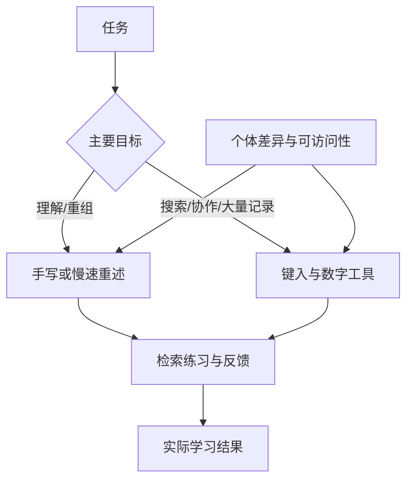

# 总结稿

[打开单页 HTML 总结](assets/bilibili-BV19XgZ6EEGy-summary.html)

> [!warning] 转录范围限制
> [22:10–28:25] ASR 大面积退化为重复句，本文不从该区间提炼观点或练习。总结只依赖 [00:00–22:09] 可理解内容，并以外部研究校正强断言。

## 核心结论

视频用“书写包含精细运动、视觉—空间和反馈环路”解释手写可能带来更深加工，并把它扩展到课堂笔记、儿童学习、老年精细运动、签名、空间记忆与情绪书写。**方向上可以把手写视为一种有用的主动加工方式，但视频把有限任务研究扩展成普遍记忆优势，并给出多个无支持的精确比例与医疗化建议。**更可靠的策略是按任务选工具：需要理解与图形组织时可手写；需要速度、检索、协作与无障碍时可键入；效果取决于是否主动加工，而非媒介标签本身。

## 论证结构与边界

- **运动—视觉闭环模型**：[01:16–05:08] 视频将手写描述为连续计划、监控、纠错的闭环，把熟练打字描述为较简化的按键动作。这是教学模型；“手占运动皮层 30%”“手写完全动员、打字仅 5–10%”“复杂度 10:1”均未获支持。
- **EEG 连接模式**：[00:43–01:07]、[05:09–06:15] 256 通道 EEG 研究确有 36 名大学生，在屏幕提示下手写或单指键入词语；手写出现更广泛的 theta/alpha 连接模式。但研究**没有测随后记忆成绩**，不能把连接差异写成“直接证明记忆形成更强”。[Frontiers/PMC 原研究](https://pmc.ncbi.nlm.nih.gov/articles/PMC10853352/)
- **课堂笔记**：[06:16–08:33] 视频引用 Mueller 与 Oppenheimer，原研究确实观察到手写者概念题表现较好、键入者记录更多且更逐字；但 [2014 原研究](https://journals.sagepub.com/doi/10.1177/0956797614524581) 的条件性结果在 [2021 直接复现与小型元分析](https://journals.sagepub.com/doi/10.1177/0956797620965541) 中未得到显著复现，不能概括为普遍定律。
- **年龄与练习**：[08:34–10:22] 视频建议老年人每天手写五分钟，并声称可迁移到扣纽扣、开瓶等能力；该剂量、迁移和神经保护效果未获随机干预证据支持，不能当医疗/康复处方。[关于人类老化与书写表现的原始机器学习研究](https://pmc.ncbi.nlm.nih.gov/articles/PMC9120912/)只能说明书写特征可用于分析年龄相关表现，不是手写提升记忆或固定练习剂量的证据。
- **学龄前儿童**：[10:23–12:12] 一项约 5 岁、尚未识字儿童的 fMRI 研究支持：短期自由书写经验后，被动看字母时更招募阅读网络；它不直接证明长期阅读成绩，也不能泛化到所有儿童或完整教学。[James & Engelhardt](https://pmc.ncbi.nlm.nih.gov/articles/PMC4274624/)
- **签名、草书、空间与情绪**：[12:13–21:41] 视频提出多个延伸机制，其中不少是推论或未经本次核查的强因果叙述。可以把空间布局、画图和慢速改写当学习策略假设，但不要把“独特神经通道”“健康收益”视为已证实。

## 条件化实践建议

1. **概念学习**：先听/读一段，再不看原文用手写或键入重述；主动生成比单纯抄写更关键。
2. **空间关系**：需要图、箭头、公式和位置线索时优先纸笔/手写板；需要搜索、共享和版本管理时转成数字结构。
3. **速度控制**：如果打字导致逐字抄录，主动限速、分栏和课后自测；如果手写太慢导致遗漏，录音或骨架式键入更合适。
4. **儿童/老年人**：把书写作为多种活动之一，不替代正规教学、康复评估或医疗建议；疼痛、震颤或功能下降应咨询专业人员。

## 不支持的精确断言

30%、5–10%、10:1、打字多 30–40%、每天五分钟可改善特定精细动作等数字/处方不能由现有证据普遍支持。不要把 EEG 连接、脑激活或短期任务表现自动翻译成长期记忆、学习成绩或临床效果。

## 观众讨论与补充

本次只有 4 条当前可见热门顶层评论、0 条弹幕；一位观众整理了章节时间表，其余是简短正向回应。该目录可作导航草案，但需对照转录，且认同不是科学证据。样本太小，不能推断总体口碑或科学共识。

# 辅助理解

> [!warning] [22:10–28:25] ASR 为重复占位，以下不使用该区间。

## 把“手写更好”拆成可检验问题

媒介不是唯一变量。笔记是否经过选择、压缩、组织、自测，以及任务类型、熟练度和身体条件，都会改变结果。

## 三类证据不要混在一起

1. **脑活动/连接**：36 名大学生的 EEG 研究比较特定手写与单指键入任务，观察到连接模式差异；没有测记忆成绩。
2. **学习表现**：2014 笔记研究观察到条件性概念题优势，但 2021 直接复现/小型元分析未复现显著优势。
3. **临床或长期迁移**：每天五分钟、改善扣纽扣/开瓶、神经保护等需要专门干预试验；当前不足。

帧 3 很适合作为视频主张的对比摘要：手写侧强调本体感觉、精细运动和视觉—运动整合，键入侧强调重复按键。它是教学示意，不是实验数据。

帧 7 把“记录更多”和“理解更深”画成权衡，但必须与原研究及未复现结果并读，不能当普遍因果图。

帧 2（约 04:37–05:10）在退化区间之前，画面把手写概括为五区域闭环、把键入概括为“PLAN → EXECUTE”的开放环路。这里只按可见教学示意解释两种动作模型；网络连线不是脑连接组数据，也不能自行证明记忆结果。

## 学习策略自检

- 我是在逐字抄，还是用自己的话压缩？
- 笔记之后有没有闭卷回忆、练习题和纠错？
- 当前任务更需要空间图示，还是搜索/共享/快速捕捉？
- 手写或键入是否造成疼痛、疲劳或无障碍障碍？
- 我能否做一个两周交叉实验，用相同材料和延迟测验比较自己的结果？

## AI 辅助推断

从证据边界推导出的稳健做法不是“弃用键盘”，而是把手写作为主动加工工具之一，并用检索练习验证效果。这是综合建议，不是视频原句，也不是医疗建议。

## 外部事实核验

### 声明 1（00:43）

- 视频陈述：一项 256 通道高密度 EEG 研究发现，手写相较打字在顶叶和中央脑区产生更广泛的 theta/alpha 连接模式，并直接证明了更强的记忆形成。
- 核验状态：部分确认
- 核验结果：部分确认。Van der Weel 与 Van der Meer 的研究使用 36 名大学生和 256 通道 EEG；在按屏幕提示手写或单指键入词语时，手写条件出现更广泛的 theta/alpha 连接模式。论文讨论这些模式与学习相关，但实验没有测量随后记忆成绩，也不能把 EEG 连接差异等同于“不同记忆形成”或证明手写必然提升记忆。结论仅适用于该实验任务与样本。
- 检索日期：2026-08-28
- 来源：
  - [Van der Weel & Van der Meer (2024) — Handwriting but not typewriting leads to widespread brain connectivity](https://pmc.ncbi.nlm.nih.gov/articles/PMC10853352/)（primary）

### 声明 2（01:37）

- 视频陈述：手和手指占运动皮层约 30%，手写会完全动员该区域，而打字只使用其 5–10% 容量；两者运动复杂度约为 10:1。
- 核验状态：未验证
- 核验结果：未核实。综述支持“手在初级运动皮层中占不成比例的大区域、精细手部控制需要广泛神经回路”这一方向性描述，有估计称超过 20% 的 M1 与诱发手指运动相关；但没有支持视频给出的 30%、手写 100%、打字 5–10% 或 10:1 这些精确比例。运动皮层表征还高度重叠，不能把 homunculus 面积直接当作任务使用容量。
- 检索日期：2026-08-28
- 来源：
  - [Lemon (2022) — The neural mechanisms of manual dexterity](https://pmc.ncbi.nlm.nih.gov/articles/PMC9169115/)（primary）
  - [NCBI Bookshelf — Functional Organization of the Primary Motor Cortex](https://www.ncbi.nlm.nih.gov/books/NBK11095/)（secondary）

### 声明 3（06:28）

- 视频陈述：Mueller 与 Oppenheimer 证明课堂手写笔记者在概念题上显著优于键盘笔记者，而事实回忆相近，原因是打字更容易逐字记录。
- 核验状态：部分确认
- 核验结果：部分确认。2014 年原始研究报告了视频所述模式，并发现键入笔记更多、更接近逐字转录；但该结果依赖大学生听课、具体测验与复习安排。2021 年直接复现及小型元分析没有发现手写对即时概念学习的显著优势。因而可说原研究观察到条件性优势，不能说已普遍证明手写优于打字，更不能把相关的逐字率机制写成确定因果。
- 检索日期：2026-08-28
- 来源：
  - [Mueller & Oppenheimer (2014) — The Pen Is Mightier Than the Keyboard](https://journals.sagepub.com/doi/10.1177/0956797614524581)（primary）
  - [Urry et al. (2021) — Don’t Ditch the Laptop Just Yet](https://journals.sagepub.com/doi/10.1177/0956797620965541)（primary）

### 声明 4（09:57）

- 视频陈述：每天手写五分钟会强化老年人的精细运动回路；65 岁以上者可把它视为针对扣纽扣、硬币和开瓶等能力的靶向训练。
- 核验状态：未验证
- 核验结果：未核实。研究支持正常衰老与书写速度、压力、精度等变化相关，也有人研究书写指标作为运动/认知状态标记；但当前没有找到能支持“每天五分钟”这一剂量、跨任务迁移到扣纽扣/开瓶或神经保护效果的随机干预证据。不能把观察性关联或一般神经可塑性原则改写成医疗或康复处方。
- 检索日期：2026-08-28
- 来源：
  - [Impedovo et al. (2022) — Handwriting Declines With Human Aging](https://pmc.ncbi.nlm.nih.gov/articles/PMC9120912/)（primary）
  - [Rosenblum et al. — Assessing the handwriting process in healthy elderly persons](https://pubmed.ncbi.nlm.nih.gov/17167308/)（primary）

### 声明 5（10:36）

- 视频陈述：James 与 Engelhardt 发现，学龄前儿童通过手写而非打字学习字母后，观看字母时更强地动员阅读相关脑区。
- 核验状态：已确认
- 核验结果：确认但范围很窄。该 fMRI 研究让尚未识字的约 5 岁儿童自由书写、描摹或键入字母/形状，随后被动观看；只有自由书写经验招募了此前描述的阅读网络。它支持短期训练方式影响字母知觉时的脑激活，但没有直接证明长期阅读能力更好，也不能泛化为所有儿童、所有触屏任务或完整读写教学效果。
- 检索日期：2026-08-28
- 来源：
  - [James & Engelhardt (2012) — The effects of handwriting experience on functional brain development in pre-literate children](https://pmc.ncbi.nlm.nih.gov/articles/PMC4274624/)（primary）

# Data

## 增强转写稿

[00:00] You learned to write letters with careful, deliberate strokes, the pen guided by your eyes, corrected by your hand, stored by a circuit that was building itself with every letter you formed.
[00:11] You train that circuit every day for the first 15 to 20 years of your life, homework, exams, letters, notes, lists, signatures, the margins of books.
[00:21] Every handwritten word strengthened it, then the keyboard arrived, the phone arrived, the pen went into a drawer,
[00:28] and the circuit the fine motor visuospatial integration loop that handwriting uniquely activates when quiet, not dead, quiet, unused for years in a brain that still contains every connection the circuit requires.
[00:43] What that silence cost was measured directly, high density EEG with 256 channels far more than standard clinical EEG revealed that handwriting activated oscillatory patterns across parietal and central brain regions associated with memory.
[00:58] Encoding that typing did not produce, as van der Meer and colleagues documented at the Norwegian University of Science and Technology.
[01:07] Identical content, identical words,different motor execution,different brain activation,different memory formation.
[01:16] The reason starts with territory specifically how much of your brain's motor command center the hand controls.
[01:22] Motor command strip running across the top of your brain is organized by body region,different sections control different body parts.
[01:29] The amount of territory assigned to each part is proportional not to the part's physical size, but to the complexity and precision of its movement.
[01:37] Your hand and fingers occupy approximately 30% of this command strip more than legs, trunk, and face combined.
[01:43] The disproportion reflects how much evolutionary pressure was placed on fine manual control tool making, tool use, object manipulation,gestural communication.
[01:53] Handwriting engages this 30% fully.Each letter requires a unique motor trajectory the pen guided through a specific path of curves, lines, and angles that differs for every character.
[02:04] The command center generates a unique plan for each letter, monitors the execution through visual feedback, and corrects errors in real time.
[02:13] Every word is a sequence of distinct motor programs executed in continuous coordination with visual monitoring.
[02:19] Typing engages a fraction of this territory.
[02:22] Every keystroke is mechanically identical, a finger press of approximately 4mm of travel.
[02:28] The plan for pressing one key is nearly identical to pressing the next same finger action, same force, same displacement.
[02:36] The command center does not need to generate unique trajectories.
[02:40] The 30% that handles the hands full complexity is recruited at perhaps 5-10% of its capacity during typing.
[02:48] The rest is idle.Writing a single word science requires seven distinct motor programs executed in sequence.
[02:56] Each producing a different pen trajectory, each monitored visually, each corrected through continuous feedback.
[03:04] Typing the word requires seven nearly identical finger presses.
[03:08] The complexity difference between writing and typing a word is approximately 10-1.
[03:12] This complexity matters because cortical activation scales with motor demand.
[03:18] More complex movements produce more widespread activation, more synaptic engagement, and critically more downstream effects on attention, spatial processing, and the memory encoding that Van der Meer measured.
[03:29] Now the feedback loop, because handwriting is a motor act under continuous visual surveillance.
[03:35] Handwriting is a closed loop skill.The visual system monitors the ink trail in real time, compares it to the intended shape stored in the planning regions, calculates the error between intended and actual trajectory, and sends correction signals back to the command center to adjust the ongoing movement.
[03:53] This runs continuously, updating multiple times per second for the entire duration of the writing.Loop engages five regions simultaneously,spatial processing centers,motor planning centers,motor execution centers,visual monitoring centers,and the error correction system that times and adjusts the movement.
[04:13] 5 regions in continuous coordination.Typing,for experienced typists,is an open loop skill.The fingers execute keystrokes without visual monitoring of the keys.
[04:24] The typist watches the screen,not the hands.The continuous feedback loop that handwriting demands is not engaged.The motor execution is ballistic planned and executed without real time visual correction of the trajectory.
[04:37] The five region coordination collapses to a simpler circuit.Difference between open loop and closed loop motor execution explains why handwriting feels effortful and typing feels automatic.
[04:49] The effort is the loop five regions coordinating in real time.Every letter demanding a fresh integration of motor planning and visual verification.The automaticity of typing is the absence of that loop.The motor act has been reduced to a sequence of ballistic presses that the command center can execute without continuous visual integration.
[05:09] Oscillation data is where the memory consequence becomes measurable and where the argument moves from,handwriting uses more brain to handwriting encodes memory differently.Van der Meer's data showed the specific oscillation,handwriting produced significantly greater theta power four to eight cycles per second in the parietal and central regions compared to typing.
[05:29] Theta oscillations in these regions reflect the interaction between the memory center and the cortex that transfers information from working memory into long term storage.Higher theta power during encoding predicts better subsequent recall.Handwriting produced more theta,typing produced less.
[05:48] The information was encoded at different strengths depending on which motor output delivered it.Mechanism connects back to the motor complexity without re-explaining it,the widespread cortical activation that handwriting produces generates stronger theta oscillations in the encoding relevant regions.
[06:05] The information is processed more deeply not because the writer tried harder,but because the motor act of writing recruited more of the brain's encoding machinery than the motor act of typing.
[06:16] Well,the practical consequence.Because the encoding difference is not academic,it has been measured in exam performance,in note taking quality,and in the kind of understanding that separates comprehension from transcription.
[06:28] Students who took handwritten notes during lectures performed significantly better on conceptual questions than students who typed,despite the typists recording approximately 30-40% more content verbatim,as Mueller and Oppenheimer demonstrated in a study published in psychological science.
[06:47] The finding was specific.On factual recall questions,the two groups performed similarly.On conceptual questions,questions requiring understanding rather than recall,the handwriters were significantly better.Proposed mechanism is speed,handwriting is slower than typing.
[07:04] The handwriter cannot transcribe verbatim,there is not enough time.The slower speed forces the writer to process,summarize,and rephrase the content in real time to keep up.
[07:15] This real time processing is deeper cognitive engagement the writer actively constructs meaning while writing,rather than passively transcribing words.Typing speed permits verbatim transcription,which bypasses the deep processing that produces understanding.
[07:29] Speed limitation of handwriting is the mechanism,not a weakness.Handwriting is slow enough that the brain must engage deeply with the content to keep up.Typing is fast enough that the brain can disengage from the content and still capture it.
[07:42] The pen forces processing,the keyboard permits passivity,combination of force processing and enhanced theta encoding produces a compounding effect.The content is processed more deeply during writing,and encoded more strongly into memory by the theta oscillations,the motor complexity generates.
[08:02] Two independent mechanisms,both favoring handwriting,both absent during typing,both operating automatically without conscious effort.You now know what the pen activates and what the keyboard does not.
[08:14] The question changes from what the circuit does when it runs to what happens when it stops running,because the circuit has been going quiet across three generations simultaneously.
[08:23] That convergence,the force processing from the speed constraint compounding the enhanced encoding from the motor complexity is why I no longer reach for the keyboard when the goal is to remember rather than to record.
[08:34] If you are over 45,the handwriting connection to fine motor maintenance carries specific relevance because the circuit's handwriting trains are the circuit's aging degrades first.
[08:46] Fine motor precision declines with age finger movements become slower and less accurate,handwriting becomes less legible,small manipulations like buttons,clasps,and coins become more difficult.
[08:57] The decline reflects changes at both ends of the system,reduced motor neuron count and less reliable neuromuscular junctions in the periphery,reduced command strip excitability,and degraded corticospinal integrity in the brain.
[09:11] Daily handwriting provides continuous training of the fine motor circuits that aging weakens.
[09:16] The complex trajectories demand full recruitment of the hands command territory,the visuo motor feedback loop,and the error correction system.
[09:25] The continuous demand maintains synaptic integrity through use dependent plasticity connections that are used remain strong,connections that are unused weaken.The principle applies to every neural circuit.The handwriting circuit is no exception.
[09:40] Viewer who switched entirely to typing 20 years ago,remove the daily training stimulus for the most complex fine motor circuits the brain contains.The circuits are present,they respond to reactivation,but they have been weakening without input for the years since the pen was abandoned.
[09:57] 5 minutes of daily handwriting reactivates them,not because writing is nostalgic,but because the motor cognitive loop it engages has no substitute in the keyboard based world.
[10:06] If you are over 65 and have noticed increased difficulty with fine manipulation buttons,coins,jar lids,writing your signature legibly 5 minutes of daily handwriting functions as targeted exercise for the motor circuits that control those tasks.
[10:23] The handwriting itself may not improve dramatically.The fine motor circuits it trains will.And then what happens to children who never learn to write by hand because the trajectory is now running in both directions.
[10:36] Studies comparing preliterate children who learn letters through handwriting versus typing found that the handwriting group showed stronger letter recognition,better reading ability,and more robust activation of the reading related brain circuits when viewing letters,as James and Engelhardt documented.
[10:53] The motor act of forming a letter by hand producing the shape through a complex trajectory creates a motor memory that is linked to the visual representation.
[11:01] When the child later sees the letter,the motor memory is co-activated,producing a richer multimodal representation than the visual only representation that typing creates.
[11:12] Implication.Children who learn to read and write primarily through keyboards and touchscreens may be building letter and word representations that lack the motor sensory richness of handwritten representations.
[11:24] The representation is visual,only the letter looks identical whether it was typed or handwritten.But the neural representation is different,the handwritten letter is encoded as both a visual pattern and a motor trajectory,while the typed letter is encoded as a visual pattern and a key location.
[11:41] The motor trajectory is a richer code than the key location because it is unique to each letter.The key location is an identical mechanical action for every letter.
[11:50] Parallel runs across the lifespan,children who never develop the skill,miss the motor sensory foundation,adults who abandon it lose the daily training,older adults who no longer write lose the fine motor maintenance,built in childhood,maintained in adulthood,protective in aging,and the keyboard has disrupted all three stages.
[12:13] Your signature is the most rehearsed motor program in your brain,a sequence practice thousands of times across decades until the execution became automatic.The program is stored in the regions that handle overlearned automatic motor sequences.
[12:28] When you sign your name,you are not consciously planning each letter.You are triggering a stored program that runs to completion without conscious supervision.
[12:37] Signature quality degrades earlier than other writing when fine motor circuits decline because the signature is executed at higher speed and with less conscious monitoring.
[12:47] Neurologists use signature deterioration as an early marker for motor and cognitive decline because the signature draws on both the automatic program and the fine motor precision that aging affects.
[12:59] The signature that doesn't look like mine anymore is an early signal from the circuits that a sustained practice maintains.Cursive engages the command territory more deeply than print and the difference reveals what continuous pen contact does to the feedback loop.
[13:14] Print lifts the pen between letters.Each letter is a discrete program followed by a transition.Cursive maintains continuous contact across entire words linking letters through connecting strokes that require the planning system to prepare transitions
[13:28] while executing the current letter.The planning horizon is longer.The coordination demand is higher.The loop runs without interruption across the full word rather than resetting between letters.
[13:40] Relearning cursive as an adult is a genuine neuroplasticity exercise.The programs stored decades ago are recoverable but rusty and the reactivation engages the motor learning circuits that new skill acquisition demands.
[13:52] The awkwardness of the first week is the brain rebuilding synaptic connections that were weakened, not erased.The improvement across days is use dependent plasticity in action.
[14:03] Writing with your non-dominant hand even for a minute at the end of a session recruits the opposite hemisphere's motor territory producing bilateral activation that no other common daily activity demands.
[14:16] The non-dominant hand's writing is slow,awkward,and illegible.The motor programs are underdeveloped because the hand was never trained.The awkwardness is the training stimulus.
[14:27] The motor command center on the untrained side receives novel complex demands for the first time in the viewer's adult life.
[14:34] Even 30 seconds of non-dominant writing after four and a half minutes of dominant writing produces a bilateral training effect that no other five minute activity delivers.
[14:43] Without cursive experience,print provides the core benefit.Each letter still requires a unique trajectory.Cursive adds the continuous contact dimension,but print delivers the fundamental complexity,the visual motor loop,and the theta encoding the evidence supports.
[15:00] Well,spatial memory because handwritten notes encode spatial information that typed notes cannot.When you write on a page,each piece of information occupies a specific physical location,the margin note,the underline phrase,the diagram in the corner,the arrow connecting two ideas.
[15:17] The spatial layout is created by you,determined by your decisions about where each element belongs.The spatial processing centers that participate in the feedback loop also encode the location of each piece
[15:30] of content as part of the memory trace.Recall from handwritten notes often includes spatial memory,it was in the upper left door,I wrote it near the diagram.
[15:40] The spatial encoding provides an additional retrieval cue that typed notes cannot offer because type text occupies a uniform format,identical characters scrolling vertically,every paragraph looking identical,no spatial variation to encode.
[15:54] Handwritten diagrams,mind maps,and margin annotations compound the spatial advantage.The act of drawing connections between ideas with lines and arrows creates motor and spatial representations of conceptual relationships simultaneously.
[16:10] Drawing an arrow from one idea to another on a page captures the semantic content plus a spatial motor representation the brain retrieves through a different pathway than semantic recall alone,and then the emotional channel.
[16:24] Because handwritten communication operates through a dimension that typed communication cannot access,a handwritten letter carries the writer's motor signature,the unique combination of letter forms,spacing,slant,pressure,and rhythm that constitutes individual writing style.
[16:41] The recipient's visual system processes these features as identity markers,recognizing the writer through their motor output the way the ear recognizes a voice.The recognition is pre-conscious,the recipient knows who wrote the letter before reading the first word.
[16:55] Emotional response to a handwritten letter,the feeling that the writer was here,that effort was invested,that time was given has a neurological basis beyond symbolism.
[17:04] The recipient's brain processes the motor signature through circuits that simulate observed actions internally.Reading handwritten text produces low level activation of the motor circuits involved in producing it.
[17:16] The recipient's motor system partially simulates the act of writing the letter they are reading.The simulation creates a sense of the writer's physical presence that typed text cannot produce because typed text carries no motor signature every email looks identical regardless of who typed it.
[17:32] Grandparent who writes a letter to a grandchild is transmitting a motor identity signature that the child's brain will process through circuits a screen cannot activate.
[17:41] The letter kept folded in a drawer for years is kept because it carries the writer's motor presence in a way that no digital message replicates.
[17:49] There is a dimension that the motor and memory data do not capture the relationship between the speed of the hand and the speed of thought.
[17:56] Typing operates at approximately 40 to 80 words per minute.Thought operates faster than either method.Typing is fast enough to keep pace with part of the thought stream,the fingers can almost capture the ideas as they arrive,producing a transcript of the thinking surface without requiring choices about what matters.
[18:14] Writing by hand operates at approximately 13 to 20 words per minute.The gap between thought speed and hand speed is enormous.The hand cannot capture everything.
[18:25] The writer must choose which idea to record,how to compress it,which words to use,what to leave out.The choosing is the processing,the compression is the understanding.
[18:35] The writer is distilling,thought selecting,prioritizing,and reformulating in real time because the speed constraint demands it.
[18:42] Journaling reveals why the speed-thought relationship explains why handwritten journals produce effects that digital journals do not.Expressive writing about stressful or emotional experiences produces measurable psychological and physical health benefits,as Pennebaker established across multiple studies reduced anxiety,improved mood,measurable immune function changes.
[19:04] Handwritten journals compound the benefit through the speed constraint.Writing about a difficult experience at 13 words per minute forces the writer to slow down,choose words carefully,construct sentences that compress complex emotional content into a pace the hand sustains.
[19:22] The slowness is processing.The processing is the therapeutic mechanism.Morning pages free-writing by hand upon waking has persisted in creative and therapeutic practice for decades.The practice works because the motor cognitive loop at morning speed when the prefrontal cortex is still transitioning from sleep produces a unique state of engagement,the hand moving slowly,thoughts being compressed into the pace the pen permits.
[19:48] For meeting notes or lectures and want to retain the content,the evidence favors the pen for conceptual understanding despite capturing fewer words.Fewer words,more understanding.The tradeoff is real.The keyboard is faster and more complete.The pen is slower and more effective for learning.A practical hybrid exists.
[20:08] Write during the meeting,then type the notes afterward for digital searchability.The initial writing encodes through the motor cognitive loop.The typing afterward provides the digital record.The second pass also functions as spaced retrieval reviewing and restructuring the handwritten notes reinforces the memory trace.The hybrid takes more time than the keyboard alone.It produces better understanding than either method alone.
[20:36] Shopping list,written on paper versus the list typed into the phone,reveals the encoding difference at the most mundane level.The handwritten list is remembered more accurately people who write their list by hand recall more items when they accidentally leave the list at home.
[20:51] The motor encoding created a memory trace the phone note did not.The list on the phone is a backup.The list written by hand is both a backup and a memory intervention.The person who writes a grocery list by hand and then photographs it for their phone gets both the encoding from the writing,the searchability from the image,a historical dimension.Because the pen is not ancient technology.The pen is recent technology.For most of human history,writing was the only writing.
[21:20] The typewriter arrived in the 1870s.The personal computer arrived in the 1980s.The smartphone arrived in 2007.The circuit that the pen activates was the default interface between thought and recorded language for every generation before the current one.The circuit was not designed for cognitive enhancement.It was the only option.
[21:41] The theta encoding,the force processing,the spatial memory,the fine motor maintenance.These were not goals.There were side effects of a technology that happened to engage the brain more completely than any technology that followed it.The keyboard is a more efficient transcription device.The pen is a more complete cognitive device.The efficiency displaced the completeness and the displacement happened too quickly for anyone to measure what was lost until the oscillation data.
[22:10] 大部分人都认识过, 年轻人比较少, 年轻人比较少, 年轻人比较少。
[22:17] 年轻人比较少, 年轻人比较少。
[22:20] 年轻人比较少, 年轻人比较少。
[22:23] 年轻人比较少, 年轻人比较少。
[22:26] 年轻人比较少, 年轻人比较少。
[22:30] 年轻人比较少, 年轻人比较少。
[22:33] 年轻人比较少, 年轻人比较少。
[22:37] 年轻人比较少, 年轻人比较少。
[22:40] 年轻人比较少, 年轻人比较少。
[22:43] 年轻人比较少, 年轻人比较少。
[22:46] 年轻人比较少, 年轻人比较少。
[22:49] 年轻人比较少, 年轻人比较少。
[22:52] 年轻人比较少, 年轻人比较少。
[22:55] 年轻人比较少, 年轻人比较少。
[22:58] 年轻人比较少, 年轻人比较少。
[23:01] 年轻人比较少, 年轻人比较少。
[23:04] 年轻人比较少, 年轻人比较少。
[23:07] 年轻人比较少, 年轻人比较少。
[23:10] 年轻人比较少, 年轻人比较少。
[23:13] 年轻人比较少, 年轻人比较少。
[23:16] 年轻人比较少, 年轻人比较少。
[23:19] 年轻人比较少, 年轻人比较少。
[23:22] 年轻人比较少, 年轻人比较少。
[23:25] 年轻人比较少, 年轻人比较少。
[23:28] 年轻人比较少, 年轻人比较少。
[23:31] 年轻人比较少, 年轻人比较少。
[23:34] 年轻人比较少, 年轻人比较少。
[23:37] 年轻人比较少, 年轻人比较少。
[23:40] 年轻人比较少, 年轻人比较少。
[23:43] 年轻人比较少, 年轻人比较少。
[23:46] 年轻人比较少, 年轻人比较少。
[23:49] 年轻人比较少, 年轻人比较少。
[23:52] 年轻人比较少, 年轻人比较少。
[23:55] 年轻人比较少, 年轻人比较少。
[23:58] 年轻人比较少, 年轻人比较少。
[24:01] 年轻人比较少, 年轻人比较少。
[24:04] 年轻人比较少, 年轻人比较少。
[24:07] 年轻人比较少, 年轻人比较少。
[24:09] 年轻人比较少, 年轻人比较少。
[24:12] 年轻人比较少, 年轻人比较少。
[24:15] 年轻人比较少, 年轻人比较少。
[24:18] 年轻人比较少, 年轻人比较少。
[24:21] 年轻人比较少, 年轻人比较少。
[24:24] 年轻人比较少, 年轻人比较少。
[24:27] 年轻人比较少, 年轻人比较少。
[24:30] 年轻人比较少, 年轻人比较少。
[24:33] 年轻人比较少, 年轻人比较少。
[24:36] 年轻人比较少, 年轻人比较少。
[24:39] 年轻人比较少, 年轻人比较少。
[24:42] 年轻人比较少, 年轻人比较少。
[24:45] 年轻人比较少, 年轻人比较少。
[24:48] 年轻人比较少, 年轻人比较少。
[24:51] 年轻人比较少, 年轻人比较少。
[24:54] 年轻人比较少, 年轻人比较少。
[24:57] 年轻人比较少, 年轻人比较少。
[25:00] 年轻人比较少, 年轻人比较少。
[25:03] 年轻人比较少, 年轻人比较少。
[25:06] 年轻人比较少, 年轻人比较少。
[25:09] 年轻人比较少, 年轻人比较少。
[25:12] 年轻人比较少, 年轻人比较少。
[25:15] 年轻人比较少, 年轻人比较少。
[25:18] 年轻人比较少, 年轻人比较少。
[25:21] 年轻人比较少, 年轻人比较少。
[25:24] 年轻人比较少, 年轻人比较少。
[25:27] 年轻人比较少, 年轻人比较少。
[25:30] 年轻人比较少, 年轻人比较少。
[25:33] 年轻人比较少, 年轻人比较少。
[25:36] 年轻人比较少, 年轻人比较少。
[25:39] 年轻人比较少, 年轻人比较少。
[25:42] 年轻人比较少, 年轻人比较少。
[25:45] 年轻人比较少, 年轻人比较少。
[25:48] 年轻人比较少, 年轻人比较少。
[25:51] 年轻人比较少, 年轻人比较少。
[25:54] 年轻人比较少, 年轻人比较少。
[25:57] 年轻人比较少, 年轻人比较少。
[26:00] 年轻人比较少, 年轻人比较少。
[26:03] 年轻人比较少, 年轻人比较少。
[26:06] 年轻人比较少, 年轻人比较少。
[26:09] 年轻人比较少, 年轻人比较少。
[26:12] 年轻人比较少, 年轻人比较少。
[26:15] 年轻人比较少, 年轻人比较少。
[26:18] 年轻人比较少, 年轻人比较少。
[26:21] 年轻人比较少, 年轻人比较少。
[26:24] 年轻人比较少, 年轻人比较少。
[26:27] 年轻人比较少, 年轻人比较少。
[26:30] 年轻人比较少, 年轻人比较少。
[26:33] 年轻人比较少, 年轻人比较少。
[26:36] 年轻人比较少, 年轻人比较少。
[26:38] 年轻人比较少, 年轻人比较少。
[26:40] 年轻人比较少, 年轻人比较少。
[26:43] 年轻人比较少, 年轻人比较少。
[26:46] 年轻人比较少, 年轻人比较少。
[26:49] 年轻人比较少, 年轻人比较少。
[26:52] 年轻人比较少, 年轻人比较少。
[26:55] 年轻人比较少, 年轻人比较少。
[26:58] 年轻人比较少, 年轻人比较少。
[27:01] 年轻人比较少, 年轻人比较少。
[27:04] 年轻人比较少, 年轻人比较少。
[27:07] 年轻人比较少, 年轻人比较少。
[27:10] 年轻人比较少, 年轻人比较少。
[27:13] 年轻人比较少, 年轻人比较少。
[27:16] 年轻人比较少, 年轻人比较少。
[27:19] 年轻人比较少, 年轻人比较少。
[27:22] 年轻人比较少, 年轻人比较少。
[27:25] 年轻人比较少, 年轻人比较少。
[27:28] 年轻人比较少, 年轻人比较少。
[27:31] 年轻人比较少, 年轻人比较少。
[27:34] 年轻人比较少, 年轻人比较少。
[27:37] 年轻人比较少, 年轻人比较少。
[27:40] 年轻人比较少, 年轻人比较少。
[27:43] 年轻人比较少, 年轻人比较少。
[27:46] 年轻人比较少, 年轻人比较少。
[27:49] 年轻人比较少, 年轻人比较少。
[27:52] 年轻人比较少, 年轻人比较少。
[27:55] 年轻人比较少, 年轻人比较少。
[27:58] 年轻人比较少, 年轻人比较少。
[28:01] 年轻人比较少, 年轻人比较少。
[28:04] 年轻人比较少, 年轻人比较少。
[28:07] 年轻人比较少, 年轻人比较少。
[28:10] 年轻人比较少, 年轻人比较少。
[28:13] 年轻人比较少, 年轻人比较少。
[28:16] 年轻人比较少, 年轻人比较少。
[28:19] 年轻人比较少, 年轻人比较少。
[28:22] 年轻人比较少, 年轻人比较少。
[28:25] 年轻人比较少, 年轻人比较少。

## 原始转写稿

[00:00] 你学会写写文字A with careful, deliberate strokes, the pen guided by your eyes, corrected by your hand, stored by a circuit that was building itself with every letter you formed.
[00:11] You train that circuit every day for the first 15 to 20 years of your life, homework, exams, letters, notes, lists, signatures, the margins of books.
[00:21] Every handwritten word strengthened it, then the keyboard arrived, the phone arrived, the pen went into a drawer,
[00:28] and the circuit the fine motor visuospatial integration loop that handwriting uniquely activates when quiet, not dead, quiet, unused for years in a brain that still contains every connection the circuit requires.
[00:43] What that silence cost was measured directly, high density EEG with 256 channels far more than standard clinical EEG revealed that handwriting activated oscillatory patterns across parietal and central brain regions associated with memory.
[00:58] Encoding that typing did not produce, as van der Meer and colleagues documented at the Norwegian University of Science and Technology.
[01:07] Identical content, identical words,different motor execution,different brain activation,different memory formation.
[01:16] The reason starts with territory specifically how much of your brain's motor command center the hand controls.
[01:22] Motor command strip running across the top of your brain is organized by body region,different sections control different body parts.
[01:29] The amount of territory assigned to each part is proportional not to the part's physical size, but to the complexity and precision of its movement.
[01:37] Your hand and fingers occupy approximately 30% of this command strip more than legs, trunk, and face combined.
[01:43] The disproportion reflects how much evolutionary pressure was placed on fine manual control tool making, tool use, object manipulation,gestural communication.
[01:53] Handwriting engages this 30% fully.Each letter requires a unique motor trajectory the pen guided through a specific path of curves, lines, and angles that differs for every character.
[02:04] The command center generates a unique plan for each letter, monitors the execution through visual feedback, and corrects errors in real time.
[02:13] Every word is a sequence of distinct motor programs executed in continuous coordination with visual monitoring.
[02:19] Typing engages a fraction of this territory.
[02:22] Every keystroke is mechanically identical, a finger press of approximately 4mm of travel.
[02:28] The plan for pressing one key is nearly identical to pressing the next same finger action, same force, same displacement.
[02:36] The command center does not need to generate unique trajectories.
[02:40] The 30% that handles the hands full complexity is recruited at perhaps 5-10% of its capacity during typing.
[02:48] The rest is idle.Writing a single word science requires seven distinct motor programs executed in sequence.
[02:56] Each producing a different pen trajectory, each monitored visually, each corrected through continuous feedback.
[03:04] Typing the word requires seven nearly identical finger presses.
[03:08] The complexity difference between writing and typing a word is approximately 10-1.
[03:12] This complexity matters because cortical activation scales with motor demand.
[03:18] More complex movements produce more widespread activation, more synaptic engagement, and critically more downstream effects on attention, spatial processing, and the memory encoding that Vandermeer measured.
[03:29] Now the feedback loop, because handwriting is a motor act under continuous visual surveillance.
[03:35] Handwriting is a closed loop skill.The visual system monitors the ink trail in real time, compares it to the intended shape stored in the planning regions, calculates the error between intended and actual trajectory, and sends correction signals back to the command center to adjust the ongoing movement.
[03:53] This runs continuously, updating multiple times per second for the entire duration of the writing.Loop engages five regions simultaneously,spatial processing centers,motor planning centers,motor execution centers,visual monitoring centers,and the error correction system that times and adjusts the movement.
[04:13] 5 regions in continuous coordination.Typing,for experienced typists,is an open loop skill.The fingers execute keystrokes without visual monitoring of the keys.
[04:24] The typist watches the screen,not the hands.The continuous feedback loop that handwriting demands is not engaged.The motor execution is ballistic planned and executed without real time visual correction of the trajectory.
[04:37] The five region coordination collapses to a simpler circuit.Difference between open loop and closed loop motor execution explains why handwriting feels effortful and typing feels automatic.
[04:49] The effort is the loop five regions coordinating in real time.Every letter demanding a fresh integration of motor planning and visual verification.The automaticity of typing is the absence of that loop.The motor act has been reduced to a sequence of ballistic presses that the command center can execute without continuous visual integration.
[05:09] Oscillation data is where the memory consequence becomes measurable and where the argument moves from,handwriting uses more brain to handwriting encodes memory differently.Vandemia's data showed the specific oscillation,handwriting produced significantly greater theta power four to eight cycles per second in the parietal and central regions compared to typing.
[05:29] Theta oscillations in these regions reflect the interaction between the memory center and the cortex that transfers information from working memory into long term storage.Higher theta power during encoding predicts better subsequent recall.Handwriting produced more theta,typing produced less.
[05:48] The information was encoded at different strengths depending on which motor output delivered it.Mechanism connects back to the motor complexity without re-explaining it,the widespread cortical activation that handwriting produces generates stronger theta oscillations in the encoding relevant regions.
[06:05] The information is processed more deeply not because the writer tried harder,but because the motor act of writing recruited more of the brain's encoding machinery than the motor act of typing.
[06:16] Well,the practical consequence.Because the encoding difference is not academic,it has been measured in exam performance,in note taking quality,and in the kind of understanding that separates comprehension from transcription.
[06:28] Students who took handwritten notes during lectures performed significantly better on conceptual questions than students who typed,despite the typists recording approximately 30-40% more content verbatim,as Mueller and Oppenheimer demonstrated in a study published in psychological science.
[06:47] The finding was specific.On factual recall questions,the two groups performed similarly.On conceptual questions,questions requiring understanding rather than recall,the handwriters were significantly better.Proposed mechanism is speed,handwriting is slower than typing.
[07:04] The handwriter cannot transcribe verbatim,there is not enough time.The slower speed forces the writer to process,summarize,and rephrase the content in real time to keep up.
[07:15] This real time processing is deeper cognitive engagement the writer actively constructs meaning while writing,rather than passively transcribing words.Typing speed permits verbatim transcription,which bypasses the deep processing that produces understanding.
[07:29] Speed limitation of handwriting is the mechanism,not a weakness.Handwriting is slow enough that the brain must engage deeply with the content to keep up.Typing is fast enough that the brain can disengage from the content and still capture it.
[07:42] The penforces processing,the keyboard permits passivity,combination of force processing and enhanced theta encoding produces a compounding effect.The content is processed more deeply during writing,and encoded more strongly into memory by the theta oscillations,the motor complexity generates.
[08:02] Two independent mechanisms,both favoring handwriting,both absent during typing,both operating automatically without conscious effort.You now know what the pen activates and what the keyboard does not.
[08:14] The question changes from what the circuit does when it runs to what happens when it stops running,because the circuit has been going quiet across three generations simultaneously.
[08:23] That convergence,the force processing from the speed constraint compounding the enhanced encoding from the motor complexity is why I no longer reach for the keyboard when the goal is to remember rather than to record.
[08:34] If you are over 45,the handwriting connection to fine motor maintenance carries specific relevance because the circuit's handwriting trains are the circuit's aging degrades first.
[08:46] Fine motor precision declines with age finger movements become slower and less accurate,handwriting becomes less legible,small manipulations like buttons,clasps,and coins become more difficult.
[08:57] The decline reflects changes at both ends of the system,reduced motor neuron count and less reliable neuromuscular junctions in the periphery,reduced command strip excitability,and degraded corticospinal integrity in the brain.
[09:11] Daily handwriting provides continuous training of the fine motor circuits that aging weakens.
[09:16] The complex trajectories demand full recruitment of the hands command territory,the visuo motor feedback loop,and the error correction system.
[09:25] The continuous demand maintains synaptic integrity through use dependent plasticity connections that are used remain strong,connections that are unused weaken.The principle applies to every neural circuit.The handwriting circuit is no exception.
[09:40] Viewer who switched entirely to typing 20 years ago,remove the daily training stimulus for the most complex fine motor circuits the brain contains.The circuits are present,they respond to reactivation,but they have been weakening without input for the years since the pen was abandoned.
[09:57] 5 minutes of daily handwriting reactivates them,not because writing is nostalgic,but because the motor cognitive loop it engages has no substitute in the keyboard based world.
[10:06] If you are over 65 and have noticed increased difficulty with fine manipulation buttons,coins,jar lids,writing your signature legibly 5 minutes of daily handwriting functions as targeted exercise for the motor circuits that control those tasks.
[10:23] The handwriting itself may not improve dramatically.The fine motor circuits it trains will.And then what happens to children who never learn to write by hand because the trajectory is now running in both directions.
[10:36] Studies comparing preliterate children who learn letters through handwriting versus typing found that the handwriting group showed stronger letter recognition,better reading ability,and more robust activation of the reading related brain circuits when viewing letters,as James and Engelhardt documented.
[10:53] The motor act of forming a letter by hand producing the shape through a complex trajectory creates a motor memory that is linked to the visual representation.
[11:01] When the child later sees the letter,the motor memory is co-activated,producing a richer multimodal representation than the visual only representation that typing creates.
[11:12] Implication.Children who learn to read and write primarily through keyboards and touchscreens may be building letter and word representations that lack the motor sensory richness of handwritten representations.
[11:24] The representation is visual,only the letter looks identical whether it was typed or handwritten.But the neural representation is different,the handwritten letter is encoded as both a visual pattern and a motor trajectory,while the typed letter is encoded as a visual pattern and a key location.
[11:41] The motor trajectory is a richer code than the key location because it is unique to each letter.The key location is an identical mechanical action for every letter.
[11:50] Parallel runs across the lifespan,children who never develop the skill,miss the motor sensory foundation,adults who abandon it lose the daily training,older adults who no longer write lose the fine motor maintenance,built in childhood,maintained in adulthood,protective and aging,and the keyboard has disrupted all three stages.
[12:13] Your signature is the most rehearsed motor program in your brain,a sequence practice thousands of times across decades until the execution became automatic.The program is stored in the regions that handle overlearned automatic motor sequences.
[12:28] When you sign your name,you are not consciously planning each letter.You are triggering a stored program that runs to completion without conscious supervision.
[12:37] Signature quality degrades earlier than other writing when fine motor circuits decline because the signature is executed at higher speed and with less conscious monitoring.
[12:47] Neurologists use signature deterioration as an early marker for motor and cognitive decline because the signature draws on both the automatic program and the fine motor precision that aging affects.
[12:59] The signature that doesn't look like mine anymore is an early signal from the circuits that a sustained practice maintains.Cursive engages the command territory more deeply than print and the difference reveals what continuous pen contact does to the feedback loop.
[13:14] Print lifts the pen between letters.Each letter is a discrete program followed by a transition.Cursive maintains continuous contact across entire words linking letters through connecting strokes that require the planning system to prepare transitions
[13:28] while executing the current letter.The planning horizon is longer.The coordination demand is higher.The loop runs without interruption across the full word rather than resetting between letters.
[13:40] Relearning cursive as an adult is a genuine neuroplasticity exercise.The programs stored decades ago are recoverable but rusty and the reactivation engages the motor learning circuits that new skill acquisition demands.
[13:52] The awkwardness of the first week is the brain rebuilding synaptic connections that were weakened, not erased.The improvement across days is use dependent plasticity in action.
[14:03] Writing with your non-dominant hand even for a minute at the end of a session recruits the opposite hemisphere's motor territory producing bilateral activation that no other common daily activity demands.
[14:16] The non-dominant hand's writing is slow,awkward,and illegible.The motor programs are underdeveloped because the hand was never trained.The awkwardness is the training stimulus.
[14:27] The motor command center on the untrained side receives novel complex demands for the first time in the viewer's adult life.
[14:34] Even 30 seconds of non-dominant writing after four and a half minutes of dominant writing produces a bilateral training effect that no other five minute activity delivers.
[14:43] Without cursive experience,print provides the core benefit.Each letter still requires a unique trajectory.Cursive adds the continuous contact dimension,but print delivers the fundamental complexity,the visual motor loop,and the theta encoding the evidence supports.
[15:00] Well,spatial memory because handwritten notes encode spatial information that type notes cannot.When you write on a page,each piece of information occupies a specific physical location,the margin note,the underline phrase,the diagram in the corner,the arrow connecting two ideas.
[15:17] The spatial layout is created by you,determined by your decisions about where each element belongs.The spatial processing centers that participate in the feedback loop also encode the location of each piece
[15:30] ofcontent as part of the memory trace.Recall from handwritten notes often includes spatial memory,it was in the upper left door,I wrote it near the diagram.
[15:40] The spatial encoding provides an additional retrieval queue that type notes cannot offer because type text occupies a uniform format,identical characters scrolling vertically,every paragraph looking identical,no spatial variation to encode.
[15:54] Handwritten diagrams,mind maps,and margin annotations compound the spatial advantage.The act of drawing connections between ideas with lines and arrows creates motor and spatial representations of conceptual relationships simultaneously.
[16:10] Drawing an arrow from one idea to another on a page captures the semantic content plus a spatial motor representation the brain retrieves through a different pathway than semantic recall alone,and then the emotional channel.
[16:24] Because handwritten communication operates through a dimension that typed communication cannot access,a handwritten letter carries the writer's motor signature,the unique combination of letter forms,spacing,slant,pressure,and rhythm that constitutes individual writing style.
[16:41] The recipient's visual system processes these features as identity markers,recognizing the writer through their motor output the way the ear recognizes a voice.The recognition is pre-conscious,the recipient knows who wrote the letter before reading the first word.
[16:55] Emotional response to a handwritten letter,the feeling that the writer was here,that effort was invested,that time was given has a neurological basis beyond symbolism.
[17:04] The recipient's brain processes the motor signature through circuits that simulate observed actions internally.Reading handwritten text produces low level activation of the motor circuits involved in producing it.
[17:16] The recipient's motor system partially simulates the act of writing the letter they are reading.The simulation creates a sense of the writer's physical presence that typed text cannot produce because typed text carries no motor signature every email looks identical regardless of who typed it.
[17:32] Grandparent who writes a letter to a grandchild is transmitting a motor identity signature that the child's brain will process through circuits a screen cannot activate.
[17:41] The letter kept folded in a drawer for years is kept because it carries the writer's motor presence in a way that no digital message replicates.
[17:49] There is a dimension that the motor and memory data do not capture the relationship between the speed of the hand and the speed of thought.
[17:56] Typing operates at approximately 40 to 80 words per minute.Thought operates faster than either method.Typing is fast enough to keep pace with part of the thought stream,the fingers can almost capture the ideas as they arrive,producing a transcript of the thinking surface without requiring choices about what matters.
[18:14] Writing by hand operates at approximately 13 to 20 words per minute.The gap between thought speed and hand speed is enormous.The hand cannot capture everything.
[18:25] The writer must choose which idea to record,how to compress it,which words to use,what to leave out.The choosing is the processing,the compression is the understanding.
[18:35] The writer is distilling,thought selecting,prioritizing,and reformulating in real time because the speed constraint demands it.
[18:42] Journaling reveals why the speed-thought relationship explains why handwritten journals produce effects that digital journals do not.Expressive writing about stressful or emotional experiences produces measurable psychological and physical health benefits,as Pennebaker established across multiple studies reduced anxiety,improved mood,measurable immune function changes.
[19:04] Handwritten journals compound the benefit through the speed constraint.Writing about a difficult experience at 13 words per minute forces the writer to slow down,choose words carefully,construct sentences that compress complex emotional content into a pace the hand sustains.
[19:22] The slowness is processing.The processing is the therapeutic mechanism.Morning pages free-writing by hand upon waking has persisted in creative and therapeutic practice for decades.The practice works because the motor cognitive loop at morning speed when the prefrontal cortex is still transitioning from sleep produces a unique state of engagement,the hand moving slowly,thoughts being compressed into the pace the pen permits.
[19:48] For meeting notes or lectures and want to retain the content,the evidence favors the pen for conceptual understanding despite capturing fewer words.Fewer words,more understanding.The tradeoff is real.The keyboard is faster and more complete.The pen is slower and more effective for learning.A practical hybrid exists.
[20:08] Write during the meeting,then type the notes afterward for digital searchability.The initial writing encodes through the motor cognitive loop.The typing afterward provides the digital record.The second pass also functions as spaced retrieval reviewing and restructuring the handwritten notes reinforces the memory trace.The hybrid takes more time than the keyboard alone.It produces better understanding than either method alone.
[20:36] Shopping list,written on paper versus the list typed into the phone,reveals the encoding difference at the most mundane level.The handwritten list is remembered more accurately people who write their list by hand recall more items when they accidentally leave the list at home.
[20:51] The motor encoding created a memory trace the phone note did not.The list on the phone is a backup.The list written by hand is both a backup and a memory intervention.The person who writes a grocery list by hand and then photographs it for their phone gets both the encoding from the writing,the searchability from the image,a historical dimension.Because the pen is not ancient technology.The pen is recent technology.For most of human history,writing was the only writing.
[21:20] The typewriter arrived in the 1870s.The personal computer arrived in the 1980s.The smartphone arrived in 2007.The circuit that the pen activates was the default interface between thought and recorded language for every generation before the current one.The circuit was not designed for cognitive enhancement.It was the only option.
[21:41] The theta encoding,the force processing,the spatial memory,the fine motor maintenance.These were not goals.There were side effects of a technology that happened to engage the brain more completely than any technology that followed it.The keyboard is a more efficient transcription device.The pen is a more complete cognitive device.The efficiency displaced the completeness and the displacement happened too quickly for anyone to measure what was lost until the oscillation data.
[22:10] 大部分人都认识过, 年轻人比较少, 年轻人比较少, 年轻人比较少。
[22:17] 年轻人比较少, 年轻人比较少。
[22:20] 年轻人比较少, 年轻人比较少。
[22:23] 年轻人比较少, 年轻人比较少。
[22:26] 年轻人比较少, 年轻人比较少。
[22:30] 年轻人比较少, 年轻人比较少。
[22:33] 年轻人比较少, 年轻人比较少。
[22:37] 年轻人比较少, 年轻人比较少。
[22:40] 年轻人比较少, 年轻人比较少。
[22:43] 年轻人比较少, 年轻人比较少。
[22:46] 年轻人比较少, 年轻人比较少。
[22:49] 年轻人比较少, 年轻人比较少。
[22:52] 年轻人比较少, 年轻人比较少。
[22:55] 年轻人比较少, 年轻人比较少。
[22:58] 年轻人比较少, 年轻人比较少。
[23:01] 年轻人比较少, 年轻人比较少。
[23:04] 年轻人比较少, 年轻人比较少。
[23:07] 年轻人比较少, 年轻人比较少。
[23:10] 年轻人比较少, 年轻人比较少。
[23:13] 年轻人比较少, 年轻人比较少。
[23:16] 年轻人比较少, 年轻人比较少。
[23:19] 年轻人比较少, 年轻人比较少。
[23:22] 年轻人比较少, 年轻人比较少。
[23:25] 年轻人比较少, 年轻人比较少。
[23:28] 年轻人比较少, 年轻人比较少。
[23:31] 年轻人比较少, 年轻人比较少。
[23:34] 年轻人比较少, 年轻人比较少。
[23:37] 年轻人比较少, 年轻人比较少。
[23:40] 年轻人比较少, 年轻人比较少。
[23:43] 年轻人比较少, 年轻人比较少。
[23:46] 年轻人比较少, 年轻人比较少。
[23:49] 年轻人比较少, 年轻人比较少。
[23:52] 年轻人比较少, 年轻人比较少。
[23:55] 年轻人比较少, 年轻人比较少。
[23:58] 年轻人比较少, 年轻人比较少。
[24:01] 年轻人比较少, 年轻人比较少。
[24:04] 年轻人比较少, 年轻人比较少。
[24:07] 年轻人比较少, 年轻人比较少。
[24:09] 年轻人比较少, 年轻人比较少。
[24:12] 年轻人比较少, 年轻人比较少。
[24:15] 年轻人比较少, 年轻人比较少。
[24:18] 年轻人比较少, 年轻人比较少。
[24:21] 年轻人比较少, 年轻人比较少。
[24:24] 年轻人比较少, 年轻人比较少。
[24:27] 年轻人比较少, 年轻人比较少。
[24:30] 年轻人比较少, 年轻人比较少。
[24:33] 年轻人比较少, 年轻人比较少。
[24:36] 年轻人比较少, 年轻人比较少。
[24:39] 年轻人比较少, 年轻人比较少。
[24:42] 年轻人比较少, 年轻人比较少。
[24:45] 年轻人比较少, 年轻人比较少。
[24:48] 年轻人比较少, 年轻人比较少。
[24:51] 年轻人比较少, 年轻人比较少。
[24:54] 年轻人比较少, 年轻人比较少。
[24:57] 年轻人比较少, 年轻人比较少。
[25:00] 年轻人比较少, 年轻人比较少。
[25:03] 年轻人比较少, 年轻人比较少。
[25:06] 年轻人比较少, 年轻人比较少。
[25:09] 年轻人比较少, 年轻人比较少。
[25:12] 年轻人比较少, 年轻人比较少。
[25:15] 年轻人比较少, 年轻人比较少。
[25:18] 年轻人比较少, 年轻人比较少。
[25:21] 年轻人比较少, 年轻人比较少。
[25:24] 年轻人比较少, 年轻人比较少。
[25:27] 年轻人比较少, 年轻人比较少。
[25:30] 年轻人比较少, 年轻人比较少。
[25:33] 年轻人比较少, 年轻人比较少。
[25:36] 年轻人比较少, 年轻人比较少。
[25:39] 年轻人比较少, 年轻人比较少。
[25:42] 年轻人比较少, 年轻人比较少。
[25:45] 年轻人比较少, 年轻人比较少。
[25:48] 年轻人比较少, 年轻人比较少。
[25:51] 年轻人比较少, 年轻人比较少。
[25:54] 年轻人比较少, 年轻人比较少。
[25:57] 年轻人比较少, 年轻人比较少。
[26:00] 年轻人比较少, 年轻人比较少。
[26:03] 年轻人比较少, 年轻人比较少。
[26:06] 年轻人比较少, 年轻人比较少。
[26:09] 年轻人比较少, 年轻人比较少。
[26:12] 年轻人比较少, 年轻人比较少。
[26:15] 年轻人比较少, 年轻人比较少。
[26:18] 年轻人比较少, 年轻人比较少。
[26:21] 年轻人比较少, 年轻人比较少。
[26:24] 年轻人比较少, 年轻人比较少。
[26:27] 年轻人比较少, 年轻人比较少。
[26:30] 年轻人比较少, 年轻人比较少。
[26:33] 年轻人比较少, 年轻人比较少。
[26:36] 年轻人比较少, 年轻人比较少。
[26:38] 年轻人比较少, 年轻人比较少。
[26:40] 年轻人比较少, 年轻人比较少。
[26:43] 年轻人比较少, 年轻人比较少。
[26:46] 年轻人比较少, 年轻人比较少。
[26:49] 年轻人比较少, 年轻人比较少。
[26:52] 年轻人比较少, 年轻人比较少。
[26:55] 年轻人比较少, 年轻人比较少。
[26:58] 年轻人比较少, 年轻人比较少。
[27:01] 年轻人比较少, 年轻人比较少。
[27:04] 年轻人比较少, 年轻人比较少。
[27:07] 年轻人比较少, 年轻人比较少。
[27:10] 年轻人比较少, 年轻人比较少。
[27:13] 年轻人比较少, 年轻人比较少。
[27:16] 年轻人比较少, 年轻人比较少。
[27:19] 年轻人比较少, 年轻人比较少。
[27:22] 年轻人比较少, 年轻人比较少。
[27:25] 年轻人比较少, 年轻人比较少。
[27:28] 年轻人比较少, 年轻人比较少。
[27:31] 年轻人比较少, 年轻人比较少。
[27:34] 年轻人比较少, 年轻人比较少。
[27:37] 年轻人比较少, 年轻人比较少。
[27:40] 年轻人比较少, 年轻人比较少。
[27:43] 年轻人比较少, 年轻人比较少。
[27:46] 年轻人比较少, 年轻人比较少。
[27:49] 年轻人比较少, 年轻人比较少。
[27:52] 年轻人比较少, 年轻人比较少。
[27:55] 年轻人比较少, 年轻人比较少。
[27:58] 年轻人比较少, 年轻人比较少。
[28:01] 年轻人比较少, 年轻人比较少。
[28:04] 年轻人比较少, 年轻人比较少。
[28:07] 年轻人比较少, 年轻人比较少。
[28:10] 年轻人比较少, 年轻人比较少。
[28:13] 年轻人比较少, 年轻人比较少。
[28:16] 年轻人比较少, 年轻人比较少。
[28:19] 年轻人比较少, 年轻人比较少。
[28:22] 年轻人比较少, 年轻人比较少。
[28:25] 年轻人比较少, 年轻人比较少。

## 原始关键帧

### 关键帧 1

### 关键帧 2

### 关键帧 3

### 关键帧 4

### 关键帧 5

### 关键帧 6

### 关键帧 7

### 关键帧 8

### 关键帧 9

### 关键帧 10

## 补充原始数据

- [bilibili-BV19XgZ6EEGy-comments.jsonl](assets/bilibili-BV19XgZ6EEGy-comments.jsonl)
- [bilibili-BV19XgZ6EEGy-comment-candidates.json](assets/bilibili-BV19XgZ6EEGy-comment-candidates.json)
- [bilibili-BV19XgZ6EEGy-danmaku.jsonl](assets/bilibili-BV19XgZ6EEGy-danmaku.jsonl)
- [bilibili-BV19XgZ6EEGy-danmaku-analysis.json](assets/bilibili-BV19XgZ6EEGy-danmaku-analysis.json)
- [bilibili-BV19XgZ6EEGy-summary.html](assets/bilibili-BV19XgZ6EEGy-summary.html)
