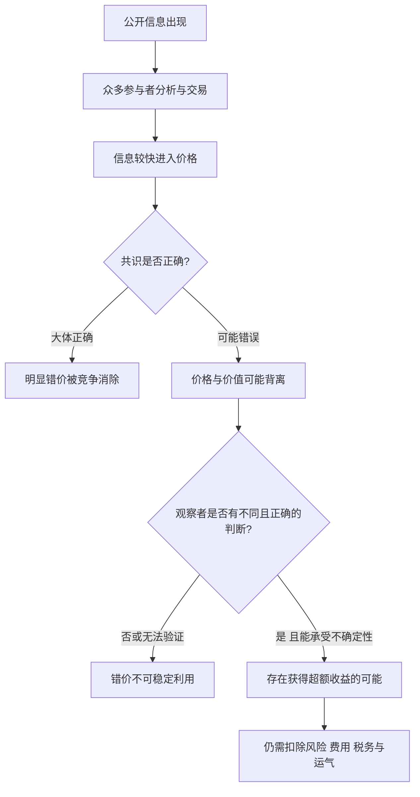
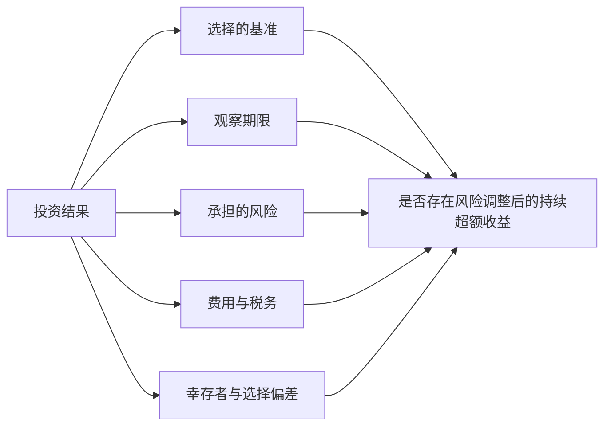

# 总结稿

[打开单页 HTML 总结](assets/bilibili-BV1xigN6nEvj-summary.html)

> [!warning] 非投资建议
> 本笔记用于理解有效市场理论及视频观点，不提供具体标的、仓位、买卖时点或收益承诺。历史案例和基金统计不能保证未来结果。

## 核心结论

视频试图调和两种看似冲突的认识：**市场通常能快速吸收公开信息，但“共识价格”并不保证等于内在价值。** 因而，发现错误定价在逻辑上可能，在实践上却稀少、困难，且事后成功者容易受到幸存者偏差影响。[05:37–06:08][08:17–09:01]

最重要的区分是：

1. **有效市场理论**讨论信息进入价格的速度、可预测性与风险调整后的超额收益，不等于“价格永远正确”。尤金·法玛与 Lars Peter Hansen、Robert Shiller 共同获得 2013 年经济学奖，授奖理由是资产价格的实证分析；诺奖材料概括了法玛关于短期价格难预测、新信息较快进入价格的研究。[诺贝尔奖官方说明](https://www.nobelprize.org/prizes/economic-sciences/2013/press-release/)
2. **霍华德·马克斯的观点**是：许多市场相当有效，尤其是关注充分、参与广泛的市场；但有效性依赖前提，共识仍可能出错，低关注或参与受限领域更可能出现低效。[Oaktree 原始备忘录](https://www.oaktreecapital.com/docs/default-source/memos/2014-01-16-getting-lucky.pdf)
3. **价值投资观点**强调价格与价值可能背离，并尝试在少数错价中寻找机会。这是一种方法论主张，而不是已证明人人都能持续取得超额收益的事实。[04:35–05:29]
4. **讲者的个人规则**——例如“一年交易超过三次即频繁”“买几十只股票不如买指数”——不是有效市场理论的定理，也不是霍华德·马克斯原文中的普遍规则。[06:14–07:15]

## 视频论证路径

- **用市场价格泄露信息的故事引入有效性。** 视频讲述阿尔钦通过锂生产商股价推断热核武器材料。[01:10–02:04] 历史研究支持“利用公开股价推断锂燃料”的核心故事；但 1954 年 Castle Bravo 不是世界首个热核装置，1952 年 Ivy Mike 更早，Bravo 的准确定位是美国首次干式/固态燃料热核系统试验。[美国能源部：Ivy Mike](https://www.energy.gov/management/october-31-1952-mike-test) · [同行评审历史研究](https://doi.org/10.1016/j.jcorpfin.2014.05.002)
- **从指数与主动管理讨论可利用性。** 巴菲特与 Protégé 的十年赌局实际比较的是低成本 S&P 500 指数基金与 Protégé 选择的五只基金中基金，并非“任意五只主动基金”；最终指数基金胜出。[伯克希尔 2017 年股东信](https://www.berkshirehathaway.com/letters/2017ltr.pdf)
- **用长期统计限制绝对化结论。** SPIVA 在多个市场和长期类别中显示，多数主动基金跑输相应基准，但结果随地区、类别、期限、费用和基准而变，不能概括成所有市场、所有时期都如此。[SPIVA Scorecards](https://www.spglobal.com/spdji/zh/research-insights/spiva/) · [SPIVA 亚洲（日本除外）](https://www.spglobal.com/spdji/zh/spiva/article/spiva-asia-ex-japan/)
- **转向市场的局限。** 视频借霍华德·马克斯说明：价格能迅速反映共识，不代表共识正确；若错价存在，识别它需要不同于共识且最终正确的判断。[08:17–09:01]

## 事实核查要点

- 段永平“亿元、十年”说法可由同期报道部分确认，但更接近公开提议，未见可稳定访问的原始帖或正式协议；不能表述成资金已托管的合同。[澎湃新闻报道](https://www.thepaper.cn/newsDetail_forward_33785114)
- 巴菲特赌局的对象、出资结构与视频概括有出入；结论方向成立，细节需按伯克希尔股东信表述。
- Castle Bravo 的“世界第一颗氢弹”说法不准确；阿尔钦用股价推断锂燃料的核心故事有研究支持。
- “长期多数主动基金跑输”有跨市场数据支持，但不是无条件定律。
- 霍华德·马克斯“市场通常有效但非处处有效”的表述有其原始备忘录支持。

## 观众讨论与补充

热门评论主要追问：价格波动与基本面如何对应、周期股是否构成反例、A/H 价差如何解释，以及集中与分散之间是否存在中间地带。另有观众从行为偏差出发，强调误解、跟风和情绪可能妨碍信息被一致吸收。

这些内容均是**观众问题或观点，不是视频证据**。评论来自未登录的热门顶层样本：平台报告 42 条，抓取 24 条，候选 20 条，不含嵌套回复；当前可访问弹幕仅 2 条，不能代表整体观众。高点赞也不证明某种投资方法有效。

## 阅读时应保留的边界

- “市场可能犯错”不能推出“我能识别错价”。
- “某人曾跑赢市场”不能区分能力、风险、运气与筛选偏差。
- “长期多数主动基金跑输”不能推出任一具体基金未来必然跑输。
- 讲者对交易频率、持仓数量和特定类型公司的偏好属于个人方法，不应升级为普遍法则。

# 辅助理解

## 一张图理解：有效性与局限性并存

这张图不是收益模型，而是论证结构：**有效性描述竞争如何压缩显而易见的机会；局限性说明共识仍可能出错。** 两者可以同时成立。

## 四层证据边界

| 层次 | 本笔记中的含义 | 可以推出什么 | 不能推出什么 |
|---|---|---|---|
| 有效市场理论 | 公开信息较快反映到价格，短期价格难预测，超额收益需按风险和基准评价 | 明显、公开、低成本的机会会遭到竞争 | 价格永远准确；任何人绝不可能跑赢市场 |
| 价值投资观点 | 价格与内在价值可能背离，少数错价可研究 | 可以提出“市场共识是否错误”的问题 | 某个便宜资产必然低估；集中持仓必然优越 |
| 历史事实与统计 | 巴菲特赌局、Castle Bravo/阿尔钦案例、诺奖与 SPIVA 数据 | 检查视频举例是否准确，观察特定样本 | 从单一赌局或某期统计推导永恒规律 |
| 观众意见 | 评论区的质疑、经验和案例建议 | 暴露需要进一步核验的问题 | 代表全体观众；凭点赞证明事实或策略有效 |

## “战胜市场”到底在比较什么

只比较最终收益率容易混淆“承担更多风险”“碰巧押中”“筛掉失败者”和“稳定能力”。视频用幸存者偏差回应个别成功者，但将全部收益差异都归结为风险同样过强；严谨判断仍需明确基准、期限、风险、费用与样本形成方式。

## 六个核查锚点

1. **00:03 段永平提议**：同期报道可部分确认，但尚不能当成已经成立、资金托管的正式协议。[报道](https://www.thepaper.cn/newsDetail_forward_33785114)
2. **00:13 巴菲特赌局**：比较的是 S&P 500 指数基金与五只基金中基金；结果和具体数字见伯克希尔股东信。[原始资料](https://www.berkshirehathaway.com/letters/2017ltr.pdf)
3. **01:10 热核试验与阿尔钦**：Ivy Mike 在 1952 年已试爆；Castle Bravo 是 1954 年的干式燃料系统试验。股价推断锂燃料的核心故事有同行评审研究支持。[DOE](https://www.energy.gov/management/october-31-1952-mike-test) · [论文](https://doi.org/10.1016/j.jcorpfin.2014.05.002)
4. **02:08 法玛与 2013 年奖项**：三位学者共同获奖，理由是资产价格的实证分析，不是法玛独自因“有效市场假说”获奖。[诺奖说明](https://www.nobelprize.org/prizes/economic-sciences/2013/press-release/)
5. **03:30 主动与被动**：长期跑输方向在多个 SPIVA 类别中成立，但依地区、类别、期限和基准变化。[SPIVA](https://www.spglobal.com/spdji/zh/research-insights/spiva/)
6. **05:37 霍华德·马克斯**：原始备忘录支持“许多市场相当有效，但共识不保证正确、前提并非处处成立”。[Oaktree 备忘录](https://www.oaktreecapital.com/docs/default-source/memos/2014-01-16-getting-lucky.pdf)

## 将讲者规则降级为可讨论命题

- “一年交易超过三次就是频繁”是讲者个人阈值，不是学术定义。
- “买几十只股票不如买指数”混合了分散化、选股能力、费用与目标函数，不能由有效市场理论单独推出。
- “低关注、争议性资产更容易错价”是待验证的筛选假设，不代表这些资产天然便宜或风险更低。
- “内部消息没有用”在视频中是修辞性概括；现实中还涉及信息真伪、是否已被价格吸收以及法律合规，不能转化为任何交易指引。

> [!warning] 非投资建议
> 本材料只帮助辨析理论、证据与观点，不提供具体标的、仓位、买卖时点或收益预测。

## 外部事实核验

### 声明 1（00:03）

- 视频陈述：段永平愿意拿出一亿元，以十年为期，认为茅台可以跑赢国内任何基金。
- 核验状态：部分确认
- 核验结果：可由同期媒体对段永平社交平台截图及但斌回应部分确认：报道中的原话为“抱着茅台跟任何国内基金赌一个亿人民币，以十年为限”，并附公益捐赠前提。但未找到可稳定访问的段永平原始帖页面或正式、可执行的对赌协议，因此这更接近公开提议而非已经成立的合同；“拿出一亿元”也不等于资金已托管。
- 检索日期：2026-08-21
- 来源：
  - [段永平抛出1亿元“十年之约”，但斌回应](https://www.thepaper.cn/newsDetail_forward_33785114)（secondary）

### 声明 2（00:13）

- 视频陈述：巴菲特拿出 50 万美元，认为标普 500 指数基金能跑赢任意五支主动基金组合，并最终大胜。
- 核验状态：部分确认
- 核验结果：伯克希尔 2017 年股东信确认最终 S&P 指数基金累计增长 125.8%，五只 funds-of-funds 为 2.8%–87.7%；双方最初各购买 50 万美元面值零息美债，目标慈善奖池合计 100 万美元。视频把对象说成“任意五支主动基金组合”不准确：实际是 Protégé 选择的五只基金中基金，其底层涉及 200 多只对冲基金；“巴菲特拿出 50 万美元”省略了面值、购入成本和对手方各自出资。
- 检索日期：2026-08-21
- 来源：
  - [Berkshire Hathaway 2017 Annual Letter](https://www.berkshirehathaway.com/letters/2017ltr.pdf)（primary）

### 声明 3（01:10）

- 视频陈述：1954 年 3 月美国试爆世界第一颗真正意义上的氢弹，阿尔钦通过锂业股价提前推断核心材料是锂。
- 核验状态：部分确认
- 核验结果：混合结论。美国能源部确认第一台热核装置 Ivy Mike 已于 1952-10-31 爆炸，因此“1954 年世界第一颗氢弹”不准确；官方历史资料把 1954-03-01 的 Castle Bravo 定义为美国首次干式/固态燃料热核系统试验，具有更强实用化意义。关于阿尔钦，同行评审的历史重建研究确认他在 RAND 利用公开股价成功推断锂燃料，并重建 Lithium Corp. 1954 年显著上涨；但视频将推断时点、试爆前后和个别价格细节讲得过于简化。
- 检索日期：2026-08-21
- 来源：
  - [October 31, 1952: Mike Test — U.S. Department of Energy](https://www.energy.gov/management/october-31-1952-mike-test)（primary）
  - [Battlefield of the Cold War — U.S. Department of Energy history](https://www.osti.gov/opennet/manhattan-project-history/publications/DOENTSAtmospheric.pdf)（primary）
  - [The stock market speaks: How Dr. Alchian learned to build the bomb](https://doi.org/10.1016/j.jcorpfin.2014.05.002)（secondary）

### 声明 4（02:08）

- 视频陈述：2013 年诺贝尔经济学奖获得者尤金·法玛的主要成果是有效市场假设。
- 核验状态：部分确认
- 核验结果：确认但需补充：法玛与 Lars Peter Hansen、Robert Shiller 共同获得 2013 年奖项，授奖理由是“对资产价格的实证分析”，并非单独因有效市场假设获奖。诺奖材料确认法玛自 1960 年代起证明短期股价极难预测且新信息很快被价格吸收；他的获奖演讲也把有效资本市场与资产定价模型称为两大支柱。
- 检索日期：2026-08-21
- 来源：
  - [The Prize in Economic Sciences 2013 — Press release](https://www.nobelprize.org/prizes/economic-sciences/2013/press-release/)（primary）
  - [Two Pillars of Asset Pricing — Eugene F. Fama Prize Lecture](https://www.nobelprize.org/uploads/2018/06/fama-lecture.pdf)（primary）

### 声明 5（03:30）

- 视频陈述：长期来看能跑赢指数的主动基金比例不高，主动基金往往跑不过被动基金。
- 核验状态：部分确认
- 核验结果：方向在多地区、多个长期类别中得到 SPIVA 支持，但不是对所有市场和所有年份都成立的绝对规律。截至 2025 年末，SPIVA 显示美国大型股主动基金 10 年和 15 年跑输 S&P 500 的比例分别约 85.59% 和 89.93%；亚洲（日本除外）报告也称多数类别跑输且期限拉长时跑输率通常增加，同时明确存在中国内地大盘股等阶段性多数跑赢的类别。应按地区、基金类别、费用、存续偏差和比较基准解读。
- 检索日期：2026-08-21
- 来源：
  - [SPIVA Scorecards](https://www.spglobal.com/spdji/zh/research-insights/spiva/)（primary）
  - [SPIVA Asia Ex-Japan Scorecard](https://www.spglobal.com/spdji/zh/spiva/article/spiva-asia-ex-japan/)（primary）

### 声明 6（05:37）

- 视频陈述：霍华德认为市场大部分时候有效，错误定价不常见，但有效性没有普遍到应放弃寻找超额收益。
- 核验状态：已确认
- 核验结果：与霍华德·马克斯本人 2014 年 Oaktree 备忘录一致。他称有效市场假设的推理“sound and compelling”，认为充分关注的市场会迅速消除错误定价；同时区分“价格正确”与“迅速吸收共识信息”，并指出假设依赖前提、许多而非全部市场相当有效。视频后续“频繁操作一定错误”“普通人一年超过三次就是频繁”等是讲者个人规则，不是马克斯原文或可普遍验证的结论。
- 检索日期：2026-08-21
- 来源：
  - [Getting Lucky — Howard Marks, Oaktree memo (2014)](https://www.oaktreecapital.com/docs/default-source/memos/2014-01-16-getting-lucky.pdf)（primary）

# Data

## 增强转写稿

[00:00] 人到底能不能打败市场
[00:01] 这是一个非常值得思考的问题
[00:03] 最近段永平发出了一个赌局
[00:05] 他愿意拿出来一亿打赌
[00:07] 以时间为期
[00:08] 他认为茅台可以跑赢国内任何的基金
[00:11] 这个赌局是效仿巴菲特
[00:13] 当年巴菲特老爷子拿出50万美金挑战整个华尔街
[00:16] 他认为标普 500 指数基金
[00:18] 能够跑赢任意5支主动基金的组合
[00:21] 当然最终结果也是
[00:23] 巴菲特以极大的优势击败了这个应战者
[00:26] 这场赌局对整个投资行业的影响是巨大的
[00:29] 只要稍加思考我们就能发现一些问题
[00:32] 假如那些拥有专业背景专业训练、精力、计算资源和信息优势的基金经理都无法跑赢大盘
[00:38] 那么主动基金的意义在哪里呢
[00:40] 进一步思考
[00:41] 如果他们都无法战胜市场
[00:44] 那么我们又该去如何战胜市场呢
[00:47] 人到底能不能战胜市场
[00:49] 今天借着这个话题咱们继续来聊霍华德·马克斯的投资最重要的事
[00:54] 在这本书里面霍华德列举了二十多个年代投资中必须要了解的理念
[00:58] 这些理念对普通人建议正确的投资体系都很有帮助
[01:02] 这些视频咱们讨论的就是书的第二章
[01:05] 理解市场的有效性和局限性
[01:08] 开始之前让我来先讲一个故事
[01:10] 1954 年 3 月，美国试爆了世界上第一颗真正意义上的氢弹
[01:14] 但实验之前人们都很好奇
[01:16] 氢弹的核心材料用的是哪种金属
[01:19] 铍、氘、锂,它都有可能
[01:21] 但是可想而知这在当时是全世界最重要的机密
[01:24] 除了最核心的那批人不可能有任何人知道
[01:27] 但是有个叫阿尔钦这位美国经济学家他用了一个非常简单的方法就找到了答案
[01:32] 他统计了生产这几种金属的上市公司的股价
[01:36] 发现了一家公司的股价从两三美元短信内涨到了13美元
[01:40] 这家公司就是美国锂业公司
[01:42] 同时他还发现还有四五家生产锂的公司
[01:45] 股价也出现了异常的上涨
[01:47] 所以他推测氢弹的核心材料
[01:49] 就是锂
[01:50] 事实最终也证明了果然就是这样
[01:53] 请注意此时距离氢弹试爆还有几个月的时间
[01:56] 对美国来说氢弹的材料是最高级别的机密全世界不知道有多少科学人员和间谍都想知道这个问题的答案
[02:03] 但这个答案就是
[02:04] 如此轻易的展示在上市公司的股价上
[02:08] 2013年诺贝尔经济学奖获得者是尤金·法玛
[02:11] 他的主要研究成果就是有效市场假设
[02:13] 他认为在法律健全、信息透明度高的股票市场一切有价值的信息都已经
[02:19] 及时充分的反映在股价的走势当中
[02:21] 其中包括企业当前和未来的价值
[02:24] 除非存在操纵市场的情况否则投资者不可能通过分析基本面和消息面获得高于市场平均水平的超额利润
[02:32] 这里补充一下尤金·法玛被称作现代金融之父他也是芝加哥学派的一个代表人物
[02:37] 在投资里面风险溢价、波动性调整收益系统性和非系统性风险
[02:42] 阿尔法和贝塔这些我们很熟悉的名词
[02:45] 根源都是来自于芝加哥学派的理论
[02:47] 有效市场假设认为市场中参与者获得信息的渠道是大致相同的
[02:51] 在利益的驱动下信息也会迅速且完全在市场上反映出来
[02:56] 所有人都会去买入低估的资产并且卖出高估的资产
[02:59] 所以一个资产的绝对价格以及彼此之间的相对价格是公平的
[03:04] 请注意这里说的是公平的而不是准确的
[03:09] 这里的公平指的是风险和收益
[03:11] 就是说他的预期风险和预期收益是相匹配的
[03:14] 高风险高收益地方也低收益
[03:16] 你不可能承受着一个很低的风险同时拥有很高的
[03:20] 收益期
[03:21] 这也就是所谓彼此之间的相对价格是公平的
[03:25] 由此，有效市场假说最重要的结论也就出现了
[03:29] 人是不可能战胜市场的
[03:30] 有很多证据可以证明这个结论其中最有说服力的就是指数基金
[03:35] 前面巴菲特的赌局就是具体的体现
[03:37] 事实上，长期来看，能跑赢指数的主动基金比例并不算高
[03:41] 主动型基金往往跑不过被动型基金，也就是说
[03:44] 有人操作的不如没人操作的让市场自己跑结果可能会更好
[03:48] 说到这里肯定有人不同意有人要说了
[03:51] 陈小群那些游自大佬从几万块钱做到了几个亿他们就战胜了市场
[03:55] 而且是连续大幅的战胜市场
[03:58] 对不起
[03:59] 有效市场假说把人与人之间的收益差距完全归因于风险差距
[04:04] 之所以他们的投资收益能这么高
[04:06] 就是因为他们的隐性风险也很高
[04:09] 而你看到的陈小群完全是幸存者偏差
[04:11] 是有一个陈小群起来了
[04:13] 但是后面有99个陈小群倒下了
[04:17] 好有效市场假说的含义就是这样
[04:19] 大家觉得有没有道理的
[04:21] 有效市场假说的意义在于假如它是对的那我们去主动投资的意义是什么
[04:26] 我们每天浪费时间去研究是否有价值
[04:29] 我们为什么还要去付给那些
[04:31] 基金所谓的管理费
[04:33] 这些都是非常值得思考的问题
[04:35] 在经济学上，有效市场是主流学说
[04:37] 但是在实际当中也有反对者这里面最具代表性的人物就是巴菲特
[04:41] 如果你看过我之前讲市场先生的视频就会发现
[04:44] 在价值投资里面市场先生这个重要的理论几乎和有效市场就是反过来
[04:49] 巴菲特和他的老师格雷厄姆都认为市场常常表现的非理性
[04:53] 价格常常和价值是背离的
[04:55] 这才给了他们获得超额收益的机会而且你会发现巴菲特不是个例
[04:59] 当年格雷厄姆的学生有十几个都成为了极其优秀的投资者
[05:03] 他们好像就真的有一套理论就是可以战胜市场
[05:07] 但是呢巴菲特也不是全盘的否定也要市场
[05:10] 巴菲特的观点是这样的
[05:11] 他认为市场在绝大部分情况下是非常有效率的
[05:15] 但是通常有效和无时无刻都有效中间隔着天气
[05:19] 这中间的差距如同
[05:21] 黑夜和白昼
[05:22] 巴菲特曾经多次公开对那些
[05:24] 笃信有效市场讲说的人进行嘲讽
[05:26] 认为他们都是书呆子
[05:27] 回到我们要讲的这本书
[05:29] 霍华德的观点和巴菲特是相近的
[05:32] 但是他并没有巴菲特那样偏激
[05:33] 所以霍华德观点对我们的日常投资更有指导意义
[05:37] 首先，霍华德认为我们想要获得超额收益
[05:40] 唯一的情况
[05:41] 只能是发现市场里的错误
[05:43] 也就是市场无效的情况
[05:45] 假如市场一直是有效的我们就不可能超越市场
[05:47] 但其次霍华德也是承认市场有效性的
[05:50] 原因在于全球所有的市场
[05:52] 所有的制度和调控
[05:54] 目的之一就是为了确保每一个人都能在同一时间获得相同的信息
[05:58] 大家都是基于相同的信息去做判断
[06:00] 所以股票被错误定价的概率
[06:03] 是极低的
[06:04] 霍华德的第一个结论就是
[06:06] 错误定价并不常见
[06:08] 战胜市场确实是一件非常困难的事情
[06:11] 这个观点看上去好像没啥用
[06:12] 但是我觉得他很有意义
[06:14] 首先他告诉我们
[06:16] 频繁操作一定是错误
[06:18] 因为市场不可能总是出错
[06:20] 前面讲了我们获得超额收益的唯一情况就是利用市场的错误
[06:24] 就是发现别人没有发现的机会
[06:26] 而绝大部分情况下市场里的定价是迅速且准确的
[06:29] 市场是极其有效的
[06:30] 你不可能每天都发现市场的错误
[06:32] 你甚至不可能每个月都发现
[06:35] 强如巴菲特在过去70年
[06:37] 也只不过是发现了几十次
[06:39] 也就投资了这么一两百个公司
[06:41] 就我个人而言走向盈利的第一步就是戒掉频繁交易
[06:44] 在我眼中
[06:45] 普通人一年交易超过三次就是频繁
[06:48] 我的信条是追求持久而不是追求频率
[06:52] 咱们没有多少现金需要配置
[06:54] 咱们也没有多少能力去发现市场有这么多的错误
[06:57] 这里还有另外一个层面
[06:58] 就是开超市也不太行
[07:00] 因为市场不可能对这么多公司的定价都出现了错误
[07:04] 即使出现了也不可能都被你发现
[07:06] 很多人把开超市当作分散投资
[07:08] 买了几十只股票
[07:09] 这其实是一种自欺欺人
[07:11] 想用这种方式获得超额收益几乎是不可能的
[07:13] 你不如买指数
[07:15] 特别是对于某些资产市场是相当有效的
[07:17] 比如说它广为人知，有一大批追踪者
[07:21] 他是社会普遍认可的资产
[07:22] 不是争议性或者禁忌性资产
[07:24] 他的资产优势简单清晰
[07:26] 而且有关他的信息在传播上是普遍且公平的
[07:30] 符合这些条件的公司
[07:31] 霍华德认为是不太可能被系统性地忽略误解或者低估的
[07:35] 所以你想去超底一个公司的时候一定要反问一句
[07:39] 谁不知道这个事
[07:40] 是不是就你看到了
[07:42] 你是不是正确
[07:43] 这个其实也对应着咱们上次聊的第二层次思维
[07:47] 霍华德认为主流证券市场已经足够有效
[07:50] 在其中寻找制胜投资的方法，基本上等于浪费时间
[07:53] 比如说那些天天分析盘面
[07:54] 天天看消息的
[07:55] 什么路透社、彭博社基本上就是浪费时间
[07:59] 而且你也不可能通过小道消息或者内部消息获得
[08:02] 信息上的优势
[08:03] 这个内部消息
[08:04] 不可能比氢弹材料还要机密
[08:06] 你都知道了就代表了很多人都已经知道了
[08:09] 我可以告诉你
[08:10] 就算是上市公司董事长亲口告诉你的
[08:13] 也没有用
[08:14] 你不要问我是怎么得出这个结论的
[08:17] 接下来是霍华德的第二个结论
[08:19] 他认为市场确实很有效
[08:21] 但是他的有效性
[08:22] 并没有普遍到我们可以放弃追求超额收益的程度
[08:27] 确实
[08:27] 市场能够反映出人们对于
[08:30] 所有信息的预期和共识
[08:31] 但是群体的共识并不一定是正确的
[08:34] 市场犯错的情况还是会发生
[08:36] 尽管发生的概率并不高
[08:37] 但就算他的有效程度是99.9%
[08:41] 1000家公司里面依然可以选出一家公司
[08:43] 是定价错误的
[08:45] 我们想要在茫茫大海中选到这家公司
[08:47] 想要在对的时间选到对的公司
[08:49] 就必须得保持着克制和谨慎
[08:52] 你必须拥有超越常人的洞察力以及绝对的耐心
[08:56] 你必须得对这个行业或者对待这家公司有着深刻的理解
[08:59] 才能在市场偶然犯错的时候抓住机会
[09:01] 因为这种机会可能几年才会出现一次
[09:04] 那么市场犯错的情况容易出现在哪些地方呢
[09:08] 其实很简单
[09:08] 就是与前面提到的那些容易被市场充分定价相反的公司
[09:13] 比如说这家公司鲜为人知追随者不多
[09:15] 巴菲特所说的“买在无人问津处”
[09:18] 其实就是这个道理
[09:19] 再比如它是有争议的、被遗弃的
[09:21] 或者不会被社会认同的
[09:23] 我一直说价值投资在很多时候和普世的社会价值不是一回事
[09:27] 甚至有时候是相反的
[09:29] 大家想一想
[09:29] 为什么价值投资喜欢的都是那种容易上瘾的东西
[09:33] 酒精、游戏
[09:35] 这些都是被很多人反感
[09:37] 或者是垄断的
[09:38] 被消费者骂是资本家的公司
[09:40] 比如说很多平台性的公司
[09:42] 这里面有一部分原因也是在于它并不容易被市场定价
[09:46] 好
[09:46] 今天的视频就到这里
[09:47] 如果内容对你有帮助
[09:48] 请给我一个点赞和关注
[09:50] 拜托各位

## 原始转写稿

[00:00] 人到底能不能打败市场
[00:01] 这是一个非常值得思考的问题
[00:03] 最近段语平发出了一个赌局
[00:05] 他愿意拿出来一亿打赌
[00:07] 以时间为期
[00:08] 他认为茅台可以跑赢国内任何的基金
[00:11] 这个赌局是效仿巴菲特
[00:13] 当年霸佬爷子拿出50万美金挑战整个华尔街
[00:16] 他认为标普伍百指硕基金
[00:18] 能够跑赢任意5支主动基金的组合
[00:21] 当然最终结果也是
[00:23] 巴菲特以极大的优势击败了这个应战者
[00:26] 这场赌局对整个投资行业的影响是巨大的
[00:29] 只要稍到思考我们就能发现一些问题
[00:32] 假如那些拥有专业背景专业训练经历计算机和信息领先的经营经历都无法跑赢大盘
[00:38] 那么主动基金的意义在哪里呢
[00:40] 进一步思考
[00:41] 如果他们都无法战胜市场
[00:44] 那么我们又该去如何战胜市场呢
[00:47] 人到底能不能战胜市场
[00:49] 今天借着这个话题咱们继续来聊华德马克思的投资最重要的事
[00:54] 在这本书里面华德列举了二十多个年代投资中必须要了解的理念
[00:58] 这些理念对普通人建议正确的投资体系都很有帮助
[01:02] 这些视频咱们讨论的就是书的第二章
[01:05] 理解市场的有票性和局限性
[01:08] 开始之前让我来先讲一个故事
[01:10] 1954年的3月美国施爆了世界上第一颗真正意义上的清淡
[01:14] 但实验之前人们都很好奇
[01:16] 清淡的核心材料用的是哪种金属
[01:19] 皮、肚、礼,它都有可能
[01:21] 但是可想而知这在当时是全世界最重要的机密
[01:24] 除了最核心的那批人不可能有任何人知道
[01:27] 但是有个叫二期的美国金学家他用了一个非常简单的方法就找到了答案
[01:32] 他统计了生产这几种金属的上市公司的股价
[01:36] 发现了一家公司的股价从两三美元短信内涨到了13美元
[01:40] 这家公司就是美国离业公司
[01:42] 同时他还发现还有四五家生产离的公司
[01:45] 股价也出现了异常的上涨
[01:47] 所以他推测清淡的核心材料
[01:49] 就是离
[01:50] 事实最终也证明了国人就是这样
[01:53] 请注意此时距离清淡市报还有几个月的时间
[01:56] 对美国来说清淡的材料是最高级别的经历全世界不知道有多少科学人员和间谍都想知道这个问题的答案
[02:03] 但这个答案就是
[02:04] 如此轻易的展示在上市公司的股价上
[02:08] 2013年诺贝尔经济学奖获得者是尤丁法马
[02:11] 他的主要研究成果就是有效市场假设
[02:13] 他认为在法律建议权透明度高的股票市场一切有价值的信息都已经
[02:19] 及时充分的反映在股价的走势当中
[02:21] 其中包括企业当前和未来的价值
[02:24] 除非存在操纵市场的情况否则投资者不可能通过分析基本面和消息面获得高于市场平均视频的超个利润
[02:32] 这里补充一下尤丁法马被称作现代金融支付他也是芝加哥血派的一个代表人物
[02:37] 在投资里面风险业务波动性调整收益系统性和非系统性风险
[02:42] 阿尔法和拜卡这些我们很熟悉的名词
[02:45] 根源都是来自于芝加哥血派的利润
[02:47] 有效市场假设认为市场中参与者获得信息的渠道是大致相同的
[02:51] 在利益的驱动下信息也会迅速且完全在市场上反映出来
[02:56] 所有人都会去买入低货的资产并且卖出高货的资产
[02:59] 所以一个资产的绝对价格以及彼此之间的相对价格是公平的
[03:04] 请注意这里说的是公平的而不是准确的
[03:09] 这里的公平指的是风险和收益
[03:11] 就是说他的预期风险和预期收益是相匹配的
[03:14] 高风险高收益地方也低收益
[03:16] 你不可能承受着一个很低的风险同时拥有很高的
[03:20] 收益期
[03:21] 这也就是所谓彼此之间的相对价格是公平的
[03:25] 由此原来市场假如说最重要的结论也就出现了
[03:29] 人是不可能战胜市场的
[03:30] 有很多证据可以证明这个结论其中最有说服力的就是指挥基金
[03:35] 前面巴菲特的主角就是具体的体现
[03:37] 事实上长期来看能跑赢指挥的主动基金比例并不反靠
[03:41] 主动型基金往往跑过背动型基金也就是说
[03:44] 有人操作的不如没人操作的让市场自己跑结果可能会更好
[03:48] 说到这里肯定有人不同意有人要说了
[03:51] 陈小学那些游自大佬从几万块钱做到了几个亿他们就战胜了市场
[03:55] 而且是连续大幅的战胜市场
[03:58] 对不起
[03:59] 有要市场假如说把人与人之间的收益差距完全归因于风险差距
[04:04] 之所以他们的投资收益能这么高
[04:06] 就是因为他们的隐性风险也很高
[04:09] 而你看到的陈小学完全是信存者偏差
[04:11] 是有一个陈小学起来了
[04:13] 但是后面有99个陈小学倒下了
[04:17] 好有要市场假如说的含义就是这样
[04:19] 大家觉得有没有道理的
[04:21] 有要市场假如说的意义在于假如它是对的那我们去主动投资的意义是什么
[04:26] 我们每天浪费时间去研究是否有价值
[04:29] 我们为什么还要去付给那些
[04:31] 基金所谓的管理费
[04:33] 这些都是非常值得思考的问题
[04:35] 在经济学上有效市场是主流学说
[04:37] 但是在实际当中也有反对者这里面最具代表性的人物就是巴比特
[04:41] 如果你看过我之前讲市场先生的视频就会发现
[04:44] 在架头里面市场先生这个重要的理论几乎和有效市场就是反过来
[04:49] 巴比特和他的老师哥雷厄姆都认为市场常常表现的非礼些
[04:53] 价格常常和价值是背离的
[04:55] 这才给了他们挫得超额数亿的机会而且你会发现巴比特不是个利昂
[04:59] 当年哥雷厄姆的学生有十几个都成为了极其优秀的投资者
[05:03] 他们好像就真的有一套理论就是可以沾上市场
[05:07] 但是呢巴比特也不是全盘的否定也要市场
[05:10] 巴比特的观点是这样的
[05:11] 他认为市场在绝大部分情况下是非常有效率的
[05:15] 但是通常有效和无时无刻都有效中间隔着天气
[05:19] 这中间的差距如同
[05:21] 黑夜和白昼
[05:22] 巴比特曾经多次公开对那些
[05:24] 独信有效市场讲说的人进行嘲讽
[05:26] 认为他们都是出呆的
[05:27] 回到我们要讲的这本书
[05:29] 花德的观点和巴比特是相近的
[05:32] 但是他并没有巴比特那样偏激
[05:33] 所以花德观点对我们的日常投资更有指导意义
[05:37] 首先花德认为我们想要获得超额数亿
[05:40] 唯一的情况
[05:41] 只能是发现市场里的错误
[05:43] 也就是市场无效的情况
[05:45] 假如市场一直是有效的我们就不可能超一市场
[05:47] 但其次花德也是承认市场有效性的
[05:50] 原因在于全球所有的市场
[05:52] 所有的制度和调控
[05:54] 目力之一就是为了确保每一个人都能在同一时间获得相同的信息
[05:58] 大家都是基于相同的信息去做判断
[06:00] 所以股票被错误定价的概率
[06:03] 是极低的
[06:04] 花德的第一个结论就是
[06:06] 错误定价并不常见
[06:08] 沾上市场确实是一件非常困难的事情
[06:11] 这个观点看上去好像没啥用
[06:12] 但是我觉得他很有意义
[06:14] 首先他告诉我们
[06:16] 频繁操作一定是错误
[06:18] 因为市场不可能总是出错
[06:20] 前面讲了我们获得超额收益的唯一情况就是利用市场的错误
[06:24] 就是发现别人没有发现的机会
[06:26] 而绝大部分情况下市场里的定价是迅速且准确的
[06:29] 市场是极其有效的
[06:30] 你不可能每天都发现市场的错误
[06:32] 你甚至不可能每个月都发现
[06:35] 强逐巴菲特在过去70年
[06:37] 也只不过是发现了几十次
[06:39] 也就投资了这么一两百个公司
[06:41] 就我个人而言走向盈利的第一步就是借调频繁交易
[06:44] 在我眼中
[06:45] 普通人一年交易超过三次就是频繁
[06:48] 我的信条是追求持久而不是追求频率
[06:52] 咱们没有多少现金需要配置
[06:54] 咱们也没有多少能力去发现市场有这么多的错误
[06:57] 这里还有另外一个层面
[06:58] 就是开超市也不太新
[07:00] 因为市场不可能对这么多公司的定价都出现了错误
[07:04] 即使出现了也不可能都被你发现
[07:06] 很多人把开超市当作分散投资
[07:08] 买了几十次股票
[07:09] 这其实是一种磁吸气
[07:11] 想用这种方式获得超额收益几乎是不可能的
[07:13] 你不如买指头
[07:15] 特别是对于某些资产市场是相当有效的
[07:17] 比如说他广告人之有一大批的追踪者
[07:21] 他是社会普遍认可的资产
[07:22] 不是争议性或者经济性
[07:24] 他的资产优势简单清晰
[07:26] 而且有关他的信息在传播上是普遍且公平的
[07:30] 符合这些条件的公司
[07:31] 花德认为是不太可能被系统员忽略误解或者低估的
[07:35] 所以你想去超底一个公司的时候一定要反应这一句
[07:39] 谁不知道这个事
[07:40] 是不是就你看到了
[07:42] 你是不是正确
[07:43] 这个其实也对应着咱们上次聊的第二层字设备
[07:47] 花德认为主流证券市场已经足过有效
[07:50] 在其中寻找智盛投资的方法基本上等于浪费时间
[07:53] 比如说那些天天分析盘面
[07:54] 天天看消息的
[07:55] 什么路透社蓬勃社基本上就是浪费时间
[07:59] 而且你也不可能通过小道小姐或者内部消息获得
[08:02] 信息上的优势
[08:03] 这个内部消息
[08:04] 不可能比清淡材料还要几米
[08:06] 你都知道了就代表了很多人都已经知道了
[08:09] 我可以告诉你
[08:10] 就算是上市公司董事长亲一口告诉你的
[08:13] 也没有用
[08:14] 你不要问我是怎么得罪这个结论的
[08:17] 接下来是花德的第二个结论
[08:19] 他认为市场确实很有效
[08:21] 但是他的有效性
[08:22] 并没有普遍到我们可以放弃追求超额收益的成分
[08:27] 确实
[08:27] 市场能够反映出人们对于
[08:30] 所有信息的预期和共识
[08:31] 但是群体的共识并不一定是正确的
[08:34] 市场犯错的情况还是会发生
[08:36] 尽管发生的概率并不高
[08:37] 但就算他的有效程度是99.9%
[08:41] 1000家公司里面依然可以选出一家公司
[08:43] 是定价错误的
[08:45] 我们想要在芒芒大海中选到这家公司
[08:47] 想要在对的时间选到对的公司
[08:49] 就必须得保持着克制和谨慎
[08:52] 你必须拥有超越常人的动产力以及绝对的耐心
[08:56] 你必须得对这个行业或者对待这家公司有着深刻的理解
[08:59] 才能在市场偶然犯错的时候抓住机会
[09:01] 因为这种机会可能几年才会出现一次
[09:04] 那么市场犯错的情况容易出现在哪些地方呢
[09:08] 其实很简单
[09:08] 就是与前面提到的那些容易被市场充分定价相反的公司
[09:13] 比如说这家公司显微人知追随者不多
[09:15] 巴布特所说的买败无人问金处
[09:18] 其实就是这个道理
[09:19] 代表说它是有争议的、尽弃的
[09:21] 或者不会被社会认同的
[09:23] 我一直说价值投资在很多时候和普速的社会价值不是一回事
[09:27] 甚至有肉是相反的
[09:29] 大家想一想
[09:29] 为什么价值投资喜欢的都是那种容易上瘾的东西
[09:33] 酒精、游戏
[09:35] 这些都是被很多人反感
[09:37] 或者是垄断的
[09:38] 被消费者骂是资本家的公司
[09:40] 比如说很多平台性的公司
[09:42] 这里面有一部分原因也是在于它并不容易被市场定价
[09:46] 好
[09:46] 今天的视频就到这里
[09:47] 如果内容对你有帮助
[09:48] 请给我一个点赞和关注
[09:50] 拜托各位

## 原始关键帧

### 关键帧 1

### 关键帧 2

### 关键帧 3

### 关键帧 4

### 关键帧 5

### 关键帧 6

### 关键帧 7

### 关键帧 8

### 关键帧 9

### 关键帧 10

## 补充原始数据

- [bilibili-BV1xigN6nEvj-comments.jsonl](assets/bilibili-BV1xigN6nEvj-comments.jsonl)
- [bilibili-BV1xigN6nEvj-comment-candidates.json](assets/bilibili-BV1xigN6nEvj-comment-candidates.json)
- [bilibili-BV1xigN6nEvj-danmaku.jsonl](assets/bilibili-BV1xigN6nEvj-danmaku.jsonl)
- [bilibili-BV1xigN6nEvj-danmaku-analysis.json](assets/bilibili-BV1xigN6nEvj-danmaku-analysis.json)
- [bilibili-BV1xigN6nEvj-summary.html](assets/bilibili-BV1xigN6nEvj-summary.html)
