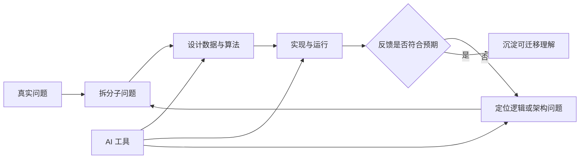
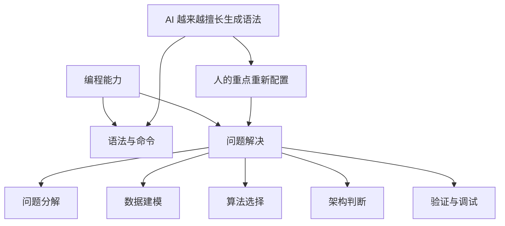
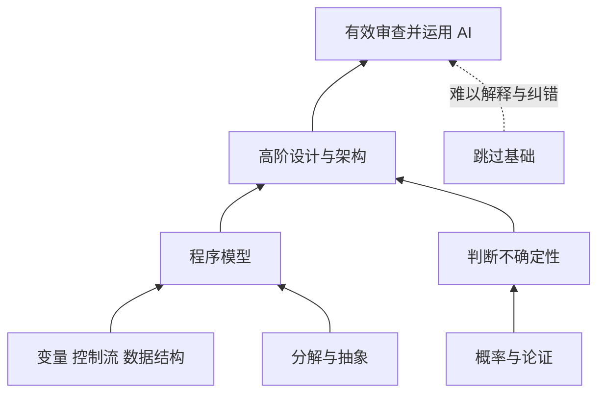
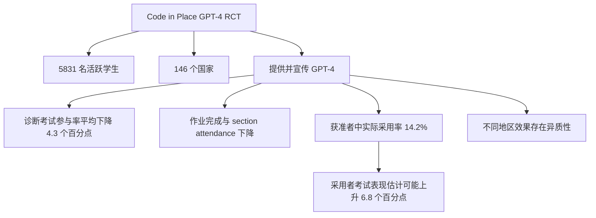
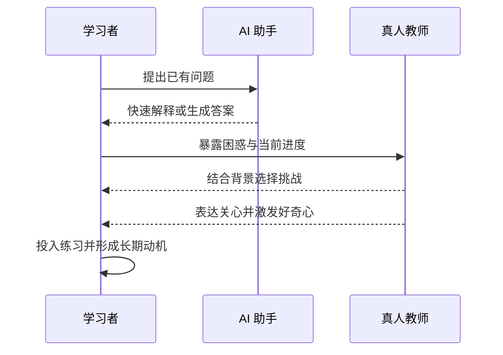
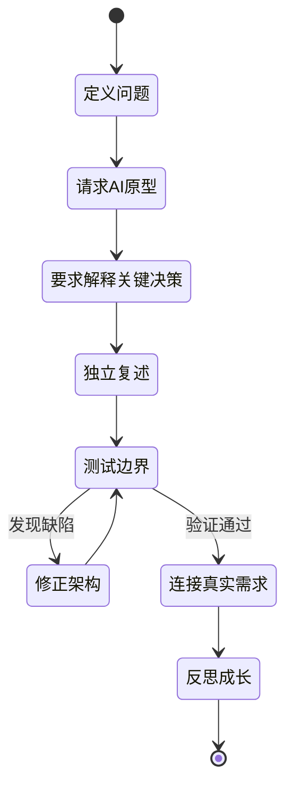

# 总结稿

[打开单页 HTML 总结](assets/bilibili-BV1er3Z6SEko-summary.html)

## 核心结论

Stanford CS Associate Professor (Teaching) **Chris Piech** 的中心观点不是“拒绝 AI”，而是：**让 AI 承担更多语法与执行工作，同时把人的学习重心移向问题分解、架构判断、反馈迭代、好奇心和真实需求。** 使用 AI 时应持续追问：它是在放大我的能力，还是替我拿走了本该发生的成长？

## 三层信息要分开

- **有实证支持的部分**：在一项覆盖 5,831 名活跃学生、146 个国家的 Code in Place 随机对照试验中，向学生提供并宣传课程内 GPT-4，平均使可选诊断考试参与率下降 **4.3 个百分点**，作业完成与 section attendance 也下降。但这不是“所有人失去动机”：只有 14.2% 的获准者实际采用，低 HDI 国家学生和实际采用者还出现不同方向的结果，长期影响仍不明确。
- **讲者的教育观点**：编程的价值会从记命令转向问题解决；代码能给出快速、可证伪的反馈；下一代不能因 AI 会执行操作就跳过概念基础；真人教师的关心、情境判断和激发好奇心仍是教育关键。这些是有经验与案例支撑的课程主张，不是已被单一实验证明的普遍定律。
- **观众意见**：有人用“计算器普及后仍要学四则运算”作类比，也有人追问讲者职称和课程背景。它们可帮助限定表述，但不能替代视频证据或官方资料。

## 为什么 AI 会写代码，仍值得学编程

1. **语法会贬值，建模不会自动消失**：AI 越擅长补全语句，人越需要判断问题该如何拆分、数据怎样组织、算法和架构是否合理。
2. **编程提供高频反馈**：逻辑错误会让程序直接失败，学习者可以迅速观察、修正并再次尝试。
3. **基础决定能否审查 AI**：不会架构的人可能先得到一个能跑的原型，却在数周后面对难以定位的设计缺陷。
4. **真正的高级能力连接人与系统**：值得解决什么问题、用户真正需要什么，以及怎样把现实需求映射到应用、数据与研究，比背下全部代码更重要。

## 教育实验告诉了我们什么

- 通用聊天入口并不自动等于更好的学习。上述 GPT-4 RCT 支持的是**平均参与指标下降且效果存在异质性**，而不是“聊天机器人必然让学生退课”。
- 限定任务中的 AI 反馈可以很强。另一项公开部署包含 1,096 名问卷学生与 15,134 条反馈，学生对 AI 建议的同意率为 97.9%，对人工反馈为 96.7%；但研究对象是 CS1 自动代码反馈，不能外推为“聊天机器人从不幻觉”或“AI 普遍优于教师”。
- Piech 在视频中称，接受一次约十分钟真人教师会话后，课程完成概率提高 **10 个百分点**。公开材料只确认参加 Teach Now 的学生更可能完成课程，未公开足以复核该精确数值、置信区间、样本量和分配方法，因此应保留归因，不能写成已证实的因果效应。

## Code in Place：规模与边界

- 官方资料支持其采用约 **1 名 section leader 对 10 名学生**的模式，并有数千名教师；Piech 所说当期约 **17,000 名学生、1,000 多名教师**的精确数字尚无独立公开统计，应写成“据 Piech 介绍”。
- 官方时间线列出 2020、2021、2023、2024、2025 五次既往开课，并显示 2026 年一期；把 2026 计入可视为第六次，但“已完成六次”在核验时尚未被官方汇总页直接确认。
- “世界上教师人数最多的课程”只能谨慎写为：Stanford 官方材料称它**可能**是教师人数最多的单一课程之一，并无完整全球比较证明世界第一。

## 可执行学习法

- 用 AI 快速做许多原型，但要求它解释关键设计、权衡与实现步骤。
- 把时间花在亲自定义问题、拆解任务、设计数据与算法、测试失败和修复架构上。
- 每次使用 AI 后做一次自检：**如果没有它，我能否解释、修改、排错并继续扩展？**
- 不要只追求“答案正确”；主动寻找真人反馈、同伴讨论和能点燃好奇心的挑战。
- 尽早练习从现实人的问题走向产品、应用、数据和研究，而不是等到资深阶段才做需求判断。

## 观众讨论（从属信息）

候选评论中，计算器类比与 Piech 的基础论相呼应；另有评论提醒核对 “Teaching Professor” 职称及 CS106B、CS109 任课背景。正式称谓现已由 Stanford 官方页面核实为 **Associate Professor (Teaching) of Computer Science**；课程记录可确认 2025–26 年的 CS106A 与 CS109，但观众所说的其他任课经历仍不能仅靠评论认定。

评论分析只覆盖 6 条顶层热门候选（源报告 14 条），没有嵌套回复，存在热门偏差；弹幕仅取得当前可访问的 1/3 条，无法推断整体态度、共识或争议热点。

## 一句话带走

**不要在 AI 与学习之间二选一：用 AI 扩大创造范围，同时保住让你能够判断、解释、纠错并持续成长的基础能力。**

# 辅助理解

## 问题不是“还要不要写代码”，而是“还要不要成长”

Chris Piech 的论证把常见问题重新定向：AI 已经能写出大量代码，但学习编程从来不只是在记忆语法。真正需要保护的是人在学习过程中形成的**问题表征、分解、架构、检验和迭代能力**。因此，判断一次 AI 使用是否健康，不应只看产出速度，还要看使用者是否仍能解释系统、发现错误、作出修改并承担后果。

这张图中的 AI 是加速器，而不是学习闭环的拥有者。只让 AI 从问题一路生成结果，可能得到短期可用的原型，却让使用者失去中间各环节的可解释性。

入选画面里的代码报错和 “1 error” 把 Piech 的理由具体化：代码训练有一种稀缺特性——**逻辑错了，程序通常会以可观察方式失败**。这种快速、可证伪的反馈，使人能在较短周期里反复练习判断。它支持的是一种教育理由，而不是“编程是唯一能教问题解决的学科”这一排他结论。

## 语法层与问题解决层正在重新分工

Piech 把编程学习分为两层：一层是向计算机表达指令的语法，另一层是把大问题拆成小问题、让数据与算法配合、形成可靠架构。其预测是 AI 会越来越擅长前一层，因此死记命令的重要性下降；人的训练应更集中到后一层。

这不是说语法可以完全不学。基础语法仍是阅读、验证和沟通程序行为的接口；变化在于学习目标不能停留在“独立背出每条命令”。更合理的目标是：即使 AI 生成实现，人也能判断方案是否贴合需求、边界是否完整、架构是否会在规模扩大后失效。

## 基础不是机械熟练，而是可继续建造的概念骨架

Piech 用计算器作类比：计算器早已会做乘法，但学生仍需理解乘法的概念；相对而言，快速口算某个具体乘积的重要性可以下降。他把同样的结构应用到概率与编程：工具改变应练习的细节，却不自动取消支撑高阶理解的基础。

“下一代会比我们更聪明”是 Piech 明确提出的价值公理，不是实验结论。它的作用是确定教育目标：既然不放弃下一代的认知成长，就要重新设计基础训练，而不是因工具能完成操作便取消训练。

## 实证结果：AI 的效果取决于任务、采用者与使用方式

视频把“给学生聊天机器人”概括为退课和失去动力。核验后的证据更细：Piech 等人的 Code in Place 随机对照试验覆盖 **5,831 名活跃学生、146 个国家**。被提供并宣传课程内 GPT-4 的实验组，可选诊断考试参与率平均低 **4.3 个百分点**，作业完成和 section attendance 也下降。这证明的是若干**参与指标的平均下降**，并未直接测量每个人的动机，也不意味着所有学生都会退课。

这组结果至少给出三条限制：

1. **可用不等于采用**：只有 14.2% 的获准者实际使用。
2. **平均效应不等于人人同向**：低 HDI 国家学生的考试参与率反而上升，采用者的考试成绩估计可能提高 6.8 个百分点。
3. **参与度不等于动机本身**：论文观察的是考试参与、作业完成和出席等行为指标。

另一个公开部署在限定的 CS1 自动代码反馈任务中记录了 1,096 名问卷学生、15,134 条反馈；学生对 AI 建议的同意率为 97.9%，对人工反馈为 96.7%。这支持“AI 在窄任务中能提供高质量反馈”，却不能推出“聊天机器人从不幻觉”“AI 普遍比教师正确”，更不能推出教师可以被替代。

## 真人教学的价值可能不只在答案正确

Piech 认为教育的“皇冠上的宝石”是动机。教师能结合对学生起点和目标的理解，选择恰当的例子与挑战，在学生尚未提出问题时激发好奇心；通用聊天机器人常能回答已有问题，却未必能创造一个让学生非学不可的问题。

Piech 在视频中还称，学生接受约十分钟真人教师即时会话后，课程完成概率提高 **10 个百分点**。公开材料确认 Teach Now 参与者更可能完成课程，却没有公开足以复核这 10 个百分点的样本量、置信区间和分配方法；参与会话也可能存在自选择。因此它应写成**讲者报告的内部分析结果**，而不能写成“十分钟真人辅导必然导致完成率提高”的已证实因果规律。

这也解释了视频所谓“动机危机”：面对 2026 年的 AI，学生需要为 2030 年的就业作准备，却无法可靠预测四年后的岗位。Piech 对这种不确定性的观察是个人教学经验，视频没有给出总体比例或长期趋势数据。

## Code in Place 提供的是人机组合案例，不是规模神话

Code in Place 的重要之处在于把在线课程、AI 反馈和大规模真人小组教学结合起来。官方资料支持约 **1 名 section leader 对 10 名学生**的模式，并称有数千名教师。Piech 在视频中报告当期约 **17,000 名学生、1,000 多名教师**；该精确组合尚无独立公开页面确认，使用时必须归因。

官方页面列出 2020、2021、2023、2024、2025 五次既往开课，并显示 2026 年一期。将后者计入，与视频所说“第六次”相容，但核验时官方汇总页还没有直接把它写成已归档的第六次。至于“世界上教师人数最多的课程”，Stanford 自己使用的是 likely 或 perhaps，稳妥说法应是“可能是教师人数最多的单一课程之一”。

## 面向学习者的 AI 协作协议

从视频观点与研究边界合起来，可以得到一个更稳健的实践流程：

- **先定义再生成**：先写清用户、约束和成功条件，再让 AI 产出原型。
- **要求解释而非只交付**：追问关键概念、架构取舍、失败模式和测试策略。
- **保留独立检查点**：离开 AI 后复述方案，亲自修改一个核心模块并排查一次错误。
- **在真实使用中迭代**：高级工程能力越来越体现在把现实问题映射到应用、数据与研究。
- **每天检查成长所有权**：如果无法解释、修改或承担结果，就说明外包超过了当前理解。

“AI 放大人类”是 Piech 的收束性愿景。这里的“放大”有前提：医生的关怀、教师的责任、工程师的判断必须先存在，工具才可能扩大这些能力。视频对医疗速度与准确性的例子属于预测和价值表达，不应当作已验证的医疗效果。

### 观众讨论与样本限制

候选评论里最有解释力的一条把 AI 与计算器类比：工具普及没有消除学习四则运算的必要。这与 Piech 的论证同向，但仍是观众类比，不是额外的教育实验。另有评论质疑 “Teaching Professor” 的表述并讨论 CS106B、CS109 任课背景；官方页面已经确认 Chris Piech 的当前正式职称为 **Stanford CS Associate Professor (Teaching)**，2025–26 课程记录包含 CS106A 与 CS109，其余课程历史不能只凭评论断言。

样本非常有限：评论源报告 14 条，候选文件只含 6 条顶层热门评论，且没有嵌套回复，存在热门偏差；弹幕只取得当前可访问的 1/3 条，唯一 120–150 秒桶计数为 1、burst score 为 0，不能称为热点，也不能据此判断整体情绪或共识。

## 最终理解

视频最值得保留的不是“人比 AI 好”这种二元结论，而是一套教育上的分工原则：

- **实证**提醒我们，给出通用 AI 入口可能在平均意义上降低部分参与指标，但效果因人而异；限定任务中的 AI 反馈又可能非常有用。
- **讲者观点**提醒我们，答案正确只是教育的一部分，成长还依赖基础、动机、好奇心、反馈和责任。
- **实践策略**则是让 AI 扩大探索数量，同时把问题定义、架构判断、测试纠错和真实需求牢牢留在人手中。

判断标准可以浓缩成一句话：**AI 帮你做得更多之后，你是否也变得更能理解、判断和创造？**

## 外部事实核验

### 声明 1（00:00）

- 视频陈述：Chris Piech 自称是斯坦福大学教授，教授大型计算机科学入门课和 AI 数学入门课。
- 核验状态：已确认
- 核验结果：确认其任职，且应使用更精确的当前职称。斯坦福计算机系与 Stanford Profiles 均将 Christopher Piech 列为 Associate Professor (Teaching) of Computer Science，并兼任教育学院同职级的 courtesy appointment。Stanford Profiles 的 2025-26 课程记录包括 CS106A Programming Methodology 与 CS109 Introduction to Probability for Computer Scientists。因此视频中口语化的“professor”成立，但正式写作宜称“斯坦福计算机科学教学副教授”。
- 检索日期：2026-08-20
- 来源：
  - [Christopher Piech | Stanford Computer Science](https://www.cs.stanford.edu/people/chris-piech)（primary）
  - [Christopher Piech's Profile | Stanford Profiles](https://profiles.stanford.edu/christopher-piech)（primary）

### 声明 2（00:21）

- 视频陈述：Code in Place 已经做了六年，现已做过六次。
- 核验状态：部分确认
- 核验结果：部分确认。Code in Place 官方页明确列出五次既往开课：2020、2021、2023、2024、2025，并显示下一期于 2026 年 4 月开始；斯坦福计算机系也确认该项目自 2020 年启动。因此，把 2026 年这一期计入后是第六次 offering，时间跨度也是第六个自然年，但官方页面在核验时仍把 2026 写作即将/当期开课，而非已归档的第六次既往 offering。视频采访发布于 2026 年 7 月，其“六次”说法与公开时间线一致，但官方汇总页尚未直接写出“已完成六次”。
- 检索日期：2026-08-20
- 来源：
  - [Code in Place | Stanford University](https://codeinplace.stanford.edu/)（primary）
  - [Research & Impact | Stanford Computer Science](https://www.cs.stanford.edu/research-impact)（primary）

### 声明 3（00:18）

- 视频陈述：Code in Place 约有 17,000 名学生和 1,000 多位老师。
- 核验状态：部分确认
- 核验结果：部分确认，精确的当期人数暂未由斯坦福公开页面独立确认。Code in Place 官方页确认采用约 1 名 section leader 对 10 名学生的模式，并称有“thousands of teachers”；同页给出的五次累计数字是 60,000 名学生与 5,500 名 section leaders。斯坦福计算机系 2025 年汇总页则给出当时累计 40,000 名学生、4,000 名 section leaders，显示统计口径或更新时间不同。采访发布方的文字版直接写 17,000 名学生和 1,000 多名教师，但它与视频同源，不能充当独立统计证明。故人数数量级和 1:10 模式可信，17,000/1,000+ 这组当期精确数字仍应归因于 Piech。
- 检索日期：2026-08-20
- 来源：
  - [Code in Place | Stanford University](https://codeinplace.stanford.edu/)（primary）
  - [Research & Impact | Stanford Computer Science](https://www.cs.stanford.edu/research-impact)（primary）
  - [Stanford CS Professor: AI Can Code. That's Why You Should Learn](https://www.eomag.io/article/stanford-chris-piech)（secondary）

### 声明 4（03:48）

- 视频陈述：Code in Place 是世界上教师人数最多的课程。
- 核验状态：未验证
- 核验结果：未能确认这一全球最高纪录。2021 年 Stanford Report 称首期以 900 名志愿教师服务 10,000 多名学生，并谨慎写作“likely the most teachers who have ever taught a single class”；Code in Place 当前官方页也只写“perhaps the single course with the largest number of teachers ever”。这些一手材料支持其规模极大，但都使用 likely/perhaps，而非基于全球完整比较的确定纪录。因此正式笔记宜写“斯坦福称其可能是教师人数最多的单一课程之一”，不要无保留写成世界第一。
- 检索日期：2026-08-20
- 来源：
  - [Famous Stanford coding course seeks to repeat success of novel model of online learning](https://news.stanford.edu/stories/2021/03/famous-stanford-coding-course-free-online)（primary）
  - [Code in Place | Stanford University](https://codeinplace.stanford.edu/)（primary）

### 声明 5（05:36）

- 视频陈述：学生点击接受十分钟真人教师会话后，完成课程的概率会上升 10 个百分点。
- 核验状态：未验证
- 核验结果：精确的 10 个百分点和因果表述未获公开论文或数据确认。斯坦福计算机系发布的 Teach Now 项目介绍确认了该功能：系统会向正在做作业的学生提供即时真人教师会话；其内部分析称，至少参加一次 Teach Now 的学生比未被提供会话的学生显著更可能完成课程。但公开介绍没有给出 10 个百分点、置信区间、样本量或随机分配方法。参与会话的学生可能存在自选择，因此“点了 yes 就导致完成率提高 10 个百分点”不应在没有研究设计的情况下按因果关系复述。采访发布方重复了 10 个百分点，但与视频同源。
- 检索日期：2026-08-20
- 来源：
  - [Code in Place: Teach Now, Chatbots, Style Feedback | Stanford Computer Science](https://www.linkedin.com/posts/stanford-university-department-of-computer-science_students-from-all-over-the-world-representing-activity-7331101823547637761-XJFF)（primary）
  - [Stanford CS Professor: AI Can Code. That's Why You Should Learn](https://www.eomag.io/article/stanford-chris-piech)（secondary）

### 声明 6（05:02）

- 视频陈述：如果只是把一个聊天机器人交给学习者，人们会退课并失去动力。
- 核验状态：部分确认
- 核验结果：部分确认，但视频把研究结果概括得过度确定。Piech 等人的大规模随机对照试验纳入 5,831 名活跃学生、覆盖 146 个国家；提供并宣传课程内 GPT-4 后，实验组参加可选诊断考试的比例比对照组低 4.3 个百分点，同时作业完成与 section attendance 也下降。论文把这些定义为 engagement 下降，而不是直接测量“动机”，也没有证明所有学生都会退课。结果还具有显著异质性：低 HDI 国家学生的考试参与率反而上升；实际采用 GPT-4 的学生只占获准使用者的 14.2%，采用者的考试成绩估计可能提高 6.8 个百分点。因此更准确的表述是：通用 GPT-4 聊天入口在这一 RCT 中平均降低若干参与指标，但对不同学生可能有利有弊。
- 检索日期：2026-08-20
- 来源：
  - [The GPT Surprise: Offering Large Language Model Chat in a Massive Coding Class Reduced Engagement but Increased Adopters' Exam Performances](https://arxiv.org/abs/2407.09975)（primary）

### 声明 7（05:46）

- 视频陈述：这些对话里 AI 是正确的，在编程入门问题上没有幻觉，而真人教师并非总是正确。
- 核验状态：部分确认
- 核验结果：部分确认，但公开研究核验的是自动代码反馈，不一定是视频紧邻段落所说的聊天机器人对话。Stanford AI Lab 公布的 2021 年部署数据包含 1,096 名问卷学生和 15,134 条反馈；学生对 AI 建议的同意率为 97.9%，对人工教师反馈为 96.7%，差异 p=0.02，AI 反馈整体有用性平均 4.6/5。作者同时明确警告，这不意味着 AI 能自动化教学、替代教师或用于高风险评分。故“AI 在限定的 CS1 反馈任务中可达到很高正确/有用评价”有依据，但不能扩展为“聊天机器人从不幻觉”或一般性优于真人教师。
- 检索日期：2026-08-20
- 来源：
  - [Meta-Learning Student Feedback to 16,000 Solutions | Stanford AI Lab](https://ai.stanford.edu/blog/prototransformer/)（primary）

### 声明 8（12:18）

- 视频陈述：AI 会越来越擅长编程语法，因此死记命令会变得不那么重要，而问题解决能力更重要。
- 核验状态：部分确认
- 核验结果：确认前半句，后半句应保留为谨慎边界。Code in Place 团队已在真实课程中部署多种 AI 编程反馈工具：2024 年的实时代码风格反馈 RCT 覆盖 8,000 多名学生，实时反馈组查看和使用反馈的可能性是延迟反馈组的五倍，查看反馈者中超过 79% 的相关修改直接采纳了反馈；GPT-4 聊天试验也显示对采用者的考试成绩可能有正向作用。但同一 GPT-4 试验同时发现平均参与度下降，作者称长期影响仍不明确。斯坦福工程学院关于 Code in Place 的官方报道把“编程仍然重要，因为它提供可迁移到 AI 的思维框架”明确归为 Piech 的教育观点，而非实验已经证明的普遍因果事实。
- 检索日期：2026-08-20
- 来源：
  - [AI Teaches the Art of Elegant Coding: Timely, Fair, and Helpful Style Feedback in a Global Course](https://arxiv.org/abs/2403.14986)（primary）
  - [The GPT Surprise: Offering Large Language Model Chat in a Massive Coding Class Reduced Engagement but Increased Adopters' Exam Performances](https://arxiv.org/abs/2407.09975)（primary）
  - [Stanford's Code in Place introductory programming course offers a new model for large-scale interactive learning](https://engineering.stanford.edu/news/stanfords-code-place-introductory-programming-course-offers-new-model-large-scale-interactive)（primary）

### 声明 9（14:57）

- 视频陈述：即使计算器和 AI 能执行操作，下一代仍不能跳过乘法、概率与编程的基础；编程能训练问题解决。
- 核验状态：部分确认
- 核验结果：这主要是课程设计判断和价值主张，不是已被视频或单一研究证实的客观定律。可核实的事实是：Code in Place 官方课程仍以 Stanford CS106A 前半部分为基础，系统教授 Karel、控制流、变量、图形、列表与字典等 Python 基础，并配合真人小组教学；斯坦福工程学院也准确记录了 Piech 的观点，即学习编程能提供可迁移到 AI 使用的思维框架。至于“下一代必须学”“不能跳过基础”以及编程是否比其他学科更适合培养问题解决能力，属于 Piech 的教育立场，笔记中应明确归因，而不应写成无争议的实验结论。
- 检索日期：2026-08-20
- 来源：
  - [Code in Place | Stanford University](https://codeinplace.stanford.edu/)（primary）
  - [Stanford's Code in Place introductory programming course offers a new model for large-scale interactive learning](https://engineering.stanford.edu/news/stanfords-code-place-introductory-programming-course-offers-new-model-large-scale-interactive)（primary）

# Data

## 增强转写稿

# Corrected Transcript

- Video ID: `BV1er3Z6SEko`
- Domain: computer science education, AI-assisted programming, human motivation in learning
- Speaker: Chris Piech (as identified in the transcript; institutional/title claims require external verification)
- Editing policy: corrected only clear ASR, capitalization, punctuation, and proper-name errors; timestamps and intended meaning preserved.

## Terminology

- **Chris Piech** — Stanford computer science educator/researcher; ASR rendered “Peach.”
- **Code in Place** — Stanford-origin online introductory programming course/community.
- **Karel** — educational robot/programming environment used in Stanford introductory CS; ASR rendered “Carol.”
- **Cursor** — AI-enabled code editor.
- **Claude Code** — Anthropic coding agent/CLI; ASR rendered “cloud code” and lowercased variants.
- **ChatGPT** — OpenAI chatbot; one noisy phrase was normalized from context.
- **Granola / Recipes** — interview-transcription/product advertisement terminology in the sponsor segment.

## Transcript
[00:00] Hi, I'm Chris Piech. I'm a professor here at Stanford University.
[00:04] I teach some large intro to computer science classes, some intro to math for AI,
[00:10] Code in Place, if people don't know it, it's an online class where you can learn to program.
[00:13] And the special thing about Code in Place is that it's the class in the world with the most teachers,
[00:18] and there's about 17,000 students and more than a thousand teachers.
[00:21] We've been doing Code in Place for six years, so we did Code in Place before Cursor and Claude Code,
[00:25] and Code in Place after. A few observations:
[00:27] One, our enrollment basically doubled.Oh my gosh, all these people want to learn how to code.
[00:32] You can expand the question.You could say, should I learn to program?
[00:36] You can also say, should I learn probability, like AI can code, but AI can also do probability.
[00:41] Should I learn to write?AI can write.
[00:43] I think the wrong answer would be no, no, no.
[00:46] We're not giving up on the next generation being smart.
[00:48] Yes, you should learn how to formalize an argument.
[00:50] Yes, you should learn the depth of probabilistic reasoning.
[00:54] And yes, you should learn how to program.If AI is able to do those things,your abilities may be magnified,
[01:00] but I imagine in the future it will still be important to be smart in those spaces.
[01:06] I'm seeing more people with a motivational crisis than I have in the past,and that makes sense.
[01:11] There's more uncertainty in the world.You know, you can think about what can I contribute with AI of 2026,
[01:18] but I think students are faced with a much harder problem of thinking about,
[01:21] well, if I'm starting a four-year program,I have to think about what jobs are going to exist in 2030,
[01:26] when AI is four years more advanced,and that's a lot of uncertainty for students.
[01:30] And I empathize with this quite a lot.
[01:33] I think naturally that leads to some motivational problems.
[01:36] When am I actually getting something out of AI,and when have I given away too much of the growth?
[01:42] I suppose if I start outsourcing,at what point will I no longer be able to do that?
[01:48] Like,that really critical piece.I think all students have felt like this.
[01:52] Like,if you have AI write too many of your essays,at what point are you no longer able to write an essay?
[01:57] If you have AI write too much of your code,at what point can you no longer do that valuable piece of the architecture?
[02:02] So,I suppose that's the part where like,I think it's fun to use AI,I think people should be playing around with it,
[02:08] but you should be self-aware,and you should be self-aware of like,are you also growing alongside the AI,
[02:14] and you should care so much about your own personal growth.
[02:18] [音乐]
[02:26] I was born in Nairobi,Kenya.
[02:28] When I was 12,I moved to Kuala Lumpur,Malaysia.
[02:31] I ended up coming to the US for university.
[02:33] I was just a curious human.
[02:36] I wasn't set on being a professor from day one.
[02:39] I just like learning,and I liked interesting problems.
[02:42] When I came to Stanford,I had done a little bit of coding,
[02:46] but I really didn't know how to program.
[02:48] But like,I had to fill an elective.
[02:51] So,I just had to take a class,and I was like,OK,I'll do the programming class.
[02:55] And my teacher did the most wonderful thing.
[02:57] They said,at this point,I'm going to have a challenge.
[03:01] Everyone in class,go make the most wonderful things with what you've learned in the first two weeks of programming.
[03:06] And I found myself able to put like,40 hours of extra work beyond my normal schooling into this challenge,
[03:12] because I was so excited.And then,eventually,I discovered that I was so curious about how people learned.
[03:21] And I decided professor was the right thing for me.
[03:24] So Karel speaks this thing called Python,which we're going to be using as our programming language throughout the course.
[03:31] So Karel is our lovable robot. And Karel is in a world.
[03:35] We think of the world as kind of having a northwest,south,and east,and having compass directions.
[03:41] So,I'm going to turn left.And then turn left.And then turn left.
[03:46] And we got a good turn right.
[03:48] It's the class in the world with the most teachers.
[03:50] There's one teacher for every ten students.
[03:53] And there's about 17,000 students and more than a thousand teachers.
[03:56] So,what problem was I trying to solve?Let's go back in time.
[04:00] It's the early days of the pandemic.
[04:02] I'm about to teach Stanford's flagship intro to coding class.
[04:06] And I've been told that everything's going to be online.
[04:09] And in this moment,we're thinking the world is suffering.
[04:13] While we're putting the class online,is there something that we can also do to help the world?
[04:16] We can just put our videos online and we thought people might get a little bit out of it.
[04:21] But we know that it would be a lot less than what our Stanford students get.
[04:25] Because our Stanford students get the special sauce of Stanford education.
[04:29] And the special sauce of Stanford education for intro CS is you get a section leader.
[04:34] You get somebody who's just a little bit older than you,a little bit further along in their career.
[04:38] Who's going to take time to help you grow.
[04:41] One of the common misconceptions is just thinking that AI tutors will solve everything.
[04:46] We basically have AI tutors already.
[04:49] But that isn't moving the needle in the way people expected.
[04:52] So over the last six years,so we've now done this six times.
[04:55] We've tried a lot of different experiments where we gave people different dosage of AI.
[04:59] And we have learned something very surprising.
[05:02] If we give people AI and just like here's a chatbot,use it to learn.
[05:06] Predictably,people will drop out.People get demotivated.
[05:10] It is demotivating to have AI thrown at you at the wrong moment of your learning.
[05:14] We have found very nuanced ways where we can use AI that actually helps people learn.
[05:19] But if you contrast that with humans.
[05:21] So if I throw AI at you,you're probably going to become a little bit demotivated statistically.
[05:26] But what happens if I throw a human at you?
[05:29] Imagine you're just programming in Code in Place.
[05:31] You might get a pop-up and it says,Hey,there's a teacher online.
[05:34] They like to spend ten minutes with you.Do you want to talk to them?
[05:36] If you hit yes,your probability of completing the course goes up ten percentage points.
[05:41] So you must be thinking,Oh,the humans must be saying the right things
[05:44] and the AI must be saying the wrong things.
[05:46] We've looked at these conversations.The AI was correct.
[05:48] It wasn't hallucinating,not for intro programming.
[05:50] And the humans weren't always correct.
[05:53] But the human touch is special.It's motivating.
[05:57] And I think we all need motivation right now.
[05:59] If someone needs something to convince them,I'm not going to make Claude do all the thinking for me.
[06:06] Like to actually do the thinking yourself takes extra energy.
[06:10] The crown jewel of education has always been motivation.
[06:13] And it's a lot more motivating for me to say,I care about you being a smart person.
[06:17] I'm not giving up on you being a smart person in this time of AI.
[06:20] Let's work on your foundations.
[06:22] And then when you're done with your foundations,I'll teach you how to code with AI.
[06:25] That works so much better.
[06:28] When I look at chatbots,I think they do a good job of answering my question.
[06:32] But one challenge I would pose to anybody thinking about how to make these work better for education
[06:37] is how do you get it to inspire?
[06:39] Sometimes I will inspire my students in a deep way.
[06:42] And it could be like you come into my office and be like,Hey,do you want to see something really cool about probability?
[06:46] And I just show them something really neat.
[06:48] And they weren't even thinking about it.That wasn't the question they came in with.
[06:50] But then they feel that like love and like that,that inspiration.
[06:53] And as I said,if I can flip the switch of getting the students so curious that they can't help but learn.
[07:00] Like the rest of the day,all they can think about is the problem that I just posed to them or that cool thing I showed them.
[07:05] If that curiosity gets ignited,then I feel like they'll get there.
[07:09] And when I look at current chatbots,they are not igniting curiosity that much.
[07:14] It's not like whenever you show up to ChatGPT, it's like,Hey,do you want to just see something that is going to make your mind explode?
[07:20] That will like,you know,pull you in.
[07:22] Now as a teacher,I can do that because I have some context on my students.
[07:26] I know largely where they are and largely where they're trying to go.
[07:30] So I can be very delicate in the choice of the inspiring example or the inspiring challenge to pose to my students.
[07:37] If you just think an AI tutor will solve the clarity problem,you might miss it,the bigger piece of the puzzle.
[07:43] And I feel like if we leverage this,we can have a nicer world.
[07:48] The deepest understanding doesn't come in the moment.It's built beforehand.
[07:53] Same goes for us.Before the main interview,we always do a pre-interview call.
[07:58] And Granola quietly transcribes it in the background.
[08:01] No bot ever joining,turning it into clean notes.
[08:04] So we built our own recipe for this.It's called interview prep.
[08:08] We wrote the prompt once,with everything we want before a shoot.
[08:11] And now it's one click every time.
[08:14] Then,minutes before the cameras roll,we run it right on that pre-interview call.
[08:19] In seconds,it surfaces the story worth telling,the threads worth pulling,and the questions worth asking.
[08:25] It's like having the whole transcript in your head without ever opening it.
[08:29] So we sit down already knowing where it should go.It's not a generic checklist.
[08:34] Every line is drawn from the real discussion we just had,shaped by exactly how we like to prep.
[08:39] Less time scrambling to remember,more time fully present in the room.
[08:43] Turns out,the more you prepare,the more you understand.
[08:46] Try recipes today.
[08:48] New users get 100% off their first month at the link in the description.
[08:58] I'm seeing more people with a motivational crisis than I have in the past.
[09:02] And that makes sense.There's more uncertainty in the world.
[09:05] You know,you can think about what can I contribute with AI of 2026.
[09:10] I think students are faced with a much harder problem of thinking about,well,if I'm starting a four year program,
[09:15] I have to think about what jobs are going to exist in 2030,when AI is four years more advanced.
[09:20] And that's a lot of uncertainty for students,and I empathize with this quite a lot.
[09:25] In five to ten years,many things will change.The future has always been unpredictable.
[09:29] It's always been the case that if you ask people to project what jobs will be the right jobs.
[09:33] Five to ten years,people always get it wrong.
[09:36] It's an interesting anecdote,so when I was young,I'm an old man now.
[09:41] But when I was young,as in my PhD,is around the time that one of my now colleagues was making some of the first major milestones in self-driving cars.
[09:49] And this is back in like 2011,2012.
[09:52] And at that moment,you would see this car drive,and you'd think,Oh my God,what does it mean to be a taxi driver?
[09:59] Or what does it mean to be a truck driver?
[10:01] But in fact,what happened is,the truck driver profession has been growing at a very healthy rate.
[10:07] I don't know what the future holds for truck drivers,maybe one day we'll come to an inflection point.
[10:11] But there was a lot of reasons that people underestimated.
[10:15] They underestimated,like,well,if you have a valuable cargo,you need a person who's responsible.
[10:20] Or the long tail sort of experiences,there's always something different happening on the highway.
[10:24] 99% of the experiences can be the same,but like that 1% of things that are different,it's so hard to have an AI master.
[10:30] All of them.
[10:31] I think one day eventually we'll have fully self-driving cars and we'll live in a world where all our cars are driven by an AI system.
[10:38] But what I was surprised about was how grossly we overestimated how quickly we'd get there.
[10:45] I think everyone who's worked deeply with AI has had this experience of by outsourcing a lot of thinking to AI.
[10:53] I am getting more separated from problem solving myself.
[10:57] A good example right now is I program with AI a lot,but I happen to know a lot about programming and architecture.
[11:04] And if I don't know a lot about programming architecture,AI will start to make some poor decisions,which I might not experience the first time I make a prototype.
[11:11] But like five weeks down the line when students are actually using my thing,they might start to hit weird bugs.
[11:16] And if I don't understand the architecture,I can't help them.
[11:19] I suppose if I start outsourcing,at what point will I no longer be able to do that?
[11:25] Like that really critical piece.I think all students have felt like this.
[11:29] Like if you have AI write too many of your essays,at what point are you no longer able to write an essay?
[11:35] If you have AI write too much of your code,at what point can you no longer do that valuable piece of the architecture?
[11:41] So I suppose that's the part where like,I think it's fun to use AI.
[11:45] I think people should be playing around with it.
[11:47] But you should be self aware.And you should be self aware of like,are you also growing alongside the AI?
[11:53] And you should care so much about your own personal growth.
[11:56] When you're learning how to program,largely you can separate it into two pieces.
[12:01] One piece is you're learning the syntax of how do we tell computers to do things?
[12:06] And the other thing you're learning is basically problem solving.
[12:09] Like how do you take big problems and break them down into small pieces?
[12:12] How do you set it up so that data can speak to algorithms?
[12:16] How do you think about algorithms?
[12:18] So I'm going to say AI is going to get really really good at just the syntax.
[12:23] It's less important in the future that you've memorized every command.
[12:26] It's probably more important that you know how to problem solve.
[12:29] So while you're learning to program,really focus on that problem solving ability.
[12:34] There's one thing about coding that's special.
[12:37] You get immediate falsifiable feedback.
[12:40] Like if your logic is wrong,your thing doesn't work.
[12:43] And you get to see that and you get to iterate quickly.
[12:46] Whereas if you apply problem solving to life,you could make a poor decision.
[12:50] But the feedback cycle is so slow that you don't get to practice getting better and better at making decisions.
[12:55] So there's a couple of things about coding that makes it particularly good at teaching how to problem solve.
[13:00] The question,how do you become like a really high contributor engineer?
[13:05] You might not find my answer that surprising,but it's like it's time on task.
[13:09] It's like how much time are you spending actually creating things?
[13:12] And I'm going to separate you creating versus you giving it to Claude Code.
[13:16] Now by the way,you know what I would do if I was a young person.
[13:19] I would make a lot of prototypes with Claude Code.
[13:21] And I'd say, Claude Code, teach me all the most important things that you did in order to create this.
[13:26] And I would iterate that way and I get lots of experience.
[13:29] So I can try and figure out one of the most important concepts.
[13:31] I'll give your young engineers a particular challenge.
[13:34] As I said,it's a confusing time,but there's an opportunity that didn't exist before.
[13:38] One of the things that's happened is barriers to entry have been cut.
[13:41] You could be a 12th grader,so an 18-year-old with a friend.
[13:46] You might be able to make a high quality startup.
[13:49] The two of you could make a pretty impressive code base that solves an interesting problem.
[13:53] There is a real art form to knowing what is a valuable problem to solve.
[13:58] And I think more and more engineers get to engage with that art form.
[14:04] What is worth actually making?What do users want?
[14:07] What's the feature that will help them make progress in whatever their problems are?
[14:12] So that ability to interface between what our computer is able to do
[14:16] and what do humans actually need has always been a critical high-order skill.
[14:21] And I think if I were a junior engineer,I would start working on that skill now.
[14:26] I wouldn't wait till I was a senior engineer.
[14:31] If you start with the premise that my children will become smart people
[14:35] and your children will become smart people.
[14:37] If you don't have children,then maybe your nephews and nieces will become smart people.
[14:40] You start from the premise that the next generation will be filled with people who are smarter than we are.
[14:44] Then you're like,ok,how do we get them to that point?
[14:47] And then you look at any subject,probability,computer science.
[14:51] And when you look at any subject,there's often foundational concepts
[14:54] and then you'll have layers of complexity built on top of it.
[14:57] If you expect them to become smarter than you are,it's really hard to skip the foundations.
[15:02] And one way of thinking about that is,we've had calculators do multiplication for a long time.
[15:06] Kids still need to learn multiplication.
[15:08] Now,there's a subtle difference.
[15:10] The concept of multiplication is so critical,but actually knowing how to do the rote.
[15:15] You know,if I ask you,what's 13 times 7,go quick.
[15:18] That's not as important as just knowing what is multiplication.
[15:21] But you can't skip the foundations,but you can maybe be more artful about what you focus on.
[15:26] I kind of take it as an axiom that I'm not giving up on the next generation.
[15:32] Honestly,the people I've seen get most lost and most demotivated in this mode of AI
[15:37] are sometimes the ones who are overthinking it.
[15:39] I had a student,he was just doing such wonderful things.
[15:41] He was using AI,he was solving problems,he was learning amazing things.
[15:44] I asked,hey,wonderful student,like,what are you thinking about?
[15:47] And he says,I actually don't think about it.
[15:49] I don't really think about the future of AI,and that allows me to thrive.
[15:53] And, like, I pause. I think about AI all the time.
[15:56] I feel like I think about AI 10 times a day.
[15:58] And the simplicity of like,no,I'm just going to be curious and learn.
[16:02] Since that day,I start my day with the axiom.
[16:05] I don't ask why I care about the next generation being smarter.
[16:08] I take it as a truth.I want this and I will work towards it.
[16:12] It's a tool and it will multiply humans.
[16:17] So when humans are at our best,we can use this tool to multiply us.
[16:21] Like the doctor who really cares about their patient now has a tool that they can do more faster,more accurately.
[16:27] The teacher who really cares about their students,who is passionate about them learning.
[16:31] They can go further with their students and they can do more.
[16:34] Also,I get to see young people all the time.
[16:38] And I would say that gives me inspiration.
[16:42] Seeing their self-awareness,how critically they're thinking.
[16:46] Seeing them blossoming,it gives you optimism.
[16:49] If I was a young person right now,the most valuable thing is that you have the self-awareness.
[16:53] You should also have the goal that I will become smarter.
[16:56] Chris is not giving up on you.You should not give up on yourself either.
[17:00] I have two kids under five.
[17:02] And you know what?They're going to live in an awesome world.
[17:06] We're going to adapt.We're going to figure things out.
[17:09] They're going to still have curiosities.They're going to still grow their minds.
[17:12] And we're going to keep every day working towards that.
[17:17] The top engineer might not be the person who knows all the code.
[17:20] Maybe the top engineer is a person who can relate the real world human problems into the world of apps.
[17:27] Into the world of data science and into the world of research.
[17:30] So go make stuff.
[17:32] Make stuff that people use.Make stuff that people love.
[17:35] And in that process of iteration,you have an opportunity to become excellent at coding and excellent at problem solving.
[17:43] Just take axioms.You will become smarter than you were yesterday.
[17:47] Start your day like that.

## 原始转写稿

[00:00] Hi, I'm Chris Peach, I'm a professor here at Stanford University.
[00:04] I teach some large intro to computer science classes, some intro to math for AI,
[00:10] code in place if people don't know it, it's an online class where you can learn to program.
[00:13] And the special thing about code in place is that it's the class in the world with the most teachers,
[00:18] and there's about 17,000 students and more than a thousand teachers.
[00:21] We've been doing code in place for six years, so we did code in place before cursor and cloud code,
[00:25] and code in place after a few observations.
[00:27] One, our enrollment basically doubled.Oh my gosh, all these people want to learn how to code.
[00:32] You can expand the question.You could say, should I learn to program?
[00:36] You can also say, should I learn probability, like AI can code, but AI can also do probability.
[00:41] Should I learn to write?AI can write.
[00:43] I think the wrong answer would be no, no, no.
[00:46] We're not giving up on the next generation being smart.
[00:48] Yes, you should learn how to formalize an argument.
[00:50] Yes, you should learn the depth of probabilistic reasoning.
[00:54] And yes, you should learn how to program.If AI is able to do those things,your abilities may be magnified,
[01:00] but I imagine in the future it will still be important to be smart in those spaces.
[01:06] I'm seeing more people with a motivational crisis than I have in the past,and that makes sense.
[01:11] There's more uncertainty in the world.You know, you can think about what can I contribute with AI of 2026,
[01:18] but I think students are faced with a much harder problem of thinking about,
[01:21] well, if I'm starting a four-year program,I have to think about what jobs are going to exist in 2030,
[01:26] when AI is four years more advanced,and that's a lot of uncertainty for students.
[01:30] And I empathize with this quite a lot.
[01:33] I think naturally that leads to some motivational problems.
[01:36] When am I actually getting something out of AI,and when have I given away too much of the growth?
[01:42] I suppose if I start outsourcing,at what point will I no longer be able to do that?
[01:48] Like,that really critical piece.I think all students have felt like this.
[01:52] Like,if you have AI right too many of your essays,at what point are you no longer able to write an essay?
[01:57] If you have AI right too much of your code,at what point can you no longer do that valuable piece of the architecture?
[02:02] So,I suppose that's the part where like,I think it's fun to use AI,I think people should be playing around with it,
[02:08] but you should be self-aware,and you should be self-aware of like,are you also growing alongside the AI,
[02:14] and you should care so much about your own personal growth.
[02:18] [音乐]
[02:26] I was born in Nairobi,Kenya.
[02:28] When I was 12,I moved to Kuala Lumpur,Malaysia.
[02:31] I ended up coming to the US for university.
[02:33] I was just a curious human.
[02:36] I wasn't set on being a professor from day one.
[02:39] I just like learning,and I liked interesting problems.
[02:42] When I came to Stanford,I had done a little bit of coding,
[02:46] but I really didn't know how to program.
[02:48] But like,I had to fill an elective.
[02:51] So,I just had to take a class,and I was like,OK,I'll do the programming class.
[02:55] And my teacher did the most wonderful thing.
[02:57] They said,at this point,I'm going to have a challenge.
[03:01] Everyone in class,go make the most wonderful things with what you've learned in the first two weeks of programming.
[03:06] And I found myself able to put like,40 hours of extra work beyond my normal schooling into this challenge,
[03:12] because I was so excited.And then,eventually,I discovered that I was so curious about how people learned.
[03:21] And I decided professor was the right thing for me.
[03:24] So Carol speaks this thing called Python,which we're going to be using as our programming language throughout the course.
[03:31] So Carol is our lovable robot.And Carol is in a world.
[03:35] We think of the world as kind of having a northwest,south,and east,and having compass directions.
[03:41] So,I'm going to turn left.And then turn left.And then turn left.
[03:46] And we got a good turn right.
[03:48] It's the class in the world with the most teachers.
[03:50] There's one teacher for every ten students.
[03:53] And there's about 17,000 students and more than a thousand teachers.
[03:56] So,what problem was I trying to solve?Let's go back in time.
[04:00] It's early days in the pandemic.
[04:02] I'm about to teach Stanford's flagship intro to coding class.
[04:06] And I've been told that everything's going to be online.
[04:09] And in this moment,we're thinking the world is suffering.
[04:13] While we're putting the class online,is there something that we can also do to help the world?
[04:16] We can just put our videos online and we thought people might get a little bit out of it.
[04:21] But we know that it would be a lot less than what our Stanford students get.
[04:25] Because our Stanford students get the special sauce of Stanford education.
[04:29] And the special sauce of Stanford education for intro CS is you get a section leader.
[04:34] You get somebody who's just a little bit older than you,a little bit further along in their career.
[04:38] Who's going to take time to help you grow.
[04:41] One of the common misconceptions is just thinking that AI tutors will solve everything.
[04:46] We basically have AI tutors already.
[04:49] But that isn't moving the needle in the way people expected.
[04:52] So over the last six years,so we've now done this six times.
[04:55] We've tried a lot of different experiments where we gave people different dosage of AI.
[04:59] And we have learned something very surprising.
[05:02] If we give people AI and just like here's a chatbot,use it to learn.
[05:06] Predictably,people will drop out.People get demotivated.
[05:10] It is demotivating to have AI thrown at you at the wrong moment of your learning.
[05:14] We have found very nuanced ways where we can use AI that actually helps people learn.
[05:19] But if you contrast that with humans.
[05:21] So if I throw AI at you,you're probably going to become a little bit demotivated statistically.
[05:26] But what happens if I throw a human at you?
[05:29] Imagine you're just programming in code and place.
[05:31] You might get a pop-up and it says,Hey,there's a teacher online.
[05:34] They like to spend ten minutes with you.Do you want to talk to them?
[05:36] If you hit yes,your probability of completing the course goes up ten percentage points.
[05:41] So you must be thinking,Oh,the humans must be saying the right things
[05:44] and the AI must be saying the wrong things.
[05:46] We've looked at these conversations.The AI was correct.
[05:48] It wasn't hallucinating,not for intro programming.
[05:50] And the humans weren't always correct.
[05:53] But the human touch is special.It's motivating.
[05:57] And I think we all need motivation right now.
[05:59] If someone needs something to convince them,I'm not going to make Claude do all the thinking for me.
[06:06] Like to actually do the thinking yourself takes extra energy.
[06:10] Crown jewel of education has always been motivation.
[06:13] And it's a lot more motivating for me to say,I care about you being a smart person.
[06:17] I'm not giving up on you being a smart person this time of AI.
[06:20] Let's work on your foundations.
[06:22] And then when you're done with your foundations,I'll teach you how to code with AI.
[06:25] That works so much better.
[06:28] When I look at chatbots,I think they do a good job of answering my question.
[06:32] But one challenge I would pose to anybody thinking about how to make these work better for education
[06:37] is how do you get it to inspire?
[06:39] Sometimes I will inspire my students in a deep way.
[06:42] And it could be like you come into my office and be like,Hey,do you want to see something really cool about probability?
[06:46] And I just show them something really neat.
[06:48] And they weren't even thinking about it.That wasn't the question they came in with.
[06:50] But then they feel that like love and like that,that inspiration.
[06:53] And as I said,if I can flip the switch of getting the students so curious that they can't help but learn.
[07:00] Like the rest of the day,all they can think about is the problem that I just posted them or that cool thing I showed them.
[07:05] If that curiosity gets ignited,then I feel like they'll get there.
[07:09] And when I look at current chatbots,they are not igniting curiosity that much.
[07:14] It's not like you never show up to chat between.It's like,Hey,do you want to just see something that is going to make your mind explode?
[07:20] That will like,you know,pull you in.
[07:22] Now as a teacher,I can do that because I have some context on my students.
[07:26] I know largely where they are and largely where they're trying to go.
[07:30] So I can be very delicate in the choice of the inspiring example or the inspiring challenge to pose to my students.
[07:37] If you just think an AI tutor will solve the clarity problem,you might miss it,the bigger piece of the puzzle.
[07:43] And I feel like if we leverage this,we can have a nicer world.
[07:48] The deepest understanding doesn't come in the moment.It's built beforehand.
[07:53] Same goes for us.Before the main interview,we always do a pre-interview call.
[07:58] And Granola quietly transcribes it in the background.
[08:01] No bot ever joining,turning it into clean notes.
[08:04] So we built our own recipe for this.It's called interview prep.
[08:08] We wrote the prompt once,with everything we want before a shoot.
[08:11] And now it's one click every time.
[08:14] Then,minutes before the cameras roll,we run it right on that pre-interview call.
[08:19] In seconds,it surfaces the story worth telling,the threads worth pulling,and the questions worth asking.
[08:25] It's like having the whole transcript in your head without ever opening it.
[08:29] So we sit down already knowing where it should go.It's not a generic checklist.
[08:34] Every line is drawn from the real discussion we just had,shaped by exactly how we like to prep.
[08:39] Less time scrambling to remember,more time fully present in the room.
[08:43] Turns out,the more you prepare,the more you understand.
[08:46] Try recipes today.
[08:48] New users get 100% off their first month at the link in the description.
[08:58] I'm seeing more people with a motivational crisis than I have in the past.
[09:02] And that makes sense.There's more uncertainty in the world.
[09:05] You know,you can think about what can I contribute with AI of 2026.
[09:10] I think students are faced with a much harder problem of thinking about,well,if I'm starting a four year program,
[09:15] I have to think about what jobs are going to exist in 2030,when AI is four years more advanced.
[09:20] And that's a lot of uncertainty for students,and I empathize with this quite a lot.
[09:25] In five to ten years,many things will change.The future has always been unpredictable.
[09:29] It's always been the case that if you ask people to project what jobs will be the right jobs.
[09:33] Five to ten years,people always get it wrong.
[09:36] It's an interesting anecdote,so when I was young,I'm an old man now.
[09:41] But when I was young,as in my PhD,is around the time that one of my now colleagues was making some of the first major milestones in self-driving cars.
[09:49] And this is back in like 2011,2012.
[09:52] And at that moment,you would see this car drive,and you'd think,Oh my God,what does it mean to be a taxi driver?
[09:59] Or what does it mean to be a truck driver?
[10:01] But in fact,what happened is,the truck driver profession has been growing at a very healthy rate.
[10:07] I don't know what the future holds for truck drivers,maybe one day will come to an inflection point.
[10:11] But there was a lot of reasons that people underestimated.
[10:15] They underestimated,like,well,if you have a valuable cargo,you need a person who's responsible.
[10:20] Or the long tail sort of experiences,there's always something different happening on highway.
[10:24] 99% of the experiences can be the same,but like that 1% of things that are different,it's so hard to have an AI master.
[10:30] All of them.
[10:31] I think one day eventually we'll have fully self-driving cars and we'll live in a world where all our cars are driven by an AI system.
[10:38] But what I was surprised about was how grossly we overestimated how quickly we'd get there.
[10:45] I think everyone who's worked deeply with AI has had this experience of by outsourcing a lot of thinking to AI.
[10:53] I am getting more separated from problem solving myself.
[10:57] A good example right now is I program with AI a lot,but I happen to know a lot about programming and architecture.
[11:04] And if I don't know a lot about programming architecture,AI will start to make some poor decisions,which I might not experience the first time I make a prototype.
[11:11] But like five weeks down the line when students are actually using my thing,they might start to hit weird bugs.
[11:16] And if I don't understand the architecture,I can't help them.
[11:19] I suppose if I start outsourcing,at what point will I no longer be able to do that?
[11:25] Like that really critical piece.I think all students have felt like this.
[11:29] Like if you have AI right too many of your essays,at what point are you no longer able to write an essay?
[11:35] If you have AI right too much of your code,at what point can you no longer do that valuable piece of the architecture?
[11:41] So I suppose that's the part where like,I think it's fun to use AI.
[11:45] I think people should be playing around with it.
[11:47] But you should be self aware.And you should be self aware of like,are you also growing alongside the AI?
[11:53] And you should care so much about your own personal growth.
[11:56] When you're learning how to program,largely you can separate it into two pieces.
[12:01] One piece is you're letting the syntax of how do we tell computers to do things?
[12:06] And the other thing you're learning is basically problem solving.
[12:09] Like how do you take big problems and break them down into small pieces?
[12:12] How do you set it up so that data can speak to algorithms?
[12:16] How do you think about algorithms?
[12:18] So I'm going to say AI is going to get really really good at just the syntax.
[12:23] It's less important in the future that you've memorized every command.
[12:26] It's probably more important that you know how to problem solve.
[12:29] So while you're learning the program,really focus on that problem solving ability.
[12:34] There's one thing about coding that's special.
[12:37] You get immediate falsifiable feedback.
[12:40] Like if your logic is wrong,your thing doesn't work.
[12:43] And you get to see that and you get to iterate quickly.
[12:46] Whereas if you apply problem solving to life,you could make a poor decision.
[12:50] But the feedback cycle is so slow that you don't get to practice getting better and better at making decisions.
[12:55] So there's a couple of things about coding that makes it particularly good at teaching how to problem solve.
[13:00] The question,how do you become like a really high contributor engineer?
[13:05] You might not find my answer that surprising,but it's like it's time on task.
[13:09] It's like how much time are you spending actually creating things?
[13:12] And I'm going to separate you creating versus you giving it to Claude code.
[13:16] Now by the way,you know what I would do if I was a young person.
[13:19] I would make a lot of prototypes with Claude code.
[13:21] And I'd say Claude code teach me all the most important things that you did in order to create this.
[13:26] And I would iterate that way and I get lots of experience.
[13:29] So I can try and figure out one of the most important concepts.
[13:31] I'll give your young engineers a particular challenge.
[13:34] As I said,it's a confusing time,but there's an opportunity that didn't exist before.
[13:38] One of the things that's happened is barriers to entries have been cut.
[13:41] You could be a 12th grader,so an 18-year-old with a friend.
[13:46] You might be able to make a high quality startup.
[13:49] The two of you could make a pretty impressive code base that solves an interesting problem.
[13:53] There is a real art form to knowing what is a valuable problem to solve.
[13:58] And I think more and more engineers get to engage with that art form.
[14:04] What is worth actually making?What do users want?
[14:07] What's the feature that will help them make progress in whatever their problems are?
[14:12] So that ability to interface between what our computer is able to do
[14:16] and what do humans actually need has always been a critical high-order skill.
[14:21] And I think if I were a junior engineer,I would start working on that skill now.
[14:26] I wouldn't wait till I was a senior engineer.
[14:31] If you start with the premise that my children will become smart people
[14:35] and your children will become smart people.
[14:37] If you don't have children,then maybe your nephews and nieces will become smart people.
[14:40] You start from the premise that the next generation will be filled with people who are smarter than we are.
[14:44] Then you're like,ok,how do we get them to that point?
[14:47] And then you look at any subject,probability,computer science.
[14:51] And when you look at any subject,there's often foundational concepts
[14:54] and then you'll have layers of complexity built on top of it.
[14:57] If you expect them to become smarter than you are,it's really hard to skip the foundations.
[15:02] And one way of thinking about that is,we've had calculators do multiplication for a long time.
[15:06] Kids still need to learn multiplication.
[15:08] Now,there's a subtle difference.
[15:10] The concept of multiplication is so critical,but actually knowing how to do the rote.
[15:15] You know,if I ask you,what's 13 times 7,go quick.
[15:18] That's not as important as just knowing what is multiplication.
[15:21] But you can't skip the foundations,but you can maybe be more artful about what you focus on.
[15:26] I kind of take it as an axiomthat I'm not giving up on the next generation.
[15:32] Honestly,the people I've seen get most lost and most demotivated in this mode of AI
[15:37] are sometimes the ones who are overthinking it.
[15:39] I had a student,he was just doing such wonderful things.
[15:41] He was using AI,he was solving problems,he was learning amazing things.
[15:44] I asked,hey,wonderful student,like,what are you thinking about?
[15:47] And he says,I actually don't think about it.
[15:49] I don't really think about the feature of AI,and that allows me to thrive.
[15:53] And like any pause,I think about AI all the time.
[15:56] I feel like I think about AI 10 times a day.
[15:58] And the simplicity of like,no,I'm just going to be curious and learn.
[16:02] Since that day,I start my day with the axiom.
[16:05] I don't ask why I care about the next generation being smarter.
[16:08] I take it as a truth.I want this and I will work towards it.
[16:12] It's a tool and it will multiply humans.
[16:17] So when humans are at our best,we can use this tool to multiply us.
[16:21] Like the doctor who really cares about their patient now has a tool that they can do more faster,more accurately.
[16:27] The teacher who really cares about their students,who is passionate about them learning.
[16:31] They can go further with their students and they can do more.
[16:34] Also,I get to see young people all the time.
[16:38] And I would say that gives me inspiration.
[16:42] Seeing their self-awareness,how critical they're thinking.
[16:46] Seeing them blossoming,it gives you optimism.
[16:49] If I was a young person right now,the most valuable thing is that you have the self-awareness.
[16:53] You should also have the goal that I will become smarter.
[16:56] Chris is not giving up on you.You should not give up on yourself either.
[17:00] I have two kids under five.
[17:02] And you know what?They're going to live in an awesome world.
[17:06] We're going to adapt.We're going to figure things out.
[17:09] They're going to still have curiosities.They're going to still grow their minds.
[17:12] And we're going to keep every day working towards that.
[17:17] The top engineer might not be the person who knows all the code.
[17:20] Maybe the top engineer is a person who can relate the real world human problems into the world of apps.
[17:27] Into the world of data science and into the world of research.
[17:30] So go make stuff.
[17:32] Make stuff that people use.Make stuff that people love.
[17:35] And in that process of iteration,you have an opportunity to become excellent at coding and excellent at problem solving.
[17:43] Just take axioms.You will become smarter than you were yesterday.
[17:47] Start your day like that.

## 原始关键帧

### 关键帧 1

### 关键帧 2

### 关键帧 3

### 关键帧 4

### 关键帧 5

### 关键帧 6

### 关键帧 7

### 关键帧 8

### 关键帧 9

### 关键帧 10

## 补充原始数据

- [bilibili-BV1er3Z6SEko-comments.jsonl](assets/bilibili-BV1er3Z6SEko-comments.jsonl)
- [bilibili-BV1er3Z6SEko-comment-candidates.json](assets/bilibili-BV1er3Z6SEko-comment-candidates.json)
- [bilibili-BV1er3Z6SEko-danmaku.jsonl](assets/bilibili-BV1er3Z6SEko-danmaku.jsonl)
- [bilibili-BV1er3Z6SEko-danmaku-analysis.json](assets/bilibili-BV1er3Z6SEko-danmaku-analysis.json)
- [bilibili-BV1er3Z6SEko-visual-summary.png](assets/bilibili-BV1er3Z6SEko-visual-summary.png)
- [bilibili-BV1er3Z6SEko-summary.html](assets/bilibili-BV1er3Z6SEko-summary.html)
