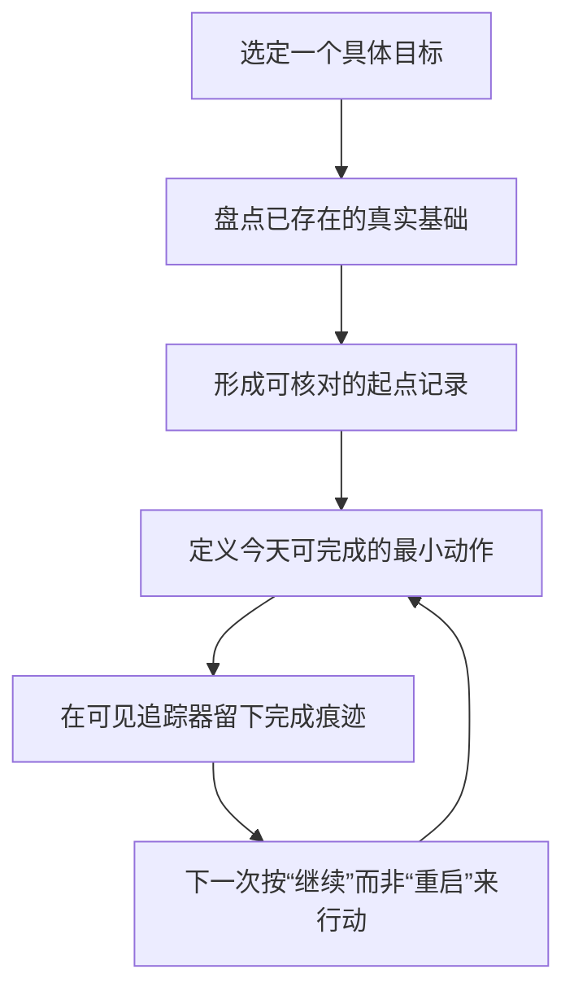

# 总结

## 核心摘要

这支视频提出的不是“把自己骗成已经成功”，而是一种更朴素的起步设计：把已经存在却分散、未被计入的努力、经验、知识、资源和关系整理出来，让目标从心理上的“0%”变成可被看见的“正在继续”。视频将其称为 **20% 起点**；重点在于真实证据，而不是虚构进度。

## 视频观点：先改变起点体验，再要求持续行动

视频把很多目标的早期停滞解释为“零的重量”：当目标只呈现为遥远的大缺口，人容易把阻力归因于自己不够自律，转而拖延、过度规划或自责。它主张把重心从“逼自己更努力”移到“为行动预先布置条件”。这里的关键不是否认努力，而是不把人格评价当作唯一杠杆。

视频给出的路径有四步：

1. **盘点真实的既有进展。** 写下过去尝试、学到的教训、已有技能、工具、联系人和已经完成的小动作；目标是找回证据，不是给自己加分。

2. **把第一步压缩到今天能完成。** 不直接面对整个目标，而是选一个很小、可在当天完成的动作，让“计划”变成一次真实行动。
3. **让进展可见。** 用自己会看的清单、日历、习惯追踪或简单图表留下痕迹；形式次要，能看见才重要。
4. **把叙事改成“继续”，但不虚报。** 只把可验证的事实放上进度条。清单可以粗糙、杂乱、未整理；完整与诚实优先于好看。

视频的核心判断是：启动和延续在主观体验上不同。把已有记录摆在眼前，不能减少任务的客观难度，却可能减少“冷启动”的心理摩擦；之后每一次小完成都会为下一次行动提供可见的延续线索。

## 可迁移的实践法：把它当作可检验的行为设计

下面是依据视频整理出的实践推断，而不是对结果的保证：

- 选择一个具体目标，并区分“已经具备的基础”与“尚未完成的结果”。例如，读过的资料、已有工具、一次试做、一个可求助的人，都可以作为前者；它们不等于目标已完成。
- 先列出至少 10 条可回溯的真实证据，再定义一个足够小、今天能交付的动作。若某一条无法说明它是什么、何时发生或怎样帮助目标，就不要把它当作进度。
- 追踪器只记录已做事实，不记录愿望或“应该做”。下次回看时，问“下一步怎样延续这条记录”，而不是重新问“我到底能不能开始”。
- 当连续的完成记录出现后，可以把身份叙事从“希望成为的人”改为“正在做这件事的人”；这是一种有用的自我描述方式，而非对未来完成率的承诺。

## 事实核验与使用边界

### 洗车忠诚卡实验：关键数字成立，但结论需收窄

视频引用的 Nunes 与 Drèze 研究确有其事：2006 年的现场实验向洗车客户随机发放 300 张忠诚卡；一组需要集 8 枚印章，另一组拿到 10 格卡但预先获 2 枚印章，两组都还需 8 次新的付费洗车。预盖章组的兑换率为 **34%**，另一组为 **19%**（约 1.79 倍），且其相邻到店间隔平均少 **2.9 天**。这些是该特定忠诚计划中的结果，见 [Nunes & Drèze 的原始论文](https://msbfile03.usc.edu/digitalmeasures/jnunes/intellcont/Endowed%20Progress%20Effect-1.pdf)。

因此，较稳妥的外部结论是：在明确奖励、可追踪进度的计划中，被赋予的相对进度可能提升坚持和完成行为。它**不能单独证明**健身、关系、创业、康复或每一种个人长期目标都会以同样方式改善；把“20% 起点”迁移到生活目标时，应视为值得试验的设计假设，而不是普遍定律。

### 应明确降格的说法

- “多数目标会在前两周被放弃、一个月后重启”与“第二周动力下降的真正原因是缺乏反馈”在视频中没有给出可核验的样本或来源。本次核验将它们标为 **未验证**，不宜写成统计事实。
- “意志力是会耗尽的有限资源”对应的 ego-depletion 模型仍有显著争议。两个预注册多实验室研究均未在确认性分析中发现可靠的耗竭效应；更合适的写法是“不要只依赖短期强迫自己”，而不是把单一资源耗尽当作定论。参考：[23 实验室复制研究](https://www.psychologicalscience.org/journals/perspectives/1745691616652873/)与[36 实验室预注册研究](https://www.psychologicalscience.org/journals/psychological-science/0956797621989733/)。

## 一句带走

不要用虚构的“20%”安慰自己；先把已经真实发生的进展收集成证据，再完成一个小到无法继续拖延的动作，并让下一次行动能够看见这条连续性。

# 辅助理解

## 辅助理解：把“从 0% 开始”改成一条可见的连续线

视频中的“0%”首先是一个主观问题：目标在脑中是否只是一段遥远、没有入口的空白。它给出的解法不是降低真实要求，也不是伪造战绩，而是先把已经存在的基础变成看得见、能核对的起点，再让今天的一个小动作接上去。

图中的循环刻意回到“最小动作”，而不是直接跳到宏大结果：它把“我还不够好”的评价问题，换成“我下一次要延续哪一条真实记录”的设计问题。

## 三个层次，避免把方法用偏

| 层次 | 应该做什么 | 不应该偷换成什么 |
| --- | --- | --- |
| 事实层 | 记录过去尝试、已有技能、资源、联系人、读过的材料与已完成动作 | 把愿望、计划或别人替你完成的结果当作自己的进度 |
| 行动层 | 把下一步缩小到当天可完成，并真的完成它 | 用反复规划、整理工具或追踪器设置代替行动 |
| 解释层 | 用“我正在延续一件已有基础的事”降低冷启动感 | 用“我已经 20% 完成”掩盖仍未完成的关键工作 |

这也解释了为什么“盘点”在视频里不是励志练习：如果条目不可回溯，追踪器会变成自我安慰；如果条目真实，即使细小也能成为下一步的具体入口。

## 把方法落到一个目标上

可以按下面的顺序做一次小实验：

1. 把目标写成可观察的结果，而不是人格标签。例如写“完成一份作品集初稿”，而不是“变得更自律”。
2. 写出至少 10 条已存在的基础，并为每条补一个简短证据：何时做过、掌握了什么、手头有什么、谁能提供什么帮助。
3. 删除无法核对、只是希望或暗含夸大的条目；这一步守住视频强调的“真实进度”边界。
4. 选择一个当天可以完成的动作，并在完成后留下一个可见标记。
5. 下次卡住时，先查看这份记录，再问“最小的下一步是什么”。若记录没有产生帮助，就调整动作粒度或追踪位置，而不是给自己贴失败标签。

“至少 10 条”“今天完成”“每天可见”是视频提出的操作建议；它们可作为开始的默认值，但不应被理解为对所有人都有效的硬性科学阈值。

## 怎样正确使用洗车实验

外部核验确认，视频所引的洗车忠诚计划中，两种方案的实际追加购买量相同，而预先有 2 枚印章的一组兑换率更高、购买间隔更短。[原始研究](https://msbfile03.usc.edu/digitalmeasures/jnunes/intellcont/Endowed%20Progress%20Effect-1.pdf) 支持的，是奖励计划里“感知相对进度”与坚持之间的关系。

把它迁移到个人目标时，合理的实践推断是：**用真实、可见的已完成事项减少启动摩擦，然后观察它是否让你更容易做下一步。** 不合理的推断则是：只要把进度写成 20%，任何目标都会自动更容易完成。后者超出了研究情境和视频可提供的证据。

## 核验后的护栏

- 不把“多数人第二周放弃”或“反馈缺失是唯一原因”当成事实；本次核验未找到支撑它们的定义、样本和数据。
- 不把“意志力会像单一燃料一样耗尽”当成定论；相关 ego-depletion 模型存在复制争议，[预注册多实验室证据](https://www.psychologicalscience.org/journals/psychological-science/0956797621989733/)没有给出可靠的确认性支持。
- 保留真正有价值的实践结论：环境、任务粒度与可见反馈值得被设计；它们可以被自己的记录检验和迭代，而不需要依赖夸大的心理学叙事。

## 一句话复盘

把进步看清楚，不等于宣称已经成功；它的价值在于给下一次真实行动提供一个不必从空白开始的入口。

# Data

## 增强转写稿

[00:00] Alright, hello, and welcome to this training. As you can see from the title, what we're going to be covering today is why you should never start a goal from zero. And as you can see from the overview, what we're going to be talking about more specifically is, first, the overview itself; the weight of zero; the 20% start; continuing instead of starting; the review; and your action items for today or the next few days. With that said, let's get started and talk about the weight of zero.
[00:26] So you've probably set a goal at some point in your life that genuinely mattered to you, maybe it was about your body, maybe it was about your money, your relationships, your craft or who you wanted to become as a person, and somewhere along the way, despite caring about it, despite knowing it mattered, you stopped.
[00:45] And that pattern repeats for almost everyone across almost every area of life, and it's because nobody ever explains the invisible thing that can quietly kill goals before the work even begins.
[00:58] Now most people assume the problem is effort, they think if they could just want it more or work harder or stay disciplined for longer, the goal would happen, so they keep doubling down on effort, which is the one thing that wasn't actually the issue.
[01:11] And when effort alone doesn't fix it, then the shame shows up, right, you start feeling like the problem is you, like other people have something that you don't.
[01:21] And that story is comforting in a bit of a dark way, because at least it gives the failure an explanation, even if it's the wrong one.
[01:31] And so the truth is much less personal, there's a specific psychological weight that crushes goals in the first stretch, and almost nobody has thought how to handle it, and once you see it, you can't unsee it, and it changes how you approach every goal from then on.
[01:46] So the weight is very invisible, which is part of why it's so deadly, you can't fight what you can't name, so people keep trying to muscle through a force that they don't realize is even acting on them.
[01:58] And because the force is invisible, well, the diagnosis is almost always wrong.
[02:03] People blame motivation or their time or their energy or their environment and sometimes themselves, when the real culprit can sit one layer underneath all of those quietly steering the whole thing,
[02:15] which is why the same pattern keeps repeating across years, same kind of goals, same kind of stall, same kind of guilt, different decade.
[02:22] And that cycle is really just a missing piece of understanding.
[02:26] Now with that in mind, I want to walk you through a study that explains the whole thing in a way that's almost embarrassingly simple once you see it.
[02:35] So back in 2006, two researchers named Joseph Nunes and Xavier Drèze—and I might be butchering this name—ran a now-famous experiment at a car wash.
[02:46] And what they found is small on the surface, but massive underneath, and it quietly rewrites how you should think about every goal in your life.
[02:55] So here's what they really did, they handed one group of customers a loyalty card that needed eight stamps to earn a free wash.
[03:04] And they handed another group a card that needed 10 stamps, but it came with two stamps already filled in for free.
[03:12] So if you look at the math, both groups have the exact same amount of real work to do.
[03:17] 8 stamps, same reward at the end, which is obviously the free wash, and same effort required.
[03:26] But nothing about the actual goal changed between the two groups: both of them had to reach eight stamps in order to get that free wash.
[03:34] Except one had eight stamps from the get-go, and the other had 10 with two already filled in.
[03:41] Now logically both groups should have had similar completion rates, because the work was equal, the price was equal, the path was equal.
[03:48] A purely rational view of human behavior would predict no meaningful difference between them, but human behavior is almost never purely rational.
[03:57] And what happened next is really the part that should make you sit up a little because it quietly explains years of stalled goals in your own life.
[04:06] Now the group that started with two stamps already filled in completed the card almost twice as often as the other group.
[04:14] Same workload, same reward, wildly different finish rate.
[04:20] The only thing that really changed was the feeling of having already started.
[04:25] So researchers also noticed those people moved faster, not just more often, but with more urgency.
[04:31] That tiny sense of advancement seemed to inject momentum into the actual behavior, almost like a battery getting charged up.
[04:39] Now beyond speed, they also showed more stamina, they stuck with it even when things got slow or boring.
[04:45] The progress they'd already seen kept feeding them in the background long after the initial excitement faded.
[04:52] So the lesson buried in that study is the single most important thing I'm going to teach you in this video.
[04:58] People are dramatically more likely to finish a goal when they feel they've already started one.
[05:03] And the actual distance to the finish line didn't really change, only the perception of progress changed.
[05:09] And it's that perception alone that almost doubled the completion rate.
[05:14] And what that tells you is that your brain doesn't really respond to the objective size of a goal.
[05:19] It responds to where it thinks you are on the path.
[05:22] If you feel close, then you push harder, if you feel far, then you stall.
[05:28] And so distance in the mind is emotional before it's logical.
[05:32] A goal that feels miles away gets treated almost like a threat, even if the actual workload is reasonable.
[05:38] So your motivation gets drained before you've even tried.
[05:41] Closeness flips that completely.
[05:44] The moment a goal feels reachable, your brain leans in.
[05:48] You get curious, energized, focused, and willing to keep going through small obstacles that would have stopped you earlier
[05:54] because you feel like you're closer to completion.
[05:57] And so once you see this pattern, you start spotting it everywhere.
[06:00] Fitness, business, learning, relationships, recovery, money.
[06:04] Anywhere a long-term outcome is involved, perceived progress runs the show.
[06:09] Now, with that study sitting in the background, let's talk about what zero actually does to you
[06:14] because I think this is the part that almost nobody explains.
[06:17] So starting at zero percent is not a neutral starting position if you think about it.
[06:23] It's an emotionally loaded place that works against you from day one.
[06:27] Now a goal at zero percent feels far away in a way that your brain can barely tolerate.
[06:34] You look at the gap between where you are now and where you want to be
[06:37] and your mind basically decides the climb is too much.
[06:41] So you stall, you scroll, you delay, and you tell yourself you'll begin tomorrow.
[06:45] So when a goal sits at zero, it has no shape yet.
[06:48] There's no first move. There's no obvious anchor.
[06:51] There's no clear thing to grab onto.
[06:54] And it's that vagueness that makes it really easy to walk away
[06:58] because nothing about it really feels urgent or real.
[07:01] Without a clear anchor, your attention just basically scatters towards
[07:05] easier things almost automatically.
[07:07] And you end up busy with small ones that don't necessarily move you anywhere meaningful.
[07:12] And the actual goal really sinks slowly into the background of your life.
[07:16] Now vague goals also breed quiet doubt.
[07:19] You start wondering if you're even cut out for it, if it's the right goal,
[07:24] if the timing is off. None of that's real analysis.
[07:27] That's just your mind looking for an excuse to really escape the discomfort of zero.
[07:32] And so distant goals get processed almost like threats.
[07:36] Your body basically tightens, your motivation drops, your willpower starts leaking
[07:40] before any real action happens.
[07:42] And that's why you can feel exhausted just thinking about something
[07:45] you haven't even started yet.
[07:47] So you avoid the goal without consciously meaning to.
[07:50] You clean, you organize, you plan, you research, you reorganize and plan again.
[07:55] You know, anything that feels productive without necessarily forcing you
[07:59] to actually face the client to actually work on the goal.
[08:02] And then on top of the avoidance comes a layer of quiet shame
[08:06] because you know you should be taking action on the goal, but you're not.
[08:10] And that small gap between what you're intending to do
[08:13] and what you're actually doing becomes its own private kind of pain.
[08:17] Now zero also messes with you with how you see yourself in relation to the goal.
[08:22] When the progress bar feels empty, you don't feel like someone actually pursuing the goal.
[08:27] You feel like someone hoping for it, which is a much weaker position to operate from
[08:31] than actually seeing yourself as somebody that's taking action towards the goal.
[08:35] So you start treating the goal like something you're outside of looking in
[08:39] and it's that distance that turns the goal into a fantasy
[08:42] rather than an actual project you're working on.
[08:45] And fantasies almost never get built, right?
[08:48] Because nothing about them demands action today.
[08:51] So it seems like you're just daydreaming.
[08:54] And from that outsider position, every move feels oversized.
[08:57] You hesitate to make the first call, to write the first draft, to take the first step,
[09:01] to send the first message, and these small steps start to feel enormous,
[09:06] even when they're objectively tiny.
[09:08] So you also start comparing yourself to people already deep into the same goal.
[09:13] They look further ahead than you, more capable than you, more deserving of the result.
[09:18] So you sit on the sidelines a little longer and just watch.
[09:21] And then there's the impostor feeling, because even when you do start,
[09:25] part of you suspects you don't really belong yet, because the progress bar still reads empty.
[09:30] And that little voice quietly drains the energy out of every early action you take.
[09:35] Which is why so many goals get abandoned in the first two weeks,
[09:39] and then restarted from scratch a month later.
[09:41] Because a part of you still wants the goal, but every reset places you back at zero.
[09:46] And every time you do that, the weight of zero gets a little heavier.
[09:50] And here's where most self-improvement advice gets this completely wrong.
[09:55] And this is the part I really want you to pay attention to.
[09:59] Most people are told that the answer to the weight of zero is more discipline,
[10:04] more motivation, more grit, more drive.
[10:07] And that framing is a trap, and it keeps you stuck for years.
[10:10] Telling someone to push through zero is like telling someone to lift a piano with their teeth.
[10:14] It can be done technically, but it's a terrible plan.
[10:17] Willpower is a real resource, sure.
[10:20] But it's a limited one, and it was never designed to carry the full weight of a long-term goal.
[10:25] Lean on willpower too hard, and you burn out fast. You get a few intense days, maybe a strong week,
[10:30] and then you crash. And after the crash, you blame yourself instead of the strategy you started with.
[10:35] And so the goal quietly dies under a pile of guilt and shame.
[10:40] Now pure willpower is also very fragile.
[10:43] One bad sleep, one stressful day, one emotional hit, and the whole plan collapses.
[10:49] A goal can't survive on a system that breaks the moment life gets normal.
[10:53] So the real move is really to stop being at zero in the first place.
[10:57] And that's a totally different game.
[10:59] And it's the game that actually works.
[11:01] And it's also what the Nunes and Drèze finding was quietly pointing at the whole time.
[11:06] Goal progress is mostly perception.
[11:09] Momentum is really just a feeling, it's perception.
[11:14] How close you feel matters almost as much as how close you actually are.
[11:18] So if you shift the perception, then the behavior follows.
[11:21] That's not a trick. That's just how the human mind handles long-term effort.
[11:26] So the work is upstream. Before you push, you set up the climb in a way that doesn't require superhuman drive.
[11:33] You build the conditions that make movement feel natural because forcing yourself into motion will always lose to designing yourself into it.
[11:41] So conditions beat character almost every time.
[11:44] If you put a disciplined person in a bad setup, they'll struggle.
[11:47] If you put an average person in a brilliant setup, then they'll glide.
[11:52] Goals get achieved by good design, not just good intentions.
[11:56] And this is the leverage point most people miss.
[11:59] You don't need to become a different person to hit your goal.
[12:01] You just need to stop standing at zero because zero is the actual enemy here, not you.
[12:06] So let's talk about the 20% start.
[12:10] So the whole thing comes down to one thing, which is that you never let your brain experience a goal as zero percent complete, not even for a single day at the start.
[12:19] You want to walk into every goal already feeling like the process is underway.
[12:24] The same way those car-wash customers felt the moment they saw two free stamps sitting on their card before they'd done anything.
[12:32] That feeling of being already in motion, already having momentum is really what carries you through the first stretch, which is exactly where almost everyone else quits.
[12:42] So instead of fighting the heaviness of a fresh start, you want to remove the heaviness entirely by refusing to begin at zero.
[12:49] You want to be fixing a completely different problem here.
[12:52] So the core principle is simple enough that you can carry with you for the rest of your life and apply it to anything that you want to.
[12:59] You're almost never truly at zero on a goal that you actually care about if you really think about it, even when it feels like you're standing at the very bottom looking up.
[13:08] The reason it feels like zero is that you've never gathered your real progress into one place where you can actually see it.
[13:14] Once you understand that, well, the whole problem stops being about motivation and really is about perception.
[13:21] So most of your real progress stays completely hidden from you.
[13:25] Scattered across months or even years of quiet effort that you never really bothered to count.
[13:30] You've thought about this goal more times than you realize, most likely. You've tried small pieces of it.
[13:35] You've learned hard lessons from the attempts that didn't work.
[13:38] You've gathered tools and, most likely, a lot of knowledge about it along the way without ever tallying any of it.
[13:45] So your brain looks at the goal finds no organized evidence of movement or progress or momentum and defaults to reading the whole thing as empty.
[13:53] Meanwhile, the truth is usually sitting closer to 20%. You just haven't looked properly.
[13:58] So your past attempts count for far more than you give them credit for, even the ones you'd rather forget about completely.
[14:05] Every failed try handed you specific information about what doesn't work, which narrows the path and makes the next attempt sharper than the last.
[14:13] And that accumulated knowledge is real usable progress and it lives in you right now whether you acknowledge it or not.
[14:20] So it's still there, regardless of whether you acknowledge it or not.
[14:25] Well, you might as well acknowledge it, right? Because it moves you closer to the goal.
[14:29] You tend to file those attempts under wasted time when really they were tuition you already paid.
[14:35] So your existing assets count as well. And there are almost always more of them than you'd guess on first looks.
[14:41] Think about the skills you already have, the people you already know, the tools and resources and knowledge already sitting around in your life waiting to be used.
[14:49] None of that is zero. And yet you walk straight past all of it on your way to convincing yourself you're a total beginner.
[14:56] When you actually stop and count it, the picture shifts in your favor a lot quicker.
[15:01] So the first move is this reframe. And it's a genuinely powerful one once you actually do it instead of just nodding.
[15:09] You stop asking what you have to do from scratch, which is the question that makes everything feel impossibly far away.
[15:15] And rather, you ask yourself what's already true that points you towards this goal, which immediately starts filling in part of the progress bar before you've even lifted a finger.
[15:25] And it's that change in the opening question that changes the entire emotional weight of the goal.
[15:30] And this is where you sit down and you actually take a genuinely honest inventory of everything that already counts in your favor.
[15:37] You write it all down on paper or a screen, no matter how small, scattered or unrelated each piece feels in the moment.
[15:44] And you actually look at it and see that you've made a ton of progress without even acknowledging it.
[15:51] The simple act of seeing it gathered in one place does something real and almost physical to your sense of momentum.
[15:57] Because you're not making anything up. You're finally just collecting all of the progress that was already there.
[16:03] And it's that inventory that then becomes proof, and proof is exactly what your brain has been wanting this entire time.
[16:11] And once you can physically look at 10 or 15 things that you know you've already begun.
[16:16] Well, the goal stops registering as a cold intimidating beginner start.
[16:21] And you'll see it as the continuation of something that's already been moving for a while.
[16:26] Despite the fact that it might have been slower because you haven't necessarily been collecting any of the evidence that you've made progress.
[16:34] Which is a completely different thing to wake up to, right?
[16:38] Continuing is dramatically easier to sustain than beginning.
[16:43] Now a simple four-part process turns any goal you have into a 20% start.
[16:48] And you can run the whole thing in about 15 minutes today.
[16:51] And each step is designed to build real visible momentum before your willpower is ever asked to carry the load.
[16:57] You move in order from gathering what already exists, to shrinking the first action, to making everything visible, to locking in the right frame.
[17:05] And when they come together, these four steps make the goal feel like it's already rolling downhill.
[17:10] So first, you build your inventory of existing progress, which is the foundation that everything else rests on, as we just covered.
[17:17] You sit down with the goal clearly in mind, and you list out everything that you already have working in your favor right now.
[17:24] It could be past attempts, it could be hard lessons, it could be relevant skills, it could be useful resources and knowledge.
[17:30] Helpful contacts and any small action you've already taken all belong on this list.
[17:35] Now the longer and more honest the list, the stronger the foundation you're building underneath the goal.
[17:40] So the key in this step is just brutal honesty pointed in your favor for once, which is something most people never practice.
[17:48] You're usually painfully honest about your shortcomings and weirdly blind to your strengths and progress.
[17:54] So flip that same harsh honesty towards your assets instead.
[17:57] And when you do, you'll be genuinely surprised at how much is already sitting there fully real and completely uncounted.
[18:04] Fully objectively true, right? We're not making anything up here.
[18:09] We're actually taking objective truth and just pointing your attention to it.
[18:15] And so that surprise is the moment the goal starts to feel survivable.
[18:19] So aim for at least 10 items on this list, even when some of them feel almost embarrassingly tiny.
[18:26] Volume matters more than you think here, since a long list of small things creates a far stronger sense of progress than a short list of impressive ones.
[18:35] So the sheer quantity is doing real psychological work by itself because it builds the weight of momentum item by item.
[18:42] So you keep adding and then resist the urge to filter for what sounds good.
[18:47] And don't dismiss the small stuff because dismissing it is the exact mistake almost everyone makes.
[18:53] A single book you read on the topic or one honest conversation you had about it,
[18:58] or one relevant tool you already own and know how to use that can help you towards it.
[19:04] Each of those is a stamp on your card.
[19:06] And the whole point of the car-wash study is that stamps add up faster than logic says they should.
[19:12] So you need to treat the tiny wins as fuel.
[19:16] And let the list stay messy, raw and imperfect because it isn't a polished document that anyone else will ever read.
[19:24] It's a private evidence assembled for your own brain.
[19:28] So completeness and honesty matter far more than neatness or presentation.
[19:32] If anything, the rough, overflowing version works way better than a clean one because it feels alive rather than curated.
[19:39] So just get it all down and just keep moving.
[19:43] Second, you compress the very first milestone until it becomes almost laughably, embarrassingly easy to complete.
[19:51] Don't point yourself at the whole goal, since obviously the whole goal is precisely the thing that makes your brain freeze up and stall.
[20:00] Instead, aim at the smallest possible first move, first action that proves the process is real and gives your mind its first genuine taste of motion.
[20:09] And that first taste matters far more than its size suggests.
[20:13] So make the first step so small that skipping it would feel almost silly, like talking yourself out of something that takes two minutes.
[20:20] It could be one paragraph, it could be one short walk around the block, it could be one message sent to the right person.
[20:26] The size of the step is really not the point here and never was.
[20:29] The real point is the simple act of getting the wheels turning at all.
[20:33] And once they're turning, keeping them turning is a much easier job.
[20:37] Now whatever first step you choose, make absolutely sure you can finish it today before you sleep, no exception.
[20:44] So same day completion matters enormously, since it converts the goal from a floating idea in your head into something you've already physically acted on in the real world.
[20:53] And so that single finished action quietly rewrites your entire relationship to the goal, because you go to bed as someone who has started, not someone who plans to.
[21:02] Now third, you make the progress visible because progress your brain can't actually see barely registers as progress at all.
[21:11] Now, as we discussed, progress is to a big degree perception; momentum is to a big degree perception.
[21:17] So if you don't have evidence that in any way shows that you've made progress or creates that perceived sense of momentum, then you won't feel like you're 20% there already.
[21:30] So a simple checklist or a habit tracker or a calendar streak or a basic page or a rough chart all work perfectly well for this.
[21:38] The exact format doesn't matter nearly as much as the fact that you can look at it and see movement with your own eyes.
[21:45] So pick whatever you will actually use, stop optimizing the tool, and keep in mind your brain genuinely needs to see the movement.
[21:53] It shouldn't be just thinking about it in the abstract, which is a distinction that a lot of people miss entirely, right?
[22:02] A visible tracker takes effort that would otherwise be invisible and turns it into something concrete you can physically look at and point to.
[22:09] And so every single time you glance at it, you collect another small free hit of momentum without doing any extra work.
[22:17] So put your tracker somewhere you'll genuinely see it every day, not somewhere where it will quietly disappear from your attention.
[22:26] So a tracker buried in a drawer or a forgotten app does absolutely nothing for you.
[22:32] It beats the whole purpose of what we're doing here, no matter how nicely you set it up.
[22:38] So one sitting on your desk, your wall, or your phone's home screen will keep the sense of progress alive in the background of your daily life.
[22:46] Because visibility at the end of the day is what keeps the momentum from going cold.
[22:51] Now once you've got a few marks down in a row, a streak will start to form and streaks turn out to be weirdly almost irrationally powerful.
[22:59] You start not wanting to break the chain you built, even when your motivation is lower on a given day.
[23:05] And that small nagging reluctance to lose your run really becomes a quiet engine that keeps you showing up.
[23:12] And it's a gentle pressure, but it works.
[23:15] And so that visible progress also feeds your brain the exact feedback it was starving for back when the goal felt frozen and flat.
[23:23] No feedback means no fuel, which is the real reason a lot of motivation flat lines around week two for most people.
[23:30] And so this single step directly repairs the most common failure point in the entire goal pursuit process.
[23:37] Keep the feedback flowing and the engine keeps running.
[23:40] And if you look at video games, there's constant feedback on our actions.
[23:45] Why? Because feedback, to a big degree, is addictive.
[23:48] And so you need to give yourself that feedback for your goal all the time.
[23:53] And you make it a bit more addictive to keep running towards that goal.
[23:58] Now fourth and finally you tell yourself the plain truth, but in the right frame, which turns out to matter way more than the truth itself.
[24:07] So basically, you're not starting from nothing here, right?
[24:10] You're continuing something that's already in motion, and that's the frame that you should look at it from.
[24:16] That small change in framing carries a surprising amount of weight, and it quietly changes how heavy every future action feels.
[24:24] Now from here on, you're just maintaining momentum rather than manufacturing it, right?
[24:30] So the way you frame the goal inside your own head directly shapes how heavy it feels to take action on it.
[24:36] So continuing something that's already moving feels a lot lighter, more natural, and almost obvious to keep doing.
[24:43] Starting something from a dead cold stop feels heavy, intimidating, and easy to put off until some better day that never arrives.
[24:51] So that same exact action has a wildly different emotional cost depending on the frame and the words you use for it.
[24:59] So this step also quietly repairs the identity problem we talked about earlier in the section, where you stop being the outsider standing at the window,
[25:09] hoping that the goal happens for you someday, and you're now someone already in the thick of pursuing it, which is a far stronger and steadier place to actually take action from, right?
[25:19] And acting from that identity makes every step afterwards feel like it belongs to you.
[25:24] And so this is not about necessarily lying to yourself, right? Or pretending that you're somehow further along than you genuinely are, which can be a real risk worth naming,
[25:34] because fake confidence built on nothing solid really collapses the instant reality tests it, and it usually collapses at the worst possible moment.
[25:44] The entire power of this approach comes from organizing the genuine real progress and momentum that you've just been overlooking.
[25:52] Never from inventing progress that simply isn't there, right? Keep it real and it will hold, but most people just don't pay attention to the progress they've already made, to the momentum they've already built, to their strengths.
[26:07] So everything you place on that progress bar has to be real, it has to be verifiable and actually yours, like actual real past effort, real existing skills, real resources, real lessons learned, real completed actions you can point to, real books read, etc.
[26:24] It can be anything. The strength of this entire method lives in the gathering of true progress that you've been ignoring, not in manufacturing a flattering story that won't really survive.
[26:35] So real inputs are the only thing that produces a durable output here. And so there's a big important difference between perceiving your progress accurately and quietly deluding yourself about it.
[26:46] One approach gathers evidence that genuinely exists and simply hadn't been counted yet. The other manufactures a comfortable fantasy that feels good for a week and then gets completely destroyed by real life.
[26:59] So the first builds durable momentum that you can actually stand on, while the second sets you up for a harder, more demoralizing crash down the line.
[27:08] And so real progress also keeps your self-trust fully intact because you're not lying to yourself, and self-trust is everything over the long run.
[27:16] If you ask me, when you only count what's actually true, you genuinely believe your own tracker when you can look at it, when you look at it each day. So that belief is precisely what gives the whole method its staying power across months and even years of pursuit.
[27:31] If you break that trust with yourself with inflated numbers or fake progress, well, the entire system stops working, the entire system loses purpose.
[27:42] So the honest reframe is the one that actually holds up under pressure when things get hard and the early excitement is basically long gone.
[27:51] So you're almost never at zero not because you're cleverly fooling yourself into feeling good. You're almost never at zero because real, legitimate progress was genuinely there the whole time, just scattered around and never counted, looked at, or paid attention to.
[28:06] And that's a fact about your situation. I'm not trying to motivate you here or lie to you.
[28:13] Your actual job is then pretty refreshingly simple, which is to gather that scattered progress together and pull the loose pieces into one single visible place where your brain can finally register all of them at once.
[28:27] And that one act of gathering is really what flips the goal from frozen and intimidating to moving and approachable.
[28:34] Nothing about your circumstances changed, only your view of them did.
[28:39] And so once you've gathered all of that in front of you, the goal has already begun, right? You've already begun the work, with no exaggeration, lying to yourself, or faking required.
[28:50] And again, it's not wishful thinking; it's an accurate, honest read of exactly where you already stand, which, as it turns out when you look closely, was never actually zero in the first place.
[29:02] You just hadn't done the counting yet; you just hadn't paid attention to your own progress yet, so the goal was always closer than you thought it was.
[29:10] So let's talk about continuing instead of starting. So starting and continuing are not the same act, right?
[29:18] Even though they look identical from the outside, starting is where all the fear lives, all the doubt, all that weird resistance that makes you suddenly want to reorganize your desk instead.
[29:30] Continuing is just moving something that's already moving, which your brain treats as a completely different thing and much lighter job.
[29:39] So think about where the resistance actually shows up in your life, because it's almost never in the middle of doing something, it's usually at the start.
[29:47] The hardest day of any workout plan isn't day 40, it's day one, when the whole thing is still cold and theoretical.
[29:54] The same goes for writing, building a business, learning a language, fixing your finances, all of it. Once you're rolling, the friction drops off a cliff, which tells you the real enemy was the start, not the work.
[30:06] And so this is basically inertia, the same way it works with anything physical you've ever pushed. Getting a heavy thing to move from a dead stop takes way more force than keeping it moving once it's going.
[30:17] And your goals behave the same exact way, and your willpower is really the force you're spending, so if you can skip the dead stop entirely, you save the biggest chunk of your energy you'd otherwise burn.
[30:29] And so that first push is brutal precisely because nothing's helping you yet, there's no momentum, there's no streak, there's no visible progress, nothing pulling you forward, so you're carrying the whole load alone, and it feels heavy because it's genuinely heavy in that moment.
[30:45] And most people read that heaviness as proof that they're not cut out for it when really it's just physics.
[30:51] And so after that first push, everything starts to help you. Your tracker has marks on it, your streak is alive, your brain's getting feedback, and the goal feels real now.
[31:02] All those forces start pulling in the same direction as you, so the work that felt impossible on day one feels almost ordinary by day 10.
[31:11] And so the trick, if you want to call it that, is to never actually experience a real dead stop. You walk in, already having gathered your progress, already feeling momentum, already standing at 20% instead of the zero.
[31:23] And that way, the brutal first push is mostly behind you before you consciously begin, because you're not starting the engine from zero, you're not starting from cold, you're picking up something that's already warm.
[31:35] And so when you skip the dead stop, you skip the part where most goals die. Most people never fail at the work itself, they fail at the beginning, at the ignition of it.
[31:44] And that first cold morning, where everything feels too far away. So take that moment off the table, and you've already beaten the odds.
[31:52] It honestly feels like cheating to a degree, except it's completely legitimate. And so from there, you mostly glide, and gliding is sustainable in a way that grinding never is.
[32:04] You're not forcing your way through with raw discipline, you're riding momentum that you set up on purpose, and that's the difference between people who finish and people who keep restarting.
[32:15] One group designed the glide, the other keeps trying to start from zero. And so there's another layer to this that's actually worth noting, which is how continuity changes the story you tell yourself.
[32:27] When you're continuing, you're not some hopeful beginner anymore, right? You're a person with a track record, even though it might be a smaller one, but there's a track record nonetheless.
[32:36] And that track record becomes part of who you are, and people protect what feels like part of them. So the goal stops being something you're chasing, and now it's something you're just defending.
[32:47] And your streak does a lot of heavy lifting here, because once you've strung together a handful of days, breaking the chain starts to feel like a real loss, almost painful.
[32:57] You don't want to throw away what you've built, so you show up even on the days that you don't feel like it. And it's that little bit of loss aversion that ends up being one of your most reliable tricks here.
[33:09] And slowly the way you talk about yourself also changes without you forcing it, because now you're no longer trying to get in shape or trying to build the thing; you just start saying, “I do it,” right?
[33:24] And that quiet change in self description is also one of the strongest signals you're going to finish. Once the goal becomes part of your identity, quitting would feel like betraying yourself, and most people won't do that.
[33:35] So let's zoom out for a second and be honest about what's really at stake, because this is bigger than one goal, right?
[33:42] The weight of zero isn't just costing you this particular thing that you're after right now, it's been there costing you across your whole life, goal after goal, year after year, without you ever seeing the pattern.
[33:54] Every time you stalled at the start and blamed yourself, the real culprit was just an empty progress bar that nobody taught you how to fill.
[34:02] So if you look back honestly, you'll probably spot the same shape repeating over and over.
[34:07] There was a goal you cared about, a strong start, and then a slow fade as the distance to the finish line wore you down.
[34:14] And it happened with different goals in totally different areas, which rules out the idea that it was about the specific goal.
[34:21] The common thread was always you standing at zero, feeling the weight and basically backing away.
[34:27] And the cost of all these abandoned goals adds up to something that can be genuinely heavy over the years: not just the goals themselves you lost, but the slow erosion of trust in your own word.
[34:39] And so every restart from zero chipped away a little more at your belief that you actually can follow through.
[34:46] And it's that that erodes your self-trust and then makes the next goal even harder to start, which is a nasty loop to be stuck in.
[34:54] And that loop is exactly what this whole approach is really built to break right at the source.
[35:00] You stop starting from zero, so you stop stalling at the start, so you stop quitting in week two.
[35:05] Which means you start finishing things, and finishing things slowly rebuilds the self-trust you've been bleeding out.
[35:12] So the real promise here goes way past whatever goal you're holding in mind today.
[35:18] If you can fill the progress bar before you begin, then you've got a tool you'll use on every meaningful goal for the rest of your life, whether it's health, money, relationships, or a skill.
[35:29] The whole lot of it really bends to the same simple principle once you internalize it.
[35:35] You're not going to try to win once, you're changing how you approach every goal from here on out.
[35:41] These wins compound in a way that changes your trajectory over time because each finished goal makes the next one feel more possible.
[35:49] Since now you've got proof that you're the kind of person who finishes and your confidence is up.
[35:53] And that growing pile of proof becomes its own permanent 20% start on everything new you attempt.
[35:59] So the people who master this don't just hit one goal, they start hitting most of them.
[36:04] And then underneath all of that, what's really being rebuilt is your belief in yourself.
[36:10] Not the fake hyped up kind that fades by Tuesday, but the earned kind that comes from actually doing what you said you would.
[36:17] And that belief is the most valuable asset you'll ever build and it's the real prize hiding behind every individual goal.
[36:24] Because everything else downstream is downstream of really trusting your own word again and doing what you say you're going to do.
[36:31] And once that momentum is rolling across your whole life, stopping starts to feel way stranger than just continuing.
[36:37] You become someone in motion by default with progress bars filling everywhere you look.
[36:42] And honestly, that's a completely different way to move through your life than starting cold over and over again.
[36:48] It's lighter, steadier, and far more like the person you actually want to be.
[36:52] So if we bring it all the way back down to the ground—to what you actually do with it starting tomorrow morning—
[36:57] You can pick one goal that genuinely matters to you and you refuse to let yourself begin at zero.
[37:02] You gather all the real progress that's already there.
[37:05] You shrink the first step until it's super tiny.
[37:08] You make it visible and you tell yourself the truth that you're continuing rather than just starting over from scratch.
[37:14] And that's the whole thing and it's more than enough to change the outcome.
[37:17] So the beauty of this is how genuinely simple it is to actually put into practice, which is rare for a lot of stuff that actually works.
[37:24] There's no complicated system to learn or some kind of an app you need to buy or morning routine to overhaul before you're allowed to start.
[37:33] You just count what's real. Take one small action today and keep the progress where you can genuinely see it.
[37:39] Simple works, right?
[37:42] And the best part is you can run the whole thing today in the next 15 minutes with a goal you already have.
[37:48] You don't have to wait for Monday or the new month or some perfect moment that's never going to show up anyway.
[37:54] The progress is already sitting there waiting to be counted.
[37:57] So the only real question is whether you will count it.
[38:00] There's genuinely nothing stopping you from starting your 20% right now.
[38:04] And once you've done it, even once, you'll feel the difference immediately and it's hard to go back after that.
[38:09] The goal that felt cold and far away suddenly feels already underway.
[38:15] And it's that change. That's the whole point.
[38:18] And it's available to you the moment you decide to gather your progress instead of staring at the climb.
[38:24] So go do it and let the goal feel like something you're continuing rather than something you're dreading and starting from scratch.
[38:30] So with that said, let's cover the review. We talked about the overview, the weight of zero, the 20% start,
[38:36] continuing instead of starting, the review, and your action items for today or the next few days.
[38:41] First, pick one goal that matters and list at least 10 real things that prove you've already started, and then read the list back to yourself.
[38:48] Choose the smallest possible first step and finish it today before you sleep. So the goal stops being an idea and actually becomes something that you're acting on.
[38:57] And then set up one visible tracker you'll see every day.
[39:00] And from now on, treat every goal as something you're continuing rather than something you're starting from zero.
[39:06] Because most of the time, you're most likely continuing the goal anyway rather than starting from zero.

## 原始转写稿

[00:00] Alright, hello and welcome to this training as you can see from the title what we're going to be covering today is why you should never start a goal from zero, and as you can see from the overview, what we're going to be talking about more specifically is first the overview itself, the weight of zero, the 20% start continuing instead of starting the review and your action items for the day or the next few days with that said, let's get started and talk about the weight of zero.
[00:26] So you've probably set a goal at some point in your life that genuinely mattered to you, maybe it was about your body, maybe it was about your money, your relationships, your craft or who you wanted to become as a person, and somewhere along the way, despite caring about it, despite knowing it mattered, you stopped.
[00:45] And that pattern repeats for almost everyone across almost every area of life, and it's because nobody ever explains the invisible thing that can quietly kill goals before the work even begins.
[00:58] Now most people assume the problem is effort, they think if they could just want it more or work harder or stay disciplined for longer, the goal would happen, so they keep doubling down on effort, which is the one thing that wasn't actually the issue.
[01:11] And when effort alone doesn't fix it, then the shame shows up, right, you start feeling like the problem is you, like other people have something that you don't.
[01:21] And that story is comforting in a bit of a dark way, because at least it gives you the failure, it gives the failure an explanation, even if it's the wrong one.
[01:31] And so the truth is much less personal, there's a specific psychological weight that crushes goals in the first stretch, and almost nobody has thought how to handle it, and once you see it, you can't unsee it, and it changes how you approach every goal from then on.
[01:46] So the weight is very invisible, which is part of why it's so deadly, you can't fight what you can't name, so people keep trying to muscle through a force that they don't realize is even acting on them.
[01:58] And because the force is invisible, well, the diagnosis is almost always wrong.
[02:03] People blame motivation or their time or their energy or their environment and sometimes themselves, when the real culprit can sit one layer underneath all of those quietly steering the whole thing,
[02:15] which is why the same pattern keeps repeating across years, same kind of goals, same kind of stall, same kind of guilt, different decade.
[02:22] And that cycle is really just a missing piece of understanding.
[02:26] Now with that in mind, I want to walk you through a study that explains the whole thing in a way that's almost embarrassingly simple once you see it.
[02:35] So back in 2006, two researchers named Joseph Nunes and Xavier Draze, and I might be butchering this name, ran a now famous experiment at a car wash.
[02:46] And what they found is small on the surface, but massive underneath, and it quietly rewrites how you should think about every goal in your life.
[02:55] So here's what they really did, they handed one group of customers a loyalty card that needed eight stamps to earn a free wash.
[03:04] And they handed another group a card that needed 10 stamps, but it came with two stamps already filled in for free.
[03:12] So if you look at the math, both groups have the exact same amount of real work to do.
[03:17] 8 stamps, same reward at the end, which is obviously the free wash, and same effort required.
[03:26] But nothing about the actual goal changed between the two groups, it's both of them had to reach eight stamps in order to get that free wash.
[03:34] Except one had eight from the get go, and the other one had 10 with two already filled in.
[03:41] Now logically both groups should have had similar completion rates, because the work was equal, the price was equal, the path was equal.
[03:48] A purely rational view of human behavior would predict no meaningful difference between them, but human behavior is almost never purely rational.
[03:57] And what happened next is really the part that should make you sit up a little because it quietly explains years of stalled goals in your own life.
[04:06] Now the group that started with two stamps already filled in completed the card almost twice as often as the other group.
[04:14] Same workload, same reward, wildly different finish line, and finish rate.
[04:20] The only thing that really changed was the feeling of having already started.
[04:25] So researchers also noticed those people moved faster, not just more often, but with more urgency.
[04:31] That tiny sense of advancement seemed to inject momentum into the actual behavior, almost like a battery getting charged up.
[04:39] Now beyond speed, they also showed more stamina, they stuck with it even when things got slow or boring.
[04:45] The progress they'd already seen kept feeding them in the background long after the initial excitement faded.
[04:52] So the lesson buried in that study is the single most important thing I'm going to teach you in this video.
[04:58] People are dramatically more likely to finish a goal when they feel they've already started one.
[05:03] And the actual distance to the finish line didn't really change, only the perception of progress changed.
[05:09] And it's that perception alone that almost doubled the completion rate.
[05:14] And what that tells you is that your brain doesn't really respond to the objective size of a goal.
[05:19] It responds to where it thinks you are on the path.
[05:22] If you feel close, then you push harder, if you feel far, then you stall.
[05:28] And so distance in the mind is emotional before it's logical.
[05:32] A goal that feels miles away gets treated almost like a threat, even if the actual workload is reasonable.
[05:38] So your motivation gets drained before you've even tried.
[05:41] Closeness flips that completely.
[05:44] The moment a goal feels reachable, your brain leans in.
[05:48] You get curious, energized, focused, and willing to keep going through small obstacles that would have stopped you earlier
[05:54] because you feel like you're closer to completion.
[05:57] And so once you see this pattern,you start spotting it everywhere.
[06:00] Fitness,business,learning,relationships,recovery,money.
[06:04] Anywhere a long-term outcome is involved,perceives progress,runs the show.
[06:09] Now with that study and sitting in the background,let's talk about what Zero actually does to you
[06:14] because I think this is the part that almost nobody explains.
[06:17] So starting at zero percent is not a neutral starting position if you think about it.
[06:23] It's an emotionally loaded place that works against you from day one.
[06:27] Now a goal at zero percent feels far away in a way that your brain can barely tolerate.
[06:34] You look at the gap between where you are now and where you want to be
[06:37] and your mind basically decides the climb is too much.
[06:41] So you stall,you scroll,you delay,and you tell yourself you'll begin tomorrow.
[06:45] So when a goal sits at zero,it has no shape yet.
[06:48] There's no first move.There's no obvious anchor.
[06:51] There's no clear thing to grab onto.
[06:54] And it's that vagueness that makes it really easy to walk away
[06:58] because nothing about it really feels urgent or real.
[07:01] Without a clear anchor,your attention just basically scatters towards
[07:05] easier things almost automatically.
[07:07] And you end up busywith small ones that don't necessarily move you anywhere meaningful.
[07:12] And the actual goal really slings slowly into the background of your life.
[07:16] Now vague goals also breed quiet doubt.
[07:19] You start wondering if you're even cut out for it,if it's the right goal,
[07:24] if the timing is off.None of that's real analysis.
[07:27] That's just your mind looking for an excuse to really escape the discomfort of zero.
[07:32] And so distant goals get processed almost like threats.
[07:36] Your body basically tightens,your motivation drops,your willpower starts leaking
[07:40] before any real action happens.
[07:42] And that's why you can feel exhausted just thinking about something
[07:45] you haven't even started yet.
[07:47] So you avoid the goal without consciously meaning to.
[07:50] You clean,you organize,you plan,you research,you reorganize and plan again.
[07:55] You know,anything that feels productive without necessarily forcing you
[07:59] to actually face the client to actually work on the goal.
[08:02] And then on top of the avoidance comes a layer of quiet shame
[08:06] because you know you should be taking action on the goal,but you're not.
[08:10] And that small gap between what you're intending to do
[08:13] and what you're actually doing becomes its own private kind of pain.
[08:17] Now zero also messes with you with how you see yourself in relation to the goal.
[08:22] When the progress bar feels empty,you don't feel like someone actually pursuing the goal.
[08:27] You feel like someone hoping for it,which is a much weaker position to operate from
[08:31] than actually seeing yourself as somebody that's taking action towards the goal.
[08:35] So you start treatingthe goal like something you're outside of looking in
[08:39] and it's that distance that turns the goal into a fantasy
[08:42] rather than an actual project you're working on.
[08:45] And fantasies almost never get built,right?
[08:48] Because nothing about them demands action today.
[08:51] So it seems like you're just daydreaming.
[08:54] And from that outsider position,every move feels oversized.
[08:57] You hesitate to make the first call,to write the first draft,to take the first set,
[09:01] to send the first message,and these small steps start to feel enormous,
[09:06] even when they're objectively tiny.
[09:08] So you also start comparing yourself to people already deep into the same goal.
[09:13] They look further ahead than you,more capable than you,more deserving of the result.
[09:18] So you sit on the sidelines a little longer and just watch.
[09:21] And then there's the pretender feeling,because even when you do start,
[09:25] part of you suspects you don't really belong yet,because the progress bar still reads empty.
[09:30] And that little voice quietly drains the energy out of every early action you take.
[09:35] Which is why so many goals get abandoned in the first two weeks,
[09:39] and then restarted from scratch a month later.
[09:41] Because a part of you still wants the goal,but every reset places you back at zero.
[09:46] And every time you do that,the weight of zero gets a little heavier.
[09:50] And here's where most self-improvement advice gets this completely wrong.
[09:55] And this is the part I really want you to pay attention to.
[09:59] Most people are told that the answer to the weight of zero is more disciplined,
[10:04] more motivation,more grit,more drive.
[10:07] And that framing is a trap,and it keeps you stuck for years.
[10:10] Telling someone to push through zero is like telling someone to lift a piano with their teeth.
[10:14] It can be done technically,but it's a terrible plan.
[10:17] willpower is a real resource,sure.
[10:20] But it's a limited one,and it was never designed to carry the full weight of a long-term goal.
[10:25] Lean on willpower too hard,and you burn out fast.You get a few intense days,maybe a strong week,
[10:30] and then you crash.And after the crash,you blame yourself instead of the strategy you started with.
[10:35] And so the goal quietly dies under a pile of guilt and shame.
[10:40] Now pure willpower is also very fragile.
[10:43] One bad sleep,one stressful day,one emotional hit,and the whole plan collapses.
[10:49] A goal can survive on a system that breaks the moment life gets normal.
[10:53] So the real move is really to stop being at zero in the first place.
[10:57] And that's a totally different game.
[10:59] And it's the game that actually works.
[11:01] And it's also what the newness and dresive finding was quietly pointing at the whole time.
[11:06] Goal progress is mostly perception.
[11:09] Momentum is really just a feeling,it's perception.
[11:14] How close you feel matters almost as much as how close you actually are.
[11:18] So if you shift the perception,then the behavior follows.
[11:21] That's not a trick.That's just how human mind handles long term effort.
[11:26] So the work is upstream.Before you push,you set up the climb in a way that doesn't require superhuman drive.
[11:33] You build the conditions that make movement feel natural because forcing yourself into motion will always lose to designing yourself into it.
[11:41] So conditions beat character almost every time.
[11:44] If you put a disciplined person in a bad setup,they'll struggle.
[11:47] If you put an average person in a brilliant setup,then they'll glide.
[11:52] Goals get achieved by good design,not just good intentions.
[11:56] And this is the leverage point most people miss.
[11:59] You don't need to become a different person to hit your goal.
[12:01] You just need to stop standing at zero because zero is the actual enemy here,not you.
[12:06] So let's talk about the 20% start.
[12:10] So the whole thing comes down to one thing,which is that you never let your brain experience a goal as zero percent complete,not even for a single day at the start.
[12:19] You want to walk into every goal already feeling like the process is underway.
[12:24] The same way those car wash customers felt the moment they saw two free stamps sitting on their car before they'd done anything.
[12:32] That feeling of being already in motion,already having momentum is really what carries you through the first stretch,which is exactly where almost everyone else quits.
[12:42] So instead of fighting the heaviness of a fresh start,you want to remove the heaviness entirely by refusing to begin at zero.
[12:49] You want to be fixing a completely different problem here.
[12:52] So the core principle is simple enough that you can carry with you for the rest of your life and apply it to anything that you want to.
[12:59] You're almost never truly at zero on a goal that you actually care about if you really think about it,even when it feels like you're standing at the very bottom looking up.
[13:08] The reason it feels like zero is that you've never gathered your real progress into one place where you can actually see it.
[13:14] Once you understand that,well,the whole problem stops being about motivation and really is about perception.
[13:21] So most of your real progress stays completely hidden from you.
[13:25] Scattered across months or even years of quiet effort that you never really bothered to count.
[13:30] You've thought about this goal more times than you realize,most likely.You've tried small pieces of it.
[13:35] You've learned hard lessons from the attempts that didn't work.
[13:38] You've gathered tools and most likely a lot of knowledge about it along the way without ever telling any of it.
[13:45] So your brain looks at the goal finds no organized evidence of movement or progress or momentum and defaults to reading the whole thing as empty.
[13:53] Meanwhile,the truth is usually sitting closer to 20%.You just haven't looked properly.
[13:58] So your past attempts count for far more than you give them credit for,even the ones you'd rather forget about completely.
[14:05] Every failed try handed you specific information about what doesn't work,which narrows the path and makes the next attempt sharper than the last.
[14:13] And that accumulated knowledge is real usable progress and it lives in you right now whether you acknowledge it or not.
[14:20] So if it's still,if it's there,regardless of if you acknowledge it or not.
[14:25] Well,you might as well acknowledge it,right?Because it moves you closer to the goal.
[14:29] You tend to file those attempts under wasted time when really they were tuition you already paid.
[14:35] So your existing assets count as well.And there are almost always more of them than you'd guess on first looks.
[14:41] Think about the skills you already have,the people you already know,the tools and resources and knowledge already sitting around in your life waiting to be used.
[14:49] None of that is zero.And yet you walk straight past all of it on your way to convincing yourself you're a total beginner.
[14:56] When you actually stop and counted the picture shifts in your favor a lot quicker.
[15:01] So the first move is this reframe.And it's a genuinely powerful one once you actually do it instead of just nodding.
[15:09] You stop asking what you have to do from scratch,which is the question that makes everything feel impossibly far away.
[15:15] And rather,you ask yourself what's already true that points you towards this goal,which immediately starts filling in part of the progress bar before you've even lifted a finger.
[15:25] And is that change in the opening question that changes the entire emotional weight of the goal.
[15:30] And this is where you sit down and you actually take a genuinely honest inventory of everything that already counts in your favor.
[15:37] You write it all down on paper or a screen,no matter how small,scattered or unrelated each piece feels in the moment.
[15:44] And you actually look at it and see that you've made a ton more,a ton of progress without even actually acknowledging it.
[15:51] The simple act of seeing it gathered in one place does something real and almost physical to your sense of momentum.
[15:57] Because you're not making anything up.You're finally just collecting all of the progress that was already there.
[16:03] And is that inventory that then becomes proof and proof is exactly what your brain has been wanting this entire time.
[16:11] And once you can physically look at 10 or 15 things that you know you've already begun.
[16:16] Well,the goal stops registering as a cold intimidating beginner start.
[16:21] And you'll see it as the continuation of something that's already been moving for a while.
[16:26] Despite that the fact that it might have been slower because you haven't necessarily been collecting any of the evidence that you've made progress.
[16:34] Which is a completely different thing to wake up to,right?
[16:38] The continuation you'll see is dramatically easier to sustain than beginning.
[16:43] Now a simple four-part process turns any goal you have into a 20% start.
[16:48] And you can run the whole thing in about 15 minutes today.
[16:51] And each step is designed to build real visible momentum before your willpower is ever asked to carry the load.
[16:57] You move an order from gathering what already exists to shrinking the first action to making everything visible to locking in the right frame.
[17:05] And when you come together,these four steps make the goal feel like it's already rolling downhill.
[17:10] So first you build your inventory of existing progress,which is the foundation everything else rests on that we just covered.
[17:17] You sit down with the goal clearly in mind,and you list out everything that you already have working in your favor right now.
[17:24] It could be past attempts,it could be hard lessons,it could be relevant skills,it could be useful resources and knowledge.
[17:30] It could be helpful contacts and any small action you've already taken all belong on this list.
[17:35] Now the longer and more honest the list,the stronger the foundation you're building underneath the goal.
[17:40] So the key in this step is just brutal honesty pointed in your favor for once,which is something most people never practice.
[17:48] You're usually painfully honest about your shortcomings and weirdly blind to your strengths and progress.
[17:54] So flip that same harsh honesty towards your assets instead.
[17:57] And when you do,you'll be genuinely surprised at how much is already sitting there fully real and completely uncounted.
[18:04] Fully objectively true,right?We're not making anything up here.
[18:09] We're actually taking objective truth and just pointing your attention to it.
[18:15] And so that surprise is the moment the goal starts to feel survivable.
[18:19] So aim for at least 10 items on this list,even when some of them feel almost embarrassingly tiny.
[18:26] Volume matters more than you think here,since a long list of small things creates a far stronger sense of progress than a short list of impressive ones.
[18:35] So the sheer quantity is doing real psychological work by itself because it builds the weight of momentum item by item.
[18:42] So you keep adding and then resist the urge to filter for what sounds good.
[18:47] And don't dismiss the small stuff because dismissing it is the exact mistake almost everyone makes.
[18:53] A single book you read on the topic or one honest conversation you had about it,
[18:58] or one relevant tool you already own and know how to use that can help you towards it.
[19:04] Each of those is a stamp on your card.
[19:06] And the whole point of the car war study is that stamps add up faster than logic says they should.
[19:12] So you need to treat the tiny wins as fuel.
[19:16] And let the list stay messy,raw and imperfect because it isn't a polished document that anyone else will ever read.
[19:24] It's a private evidence assembled for your own brain.
[19:28] So completeness and honesty matter far more than neatness or presentation.
[19:32] If anything,the rough overflowing version works way better than a clean ones because it feels alive rather than curated.
[19:39] So just get it all down and just keep moving.
[19:43] Second,you can press the very first milestone until it becomes almost laughably embarrassingly easy to complete.
[19:51] Don't point yourself at the whole goal,since obviously the whole goal is precisely the thing that makes your brain freeze up and stall.
[20:00] Instead,aim at the smallest possible first move,first action that proves the process is real and gives your mind its first genuine taste of motion.
[20:09] And that first taste matters far more than its size suggests.
[20:13] So make the first step so small that skipping it would feel almost silly,like talking yourself out of something that takes two minutes.
[20:20] It could be one paragraph,it could be one short walk around the block,it could be one message sent to the right person.
[20:26] The size of the step is really not the point here and never was.
[20:29] The real point is the simple act of getting the wheels turning at all.
[20:33] And once they're turning,keeping them turning is a much easier job.
[20:37] Now whatever first step you choose,make absolutely sure you can finish it today before you sleep,no exception.
[20:44] So same day completion matters enormously,since it converts the goal from a floating idea in your head into something you've already physically acted on in the real world.
[20:53] And so that single finished action quietly rewrites your entire relationship to the goal,because you go to bed as someone who has started,not someone who plans to.
[21:02] Now third,you make the progress visible because progress your brain can't actually see barely registers as progress at all.
[21:11] So as we discussed progress is to a big degree perception momentum is to a big degree perception.
[21:17] So if you can't,if you don't have evidence that in any way shows that you've made progress or creates that percent perception of momentum,then you won't feel like you're 20% there already.
[21:30] So a simple checklist or a hab tracker or a calendar streak or a basic page or a rough chart all work perfectly well for this.
[21:38] The exact format doesn't really matter that much as much as the fact that you can look at it and see movement with your own eyes.
[21:45] So pick whatever you will actually use and stop optimizing the tool and keep in mind your brain genuinely needs to see the movement.
[21:53] It doesn't shouldn't be just thinking about it in the abstract,which is a distinction that a lot of people miss entirely,right?
[22:02] A visible tracker takes effort that would otherwise be invisible and turns it into something concrete you can physically look at and point to.
[22:09] And so every single time you glance at it,you collect another small free hit of momentum without doing any extra work.
[22:17] So put your tracker somewhere you'll genuinely see it every day,not somewhere where it will quietly disappear from your attention.
[22:26] So a tracker buried in a drawer or a forgotten app does absolutely nothing for you.
[22:32] It beats the whole purpose of what we're doing here,no matter how nicely you set it up.
[22:38] So once sitting on your desk,your wall or your phone's home screen will keep the sense of progress alive in the background of your daily life.
[22:46] Because visibility at the end of the day is what keeps the momentum from going cold.
[22:51] Now once you've got a few marks down in a row,a streak will start to form and streaks turn out to be weirdly almost irrationally powerful.
[22:59] You start not wanting to break the chain you built,even when your motivation is lower on a given day.
[23:05] And that small nagging reluctance to lose your run really becomes a quiet engine that keeps you showing up.
[23:12] And it's a gentle pressure,but it works.
[23:15] And so that visible progress also feeds your brain the exact feedback it was starving for back when the goal felt frozen and flat.
[23:23] No feedback means no fuel,which is the real reason a lot of motivation flat lines around week two for most people.
[23:30] And so this single step directly repairs the most common failure point in the entire goal pursuit process.
[23:37] Keep the feedback flowing and the engine keeps running.
[23:40] And if you look at video games,there's constant feedback on our actions.
[23:45] Why?Because feedback to a big degree is addicting.
[23:48] And so you need to give yourself that feedback for your goal all the time.
[23:53] And you make it a bit more addictive to keep running towards that goal.
[23:58] Now fourth and finally you tell yourself the plain truth,but in the right frame,which turns out to matter way more than the truth itself.
[24:07] So you basically you're not starting from nothing here,right?
[24:10] You're continuing something that's already in motion,and that's the frame that you should look at it from.
[24:16] That small change in framing carries a surprising amount of weight,and it quietly changes how heavy every future action feels.
[24:24] Now from here on,you're just maintaining momentum rather than manufacturing it,right?
[24:30] So the way you frame the goal inside your own head directly shapes how heavy it feels to take action on it.
[24:36] So continuing something that's already moving feels a lot lighter,natural,and almost obvious to keep doing.
[24:43] Starting something from a dead cold stop feels heavy,intimidating,and easy to put off until some better day that never arrives.
[24:51] So that same exact action has a wildly different emotional cost depending on the frame in the words you use for it.
[24:59] So this step also quietly repairs the identity problem we talked about earlier in the section,where you stop being the outsider standing at the window,
[25:09] hoping that the goal happens for you someday,and you're now someone already in the thick of pursuing it,which is a far stronger and steadier place to actually take action from,right?
[25:19] And acting from that identity makes every step afterwards feel like it belongs to you.
[25:24] And so this is not about necessarily lying to yourself,right?Or pretending that you're somehow further along than you genuinely are,which can be a real risk worth naming,
[25:34] because fake confidence built on nothing solid really collapses the instance reality tests it,and it usually collapses at the worst possible moment.
[25:44] The entire power of this approach comes from organizing the genuine real progress and momentum that you've just been overlooking.
[25:52] Never from inventing progress that simply isn't there,right?Keep it real and it will hold,but most people just don't pay attention to the progress they've already made,to the momentum they've already made,to their strengths.
[26:07] So everything you place on that progress bar has to be real,it has to be verifiable and actually yours,like actual real past effort,real existing skills,real resources,real lessons learned,real completed actions you can point to,real books read,etc.
[26:24] It can be anything.The strength of this entire method lives in the gathering of true progress that you've been ignoring,not in manufacturing a flattering story that won't really survive.
[26:35] So real inputs are the only thing that produces a durable output here.And so there's a big important difference between perceiving your progress accurately and quietly deluding yourself about it.
[26:46] One approach gathers evidence that genuinely exists and simply hadn't been counted yet.The other manufacturers are comfortable fantasy that feels good for a week and then it completely gets destroyed by real life.
[26:59] So the first built durable momentum that you can actually stand on while the second sets you up for a harder,more demoralizing crash down the line.
[27:08] And so real progress also keeps yourself trust fully intact because you're not lying to yourself and self trust is everything over the long run.
[27:16] If you ask me,when you only count what's actually true,you genuinely believe your own tracker when you can look at it,when you look at it each day.So that belief is precisely what gives the whole method its staying power across months and even years of pursuit.
[27:31] If you break that trust with yourself with inflated numbers or fake progress,well,the entire system stops working,the entire system loses purpose.
[27:42] So the honest reframe is the one that actually holds up under pressure when things get hard and the early excitement is basically long gone.
[27:51] So you're not almost never at zero because you're cleverly fooling yourself into feeling good.You're almost never at zero because real legitimate progress was genuinely there the whole time just scattered around and never counted and never looked at and never paid attention to.
[28:06] And that's a fact about your situation.I'm not trying to motivate you here or lie to you.
[28:13] Your actual job is then pretty refreshingly simple,which is to gather that scattered progress together,pull the loose pieces in one single visible place where your brain can finally register all of them at once.
[28:27] And that one act of gathering is really what flips the goal from frozen and intimidating to moving and approachable.
[28:34] Nothing about your circumstances changed,only your view of them did.
[28:39] And so once you've gathered all of that in front of you,the goal has already begun,right?You've already begun work with no exaggeration required,no lying to yourself required,no faking required.
[28:50] And again,it's not wishful thinking,it's an accurate honest read of exactly where you already stand,which is,as it turns out,when you look closely was never actually zero in the first place.
[29:02] You just hadn't done the counting yet,you just hadn't paid attention to your own progress yet,so the goal was always closer than it was.
[29:10] So let's talk about continuing instead of starting.So starting and continuing are not the same act,right?
[29:18] Even though they look identical from the outside,starting is where all the fear lives,all the doubt,all that weird resistance that makes you suddenly want to reorganize your desk instead.
[29:30] Continuing is just moving something that's already moving,which your brain treats as a completely different thing and much lighter job.
[29:39] So think about where the resistance actually shows up in your life,because it's almost never in the middle of doing something,it's usually at the start.
[29:47] The hardest day of any workout plan isn't day 40,it's day one,when the whole thing is still cold and theoretical.
[29:54] The same goes for writing,building a business,learning a language,fixing your finances,all of it.Once you're rolling,the friction drops off a clip,which tells you the real enemy was the start,not the work.
[30:06] And so this is basically inertia,the same way it works with anything physical you've ever pushed.Getting a heavy thing to move from a dead stop takes way more force than keeping it moving once it's going.
[30:17] And your goals behave the same exact way,and your willpower is really the force you're spending,so if you can skip the dead stop entirely,you save the biggest chunk of your energy you'd otherwise burn.
[30:29] And so that first push is brutal precisely because nothing's helping you yet,there's no momentum,there's no streak,there's no visible progress,nothing pulling you forward,so you're carrying the whole load alone,and it feels heavy because it's genuinely heavy in that moment.
[30:45] And most people read that heaviness as proof that they're not cut out for it when really it's just physics.
[30:51] And so after that first push,everything starts to help you.Instead,your tracker's got marks on it,your streak is alive,your brain's getting feedback,and the goal feels real now.
[31:02] All those forces start pulling in the same direction as you,so the work that felt impossible on day one feels almost ordinary by day 10.
[31:11] And so the trick,if you want to call it that,is to never actually experience a real dead stop.You walk in,already having gathered your progress,already feeling momentum,already standing at 20% instead of the zero.
[31:23] And that way,the brutal first push is mostly behind you before you consciously begin,because you're not starting the engine from zero,you're not starting from cold,you're picking up something that's already warm.
[31:35] And so when you skip the dead stop,you skip the part where most goals die.Most people never fail at the work itself,they fail at the beginning,at the ignition of it.
[31:44] And that first cold morning,where everything feels too far away.So take that moment off the table,and you've already beaten the odds.
[31:52] It honestly feels like cheating to a degree,except it's completely legitimate.And so from there,you mostly glide,and gliding is sustainable in a way that grinding never is.
[32:04] You're not forcing your way through with raw discipline,you're riding momentum that you set up on purpose,and that's the difference between people who finish and people who keep restarting.
[32:15] One group designed the glide,the other keeps trying to start from zero.And so there's another layer to this that's actually worth noting,which is how continuity changes the story you tell yourself.
[32:27] When you're continuing,you're not some hopeful beginner anymore,right?You're a person with a track record,even though it might be a smaller one,but there's a track record nonetheless.
[32:36] And that track record becomes part of who you are,and people protect what feels like part of them.So the goal stops being something you're chasing,and is now something you're just defending.
[32:47] And your streak does a lot of heavy lifting here,because once you've shrunk together a handful of days,breaking the chain starts to feel like a real loss,almost painful.
[32:57] You don't want to throw away what you've built,so you show up even on the days that you don't feel like it.And it's that little bit of loss aversion that ends up being one of your most reliable tricks here.
[33:09] And slowly the way you talk about yourself also changes without you forcing it,because now you're no longer trying to get in shape or trying to build the thing,you just start saying you do it,right?
[33:24] And that quiet change in self description is also one of the strongest signals you're going to finish.Once the goal becomes part of your identity,quitting would feel like betraying yourself,and most people won't do that.
[33:35] So let's zoom out for a second and be honest about what's really at stake,because this is bigger than one goal,right?
[33:42] The weight of zero isn't just costing you this particular thing that you're after right now,it's been there costing you across your whole life,goal after goal,year after year,without you ever seeing the pattern.
[33:54] Every time you stalled at the start and blamed yourself,the real culprit was just an empty progress bar that nobody taught you how to fill.
[34:02] So if you look back honestly,you'll probably spot the same shape repeating over and over.
[34:07] There was a goal you carried about a strong start in your head and then a slow fade as the distance to the finish line wore you down.
[34:14] And it happened with different goals in totally different areas,which rules out the idea that it was about the specific goal.
[34:21] The common thread was always you standing at zero,feeling the weight and basically backing away.
[34:27] And the cost of all these abandoned goals adds up to something that can be genuinely heavy over the years,not just the goals themselves you lost,it's the slow erosion of trust in your own work.
[34:39] And so every restart from zero chipped away a little more at your belief that you actually can follow through.
[34:46] And it's that that erodes yourself trust and then makes the next goal even harder to start,which is a nasty loop to be stuck in.
[34:54] And that loop is exactly what this whole approach is really built to break right at the source.
[35:00] You stop starting from zero,so you stop stalling at the start,so you stop quitting in week two.
[35:05] Which means you start finishing things and finishing things,slowly rebuilds the self trust you've been bleeding out.
[35:12] So the real promise here goes way past whatever goal you're holding in mind today.
[35:18] You're going to fill the progress bar before you begin,then you've got a tool you'll use on every meaningful goal for the rest of your life,whether it's health,money,relationship,skill.
[35:29] The whole lot of it really bends to the same simple principle once you internalize it.
[35:35] You're not going to try to win once,you're changing how you approach every goal from here on out.
[35:41] This wins compound in a way that changes your trajectory over time because each finished goal makes the next one feel more possible.
[35:49] Since now you've got proof that you're the kind of person who finishes and your confidence is up.
[35:53] And that growing pile of proof becomes its own permanent 20% start on everything new you attempt.
[35:59] So the people who master this don't just hit one goal,they start hitting most of them.
[36:04] And then underneath all of that,what's really being rebuilt is your belief in yourself.
[36:10] Not the fake hyped up kind that fades by Tuesday,but the earned kind that comes from actually doing what you said you would.
[36:17] And that belief is the most valuable asset you'll ever build and it's the real prize hiding behind every individual goal.
[36:24] Because everything else downstream is downstream of really trusting your own word again and doing what you say you're going to do.
[36:31] And once that momentum is rolling across your whole life or stopping starts to feel way stranger than just continuing.
[36:37] You become someone in motion by default with progress bars filling everywhere you look.
[36:42] And honestly,that's a completely different way to move through your life than starting cold over and over again.
[36:48] It's lighter steadier and far more like the person you actually want it to be.
[36:52] So if we bring it all the way back down to the ground to what you actually do with it starting tomorrow morning.
[36:57] You can pick one goal that genuinely matters to you and you refuse to let yourself begin at zero.
[37:02] You gather all the real progress that's already there.
[37:05] You shrink the first step until it's super tiny.
[37:08] You make it visible and you tell yourself the truth that you're continuing rather than just starting over from scratch.
[37:14] And that's the whole thing and it's more than enough to change the outcome.
[37:17] So the beauty of this is how genuinely simple it is to actually put into practice,which is rare for a lot of stuff that actually works.
[37:24] There's no complicated system to learn or some kind of an app you need to buy or morning routine to overhaul before you're allowed to start.
[37:33] You just count what's real.Take one small action today and keep the progress where you can genuinely see it.
[37:39] Simple works,right?
[37:42] And the best part is you can run the whole thing today in the next 15 minutes with a goal you already have.
[37:48] You don't have to wait for Monday or the new month or some perfect moment that's never going to show up anyway.
[37:54] The progress is already sitting there waiting to be counted.
[37:57] So the only real question is whether you will count it.
[38:00] There's genuinely nothing stopping you from starting your 20% right now.
[38:04] And once you've done it,even once,you'll feel the difference immediately and it's hard to go back after that.
[38:09] The goal that felt cold and far away suddenly feels already underway.
[38:15] And is that change?That's the whole point.
[38:18] And it's available to you the moment you decide to gather your progress instead of staring at the climb.
[38:24] So go do it and let the goal feel like something you're continuing rather than something you're dreading and starting from scratch.
[38:30] So with that said,let's cover the review.We talked about the overview,the way to zero,the 20% start.
[38:36] Continuing instead of starting the review and your action items for the day or the next few days.
[38:41] First,pick one goal that matters in list at least 10 real things that prove you've already started and then read the list back to yourself.
[38:48] Choose the smallest possible first step and finish it today before you sleep.So the goal stops being an idea and actually becomes something that you're acting on.
[38:57] And then set up one visible tracker you'll see every day.
[39:00] And from now on,treat every goal as something you're continuing rather than something you're starting from zero.
[39:06] Because most of the time,you're most likely continuing the goal anyway rather than starting from zero.

## 原始关键帧

### 关键帧 1

### 关键帧 2

### 关键帧 3

### 关键帧 4

### 关键帧 5

### 关键帧 6

### 关键帧 7

### 关键帧 8

### 关键帧 9

### 关键帧 10

