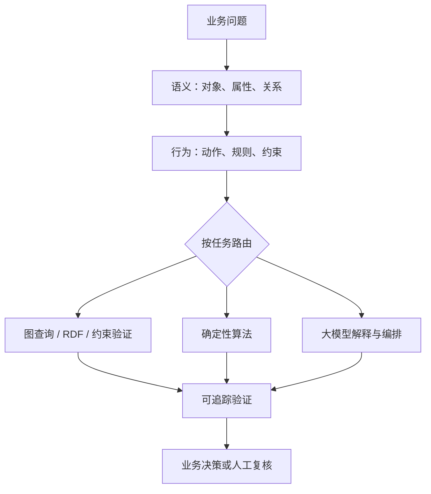

# 总结

本视频提出一种架构观点：本体不应只停在“生成 OWL、实例化三元组、装载规则、调用传统推理机”的静态流水线。讲者希望把对象、关系、行为、规则与大模型协同起来，形成可执行业务语义。

## 核心理解

视频批评的不是 OWL、RDF 或规则语言本身^[[[#^24eef5]]] ，而是只把 AI 当成文档或规则文件生成器。若后续仍完全走固定装载与推理链路，大模型并没有参与业务语义理解、任务编排或结果校验。

> [!Question] 什么是 OWL、RDF和规则语言
> **OWL、RDF 和规则语言** 都是语义网（Semantic Web）和知识表示领域中用于描述、组织和推理知识的技术。**RDF（Resource Description Framework，资源描述框架）** 是一种基础的数据表示模型，用“主语–谓语–宾语”（Subject–Predicate–Object）的三元组形式描述实体之间的关系，例如“张三–就读于–某大学”，用于构建机器可理解的知识图谱；**OWL（Web Ontology Language，本体语言）** 是在 RDF 基础上发展出的更强大的知识表示语言，用于定义概念、类别、属性以及它们之间的复杂关系，例如说明“教授是一种教师”“每个人最多拥有一个身份证”等约束，从而支持更丰富的语义推理；**规则语言（Rule Language）** 则用于定义基于知识的推理规则，通过“如果……那么……”的形式让系统能够根据已有事实推导出新的结论，例如“如果某人是教授且教授属于教师，那么该人是教师”，常见形式包括 SWRL（Semantic Web Rule Language）等。三者通常配合使用：RDF负责描述事实，OWL负责定义知识结构和语义，规则语言负责扩展推理能力。
> 

^24eef5

可把讲者的框架拆成三层：

- 语义层：对象、属性、关系与业务术语。
- 行为层：动作、规则、约束与责任边界。
- 执行层：按任务组合图查询、确定性算法与大模型推理，并用结构化验证和人工复核收口。

这是有价值的工程思考，但属于**视频的架构立场**，不能当作已证实的行业唯一标准。

## 事实边界

本次核验 6 项：**2 项 confirmed、2 项 partially_confirmed、2 项 unverified**。

- **Confirmed**：OWL 2 可用 RDF 图表达，包含类、属性和个体等核心语义元素。[W3C OWL 2 Primer](https://www.w3.org/TR/2009/REC-owl2-primer-20091027/)；[OWL 2 RDF-Based Semantics](https://www.w3.org/TR/owl2-rdf-based-semantics/)
- **Partially confirmed**：SHACL 是 RDF 图的描述/验证标准；Protégé 生态存在 SWRL 工具支持，但二者不能被无差别地称为同一种“规则文件”。[W3C SHACL](https://www.w3.org/TR/shacl/)；[Protégé SWRLTab](https://protege.stanford.edu/download/protege/3.5/docs/api/owl/edu/stanford/smi/protegex/owl/swrl/ui/tab/SWRLTab.html)
- **Confirmed**：Palantir Foundry 官方把 Ontology 区分为语义元素（objects、properties、links）和动态元素（action types、functions）。[Foundry Ontology overview](https://www.palantir.com/docs/foundry/ontology/overview)
- **Unverified**：视频称“精确算法与模糊推理融合”远优于 SWRL/SHACL，以及 Action 等同用例建模、TBox 规则可普遍免除实例层图谱构建，缺少通用 benchmark，应在具体任务中评测。

## 实践清单

用更高层的问题验收本体：业务人员能否识别对象、关系、动作和约束；规则应由图查询、算法还是模型执行；模型输出是否有权限、证据、回退与审计；大数据是否按层抽取而非一次塞入上下文。

# 辅助理解

## 辅助理解：可执行业务语义

### 1. 从静态产物到执行闭环

讲者反对的不是让 AI 生成 OWL 或规则文件，而是生成后仍让 AI 退出流程。若业务模型没有行为、约束与验证，大模型只能充当文档助手。

这张画面只锚定讲者“业务语义文档”的例子，不能作为任何技术优劣的视觉证据。

### 2. 方法框架（讲者提出，非行业唯一标准）

SHACL 的标准定位是 RDF 图的描述和验证；不能把它等同于一般推理引擎，也不能由此推导大模型必然更可靠。

### 3. 语义与行为要一起设计

静态对象—属性关系回答“有什么、如何关联”；动作和规则回答“谁能做什么、在何种条件下发生什么”。Palantir Foundry 官方确实区分 objects/properties/links 与 action types/functions；但“Action 等同于面向对象用例建模”仍是视频作者的解释。

为每个行为写下输入、前置条件、权限、确定性结果、异常处理与审计记录，再决定图查询、算法和模型各承担哪一步。

### 4. 文件输出不是验收终点

OWL 或规则文件是实现产物，真正的验收是业务语义覆盖、规则可测试、执行可追溯，以及模型输出能否被约束和复核。视频的“精确算法 + 带置信度的动态推理”可作为实验假设，应用小型 benchmark 比较正确率、延迟、成本和失败模式。

# Data

## 增强转写稿

[00:00] Hello，大家好，我是人月聊 IT。
[00:02] 最近和很多朋友关于本体论做了相当多的交流和探讨
[00:07] 就是发现很多人对于本体论实践的一些方法和思路
[00:13] 实际上是错误的
[00:15] 因为他们仍然是按照传统的本体论和实践的思路，
[00:19] 在实践本体论
[00:21] 这样的话没有充分的发挥本体模型和AI 大模型融合的一个优势
[00:27] 什么叫按着传统本体论实践的方式再做这个事很简单
[00:31] 就是在整个过程里面他有没有用AI 辅助呢当然
[00:35] 比如说他可能基于原始的业务需求
[00:38] 他通过 AI 辅助帮他生成了 OWL 的本体业务语义文档。
[00:45] AI 辅助确实用了
[00:46] 或者是帮他输出了相关的 SWRL、SHACL 规则文件。
[00:52] 他也用了
[00:54] 然后整体的推理过程是怎么样的呢
[00:57] 他仍然会是首先是拉取本体模型文件
[01:01] 然后基于 OWL 再去实例化相关的知识图谱三元组，
[01:06] 形成相关的 RDF 文件，
[01:09] 或者是这个实例直接存入到图数据库里面去，
[01:14] 然后再进一步的装载
[01:16] 类似于 SWRL 或者是 SHACL 的规则文件，
[01:21] 然后再基于本体实践中原有的推理机、推理模型去进行推理，
[01:27] 最终得出结论
[01:29] 在后面的整个模型和实例的装载推理的过程中仍然是传统方法
[01:35] 他可能是用AI 辅助工具或者是编程
[01:38] 将刚才我说到的多个步骤串联在了一起
[01:42] 大家可以想象一下
[01:43] 整个过程中AI 大模型其实没有发挥太大的作用
[01:49] 辅助 OWL 文件的生成。
[01:51] 这个没有AI 大模型能力或者是你写相关的一些工具程序也能帮你做
[01:57] 类似于整个本体建模推理的过程
[02:00] 那就更应该实现成标准的算法程序，
[02:02] 跟 AI 大模型也没有太大的关系。
[02:06] 那这个就是一种传统的本体论建模和实践的思路
[02:10] 没有充分的发挥AI 大模型的优势
[02:13] 所以在这个过程中我一直在强调
[02:15] AI 大模型有一个关键的优势
[02:17] 就是它本身的推理能力
[02:20] 而且这个推理能力它不是简单的一种动态的模糊推理
[02:26] 它是一种精确算法加模糊推理融合的一种推理。
[02:29] 融合了这么一种推理
[02:31] 这种推理远远比简单的类似于 SWRL、SHACL 这种规则推理好很多。
[02:38] 这是我说的第一个点
[02:39] 第二个点就是本体和AI 大模型结合以后
[02:42] 针对实际的业务场景的推理
[02:44] 大家也一定要注意
[02:47] 它不是说所有的推理都必须基于实例化以后的三元组，
[02:52] 这么一个知识图谱去做相关的推理或者是多跳推理。
[02:56] 很多推理它不是基于实例化知识图谱的，
[03:00] 它是基于我既定的规则逻辑算法展开的
[03:03] 这个推理也是一个重要的推理
[03:06] 而对于AI 大模型刚好可以对这两部分推理进一步的融合
[03:11] 包括我原来讲过的
[03:13] 大家有可能担心 AI 大模型装载不了这么大的实例化数据。
[03:17] 其实对于AI 大模型驱动推理的时候
[03:20] 我们仍然可以进行分层的建模
[03:23] 去做分层的抽取，减小数据量。
[03:25] 这个完全是没有任何问题的
[03:27] 这是我想说的第一个点
[03:29] 第二个点就是如果大家用过斯坦福的 Protégé 本体建模工具，
[03:32] 大家就知道斯坦福的本体建模更多的还是基于 OWL 和 OWL 2 相关的建模。
[03:39] 核心仍然是对象属性关系
[03:41] 包括附属在属性上的少量的参考完整性规则的建模
[03:46] 其实它没有太多的支持
[03:48] 我刚才说的类似于 SWRL 和 SHACL 这些规则的建模。
[03:54] 这些规则的建模你可能要去找其他的工具平台来支撑
[03:58] 这个也是我们更多的说斯坦佛的本体建模
[04:01] 更多的是偏静态的本体建模。
[04:04] 你如果参考 Palantir Foundry 的本体建模你就会发现，
[04:07] 其实 Palantir Foundry 的本体建模就包括两个部分。
[04:10] 第一个就是静态的对象行为关系的建模
[04:13] 第二个就是动态的行为规则的建模
[04:15] 在 Palantir Foundry 里面，它会把它叫做 Action Type 和 Function 的定义。
[04:20] 你需要去定义相关的 Action。
[04:22] 这个 Action 实际跟面向对象里面的用例建模相当地类似。
[04:27] 如果涉及到动态计算复杂的规则
[04:29] 你可能还要去定义 Function。
[04:31] 这样的话就补足了相关的行为规则的逻辑
[04:35] 所以 Palantir Foundry 的这套本体建模，
[04:36] 大家一定要注意
[04:38] 它其实就已经蕴含了相关的动态本体的内容。
[04:42] 任何一个本体的模型一定是包括了对象行为规则
[04:46] 为什么这样讲呢
[04:48] 因为我们是对 TBox 抽象层的建模。
[04:52] 我们没有去对实例数据这一层，
[04:55] 再去手工的去建立相关的一些关系和依赖
[05:01] 所以我们在 TBox 这一层构建的相关规则模型，
[05:06] 我们一定是希望这些规则能够泛化到我们的实例层，
[05:13] 而不需要我们手工地再去建实例层的知识图谱。
[05:16] 这个才是我们最最希望达到的一个效果
[05:19] 而这个效果的达到它的核心
[05:21] 其实就是规则和行为的建模
[05:25] 所以大家如果看 Palantir Foundry 的本体建模，
[05:28] 大家一定要注意
[05:29] 它绝对不是去参考 OWL 本身的建模工具去做它的本体建模。
[05:36] 我大概看下来，我更认为 Palantir Foundry 的本体建模，
[05:38] 核心仍然是传统的面向对象的建模
[05:43] 通过面向对象的建模构建了对象对象的关系
[05:46] 包括构建了对象的行为规则
[05:49] 静态的对象和动态的行为规则
[05:51] 它本身就应该融为一个完整的整体
[05:55] 这样构建的一个本体才是一个完整的本体
[05:58] 才能够驱动后续去做相关的预测、推理的本体。
[06:03] 而且这样构建完的一个本体，它形成的业务语义，
[06:06] 也是大模型能够充分理解和应用的业务语义。
[06:11] 包括如果大家看过我前面个人的视频文章
[06:14] 大家也会留意到
[06:16] 我为什么会去单独地增加一个 M1 到 M7 的本体建模规范，
[06:22] 里面就分了对象、行为、规则、事件、主体，
[06:25] 包括相关的约束完整性，
[06:29] 相关的一个建模
[06:30] 整套建模的核心的目的
[06:33] 不仅仅是它能够按需输出 OWL 文件，
[06:37] 或者是类似于 SHACL 规则文件。
[06:40] 更重要的是整套建模文件
[06:42] 它能够完整的覆盖我传统的业务建模
[06:46] 这个才是里面很重要的一个关键目的
[06:48] 整套建模文件既能够去推动基于知识图谱的多跳推理，
[06:54] 本身也能够支持我在后续代码程序实现以后
[06:58] 构建的精确算法相关的逻辑推理
[07:03] 精确算法的逻辑推理
[07:04] 加上动态模糊的、允许置信度的推理，
[07:08] 两者融合才是在AI 大模型时代
[07:13] 本体论实践最关键的一个内容。
[07:16] 好了，今天的简单分享就到这里。
[07:17] 希望对大家有所启发。
[07:20] 再见

## 原始转写稿

[00:00] Hello 大家好 我是任月亮 IT
[00:02] 最近和很多朋友关于本体论做了相当多的交流和探讨
[00:07] 就是发现很多人对于本体论实践的一些方法和思路
[00:13] 实际上是错误的
[00:15] 因为他们仍然是按着传统的本体建论和实践的思路
[00:19] 在实践本体论
[00:21] 这样的话没有充分的发挥本体模型和AI大模型融合的一个优势
[00:27] 什么叫按着传统本体论实践的方式再做这个事 很简单
[00:31] 就是在整个过程里面他有没有用AI辅助呢 当然
[00:35] 比如说他可能基于原始的业务需求
[00:38] 他通过AI辅助帮他生成了OWL的本体业务语义的文档
[00:45] AI辅助确实用了
[00:46] 或者是帮他输出了相关的SWRL SH-ACL的规则文件
[00:52] 他也用了
[00:54] 然后整体的推理过程是怎么样的呢
[00:57] 他仍然会是首先是拉取本体模型文件
[01:01] 然后基于OWL再去实力化相关的知识图谱筛员组
[01:06] 形成相关的RDF文件
[01:09] 或者是这个实力直接纯入到图书序库里面去
[01:14] 然后再进一步的装载
[01:16] 类似于SWRL或者是SH-ACL的规则文件
[01:21] 然后再基于本体实践中原有的推理机推理模型去进行推理
[01:27] 最终得出结论
[01:29] 在后面的整个模型和实力的装载推理的过程中仍然是传统方法
[01:35] 他可能是用AI辅助工具或者是编程
[01:38] 将刚才我说到的多个步骤串联在了一起
[01:42] 大家可以想象一下
[01:43] 整个过程中AI大模型其实没有发挥太大的作用
[01:49] 辅助OWL文件的生成
[01:51] 这个没有AI大模型能力或者是你写相关的一些工具程序也能帮你做
[01:57] 类似于整个本体建模推理的过程
[02:00] 那就更应该实现成标准的散发程序
[02:02] 更AI大模型也没有太大的关系
[02:06] 那这个就是一种传统的本体论建模和实践的思路
[02:10] 没有充分的发挥AI大模型的优势
[02:13] 所以在这个过程中我一直在强调
[02:15] AI大模型有一个关键的优势
[02:17] 就是它本身的推理能力
[02:20] 而且这个推理能力它不是简单的一种动态的模糊推理
[02:26] 它是一种精确算法加模和推理
[02:29] 融合了这么一种推理
[02:31] 这种推理远远比简单的类似于SH、SL这种规则推理好很多
[02:38] 这是我说的第一个点
[02:39] 第二个点就是本体和AI大模型结合以后
[02:42] 针对实际的业务场景的推理
[02:44] 大家也一定要注意
[02:47] 它不是说所有的推理都必须基于实力化以后的三元组
[02:52] 这么一个资源图谱去做相关的推理或者是多条推理
[02:56] 很多推理它不是基于实力化资源图谱的
[03:00] 它是基于我既定的规则逻辑算法展开的
[03:03] 这个推理也是一个重要的推理
[03:06] 而对于AI大模型刚好可以对这两部分推理进一步的融合
[03:11] 包括我原来讲过的
[03:13] 大家有可能担心AI大模型装在不了这么大的实力化的数据
[03:17] 其实对于AI大模型驱动推理的时候
[03:20] 我们仍然可以进行分层的建模
[03:23] 去做分层的萃取 减小数据量
[03:25] 这个完全是没有任何问题的
[03:27] 这是我想说的第一个点
[03:29] 第二个点就是如果大家用过斯坦佛的本体建模工具
[03:32] 大家就知道斯坦佛的本体建模更多的还是基于OWL和OWL2相关的一个建模
[03:39] 核心仍然是对象属性关系
[03:41] 包括附属在属性上的少量的参考完整性规则的建模
[03:46] 其实它没有太多的支持
[03:48] 我刚才说的类似于SWRL和SHSL这些规则的建模
[03:54] 这些规则的建模你可能要去找其他的工具平台来支撑
[03:58] 这个也是我们更多的说斯坦佛的本体建模
[04:01] 更多的是偏静态的本体建模
[04:04] 你如果参考Planetier的本体建模你就会发现
[04:07] 其实Planetier的本体建模就包括两个部分
[04:10] 第一个就是静态的对象行为关系的建模
[04:13] 第二个就是动态的行为规则的建模
[04:15] 在Planetier里面它会把它叫做action type和方形的定义
[04:20] 你需要去定义相关的action
[04:22] 这个action实际跟面向对象里面的用力建模相当的类似
[04:27] 如果涉及到动态计算复杂的规则
[04:29] 你可能还要去定义方形
[04:31] 这样的话就补足了相关的行为规则的逻辑
[04:35] 所以Planetier的这套本体建模
[04:36] 大家一定要注意
[04:38] 它其实就已经运喊了相关的动态本体的内容
[04:42] 任何一个本体的模型一定是包括了对象行为规则
[04:46] 为什么这样讲呢
[04:48] 因为我们是对TBOX抽象层的建模
[04:52] 我们没有去对实力数据这一层
[04:55] 再去手工的去建立相关的一些关系和依赖
[05:01] 所以我们在TBOX这一层构建的相关的规则模型
[05:06] 我们一定是希望这一些规则能够泛化到我们的实力层
[05:13] 而不需要我们手工的再去建实力层的知识图谱
[05:16] 这个才是我们最最希望达到的一个效果
[05:19] 而这个效果的达到它的核心
[05:21] 其实就是规则和行为的建模
[05:25] 所以大家如果看Planetier的本体建模
[05:28] 大家一定要注意
[05:29] 它绝对不是去参考OWL的本身的建模工具去做它的本体建模
[05:36] 我大概看下来我更认为Planetier的本体建模
[05:38] 核心仍然是传统的面向对象的建模
[05:43] 通过面向对象的建模构建了对象对象的关系
[05:46] 包括构建了对象的行为规则
[05:49] 静态的对象和动态的行为规则
[05:51] 它本身就应该融为一个完整的整体
[05:55] 这样构建的一个本体才是一个完整的本体
[05:58] 才能够驱动后续去做相关的预测推理的本体
[06:03] 而且这样构建完的一个本体它形成的业务语意
[06:06] 也是大模型能够充分理解和应用的业务语意
[06:11] 包括如果大家看过我前面个人的视频文章
[06:14] 大家也会留意到
[06:16] 我为什么会去单独的去增加一个M1到M7的本体建模规范
[06:22] 里面就分了对象行为规则事件主体
[06:25] 包括相关的异常完整性
[06:29] 相关的一个建模
[06:30] 整套建模的核心的目的
[06:33] 不仅仅是它能够异象输出OWL文件
[06:37] 或者是类似于SH-SL规则文件
[06:40] 更重要的是整套建模文件
[06:42] 它能够完整的覆盖我传统的业务建模
[06:46] 这个才是里面很重要的一个关键目的
[06:48] 整套建模文件既能够去推动基于支出普的多条推理
[06:54] 本身也能够支持我在后续代码程序实现以后
[06:58] 构建的精确算法相关的逻辑推理
[07:03] 精确算法的逻辑推理
[07:04] 加上动态模糊的允许致信度的推理
[07:08] 两者融合才是在AI大模型时代
[07:13] 本提论实际最关键的一个内容
[07:16] 好了 今天的简单分享就到这里
[07:17] 希望对大家有所啟发
[07:20] 再见

## 原始关键帧

### 关键帧 1

### 关键帧 2

### 关键帧 3

### 关键帧 4

### 关键帧 5

### 关键帧 6

### 关键帧 7

### 关键帧 8

### 关键帧 9

### 关键帧 10

