# 总结稿

## 核心结论

视频以一个 Unity 项目为例，主张先用目录、程序集、接口与事件总线建立明确的代码“骨架”，再让人工或 AI 在边界内扩写。作者把项目分为 Data、3C、System、Gameplay、UI 等层：底层 Framework 只提供可复用工具，不反向依赖具体玩法；模块之间优先保持单向依赖，确需反向通信时通过接口或 Event Bus 解耦。

在这一架构之上，AI Code Review 才有稳定的判断依据。作者把可读性、可维护性、性能预算、依赖边界及 Unity 项目约束整理进 `SKILL.md`，先让 AI 按规则复审，再由人深入检查业务逻辑、补测试并作最终判断。重点不是让 AI 替代人工审查，而是用显式规则缩小复审范围、提升可追踪性。

## 关键要点

- **分层先于生成**：Data → System/3C → Gameplay → UI；系统逻辑与玩法的边界可以因项目而调整，但依赖方向必须清楚。
- **依赖必须可见**：作者偏好显式构造注入，因为能沿调用链定位对象来源；服务定位器虽方便，却会隐藏依赖。
- **通信方式按语义选择**：需要读取属性或命令单一宿主时使用接口；一对多通知、跨层反馈更适合 Event Bus。
- **AI 复审规则化**：把个人和项目经验写成持续迭代的检查清单，而不是每次临时提示。
- **人保留最终责任**：AI 先筛查结构性问题，人再理解具体功能、审查边界、运行测试后决定是否提交。

## 外部核验补充

- 视频在 05:40 所说的 Unity `asmdef` 能划分程序集并约束依赖，得到 Unity 官方文档支持：[Unity Manual: Assembly definitions](https://docs.unity3d.com/2021.1/Documentation/Manual/ScriptCompilationAssemblyDefinitionFiles.html)。
- 视频在 19:28 对“每帧堆分配”的表述方向正确但过于绝对。Unity 官方建议减少每帧临时堆分配，因为累积垃圾会带来 GC 成本；具体影响仍取决于分配量、平台与运行时：[Unity Manual: Garbage collection best practices](https://docs.unity3d.com/2022.3/Documentation/Manual/performance-garbage-collection-best-practices.html)。

# 辅助理解

## 辅助理解

### 1. “骨架”不是目录美化，而是可执行的依赖政策

**视频内容：**作者把项目划为 Data、3C、System、Gameplay、UI，并让公共 Framework 处于被依赖的位置。目录表达概念边界，`asmdef` 把边界落实到程序集层；这使“谁能调用谁”不再只靠口头约定。

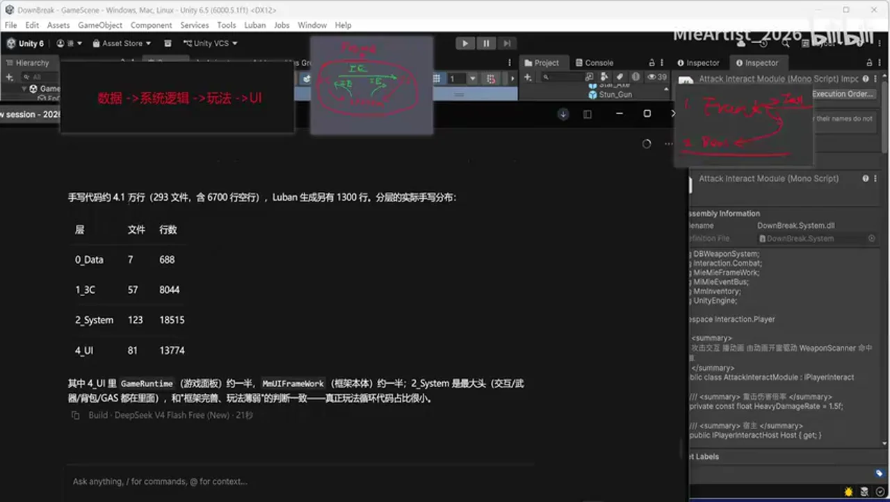

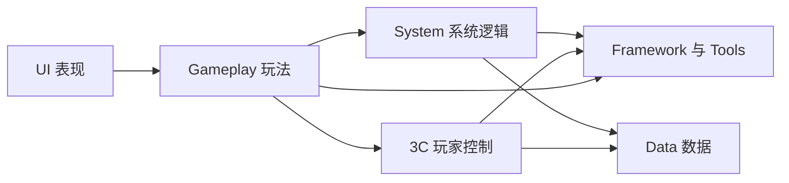

> 图用于概括视频的分层思想，不代表作者展示的每一条实际依赖。视频也明确说 System 与 Gameplay 的边界并非绝对，3C 也可以并入 System。

**AI 辅助推断：**这套做法对 AI 编码尤其重要，因为模型更擅长在局部约束内补全，而不擅长自行长期维护项目的全局边界。先固定依赖政策，相当于把“架构记忆”从人的脑中转成机器可读取、编译器可部分检查的外部约束。

### 2. 接口与事件总线解决的是不同通信问题

**视频内容：**当 System 需要玩家对象的属性或行为时，作者定义由需求方拥有的接口，再让 `PlayerController` 实现并通过构造函数注入。这样 System 不必直接依赖 3C 的具体类型。若攻击逻辑只需广播“造成伤害”，让 UI 飘字、准星反馈等多个订阅者各自响应，则通过 Event Bus 通知，发布者与订阅者互不感知。

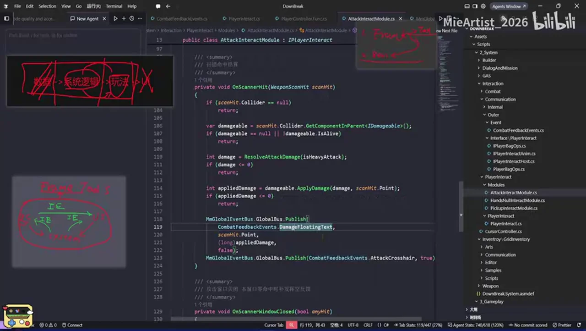

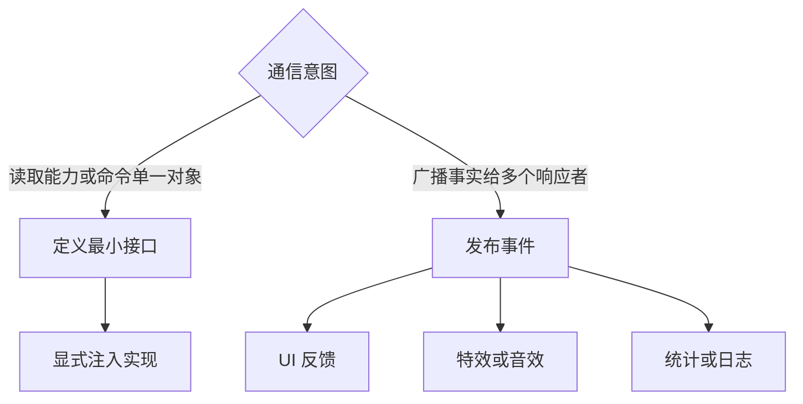

**AI 辅助推断：** 选择标准不是“接口和事件总线谁更高级”，而是依赖是否应该可导航、响应者是否可能为多个，以及发布方是否应知道处理方。显式构造注入提高可追踪性；全局服务定位虽减少参数传递，却可能把真实依赖藏进运行期查找。

### 3. AI 复审应当是“规则执行器”，不是第二个拍脑袋的人

**视频内容：** 作者在 `SKILL.md` 中沉淀可读性、可维护性、可靠性证据、架构、依赖边界、Unity 约束等检查项。AI 先按照清单定位具体风险并给出修复建议，人工随后审查业务含义、补充测试并作最终判断。

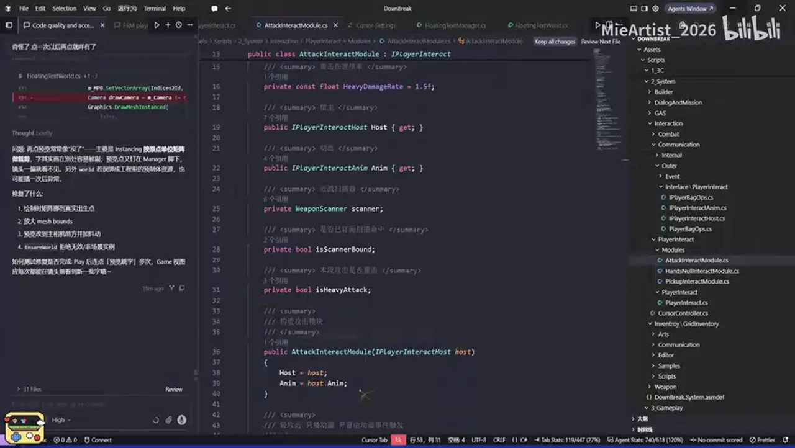

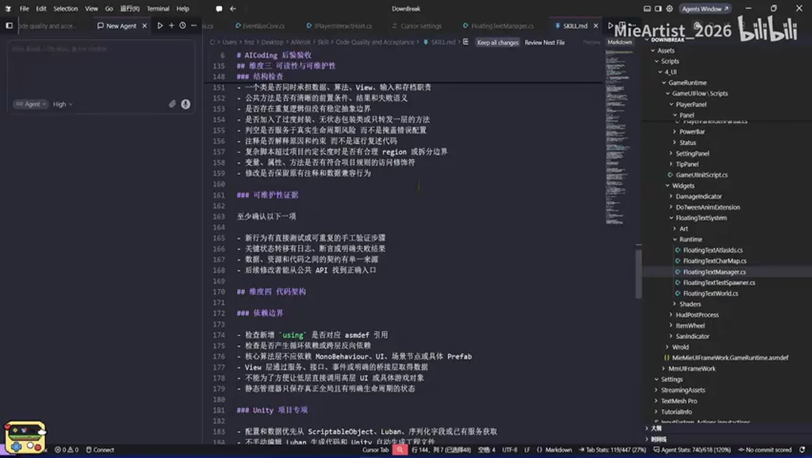

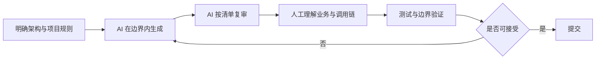

AI 复审最适合先拦截以下问题：

- 越层依赖、循环引用或绕开既定通信机制；
- 隐藏调用链、难以定位的全局访问；
- 重复初始化、防御性逻辑泛滥等项目特定坏味道；
- 缺少测试证据或未覆盖边界条件；
- Unity 热路径中的不必要分配。

### 4. 外部核验如何修正视频中的绝对表述

**外部核验补充：** Unity 官方文档确认，Assembly Definition 可把脚本组织成独立程序集，并通过显式引用控制程序集依赖：[Unity Manual: Assembly definitions](https://docs.unity3d.com/2021.1/Documentation/Manual/ScriptCompilationAssemblyDefinitionFiles.html)。这支持视频“用 `asmdef` 固化模块边界”的做法。

视频把“在每帧 `Update` 中进行堆分配”说成完全不可行。更准确的表述是：持续的每帧临时分配会累积垃圾并增加 GC 成本，应尽量减少；是否造成不可接受的性能问题取决于分配量、平台、帧预算与运行时。[Unity Manual: Garbage collection best practices](https://docs.unity3d.com/2022.3/Documentation/Manual/performance-garbage-collection-best-practices.html)

### 5. 可复用的落地清单

**AI 辅助推断：** 把视频方法迁移到其他代码库时，可以依次检查：

1. 每个目录或包负责什么，边界能否用一句话说明？
2. 依赖方向是否单向，能否由构建系统或包管理器检查？
3. 跨边界通信是查询/命令还是事件通知？
4. AI 是否得到明确的禁止项、性能预算与测试要求？
5. 复审结果是否带文件位置、风险理由和验证证据？
6. 人是否仍能沿调用链理解关键业务，并拥有最终否决权？

这形成一条核心链路：**架构先约束可写空间，规则再约束可接受输出，测试与人工判断负责最终可信度。**

# Data

## 增强转写稿

[00:00] 哈嘞好 市民呀 那么这个视频呢 我们来说的干货啊
[00:04] 那这个干货来说的话 可能 并不是那么干 是加引号的
[00:08] 因为对于有些上的年线的小伙伴来说的话 非常基础
[00:11] 那就是代码的这个骨架约束 对吧
[00:15] 无论你是股法编程办维新派 还是说外部coding
[00:18] 他都需要一定的这个约束 才能让代码写得更加的好
[00:21] 更加的清晰、可维护 对不对
[00:24] 那因此来说的话 我就总结了这么一套这个架构啊
[00:27] 首先来说 我们来说一下几年 就是你去编写一个东西
[00:31] 可能在前期学习的时候 他可能没有上这个叫做framework
[00:35] 对吧 program framework 程序框架的这么一个东西
[00:38] 但是逐渐写东西写多了 对吧
[00:40] 我之前给很多很多这个人写过他的这个币设什么
[00:44] 这种期末 这种东西啊 写多了之后呢
[00:48] 他自然就有了一套这个程序框架了
[00:50] 就你会发现很多都是复用的 对吧
[00:53] 比如说什么音频系统啊 时间总线啊 对象池啊
[00:56] 然后还有各种的这种动画的拓展啊 对吧
[00:59] 你的输入系统啊 对吧
[01:00] 像这种东西的话 我都管他叫做tool
[01:02] 当然我这里这个写的英文有点仇响啊 你们勉强看
[01:06] t-o-o-l 对吧 这个东西的话是framework 对吧
[01:10] 那我这里面呢 实际上framework 他提供的东西不止如此 对吧
[01:14] 他可能去提供一些网络上的这些常见的这种工具啊
[01:17] 然后甚至说一些这个架构上的约束
[01:19] 这就说我们今天说的这个重点
[01:21] 架构上的约束呢 我管他叫做boss 叫做谷歌
[01:25] 也可以去翻一下这个
[01:27] 就framework 我记得是有一些轻量的这种代码上的这个这个约束的
[01:33] 但是我没有继续往里边深入啊 没有继续往里边深入
[01:37] 呃 什么意思呢啊 就说有些东西约束了你只能这么写啊
[01:42] 模块和膜块之间如何沟通你只能这么写
[01:46] 模块内部之间怎么沟通你只能这么写
[01:49] 这个就叫做代码的这个骨架 代码这个约束 对吧
[01:53] 它是能让我们的这个模块之间它的这个沟通起来呢
[01:57] 既顺畅 然后又不互相耦合 又不互相循环依赖 对吧
[02:01] 那这样的话你这个代码又清晰 后续它又好拓展 对不对
[02:05] 那我们当前为什么要突然说这个东西呢
[02:08] 我可以毫不客气的说一句啊 之前我没有吹牛逼啊
[02:11] 当前的这个代码呢 超差不会超过1000毫
[02:14] 啊 当前的这个手写的代码总长不会超过1000行
[02:18] 而且呢 这才完成了我这个当前项目的20%左右
[02:22] 啊 所以说呢 它现在这个代码的这个好处
[02:28] 虽然不能去体现这个具体的项目的这个表现
[02:32] 但是呢 它也在一定程度上告诉了我们
[02:35] 这个东西它是有东西可以去进行约束了 对吧
[02:39] 有东西可以去进行填了 可以去规整了
[02:42] 不然的话 这一块那一块 这一块那一块 对吧
[02:45] 那最后的话这个项目肯定崩 好吧
[02:48] 那因此来说的话 我们这里有一个见头啊
[02:50] 就是数据层到系统逻辑层到玩法层到UI层
[02:54] 但是呢 这个系统逻辑和那个玩法呢
[02:56] 实际上它这个边界是有一点点模糊的啊
[03:00] 我们那个数据层呢 比如说我当前采用的
[03:02] 这个数据管线的是Luban 并且呢
[03:05] 自定义了一套这个 生成的这么一个逻辑吧
[03:09] 好吧 但是太自定义也不是特别自定义啊
[03:12] 反正大部分都是Luban的基础数据 我就把它砍了
[03:15] 我先不说这里 好吧 那就是系统逻辑和玩法层
[03:19] 系统逻辑的话 我之前说有这个framework
[03:22] 然后也有些写我们那个已经测好的一些这个轮子
[03:26] 当然呢 这个轮子它并不是必须的 我举个例子啊
[03:30] 就比如说我之前一直在这里
[03:32] 于一个叫做网格背包的东西 对吧
[03:35] 它的这个逻辑层呢 它是要想要可靠啊
[03:40] 是要花很长的时间去把这个事情办了 好吧
[03:43] 那因此来说的话 我们通常这个网格背包的
[03:46] 可以当做一个轮子把它单独拿出来
[03:48] 那因此呢 就可以放在系统逻辑里面
[03:51] 那具体的玩法呢
[03:52] 就说你当前这个物品呢 它长什么样
[03:54] 它这个预制体是什么 它占几格
[03:57] 然后呢 它想要去做什么样的表现
[03:59] 你把你的这个网格背包做什么背包乱动 对吧
[04:02] 像这种东西的话 就是具体的这种玩法
[04:05] 但是呢 这两个东西的话
[04:07] 它实际上是有点分不清的 是有点分不清的
[04:11] 因为你当前去定义你的这个item它的这个Wheel
[04:15] itemWheel这么一个类
[04:16] 那肯定就是要去稍微改动一下你这个系统逻辑
[04:20] 但是呢 你这个系统逻辑呢
[04:21] 又提供了基础的这个方法到玩法里面 是吧
[04:24] 好多好多的这种 像添加背包
[04:26] 然后删除物品到背包
[04:28] 然后还有这种拆解丢弃什么那些办法的事情 对吧
[04:32] 然后拖拽什么东西的话
[04:34] 这种东西的话 可能就是系统逻辑提供的多一点
[04:38] 那因此呢 这个东西我说完了
[04:40] 然后最后就是UI 就表现成了
[04:43] 它是最下层的东西
[04:44] 就是说为什么有那么多换皮小游戏
[04:46] 是因为我这个UI层如果分得好的话
[04:49] 你把UI的这种图片呀 对吧
[04:51] 你把它这种逻辑什么的 这种表现什么的
[04:53] 你全给改了 不影响你这个Ui跑
[04:57] 所以说就是为什么有那么多换皮小游戏
[04:59] 而且换得非常非常快呀
[05:00] 就因为它这个架构呢 表现的还是比较不错的 对吧
[05:04] 所以说这个UI和我们这个具体的这些逻辑
[05:06] 它不是强绑定的 好吧
[05:09] 那这些东西我就说完了
[05:10] 最后我们来看一下我具体的这种架构啊
[05:14] 实际上那个系统逻辑和这个玩法来说的话
[05:17] 我分成这样的啊 就是这个3C system game play和UI
[05:20] 对吧 这个data数据管线不错了
[05:22] 其实3C可以合到system里面
[05:24] 但是我个人认为3C比较重要啊
[05:26] 所以说我就单独拿出来了 好吧
[05:28] 那具体往里面走 我就不走了
[05:30] 你就知道大概这么一个架构
[05:31] 那下面的话是game play game play的话就玩法
[05:34] game play就玩法
[05:36] 那么我们在具体的这种代码里面
[05:38] 他们如何进行依赖的 对吧
[05:40] 我在之前的一个视频里边说过
[05:41] 使用asmdef 对吧 程序集定义
[05:44] 但是那个程序集定义的话
[05:46] 你如果过早的去定义的话
[05:48] 那么写代码的时候
[05:49] 可能有些东西的话是要去额外考虑
[05:52] 但是现在不一样了啊
[05:54] 我可以去考虑这个事情啊
[05:55] 代码规模上来了
[05:56] 我就看这个图啊
[05:57] 我当前不是有3C system UI吗 对吧
[06:00] 这个3C可以分到system的
[06:02] 我之前也说了
[06:03] 但是我们把它拿出来
[06:04] 那它当前的这个架构呢 变成这样子了
[06:06] 我们所有的这些东西呢 就是依赖于这个framework
[06:11] 就说这个箭头指向谁
[06:12] 谁就是被调用者
[06:13] 我们这个framework 它是被调用者
[06:15] 那因此呢 它里面的这些tool的方法呢
[06:17] 就可以被我们这个各个模块去调用
[06:20] 那反过来 它这样子去调用吗
[06:22] 不调用了 不调用了
[06:23] 我们这个tool呢
[06:23] 它是不调用我们具体的这种玩法的
[06:26] 那因此呢 这个逻辑是单向的
[06:27] 也是比较正常的
[06:28] 那甚至我们这个具体模块之间
[06:30] 你看比如说3C去调用 对吧
[06:32] 3C这个箭头指向system
[06:34] 那也就是说它要去调用system的这个具体的对象
[06:39] 这个对象呢 就被我们这个3C去管理了
[06:41] 给3C的耦合 耦合在一起了
[06:44] 是这么一个事情吧 对吧
[06:45] 那反过来呢 我这个system可能是需要去
[06:48] 使用到3C的一些这个提供的属性的
[06:52] 对吧 我举个例子啊
[06:53] 我当前呢 把那个interactor
[06:56] 这个system单独给它分出来了
[06:58] 有一个叫做playerinteractor 对吧
[07:01] 它就是我们这个玩家的交互系统
[07:05] 是我们这个玩家的交互系统
[07:07] 那因此来说的话
[07:08] 我们这个交互系统呢
[07:09] 可能在交互的时候呢
[07:10] 去播放玩家的这些动画 对吧
[07:13] 然后需要去拿到玩家的这个骨骼上的左右手
[07:15] 或者是说呢 判断一下
[07:17] 我们当前玩家使用的这个模组
[07:19] 武器模组是谁 对吧
[07:22] 是使用的武器模组是谁
[07:23] 那因此来说的话
[07:24] 它就需要用到3C的一些数据 对不对
[07:29] 那这个时候呢
[07:29] 你可以看到我们当前这个3C已经
[07:31] 是拿到system这个对象了
[07:34] 那反过来的话
[07:35] 我们这个system再拿3C的这个对象呢
[07:37] 就不合适了 对吧
[07:39] 程序级呢
[07:40] 我们在物理上已经把它俩隔离了
[07:42] 那因此来说的话
[07:43] 程序级就是不允许它俩互相依赖
[07:47] 对吧 不能去循环引用了
[07:48] 那因此来说的话
[07:49] 就使用这个观察者模式的这个interface
[07:53] 或者是说什么东西呢
[07:54] 就是这个Event Bus
[07:57] 就是事件总线或者是说这个事件的
[08:01] 事件中心也可以
[08:02] 或者是说你使用其他的这种东西也可以
[08:05] 反正就是绿色的箭头呢
[08:07] 就说明它反向去使用的时候呢
[08:09] 需要通过这么一个这个中间层
[08:13] 来进行这个调用
[08:15] 对吧 来进行调用
[08:17] 反正就这么一个事嘛 对吧
[08:18] 说严禁于此
[08:20] 这个东西就变得很清晰 对不对
[08:23] 那举一个具体例子
[08:24] 我们可以上这个代码里面看
[08:27] 什么时候使用我们的这个系统
[08:30] 什么时候使用我们的这个接口呢 对吧
[08:33] 我这里呢在
[08:35] 实际上在文件夹就已经定好了
[08:37] 我们每一个这个系统里面
[08:38] 一个小模块有一个communication
[08:42] 对吧 有一个communication
[08:44] 它有一个internal和一个outer
[08:46] internal的话就说明
[08:48] 我们需要在系统层面
[08:49] 就这个大系统层面
[08:51] 它不一定有很多小系统吗
[08:52] 在小系统之间进行沟通
[08:55] 就是internal的
[08:57] internal的话
[08:58] 它也是使用这个接口
[08:59] 或者是说使用它的这个事件中心
[09:02] 事件总线 对吧
[09:04] 但是对于这个outer
[09:05] 我们这里呢
[09:06] 直接找出来一个具体的例子来看就可以了
[09:08] 我这里有一个叫做IPlayerInteractorHost
[09:11] 对吧
[09:12] 它是一个这个玩家的交付宿主 对吧
[09:15] 我们需要玩家的什么东西
[09:16] 我就放在这里面
[09:19] 那我们现在呢
[09:20] 去找一下它这个调用量 对吧
[09:22] 它肯定是要在PlayerController里边进行这个继承
[09:25] 并且去实现它里边的这些具体的
[09:28] 这种属性的方法什么的 对吧
[09:31] 所以PlayerController需要去继承它
[09:34] 那它在哪里去被注入的 对吧
[09:36] 我们这个东西
[09:38] 它在哪里去承接它的这个对象呢
[09:41] 因为接口一般是承接对象的
[09:42] 我就往下找 对吧
[09:44] 往下找
[09:45] attacthost
[09:47] 这些东西还都是自身的 对吧
[09:48] 在这里 对吧
[09:50] 我们在这里声明了它这个iPlayerInteractorhost
[09:54] 对吧
[09:55] 然后呢
[09:55] 我再通过我们的这个inter
[09:59] 这个PlayerInteractor这个core
[10:01] 它当前的这个系统的构杂函数
[10:04] 让我们的这个flacontroller去注入就可以
[10:07] 对吧
[10:07] 因为PlayerController它去继承了我们这个IPlayerInteractorHost
[10:11] 那这样的话我们去new当前的这个
[10:14] 系统的时候呢
[10:14] 把这个z色注入进去 对吧
[10:16] 并且呢
[10:17] 我这个PlayerController它里边已经实现了
[10:19] 这个interhost的这些这个矚径方法
[10:22] 对吧
[10:22] 直接拿这个设计器具纸就完成了
[10:25] 那因此来之的话
[10:26] 它们之间就完成了沟通了 对吧
[10:28] 这些你已经看到了
[10:29] 我们这个PlayerController
[10:31] 它是使用到了我们这个PlayerController
[10:33] 这么一个这个对象的
[10:35] 但是反过来没有
[10:36] 反过来呢
[10:37] 它是于通过这个接口呢
[10:38] 作为中间层来购造
[10:39] 来注入的 对吧
[10:41] 当然呢
[10:42] 这里呢
[10:43] 就设计到一个小东西了
[10:44] 就说你这样子做是可以的
[10:47] 你写一个接口做是可以的
[10:49] 那有没有更上层的这种封装呢
[10:51] 有没有更上层的封装
[10:53] 类似于我们的这个事件总线啊 对吧
[10:55] 实验中心这个东西是有的
[10:57] 那个东西叫做什么呢
[10:58] 叫做di
[11:00] 叫做依赖倒置
[11:02] 那要来绕切的话
[11:03] 我们就又绕回了几个月前发发发的一些视频了
[11:07] 对吧
[11:08] 那这种东西的话
[11:09] 你在网上使的话
[11:09] 就使用这个Zenject
[11:11] 或者是说其他的这种DI 容器什么的
[11:13] 那这个东西的话可就大了
[11:16] 对吧
[11:16] 那因此来说的话
[11:18] 我们一般来说也并不希望
[11:21] 也并不希望使用这个东西
[11:25] 它又在难 对吧
[11:26] 那还有一种解决方案呢
[11:28] 是什么东西呢
[11:28] 就是类似于我们的那个服务器
[11:30] 就是反模式的那个服务定位器
[11:34] 对吧
[11:34] 我们拿一个这个字典
[11:38] 字典 对吧
[11:39] 然后的话
[11:40] 我们去收集它的这个key和value
[11:42] key的话
[11:42] 就是它的这个 type
[11:44] value的话就是那个object
[11:45] 到时候我们去把它cast 成对应的这个接口
[11:48] 那使的话是可以的
[11:49] 你就把它所有的这种接口
[11:51] 都需要去给它注意到这个字典里面
[11:53] 然后我们需要的时候都从字典里面拿
[11:56] 那我们就不用这样去注入了
[11:58] 对吧
[11:59] 但是这一步是必须的
[12:02] 但是我们需要的时候
[12:03] 就不需要通过这个构造函数
[12:06] 我们可以拿到当前的这个z
[12:08] 就是player-control的这个对象
[12:11] 然后我们这里就不需要通过这个构造函数
[12:13] 而是通过什么东西呢
[12:14] 就从那个通过那个接口去
[12:16] 快盖掉 获取到这个对象
[12:18] 但是那样做有个不好的地方
[12:19] 就是你找不到它的这个调用链
[12:22] 对吧
[12:23] 你是找不到它的这个调用链的
[12:24] 各位去试一下就知道了
[12:25] 就知道我说的是什么意思了
[12:27] 好吧
[12:28] 那么这里的这个构造函数
[12:29] 你可以直接去找到它当前是谁
[12:32] 掉了的
[12:33] 对吧
[12:34] 这样非常非常清晰
[12:35] 对吧
[12:35] 但是它的坏处也是有的
[12:37] 因为你这里写了一个这个intelrack的
[12:39] 可能过了几天你忘了
[12:41] 对吧
[12:41] 贵天忘了之后呢
[12:42] 你又写一个intelrack的
[12:43] 那因此来说的话这个东西
[12:44] 它就是有好有坏了
[12:46] 对吧
[12:47] 那什么时候去使用我们的这个接口呢
[12:49] 什么时候去使用它呢
[12:51] 就是传递说白了
[12:52] 如果你在具体的工程里面
[12:54] 它就是传递一些这个属性啊
[12:56] 传递一些这个
[12:58] 这个方法呀对吧
[12:59] 然后你需要去命令对方的时候
[13:02] 对吧
[13:03] 就说我们这个接口呢
[13:04] 它是谁需要谁发布
[13:07] 对吧
[13:07] 然后呢
[13:08] 谁拿到谁订阅
[13:10] 订阅之后呢
[13:10] 它就去实现里面这个方法
[13:12] 对吧
[13:13] 是这样的吧
[13:13] 我们这里边跳一下
[13:15] 跳一下来到这个它继承的这个地方
[13:17] 你看
[13:18] 它需要去命令我们这个flare controller
[13:20] 去做一些事情的
[13:22] 对不对
[13:23] 那这些东西的话
[13:23] 你如果是通过这个
[13:26] 事件总线的话是可以实现的
[13:27] 但是呢
[13:28] 这个东西你没发实现
[13:30] 这个东西是不太好实现的
[13:32] 你会涉及到一大堆
[13:34] 一长串的这么一个这个
[13:35] 英文堂
[13:36] 当然呢
[13:36] 也是可以用的啊
[13:38] 当然呢
[13:38] 它有两个不是这个
[13:40] 就说谁好谁坏啊
[13:42] 就说你可以只用这一个
[13:44] 也可以只用另外一个
[13:46] 但是呢
[13:46] 这样做的话
[13:47] 就是这个接口呢
[13:48] 可能在这个场景下使用的还比较合适
[13:51] 对吧
[13:51] 那这是interface
[13:52] 还有一个东西叫Event Bus
[13:54] 对吧
[13:55] Event Bus的话
[13:55] 实际上我们在这个文件夹里边
[13:57] 也是能看到的啊
[13:58] 我来找一下啊
[13:59] 这里有一个event
[14:00] 对吧
[14:01] event的话
[14:01] 这里帮我们就去给它设置了
[14:03] 一些这个event key
[14:05] 对吧
[14:05] 我这里呢
[14:06] 这个情况是非常清晰的
[14:07] communication对吧
[14:08] internal
[14:09] internal
[14:09] 对吧
[14:10] 然后是out
[14:10] out的话internal它是有event和interface的
[14:14] out的话
[14:15] 它也是有event和interface的
[14:17] 对吧
[14:18] 你就可以知道它当前这个子模块
[14:20] 它到底是谁在去使用
[14:23] 而且使用的是什么样的这种方式
[14:25] 好吧
[14:26] 不只是interaction啊
[14:27] 就是js
[14:29] 对吧
[14:29] js dialog and mission
[14:31] 对吧
[14:32] 还有这种builder system
[14:33] 它都有自己的这么一个communication啊
[14:35] 这是我自己进的这个软件
[14:38] 对吧
[14:38] 这样的话我不知道好不好啊
[14:40] 可能有缺点
[14:41] 但是对于我现在来说的话
[14:43] 是够用的
[14:43] 我清楚的知道它在做什么就可以了
[14:46] 好吧
[14:47] 那这里的话
[14:47] 就是我们的这个具体的event key
[14:51] event key
[14:53] 你可以看到了
[14:53] 我把我之前的event center
[14:56] 去改成一个更高级的
[14:57] 就是它可以去追踪
[15:00] 追踪它的这种静态key
[15:02] 就说vkey
[15:03] 然后的话
[15:04] 也可以去自动的去释放掉
[15:07] 它这个总线
[15:08] 并且还顺势了这个全局和局部总线
[15:11] 回头我们把这个事情再说一说
[15:13] 那当起来的话
[15:14] 你就知道我这个东西的话
[15:15] 它是一个key
[15:17] 并且是一个结构体
[15:18] 对吧
[15:18] 我们就f2进来看
[15:20] 它是一个结构体
[15:22] 那因此来说的话
[15:22] 到时候我们这个字典
[15:23] 就是核心的那个event bus的字典
[15:26] 那它的key就是这个东西了
[15:28] 那value是什么东西呢
[15:30] 来 我往上走
[15:33] 这里边
[15:35] 这里的话 它是一个combined feed什么event
[15:39] 不是它吧
[15:40] 我们往下找
[15:42] 找到它的话在这了
[15:44] 这个global invent bus
[15:46] 不 全局的这么一个事件总线
[15:49] 全局事件总线的话
[15:50] 它是需要去声明一个
[15:52] 这个事件总线的这么一个对象的
[15:55] 对吧
[15:55] 这里呢
[15:56] 它是一个静态的这么一个实例
[15:58] 来 我们这里继续往上走
[16:00] 它是我之前去在这个package
[16:02] 就是我把它做成一个纯 C# code了
[16:05] 对吧
[16:05] 那它的这个 这里
[16:08] 对吧 这里 这里是它的key
[16:10] 那这个delegate就是具体的这种委托函数
[16:13] 我们就可以装它的这个回调
[16:16] 对吧 可以装它回调了
[16:18] 然后这里的这种自动回
[16:20] 自动的回调
[16:22] 对 自动释放的
[16:23] 这是IDisposable
[16:25] 对吧 这种东西的话
[16:26] 我后续再说了 好吧
[16:27] 后续再说了
[16:28] 我们一下子不小心说完
[16:30] 那么我就针对当前的key呢
[16:32] 来看一下它的发布和订阅好 好吧
[16:35] 那么这里是给它订阅它的key了
[16:37] 那么在哪里去进行发布呢
[16:41] 对吧 在哪里进行发布呢
[16:42] 就是AttackModel
[16:45] 对吧
[16:45] 就是我们这个玩家的交互
[16:47] 他去攻击的时候
[16:48] 去把这个事情发布了一下
[16:51] 对吧
[16:51] 把这个事情发布了一下
[16:53] 那谁去订阅呢
[16:54] 对吧
[16:54] 我们当前的key
[16:56] 它需要去有一个diamond flow test的
[16:59] 意思是什么东西呢
[17:00] 就是伤害数字
[17:02] 那肯定是说我们的这个攻击设计
[17:05] 去进行了伤害数字的发布
[17:07] 那谁去响应它呢
[17:09] 对吧 谁去响应呢
[17:10] 那肯定是我们这个调子的系统了
[17:12] 对吧
[17:13] 我找一下在这里吧
[17:15] 调子的系统我们进行了这个订阅
[17:18] 而且它订阅这个函数的
[17:19] 我们已经写好了在这里
[17:22] 对吧 在这里
[17:23] 那因此来说的话
[17:24] 这样这本一个结我的方式的话
[17:26] 就相当于是说把我们这个
[17:27] 3C和这个UI之间的这个这一层说完了
[17:30] 不小心就说完了 对吧
[17:32] 我们当前的这个3C
[17:34] 它完全不知道有UI的存在
[17:37] UI也完全不知道有3C的存在
[17:39] 这是我们很正常的这么一种架构
[17:42] 对不对
[17:43] 那因此来说的话
[17:44] 我们就通过这个Event Bus
[17:45] 来进行这么一个处理 对吧
[17:47] 我3C这边我想要什么东西
[17:48] 我就发布 对吧
[17:49] 记住啊
[17:50] 就是Interface也好
[17:51] Event Bus也好
[17:52] 就说你想要什么东西
[17:53] 那接口就留在哪一侧
[17:55] 那发布者就是谁
[17:57] 对吧
[17:57] 那谁去订阅呢
[17:58] 他订阅的话
[17:59] 一般是分为多个的这个人
[18:01] 对吧
[18:01] 比如说你这里的一个调子系统
[18:03] 可以用到他
[18:03] 你别的系统也可以用到他
[18:05] 那因此来说的话
[18:06] 这个订阅的地方
[18:07] 它可能就是具体的这种实现
[18:11] 对吧
[18:11] 具体的这种实现
[18:12] 那因此来说的话
[18:13] 他们两个就进行结合了
[18:15] 对吧
[18:15] 就现在说有个中间商吧 对吧
[18:17] 那这种东西的话
[18:18] 实际上说简单也不
[18:19] 说简单也简单 说难也不难
[18:21] 那这种东西我就说完了
[18:23] 当前的这个架构是非常非常清晰的
[18:26] 好吧
[18:26] 那还有一点呢
[18:27] 我们把这个代码的这个boss
[18:29] 给他约束完之后呢
[18:31] 就进行这个coding 对吧
[18:32] 你不论是这个
[18:34] 之前所说的那个股发片程
[18:35] 还是说半微信还是说这个外部coding
[18:38] 那我们最后呢
[18:39] 需要去人工审核一点
[18:40] 就是code review
[18:42] 但是在那之前呢
[18:43] 我们可以使用一套这个规范的结构呢
[18:45] 来进行什么东西
[18:46] 就是来进行AI的code review
[18:50] 对吧
[18:50] 这个东西的话
[18:51] 实际上在很早的时候就有了
[18:53] 但是我那会一直没使啊
[18:55] 可能是受到什么东西的影响啊
[18:57] 我这里呢单独的拉出来一个signal
[19:01] 这个signal呢
[19:01] 我就这里边写了这么几个这个
[19:03] AI的code review呢
[19:05] 这么一个
[19:07] 这些约束版 好吧
[19:08] 规范 好吧
[19:09] 我们这里来说的话
[19:10] 就是定边版与网发制服
[19:13] 这这种东西呢
[19:14] 是非常非常常见的
[19:15] 比如说你写一个cost的
[19:17] 对吧
[19:17] 你落在这里了
[19:18] 后续的话
[19:19] 你明明找不到了
[19:20] 你没法去改
[19:21] 这种东西 对吧
[19:22] 那另外说来说的话
[19:23] 就是这个性能预算
[19:26] 这种东西的话是众中之中
[19:27] 对吧
[19:28] 你每帧都在 Update
[19:29] 去 new 一个堆
[19:30] 堆内存之中的这么一个结构来说的话
[19:33] 完全不可行
[19:34] 千万不能这么做
[19:36] 实在不行
[19:36] 实在不行
[19:37] 你可以在墙里面有这么一处
[19:40] 哪怕一处已经够用了
[19:41] 你可以在update里面
[19:42] 你去扭它的这个结构体
[19:44] 对吧
[19:44] 因为它每一帧的话
[19:45] 就是从栈内去
[19:47] 就战针嘛
[19:48] 对吧
[19:48] 你破不出进去了
[19:49] 破不出来了
[19:50] 它就没了
[19:50] 对吧
[19:51] 千万不要再堆内存去做这种事情
[19:53] 但这种东西的话比较简单
[19:54] 我就不继续往上说了
[19:56] 那么就是这里
[19:57] 微动酸是可读性和与可维护性
[20:00] 这个东西比较笼统
[20:01] 这个东西比较笼统
[20:02] 这里我就规范了
[20:03] 这么几个具体的这种东西
[20:06] 当然它是对于我自己的这么一个爱好
[20:08] 我特别特别不喜欢
[20:10] 这个AI去写什么这个N-shor
[20:12] 对吧
[20:13] 你看这里
[20:13] 什么N-shor
[20:14] refresh
[20:15] 然后rebuilding
[20:16] 就特别不喜欢
[20:17] 它把一个这个
[20:19] 出手画的这个函数来进行反覆子调用
[20:21] 对吧
[20:22] 你具体调了
[20:22] 之后呢
[20:23] 它需要去签检查一遍
[20:25] 这个东西到底有没有
[20:26] 当然这个东西的话
[20:27] 你当做边界检查是可以的
[20:29] 但是呢
[20:29] 它就是每一个
[20:31] 还说他都喜欢这么做
[20:32] 我个人是非常不喜欢的
[20:34] 当然呢
[20:35] 可能有些人他的这个想法的跟我想法
[20:37] 这个东西的话我就不细说了
[20:39] 我个人的这个项目呢
[20:40] 我就喜欢这么做
[20:42] 并且呢
[20:42] 我在运行之后
[20:43] 他没有问题就可以了
[20:45] 对吧
[20:45] 我进行安全测试
[20:46] 或者说进行这个压力测试之后
[20:48] 没有问题就可以了
[20:49] 好吧
[20:49] 我保证他能直接去
[20:52] 在出示化的时候呢
[20:53] 或许就可以了
[20:54] 可可或许吗
[20:54] 对吧
[20:55] 只但不信就懒家宰吗
[20:56] 对吧
[20:56] 你千万不要这样子啊
[20:57] 千万不要这样
[20:58] 那么
[20:59] 嗯
[20:59] 最后的话就是依赖边界
[21:02] 对吧
[21:02] 依赖边界就不要产生循环依赖啊
[21:04] 对吧
[21:05] 你的这个logical层和这个mail层
[21:07] 你不要去互相指导
[21:09] 对吧
[21:09] 你需要通过这么一个这个
[21:10] Event Bus
[21:11] 你去做中间层
[21:12] 对吧
[21:13] 是这样子的
[21:14] 当然这些东西呢
[21:15] 它是比较笼统
[21:16] 然后呢
[21:16] 有很多东西也是
[21:17] 嗯
[21:18] 符合我个人的这么一个开发的
[21:20] 那公司来说的话或者说一个项目来说的话
[21:23] 它肯定是要有一套非常详细的
[21:26] 这么一个文档来去约束这些东西的
[21:28] 我这里呢
[21:28] 只是在晚上找了一些
[21:30] 或者说我自己加了一些
[21:32] 自己加了一些这个
[21:34] 对吧
[21:35] 自己加了一些这么一个约束啊
[21:37] 然后的话
[21:38] 我记得github上
[21:40] 行星特别多的一个这个大神啊
[21:42] 在好多个月之前
[21:43] 他就发布了发了四句话
[21:45] 然后后来有很多人去给他点星星啊
[21:48] 然后的话啊发现那个四句话呢
[21:51] 可能不是特别合适
[21:53] 在某些情况啊
[21:54] 就是ai会一直会发布问你需求
[21:56] 问这个东西
[21:57] 他的这个编辑什么东西的话
[21:58] 他后来的话又发了一个新的这么一个东西
[22:01] 我忘了啊
[22:02] 我忘了他具体是怎么做的
[22:03] 但是呢
[22:04] 我这个东西的话肯定是在不断迭代的
[22:07] 好吧
[22:08] 这个就简单来说
[22:09] 那么ai去
[22:11] Review 一下之后呢
[22:12] 我们这个人工就开始了
[22:14] 对吧
[22:15] 人工开始的话
[22:15] 那这个事情的话
[22:17] 符合你的这个文档来说的话
[22:20] review起来是很快的
[22:21] 你具体想找一个什么东西
[22:22] 那你就往里面深入
[22:23] 对了
[22:25] 是吧
[22:25] 具体想找一个什么东西
[22:27] 比如说我想我想看一下
[22:28] 我当前的这个UI的这个背包啊
[22:32] 他到底是要有什么这个功能
[22:34] 你可以看他这里吧
[22:35] 这个paras
[22:36] 对吧
[22:37] 然后的话这个UI层的话
[22:39] 他具体的这些子功能是什么东西啊
[22:41] 比如说这个ddi啊对吧
[22:43] 比如说他当前的这个
[22:45] 嗯这里没写啊
[22:46] 那那是他的这个丢弃区啊
[22:49] 对吧
[22:50] 像这些东西的话
[22:51] 他到底是怎么样的这么一个逻辑啊
[22:53] 对吧
[22:53] 那你会往这里不走了
[22:55] 那这就靠这个部分的话
[22:57] 就考验到我们这个程序的话
[22:58] 具体的这种你有理解能力了
[23:01] 对吧
[23:01] 因为外部的规范已经规范差不多了
[23:03] 然后这里把你就进行这个
[23:05] 大家看一看
[23:05] 然后你挑挑错了对吧
[23:06] 然后呢多进行这个
[23:08] 几套
[23:09] 你让ai去头给你写一个这个测试
[23:11] 就是Test嘛对吧
[23:12] 那个东西叫什么东西来着
[23:14] 我记得是Unity提供了这么一个这个
[23:17] 叫做Test
[23:21] 我找一下啊
[23:22] 他这里边应该是有的
[23:24] 哎没有吗
[23:25] 我记得是有是有那个Test的
[23:27] 这个函数我记得是在运气里边
[23:28] 他是提供了啊
[23:30] 嗯
[23:31] 样历测试
[23:33] 没事没事
[23:33] 我后面再找好了
[23:34] 后面再找就好了
[23:38] Test
[23:39] 我说的是Test的还是Test啊
[23:41] 我炒
[23:42] 我看一下
[23:44] 啊没问题啊
[23:45] 好那么这个事情的话
[23:46] 后边问一下ai他到底在哪就可以了啊
[23:48] 这种东西的话
[23:49] 你让他多过几个样历测试
[23:51] 然后最后再去这个
[23:53] 把安全边界定义好了之后呢
[23:55] 再去对吧提交就可以了
[23:57] 对吧
[23:58] 我估计啊我估计是这样的啊
[24:00] 但是具体的这种这个
[24:02] 嗯
[24:03] 项目之中的这个流程呢
[24:05] 还是要看公司的好吧
[24:06] 那其实严谨与此啊
[24:07] 说了也是非常非常多的东西啊
[24:09] 我们这个视频就可以到此结束了
[24:11] 我们下个视频再见

## 原始转写稿

[00:00] 哈嘞好 市民呀 那么这个视频呢 我们来说的干货啊
[00:04] 那这个干货来说的话 可能 并不是那么干 是加引号的
[00:08] 因为对于有些上的年线的小伙伴来说的话 非常基础
[00:11] 那就是代码的这个股价约束 对吧
[00:15] 无论你是股法编程办维新派 还是说外部coding
[00:18] 他都需要一定的这个约束 才能让代码写得更加的好
[00:21] 更加的清洗可维护 对不对
[00:24] 那因此来说的话 我就总结了这么一套这个架构啊
[00:27] 首先来说 我们来说一下几年 就是你去编写一个东西
[00:31] 可能在前期学习的时候 他可能没有上这个叫做farmwork
[00:35] 对吧 program farmwork 程序框架的这么一个东西
[00:38] 但是逐渐写东西写多了 对吧
[00:40] 我之前给很多很多这个人写过他的这个币设什么
[00:44] 这种期末 这种东西啊 写多了之后呢
[00:48] 他自然就有了一套这个程序框架了
[00:50] 就你会发现很多都是附用的 对吧
[00:53] 比如说什么音频系统啊 时间总线啊 对象池啊
[00:56] 然后还有各种的这种动画的拓展啊 对吧
[00:59] 你的输入系统啊 对吧
[01:00] 像这种东西的话 我都管他叫做tour
[01:02] 当然我这里这个写的英文有点仇响啊 你们勉强看
[01:06] t-o-o-l 对吧 这个东西的话是farmwork 对吧
[01:10] 那我这里面呢 实际上farmwork 他提供的东西不止如此 对吧
[01:14] 他可能去提供一些网络上的这些常见的这种工具啊
[01:17] 然后甚至说一些这个架构上的约束
[01:19] 这就说我们今天说的这个重点
[01:21] 架构上的约束呢 我管他叫做boss 叫做谷歌
[01:25] 也可以去翻一下这个
[01:27] 就farmwork 我记得是有一些轻量的这种代码上的这个这个约束的
[01:33] 但是我没有继续往里边深入啊 没有继续往里边深入
[01:37] 呃 什么意思呢啊 就说有些东西约束了你只能这么写啊
[01:42] 毛块和膜块之间如何沟通你只能这么写
[01:46] 毛块内部之间怎么沟通你只能这么写
[01:49] 这个就叫做代码的这个股价 代码这个约束 对吧
[01:53] 它是能让我们的这个毛块之间它的这个沟通起来呢
[01:57] 既顺畅 然后又不互相吼和 又不互相循环依赖 对吧
[02:01] 那这样的话你这个代码又清洗 后续它又好拓展 对不对
[02:05] 那我们当前为什么要突然说这个东西呢
[02:08] 我可以毫不客气的说一句啊 之前我没有吹牛逼啊
[02:11] 当前的这个代码呢 超差不会超过1000毫
[02:14] 啊 当前的这个手写的代码超差不会超过1000毫
[02:18] 而且呢 这才完成了我这个当前项目的20%左右
[02:22] 啊 所以说呢 它现在这个代码的这个好处
[02:28] 虽然不能去体现这个具体的项目的这个表现
[02:32] 但是呢 它也在一定程度上告诉了我们
[02:35] 这个东西它是有东西可以去进行约束了 对吧
[02:39] 有东西可以去进行填了 可以去规整了
[02:42] 不然的话 这一块那一块 这一块那一块 对吧
[02:45] 那最后的话这个项目肯定崩 好吧
[02:48] 那因此来说的话 我们这里有一个见头啊
[02:50] 就是数据层到系统逻辑层到玩法层到UI层
[02:54] 但是呢 这个系统逻辑和那个玩法呢
[02:56] 实际上它这个边界是有一点点模糊的啊
[03:00] 我们那个数据层呢 比如说我当前采用的
[03:02] 这个数据管线的是卢班 并且呢
[03:05] 自定义了一套这个 生成的这么一个逻辑吧
[03:09] 好吧 但是太自定义也不是特别自定义啊
[03:12] 反正大部分都是卢班的基础数据 我就把它砍了
[03:15] 我先不说这里 好吧 那就是系统逻辑和玩法层
[03:19] 系统逻辑的话 我之前说有这个farmwork
[03:22] 然后也有些写我们那个已经测好的一些这个轮子
[03:26] 当然呢 这个轮子它并不是必须的 我举个例子啊
[03:30] 就比如说我之前一直在这里
[03:32] 于一个叫做网格背包的东西 对吧
[03:35] 它的这个逻辑层呢 它是要想要可靠啊
[03:40] 是要花很长的时间去把这个事情办了 好吧
[03:43] 那因此来说的话 我们通常这个网格背包的
[03:46] 可以当做一个轮子把它单独拿出来
[03:48] 那因此呢 就可以放在系统逻辑里面
[03:51] 那具体的玩法呢
[03:52] 就说你当前这个物品呢 它长什么样
[03:54] 它这个预知体是什么 它占几格
[03:57] 然后呢 它想要去做什么样的表现
[03:59] 你把你的这个网格背包做什么背包乱动 对吧
[04:02] 像这种东西的话 就是具体的这种玩法
[04:05] 但是呢 这两个东西的话
[04:07] 它实际上是有点分不清的 是有点分不清的
[04:11] 因为你当前去定义你的这个item它的这个Wheel
[04:15] itemWheel这么一个类
[04:16] 那肯定就是要去稍微改动一下你这个系统逻辑
[04:20] 但是呢 你这个系统逻辑呢
[04:21] 又提供了基础的这个方法到玩法里面 是吧
[04:24] 好多好多的这种 像添加背包
[04:26] 然后删除物品到背包
[04:28] 然后还有这种拆解丢弃什么那些办法的事情 对吧
[04:32] 然后拖债什么东西的话
[04:34] 这种东西的话 可能就是系统逻辑提供的多一点
[04:38] 那因此呢 这个东西我说完了
[04:40] 然后最后就是UI 就表现成了
[04:43] 它是最下层的东西
[04:44] 就是说为什么有那么多换皮小一些
[04:46] 是因为我这个UI层如果分得好的话
[04:49] 你把UI的这种图片呀 对吧
[04:51] 你把它这种逻辑什么的 这种表现什么的
[04:53] 你全给改了 不影响你这个Ui跑
[04:57] 所以说就是为什么有那么多换皮小一些
[04:59] 而且换得非常非常快呀
[05:00] 就因为它这个架构呢 表现的还是比较不错的 对吧
[05:04] 所以说这个UI和我们这个具体的这些逻辑
[05:06] 它不是强绑定的 好吧
[05:09] 那这些东西我就说完了
[05:10] 最后我们来看一下我具体的这种架构啊
[05:14] 实际上那个系统逻辑和这个玩法来说的话
[05:17] 我分成这样的啊 就是这个3C system game play和UI
[05:20] 对吧 这个data数据广线不错了
[05:22] 其实3C可以合到system里面
[05:24] 但是我个人认为3C比较重要啊
[05:26] 所以说我就单独拿出来了 好吧
[05:28] 那具体往里面走 我就不走了
[05:30] 你就知道大概这么一个架构
[05:31] 那下面的话是game play game play的话就玩法
[05:34] game play就玩法
[05:36] 那么我们在区体的这种代码里面
[05:38] 他们如何进行依赖的 对吧
[05:40] 我在之前的一个视频里边说过
[05:41] 使用sminify 对吧 程序级定义
[05:44] 但是那个程序级定义的话
[05:46] 你如果过早的去定义的话
[05:48] 那么写代码的时候
[05:49] 可能有些东西的话是要去额外考虑
[05:52] 但是现在不一样了啊
[05:54] 我可以去考虑这个事情啊
[05:55] 代码规模上来了
[05:56] 我就看这个图啊
[05:57] 我当前不是有3C system UI吗 对吧
[06:00] 这个3C可以分到system的
[06:02] 我之前也说了
[06:03] 但是我们把它拿出来
[06:04] 那它当前的这个架构呢 变成这样子了
[06:06] 我们所有的这些东西呢 就是依赖于这个farmwork
[06:11] 就说这个箭头指向谁
[06:12] 谁就是被调用者
[06:13] 我们这个farmwork 它是被调用者
[06:15] 那因此呢 它里面的这些tour的方法呢
[06:17] 就可以被我们这个各个模块去调用
[06:20] 那法国来 它这样子去调用吗
[06:22] 不调用了 不调用了
[06:23] 我们这个tour呢
[06:23] 它是不调用我们具体的这种玩法的
[06:26] 那因此呢 这个逻辑是单向的
[06:27] 也是比较正常的
[06:28] 那甚至我们这个具体模块之间
[06:30] 你看比如说3C去调用 对吧
[06:32] 3C这个箭头指向system
[06:34] 那也就是说它要去调用system的这个具体的对象
[06:39] 这个对象呢 就被我们这个3C去管理了
[06:41] 给3C的鸿和 鸿和在一起了
[06:44] 是这么一个事情吧 对吧
[06:45] 那反过来呢 我这个system可能是需要去
[06:48] 使用到3C的一些这个提供的属性的
[06:52] 对吧 我举个例子啊
[06:53] 我当前呢 把那个interactor
[06:56] 这个system单独给它分出来了
[06:58] 有一个叫做playerinteractor 对吧
[07:01] 它就是我们这个玩家的交互系统
[07:05] 是我们这个玩家的交互系统
[07:07] 那因此来说的话
[07:08] 我们这个交互系统呢
[07:09] 可能在交互的时候呢
[07:10] 去播放玩家的这些动画 对吧
[07:13] 然后需要去拿到玩家的这个骨骼上的左右手
[07:15] 或者是说呢 判断一下
[07:17] 我们当前玩家使用的这个模组
[07:19] 武器模组是谁 对吧
[07:22] 是使用的武器模组是谁
[07:23] 那因此来说的话
[07:24] 它就需要用到3C的一些数据 对不对
[07:29] 那这个时候呢
[07:29] 你可以看到我们当前这个3C已经
[07:31] 是拿到system这个对象了
[07:34] 那反过来的话
[07:35] 我们这个system再拿3C的这个对象呢
[07:37] 就不合适了 对吧
[07:39] 程序级呢
[07:40] 我们在物理上已经把它俩隔离了
[07:42] 那因此来说的话
[07:43] 程序级就是不允许它俩互相依赖
[07:47] 对吧 不能去循环引用了
[07:48] 那因此来说的话
[07:49] 就使用这个观察者模式的这个interface
[07:53] 或者是说什么东西呢
[07:54] 就是这个invinterbars
[07:57] 就是事件走线或者是说这个事件的
[08:01] 事件中心也可以
[08:02] 或者是说你使用其他的这种东西也可以
[08:05] 反正就是绿色的箭头呢
[08:07] 就说明它反向去使用的时候呢
[08:09] 需要通过这么一个这个中间层
[08:13] 来进行这个调用
[08:15] 对吧 来进行调用
[08:17] 反正就这么一个事嘛 对吧
[08:18] 说严禁于此
[08:20] 这个东西就变得很清晰 对不对
[08:23] 那举一个具体例子
[08:24] 我们可以上这个戴板里面看
[08:27] 什么时候使用我们的这个系统
[08:30] 什么时候使用我们的这个接口呢 对吧
[08:33] 我这里呢在
[08:35] 实际上在文件夹就已经定好了
[08:37] 我们每一个这个系统里面
[08:38] 一个小模块有一个communication
[08:42] 对吧 有一个communication
[08:44] 它有一个internal和一个outer
[08:46] internal的话就说明
[08:48] 我们需要在系统层面
[08:49] 就这个大系统层面
[08:51] 它不一定有很多小系统吗
[08:52] 在小系统之间进行沟通
[08:55] 就是internal的
[08:57] internal的话
[08:58] 它也是使用这个接口
[08:59] 或者是说使用它的这个事件中心
[09:02] 事件总线 对吧
[09:04] 但是对于这个outer
[09:05] 我们这里呢
[09:06] 直接找出来一个具体的例子来看就可以了
[09:08] 我这里有一个叫做iplayerinterhost
[09:11] 对吧
[09:12] 它是一个这个玩家的交付宿主 对吧
[09:15] 我们需要玩家的什么东西
[09:16] 我就放在这里面
[09:19] 那我们现在呢
[09:20] 去找一下它这个调用量 对吧
[09:22] 它肯定是要在placontroller里边进行这个继承
[09:25] 并且去实现它里边的这些具体的
[09:28] 这种属性的方法什么的 对吧
[09:31] 所以placontroller需要去继承它
[09:34] 那它在哪里去被注入的 对吧
[09:36] 我们这个东西
[09:38] 它在哪里去承接它的这个对象呢
[09:41] 因为接口一般是承接对象的
[09:42] 我就往下找 对吧
[09:44] 往下找
[09:45] attacthost
[09:47] 这些东西还都是自身的 对吧
[09:48] 在这里 对吧
[09:50] 我们在这里声明了它这个iplayerinterrectorhost
[09:54] 对吧
[09:55] 然后呢
[09:55] 我再通过我们的这个inter
[09:59] 这个playerinterrector这个core
[10:01] 它当前的这个系统的构杂函数
[10:04] 让我们的这个flacontroller去注入就可以
[10:07] 对吧
[10:07] 因为placontroller它去继承了我们这个iplayerinterhost
[10:11] 那这样的话我们去new当前的这个
[10:14] 系统的时候呢
[10:14] 把这个z色注入进去 对吧
[10:16] 并且呢
[10:17] 我这个placontroller它里边已经实现了
[10:19] 这个interhost的这些这个矚径方法
[10:22] 对吧
[10:22] 直接拿这个设计器具纸就完成了
[10:25] 那因此来之的话
[10:26] 它们之间就完成了沟通了 对吧
[10:28] 这些你已经看到了
[10:29] 我们这个placontroller
[10:31] 它是使用到了我们这个placontroller
[10:33] 这么一个这个对象的
[10:35] 但是反过来没有
[10:36] 反过来呢
[10:37] 它是于通过这个接口呢
[10:38] 作为中间层来购造
[10:39] 来注入的 对吧
[10:41] 当然呢
[10:42] 这里呢
[10:43] 就设计到一个小东西了
[10:44] 就说你这样子做是可以的
[10:47] 你写一个接口做是可以的
[10:49] 那有没有更上层的这种封装呢
[10:51] 有没有更上层的封装
[10:53] 类似于我们的这个世界总线啊 对吧
[10:55] 实验中心这个东西是有的
[10:57] 那个东西叫做什么呢
[10:58] 叫做di
[11:00] 叫做依赖道志
[11:02] 那要来绕切的话
[11:03] 我们就又绕回了几个月前发发发的一些视频了
[11:07] 对吧
[11:08] 那这种东西的话
[11:09] 你在网上使的话
[11:09] 就使用这个zagent
[11:11] 或者是说其他的这种di的是容器什么的
[11:13] 那这个东西的话可就大了
[11:16] 对吧
[11:16] 那因此来说的话
[11:18] 我们一般来说也并不希望
[11:21] 也并不希望使用这个东西
[11:25] 它又在难 对吧
[11:26] 那还有一种解决方案呢
[11:28] 是什么东西呢
[11:28] 就是类似于我们的那个服务器
[11:30] 就是反模式的那个服务器定位
[11:34] 对吧
[11:34] 我们拿一个这个字点
[11:38] 字点 对吧
[11:39] 然后的话
[11:40] 我们去收集它的这个key和value
[11:42] key的话
[11:42] 就是它的这个tab
[11:44] value的话就是那个object
[11:45] 到时候我们去把它s讨论对应的这个接口
[11:48] 那使的话是可以的
[11:49] 你就把它所有的这种接口
[11:51] 都需要去给它注意到这个字点里面
[11:53] 然后我们需要的时候都从字点里面拿
[11:56] 那我们就不用这样去注入了
[11:58] 对吧
[11:59] 但是这一步是必须的
[12:02] 但是我们需要的时候
[12:03] 就不需要通过这个购杂函数
[12:06] 我们可以拿到当前的这个z
[12:08] 就是player-control的这个对象
[12:11] 然后我们这里就不需要通过这个购杂函数
[12:13] 而是通过什么东西呢
[12:14] 就从那个通过那个接口去
[12:16] 快盖掉 获取到这个对象
[12:18] 但是那样做有个不好的地方
[12:19] 就是你找不到它的这个雕像链
[12:22] 对吧
[12:23] 你是找不到它的这个雕像链的
[12:24] 各位去试一下就知道了
[12:25] 就知道我说的是什么意思了
[12:27] 好吧
[12:28] 那么这里的这个购杂函数
[12:29] 你可以直接去找到它当前是谁
[12:32] 掉了的
[12:33] 对吧
[12:34] 这样非常非常清晰
[12:35] 对吧
[12:35] 但是它的坏处也是有的
[12:37] 因为你这里写了一个这个intelrack的
[12:39] 可能过了几天你忘了
[12:41] 对吧
[12:41] 贵天忘了之后呢
[12:42] 你又写一个intelrack的
[12:43] 那因此来说的话这个东西
[12:44] 它就是有好有坏了
[12:46] 对吧
[12:47] 那什么时候去使用我们的这个接口呢
[12:49] 什么时候去使用它呢
[12:51] 就是传递说白了
[12:52] 如果你在具体的工程里面
[12:54] 它就是传递一些这个属性啊
[12:56] 传递一些这个
[12:58] 这个方法呀对吧
[12:59] 然后你需要去命令对方的时候
[13:02] 对吧
[13:03] 就说我们这个接口呢
[13:04] 它是谁需要谁发布
[13:07] 对吧
[13:07] 然后呢
[13:08] 谁拿到谁订阅
[13:10] 订阅之后呢
[13:10] 它就去实现里面这个方法
[13:12] 对吧
[13:13] 是这样的吧
[13:13] 我们这里边跳一下
[13:15] 跳一下来到这个它继承的这个地方
[13:17] 你看
[13:18] 它需要去命令我们这个flare controller
[13:20] 去做一些事情的
[13:22] 对不对
[13:23] 那这些东西的话
[13:23] 你如果是通过这个
[13:26] 事件总线的话是可以实现的
[13:27] 但是呢
[13:28] 这个东西你没发实现
[13:30] 这个东西是不太好实现的
[13:32] 你会涉及到一大堆
[13:34] 一长串的这么一个这个
[13:35] 英文堂
[13:36] 当然呢
[13:36] 也是可以用的啊
[13:38] 当然呢
[13:38] 它有两个不是这个
[13:40] 就说谁好谁坏啊
[13:42] 就说你可以只用这一个
[13:44] 也可以只用另外一个
[13:46] 但是呢
[13:46] 这样做的话
[13:47] 就是这个接口呢
[13:48] 可能在这个场景下使用的还比较合适
[13:51] 对吧
[13:51] 那这是interface
[13:52] 还有一个东西叫eventverse
[13:54] 对吧
[13:55] eventverse的话
[13:55] 实际上我们在这个文件甲里边
[13:57] 也是能看到的啊
[13:58] 我来找一下啊
[13:59] 这里有一个event
[14:00] 对吧
[14:01] event的话
[14:01] 这里帮我们就去给它设置了
[14:03] 一些这个event key
[14:05] 对吧
[14:05] 我这里呢
[14:06] 这个情况是非常清晰的
[14:07] comunication对吧
[14:08] internal
[14:09] internal
[14:09] 对吧
[14:10] 然后是out
[14:10] out的话internal它是有event和interface的
[14:14] out的话
[14:15] 它也是有event和interface的
[14:17] 对吧
[14:18] 你就可以知道它当前这个子魔块
[14:20] 它到底是谁在去使用
[14:23] 而且使用的是什么样的这种方式
[14:25] 好吧
[14:26] 不只是interaction啊
[14:27] 就是js
[14:29] 对吧
[14:29] js dialog and mission
[14:31] 对吧
[14:32] 还有这种builder system
[14:33] 它都有自己的这么一个comunication啊
[14:35] 这是我自己进的这个软件
[14:38] 对吧
[14:38] 这样的话我不知道好不好啊
[14:40] 可能有缺点
[14:41] 但是对于我现在来说的话
[14:43] 是够用的
[14:43] 我清楚的知道它在做什么就可以了
[14:46] 好吧
[14:47] 那这里的话
[14:47] 就是我们的这个具体的event key
[14:51] event key
[14:53] 你可以看到了
[14:53] 我把我之前的event center
[14:56] 去改成一个更高级的
[14:57] 就是它可以去追踪
[15:00] 追踪它的这种静态key
[15:02] 就说vkey
[15:03] 然后的话
[15:04] 也可以去自动的去释放掉
[15:07] 它这个总线
[15:08] 并且还顺势了这个权聚和局部总线
[15:11] 回头我们把这个事情再说一说
[15:13] 那当起来的话
[15:14] 你就知道我这个东西的话
[15:15] 它是一个key
[15:17] 并且是一个结构体
[15:18] 对吧
[15:18] 我们就f2进来看
[15:20] 它是一个结构体
[15:22] 那因此来说的话
[15:22] 到时候我们这个字点
[15:23] 就是核心的那个event bus的字点
[15:26] 那它的key就是这个东西了
[15:28] 那value是什么东西呢
[15:30] 来 我往上走
[15:33] 这里边
[15:35] 这里的话 它是一个combined feed什么event
[15:39] 不是它吧
[15:40] 我们往下找
[15:42] 找到它的话在这了
[15:44] 这个global invent bus
[15:46] 不 全局的这么一个世界总线
[15:49] 全局世界总线的话
[15:50] 它是需要去声明一个
[15:52] 这个世界总线的这么一个对象的
[15:55] 对吧
[15:55] 这里呢
[15:56] 它是一个静态的这么一个实力
[15:58] 来 我们这里继续往上走
[16:00] 它是我之前去在这个package
[16:02] 就是我把它做成一个纯charm cool了
[16:05] 对吧
[16:05] 那它的这个 这里
[16:08] 对吧 这里 这里是它的key
[16:10] 那这个delegate就是具体的这种委托函数
[16:13] 我们就可以装它的这个回调
[16:16] 对吧 可以装它回调了
[16:18] 然后这里的这种自动回
[16:20] 自动的回调
[16:22] 对 自动释放的
[16:23] 这是Idias portable
[16:25] 对吧 这种东西的话
[16:26] 我后续再说了 好吧
[16:27] 后续再说了
[16:28] 我们一下子不小心说完
[16:30] 那么我就针对当前的key呢
[16:32] 来看一下它的发布和订阅好 好吧
[16:35] 那么这里是给它订阅它的key了
[16:37] 那么在哪里去进行发布呢
[16:41] 对吧 在哪里进行发布呢
[16:42] 就是attack a model
[16:45] 对吧
[16:45] 就是我们这个玩家的交互
[16:47] 他去攻击的时候
[16:48] 去把这个事情发布了一下
[16:51] 对吧
[16:51] 把这个事情发布了一下
[16:53] 那谁去订阅呢
[16:54] 对吧
[16:54] 我们当前的key
[16:56] 它需要去有一个diamond flow test的
[16:59] 意思是什么东西呢
[17:00] 就是伤害调子
[17:02] 那肯定是说我们的这个攻击设计
[17:05] 去进行了伤害调子的发布
[17:07] 那谁去想应它呢
[17:09] 对吧 谁去想应呢
[17:10] 那肯定是我们这个调子的系统了
[17:12] 对吧
[17:13] 我找一下在这里吧
[17:15] 调子的系统我们进行了这个订阅
[17:18] 而且它订阅这个函数的
[17:19] 我们已经写好了在这里
[17:22] 对吧 在这里
[17:23] 那因此来说的话
[17:24] 这样这本一个结我的方式的话
[17:26] 就相当于是说把我们这个
[17:27] 3C和这个UI之间的这个这一层说完了
[17:30] 不小心就说完了 对吧
[17:32] 我们当前的这个3C
[17:34] 它完全不知道有UI的存在
[17:37] UI也完全不知道有3C的存在
[17:39] 这是我们很正常的这么一种架构
[17:42] 对不对
[17:43] 那因此来说的话
[17:44] 我们就通过这个Evans的Bus
[17:45] 来进行这么一个处理 对吧
[17:47] 我3C这边我想要什么东西
[17:48] 我就发布 对吧
[17:49] 记住啊
[17:50] 就是Innerface也好
[17:51] Evans的Bus也好
[17:52] 就说你想要什么东西
[17:53] 那接口就留在哪一侧
[17:55] 那发布者就是谁
[17:57] 对吧
[17:57] 那谁去订阅呢
[17:58] 他订阅的话
[17:59] 一般是分为多个的这个人
[18:01] 对吧
[18:01] 比如说你这里的一个调子系统
[18:03] 可以用到他
[18:03] 你别的系统也可以用到他
[18:05] 那因此来说的话
[18:06] 这个订阅的地方
[18:07] 它可能就是具体的这种实现
[18:11] 对吧
[18:11] 具体的这种实现
[18:12] 那因此来说的话
[18:13] 他们两个就进行结合了
[18:15] 对吧
[18:15] 就现在说有个中间商吧 对吧
[18:17] 那这种东西的话
[18:18] 实际上说简单也不
[18:19] 说简单也简单 说难也不难
[18:21] 那这种东西我就说完了
[18:23] 当前的这个架构是非常非常清晰的
[18:26] 好吧
[18:26] 那还有一点呢
[18:27] 我们把这个代码的这个boss
[18:29] 给他约束完之后呢
[18:31] 就进行这个coding 对吧
[18:32] 你不论是这个
[18:34] 之前所说的那个股发片程
[18:35] 还是说半微信还是说这个外部coding
[18:38] 那我们最后呢
[18:39] 需要去人工审核一点
[18:40] 就是coded review
[18:42] 但是在那之前呢
[18:43] 我们可以使用一套这个规范的结构呢
[18:45] 来进行什么东西
[18:46] 就是来进行AI的coded review
[18:50] 对吧
[18:50] 这个东西的话
[18:51] 实际上在很早的时候就有了
[18:53] 但是我那会一直没使啊
[18:55] 可能是受到什么东西的影响啊
[18:57] 我这里呢单独的拉出来一个signal
[19:01] 这个signal呢
[19:01] 我就这里边写了这么几个这个
[19:03] AI的coded review呢
[19:05] 这么一个
[19:07] 这些约束版 好吧
[19:08] 规范 好吧
[19:09] 我们这里来说的话
[19:10] 就是定边版与网发制服
[19:13] 这这种东西呢
[19:14] 是非常非常常见的
[19:15] 比如说你写一个cost的
[19:17] 对吧
[19:17] 你落在这里了
[19:18] 后续的话
[19:19] 你明明找不到了
[19:20] 你没法去改
[19:21] 这种东西 对吧
[19:22] 那另外说来说的话
[19:23] 就是这个性能的预算
[19:26] 这种东西的话是众中之中
[19:27] 对吧
[19:28] 你每天都去update
[19:29] 去扭一个这个堆
[19:30] 堆内存之中的这么一个结构来说的话
[19:33] 完全不可行
[19:34] 千万不能这么做
[19:36] 实在不行
[19:36] 实在不行
[19:37] 你可以在墙里面有这么一处
[19:40] 哪怕一处已经够用了
[19:41] 你可以在update里面
[19:42] 你去扭它的这个结构体
[19:44] 对吧
[19:44] 因为它每一针的话
[19:45] 就是从战内去
[19:47] 就战针嘛
[19:48] 对吧
[19:48] 你破不出进去了
[19:49] 破不出来了
[19:50] 它就没了
[19:50] 对吧
[19:51] 千万不要再堆内存去做这种事情
[19:53] 但这种东西的话比较简单
[19:54] 我就不继续往上说了
[19:56] 那么就是这里
[19:57] 微动酸是可读性和与可维护性
[20:00] 这个东西比较笼统
[20:01] 这个东西比较笼统
[20:02] 这里我就规范了
[20:03] 这么几个具体的这种东西
[20:06] 当然它是对于我自己的这么一个爱好
[20:08] 我特别特别不喜欢
[20:10] 这个AI去写什么这个N-shor
[20:12] 对吧
[20:13] 你看这里
[20:13] 什么N-shor
[20:14] refresh
[20:15] 然后rebuilding
[20:16] 就特别不喜欢
[20:17] 它把一个这个
[20:19] 出手画的这个函数来进行反覆子调用
[20:21] 对吧
[20:22] 你具体调了
[20:22] 之后呢
[20:23] 它需要去签检查一遍
[20:25] 这个东西到底有没有
[20:26] 当然这个东西的话
[20:27] 你当做边界检查是可以的
[20:29] 但是呢
[20:29] 它就是每一个
[20:31] 还说他都喜欢这么做
[20:32] 我个人是非常不喜欢的
[20:34] 当然呢
[20:35] 可能有些人他的这个想法的跟我想法
[20:37] 这个东西的话我就不细说了
[20:39] 我个人的这个项目呢
[20:40] 我就喜欢这么做
[20:42] 并且呢
[20:42] 我在运行之后
[20:43] 他没有问题就可以了
[20:45] 对吧
[20:45] 我进行安全测试
[20:46] 或者说进行这个样率测试之后
[20:48] 没有问题就可以了
[20:49] 好吧
[20:49] 我保证他能直接去
[20:52] 在出示化的时候呢
[20:53] 或许就可以了
[20:54] 可可或许吗
[20:54] 对吧
[20:55] 只但不信就懒家宰吗
[20:56] 对吧
[20:56] 你千万不要这样子啊
[20:57] 千万不要这样
[20:58] 那么
[20:59] 嗯
[20:59] 最后的话就是依赖边界
[21:02] 对吧
[21:02] 依赖边界就不要产生循环依赖啊
[21:04] 对吧
[21:05] 你的这个logical层和这个mail层
[21:07] 你不要去互相指导
[21:09] 对吧
[21:09] 你需要通过这么一个这个
[21:10] 英文的bus
[21:11] 你去做中间筹检
[21:12] 对吧
[21:13] 是这样子的
[21:14] 当然这些东西呢
[21:15] 它是比较笼统
[21:16] 然后呢
[21:16] 有很多东西也是
[21:17] 嗯
[21:18] 符合我个人的这么一个开发的
[21:20] 那公司来说的话或者说一个项目来说的话
[21:23] 它肯定是要有一套非常详细的
[21:26] 这么一个文档来去约束这些东西的
[21:28] 我这里呢
[21:28] 只是在晚上找了一些
[21:30] 或者说我自己加了一些
[21:32] 自己加了一些这个
[21:34] 对吧
[21:35] 自己加了一些这么一个约束啊
[21:37] 然后的话
[21:38] 我记得github上
[21:40] 行星特别多的一个这个大神啊
[21:42] 在好多个月之前
[21:43] 他就发布了发了四句话
[21:45] 然后后来有很多人去给他点星星啊
[21:48] 然后的话啊发现那个四句话呢
[21:51] 可能不是特别合适
[21:53] 在某些情况啊
[21:54] 就是ai会一直会发布问你需求
[21:56] 问这个东西
[21:57] 他的这个编辑什么东西的话
[21:58] 他后来的话又发了一个新的这么一个东西
[22:01] 我忘了啊
[22:02] 我忘了他具体是怎么做的
[22:03] 但是呢
[22:04] 我这个东西的话肯定是在不断迭代的
[22:07] 好吧
[22:08] 这个就简单来说
[22:09] 那么ai去
[22:11] 远离一下之后呢
[22:12] 我们这个人工就开始了
[22:14] 对吧
[22:15] 人工开始的话
[22:15] 那这个事情的话
[22:17] 符合你的这个文档来说的话
[22:20] review起来是很快的
[22:21] 你具体想找一个什么东西
[22:22] 那你就往里面深入
[22:23] 对了
[22:25] 是吧
[22:25] 具体想找一个什么东西
[22:27] 比如说我想我想看一下
[22:28] 我当前的这个UI的这个背包啊
[22:32] 他到底是要有什么这个功能
[22:34] 你可以看他这里吧
[22:35] 这个paras
[22:36] 对吧
[22:37] 然后的话这个UI层的话
[22:39] 他具体的这些子功能是什么东西啊
[22:41] 比如说这个ddi啊对吧
[22:43] 比如说他当前的这个
[22:45] 嗯这里没写啊
[22:46] 那那是他的这个丢弃区啊
[22:49] 对吧
[22:50] 像这些东西的话
[22:51] 他到底是怎么样的这么一个逻辑啊
[22:53] 对吧
[22:53] 那你会往这里不走了
[22:55] 那这就靠这个部分的话
[22:57] 就考验到我们这个程序的话
[22:58] 具体的这种你有理解能力了
[23:01] 对吧
[23:01] 因为外部的规范已经规范差不多了
[23:03] 然后这里把你就进行这个
[23:05] 大家看一看
[23:05] 然后你挑挑错了对吧
[23:06] 然后呢多进行这个
[23:08] 几套
[23:09] 你让ai去头给你写一个这个测试
[23:11] 就是tess嘛对吧
[23:12] 那个东西叫什么东西来着
[23:14] 我记得是运气天然提供了这么一个这个
[23:17] 叫做tess
[23:21] 我找一下啊
[23:22] 他这里边应该是有的
[23:24] 哎没有吗
[23:25] 我记得是有是有那个tess的
[23:27] 这个函数我记得是在运气里边
[23:28] 他是提供了啊
[23:30] 嗯
[23:31] 样历测试
[23:33] 没事没事
[23:33] 我后面再找好了
[23:34] 后面再找就好了
[23:38] tess
[23:39] 我说的是tess的还是tess啊
[23:41] 我炒
[23:42] 我看一下
[23:44] 啊没问题啊
[23:45] 好那么这个事情的话
[23:46] 后边问一下ai他到底在哪就可以了啊
[23:48] 这种东西的话
[23:49] 你让他多过几个样历测试
[23:51] 然后最后再去这个
[23:53] 把安全面界定义好了之后呢
[23:55] 再去对吧提交就可以了
[23:57] 对吧
[23:58] 我估计啊我估计是这样的啊
[24:00] 但是具体的这种这个
[24:02] 嗯
[24:03] 项目之中的这个流程呢
[24:05] 还是要看公司的好吧
[24:06] 那其实严谨与此啊
[24:07] 说了也是非常非常多的东西啊
[24:09] 我们这个视频就可以到此结束了
[24:11] 我们下个视频再见

## 原始关键帧

### 关键帧 1

### 关键帧 2

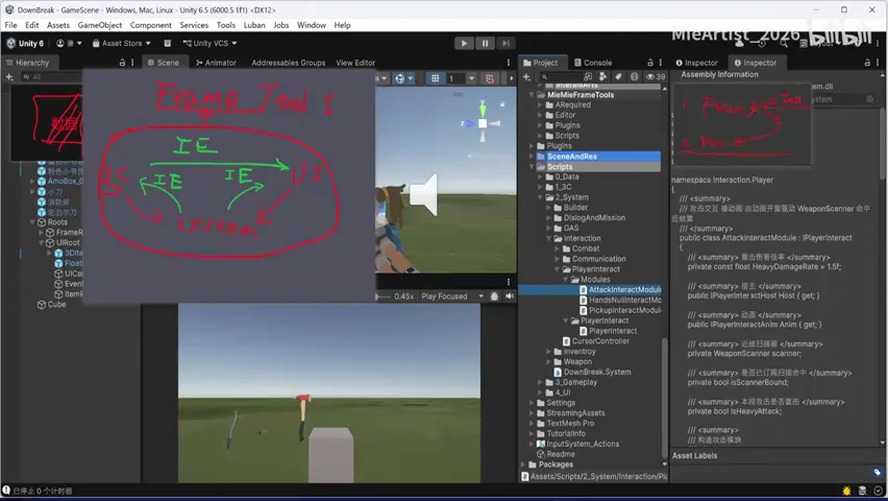

### 关键帧 3

### 关键帧 4

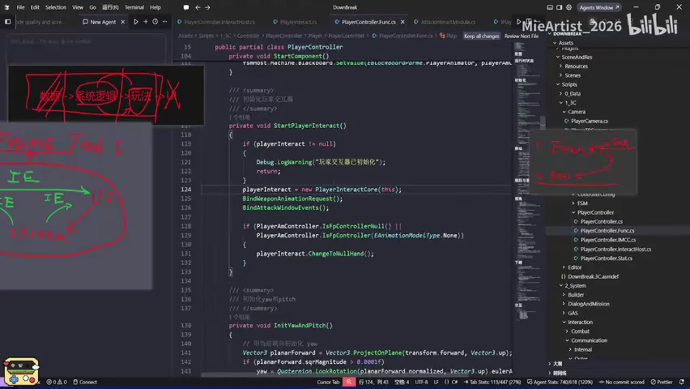

### 关键帧 5

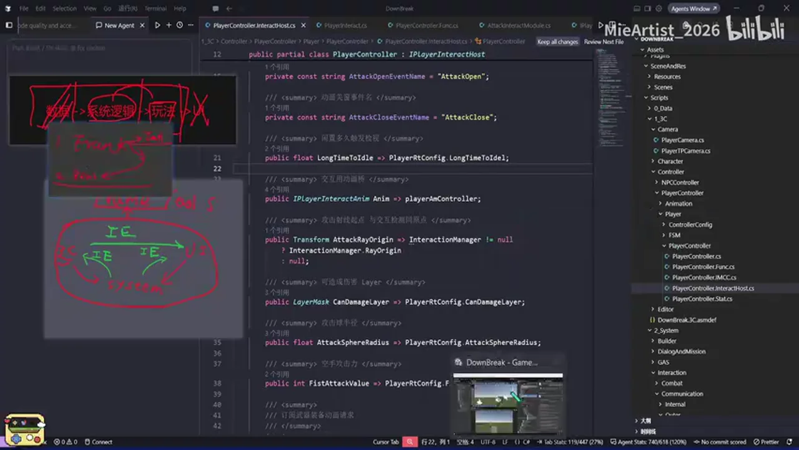

### 关键帧 6

### 关键帧 7

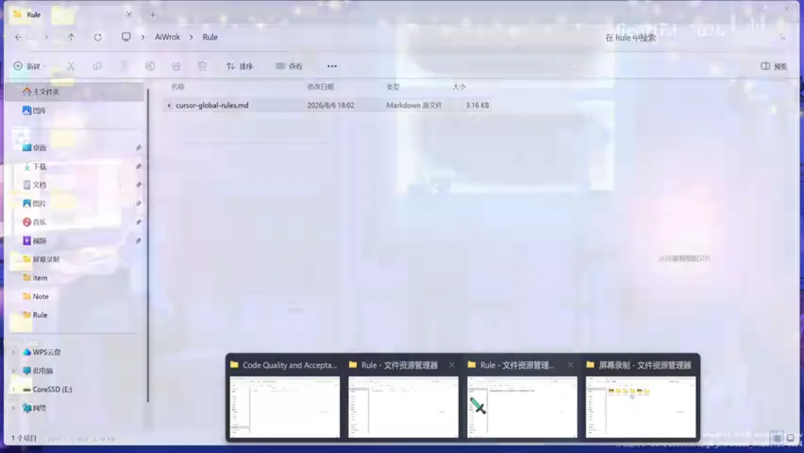

### 关键帧 8

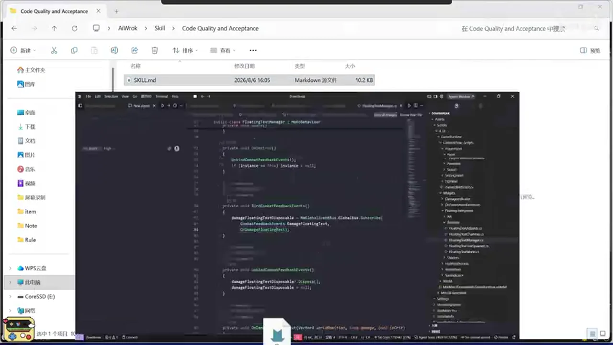

### 关键帧 9

### 关键帧 10

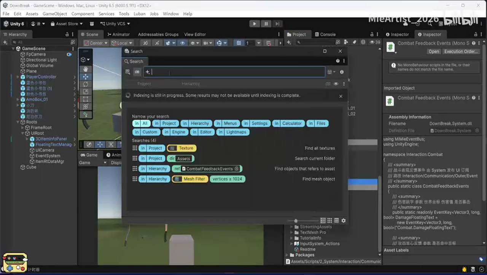
