# 总结

## 核心结论

这段视频把“深度专注”讲成一条带有强烈战斗修辞的路径：选定一个最重要的方向，削减与之竞争的刺激、承诺和环境线索，再用固定仪式、重复行动与定期复盘来保护注意力。它最有价值的部分不是“每天必须专注 12 小时”或“切断一切关系”，而是提醒我们：注意力需要被主动设计，而不是只靠临场意志力。

视频把“平衡”描述为逃避投入的借口，并将“消除”称为通向专注的唯一道路。这是规范性倡导，而不是可普遍验证的生活规律。更稳妥的可迁移版本是：在一个阶段明确一个主要优先事项，诚实辨认与它冲突的行为和承诺，然后做有边界、可逆、可复盘的减法。

## 内容脉络

1. **平衡与取舍。** 视频反对把所有角色、爱好和社交都同时维持在最高优先级，主张把资源集中到一个“北极星”目标上。可吸收的是优先级排序；不应把休息、关系或多元身份一概视为失败。

2. **从刺激到行动。** 视频建议降低手机、信息流、零食、背景噪音等即时回报的可得性，让工作成为更容易开始的选项。较可靠的做法是设计环境摩擦：把干扰移远、关掉非必要提醒、预先准备工作材料，并观察这些改变是否真的改善自己的任务质量与情绪。

3. **仪式、重复与环境。** 视频把固定工作入口、安静环境、困难任务优先和预先准备视为专注的“机械结构”。这些可被当作行为线索和工作流程，而不是神秘的自我改造。重点是降低启动成本、减少切换，而非追求痛苦或孤立。

4. **审计隐藏耗损。** 视频鼓励检查物理空间、数字工具、媒体、开放承诺、睡眠和精力模式。这个框架适合转化为周期性复盘：记录什么让自己更清醒、什么导致分心或疲惫，并据此微调，而不是一次性清空生活。

5. **取舍的边界。** 视频把孤独、失去关系和“燃烧自己”包装成必经代价。现实中，睡眠、身体状态、支持关系与恢复能力往往是长期专注的基础；若某种做法显著损害健康、关系或工作质量，就应缩小范围、寻求支持或改用更可持续的安排。

## 可执行的温和版本

- 写下一个当前阶段最重要、可验证的工作成果，而不是抽象地追求“更努力”。
- 选一个最常见的干扰来源，做一次可逆的环境调整，并在一段时间后记录任务完成度、主观精力和反弹情况。
- 为开始工作设置简短且重复的入口：准备材料、关闭不必要窗口、写下下一步动作。
- 定期审计微承诺、未关闭的事项和精力变化；保留真正重要的关系、恢复和责任。
- 用“是否更清楚、更稳定、更可持续”评估系统，而不是用极端时长、痛苦程度或牺牲多少来衡量成功。

## 观看时应保留的判断

视频大量使用“成瘾”“戒断”“大脑重连”“牺牲”“没有退路”等词汇来制造推动力。它们可作为个人动机隐喻，但不应被读成医学诊断、神经科学定律或对所有人的处方。尤其不宜把 12 小时专注、固定的痛苦适应周期、远离亲友或忽视恢复当作必要条件。

# 辅助理解

## 把极端口号翻译成可持续的专注系统

视频的叙事逻辑是“只留下工作，其他都移除”。更有用的理解是：专注不是人格测试，而是一个持续设计、执行、观察和修正的系统。目标不是把生活压缩到只剩工作，而是让最重要的工作在不透支健康、关系和恢复能力的前提下获得稳定位置。

视频用“平衡是假象”来制造选择的紧迫感。可取的部分是避免把每件事都列为同等优先级；需要拒绝的部分是把多重身份、休息或照顾关系直接等同于软弱。把这一段当作“明确阶段性优先级”的提醒，而不是要求全盘否定平衡。

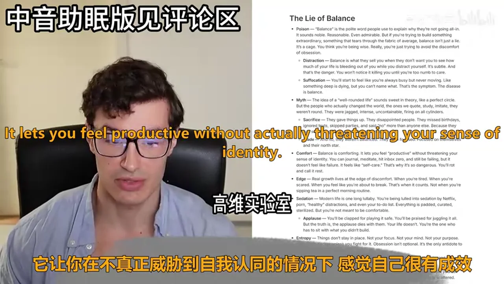

### 一条更稳妥的行动循环

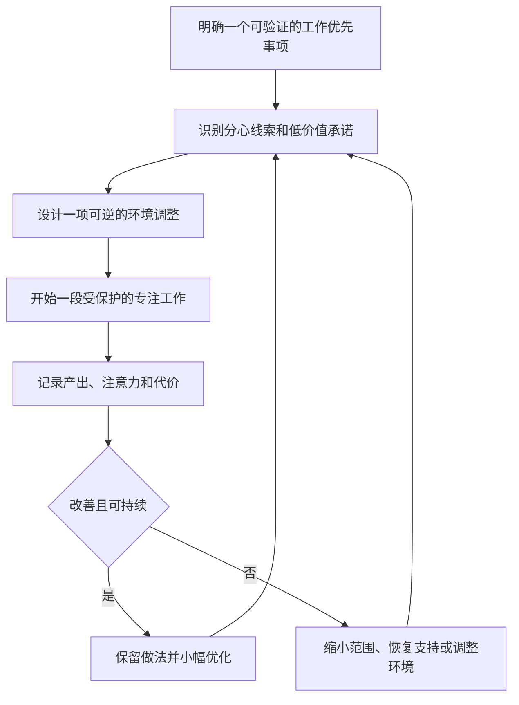

这张循环图刻意没有把“更长时长”设为目标。它把视频的减法主张转成可验证假设：减少一个干扰、保护一段工作时间，是否真的提高了任务推进和主观可持续性？若答案是否定的，就调整系统，而不是加大自我惩罚。

### 取舍不是伤害关系的许可证

视频把取舍、孤独和身份变化描绘为通向成果的必要成本。这里的有效问题是“我愿意为目标让出什么”，但答案应由个人价值、职责与关系协商决定。更安全的做法是先明确工作边界、回应期待和恢复安排，而非把亲友自动归为障碍。

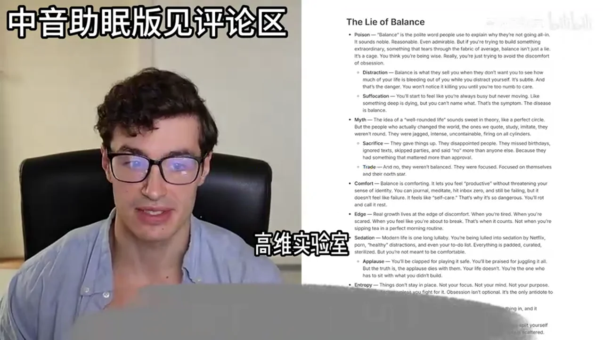

### 把刺激管理做成环境实验

视频建议切断高频刺激并把注意力转向工作。可以把它降级为一个低风险实验：改变通知、设备位置、浏览器入口或工作台面，观察是否减少无意识切换。它不要求持续 12 小时，也不要求把正常休闲直接称为成瘾。

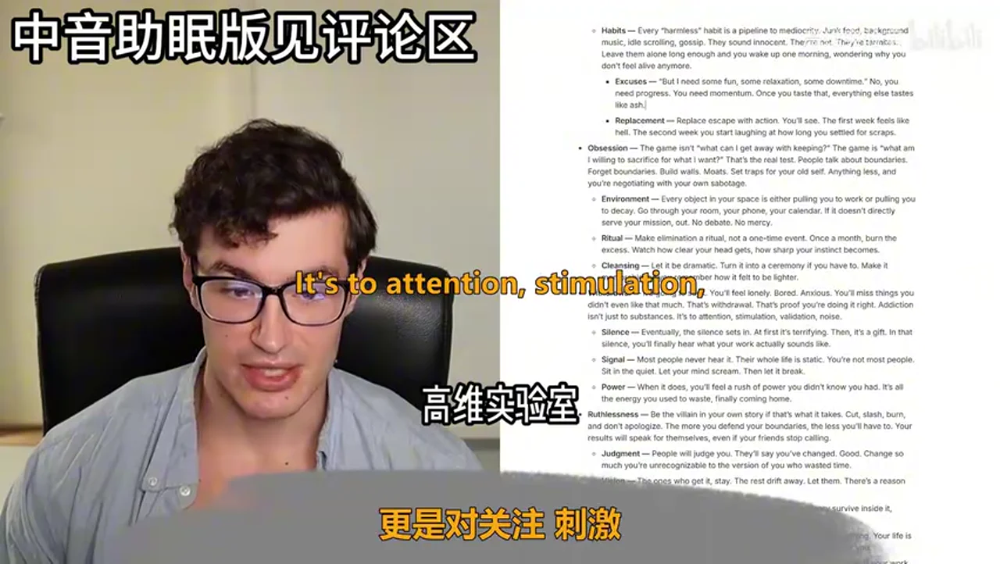

视频所谓“addiction switch”更适合作为行为设计隐喻：当即时线索变少、开始工作的步骤更短、完成任务有可见反馈时，部分人可能更容易把注意力留在任务上。它不是“把所有多巴胺清空后，大脑必然自动爱上工作”的科学结论。

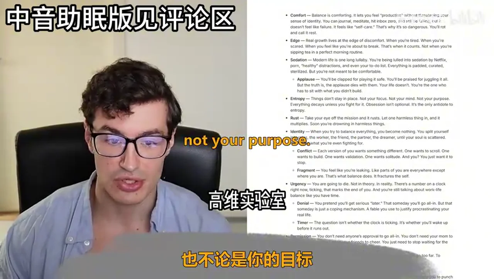

### 用仪式降低启动成本，用重复建立默认路径

固定的杯子、笔记本、关门、清理桌面或写下第一步，都可以成为工作开始信号。重要的不是仪式有多神圣，而是它是否减少犹豫与切换。把仪式设计得短、小、可恢复；若它变成强迫、焦虑或排斥恢复，就应简化。

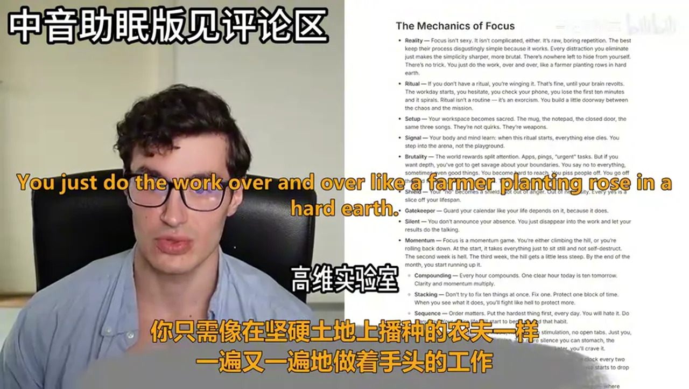

### 身份、牺牲与恢复的边界

视频将“燃烧旧我”和失去某些关系浪漫化。长期表现不需要把痛苦、孤立或身体透支当成勋章。较成熟的标准是：目标是否值得、代价是否知情且可承受、是否仍保有睡眠、健康、支持关系和调整空间。

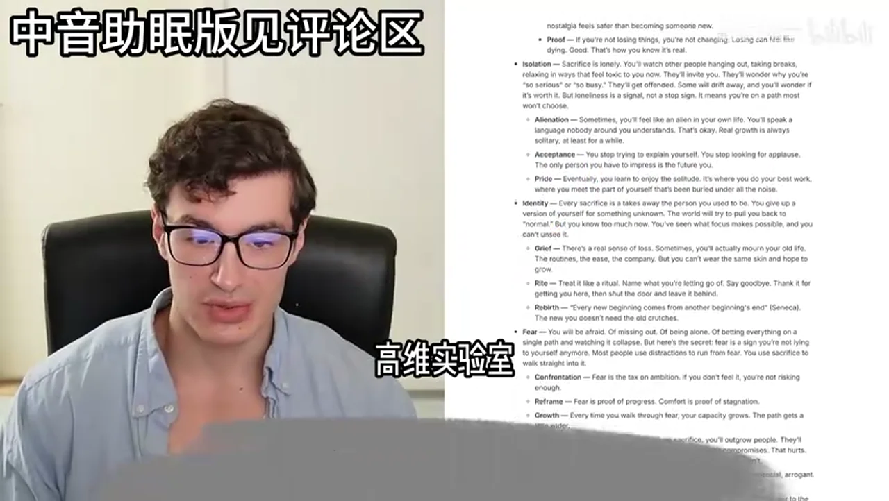

### 从全域审计到最小改动

物理空间、数字环境、媒体、开放事项和精力曲线都可能影响注意力；但“全域审计”不等于一次性清空。先找最常出现、最可改变的一两个触发点，执行后复盘，再决定是否扩大调整范围，能避免把生活管理变成新的逃避任务。

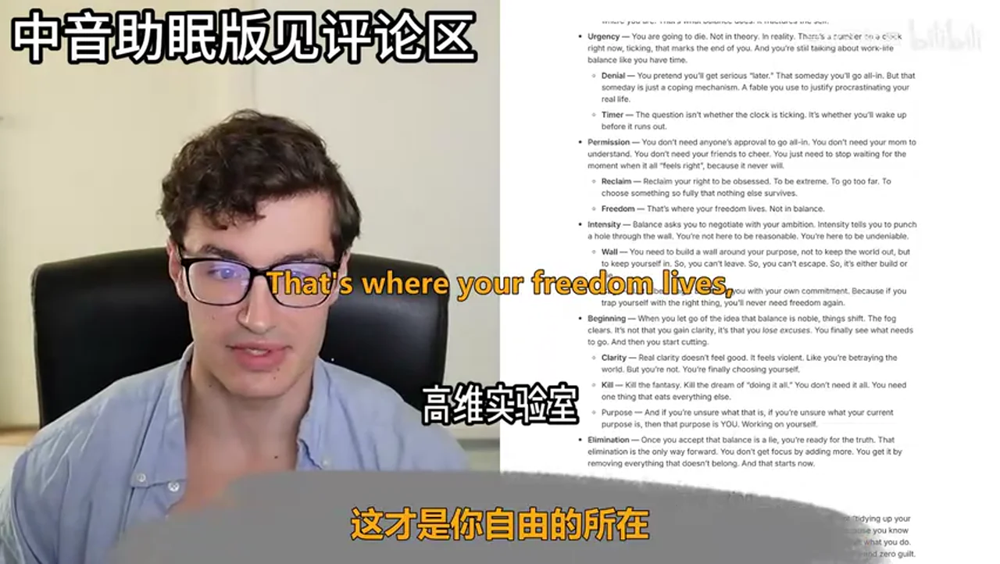

“微承诺”是很好的审计入口：未决定的邀约、待回的信息、随手加入的项目和未关闭的购物车都会占用心智。可采用“澄清、安排、拒绝或删除”的处理方式，但不要把必要责任或重要关系机械地归为低价值。

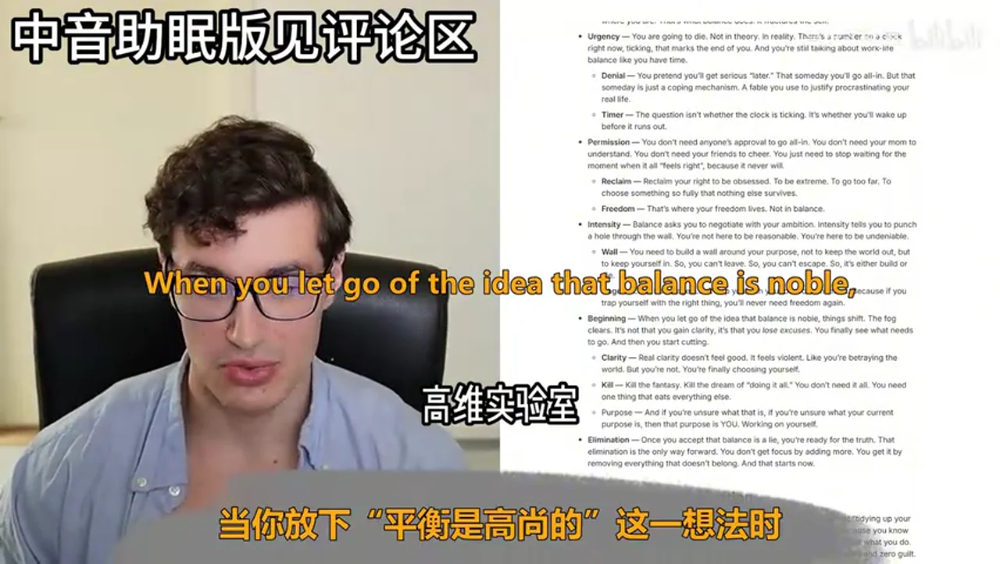

## 事实核验

本次自动核验共覆盖 7 个可外部核查的陈述：**已确认 1 项、部分证实 4 项、未证实 1 项、反驳 1 项。** 下列内容区分视频修辞与证据边界。

- **已确认 1 项：睡眠与次日表现。** “睡眠很差，第二天整个人都很差”是夸张说法；核心方向得到支持：睡眠限制会降低警觉、注意、反应时间、决策和任务表现，但影响程度因人和情境而异。[受控睡眠限制研究](https://pubmed.ncbi.nlm.nih.gov/12683469/) 与 [NHLBI 说明](https://www.nhlbi.nih.gov/health/sleep-deprivation/health-effects) 支持这一较谨慎的表述。

- **部分证实 1 项：抑制冲动与“重连”。** 重复、任务化的抑制控制训练可伴随功能和结构可塑性改变，但不能推出每一次忍住看手机的冲动都会让大脑发生可测“重连”，也不能保证奖励体验转向工作进展。[人体神经影像研究](https://pubmed.ncbi.nlm.nih.gov/25801718/) 和 [系统综述](https://pubmed.ncbi.nlm.nih.gov/35712455/) 支持的是长期训练层面的有限结论。

- **部分证实 1 项：多巴胺叙事。** 多巴胺参与动机、奖励预测误差和强化学习，但不是可被清空、再自动投向工作的单一“奖赏货币”。减少即时奖励线索可能对部分人有帮助；“移除所有刺激后驱动力必然转向工作”没有得到支持。[神经科学综述](https://pmc.ncbi.nlm.nih.gov/articles/PMC3032992/) 与 [NIDA 材料](https://irp.nida.nih.gov/wp-content/uploads/2019/12/NIDA_DrugsBrainsAddiction_2018.pdf) 说明了这种复杂性。

- **部分证实 1 项：把工作称为成瘾与耐受。** 药物反复暴露中的耐受性是明确概念，但不能据此把深度工作、解题或健康投入等同于临床成瘾，更不能推出人会需要“更高风险”。应把视频建议改为“逐步增加任务难度，并留意过劳信号”。[NIDA 的神经生物学材料](https://nida.nih.gov/sites/default/files/1922-the-neurobiology-of-drug-addiction_2.pdf) 说明耐受不等于成瘾。

- **部分证实 1 项：杂乱环境。** 杂乱可能与压力体验或某些行为选择相关，但“杂乱房间等于杂乱大脑”不是科学等式，也不能用于诊断。可更谨慎地说：对一些人，减少视觉杂乱可能降低环境负担。[家庭环境观察研究](https://pubmed.ncbi.nlm.nih.gov/19934011/) 与 [环境秩序实验](https://pubmed.ncbi.nlm.nih.gov/23907542/) 都只支持有限关联或特定实验结果。

- **未证实 1 项：固定适应时间线。** “第二周最痛苦、第三周变轻松、月底开始飞奔”以及“一小时今天等于十小时明天”没有证据支持为普遍规律。习惯自动化确实会随重复提高，但个体、行为和情境差异很大；相关研究的中位估计为 66 天、范围为 18 至 254 天，且不能直接外推到深度工作。[原始研究](https://doi.org/10.1002/ejsp.674) 与 [UCL 说明](https://www.ucl.ac.uk/news/2009/aug/how-long-does-it-take-form-habit%20) 支持的是这种不确定性。

- **反驳 1 项：Seneca 归属。** 视频中的“每一个新的开始都来自另一个开始的结束”不应归于 Seneca，已从本笔记的正文中移除。相近歌词出自 Semisonic 的《Closing Time》，并非可核验的 Seneca 引文；可参见[同期报道](https://www.brainerddispatch.com/newsmd/semisonic-sets-up-another-round-for-success)和[主创访谈](https://www.theguardian.com/music/2023/nov/02/semisonic-dan-wilson-closing-time-new-album)。

# Data

## 增强转写稿

[00:00] All right, hello and welcome to this video
[00:03] as you can see from the title
[00:04] what we're going to be covering today
[00:05] is the ruthless path to focus
[00:08] and as you can see from the overview
[00:09] what we're going to be talking about more specifically
[00:12] is first the overview itself
[00:14] the lie of balance
[00:15] the reality of elimination
[00:17] the addiction switch
[00:18] the mechanics of focus
[00:19] the sacred sacrifice
[00:21] eliminating everything
[00:22] the review and your action items for the day
[00:25] or the next few days
[00:26] so without further ado
[00:28] let's get started and talk about the lie of balance
[00:31] so balance is the polite word
[00:34] people use to explain why they're not going all in
[00:37] it sounds noble reasonable even admirable
[00:40] but if you're trying to build something extraordinary
[00:43] something that tears through the fabric of average
[00:45] balance isn't just a lie
[00:47] it's a cage
[00:48] you think you're being wise
[00:49] but really you're just trying to avoid the discomfort of obsession
[00:53] balance is what they sell you
[00:54] when they don't want you to see
[00:55] how much of your life is bleeding out of you
[00:58] while you distract yourself
[01:00] it's subtle and that's the danger
[01:02] you won't notice it killing you
[01:04] until you're too numb to care
[01:06] and you'll start to feel like you're always busy
[01:08] but never really moving
[01:09] like something deep is dying
[01:10] but you can't name what
[01:12] that's the symptom
[01:13] the disease is balance
[01:15] the idea of a well-rounded life
[01:16] sounds sweet in theory
[01:18] like a perfect circle
[01:20] but the people who actually changed the world
[01:22] the ones we quote study imitate
[01:24] they weren't round
[01:25] they were jagged
[01:26] intense uncontainable
[01:28] firing on all cylinders
[01:30] they gave things up
[01:31] they disappointed people
[01:33] they missed birthdays
[01:34] ignored texts
[01:35] skipped parties
[01:36] and said no more than anyone else
[01:38] because they had something that mattered more
[01:40] than approval
[01:41] and no they weren't balanced
[01:43] they were focused
[01:44] focused on themselves
[01:45] and their north star
[01:46] whatever that is
[01:48] balance is comforting
[01:49] it lets you feel productive
[01:50] without actually threatening your sense of identity
[01:53] and you can journal
[01:54] meditate
[01:55] hit inbox zero
[01:56] and still be failing
[01:57] but it doesn't feel like failure
[01:59] it feels like self-care
[02:01] that's why it's so dangerous
[02:03] you'll rot and call it rest
[02:05] real growth lives at the edge of discomfort
[02:08] when you're tired
[02:09] when you're scared
[02:09] when you feel like you're about to break
[02:11] that's when it counts
[02:13] not when you're sipping tea
[02:14] in a perfect morning routine
[02:16] modern life is one long lullaby
[02:18] and you're being lulled
[02:19] into sedation by Netflix
[02:21] porn
[02:21] healthy distractions
[02:23] and even your to-do list
[02:24] everything is padded
[02:25] everything is curated
[02:27] sterilized
[02:28] but you're not meant to be comfortable
[02:30] you'll be clapped for
[02:31] playing it safe
[02:32] you'll be praised
[02:33] for juggling it all
[02:34] but your truth is
[02:35] the applause dies with them
[02:37] your life doesn't
[02:38] you're the one who has to sit
[02:40] with what you didn't build
[02:41] things don't stay in place
[02:43] not your focus
[02:43] not your mind
[02:44] not your purpose
[02:45] everything decays
[02:46] unless you fight for it
[02:47] an obsession
[02:48] isn't optional
[02:49] it's the only antidote to entropy
[02:52] so take your eye off the mission
[02:53] and it will rust
[02:54] let one harmless thing in
[02:56] and it multiplies
[02:57] and soon you're drowning
[02:59] in harmless things
[03:00] when you try to balance everything
[03:01] you become nothing
[03:02] you split yourself into roles
[03:04] the worker, the friend
[03:06] the partner, the dreamer
[03:07] until your soul is so scattered
[03:09] you forget what you're even fighting for
[03:11] each version of you wants something different
[03:13] one wants to scroll
[03:14] one wants to build
[03:15] one wants validation
[03:16] one wants solitude
[03:18] and you
[03:18] you really just want it to stop
[03:20] you'll feel like you're leaking
[03:21] like parts of you are everywhere
[03:23] except where you are
[03:24] and that's what balance does
[03:26] it fractures the self
[03:27] your life is going to end at some point
[03:29] not in theory
[03:30] in reality
[03:31] there's a number on a clock right now
[03:33] ticking that marks the end of you
[03:35] and you're still talking about work
[03:37] life balance like you have time
[03:39] you pretend you'll get serious later
[03:41] that someday you'll go all in
[03:42] but that someday is just a coping mechanism
[03:45] a fable you use to justify procrastinating
[03:48] your real life
[03:49] the question isn't whether the clock is ticking
[03:51] it's whether you'll wake up before
[03:53] it runs out
[03:54] and so you don't need anyone's approval to go all in
[03:57] you don't need your mom to understand
[03:59] and you don't need your friends to cheer
[04:01] you just need to stop waiting for the moment
[04:03] when it all feels right
[04:04] because it never will
[04:06] reclaim your right to be obsessed
[04:08] to be extreme
[04:08] to go too far
[04:09] to choose something so fully
[04:11] that nothing else survives
[04:13] that's where your freedom lives
[04:15] not in balance
[04:16] balance asks you to negotiate with your ambition
[04:18] intensity tells you to punch a hole through the wall
[04:21] you're not here to be reasonable
[04:23] you're here to be undeniable
[04:25] you need to build a wall around your purpose
[04:27] not to keep the world out
[04:28] but to keep yourself in
[04:30] so you can't leave
[04:31] so you can't escape
[04:33] so it's either build or decay
[04:35] let it be a cage
[04:36] let it trap you with your own commitment
[04:38] because if you trap yourself with the right thing
[04:40] you'll never need freedom again
[04:42] when you let go of the idea that balance is noble
[04:45] things shift, the fog clears
[04:47] and it's not that you gain clarity
[04:48] it's that you lose excuses
[04:50] you finally see what needs to go
[04:52] and then you start cutting
[04:54] real clarity doesn't feel good
[04:55] it feels violent
[04:56] like you're betraying the world
[04:57] but you're not
[04:58] you're finally actually choosing yourself
[05:01] so kill the fantasy
[05:02] kill the dream of doing it all
[05:03] you don't need it all
[05:05] you need the one thing
[05:06] that eats everything else
[05:08] and if you're unsure what that is
[05:09] if you're unsure what your current purpose is
[05:11] then that purpose is you
[05:13] working on yourself
[05:14] once you accept that balance is a lie
[05:16] you're ready for the truth
[05:18] that elimination is the only way forward
[05:20] you don't get focused by adding more
[05:22] you get it by removing everything
[05:24] that doesn't belong
[05:25] and that starts now
[05:26] let's talk about the reality of elimination
[05:29] so elimination is pretty ugly
[05:31] it's aggressive, it's uncomfortable
[05:33] you're not tidying up your life
[05:35] you're actually setting fire to the deadwood
[05:36] and standing in the smoke
[05:38] because you know deep down
[05:39] nothing grows in a crowded forest
[05:41] people think focus is about what you do
[05:43] but it's about what you're willing to stop doing forever
[05:46] with zero nostalgia and zero guilt
[05:49] and the moment you even think about
[05:50] eliminating something
[05:52] your brain probably throws a fit
[05:54] every excuse you've ever invented
[05:55] starts rushing in
[05:57] but what if I need it later
[05:58] but it's just for downtime
[05:59] but I'll be missing out
[06:00] that's your animal brain fighting for its drug
[06:03] that resistance
[06:04] that's the signal you're getting close
[06:06] to the real thing
[06:07] it's not supposed to be easy
[06:09] if it was easy
[06:10] you'd already be unstoppable
[06:11] most people never get past the excuses
[06:14] they negotiate with themselves
[06:15] until nothing changes
[06:16] they never taste the raw terrifying freedom
[06:19] of actual elimination
[06:20] you don't just reduce distractions
[06:23] you kill them
[06:24] you don't cut back
[06:25] you cut off
[06:26] subtraction isn't a polite adjustment
[06:28] it's a knife
[06:29] and yes sometimes
[06:30] you cut out things that you actually enjoy
[06:33] that's the deal
[06:34] if you want everything
[06:35] you get nothing
[06:36] if you want one thing
[06:37] you get everything that comes with it
[06:39] throw your phone out of the room
[06:41] not for a 30 minute focus block
[06:43] for 12 hours
[06:44] for days
[06:45] until you feel that itch
[06:47] that panic
[06:47] and realize that your mind
[06:49] is scrambling for the dopamine
[06:50] you've been drip feeding it since 2006
[06:53] notice the urge to check it
[06:55] that's the addiction talking
[06:56] sit there and let it ache
[06:58] every time you override that urge
[07:00] your brain rewires
[07:01] slowly at first
[07:03] the high starts coming from progress
[07:05] not notifications
[07:06] so there are also people you love
[07:08] who are bad for you
[07:09] and your work
[07:10] family, friends, partners
[07:12] if they're not aligned
[07:13] their weight around your ankles
[07:15] love them from a distance
[07:16] or risk drowning with them
[07:18] you'll feel like a traitor
[07:20] and they'll most likely guilt-trip you
[07:22] and it hurts
[07:22] but it's better than hating yourself
[07:24] for what you didn't build
[07:25] don't expect applause
[07:27] expect resistance
[07:28] anger
[07:29] confusion
[07:30] that's how you know you're not just
[07:31] rearranging your comfort zone
[07:33] you're actually destroying it
[07:34] and this isn't about a dopamine detox
[07:36] this isn't a challenge
[07:38] or a seven day experiment
[07:40] this is permanent
[07:41] it's ruthless
[07:42] you quit letting yourself get away with it
[07:44] no more just this once
[07:46] no more I deserve a break
[07:48] the more brutal you are
[07:49] the faster it gets quiet in your head
[07:51] every harmless habit
[07:53] is a pipeline to mediocrity
[07:54] junk food, background music
[07:56] idol scrolling, gossip
[07:57] they sound innocent but they're not
[07:59] they're termites
[08:00] and if you leave them alone long enough
[08:02] you'll wake up one morning
[08:03] wondering why you don't feel alive anymore
[08:06] but I need some time
[08:07] I need some relaxation
[08:08] I need some downtime
[08:10] no
[08:10] you need progress
[08:11] you need momentum
[08:13] once you taste that
[08:14] everything else tastes like ash
[08:16] replace escape with action and you'll see
[08:18] the first week feels like hell
[08:20] and the second week you start laughing
[08:22] at how long you settled for scraps
[08:24] the game isn't what can I get away with keeping
[08:26] the game is what am I willing to sacrifice
[08:29] for what I want
[08:30] that's the real test
[08:31] people talk about boundaries
[08:32] but forget boundaries
[08:34] build walls, build modes
[08:36] set traps for your old self
[08:37] anything else
[08:38] anything less
[08:39] and you're negotiating with your own sabotage
[08:42] every object in your space
[08:43] is either pulling you to work
[08:45] or pulling you to decay
[08:46] go through your room
[08:47] your phone, your calendar
[08:49] if it doesn't directly serve your mission
[08:51] out
[08:51] no debate
[08:52] no mercy
[08:53] make elimination a ritual
[08:54] not a one time event
[08:56] once a month burn the excess
[08:58] watch how clear your head gets
[09:00] how sharp your instinct becomes
[09:02] let it be dramatic
[09:03] turn it into a ceremony
[09:04] if you have to
[09:05] make it memorable
[09:06] so you remember how it felt to be lighter
[09:08] it's going to suck
[09:09] you'll feel lonely
[09:10] you'll most likely feel bored and anxious
[09:12] you'll miss things
[09:13] you didn't even like that much
[09:15] that's the withdrawal
[09:16] that's proof you're doing it right
[09:18] addiction isn't just to substances
[09:20] it's to attention, stimulation, validation and noise
[09:23] eventually the silence sets in
[09:25] at first it's terrifying
[09:27] then it's a gift
[09:28] in that silence you'll finally hear
[09:30] what your work actually sounds like
[09:32] most people never hear it
[09:33] their whole life is static
[09:34] you're not most people
[09:36] sit in the quiet
[09:37] let your mind scream
[09:38] then let it break
[09:39] when it does you'll feel a rush of power
[09:42] you didn't know you had
[09:43] it's all the energy you used to waste
[09:45] finally coming home
[09:46] be the villain in your own story
[09:48] if that's what it takes
[09:49] cut, slash, burn and don't apologize
[09:52] the more you defend your boundaries
[09:54] the less you'll have to
[09:55] your results will speak for themselves
[09:57] even if your friends stop calling
[09:59] and people will most likely judge you
[10:00] and they'll say you've changed
[10:02] let them
[10:03] change so much
[10:04] you're unrecognizable
[10:05] to the version of you who wasted time
[10:07] the ones who get it stay
[10:08] the rest drift away
[10:10] let them
[10:11] there's a reason most people never escape
[10:13] set a standard so high
[10:14] that only the extraordinary
[10:16] survive inside it
[10:18] including you
[10:19] let go of the idea
[10:20] that you need permission
[10:21] to eliminate anything
[10:22] your life is your responsibility
[10:24] and so is your focus
[10:26] no one is going to protect it for you
[10:28] no one is gonna come to save you
[10:30] own your choices
[10:31] own your results
[10:32] if you're not proud of your work
[10:33] it's not because you did too much
[10:35] it's because you let too much live
[10:36] filter your world through one question
[10:39] does this make me better
[10:40] or weaker
[10:41] if weaker
[10:41] cut it
[10:42] no debate
[10:43] no guilt
[10:44] does this add to my mission
[10:45] or does it take away from it
[10:47] does this bring me one step closer
[10:49] or one step backwards
[10:51] that's where real freedom starts
[10:52] when nothing unnecessary has access
[10:54] to your mind,your time,and your space
[10:57] at first elimination feels like punishment
[10:59] but soon it flips
[11:01] you start feeling hungry again
[11:02] your attention stretches out
[11:04] sharp,predatory,seeking challenge
[11:06] work,impact
[11:08] and the world shrinks
[11:09] the mission grows
[11:10] and you stop missing the old hits
[11:12] you start needing the work
[11:14] and eventually even your distractions
[11:16] become tools
[11:17] the urge to escape turns into the urge
[11:19] to build
[11:20] and that's when you know
[11:21] you're in the deep
[11:22] this is how you get addicted
[11:23] to the right thing
[11:24] not by discipline
[11:25] but by starvation of everything else
[11:27] the work starts to call you
[11:29] and you start craving it
[11:30] you miss it when you're not in it
[11:31] and that's when you know
[11:32] you've crossed over
[11:33] and most people never try this
[11:35] they dance around the edges
[11:36] they declutter
[11:37] they detox
[11:38] they take breaks
[11:39] but if you go all the way
[11:40] you'll notice something terrifying
[11:41] and beautiful
[11:42] there's nothing left but you and the work
[11:45] and all the space you cleared out
[11:46] fills up with energy
[11:48] focus, and a strange kind of joy
[11:50] the world goes quiet
[11:51] and the work becomes the only thing
[11:53] that matters
[11:54] and for the first time in your life
[11:55] you don't want to escape
[11:57] you actually want more
[11:59] so next
[12:00] you're going to see what happens
[12:01] when the only hit left
[12:02] is the work itself
[12:04] and why it's the greatest addiction
[12:06] you'll ever have
[12:07] let's talk about the addiction switch
[12:09] so let's rip the Band-Aid off
[12:10] most people don't want to get rid
[12:12] of their addictions
[12:13] because deep down
[12:14] they're terrified
[12:14] there's nothing good
[12:15] on the other side
[12:17] they've built their whole
[12:18] emotional economy
[12:19] around little dopamine payouts
[12:21] the phone, the snacks, the Netflix
[12:23] the scrolling, the swiping
[12:25] the fake urgency, the background chatter
[12:27] but here's the truth
[12:28] if you eliminate everything else
[12:30] all that restless
[12:32] desperate
[12:32] hungry energy
[12:34] has nowhere to go
[12:34] except the one thing
[12:36] you didn't cut, the work
[12:37] and this is not some motivational tactic
[12:39] this is basic chemistry
[12:41] you're not becoming less addicted
[12:43] you're just swapping suppliers
[12:44] when you take away every other
[12:46] dopamine hit
[12:47] the brain doesn't stop wanting
[12:49] dopamine
[12:49] it just goes hunting
[12:51] that's why the work starts to call you
[12:52] the same itch that used to make you
[12:54] check instagram for the 20th time
[12:56] before breakfast starts
[12:57] dragging you back to the task at hand
[12:59] is the same mechanism
[13:01] but now you're the dealer
[13:02] and the addict
[13:03] and the drug is your own output
[13:05] for the first time
[13:06] doing hard things starts to feel like relief
[13:08] you sit down and instead of anxiety
[13:10] you feel a weird sense of comfort
[13:12] you feel that little hit
[13:13] that little surge
[13:15] and no, it's not the pure rush
[13:16] you get from junk food
[13:17] or social approval
[13:19] but it's real and it builds
[13:20] and it's self-reinforcing
[13:22] at first you'll feel the withdrawal
[13:24] your brain screams for the old stuff
[13:26] but as the days pass
[13:27] it starts to recalibrate
[13:29] the act of finishing something
[13:30] building something
[13:31] moving the needle
[13:32] it becomes the only place you get your high
[13:34] and the pride of seeing what you build
[13:36] what you endured
[13:37] and what you kept at begins to compete
[13:40] with the quick hits
[13:41] you start to crave it
[13:42] not the distractions
[13:43] not the shallow validation
[13:45] but the feeling of being locked in
[13:47] hours go by and you forget to eat
[13:49] you resent interruptions
[13:50] people start asking if you're okay
[13:52] and you're more than okay
[13:54] you're hooked
[13:55] you finish a big piece of work
[13:56] and you get that hit
[13:57] not as the same as the old stuff
[13:58] but deeper, heavier
[14:00] and you want it again
[14:01] so you start chasing harder problems
[14:03] higher stakes, deeper focus
[14:05] just like any other addiction
[14:06] tolerance builds and you need bigger challenges
[14:09] more complex puzzles
[14:10] a higher level of risk
[14:12] and soon you become addicted
[14:14] not just to the work
[14:15] but to improvement itself
[14:16] you start looking for anything
[14:18] and anyone that can make you
[14:19] better, stronger, faster
[14:22] and yes, that's a reference
[14:23] and this is where things get dangerous
[14:25] when the work becomes your only high
[14:27] you become the kind of person
[14:29] who can't live any other way
[14:31] you lose patience for the mundane
[14:32] the trivial, the small talk
[14:34] and people see you changing
[14:35] and they don't like it
[14:36] but you can't go back
[14:38] sometimes you'll be alone
[14:40] most times in fact
[14:41] sometimes you'll feel like a freak
[14:43] you'll get accused of being too much
[14:45] you'll be told to chill out
[14:47] ignore it all
[14:48] suddenly you recognize others like you
[14:50] the real ones
[14:51] the ones who look hungry all the time
[14:53] even if they're rich
[14:54] or miles ahead of you
[14:55] in any other domain of life
[14:57] these are your people now
[14:59] they get it
[14:59] they don't ask you to explain the obsession
[15:01] they just nod and go back to building
[15:04] and here's the crazy thing
[15:05] the more you work
[15:06] the more rewards you get
[15:07] not from outside but from within
[15:09] it's an addiction loop
[15:10] you built for yourself
[15:11] and you control the lever
[15:13] you stop needing validation
[15:14] and you stop counting likes
[15:16] followers and applause
[15:17] your reward mechanism gets internalized
[15:20] and it's not that you become a monk
[15:22] or a stoic
[15:22] you just become detached from the outcome
[15:24] from the external
[15:25] you realize you can manufacture your own joy
[15:28] your own purpose on demand
[15:29] because you become the purpose
[15:31] your reward mechanism is internalized
[15:34] for example I was creating these videos
[15:35] way before the subscribers, views, comments, and likes
[15:38] and you can see some remnants of this
[15:40] on my own channel
[15:41] life shrinks and gets heavier
[15:43] denser
[15:44] every move matters
[15:45] every minute is spent
[15:46] buying the next high
[15:47] and sometimes you go too far
[15:49] you work until your body aches
[15:50] your brain buzzes
[15:51] your vision blurs
[15:53] and you're playing with fire
[15:54] and you know it
[15:55] and you crash
[15:56] but even in the exhaustion
[15:58] just like a heavy workout
[15:59] there's a twisted satisfaction
[16:01] you spent it all on something real
[16:03] not on killing time
[16:05] and sleep hits different
[16:06] food tastes better
[16:07] rest actually feels like rest
[16:09] and there's no guilt
[16:10] no shame
[16:11] no sense of wasting the day
[16:13] you remember what it used to feel like
[16:15] the emptiness after a binge
[16:17] the anxiety after too many hours
[16:19] of numbing yourself
[16:20] now the only time you feel anxious
[16:22] is when you're not building
[16:23] and you have to pull yourself back
[16:25] not force yourself forward
[16:27] and now
[16:28] you're living where most people are terrified to go
[16:30] you're right at the edge of your ability
[16:32] constantly leveling up
[16:34] constantly testing your own limits
[16:36] and it's risky
[16:37] and it's lonely
[16:38] it's sometimes brutal
[16:39] but it feels alive
[16:41] you realize you can't coast
[16:42] not for long
[16:43] because the machine you built needs fuel
[16:45] and the only fuel it takes
[16:47] is sweat,thought,and focus
[16:49] and that scares people
[16:50] they see the consequences
[16:52] they see how much you had to burn to get here
[16:55] but to you
[16:55] it doesn't even feel like sacrifice anymore
[16:58] it feels like life
[16:59] and here's where the magic happens
[17:01] you wake up and your first thought is
[17:03] the work,whatever that is for you
[17:05] not your phone,not notifications
[17:07] not some distraction
[17:08] the urge to do the hard thing becomes a reflex
[17:11] and you feel antsy when you're away from it too long
[17:14] like an addict separated from his fix
[17:17] that's how you know you made it
[17:18] the world can offer you every shiny object
[17:20] every cheap thrill
[17:22] and you'll just shrug
[17:23] and go back to building
[17:24] you built an immune system
[17:26] not from discipline
[17:27] but from pure necessity
[17:29] now you have proof
[17:30] if you can get addicted to this
[17:31] you can get addicted to anything
[17:34] so you pick wisely
[17:35] and here's the last piece
[17:36] you can't fake this
[17:37] you can't hack your way here
[17:39] with willpower alone
[17:41] you have to really ask yourself what you want
[17:43] and you have to get even more real
[17:45] about what you're willing to burn to get it
[17:47] and it's ugly sometimes
[17:48] it's beautiful sometimes
[17:50] but it's always worth it
[17:51] you look back one day
[17:52] and your only regret is not starting sooner
[17:55] because now the next step
[17:56] isn't about finding more ways to work
[17:58] it's about finding out how deep you can go
[18:00] how far you can push
[18:02] how much more you can build
[18:03] when nothing else is left
[18:05] all of this brings you face to face
[18:06] with the actual mechanics of focus
[18:09] the nuts and the bolts
[18:10] the routines
[18:11] the ugly little truths
[18:12] about how people who actually win
[18:14] keep their eyes locked on what matters
[18:16] and that's what's next
[18:18] so let's talk about the mechanics of focus
[18:20] so focus isn't sexy
[18:22] it isn't complicated either
[18:24] it's raw boring repetition
[18:26] the best keep their process
[18:28] disgustingly simple because it works
[18:30] every distraction you eliminate
[18:31] just makes this simplicity sharper
[18:33] and more brutal
[18:34] and there's nowhere left to hide from yourself
[18:36] there's no trick
[18:37] you just do the work over and over
[18:39] like a farmer planting rose in a hard earth
[18:42] if you don't have a ritual
[18:44] you're winging it
[18:44] and that's fine
[18:45] until your brain revolts
[18:47] the workday starts
[18:47] you hesitate
[18:48] you check your phone
[18:49] you lose the first 10 minutes
[18:50] and it spirals
[18:51] ritual isn't a routine
[18:53] it's an exorcism
[18:54] you build a little doorway
[18:55] between the chaos and the mission
[18:57] your workspace becomes sacred
[18:59] the mug,the notepad
[19:00] the closed door
[19:01] the same three songs
[19:02] they're not quirks
[19:03] they're weapons
[19:04] and your body and mind learn
[19:05] when this ritual starts
[19:06] everything else dies
[19:08] and you step into the arena
[19:09] not the playground
[19:11] the world rewards split attention
[19:13] apps,pings,urgent tasks
[19:15] but if you want depth
[19:17] you've got to get savage
[19:18] about your boundaries
[19:19] you say no to everything
[19:21] sometimes even good things
[19:22] and you become hard to reach
[19:24] you piss people off
[19:25] you go off the grid for days
[19:26] sometimes weeks
[19:27] and the less you explain
[19:29] the better
[19:29] your no becomes a shield
[19:30] not out of anger
[19:31] out of necessity
[19:32] because every yes
[19:33] is a slice off your lifespan
[19:35] so guard your calendar
[19:36] like your life depends on it
[19:38] because it does
[19:39] you don't have to announce your absence
[19:41] you just disappear into the work
[19:42] and let your results
[19:43] do the talking
[19:45] focus is a momentum game
[19:46] you're either climbing the hill
[19:48] or you're rolling back down
[19:50] at the start
[19:50] it takes everything just to sit still
[19:52] and not self destruct
[19:54] the second week is hell
[19:55] the third week
[19:56] the hill gets a little less steep
[19:57] and by the end of the month
[19:59] you start running up it
[20:00] every hour compounds
[20:01] one clear hour today
[20:02] is 10 tomorrow
[20:04] clarity and momentum multiply
[20:06] don't try to fix 10 things
[20:07] at once. Fix one
[20:08] protect one block of time
[20:10] and when you see what it does
[20:11] you'll feel like hell to protect more
[20:13] order matters as well
[20:14] put the hardest thing first
[20:16] every day
[20:17] you will hate it
[20:18] and do it anyway
[20:19] your entire life
[20:20] will start to bend around that habit
[20:22] and real focus is quiet
[20:24] no music
[20:24] no news
[20:25] no stimulation
[20:26] no open tabs
[20:27] just you
[20:28] the page
[20:29] the code
[20:30] the numbers
[20:30] the plan
[20:31] the more silence you can stomach
[20:32] the deeper you'll go
[20:34] and at first
[20:34] the silence will make you squirm
[20:36] later you'll crave it
[20:37] the first few sessions feel like hell
[20:39] you'll check the clock every two minutes
[20:41] your skin will itch for distraction
[20:43] but if you can last
[20:44] the noise starts to drop out
[20:46] there's a moment
[20:46] usually 30, sometimes 45 minutes in
[20:49] where everything in your head shuts up
[20:52] that's the beginning
[20:53] stay there
[20:54] when you break through
[20:55] you can work for hours
[20:56] not because of discipline
[20:57] but because nothing is pulling at you
[20:59] anymore
[21:00] and don't pretend you can discipline your environment
[21:03] your willpower is overrated
[21:05] put yourself in a cell if you have to
[21:07] delete every shortcut
[21:08] leave your phone at home
[21:10] work at the library
[21:11] a closet
[21:11] a boring white room
[21:13] whatever you have to do
[21:14] do it
[21:15] set traps for your future self
[21:16] hide your distractions
[21:18] and make it harder to lose
[21:19] build friction into escape routes
[21:22] the night before, get everything ready
[21:23] put the hard thing on top of your pile
[21:25] so it's the first thing you see
[21:27] make it impossible to do anything else
[21:29] but the work
[21:30] if you don't
[21:30] you'll always default to comfort
[21:32] people think focus is about sprinting
[21:34] but it's not
[21:35] it's a marathon but with fire at your heels
[21:37] you can't run at top speed forever
[21:39] but you can always move forward
[21:41] you train yourself to keep showing up
[21:43] even when you're tired
[21:44] bored, sick or doubting
[21:46] real discipline is about rhythm
[21:48] not force
[21:49] the better you get
[21:50] the more you can coast on habit
[21:51] you do it even when you don't feel like it
[21:53] and especially then
[21:54] a bad day
[21:55] you show up anyway
[21:56] that's the difference between pros and tourists
[21:59] eventually focus becomes less about technique
[22:02] and more about obsession
[22:03] you start needing the work to feel okay
[22:05] you start organizing your whole life
[22:07] around your next block of uninterrupted hours
[22:10] and people see it
[22:11] they call you rigid
[22:12] extreme
[22:13] unhealthy
[22:14] and they're right
[22:15] the price of this level of focus is real
[22:17] you lose touch with the most of the world
[22:19] and you start craving only what feeds the work
[22:22] it's a lonely currency
[22:23] but the returns are insane
[22:25] you go deeper than anyone you know
[22:26] and most people never even see what's down there
[22:29] if you do it long enough
[22:30] focus becomes automatic
[22:32] you build triggers
[22:33] you build habits
[22:34] anchors so strong
[22:36] they override distraction
[22:37] it doesn't mean you're immune to it
[22:39] it means your defaults serve you
[22:41] instead of destroy you
[22:42] build systems that make distraction
[22:44] harder than action
[22:46] that's the game
[22:46] have backups
[22:47] if your main environment gets corrupted
[22:49] have a secondary ready
[22:51] and life will try to derail you
[22:52] you stay one step ahead
[22:54] always ready to reset
[22:56] and regularly audit your focus
[22:57] where did you slip
[22:58] where did you hold the line
[22:59] don't wait for things to break
[23:01] before you adjust
[23:02] treat your attention like an athlete
[23:04] treats performance
[23:05] track it
[23:06] test it
[23:07] and tweak it constantly
[23:08] weekly,monthly,quarterly
[23:10] whatever works
[23:11] review yourself
[23:13] you have to know your numbers
[23:14] and be honest
[23:15] if you're slipping,own it
[23:17] don't let your ego kill your progress
[23:19] the best never drift far
[23:21] they spot
[23:22] course corrections early
[23:23] and make them instantly
[23:25] this is yours
[23:26] nobody else is coming to rescue
[23:27] your focus
[23:28] protect your hours
[23:29] or hold you accountable
[23:31] if you don't defend it
[23:32] you lose it forever
[23:33] you decide every morning
[23:35] what matters
[23:35] not once
[23:36] every single day
[23:37] the commitment is new
[23:39] some days you'll barely make it
[23:40] some days you'll crush
[23:41] doesn't matter
[23:42] you get up and do it again
[23:43] regardless
[23:44] at the end the results
[23:46] are yours alone
[23:46] and that's the whole point
[23:48] and there's one more layer
[23:49] the places in your life
[23:50] you didn't even realize
[23:51] you need to cut
[23:52] the hidden leeches
[23:53] the silent killers
[23:54] of your focus and momentum
[23:56] let's shine a light
[23:57] on every dark corner
[23:58] and finally decide
[23:59] what stays and what goes
[24:01] so let's talk about
[24:02] the sacred sacrifice
[24:03] so here's the part
[24:04] nobody warns you about
[24:05] you want insane focus
[24:07] unbreakable drive
[24:08] obsession level results
[24:10] the price isn't paid
[24:11] in more effort
[24:12] it's paid in letting go
[24:13] of comfort,distraction
[24:15] and sometimes
[24:16] the people who once
[24:17] made you feel safe
[24:18] this is the part
[24:19] that feels unfair
[24:20] but it's also the doorway
[24:21] to power
[24:22] you don't get to keep everything
[24:23] and ascend
[24:24] that's not how life works
[24:25] the universe doesn't care
[24:27] what you kind of want
[24:28] it only responds to sacrifice
[24:30] that means putting
[24:30] real skin in the game
[24:32] throwing things on the fire
[24:33] that you actually like
[24:35] giving up things
[24:36] you used to brag about
[24:37] if it doesn't hurt a little
[24:39] it doesn't count
[24:40] you can't move forward
[24:41] dragging your old self behind you
[24:43] you have to burn the bridge
[24:44] and throw away the map
[24:46] most people quit here
[24:47] because nostalgia feels safer
[24:48] than becoming someone new
[24:50] if you're not losing things
[24:51] you're not changing
[24:52] losing can feel like dying
[24:54] and that's good
[24:55] that's how you know it's real
[24:56] sacrifice is lonely
[24:57] you'll watch other people
[24:59] hanging out
[24:59] taking breaks
[25:00] relaxing in ways
[25:01] that feel toxic to you now
[25:03] or maybe you still
[25:04] want to relax in those ways
[25:06] they'll invite you
[25:07] they'll wonder why
[25:07] you're so serious
[25:08] or so busy
[25:09] they'll get offended
[25:10] some will drift away
[25:11] and you'll wonder if it's worth it
[25:13] but loneliness is a signal
[25:15] not a stop sign
[25:16] it means you're on a path
[25:17] most won't choose
[25:19] sometimes you'll feel like an alien
[25:20] in your own life
[25:21] you'll speak a language
[25:22] nobody around you understands
[25:24] and that's okay
[25:25] because real growth
[25:26] is always solitary
[25:28] at least for a while
[25:29] you stop trying to explain yourself
[25:31] you stop looking for applause
[25:32] and the only person you have to impress
[25:35] is the future you
[25:36] or even the younger you
[25:37] eventually you learn to enjoy the solitude
[25:39] it's where you do your best work
[25:41] where you meet the part of yourself
[25:43] that's been buried
[25:44] under all the noise
[25:45] every sacrifice takes away
[25:47] the person you used to be
[25:48] and you give up a version of yourself
[25:50] for something unknown
[25:51] the world will try to pull you back
[25:53] to normal
[25:54] but you know too much now
[25:55] you've seen what focus makes possible
[25:57] and you can't unsee it
[25:59] there's a real sense of loss
[26:00] sometimes you'll actually mourn
[26:01] your old life
[26:03] the routines, the ease, the company
[26:05] but you can't wear the same skin
[26:07] and hope to grow
[26:08] treat it like a ritual
[26:09] name what you're letting go of
[26:10] and say goodbye
[26:12] thank it for getting you here
[26:13] and then shut the door
[26:15] and leave it behind
[26:16] like Seneca said
[26:17] every new beginning comes from another
[26:19] beginning's end
[26:20] the new you doesn't need the old crutches
[26:23] you will be afraid
[26:24] of missing out
[26:25] of being alone
[26:26] of betting everything on a single path
[26:28] and maybe watching it collapse
[26:29] but here's the secret
[26:30] fear is a sign
[26:31] you're not lying to yourself anymore
[26:33] most people use distractions
[26:35] to run from fear
[26:36] you use sacrifice
[26:37] to walk straight into it
[26:39] fear is the tax on ambition
[26:41] if you don't feel it
[26:41] you're not risking enough
[26:43] fear is the proof of progress
[26:45] comfort is proof of stagnation
[26:47] every time you walk through fear
[26:49] your capacity grows
[26:50] and the path gets a little wider
[26:52] so get used to it
[26:53] when you choose sacrifice
[26:54] you will outgrow people
[26:56] they will resent you for it
[26:58] and your priorities will become a mirror
[27:00] for their compromises
[27:01] that hurts
[27:02] some will try to drag you back down
[27:04] to keep you in the old dance
[27:06] don't
[27:07] they will talk
[27:08] they will label you obsessed
[27:09] selfish
[27:10] anti-social
[27:11] arrogant
[27:12] let them
[27:13] there is no need to defend yourself
[27:14] to the mediocre
[27:15] you answer to the work
[27:17] not to the crowd
[27:18] they'll understand when they see your results
[27:20] or they never will
[27:21] either way
[27:22] you keep going
[27:23] there's a strange thing that happens after a while
[27:25] the pain of sacrifice
[27:27] fades and gets replaced
[27:28] by a weird kind of pleasure
[27:30] you start to crave the feeling of moving forward
[27:32] the struggle becomes addictive
[27:34] and you realize
[27:35] you don't even want the distractions anymore
[27:38] you want the hit of hard-earned progress
[27:41] and sacrifice itself becomes a source of joy
[27:44] and sacrifice itself becomes a source of joy
[27:46] you learn to savor this thing
[27:48] because you know what it's buying you
[27:50] and you stop chasing empty highs
[27:52] the work becomes its own reward
[27:54] all the things you gave up
[27:55] feel small compared to what you gain
[27:57] sacrifice gives your life weight
[28:00] it makes things matter
[28:01] it's the difference between floating
[28:03] and carving a canyon with your bare hands
[28:05] the deeper you cut
[28:06] the more the world starts to open up for you
[28:09] meaning isn't found
[28:10] it's earned
[28:11] and the only lives worth remembering
[28:13] are the ones that left something behind
[28:15] and sacrifice is the cost
[28:16] of making a dent in reality
[28:18] when you pour yourself out for something bigger
[28:20] the work echoes after you
[28:22] there's nothing empty about giving it all
[28:24] emptiness is for those who never risked
[28:27] and you'll see that with each thing you give up
[28:29] you'll see sharper
[28:30] all the noise,all the options they melt away
[28:33] the path in front of you gets unmistakably clear
[28:36] and you know what matters
[28:37] and you're finally free to chase it
[28:39] with everything you've got
[28:40] focus isn't an accident
[28:42] it's a reward for sacrifice
[28:44] the world shrinks,your mission grows
[28:46] and you're no longer paralyzed by choices
[28:48] the work becomes obvious
[28:50] ironically you become the most free
[28:51] when you give up the things you thought you needed
[28:54] and here's where everything clicks
[28:56] when you sacrifice the things that don't fit
[28:58] life stops feeling like a grind
[29:00] and starts feeling like alignment
[29:01] like all the parts of you
[29:03] are finally moving in the same direction
[29:05] the old version of you would have called this hard
[29:08] now it just feels right
[29:10] the sacrifices don't feel like sacrifices anymore
[29:12] they feel like gravity pulling you
[29:14] forward and you wake up wanting to do the hard thing
[29:16] because it's the only thing that makes sense
[29:18] you stop doubting yourself
[29:19] because your actions prove your commitment
[29:21] every day
[29:22] and the closer you get to living in pure sacrifice
[29:25] the more inevitable progress becomes
[29:27] there's less friction,less wasted motion
[29:29] less inner conflict
[29:31] you just move
[29:32] and every move pulls you further from the average
[29:34] deeper into mastery
[29:36] and you stop comparing
[29:37] you stop craving what others have
[29:39] [ASR duplicate removed; no separate utterance.]
[29:40] [ASR duplicate removed; no separate utterance.]
[29:42] [ASR duplicate removed; no separate utterance.]
[29:44] [ASR duplicate removed; no separate utterance.]
[29:45] and you don't even see them anymore
[29:46] you realize you're finally living your own life
[29:49] not the one handed to you by others
[29:51] you're home in the work
[29:52] in the path
[29:53] in the discipline you built for yourself
[29:56] everything after this gets easier
[29:57] not because the world changes
[29:58] but because you've changed
[30:00] sacrifice becomes instinct
[30:02] distraction loses its teeth
[30:04] every day you show up
[30:05] you're reminded what matters
[30:07] you know in your bones
[30:08] what you're willing to burn to keep going
[30:11] and there's only one thing left now
[30:13] to get so methodical
[30:14] so ruthless
[30:15] that you eliminate every single hidden drain
[30:17] every leech
[30:18] every micro distraction
[30:19] still left in your ecosystem
[30:21] because after sacrifice
[30:23] the only thing that matters
[30:24] is the final audit
[30:26] and the freedom
[30:27] that comes after that
[30:28] so let's talk about eliminating everything
[30:30] and how to do that
[30:31] most people never even bother to look at
[30:34] what's stealing their focus
[30:35] and they know about the obvious stuff
[30:37] like Instagram notifications
[30:39] endless group chats
[30:40] but they don't see the hidden leeches
[30:43] the tiny invisible hooks
[30:44] pulling at them from every direction
[30:47] draining energy
[30:48] drop by drop
[30:49] and this is the part that nobody wants to do
[30:52] because it's brutal
[30:53] but if you skip it
[30:54] you're guaranteeing your own failure
[30:56] you don't just eliminate distractions
[30:58] you have to hunt them continuously
[31:01] so start with your physical space
[31:02] your room,your desk,your kitchen,your phone
[31:05] every object,every item
[31:07] is a trigger for a habit
[31:09] if it doesn't directly contribute to the work
[31:11] it's a liability
[31:13] a cluttered room is a cluttered mind
[31:15] and that cliche is real
[31:17] get everything out that doesn't need to be there
[31:19] now look at your digital world
[31:21] social,email,browser tabs
[31:23] streaming subscriptions
[31:25] these are casinos disguised as productivity tools
[31:28] every notification is a slot machine lever
[31:31] pull enough times and you're broke before lunch
[31:33] even productive apps can become black holes
[31:37] task managers,project boards
[31:38] endless note-taking systems
[31:40] if you're not careful
[31:41] they're just another flavor of avoidance
[31:44] and some people energize you
[31:46] but most don't
[31:46] and that's the reality of it
[31:48] audit your relationships with the same cold eye
[31:51] you use on your apps
[31:52] if they drain you
[31:53] they don't belong in your day-to-day orbit
[31:56] you don't need enemies
[31:57] just people who waste your time
[31:59] doubt your mission
[32:00] or keep you stuck in old patterns
[32:02] yes,even family
[32:04] sometimes,especially family
[32:06] so set boundaries so hard they feel like a punch
[32:09] if someone's love comes with a side of sabotage
[32:12] distance is mercy
[32:13] and you'll lose friends guaranteed
[32:15] but the ones who remain after you level up
[32:17] are worth ten times than the ones you outgrow
[32:19] now the next part is habits
[32:21] and this is the dark basement
[32:22] where you find the real monsters
[32:24] food,sleep,caffeine,corn,weed,alcohol
[32:29] just one episode
[32:30] every micro addiction
[32:31] robs your next hour of its bite
[32:33] garbage food,garbage brain
[32:35] don't try to run your mind on low grade fuel
[32:38] and expect brilliance
[32:40] and if you want superhuman focus
[32:41] protect your sleep like a psycho
[32:43] if your sleep is trash
[32:45] you're trash the next day
[32:46] anything you used to feel just a bit better
[32:48] is probably the enemy
[32:50] dopamine wants you chasing
[32:52] not creating
[32:53] now the next part would be media
[32:55] be ruthless with media
[32:56] most media is engineered to hook you
[32:59] keep you passive
[32:59] and fill your mind with someone else's garbage
[33:02] news,youtube,podcasts,tiktok
[33:05] 99% of it is noise
[33:07] more is not better
[33:08] more is more distraction
[33:10] learn just enough to take action
[33:11] you can binge read all the business books in the world
[33:14] and stay broke
[33:15] you need to implement ruthlessly
[33:18] now the next one would be noise
[33:19] literal noise
[33:20] music,city sounds,background TV
[33:23] I like to imagine that every time my brain splits attention
[33:26] I lose IQ points
[33:28] you don't need a soundtrack for your life
[33:30] silence is where work compounds
[33:33] so try working in total silence for a week
[33:35] and see how it makes you feel
[33:36] now the next one would be
[33:37] micro commitments
[33:38] and those are all those little
[33:40] shoulds and maybes
[33:42] the coffee catchups,the favors
[33:43] the maybe later projects
[33:45] the online shopping carts
[33:46] every open loop is a background process
[33:49] burning RAM
[33:50] if it's not a hell yes,kill it
[33:52] most maybes are just someone else's priority
[33:54] sneaking into your life
[33:56] your inbox is a graveyard of other people's dreams
[33:59] you are not a professional
[34:00] replier
[34:01] unsubscribe from anything you haven't read
[34:03] in a month
[34:04] now the next one would be mental loops
[34:06] old regrets,grudges,anxieties
[34:08] hypothetical arguments in the shower
[34:11] mental clutter is still clutter
[34:13] so you don't get bonus points for worrying
[34:15] dump your brain onto paper every morning
[34:17] and get it all out so that there's room for the real work
[34:21] now the next one would be physical health
[34:23] if your body is weak everything is harder
[34:25] your body is a physical representation of your mind
[34:28] and weak bodies create weak focus
[34:31] strengthen yourself and suddenly
[34:32] the mental game is easier to win
[34:35] train every day even if it's five pushups
[34:37] or just taking a walk
[34:38] and keep in mind
[34:39] pain isn't an excuse
[34:41] it's a warning sign
[34:42] if something hurts you need to fix it
[34:44] don't limp along for years thinking that you're tough
[34:47] now the next thing you should focus on is energy
[34:49] what gives you energy
[34:51] what drains your energy
[34:52] most people have no clue
[34:53] because they're so numbed by the baseline of exhaustion
[34:56] so start tracking what makes you feel clear
[34:58] versus what makes you feel hungover
[35:00] try logging your energy through the day
[35:02] and try to notice the patterns
[35:04] that's where the clues hide
[35:05] there are certain things in your day
[35:07] that are most likely robbing you of your energy
[35:09] or giving you energy
[35:11] you need to notice what those are
[35:12] and write them down
[35:13] and actually track your day
[35:15] now if you find yourself crashing
[35:16] at the same time every day
[35:18] you need to change something
[35:19] most likely
[35:20] you need to look at your food
[35:21] sleep
[35:22] the drinks you're having
[35:24] the people around you
[35:25] the tasks you're doing
[35:26] stop living in autopilot
[35:28] and actually try to notice these things
[35:30] and you need a vision so big
[35:32] it scorches your excuses
[35:34] if your dream doesn't terrify you
[35:35] and scare off the weak
[35:37] it's not big enough to pull you through the sacrifice
[35:39] so don't shrink your dream
[35:41] to fit your distractions
[35:42] rather try to shrink your distractions
[35:45] to fit your dream
[35:46] your dream is the only thing
[35:47] that actually deserves your obsession
[35:49] and all your attention
[35:50] everything else is noise
[35:52] and there's a feeling when you finish this audit
[35:54] and it's unlike anything else
[35:55] your life gets smaller
[35:57] but the energy inside of it explodes
[35:59] you start to see with clarity
[36:01] so sharp it hurts
[36:02] and you know exactly what to cut
[36:04] and exactly why
[36:05] and there's no going back
[36:06] to how you lived before
[36:07] not because you're better
[36:08] but because you're finally being honest
[36:11] and now you can actually face the real price
[36:13] the cost of sacrifice
[36:15] and what you'll give up to truly win
[36:17] with that being said
[36:18] let's go over the review
[36:19] we went over the overview
[36:21] we talked about the lie of balance
[36:22] the reality of elimination
[36:24] the addiction switch
[36:25] the mechanics of focus
[36:27] the sacred sacrifice
[36:28] eliminating everything
[36:29] and finally
[36:30] the review and your action items for the day
[36:32] or the next few days
[36:33] first make a brutally honest list
[36:35] of every distraction,addiction
[36:37] or low value commitment
[36:38] in your environment
[36:40] routine and relationships
[36:41] and don't sugarcoat or justify
[36:43] if it doesn't directly feed your mission
[36:46] it's on the chopping block
[36:47] then cut, block, cancel
[36:49] or distance yourself from at least
[36:51] three things on your list this week
[36:53] or at least this month
[36:55] and make it dramatic
[36:56] the more it hurts
[36:57] the more it's costing you
[36:58] you're building evidence
[36:59] that you can survive without it
[37:01] then finally channel the freed up energy
[37:03] into your highest leverage work
[37:05] immediately
[37:06] don't wait for motivation
[37:07] sit with the discomfort
[37:09] redirect the urge
[37:10] and build the habit
[37:11] of getting your hit from progress
[37:13] instead of distraction
[37:14] with that being said
[37:15] I hope this brought a lot of value
[37:17] I hope you enjoyed this
[37:18] if you did
[37:19] make sure to hit the like button
[37:20] make sure to hit the subscribe button

## 原始转写稿

[00:00] Hello and welcome to this video
[00:03] as you can see from the title
[00:04] what we're going to be covering today
[00:05] is the ruthless path to focus
[00:08] and as you can see from the overview
[00:09] what we're going to be talking about more specifically
[00:12] is first the overview itself
[00:14] the lie of balance
[00:15] the reality of elimination
[00:17] the addiction switch
[00:18] the mechanics of focus
[00:19] the sacred sacrifice
[00:21] eliminating everything
[00:22] the review and your action items for the day
[00:25] or the next few days
[00:26] so without further ado
[00:28] let's get started and talk about the lie of balance
[00:31] so balance is the polite word
[00:34] people use to explain why they're not going all in
[00:37] it sounds noble reasonable even admirable
[00:40] but if you're trying to build something extraordinary
[00:43] something that tears through the fabric of average
[00:45] balance isn't just a lie
[00:47] it's a cage
[00:48] you think you're being wise
[00:49] but really you're just trying to avoid the discomfort of obsession
[00:53] balance is what they sell you
[00:54] when they don't want you to see
[00:55] how much of your life is bleeding out of you
[00:58] while you distract yourself
[01:00] it's subtle and that's the danger
[01:02] you won't notice it killing you
[01:04] until you're too numb to care
[01:06] and you'll start to feel like you're always busy
[01:08] but never really moving
[01:09] like something deep is dying
[01:10] but you can't name what
[01:12] that's the symptom
[01:13] the disease is balance
[01:15] the idea of a well-rounded life
[01:16] sounds sweet in theory
[01:18] like a perfect circle
[01:20] but the people who actually change the world
[01:22] the ones we quote study imitate
[01:24] they weren't round
[01:25] they were jagged
[01:26] intense uncontainable
[01:28] firing on all cylinders
[01:30] they gave things up
[01:31] they disappointed people
[01:33] they missed birthdays
[01:34] ignored texts
[01:35] skipped parties
[01:36] and said no more than anyone else
[01:38] because they had something that mattered more
[01:40] than approval
[01:41] and no they weren't balanced
[01:43] they were focused
[01:44] focused on themselves
[01:45] and their north star
[01:46] whatever that is
[01:48] balance is comforting
[01:49] it lets you feel productive
[01:50] without actually threatening your sense of identity
[01:53] and you can journal
[01:54] meditate
[01:55] hit inbox zero
[01:56] and still be failing
[01:57] but it doesn't feel like failure
[01:59] it feels like self-care
[02:01] that's why it's so dangerous
[02:03] you'll rot and call it rest
[02:05] real growthlives at the edge of discomfort
[02:08] when you're tired
[02:09] when you're scared
[02:09] when you feel like you're about to break
[02:11] that's when it counts
[02:13] not when you're sipping tea
[02:14] in a perfect morning routine
[02:16] modern life is one long lullaby
[02:18] and you're being lulled
[02:19] intucidation by Netflix
[02:21] corn
[02:21] healthy distractions
[02:23] and even your to-do list
[02:24] everything is padded
[02:25] everything is curated
[02:27] stereolized
[02:28] but you're not meant to be comfortable
[02:30] you'll be clapped for
[02:31] playing it safe
[02:32] you'll be praised
[02:33] for juggling it all
[02:34] but your truth is
[02:35] the applause dies with them
[02:37] your life doesn't
[02:38] you're the one who has to sit
[02:40] with what you didn't build
[02:41] things don't stay in place
[02:43] not your focus
[02:43] not your mind
[02:44] not your purpose
[02:45] everything decays
[02:46] unless you fight for it
[02:47] an obsession
[02:48] isn't optional
[02:49] it's the only antidote to entropy
[02:52] so take your eye off the mission
[02:53] and it will rust
[02:54] let one harmless thing in
[02:56] and it multiplies
[02:57] and soon you're drowning
[02:59] in harmless things
[03:00] when you try to balance everything
[03:01] you become nothing
[03:02] you split yourself into roles
[03:04] the worker,the friend
[03:06] the partner,the dreamer
[03:07] until your soul is so scattered
[03:09] you forget what you're even fighting for
[03:11] each version of you wants something different
[03:13] one wants to scroll
[03:14] one wants to build
[03:15] one wants validation
[03:16] one wants solitude
[03:18] and you
[03:18] you really just want it to stop
[03:20] you'll feel like you're leaking
[03:21] like parts of you are everywhere
[03:23] except where you are
[03:24] and that's what balance does
[03:26] it fractures the self
[03:27] your life is going to end at some point
[03:29] not in theory
[03:30] in reality
[03:31] there's a number on a clock right now
[03:33] ticking that marks the end of you
[03:35] and you're still talking about work
[03:37] life balance like you have time
[03:39] you pretend you'll get serious later
[03:41] that someday you'll go all in
[03:42] but that someday is just a coping mechanism
[03:45] a fable you use to justify procrastinating
[03:48] your real life
[03:49] the question isn't whether the clock is ticking
[03:51] it's whether you'll wake up before
[03:53] it runs out
[03:54] and so you don't need anyone's approval to go all in
[03:57] you don't need your mom to understand
[03:59] and you don't need your friends to cheer
[04:01] you just need to stop waiting for the moment
[04:03] when it all feels right
[04:04] because it never will
[04:06] reclaim your right to be obsessed
[04:08] to be extreme
[04:08] to go too far
[04:09] to choose something so fully
[04:11] that nothing else survives
[04:13] that's where your freedom lives
[04:15] not in balance
[04:16] balance asks you to negotiate with your ambition
[04:18] intensity tells you to punch a hole through the wall
[04:21] you're not here to be reasonable
[04:23] you're here to be undeniable
[04:25] you need to build a wall around your purpose
[04:27] not to keep the world out
[04:28] but to keep yourself in
[04:30] so you can't leave
[04:31] so you can't escape
[04:33] so it's either build or decay
[04:35] let it be a cage
[04:36] let it trap you with your own commitment
[04:38] because if you trap yourself with the right thing
[04:40] you'll never need freedom again
[04:42] when you let go of the idea that balance is noble
[04:45] things shift, the fog clears
[04:47] and it's not that you gain clarity
[04:48] it's that you lose excuses
[04:50] you finally see what needs to go
[04:52] and then you start cutting
[04:54] real clarity doesn't feel good
[04:55] it feels violent
[04:56] like you're betraying the world
[04:57] but you're not
[04:58] you're finally actually choosing yourself
[05:01] so kill the fantasy
[05:02] kill the dream of doing it all
[05:03] you don't need it all
[05:05] you need the one thing
[05:06] that eats everything else
[05:08] and if you're unsure what that is
[05:09] if you're unsure what your current purpose is
[05:11] then that purpose is you
[05:13] working on yourself
[05:14] once you accept that balance is a lie
[05:16] you're ready for the truth
[05:18] that elimination is the only way forward
[05:20] you don't get focus by adding more
[05:22] you get it by removing everything
[05:24] that doesn't belong
[05:25] and that starts now
[05:26] let's talk about the reality of elimination
[05:29] so elimination is pretty ugly
[05:31] it's aggressive, it's uncomfortable
[05:33] you're not tidying up your life
[05:35] you're actually setting fire to the deadwood
[05:36] and standing in the smoke
[05:38] because you know deep down
[05:39] nothing grows in a crowded forest
[05:41] people think focus is about what you do
[05:43] but it's about what you're willing to stop doing forever
[05:46] with zero nostalgia and zero guilt
[05:49] in the moment you even think about
[05:50] eliminating you something
[05:52] your brain probably throws a fit
[05:54] every excuse you've ever invented
[05:55] starts rushing in
[05:57] but what if I need it later
[05:58] but it's just for downtime
[05:59] but I'll be missing out
[06:00] that's your animal brain fighting for its drug
[06:03] that resistance
[06:04] that's the signal you're getting close
[06:06] to the real thing
[06:07] it's not supposed to be easy
[06:09] if it was easy
[06:10] you'd already be unstoppable
[06:11] most people never get past the excuses
[06:14] they negotiate with themselves
[06:15] until nothing changes
[06:16] they never taste the raw terrifying freedom
[06:19] of actual elimination
[06:20] you don't just reduce distractions
[06:23] you kill them
[06:24] you don't cut back
[06:25] you cut off
[06:26] subtraction isn't a polite adjustment
[06:28] it's a knife
[06:29] and yes sometimes
[06:30] you cut out things that you actually enjoy
[06:33] that's the deal
[06:34] if you want everything
[06:35] you get nothing
[06:36] if you want one thing
[06:37] you get everything that comes with it
[06:39] throw your phone out of the room
[06:41] not for a 30 minute focus block
[06:43] for 12 hours
[06:44] for days
[06:45] until you feel that itch
[06:47] that panic
[06:47] and realize that your mind
[06:49] is scrambling for the dopamine
[06:50] you've been drip feeding it since 2006
[06:53] notice the urge to check it
[06:55] that's the addiction talking
[06:56] sit there and let it ache
[06:58] every time you override that urge
[07:00] your brain rewires
[07:01] slowly at first
[07:03] the high starts coming from progress
[07:05] not notifications
[07:06] so there are also people you love
[07:08] who are bad for you
[07:09] and your work
[07:10] family,friends,partners
[07:12] if they're not aligned
[07:13] they're weight around your ankles
[07:15] love them from a distance
[07:16] or risk drowning with them
[07:18] you'll feel like a traitor
[07:20] and they're most likely guilt trip you
[07:22] and it hurts
[07:22] but it's better than hating yourself
[07:24] for what you didn't build
[07:25] don't expect applause
[07:27] expect resistance
[07:28] anger
[07:29] confusion
[07:30] that's how you know you're not just
[07:31] rearranging your comfort zone
[07:33] you're actually destroying it
[07:34] and this isn't about a dopamine detox
[07:36] this isn't a challenge
[07:38] or a seven day experiment
[07:40] this is permanent
[07:41] it's ruthless
[07:42] you quit letting yourself get away with it
[07:44] no more just this once
[07:46] no more I deserve a break
[07:48] the more brutal you are
[07:49] the faster it gets quiet in your head
[07:51] every harmless habit
[07:53] is a pipeline to mediocrity
[07:54] junk food,background music
[07:56] idol scrolling,gossip
[07:57] they sound innocent but they're not
[07:59] they're termites
[08:00] and if you leave them alone long enough
[08:02] you'll wake up one morning
[08:03] wondering why you don't feel alive anymore
[08:06] but I need some time
[08:07] I need some relaxation
[08:08] I need some downtime
[08:10] no
[08:10] you need progress
[08:11] you need momentum
[08:13] once you taste that
[08:14] everything else tastes like ash
[08:16] replace escape with action and you'll see
[08:18] the first week feels like hell
[08:20] and the second week you start laughing
[08:22] at how long you settled for scraps
[08:24] the game isn't what can I get away with keeping
[08:26] the game is what am I willing to sacrifice
[08:29] for what I want
[08:30] that's the real test
[08:31] people talk about boundaries
[08:32] but forget boundaries
[08:34] build walls,build modes
[08:36] set traps for your old self
[08:37] anything else
[08:38] anything less
[08:39] and you're negotiating with your own sabotage
[08:42] every object in your space
[08:43] is either pulling you to work
[08:45] or pulling you to decay
[08:46] go through your room
[08:47] your phone,your calendar
[08:49] if it doesn't directly serve your mission
[08:51] out
[08:51] no debate
[08:52] no mercy
[08:53] make elimination a ritual
[08:54] not a one time event
[08:56] once a month burn the excess
[08:58] watch how clear your head gets
[09:00] how sharp your instinct becomes
[09:02] let it be dramatic
[09:03] turn it into a ceremony
[09:04] if you have to
[09:05] make it memorable
[09:06] so you remember how it felt to be lighter
[09:08] it's going to suck
[09:09] you'll feel lonely
[09:10] you'll most likely feel bored and anxious
[09:12] you'll miss things
[09:13] you didn't even like that much
[09:15] that's the withdrawal
[09:16] that's proof you're doing it right
[09:18] addiction isn't just to substances
[09:20] it's to attention,stimulation,validation and noise
[09:23] eventually the silence sets in
[09:25] at first it's terrifying
[09:27] then it's a gift
[09:28] in that silence you'll finally hear
[09:30] what your work actually sounds like
[09:32] most people never hear it
[09:33] their whole life is static
[09:34] you're not most people
[09:36] sit in the quiet
[09:37] let your mind scream
[09:38] then let it break
[09:39] when it does you'll feel a rush of power
[09:42] you didn't know you had
[09:43] it's all the energy you used to waste
[09:45] finally coming home
[09:46] be the villain in your own story
[09:48] if that's what it takes
[09:49] cut / burn and don't apologize
[09:52] the more you defend your boundaries
[09:54] the less you'll have to
[09:55] your results will speak for themselves
[09:57] even if your friends stop calling
[09:59] and people will most likely judge you
[10:00] and they'll say you've changed
[10:02] let them
[10:03] change so much
[10:04] you're unrecognizable
[10:05] to the version of you who wasted time
[10:07] the ones who get it stay
[10:08] the rest drift away
[10:10] let them
[10:11] there's a reason most people never escape
[10:13] that a standard so high
[10:14] that only the extra ordinary
[10:16] survive inside it
[10:18] including you
[10:19] let go of the idea
[10:20] that you need permission
[10:21] to eliminate anything
[10:22] your life is your responsibility
[10:24] and so is your focus
[10:26] no one is going to protect it for you
[10:28] no one is gonna come to save you
[10:30] own your choices
[10:31] own your results
[10:32] if you're not proud of your work
[10:33] it's not because you did too much
[10:35] it's because you let too much live
[10:36] filter your world through one question
[10:39] does this make me better
[10:40] or weaker
[10:41] if weaker
[10:41] cut it
[10:42] no debate
[10:43] no guilt
[10:44] does this add to my mission
[10:45] or does it take away from it
[10:47] does this bring me one step closer
[10:49] or one step backwards
[10:51] that's where real freedom starts
[10:52] when nothing unnecessary has access
[10:54] to your mind,your time,and your space
[10:57] at first elimination feels like punishment
[10:59] but soon it flips
[11:01] you start feeling hungry again
[11:02] your attention stretches out
[11:04] sharp,predatory,seeking challenge
[11:06] work,impact
[11:08] and the world shrinks
[11:09] the mission grows
[11:10] and you stop missing the old hits
[11:12] you start needing the work
[11:14] and eventually even your distractions
[11:16] become tools
[11:17] the urge to escape turns into the urge
[11:19] to build
[11:20] and that's when you know
[11:21] you're in the deep
[11:22] this is how you get addicted
[11:23] to the right thing
[11:24] not by discipline
[11:25] but by starvation of everything else
[11:27] the work starts to call you
[11:29] and you start craving it
[11:30] you miss it when you're not in it
[11:31] and that's when you know
[11:32] you've crossed over
[11:33] and most people never try this
[11:35] they dance around the edges
[11:36] they declutter
[11:37] they detox
[11:38] they take breaks
[11:39] but if you go all the way
[11:40] you'll notice something terrifying
[11:41] and beautiful
[11:42] there's nothing left but you and the work
[11:45] and all the space you cleared out
[11:46] fills up with energy
[11:48] focus in a strange kind of joy
[11:50] the world goes quiet
[11:51] and the work becomes the only thing
[11:53] that matters
[11:54] and for the first time in your life
[11:55] you don't want to escape
[11:57] you actually want more
[11:59] so next
[12:00] you're going to see what happens
[12:01] when the only hit left
[12:02] is the work itself
[12:04] and why is the greatest addiction
[12:06] you'll ever have
[12:07] let's talk about the addiction switch
[12:09] so let's rip the bandaid off
[12:10] most people don't want to get rid
[12:12] of their addictions
[12:13] because deep down
[12:14] they're terrified
[12:14] there's nothing good
[12:15] on the other side
[12:17] they've built their whole
[12:18] emotional economy
[12:19] around little dopamine payouts
[12:21] the phone, the snacks, the Netflix
[12:23] the scrolling, the swiping
[12:25] the fake urgency, the background chatter
[12:27] but here's the truth
[12:28] if you eliminate everything else
[12:30] all that restless
[12:32] desperate
[12:32] hungry energy
[12:34] has nowhere to go
[12:34] except the one thing
[12:36] you didn't cut, the work
[12:37] and this is not some motivational tactic
[12:39] this is basic chemistry
[12:41] you're not becoming less addicted
[12:43] you're just swapping suppliers
[12:44] when you take away every other
[12:46] dopamine hit
[12:47] the brain doesn't stop wanting
[12:49] dopamine
[12:49] it just goes hunting
[12:51] that's why the work starts to call you
[12:52] the same itch that used to make you
[12:54] check instagram for the 20th time
[12:56] before breakfast starts
[12:57] dragging you back to the task at hand
[12:59] is the same mechanism
[13:01] but now you're the dealer
[13:02] and the addict
[13:03] and the drug is your own output
[13:05] for the first time
[13:06] doing hard things starts to feel like relief
[13:08] you sit down and instead of anxiety
[13:10] you feel a weird sense of comfort
[13:12] you feel that little hit
[13:13] that little surge
[13:15] and no, it's not the pure rush
[13:16] you get from junk food
[13:17] or social approval
[13:19] but it's real and it builds
[13:20] and it's self-reinforcing
[13:22] at first you'll feel the withdrawal
[13:24] your brain screams for the old stuff
[13:26] but as the days pass
[13:27] it starts to recalibrate
[13:29] the act of finishing something
[13:30] building something
[13:31] moving the needle
[13:32] it becomes the only place you get your high
[13:34] and the pride of seeing what you build
[13:36] what you endured
[13:37] and what you kept at begins to compete
[13:40] with the quick hits
[13:41] you start to crave it
[13:42] not the distractions
[13:43] not the shallow validation
[13:45] but the feeling of being locked in
[13:47] hours go by and you forget to eat
[13:49] you resent interruptions
[13:50] people start asking if you're okay
[13:52] and you're more than okay
[13:54] you're hooked
[13:55] you finish a big piece of work
[13:56] and you get that hit
[13:57] not as the same as the old stuff
[13:58] but deeper, heavier
[14:00] and you want it again
[14:01] so you start chasing harder problems
[14:03] higher stakes, deeper focus
[14:05] just like any other addiction
[14:06] tolerance builds and you need bigger challenges
[14:09] more complex puzzles
[14:10] higher level of risk
[14:12] and soon you become addicted
[14:14] not just to the work
[14:15] but to improvement itself
[14:16] you start looking for anything
[14:18] and anyone that can make you
[14:19] better, stronger, faster
[14:22] and yes, that's a reference
[14:23] and this is where things get dangerous
[14:25] when the work becomes your only high
[14:27] you become the kind of person
[14:29] who can't live any other way
[14:31] you lose patience for the mundane
[14:32] the trivial, the small talk
[14:34] and people see you changing
[14:35] and they don't like it
[14:36] but you can't go back
[14:38] sometimes you'll be alone
[14:40] most times in fact
[14:41] sometimes you'll feel like a freak
[14:43] you'll get accused of being too much
[14:45] you'll be told to chill out
[14:47] ignore it all
[14:48] suddenly you recognize others like you
[14:50] the real ones
[14:51] the ones who look hungry all the time
[14:53] even if they're rich
[14:54] or miles ahead of you
[14:55] in any other domain of life
[14:57] these are your people now
[14:59] they get it
[14:59] they don't ask you to explain the obsession
[15:01] they just nod and go back to building
[15:04] and here's the crazy thing
[15:05] the more you work
[15:06] the more rewards you get
[15:07] not from outside but from within
[15:09] it's an addiction loop
[15:10] you built for yourself
[15:11] and you control the lever
[15:13] you stop needing validation
[15:14] and you stop counting likes
[15:16] followers and applause
[15:17] your reward mechanism gets internalized
[15:20] and it's not that you become a monk
[15:22] or a stoic
[15:22] you just become detached from the outcome
[15:24] from the external
[15:25] you realize you can manufacture your own joy
[15:28] your own purpose on demand
[15:29] because you become the purpose
[15:31] your reward mechanism is internalized
[15:34] for example I was creating these videos
[15:35] way before the subscribers views comments and mics
[15:38] and you can see some remnants of this
[15:40] on my own channel
[15:41] life shrinks and gets heavier
[15:43] denser
[15:44] every move matters
[15:45] every minute is spent
[15:46] buying the next high
[15:47] and sometimes you go too far
[15:49] you work until your body aches
[15:50] your brain buzzes
[15:51] your vision blurs
[15:53] and you're playing with fire
[15:54] and you know it
[15:55] and you crash
[15:56] but even in the exhaustion
[15:58] just like a heavy workout
[15:59] there's a twisted satisfaction
[16:01] you spent it all on something real
[16:03] not on killing time
[16:05] and sleep hits different
[16:06] food tastes better
[16:07] rest actually feels like rest
[16:09] and there's no guilt
[16:10] no shame
[16:11] no sense of wasting the day
[16:13] you remember what it used to feel like
[16:15] the emptiness after a binge
[16:17] the anxiety after too many hours
[16:19] of numbing yourself
[16:20] now the only time you feel anxious
[16:22] is when you're not building
[16:23] and you have to pull yourself back
[16:25] not force yourself forward
[16:27] and now
[16:28] you're living where most people are terrified to go
[16:30] you're right at the edge of your ability
[16:32] constantly leveling up
[16:34] constantly testing your own limits
[16:36] and it's risky
[16:37] and it's lonely
[16:38] it's sometimes brutal
[16:39] but it feels alive
[16:41] you realize you can't coast
[16:42] not for long
[16:43] because the machine you built needs fuel
[16:45] and the only fuel it takes
[16:47] is sweat,thought,and focus
[16:49] and that scares people
[16:50] they see the consequences
[16:52] they see how much you had to burn to get here
[16:55] but to you
[16:55] it doesn't even feel like sacrifice anymore
[16:58] it feels like life
[16:59] and here's where the magic happens
[17:01] you wake up and your first thought is
[17:03] the work,whatever that is for you
[17:05] not your phone,not notifications
[17:07] not some distraction
[17:08] the urge to do the hard thing becomes a reflex
[17:11] and you feel antsy when you're away from it too long
[17:14] like an addict separated from his fix
[17:17] that's how you know you made it
[17:18] the world can offer you every shiny object
[17:20] every cheap thrill
[17:22] and you'll just shrug
[17:23] and go back to building
[17:24] you built an immune system
[17:26] not from discipline
[17:27] but from pure necessity
[17:29] now you have proof
[17:30] if you can get addicted to this
[17:31] if you can get addicted to anything
[17:34] so you pick wisely
[17:35] and here's the last piece
[17:36] you can't fake this
[17:37] you can't hack your way here
[17:39] with willpower alone
[17:41] you have to really ask yourself what you want
[17:43] and you have to get even more real
[17:45] about what you're willing to burn to get it
[17:47] and it's ugly sometimes
[17:48] it's beautiful sometimes
[17:50] but it's always worth it
[17:51] you look back one day
[17:52] and your only regret is not starting sooner
[17:55] because now the next step
[17:56] isn't about finding more ways to work
[17:58] it's about finding out how deep you can go
[18:00] how far you can push
[18:02] how much more you can build
[18:03] when nothing else is left
[18:05] all of this brings you face to face
[18:06] with the actual mechanics of focus
[18:09] the nuts and the bolts
[18:10] the routines
[18:11] the ugly little truths
[18:12] about how people who actually win
[18:14] keep their eyes locked on what matters
[18:16] and that's what's next
[18:18] so let's talk about the mechanics of focus
[18:20] so focus isn't sexy
[18:22] it isn't complicated either
[18:24] it's raw boring repetition
[18:26] the best keep their process
[18:28] disgustingly simple because it works
[18:30] every distraction you eliminate
[18:31] just makes this simplicity sharper
[18:33] and more brutal
[18:34] and there's nowhere left to hide from yourself
[18:36] there's no trick
[18:37] you just do the work over and over
[18:39] like a farmer planting rose in a hard earth
[18:42] if you don't have a ritual
[18:44] you're winging it
[18:44] and that's fine
[18:45] until your brain revolves
[18:47] the workday starts
[18:47] you hesitate
[18:48] you check your phone
[18:49] you lose the first 10 minutes
[18:50] and it spirals
[18:51] ritual isn't a routine
[18:53] it's an exorcism
[18:54] you build a little doorway
[18:55] between the chaos and the mission
[18:57] your workspace becomes sacred
[18:59] the mug,the notepad
[19:00] the closed door
[19:01] the same three songs
[19:02] their not quirks
[19:03] their weapons
[19:04] and your body and mind learn
[19:05] when this ritual starts
[19:06] everything else dies
[19:08] and you step into the arena
[19:09] not the playground
[19:11] the world rewards split attention
[19:13] apps,pings,urgent tasks
[19:15] but if you want depth
[19:17] you've got to get savage
[19:18] about your boundaries
[19:19] you say no to everything
[19:21] sometimes even good things
[19:22] and you become hard to reach
[19:24] you piss people off
[19:25] you go off the grid for days
[19:26] sometimes weeks
[19:27] and the less you explain
[19:29] the better
[19:29] no becomes a shield
[19:30] not out of anger
[19:31] out of necessity
[19:32] because every yes
[19:33] is a slice off your lifespan
[19:35] so guard your calendar
[19:36] like your life depends on it
[19:38] because it does
[19:39] you don't have to announce your absence
[19:41] you just disappear into the work
[19:42] and let your results
[19:43] do the talking
[19:45] focus is a momentum game
[19:46] you're either climbing the hill
[19:48] or you're rolling back down
[19:50] at the start
[19:50] it takes everything just to sit still
[19:52] and not self destruct
[19:54] the second week is hell
[19:55] the third week
[19:56] the hill gets a little less deep
[19:57] and by the end of the month
[19:59] you start running up it
[20:00] every hour compounds
[20:01] one clear hour today
[20:02] is 10 tomorrow
[20:04] clarity and momentum multiply
[20:06] don't try to fix 10 things
[20:07] that once fix one
[20:08] protect one block of time
[20:10] and when you see what it does
[20:11] you'll feel like hell to protect more
[20:13] order matters as well
[20:14] put the hardest thing first
[20:16] every day
[20:17] you will hate it
[20:18] and do it anyway
[20:19] your entire life
[20:20] will start to bend around that habit
[20:22] and real focus is quiet
[20:24] no music
[20:24] no news
[20:25] no stimulation
[20:26] no open tabs
[20:27] just you
[20:28] the page
[20:29] the code
[20:30] the numbers
[20:30] the plan
[20:31] the more silence you can stomach
[20:32] the deeper you'll go
[20:34] and at first
[20:34] the silence will make you squirm
[20:36] lateryou'll crave it
[20:37] the first few sessions feel like hell
[20:39] you'll check the clock every two minutes
[20:41] your skin will itch for distraction
[20:43] but if you can last
[20:44] the noise starts to drop out
[20:46] there's a moment
[20:46] usually 30sometimes 45 minutes in
[20:49] where everything in your head shuts up
[20:52] that's the beginning
[20:53] stay there
[20:54] when you break through
[20:55] you can work for hours
[20:56] not because of discipline
[20:57] but because nothing is pulling at you
[20:59] anymore
[21:00] and don't pretend you can discipline your environment
[21:03] your willpower is overrated
[21:05] put yourself in a cell if you have to
[21:07] delete every shortcut
[21:08] leave your phone at home
[21:10] work at the library
[21:11] a closet
[21:11] a boring white room
[21:13] whatever you have to do
[21:14] do it
[21:15] set traps for your future self
[21:16] hide your distractions
[21:18] and make it harder to lose
[21:19] build friction into escape routes
[21:22] the night beforeget everything ready
[21:23] put the hard thing on top of your pile
[21:25] so it's the first thing you see
[21:27] make it impossible to do anything else
[21:29] but the work
[21:30] if you don't
[21:30] you'll always default to comfort
[21:32] people think focus is about sprinting
[21:34] but it's not
[21:35] it's a marathon but with fire at your heels
[21:37] you can't run at top speed forever
[21:39] but you can always move forward
[21:41] you train yourself to keep showing up
[21:43] even when you're tired
[21:44] bored, sick or doubting
[21:46] real discipline is about rhythm
[21:48] not force
[21:49] the better you get
[21:50] the more you can coast on habit
[21:51] you do it even when you don't feel like it
[21:53] and especially then
[21:54] a bad day
[21:55] you show up anyway
[21:56] that's the difference between pros and tourists
[21:59] eventually focus becomes less about technique
[22:02] and more about obsession
[22:03] you start needing the work to feel okay
[22:05] you start organizing your whole life
[22:07] around your next block of uninterrupted hours
[22:10] and people see it
[22:11] they call you rigid
[22:12] extreme
[22:13] unhealthy
[22:14] and they're right
[22:15] the price of this level of focus is real
[22:17] you lose touch with the most of the world
[22:19] and you start craving only what feeds the work
[22:22] it's a lonely currency
[22:23] but the returns are insane
[22:25] you go deeper than anyone you know
[22:26] and most people never even see what's down there
[22:29] if you do it long enough
[22:30] focus becomes automatic
[22:32] you build triggers
[22:33] you build habits
[22:34] anchors so strong
[22:36] they override distraction
[22:37] it doesn't mean you're immune to it
[22:39] it means your defaults serve you
[22:41] instead of destroy you
[22:42] build systems that make distraction
[22:44] harder than action
[22:46] that's the game
[22:46] have backups
[22:47] if your main environment gets corrupted
[22:49] have a secondary ready
[22:51] and life will try to derail you
[22:52] you stay one step ahead
[22:54] always ready to reset
[22:56] and regularly audit your focus
[22:57] where did you slip
[22:58] where did you hold the line
[22:59] don't wait for things to break
[23:01] before you adjust
[23:02] treat your attention like an athlete
[23:04] treats performance
[23:05] track it
[23:06] test it
[23:07] and tweak it constantly
[23:08] weekly,monthly,quarterly
[23:10] whatever works
[23:11] review yourself
[23:13] you have to know your numbers
[23:14] and be honest
[23:15] if you're slipping,own it
[23:17] don't let your ego kill your progress
[23:19] the best never drift far
[23:21] they spot
[23:22] course corrections early
[23:23] and make them instantly
[23:25] this is yours
[23:26] nobody else is coming to rescue
[23:27] your focus
[23:28] protect your hours
[23:29] or hold you accountable
[23:31] if you don't defend it
[23:32] you lose it forever
[23:33] you decide every morning
[23:35] what matters
[23:35] not once
[23:36] every single day
[23:37] the commitment is new
[23:39] some days you'll barely make it
[23:40] some days you'll crush
[23:41] doesn't matter
[23:42] you get up and do it again
[23:43] regardless
[23:44] at the end the results
[23:46] are yours alone
[23:46] and that's the whole point
[23:48] and there's one more layer
[23:49] the places in your life
[23:50] you didn't even realize
[23:51] you need to cut
[23:52] the hidden leeches
[23:53] the silent killers
[23:54] of your focus and momentum
[23:56] let's shine a light
[23:57] on every dark corner
[23:58] and finally decide
[23:59] what stays and what goes
[24:01] but let's talk about
[24:02] the sacred sacrifice
[24:03] so here's the part
[24:04] nobody warns you about
[24:05] you want insane focus
[24:07] unbreakable drive
[24:08] obsession level results
[24:10] the price isn't paid
[24:11] and more effort
[24:12] it's paid in letting go
[24:13] of comfort,distraction
[24:15] and sometimes
[24:16] the people who once
[24:17] made you feel safe
[24:18] this is the part
[24:19] that feels unfair
[24:20] but it's also the doorway
[24:21] to power
[24:22] you don't get to keep everything
[24:23] and ascend
[24:24] that's not how life works
[24:25] the universe doesn't care
[24:27] what you kind of want
[24:28] it only responds to sacrifice
[24:30] that means putting
[24:30] real skin in the game
[24:32] throwing things on the fire
[24:33] that you actually like
[24:35] giving up things
[24:36] you used to brag about
[24:37] if it doesn't hurt a little
[24:39] it doesn't count
[24:40] you can't move forward
[24:41] dragging your old self behind you
[24:43] you have to burn the bridge
[24:44] and throw away the map
[24:46] most people quit here
[24:47] because nostalgia feels safer
[24:48] than becoming someone new
[24:50] if you're not losing things
[24:51] you're not changing
[24:52] losing can feel like dying
[24:54] and that's good
[24:55] that's how you know it's real
[24:56] sacrifice is lonely
[24:57] you'll watch other people
[24:59] hanging out
[24:59] taking breaks
[25:00] relaxing in ways
[25:01] that feel toxic to you now
[25:03] or maybe you still
[25:04] want to relax in those ways
[25:06] they'll invite you
[25:07] they'll wonder why
[25:07] you're so serious
[25:08] or so busy
[25:09] they'll get offended
[25:10] some will drift away
[25:11] and you'll wonder if it's worth it
[25:13] but loneliness is a signal
[25:15] not a stop sign
[25:16] it means you're on a path
[25:17] most want to choose
[25:19] sometimes you'll feel like an alien
[25:20] in your own life
[25:21] you'll speak a language
[25:22] nobody around you understands
[25:24] and that's okay
[25:25] because real growth
[25:26] is always solitary
[25:28] at least for a while
[25:29] you stop trying to explain yourself
[25:31] you stop looking for applause
[25:32] and the only person you have to impress
[25:35] is the future you
[25:36] or even the younger you
[25:37] eventually you learn to enjoy the solitude
[25:39] it's where you do your best work
[25:41] where you meet the part of yourself
[25:43] that's been buried
[25:44] under all the noise
[25:45] every sacrifice takes away
[25:47] the person you used to be
[25:48] and you give up a version of yourself
[25:50] or something unknown
[25:51] the world will try to pull you back
[25:53] to normal
[25:54] but you know too much now
[25:55] you've seen what focus makes possible
[25:57] and you can't unsee it
[25:59] there's a real sense of loss
[26:00] sometimes you'll actually mourn
[26:01] your old life
[26:03] the routines, the ease, the company
[26:05] but you can't wear the same skin
[26:07] and hope to grow
[26:08] treat it like a ritual
[26:09] name what you're letting go of
[26:10] and say goodbye
[26:12] think it for getting you here
[26:13] and then shut the door
[26:15] and leave it behind
[26:16] like Seneca said
[26:17] every new beginning comes from another
[26:19] beginnings end
[26:20] the new you doesn't need the old crutches
[26:23] you will be afraid
[26:24] of missing out
[26:25] of being alone
[26:26] of betting everything on a single path
[26:28] and maybe watching it collapse
[26:29] but here's the secret
[26:30] fear is a sign
[26:31] you're not lying to yourself anymore
[26:33] most people use distractions
[26:35] to run from fear
[26:36] you use sacrifice
[26:37] to walk straight into it
[26:39] fear is the tax on ambition
[26:41] if you don't feel it
[26:41] you're not risking enough
[26:43] fear is the proof of progress
[26:45] comfort is proof of stagnation
[26:47] every time you walk through fear
[26:49] your capacity grows
[26:50] and the path gets a little wider
[26:52] so get used to it
[26:53] when you choose sacrifice
[26:54] you will outgrow people
[26:56] they will resent you for it
[26:58] and your priorities will become a mirror
[27:00] for their compromises
[27:01] that hurts
[27:02] some will try to drag you back down
[27:04] to keep you in the old dance
[27:06] don't
[27:07] they will talk
[27:08] they will label you obsessed
[27:09] selfish
[27:10] anti-social
[27:11] arrogant
[27:12] let them
[27:13] there is no need to defend yourself
[27:14] to the mediocre
[27:15] you answer to the work
[27:17] not to the crowd
[27:18] they'll understand when they see your results
[27:20] or they never will
[27:21] either way
[27:22] you keep going
[27:23] there's a strange thing that happens after a while
[27:25] the pain of sacrifice
[27:27] fades and gets replaced
[27:28] by a weird kind of pleasure
[27:30] you start to crave the feeling of moving forward
[27:32] the struggle becomes addictive
[27:34] and you realize
[27:35] you don't even want the distractions anymore
[27:38] you want the hit of hard-earned progress
[27:41] and sacrifice itself becomes a source of joy
[27:44] and sacrifice itself becomes a source of joy
[27:46] you learn to savor this thing
[27:48] because you know what it's buying you
[27:50] and you stop chasing empty highs
[27:52] the work becomes its own reward
[27:54] all the things you gave up
[27:55] feel small compared to what you gain
[27:57] sacrifice gives your life weight
[28:00] it makes things matter
[28:01] is the difference between floating
[28:03] and carving a canyon with your bare hands
[28:05] the deeper you cut
[28:06] the more the world starts to open up for you
[28:09] meaning isn't found
[28:10] it's earned
[28:11] and the only lives worth remembering
[28:13] are the ones that left something behind
[28:15] and sacrifice is the cost
[28:16] of making a dent in reality
[28:18] when you pour yourself out for something bigger
[28:20] the work echoes after you
[28:22] there's nothing empty about giving it all
[28:24] emptiness is for those who never risked
[28:27] and you'll see that with each thing you give up
[28:29] you'll see sharper
[28:30] all the noise,all the options they melt away
[28:33] the path in front of you gets unmistakably clear
[28:36] and you know what matters
[28:37] and you're finally free to chase it
[28:39] with everything you've got
[28:40] focus isn't an accident
[28:42] it's a reward for sacrifice
[28:44] the world shrinks,your mission grows
[28:46] and you're no longer paralyzed by choices
[28:48] the work becomes obvious
[28:50] ironically you become the most free
[28:51] when you give up the things you thought you needed
[28:54] and here's where everything clicks
[28:56] when you sacrifice the things that don't fit
[28:58] life stops feeling like a grind
[29:00] and starts feeling like alignment
[29:01] like all the parts of you
[29:03] are finally moving in the same direction
[29:05] the old version of you would have called this hard
[29:08] now it just feels right
[29:10] the sacrifices don't feel like sacrifices anymore
[29:12] they feel like gravity pulling you
[29:14] forward and you wake up wanting to do the hard thing
[29:16] because it's the only thing that makes sense
[29:18] you stop doubting yourself
[29:19] because your actions prove your commitment
[29:21] everyday
[29:22] and the closer you get to living in pure sacrifice
[29:25] the more inevitable progress becomes
[29:27] there's less friction,less wasted motion
[29:29] less inner conflict
[29:31] you just move
[29:32] and every move pulls you further from the average
[29:34] deeper into mastery
[29:36] and you stop comparing
[29:37] you stop craving what other people think
[29:39] and you stop thinking
[29:40] and you stop thinking
[29:42] and you stop thinking
[29:44] what others have
[29:45] and you don't even see them anymore
[29:46] you realize you're finally living your own life
[29:49] not the one handed to you by others
[29:51] you're home in the work
[29:52] in the path
[29:53] in the discipline you built for yourself
[29:56] everything after this gets easier
[29:57] not because the world changes
[29:58] but because you've changed
[30:00] sacrifice becomes instinct
[30:02] distraction loses its teeth
[30:04] everyday you show up
[30:05] you're reminded what matters
[30:07] you know in your bones
[30:08] was you're willing to burn to keep going
[30:11] and there's only one thing left now
[30:13] to get so methodical
[30:14] so ruthless
[30:15] that you eliminate every single hidden drain
[30:17] every leech
[30:18] every micro distraction
[30:19] still left in your ecosystem
[30:21] because after sacrifice
[30:23] the only thing that matters
[30:24] is the final audit
[30:26] and the freedom
[30:27] that comes after that
[30:28] so let's talk about eliminating everything
[30:30] and how to do that
[30:31] most people never even bothered to look at
[30:34] what's stealing their focus
[30:35] and they know about the obvious stuff
[30:37] like Instagram notifications
[30:39] endless group chats
[30:40] but they don't see the hidden leeches
[30:43] the tiny invisible hooks
[30:44] pulling at them from every direction
[30:47] draining energy
[30:48] drop by drop
[30:49] and this is the part that nobody wants to do
[30:52] because it's brutal
[30:53] but if you skip it
[30:54] you're guaranteeing your own failure
[30:56] you don't just eliminate distractions
[30:58] you have to hunt them continuously
[31:01] so start with your physical space
[31:02] your room,your desk,your kitchen,your phone
[31:05] every object,every item
[31:07] is a trigger for a habit
[31:09] if it doesn't directly contribute to the work
[31:11] it's a liability
[31:13] a cluttered room is a cluttered mind
[31:15] and that cliche is real
[31:17] get everything out that doesn't need to be there
[31:19] now look at your digital world
[31:21] social,email,browser tab
[31:23] streaming subscriptions
[31:25] these are casinos disguised as productivity tools
[31:28] every notification is a slot machine lever
[31:31] pull enough times in your broke before lunch
[31:33] even productive apps can become black holes
[31:37] task managers,project boards
[31:38] endless note-taking systems
[31:40] if you're not careful
[31:41] they're just another flavor of avoidance
[31:44] and some people energize you
[31:46] but most don't
[31:46] and that's the reality of it
[31:48] auditory relationships with the same cold eye
[31:51] you use on your apps
[31:52] if they drain you
[31:53] they don't belong in your day-to-day orbit
[31:56] you don't need enemies
[31:57] just people who waste your time
[31:59] doubt your mission
[32:00] or keep you stuck in old patterns
[32:02] yes,even family
[32:04] sometimes,especially family
[32:06] so set boundaries so hard they feel like a punch
[32:09] if someone's love comes with a side of sabotage
[32:12] distance is mercy
[32:13] and you'll lose friends guaranteed
[32:15] but the ones who remain after you level up
[32:17] are worth ten times than the ones you outgrow
[32:19] now the next part is habits
[32:21] and this is the dark basement
[32:22] where you find the real monsters
[32:24] food,sleep,caffeine,corn,weed,alcohol
[32:29] just one episode
[32:30] every micro addiction
[32:31] robs your next hour of its bite
[32:33] garbage food,garbage brain
[32:35] don't try to run your mind on low grade fuel
[32:38] and expect brilliance
[32:40] and if you want superhuman focus
[32:41] protect your sleep like a psycho
[32:43] if your sleep is trash
[32:45] you're trash the next day
[32:46] anything you used to feel just a bit better
[32:48] is probably the enemy
[32:50] dopamine wants you chasing
[32:52] not creating
[32:53] now the next part would be media
[32:55] be ruthless with media
[32:56] most media is engineered to hook you
[32:59] keep you passive
[32:59] and fill your mind with someone else's garbage
[33:02] news,youtube,podcasts,tiktok
[33:05] 99% of it is noise
[33:07] more is not better
[33:08] more is more distraction
[33:10] learn just enough to take action
[33:11] you can binge read all the business books in the world
[33:14] and stay broke
[33:15] you need to implement ruthlessly
[33:18] now the next one would be noise
[33:19] literal noise
[33:20] music,city sounds,background TV
[33:23] I like to imagine that every time my brain splits attention
[33:26] I lose IQ points
[33:28] you don't need a soundtrack for your life
[33:30] silence is where work compounds
[33:33] so try working in total silence for a week
[33:35] and see how it makes you feel
[33:36] now the next one would be
[33:37] micro commitments
[33:38] and those are all those little
[33:40] shuts and maybes
[33:42] the coffee catchups,the favors
[33:43] the maybe later projects
[33:45] the online shopping carts
[33:46] every open loop is a background process
[33:49] burning RAM
[33:50] if it's not a hell yes,kill it
[33:52] most maybes are just someone else's priority
[33:54] sneaking into your life
[33:56] your inbox is a graveyard of other people's dreams
[33:59] you are not a professional
[34:00] replier
[34:01] unsubscribe from anything you haven't read
[34:03] in a month
[34:04] now the next one would be mental loops
[34:06] old regrets,grudges,anxieties
[34:08] hypothetical arguments in the shower
[34:11] mental clutter is still clutter
[34:13] so you don't get bonus points for worrying
[34:15] dump your brain onto paper every morning
[34:17] and get it all out so that there's room for the real work
[34:21] now the next one would be physical health
[34:23] if your body is weak everything is harder
[34:25] your body is a physical representation of your mind
[34:28] and weak bodies create weak focus
[34:31] strengthen yourself and suddenly
[34:32] the mental game is easier to win
[34:35] train every day even if it's five pushups
[34:37] or just taking a walk
[34:38] and keep in mind
[34:39] pain isn't an excuse
[34:41] it's a warning sign
[34:42] if something hurts you need to fix it
[34:44] don't limp along for years thinking that you're tough
[34:47] now the next thing you should focus on is energy
[34:49] what gives you energy
[34:51] what drains your energy
[34:52] most people have no clue
[34:53] because they're so numbed by the baseline of exhaustion
[34:56] so start tracking what makes you feel clear
[34:58] versus what makes you feel hungover
[35:00] try logging your energy through the day
[35:02] and try to notice the patterns
[35:04] that's where the clues hide
[35:05] there are certain things in your day
[35:07] that are most likely robbing you of your energy
[35:09] or giving you energy
[35:11] you need to notice what those are
[35:12] and write them down
[35:13] and actually track your day
[35:15] now if you find yourself crashing
[35:16] at the same time every day
[35:18] you need to change something
[35:19] most likely
[35:20] you need to look at your food
[35:21] sleep
[35:22] the drinks you're having
[35:24] the people around you
[35:25] the tasks you're doing
[35:26] stop living in autopilot
[35:28] and actually try to notice these things
[35:30] and you need a vision so big
[35:32] it's gorgeous your excuses
[35:34] if your dream doesn't terrify you
[35:35] and scare off the weak
[35:37] it's not big enough to pull you through the sacrifice
[35:39] so don't shrink your dream
[35:41] to fit your distractions
[35:42] rather try to shrink your distractions
[35:45] to fit your dream
[35:46] your dream is the only thing
[35:47] that actually deserves your obsession
[35:49] and all your attention
[35:50] everything else is noise
[35:52] and there's a feeling when you finish this audit
[35:54] and it's unlike anything else
[35:55] your life gets smaller
[35:57] but the energy inside of it explodes
[35:59] you start to see with clarity
[36:01] so sharp it hurts
[36:02] and you know exactly what to cut
[36:04] and exactly why
[36:05] and there's no going back
[36:06] to how you lived before
[36:07] not because you're better
[36:08] but because you're finally being honest
[36:11] and now you can actually face the real price
[36:13] the cost of sacrifice
[36:15] and what you'll give up to truly win
[36:17] with that being said
[36:18] let's go over the review
[36:19] we went over the overview
[36:21] we talked about the lie of balance
[36:22] the reality of elimination
[36:24] the addiction switch
[36:25] the mechanics of focus
[36:27] the sacred sacrifice
[36:28] eliminating everything
[36:29] and finally
[36:30] the review and your action items for the day
[36:32] or the next few days
[36:33] first make a brutally honest list
[36:35] of every distraction,addiction
[36:37] or low value commitment
[36:38] in your environment
[36:40] routine and relationships
[36:41] and don't sugarcoat or justify
[36:43] if it doesn't directly feed your mission
[36:46] it's on the chopping block
[36:47] then cut block,cancel
[36:49] or distance yourself from at least
[36:51] three things on your list this week
[36:53] or at least this month
[36:55] and make it dramatic
[36:56] the more it hurts
[36:57] the more it's costing you
[36:58] you're building evidence
[36:59] that you can survive without it
[37:01] then finally channel the freed up energy
[37:03] into your highest leverage work
[37:05] immediately
[37:06] don't wait for motivation
[37:07] sit with a discomfort
[37:09] redirect the urge
[37:10] and build the habit
[37:11] of getting your hit from progress
[37:13] instead of distraction
[37:14] with that being said
[37:15] I hope this brought a lot of value
[37:17] I hope you enjoyed this
[37:18] if you did
[37:19] make sure to hit the like button
[37:20] make sure to hit the subscribe button

## 原始关键帧

### 关键帧 1

### 关键帧 2

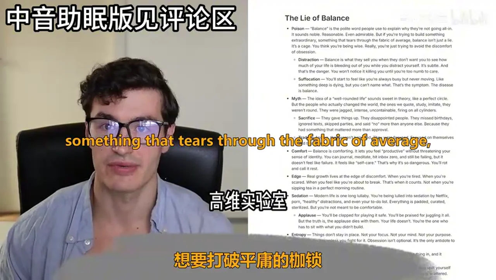

### 关键帧 3

### 关键帧 4

### 关键帧 5

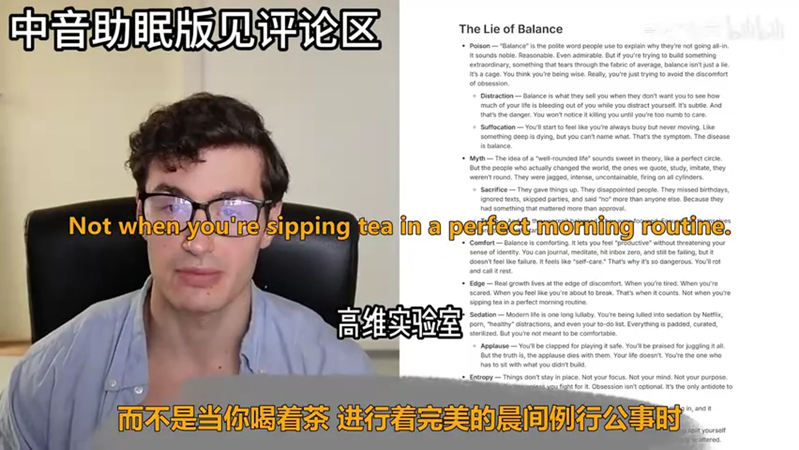

### 关键帧 6

### 关键帧 7

### 关键帧 8

### 关键帧 9

### 关键帧 10

