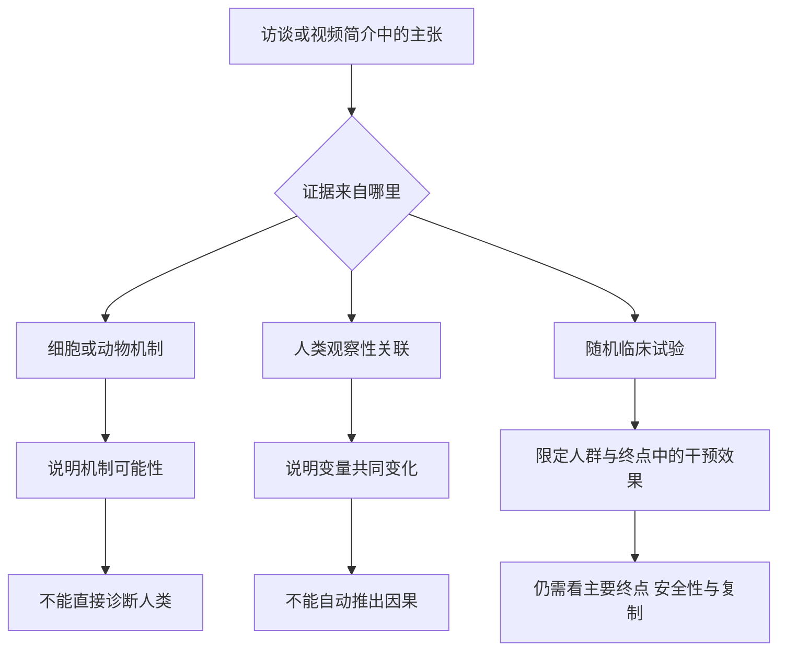
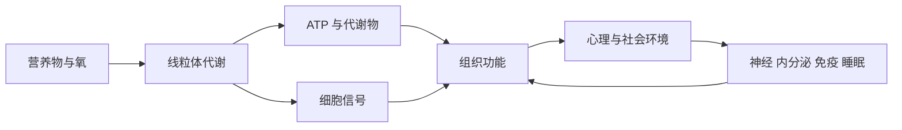
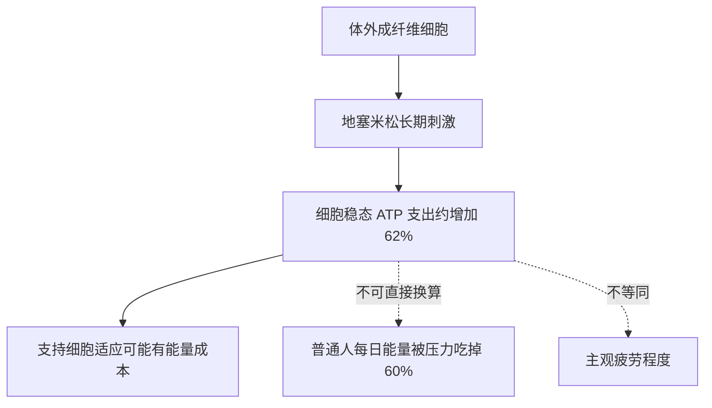
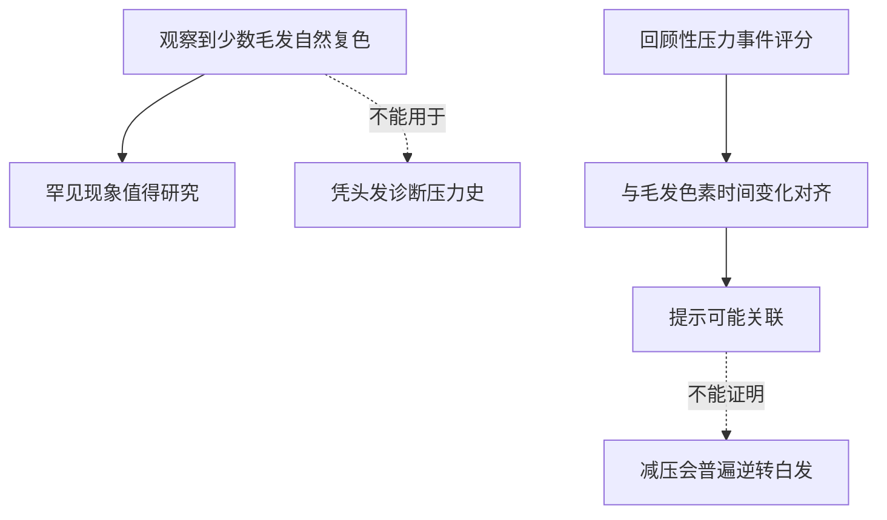
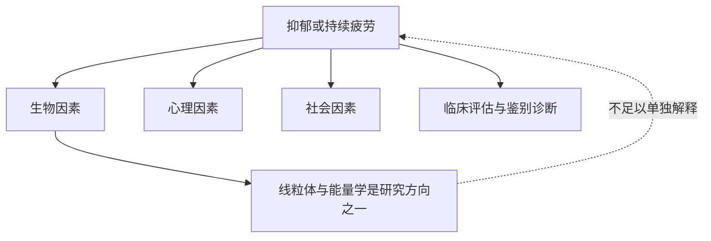
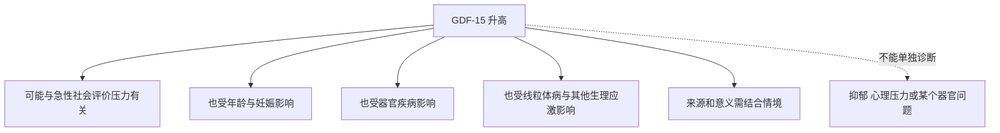
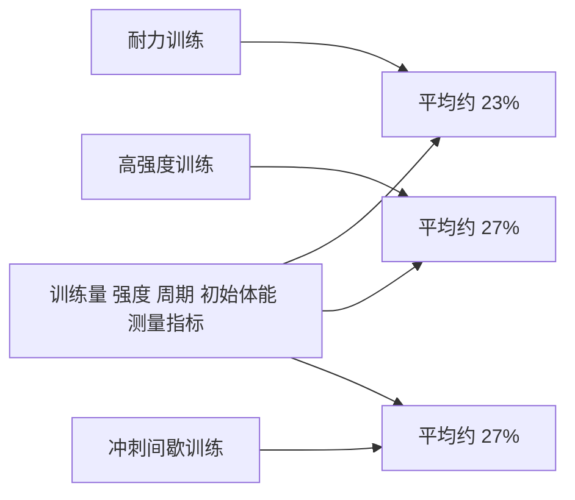
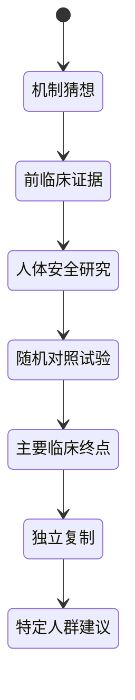
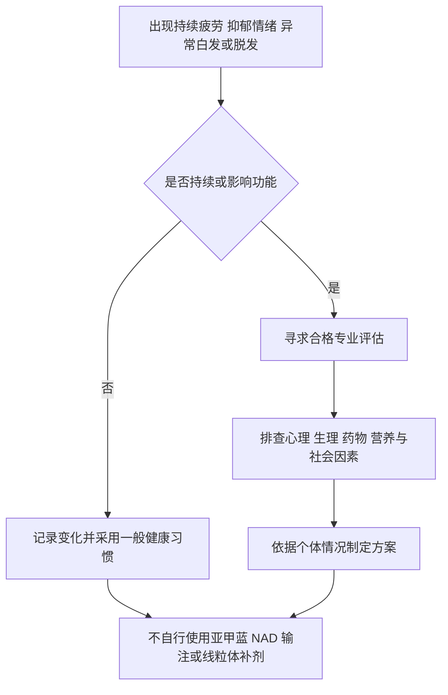

# 总结稿

[打开单页 HTML 总结](assets/bilibili-BV1oNgG69E9v-summary.html)

> [!warning] 来源完整性警告
> 源 ASR 在 **03:19–99:49 大面积损坏**，主要是与连续语音不符的重复短句；99:51–101:43 仍明显降质，127:17 后又变成重复字幕署名。本摘要主要依据 **101:44–122:20 的可恢复访谈段、入选画面与外部事实核验**，不会把视频简介或损坏段落伪装成完整逐字稿。

## 先说结论

本期围绕 Columbia University 行为医学教授、Mitochondrial Psychobiology Group 负责人 **Martin Picard, PhD** 的研究框架展开；其身份与职务由 [Martin Picard, PhD | Columbia Neurology](https://www.neurology.columbia.edu/profile/martin-picard-phd) 确认。心理社会体验与线粒体生物学可能双向关联。不过，“线粒体参与某过程”不等于“线粒体是唯一原因”，更不等于已经找到诊断或治疗。Picard 团队 2025 年的人脑线粒体图谱来自一名供体的冷冻脑组织，是重要的方法资源，不是活体全脑测量，详见 [A human brain map of mitochondrial respiratory capacity and diversity](https://www.nature.com/articles/s41586-025-08740-6)。

## 必须分开的三层

### 机制与实验模型

- 线粒体参与氧化磷酸化、代谢与细胞信号，不只是“能量电池”。动物实验支持压力可改变脑线粒体状态，直接操纵脑内线粒体也可改变某些行为指标；这是**小鼠机制证据**，不能直接当成人类抑郁或治疗证据。
- GDF-15 可在急性社会评价压力任务后短时升高，但它也受年龄、妊娠、器官疾病和多种生理应激影响，不能作为个人心理压力、抑郁或“能量阻力”的特异性诊断。相关人体研究见 [The energetic stress cytokine GDF15 is elevated in the context of chronic and acute psychosocial stress](https://pmc.ncbi.nlm.nih.gov/articles/PMC11042343/) 与 [Biopsychosocial correlates of resting and stress-reactive salivary GDF15: preliminary findings](https://pubmed.ncbi.nlm.nih.gov/40782989/)。

### 人类观察性关联

- 一项约 400 人的老年队列把生前心理社会自评与死后背外侧前额叶蛋白组学相结合，较积极体验与较高的线粒体氧化磷酸化蛋白丰度相关。它不能证明“设定目标会增强脑线粒体”或“目的感治疗抑郁”。来源：[Psychosocial experiences are associated with human brain mitochondrial biology](https://pmc.ncbi.nlm.nih.gov/articles/PMC11228499/)。
- 白发自然复色在一项探索性研究中得到观察，但 2.5 年主动招募仅找到 **14 名**符合条件者，现象罕见、发生率未知；生活压力与单根毛发色素变化的对齐来自回顾性事件报告，不是减压治疗试验。来源：[Quantitative mapping of human hair greying and reversal in relation to life stress](https://elifesciences.org/articles/67437)。

### 临床结论与个体建议

- 现有材料不支持用“线粒体效率低”统一解释疲劳、抑郁、倦怠、白发或癌症。
- 不支持依据本视频检测或治疗 GDF-15，也不支持自行使用亚甲蓝、NAD+ 输注、尿石素 A 或所谓“线粒体补剂”。
- 若持续疲劳、抑郁情绪、功能受损、异常或突然增加的白发/脱发，应寻求合格专业人员评估，而不是自行诊断为“线粒体功能障碍”。

## 六个最容易误读的说法

1. **“压力消耗每日 60% 能量”——不成立。** 最吻合的原研究是在 3 条人原代成纤维细胞系中，以 100 nM 地塞米松长期激活糖皮质激素受体，细胞稳态 ATP 支出平均增加约 62%。这不是人体每日热量或主观精力测量，也不是日常心理压力实验。来源：[Cellular allostatic load is linked to increased energy expenditure and accelerated biological aging](https://pmc.ncbi.nlm.nih.gov/articles/PMC10528419/)。
2. **“白发能靠减压普遍逆转”——证据不足。** 小样本研究只记录到少数孤立毛囊自然复色，不能把头发当作压力诊断仪，也没有证明减压能可靠逆转既有白发。
3. **“运动让肌肉线粒体翻倍”——过度泛化。** 353 篇研究、5,973 名参与者的综述显示，耐力训练、高强度训练和冲刺间歇训练的线粒体含量平均增幅约为 **23%、27%、27%**；个别条件可能更高，但“人人翻倍”并非综合结果。来源：[Effects of Exercise Training on Mitochondrial and Capillary Growth in Human Skeletal Muscle: A Systematic Review and Meta-Regression](https://pmc.ncbi.nlm.nih.gov/articles/PMC11787188/)。
4. **“抑郁本质是线粒体能量病”——不成立。** 访谈自己使用了 “we’re theorizing” 和 “my hunch”；WHO 将抑郁描述为社会、心理与生物因素复杂互动的结果。来源：[Depression | World Health Organization](https://www.who.int/health-topics/depression)。
5. **“癌细胞放弃线粒体”——不成立。** Warburg 效应不等于线粒体关闭；许多肿瘤仍依赖线粒体的生物合成、信号与部分供能，且癌种、阶段和环境差异很大。参见 NCI 的 [Powering Off Cancer](https://www.cancer.gov/research/key-initiatives/ras/news-events/dialogue-blog/2017/targeting-mitochondria)。
6. **“有目的感会直接增强线粒体”——只见相关性。** 观察性死后脑组织研究无法确定是目的感影响线粒体、线粒体状态影响体验，还是共同因素同时影响两者。

## 关于补剂与治疗邻近主张

- **亚甲蓝**：访谈只提出可能参与电子转移的机制猜想，讲者也承认不知道它如何产生所有声称效果。它是有适应证、相互作用和禁忌证的药物，不建议自行使用。
- **NAD+**：不同前体、给药途径和剂量不能混为一谈；访谈明确指出 IV NAD+ 并非获批或推荐干预，个案体验不能证明疗效。
- **尿石素 A**：一项 66 名、65–90 岁成人、1000 mg/日、4 个月的双盲 RCT 中，若干次要肌耐力指标与部分标志物改善，但共同主要终点中的 6 分钟步行距离和最大 ATP 生成未显著优于安慰剂；样本单一且有产业关联，不能推广为人人应补充。来源：[Effect of Urolithin A Supplementation on Muscle Endurance and Mitochondrial Health in Older Adults: A Randomized Clinical Trial](https://pubmed.ncbi.nlm.nih.gov/35050355/)。
- **抗氧化剂**：饮食中的抗氧化成分与高剂量补剂不是一回事；不能把“过量可能干扰适应”误写成抗氧化食物有害。

## 可以安全带走的实践理解

- 规律睡眠、适量运动、均衡饮食、社会连接与接触自然可能有一般健康价值，但不能把它们统一宣传成“降低 GDF-15”或“逆转线粒体疾病”的已证实疗法。
- 运动确实能促进骨骼肌线粒体适应，但强度、训练量、基础体能和测量指标决定效应；马拉松不是通用处方。
- “能量”“阻力”“流动”“目标像磁铁”在访谈中兼有生物学与哲学含义。比喻有启发性，但不能直接换算为 ATP、疾病机制或疗效。

### 观众讨论与样本限制

观众自述同时出现压力后进食增加和食欲下降，也有人把休息后的白发/掉发变化解释为减压效果；这些相互矛盾的个案恰好提醒我们，个人经历不是因果证据。评论还指出字幕可能把 `energy` 误译成“音乐”，并追问“马拉松让线粒体翻倍”的研究出处，这两点适合作为质量核验线索。

评论源平台报告 119 条，实际抓取 49 条顶层热门评论，候选只保留 20 条且没有嵌套回复，存在热门偏差；弹幕只有 2 条 `current_accessible` 记录，并非历史全集，不能据此推断整体态度或热点。

## 医疗安全提示

本文是研究与访谈内容整理，**不是诊断或治疗建议**。持续疲劳、抑郁情绪或功能受损需要专业评估；异常白发、脱发或其他身体变化也应结合遗传、营养、内分泌、自身免疫、药物等多种可能原因判断。不要仅凭本视频自行服用补剂、亚甲蓝或接受 NAD+ 输注。

# 辅助理解

> [!danger] 先处理证据完整性
> 源 ASR 在 **03:19–99:49 大面积损坏**，无法作为连续音频证据；99:51–101:43 仍有混语和错漏，127:17 后主要是重复字幕署名。以下理解主要建立在 **101:44–122:20 可恢复段、视觉入选帧与外部核验**之上。损坏段和视频简介中的主张只在能找到原始研究时讨论，不假装已经恢复完整访谈。

## 这期真正讨论的研究框架

Martin Picard, PhD 现为 Columbia University Professor of Behavioral Medicine，并领导 Mitochondrial Psychobiology Group；官方身份来源为 [Martin Picard, PhD | Columbia Neurology](https://www.neurology.columbia.edu/profile/martin-picard-phd)。“线粒体心理生物学”关注心理与社会体验如何同细胞能量代谢、线粒体信号和全身生理相互关联。它是一套研究框架，不是把一切症状归因于线粒体的诊断学。

这三个层次不能互换：小鼠行为变化不是人类抑郁；死后脑组织相关性不是“目的感疗法”；补剂改变某个标志物也不等于改善患者重要结局。

## 线粒体不是一块独立决定命运的电池

线粒体参与营养物氧化、氧化磷酸化、代谢物与信号调节，也会随组织、年龄、活动和疾病环境改变。把人体“能量”全部等同于线粒体 ATP，或把疲劳直接等同于“线粒体耗尽”，都会漏掉神经、内分泌、免疫、睡眠、营养、心肺功能、药物和社会心理等层面。

这张线粒体结构示意图适合建立形态直觉，但不能告诉我们具体细胞类型、呼吸能力或某人的疾病状态。

实体模型帮助理解内膜褶皱和能量转换主题；帧内“食物会消耗氧气”只是句中片段，不能据此补写完整呼吸链机制。

核验还确认，Picard 团队 2025 年发表了人脑线粒体呼吸能力图谱，但范围非常有限：研究来自**一名供体的一张冷冻冠状半球切片**，划分 703 个 3×3×3 mm 体素并结合神经影像预测。它是方法与资源，不是活体全脑测量，也不能单独证明线粒体决定心理、衰老或疾病。来源：[A human brain map of mitochondrial respiratory capacity and diversity](https://www.nature.com/articles/s41586-025-08740-6)。

## “压力消耗 60% 能量”是怎样被误读出来的

视频预告或简介把“60%”包装成日常心理压力消耗个人每日能量。最匹配的原研究并没有测量人的每日热量或主观精力：研究者在 **3 条原代人类成纤维细胞系**中，以 **100 nM 地塞米松**长期激活糖皮质激素受体，观察到细胞稳态 ATP 合成/消耗所表示的能量支出平均增加约 **62%**。来源：[Cellular allostatic load is linked to increased energy expenditure and accelerated biological aging](https://pmc.ncbi.nlm.nih.gov/articles/PMC10528419/)。

这里至少跨越了三次不允许的外推：细胞到全身、药理刺激到日常心理压力、相对 ATP 支出到每日卡路里比例。因而“压力占用你 60% 的能量”应明确判为不成立，而不是仅写“可能有争议”。

## 白发：观察到罕见复色，不等于找到逆转疗法

[Quantitative mapping of human hair greying and reversal in relation to life stress](https://elifesciences.org/articles/67437) 这项 eLife 探索性研究确认，个别人的少数孤立毛囊出现自然复色；但研究用 2.5 年主动招募只找到 **14 名符合条件者**，论文称现象罕见，真实发生率未知。研究把若干参与者回顾性报告的压力事件与单根毛发色素变化对齐，这能生成假说，却不是随机减压试验。

合理结论是“人的白发并非在所有毛囊中绝对不可逆，且少数毛发变化可能与生活事件同步”；不合理结论则是“睡好、辞职或减压就能让既有白发变黑”。遗传、年龄、营养缺乏、甲状腺与自身免疫问题、药物、染发和光照记录等都可能影响个体观察。

## 目的感与脑线粒体：漂亮的关联，尚未解决方向

可恢复访谈描述一个 Chicago 老年队列：参与者生前多年报告目的感、社会连接和心理状态，死后分析背外侧前额叶。核验到的 PNAS 研究样本约 **400 人**，较积极的心理社会体验与更高的线粒体氧化磷酸化蛋白丰度相关。来源：[Psychosocial experiences are associated with human brain mitochondrial biology](https://pmc.ncbi.nlm.nih.gov/articles/PMC11228499/)。

访谈把目标比作“能量的磁铁”，这是哲学隐喻。研究没有证明设定目标会直接提升脑线粒体，更没有证明目的感可以治疗抑郁、疲劳或延缓衰老。因果方向也可能相反，或由共同因素造成。

## 抑郁与倦怠：机制假说不能吞掉临床复杂性

在 105 分钟后的可恢复段，访谈把缺乏目的、线粒体效率、疲劳、悲观与抑郁/倦怠串联起来；但讲者明确说 **“we’re theorizing here”** 和 **“my hunch”**。事实核验据此把“抑郁本质是线粒体能量病”判为不成立。

[Depression | World Health Organization](https://www.who.int/health-topics/depression) 将抑郁理解为社会、心理和生物因素复杂互动的结果。目的感、社会连接与生活结构可能对部分人的健康重要，但不能替代对抑郁严重程度、自伤风险、睡眠、药物、内分泌与其他疾病的专业评估。

## GDF-15：动态应激标志物，不是心理压力检测器

访谈把 GDF-15 描述为“能量阻力”信号。[The energetic stress cytokine GDF15 is elevated in the context of chronic and acute psychosocial stress](https://pmc.ncbi.nlm.nih.gov/articles/PMC11042343/) 汇总 4 项人体研究、148 名健康参与者，在两项社会评价压力任务后观察到血浆或唾液 GDF-15 数分钟内升高；[Biopsychosocial correlates of resting and stress-reactive salivary GDF15: preliminary findings](https://pubmed.ncbi.nlm.nih.gov/40782989/) 这项 198 人探索研究报告任务后约 10 分钟平均升高 28.3%。这支持它具有动态应激反应，但不支持特异诊断。

访谈自己也承认，不知道升高来自心理压力、身体压力还是某个处境困难的器官。因而不应基于视频自行检测、追求降低 GDF-15，或把不想运动、社交退缩直接解释为 GDF-15 高。

## 运动：可靠的适应方向，不可靠的“翻倍”口号

[Effects of Exercise Training on Mitochondrial and Capillary Growth in Human Skeletal Muscle: A Systematic Review and Meta-Regression](https://pmc.ncbi.nlm.nih.gov/articles/PMC11787188/) 覆盖约 50 年、**353 篇研究和 5,973 名参与者**。在调整训练频率、周数和初始体能等因素后，耐力训练、高强度训练和冲刺间歇训练的骨骼肌线粒体含量平均增幅约为 **23%、27%、27%**。不同指标、训练量、强度与基础体能会带来更大或更小结果，个别方案可能接近翻倍，但不能概括为“跑马拉松通常使线粒体数量翻倍”。

“肌肉活检”画面展示运动研究证据链中的取样步骤：研究者需要取组织并测量具体指标，而不是依据主观精神或头发变化判断线粒体。它不能单独证明样本量、训练周期或翻倍幅度。这里不使用白发道具与马拉松字幕同框的 frame 4，以免暗示运动可以逆转白发。

## 癌症：Warburg 效应不等于关闭线粒体

“癌细胞放弃线粒体”被事实核验判为不成立。NCI 的 [Powering Off Cancer](https://www.cancer.gov/research/key-initiatives/ras/news-events/dialogue-blog/2017/targeting-mitochondria) 说明，许多肿瘤即使有氧也表现出较高糖摄取和乳酸生成，但仍会利用线粒体获得生物合成原料、信号功能和部分能量；电子传递链与氧化磷酸化在不少肿瘤中仍然活跃。癌症代谢随癌种、阶段、微环境和治疗压力高度异质，不能用一个口号指导防癌或治疗，更不能由此推销“修复线粒体”的消费产品。

## 补剂与药物：机制可讲，处方不能跳步

- **亚甲蓝**：访谈只提出电子转移的可能机制，讲者承认不清楚它如何产生所有声称效果。亚甲蓝是药物，存在剂量、相互作用和禁忌证，不能自行用于“提升线粒体”或改善疲劳。
- **NAD+**：口服前体与静脉 NAD+ 不是同一干预；访谈明确指出 IV NAD+ 不是获批或推荐治疗。生化角色与个案体验都不能代替临床疗效证据。
- **尿石素 A**：[Effect of Urolithin A Supplementation on Muscle Endurance and Mitochondrial Health in Older Adults: A Randomized Clinical Trial](https://pubmed.ncbi.nlm.nih.gov/35050355/) 纳入 66 名 65–90 岁成人，使用 1000 mg/日、持续 4 个月；若干次要肌耐力终点和部分标志物改善，但共同主要终点中的 6 分钟步行距离与最大 ATP 生成未显著优于安慰剂。样本全部为白人、女性为主，且部分作者与产品公司有关。结果值得继续研究，不等于人人该补。
- **抗氧化剂**：高剂量补剂在特定运动适应情境中的影响，不能外推成抗氧化食物有害，也不能把所有化合物和剂量视为相同。

## 如何把这期内容用于自己，而不自我诊断

一般性的睡眠、适量运动、均衡饮食、社会连接和接触自然可以作为生活方式讨论，但不能声称它们特异降低 GDF-15、逆转白发、治愈抑郁或治疗线粒体疾病。马拉松等高强度耐力运动需要循序渐进和个体风险评估。

### 观众讨论与样本限制

观众评论呈现出压力后进食增加与食欲下降两种相反经历，也有人将休息后的白发或掉发变化理解为减压效果。这些匿名回忆能说明体验异质性，不能证明压力、线粒体与症状之间的因果。评论中最有价值的纠错线索是 `energy` 可能被误译为“音乐”，以及对“马拉松使线粒体翻倍”研究出处的追问。

评论源平台报告 **119** 条，实际抓取 **49** 条顶层热门评论，候选只有 20 条且没有嵌套回复，存在热门偏差；弹幕只有 **2 条 `current_accessible`** 记录，并非历史全集，60–90 秒桶 count 2、burst score 0，不能称为热点或代表总体情绪。

## 最终理解

这期最有价值的认识是：心理社会体验、身体状态与细胞能量生物学可能在多层次上相互关联；最危险的误读则是把这种关联压缩成“一切都是线粒体”。

- **机制层**可以提出压力、线粒体与行为之间的双向通路。
- **人类观察层**可以发现目的感、白发变化或生物标志物之间的关联。
- **临床层**仍需要明确人群、诊断、主要终点、安全性与独立复制。

因此，持续症状应得到专业评估；研究线索可以帮助提出更好的问题，却不能替代诊断，也不能替亚甲蓝、NAD+ 或其他补剂生成处方。

## 外部事实核验

### 声明 1（00:00）

- 视频陈述：视频简介把 Martin Picard 介绍为行为医学教授和线粒体心理生物学研究团队负责人。
- 核验状态：已确认
- 核验结果：确认。哥伦比亚大学医学中心当前官方档案将 Martin Picard 列为 Professor of Behavioral Medicine（任职于 Psychiatry、Neurology 与 Robert N. Butler Columbia Aging Center），并写明他在 CUIMC 领导 Mitochondrial Psychobiology Group、2015 年加入哥伦比亚大学。正式写作宜使用这一完整职称，而不是泛称神经科学家或临床医生。
- 检索日期：2026-08-20
- 来源：
  - [Martin Picard, PhD | Columbia Neurology](https://www.neurology.columbia.edu/profile/martin-picard-phd)（primary）

### 声明 2（00:00）

- 视频陈述：视频简介称 Picard 团队建立了人脑线粒体图谱。
- 核验状态：已确认
- 核验结果：确认，但必须保留研究范围。Nature 论文于 2025 年 3 月 26 日发表，研究把一名供体的一张冷冻人脑冠状半球切片划分为 703 个 3×3×3 mm 体素，测量 OXPHOS 酶活、mtDNA、线粒体体积密度和呼吸能力，再结合神经影像建立全脑预测图；模型只在同一供体的独立脑区中验证。它是重要的方法与资源，不是活体全脑测量，也不能单独证明线粒体决定心理、衰老或疾病。论文于 2025 年 5 月另有作者更正。
- 检索日期：2026-08-20
- 来源：
  - [A human brain map of mitochondrial respiratory capacity and diversity](https://www.nature.com/articles/s41586-025-08740-6)（primary）

### 声明 3（00:55）

- 视频陈述：预告与简介把 60% 解释为心理压力会消耗个人每日能量。
- 核验状态：存在矛盾
- 核验结果：该面向个人的解释不成立。与“60%”最吻合的原始研究是体外细胞实验：研究者纵向观察 3 条彼此无关的原代人类成纤维细胞系，并以 100 nM 地塞米松长期激活糖皮质激素受体；稳态 ATP 合成/消耗所表示的细胞能量支出平均增加约 62%。这不是对人在日常压力下的全身热量或主观精力测量，也不是心理压力干预，因此不能外推为普通压力占用个人每日能量的 60%。
- 检索日期：2026-08-20
- 来源：
  - [Cellular allostatic load is linked to increased energy expenditure and accelerated biological aging](https://pmc.ncbi.nlm.nih.gov/articles/PMC10528419/)（primary）

### 声明 4（00:18）

- 视频陈述：白发能够逆转，头发的明暗变化还能映射压力事件。
- 核验状态：部分确认
- 核验结果：部分确认，证据是小样本、探索性的。eLife 研究在 2.5 年主动招募中仅找到 14 名符合条件的参与者，记录到少数孤立毛囊的自然复色；论文明确称这种现象罕见、真实发生率未知。研究还把若干参与者回顾性报告的生活事件/压力评分与单根毛发色素变化对齐，给出压力增加伴随变白、压力解除伴随复色的例子，但这不是随机实验，也不能把单根头发当成可靠的压力诊断工具。研究没有证明减压可普遍逆转既有白发，更不是治疗试验。
- 检索日期：2026-08-20
- 来源：
  - [Quantitative mapping of human hair greying and reversal in relation to life stress](https://elifesciences.org/articles/67437)（primary）

### 声明 5（01:58:27）

- 视频陈述：视频简介称运动或马拉松训练可以让肌肉线粒体翻倍。
- 核验状态：部分确认
- 核验结果：运动促进骨骼肌线粒体适应是确认的，但“通常翻倍”不是现代综合证据的平均结果。覆盖约 50 年、353 篇研究和 5,973 名参与者的系统综述与荟萃回归显示，经训练频率、周数和初始体能等调整后，耐力训练、高强度训练和冲刺间歇训练的线粒体含量平均增幅约为 23%、27% 和 27%。更高训练量、强度以及较低初始体能可产生更大增幅，历史上的个别方案或特定指标可能接近翻倍，但不能把这种条件化结果推广到所有运动者或所有“线粒体数量”测量。
- 检索日期：2026-08-20
- 来源：
  - [Effects of Exercise Training on Mitochondrial and Capillary Growth in Human Skeletal Muscle: A Systematic Review and Meta-Regression](https://pmc.ncbi.nlm.nih.gov/articles/PMC11787188/)（primary）

### 声明 6（01:43:00）

- 视频陈述：报告更多目的感的人，其脑组织呈现更高的线粒体能量转化能力。
- 核验状态：部分确认
- 核验结果：只确认相关性，不能确认因果。PNAS 研究把 ROS/MAP 老年队列的生前纵向自评与死后背外侧前额叶蛋白组学相结合，样本约 400 人；更积极的体验与较高的线粒体氧化磷酸化蛋白丰度相关，更负面的体验与较低丰度相关。它是观察性、死后组织研究，研究者也明确指出方向性和机制仍需进一步检验。目的感可能是复合正向评分的一部分，但不能据此说设定目标会直接增强线粒体、治疗抑郁或延缓衰老。
- 检索日期：2026-08-20
- 来源：
  - [Psychosocial experiences are associated with human brain mitochondrial biology](https://pmc.ncbi.nlm.nih.gov/articles/PMC11228499/)（primary）

### 声明 7（01:45:12）

- 视频陈述：缺乏目的可能改变线粒体并造成疲劳、悲观，最终被命名为抑郁或倦怠。
- 核验状态：存在矛盾
- 核验结果：作为已确立的单一病因说法不成立。WHO 将抑郁描述为社会、心理和生物因素复杂相互作用的结果；线粒体与生物能量学是正在研究的潜在机制之一，但现有人体关联和动物机制研究不足以把抑郁统一归结为线粒体能量不足。视频在相邻段落也把这套解释称为“we’re theorizing”与“hunch”，因此笔记应明确标为假说，不能替代临床定义、鉴别诊断或治疗证据。
- 检索日期：2026-08-20
- 来源：
  - [Depression | World Health Organization](https://www.who.int/health-topics/depression)（primary）
  - [Psychosocial experiences are associated with human brain mitochondrial biology](https://pmc.ncbi.nlm.nih.gov/articles/PMC11228499/)（primary）

### 声明 8（01:46:47）

- 视频陈述：视频简介用“癌细胞放弃线粒体”概括癌症代谢。
- 核验状态：存在矛盾
- 核验结果：不成立。Warburg 效应是许多肿瘤细胞即使有氧仍偏高地进行葡萄糖摄取和乳酸生成，并不等于线粒体失去功能。NCI 对癌症代谢研究的说明指出，癌细胞仍依赖线粒体获得生物合成原料、信号功能和部分能量；电子传递链与氧化磷酸化在不少肿瘤中仍活跃且可能是治疗靶点。肿瘤代谢高度异质，必须限定癌种、阶段和环境，不能从 Warburg 效应推导“癌细胞放弃线粒体”。
- 检索日期：2026-08-20
- 来源：
  - [New Clarity on the Warburg Effect](https://frederick.cancer.gov/news/new-clarity-warburg-effect)（primary）
  - [Powering Off Cancer](https://www.cancer.gov/research/key-initiatives/ras/news-events/dialogue-blog/2017/targeting-mitochondria)（primary）

### 声明 9（01:48:58）

- 视频陈述：GDF-15 会在社会评价压力任务后升高，并被解释为身体向大脑发送的能量阻力信号。
- 核验状态：部分确认
- 核验结果：实验性升高部分得到支持，但特异性解释不成立。原始研究汇总 4 项人体研究、148 名健康参与者，在两项实验室社会评价压力任务中观察到血浆和唾液 GDF-15 在数分钟内上升；2025 年另一项 198 人探索研究也报告唾液 GDF-15 在任务后约 10 分钟平均上升 28.3%。然而 GDF-15 同时受年龄、妊娠、器官疾病、线粒体疾病和多种生理应激影响，现有研究称其为动态/探索性标志物，不是可诊断心理压力、抑郁或个体症状来源的特异性检测。
- 检索日期：2026-08-20
- 来源：
  - [The energetic stress cytokine GDF15 is elevated in the context of chronic and acute psychosocial stress](https://pmc.ncbi.nlm.nih.gov/articles/PMC11042343/)（primary）
  - [Biopsychosocial correlates of resting and stress-reactive salivary GDF15: preliminary findings](https://pubmed.ncbi.nlm.nih.gov/40782989/)（primary）

### 声明 10（01:58:44）

- 视频陈述：一项 65–90 岁成人试验显示尿石素 A 改善肌肉耐力和线粒体生物标志物。
- 核验状态：部分确认
- 核验结果：部分确认。该双盲随机安慰剂对照试验纳入 66 名 65–90 岁成人，1000 mg/日、持续 4 个月；若干手部和腿部肌肉耐力的次要终点以及部分血浆标志物优于安慰剂。但共同主要终点中的 6 分钟步行距离和最大 ATP 生成并未显著优于安慰剂。样本全部为白人、以女性为主，且部分作者与产品公司 Amazentis 有关联；论文结论本身也要求未来研究确认。故不能概括成已证明普遍改善线粒体功能或推荐所有人补充。
- 检索日期：2026-08-20
- 来源：
  - [Effect of Urolithin A Supplementation on Muscle Endurance and Mitochondrial Health in Older Adults: A Randomized Clinical Trial](https://pubmed.ncbi.nlm.nih.gov/35050355/)（primary）

# Data

## 增强转写稿

# Corrected Transcript

- Video ID: `BV1oNgG69E9v`
- Domain: medicine/health communication; mitochondrial biology; mitochondrial psychobiology; stress physiology
- Guest (from manifest metadata): Dr. Martin Picard. This identity and all credentials require external verification before publication.
- Editorial rule: timestamps and source-line order are preserved exactly. Only high-confidence spelling, spacing, and biomedical proper-term errors were corrected; unclear source text was not reconstructed from guesswork.
- **Severe source warning:** the supplied ASR is catastrophically degraded over long spans. Roughly `03:19–99:49` consists mainly of repeated Chinese phrases unrelated to continuous speech, `99:51–101:43` is mixed-language and low quality, and after about `127:17` the transcript becomes repeated subtitle-credit text. These lines are retained to preserve timestamp integrity, but they are not reliable evidence of the audio. Claims absent from the usable transcript must not be inferred from the manifest description alone.
- Medical safety: this transcript records interview claims and sponsor language. It is not medical advice, diagnosis, or evidence that any supplement or intervention is safe or effective.

## Terminology

- **mitochondria / mitochondrial** — 线粒体；细胞能量代谢和多种信号过程相关细胞器，不能简化为单一“能量电池”。
- **mitochondrial psychobiology** — 线粒体心理生物学；研究心理/社会经历与线粒体生物学相互关系的研究框架。
- **GDF-15 (growth differentiation factor 15)** — 生长分化因子 15；应视为多情境生物标志物/信号蛋白，不能仅凭访谈称作单一“压力化学物”。
- **area postrema** — 最后区；位于延髓、参与恶心/呕吐等生理反应。
- **dorsolateral prefrontal cortex** — 背外侧前额叶皮层。
- **autophagy / mitophagy** — 自噬 / 线粒体自噬。
- **NAD+** — 烟酰胺腺嘌呤二核苷酸的氧化态；代谢辅酶，不等同于已证实适用于健康人的补充疗法。
- **methylene blue** — 亚甲蓝；药物/化合物，访谈中的机制推测不可当作用药建议。
- **urolithin A** — 尿石素 A；与线粒体自噬及肌肉功能相关研究中的化合物。
- **oxidative stress / antioxidants** — 氧化应激 / 抗氧化剂。
- **BON CHARGE** — 约 `122:26` 起赞助商片段中的品牌名；广告主张与科学访谈证据必须分开。
- **Johann Hari / Lost Connections** — 被访谈提及的作者与书名。

## Transcript
[00:00] 這是一個不可思議的證明
[00:02] 髮型的繩子是否可返的
[00:03] 而且可以很快的
[00:05] 哇 還有更多的
[00:06] 我們都走在這段歷史上
[00:09] 用你的髮型來揭曉
[00:10] 例如 如果你有馬來西亞旅行六個月前
[00:12] 你會用你的髮型來揭曉
[00:14] 你還要用髮型來揭曉嗎?
[00:16] 我騙你
[00:17] 我的研究 lab 提供了一個方法
[00:19] 如果我們能找到什麼在這個人的生活中
[00:22] 當這個年輕的髮型變老了
[00:24] 我們能明白這個程度的理由
[00:27] 這是什麼意思? 去代理的?
[00:29] 這是一個正確的揭曉力
[00:32] 你能否解釋一下?
[00:35] 首先 能夠有真正的力量
[00:37] 這是一個不一樣的分別
[00:38] 你能夠改變世界
[00:40] 或是完全改變世界的感覺
[00:42] 很多人都在那邊生活在這個角度
[00:44] 因為我們有一個充滿力量的預算
[00:47] 和體力需要的方式
[00:49] 例如我們做了一個測試
[00:50] 因為我們想知道
[00:51] 如何能夠擔心力量的問題
[00:52] 去擔心未來的問題
[00:54] 去想想明天的問題
[00:55] 我們發現 體力的測試力量增加了60%
[01:00] 所以需要一些力量的方式
[01:02] 來保持你年輕的體力
[01:03] 所以不只是體力的測試力量
[01:06] 而是體力的回應
[01:07] 第三個問題是這個
[01:09] 體力是從你的大腿來的
[01:11] 你的大腿有約5,000 千萬的大腿
[01:14] 所以他們能夠改變你的體力
[01:17] 我聽說了
[01:19] 在人生中的學生們讀書
[01:20] 他們發現那些最大的體力
[01:23] 能夠更能力量的體力嗎?
[01:25] 我們是在貿易中的貿易中的工作
[01:28] 他們讓我們生活得到的
[01:30] 好 我有很多問題
[01:31] 在於大家想知道
[01:32] 像是 能夠讓人體力和體力的病毒
[01:35] 能夠安全地擔心貿易中的體力嗎?
[01:38] 我猜測如何能夠影響能力的能力?
[01:42] 如果像是體力 能夠影響貿易中的體力
[01:45] 還有可以做到更多的能力嗎?
[01:48] 但之前 我聽說過
[01:49] 很多病毒和體力能夠解釋能力和體力的能力
[01:54] 我們認為 能力和體力增加更多的能力
[01:57] 像是奧斯艾瑪斯
[01:58] 基本上 體力增加是能力和體力的能力
[02:01] 所以 能做到什麼呢?
[02:03] 能做到 開始吧
[02:19] 如果大家喜歡我們的節目
[02:21] 請按下訂閱按鈴
[02:23] 如果大家喜歡我們的節目
[02:25] 請按下訂閱按鈴
[02:26] 如果大家喜歡我們的節目
[02:29] 請按下訂閱按鈴
[02:30] 如果大家喜歡我們的節目
[02:31] 請按下訂閱按鈴
[02:33] 如果大家喜歡我們的節目
[02:34] 請按下訂閱按鈴
[02:36] 如果大家喜歡我們的節目
[02:37] 請按下訂閱按鈴
[02:39] 如果大家喜歡我們的節目
[02:41] 請按下訂閱按鈴
[02:43] 如果大家喜歡我們的節目
[02:44] 請按下訂閱按鈴
[02:46] 如果大家喜歡我們的節目
[02:47] 請按下訂閱按鈴
[02:49] 如果大家喜歡我們的節目
[02:50] 請按下訂閱按鈴
[02:51] 如果大家喜歡我們的節目
[02:53] 請按下訂閱按鈴
[02:55] 請按下訂閱按鈴
[02:57] 我們就開始吧
[03:19] 我們開始了解一下 什麼是能力和體力的能力?
[03:25] 我們開始了解一下 什麼是能力和體力的能力?
[03:29] 我們開始了解一下 什麼是能力和體力的能力?
[03:32] 我們開始了解一下 什麼是能力和體力的能力?
[03:35] 我們開始了解一下 什麼是能力和體力的能力?
[03:39] 我們開始了解一下 什麼是能力和體力?
[03:43] 我們開始了解一下 什麼是能力和體力?
[03:47] 我們開始了解 什麼是能力和體力?
[03:50] 我們開始了解 什麼是能力和體力?
[03:53] 我們開始了解 什麼是能力和體力?
[03:56] 我們開始了解 什麼是能力和體力?
[03:59] 我們開始了解 什麼是能力和體力?
[04:02] 我們開始了解 什麼是能力和體力?
[04:05] 我們開始了解 什麼是能力和體力?
[04:08] 我們開始了解 什麼是能力和體力?
[04:11] 我們開始了解 什麼是能力和體力?
[04:14] 我們開始了解 什麼是能力和體力?
[04:16] 我們開始了解 什麼是能力和體力?
[04:18] 我們開始了解 什麼是能力和體力?
[04:21] 我們開始了解 什麼是能力和體力?
[04:24] 我們開始了解 什麼是能力和體力?
[04:27] 我們開始了解 什麼是能力和體力?
[04:30] 我們開始了解 什麼是能力和體力?
[04:33] 我們開始了解 什麼是能力和體力?
[04:36] 我們開始了解 什麼是能力和體力?
[04:39] 我們開始了解 什麼是能力和體力?
[04:42] 我們開始了解 什麼是能力和體力?
[04:45] 我們開始了解 什麼是能力和體力?
[04:48] 我們開始了解 什麼是能力和體力?
[04:51] 我們開始了解 什麼是能力和體力?
[04:54] 我們開始了解 什麼是能力和體力?
[04:57] 我們開始了解 什麼是能力和體力?
[05:00] 我們開始了解 什麼是能力和體力?
[05:03] 我們開始了解 什麼是能力和體力?
[05:06] 我們開始了解 什麼是能力和體力?
[05:09] 我們開始了解 什麼是能力和體力?
[05:12] 我們開始了解 什麼是能力和體力?
[05:15] 我們開始了解 什麼是能力和體力?
[05:18] 我們開始了解 什麼是能力和體力?
[05:21] 我們開始了解 什麼是能力和體力?
[05:24] 我們開始了解 什麼是能力和體力?
[05:27] 我們開始了解 什麼是能力和體力?
[05:30] 我們開始了解 什麼是能力和體力?
[05:33] 我們開始了解 什麼是能力和體力?
[05:36] 我們開始了解 什麼是能力和體力?
[05:39] 我們開始了解 什麼是能力和體力?
[05:42] 我們開始了解 什麼是能力和體力?
[05:45] 我們開始了解 什麼是能力和體力?
[05:48] 我們開始了解 什麼是能力和體力?
[05:51] 我們開始了解 什麼是能力和體力?
[05:54] 我們開始了解 什麼是能力和體力?
[05:57] 我們開始了解 什麼是能力和體力?
[06:00] 我們開始了解 什麼是能力和體力?
[06:03] 我們開始了解 什麼是能力和體力?
[06:06] 我們開始了解 什麼是能力和體力?
[06:09] 我們開始了解 什麼是能力和體力?
[06:12] 我們開始了解 什麼是能力和體力?
[06:15] 我們開始了解 什麼是能力和體力?
[06:18] 我們開始了解 什麼是能力和體力?
[06:21] 我們開始了解 什麼是能力和體力?
[06:24] 我們開始了解 什麼是能力和體力?
[06:27] 我們開始了解 什麼是能力和體力?
[06:30] 我們開始了解 什麼是能力和體力?
[06:33] 我們開始了解 什麼是能力和體力?
[06:36] 我們開始了解 什麼是能力和體力?
[06:39] 我們開始了解 什麼是能力和體力?
[06:42] 我們開始了解 什麼是能力和體力?
[06:45] 我們開始了解 什麼是能力和體力?
[06:48] 我們開始了解 什麼是能力和體力?
[06:51] 我們開始了解 什麼是能力和體力?
[06:54] 我們開始了解 什麼是能力和體力?
[06:57] 我們開始了解 什麼是能力和體力?
[07:00] 我們開始了解 什麼是能力和體力?
[07:03] 我們開始了解 什麼是能力和體力?
[07:06] 我們開始了解 什麼是能力和體力?
[07:09] 我們開始了解 什麼是能力和體力?
[07:12] 我們開始了解 什麼是能力和體力?
[07:15] 我們開始了解 什麼是能力和體力?
[07:18] 我們開始了解 什麼是能力和體力?
[07:21] 我們開始了解 什麼是能力和體力?
[07:24] 我們開始了解 什麼是能力和體力?
[07:27] 我們開始了解 什麼是能力和體力?
[07:30] 我們開始了解 什麼是能力和體力?
[07:33] 我們開始了解 什麼是能力和體力?
[07:36] 我們開始了解 什麼是能力和體力?
[07:39] 我們開始了解 什麼是能力和體力?
[07:42] 我們開始了解 什麼是能力和體力?
[07:45] 我們開始了解 什麼是能力和體力?
[07:48] 我們開始了解 什麼是能力和體力?
[07:51] 我們開始了解 什麼是能力和體力?
[07:54] 我們開始了解 什麼是能力和體力?
[07:57] 我們開始了解 什麼是能力和體力?
[08:00] 我們開始了解 什麼是能力和體力?
[08:03] 我們開始了解 什麼是能力和體力?
[08:06] 我們開始了解 什麼是能力和體力?
[08:09] 我們開始了解 什麼是能力和體力?
[08:12] 我們開始了解 什麼是能力和體力?
[08:15] 我們開始了解 什麼是能力和體力?
[08:18] 我們開始了解 什麼是能力和體力?
[08:21] 我們開始了解 什麼是能力和體力?
[08:24] 我們開始了解 什麼是能力和體力?
[08:27] 我們開始了解 什麼是能力和體力?
[08:30] 我們開始了解 什麼是能力和體力?
[08:33] 我們開始了解 什麼是能力和體力?
[08:36] 我們開始了解 什麼是能力和體力?
[08:40] 我們開始了解 什麼是能力和體力?
[08:43] 我們開始了解 什麼是能力和體力?
[08:46] 我們開始了解 什麼是能力和體力?
[08:49] 我們開始了解 什麼是能力和體力?
[08:51] 我們開始了解 什麼是能力和體力?
[08:54] 我們開始了解 什麼是能力和體力?
[08:57] 我們開始了解 什麼是能力和體力?
[09:00] 我們開始了解 什麼是能力和體力?
[09:03] 我們開始了解 什麼是能力和體力?
[09:06] 我們開始了解 什麼是能力和體力?
[09:09] 我們開始了解 什麼是能力和體力?
[09:12] 我們開始了解 什麼是能力和體力?
[09:15] 我們開始了解 什麼是能力和體力?
[09:18] 我們開始了解 什麼是能力和體力?
[09:21] 我們開始了解 什麼是能力和體力?
[09:24] 我們開始了解 什麼是能力和體力?
[09:27] 我們開始了解 什麼是能力和體力?
[09:30] 我們開始了解 什麼是能力和體力?
[09:33] 我們開始了解 什麼是能力和體力?
[09:36] 我們開始了解 什麼是能力和體力?
[09:39] 我們開始了解 什麼是能力和體力?
[09:42] 我們開始了解 什麼是能力和體力?
[09:45] 我們開始了解 什麼是能力和體力?
[09:48] 我們開始了解 什麼是能力和體力?
[09:51] 我們開始了解 什麼是能力和體力?
[09:54] 我們開始了解 什麼是能力和體力?
[09:57] 我們開始了解 什麼是能力和體力?
[10:00] 我們開始了解 什麼是能力和體力?
[10:03] 我們開始了解 什麼是能力和體力?
[10:06] 我們開始了解 什麼是能力和體力?
[10:09] 我們開始了解 什麼是能力和體力?
[10:12] 我們開始了解 什麼是能力和體力?
[10:15] 我們開始了解 什麼是能力和體力?
[10:18] 我們開始了解 什麼是能力和體力?
[10:21] 我們開始了解 什麼是能力和體力?
[10:24] 我們開始了解 什麼是能力和體力?
[10:27] 我們開始了解 什麼是能力和體力?
[10:30] 我們開始了解 什麼是能力和體力?
[10:33] 我們開始了解 什麼是能力和體力?
[10:36] 我們開始了解 什麼是能力和體力?
[10:39] 我們開始了解 什麼是能力和體力?
[10:43] 我們開始了解 什麼是能力和體力?
[10:46] 我們開始了解 什麼是能力和體力?
[10:49] 我們開始了解 什麼是能力和體力?
[10:52] 我們開始了解 什麼是能力和體力?
[10:55] 我們開始了解 什麼是能力和體力?
[10:58] 我們開始了解 什麼是能力和體力?
[11:01] 我們開始了解 什麼是能力和體力?
[11:04] 我們開始了解 什麼是能力和體力?
[11:07] 我們開始了解 什麼是能力和體力?
[11:10] 我們開始了解 什麼是能力和體力?
[11:13] 我們開始了解 什麼是能力和體力?
[11:16] 我們開始了解 什麼是能力和體力?
[11:19] 我們開始了解 什麼是能力和體力?
[11:22] 我們開始了解 什麼是能力和體力?
[11:25] 我們開始了解 什麼是能力和體力?
[11:28] 我們開始了解 什麼是能力和體力?
[11:32] 我們開始了解 什麼是能力和體力?
[11:35] 我們開始了解 什麼是能力和體力?
[11:38] 我們開始了解 什麼是能力和體力?
[11:41] 我們開始了解 什麼是能力和體力?
[11:44] 我們開始了解 什麼是能力和體力?
[11:47] 我們開始了解 什麼是能力和體力?
[11:50] 我們開始了解 什麼是能力和體力?
[11:53] 我們開始了解 什麼是能力和體力?
[11:56] 我們開始了解 什麼是能力和體力?
[11:59] 我們開始了解 什麼是能力和體力?
[12:02] 我們開始了解 什麼是能力和體力?
[12:05] 我們開始了解 什麼是能力和體力?
[12:08] 我們開始了解 什麼是能力和體力?
[12:11] 我們開始了解 什麼是能力和體力?
[12:14] 我們開始了解 什麼是能力和體力?
[12:17] 我們開始了解 什麼是能力和體力?
[12:20] 我們開始了解 什麼是能力和體力?
[12:23] 我們開始了解 什麼是能力和體力?
[12:26] 我們開始了解 什麼是能力和體力?
[12:30] 我們開始了解 什麼是能力和體力?
[12:33] 我們開始了解 什麼是能力和體力?
[12:36] 我們開始了解 什麼是能力和體力?
[12:39] 我們開始了解 什麼是能力和體力?
[12:42] 我們開始了解 什麼是能力和體力?
[12:45] 我們開始了解 什麼是能力和體力?
[12:48] 我們開始了解 什麼是能力和體力?
[12:51] 我們開始了解 什麼是能力和體力?
[12:54] 我們開始了解 什麼是能力和體力?
[12:57] 我們開始了解 什麼是能力和體力?
[13:00] 我們開始了解 什麼是能力和體力?
[13:03] 我們開始了解 什麼是能力和體力?
[13:06] 我們開始了解 什麼是能力和體力?
[13:09] 我們開始了解 什麼是能力和體力?
[13:12] 我們開始了解 什麼是能力和體力?
[13:15] 我們開始了解 什麼是能力和體力?
[13:18] 我們開始了解 什麼是能力和體力?
[13:21] 我們開始了解 什麼是能力和體力?
[13:24] 我們開始了解 什麼是能力和體力?
[13:27] 我們開始了解 什麼是能力和體力?
[13:30] 我們開始了解 什麼是能力和體力?
[13:33] 我們開始了解 什麼是能力和體力?
[13:36] 我們開始了解 什麼是能力和體力?
[13:39] 我們開始了解 什麼是能力和體力?
[13:42] 我們開始了解 什麼是能力和體力?
[13:45] 我們開始了解 什麼是能力和體力?
[13:48] 我們開始了解 什麼是能力和體力?
[13:51] 我們開始了解 什麼是能力和體力?
[13:54] 我們開始了解 什麼是能力和體力?
[13:57] 我們開始了解 什麼是能力和體力?
[14:00] 我們開始了解 什麼是能力和體力?
[14:03] 我們開始了解 什麼是能力和體力?
[14:06] 我們開始了解 什麼是能力和體力?
[14:09] 我們開始了解 什麼是能力和體力?
[14:12] 我們開始了解 什麼是能力和體力?
[14:15] 我們開始了解 什麼是能力和體力?
[14:18] 我們開始了解 什麼是能力和體力?
[14:21] 我們開始了解 什麼是能力和體力?
[14:24] 我們開始了解 什麼是能力和體力?
[14:27] 我們開始了解 什麼是能力和體力?
[14:30] 我們開始了解 什麼是能力和體力?
[14:33] 我們開始了解 什麼是能力和體力?
[14:36] 我們開始了解 什麼是能力和體力?
[14:39] 我們開始了解 什麼是能力和體力?
[14:42] 我們開始了解 什麼是能力和體力?
[14:45] 我們開始了解 什麼是能力和體力?
[14:48] 我們開始了解 什麼是能力和體力?
[14:51] 我們開始了解 什麼是能力和體力?
[14:54] 我們開始了解 什麼是能力和體力?
[14:57] 我們開始了解 什麼是能力和體力?
[15:00] 我們開始了解 什麼是能力和體力?
[15:03] 我們開始了解 什麼是能力和體力?
[15:06] 我們開始了解 什麼是能力和體力?
[15:09] 我們開始了解 什麼是能力和體力?
[15:12] 我們開始了解 什麼是能力和體力?
[15:15] 我們開始了解 什麼是能力和體力?
[15:18] 我們開始了解 什麼是能力和體力?
[15:21] 我們開始了解 什麼是能力和體力?
[15:24] 我們開始了解 什麼是能力和體力?
[15:27] 我們開始了解 什麼是能力和體力?
[15:30] 我們開始了解 什麼是能力和體力?
[15:33] 我們開始了解 什麼是能力和體力?
[15:36] 我們開始了解 什麼是能力和體力?
[15:39] 我們開始了解 什麼是能力和體力?
[15:42] 我們開始了解 什麼是能力和體力?
[15:45] 我們開始了解 什麼是能力和體力?
[15:48] 我們開始了解 什麼是能力和體力?
[15:51] 我們開始了解 什麼是能力和體力?
[15:54] 我們開始了解 什麼是能力和體力?
[15:57] 我們開始了解 什麼是能力和體力?
[16:00] 我們開始了解 什麼是能力和體力?
[16:03] 我們開始了解 什麼是能力和體力?
[16:06] 我們開始了解 什麼是能力和體力?
[16:09] 我們開始了解 什麼是能力和體力?
[16:12] 我們開始了解 什麼是能力和體力?
[16:15] 我們開始了解 什麼是能力和體力?
[16:18] 我們開始了解 什麼是能力和體力?
[16:21] 我們開始了解 什麼是能力和體力?
[16:24] 我們開始了解 什麼是能力和體力?
[16:27] 我們開始了解 什麼是能力和體力?
[16:30] 我們開始了解 什麼是能力和體力?
[16:33] 我們開始了解 什麼是能力和體力?
[16:36] 我們開始了解 什麼是能力和體力?
[16:39] 我們開始了解 什麼是能力和體力?
[16:42] 我們開始了解 什麼是能力和體力?
[16:45] 我們開始了解 什麼是能力和體力?
[16:48] 我們開始了解 什麼是能力和體力?
[16:51] 我們開始了解 什麼是能力和體力?
[16:54] 我們開始了解 什麼是能力和體力?
[16:57] 我們開始了解 什麼是能力和體力?
[17:01] 我們開始了解 什麼是能力和體力?
[17:04] 我們開始了解 什麼是能力和體力?
[17:07] 我們開始了解 什麼是能力和體力?
[17:10] 我們開始了解 什麼是能力和體力?
[17:13] 我們開始了解 什麼是能力和體力?
[17:16] 我們開始了解 什麼是能力和體力?
[17:19] 我們開始了解 什麼是能力和體力?
[17:22] 我們開始了解 什麼是能力和體力?
[17:25] 我們開始了解 什麼是能力和體力?
[17:28] 我們開始了解 什麼是能力和體力?
[17:31] 我們開始了解 什麼是能力和體力?
[17:34] 我們開始了解 什麼是能力和體力?
[17:37] 我們開始了解 什麼是能力和體力?
[17:40] 我們開始了解 什麼是能力和體力?
[17:43] 我們開始了解 什麼是能力和體力?
[17:46] 我們開始了解 什麼是能力和體力?
[17:49] 我們開始了解 什麼是能力和體力?
[17:52] 我們開始了解 什麼是能力和體力?
[17:55] 我們開始了解 什麼是能力和體力?
[17:58] 我們開始了解 什麼是能力和體力?
[18:01] 我們開始了解 什麼是能力和體力?
[18:04] 我們開始了解 什麼是能力和體力?
[18:07] 我們開始了解 什麼是能力和體力?
[18:10] 我們開始了解 什麼是能力和體力?
[18:13] 我們開始了解 什麼是能力和體力?
[18:16] 我們開始了解 什麼是能力和體力?
[18:19] 我們開始了解 什麼是能力和體力?
[18:23] 我們開始了解 什麼是能力和體力?
[18:26] 我們開始了解 什麼是能力和體力?
[18:29] 我們開始了解 什麼是能力和體力?
[18:32] 我們開始了解 什麼是能力和體力?
[18:35] 我們開始了解 什麼是能力和體力?
[18:38] 我們開始了解 什麼是能力和體力?
[18:41] 我們開始了解 什麼是能力和體力?
[18:44] 我們開始了解 什麼是能力和體力?
[18:47] 我們開始了解 什麼是能力和體力?
[18:50] 我們開始了解 什麼是能力和體力?
[18:53] 我們開始了解 什麼是能力和體力?
[18:56] 我們開始了解 什麼是能力和體力?
[18:59] 我們開始了解 什麼是能力和體力?
[19:02] 我們開始了解 什麼是能力和體力?
[19:05] 我們開始了解 什麼是能力和體力?
[19:08] 我們開始了解 什麼是能力和體力?
[19:11] 我們開始了解 什麼是能力和體力?
[19:14] 我們開始了解 什麼是能力和體力?
[19:17] 我們開始了解 什麼是能力和體力?
[19:21] 我們開始了解 什麼是能力和體力?
[19:24] 我們開始了解 什麼是能力和體力?
[19:27] 我們開始了解 什麼是能力和體力?
[19:31] 我們開始了解 什麼是能力和體力?
[19:34] 我們開始了解 什麼是能力和體力?
[19:37] 我們開始了解 什麼是能力和體力?
[19:40] 我們開始了解 什麼是能力和體力?
[19:43] 我們開始了解 什麼是能力和體力?
[19:46] 我們開始了解 什麼是能力和體力?
[19:49] 我們開始了解 什麼是能力和體力?
[19:52] 我們開始了解 什麼是能力和體力?
[19:55] 我們開始了解 什麼是能力和體力?
[19:58] 我們開始了解 什麼是能力和體力?
[20:01] 我們開始了解 什麼是能力和體力?
[20:04] 我們開始了解 什麼是能力和體力?
[20:07] 我們開始了解 什麼是能力和體力?
[20:10] 我們開始了解 什麼是能力和體力?
[20:13] 我們開始了解 什麼是能力和體力?
[20:16] 我們開始了解 什麼是能力和體力?
[20:19] 我們開始了解 什麼是能力和體力?
[20:22] 我們開始了解 什麼是能力和體力?
[20:25] 我們開始了解 什麼是能力和體力?
[20:28] 我們開始了解 什麼是能力和體力?
[20:31] 我們開始了解 什麼是能力和體力?
[20:34] 我們開始了解 什麼是能力和體力?
[20:37] 我們開始了解 什麼是能力和體力?
[20:41] 我們開始了解 什麼是能力和體力?
[20:44] 我們開始了解 什麼是能力和體力?
[20:47] 我們開始了解 什麼是能力和體力?
[20:50] 我們開始了解 什麼是能力和體力?
[20:53] 我們開始了解 什麼是能力和體力?
[20:56] 我們開始了解 什麼是能力和體力?
[20:59] 我們開始了解 什麼是能力和體力?
[21:02] 我們開始了解 什麼是能力和體力?
[21:05] 我們開始了解 什麼是能力和體力?
[21:08] 我們開始了解 什麼是能力和體力?
[21:11] 我們開始了解 什麼是能力和體力?
[21:14] 我們開始了解 什麼是能力和體力?
[21:17] 我們開始了解 什麼是能力和體力?
[21:20] 我們開始了解 什麼是能力和體力?
[21:23] 我們開始了解 什麼是能力和體力?
[21:26] 我們開始了解 什麼是能力和體力?
[21:29] 我們開始了解 什麼是能力和體力?
[21:32] 我們開始了解 什麼是能力和體力?
[21:36] 我們開始了解 什麼是能力和體力?
[21:39] 我們開始了解 什麼是能力和體力?
[21:42] 我們開始了解 什麼是能力和體力?
[21:45] 我們開始了解 什麼是能力和體力?
[21:48] 我們開始了解 什麼是能力和體力?
[21:51] 我們開始了解 什麼是能力和體力?
[21:54] 我們開始了解 什麼是能力和體力?
[21:57] 我們開始了解 什麼是能力和體力?
[22:00] 我們開始了解 什麼是能力和體力?
[22:03] 我們開始了解 什麼是能力和體力?
[22:06] 我們開始了解 什麼是能力和體力?
[22:09] 我們開始了解 什麼是能力和體力?
[22:12] 我們開始了解 什麼是能力和體力?
[22:15] 我們開始了解 什麼是能力和體力?
[22:18] 我們開始了解 什麼是能力和體力?
[22:21] 我們開始了解 什麼是能力和體力?
[22:24] 我們開始了解 什麼是能力和體力?
[22:27] 我們開始了解 什麼是能力和體力?
[22:31] 我們開始了解 什麼是能力和體力?
[22:34] 我們開始了解 什麼是能力和體力?
[22:37] 我們開始了解 什麼是能力和體力?
[22:40] 我們開始了解 什麼是能力和體力?
[22:43] 我們開始了解 什麼是能力和體力?
[22:46] 我們開始了解 什麼是能力和體力?
[22:49] 我們開始了解 什麼是能力和體力?
[22:52] 我們開始了解 什麼是能力和體力?
[22:55] 我們開始了解 什麼是能力和體力?
[22:58] 我們開始了解 什麼是能力和體力?
[23:01] 我們開始了解 什麼是能力和體力?
[23:04] 我們開始了解 什麼是能力和體力?
[23:07] 我們開始了解 什麼是能力和體力?
[23:10] 我們開始了解 什麼是能力和體力?
[23:13] 我們開始了解 什麼是能力和體力?
[23:16] 我們開始了解 什麼是能力和體力?
[23:19] 我們開始了解 什麼是能力和體力?
[23:22] 我們開始了解 什麼是能力和體力?
[23:25] 我們開始了解 什麼是能力和體力?
[23:28] 我們開始了解 什麼是能力和體力?
[23:31] 我們開始了解 什麼是能力和體力?
[23:34] 我們開始了解 什麼是能力和體力?
[23:37] 我們開始了解 什麼是能力和體力?
[23:40] 我們開始了解 什麼是能力和體力?
[23:43] 我們開始了解 什麼是能力和體力?
[23:46] 我們開始了解 什麼是能力和體力?
[23:49] 我們開始了解 什麼是能力和體力?
[23:52] 我們開始了解 什麼是能力和體力?
[23:55] 我們開始了解 什麼是能力和體力?
[23:58] 我們開始了解 什麼是能力和體力?
[24:01] 我們開始了解 什麼是能力和體力?
[24:04] 我們開始了解 什麼是能力和體力?
[24:07] 我們開始了解 什麼是能力和體力?
[24:10] 我們開始了解 什麼是能力和體力?
[24:13] 我們開始了解 什麼是能力和體力?
[24:16] 我們開始了解 什麼是能力和體力?
[24:20] 我們開始了解 什麼是能力和體力?
[24:23] 我們開始了解 什麼是能力和體力?
[24:26] 我們開始了解 什麼是能力和體力?
[24:29] 我們開始了解 什麼是能力和體力?
[24:32] 我們開始了解 什麼是能力和體力?
[24:35] 我們開始了解 什麼是能力和體力?
[24:38] 我們開始了解 什麼是能力和體力?
[24:41] 我們開始了解 什麼是能力和體力?
[24:44] 我們開始了解 什麼是能力和體力?
[24:47] 我們開始了解 什麼是能力和體力?
[24:50] 我們開始了解 什麼是能力和體力?
[24:53] 我們開始了解 什麼是能力和體力?
[24:56] 我們開始了解 什麼是能力和體力?
[24:59] 我們開始了解 什麼是能力和體力?
[25:02] 我們開始了解 什麼是能力和體力?
[25:05] 我們開始了解 什麼是能力和體力?
[25:08] 我們開始了解 什麼是能力和體力?
[25:11] 我們開始了解 什麼是能力和體力?
[25:15] 我們開始了解 什麼是能力和體力?
[25:18] 我們開始了解 什麼是能力和體力?
[25:21] 我們開始了解 什麼是能力和體力?
[25:24] 我們開始了解 什麼是能力和體力?
[25:27] 我們開始了解 什麼是能力和體力?
[25:30] 我們開始了解 什麼是能力和體力?
[25:33] 我們開始了解 什麼是能力和體力?
[25:36] 我們開始了解 什麼是能力和體力?
[25:39] 我們開始了解 什麼是能力和體力?
[25:42] 我們開始了解 什麼是能力和體力?
[25:45] 我們開始了解 什麼是能力和體力?
[25:48] 我們開始了解 什麼是能力和體力?
[25:51] 我們開始了解 什麼是能力和體力?
[25:54] 我們開始了解 什麼是能力和體力?
[25:57] 我們開始了解 什麼是能力和體力?
[26:00] 我們開始了解 什麼是能力和體力?
[26:03] 我們開始了解 什麼是能力和體力?
[26:06] 我們開始了解 什麼是能力和體力?
[26:10] 我們開始了解 什麼是能力和體力?
[26:13] 我們開始了解 什麼是能力和體力?
[26:16] 我們開始了解 什麼是能力和體力?
[26:19] 我們開始了解 什麼是能力和體力?
[26:22] 我們開始了解 什麼是能力和體力?
[26:25] 我們開始了解 什麼是能力和體力?
[26:28] 我們開始了解 什麼是能力和體力?
[26:31] 我們開始了解 什麼是能力和體力?
[26:34] 我們開始了解 什麼是能力和體力?
[26:38] 我們開始了解 什麼是能力和體力?
[26:41] 我們開始了解 什麼是能力和體力?
[26:44] 我們開始了解 什麼是能力和體力?
[26:47] 我們開始了解 什麼是能力和體力?
[26:50] 我們開始了解 什麼是能力和體力?
[26:53] 我們開始了解 什麼是能力和體力?
[26:56] 我們開始了解 什麼是能力和體力?
[26:59] 我們開始了解 什麼是能力和體力?
[27:02] 我們開始了解 什麼是能力和體力?
[27:05] 我們開始了解 什麼是能力和體力?
[27:08] 我們開始了解 什麼是能力和體力?
[27:11] 我們開始了解 什麼是能力和體力?
[27:14] 我們開始了解 什麼是能力和體力?
[27:17] 我們開始了解 什麼是能力和體力?
[27:20] 我們開始了解 什麼是能力和體力?
[27:23] 我們開始了解 什麼是能力和體力?
[27:26] 我們開始了解 什麼是能力和體力?
[27:29] 我們開始了解 什麼是能力和體力?
[27:33] 我們開始了解 什麼是能力和體力?
[27:36] 我們開始了解 什麼是能力和體力?
[27:39] 我們開始了解 什麼是能力和體力?
[27:42] 我們開始了解 什麼是能力和體力?
[27:45] 我們開始了解 什麼是能力和體力?
[27:48] 我們開始了解 什麼是能力和體力?
[27:51] 我們開始了解 什麼是能力和體力?
[27:54] 我們開始了解 什麼是能力和體力?
[27:57] 我們開始了解 什麼是能力和體力?
[28:01] 我們開始了解 什麼是能力和體力?
[28:04] 我們開始了解 什麼是能力和體力?
[28:07] 我們開始了解 什麼是能力和體力?
[28:10] 我們開始了解 什麼是能力和體力?
[28:13] 我們開始了解 什麼是能力和體力?
[28:16] 我們開始了解 什麼是能力和體力?
[28:19] 我們開始了解 什麼是能力和體力?
[28:22] 我們開始了解 什麼是能力和體力?
[28:25] 我們開始了解 什麼是能力和體力?
[28:28] 我們開始了解 什麼是能力和體力?
[28:31] 我們開始了解 什麼是能力和體力?
[28:34] 我們開始了解 什麼是能力和體力?
[28:37] 我們開始了解 什麼是能力和體力?
[28:40] 我們開始了解 什麼是能力和體力?
[28:43] 我們開始了解 什麼是能力和體力?
[28:46] 我們開始了解 什麼是能力和體力?
[28:49] 我們開始了解 什麼是能力和體力?
[28:52] 我們開始了解 什麼是能力和體力?
[28:55] 我們開始了解 什麼是能力和體力?
[28:58] 我們開始了解 什麼是能力和體力?
[29:01] 我們開始了解 什麼是能力和體力?
[29:04] 我們開始了解 什麼是能力和體力?
[29:07] 我們開始了解 什麼是能力和體力?
[29:10] 我們開始了解 什麼是能力和體力?
[29:13] 我們開始了解 什麼是能力和體力?
[29:16] 我們開始了解 什麼是能力和體力?
[29:19] 我們開始了解 什麼是能力和體力?
[29:22] 我們開始了解 什麼是能力和體力?
[29:25] 我們開始了解 什麼是能力和體力?
[29:28] 我們開始了解 什麼是能力和體力?
[29:31] 我們開始了解 什麼是能力和體力?
[29:34] 我們開始了解 什麼是能力和體力?
[29:37] 我們開始了解 什麼是能力和體力?
[29:40] 我們開始了解 什麼是能力和體力?
[29:43] 我們開始了解 什麼是能力和體力?
[29:46] 我們開始了解 什麼是能力和體力?
[29:49] 我們開始了解 什麼是能力和體力?
[29:52] 我們開始了解 什麼是能力和體力?
[29:55] 我們開始了解 什麼是能力和體力?
[29:58] 我們開始了解 什麼是能力和體力?
[30:01] 我們開始了解 什麼是能力和體力?
[30:04] 我們開始了解 什麼是能力和體力?
[30:07] 我們開始了解 什麼是能力和體力?
[30:10] 我們開始了解 什麼是能力和體力?
[30:13] 我們開始了解 什麼是能力和體力?
[30:16] 我們開始了解 什麼是能力和體力?
[30:19] 我們開始了解 什麼是能力和體力?
[30:22] 我們開始了解 什麼是能力和體力?
[30:25] 我們開始了解 什麼是能力和體力?
[30:28] 我們開始了解 什麼是能力和體力?
[30:31] 我們開始了解 什麼是能力和體力?
[30:34] 我們開始了解 什麼是能力和體力?
[30:37] 我們開始了解 什麼是能力和體力?
[30:40] 我們開始了解 什麼是能力和體力?
[30:43] 我們開始了解 什麼是能力和體力?
[30:46] 我們開始了解 什麼是能力和體力?
[30:49] 我們開始了解 什麼是能力和體力?
[30:52] 我們開始了解 什麼是能力和體力?
[30:55] 我們開始了解 什麼是能力和體力?
[30:58] 我們開始了解 什麼是能力和體力?
[31:01] 我們開始了解 什麼是能力和體力?
[31:04] 我們開始了解 什麼是能力和體力?
[31:07] 我們開始了解 什麼是能力和體力?
[31:11] 我們來回應這個解釋的方式
[31:16] 這是一個人的髮型 因為有激情
[31:21] 這是她的髮型 她的髮型 她的髮型
[31:26] 我發現了很多東西 因為它說了很多東西
[31:31] 你會說 你可以把髮型 反過來
[31:37] 你會說 你的髮型 反過來
[31:42] 你會說 你的髮型 反過來
[31:46] 你會說 你的髮型 反過來
[31:50] 你會說 你的髮型 反過來
[31:54] 你會說 你的髮型 反過來
[31:58] 你會說 你的髮型 反過來
[32:01] 你會說 你的髮型 反過來
[32:04] 你會說 你的髮型 反過來
[32:07] 你會說 你的髮型 反過來
[32:10] 你會說 你的髮型 反過來
[32:13] 你會說 你的髮型 反過來
[32:16] 你會說 你的髮型 反過來
[32:19] 你會說 你的髮型 反過來
[32:22] 你會說 你的髮型 反過來
[32:25] 你會說 你的髮型 反過來
[32:28] 你會說 你的髮型 反過來
[32:31] 你會說 你的髮型 反過來
[32:34] 你會說 你的髮型 反過來
[32:37] 你會說 你的髮型 反過來
[32:40] 你會說 你的髮型 反過來
[32:43] 你會說 你的髮型 反過來
[32:46] 你會說 你的髮型 反過來
[32:49] 你會說 你的髮型 反過來
[32:52] 你會說 你的髮型 反過來
[32:55] 你會說 你的髮型 反過來
[32:58] 你會說 你的髮型 反過來
[33:01] 你會說 你的髮型 反過來
[33:04] 你會說 你的髮型 反過來
[33:07] 你會說 你的髮型 反過來
[33:10] 你會說 你的髮型 反過來
[33:13] 你會說 你的髮型 反過來
[33:16] 你會說 你的髮型 反過來
[33:19] 你會說 你的髮型 反過來
[33:22] 你會說 你的髮型 反過來
[33:25] 你會說 你的髮型 反過來
[33:28] 你會說 你的髮型 反過來
[33:31] 你會說 你的髮型 反過來
[33:34] 你會說 你的髮型 反過來
[33:37] 你會說 你的髮型 反過來
[33:40] 你會說 你的髮型 反過來
[33:43] 你會說 你的髮型 反過來
[33:46] 你會說 你的髮型 反過來
[33:49] 你會說 你的髮型 反過來
[33:52] 你會說 你的髮型 反過來
[33:55] 你會說 你的髮型 反過來
[33:58] 你會說 你的髮型 反過來
[34:01] 你會說 你的髮型 反過來
[34:04] 你會說 你的髮型 反過來
[34:07] 你會說 你的髮型 反過來
[34:10] 你會說 你的髮型 反過來
[34:13] 你會說 你的髮型 反過來
[34:16] 你會說 你的髮型 反過來
[34:19] 你會說 你的髮型 反過來
[34:22] 你會說 你的髮型 反過來
[34:25] 你會說 你的髮型 反過來
[34:28] 你會說 你的髮型 反過來
[34:31] 你會說 你的髮型 反過來
[34:34] 你會說 你的髮型 反過來
[34:37] 你會說 你的髮型 反過來
[34:40] 你會說 你的髮型 反過來
[34:43] 你會說 你的髮型 反過來
[34:46] 你會說 你的髮型 反過來
[34:49] 你會說 你的髮型 反過來
[34:52] 你會說 你的髮型 反過來
[34:55] 你會說 你的髮型 反過來
[34:58] 你會說 你的髮型 反過來
[35:01] 你會說 你的髮型 反過來
[35:04] 你會說 你的髮型 反過來
[35:07] 你會說 你的髮型 反過來
[35:10] 你會說 你的髮型 反過來
[35:13] 你會說 你的髮型 反過來
[35:16] 你會說 你的髮型 反過來
[35:19] 你會說 你的髮型 反過來
[35:22] 你會說 你的髮型 反過來
[35:25] 你會說 你的髮型 反過來
[35:28] 你會說 你的髮型 反過來
[35:31] 你會說 你的髮型 反過來
[35:34] 你會說 你的髮型 反過來
[35:37] 你會說 你的髮型 反過來
[35:40] 你會說 你的髮型 反過來
[35:43] 你會說 你的髮型 反過來
[35:46] 你會說 你的髮型 反過來
[35:49] 你會說 你的髮型 反過來
[35:52] 你會說 你的髮型 反過來
[35:55] 你會說 你的髮型 反過來
[35:58] 你會說 你的髮型 反過來
[36:01] 你會說 你的髮型 反過來
[36:04] 你會說 你的髮型 反過來
[36:07] 你會說 你的髮型 反過來
[36:10] 你會說 你的髮型 反過來
[36:13] 你會說 你的髮型 反過來
[36:16] 你會說 你的髮型 反過來
[36:19] 你會說 你的髮型 反過來
[36:22] 你會說 你的髮型 反過來
[36:25] 你會說 你的髮型 反過來
[36:28] 你會說 你的髮型 反過來
[36:31] 你會說 你的髮型 反過來
[36:34] 你會說 你的髮型 反過來
[36:37] 你會說 你的髮型 反過來
[36:40] 你會說 你的髮型 反過來
[36:43] 你會說 你的髮型 反過來
[36:46] 你會說 你的髮型 反過來
[36:49] 你會說 你的髮型 反過來
[36:52] 你會說 你的髮型 反過來
[36:55] 你會說 你的髮型 反過來
[36:58] 你會說 你的髮型 反過來
[37:01] 你會說 你的髮型 反過來
[37:04] 你會說 你的髮型 反過來
[37:07] 你會說 你的髮型 反過來
[37:10] 你會說 你的髮型 反過來
[37:13] 你會說 你的髮型 反過來
[37:16] 你會說 你的髮型 反過來
[37:19] 你會說 你的髮型 反過來
[37:22] 你會說 你的髮型 反過來
[37:25] 你會說 你的髮型 反過來
[37:28] 你會說 你的髮型 反過來
[37:31] 你會說 你的髮型 反過來
[37:34] 你會說 你的髮型 反過來
[37:37] 你會說 你的髮型 反過來
[37:40] 你會說 你的髮型 反過來
[37:43] 你會說 你的髮型 反過來
[37:46] 你會說 你的髮型 反過來
[37:49] 你會說 你的髮型 反過來
[37:52] 你會說 你的髮型 反過來
[37:55] 你會說 你的髮型 反過來
[37:58] 你會說 你的髮型 反過來
[38:01] 你會說 你的髮型 反過來
[38:04] 你會說 你的髮型 反過來
[38:07] 你會說 你的髮型 反過來
[38:10] 你會說 你的髮型 反過來
[38:13] 你會說 你的髮型 反過來
[38:16] 你會說 你的髮型 反過來
[38:19] 你會說 你的髮型 反過來
[38:22] 你會說 你的髮型 反過來
[38:25] 你會說 你的髮型 反過來
[38:28] 你會說 你的髮型 反過來
[38:31] 你會說 你的髮型 反過來
[38:34] 你會說 你的髮型 反過來
[38:37] 你會說 你的髮型 反過來
[38:40] 你會說 你的髮型 反過來
[38:43] 你會說 你的髮型 反過來
[38:46] 你會說 你的髮型 反過來
[38:49] 你會說 你的髮型 反過來
[38:52] 你會說 你的髮型 反過來
[38:55] 你會說 你的髮型 反過來
[38:58] 你會說 你的髮型 反過來
[39:01] 你會說 你的髮型 反過來
[39:04] 你會說 你的髮型 反過來
[39:07] 你會說 你的髮型 反過來
[39:10] 你會說 你的髮型 反過來
[39:13] 你會說 你的髮型 反過來
[39:16] 你會說 你的髮型 反過來
[39:19] 你會說 你的髮型 反過來
[39:22] 你會說 你的髮型 反過來
[39:25] 你會說 你的髮型 反過來
[39:28] 你會說 你的髮型 反過來
[39:31] 你會說 你的髮型 反過來
[39:34] 你會說 你的髮型 反過來
[39:37] 你會說 你的髮型 反過來
[39:40] 你會說 你的髮型 反過來
[39:43] 你會說 你的髮型 反過來
[39:46] 你會說 你的髮型 反過來
[39:49] 你會說 你的髮型 反過來
[39:52] 你會說 你的髮型 反過來
[39:55] 你會說 你的髮型 反過來
[39:58] 你會說 你的髮型 反過來
[40:01] 你會說 你的髮型 反過來
[40:04] 你會說 你的髮型 反過來
[40:07] 你會說 你的髮型 反過來
[40:10] 你會說 你的髮型 反過來
[40:13] 你會說 你的髮型 反過來
[40:16] 你會說 你的髮型 反過來
[40:19] 你會說 你的髮型 反過來
[40:22] 你會說 你的髮型 反過來
[40:25] 你會說 你的髮型 反過來
[40:28] 你會說 你的髮型 反過來
[40:31] 你會說 你的髮型 反過來
[40:34] 你會說 你的髮型 反過來
[40:37] 你會說 你的髮型 反過來
[40:40] 你會說 你的髮型 反過來
[40:43] 你會說 你的髮型 反過來
[40:46] 你會說 你的髮型 反過來
[40:49] 你會說 你的髮型 反過來
[40:52] 你會說 你的髮型 反過來
[40:55] 你會說 你的髮型 反過來
[40:58] 你會說 你的髮型 反過來
[41:01] 你會說 你的髮型 反過來
[41:04] 你會說 你的髮型 反過來
[41:07] 你會說 你的髮型 反過來
[41:10] 你會說 你的髮型 反過來
[41:13] 你會說 你的髮型 反過來
[41:16] 你會說 你的髮型 反過來
[41:19] 你會說 你的髮型 反過來
[41:22] 你會說 你的髮型 反過來
[41:25] 你會說 你的髮型 反過來
[41:28] 你會說 你的髮型 反過來
[41:31] 你會說 你的髮型 反過來
[41:34] 你會說 你的髮型 反過來
[41:37] 你會說 你的髮型 反過來
[41:40] 你會說 你的髮型 反過來
[41:43] 你會說 你的髮型 反過來
[41:46] 你會說 你的髮型 反過來
[41:49] 你會說 你的髮型 反過來
[41:52] 你會說 你的髮型 反過來
[41:55] 你會說 你的髮型 反過來
[41:58] 你會說 你的髮型 反過來
[42:01] 你會說 你的髮型 反過來
[42:04] 你會說 你的髮型 反過來
[42:07] 你會說 你的髮型 反過來
[42:10] 你會說 你的髮型 反過來
[42:13] 你會說 你的髮型 反過來
[42:16] 你會說 你的髮型 反過來
[42:19] 你會說 你的髮型 反過來
[42:22] 你會說 你的髮型 反過來
[42:25] 你會說 你的髮型 反過來
[42:28] 你會說 你的髮型 反過來
[42:31] 你會說 你的髮型 反過來
[42:34] 你會說 你的髮型 反過來
[42:37] 你會說 你的髮型 反過來
[42:40] 你會說 你的髮型 反過來
[42:43] 你會說 你的髮型 反過來
[42:46] 你會說 你的髮型 反過來
[42:49] 你會說 你的髮型 反過來
[42:52] 你會說 你的髮型 反過來
[42:55] 你會說 你的髮型 反過來
[42:58] 你會說 你的髮型 反過來
[43:01] 你會說 你的髮型 反過來
[43:04] 你會說 你的髮型 反過來
[43:07] 你會說 你的髮型 反過來
[43:10] 你會說 你的髮型 反過來
[43:13] 你會說 你的髮型 反過來
[43:16] 你會說 你的髮型 反過來
[43:19] 你會說 你的髮型 反過來
[43:22] 你會說 你的髮型 反過來
[43:25] 你會說 你的髮型 反過來
[43:28] 你會說 你的髮型 反過來
[43:31] 你會說 你的髮型 反過來
[43:34] 你會說 你的髮型 反過來
[43:37] 你會說 你的髮型 反過來
[43:40] 你會說 你的髮型 反過來
[43:43] 你會說 你的髮型 反過來
[43:46] 你會說 你的髮型 反過來
[43:49] 你會說 你的髮型 反過來
[43:52] 你會說 你的髮型 反過來
[43:55] 你會說 你的髮型 反過來
[43:58] 你會說 你的髮型 反過來
[44:01] 你會說 你的髮型 反過來
[44:04] 你會說 你的髮型 反過來
[44:07] 你會說 你的髮型 反過來
[44:10] 你會說 你的髮型 反過來
[44:13] 你會說 你的髮型 反過來
[44:16] 你會說 你的髮型 反過來
[44:19] 你會說 你的髮型 反過來
[44:22] 你會說 你的髮型 反過來
[44:25] 你會說 你的髮型 反過來
[44:28] 你會說 你的髮型 反過來
[44:31] 你會說 你的髮型 反過來
[44:34] 你會說 你的髮型 反過來
[44:37] 你會說 你的髮型 反過來
[44:40] 你會說 你的髮型 反過來
[44:43] 你會說 你的髮型 反過來
[44:46] 你會說 你的髮型 反過來
[44:49] 你會說 你的髮型 反過來
[44:52] 你會說 你的髮型 反過來
[44:55] 你會說 你的髮型 反過來
[44:58] 你會說 你的髮型 反過來
[45:01] 你會說 你的髮型 反過來
[45:04] 你會說 你的髮型 反過來
[45:07] 你會說 你的髮型 反過來
[45:10] 你會說 你的髮型 反過來
[45:13] 你會說 你的髮型 反過來
[45:16] 你會說 你的髮型 反過來
[45:19] 你會說 你的髮型 反過來
[45:22] 你會說 你的髮型 反過來
[45:25] 你會說 你的髮型 反過來
[45:28] 你會說 你的髮型 反過來
[45:31] 你會說 你的髮型 反過來
[45:34] 你會說 你的髮型 反過來
[45:37] 你會說 你的髮型 反過來
[45:40] 你會說 你的髮型 反過來
[45:43] 你會說 你的髮型 反過來
[45:46] 你會說 你的髮型 反過來
[45:49] 你會說 你的髮型 反過來
[45:52] 你會說 你的髮型 反過來
[45:55] 你會說 你的髮型 反過來
[45:58] 你會說 你的髮型 反過來
[46:01] 你會說 你的髮型 反過來
[46:04] 你會說 你的髮型 反過來
[46:07] 你會說 你的髮型 反過來
[46:10] 你會說 你的髮型 反過來
[46:13] 你會說 你的髮型 反過來
[46:16] 你會說 你的髮型 反過來
[46:19] 你會說 你的髮型 反過來
[46:22] 你會說 你的髮型 反過來
[46:25] 你會說 你的髮型 反過來
[46:28] 你會說 你的髮型 反過來
[46:31] 你會說 你的髮型 反過來
[46:34] 你會說 你的髮型 反過來
[46:37] 你會說 你的髮型 反過來
[46:40] 你會說 你的髮型 反過來
[46:43] 你會說 你的髮型 反過來
[46:46] 你會說 你的髮型 反過來
[46:49] 你會說 你的髮型 反過來
[46:52] 你會說 你的髮型 反過來
[46:55] 你會說 你的髮型 反過來
[46:58] 你會說 你的髮型 反過來
[47:01] 你會說 你的髮型 反過來
[47:04] 你會說 你的髮型 反過來
[47:07] 你會說 你的髮型 反過來
[47:10] 你會說 你的髮型 反過來
[47:13] 你會說 你的髮型 反過來
[47:16] 你會說 你的髮型 反過來
[47:19] 你會說 你的髮型 反過來
[47:22] 你會說 你的髮型 反過來
[47:25] 你會說 你的髮型 反過來
[47:28] 你會說 你的髮型 反過來
[47:31] 你會說 你的髮型 反過來
[47:34] 你會說 你的髮型 反過來
[47:37] 你會說 你的髮型 反過來
[47:40] 你會說 你的髮型 反過來
[47:43] 你會說 你的髮型 反過來
[47:46] 你會說 你的髮型 反過來
[47:49] 你會說 你的髮型 反過來
[47:52] 你會說 你的髮型 反過來
[47:55] 你會說 你的髮型 反過來
[47:58] 你會說 你的髮型 反過來
[48:01] 你會說 你的髮型 反過來
[48:04] 你會說 你的髮型 反過來
[48:07] 你會說 你的髮型 反過來
[48:10] 你會說 你的髮型 反過來
[48:13] 你會說 你的髮型 反過來
[48:16] 你會說 你的髮型 反過來
[48:19] 你會說 你的髮型 反過來
[48:22] 你會說 你的髮型 反過來
[48:25] 你會說 你的髮型 反過來
[48:28] 你會說 你的髮型 反過來
[48:31] 你會說 你的髮型 反過來
[48:34] 你會說 你的髮型 反過來
[48:37] 你會說 你的髮型 反過來
[48:40] 你會說 你的髮型 反過來
[48:43] 你會說 你的髮型 反過來
[48:46] 你會說 你的髮型 反過來
[48:49] 你會說 你的髮型 反過來
[48:52] 你會說 你的髮型 反過來
[48:55] 你會說 你的髮型 反過來
[48:58] 你會說 你的髮型 反過來
[49:01] 你會說 你的髮型 反過來
[49:04] 你會說 你的髮型 反過來
[49:07] 你會說 你的髮型 反過來
[49:10] 你會說 你的髮型 反過來
[49:13] 你會說 你的髮型 反過來
[49:16] 你會說 你的髮型 反過來
[49:19] 你會說 你的髮型 反過來
[49:22] 你會說 你的髮型 反過來
[49:25] 你會說 你的髮型 反過來
[49:28] 你會說 你的髮型 反過來
[49:31] 你會說 你的髮型 反過來
[49:34] 你會說 你的髮型 反過來
[49:37] 你會說 你的髮型 反過來
[49:40] 你會說 你的髮型 反過來
[49:43] 你會說 你的髮型 反過來
[49:46] 你會說 你的髮型 反過來
[49:49] 你會說 你的髮型 反過來
[49:52] 你會說 你的髮型 反過來
[49:55] 你會說 你的髮型 反過來
[49:58] 你會說 你的髮型 反過來
[50:01] 你會說 你的髮型 反過來
[50:04] 你會說 你的髮型 反過來
[50:07] 你會說 你的髮型 反過來
[50:10] 你會說 你的髮型 反過來
[50:12] 你會說 你的髮型 反過來
[50:15] 你會說 你的髮型 反過來
[50:18] 你會說 你的髮型 反過來
[50:21] 你會說 你的髮型 反過來
[50:24] 你會說 你的髮型 反過來
[50:27] 你會說 你的髮型 反過來
[50:30] 你會說 你的髮型 反過來
[50:33] 你會說 你的髮型 反過來
[50:35] 你會說 你的髮型 反過來
[50:37] 你會說 你的髮型 反過來
[50:39] 你會說 你的髮型 反過來
[50:41] 你會說 你的髮型 反過來
[50:43] 你會說 你的髮型 反過來
[50:45] 你會說 你的髮型 反過來
[50:47] 你會說 你的髮型 反過來
[50:49] 你會說 你的髮型 反過來
[50:51] 你會說 你的髮型 反過來
[50:53] 你會說 你的髮型 反過來
[50:55] 你會說 你的髮型 反過來
[50:57] 你會說 你的髮型 反過來
[50:59] 你會說 你的髮型 反過來
[51:01] 你會說 你的髮型 反過來
[51:03] 你會說 你的髮型 反過來
[51:05] 你會說 你的髮型 反過來
[51:07] 你會說 你的髮型 反過來
[51:09] 你會說 你的髮型 反過來
[51:11] 你會說 你的髮型 反過來
[51:13] 你會說 你的髮型 反過來
[51:15] 你會說 你的髮型 反過來
[51:17] 你會說 你的髮型 反過來
[51:19] 你會說 你的髮型 反過來
[51:21] 你會說 你的髮型 反過來
[51:23] 你會說 你的髮型 反過來
[51:25] 你會說 你的髮型 反過來
[51:27] 你會說 你的髮型 反過來
[51:29] 你會說 你的髮型 反過來
[51:31] 你會說 你的髮型 反過來
[51:33] 你會說 你的髮型 反過來
[51:35] 你會說 你的髮型 反過來
[51:37] 你會說 你的髮型 反過來
[51:39] 你會說 你的髮型 反過來
[51:41] 你會說 你的髮型 反過來
[51:43] 你會說 你的髮型 反過來
[51:45] 你會說 你的髮型 反過來
[51:47] 你會說 你的髮型 反過來
[51:49] 你會說 你的髮型 反過來
[51:51] 你會說 你的髮型 反過來
[51:53] 你會說 你的髮型 反過來
[51:55] 你會說 你的髮型 反過來
[51:57] 你會說 你的髮型 反過來
[51:59] 你會說 你的髮型 反過來
[52:01] 你會說 你的髮型 反過來
[52:03] 你會說 你的髮型 反過來
[52:05] 你會說 你的髮型 反過來
[52:07] 你會說 你的髮型 反過來
[52:09] 你會說 你的髮型 反過來
[52:11] 你會說 你的髮型 反過來
[52:13] 你會說 你的髮型 反過來
[52:15] 你會說 你的髮型 反過來
[52:17] 你會說 你的髮型 反過來
[52:19] 你會說 你的髮型 反過來
[52:21] 你會說 你的髮型 反過來
[52:23] 你會說 你的髮型 反過來
[52:25] 你會說 你的髮型 反過來
[52:27] 你會說 你的髮型 反過來
[52:29] 你會說 你的髮型 反過來
[52:31] 你會說 你的髮型 反過來
[52:33] 你會說 你的髮型 反過來
[52:35] 你會說 你的髮型 反過來
[52:37] 你會說 你的髮型 反過來
[52:39] 你會說 你的髮型 反過來
[52:41] 你會說 你的髮型 反過來
[52:43] 你會說 你的髮型 反過來
[52:45] 你會說 你的髮型 反過來
[52:47] 你會說 你的髮型 反過來
[52:49] 你會說 你的髮型 反過來
[52:51] 你會說 你的髮型 反過來
[52:53] 你會說 你的髮型 反過來
[52:55] 你會說 你的髮型 反過來
[52:57] 你會說 你的髮型 反過來
[52:59] 你會說 你的髮型 反過來
[53:01] 你會說 你的髮型 反過來
[53:03] 你會說 你的髮型 反過來
[53:05] 你會說 你的髮型 反過來
[53:07] 你會說 你的髮型 反過來
[53:09] 你會說 你的髮型 反過來
[53:11] 你會說 你的髮型 反過來
[53:13] 你會說 你的髮型 反過來
[53:15] 你會說 你的髮型 反過來
[53:17] 你會說 你的髮型 反過來
[53:19] 你會說 你的髮型 反過來
[53:21] 你會說 你的髮型 反過來
[53:23] 你會說 你的髮型 反過來
[53:25] 你會說 你的髮型 反過來
[53:27] 你會說 你的髮型 反過來
[53:29] 你會說 你的髮型 反過來
[53:31] 你會說 你的髮型 反過來
[53:33] 你會說 你的髮型 反過來
[53:35] 你會說 你的髮型 反過來
[53:37] 你會說 你的髮型 反過來
[53:39] 你會說 你的髮型 反過來
[53:41] 你會說 你的髮型 反過來
[53:43] 你會說 你的髮型 反過來
[53:45] 你會說 你的髮型 反過來
[53:47] 你會說 你的髮型 反過來
[53:49] 你會說 你的髮型 反過來
[53:51] 你會說 你的髮型 反過來
[53:53] 你會說 你的髮型 反過來
[53:55] 你會說 你的髮型 反過來
[53:57] 你會說 你的髮型 反過來
[53:59] 你會說 你的髮型 反過來
[54:01] 你會說 你的髮型 反過來
[54:03] 你會說 你的髮型 反過來
[54:05] 你會說 你的髮型 反過來
[54:07] 你會說 你的髮型 反過來
[54:09] 你會說 你的髮型 反過來
[54:11] 你會說 你的髮型 反過來
[54:13] 你會說 你的髮型 反過來
[54:15] 你會說 你的髮型 反過來
[54:17] 你會說 你的髮型 反過來
[54:19] 你會說 你的髮型 反過來
[54:21] 你會說 你的髮型 反過來
[54:23] 你會說 你的髮型 反過來
[54:25] 你會說 你的髮型 反過來
[54:27] 你會說 你的髮型 反過來
[54:29] 你會說 你的髮型 反過來
[54:31] 你會說 你的髮型 反過來
[54:33] 你會說 你的髮型 反過來
[54:35] 你會說 你的髮型 反過來
[54:37] 你會說 你的髮型 反過來
[54:39] 你會說 你的髮型 反過來
[54:41] 你會說 你的髮型 反過來
[54:43] 你會說 你的髮型 反過來
[54:45] 你會說 你的髮型 反過來
[54:47] 你會說 你的髮型 反過來
[54:49] 你會說 你的髮型 反過來
[54:51] 你會說 你的髮型 反過來
[54:53] 你會說 你的髮型 反過來
[54:55] 你會說 你的髮型 反過來
[54:57] 你會說 你的髮型 反過來
[54:59] 你會說 你的髮型 反過來
[55:01] 你會說 你的髮型 反過來
[55:03] 你會說 你的髮型 反過來
[55:05] 你會說 你的髮型 反過來
[55:07] 你會說 你的髮型 反過來
[55:09] 你會說 你的髮型 反過來
[55:11] 你會說 你的髮型 反過來
[55:13] 你會說 你的髮型 反過來
[55:15] 你會說 你的髮型 反過來
[55:17] 你會說 你的髮型 反過來
[55:19] 你會說 你的髮型 反過來
[55:21] 你會說 你的髮型 反過來
[55:23] 你會說 你的髮型 反過來
[55:25] 你會說 你的髮型 反過來
[55:27] 你會說 你的髮型 反過來
[55:29] 你會說 你的髮型 反過來
[55:31] 你會說 你的髮型 反過來
[55:33] 你會說 你的髮型 反過來
[55:35] 你會說 你的髮型 反過來
[55:37] 你會說 你的髮型 反過來
[55:39] 你會說 你的髮型 反過來
[55:41] 你會說 你的髮型 反過來
[55:43] 你會說 你的髮型 反過來
[55:45] 你會說 你的髮型 反過來
[55:47] 你會說 你的髮型 反過來
[55:49] 你會說 你的髮型 反過來
[55:51] 你會說 你的髮型 反過來
[55:53] 你會說 你的髮型 反過來
[55:55] 你會說 你的髮型 反過來
[55:57] 你會說 你的髮型 反過來
[55:59] 你會說 你的髮型 反過來
[56:01] 你會說 你的髮型 反過來
[56:03] 你會說 你的髮型 反過來
[56:05] 你會說 你的髮型 反過來
[56:07] 你會說 你的髮型 反過來
[56:09] 你會說 你的髮型 反過來
[56:11] 你會說 你的髮型 反過來
[56:13] 你會說 你的髮型 反過來
[56:15] 你會說 你的髮型 反過來
[56:17] 你會說 你的髮型 反過來
[56:19] 你會說 你的髮型 反過來
[56:21] 你會說 你的髮型 反過來
[56:23] 你會說 你的髮型 反過來
[56:25] 你會說 你的髮型 反過來
[56:27] 你會說 你的髮型 反過來
[56:29] 你會說 你的髮型 反過來
[56:31] 你會說 你的髮型 反過來
[56:33] 你會說 你的髮型 反過來
[56:35] 你會說 你的髮型 反過來
[56:37] 你會說 你的髮型 反過來
[56:39] 你會說 你的髮型 反過來
[56:41] 你會說 你的髮型 反過來
[56:43] 你會說 你的髮型 反過來
[56:45] 你會說 你的髮型 反過來
[56:47] 你會說 你的髮型 反過來
[56:49] 你會說 你的髮型 反過來
[56:51] 你會說 你的髮型 反過來
[56:53] 你會說 你的髮型 反過來
[56:55] 你會說 你的髮型 反過來
[56:57] 你會說 你的髮型 反過來
[56:59] 你會說 你的髮型 反過來
[57:01] 你會說 你的髮型 反過來
[57:03] 你會說 你的髮型 反過來
[57:07] 你會說 你的髮型 反過來
[57:09] 你會說 你的髮型 反過來
[57:11] 你會說 你的髮型 反過來
[57:13] 你會說 你的髮型 反過來
[57:15] 你會說 你的髮型 反過來
[57:17] 你會說 你的髮型 反過來
[57:19] 你會說 你的髮型 反過來
[57:21] 你會說 你的髮型 反過來
[57:23] 你會說 你的髮型 反過來
[57:25] 你會說 你的髮型 反過來
[57:27] 你會說 你的髮型 反過來
[57:29] 你會說 你的髮型 反過來
[57:31] 你會說 你的髮型 反過來
[57:33] 你會說 你的髮型 反過來
[57:35] 你會說 你的髮型 反過來
[57:37] 你會說 你的髮型 反過來
[57:39] 你會說 你的髮型 反過來
[57:41] 你會說 你的髮型 反過來
[57:43] 你會說 你的髮型 反過來
[57:45] 你會說 你的髮型 反過來
[57:47] 你會說 你的髮型 反過來
[57:49] 你會說 你的髮型 反過來
[57:51] 你會說 你的髮型 反過來
[57:53] 你會說 你的髮型 反過來
[57:55] 你會說 你的髮型 反過來
[57:57] 你會說 你的髮型 反過來
[57:59] 你會說 你的髮型 反過來
[58:01] 你會說 你的髮型 反過來
[58:03] 你會說 你的髮型 反過來
[58:05] 你會說 你的髮型 反過來
[58:07] 你會說 你的髮型 反過來
[58:09] 你會說 你的髮型 反過來
[58:11] 你會說 你的髮型 反過來
[58:13] 你會說 你的髮型 反過來
[58:15] 你會說 你的髮型 反過來
[58:17] 你會說 你的髮型 反過來
[58:19] 你會說 你的髮型 反過來
[58:21] 你會說 你的髮型 反過來
[58:23] 你會說 你的髮型 反過來
[58:25] 你會說 你的髮型 反過來
[58:27] 你會說 你的髮型 反過來
[58:29] 你會說 你的髮型 反過來
[58:31] 你會說 你的髮型 反過來
[58:33] 你會說 你的髮型 反過來
[58:35] 你會說 你的髮型 反過來
[58:37] 你會說 你的髮型 反過來
[58:39] 你會說 你的髮型 反過來
[58:41] 你會說 你的髮型 反過來
[58:43] 你會說 你的髮型 反過來
[58:45] 你會說 你的髮型 反過來
[58:47] 你會說 你的髮型 反過來
[58:49] 你會說 你的髮型 反過來
[58:51] 你會說 你的髮型 反過來
[58:53] 你會說 你的髮型 反過來
[58:55] 你會說 你的髮型 反過來
[58:57] 你會說 你的髮型 反過來
[58:59] 你會說 你的髮型 反過來
[59:01] 你會說 你的髮型 反過來
[59:03] 你會說 你的髮型 反過來
[59:05] 你會說 你的髮型 反過來
[59:07] 你會說 你的髮型 反過來
[59:09] 你會說 你的髮型 反過來
[59:11] 你會說 你的髮型 反過來
[59:13] 你會說 你的髮型 反過來
[59:15] 你會說 你的髮型 反過來
[59:17] 你會說 你的髮型 反過來
[59:19] 你會說 你的髮型 反過來
[59:21] 你會說 你的髮型 反過來
[59:23] 你會說 你的髮型 反過來
[59:25] 你會說 你的髮型 反過來
[59:27] 你會說 你的髮型 反過來
[59:29] 你會說 你的髮型 反過來
[59:31] 你會說 你的髮型 反過來
[59:33] 你會說 你的髮型 反過來
[59:35] 你會說 你的髮型 反過來
[59:37] 你會說 你的髮型 反過來
[59:39] 你會說 你的髮型 反過來
[59:41] 你會說 你的髮型 反過來
[59:43] 你會說 你的髮型 反過來
[59:45] 你會說 你的髮型 反過來
[59:47] 你會說 你的髮型 反過來
[59:49] 你會說 你的髮型 反過來
[59:51] 你會說 你的髮型 反過來
[59:53] 你會說 你的髮型 反過來
[59:55] 你會說 你的髮型 反過來
[59:57] 你會說 你的髮型 反過來
[59:59] 你會說 你的髮型 反過來
[60:01] 你會說 你的髮型 反過來
[60:03] 你會說 你的髮型 反過來
[60:05] 你會說 你的髮型 反過來
[60:07] 你會說 你的髮型 反過來
[60:09] 你會說 你的髮型 反過來
[60:11] 你會說 你的髮型 反過來
[60:13] 你會說 你的髮型 反過來
[60:15] 你會說 你的髮型 反過來
[60:17] 你會說 你的髮型 反過來
[60:19] 你會說 你的髮型 反過來
[60:21] 你會說 你的髮型 反過來
[60:23] 你會說 你的髮型 反過來
[60:25] 你會說 你的髮型 反過來
[60:27] 你會說 你的髮型 反過來
[60:29] 你會說 你的髮型 反過來
[60:31] 你會說 你的髮型 反過來
[60:33] 你會說 你的髮型 反過來
[60:35] 你會說 你的髮型 反過來
[60:37] 你會說 你的髮型 反過來
[60:39] 你會說 你的髮型 反過來
[60:41] 你會說 你的髮型 反過來
[60:43] 你會說 你的髮型 反過來
[60:45] 你會說 你的髮型 反過來
[60:47] 你會說 你的髮型 反過來
[60:49] 你會說 你的髮型 反過來
[60:51] 你會說 你的髮型 反過來
[60:53] 你會說 你的髮型 反過來
[60:55] 你會說 你的髮型 反過來
[60:57] 你會說 你的髮型 反過來
[60:59] 你會說 你的髮型 反過來
[61:01] 你會說 你的髮型 反過來
[61:03] 你會說 你的髮型 反過來
[61:05] 你會說 你的髮型 反過來
[61:07] 你會說 你的髮型 反過來
[61:09] 你會說 你的髮型 反過來
[61:11] 你會說 你的髮型 反過來
[61:13] 你會說 你的髮型 反過來
[61:15] 你會說 你的髮型 反過來
[61:17] 你會說 你的髮型 反過來
[61:19] 你會說 你的髮型 反過來
[61:21] 你會說 你的髮型 反過來
[61:23] 你會說 你的髮型 反過來
[61:25] 你會說 你的髮型 反過來
[61:27] 你會說 你的髮型 反過來
[61:29] 你會說 你的髮型 反過來
[61:31] 你會說 你的髮型 反過來
[61:33] 你會說 你的髮型 反過來
[61:35] 你會說 你的髮型 反過來
[61:37] 你會說 你的髮型 反過來
[61:39] 你會說 你的髮型 反過來
[61:41] 你會說 你的髮型 反過來
[61:43] 你會說 你的髮型 反過來
[61:45] 你會說 你的髮型
[61:47] 反過來
[61:49] 你會說 你的髮型 反過來
[61:51] 你會說 你的髮型 反過來
[61:53] 你會說 你的髮型 反過來
[61:55] 你會說 你的髮型 反過來
[61:57] 你會說 你的髮型 反過來
[61:59] 你會說 你的髮型 反過來
[62:01] 你會說 你的髮型 反過來
[62:03] 你會說 你的髮型 反過來
[62:05] 你會說 你的髮型 反過來
[62:07] 你會說 你的髮型 反過來
[62:09] 你會說 你的髮型 反過來
[62:11] 你會說 你的髮型 反過來
[62:13] 你會說 你的髮型 反過來
[62:15] 你會說 你的髮型 反過來
[62:17] 你會說 你的髮型 反過來
[62:19] 你會說 你的髮型 反過來
[62:21] 你會說 你的髮型 反過來
[62:23] 你會說 你的髮型 反過來
[62:25] 你會說 你的髮型 反過來
[62:27] 你會說 你的髮型 反過來
[62:29] 你會說 你的髮型 反過來
[62:31] 你會說 你的髮型 反過來
[62:33] 你會說 你的髮型 反過來
[62:35] 你會說 你的髮型 反過來
[62:37] 你會說 你的髮型 反過來
[62:39] 你會說 你的髮型 反過來
[62:41] 你會說 你的髮型 反過來
[62:43] 你會說 你的髮型 反過來
[62:45] 你會說 你的髮型 反過來
[62:47] 你會說 你的髮型 反過來
[62:49] 你會說 你的髮型 反過來
[62:51] 你會說 你的髮型 反過來
[62:53] 你會說 你的髮型 反過來
[62:55] 你會說 你的髮型 反過來
[62:57] 你會說 你的髮型 反過來
[62:59] 你會說 你的髮型 反過來
[63:01] 你會說 你的髮型 反過來
[63:03] 你會說 你的髮型 反過來
[63:05] 你會說 你的髮型 反過來
[63:07] 你會說 你的髮型 反過來
[63:09] 你會說 你的髮型 反過來
[63:11] 你會說 你的髮型 反過來
[63:13] 你會說 你的髮型 反過來
[63:15] 你會說 你的髮型 反過來
[63:17] 你會說 你的髮型 反過來
[63:19] 你會說 你的髮型 反過來
[63:21] 你會說 你的髮型 反過來
[63:23] 你會說 你的髮型 反過來
[63:25] 你會說 你的髮型 反過來
[63:27] 你會說 你的髮型 反過來
[63:29] 你會說 你的髮型 反過來
[63:31] 你會說 你的髮型 反過來
[63:33] 你會說 你的髮型 反過來
[63:35] 你會說 你的髮型 反過來
[63:37] 你會說 你的髮型 反過來
[63:39] 你會說 你的髮型 反過來
[63:41] 你會說 你的髮型 反過來
[63:43] 你會說 你的髮型 反過來
[63:45] 你會說 你的髮型 反過來
[63:47] 你會說 你的髮型 反過來
[63:49] 你會說 你的髮型 反過來
[63:51] 你會說 你的髮型 反過來
[63:53] 你會說 你的髮型 反過來
[63:55] 你會說 你的髮型 反過來
[63:57] 你會說 你的髮型 反過來
[63:59] 你會說 你的髮型 反過來
[64:01] 你會說 你的髮型 反過來
[64:03] 你會說 你的髮型 反過來
[64:05] 你會說 你的髮型 反過來
[64:07] 你會說 你的髮型 反過來
[64:09] 你會說 你的髮型 反過來
[64:11] 你會說 你的髮型 反過來
[64:13] 你會說 你的髮型 反過來
[64:15] 你會說 你的髮型 反過來
[64:17] 你會說 你的髮型 反過來
[64:19] 你會說 你的髮型 反過來
[64:21] 你會說 你的髮型 反過來
[64:23] 你會說 你的髮型 反過來
[64:25] 你會說 你的髮型 反過來
[64:27] 你會說 你的髮型 反過來
[64:29] 你會說 你的髮型 反過來
[64:31] 你會說 你的髮型 反過來
[64:33] 你會說 你的髮型
[64:35] 反過來
[64:37] 你會說 你的髮型 反過來
[64:39] 你會說 你的髮型 反過來
[64:41] 你會說 你的髮型 反過來
[64:43] 你會說 你的髮型 反過來
[64:45] 你會說 你的髮型 反過來
[64:47] 你會說 你的髮型 反過來
[64:49] 你會說 你的髮型 反過來
[64:51] 你會說 你的髮型 反過來
[64:53] 你會說 你的髮型 反過來
[64:55] 你會說 你的髮型 反過來
[64:57] 你會說 你的髮型 反過來
[64:59] 你會說 你的髮型 反過來
[65:01] 你會說 你的髮型 反過來
[65:03] 你會說 你的髮型 反過來
[65:05] 你會說 你的髮型 反過來
[65:07] 你會說 你的髮型 反過來
[65:09] 你會說 你的髮型 反過來
[65:11] 你會說 你的髮型 反過來
[65:13] 你會說 你的髮型 反過來
[65:15] 你會說 你的髮型 反過來
[65:17] 你會說 你的髮型 反過來
[65:19] 你會說 你的髮型 反過來
[65:21] 你會說 你的髮型 反過來
[65:23] 你會說 你的髮型 反過來
[65:25] 你會說 你的髮型 反過來
[65:27] 你會說 你的髮型 反過來
[65:29] 你會說 你的髮型 反過來
[65:31] 你會說 你的髮型 反過來
[65:33] 你會說 你的髮型 反過來
[65:35] 你會說 你的髮型 反過來
[65:37] 你會說 你的髮型 反過來
[65:39] 你會說 你的髮型 反過來
[65:41] 你會說 你的髮型 反過來
[65:43] 你會說 你的髮型 反過來
[65:45] 你會說 你的髮型 反過來
[65:47] 你會說 你的髮型 反過來
[65:49] 你會說 你的髮型 反過來
[65:51] 你會說 你的髮型 反過來
[65:53] 你會說 你的髮型 反過來
[65:55] 你會說 你的髮型 反過來
[65:57] 你會說 你的髮型 反過來
[65:59] 你會說 你的髮型 反過來
[66:01] 你會說 你的髮型 反過來
[66:03] 你會說 你的髮型 反過來
[66:05] 你會說 你的髮型 反過來
[66:07] 你會說 你的髮型 反過來
[66:09] 你會說 你的髮型 反過來
[66:11] 你會說 你的髮型 反過來
[66:13] 你會說 你的髮型 反過來
[66:15] 你會說 你的髮型 反過來
[66:17] 你會說 你的髮型 反過來
[66:19] 你會說 你的髮型 反過來
[66:21] 你會說 你的髮型 反過來
[66:23] 你會說 你的髮型 反過來
[66:25] 你會說 你的髮型 反過來
[66:27] 你會說 你的髮型 反過來
[66:29] 你會說 你的髮型 反過來
[66:31] 你會說 你的髮型 反過來
[66:33] 你會說 你的髮型 反過來
[66:35] 你會說 你的髮型 反過來
[66:37] 你會說 你的髮型 反過來
[66:39] 你會說 你的髮型 反過來
[66:41] 你會說 你的髮型 反過來
[66:43] 你會說 你的髮型 反過來
[66:45] 你會說 你的髮型 反過來
[66:47] 你會說 你的髮型 反過來
[66:49] 你會說 你的髮型 反過來
[66:53] 你會說 你的髮型 反過來
[66:55] 你會說 你的髮型 反過來
[66:57] 你會說 你的髮型 反過來
[66:59] 你會說 你的髮型 反過來
[67:01] 你會說 你的髮型 反過來
[67:03] 你會說 你的髮型 反過來
[67:05] 你會說 你的髮型 反過來
[67:07] 你會說 你的髮型 反過來
[67:09] 你會說 你的髮型 反過來
[67:11] 你會說 你的髮型 反過來
[67:13] 你會說 你的髮型 反過來
[67:15] 你會說 你的髮型 反過來
[67:17] 你會說 你的髮型 反過來
[67:19] 你會說 你的髮型 反過來
[67:21] 你會說 你的髮型 反過來
[67:23] 你會說 你的髮型 反過來
[67:25] 你會說 你的髮型 反過來
[67:27] 你會說 你的髮型 反過來
[67:29] 你會說 你的髮型 反過來
[67:31] 你會說 你的髮型 反過來
[67:33] 你會說 你的髮型 反過來
[67:35] 你會說 你的髮型 反過來
[67:37] 你會說 你的髮型 反過來
[67:39] 你會說 你的髮型 反過來
[67:41] 你會說 你的髮型 反過來
[67:43] 你會說 你的髮型 反過來
[67:45] 你會說 你的髮型 反過來
[67:47] 你會說 你的髮型 反過來
[67:49] 你會說 你的髮型 反過來
[67:51] 你會說 你的髮型 反過來
[67:53] 你會說 你的髮型 反過來
[67:55] 你會說 你的髮型 反過來
[67:57] 你會說 你的髮型 反過來
[67:59] 你會說 你的髮型 反過來
[68:01] 你會說 你的髮型 反過來
[68:03] 你會說 你的髮型 反過來
[68:05] 你會說 你的髮型 反過來
[68:07] 你會說 你的髮型 反過來
[68:09] 你會說 你的髮型 反過來
[68:11] 你會說 你的髮型 反過來
[68:15] 你會說 你的髮型 反過來
[68:17] 你會說 你的髮型 反過來
[68:19] 你會說 你的髮型 反過來
[68:21] 你會說 你的髮型 反過來
[68:23] 你會說 你的髮型 反過來
[68:25] 你會說 你的髮型 反過來
[68:27] 你會說 你的髮型 反過來
[68:29] 你會說 你的髮型 反過來
[68:31] 你會說 你的髮型 反過來
[68:33] 你會說 你的髮型 反過來
[68:35] 你會說 你的髮型 反過來
[68:37] 你會說 你的髮型 反過來
[68:39] 你會說 你的髮型 反過來
[68:41] 你會說 你的髮型 反過來
[68:43] 你會說 你的髮型 反過來
[68:45] 你會說 你的髮型 反過來
[68:47] 你會說 你的髮型 反過來
[68:49] 你會說 你的髮型 反過來
[68:51] 你會說 你的髮型 反過來
[68:53] 你會說 你的髮型 反過來
[68:55] 你會說 你的髮型 反過來
[68:57] 你會說 你的髮型 反過來
[68:59] 你會說 你的髮型 反過來
[69:01] 你會說 你的髮型 反過來
[69:03] 你會說 你的髮型 反過來
[69:05] 你會說 你的髮型 反過來
[69:07] 你會說 你的髮型 反過來
[69:09] 你會說 你的髮型 反過來
[69:11] 你會說 你的髮型 反過來
[69:13] 你會說 你的髮型 反過來
[69:15] 你會說 你的髮型 反過來
[69:17] 你會說 你的髮型 反過來
[69:19] 你會說 你的髮型 反過來
[69:21] 你會說 你的髮型 反過來
[69:23] 你會說 你的髮型 反過來
[69:25] 你會說 你的髮型 反過來
[69:27] 你會說 你的髮型 反過來
[69:29] 你會說 你的髮型 反過來
[69:31] 你會說 你的髮型 反過來
[69:33] 你會說 你的髮型 反過來
[69:35] 你會說 你的髮型 反過來
[69:37] 你會說 你的髮型 反過來
[69:39] 你會說 你的髮型 反過來
[69:41] 你會說 你的髮型 反過來
[69:43] 你會說 你的髮型 反過來
[69:45] 你會說 你的髮型 反過來
[69:47] 你會說 你的髮型 反過來
[69:49] 你會說 你的髮型 反過來
[69:51] 你會說 你的髮型 反過來
[69:53] 你會說 你的髮型 反過來
[69:55] 你會說 你的髮型 反過來
[69:57] 你會說 你的髮型 反過來
[69:59] 你會說 你的髮型 反過來
[70:01] 你會說 你的髮型 反過來
[70:03] 你會說 你的髮型 反過來
[70:05] 你會說 你的髮型 反過來
[70:07] 你會說 你的髮型 反過來
[70:09] 你會說 你的髮型 反過來
[70:11] 你會說 你的髮型 反過來
[70:13] 你會說 你的髮型 反過來
[70:15] 你會說 你的髮型 反過來
[70:17] 你會說 你的髮型 反過來
[70:19] 你會說 你的髮型 反過來
[70:21] 你會說 你的髮型 反過來
[70:23] 你會說 你的髮型 反過來
[70:25] 你會說 你的髮型 反過來
[70:27] 你會說 你的髮型 反過來
[70:29] 你會說 你的髮型 反過來
[70:31] 你會說 你的髮型 反過來
[70:33] 你會說 你的髮型 反過來
[70:35] 你會說 你的髮型 反過來
[70:37] 你會說 你的髮型 反過來
[70:39] 你會說 你的髮型 反過來
[70:41] 你會說 你的髮型 反過來
[70:43] 你會說 你的髮型 反過來
[70:45] 你會說 你的髮型 反過來
[70:47] 你會說 你的髮型 反過來
[70:49] 你會說 你的髮型 反過來
[70:51] 你會說 你的髮型 反過來
[70:53] 你會說 你的髮型 反過來
[70:55] 你會說 你的髮型 反過來
[70:57] 你會說 你的髮型 反過來
[70:59] 你會說 你的髮型 反過來
[71:01] 你會說 你的髮型 反過來
[71:03] 你會說 你的髮型 反過來
[71:05] 你會說 你的髮型 反過來
[71:07] 你會說 你的髮型 反過來
[71:09] 你會說 你的髮型 反過來
[71:11] 你會說 你的髮型 反過來
[71:13] 你會說 你的髮型 反過來
[71:15] 你會說 你的髮型 反過來
[71:17] 你會說 你的髮型 反過來
[71:19] 你會說 你的髮型 反過來
[71:21] 你會說 你的髮型 反過來
[71:23] 你會說 你的髮型 反過來
[71:25] 你會說 你的髮型 反過來
[71:27] 你會說 你的髮型 反過來
[71:29] 你會說 你的髮型 反過來
[71:31] 你會說 你的髮型 反過來
[71:33] 你會說 你的髮型 反過來
[71:35] 你會說 你的髮型 反過來
[71:37] 你會說 你的髮型 反過來
[71:39] 你會說 你的髮型 反過來
[71:41] 你會說 你的髮型 反過來
[71:43] 你會說 你的髮型 反過來
[71:45] 你會說 你的髮型 反過來
[71:47] 你會說 你的髮型 反過來
[71:49] 你會說 你的髮型 反過來
[71:51] 你會說 你的髮型 反過來
[71:53] 你會說 你的髮型 反過來
[71:55] 你會說 你的髮型 反過來
[71:57] 你會說 你的髮型 反過來
[71:59] 你會說 你的髮型 反過來
[72:01] 你會說 你的髮型 反過來
[72:03] 你會說 你的髮型 反過來
[72:05] 你會說 你的髮型 反過來
[72:07] 你會說 你的髮型 反過來
[72:09] 你會說 你的髮型 反過來
[72:11] 你會說 你的髮型 反過來
[72:13] 你會說 你的髮型 反過來
[72:15] 你會說 你的髮型 反過來
[72:17] 你會說 你的髮型 反過來
[72:19] 你會說 你的髮型 反過來
[72:21] 你會說 你的髮型 反過來
[72:23] 你會說 你的髮型 反過來
[72:25] 你會說 你的髮型 反過來
[72:27] 你會說 你的髮型 反過來
[72:29] 你會說 你的髮型 反過來
[72:31] 你會說 你的髮型 反過來
[72:33] 你會說 你的髮型 反過來
[72:35] 你會說 你的髮型 反過來
[72:37] 你會說 你的髮型 反過來
[72:39] 你會說 你的髮型 反過來
[72:41] 你會說 你的髮型 反過來
[72:43] 你會說 你的髮型 反過來
[72:45] 你會說 你的髮型 反過來
[72:47] 你會說 你的髮型 反過來
[72:49] 你會說 你的髮型 反過來
[72:51] 你會說 你的髮型 反過來
[72:53] 你會說 你的髮型 反過來
[72:55] 你會說 你的髮型 反過來
[72:57] 你會說 你的髮型 反過來
[72:59] 你會說 你的髮型 反過來
[73:01] 你會說 你的髮型 反過來
[73:03] 你會說 你的髮型 反過來
[73:05] 你會說 你的髮型 反過來
[73:07] 你會說 你的髮型 反過來
[73:09] 你會說 你的髮型 反過來
[73:11] 你會說 你的髮型 反過來
[73:13] 你會說 你的髮型 反過來
[73:15] 你會說 你的髮型 反過來
[73:17] 你會說 你的髮型 反過來
[73:19] 你會說 你的髮型 反過來
[73:21] 你會說 你的髮型 反過來
[73:23] 你會說 你的髮型 反過來
[73:25] 你會說 你的髮型 反過來
[73:27] 你會說 你的髮型 反過來
[73:29] 你會說 你的髮型 反過來
[73:31] 你會說 你的髮型 反過來
[73:33] 你會說 你的髮型 反過來
[73:35] 你會說 你的髮型 反過來
[73:37] 你會說 你的髮型 反過來
[73:39] 你會說 你的髮型 反過來
[73:41] 你會說 你的髮型 反過來
[73:43] 你會說 你的髮型 反過來
[73:45] 你會說 你的髮型 反過來
[73:47] 你會說 你的髮型 反過來
[73:49] 你會說 你的髮型 反過來
[73:51] 你會說 你的髮型 反過來
[73:53] 你會說 你的髮型 反過來
[73:55] 你會說 你的髮型 反過來
[73:57] 你會說 你的髮型 反過來
[73:59] 你會說 你的髮型 反過來
[74:01] 你會說 你的髮型 反過來
[74:03] 你會說 你的髮型 反過來
[74:05] 你會說 你的髮型 反過來
[74:07] 你會說 你的髮型 反過來
[74:09] 你會說 你的髮型 反過來
[74:11] 你會說 你的髮型 反過來
[74:13] 你會說 你的髮型 反過來
[74:15] 你會說 你的髮型 反過來
[74:17] 你會說 你的髮型 反過來
[74:19] 你會說 你的髮型 反過來
[74:21] 你會說 你的髮型 反過來
[74:23] 你會說 你的髮型 反過來
[74:25] 你會說 你的髮型 反過來
[74:27] 你會說 你的髮型 反過來
[74:29] 你會說 你的髮型 反過來
[74:31] 你會說 你的髮型 反過來
[74:33] 你會說 你的髮型 反過來
[74:35] 你會說 你的髮型 反過來
[74:37] 你會說 你的髮型 反過來
[74:39] 你會說 你的髮型 反過來
[74:41] 你會說 你的髮型 反過來
[74:43] 你會說 你的髮型 反過來
[74:45] 你會說 你的髮型 反過來
[74:47] 你會說 你的髮型 反過來
[74:49] 你會說 你的髮型 反過來
[74:51] 你會說 你的髮型 反過來
[74:53] 你會說 你的髮型 反過來
[74:55] 你會說 你的髮型 反過來
[74:57] 你會說 你的髮型 反過來
[74:59] 你會說 你的髮型 反過來
[75:01] 你會說 你的髮型 反過來
[75:03] 你會說 你的髮型 反過來
[75:05] 你會說 你的髮型 反過來
[75:07] 你會說 你的髮型 反過來
[75:09] 你會說 你的髮型 反過來
[75:11] 你會說 你的髮型 反過來
[75:13] 你會說 你的髮型 反過來
[75:15] 你會說 你的髮型 反過來
[75:17] 你會說 你的髮型 反過來
[75:19] 你會說 你的髮型 反過來
[75:21] 你會說 你的髮型 反過來
[75:23] 你會說 你的髮型 反過來
[75:25] 你會說 你的髮型 反過來
[75:27] 你會說 你的髮型 反過來
[75:29] 你會說 你的髮型 反過來
[75:31] 你會說 你的髮型 反過來
[75:33] 你會說 你的髮型 反過來
[75:35] 你會說 你的髮型 反過來
[75:37] 你會說 你的髮型 反過來
[75:39] 你會說 你的髮型 反過來
[75:41] 你會說 你的髮型 反過來
[75:43] 你會說 你的髮型 反過來
[75:45] 你會說 你的髮型 反過來
[75:47] 你會說 你的髮型 反過來
[75:49] 你會說 你的髮型 反過來
[75:51] 你會說 你的髮型 反過來
[75:53] 你會說 你的髮型 反過來
[75:55] 你會說 你的髮型 反過來
[75:57] 你會說 你的髮型 反過來
[75:59] 你會說 你的髮型 反過來
[76:01] 你會說 你的髮型 反過來
[76:03] 你會說 你的髮型 反過來
[76:05] 你會說 你的髮型 反過來
[76:07] 你會說 你的髮型 反過來
[76:09] 你會說 你的髮型 反過來
[76:11] 你會說 你的髮型 反過來
[76:13] 你會說 你的髮型 反過來
[76:15] 你會說 你的髮型 反過來
[76:17] 你會說 你的髮型 反過來
[76:19] 你會說 你的髮型 反過來
[76:21] 你會說 你的髮型 反過來
[76:23] 你會說 你的髮型 反過來
[76:25] 你會說 你的髮型 反過來
[76:27] 你會說 你的髮型 反過來
[76:29] 你會說 你的髮型 反過來
[76:31] 你會說 你的髮型 反過來
[76:33] 你會說 你的髮型 反過來
[76:35] 你會說 你的髮型 反過來
[76:37] 你會說 你的髮型 反過來
[76:39] 你會說 你的髮型 反過來
[76:41] 你會說 你的髮型 反過來
[76:43] 你會說 你的髮型 反過來
[76:45] 你會說 你的髮型 反過來
[76:47] 你會說 你的髮型 反過來
[76:49] 你會說 你的髮型 反過來
[76:51] 你會說 你的髮型 反過來
[76:53] 你會說 你的髮型 反過來
[76:55] 你會說 你的髮型 反過來
[76:57] 你會說 你的髮型 反過來
[76:59] 你會說 你的髮型 反過來
[77:01] 你會說 你的髮型 反過來
[77:03] 你會說 你的髮型 反過來
[77:05] 你會說 你的髮型 反過來
[77:07] 你會說 你的髮型 反過來
[77:09] 你會說 你的髮型 反過來
[77:11] 你會說 你的髮型 反過來
[77:13] 你會說 你的髮型 反過來
[77:15] 你會說 你的髮型 反過來
[77:17] 你會說 你的髮型 反過來
[77:19] 你會說 你的髮型 反過來
[77:21] 你會說 你的髮型 反過來
[77:23] 你會說 你的髮型 反過來
[77:25] 你會說 你的髮型 反過來
[77:27] 你會說 你的髮型 反過來
[77:29] 你會說 你的髮型 反過來
[77:31] 你會說 你的髮型 反過來
[77:33] 你會說 你的髮型 反過來
[77:35] 你會說 你的髮型 反過來
[77:37] 你會說 你的髮型 反過來
[77:39] 你會說 你的髮型 反過來
[77:41] 你會說 你的髮型 反過來
[77:43] 你會說 你的髮型 反過來
[77:45] 你會說 你的髮型 反過來
[77:47] 你會說 你的髮型 反過來
[77:49] 你會說 你的髮型 反過來
[77:51] 你會說 你的髮型 反過來
[77:53] 你會說 你的髮型 反過來
[77:55] 你會說 你的髮型 反過來
[77:57] 你會說 你的髮型 反過來
[77:59] 你會說 你的髮型 反過來
[78:01] 你會說 你的髮型 反過來
[78:03] 你會說 你的髮型 反過來
[78:05] 你會說 你的髮型 反過來
[78:07] 你會說 你的髮型 反過來
[78:09] 你會說 你的髮型 反過來
[78:11] 你會說 你的髮型 反過來
[78:13] 你會說 你的髮型 反過來
[78:15] 你會說 你的髮型 反過來
[78:17] 你會說 你的髮型 反過來
[78:19] 你會說 你的髮型 反過來
[78:21] 你會說 你的髮型 反過來
[78:23] 你會說 你的髮型 反過來
[78:25] 你會說 你的髮型 反過來
[78:27] 你會說 你的髮型 反過來
[78:29] 你會說 你的髮型 反過來
[78:31] 你會說 你的髮型 反過來
[78:33] 你會說 你的髮型 反過來
[78:35] 你會說 你的髮型 反過來
[78:37] 你會說 你的髮型 反過來
[78:39] 你會說 你的髮型 反過來
[78:41] 你會說 你的髮型 反過來
[78:43] 你會說 你的髮型 反過來
[78:45] 你會說 你的髮型 反過來
[78:47] 你會說 你的髮型 反過來
[78:49] 你會說 你的髮型 反過來
[78:51] 你會說 你的髮型 反過來
[78:53] 你會說 你的髮型 反過來
[78:55] 你會說 你的髮型 反過來
[78:57] 你會說 你的髮型 反過來
[78:59] 你會說 你的髮型 反過來
[79:01] 你會說 你的髮型 反過來
[79:03] 你會說 你的髮型 反過來
[79:05] 你會說 你的髮型 反過來
[79:07] 你會說 你的髮型 反過來
[79:09] 你會說 你的髮型 反過來
[79:11] 你會說 你的髮型 反過來
[79:13] 你會說 你的髮型 反過來
[79:15] 你會說 你的髮型 反過來
[79:17] 你會說 你的髮型 反過來
[79:19] 你會說 你的髮型 反過來
[79:21] 你會說 你的髮型 反過來
[79:23] 你會說 你的髮型 反過來
[79:25] 你會說 你的髮型 反過來
[79:27] 你會說 你的髮型 反過來
[79:29] 你會說 你的髮型 反過來
[79:31] 你會說 你的髮型 反過來
[79:33] 你會說 你的髮型 反過來
[79:35] 你會說 你的髮型 反過來
[79:37] 你會說 你的髮型 反過來
[79:39] 你會說 你的髮型 反過來
[79:41] 你會說 你的髮型 反過來
[79:43] 你會說 你的髮型 反過來
[79:45] 你會說 你的髮型 反過來
[79:47] 你會說 你的髮型 反過來
[79:49] 你會說 你的髮型 反過來
[79:51] 你會說 你的髮型 反過來
[79:53] 你會說 你的髮型 反過來
[79:55] 你會說 你的髮型 反過來
[79:57] 你會說 你的髮型 反過來
[79:59] 你會說 你的髮型 反過來
[80:01] 你會說 你的髮型 反過來
[80:03] 你會說 你的髮型 反過來
[80:05] 你會說 你的髮型 反過來
[80:07] 你會說 你的髮型 反過來
[80:09] 你會說 你的髮型 反過來
[80:11] 你會說 你的髮型 反過來
[80:13] 你會說 你的髮型 反過來
[80:15] 你會說 你的髮型 反過來
[80:17] 你會說 你的髮型 反過來
[80:19] 你會說 你的髮型 反過來
[80:21] 你會說 你的髮型 反過來
[80:23] 你會說 你的髮型 反過來
[80:25] 你會說 你的髮型 反過來
[80:27] 你會說 你的髮型 反過來
[80:29] 你會說 你的髮型 反過來
[80:31] 你會說 你的髮型 反過來
[80:33] 你會說 你的髮型 反過來
[80:35] 你會說 你的髮型 反過來
[80:37] 你會說 你的髮型 反過來
[80:39] 你會說 你的髮型 反過來
[80:41] 你會說 你的髮型 反過來
[80:43] 你會說 你的髮型 反過來
[80:45] 你會說 你的髮型 反過來
[80:49] 你會說 你的髮型 反過來
[80:51] 你會說 你的髮型 反過來
[80:53] 你會說 你的髮型 反過來
[80:55] 你會說 你的髮型 反過來
[80:57] 你會說 你的髮型 反過來
[80:59] 你會說 你的髮型 反過來
[81:01] 你會說 你的髮型 反過來
[81:03] 你會說 你的髮型 反過來
[81:05] 你會說 你的髮型 反過來
[81:07] 你會說 你的髮型 反過來
[81:09] 你會說 你的髮型 反過來
[81:11] 你會說 你的髮型 反過來
[81:13] 你會說 你的髮型 反過來
[81:15] 你會說 你的髮型 反過來
[81:17] 你會說 你的髮型 反過來
[81:19] 你會說 你的髮型 反過來
[81:21] 你會說 你的髮型 反過來
[81:23] 你會說 你的髮型 反過來
[81:25] 你會說 你的髮型 反過來
[81:27] 你會說 你的髮型 反過來
[81:29] 你會說 你的髮型 反過來
[81:31] 你會說 你的髮型 反過來
[81:33] 你會說 你的髮型 反過來
[81:35] 你會說 你的髮型 反過來
[81:37] 你會說 你的髮型 反過來
[81:39] 你會說 你的髮型 反過來
[81:41] 你會說 你的髮型 反過來
[81:43] 你會說 你的髮型 反過來
[81:45] 你會說 你的髮型 反過來
[81:47] 你會說 你的髮型 反過來
[81:49] 你會說 你的髮型 反過來
[81:51] 你會說 你的髮型 反過來
[81:53] 你會說 你的髮型 反過來
[81:55] 你會說 你的髮型 反過來
[81:57] 你會說 你的髮型 反過來
[81:59] 你會說 你的髮型 反過來
[82:01] 你會說 你的髮型 反過來
[82:03] 你會說 你的髮型 反過來
[82:05] 你會說 你的髮型 反過來
[82:07] 你會說 你的髮型 反過來
[82:09] 你會說 你的髮型 反過來
[82:11] 你會說 你的髮型 反過來
[82:13] 你會說 你的髮型 反過來
[82:15] 你會說 你的髮型 反過來
[82:17] 你會說 你的髮型 反過來
[82:19] 你會說 你的髮型 反過來
[82:21] 你會說 你的髮型 反過來
[82:23] 你會說 你的髮型 反過來
[82:25] 你會說 你的髮型 反過來
[82:27] 你會說 你的髮型 反過來
[82:29] 你會說 你的髮型 反過來
[82:31] 你會說 你的髮型 反過來
[82:33] 你會說 你的髮型 反過來
[82:35] 你會說 你的髮型 反過來
[82:37] 你會說 你的髮型 反過來
[82:39] 你會說 你的髮型 反過來
[82:41] 你會說 你的髮型 反過來
[82:43] 你會說 你的髮型 反過來
[82:45] 你會說 你的髮型 反過來
[82:47] 你會說 你的髮型 反過來
[82:49] 你會說 你的髮型 反過來
[82:51] 你會說 你的髮型 反過來
[82:53] 你會說 你的髮型 反過來
[82:55] 你會說 你的髮型 反過來
[82:57] 你會說 你的髮型 反過來
[82:59] 你會說 你的髮型 反過來
[83:01] 你會說 你的髮型 反過來
[83:03] 你會說 你的髮型 反過來
[83:05] 你會說 你的髮型 反過來
[83:07] 你會說 你的髮型 反過來
[83:09] 你會說 你的髮型 反過來
[83:11] 你會說 你的髮型 反過來
[83:13] 你會說 你的髮型 反過來
[83:15] 你會說 你的髮型 反過來
[83:17] 你會說 你的髮型 反過來
[83:19] 你會說 你的髮型 反過來
[83:21] 你會說 你的髮型 反過來
[83:23] 你會說 你的髮型 反過來
[83:25] 你會說 你的髮型 反過來
[83:27] 你會說 你的髮型 反過來
[83:29] 你會說 你的髮型 反過來
[83:31] 你會說 你的髮型 反過來
[83:33] 你會說 你的髮型 反過來
[83:35] 你會說 你的髮型 反過來
[83:37] 你會說 你的髮型 反過來
[83:39] 你會說 你的髮型 反過來
[83:41] 你會說 你的髮型 反過來
[83:43] 你會說 你的髮型 反過來
[83:45] 你會說 你的髮型 反過來
[83:47] 你會說 你的髮型 反過來
[83:49] 你會說 你的髮型 反過來
[83:51] 你會說 你的髮型 反過來
[83:53] 你會說 你的髮型 反過來
[83:55] 你會說 你的髮型 反過來
[83:57] 你會說 你的髮型 反過來
[83:59] 你會說 你的髮型 反過來
[84:01] 你會說 你的髮型 反過來
[84:03] 你會說 你的髮型 反過來
[84:05] 你會說 你的髮型 反過來
[84:07] 你會說 你的髮型 反過來
[84:09] 你會說 你的髮型 反過來
[84:11] 你會說 你的髮型 反過來
[84:13] 你會說 你的髮型 反過來
[84:15] 你會說 你的髮型 反過來
[84:17] 你會說 你的髮型 反過來
[84:19] 你會說 你的髮型 反過來
[84:21] 你會說 你的髮型 反過來
[84:23] 你會說 你的髮型 反過來
[84:25] 你會說 你的髮型 反過來
[84:27] 你會說 你的髮型 反過來
[84:29] 你會說 你的髮型 反過來
[84:31] 你會說 你的髮型
[84:33] 反過來
[84:35] 你會說 你的髮型 反過來
[84:37] 你會說 你的髮型 反過來
[84:39] 你會說 你的髮型 反過來
[84:41] 你會說 你的髮型 反過來
[84:43] 你會說 你的髮型 反過來
[84:45] 你會說 你的髮型 反過來
[84:47] 你會說 你的髮型 反過來
[84:49] 你會說 你的髮型 反過來
[84:51] 你會說 你的髮型 反過來
[84:53] 你會說 你的髮型 反過來
[84:55] 你會說 你的髮型 反過來
[84:57] 你會說 你的髮型 反過來
[84:59] 你會說 你的髮型 反過來
[85:01] 你會說 你的髮型 反過來
[85:03] 你會說 你的髮型 反過來
[85:05] 你會說 你的髮型 反過來
[85:07] 你會說 你的髮型 反過來
[85:09] 你會說 你的髮型 反過來
[85:11] 你會說 你的髮型 反過來
[85:13] 你會說 你的髮型 反過來
[85:15] 你會說 你的髮型 反過來
[85:17] 你會說 你的髮型 反過來
[85:19] 你會說 你的髮型 反過來
[85:21] 你會說 你的髮型 反過來
[85:23] 你會說 你的髮型 反過來
[85:25] 你會說 你的髮型 反過來
[85:27] 你會說 你的髮型 反過來
[85:29] 你會說 你的髮型 反過來
[85:31] 你會說 你的髮型 反過來
[85:33] 你會說 你的髮型 反過來
[85:35] 你會說 你的髮型 反過來
[85:37] 你會說 你的髮型 反過來
[85:39] 你會說 你的髮型 反過來
[85:41] 你會說 你的髮型 反過來
[85:43] 你會說 你的髮型 反過來
[85:45] 你會說 你的髮型 反過來
[85:47] 你會說 你的髮型 反過來
[85:49] 你會說 你的髮型 反過來
[85:51] 你會說 你的髮型 反過來
[85:53] 你會說 你的髮型 反過來
[85:55] 你會說 你的髮型 反過來
[85:57] 你會說 你的髮型 反過來
[85:59] 你會說 你的髮型 反過來
[86:01] 你會說 你的髮型 反過來
[86:03] 你會說 你的髮型 反過來
[86:05] 你會說 你的髮型 反過來
[86:07] 你會說 你的髮型 反過來
[86:09] 你會說 你的髮型 反過來
[86:11] 你會說 你的髮型 反過來
[86:13] 你會說 你的髮型 反過來
[86:15] 你會說 你的髮型 反過來
[86:17] 你會說 你的髮型 反過來
[86:19] 你會說 你的髮型 反過來
[86:21] 你會說 你的髮型 反過來
[86:23] 你會說 你的髮型 反過來
[86:25] 你會說 你的髮型 反過來
[86:27] 你會說 你的髮型 反過來
[86:29] 你會說 你的髮型 反過來
[86:31] 你會說 你的髮型 反過來
[86:33] 你會說 你的髮型 反過來
[86:35] 你會說 你的髮型 反過來
[86:37] 你會說 你的髮型 反過來
[86:39] 你會說 你的髮型 反過來
[86:41] 你會說 你的髮型 反過來
[86:43] 你會說 你的髮型 反過來
[86:45] 你會說 你的髮型 反過來
[86:47] 你會說 你的髮型 反過來
[86:49] 你會說 你的髮型 反過來
[86:51] 你會說 你的髮型 反過來
[86:53] 你會說 你的髮型 反過來
[86:55] 你會說 你的髮型 反過來
[86:57] 你會說 你的髮型 反過來
[86:59] 你會說 你的髮型 反過來
[87:01] 你會說 你的髮型 反過來
[87:03] 你會說 你的髮型 反過來
[87:05] 你會說 你的髮型 反過來
[87:07] 你會說 你的髮型 反過來
[87:09] 你會說 你的髮型 反過來
[87:11] 你會說 你的髮型 反過來
[87:13] 你會說 你的髮型 反過來
[87:15] 你會說 你的髮型 反過來
[87:17] 你會說 你的髮型 反過來
[87:19] 你會說 你的髮型 反過來
[87:21] 你會說 你的髮型 反過來
[87:23] 你會說 你的髮型 反過來
[87:25] 你會說 你的髮型 反過來
[87:27] 你會說 你的髮型 反過來
[87:29] 你會說 你的髮型 反過來
[87:31] 你會說 你的髮型 反過來
[87:33] 你會說 你的髮型 反過來
[87:35] 你會說 你的髮型 反過來
[87:37] 你會說 你的髮型 反過來
[87:39] 你會說 你的髮型 反過來
[87:41] 你會說 你的髮型 反過來
[87:43] 你會說 你的髮型 反過來
[87:45] 你會說 你的髮型 反過來
[87:47] 你會說 你的髮型 反過來
[87:49] 你會說 你的髮型 反過來
[87:51] 你會說 你的髮型 反過來
[87:53] 你會說 你的髮型 反過來
[87:55] 你會說 你的髮型 反過來
[87:57] 你會說 你的髮型 反過來
[87:59] 你會說 你的髮型 反過來
[88:01] 你會說 你的髮型 反過來
[88:03] 你會說 你的髮型 反過來
[88:05] 你會說 你的髮型 反過來
[88:07] 你會說 你的髮型 反過來
[88:09] 你會說 你的髮型 反過來
[88:11] 你會說 你的髮型 反過來
[88:13] 你會說 你的髮型 反過來
[88:15] 你會說 你的髮型 反過來
[88:17] 你會說 你的髮型 反過來
[88:19] 你會說 你的髮型 反過來
[88:21] 你會說 你的髮型 反過來
[88:23] 你會說 你的髮型 反過來
[88:25] 你會說 你的髮型 反過來
[88:27] 你會說 你的髮型 反過來
[88:29] 你會說 你的髮型 反過來
[88:31] 你會說 你的髮型 反過來
[88:33] 你會說 你的髮型 反過來
[88:35] 你會說 你的髮型 反過來
[88:37] 你會說 你的髮型 反過來
[88:39] 你會說 你的髮型 反過來
[88:41] 你會說 你的髮型 反過來
[88:43] 你會說 你的髮型 反過來
[88:45] 你會說 你的髮型 反過來
[88:47] 你會說 你的髮型 反過來
[88:49] 你會說 你的髮型 反過來
[88:51] 你會說 你的髮型 反過來
[88:53] 你會說 你的髮型 反過來
[88:55] 你會說 你的髮型 反過來
[88:57] 你會說 你的髮型 反過來
[88:59] 你會說 你的髮型 反過來
[89:01] 你會說 你的髮型 反過來
[89:03] 你會說 你的髮型 反過來
[89:05] 你會說 你的髮型 反過來
[89:07] 你會說 你的髮型 反過來
[89:09] 你會說 你的髮型 反過來
[89:11] 你會說 你的髮型 反過來
[89:13] 你會說 你的髮型 反過來
[89:15] 你會說 你的髮型 反過來
[89:17] 你會說 你的髮型 反過來
[89:19] 你會說 你的髮型 反過來
[89:21] 你會說 你的髮型 反過來
[89:23] 你會說 你的髮型 反過來
[89:25] 你會說 你的髮型 反過來
[89:27] 你會說 你的髮型 反過來
[89:29] 你會說 你的髮型 反過來
[89:31] 你會說 你的髮型 反過來
[89:33] 你會說 你的髮型 反過來
[89:35] 你會說 你的髮型 反過來
[89:37] 你會說 你的髮型 反過來
[89:39] 你會說 你的髮型 反過來
[89:41] 你會說 你的髮型 反過來
[89:43] 你會說 你的髮型 反過來
[89:45] 你會說 你的髮型 反過來
[89:47] 你會說 你的髮型 反過來
[89:49] 你會說 你的髮型 反過來
[89:51] 你會說 你的髮型 反過來
[89:53] 你會說 你的髮型 反過來
[89:55] 你會說 你的髮型 反過來
[89:57] 你會說 你的髮型 反過來
[89:59] 你會說 你的髮型 反過來
[90:01] 你會說 你的髮型 反過來
[90:03] 你會說 你的髮型 反過來
[90:05] 你會說 你的髮型 反過來
[90:07] 你會說 你的髮型 反過來
[90:09] 你會說 你的髮型 反過來
[90:11] 你會說 你的髮型 反過來
[90:13] 你會說 你的髮型 反過來
[90:15] 你會說 你的髮型 反過來
[90:17] 你會說 你的髮型 反過來
[90:19] 你會說 你的髮型 反過來
[90:21] 你會說 你的髮型 反過來
[90:23] 你會說 你的髮型 反過來
[90:25] 你會說 你的髮型 反過來
[90:27] 你會說 你的髮型 反過來
[90:29] 你會說 你的髮型 反過來
[90:31] 你會說 你的髮型 反過來
[90:33] 你會說 你的髮型 反過來
[90:35] 你會說 你的髮型 反過來
[90:37] 你會說 你的髮型 反過來
[90:39] 你會說 你的髮型 反過來
[90:41] 你會說 你的髮型 反過來
[90:43] 你會說 你的髮型 反過來
[90:45] 你會說 你的髮型 反過來
[90:47] 你會說 你的髮型 反過來
[90:49] 你會說 你的髮型 反過來
[90:51] 你會說 你的髮型 反過來
[90:53] 你會說 你的髮型 反過來
[90:55] 你會說 你的髮型 反過來
[90:57] 你會說 你的髮型 反過來
[90:59] 你會說 你的髮型 反過來
[91:01] 你會說 你的髮型 反過來
[91:03] 你會說 你的髮型 反過來
[91:05] 你會說 你的髮型 反過來
[91:07] 你會說 你的髮型 反過來
[91:09] 你會說 你的髮型 反過來
[91:11] 你會說 你的髮型 反過來
[91:13] 你會說 你的髮型 反過來
[91:15] 你會說 你的髮型 反過來
[91:17] 你會說 你的髮型 反過來
[91:19] 你會說 你的髮型 反過來
[91:21] 你會說 你的髮型 反過來
[91:23] 你會說 你的髮型 反過來
[91:25] 你會說 你的髮型 反過來
[91:27] 你會說 你的髮型 反過來
[91:29] 你會說 你的髮型 反過來
[91:31] 你會說 你的髮型 反過來
[91:33] 你會說 你的髮型 反過來
[91:35] 你會說 你的髮型 反過來
[91:37] 你會說 你的髮型 反過來
[91:39] 你會說 你的髮型 反過來
[91:41] 你會說 你的髮型 反過來
[91:43] 你會說 你的髮型 反過來
[91:45] 你會說 你的髮型 反過來
[91:47] 你會說 你的髮型 反過來
[91:49] 你會說 你的髮型 反過來
[91:51] 你會說 你的髮型 反過來
[91:53] 你會說 你的髮型 反過來
[91:55] 你會說 你的髮型 反過來
[91:57] 你會說 你的髮型 反過來
[91:59] 你會說 你的髮型 反過來
[92:01] 你會說 你的髮型 反過來
[92:03] 你會說 你的髮型 反過來
[92:05] 你會說 你的髮型 反過來
[92:07] 你會說 你的髮型 反過來
[92:09] 你會說 你的髮型 反過來
[92:11] 你會說 你的髮型 反過來
[92:13] 你會說 你的髮型 反過來
[92:15] 你會說 你的髮型 反過來
[92:17] 你會說 你的髮型 反過來
[92:19] 你會說 你的髮型 反過來
[92:21] 你會說 你的髮型 反過來
[92:23] 你會說 你的髮型 反過來
[92:25] 你會說 你的髮型 反過來
[92:27] 你會說 你的髮型 反過來
[92:29] 你會說 你的髮型 反過來
[92:31] 你會說 你的髮型 反過來
[92:33] 你會說 你的髮型 反過來
[92:35] 你會說 你的髮型 反過來
[92:37] 你會說 你的髮型 反過來
[92:39] 你會說 你的髮型 反過來
[92:41] 你會說 你的髮型 反過來
[92:43] 你會說 你的髮型 反過來
[92:45] 你會說 你的髮型 反過來
[92:47] 你會說 你的髮型 反過來
[92:49] 你會說 你的髮型 反過來
[92:51] 你會說 你的髮型 反過來
[92:53] 你會說 你的髮型 反過來
[92:55] 你會說 你的髮型 反過來
[92:57] 你會說 你的髮型 反過來
[92:59] 你會說 你的髮型 反過來
[93:01] 你會說 你的髮型 反過來
[93:03] 你會說 你的髮型 反過來
[93:05] 你會說 你的髮型 反過來
[93:07] 你會說 你的髮型 反過來
[93:09] 你會說 你的髮型 反過來
[93:11] 你會說 你的髮型 反過來
[93:13] 你會說 你的髮型 反過來
[93:15] 你會說 你的髮型 反過來
[93:17] 你會說 你的髮型 反過來
[93:19] 你會說 你的髮型 反過來
[93:21] 你會說 你的髮型 反過來
[93:23] 你會說 你的髮型 反過來
[93:25] 你會說 你的髮型 反過來
[93:27] 你會說 你的髮型 反過來
[93:29] 你會說 你的髮型 反過來
[93:31] 你會說 你的髮型 反過來
[93:33] 你會說 你的髮型 反過來
[93:35] 你會說 你的髮型 反過來
[93:37] 你會說 你的髮型 反過來
[93:39] 你會說 你的髮型 反過來
[93:41] 你會說 你的髮型 反過來
[93:43] 你會說 你的髮型 反過來
[93:45] 你會說 你的髮型 反過來
[93:47] 你會說 你的髮型 反過來
[93:49] 你會說 你的髮型 反過來
[93:51] 你會說 你的髮型 反過來
[93:53] 你會說 你的髮型 反過來
[93:55] 你會說 你的髮型 反過來
[93:57] 你會說 你的髮型 反過來
[93:59] 你會說 你的髮型 反過來
[94:01] 你會說 你的髮型 反過來
[94:03] 你會說 你的髮型 反過來
[94:05] 你會說 你的髮型 反過來
[94:07] 你會說 你的髮型 反過來
[94:09] 你會說 你的髮型 反過來
[94:11] 你會說 你的髮型 反過來
[94:13] 你會說 你的髮型 反過來
[94:15] 你會說 你的髮型 反過來
[94:17] 你會說 你的髮型 反過來
[94:19] 你會說 你的髮型 反過來
[94:21] 你會說 你的髮型 反過來
[94:23] 你會說 你的髮型 反過來
[94:25] 你會說 你的髮型 反過來
[94:27] 你會說 你的髮型 反過來
[94:29] 你會說 你的髮型 反過來
[94:31] 你會說 你的髮型 反過來
[94:33] 你會說 你的髮型 反過來
[94:35] 你會說 你的髮型 反過來
[94:37] 你會說 你的髮型 反過來
[94:39] 你會說 你的髮型 反過來
[94:41] 你會說 你的髮型 反過來
[94:43] 你會說 你的髮型 反過來
[94:45] 你會說 你的髮型 反過來
[94:47] 你會說 你的髮型 反過來
[94:49] 你會說 你的髮型 反過來
[94:51] 你會說 你的髮型 反過來
[94:53] 你會說 你的髮型 反過來
[94:55] 你會說 你的髮型 反過來
[94:57] 你會說 你的髮型 反過來
[94:59] 你會說 你的髮型 反過來
[95:01] 你會說 你的髮型 反過來
[95:03] 你會說 你的髮型 反過來
[95:05] 你會說 你的髮型 反過來
[95:07] 你會說 你的髮型 反過來
[95:09] 你會說 你的髮型 反過來
[95:11] 你會說 你的髮型 反過來
[95:13] 你會說 你的髮型 反過來
[95:15] 你會說 你的髮型 反過來
[95:17] 你會說 你的髮型 反過來
[95:19] 你會說 你的髮型 反過來
[95:21] 你會說 你的髮型 反過來
[95:23] 你會說 你的髮型 反過來
[95:25] 你會說 你的髮型 反過來
[95:27] 你會說 你的髮型 反過來
[95:29] 你會說 你的髮型 反過來
[95:31] 你會說 你的髮型 反過來
[95:33] 你會說 你的髮型 反過來
[95:35] 你會說 你的髮型 反過來
[95:37] 你會說 你的髮型 反過來
[95:39] 你會說 你的髮型 反過來
[95:43] 你會說 你的髮型 反過來
[95:45] 你會說 你的髮型 反過來
[95:47] 你會說 你的髮型 反過來
[95:49] 你會說 你的髮型 反過來
[95:51] 你會說 你的髮型 反過來
[95:53] 你會說 你的髮型 反過來
[95:55] 你會說 你的髮型 反過來
[95:57] 你會說 你的髮型 反過來
[95:59] 你會說 你的髮型 反過來
[96:01] 你會說 你的髮型 反過來
[96:03] 你會說 你的髮型 反過來
[96:05] 你會說 你的髮型 反過來
[96:07] 你會說 你的髮型 反過來
[96:09] 你會說 你的髮型 反過來
[96:11] 你會說 你的髮型 反過來
[96:13] 你會說 你的髮型 反過來
[96:15] 你會說 你的髮型 反過來
[96:17] 你會說 你的髮型 反過來
[96:19] 你會說 你的髮型 反過來
[96:21] 你會說 你的髮型 反過來
[96:23] 你會說 你的髮型 反過來
[96:25] 你會說 你的髮型 反過來
[96:27] 你會說 你的髮型 反過來
[96:29] 你會說 你的髮型 反過來
[96:31] 你會說 你的髮型 反過來
[96:33] 你會說 你的髮型 反過來
[96:35] 你會說 你的髮型 反過來
[96:37] 你會說 你的髮型 反過來
[96:39] 你會說 你的髮型 反過來
[96:41] 你會說 你的髮型 反過來
[96:43] 你會說 你的髮型 反過來
[96:45] 你會說 你的髮型 反過來
[96:47] 你會說 你的髮型 反過來
[96:49] 你會說 你的髮型 反過來
[96:51] 你會說 你的髮型 反過來
[96:53] 你會說 你的髮型 反過來
[96:55] 你會說 你的髮型 反過來
[96:57] 你會說 你的髮型 反過來
[96:59] 你會說 你的髮型 反過來
[97:01] 你會說 你的髮型 反過來
[97:03] 你會說 你的髮型 反過來
[97:05] 你會說 你的髮型 反過來
[97:07] 你會說 你的髮型 反過來
[97:09] 你會說 你的髮型 反過來
[97:11] 你會說 你的髮型 反過來
[97:13] 你會說 你的髮型 反過來
[97:15] 你會說 你的髮型 反過來
[97:17] 你會說 你的髮型 反過來
[97:19] 你會說 你的髮型 反過來
[97:21] 你會說 你的髮型 反過來
[97:23] 你會說 你的髮型 反過來
[97:25] 你會說 你的髮型 反過來
[97:27] 你會說 你的髮型 反過來
[97:29] 你會說 你的髮型 反過來
[97:31] 你會說 你的髮型 反過來
[97:33] 你會說 你的髮型 反過來
[97:35] 你會說 你的髮型 反過來
[97:37] 你會說 你的髮型 反過來
[97:39] 你會說 你的髮型 反過來
[97:41] 你會說 你的髮型 反過來
[97:43] 你會說 你的髮型 反過來
[97:45] 你會說 你的髮型 反過來
[97:47] 你會說 你的髮型 反過來
[97:49] 你會說 你的髮型 反過來
[97:51] 你會說 你的髮型 反過來
[97:53] 你會說 你的髮型 反過來
[97:55] 你會說 你的髮型 反過來
[97:57] 你會說 你的髮型 反過來
[97:59] 你會說 你的髮型 反過來
[98:01] 你會說 你的髮型 反過來
[98:03] 你會說 你的髮型 反過來
[98:05] 你會說 你的髮型 反過來
[98:07] 你會說 你的髮型 反過來
[98:09] 你會說 你的髮型 反過來
[98:11] 你會說 你的髮型 反過來
[98:13] 你會說 你的髮型 反過來
[98:15] 你會說 你的髮型 反過來
[98:17] 你會說 你的髮型 反過來
[98:19] 你會說 你的髮型 反過來
[98:21] 你會說 你的髮型 反過來
[98:23] 你會說 你的髮型 反過來
[98:25] 你會說 你的髮型 反過來
[98:29] 你會說 你的髮型 反過來
[98:31] 你會說 你的髮型 反過來
[98:33] 你會說 你的髮型 反過來
[98:35] 你會說 你的髮型 反過來
[98:37] 你會說 你的髮型 反過來
[98:39] 你會說 你的髮型 反過來
[98:41] 你會說 你的髮型 反過來
[98:43] 你會說 你的髮型 反過來
[98:45] 你會說 你的髮型 反過來
[98:47] 你會說 你的髮型 反過來
[98:49] 你會說 你的髮型 反過來
[98:51] 你會說 你的髮型 反過來
[98:53] 你會說 你的髮型 反過來
[98:55] 你會說 你的髮型 反過來
[98:57] 你會說 你的髮型 反過來
[98:59] 你會說 你的髮型 反過來
[99:01] 你會說 你的髮型 反過來
[99:03] 你會說 你的髮型 反過來
[99:05] 你會說 你的髮型 反過來
[99:07] 你會說 你的髮型 反過來
[99:09] 你會說 你的髮型 反過來
[99:11] 你會說 你的髮型 反過來
[99:13] 你會說 你的髮型 反過來
[99:15] 你會說 你的髮型 反過來
[99:17] 你會說 你的髮型 反過來
[99:19] 你會說 你的髮型 反過來
[99:21] 你會說 你的髮型 反過來
[99:23] 你會說 你的髮型 反過來
[99:25] 你會說 你的髮型 反過來
[99:27] 你會說 你的髮型 反過來
[99:29] 你會說 你的髮型 反過來
[99:31] 你會說 你的髮型 反過來
[99:33] 你會說 你的髮型 反過來
[99:35] 你會說 你的髮型 反過來
[99:37] 你會說 你的髮型 反過來
[99:39] 你會說 你的髮型 反過來
[99:41] 你會說 你的髮型 反過來
[99:43] 你會說 你的髮型 反過來
[99:45] 你會說 你的髮型 反過來
[99:47] 你會說 你的髮型 反過來
[99:49] 你會說 你的髮型 反過來
[99:51] 我覺得這是人們很棒的
[99:53] 他們能夠看到
[99:55] 能夠看到別人的眼睛
[99:57] 那麼強烈地動手
[99:59] 然後 新的東西能夠變成
[100:01] 可能 這是人們很棒的領導
[100:03] 我現在 approaching
[100:05] 別人的生命
[100:07] 我的兒子
[100:09] 我看到他
[100:11] 是小孩子
[100:13] 還有很多能力
[100:15] 還有一些挑戰
[100:17] 但是
[100:19] 他是這個美麗的能力
[100:21] 他是這個能力
[100:23] 是這個小孩子的身體
[100:25] 但是我的主要是
[100:27] 把對方的能力和能力
[100:29] 把對方的能力和能力
[100:31] 如果我不把對方的能力
[100:33] 做到任何的
[100:34] 做到任何的
[100:35] 任何任何的
[100:37] 那就不太好 for development
[100:39] 孩子需要感覺
[100:41] 有些基本的能力
[100:43] 所以那些能力和能力
[100:45] 但如果每一分鐘
[100:47] 像我把對方的能力
[100:48] 做到這 做到這
[100:50] 那麼它會影響 system
[100:51] 它會影響 system
[100:52] 它會影響 system
[100:53] 對 沒錯
[100:54] 所以藝術
[100:56] 跟我覺得藝術
[100:58] 是
[100:59] 把對方的能力
[101:01] 提供對方的能力
[101:03] 有些能力
[101:04] 那是一個挑戰
[101:05] 有需要是一個挑戰
[101:06] 對方的能力
[101:07] 對方的挑戰是個 barrier
[101:09] 是一個小支援
[101:10] 當然 你的挑戰
[101:11] 是很難得到的
[101:13] 不是很難得到的
[101:15] 如果
[101:16] 對方想做一樣的事
[101:17] 就像我們去年
[101:18] 然後接下來
[101:19] 要做一樣的事
[101:20] 那不是一樣的能力
[101:21] 我們需要 double this year
[101:23] 我們需要 double the year after
[101:25] 這個 kind of goal or challenge
[101:27] 是個 form of constraint
[101:29] 一個要做的事情
[101:30] 我覺得
[101:31] 這是為什麼
[101:32] 人's mind is naturally drawn to challenges
[101:34] 像
[101:35] What's the next challenge
[101:36] 為什麼去 deep in the ocean
[101:37] 去 discover new creatures
[101:38] 為什麼去 the amazon
[101:40] 去 discover new species of little bugs
[101:42] 為什麼去 space
[101:43] 這是 all curiosity driven
[101:44] It's like
[101:45] the mind wanting to have something to hit against
[101:48] because if there's nothing to hit against
[101:49] if there's no resistance
[101:50] then it's
[101:51] there's no purpose
[101:53] I was thinking about worthwhile goals
[101:55] as actually being magnets for energy
[101:57] you think about going to the moon
[101:58] the moon pulled energy towards it
[102:00] so we found ourselves to the moon
[102:02] and actually if you bring that down into your own life
[102:03] as like a leader of a company you go
[102:05] okay if I set a worthwhile goal
[102:07] I'm gonna pull people's energy towards it
[102:11] and if I have an unworthwhile goal
[102:13] energy won't be attracted
[102:14] so maybe a worthwhile goal
[102:15] is actually philosophically a magnet
[102:17] for energy
[102:18] I think so
[102:19] people are energetic processes
[102:21] so my six year old son
[102:23] is this beautiful movement of energy
[102:25] my goal is to nurture it
[102:27] and not just with food
[102:29] physically but to nurture his curiosity
[102:31] and his transformation
[102:33] link to this
[102:35] I've read that studies on brains of dead people
[102:38] have found that those with a greater sense of purpose
[102:42] have more efficient mitochondria
[102:44] this is this beautiful study
[102:46] was run in Chicago
[102:47] every year people would come to the hospital
[102:49] and then fill out questionnaires
[102:51] and meet with a therapist
[102:53] and nurse psychologist
[102:54] and they would ask them questions
[102:55] and test their memory
[102:56] and their cognition
[102:57] and then every year they would report
[102:59] how much purpose
[103:01] they felt like they had
[103:03] how much sense of connection
[103:04] with other human beings
[103:05] or with something greater than themselves
[103:06] how optimistic they were about the future
[103:08] and some people are more optimistic
[103:11] happy and purposeful than others
[103:14] but there's always fluctuations
[103:16] we go through fluctuations
[103:17] we go through life
[103:18] no matter how lucky you are
[103:20] life always ends up being challenging
[103:22] in some ways
[103:23] so we asked
[103:24] how people felt
[103:26] how much purpose people experienced
[103:27] before they died
[103:28] is that related to the mitochondria in their brain
[103:30] and the only way you can ask this question
[103:32] is to look at the brain after the person died
[103:35] so then you have
[103:36] how the person felt
[103:38] before they died
[103:39] how much purpose they experienced
[103:40] and then you look at the mitochondria
[103:42] after they died
[103:43] in the dorsolateral
[103:45] prefrontal cortex
[103:46] so that little part of the brain
[103:47] that's involved
[103:48] in active reasoning
[103:50] in executive function
[103:51] and the mitochondria
[103:52] in the people who felt more purpose
[103:54] had a greater
[103:56] energy transformation capacity
[103:58] what does that mean in simple terms
[104:00] the resistance was lower
[104:01] this could mean
[104:03] that if you feel more life purpose
[104:05] the mitochondria in your brain
[104:06] can flow energy more easily
[104:08] or it could mean the inverse of that
[104:09] well it could mean that
[104:11] having mitochondria in your brain
[104:12] that can flow energy more easily
[104:14] just changes how you see life
[104:15] makes you feel more purposeful
[104:16] yeah exactly
[104:17] or it could mean that
[104:18] purpose itself is creating
[104:19] more efficient mitochondria
[104:20] exactly
[104:21] people have done studies in animals
[104:22] and we've done some of those studies
[104:24] where you can basically change
[104:26] the state of mind of a mouse
[104:28] by like stressing it out chronically
[104:30] and then you make it feel defeated
[104:32] and like a really stressful life
[104:34] and you ask does this change
[104:35] the mitochondria in the brain
[104:36] right
[104:37] can the experience of stress
[104:38] change the mitochondria in the brain
[104:40] 100%
[104:41] that happens
[104:42] now you can say ok now
[104:43] let's change the mitochondria in the brain
[104:45] you can like open up the brain
[104:46] inject a little something that
[104:48] either boost the mitochondria
[104:49] inhibit and activate the mitochondria
[104:51] increase or decrease resistance
[104:53] and then you ask does this change
[104:54] how the animal appears to feel
[104:56] how the animals behave in terms
[104:57] of anxiety or social interactions
[104:59] with other animals
[105:00] sociality or dominance
[105:02] 100%
[105:03] so the best science shows
[105:05] it goes both ways
[105:06] so how you feel can change
[105:07] the mitochondria
[105:08] the mitochondria can change
[105:09] probably how you feel
[105:10] and so again we're theorizing here
[105:12] if I don't have purpose in my life
[105:14] it's going to change the mitochondria
[105:16] and then if my mitochondria
[105:18] becomes more inefficient
[105:20] then what
[105:22] what will I notice as the next symptom
[105:24] probably fatigue
[105:25] is the first thing that
[105:26] kind of starts to pop up
[105:27] you feel drained
[105:28] you don't feel you have
[105:29] enough energy
[105:30] burn out
[105:31] probably feels like burnout
[105:33] and you start to lose
[105:35] enthusiasm for the future
[105:37] you become more pessimistic
[105:39] so there's kind of a constellation
[105:41] of things we call depression
[105:42] or burnout
[105:43] or we put labels on these things
[105:45] but really every person
[105:46] starts to experience life
[105:48] as less enjoyable
[105:49] less purposeful
[105:50] less meaningful
[105:52] regardless of the
[105:53] diagnostic title we put on it
[105:55] which is interesting
[105:56] because I've interviewed a few people
[105:57] that are experts on the subject
[105:59] of depression and also addiction
[106:00] frankly, and one of the things
[106:02] that I remember Johann Hari
[106:03] saying to mewho wrote a book
[106:04] called Lost Connections
[106:05] is that in some cultures
[106:07] the cure that they apply
[106:08] for depressive symptoms
[106:10] is giving someone purpose
[106:12] in their life
[106:13] yeah that's so powerful
[106:15] my hunch is that
[106:17] most of what we call depression
[106:19] is a loss of coherence
[106:21] and when we're isolated
[106:23] we did a study recently to look at
[106:25] the energetics of mental stress
[106:27] when you feel like you're being
[106:28] pulled aside and judged and
[106:30] what does that do energetically
[106:32] to the body
[106:33] and there's this protein marker
[106:35] in the bloodthat reflects
[106:37] energy friction, energy resistance
[106:39] if the mitochondria
[106:41] can't flow energy smoothly
[106:43] this protein gets made
[106:45] and then it's in the kind of
[106:46] a blood biomarker
[106:47] it's elevated in cancer
[106:49] where we think there's increased
[106:51] energyresistance
[106:52] it's elevated in Alzheimer's
[106:53] where we think there's
[106:54] increase energy resistance
[106:55] in the brain
[106:56] it's elevated in diabetes
[106:57] where there's increased
[106:58] energyresistance
[106:59] with the insulin resistance
[107:00] it's elevated in
[107:02] all sorts of pathologies
[107:03] hypertension
[107:04] and the heart disease
[107:05] and it's a marker
[107:06] that the organism energetically
[107:08] is not doing well
[107:09] it's not efficient
[107:11] it's almost a marker
[107:12] of inefficiency
[107:13] we did this study
[107:14] where you bring people in
[107:15] we put an intravenous line
[107:17] so we can measure
[107:18] the blood markers
[107:19] and then we tell them
[107:20] you can just relax
[107:21] everything's fine
[107:22] you're doing great
[107:23] they sit down
[107:24] they relax for 30 minutes
[107:25] cortisol goes down
[107:26] heart rate goes down
[107:27] blood pressure goes down
[107:28] and then our
[107:29] lovely study coordinator
[107:30] catherine walked into the room
[107:32] and then looked at the participants
[107:34] and now you're going to be judged
[107:36] you're going to have to deliver a speech
[107:38] and here's the situation
[107:39] you were in a shopping mall
[107:41] you were you know
[107:42] you grabbed this scarf
[107:43] you put it on just to try
[107:44] but then the security guard
[107:45] caught you
[107:46] and then they were accusing you
[107:47] of shoplifting
[107:48] so now you're in court
[107:49] you need to defend yourselves
[107:50] in front of the judge
[107:52] and you need to tell the judge
[107:53] what should happen to the security guard
[107:55] should you do this job
[107:56] and then we tell them
[107:57] you have two minutes
[107:58] to prepare your three minute
[108:00] defense in front of the judge
[108:02] most people
[108:04] start to feel the anxiety
[108:06] and then we monitor
[108:07] heart rate at the same time
[108:08] and blood pressure
[108:09] and then we draw blood
[108:10] and so you can see
[108:11] everyones physiology
[108:12] wasting energy
[108:14] the energy at a cost of stress
[108:16] you see this on the monitor
[108:17] on the other side
[108:18] you know in the control room
[108:19] and then we put a camera
[108:20] in front of them
[108:21] that mocks
[108:22] you know video
[108:23] records them
[108:24] and then we have
[108:25] a white coat wearing
[108:26] old white men
[108:27] who stands
[108:28] six feet in front of them
[108:29] looks at them
[108:30] straight in the eyes
[108:31] they start talking
[108:32] and then they have to
[108:33] look into the camera
[108:35] and they do their defense
[108:36] and they know someone
[108:37] is looking at them
[108:38] and what we saw
[108:39] was that this
[108:40] energy stress marker
[108:41] goes up
[108:42] just with mental stress
[108:44] you're not doing exercise
[108:45] you're not doing anything
[108:46] strenuous
[108:47] you're just going through
[108:48] this phase of
[108:50] what's going to happen to me
[108:51] to my ego
[108:52] to my sense of self
[108:53] so what's the downstream
[108:54] consequence of this thing
[108:55] this stress chemical
[108:56] being in your body
[108:57] yeah so that protein
[108:58] is called GDF-15
[109:00] growth differentiation factor 15
[109:02] the name doesn't matter
[109:03] but that energetic stress marker
[109:05] you're asking the right question
[109:06] what does it do
[109:07] and what does it matter
[109:08] and it turns out
[109:09] this protein goes to the brain
[109:10] and that protein can be made
[109:12] by any organ in the body
[109:14] except one
[109:16] the brain
[109:18] what is it doing
[109:19] it's useful to know
[109:20] where's a receptor
[109:22] because you need to have
[109:23] for signaling and biology
[109:24] to happen
[109:25] you need a signal
[109:26] and you need a receptor
[109:27] a sensor
[109:28] where's a receptor
[109:29] for this protein do you think
[109:31] only in one organ in the body
[109:36] is it in here
[109:37] it's right in here
[109:39] yeah so in the brainstem
[109:41] the brainstem is where
[109:43] the basic survival
[109:45] systems of the body
[109:47] are and there's a region
[109:48] it's called the area
[109:50] postrema doesn't matter
[109:51] it's known as
[109:52] the vomiting and nausea
[109:53] center for the brain
[109:54] wait so if something happens
[109:55] I'm extremely stressed
[109:56] the world is judging me
[109:58] this protein goes into my blood
[109:59] and then it goes up
[110:00] into my brainstem
[110:01] and it docks in there
[110:02] correct
[110:03] and then what happens
[110:04] and then it turns out
[110:05] the brain interprets this as
[110:06] there's something running out of energy
[110:08] there's something running out of energy
[110:10] something in the body is not right
[110:12] there's something running out of energy
[110:14] and then the brain makes two decisions
[110:16] very similar to when you're sick
[110:17] and that protein
[110:18] GDF-15 is called a cytokine
[110:20] it's the same thing that
[110:21] immune cells produce
[110:23] when they're activated
[110:24] during an infection
[110:25] ok so your body thinks you're sick
[110:26] yes
[110:27] and then what
[110:28] and then there's two things
[110:30] save energy
[110:31] conserve energy
[110:32] so you lose motivation
[110:33] yes
[110:34] lose motivation
[110:35] feel depressed
[110:36] feel depressed
[110:37] can't go to the gym
[110:38] yes doesn't feel worth it
[110:40] we know this specifically from
[110:42] animal studies
[110:43] if you inject animals with gf-15
[110:44] they hunch in a ball
[110:45] and they don't do anything
[110:46] they go into this
[110:47] sickness behavior
[110:48] that's number one
[110:49] number two
[110:50] the brain says
[110:51] something's running out of energy
[110:52] first let's conserve energy
[110:54] number one
[110:55] but two let's mobilize energy
[110:57] let's put glucose into the blood
[110:59] let's put fat into the blood
[111:00] because there might be
[111:01] cells out there
[111:02] that are running out of energy
[111:04] and we need to rescue them
[111:05] are you gonna get belly fat?
[111:07] visceral fat
[111:08] you're gonna get belly fat from this
[111:09] when stress hormones are up
[111:11] and you're increasing blood glucose
[111:13] increasing blood lipids
[111:15] if the rest of the body doesn't need it
[111:17] which is what kind of happens
[111:18] in during a stress response like this
[111:20] that fat gets lodged
[111:22] where it shouldn't
[111:23] called ectopic fat
[111:25] and that's what belly fat is
[111:26] ok so let's go a bit further
[111:28] this is happening
[111:29] if this is chronic
[111:31] I guess it's gonna lead
[111:32] at some point to disease
[111:34] what the best studies show on this
[111:36] is when you have high level
[111:38] of this energetic stress marker
[111:40] this protein
[111:41] you're more likely
[111:42] if you follow people
[111:43] studies were done where you take the blood
[111:45] you measure this protein
[111:46] some people at very high level
[111:47] some people at very low levels
[111:49] and then you wait
[111:51] 14 years
[111:52] this is actually a study from the UK
[111:54] called the UK Biobank
[111:55] so if you measure the protein
[111:57] androgenic stress cytokine
[111:58] and you ask
[111:59] what happens to people
[112:00] with high GDF-15
[112:01] versus people with low GDF-15
[112:03] it turns out people with high GDF-15
[112:04] are more likely
[112:05] to develop mental illness
[112:08] bipolar disease
[112:09] depression, schizophrenia
[112:11] people with high GDF-15
[112:13] are more likely
[112:14] to develop cardiovascular disease
[112:16] hypertension
[112:17] people with high GDF-15
[112:18] are more likely to be dead
[112:20] at this point
[112:21] we don't know
[112:22] if it makes a difference
[112:23] if it's from mental stress
[112:24] if it's from physical stress
[112:26] if it's from an organ struggling
[112:28] that's sick
[112:29] and trying to heal itself
[112:30] high energy stress
[112:32] high energy resistance
[112:33] in the body
[112:34] based on this marker
[112:36] is called a prognostic indicator
[112:39] it's an indicator
[112:40] that might happen
[112:41] and people with high GDF-15
[112:43] also they don't like to take the stairs
[112:45] they don't like to walk for pleasure
[112:47] they don't like to go out to the gym
[112:49] they don't like to go out to friends
[112:50] they don't like to exercise or what
[112:52] correct
[112:53] because if you're getting the signal
[112:55] like when you're sick
[112:56] GDF-15 is made somewhere in your body
[112:58] it goes to your brain
[112:59] you're getting the signal
[113:01] you're running out of energy
[113:02] so i guess the question everyone's asking
[113:04] is they're listening to this now
[113:06] is how do i prevent
[113:09] GDF-15
[113:10] or whatever it's called
[113:11] this stress cytokine thing
[113:12] that goes and docks in my brain
[113:14] how do i prevent it
[113:15] from floating around in my blood so often
[113:17] good question
[113:18] taking the time to feel
[113:19] meditation
[113:20] meditation
[113:21] my bloody fiance was right
[113:24] what we know is
[113:25] there's some initial evidence
[113:27] that GDF-15 increases
[113:29] throughout the day
[113:30] right
[113:31] so the purpose of sleep then
[113:33] might be to reduce
[113:35] energy resistance
[113:36] like what we were talking about earlier
[113:38] it's about having
[113:39] like finding this one
[113:40] optimal level of resistance
[113:41] and sticking there
[113:43] it's about this movement
[113:44] of increasing resistance
[113:46] and then decreasing resistance
[113:47] and increasing resistance
[113:48] decreasing resistance
[113:49] it's kind of this movement of life
[113:51] and i guess all the other things
[113:52] we talked about earlier
[113:53] as it relates to lifestyle factors
[113:54] like keeping away from these sort of
[113:56] extreme stresses
[113:57] eating way too much
[113:58] starving oneself
[114:00] oxidative stress
[114:01] none of the solutions
[114:02] here are rocket science are they
[114:04] GDF-15
[114:05] if we just look back in time
[114:06] of how we used to live a little bit
[114:08] more human out in nature
[114:09] with people,with friends
[114:10] off screens
[114:11] eating stuff
[114:12] that grows in the ground
[114:13] or has legs and runs
[114:15] a lot of that is pretty like
[114:16] a pretty simple playbook
[114:17] for how to live a good life
[114:18] and to not be so bloody stressed out
[114:20] all the time
[114:21] I think part of it is
[114:22] yes living a life
[114:24] that is more aligned
[114:25] with the way we evolved
[114:27] which is connecting
[114:29] to other human beings
[114:30] and not eating too much
[114:31] and I think that's one piece
[114:34] but that's like everyone knows this
[114:36] why aren't we doing it
[114:38] and I think part of the reason
[114:40] is because we have this
[114:42] kind of misconception of ourselves
[114:44] as a molecular machine
[114:46] and it's like
[114:47] need to maintain your car
[114:48] if I'm like a machine
[114:50] if I'm like a car
[114:51] then I'm just going to put more fuel in
[114:52] and I should feel better
[114:53] and then you do it
[114:54] then you eat more
[114:55] and then you don't feel better
[114:56] and that's I think extremely disempowering
[114:59] people want to be empowered
[115:01] and people want to have knowledge
[115:03] but they want to know what to do
[115:05] so they can be the best version of themselves
[115:07] so they can flourish
[115:09] so you know what's interesting
[115:10] before you arrived
[115:11] I did something I've never done before
[115:12] I went through all of the interviews you've done
[115:14] and I looked at all the comments
[115:16] because I wanted to understand
[115:17] the people that have listened to you frequently
[115:19] what is it they feel
[115:20] like they would love to ask you
[115:21] or what they haven't gotten
[115:22] from other interviews
[115:23] one of the most popular comments
[115:25] which was seen roughly 10% of time
[115:27] was the audience
[115:28] asking about supplements
[115:30] and the question that they had is
[115:32] how do you personally
[115:33] lean on lifestyle interventions
[115:35] but the biohacking community
[115:36] is very interestedin compounds
[115:38] like methylene blue, urolithin A
[115:41] and NAD+ boosters
[115:44] in your opinion
[115:45] what does the sort of clinical data
[115:46] or clinical consensus
[115:47] actually say about these supplements
[115:48] are they a shortcut?
[115:49] are they a bandaid?are they useful?
[115:51] I think there are shortcuts to
[115:53] to some states
[115:57] I lean away from them
[115:58] because I think once we start to think
[116:00] that there's a magic pill
[116:01] to solve
[116:02] a complex issue
[116:03] to solve
[116:04] the way that you're feeling
[116:05] becomes like
[116:06] there's a magic pill for this
[116:07] and then you don't need
[116:09] to bring awareness
[116:10] to what you are
[116:12] but can I do both?
[116:14] I think so
[116:15] in some cases
[116:16] I don't really know
[116:17] how methylene blue
[116:19] does everything
[116:20] it's supposed to be doing
[116:21] what biologically
[116:23] methylene blue seems to be able to
[116:25] give electrons
[116:26] to the mitochondria
[116:27] so maybe there's something there
[116:28] that methylene blue
[116:29] can kind of relieve
[116:30] energy resistance
[116:31] in the mitochondria
[116:32] NAD+
[116:33] is probably the best
[116:35] supported
[116:36] intervention
[116:37] to reduce inflammation
[116:39] also it's an
[116:40] electron carrier
[116:41] so it take electrons
[116:42] from food
[116:43] and then gives them
[116:44] to the electron
[116:45] transport chain
[116:46] so the mitochondria
[116:47] can flow those electrons
[116:48] with low resistance
[116:49] so if you're depleted
[116:50] of NAD
[116:51] that's going to cause
[116:53] increased resistance
[116:54] for electrons
[116:55] to flow through
[116:56] this metabolic circuit
[116:58] so NAD+ seems to calm
[116:59] a little bit
[117:00] in terms of energy processing
[117:01] and if
[117:02] and most people
[117:03] are not deficient
[117:04] of NAD+
[117:05] so giving more
[117:06] to the system
[117:07] might not help
[117:08] but for
[117:09] reasons I don't
[117:10] really understand
[117:11] it seems like
[117:12] it helps some people
[117:13] and it makes people
[117:14] feel more energetic
[117:15] is that
[117:16] unpilful
[117:17] how do people
[117:18] take NAD+
[117:19] cause I know there was
[117:20] some drips one time
[117:21] that some guy gave me
[117:22] yes I think there's
[117:23] oral supplements
[117:24] that are precursors
[117:25] to NAD
[117:26] if you eat NAD directly
[117:27] it doesn't
[117:28] get into
[117:29] you know
[117:30] your cells
[117:31] very well
[117:32] you can inject
[117:33] infuse IV
[117:34] intravenously, NAD+
[117:35] directly
[117:36] and then
[117:37] that gets
[117:38] to your cells
[117:39] better
[117:40] that's not
[117:41] an approved
[117:42] or kindof
[117:43] recommended medical
[117:44] intervention
[117:45] but I've seen
[117:46] people with
[117:47] mitochondrial disease
[117:48] saying that it helps them
[117:49] and normal
[117:50] healthy people
[117:51] as well, who
[117:52] feel more energy
[117:53] What about this urolithin A
[117:54] Urolithin A
[117:55] is a new compound
[117:56] that seems to stimulate
[117:59] the degradation
[118:00] of bad mitochondria
[118:01] so we talked about
[118:03] autophagy
[118:04] mitophagy earlier
[118:05] so a cell
[118:06] that has a thousand
[118:07] mitochondria
[118:08] there are always some
[118:09] that are getting a little old
[118:10] and then eventually
[118:11] they're degraded
[118:12] especially if you fast
[118:13] if the cell is a little
[118:14] starved
[118:15] it's gonna degrade
[118:16] the ones that are
[118:17] least functional
[118:18] and there's
[118:19] kindof a whole selection
[118:20] process that happens
[118:21] inside the cell
[118:22] to know which mitochondria
[118:23] bad which ones are good
[118:24] but the bad mitochondria
[118:25] are targeted
[118:26] and then they get degraded
[118:27] if you're fasting
[118:28] or if you're pushing
[118:29] the system
[118:30] like during exercise
[118:31] what urolithin A
[118:32] seems to do
[118:33] is to kindof
[118:34] accelerate this process
[118:35] right so it
[118:37] accelerates
[118:38] the degradation
[118:39] of the bad mitochondria
[118:40] the mitophagy
[118:41] so that the cell
[118:42] has to make
[118:43] more of the good ones
[118:44] I'm looking at some
[118:45] of the studies here
[118:46] and it says the clinical evidence
[118:47] for urolithin A
[118:48] has rapidly expanded
[118:49] over the last few years
[118:50] transitioning from a compelling
[118:51] animal data
[118:52] study
[118:53] to highly rigorous
[118:54] placebo-controlled
[118:55] human clinical trials
[118:56] and overwhelmingly
[118:57] the human research confirms
[118:58] that urolithin A
[118:59] targets mitochondrial
[119:00] dysfunction and systemic
[119:02] inflammation, with one study
[119:04] in 2022 in the JAMA
[119:06] Network Open study
[119:07] journal, where they took
[119:09] adults aged 65 to 90
[119:11] and gave one of them
[119:12] placebo in one of the groups
[119:13] placebo and the other
[119:14] urolithin A for four months
[119:16] and at the end of that
[119:17] they found that the group
[119:19] that were giving urolithin A
[119:20] showed statistically
[119:21] significant improvements
[119:22] in muscle endurance
[119:23] and a reduction
[119:24] in biomarkers
[119:25] of mitochondrial inefficiency
[119:27] I should be on urolithin A then
[119:29] Every one should
[119:30] Do you take any of that?
[119:31] Don't
[119:32] You don't take any supplements?
[119:33] I don't I'm skeptical of this
[119:34] you know there's always
[119:35] kind of a new supplement
[119:36] that does amazing things
[119:37] especially if it cures
[119:39] mitochondrial dysfunction
[119:40] mitochondria have dozens
[119:41] of functions
[119:42] and so the term
[119:44] mitochondrial dysfunction
[119:45] is I think a little misleading
[119:46] like there was a lot
[119:47] of hype about NAD
[119:48] there was a lot of hype about
[119:49] coenzyme Q10
[119:51] there was a lot of hype about
[119:52] all sorts of things
[119:53] anti-inflammatory
[119:54] you know berries
[119:55] antioxidants was a big thing
[119:57] 10 20 years ago
[119:58] turned out not to be so useful
[120:01] actually impairs normal
[120:03] adaptation and signaling
[120:04] if you eat too many
[120:05] antioxidants
[120:07] so urolithin A
[120:08] feels like the next fad
[120:10] maybe it's real
[120:11] I think the science
[120:12] is fairly compelling
[120:13] but I'm
[120:14] I trust the wisdom
[120:16] of my body
[120:17] and my mitochondria
[120:18] more than I trust
[120:19] the pharma company
[120:20] that's trying to
[120:21] and sell this
[120:22] and what does that mean
[120:23] in practical terms
[120:24] trusting the wisdom
[120:25] of your body
[120:26] like what does that mean
[120:27] for you
[120:28] it means recognizing
[120:30] that I am the energy
[120:31] that's flowing through
[120:32] this thing
[120:33] and this thing is nature
[120:34] like we are a piece
[120:35] of nature
[120:36] something that's true
[120:37] across the animal kingdom
[120:39] and the living kingdom
[120:40] is things heal
[120:42] and we don't think
[120:43] about this in biomedicine
[120:44] we think about diseases
[120:45] we study
[120:46] when things go wrong
[120:47] and we try to understand
[120:48] the molecular
[120:49] features of diseases
[120:50] there's not really
[120:51] a science
[120:52] of the healing process
[120:53] but the basis of health
[120:54] it's clear
[120:55] you need to heal continuously
[120:57] heal
[120:58] repair the DNA
[120:59] that's damaged
[121:00] repair the mitochondria
[121:01] that are getting old
[121:02] you get rid of them
[121:03] you make new ones
[121:04] preserving the wholeness
[121:05] of the system
[121:06] to heal means
[121:07] to become whole again
[121:08] is that contingent
[121:09] on me being in a
[121:10] natural environment
[121:11] for my nature
[121:13] to heal
[121:14] because if you think
[121:15] about me and you
[121:16] sat in here now
[121:17] we're sat in a
[121:18] like a dark bunker basically
[121:19] with no sunlight
[121:20] and listen
[121:21] most of us live in such
[121:22] a dark bunker
[121:23] with very little sunlight
[121:24] so we then have to take
[121:25] vitamin D
[121:26] so because we live outside
[121:28] of our true nature
[121:29] I'm wondering if
[121:30] actually we do need
[121:31] to take some supplements
[121:32] because we're not going to heal
[121:33] we are going to heal
[121:34] even but if I sit in here
[121:35] all day
[121:36] I'm not going to get vitamin D
[121:37] and then that's going
[121:38] to cause problems
[121:39] yes so we're not in
[121:40] the optimal environment
[121:41] when you're in
[121:42] that kind of environment
[121:43] so I think there's
[121:44] good research showing
[121:45] if you put a plant in a hospital room
[121:46] patients recover faster
[121:47] there's been studies
[121:48] looking at like
[121:49] windows with natural light
[121:50] and you see nature
[121:51] if you're in a hospital
[121:52] for example
[121:53] people recover better
[121:54] and there's good data
[121:55] on like nature exposure
[121:57] is it like
[121:59] more better oxygen
[122:00] you know a little tiny
[122:01] bit more oxygen
[122:02] if you're in a forest
[122:03] is it like the phytochemicals
[122:04] the things that are
[122:05] producedby the plants
[122:06] we don't really know
[122:07] what it is
[122:08] is it just seeing green
[122:09] seeing something
[122:10] that hears it sounds
[122:11] and looks like
[122:12] what you evolved
[122:13] to be around
[122:14] so we don't really know
[122:15] but we know
[122:16] exposure to nature
[122:17] it helps calm
[122:18] the body
[122:19] and somehow
[122:20] improve recovery
[122:26] woah
[122:27] what's that on your face
[122:28] this is my
[122:29] BON CHARGE face mask
[122:30] I've been wearing this
[122:31] for some time now
[122:32] they're a sponsor
[122:33] of the podcast
[122:34] I put this on
[122:35] for 15, 20 minutes a day
[122:36] I can sit here
[122:37] in the chair and wear it
[122:38] boost my collagen production
[122:39] helps with fine line
[122:40] blemishes
[122:41] my complexion gets better
[122:42] and then
[122:43] people listen to podcasts
[122:44] cause I look better
[122:45] professional grade equipment
[122:46] and
[122:47] having sat here with so many of
[122:48] the world's leading health
[122:49] professionals
[122:50] there's various things
[122:51] that Irepeatedly hear work
[122:52] and some things
[122:53] that are a bit skeptical about
[122:54] this is one of the things
[122:55] that almost all of my
[122:56] guests on this show
[122:57] have confirmed works
[122:58] it is really
[122:59] really really effective
[123:00] and they offer
[123:01] fast free shipping worldwide
[123:03] with easy returns
[123:04] and exchanges
[123:05] and you'll also get
[123:06] one year warranty
[123:07] on all of their products
[123:08] and they're HSA
[123:09] and FSA eligible
[123:10] giving you tax-free savings
[123:11] upto 40%
[123:12] and you can get
[123:13] 20% off
[123:14] when you order
[123:15] link at boncharge.com/doac
[123:16] bondcharge.com/doac
[123:17] bondcharge.com/doac
[123:18] bondcharge.com/doac
[123:19] bondcharge.com/doac
[123:20] bondcharge.com/doac
[123:21] bondcharge.com/doac
[123:22] bondcharge.com/doac
[123:23] bondcharge.com/doac
[123:24] bondcharge.com/doac
[123:25] bondcharge.com/doac
[123:26] bondcharge.com/doac
[123:27] bondcharge.com/doac
[123:28] bondcharge.com/doac
[123:29] bondcharge.com/doac
[123:30] bondcharge.com/doac
[123:31] bondcharge.com/doac
[123:32] bondcharge.com/doac
[123:33] bondcharge.com/doac
[123:34] bondcharge.com/doac
[123:35] bondcharge.com/doac
[123:36] bondcharge.com/doac
[123:46] bondcharge.com/doac
[123:47] bondcharge.com/doac
[123:48] bondcharge.com/doac
[123:49] bondcharge.com/doac
[123:50] bondcharge.com/doac
[123:51] bondcharge.com/doac
[123:52] bondcharge.com/doac
[123:53] bondcharge.com/doac
[123:54] bondcharge.com/doac
[123:55] bondcharge.com/doac
[123:56] bondcharge.com/doac
[123:57] bondcharge.com/doac
[123:58] bondcharge.com/doac
[123:59] bondcharge.com/doac
[124:00] bondcharge.com/doac
[124:01] bondcharge.com/doac
[124:02] bondcharge.com/doac
[124:03] bondcharge.com/doac
[124:04] bondcharge.com/doac
[124:05] bondcharge.com/doac
[124:06] bondcharge.com/doac
[124:07] bondcharge.com/doac
[124:08] bondcharge.com/doac
[124:09] bondcharge.com/doac
[124:10] bondcharge.com/doac
[124:11] bondcharge.com/doac
[124:12] bondcharge.com/doac
[124:13] bondcharge.com/doac
[124:14] bondcharge.com/doac
[124:15] bondcharge.com/doac
[124:16] bondcharge.com/doac
[124:17] bondcharge.com/doac
[124:18] bondcharge.com/doac
[124:19] bondcharge.com/doac
[124:20] bondcharge.com/doac
[124:21] bondcharge.com/doac
[124:22] bondcharge.com/doac
[124:23] bondcharge.com/doac
[124:24] bondcharge.com/doac
[124:25] bondcharge.com/doac
[124:26] bondcharge.com/doac
[124:35] bondcharge.com/doac
[124:36] bondcharge.com/doac
[124:37] bondcharge.com/doac
[124:38] bondcharge.com/doac
[124:39] bondcharge.com/doac
[124:40] bondcharge.com/doac
[124:41] bondcharge.com/doac
[124:42] bondcharge.com/doac
[124:43] bondcharge.com/doac
[124:44] bondcharge.com/doac
[124:45] bondcharge.com/doac
[124:46] bondcharge.com/doac
[124:47] bondcharge.com/doac
[124:48] bondcharge.com/doac
[124:49] bondcharge.com/doac
[124:50] bondcharge.com/doac
[124:51] bondcharge.com/doac
[124:52] bondcharge.com/doac
[124:53] bondcharge.com/doac
[124:54] bondcharge.com/doac
[124:55] bondcharge.com/doac
[124:56] bondcharge.com/doac
[125:06] (字幕製作:貝爾)
[125:07] (字幕製作:貝爾)
[125:08] (字幕製作:貝爾)
[125:09] (字幕製作:貝爾)
[125:10] (字幕製作:貝爾)
[125:11] (字幕製作:貝爾)
[125:12] (字幕製作:貝爾)
[125:13] (字幕製作:貝爾)
[125:14] (字幕製作:貝爾)
[125:15] (字幕製作:貝爾)
[125:16] (字幕製作:貝爾)
[125:17] (字幕製作:貝爾)
[125:18] (字幕製作:貝爾)
[125:19] (字幕製作:貝爾)
[125:20] (字幕製作:貝爾)
[125:21] (字幕製作:貝爾)
[125:22] (字幕製作:貝爾)
[125:43] (字幕製作:貝爾)
[125:44] (字幕製作:貝爾)
[125:45] (字幕製作:貝爾)
[125:46] (字幕製作:貝爾)
[125:47] (字幕製作:貝爾)
[125:48] (字幕製作:貝爾)
[125:49] (字幕製作:貝爾)
[125:50] (字幕製作:貝爾)
[125:51] (字幕製作:貝爾)
[125:52] (字幕製作:貝爾)
[125:53] (字幕製作:貝爾)
[125:54] (字幕製作:貝爾)
[125:55] (字幕製作:貝爾)
[125:56] (字幕製作:貝爾)
[125:57] (字幕製作:貝爾)
[125:58] (字幕製作:貝爾)
[125:59] (字幕製作:貝爾)
[126:00] (字幕製作:貝爾)
[126:01] (字幕製作:貝爾)
[126:02] (字幕製作:貝爾)
[126:03] (字幕製作:貝爾)
[126:04] (字幕製作:貝爾)
[126:05] (字幕製作:貝爾)
[126:06] (字幕製作:貝爾)
[126:07] (字幕製作:貝爾)
[126:22] (字幕製作:貝爾)
[126:23] (字幕製作:貝爾)
[126:24] (字幕製作:貝爾)
[126:25] (字幕製作:貝爾)
[126:26] (字幕製作:貝爾)
[126:27] (字幕製作:貝爾)
[126:28] (字幕製作:貝爾)
[126:29] (字幕製作:貝爾)
[126:30] (字幕製作:貝爾)
[126:31] (字幕製作:貝爾)
[126:32] (字幕製作:貝爾)
[126:33] (字幕製作:貝爾)
[126:34] (字幕製作:貝爾)
[126:35] (字幕製作:貝爾)
[126:36] (字幕製作:貝爾)
[126:37] (字幕製作:貝爾)
[126:38] (字幕製作:貝爾)
[126:39] (字幕製作:貝爾)
[126:40] (字幕製作:貝爾)
[126:41] (字幕製作:貝爾)
[126:42] (字幕製作:貝爾)
[126:43] (字幕製作:貝爾)
[126:44] (字幕製作:貝爾)
[126:45] (字幕製作:貝爾)
[126:46] (字幕製作:貝爾)
[126:47] (字幕製作:貝爾)
[126:48] (字幕製作:貝爾)
[126:49] (字幕製作:貝爾)
[126:50] (字幕製作:貝爾)
[126:51] (字幕製作:貝爾)
[126:52] (字幕製作:貝爾)
[127:17] (字幕製作:貝爾)
[127:18] (字幕製作:貝爾)
[127:19] (字幕製作:貝爾)
[127:20] (字幕製作:貝爾)
[127:21] (字幕製作:貝爾)
[127:22] (字幕製作:貝爾)
[127:23] (字幕製作:貝爾)
[127:24] (字幕製作:貝爾)
[127:25] (字幕製作:貝爾)
[127:26] (字幕製作:貝爾)
[127:27] (字幕製作:貝爾)
[127:28] (字幕製作:貝爾)
[127:29] (字幕製作:貝爾)
[127:30] (字幕製作:貝爾)
[127:31] (字幕製作:貝爾)
[127:32] (字幕製作:貝爾)
[127:33] (字幕製作:貝爾)
[127:34] (字幕製作:貝爾)
[127:35] (字幕製作:貝爾)
[127:36] (字幕製作:貝爾)
[127:37] (字幕製作:貝爾)
[127:56] (字幕製作:貝爾)
[127:57] (字幕製作:貝爾)
[127:58] (字幕製作:貝爾)
[127:59] (字幕製作:貝爾)
[128:00] (字幕製作:貝爾)
[128:01] (字幕製作:貝爾)
[128:02] (字幕製作:貝爾)
[128:03] (字幕製作:貝爾)
[128:04] (字幕製作:貝爾)
[128:05] (字幕製作:貝爾)
[128:06] (字幕製作:貝爾)
[128:07] (字幕製作:貝爾)
[128:08] (字幕製作:貝爾)
[128:09] (字幕製作:貝爾)
[128:10] (字幕製作:貝爾)
[128:11] (字幕製作:貝爾)
[128:12] (字幕製作:貝爾)
[128:13] (字幕製作:貝爾)
[128:14] (字幕製作:貝爾)
[128:15] (字幕製作:貝爾)
[128:16] (字幕製作:貝爾)
[128:17] (字幕製作:貝爾)
[128:18] (字幕製作:貝爾)
[128:19] (字幕製作:貝爾)
[128:20] (字幕製作:貝爾)
[128:21] (字幕製作:貝爾)
[128:22] (字幕製作:貝爾)
[128:37] (字幕製作:貝爾)
[128:38] (字幕製作:貝爾)
[128:39] (字幕製作:貝爾)
[128:40] (字幕製作:貝爾)
[128:41] (字幕製作:貝爾)
[128:42] (字幕製作:貝爾)
[128:43] (字幕製作:貝爾)
[128:44] (字幕製作:貝爾)
[128:45] (字幕製作:貝爾)
[128:46] (字幕製作:貝爾)
[128:47] (字幕製作:貝爾)
[128:48] (字幕製作:貝爾)
[128:49] (字幕製作:貝爾)
[128:50] (字幕製作:貝爾)
[128:51] (字幕製作:貝爾)
[128:52] (字幕製作:貝爾)
[128:53] (字幕製作:貝爾)
[128:54] (字幕製作:貝爾)
[128:55] (字幕製作:貝爾)
[128:56] (字幕製作:貝爾)
[128:57] (字幕製作:貝爾)
[128:58] (字幕製作:貝爾)
[128:59] (字幕製作:貝爾)
[129:00] (字幕製作:貝爾)
[129:01] (字幕製作:貝爾)
[129:02] (字幕製作:貝爾)
[129:03] (字幕製作:貝爾)
[129:04] (字幕製作:貝爾)
[129:05] (字幕製作:貝爾)
[129:06] (字幕製作:貝爾)
[129:07] (字幕製作:貝爾)
[129:35] (字幕製作:貝爾)
[129:37] (字幕製作:貝爾)
[129:38] (字幕製作:貝爾)
[129:39] (字幕製作:貝爾)
[129:40] (字幕製作:貝爾)
[129:41] (字幕製作:貝爾)
[129:42] (字幕製作:貝爾)
[129:43] (字幕製作:貝爾)
[129:44] (字幕製作:貝爾)
[129:45] (字幕製作:貝爾)
[129:46] (字幕製作:貝爾)
[129:47] (字幕製作:貝爾)
[129:48] (字幕製作:貝爾)
[129:49] (字幕製作:貝爾)
[129:50] (字幕製作:貝爾)
[129:51] (字幕製作:貝爾)
[129:52] (字幕製作:貝爾)
[130:07] (字幕製作:貝爾)
[130:08] (字幕製作:貝爾)
[130:09] (字幕製作:貝爾)
[130:10] (字幕製作:貝爾)
[130:11] (字幕製作:貝爾)
[130:12] (字幕製作:貝爾)
[130:13] (字幕製作:貝爾)
[130:14] (字幕製作:貝爾)
[130:15] (字幕製作:貝爾)
[130:16] (字幕製作:貝爾)
[130:17] (字幕製作:貝爾)
[130:18] (字幕製作:貝爾)
[130:19] (字幕製作:貝爾)
[130:20] (字幕製作:貝爾)
[130:21] (字幕製作:貝爾)
[130:22] (字幕製作:貝爾)
[130:23] (字幕製作:貝爾)
[130:24] (字幕製作:貝爾)
[130:25] (字幕製作:貝爾)
[130:26] (字幕製作:貝爾)
[130:27] (字幕製作:貝爾)
[130:28] (字幕製作:貝爾)
[130:29] (字幕製作:貝爾)
[130:30] (字幕製作:貝爾)
[130:31] (字幕製作:貝爾)
[130:32] (字幕製作:貝爾)
[130:33] (字幕製作:貝爾)
[130:34] (字幕製作:貝爾)
[130:35] (字幕製作:貝爾)
[130:36] (字幕製作:貝爾)
[130:37] (字幕製作:貝爾)
[130:52] (字幕製作:貝爾)
[130:53] (字幕製作:貝爾)
[130:54] (字幕製作:貝爾)
[130:55] (字幕製作:貝爾)
[130:56] (字幕製作:貝爾)
[130:57] (字幕製作:貝爾)
[130:58] (字幕製作:貝爾)
[130:59] (字幕製作:貝爾)
[131:00] (字幕製作:貝爾)
[131:01] (字幕製作:貝爾)
[131:02] (字幕製作:貝爾)
[131:03] (字幕製作:貝爾)
[131:04] (字幕製作:貝爾)
[131:05] (字幕製作:貝爾)
[131:06] (字幕製作:貝爾)
[131:07] (字幕製作:貝爾)
[131:08] (字幕製作:貝爾)
[131:09] (字幕製作:貝爾)
[131:10] (字幕製作:貝爾)
[131:11] (字幕製作:貝爾)
[131:12] (字幕製作:貝爾)
[131:13] (字幕製作:貝爾)
[131:14] (字幕製作:貝爾)
[131:15] (字幕製作:貝爾)
[131:16] (字幕製作:貝爾)
[131:17] (字幕製作:貝爾)
[131:18] (字幕製作:貝爾)
[131:19] (字幕製作:貝爾)
[131:20] (字幕製作:貝爾)
[131:21] (字幕製作:貝爾)
[131:22] (字幕製作:貝爾)
[131:47] (字幕製作:貝爾)
[131:48] (字幕製作:貝爾)
[131:49] (字幕製作:貝爾)
[131:50] (字幕製作:貝爾)
[131:51] (字幕製作:貝爾)
[131:52] (字幕製作:貝爾)
[131:53] (字幕製作:貝爾)
[131:54] (字幕製作:貝爾)
[131:55] (字幕製作:貝爾)
[131:56] (字幕製作:貝爾)
[131:57] (字幕製作:貝爾)
[131:58] (字幕製作:貝爾)
[131:59] (字幕製作:貝爾)
[132:00] (字幕製作:貝爾)
[132:01] (字幕製作:貝爾)
[132:02] (字幕製作:貝爾)
[132:03] (字幕製作:貝爾)
[132:04] (字幕製作:貝爾)
[132:05] (字幕製作:貝爾)
[132:06] (字幕製作:貝爾)
[132:07] (字幕製作:貝爾)
[132:31] (字幕製作:貝爾)
[132:32] (字幕製作:貝爾)
[132:33] (字幕製作:貝爾)
[132:34] (字幕製作:貝爾)
[132:35] (字幕製作:貝爾)
[132:36] (字幕製作:貝爾)
[132:37] (字幕製作:貝爾)
[132:38] (字幕製作:貝爾)
[132:39] (字幕製作:貝爾)
[132:40] (字幕製作:貝爾)
[132:41] (字幕製作:貝爾)
[132:42] (字幕製作:貝爾)
[132:43] (字幕製作:貝爾)
[132:44] (字幕製作:貝爾)
[132:45] (字幕製作:貝爾)
[132:46] (字幕製作:貝爾)
[132:47] (字幕製作:貝爾)
[132:48] (字幕製作:貝爾)
[132:49] (字幕製作:貝爾)
[132:50] (字幕製作:貝爾)
[132:51] (字幕製作:貝爾)
[132:52] (字幕製作:貝爾)
[133:17] (字幕製作:貝爾)
[133:18] (字幕製作:貝爾)
[133:19] (字幕製作:貝爾)
[133:20] (字幕製作:貝爾)
[133:21] (字幕製作:貝爾)
[133:22] (字幕製作:貝爾)
[133:23] (字幕製作:貝爾)
[133:24] (字幕製作:貝爾)
[133:25] (字幕製作:貝爾)
[133:26] (字幕製作:貝爾)
[133:27] (字幕製作:貝爾)
[133:28] (字幕製作:貝爾)
[133:29] (字幕製作:貝爾)
[133:30] (字幕製作:貝爾)
[133:31] (字幕製作:貝爾)
[133:32] (字幕製作:貝爾)
[133:33] (字幕製作:貝爾)
[133:34] (字幕製作:貝爾)
[133:35] (字幕製作:貝爾)
[133:36] (字幕製作:貝爾)
[133:37] (字幕製作:貝爾)
[133:52] (字幕製作:貝爾)
[133:53] (字幕製作:貝爾)
[133:54] (字幕製作:貝爾)
[133:55] (字幕製作:貝爾)
[133:56] (字幕製作:貝爾)
[133:57] (字幕製作:貝爾)
[133:58] (字幕製作:貝爾)
[133:59] (字幕製作:貝爾)
[134:00] (字幕製作:貝爾)
[134:01] (字幕製作:貝爾)
[134:02] (字幕製作:貝爾)
[134:03] (字幕製作:貝爾)
[134:04] (字幕製作:貝爾)
[134:05] (字幕製作:貝爾)
[134:06] (字幕製作:貝爾)
[134:07] (字幕製作:貝爾)
[134:08] (字幕製作:貝爾)
[134:09] (字幕製作:貝爾)
[134:10] (字幕製作:貝爾)
[134:11] (字幕製作:貝爾)
[134:12] (字幕製作:貝爾)
[134:13] (字幕製作:貝爾)
[134:14] (字幕製作:貝爾)
[134:15] (字幕製作:貝爾)
[134:16] (字幕製作:貝爾)
[134:17] (字幕製作:貝爾)
[134:18] (字幕製作:貝爾)
[134:19] (字幕製作:貝爾)
[134:20] (字幕製作:貝爾)
[134:21] (字幕製作:貝爾)
[134:22] (字幕製作:貝爾)
[134:47] (字幕製作:貝爾)
[134:48] (字幕製作:貝爾)
[134:49] (字幕製作:貝爾)
[134:50] (字幕製作:貝爾)
[134:51] (字幕製作:貝爾)
[134:52] (字幕製作:貝爾)
[134:53] (字幕製作:貝爾)
[134:54] (字幕製作:貝爾)
[134:55] (字幕製作:貝爾)
[134:56] (字幕製作:貝爾)
[134:57] (字幕製作:貝爾)
[134:58] (字幕製作:貝爾)
[134:59] (字幕製作:貝爾)
[135:00] (字幕製作:貝爾)
[135:01] (字幕製作:貝爾)
[135:02] (字幕製作:貝爾)
[135:03] (字幕製作:貝爾)
[135:04] (字幕製作:貝爾)
[135:05] (字幕製作:貝爾)
[135:06] (字幕製作:貝爾)
[135:07] (字幕製作:貝爾)
[135:29] (字幕製作:貝爾)
[135:30] (字幕製作:貝爾)
[135:31] (字幕製作:貝爾)
[135:32] (字幕製作:貝爾)
[135:33] (字幕製作:貝爾)
[135:34] (字幕製作:貝爾)
[135:35] (字幕製作:貝爾)
[135:36] (字幕製作:貝爾)
[135:37] (字幕製作:貝爾)
[135:38] (字幕製作:貝爾)
[135:39] (字幕製作:貝爾)
[135:40] (字幕製作:貝爾)
[135:41] (字幕製作:貝爾)
[135:42] (字幕製作:貝爾)
[135:43] (字幕製作:貝爾)
[135:44] (字幕製作:貝爾)
[135:45] (字幕製作:貝爾)
[135:46] (字幕製作:貝爾)
[135:47] (字幕製作:貝爾)
[135:48] (字幕製作:貝爾)
[135:49] (字幕製作:貝爾)
[135:50] (字幕製作:貝爾)
[135:51] (字幕製作:貝爾)
[135:52] (字幕製作:貝爾)
[136:21] (字幕製作:貝爾)
[136:22] (字幕製作:貝爾)
[136:23] (字幕製作:貝爾)
[136:24] (字幕製作:貝爾)
[136:25] (字幕製作:貝爾)
[136:26] (字幕製作:貝爾)
[136:27] (字幕製作:貝爾)
[136:28] (字幕製作:貝爾)
[136:29] (字幕製作:貝爾)
[136:30] (字幕製作:貝爾)
[136:31] (字幕製作:貝爾)
[136:32] (字幕製作:貝爾)
[136:33] (字幕製作:貝爾)
[136:34] (字幕製作:貝爾)
[136:35] (字幕製作:貝爾)
[136:36] (字幕製作:貝爾)
[136:37] (字幕製作:貝爾)
[136:52] (字幕製作:貝爾)
[136:53] (字幕製作:貝爾)
[136:54] (字幕製作:貝爾)
[136:55] (字幕製作:貝爾)
[136:56] (字幕製作:貝爾)
[136:57] (字幕製作:貝爾)
[136:58] (字幕製作:貝爾)
[136:59] (字幕製作:貝爾)
[137:00] (字幕製作:貝爾)
[137:01] (字幕製作:貝爾)
[137:02] (字幕製作:貝爾)
[137:03] (字幕製作:貝爾)
[137:04] (字幕製作:貝爾)
[137:05] (字幕製作:貝爾)
[137:06] (字幕製作:貝爾)
[137:07] (字幕製作:貝爾)
[137:08] (字幕製作:貝爾)
[137:09] (字幕製作:貝爾)
[137:10] (字幕製作:貝爾)
[137:11] (字幕製作:貝爾)
[137:12] (字幕製作:貝爾)
[137:13] (字幕製作:貝爾)
[137:14] (字幕製作:貝爾)
[137:15] (字幕製作:貝爾)
[137:16] (字幕製作:貝爾)
[137:17] (字幕製作:貝爾)
[137:18] (字幕製作:貝爾)
[137:19] (字幕製作:貝爾)
[137:20] (字幕製作:貝爾)
[137:21] (字幕製作:貝爾)
[137:22] (字幕製作:貝爾)
[137:47] (字幕製作:貝爾)
[137:48] (字幕製作:貝爾)
[137:49] (字幕製作:貝爾)
[137:50] (字幕製作:貝爾)
[137:51] (字幕製作:貝爾)
[137:52] (字幕製作:貝爾)
[137:53] (字幕製作:貝爾)
[137:54] (字幕製作:貝爾)
[137:55] (字幕製作:貝爾)
[137:56] (字幕製作:貝爾)
[137:57] (字幕製作:貝爾)
[137:58] (字幕製作:貝爾)
[137:59] (字幕製作:貝爾)
[138:00] (字幕製作:貝爾)
[138:01] (字幕製作:貝爾)
[138:02] (字幕製作:貝爾)
[138:03] (字幕製作:貝爾)
[138:04] (字幕製作:貝爾)
[138:05] (字幕製作:貝爾)
[138:06] (字幕製作:貝爾)
[138:07] (字幕製作:貝爾)
[138:28] (字幕製作:貝爾)
[138:37] (字幕製作:貝爾)
[138:38] (字幕製作:貝爾)
[138:39] (字幕製作:貝爾)
[138:40] (字幕製作:貝爾)
[138:41] (字幕製作:貝爾)
[138:42] (字幕製作:貝爾)
[138:43] (字幕製作:貝爾)
[138:44] (字幕製作:貝爾)
[138:45] (字幕製作:貝爾)
[138:46] (字幕製作:貝爾)
[138:47] (字幕製作:貝爾)
[138:48] (字幕製作:貝爾)
[138:49] (字幕製作:貝爾)
[138:50] (字幕製作:貝爾)
[138:51] (字幕製作:貝爾)
[138:52] (字幕製作:貝爾)
[139:03] (字幕製作:貝爾)
[139:04] (字幕製作:貝爾)
[139:05] (字幕製作:貝爾)
[139:06] (字幕製作:貝爾)
[139:07] (字幕製作:貝爾)
[139:08] (字幕製作:貝爾)
[139:09] (字幕製作:貝爾)
[139:10] (字幕製作:貝爾)
[139:11] (字幕製作:貝爾)
[139:12] (字幕製作:貝爾)
[139:13] (字幕製作:貝爾)
[139:14] (字幕製作:貝爾)
[139:15] (字幕製作:貝爾)
[139:16] (字幕製作:貝爾)
[139:17] (字幕製作:貝爾)
[139:18] (字幕製作:貝爾)
[139:48] (字幕製作:貝爾)
[140:03] (字幕製作:貝爾)
[140:04] (字幕製作:貝爾)
[140:05] (字幕製作:貝爾)
[140:06] (字幕製作:貝爾)
[140:07] (字幕製作:貝爾)
[140:08] (字幕製作:貝爾)
[140:09] (字幕製作:貝爾)
[140:10] (字幕製作:貝爾)
[140:11] (字幕製作:貝爾)
[140:12] (字幕製作:貝爾)
[140:13] (字幕製作:貝爾)
[140:14] (字幕製作:貝爾)
[140:15] (字幕製作:貝爾)
[140:16] (字幕製作:貝爾)
[140:17] (字幕製作:貝爾)
[140:18] (字幕製作:貝爾)
[140:19] (字幕製作:貝爾)
[140:20] (字幕製作:貝爾)
[140:21] (字幕製作:貝爾)
[140:22] (字幕製作:貝爾)
[140:23] (字幕製作:貝爾)
[140:24] (字幕製作:貝爾)
[140:25] (字幕製作:貝爾)
[140:26] (字幕製作:貝爾)
[140:27] (字幕製作:貝爾)
[140:28] (字幕製作:貝爾)
[140:29] (字幕製作:貝爾)
[140:30] (字幕製作:貝爾)
[140:31] (字幕製作:貝爾)
[140:32] (字幕製作:貝爾)
[140:33] (字幕製作:貝爾)
[140:49] (字幕製作:貝爾)
[140:50] (字幕製作:貝爾)
[140:51] (字幕製作:貝爾)
[140:52] (字幕製作:貝爾)
[140:53] (字幕製作:貝爾)
[140:54] (字幕製作:貝爾)
[140:55] (字幕製作:貝爾)
[140:56] (字幕製作:貝爾)
[140:57] (字幕製作:貝爾)
[140:58] (字幕製作:貝爾)
[140:59] (字幕製作:貝爾)
[141:00] (字幕製作:貝爾)
[141:01] (字幕製作:貝爾)
[141:02] (字幕製作:貝爾)
[141:03] (字幕製作:貝爾)
[141:04] (字幕製作:貝爾)
[141:05] (字幕製作:貝爾)
[141:06] (字幕製作:貝爾)
[141:07] (字幕製作:貝爾)
[141:08] (字幕製作:貝爾)
[141:09] (字幕製作:貝爾)
[141:10] (字幕製作:貝爾)
[141:11] (字幕製作:貝爾)
[141:12] (字幕製作:貝爾)
[141:13] (字幕製作:貝爾)
[141:14] (字幕製作:貝爾)
[141:15] (字幕製作:貝爾)
[141:16] (字幕製作:貝爾)
[141:17] (字幕製作:貝爾)
[141:18] (字幕製作:貝爾)
[141:48] (字幕製作:貝爾)
[141:49] (字幕製作:貝爾)
[141:50] (字幕製作:貝爾)
[141:51] (字幕製作:貝爾)
[141:52] (字幕製作:貝爾)
[141:53] (字幕製作:貝爾)
[141:54] (字幕製作:貝爾)
[141:55] (字幕製作:貝爾)
[141:56] (字幕製作:貝爾)
[141:57] (字幕製作:貝爾)
[141:58] (字幕製作:貝爾)
[141:59] (字幕製作:貝爾)
[142:00] (字幕製作:貝爾)
[142:01] (字幕製作:貝爾)
[142:02] (字幕製作:貝爾)
[142:03] (字幕製作:貝爾)
[142:04] (字幕製作:貝爾)
[142:27] (字幕製作:貝爾)
[142:28] (字幕製作:貝爾)
[142:29] (字幕製作:貝爾)
[142:30] (字幕製作:貝爾)
[142:31] (字幕製作:貝爾)
[142:32] (字幕製作:貝爾)
[142:33] (字幕製作:貝爾)
[142:34] (字幕製作:貝爾)
[142:35] (字幕製作:貝爾)
[142:36] (字幕製作:貝爾)
[142:37] (字幕製作:貝爾)
[142:38] (字幕製作:貝爾)
[142:39] (字幕製作:貝爾)
[142:40] (字幕製作:貝爾)
[142:41] (字幕製作:貝爾)
[142:42] (字幕製作:貝爾)
[142:43] (字幕製作:貝爾)
[142:44] (字幕製作:貝爾)
[142:45] (字幕製作:貝爾)
[142:46] (字幕製作:貝爾)
[142:47] (字幕製作:貝爾)
[142:48] (字幕製作:貝爾)
[142:49] (字幕製作:貝爾)
[143:05] (字幕製作:貝爾)
[143:06] (字幕製作:貝爾)
[143:07] (字幕製作:貝爾)
[143:08] (字幕製作:貝爾)
[143:09] (字幕製作:貝爾)
[143:10] (字幕製作:貝爾)
[143:11] (字幕製作:貝爾)
[143:12] (字幕製作:貝爾)
[143:13] (字幕製作:貝爾)
[143:14] (字幕製作:貝爾)
[143:15] (字幕製作:貝爾)
[143:16] (字幕製作:貝爾)
[143:17] (字幕製作:貝爾)
[143:18] (字幕製作:貝爾)
[143:19] (字幕製作:貝爾)
[143:20] (字幕製作:貝爾)
[143:21] (字幕製作:貝爾)
[143:22] (字幕製作:貝爾)
[143:23] (字幕製作:貝爾)
[143:24] (字幕製作:貝爾)
[143:25] (字幕製作:貝爾)
[143:26] (字幕製作:貝爾)
[143:27] (字幕製作:貝爾)
[143:28] (字幕製作:貝爾)
[143:29] (字幕製作:貝爾)
[143:30] (字幕製作:貝爾)
[143:31] (字幕製作:貝爾)
[143:32] (字幕製作:貝爾)
[143:33] (字幕製作:貝爾)
[143:34] (字幕製作:貝爾)
[144:01] (字幕製作:貝爾)
[144:12] (字幕製作:貝爾)
[144:13] (字幕製作:貝爾)
[144:14] (字幕製作:貝爾)
[144:15] (字幕製作:貝爾)
[144:16] (字幕製作:貝爾)
[144:17] (字幕製作:貝爾)
[144:18] (字幕製作:貝爾)
[144:19] (字幕製作:貝爾)
[144:20] (字幕製作:貝爾)
[144:21] (字幕製作:貝爾)
[144:22] (字幕製作:貝爾)
[144:23] (字幕製作:貝爾)
[144:24] (字幕製作:貝爾)
[144:25] (字幕製作:貝爾)
[144:26] (字幕製作:貝爾)
[144:27] (字幕製作:貝爾)
[144:32] (字幕製作:貝爾)
[144:33] (字幕製作:貝爾)
[144:34] (字幕製作:貝爾)
[144:35] (字幕製作:貝爾)
[144:36] (字幕製作:貝爾)
[144:37] (字幕製作:貝爾)
[144:38] (字幕製作:貝爾)
[144:39] (字幕製作:貝爾)
[144:40] (字幕製作:貝爾)
[144:41] (字幕製作:貝爾)
[144:42] (字幕製作:貝爾)
[144:43] (字幕製作:貝爾)
[144:44] (字幕製作:貝爾)
[144:45] (字幕製作:貝爾)
[144:46] (字幕製作:貝爾)
[144:47] (字幕製作:貝爾)
[145:00] (字幕製作:貝爾)
[145:01] (字幕製作:貝爾)
[145:02] (字幕製作:貝爾)
[145:03] (字幕製作:貝爾)
[145:04] (字幕製作:貝爾)
[145:05] (字幕製作:貝爾)
[145:06] (字幕製作:貝爾)
[145:07] (字幕製作:貝爾)
[145:08] (字幕製作:貝爾)
[145:09] (字幕製作:貝爾)
[145:10] (字幕製作:貝爾)
[145:11] (字幕製作:貝爾)
[145:12] (字幕製作:貝爾)
[145:13] (字幕製作:貝爾)
[145:14] (字幕製作:貝爾)
[145:15] (字幕製作:貝爾)
[145:17] (字幕製作:貝爾)
[145:18] (字幕製作:貝爾)
[145:19] (字幕製作:貝爾)
[145:20] (字幕製作:貝爾)
[145:21] (字幕製作:貝爾)
[145:22] (字幕製作:貝爾)
[145:23] (字幕製作:貝爾)
[145:24] (字幕製作:貝爾)
[145:25] (字幕製作:貝爾)
[145:26] (字幕製作:貝爾)
[145:27] (字幕製作:貝爾)
[145:28] (字幕製作:貝爾)
[145:29] (字幕製作:貝爾)
[145:30] (字幕製作:貝爾)
[145:31] (字幕製作:貝爾)
[145:32] (字幕製作:貝爾)
[145:52] (字幕製作:貝爾)
[145:53] (字幕製作:貝爾)
[145:54] (字幕製作:貝爾)
[145:55] (字幕製作:貝爾)
[145:56] (字幕製作:貝爾)
[145:57] (字幕製作:貝爾)
[145:58] (字幕製作:貝爾)
[145:59] (字幕製作:貝爾)
[146:00] (字幕製作:貝爾)
[146:01] (字幕製作:貝爾)
[146:02] (字幕製作:貝爾)
[146:03] (字幕製作:貝爾)
[146:04] (字幕製作:貝爾)
[146:05] (字幕製作:貝爾)
[146:06] (字幕製作:貝爾)
[146:07] (字幕製作:貝爾)
[146:08] (字幕製作:貝爾)
[146:09] (字幕製作:貝爾)
[146:10] (字幕製作:貝爾)
[146:11] (字幕製作:貝爾)
[146:12] (字幕製作:貝爾)
[146:13] (字幕製作:貝爾)
[146:14] (字幕製作:貝爾)
[146:15] (字幕製作:貝爾)
[146:16] (字幕製作:貝爾)
[146:17] (字幕製作:貝爾)
[146:39] (字幕製作:貝爾)
[146:40] (字幕製作:貝爾)
[146:41] (字幕製作:貝爾)
[146:42] (字幕製作:貝爾)
[146:43] (字幕製作:貝爾)
[146:44] (字幕製作:貝爾)
[146:45] (字幕製作:貝爾)
[146:46] (字幕製作:貝爾)
[146:47] (字幕製作:貝爾)
[146:48] (字幕製作:貝爾)
[146:49] (字幕製作:貝爾)
[146:50] (字幕製作:貝爾)
[146:51] (字幕製作:貝爾)
[146:52] (字幕製作:貝爾)
[146:53] (字幕製作:貝爾)
[146:54] (字幕製作:貝爾)
[146:55] (字幕製作:貝爾)
[146:56] (字幕製作:貝爾)
[146:57] (字幕製作:貝爾)
[146:58] (字幕製作:貝爾)
[146:59] (字幕製作:貝爾)
[147:00] (字幕製作:貝爾)
[147:01] (字幕製作:貝爾)
[147:02] (字幕製作:貝爾)
[147:24] (字幕製作:貝爾)
[147:25] (字幕製作:貝爾)
[147:26] (字幕製作:貝爾)
[147:27] (字幕製作:貝爾)
[147:28] (字幕製作:貝爾)
[147:29] (字幕製作:貝爾)
[147:30] (字幕製作:貝爾)
[147:31] (字幕製作:貝爾)
[147:32] (字幕製作:貝爾)
[147:33] (字幕製作:貝爾)
[147:34] (字幕製作:貝爾)
[147:35] (字幕製作:貝爾)
[147:36] (字幕製作:貝爾)
[147:37] (字幕製作:貝爾)
[147:38] (字幕製作:貝爾)
[147:39] (字幕製作:貝爾)
[147:40] (字幕製作:貝爾)
[147:41] (字幕製作:貝爾)
[147:42] (字幕製作:貝爾)
[147:43] (字幕製作:貝爾)
[147:44] (字幕製作:貝爾)
[147:45] (字幕製作:貝爾)
[147:46] (字幕製作:貝爾)
[147:47] (字幕製作:貝爾)
[148:09] (字幕製作:貝爾)
[148:10] (字幕製作:貝爾)
[148:11] (字幕製作:貝爾)
[148:12] (字幕製作:貝爾)
[148:13] (字幕製作:貝爾)
[148:14] (字幕製作:貝爾)
[148:15] (字幕製作:貝爾)
[148:16] (字幕製作:貝爾)
[148:17] (字幕製作:貝爾)
[148:18] (字幕製作:貝爾)
[148:19] (字幕製作:貝爾)
[148:20] (字幕製作:貝爾)
[148:21] (字幕製作:貝爾)
[148:22] (字幕製作:貝爾)
[148:23] (字幕製作:貝爾)
[148:24] (字幕製作:貝爾)
[148:25] (字幕製作:貝爾)
[148:26] (字幕製作:貝爾)
[148:27] (字幕製作:貝爾)
[148:28] (字幕製作:貝爾)
[148:29] (字幕製作:貝爾)
[148:30] (字幕製作:貝爾)
[148:31] (字幕製作:貝爾)
[148:32] (字幕製作:貝爾)
[148:57] (字幕製作:貝爾)
[149:12] (字幕製作:貝爾)
[149:13] (字幕製作:貝爾)
[149:14] (字幕製作:貝爾)
[149:15] (字幕製作:貝爾)
[149:16] (字幕製作:貝爾)
[149:17] (字幕製作:貝爾)
[149:18] (字幕製作:貝爾)
[149:19] (字幕製作:貝爾)
[149:20] (字幕製作:貝爾)
[149:21] (字幕製作:貝爾)
[149:22] (字幕製作:貝爾)
[149:23] (字幕製作:貝爾)
[149:24] (字幕製作:貝爾)
[149:25] (字幕製作:貝爾)
[149:26] (字幕製作:貝爾)
[149:27] (字幕製作:貝爾)
[149:28] (字幕製作:貝爾)
[149:29] (字幕製作:貝爾)
[149:30] (字幕製作:貝爾)
[149:31] (字幕製作:貝爾)
[149:32] (字幕製作:貝爾)
[149:33] (字幕製作:貝爾)
[149:34] (字幕製作:貝爾)
[149:35] (字幕製作:貝爾)
[149:36] (字幕製作:貝爾)
[149:37] (字幕製作:貝爾)
[149:38] (字幕製作:貝爾)
[149:39] (字幕製作:貝爾)
[149:40] (字幕製作:貝爾)
[149:41] (字幕製作:貝爾)
[149:42] (字幕製作:貝爾)
[149:57] (字幕製作:貝爾)
[149:58] (字幕製作:貝爾)
[149:59] (字幕製作:貝爾)
[150:00] (字幕製作:貝爾)
[150:01] (字幕製作:貝爾)
[150:02] (字幕製作:貝爾)
[150:03] (字幕製作:貝爾)
[150:04] (字幕製作:貝爾)
[150:05] (字幕製作:貝爾)
[150:06] (字幕製作:貝爾)
[150:07] (字幕製作:貝爾)
[150:08] (字幕製作:貝爾)
[150:09] (字幕製作:貝爾)
[150:10] (字幕製作:貝爾)
[150:11] (字幕製作:貝爾)
[150:12] (字幕製作:貝爾)
[150:13] (字幕製作:貝爾)
[150:14] (字幕製作:貝爾)
[150:15] (字幕製作:貝爾)
[150:16] (字幕製作:貝爾)
[150:17] (字幕製作:貝爾)
[150:18] (字幕製作:貝爾)
[150:19] (字幕製作:貝爾)
[150:20] (字幕製作:貝爾)
[150:21] (字幕製作:貝爾)
[150:22] (字幕製作:貝爾)
[150:23] (字幕製作:貝爾)
[150:24] (字幕製作:貝爾)
[150:25] (字幕製作:貝爾)
[150:26] (字幕製作:貝爾)
[150:27] (字幕製作:貝爾)
[150:57] (字幕製作:貝爾)
[150:58] (字幕製作:貝爾)
[150:59] (字幕製作:貝爾)
[151:00] (字幕製作:貝爾)
[151:01] (字幕製作:貝爾)
[151:02] (字幕製作:貝爾)
[151:03] (字幕製作:貝爾)
[151:04] (字幕製作:貝爾)
[151:05] (字幕製作:貝爾)
[151:06] (字幕製作:貝爾)
[151:07] (字幕製作:貝爾)
[151:08] (字幕製作:貝爾)
[151:09] (字幕製作:貝爾)
[151:10] (字幕製作:貝爾)
[151:11] (字幕製作:貝爾)
[151:12] (字幕製作:貝爾)
[151:13] (字幕製作:貝爾)
[151:38] (字幕製作:貝爾)
[152:02] (字幕製作:貝爾)
[152:03] (字幕製作:貝爾)
[152:04] (字幕製作:貝爾)
[152:05] (字幕製作:貝爾)
[152:06] (字幕製作:貝爾)
[152:07] (字幕製作:貝爾)
[152:08] (字幕製作:貝爾)
[152:09] (字幕製作:貝爾)
[152:10] (字幕製作:貝爾)
[152:11] (字幕製作:貝爾)
[152:12] (字幕製作:貝爾)
[152:13] (字幕製作:貝爾)
[152:14] (字幕製作:貝爾)
[152:15] (字幕製作:貝爾)
[152:16] (字幕製作:貝爾)
[152:17] (字幕製作:貝爾)
[152:18] (字幕製作:貝爾)
[152:19] (字幕製作:貝爾)
[152:20] (字幕製作:貝爾)
[152:21] (字幕製作:貝爾)
[152:22] (字幕製作:貝爾)
[152:23] (字幕製作:貝爾)
[152:49] (字幕製作:貝爾)
[152:50] (字幕製作:貝爾)
[152:51] (字幕製作:貝爾)
[152:52] (字幕製作:貝爾)
[152:53] (字幕製作:貝爾)
[152:54] (字幕製作:貝爾)
[152:55] (字幕製作:貝爾)
[152:56] (字幕製作:貝爾)
[152:57] (字幕製作:貝爾)
[152:58] (字幕製作:貝爾)
[152:59] (字幕製作:貝爾)
[153:00] (字幕製作:貝爾)
[153:01] (字幕製作:貝爾)
[153:02] (字幕製作:貝爾)
[153:03] (字幕製作:貝爾)
[153:04] (字幕製作:貝爾)
[153:05] (字幕製作:貝爾)
[153:06] (字幕製作:貝爾)
[153:07] (字幕製作:貝爾)
[153:08] (字幕製作:貝爾)
[153:32] (字幕製作:貝爾)
[153:33] (字幕製作:貝爾)
[153:34] (字幕製作:貝爾)
[153:35] (字幕製作:貝爾)
[153:36] (字幕製作:貝爾)
[153:37] (字幕製作:貝爾)
[153:38] (字幕製作:貝爾)
[153:39] (字幕製作:貝爾)
[153:40] (字幕製作:貝爾)
[153:41] (字幕製作:貝爾)
[153:42] (字幕製作:貝爾)
[153:43] (字幕製作:貝爾)
[153:44] (字幕製作:貝爾)
[153:45] (字幕製作:貝爾)
[153:46] (字幕製作:貝爾)
[153:47] (字幕製作:貝爾)
[153:48] (字幕製作:貝爾)
[153:49] (字幕製作:貝爾)
[153:50] (字幕製作:貝爾)
[153:51] (字幕製作:貝爾)
[153:52] (字幕製作:貝爾)
[153:53] (字幕製作:貝爾)
[154:14] (字幕製作:貝爾)
[154:15] (字幕製作:貝爾)
[154:16] (字幕製作:貝爾)
[154:17] (字幕製作:貝爾)
[154:18] (字幕製作:貝爾)
[154:19] (字幕製作:貝爾)
[154:20] (字幕製作:貝爾)
[154:21] (字幕製作:貝爾)
[154:22] (字幕製作:貝爾)
[154:23] (字幕製作:貝爾)
[154:24] (字幕製作:貝爾)
[154:25] (字幕製作:貝爾)
[154:26] (字幕製作:貝爾)
[154:27] (字幕製作:貝爾)
[154:28] (字幕製作:貝爾)
[154:29] (字幕製作:貝爾)
[154:30] (字幕製作:貝爾)
[154:31] (字幕製作:貝爾)
[154:32] (字幕製作:貝爾)
[154:33] (字幕製作:貝爾)
[154:34] (字幕製作:貝爾)
[154:35] (字幕製作:貝爾)
[154:36] (字幕製作:貝爾)
[154:37] (字幕製作:貝爾)
[154:38] (字幕製作:貝爾)
[155:04] (字幕製作:貝爾)
[155:05] (字幕製作:貝爾)
[155:06] (字幕製作:貝爾)
[155:07] (字幕製作:貝爾)
[155:08] (字幕製作:貝爾)
[155:09] (字幕製作:貝爾)
[155:10] (字幕製作:貝爾)
[155:11] (字幕製作:貝爾)
[155:12] (字幕製作:貝爾)
[155:13] (字幕製作:貝爾)
[155:14] (字幕製作:貝爾)
[155:15] (字幕製作:貝爾)
[155:16] (字幕製作:貝爾)
[155:17] (字幕製作:貝爾)
[155:18] (字幕製作:貝爾)
[155:19] (字幕製作:貝爾)
[155:20] (字幕製作:貝爾)
[155:21] (字幕製作:貝爾)
[155:22] (字幕製作:貝爾)
[155:23] (字幕製作:貝爾)
[155:38] (字幕製作:貝爾)
[155:39] (字幕製作:貝爾)
[155:40] (字幕製作:貝爾)
[155:41] (字幕製作:貝爾)
[155:42] (字幕製作:貝爾)
[155:43] (字幕製作:貝爾)
[155:44] (字幕製作:貝爾)
[155:45] (字幕製作:貝爾)
[155:46] (字幕製作:貝爾)
[155:47] (字幕製作:貝爾)
[155:48] (字幕製作:貝爾)
[155:49] (字幕製作:貝爾)
[155:50] (字幕製作:貝爾)
[155:51] (字幕製作:貝爾)
[155:52] (字幕製作:貝爾)
[155:53] (字幕製作:貝爾)
[155:54] (字幕製作:貝爾)
[155:55] (字幕製作:貝爾)
[155:56] (字幕製作:貝爾)
[155:57] (字幕製作:貝爾)
[155:58] (字幕製作:貝爾)
[155:59] (字幕製作:貝爾)
[156:00] (字幕製作:貝爾)
[156:01] (字幕製作:貝爾)
[156:02] (字幕製作:貝爾)
[156:03] (字幕製作:貝爾)
[156:04] (字幕製作:貝爾)
[156:05] (字幕製作:貝爾)
[156:06] (字幕製作:貝爾)
[156:07] (字幕製作:貝爾)
[156:08] (字幕製作:貝爾)
[156:23] (字幕製作:貝爾)
[156:24] (字幕製作:貝爾)
[156:25] (字幕製作:貝爾)
[156:26] (字幕製作:貝爾)
[156:27] (字幕製作:貝爾)
[156:28] (字幕製作:貝爾)
[156:29] (字幕製作:貝爾)
[156:30] (字幕製作:貝爾)
[156:31] (字幕製作:貝爾)
[156:32] (字幕製作:貝爾)
[156:33] (字幕製作:貝爾)
[156:34] (字幕製作:貝爾)
[156:35] (字幕製作:貝爾)
[156:36] (字幕製作:貝爾)
[156:37] (字幕製作:貝爾)
[156:38] (字幕製作:貝爾)
[156:39] (字幕製作:貝爾)
[156:40] (字幕製作:貝爾)
[156:41] (字幕製作:貝爾)
[156:42] (字幕製作:貝爾)
[156:43] (字幕製作:貝爾)
[156:44] (字幕製作:貝爾)
[156:45] (字幕製作:貝爾)
[156:46] (字幕製作:貝爾)
[156:47] (字幕製作:貝爾)
[156:48] (字幕製作:貝爾)
[156:49] (字幕製作:貝爾)
[156:50] (字幕製作:貝爾)
[156:51] (字幕製作:貝爾)
[156:52] (字幕製作:貝爾)
[156:53] (字幕製作:貝爾)
[157:19] (字幕製作:貝爾)
[157:20] (字幕製作:貝爾)
[157:21] (字幕製作:貝爾)
[157:22] (字幕製作:貝爾)
[157:23] (字幕製作:貝爾)
[157:24] (字幕製作:貝爾)
[157:25] (字幕製作:貝爾)
[157:26] (字幕製作:貝爾)
[157:27] (字幕製作:貝爾)
[157:28] (字幕製作:貝爾)
[157:29] (字幕製作:貝爾)
[157:30] (字幕製作:貝爾)
[157:31] (字幕製作:貝爾)
[157:32] (字幕製作:貝爾)
[157:33] (字幕製作:貝爾)
[157:34] (字幕製作:貝爾)
[157:35] (字幕製作:貝爾)
[157:36] (字幕製作:貝爾)
[157:37] (字幕製作:貝爾)
[157:38] (字幕製作:貝爾)
[157:55] (字幕製作:貝爾)
[157:56] (字幕製作:貝爾)
[157:57] (字幕製作:貝爾)
[157:58] (字幕製作:貝爾)
[157:59] (字幕製作:貝爾)
[158:00] (字幕製作:貝爾)
[158:01] (字幕製作:貝爾)
[158:02] (字幕製作:貝爾)
[158:03] (字幕製作:貝爾)
[158:04] (字幕製作:貝爾)
[158:05] (字幕製作:貝爾)
[158:06] (字幕製作:貝爾)
[158:07] (字幕製作:貝爾)
[158:08] (字幕製作:貝爾)
[158:09] (字幕製作:貝爾)
[158:10] (字幕製作:貝爾)
[158:11] (字幕製作:貝爾)
[158:12] (字幕製作:貝爾)
[158:13] (字幕製作:貝爾)
[158:14] (字幕製作:貝爾)
[158:15] (字幕製作:貝爾)
[158:16] (字幕製作:貝爾)
[158:17] (字幕製作:貝爾)
[158:18] (字幕製作:貝爾)
[158:19] (字幕製作:貝爾)
[158:20] (字幕製作:貝爾)

## 原始转写稿

[00:00] 這是一個不可思議的證明
[00:02] 髮型的繩子是否可返的
[00:03] 而且可以很快的
[00:05] 哇 還有更多的
[00:06] 我們都走在這段歷史上
[00:09] 用你的髮型來揭曉
[00:10] 例如 如果你有馬來西亞旅行六個月前
[00:12] 你會用你的髮型來揭曉
[00:14] 你還要用髮型來揭曉嗎?
[00:16] 我騙你
[00:17] 我的研究 lab 提供了一個方法
[00:19] 如果我們能找到什麼在這個人的生活中
[00:22] 當這個年輕的髮型變老了
[00:24] 我們能明白這個程度的理由
[00:27] 這是什麼意思? 去代理的?
[00:29] 這是一個正確的揭曉力
[00:32] 你能否解釋一下?
[00:35] 首先 能夠有真正的力量
[00:37] 這是一個不一樣的分別
[00:38] 你能夠改變世界
[00:40] 或是完全改變世界的感覺
[00:42] 很多人都在那邊生活在這個角度
[00:44] 因為我們有一個充滿力量的預算
[00:47] 和體力需要的方式
[00:49] 例如我們做了一個測試
[00:50] 因為我們想知道
[00:51] 如何能夠擔心力量的問題
[00:52] 去擔心未來的問題
[00:54] 去想想明天的問題
[00:55] 我們發現 體力的測試力量增加了60%
[01:00] 所以需要一些力量的方式
[01:02] 來保持你年輕的體力
[01:03] 所以不只是體力的測試力量
[01:06] 而是體力的回應
[01:07] 第三個問題是這個
[01:09] 體力是從你的大腿來的
[01:11] 你的大腿有約5,000 千萬的大腿
[01:14] 所以他們能夠改變你的體力
[01:17] 我聽說了
[01:19] 在人生中的學生們讀書
[01:20] 他們發現那些最大的體力
[01:23] 能夠更能力量的體力嗎?
[01:25] 我們是在貿易中的貿易中的工作
[01:28] 他們讓我們生活得到的
[01:30] 好 我有很多問題
[01:31] 在於大家想知道
[01:32] 像是 能夠讓人體力和體力的病毒
[01:35] 能夠安全地擔心貿易中的體力嗎?
[01:38] 我猜測如何能夠影響能力的能力?
[01:42] 如果像是體力 能夠影響貿易中的體力
[01:45] 還有可以做到更多的能力嗎?
[01:48] 但之前 我聽說過
[01:49] 很多病毒和體力能夠解釋能力和體力的能力
[01:54] 我們認為 能力和體力增加更多的能力
[01:57] 像是奧斯艾瑪斯
[01:58] 基本上 體力增加是能力和體力的能力
[02:01] 所以 能做到什麼呢?
[02:03] 能做到 開始吧
[02:19] 如果大家喜歡我們的節目
[02:21] 請按下訂閱按鈴
[02:23] 如果大家喜歡我們的節目
[02:25] 請按下訂閱按鈴
[02:26] 如果大家喜歡我們的節目
[02:29] 請按下訂閱按鈴
[02:30] 如果大家喜歡我們的節目
[02:31] 請按下訂閱按鈴
[02:33] 如果大家喜歡我們的節目
[02:34] 請按下訂閱按鈴
[02:36] 如果大家喜歡我們的節目
[02:37] 請按下訂閱按鈴
[02:39] 如果大家喜歡我們的節目
[02:41] 請按下訂閱按鈴
[02:43] 如果大家喜歡我們的節目
[02:44] 請按下訂閱按鈴
[02:46] 如果大家喜歡我們的節目
[02:47] 請按下訂閱按鈴
[02:49] 如果大家喜歡我們的節目
[02:50] 請按下訂閱按鈴
[02:51] 如果大家喜歡我們的節目
[02:53] 請按下訂閱按鈴
[02:55] 請按下訂閱按鈴
[02:57] 我們就開始吧
[03:19] 我們開始了解一下 什麼是能力和體力的能力?
[03:25] 我們開始了解一下 什麼是能力和體力的能力?
[03:29] 我們開始了解一下 什麼是能力和體力的能力?
[03:32] 我們開始了解一下 什麼是能力和體力的能力?
[03:35] 我們開始了解一下 什麼是能力和體力的能力?
[03:39] 我們開始了解一下 什麼是能力和體力?
[03:43] 我們開始了解一下 什麼是能力和體力?
[03:47] 我們開始了解 什麼是能力和體力?
[03:50] 我們開始了解 什麼是能力和體力?
[03:53] 我們開始了解 什麼是能力和體力?
[03:56] 我們開始了解 什麼是能力和體力?
[03:59] 我們開始了解 什麼是能力和體力?
[04:02] 我們開始了解 什麼是能力和體力?
[04:05] 我們開始了解 什麼是能力和體力?
[04:08] 我們開始了解 什麼是能力和體力?
[04:11] 我們開始了解 什麼是能力和體力?
[04:14] 我們開始了解 什麼是能力和體力?
[04:16] 我們開始了解 什麼是能力和體力?
[04:18] 我們開始了解 什麼是能力和體力?
[04:21] 我們開始了解 什麼是能力和體力?
[04:24] 我們開始了解 什麼是能力和體力?
[04:27] 我們開始了解 什麼是能力和體力?
[04:30] 我們開始了解 什麼是能力和體力?
[04:33] 我們開始了解 什麼是能力和體力?
[04:36] 我們開始了解 什麼是能力和體力?
[04:39] 我們開始了解 什麼是能力和體力?
[04:42] 我們開始了解 什麼是能力和體力?
[04:45] 我們開始了解 什麼是能力和體力?
[04:48] 我們開始了解 什麼是能力和體力?
[04:51] 我們開始了解 什麼是能力和體力?
[04:54] 我們開始了解 什麼是能力和體力?
[04:57] 我們開始了解 什麼是能力和體力?
[05:00] 我們開始了解 什麼是能力和體力?
[05:03] 我們開始了解 什麼是能力和體力?
[05:06] 我們開始了解 什麼是能力和體力?
[05:09] 我們開始了解 什麼是能力和體力?
[05:12] 我們開始了解 什麼是能力和體力?
[05:15] 我們開始了解 什麼是能力和體力?
[05:18] 我們開始了解 什麼是能力和體力?
[05:21] 我們開始了解 什麼是能力和體力?
[05:24] 我們開始了解 什麼是能力和體力?
[05:27] 我們開始了解 什麼是能力和體力?
[05:30] 我們開始了解 什麼是能力和體力?
[05:33] 我們開始了解 什麼是能力和體力?
[05:36] 我們開始了解 什麼是能力和體力?
[05:39] 我們開始了解 什麼是能力和體力?
[05:42] 我們開始了解 什麼是能力和體力?
[05:45] 我們開始了解 什麼是能力和體力?
[05:48] 我們開始了解 什麼是能力和體力?
[05:51] 我們開始了解 什麼是能力和體力?
[05:54] 我們開始了解 什麼是能力和體力?
[05:57] 我們開始了解 什麼是能力和體力?
[06:00] 我們開始了解 什麼是能力和體力?
[06:03] 我們開始了解 什麼是能力和體力?
[06:06] 我們開始了解 什麼是能力和體力?
[06:09] 我們開始了解 什麼是能力和體力?
[06:12] 我們開始了解 什麼是能力和體力?
[06:15] 我們開始了解 什麼是能力和體力?
[06:18] 我們開始了解 什麼是能力和體力?
[06:21] 我們開始了解 什麼是能力和體力?
[06:24] 我們開始了解 什麼是能力和體力?
[06:27] 我們開始了解 什麼是能力和體力?
[06:30] 我們開始了解 什麼是能力和體力?
[06:33] 我們開始了解 什麼是能力和體力?
[06:36] 我們開始了解 什麼是能力和體力?
[06:39] 我們開始了解 什麼是能力和體力?
[06:42] 我們開始了解 什麼是能力和體力?
[06:45] 我們開始了解 什麼是能力和體力?
[06:48] 我們開始了解 什麼是能力和體力?
[06:51] 我們開始了解 什麼是能力和體力?
[06:54] 我們開始了解 什麼是能力和體力?
[06:57] 我們開始了解 什麼是能力和體力?
[07:00] 我們開始了解 什麼是能力和體力?
[07:03] 我們開始了解 什麼是能力和體力?
[07:06] 我們開始了解 什麼是能力和體力?
[07:09] 我們開始了解 什麼是能力和體力?
[07:12] 我們開始了解 什麼是能力和體力?
[07:15] 我們開始了解 什麼是能力和體力?
[07:18] 我們開始了解 什麼是能力和體力?
[07:21] 我們開始了解 什麼是能力和體力?
[07:24] 我們開始了解 什麼是能力和體力?
[07:27] 我們開始了解 什麼是能力和體力?
[07:30] 我們開始了解 什麼是能力和體力?
[07:33] 我們開始了解 什麼是能力和體力?
[07:36] 我們開始了解 什麼是能力和體力?
[07:39] 我們開始了解 什麼是能力和體力?
[07:42] 我們開始了解 什麼是能力和體力?
[07:45] 我們開始了解 什麼是能力和體力?
[07:48] 我們開始了解 什麼是能力和體力?
[07:51] 我們開始了解 什麼是能力和體力?
[07:54] 我們開始了解 什麼是能力和體力?
[07:57] 我們開始了解 什麼是能力和體力?
[08:00] 我們開始了解 什麼是能力和體力?
[08:03] 我們開始了解 什麼是能力和體力?
[08:06] 我們開始了解 什麼是能力和體力?
[08:09] 我們開始了解 什麼是能力和體力?
[08:12] 我們開始了解 什麼是能力和體力?
[08:15] 我們開始了解 什麼是能力和體力?
[08:18] 我們開始了解 什麼是能力和體力?
[08:21] 我們開始了解 什麼是能力和體力?
[08:24] 我們開始了解 什麼是能力和體力?
[08:27] 我們開始了解 什麼是能力和體力?
[08:30] 我們開始了解 什麼是能力和體力?
[08:33] 我們開始了解 什麼是能力和體力?
[08:36] 我們開始了解 什麼是能力和體力?
[08:40] 我們開始了解 什麼是能力和體力?
[08:43] 我們開始了解 什麼是能力和體力?
[08:46] 我們開始了解 什麼是能力和體力?
[08:49] 我們開始了解 什麼是能力和體力?
[08:51] 我們開始了解 什麼是能力和體力?
[08:54] 我們開始了解 什麼是能力和體力?
[08:57] 我們開始了解 什麼是能力和體力?
[09:00] 我們開始了解 什麼是能力和體力?
[09:03] 我們開始了解 什麼是能力和體力?
[09:06] 我們開始了解 什麼是能力和體力?
[09:09] 我們開始了解 什麼是能力和體力?
[09:12] 我們開始了解 什麼是能力和體力?
[09:15] 我們開始了解 什麼是能力和體力?
[09:18] 我們開始了解 什麼是能力和體力?
[09:21] 我們開始了解 什麼是能力和體力?
[09:24] 我們開始了解 什麼是能力和體力?
[09:27] 我們開始了解 什麼是能力和體力?
[09:30] 我們開始了解 什麼是能力和體力?
[09:33] 我們開始了解 什麼是能力和體力?
[09:36] 我們開始了解 什麼是能力和體力?
[09:39] 我們開始了解 什麼是能力和體力?
[09:42] 我們開始了解 什麼是能力和體力?
[09:45] 我們開始了解 什麼是能力和體力?
[09:48] 我們開始了解 什麼是能力和體力?
[09:51] 我們開始了解 什麼是能力和體力?
[09:54] 我們開始了解 什麼是能力和體力?
[09:57] 我們開始了解 什麼是能力和體力?
[10:00] 我們開始了解 什麼是能力和體力?
[10:03] 我們開始了解 什麼是能力和體力?
[10:06] 我們開始了解 什麼是能力和體力?
[10:09] 我們開始了解 什麼是能力和體力?
[10:12] 我們開始了解 什麼是能力和體力?
[10:15] 我們開始了解 什麼是能力和體力?
[10:18] 我們開始了解 什麼是能力和體力?
[10:21] 我們開始了解 什麼是能力和體力?
[10:24] 我們開始了解 什麼是能力和體力?
[10:27] 我們開始了解 什麼是能力和體力?
[10:30] 我們開始了解 什麼是能力和體力?
[10:33] 我們開始了解 什麼是能力和體力?
[10:36] 我們開始了解 什麼是能力和體力?
[10:39] 我們開始了解 什麼是能力和體力?
[10:43] 我們開始了解 什麼是能力和體力?
[10:46] 我們開始了解 什麼是能力和體力?
[10:49] 我們開始了解 什麼是能力和體力?
[10:52] 我們開始了解 什麼是能力和體力?
[10:55] 我們開始了解 什麼是能力和體力?
[10:58] 我們開始了解 什麼是能力和體力?
[11:01] 我們開始了解 什麼是能力和體力?
[11:04] 我們開始了解 什麼是能力和體力?
[11:07] 我們開始了解 什麼是能力和體力?
[11:10] 我們開始了解 什麼是能力和體力?
[11:13] 我們開始了解 什麼是能力和體力?
[11:16] 我們開始了解 什麼是能力和體力?
[11:19] 我們開始了解 什麼是能力和體力?
[11:22] 我們開始了解 什麼是能力和體力?
[11:25] 我們開始了解 什麼是能力和體力?
[11:28] 我們開始了解 什麼是能力和體力?
[11:32] 我們開始了解 什麼是能力和體力?
[11:35] 我們開始了解 什麼是能力和體力?
[11:38] 我們開始了解 什麼是能力和體力?
[11:41] 我們開始了解 什麼是能力和體力?
[11:44] 我們開始了解 什麼是能力和體力?
[11:47] 我們開始了解 什麼是能力和體力?
[11:50] 我們開始了解 什麼是能力和體力?
[11:53] 我們開始了解 什麼是能力和體力?
[11:56] 我們開始了解 什麼是能力和體力?
[11:59] 我們開始了解 什麼是能力和體力?
[12:02] 我們開始了解 什麼是能力和體力?
[12:05] 我們開始了解 什麼是能力和體力?
[12:08] 我們開始了解 什麼是能力和體力?
[12:11] 我們開始了解 什麼是能力和體力?
[12:14] 我們開始了解 什麼是能力和體力?
[12:17] 我們開始了解 什麼是能力和體力?
[12:20] 我們開始了解 什麼是能力和體力?
[12:23] 我們開始了解 什麼是能力和體力?
[12:26] 我們開始了解 什麼是能力和體力?
[12:30] 我們開始了解 什麼是能力和體力?
[12:33] 我們開始了解 什麼是能力和體力?
[12:36] 我們開始了解 什麼是能力和體力?
[12:39] 我們開始了解 什麼是能力和體力?
[12:42] 我們開始了解 什麼是能力和體力?
[12:45] 我們開始了解 什麼是能力和體力?
[12:48] 我們開始了解 什麼是能力和體力?
[12:51] 我們開始了解 什麼是能力和體力?
[12:54] 我們開始了解 什麼是能力和體力?
[12:57] 我們開始了解 什麼是能力和體力?
[13:00] 我們開始了解 什麼是能力和體力?
[13:03] 我們開始了解 什麼是能力和體力?
[13:06] 我們開始了解 什麼是能力和體力?
[13:09] 我們開始了解 什麼是能力和體力?
[13:12] 我們開始了解 什麼是能力和體力?
[13:15] 我們開始了解 什麼是能力和體力?
[13:18] 我們開始了解 什麼是能力和體力?
[13:21] 我們開始了解 什麼是能力和體力?
[13:24] 我們開始了解 什麼是能力和體力?
[13:27] 我們開始了解 什麼是能力和體力?
[13:30] 我們開始了解 什麼是能力和體力?
[13:33] 我們開始了解 什麼是能力和體力?
[13:36] 我們開始了解 什麼是能力和體力?
[13:39] 我們開始了解 什麼是能力和體力?
[13:42] 我們開始了解 什麼是能力和體力?
[13:45] 我們開始了解 什麼是能力和體力?
[13:48] 我們開始了解 什麼是能力和體力?
[13:51] 我們開始了解 什麼是能力和體力?
[13:54] 我們開始了解 什麼是能力和體力?
[13:57] 我們開始了解 什麼是能力和體力?
[14:00] 我們開始了解 什麼是能力和體力?
[14:03] 我們開始了解 什麼是能力和體力?
[14:06] 我們開始了解 什麼是能力和體力?
[14:09] 我們開始了解 什麼是能力和體力?
[14:12] 我們開始了解 什麼是能力和體力?
[14:15] 我們開始了解 什麼是能力和體力?
[14:18] 我們開始了解 什麼是能力和體力?
[14:21] 我們開始了解 什麼是能力和體力?
[14:24] 我們開始了解 什麼是能力和體力?
[14:27] 我們開始了解 什麼是能力和體力?
[14:30] 我們開始了解 什麼是能力和體力?
[14:33] 我們開始了解 什麼是能力和體力?
[14:36] 我們開始了解 什麼是能力和體力?
[14:39] 我們開始了解 什麼是能力和體力?
[14:42] 我們開始了解 什麼是能力和體力?
[14:45] 我們開始了解 什麼是能力和體力?
[14:48] 我們開始了解 什麼是能力和體力?
[14:51] 我們開始了解 什麼是能力和體力?
[14:54] 我們開始了解 什麼是能力和體力?
[14:57] 我們開始了解 什麼是能力和體力?
[15:00] 我們開始了解 什麼是能力和體力?
[15:03] 我們開始了解 什麼是能力和體力?
[15:06] 我們開始了解 什麼是能力和體力?
[15:09] 我們開始了解 什麼是能力和體力?
[15:12] 我們開始了解 什麼是能力和體力?
[15:15] 我們開始了解 什麼是能力和體力?
[15:18] 我們開始了解 什麼是能力和體力?
[15:21] 我們開始了解 什麼是能力和體力?
[15:24] 我們開始了解 什麼是能力和體力?
[15:27] 我們開始了解 什麼是能力和體力?
[15:30] 我們開始了解 什麼是能力和體力?
[15:33] 我們開始了解 什麼是能力和體力?
[15:36] 我們開始了解 什麼是能力和體力?
[15:39] 我們開始了解 什麼是能力和體力?
[15:42] 我們開始了解 什麼是能力和體力?
[15:45] 我們開始了解 什麼是能力和體力?
[15:48] 我們開始了解 什麼是能力和體力?
[15:51] 我們開始了解 什麼是能力和體力?
[15:54] 我們開始了解 什麼是能力和體力?
[15:57] 我們開始了解 什麼是能力和體力?
[16:00] 我們開始了解 什麼是能力和體力?
[16:03] 我們開始了解 什麼是能力和體力?
[16:06] 我們開始了解 什麼是能力和體力?
[16:09] 我們開始了解 什麼是能力和體力?
[16:12] 我們開始了解 什麼是能力和體力?
[16:15] 我們開始了解 什麼是能力和體力?
[16:18] 我們開始了解 什麼是能力和體力?
[16:21] 我們開始了解 什麼是能力和體力?
[16:24] 我們開始了解 什麼是能力和體力?
[16:27] 我們開始了解 什麼是能力和體力?
[16:30] 我們開始了解 什麼是能力和體力?
[16:33] 我們開始了解 什麼是能力和體力?
[16:36] 我們開始了解 什麼是能力和體力?
[16:39] 我們開始了解 什麼是能力和體力?
[16:42] 我們開始了解 什麼是能力和體力?
[16:45] 我們開始了解 什麼是能力和體力?
[16:48] 我們開始了解 什麼是能力和體力?
[16:51] 我們開始了解 什麼是能力和體力?
[16:54] 我們開始了解 什麼是能力和體力?
[16:57] 我們開始了解 什麼是能力和體力?
[17:01] 我們開始了解 什麼是能力和體力?
[17:04] 我們開始了解 什麼是能力和體力?
[17:07] 我們開始了解 什麼是能力和體力?
[17:10] 我們開始了解 什麼是能力和體力?
[17:13] 我們開始了解 什麼是能力和體力?
[17:16] 我們開始了解 什麼是能力和體力?
[17:19] 我們開始了解 什麼是能力和體力?
[17:22] 我們開始了解 什麼是能力和體力?
[17:25] 我們開始了解 什麼是能力和體力?
[17:28] 我們開始了解 什麼是能力和體力?
[17:31] 我們開始了解 什麼是能力和體力?
[17:34] 我們開始了解 什麼是能力和體力?
[17:37] 我們開始了解 什麼是能力和體力?
[17:40] 我們開始了解 什麼是能力和體力?
[17:43] 我們開始了解 什麼是能力和體力?
[17:46] 我們開始了解 什麼是能力和體力?
[17:49] 我們開始了解 什麼是能力和體力?
[17:52] 我們開始了解 什麼是能力和體力?
[17:55] 我們開始了解 什麼是能力和體力?
[17:58] 我們開始了解 什麼是能力和體力?
[18:01] 我們開始了解 什麼是能力和體力?
[18:04] 我們開始了解 什麼是能力和體力?
[18:07] 我們開始了解 什麼是能力和體力?
[18:10] 我們開始了解 什麼是能力和體力?
[18:13] 我們開始了解 什麼是能力和體力?
[18:16] 我們開始了解 什麼是能力和體力?
[18:19] 我們開始了解 什麼是能力和體力?
[18:23] 我們開始了解 什麼是能力和體力?
[18:26] 我們開始了解 什麼是能力和體力?
[18:29] 我們開始了解 什麼是能力和體力?
[18:32] 我們開始了解 什麼是能力和體力?
[18:35] 我們開始了解 什麼是能力和體力?
[18:38] 我們開始了解 什麼是能力和體力?
[18:41] 我們開始了解 什麼是能力和體力?
[18:44] 我們開始了解 什麼是能力和體力?
[18:47] 我們開始了解 什麼是能力和體力?
[18:50] 我們開始了解 什麼是能力和體力?
[18:53] 我們開始了解 什麼是能力和體力?
[18:56] 我們開始了解 什麼是能力和體力?
[18:59] 我們開始了解 什麼是能力和體力?
[19:02] 我們開始了解 什麼是能力和體力?
[19:05] 我們開始了解 什麼是能力和體力?
[19:08] 我們開始了解 什麼是能力和體力?
[19:11] 我們開始了解 什麼是能力和體力?
[19:14] 我們開始了解 什麼是能力和體力?
[19:17] 我們開始了解 什麼是能力和體力?
[19:21] 我們開始了解 什麼是能力和體力?
[19:24] 我們開始了解 什麼是能力和體力?
[19:27] 我們開始了解 什麼是能力和體力?
[19:31] 我們開始了解 什麼是能力和體力?
[19:34] 我們開始了解 什麼是能力和體力?
[19:37] 我們開始了解 什麼是能力和體力?
[19:40] 我們開始了解 什麼是能力和體力?
[19:43] 我們開始了解 什麼是能力和體力?
[19:46] 我們開始了解 什麼是能力和體力?
[19:49] 我們開始了解 什麼是能力和體力?
[19:52] 我們開始了解 什麼是能力和體力?
[19:55] 我們開始了解 什麼是能力和體力?
[19:58] 我們開始了解 什麼是能力和體力?
[20:01] 我們開始了解 什麼是能力和體力?
[20:04] 我們開始了解 什麼是能力和體力?
[20:07] 我們開始了解 什麼是能力和體力?
[20:10] 我們開始了解 什麼是能力和體力?
[20:13] 我們開始了解 什麼是能力和體力?
[20:16] 我們開始了解 什麼是能力和體力?
[20:19] 我們開始了解 什麼是能力和體力?
[20:22] 我們開始了解 什麼是能力和體力?
[20:25] 我們開始了解 什麼是能力和體力?
[20:28] 我們開始了解 什麼是能力和體力?
[20:31] 我們開始了解 什麼是能力和體力?
[20:34] 我們開始了解 什麼是能力和體力?
[20:37] 我們開始了解 什麼是能力和體力?
[20:41] 我們開始了解 什麼是能力和體力?
[20:44] 我們開始了解 什麼是能力和體力?
[20:47] 我們開始了解 什麼是能力和體力?
[20:50] 我們開始了解 什麼是能力和體力?
[20:53] 我們開始了解 什麼是能力和體力?
[20:56] 我們開始了解 什麼是能力和體力?
[20:59] 我們開始了解 什麼是能力和體力?
[21:02] 我們開始了解 什麼是能力和體力?
[21:05] 我們開始了解 什麼是能力和體力?
[21:08] 我們開始了解 什麼是能力和體力?
[21:11] 我們開始了解 什麼是能力和體力?
[21:14] 我們開始了解 什麼是能力和體力?
[21:17] 我們開始了解 什麼是能力和體力?
[21:20] 我們開始了解 什麼是能力和體力?
[21:23] 我們開始了解 什麼是能力和體力?
[21:26] 我們開始了解 什麼是能力和體力?
[21:29] 我們開始了解 什麼是能力和體力?
[21:32] 我們開始了解 什麼是能力和體力?
[21:36] 我們開始了解 什麼是能力和體力?
[21:39] 我們開始了解 什麼是能力和體力?
[21:42] 我們開始了解 什麼是能力和體力?
[21:45] 我們開始了解 什麼是能力和體力?
[21:48] 我們開始了解 什麼是能力和體力?
[21:51] 我們開始了解 什麼是能力和體力?
[21:54] 我們開始了解 什麼是能力和體力?
[21:57] 我們開始了解 什麼是能力和體力?
[22:00] 我們開始了解 什麼是能力和體力?
[22:03] 我們開始了解 什麼是能力和體力?
[22:06] 我們開始了解 什麼是能力和體力?
[22:09] 我們開始了解 什麼是能力和體力?
[22:12] 我們開始了解 什麼是能力和體力?
[22:15] 我們開始了解 什麼是能力和體力?
[22:18] 我們開始了解 什麼是能力和體力?
[22:21] 我們開始了解 什麼是能力和體力?
[22:24] 我們開始了解 什麼是能力和體力?
[22:27] 我們開始了解 什麼是能力和體力?
[22:31] 我們開始了解 什麼是能力和體力?
[22:34] 我們開始了解 什麼是能力和體力?
[22:37] 我們開始了解 什麼是能力和體力?
[22:40] 我們開始了解 什麼是能力和體力?
[22:43] 我們開始了解 什麼是能力和體力?
[22:46] 我們開始了解 什麼是能力和體力?
[22:49] 我們開始了解 什麼是能力和體力?
[22:52] 我們開始了解 什麼是能力和體力?
[22:55] 我們開始了解 什麼是能力和體力?
[22:58] 我們開始了解 什麼是能力和體力?
[23:01] 我們開始了解 什麼是能力和體力?
[23:04] 我們開始了解 什麼是能力和體力?
[23:07] 我們開始了解 什麼是能力和體力?
[23:10] 我們開始了解 什麼是能力和體力?
[23:13] 我們開始了解 什麼是能力和體力?
[23:16] 我們開始了解 什麼是能力和體力?
[23:19] 我們開始了解 什麼是能力和體力?
[23:22] 我們開始了解 什麼是能力和體力?
[23:25] 我們開始了解 什麼是能力和體力?
[23:28] 我們開始了解 什麼是能力和體力?
[23:31] 我們開始了解 什麼是能力和體力?
[23:34] 我們開始了解 什麼是能力和體力?
[23:37] 我們開始了解 什麼是能力和體力?
[23:40] 我們開始了解 什麼是能力和體力?
[23:43] 我們開始了解 什麼是能力和體力?
[23:46] 我們開始了解 什麼是能力和體力?
[23:49] 我們開始了解 什麼是能力和體力?
[23:52] 我們開始了解 什麼是能力和體力?
[23:55] 我們開始了解 什麼是能力和體力?
[23:58] 我們開始了解 什麼是能力和體力?
[24:01] 我們開始了解 什麼是能力和體力?
[24:04] 我們開始了解 什麼是能力和體力?
[24:07] 我們開始了解 什麼是能力和體力?
[24:10] 我們開始了解 什麼是能力和體力?
[24:13] 我們開始了解 什麼是能力和體力?
[24:16] 我們開始了解 什麼是能力和體力?
[24:20] 我們開始了解 什麼是能力和體力?
[24:23] 我們開始了解 什麼是能力和體力?
[24:26] 我們開始了解 什麼是能力和體力?
[24:29] 我們開始了解 什麼是能力和體力?
[24:32] 我們開始了解 什麼是能力和體力?
[24:35] 我們開始了解 什麼是能力和體力?
[24:38] 我們開始了解 什麼是能力和體力?
[24:41] 我們開始了解 什麼是能力和體力?
[24:44] 我們開始了解 什麼是能力和體力?
[24:47] 我們開始了解 什麼是能力和體力?
[24:50] 我們開始了解 什麼是能力和體力?
[24:53] 我們開始了解 什麼是能力和體力?
[24:56] 我們開始了解 什麼是能力和體力?
[24:59] 我們開始了解 什麼是能力和體力?
[25:02] 我們開始了解 什麼是能力和體力?
[25:05] 我們開始了解 什麼是能力和體力?
[25:08] 我們開始了解 什麼是能力和體力?
[25:11] 我們開始了解 什麼是能力和體力?
[25:15] 我們開始了解 什麼是能力和體力?
[25:18] 我們開始了解 什麼是能力和體力?
[25:21] 我們開始了解 什麼是能力和體力?
[25:24] 我們開始了解 什麼是能力和體力?
[25:27] 我們開始了解 什麼是能力和體力?
[25:30] 我們開始了解 什麼是能力和體力?
[25:33] 我們開始了解 什麼是能力和體力?
[25:36] 我們開始了解 什麼是能力和體力?
[25:39] 我們開始了解 什麼是能力和體力?
[25:42] 我們開始了解 什麼是能力和體力?
[25:45] 我們開始了解 什麼是能力和體力?
[25:48] 我們開始了解 什麼是能力和體力?
[25:51] 我們開始了解 什麼是能力和體力?
[25:54] 我們開始了解 什麼是能力和體力?
[25:57] 我們開始了解 什麼是能力和體力?
[26:00] 我們開始了解 什麼是能力和體力?
[26:03] 我們開始了解 什麼是能力和體力?
[26:06] 我們開始了解 什麼是能力和體力?
[26:10] 我們開始了解 什麼是能力和體力?
[26:13] 我們開始了解 什麼是能力和體力?
[26:16] 我們開始了解 什麼是能力和體力?
[26:19] 我們開始了解 什麼是能力和體力?
[26:22] 我們開始了解 什麼是能力和體力?
[26:25] 我們開始了解 什麼是能力和體力?
[26:28] 我們開始了解 什麼是能力和體力?
[26:31] 我們開始了解 什麼是能力和體力?
[26:34] 我們開始了解 什麼是能力和體力?
[26:38] 我們開始了解 什麼是能力和體力?
[26:41] 我們開始了解 什麼是能力和體力?
[26:44] 我們開始了解 什麼是能力和體力?
[26:47] 我們開始了解 什麼是能力和體力?
[26:50] 我們開始了解 什麼是能力和體力?
[26:53] 我們開始了解 什麼是能力和體力?
[26:56] 我們開始了解 什麼是能力和體力?
[26:59] 我們開始了解 什麼是能力和體力?
[27:02] 我們開始了解 什麼是能力和體力?
[27:05] 我們開始了解 什麼是能力和體力?
[27:08] 我們開始了解 什麼是能力和體力?
[27:11] 我們開始了解 什麼是能力和體力?
[27:14] 我們開始了解 什麼是能力和體力?
[27:17] 我們開始了解 什麼是能力和體力?
[27:20] 我們開始了解 什麼是能力和體力?
[27:23] 我們開始了解 什麼是能力和體力?
[27:26] 我們開始了解 什麼是能力和體力?
[27:29] 我們開始了解 什麼是能力和體力?
[27:33] 我們開始了解 什麼是能力和體力?
[27:36] 我們開始了解 什麼是能力和體力?
[27:39] 我們開始了解 什麼是能力和體力?
[27:42] 我們開始了解 什麼是能力和體力?
[27:45] 我們開始了解 什麼是能力和體力?
[27:48] 我們開始了解 什麼是能力和體力?
[27:51] 我們開始了解 什麼是能力和體力?
[27:54] 我們開始了解 什麼是能力和體力?
[27:57] 我們開始了解 什麼是能力和體力?
[28:01] 我們開始了解 什麼是能力和體力?
[28:04] 我們開始了解 什麼是能力和體力?
[28:07] 我們開始了解 什麼是能力和體力?
[28:10] 我們開始了解 什麼是能力和體力?
[28:13] 我們開始了解 什麼是能力和體力?
[28:16] 我們開始了解 什麼是能力和體力?
[28:19] 我們開始了解 什麼是能力和體力?
[28:22] 我們開始了解 什麼是能力和體力?
[28:25] 我們開始了解 什麼是能力和體力?
[28:28] 我們開始了解 什麼是能力和體力?
[28:31] 我們開始了解 什麼是能力和體力?
[28:34] 我們開始了解 什麼是能力和體力?
[28:37] 我們開始了解 什麼是能力和體力?
[28:40] 我們開始了解 什麼是能力和體力?
[28:43] 我們開始了解 什麼是能力和體力?
[28:46] 我們開始了解 什麼是能力和體力?
[28:49] 我們開始了解 什麼是能力和體力?
[28:52] 我們開始了解 什麼是能力和體力?
[28:55] 我們開始了解 什麼是能力和體力?
[28:58] 我們開始了解 什麼是能力和體力?
[29:01] 我們開始了解 什麼是能力和體力?
[29:04] 我們開始了解 什麼是能力和體力?
[29:07] 我們開始了解 什麼是能力和體力?
[29:10] 我們開始了解 什麼是能力和體力?
[29:13] 我們開始了解 什麼是能力和體力?
[29:16] 我們開始了解 什麼是能力和體力?
[29:19] 我們開始了解 什麼是能力和體力?
[29:22] 我們開始了解 什麼是能力和體力?
[29:25] 我們開始了解 什麼是能力和體力?
[29:28] 我們開始了解 什麼是能力和體力?
[29:31] 我們開始了解 什麼是能力和體力?
[29:34] 我們開始了解 什麼是能力和體力?
[29:37] 我們開始了解 什麼是能力和體力?
[29:40] 我們開始了解 什麼是能力和體力?
[29:43] 我們開始了解 什麼是能力和體力?
[29:46] 我們開始了解 什麼是能力和體力?
[29:49] 我們開始了解 什麼是能力和體力?
[29:52] 我們開始了解 什麼是能力和體力?
[29:55] 我們開始了解 什麼是能力和體力?
[29:58] 我們開始了解 什麼是能力和體力?
[30:01] 我們開始了解 什麼是能力和體力?
[30:04] 我們開始了解 什麼是能力和體力?
[30:07] 我們開始了解 什麼是能力和體力?
[30:10] 我們開始了解 什麼是能力和體力?
[30:13] 我們開始了解 什麼是能力和體力?
[30:16] 我們開始了解 什麼是能力和體力?
[30:19] 我們開始了解 什麼是能力和體力?
[30:22] 我們開始了解 什麼是能力和體力?
[30:25] 我們開始了解 什麼是能力和體力?
[30:28] 我們開始了解 什麼是能力和體力?
[30:31] 我們開始了解 什麼是能力和體力?
[30:34] 我們開始了解 什麼是能力和體力?
[30:37] 我們開始了解 什麼是能力和體力?
[30:40] 我們開始了解 什麼是能力和體力?
[30:43] 我們開始了解 什麼是能力和體力?
[30:46] 我們開始了解 什麼是能力和體力?
[30:49] 我們開始了解 什麼是能力和體力?
[30:52] 我們開始了解 什麼是能力和體力?
[30:55] 我們開始了解 什麼是能力和體力?
[30:58] 我們開始了解 什麼是能力和體力?
[31:01] 我們開始了解 什麼是能力和體力?
[31:04] 我們開始了解 什麼是能力和體力?
[31:07] 我們開始了解 什麼是能力和體力?
[31:11] 我們來回應這個解釋的方式
[31:16] 這是一個人的髮型 因為有激情
[31:21] 這是她的髮型 她的髮型 她的髮型
[31:26] 我發現了很多東西 因為它說了很多東西
[31:31] 你會說 你可以把髮型 反過來
[31:37] 你會說 你的髮型 反過來
[31:42] 你會說 你的髮型 反過來
[31:46] 你會說 你的髮型 反過來
[31:50] 你會說 你的髮型 反過來
[31:54] 你會說 你的髮型 反過來
[31:58] 你會說 你的髮型 反過來
[32:01] 你會說 你的髮型 反過來
[32:04] 你會說 你的髮型 反過來
[32:07] 你會說 你的髮型 反過來
[32:10] 你會說 你的髮型 反過來
[32:13] 你會說 你的髮型 反過來
[32:16] 你會說 你的髮型 反過來
[32:19] 你會說 你的髮型 反過來
[32:22] 你會說 你的髮型 反過來
[32:25] 你會說 你的髮型 反過來
[32:28] 你會說 你的髮型 反過來
[32:31] 你會說 你的髮型 反過來
[32:34] 你會說 你的髮型 反過來
[32:37] 你會說 你的髮型 反過來
[32:40] 你會說 你的髮型 反過來
[32:43] 你會說 你的髮型 反過來
[32:46] 你會說 你的髮型 反過來
[32:49] 你會說 你的髮型 反過來
[32:52] 你會說 你的髮型 反過來
[32:55] 你會說 你的髮型 反過來
[32:58] 你會說 你的髮型 反過來
[33:01] 你會說 你的髮型 反過來
[33:04] 你會說 你的髮型 反過來
[33:07] 你會說 你的髮型 反過來
[33:10] 你會說 你的髮型 反過來
[33:13] 你會說 你的髮型 反過來
[33:16] 你會說 你的髮型 反過來
[33:19] 你會說 你的髮型 反過來
[33:22] 你會說 你的髮型 反過來
[33:25] 你會說 你的髮型 反過來
[33:28] 你會說 你的髮型 反過來
[33:31] 你會說 你的髮型 反過來
[33:34] 你會說 你的髮型 反過來
[33:37] 你會說 你的髮型 反過來
[33:40] 你會說 你的髮型 反過來
[33:43] 你會說 你的髮型 反過來
[33:46] 你會說 你的髮型 反過來
[33:49] 你會說 你的髮型 反過來
[33:52] 你會說 你的髮型 反過來
[33:55] 你會說 你的髮型 反過來
[33:58] 你會說 你的髮型 反過來
[34:01] 你會說 你的髮型 反過來
[34:04] 你會說 你的髮型 反過來
[34:07] 你會說 你的髮型 反過來
[34:10] 你會說 你的髮型 反過來
[34:13] 你會說 你的髮型 反過來
[34:16] 你會說 你的髮型 反過來
[34:19] 你會說 你的髮型 反過來
[34:22] 你會說 你的髮型 反過來
[34:25] 你會說 你的髮型 反過來
[34:28] 你會說 你的髮型 反過來
[34:31] 你會說 你的髮型 反過來
[34:34] 你會說 你的髮型 反過來
[34:37] 你會說 你的髮型 反過來
[34:40] 你會說 你的髮型 反過來
[34:43] 你會說 你的髮型 反過來
[34:46] 你會說 你的髮型 反過來
[34:49] 你會說 你的髮型 反過來
[34:52] 你會說 你的髮型 反過來
[34:55] 你會說 你的髮型 反過來
[34:58] 你會說 你的髮型 反過來
[35:01] 你會說 你的髮型 反過來
[35:04] 你會說 你的髮型 反過來
[35:07] 你會說 你的髮型 反過來
[35:10] 你會說 你的髮型 反過來
[35:13] 你會說 你的髮型 反過來
[35:16] 你會說 你的髮型 反過來
[35:19] 你會說 你的髮型 反過來
[35:22] 你會說 你的髮型 反過來
[35:25] 你會說 你的髮型 反過來
[35:28] 你會說 你的髮型 反過來
[35:31] 你會說 你的髮型 反過來
[35:34] 你會說 你的髮型 反過來
[35:37] 你會說 你的髮型 反過來
[35:40] 你會說 你的髮型 反過來
[35:43] 你會說 你的髮型 反過來
[35:46] 你會說 你的髮型 反過來
[35:49] 你會說 你的髮型 反過來
[35:52] 你會說 你的髮型 反過來
[35:55] 你會說 你的髮型 反過來
[35:58] 你會說 你的髮型 反過來
[36:01] 你會說 你的髮型 反過來
[36:04] 你會說 你的髮型 反過來
[36:07] 你會說 你的髮型 反過來
[36:10] 你會說 你的髮型 反過來
[36:13] 你會說 你的髮型 反過來
[36:16] 你會說 你的髮型 反過來
[36:19] 你會說 你的髮型 反過來
[36:22] 你會說 你的髮型 反過來
[36:25] 你會說 你的髮型 反過來
[36:28] 你會說 你的髮型 反過來
[36:31] 你會說 你的髮型 反過來
[36:34] 你會說 你的髮型 反過來
[36:37] 你會說 你的髮型 反過來
[36:40] 你會說 你的髮型 反過來
[36:43] 你會說 你的髮型 反過來
[36:46] 你會說 你的髮型 反過來
[36:49] 你會說 你的髮型 反過來
[36:52] 你會說 你的髮型 反過來
[36:55] 你會說 你的髮型 反過來
[36:58] 你會說 你的髮型 反過來
[37:01] 你會說 你的髮型 反過來
[37:04] 你會說 你的髮型 反過來
[37:07] 你會說 你的髮型 反過來
[37:10] 你會說 你的髮型 反過來
[37:13] 你會說 你的髮型 反過來
[37:16] 你會說 你的髮型 反過來
[37:19] 你會說 你的髮型 反過來
[37:22] 你會說 你的髮型 反過來
[37:25] 你會說 你的髮型 反過來
[37:28] 你會說 你的髮型 反過來
[37:31] 你會說 你的髮型 反過來
[37:34] 你會說 你的髮型 反過來
[37:37] 你會說 你的髮型 反過來
[37:40] 你會說 你的髮型 反過來
[37:43] 你會說 你的髮型 反過來
[37:46] 你會說 你的髮型 反過來
[37:49] 你會說 你的髮型 反過來
[37:52] 你會說 你的髮型 反過來
[37:55] 你會說 你的髮型 反過來
[37:58] 你會說 你的髮型 反過來
[38:01] 你會說 你的髮型 反過來
[38:04] 你會說 你的髮型 反過來
[38:07] 你會說 你的髮型 反過來
[38:10] 你會說 你的髮型 反過來
[38:13] 你會說 你的髮型 反過來
[38:16] 你會說 你的髮型 反過來
[38:19] 你會說 你的髮型 反過來
[38:22] 你會說 你的髮型 反過來
[38:25] 你會說 你的髮型 反過來
[38:28] 你會說 你的髮型 反過來
[38:31] 你會說 你的髮型 反過來
[38:34] 你會說 你的髮型 反過來
[38:37] 你會說 你的髮型 反過來
[38:40] 你會說 你的髮型 反過來
[38:43] 你會說 你的髮型 反過來
[38:46] 你會說 你的髮型 反過來
[38:49] 你會說 你的髮型 反過來
[38:52] 你會說 你的髮型 反過來
[38:55] 你會說 你的髮型 反過來
[38:58] 你會說 你的髮型 反過來
[39:01] 你會說 你的髮型 反過來
[39:04] 你會說 你的髮型 反過來
[39:07] 你會說 你的髮型 反過來
[39:10] 你會說 你的髮型 反過來
[39:13] 你會說 你的髮型 反過來
[39:16] 你會說 你的髮型 反過來
[39:19] 你會說 你的髮型 反過來
[39:22] 你會說 你的髮型 反過來
[39:25] 你會說 你的髮型 反過來
[39:28] 你會說 你的髮型 反過來
[39:31] 你會說 你的髮型 反過來
[39:34] 你會說 你的髮型 反過來
[39:37] 你會說 你的髮型 反過來
[39:40] 你會說 你的髮型 反過來
[39:43] 你會說 你的髮型 反過來
[39:46] 你會說 你的髮型 反過來
[39:49] 你會說 你的髮型 反過來
[39:52] 你會說 你的髮型 反過來
[39:55] 你會說 你的髮型 反過來
[39:58] 你會說 你的髮型 反過來
[40:01] 你會說 你的髮型 反過來
[40:04] 你會說 你的髮型 反過來
[40:07] 你會說 你的髮型 反過來
[40:10] 你會說 你的髮型 反過來
[40:13] 你會說 你的髮型 反過來
[40:16] 你會說 你的髮型 反過來
[40:19] 你會說 你的髮型 反過來
[40:22] 你會說 你的髮型 反過來
[40:25] 你會說 你的髮型 反過來
[40:28] 你會說 你的髮型 反過來
[40:31] 你會說 你的髮型 反過來
[40:34] 你會說 你的髮型 反過來
[40:37] 你會說 你的髮型 反過來
[40:40] 你會說 你的髮型 反過來
[40:43] 你會說 你的髮型 反過來
[40:46] 你會說 你的髮型 反過來
[40:49] 你會說 你的髮型 反過來
[40:52] 你會說 你的髮型 反過來
[40:55] 你會說 你的髮型 反過來
[40:58] 你會說 你的髮型 反過來
[41:01] 你會說 你的髮型 反過來
[41:04] 你會說 你的髮型 反過來
[41:07] 你會說 你的髮型 反過來
[41:10] 你會說 你的髮型 反過來
[41:13] 你會說 你的髮型 反過來
[41:16] 你會說 你的髮型 反過來
[41:19] 你會說 你的髮型 反過來
[41:22] 你會說 你的髮型 反過來
[41:25] 你會說 你的髮型 反過來
[41:28] 你會說 你的髮型 反過來
[41:31] 你會說 你的髮型 反過來
[41:34] 你會說 你的髮型 反過來
[41:37] 你會說 你的髮型 反過來
[41:40] 你會說 你的髮型 反過來
[41:43] 你會說 你的髮型 反過來
[41:46] 你會說 你的髮型 反過來
[41:49] 你會說 你的髮型 反過來
[41:52] 你會說 你的髮型 反過來
[41:55] 你會說 你的髮型 反過來
[41:58] 你會說 你的髮型 反過來
[42:01] 你會說 你的髮型 反過來
[42:04] 你會說 你的髮型 反過來
[42:07] 你會說 你的髮型 反過來
[42:10] 你會說 你的髮型 反過來
[42:13] 你會說 你的髮型 反過來
[42:16] 你會說 你的髮型 反過來
[42:19] 你會說 你的髮型 反過來
[42:22] 你會說 你的髮型 反過來
[42:25] 你會說 你的髮型 反過來
[42:28] 你會說 你的髮型 反過來
[42:31] 你會說 你的髮型 反過來
[42:34] 你會說 你的髮型 反過來
[42:37] 你會說 你的髮型 反過來
[42:40] 你會說 你的髮型 反過來
[42:43] 你會說 你的髮型 反過來
[42:46] 你會說 你的髮型 反過來
[42:49] 你會說 你的髮型 反過來
[42:52] 你會說 你的髮型 反過來
[42:55] 你會說 你的髮型 反過來
[42:58] 你會說 你的髮型 反過來
[43:01] 你會說 你的髮型 反過來
[43:04] 你會說 你的髮型 反過來
[43:07] 你會說 你的髮型 反過來
[43:10] 你會說 你的髮型 反過來
[43:13] 你會說 你的髮型 反過來
[43:16] 你會說 你的髮型 反過來
[43:19] 你會說 你的髮型 反過來
[43:22] 你會說 你的髮型 反過來
[43:25] 你會說 你的髮型 反過來
[43:28] 你會說 你的髮型 反過來
[43:31] 你會說 你的髮型 反過來
[43:34] 你會說 你的髮型 反過來
[43:37] 你會說 你的髮型 反過來
[43:40] 你會說 你的髮型 反過來
[43:43] 你會說 你的髮型 反過來
[43:46] 你會說 你的髮型 反過來
[43:49] 你會說 你的髮型 反過來
[43:52] 你會說 你的髮型 反過來
[43:55] 你會說 你的髮型 反過來
[43:58] 你會說 你的髮型 反過來
[44:01] 你會說 你的髮型 反過來
[44:04] 你會說 你的髮型 反過來
[44:07] 你會說 你的髮型 反過來
[44:10] 你會說 你的髮型 反過來
[44:13] 你會說 你的髮型 反過來
[44:16] 你會說 你的髮型 反過來
[44:19] 你會說 你的髮型 反過來
[44:22] 你會說 你的髮型 反過來
[44:25] 你會說 你的髮型 反過來
[44:28] 你會說 你的髮型 反過來
[44:31] 你會說 你的髮型 反過來
[44:34] 你會說 你的髮型 反過來
[44:37] 你會說 你的髮型 反過來
[44:40] 你會說 你的髮型 反過來
[44:43] 你會說 你的髮型 反過來
[44:46] 你會說 你的髮型 反過來
[44:49] 你會說 你的髮型 反過來
[44:52] 你會說 你的髮型 反過來
[44:55] 你會說 你的髮型 反過來
[44:58] 你會說 你的髮型 反過來
[45:01] 你會說 你的髮型 反過來
[45:04] 你會說 你的髮型 反過來
[45:07] 你會說 你的髮型 反過來
[45:10] 你會說 你的髮型 反過來
[45:13] 你會說 你的髮型 反過來
[45:16] 你會說 你的髮型 反過來
[45:19] 你會說 你的髮型 反過來
[45:22] 你會說 你的髮型 反過來
[45:25] 你會說 你的髮型 反過來
[45:28] 你會說 你的髮型 反過來
[45:31] 你會說 你的髮型 反過來
[45:34] 你會說 你的髮型 反過來
[45:37] 你會說 你的髮型 反過來
[45:40] 你會說 你的髮型 反過來
[45:43] 你會說 你的髮型 反過來
[45:46] 你會說 你的髮型 反過來
[45:49] 你會說 你的髮型 反過來
[45:52] 你會說 你的髮型 反過來
[45:55] 你會說 你的髮型 反過來
[45:58] 你會說 你的髮型 反過來
[46:01] 你會說 你的髮型 反過來
[46:04] 你會說 你的髮型 反過來
[46:07] 你會說 你的髮型 反過來
[46:10] 你會說 你的髮型 反過來
[46:13] 你會說 你的髮型 反過來
[46:16] 你會說 你的髮型 反過來
[46:19] 你會說 你的髮型 反過來
[46:22] 你會說 你的髮型 反過來
[46:25] 你會說 你的髮型 反過來
[46:28] 你會說 你的髮型 反過來
[46:31] 你會說 你的髮型 反過來
[46:34] 你會說 你的髮型 反過來
[46:37] 你會說 你的髮型 反過來
[46:40] 你會說 你的髮型 反過來
[46:43] 你會說 你的髮型 反過來
[46:46] 你會說 你的髮型 反過來
[46:49] 你會說 你的髮型 反過來
[46:52] 你會說 你的髮型 反過來
[46:55] 你會說 你的髮型 反過來
[46:58] 你會說 你的髮型 反過來
[47:01] 你會說 你的髮型 反過來
[47:04] 你會說 你的髮型 反過來
[47:07] 你會說 你的髮型 反過來
[47:10] 你會說 你的髮型 反過來
[47:13] 你會說 你的髮型 反過來
[47:16] 你會說 你的髮型 反過來
[47:19] 你會說 你的髮型 反過來
[47:22] 你會說 你的髮型 反過來
[47:25] 你會說 你的髮型 反過來
[47:28] 你會說 你的髮型 反過來
[47:31] 你會說 你的髮型 反過來
[47:34] 你會說 你的髮型 反過來
[47:37] 你會說 你的髮型 反過來
[47:40] 你會說 你的髮型 反過來
[47:43] 你會說 你的髮型 反過來
[47:46] 你會說 你的髮型 反過來
[47:49] 你會說 你的髮型 反過來
[47:52] 你會說 你的髮型 反過來
[47:55] 你會說 你的髮型 反過來
[47:58] 你會說 你的髮型 反過來
[48:01] 你會說 你的髮型 反過來
[48:04] 你會說 你的髮型 反過來
[48:07] 你會說 你的髮型 反過來
[48:10] 你會說 你的髮型 反過來
[48:13] 你會說 你的髮型 反過來
[48:16] 你會說 你的髮型 反過來
[48:19] 你會說 你的髮型 反過來
[48:22] 你會說 你的髮型 反過來
[48:25] 你會說 你的髮型 反過來
[48:28] 你會說 你的髮型 反過來
[48:31] 你會說 你的髮型 反過來
[48:34] 你會說 你的髮型 反過來
[48:37] 你會說 你的髮型 反過來
[48:40] 你會說 你的髮型 反過來
[48:43] 你會說 你的髮型 反過來
[48:46] 你會說 你的髮型 反過來
[48:49] 你會說 你的髮型 反過來
[48:52] 你會說 你的髮型 反過來
[48:55] 你會說 你的髮型 反過來
[48:58] 你會說 你的髮型 反過來
[49:01] 你會說 你的髮型 反過來
[49:04] 你會說 你的髮型 反過來
[49:07] 你會說 你的髮型 反過來
[49:10] 你會說 你的髮型 反過來
[49:13] 你會說 你的髮型 反過來
[49:16] 你會說 你的髮型 反過來
[49:19] 你會說 你的髮型 反過來
[49:22] 你會說 你的髮型 反過來
[49:25] 你會說 你的髮型 反過來
[49:28] 你會說 你的髮型 反過來
[49:31] 你會說 你的髮型 反過來
[49:34] 你會說 你的髮型 反過來
[49:37] 你會說 你的髮型 反過來
[49:40] 你會說 你的髮型 反過來
[49:43] 你會說 你的髮型 反過來
[49:46] 你會說 你的髮型 反過來
[49:49] 你會說 你的髮型 反過來
[49:52] 你會說 你的髮型 反過來
[49:55] 你會說 你的髮型 反過來
[49:58] 你會說 你的髮型 反過來
[50:01] 你會說 你的髮型 反過來
[50:04] 你會說 你的髮型 反過來
[50:07] 你會說 你的髮型 反過來
[50:10] 你會說 你的髮型 反過來
[50:12] 你會說 你的髮型 反過來
[50:15] 你會說 你的髮型 反過來
[50:18] 你會說 你的髮型 反過來
[50:21] 你會說 你的髮型 反過來
[50:24] 你會說 你的髮型 反過來
[50:27] 你會說 你的髮型 反過來
[50:30] 你會說 你的髮型 反過來
[50:33] 你會說 你的髮型 反過來
[50:35] 你會說 你的髮型 反過來
[50:37] 你會說 你的髮型 反過來
[50:39] 你會說 你的髮型 反過來
[50:41] 你會說 你的髮型 反過來
[50:43] 你會說 你的髮型 反過來
[50:45] 你會說 你的髮型 反過來
[50:47] 你會說 你的髮型 反過來
[50:49] 你會說 你的髮型 反過來
[50:51] 你會說 你的髮型 反過來
[50:53] 你會說 你的髮型 反過來
[50:55] 你會說 你的髮型 反過來
[50:57] 你會說 你的髮型 反過來
[50:59] 你會說 你的髮型 反過來
[51:01] 你會說 你的髮型 反過來
[51:03] 你會說 你的髮型 反過來
[51:05] 你會說 你的髮型 反過來
[51:07] 你會說 你的髮型 反過來
[51:09] 你會說 你的髮型 反過來
[51:11] 你會說 你的髮型 反過來
[51:13] 你會說 你的髮型 反過來
[51:15] 你會說 你的髮型 反過來
[51:17] 你會說 你的髮型 反過來
[51:19] 你會說 你的髮型 反過來
[51:21] 你會說 你的髮型 反過來
[51:23] 你會說 你的髮型 反過來
[51:25] 你會說 你的髮型 反過來
[51:27] 你會說 你的髮型 反過來
[51:29] 你會說 你的髮型 反過來
[51:31] 你會說 你的髮型 反過來
[51:33] 你會說 你的髮型 反過來
[51:35] 你會說 你的髮型 反過來
[51:37] 你會說 你的髮型 反過來
[51:39] 你會說 你的髮型 反過來
[51:41] 你會說 你的髮型 反過來
[51:43] 你會說 你的髮型 反過來
[51:45] 你會說 你的髮型 反過來
[51:47] 你會說 你的髮型 反過來
[51:49] 你會說 你的髮型 反過來
[51:51] 你會說 你的髮型 反過來
[51:53] 你會說 你的髮型 反過來
[51:55] 你會說 你的髮型 反過來
[51:57] 你會說 你的髮型 反過來
[51:59] 你會說 你的髮型 反過來
[52:01] 你會說 你的髮型 反過來
[52:03] 你會說 你的髮型 反過來
[52:05] 你會說 你的髮型 反過來
[52:07] 你會說 你的髮型 反過來
[52:09] 你會說 你的髮型 反過來
[52:11] 你會說 你的髮型 反過來
[52:13] 你會說 你的髮型 反過來
[52:15] 你會說 你的髮型 反過來
[52:17] 你會說 你的髮型 反過來
[52:19] 你會說 你的髮型 反過來
[52:21] 你會說 你的髮型 反過來
[52:23] 你會說 你的髮型 反過來
[52:25] 你會說 你的髮型 反過來
[52:27] 你會說 你的髮型 反過來
[52:29] 你會說 你的髮型 反過來
[52:31] 你會說 你的髮型 反過來
[52:33] 你會說 你的髮型 反過來
[52:35] 你會說 你的髮型 反過來
[52:37] 你會說 你的髮型 反過來
[52:39] 你會說 你的髮型 反過來
[52:41] 你會說 你的髮型 反過來
[52:43] 你會說 你的髮型 反過來
[52:45] 你會說 你的髮型 反過來
[52:47] 你會說 你的髮型 反過來
[52:49] 你會說 你的髮型 反過來
[52:51] 你會說 你的髮型 反過來
[52:53] 你會說 你的髮型 反過來
[52:55] 你會說 你的髮型 反過來
[52:57] 你會說 你的髮型 反過來
[52:59] 你會說 你的髮型 反過來
[53:01] 你會說 你的髮型 反過來
[53:03] 你會說 你的髮型 反過來
[53:05] 你會說 你的髮型 反過來
[53:07] 你會說 你的髮型 反過來
[53:09] 你會說 你的髮型 反過來
[53:11] 你會說 你的髮型 反過來
[53:13] 你會說 你的髮型 反過來
[53:15] 你會說 你的髮型 反過來
[53:17] 你會說 你的髮型 反過來
[53:19] 你會說 你的髮型 反過來
[53:21] 你會說 你的髮型 反過來
[53:23] 你會說 你的髮型 反過來
[53:25] 你會說 你的髮型 反過來
[53:27] 你會說 你的髮型 反過來
[53:29] 你會說 你的髮型 反過來
[53:31] 你會說 你的髮型 反過來
[53:33] 你會說 你的髮型 反過來
[53:35] 你會說 你的髮型 反過來
[53:37] 你會說 你的髮型 反過來
[53:39] 你會說 你的髮型 反過來
[53:41] 你會說 你的髮型 反過來
[53:43] 你會說 你的髮型 反過來
[53:45] 你會說 你的髮型 反過來
[53:47] 你會說 你的髮型 反過來
[53:49] 你會說 你的髮型 反過來
[53:51] 你會說 你的髮型 反過來
[53:53] 你會說 你的髮型 反過來
[53:55] 你會說 你的髮型 反過來
[53:57] 你會說 你的髮型 反過來
[53:59] 你會說 你的髮型 反過來
[54:01] 你會說 你的髮型 反過來
[54:03] 你會說 你的髮型 反過來
[54:05] 你會說 你的髮型 反過來
[54:07] 你會說 你的髮型 反過來
[54:09] 你會說 你的髮型 反過來
[54:11] 你會說 你的髮型 反過來
[54:13] 你會說 你的髮型 反過來
[54:15] 你會說 你的髮型 反過來
[54:17] 你會說 你的髮型 反過來
[54:19] 你會說 你的髮型 反過來
[54:21] 你會說 你的髮型 反過來
[54:23] 你會說 你的髮型 反過來
[54:25] 你會說 你的髮型 反過來
[54:27] 你會說 你的髮型 反過來
[54:29] 你會說 你的髮型 反過來
[54:31] 你會說 你的髮型 反過來
[54:33] 你會說 你的髮型 反過來
[54:35] 你會說 你的髮型 反過來
[54:37] 你會說 你的髮型 反過來
[54:39] 你會說 你的髮型 反過來
[54:41] 你會說 你的髮型 反過來
[54:43] 你會說 你的髮型 反過來
[54:45] 你會說 你的髮型 反過來
[54:47] 你會說 你的髮型 反過來
[54:49] 你會說 你的髮型 反過來
[54:51] 你會說 你的髮型 反過來
[54:53] 你會說 你的髮型 反過來
[54:55] 你會說 你的髮型 反過來
[54:57] 你會說 你的髮型 反過來
[54:59] 你會說 你的髮型 反過來
[55:01] 你會說 你的髮型 反過來
[55:03] 你會說 你的髮型 反過來
[55:05] 你會說 你的髮型 反過來
[55:07] 你會說 你的髮型 反過來
[55:09] 你會說 你的髮型 反過來
[55:11] 你會說 你的髮型 反過來
[55:13] 你會說 你的髮型 反過來
[55:15] 你會說 你的髮型 反過來
[55:17] 你會說 你的髮型 反過來
[55:19] 你會說 你的髮型 反過來
[55:21] 你會說 你的髮型 反過來
[55:23] 你會說 你的髮型 反過來
[55:25] 你會說 你的髮型 反過來
[55:27] 你會說 你的髮型 反過來
[55:29] 你會說 你的髮型 反過來
[55:31] 你會說 你的髮型 反過來
[55:33] 你會說 你的髮型 反過來
[55:35] 你會說 你的髮型 反過來
[55:37] 你會說 你的髮型 反過來
[55:39] 你會說 你的髮型 反過來
[55:41] 你會說 你的髮型 反過來
[55:43] 你會說 你的髮型 反過來
[55:45] 你會說 你的髮型 反過來
[55:47] 你會說 你的髮型 反過來
[55:49] 你會說 你的髮型 反過來
[55:51] 你會說 你的髮型 反過來
[55:53] 你會說 你的髮型 反過來
[55:55] 你會說 你的髮型 反過來
[55:57] 你會說 你的髮型 反過來
[55:59] 你會說 你的髮型 反過來
[56:01] 你會說 你的髮型 反過來
[56:03] 你會說 你的髮型 反過來
[56:05] 你會說 你的髮型 反過來
[56:07] 你會說 你的髮型 反過來
[56:09] 你會說 你的髮型 反過來
[56:11] 你會說 你的髮型 反過來
[56:13] 你會說 你的髮型 反過來
[56:15] 你會說 你的髮型 反過來
[56:17] 你會說 你的髮型 反過來
[56:19] 你會說 你的髮型 反過來
[56:21] 你會說 你的髮型 反過來
[56:23] 你會說 你的髮型 反過來
[56:25] 你會說 你的髮型 反過來
[56:27] 你會說 你的髮型 反過來
[56:29] 你會說 你的髮型 反過來
[56:31] 你會說 你的髮型 反過來
[56:33] 你會說 你的髮型 反過來
[56:35] 你會說 你的髮型 反過來
[56:37] 你會說 你的髮型 反過來
[56:39] 你會說 你的髮型 反過來
[56:41] 你會說 你的髮型 反過來
[56:43] 你會說 你的髮型 反過來
[56:45] 你會說 你的髮型 反過來
[56:47] 你會說 你的髮型 反過來
[56:49] 你會說 你的髮型 反過來
[56:51] 你會說 你的髮型 反過來
[56:53] 你會說 你的髮型 反過來
[56:55] 你會說 你的髮型 反過來
[56:57] 你會說 你的髮型 反過來
[56:59] 你會說 你的髮型 反過來
[57:01] 你會說 你的髮型 反過來
[57:03] 你會說 你的髮型 反過來
[57:07] 你會說 你的髮型 反過來
[57:09] 你會說 你的髮型 反過來
[57:11] 你會說 你的髮型 反過來
[57:13] 你會說 你的髮型 反過來
[57:15] 你會說 你的髮型 反過來
[57:17] 你會說 你的髮型 反過來
[57:19] 你會說 你的髮型 反過來
[57:21] 你會說 你的髮型 反過來
[57:23] 你會說 你的髮型 反過來
[57:25] 你會說 你的髮型 反過來
[57:27] 你會說 你的髮型 反過來
[57:29] 你會說 你的髮型 反過來
[57:31] 你會說 你的髮型 反過來
[57:33] 你會說 你的髮型 反過來
[57:35] 你會說 你的髮型 反過來
[57:37] 你會說 你的髮型 反過來
[57:39] 你會說 你的髮型 反過來
[57:41] 你會說 你的髮型 反過來
[57:43] 你會說 你的髮型 反過來
[57:45] 你會說 你的髮型 反過來
[57:47] 你會說 你的髮型 反過來
[57:49] 你會說 你的髮型 反過來
[57:51] 你會說 你的髮型 反過來
[57:53] 你會說 你的髮型 反過來
[57:55] 你會說 你的髮型 反過來
[57:57] 你會說 你的髮型 反過來
[57:59] 你會說 你的髮型 反過來
[58:01] 你會說 你的髮型 反過來
[58:03] 你會說 你的髮型 反過來
[58:05] 你會說 你的髮型 反過來
[58:07] 你會說 你的髮型 反過來
[58:09] 你會說 你的髮型 反過來
[58:11] 你會說 你的髮型 反過來
[58:13] 你會說 你的髮型 反過來
[58:15] 你會說 你的髮型 反過來
[58:17] 你會說 你的髮型 反過來
[58:19] 你會說 你的髮型 反過來
[58:21] 你會說 你的髮型 反過來
[58:23] 你會說 你的髮型 反過來
[58:25] 你會說 你的髮型 反過來
[58:27] 你會說 你的髮型 反過來
[58:29] 你會說 你的髮型 反過來
[58:31] 你會說 你的髮型 反過來
[58:33] 你會說 你的髮型 反過來
[58:35] 你會說 你的髮型 反過來
[58:37] 你會說 你的髮型 反過來
[58:39] 你會說 你的髮型 反過來
[58:41] 你會說 你的髮型 反過來
[58:43] 你會說 你的髮型 反過來
[58:45] 你會說 你的髮型 反過來
[58:47] 你會說 你的髮型 反過來
[58:49] 你會說 你的髮型 反過來
[58:51] 你會說 你的髮型 反過來
[58:53] 你會說 你的髮型 反過來
[58:55] 你會說 你的髮型 反過來
[58:57] 你會說 你的髮型 反過來
[58:59] 你會說 你的髮型 反過來
[59:01] 你會說 你的髮型 反過來
[59:03] 你會說 你的髮型 反過來
[59:05] 你會說 你的髮型 反過來
[59:07] 你會說 你的髮型 反過來
[59:09] 你會說 你的髮型 反過來
[59:11] 你會說 你的髮型 反過來
[59:13] 你會說 你的髮型 反過來
[59:15] 你會說 你的髮型 反過來
[59:17] 你會說 你的髮型 反過來
[59:19] 你會說 你的髮型 反過來
[59:21] 你會說 你的髮型 反過來
[59:23] 你會說 你的髮型 反過來
[59:25] 你會說 你的髮型 反過來
[59:27] 你會說 你的髮型 反過來
[59:29] 你會說 你的髮型 反過來
[59:31] 你會說 你的髮型 反過來
[59:33] 你會說 你的髮型 反過來
[59:35] 你會說 你的髮型 反過來
[59:37] 你會說 你的髮型 反過來
[59:39] 你會說 你的髮型 反過來
[59:41] 你會說 你的髮型 反過來
[59:43] 你會說 你的髮型 反過來
[59:45] 你會說 你的髮型 反過來
[59:47] 你會說 你的髮型 反過來
[59:49] 你會說 你的髮型 反過來
[59:51] 你會說 你的髮型 反過來
[59:53] 你會說 你的髮型 反過來
[59:55] 你會說 你的髮型 反過來
[59:57] 你會說 你的髮型 反過來
[59:59] 你會說 你的髮型 反過來
[60:01] 你會說 你的髮型 反過來
[60:03] 你會說 你的髮型 反過來
[60:05] 你會說 你的髮型 反過來
[60:07] 你會說 你的髮型 反過來
[60:09] 你會說 你的髮型 反過來
[60:11] 你會說 你的髮型 反過來
[60:13] 你會說 你的髮型 反過來
[60:15] 你會說 你的髮型 反過來
[60:17] 你會說 你的髮型 反過來
[60:19] 你會說 你的髮型 反過來
[60:21] 你會說 你的髮型 反過來
[60:23] 你會說 你的髮型 反過來
[60:25] 你會說 你的髮型 反過來
[60:27] 你會說 你的髮型 反過來
[60:29] 你會說 你的髮型 反過來
[60:31] 你會說 你的髮型 反過來
[60:33] 你會說 你的髮型 反過來
[60:35] 你會說 你的髮型 反過來
[60:37] 你會說 你的髮型 反過來
[60:39] 你會說 你的髮型 反過來
[60:41] 你會說 你的髮型 反過來
[60:43] 你會說 你的髮型 反過來
[60:45] 你會說 你的髮型 反過來
[60:47] 你會說 你的髮型 反過來
[60:49] 你會說 你的髮型 反過來
[60:51] 你會說 你的髮型 反過來
[60:53] 你會說 你的髮型 反過來
[60:55] 你會說 你的髮型 反過來
[60:57] 你會說 你的髮型 反過來
[60:59] 你會說 你的髮型 反過來
[61:01] 你會說 你的髮型 反過來
[61:03] 你會說 你的髮型 反過來
[61:05] 你會說 你的髮型 反過來
[61:07] 你會說 你的髮型 反過來
[61:09] 你會說 你的髮型 反過來
[61:11] 你會說 你的髮型 反過來
[61:13] 你會說 你的髮型 反過來
[61:15] 你會說 你的髮型 反過來
[61:17] 你會說 你的髮型 反過來
[61:19] 你會說 你的髮型 反過來
[61:21] 你會說 你的髮型 反過來
[61:23] 你會說 你的髮型 反過來
[61:25] 你會說 你的髮型 反過來
[61:27] 你會說 你的髮型 反過來
[61:29] 你會說 你的髮型 反過來
[61:31] 你會說 你的髮型 反過來
[61:33] 你會說 你的髮型 反過來
[61:35] 你會說 你的髮型 反過來
[61:37] 你會說 你的髮型 反過來
[61:39] 你會說 你的髮型 反過來
[61:41] 你會說 你的髮型 反過來
[61:43] 你會說 你的髮型 反過來
[61:45] 你會說 你的髮型
[61:47] 反過來
[61:49] 你會說 你的髮型 反過來
[61:51] 你會說 你的髮型 反過來
[61:53] 你會說 你的髮型 反過來
[61:55] 你會說 你的髮型 反過來
[61:57] 你會說 你的髮型 反過來
[61:59] 你會說 你的髮型 反過來
[62:01] 你會說 你的髮型 反過來
[62:03] 你會說 你的髮型 反過來
[62:05] 你會說 你的髮型 反過來
[62:07] 你會說 你的髮型 反過來
[62:09] 你會說 你的髮型 反過來
[62:11] 你會說 你的髮型 反過來
[62:13] 你會說 你的髮型 反過來
[62:15] 你會說 你的髮型 反過來
[62:17] 你會說 你的髮型 反過來
[62:19] 你會說 你的髮型 反過來
[62:21] 你會說 你的髮型 反過來
[62:23] 你會說 你的髮型 反過來
[62:25] 你會說 你的髮型 反過來
[62:27] 你會說 你的髮型 反過來
[62:29] 你會說 你的髮型 反過來
[62:31] 你會說 你的髮型 反過來
[62:33] 你會說 你的髮型 反過來
[62:35] 你會說 你的髮型 反過來
[62:37] 你會說 你的髮型 反過來
[62:39] 你會說 你的髮型 反過來
[62:41] 你會說 你的髮型 反過來
[62:43] 你會說 你的髮型 反過來
[62:45] 你會說 你的髮型 反過來
[62:47] 你會說 你的髮型 反過來
[62:49] 你會說 你的髮型 反過來
[62:51] 你會說 你的髮型 反過來
[62:53] 你會說 你的髮型 反過來
[62:55] 你會說 你的髮型 反過來
[62:57] 你會說 你的髮型 反過來
[62:59] 你會說 你的髮型 反過來
[63:01] 你會說 你的髮型 反過來
[63:03] 你會說 你的髮型 反過來
[63:05] 你會說 你的髮型 反過來
[63:07] 你會說 你的髮型 反過來
[63:09] 你會說 你的髮型 反過來
[63:11] 你會說 你的髮型 反過來
[63:13] 你會說 你的髮型 反過來
[63:15] 你會說 你的髮型 反過來
[63:17] 你會說 你的髮型 反過來
[63:19] 你會說 你的髮型 反過來
[63:21] 你會說 你的髮型 反過來
[63:23] 你會說 你的髮型 反過來
[63:25] 你會說 你的髮型 反過來
[63:27] 你會說 你的髮型 反過來
[63:29] 你會說 你的髮型 反過來
[63:31] 你會說 你的髮型 反過來
[63:33] 你會說 你的髮型 反過來
[63:35] 你會說 你的髮型 反過來
[63:37] 你會說 你的髮型 反過來
[63:39] 你會說 你的髮型 反過來
[63:41] 你會說 你的髮型 反過來
[63:43] 你會說 你的髮型 反過來
[63:45] 你會說 你的髮型 反過來
[63:47] 你會說 你的髮型 反過來
[63:49] 你會說 你的髮型 反過來
[63:51] 你會說 你的髮型 反過來
[63:53] 你會說 你的髮型 反過來
[63:55] 你會說 你的髮型 反過來
[63:57] 你會說 你的髮型 反過來
[63:59] 你會說 你的髮型 反過來
[64:01] 你會說 你的髮型 反過來
[64:03] 你會說 你的髮型 反過來
[64:05] 你會說 你的髮型 反過來
[64:07] 你會說 你的髮型 反過來
[64:09] 你會說 你的髮型 反過來
[64:11] 你會說 你的髮型 反過來
[64:13] 你會說 你的髮型 反過來
[64:15] 你會說 你的髮型 反過來
[64:17] 你會說 你的髮型 反過來
[64:19] 你會說 你的髮型 反過來
[64:21] 你會說 你的髮型 反過來
[64:23] 你會說 你的髮型 反過來
[64:25] 你會說 你的髮型 反過來
[64:27] 你會說 你的髮型 反過來
[64:29] 你會說 你的髮型 反過來
[64:31] 你會說 你的髮型 反過來
[64:33] 你會說 你的髮型
[64:35] 反過來
[64:37] 你會說 你的髮型 反過來
[64:39] 你會說 你的髮型 反過來
[64:41] 你會說 你的髮型 反過來
[64:43] 你會說 你的髮型 反過來
[64:45] 你會說 你的髮型 反過來
[64:47] 你會說 你的髮型 反過來
[64:49] 你會說 你的髮型 反過來
[64:51] 你會說 你的髮型 反過來
[64:53] 你會說 你的髮型 反過來
[64:55] 你會說 你的髮型 反過來
[64:57] 你會說 你的髮型 反過來
[64:59] 你會說 你的髮型 反過來
[65:01] 你會說 你的髮型 反過來
[65:03] 你會說 你的髮型 反過來
[65:05] 你會說 你的髮型 反過來
[65:07] 你會說 你的髮型 反過來
[65:09] 你會說 你的髮型 反過來
[65:11] 你會說 你的髮型 反過來
[65:13] 你會說 你的髮型 反過來
[65:15] 你會說 你的髮型 反過來
[65:17] 你會說 你的髮型 反過來
[65:19] 你會說 你的髮型 反過來
[65:21] 你會說 你的髮型 反過來
[65:23] 你會說 你的髮型 反過來
[65:25] 你會說 你的髮型 反過來
[65:27] 你會說 你的髮型 反過來
[65:29] 你會說 你的髮型 反過來
[65:31] 你會說 你的髮型 反過來
[65:33] 你會說 你的髮型 反過來
[65:35] 你會說 你的髮型 反過來
[65:37] 你會說 你的髮型 反過來
[65:39] 你會說 你的髮型 反過來
[65:41] 你會說 你的髮型 反過來
[65:43] 你會說 你的髮型 反過來
[65:45] 你會說 你的髮型 反過來
[65:47] 你會說 你的髮型 反過來
[65:49] 你會說 你的髮型 反過來
[65:51] 你會說 你的髮型 反過來
[65:53] 你會說 你的髮型 反過來
[65:55] 你會說 你的髮型 反過來
[65:57] 你會說 你的髮型 反過來
[65:59] 你會說 你的髮型 反過來
[66:01] 你會說 你的髮型 反過來
[66:03] 你會說 你的髮型 反過來
[66:05] 你會說 你的髮型 反過來
[66:07] 你會說 你的髮型 反過來
[66:09] 你會說 你的髮型 反過來
[66:11] 你會說 你的髮型 反過來
[66:13] 你會說 你的髮型 反過來
[66:15] 你會說 你的髮型 反過來
[66:17] 你會說 你的髮型 反過來
[66:19] 你會說 你的髮型 反過來
[66:21] 你會說 你的髮型 反過來
[66:23] 你會說 你的髮型 反過來
[66:25] 你會說 你的髮型 反過來
[66:27] 你會說 你的髮型 反過來
[66:29] 你會說 你的髮型 反過來
[66:31] 你會說 你的髮型 反過來
[66:33] 你會說 你的髮型 反過來
[66:35] 你會說 你的髮型 反過來
[66:37] 你會說 你的髮型 反過來
[66:39] 你會說 你的髮型 反過來
[66:41] 你會說 你的髮型 反過來
[66:43] 你會說 你的髮型 反過來
[66:45] 你會說 你的髮型 反過來
[66:47] 你會說 你的髮型 反過來
[66:49] 你會說 你的髮型 反過來
[66:53] 你會說 你的髮型 反過來
[66:55] 你會說 你的髮型 反過來
[66:57] 你會說 你的髮型 反過來
[66:59] 你會說 你的髮型 反過來
[67:01] 你會說 你的髮型 反過來
[67:03] 你會說 你的髮型 反過來
[67:05] 你會說 你的髮型 反過來
[67:07] 你會說 你的髮型 反過來
[67:09] 你會說 你的髮型 反過來
[67:11] 你會說 你的髮型 反過來
[67:13] 你會說 你的髮型 反過來
[67:15] 你會說 你的髮型 反過來
[67:17] 你會說 你的髮型 反過來
[67:19] 你會說 你的髮型 反過來
[67:21] 你會說 你的髮型 反過來
[67:23] 你會說 你的髮型 反過來
[67:25] 你會說 你的髮型 反過來
[67:27] 你會說 你的髮型 反過來
[67:29] 你會說 你的髮型 反過來
[67:31] 你會說 你的髮型 反過來
[67:33] 你會說 你的髮型 反過來
[67:35] 你會說 你的髮型 反過來
[67:37] 你會說 你的髮型 反過來
[67:39] 你會說 你的髮型 反過來
[67:41] 你會說 你的髮型 反過來
[67:43] 你會說 你的髮型 反過來
[67:45] 你會說 你的髮型 反過來
[67:47] 你會說 你的髮型 反過來
[67:49] 你會說 你的髮型 反過來
[67:51] 你會說 你的髮型 反過來
[67:53] 你會說 你的髮型 反過來
[67:55] 你會說 你的髮型 反過來
[67:57] 你會說 你的髮型 反過來
[67:59] 你會說 你的髮型 反過來
[68:01] 你會說 你的髮型 反過來
[68:03] 你會說 你的髮型 反過來
[68:05] 你會說 你的髮型 反過來
[68:07] 你會說 你的髮型 反過來
[68:09] 你會說 你的髮型 反過來
[68:11] 你會說 你的髮型 反過來
[68:15] 你會說 你的髮型 反過來
[68:17] 你會說 你的髮型 反過來
[68:19] 你會說 你的髮型 反過來
[68:21] 你會說 你的髮型 反過來
[68:23] 你會說 你的髮型 反過來
[68:25] 你會說 你的髮型 反過來
[68:27] 你會說 你的髮型 反過來
[68:29] 你會說 你的髮型 反過來
[68:31] 你會說 你的髮型 反過來
[68:33] 你會說 你的髮型 反過來
[68:35] 你會說 你的髮型 反過來
[68:37] 你會說 你的髮型 反過來
[68:39] 你會說 你的髮型 反過來
[68:41] 你會說 你的髮型 反過來
[68:43] 你會說 你的髮型 反過來
[68:45] 你會說 你的髮型 反過來
[68:47] 你會說 你的髮型 反過來
[68:49] 你會說 你的髮型 反過來
[68:51] 你會說 你的髮型 反過來
[68:53] 你會說 你的髮型 反過來
[68:55] 你會說 你的髮型 反過來
[68:57] 你會說 你的髮型 反過來
[68:59] 你會說 你的髮型 反過來
[69:01] 你會說 你的髮型 反過來
[69:03] 你會說 你的髮型 反過來
[69:05] 你會說 你的髮型 反過來
[69:07] 你會說 你的髮型 反過來
[69:09] 你會說 你的髮型 反過來
[69:11] 你會說 你的髮型 反過來
[69:13] 你會說 你的髮型 反過來
[69:15] 你會說 你的髮型 反過來
[69:17] 你會說 你的髮型 反過來
[69:19] 你會說 你的髮型 反過來
[69:21] 你會說 你的髮型 反過來
[69:23] 你會說 你的髮型 反過來
[69:25] 你會說 你的髮型 反過來
[69:27] 你會說 你的髮型 反過來
[69:29] 你會說 你的髮型 反過來
[69:31] 你會說 你的髮型 反過來
[69:33] 你會說 你的髮型 反過來
[69:35] 你會說 你的髮型 反過來
[69:37] 你會說 你的髮型 反過來
[69:39] 你會說 你的髮型 反過來
[69:41] 你會說 你的髮型 反過來
[69:43] 你會說 你的髮型 反過來
[69:45] 你會說 你的髮型 反過來
[69:47] 你會說 你的髮型 反過來
[69:49] 你會說 你的髮型 反過來
[69:51] 你會說 你的髮型 反過來
[69:53] 你會說 你的髮型 反過來
[69:55] 你會說 你的髮型 反過來
[69:57] 你會說 你的髮型 反過來
[69:59] 你會說 你的髮型 反過來
[70:01] 你會說 你的髮型 反過來
[70:03] 你會說 你的髮型 反過來
[70:05] 你會說 你的髮型 反過來
[70:07] 你會說 你的髮型 反過來
[70:09] 你會說 你的髮型 反過來
[70:11] 你會說 你的髮型 反過來
[70:13] 你會說 你的髮型 反過來
[70:15] 你會說 你的髮型 反過來
[70:17] 你會說 你的髮型 反過來
[70:19] 你會說 你的髮型 反過來
[70:21] 你會說 你的髮型 反過來
[70:23] 你會說 你的髮型 反過來
[70:25] 你會說 你的髮型 反過來
[70:27] 你會說 你的髮型 反過來
[70:29] 你會說 你的髮型 反過來
[70:31] 你會說 你的髮型 反過來
[70:33] 你會說 你的髮型 反過來
[70:35] 你會說 你的髮型 反過來
[70:37] 你會說 你的髮型 反過來
[70:39] 你會說 你的髮型 反過來
[70:41] 你會說 你的髮型 反過來
[70:43] 你會說 你的髮型 反過來
[70:45] 你會說 你的髮型 反過來
[70:47] 你會說 你的髮型 反過來
[70:49] 你會說 你的髮型 反過來
[70:51] 你會說 你的髮型 反過來
[70:53] 你會說 你的髮型 反過來
[70:55] 你會說 你的髮型 反過來
[70:57] 你會說 你的髮型 反過來
[70:59] 你會說 你的髮型 反過來
[71:01] 你會說 你的髮型 反過來
[71:03] 你會說 你的髮型 反過來
[71:05] 你會說 你的髮型 反過來
[71:07] 你會說 你的髮型 反過來
[71:09] 你會說 你的髮型 反過來
[71:11] 你會說 你的髮型 反過來
[71:13] 你會說 你的髮型 反過來
[71:15] 你會說 你的髮型 反過來
[71:17] 你會說 你的髮型 反過來
[71:19] 你會說 你的髮型 反過來
[71:21] 你會說 你的髮型 反過來
[71:23] 你會說 你的髮型 反過來
[71:25] 你會說 你的髮型 反過來
[71:27] 你會說 你的髮型 反過來
[71:29] 你會說 你的髮型 反過來
[71:31] 你會說 你的髮型 反過來
[71:33] 你會說 你的髮型 反過來
[71:35] 你會說 你的髮型 反過來
[71:37] 你會說 你的髮型 反過來
[71:39] 你會說 你的髮型 反過來
[71:41] 你會說 你的髮型 反過來
[71:43] 你會說 你的髮型 反過來
[71:45] 你會說 你的髮型 反過來
[71:47] 你會說 你的髮型 反過來
[71:49] 你會說 你的髮型 反過來
[71:51] 你會說 你的髮型 反過來
[71:53] 你會說 你的髮型 反過來
[71:55] 你會說 你的髮型 反過來
[71:57] 你會說 你的髮型 反過來
[71:59] 你會說 你的髮型 反過來
[72:01] 你會說 你的髮型 反過來
[72:03] 你會說 你的髮型 反過來
[72:05] 你會說 你的髮型 反過來
[72:07] 你會說 你的髮型 反過來
[72:09] 你會說 你的髮型 反過來
[72:11] 你會說 你的髮型 反過來
[72:13] 你會說 你的髮型 反過來
[72:15] 你會說 你的髮型 反過來
[72:17] 你會說 你的髮型 反過來
[72:19] 你會說 你的髮型 反過來
[72:21] 你會說 你的髮型 反過來
[72:23] 你會說 你的髮型 反過來
[72:25] 你會說 你的髮型 反過來
[72:27] 你會說 你的髮型 反過來
[72:29] 你會說 你的髮型 反過來
[72:31] 你會說 你的髮型 反過來
[72:33] 你會說 你的髮型 反過來
[72:35] 你會說 你的髮型 反過來
[72:37] 你會說 你的髮型 反過來
[72:39] 你會說 你的髮型 反過來
[72:41] 你會說 你的髮型 反過來
[72:43] 你會說 你的髮型 反過來
[72:45] 你會說 你的髮型 反過來
[72:47] 你會說 你的髮型 反過來
[72:49] 你會說 你的髮型 反過來
[72:51] 你會說 你的髮型 反過來
[72:53] 你會說 你的髮型 反過來
[72:55] 你會說 你的髮型 反過來
[72:57] 你會說 你的髮型 反過來
[72:59] 你會說 你的髮型 反過來
[73:01] 你會說 你的髮型 反過來
[73:03] 你會說 你的髮型 反過來
[73:05] 你會說 你的髮型 反過來
[73:07] 你會說 你的髮型 反過來
[73:09] 你會說 你的髮型 反過來
[73:11] 你會說 你的髮型 反過來
[73:13] 你會說 你的髮型 反過來
[73:15] 你會說 你的髮型 反過來
[73:17] 你會說 你的髮型 反過來
[73:19] 你會說 你的髮型 反過來
[73:21] 你會說 你的髮型 反過來
[73:23] 你會說 你的髮型 反過來
[73:25] 你會說 你的髮型 反過來
[73:27] 你會說 你的髮型 反過來
[73:29] 你會說 你的髮型 反過來
[73:31] 你會說 你的髮型 反過來
[73:33] 你會說 你的髮型 反過來
[73:35] 你會說 你的髮型 反過來
[73:37] 你會說 你的髮型 反過來
[73:39] 你會說 你的髮型 反過來
[73:41] 你會說 你的髮型 反過來
[73:43] 你會說 你的髮型 反過來
[73:45] 你會說 你的髮型 反過來
[73:47] 你會說 你的髮型 反過來
[73:49] 你會說 你的髮型 反過來
[73:51] 你會說 你的髮型 反過來
[73:53] 你會說 你的髮型 反過來
[73:55] 你會說 你的髮型 反過來
[73:57] 你會說 你的髮型 反過來
[73:59] 你會說 你的髮型 反過來
[74:01] 你會說 你的髮型 反過來
[74:03] 你會說 你的髮型 反過來
[74:05] 你會說 你的髮型 反過來
[74:07] 你會說 你的髮型 反過來
[74:09] 你會說 你的髮型 反過來
[74:11] 你會說 你的髮型 反過來
[74:13] 你會說 你的髮型 反過來
[74:15] 你會說 你的髮型 反過來
[74:17] 你會說 你的髮型 反過來
[74:19] 你會說 你的髮型 反過來
[74:21] 你會說 你的髮型 反過來
[74:23] 你會說 你的髮型 反過來
[74:25] 你會說 你的髮型 反過來
[74:27] 你會說 你的髮型 反過來
[74:29] 你會說 你的髮型 反過來
[74:31] 你會說 你的髮型 反過來
[74:33] 你會說 你的髮型 反過來
[74:35] 你會說 你的髮型 反過來
[74:37] 你會說 你的髮型 反過來
[74:39] 你會說 你的髮型 反過來
[74:41] 你會說 你的髮型 反過來
[74:43] 你會說 你的髮型 反過來
[74:45] 你會說 你的髮型 反過來
[74:47] 你會說 你的髮型 反過來
[74:49] 你會說 你的髮型 反過來
[74:51] 你會說 你的髮型 反過來
[74:53] 你會說 你的髮型 反過來
[74:55] 你會說 你的髮型 反過來
[74:57] 你會說 你的髮型 反過來
[74:59] 你會說 你的髮型 反過來
[75:01] 你會說 你的髮型 反過來
[75:03] 你會說 你的髮型 反過來
[75:05] 你會說 你的髮型 反過來
[75:07] 你會說 你的髮型 反過來
[75:09] 你會說 你的髮型 反過來
[75:11] 你會說 你的髮型 反過來
[75:13] 你會說 你的髮型 反過來
[75:15] 你會說 你的髮型 反過來
[75:17] 你會說 你的髮型 反過來
[75:19] 你會說 你的髮型 反過來
[75:21] 你會說 你的髮型 反過來
[75:23] 你會說 你的髮型 反過來
[75:25] 你會說 你的髮型 反過來
[75:27] 你會說 你的髮型 反過來
[75:29] 你會說 你的髮型 反過來
[75:31] 你會說 你的髮型 反過來
[75:33] 你會說 你的髮型 反過來
[75:35] 你會說 你的髮型 反過來
[75:37] 你會說 你的髮型 反過來
[75:39] 你會說 你的髮型 反過來
[75:41] 你會說 你的髮型 反過來
[75:43] 你會說 你的髮型 反過來
[75:45] 你會說 你的髮型 反過來
[75:47] 你會說 你的髮型 反過來
[75:49] 你會說 你的髮型 反過來
[75:51] 你會說 你的髮型 反過來
[75:53] 你會說 你的髮型 反過來
[75:55] 你會說 你的髮型 反過來
[75:57] 你會說 你的髮型 反過來
[75:59] 你會說 你的髮型 反過來
[76:01] 你會說 你的髮型 反過來
[76:03] 你會說 你的髮型 反過來
[76:05] 你會說 你的髮型 反過來
[76:07] 你會說 你的髮型 反過來
[76:09] 你會說 你的髮型 反過來
[76:11] 你會說 你的髮型 反過來
[76:13] 你會說 你的髮型 反過來
[76:15] 你會說 你的髮型 反過來
[76:17] 你會說 你的髮型 反過來
[76:19] 你會說 你的髮型 反過來
[76:21] 你會說 你的髮型 反過來
[76:23] 你會說 你的髮型 反過來
[76:25] 你會說 你的髮型 反過來
[76:27] 你會說 你的髮型 反過來
[76:29] 你會說 你的髮型 反過來
[76:31] 你會說 你的髮型 反過來
[76:33] 你會說 你的髮型 反過來
[76:35] 你會說 你的髮型 反過來
[76:37] 你會說 你的髮型 反過來
[76:39] 你會說 你的髮型 反過來
[76:41] 你會說 你的髮型 反過來
[76:43] 你會說 你的髮型 反過來
[76:45] 你會說 你的髮型 反過來
[76:47] 你會說 你的髮型 反過來
[76:49] 你會說 你的髮型 反過來
[76:51] 你會說 你的髮型 反過來
[76:53] 你會說 你的髮型 反過來
[76:55] 你會說 你的髮型 反過來
[76:57] 你會說 你的髮型 反過來
[76:59] 你會說 你的髮型 反過來
[77:01] 你會說 你的髮型 反過來
[77:03] 你會說 你的髮型 反過來
[77:05] 你會說 你的髮型 反過來
[77:07] 你會說 你的髮型 反過來
[77:09] 你會說 你的髮型 反過來
[77:11] 你會說 你的髮型 反過來
[77:13] 你會說 你的髮型 反過來
[77:15] 你會說 你的髮型 反過來
[77:17] 你會說 你的髮型 反過來
[77:19] 你會說 你的髮型 反過來
[77:21] 你會說 你的髮型 反過來
[77:23] 你會說 你的髮型 反過來
[77:25] 你會說 你的髮型 反過來
[77:27] 你會說 你的髮型 反過來
[77:29] 你會說 你的髮型 反過來
[77:31] 你會說 你的髮型 反過來
[77:33] 你會說 你的髮型 反過來
[77:35] 你會說 你的髮型 反過來
[77:37] 你會說 你的髮型 反過來
[77:39] 你會說 你的髮型 反過來
[77:41] 你會說 你的髮型 反過來
[77:43] 你會說 你的髮型 反過來
[77:45] 你會說 你的髮型 反過來
[77:47] 你會說 你的髮型 反過來
[77:49] 你會說 你的髮型 反過來
[77:51] 你會說 你的髮型 反過來
[77:53] 你會說 你的髮型 反過來
[77:55] 你會說 你的髮型 反過來
[77:57] 你會說 你的髮型 反過來
[77:59] 你會說 你的髮型 反過來
[78:01] 你會說 你的髮型 反過來
[78:03] 你會說 你的髮型 反過來
[78:05] 你會說 你的髮型 反過來
[78:07] 你會說 你的髮型 反過來
[78:09] 你會說 你的髮型 反過來
[78:11] 你會說 你的髮型 反過來
[78:13] 你會說 你的髮型 反過來
[78:15] 你會說 你的髮型 反過來
[78:17] 你會說 你的髮型 反過來
[78:19] 你會說 你的髮型 反過來
[78:21] 你會說 你的髮型 反過來
[78:23] 你會說 你的髮型 反過來
[78:25] 你會說 你的髮型 反過來
[78:27] 你會說 你的髮型 反過來
[78:29] 你會說 你的髮型 反過來
[78:31] 你會說 你的髮型 反過來
[78:33] 你會說 你的髮型 反過來
[78:35] 你會說 你的髮型 反過來
[78:37] 你會說 你的髮型 反過來
[78:39] 你會說 你的髮型 反過來
[78:41] 你會說 你的髮型 反過來
[78:43] 你會說 你的髮型 反過來
[78:45] 你會說 你的髮型 反過來
[78:47] 你會說 你的髮型 反過來
[78:49] 你會說 你的髮型 反過來
[78:51] 你會說 你的髮型 反過來
[78:53] 你會說 你的髮型 反過來
[78:55] 你會說 你的髮型 反過來
[78:57] 你會說 你的髮型 反過來
[78:59] 你會說 你的髮型 反過來
[79:01] 你會說 你的髮型 反過來
[79:03] 你會說 你的髮型 反過來
[79:05] 你會說 你的髮型 反過來
[79:07] 你會說 你的髮型 反過來
[79:09] 你會說 你的髮型 反過來
[79:11] 你會說 你的髮型 反過來
[79:13] 你會說 你的髮型 反過來
[79:15] 你會說 你的髮型 反過來
[79:17] 你會說 你的髮型 反過來
[79:19] 你會說 你的髮型 反過來
[79:21] 你會說 你的髮型 反過來
[79:23] 你會說 你的髮型 反過來
[79:25] 你會說 你的髮型 反過來
[79:27] 你會說 你的髮型 反過來
[79:29] 你會說 你的髮型 反過來
[79:31] 你會說 你的髮型 反過來
[79:33] 你會說 你的髮型 反過來
[79:35] 你會說 你的髮型 反過來
[79:37] 你會說 你的髮型 反過來
[79:39] 你會說 你的髮型 反過來
[79:41] 你會說 你的髮型 反過來
[79:43] 你會說 你的髮型 反過來
[79:45] 你會說 你的髮型 反過來
[79:47] 你會說 你的髮型 反過來
[79:49] 你會說 你的髮型 反過來
[79:51] 你會說 你的髮型 反過來
[79:53] 你會說 你的髮型 反過來
[79:55] 你會說 你的髮型 反過來
[79:57] 你會說 你的髮型 反過來
[79:59] 你會說 你的髮型 反過來
[80:01] 你會說 你的髮型 反過來
[80:03] 你會說 你的髮型 反過來
[80:05] 你會說 你的髮型 反過來
[80:07] 你會說 你的髮型 反過來
[80:09] 你會說 你的髮型 反過來
[80:11] 你會說 你的髮型 反過來
[80:13] 你會說 你的髮型 反過來
[80:15] 你會說 你的髮型 反過來
[80:17] 你會說 你的髮型 反過來
[80:19] 你會說 你的髮型 反過來
[80:21] 你會說 你的髮型 反過來
[80:23] 你會說 你的髮型 反過來
[80:25] 你會說 你的髮型 反過來
[80:27] 你會說 你的髮型 反過來
[80:29] 你會說 你的髮型 反過來
[80:31] 你會說 你的髮型 反過來
[80:33] 你會說 你的髮型 反過來
[80:35] 你會說 你的髮型 反過來
[80:37] 你會說 你的髮型 反過來
[80:39] 你會說 你的髮型 反過來
[80:41] 你會說 你的髮型 反過來
[80:43] 你會說 你的髮型 反過來
[80:45] 你會說 你的髮型 反過來
[80:49] 你會說 你的髮型 反過來
[80:51] 你會說 你的髮型 反過來
[80:53] 你會說 你的髮型 反過來
[80:55] 你會說 你的髮型 反過來
[80:57] 你會說 你的髮型 反過來
[80:59] 你會說 你的髮型 反過來
[81:01] 你會說 你的髮型 反過來
[81:03] 你會說 你的髮型 反過來
[81:05] 你會說 你的髮型 反過來
[81:07] 你會說 你的髮型 反過來
[81:09] 你會說 你的髮型 反過來
[81:11] 你會說 你的髮型 反過來
[81:13] 你會說 你的髮型 反過來
[81:15] 你會說 你的髮型 反過來
[81:17] 你會說 你的髮型 反過來
[81:19] 你會說 你的髮型 反過來
[81:21] 你會說 你的髮型 反過來
[81:23] 你會說 你的髮型 反過來
[81:25] 你會說 你的髮型 反過來
[81:27] 你會說 你的髮型 反過來
[81:29] 你會說 你的髮型 反過來
[81:31] 你會說 你的髮型 反過來
[81:33] 你會說 你的髮型 反過來
[81:35] 你會說 你的髮型 反過來
[81:37] 你會說 你的髮型 反過來
[81:39] 你會說 你的髮型 反過來
[81:41] 你會說 你的髮型 反過來
[81:43] 你會說 你的髮型 反過來
[81:45] 你會說 你的髮型 反過來
[81:47] 你會說 你的髮型 反過來
[81:49] 你會說 你的髮型 反過來
[81:51] 你會說 你的髮型 反過來
[81:53] 你會說 你的髮型 反過來
[81:55] 你會說 你的髮型 反過來
[81:57] 你會說 你的髮型 反過來
[81:59] 你會說 你的髮型 反過來
[82:01] 你會說 你的髮型 反過來
[82:03] 你會說 你的髮型 反過來
[82:05] 你會說 你的髮型 反過來
[82:07] 你會說 你的髮型 反過來
[82:09] 你會說 你的髮型 反過來
[82:11] 你會說 你的髮型 反過來
[82:13] 你會說 你的髮型 反過來
[82:15] 你會說 你的髮型 反過來
[82:17] 你會說 你的髮型 反過來
[82:19] 你會說 你的髮型 反過來
[82:21] 你會說 你的髮型 反過來
[82:23] 你會說 你的髮型 反過來
[82:25] 你會說 你的髮型 反過來
[82:27] 你會說 你的髮型 反過來
[82:29] 你會說 你的髮型 反過來
[82:31] 你會說 你的髮型 反過來
[82:33] 你會說 你的髮型 反過來
[82:35] 你會說 你的髮型 反過來
[82:37] 你會說 你的髮型 反過來
[82:39] 你會說 你的髮型 反過來
[82:41] 你會說 你的髮型 反過來
[82:43] 你會說 你的髮型 反過來
[82:45] 你會說 你的髮型 反過來
[82:47] 你會說 你的髮型 反過來
[82:49] 你會說 你的髮型 反過來
[82:51] 你會說 你的髮型 反過來
[82:53] 你會說 你的髮型 反過來
[82:55] 你會說 你的髮型 反過來
[82:57] 你會說 你的髮型 反過來
[82:59] 你會說 你的髮型 反過來
[83:01] 你會說 你的髮型 反過來
[83:03] 你會說 你的髮型 反過來
[83:05] 你會說 你的髮型 反過來
[83:07] 你會說 你的髮型 反過來
[83:09] 你會說 你的髮型 反過來
[83:11] 你會說 你的髮型 反過來
[83:13] 你會說 你的髮型 反過來
[83:15] 你會說 你的髮型 反過來
[83:17] 你會說 你的髮型 反過來
[83:19] 你會說 你的髮型 反過來
[83:21] 你會說 你的髮型 反過來
[83:23] 你會說 你的髮型 反過來
[83:25] 你會說 你的髮型 反過來
[83:27] 你會說 你的髮型 反過來
[83:29] 你會說 你的髮型 反過來
[83:31] 你會說 你的髮型 反過來
[83:33] 你會說 你的髮型 反過來
[83:35] 你會說 你的髮型 反過來
[83:37] 你會說 你的髮型 反過來
[83:39] 你會說 你的髮型 反過來
[83:41] 你會說 你的髮型 反過來
[83:43] 你會說 你的髮型 反過來
[83:45] 你會說 你的髮型 反過來
[83:47] 你會說 你的髮型 反過來
[83:49] 你會說 你的髮型 反過來
[83:51] 你會說 你的髮型 反過來
[83:53] 你會說 你的髮型 反過來
[83:55] 你會說 你的髮型 反過來
[83:57] 你會說 你的髮型 反過來
[83:59] 你會說 你的髮型 反過來
[84:01] 你會說 你的髮型 反過來
[84:03] 你會說 你的髮型 反過來
[84:05] 你會說 你的髮型 反過來
[84:07] 你會說 你的髮型 反過來
[84:09] 你會說 你的髮型 反過來
[84:11] 你會說 你的髮型 反過來
[84:13] 你會說 你的髮型 反過來
[84:15] 你會說 你的髮型 反過來
[84:17] 你會說 你的髮型 反過來
[84:19] 你會說 你的髮型 反過來
[84:21] 你會說 你的髮型 反過來
[84:23] 你會說 你的髮型 反過來
[84:25] 你會說 你的髮型 反過來
[84:27] 你會說 你的髮型 反過來
[84:29] 你會說 你的髮型 反過來
[84:31] 你會說 你的髮型
[84:33] 反過來
[84:35] 你會說 你的髮型 反過來
[84:37] 你會說 你的髮型 反過來
[84:39] 你會說 你的髮型 反過來
[84:41] 你會說 你的髮型 反過來
[84:43] 你會說 你的髮型 反過來
[84:45] 你會說 你的髮型 反過來
[84:47] 你會說 你的髮型 反過來
[84:49] 你會說 你的髮型 反過來
[84:51] 你會說 你的髮型 反過來
[84:53] 你會說 你的髮型 反過來
[84:55] 你會說 你的髮型 反過來
[84:57] 你會說 你的髮型 反過來
[84:59] 你會說 你的髮型 反過來
[85:01] 你會說 你的髮型 反過來
[85:03] 你會說 你的髮型 反過來
[85:05] 你會說 你的髮型 反過來
[85:07] 你會說 你的髮型 反過來
[85:09] 你會說 你的髮型 反過來
[85:11] 你會說 你的髮型 反過來
[85:13] 你會說 你的髮型 反過來
[85:15] 你會說 你的髮型 反過來
[85:17] 你會說 你的髮型 反過來
[85:19] 你會說 你的髮型 反過來
[85:21] 你會說 你的髮型 反過來
[85:23] 你會說 你的髮型 反過來
[85:25] 你會說 你的髮型 反過來
[85:27] 你會說 你的髮型 反過來
[85:29] 你會說 你的髮型 反過來
[85:31] 你會說 你的髮型 反過來
[85:33] 你會說 你的髮型 反過來
[85:35] 你會說 你的髮型 反過來
[85:37] 你會說 你的髮型 反過來
[85:39] 你會說 你的髮型 反過來
[85:41] 你會說 你的髮型 反過來
[85:43] 你會說 你的髮型 反過來
[85:45] 你會說 你的髮型 反過來
[85:47] 你會說 你的髮型 反過來
[85:49] 你會說 你的髮型 反過來
[85:51] 你會說 你的髮型 反過來
[85:53] 你會說 你的髮型 反過來
[85:55] 你會說 你的髮型 反過來
[85:57] 你會說 你的髮型 反過來
[85:59] 你會說 你的髮型 反過來
[86:01] 你會說 你的髮型 反過來
[86:03] 你會說 你的髮型 反過來
[86:05] 你會說 你的髮型 反過來
[86:07] 你會說 你的髮型 反過來
[86:09] 你會說 你的髮型 反過來
[86:11] 你會說 你的髮型 反過來
[86:13] 你會說 你的髮型 反過來
[86:15] 你會說 你的髮型 反過來
[86:17] 你會說 你的髮型 反過來
[86:19] 你會說 你的髮型 反過來
[86:21] 你會說 你的髮型 反過來
[86:23] 你會說 你的髮型 反過來
[86:25] 你會說 你的髮型 反過來
[86:27] 你會說 你的髮型 反過來
[86:29] 你會說 你的髮型 反過來
[86:31] 你會說 你的髮型 反過來
[86:33] 你會說 你的髮型 反過來
[86:35] 你會說 你的髮型 反過來
[86:37] 你會說 你的髮型 反過來
[86:39] 你會說 你的髮型 反過來
[86:41] 你會說 你的髮型 反過來
[86:43] 你會說 你的髮型 反過來
[86:45] 你會說 你的髮型 反過來
[86:47] 你會說 你的髮型 反過來
[86:49] 你會說 你的髮型 反過來
[86:51] 你會說 你的髮型 反過來
[86:53] 你會說 你的髮型 反過來
[86:55] 你會說 你的髮型 反過來
[86:57] 你會說 你的髮型 反過來
[86:59] 你會說 你的髮型 反過來
[87:01] 你會說 你的髮型 反過來
[87:03] 你會說 你的髮型 反過來
[87:05] 你會說 你的髮型 反過來
[87:07] 你會說 你的髮型 反過來
[87:09] 你會說 你的髮型 反過來
[87:11] 你會說 你的髮型 反過來
[87:13] 你會說 你的髮型 反過來
[87:15] 你會說 你的髮型 反過來
[87:17] 你會說 你的髮型 反過來
[87:19] 你會說 你的髮型 反過來
[87:21] 你會說 你的髮型 反過來
[87:23] 你會說 你的髮型 反過來
[87:25] 你會說 你的髮型 反過來
[87:27] 你會說 你的髮型 反過來
[87:29] 你會說 你的髮型 反過來
[87:31] 你會說 你的髮型 反過來
[87:33] 你會說 你的髮型 反過來
[87:35] 你會說 你的髮型 反過來
[87:37] 你會說 你的髮型 反過來
[87:39] 你會說 你的髮型 反過來
[87:41] 你會說 你的髮型 反過來
[87:43] 你會說 你的髮型 反過來
[87:45] 你會說 你的髮型 反過來
[87:47] 你會說 你的髮型 反過來
[87:49] 你會說 你的髮型 反過來
[87:51] 你會說 你的髮型 反過來
[87:53] 你會說 你的髮型 反過來
[87:55] 你會說 你的髮型 反過來
[87:57] 你會說 你的髮型 反過來
[87:59] 你會說 你的髮型 反過來
[88:01] 你會說 你的髮型 反過來
[88:03] 你會說 你的髮型 反過來
[88:05] 你會說 你的髮型 反過來
[88:07] 你會說 你的髮型 反過來
[88:09] 你會說 你的髮型 反過來
[88:11] 你會說 你的髮型 反過來
[88:13] 你會說 你的髮型 反過來
[88:15] 你會說 你的髮型 反過來
[88:17] 你會說 你的髮型 反過來
[88:19] 你會說 你的髮型 反過來
[88:21] 你會說 你的髮型 反過來
[88:23] 你會說 你的髮型 反過來
[88:25] 你會說 你的髮型 反過來
[88:27] 你會說 你的髮型 反過來
[88:29] 你會說 你的髮型 反過來
[88:31] 你會說 你的髮型 反過來
[88:33] 你會說 你的髮型 反過來
[88:35] 你會說 你的髮型 反過來
[88:37] 你會說 你的髮型 反過來
[88:39] 你會說 你的髮型 反過來
[88:41] 你會說 你的髮型 反過來
[88:43] 你會說 你的髮型 反過來
[88:45] 你會說 你的髮型 反過來
[88:47] 你會說 你的髮型 反過來
[88:49] 你會說 你的髮型 反過來
[88:51] 你會說 你的髮型 反過來
[88:53] 你會說 你的髮型 反過來
[88:55] 你會說 你的髮型 反過來
[88:57] 你會說 你的髮型 反過來
[88:59] 你會說 你的髮型 反過來
[89:01] 你會說 你的髮型 反過來
[89:03] 你會說 你的髮型 反過來
[89:05] 你會說 你的髮型 反過來
[89:07] 你會說 你的髮型 反過來
[89:09] 你會說 你的髮型 反過來
[89:11] 你會說 你的髮型 反過來
[89:13] 你會說 你的髮型 反過來
[89:15] 你會說 你的髮型 反過來
[89:17] 你會說 你的髮型 反過來
[89:19] 你會說 你的髮型 反過來
[89:21] 你會說 你的髮型 反過來
[89:23] 你會說 你的髮型 反過來
[89:25] 你會說 你的髮型 反過來
[89:27] 你會說 你的髮型 反過來
[89:29] 你會說 你的髮型 反過來
[89:31] 你會說 你的髮型 反過來
[89:33] 你會說 你的髮型 反過來
[89:35] 你會說 你的髮型 反過來
[89:37] 你會說 你的髮型 反過來
[89:39] 你會說 你的髮型 反過來
[89:41] 你會說 你的髮型 反過來
[89:43] 你會說 你的髮型 反過來
[89:45] 你會說 你的髮型 反過來
[89:47] 你會說 你的髮型 反過來
[89:49] 你會說 你的髮型 反過來
[89:51] 你會說 你的髮型 反過來
[89:53] 你會說 你的髮型 反過來
[89:55] 你會說 你的髮型 反過來
[89:57] 你會說 你的髮型 反過來
[89:59] 你會說 你的髮型 反過來
[90:01] 你會說 你的髮型 反過來
[90:03] 你會說 你的髮型 反過來
[90:05] 你會說 你的髮型 反過來
[90:07] 你會說 你的髮型 反過來
[90:09] 你會說 你的髮型 反過來
[90:11] 你會說 你的髮型 反過來
[90:13] 你會說 你的髮型 反過來
[90:15] 你會說 你的髮型 反過來
[90:17] 你會說 你的髮型 反過來
[90:19] 你會說 你的髮型 反過來
[90:21] 你會說 你的髮型 反過來
[90:23] 你會說 你的髮型 反過來
[90:25] 你會說 你的髮型 反過來
[90:27] 你會說 你的髮型 反過來
[90:29] 你會說 你的髮型 反過來
[90:31] 你會說 你的髮型 反過來
[90:33] 你會說 你的髮型 反過來
[90:35] 你會說 你的髮型 反過來
[90:37] 你會說 你的髮型 反過來
[90:39] 你會說 你的髮型 反過來
[90:41] 你會說 你的髮型 反過來
[90:43] 你會說 你的髮型 反過來
[90:45] 你會說 你的髮型 反過來
[90:47] 你會說 你的髮型 反過來
[90:49] 你會說 你的髮型 反過來
[90:51] 你會說 你的髮型 反過來
[90:53] 你會說 你的髮型 反過來
[90:55] 你會說 你的髮型 反過來
[90:57] 你會說 你的髮型 反過來
[90:59] 你會說 你的髮型 反過來
[91:01] 你會說 你的髮型 反過來
[91:03] 你會說 你的髮型 反過來
[91:05] 你會說 你的髮型 反過來
[91:07] 你會說 你的髮型 反過來
[91:09] 你會說 你的髮型 反過來
[91:11] 你會說 你的髮型 反過來
[91:13] 你會說 你的髮型 反過來
[91:15] 你會說 你的髮型 反過來
[91:17] 你會說 你的髮型 反過來
[91:19] 你會說 你的髮型 反過來
[91:21] 你會說 你的髮型 反過來
[91:23] 你會說 你的髮型 反過來
[91:25] 你會說 你的髮型 反過來
[91:27] 你會說 你的髮型 反過來
[91:29] 你會說 你的髮型 反過來
[91:31] 你會說 你的髮型 反過來
[91:33] 你會說 你的髮型 反過來
[91:35] 你會說 你的髮型 反過來
[91:37] 你會說 你的髮型 反過來
[91:39] 你會說 你的髮型 反過來
[91:41] 你會說 你的髮型 反過來
[91:43] 你會說 你的髮型 反過來
[91:45] 你會說 你的髮型 反過來
[91:47] 你會說 你的髮型 反過來
[91:49] 你會說 你的髮型 反過來
[91:51] 你會說 你的髮型 反過來
[91:53] 你會說 你的髮型 反過來
[91:55] 你會說 你的髮型 反過來
[91:57] 你會說 你的髮型 反過來
[91:59] 你會說 你的髮型 反過來
[92:01] 你會說 你的髮型 反過來
[92:03] 你會說 你的髮型 反過來
[92:05] 你會說 你的髮型 反過來
[92:07] 你會說 你的髮型 反過來
[92:09] 你會說 你的髮型 反過來
[92:11] 你會說 你的髮型 反過來
[92:13] 你會說 你的髮型 反過來
[92:15] 你會說 你的髮型 反過來
[92:17] 你會說 你的髮型 反過來
[92:19] 你會說 你的髮型 反過來
[92:21] 你會說 你的髮型 反過來
[92:23] 你會說 你的髮型 反過來
[92:25] 你會說 你的髮型 反過來
[92:27] 你會說 你的髮型 反過來
[92:29] 你會說 你的髮型 反過來
[92:31] 你會說 你的髮型 反過來
[92:33] 你會說 你的髮型 反過來
[92:35] 你會說 你的髮型 反過來
[92:37] 你會說 你的髮型 反過來
[92:39] 你會說 你的髮型 反過來
[92:41] 你會說 你的髮型 反過來
[92:43] 你會說 你的髮型 反過來
[92:45] 你會說 你的髮型 反過來
[92:47] 你會說 你的髮型 反過來
[92:49] 你會說 你的髮型 反過來
[92:51] 你會說 你的髮型 反過來
[92:53] 你會說 你的髮型 反過來
[92:55] 你會說 你的髮型 反過來
[92:57] 你會說 你的髮型 反過來
[92:59] 你會說 你的髮型 反過來
[93:01] 你會說 你的髮型 反過來
[93:03] 你會說 你的髮型 反過來
[93:05] 你會說 你的髮型 反過來
[93:07] 你會說 你的髮型 反過來
[93:09] 你會說 你的髮型 反過來
[93:11] 你會說 你的髮型 反過來
[93:13] 你會說 你的髮型 反過來
[93:15] 你會說 你的髮型 反過來
[93:17] 你會說 你的髮型 反過來
[93:19] 你會說 你的髮型 反過來
[93:21] 你會說 你的髮型 反過來
[93:23] 你會說 你的髮型 反過來
[93:25] 你會說 你的髮型 反過來
[93:27] 你會說 你的髮型 反過來
[93:29] 你會說 你的髮型 反過來
[93:31] 你會說 你的髮型 反過來
[93:33] 你會說 你的髮型 反過來
[93:35] 你會說 你的髮型 反過來
[93:37] 你會說 你的髮型 反過來
[93:39] 你會說 你的髮型 反過來
[93:41] 你會說 你的髮型 反過來
[93:43] 你會說 你的髮型 反過來
[93:45] 你會說 你的髮型 反過來
[93:47] 你會說 你的髮型 反過來
[93:49] 你會說 你的髮型 反過來
[93:51] 你會說 你的髮型 反過來
[93:53] 你會說 你的髮型 反過來
[93:55] 你會說 你的髮型 反過來
[93:57] 你會說 你的髮型 反過來
[93:59] 你會說 你的髮型 反過來
[94:01] 你會說 你的髮型 反過來
[94:03] 你會說 你的髮型 反過來
[94:05] 你會說 你的髮型 反過來
[94:07] 你會說 你的髮型 反過來
[94:09] 你會說 你的髮型 反過來
[94:11] 你會說 你的髮型 反過來
[94:13] 你會說 你的髮型 反過來
[94:15] 你會說 你的髮型 反過來
[94:17] 你會說 你的髮型 反過來
[94:19] 你會說 你的髮型 反過來
[94:21] 你會說 你的髮型 反過來
[94:23] 你會說 你的髮型 反過來
[94:25] 你會說 你的髮型 反過來
[94:27] 你會說 你的髮型 反過來
[94:29] 你會說 你的髮型 反過來
[94:31] 你會說 你的髮型 反過來
[94:33] 你會說 你的髮型 反過來
[94:35] 你會說 你的髮型 反過來
[94:37] 你會說 你的髮型 反過來
[94:39] 你會說 你的髮型 反過來
[94:41] 你會說 你的髮型 反過來
[94:43] 你會說 你的髮型 反過來
[94:45] 你會說 你的髮型 反過來
[94:47] 你會說 你的髮型 反過來
[94:49] 你會說 你的髮型 反過來
[94:51] 你會說 你的髮型 反過來
[94:53] 你會說 你的髮型 反過來
[94:55] 你會說 你的髮型 反過來
[94:57] 你會說 你的髮型 反過來
[94:59] 你會說 你的髮型 反過來
[95:01] 你會說 你的髮型 反過來
[95:03] 你會說 你的髮型 反過來
[95:05] 你會說 你的髮型 反過來
[95:07] 你會說 你的髮型 反過來
[95:09] 你會說 你的髮型 反過來
[95:11] 你會說 你的髮型 反過來
[95:13] 你會說 你的髮型 反過來
[95:15] 你會說 你的髮型 反過來
[95:17] 你會說 你的髮型 反過來
[95:19] 你會說 你的髮型 反過來
[95:21] 你會說 你的髮型 反過來
[95:23] 你會說 你的髮型 反過來
[95:25] 你會說 你的髮型 反過來
[95:27] 你會說 你的髮型 反過來
[95:29] 你會說 你的髮型 反過來
[95:31] 你會說 你的髮型 反過來
[95:33] 你會說 你的髮型 反過來
[95:35] 你會說 你的髮型 反過來
[95:37] 你會說 你的髮型 反過來
[95:39] 你會說 你的髮型 反過來
[95:43] 你會說 你的髮型 反過來
[95:45] 你會說 你的髮型 反過來
[95:47] 你會說 你的髮型 反過來
[95:49] 你會說 你的髮型 反過來
[95:51] 你會說 你的髮型 反過來
[95:53] 你會說 你的髮型 反過來
[95:55] 你會說 你的髮型 反過來
[95:57] 你會說 你的髮型 反過來
[95:59] 你會說 你的髮型 反過來
[96:01] 你會說 你的髮型 反過來
[96:03] 你會說 你的髮型 反過來
[96:05] 你會說 你的髮型 反過來
[96:07] 你會說 你的髮型 反過來
[96:09] 你會說 你的髮型 反過來
[96:11] 你會說 你的髮型 反過來
[96:13] 你會說 你的髮型 反過來
[96:15] 你會說 你的髮型 反過來
[96:17] 你會說 你的髮型 反過來
[96:19] 你會說 你的髮型 反過來
[96:21] 你會說 你的髮型 反過來
[96:23] 你會說 你的髮型 反過來
[96:25] 你會說 你的髮型 反過來
[96:27] 你會說 你的髮型 反過來
[96:29] 你會說 你的髮型 反過來
[96:31] 你會說 你的髮型 反過來
[96:33] 你會說 你的髮型 反過來
[96:35] 你會說 你的髮型 反過來
[96:37] 你會說 你的髮型 反過來
[96:39] 你會說 你的髮型 反過來
[96:41] 你會說 你的髮型 反過來
[96:43] 你會說 你的髮型 反過來
[96:45] 你會說 你的髮型 反過來
[96:47] 你會說 你的髮型 反過來
[96:49] 你會說 你的髮型 反過來
[96:51] 你會說 你的髮型 反過來
[96:53] 你會說 你的髮型 反過來
[96:55] 你會說 你的髮型 反過來
[96:57] 你會說 你的髮型 反過來
[96:59] 你會說 你的髮型 反過來
[97:01] 你會說 你的髮型 反過來
[97:03] 你會說 你的髮型 反過來
[97:05] 你會說 你的髮型 反過來
[97:07] 你會說 你的髮型 反過來
[97:09] 你會說 你的髮型 反過來
[97:11] 你會說 你的髮型 反過來
[97:13] 你會說 你的髮型 反過來
[97:15] 你會說 你的髮型 反過來
[97:17] 你會說 你的髮型 反過來
[97:19] 你會說 你的髮型 反過來
[97:21] 你會說 你的髮型 反過來
[97:23] 你會說 你的髮型 反過來
[97:25] 你會說 你的髮型 反過來
[97:27] 你會說 你的髮型 反過來
[97:29] 你會說 你的髮型 反過來
[97:31] 你會說 你的髮型 反過來
[97:33] 你會說 你的髮型 反過來
[97:35] 你會說 你的髮型 反過來
[97:37] 你會說 你的髮型 反過來
[97:39] 你會說 你的髮型 反過來
[97:41] 你會說 你的髮型 反過來
[97:43] 你會說 你的髮型 反過來
[97:45] 你會說 你的髮型 反過來
[97:47] 你會說 你的髮型 反過來
[97:49] 你會說 你的髮型 反過來
[97:51] 你會說 你的髮型 反過來
[97:53] 你會說 你的髮型 反過來
[97:55] 你會說 你的髮型 反過來
[97:57] 你會說 你的髮型 反過來
[97:59] 你會說 你的髮型 反過來
[98:01] 你會說 你的髮型 反過來
[98:03] 你會說 你的髮型 反過來
[98:05] 你會說 你的髮型 反過來
[98:07] 你會說 你的髮型 反過來
[98:09] 你會說 你的髮型 反過來
[98:11] 你會說 你的髮型 反過來
[98:13] 你會說 你的髮型 反過來
[98:15] 你會說 你的髮型 反過來
[98:17] 你會說 你的髮型 反過來
[98:19] 你會說 你的髮型 反過來
[98:21] 你會說 你的髮型 反過來
[98:23] 你會說 你的髮型 反過來
[98:25] 你會說 你的髮型 反過來
[98:29] 你會說 你的髮型 反過來
[98:31] 你會說 你的髮型 反過來
[98:33] 你會說 你的髮型 反過來
[98:35] 你會說 你的髮型 反過來
[98:37] 你會說 你的髮型 反過來
[98:39] 你會說 你的髮型 反過來
[98:41] 你會說 你的髮型 反過來
[98:43] 你會說 你的髮型 反過來
[98:45] 你會說 你的髮型 反過來
[98:47] 你會說 你的髮型 反過來
[98:49] 你會說 你的髮型 反過來
[98:51] 你會說 你的髮型 反過來
[98:53] 你會說 你的髮型 反過來
[98:55] 你會說 你的髮型 反過來
[98:57] 你會說 你的髮型 反過來
[98:59] 你會說 你的髮型 反過來
[99:01] 你會說 你的髮型 反過來
[99:03] 你會說 你的髮型 反過來
[99:05] 你會說 你的髮型 反過來
[99:07] 你會說 你的髮型 反過來
[99:09] 你會說 你的髮型 反過來
[99:11] 你會說 你的髮型 反過來
[99:13] 你會說 你的髮型 反過來
[99:15] 你會說 你的髮型 反過來
[99:17] 你會說 你的髮型 反過來
[99:19] 你會說 你的髮型 反過來
[99:21] 你會說 你的髮型 反過來
[99:23] 你會說 你的髮型 反過來
[99:25] 你會說 你的髮型 反過來
[99:27] 你會說 你的髮型 反過來
[99:29] 你會說 你的髮型 反過來
[99:31] 你會說 你的髮型 反過來
[99:33] 你會說 你的髮型 反過來
[99:35] 你會說 你的髮型 反過來
[99:37] 你會說 你的髮型 反過來
[99:39] 你會說 你的髮型 反過來
[99:41] 你會說 你的髮型 反過來
[99:43] 你會說 你的髮型 反過來
[99:45] 你會說 你的髮型 反過來
[99:47] 你會說 你的髮型 反過來
[99:49] 你會說 你的髮型 反過來
[99:51] 我覺得這是人們很棒的
[99:53] 他們能夠看到
[99:55] 能夠看到別人的眼睛
[99:57] 那麼強烈地動手
[99:59] 然後 新的東西能夠變成
[100:01] 可能 這是人們很棒的領導
[100:03] 我現在 approaching
[100:05] 別人的生命
[100:07] 我的兒子
[100:09] 我看到他
[100:11] 是小孩子
[100:13] 還有很多能力
[100:15] 還有一些挑戰
[100:17] 但是
[100:19] 他是這個美麗的能力
[100:21] 他是這個能力
[100:23] 是這個小孩子的身體
[100:25] 但是我的主要是
[100:27] 把對方的能力和能力
[100:29] 把對方的能力和能力
[100:31] 如果我不把對方的能力
[100:33] 做到任何的
[100:34] 做到任何的
[100:35] 任何任何的
[100:37] 那就不太好 for development
[100:39] 孩子需要感覺
[100:41] 有些基本的能力
[100:43] 所以那些能力和能力
[100:45] 但如果每一分鐘
[100:47] 像我把對方的能力
[100:48] 做到這 做到這
[100:50] 那麼它會影響 system
[100:51] 它會影響 system
[100:52] 它會影響 system
[100:53] 對 沒錯
[100:54] 所以藝術
[100:56] 跟我覺得藝術
[100:58] 是
[100:59] 把對方的能力
[101:01] 提供對方的能力
[101:03] 有些能力
[101:04] 那是一個挑戰
[101:05] 有需要是一個挑戰
[101:06] 對方的能力
[101:07] 對方的挑戰是個 barrier
[101:09] 是一個小支援
[101:10] 當然 你的挑戰
[101:11] 是很難得到的
[101:13] 不是很難得到的
[101:15] 如果
[101:16] 對方想做一樣的事
[101:17] 就像我們去年
[101:18] 然後接下來
[101:19] 要做一樣的事
[101:20] 那不是一樣的能力
[101:21] 我們需要 double this year
[101:23] 我們需要 double the year after
[101:25] 這個 kind of goal or challenge
[101:27] 是個 form of constraint
[101:29] 一個要做的事情
[101:30] 我覺得
[101:31] 這是為什麼
[101:32] 人's mind is naturally drawn to challenges
[101:34] 像
[101:35] What's the next challenge
[101:36] 為什麼去 deep in the ocean
[101:37] 去 discover new creatures
[101:38] 為什麼去 the amazon
[101:40] 去 discover new species of little bugs
[101:42] 為什麼去 space
[101:43] 這是 all curiosity driven
[101:44] It's like
[101:45] the mind wanting to have something to hit against
[101:48] because if there's nothing to hit against
[101:49] if there's no resistance
[101:50] then it's
[101:51] there's no purpose
[101:53] I was thinking about worthwhile goals
[101:55] as actually being magnets for energy
[101:57] you think about going to the moon
[101:58] the moon pulled energy towards it
[102:00] so we found ourselves to the moon
[102:02] and actually if you bring that down into your own life
[102:03] as like a leader of a company you go
[102:05] okay if I set a worthwhile goal
[102:07] I'm gonna pull people energy towards it
[102:11] and if I have an unworth worthwhile goal
[102:13] energy won't be attracted
[102:14] so maybe a worthwhile goal
[102:15] is actually philosophically a magnet
[102:17] for energy
[102:18] I think so
[102:19] people are energetic processes
[102:21] so my six year old son
[102:23] is this beautiful movement of energy
[102:25] my goal is to nurture it
[102:27] and not just with food
[102:29] physically but to nurture his curiosity
[102:31] and his transformation
[102:33] link to this
[102:35] I've read that studies on brains of dead people
[102:38] have found that those with a greater sense of purpose
[102:42] have more efficient mitochondria
[102:44] this is this beautiful study
[102:46] was run in Chicago
[102:47] every year people would come to the hospital
[102:49] and then fill out questionnaires
[102:51] and meet with a therapist
[102:53] and nurse psychologist
[102:54] and they would ask them questions
[102:55] and test their memory
[102:56] and their cognition
[102:57] and then every year they would report
[102:59] how much purpose
[103:01] they felt like they had
[103:03] how much sense of connection
[103:04] with other human beings
[103:05] or with something greater than themselves
[103:06] how optimistic they were about the future
[103:08] and some people are more optimistic
[103:11] happy and purposeful than others
[103:14] but there's always fluctuations
[103:16] we go through fluctuations
[103:17] we go through life
[103:18] no matter how lucky you are
[103:20] life always ends up being challenging
[103:22] in some ways
[103:23] so we asked
[103:24] how people felt
[103:26] how much purpose people experienced
[103:27] before they died
[103:28] is that related to the mitochondria in their brain
[103:30] and the only way you can ask this question
[103:32] is to look at the brain after the person died
[103:35] so then you have
[103:36] how the person felt
[103:38] before they had
[103:39] how much purpose they experienced
[103:40] and then you look at the mitochondria
[103:42] after they died
[103:43] in the dorsolateral
[103:45] prefrontal cortex
[103:46] so that little part of the brain
[103:47] that's involved
[103:48] in active reasoning
[103:50] in executive function
[103:51] and the mitochondria
[103:52] in the people who felt more purpose
[103:54] had a greater
[103:56] energy transformation capacity
[103:58] what does that mean in simple terms
[104:00] the resistance was lower
[104:01] this could mean
[104:03] that if you feel more life purpose
[104:05] the mitochondria in your brain
[104:06] can flow energy more easily
[104:08] or it could mean the inverse of that
[104:09] well it could mean that
[104:11] having mitochondria in your brain
[104:12] that can flow energy more easily
[104:14] just changes how you see life
[104:15] makes you feel more purposeful
[104:16] yeah exactly
[104:17] or it could mean that
[104:18] purpose itself is creating
[104:19] more efficient mitochondria
[104:20] exactly
[104:21] people have done studies in animals
[104:22] and we've done some of those studies
[104:24] where you can basically change
[104:26] the state of mind of a mouse
[104:28] by like stressing it out chronically
[104:30] and then you make it feel defeated
[104:32] and like a really stressful life
[104:34] and you ask does this change
[104:35] the mitochondria in the brain
[104:36] right
[104:37] can the experience of stress
[104:38] change the mitochondria in the brain
[104:40] 100%
[104:41] that happens
[104:42] now you can say ok now
[104:43] let's change the mitochondria in the brain
[104:45] you can like open up the brain
[104:46] inject a little something that
[104:48] either boost the mitochondria
[104:49] inhibit and activate the mitochondria
[104:51] increase or decrease resistance
[104:53] and then you ask does this change
[104:54] how the animal appears to feel
[104:56] how the animals behavein terms
[104:57] of anxiety or social interactions
[104:59] with other animals
[105:00] sociality or dominance
[105:02] 100%
[105:03] so the best science shows
[105:05] it goes both ways
[105:06] so how you feel can change
[105:07] the mitochondria
[105:08] the mitochondria can change
[105:09] probably how you feel
[105:10] and so again we're theorizing here
[105:12] if I don't have purpose in my life
[105:14] it's going to change the mitochondria
[105:16] and then if my mitochondria
[105:18] becomes more inefficient
[105:20] then what
[105:22] what will I notice as the next symptom
[105:24] probably fatigue
[105:25] is the first thing that
[105:26] kind of starts to pop up
[105:27] you feel drained
[105:28] you don't feel you have
[105:29] enough energy
[105:30] burn out
[105:31] probably feels like burnout
[105:33] and you start to lose
[105:35] enthusiasm for the future
[105:37] you become more pessimistic
[105:39] so there's kind of a constellation
[105:41] of things we call depression
[105:42] or burnout
[105:43] or we put labels on these things
[105:45] but really every person
[105:46] starts to experience life
[105:48] as less enjoyable
[105:49] less purposeful
[105:50] less meaningful
[105:52] regardless of the
[105:53] diagnostic title we put on it
[105:55] which is interesting
[105:56] because I've interviewed a few people
[105:57] that are experts on the subject
[105:59] of depressionand also addiction
[106:00] franklyand one of the things
[106:02] that I remember Johan Hari
[106:03] saying to mewho wrote a book
[106:04] called Lost Connections
[106:05] is that in some cultures
[106:07] the cure that they apply
[106:08] for depressive symptoms
[106:10] is giving someone purpose
[106:12] in their life
[106:13] yeah that's so powerful
[106:15] my hunch is that
[106:17] most of what we call depression
[106:19] is a loss of coherence
[106:21] and when we're isolated
[106:23] we did a study recently to look at
[106:25] the energetics of mental stress
[106:27] when you feel like you're being
[106:28] pulled aside and judged and
[106:30] what does that do energetically
[106:32] to the body
[106:33] and there's this protein marker
[106:35] in the bloodthat reflects
[106:37] energyfriction energy resistance
[106:39] if the mitochondria
[106:41] can't flow energy smoothly
[106:43] this protein gets made
[106:45] and then it's in the kind of
[106:46] a blood biomarker
[106:47] it's elevated in cancer
[106:49] where we think there's increased
[106:51] energyresistance
[106:52] it's elevated in Alzheimer's
[106:53] where we think there's
[106:54] increase energy resistance
[106:55] in the brain
[106:56] it's elevated in diabetes
[106:57] where there's increased
[106:58] energyresistance
[106:59] with the insulin resistance
[107:00] it's elevated in
[107:02] all sorts of pathologies
[107:03] hypertension
[107:04] and the heart disease
[107:05] and it's a marker
[107:06] that the organism energetically
[107:08] is not doing well
[107:09] it's not efficient
[107:11] it's almost a marker
[107:12] of inefficiency
[107:13] we did this study
[107:14] where you bring people in
[107:15] we put an intravenous line
[107:17] so we can measure
[107:18] the bloodmarkers
[107:19] and then we tell them
[107:20] you can just relax
[107:21] everything's fine
[107:22] you're doing great
[107:23] they sit down
[107:24] they relax for 30 minutes
[107:25] cortisol goes down
[107:26] heart rate goes down
[107:27] blood pressure goes down
[107:28] and then our
[107:29] lovely study coordinator
[107:30] catherine walked into the room
[107:32] and then looked at the participants
[107:34] and now you're going to be judged
[107:36] you're going to have to deliver a speech
[107:38] and here's the situation
[107:39] you were in a shopping mall
[107:41] you were you know
[107:42] you grabbed this scarf
[107:43] you put it on just to try
[107:44] but then the security guard
[107:45] caught you
[107:46] and then they were accusing you
[107:47] of shoplifting
[107:48] so now you're in court
[107:49] you need to defend yourselves
[107:50] in front of the judge
[107:52] and you need to tell the judge
[107:53] what should happen to the security guard
[107:55] should you do this job
[107:56] and then we tell them
[107:57] you have two minutes
[107:58] to prepare your three minute
[108:00] defensein front of the judge
[108:02] most people
[108:04] start to feel the anxiety
[108:06] and then we monitor
[108:07] heart rate at the same time
[108:08] and blood pressure
[108:09] and then we draw blood
[108:10] and so you can see
[108:11] everyones physiology
[108:12] wasting energy
[108:14] the energy at a cost of stress
[108:16] you see this on the monitor
[108:17] on the other side
[108:18] you know in the control room
[108:19] and then we put a camera
[108:20] in front of them
[108:21] that mocks
[108:22] you know video
[108:23] records them
[108:24] and then we have
[108:25] a white coat wearing
[108:26] old white men
[108:27] who stands
[108:28] six feetin front of them
[108:29] looks at them
[108:30] straight in the eyes
[108:31] they start talking
[108:32] and then they have to
[108:33] look into the camera
[108:35] and they do their defense
[108:36] and they know someone
[108:37] is looking at them
[108:38] and what we saw
[108:39] was that this
[108:40] energy stress marker
[108:41] goes up
[108:42] just with mental stress
[108:44] you're not doing exercise
[108:45] you're not doing anything
[108:46] strenuous
[108:47] you're just going through
[108:48] this phase of
[108:50] what's going to happen to me
[108:51] to my ego
[108:52] to my sense of self
[108:53] so what's the downstream
[108:54] consequence of this thing
[108:55] this stress chemical
[108:56] being in your body
[108:57] yeah so that protein
[108:58] is called GDF15
[109:00] growth differentiation factor 15
[109:02] the name doesn't matter
[109:03] but that energetic stress marker
[109:05] you're asking the right question
[109:06] what does it do
[109:07] and what does it matter
[109:08] and it turns out
[109:09] this protein goes to the brain
[109:10] and that protein can be made
[109:12] by any organ in the body
[109:14] except one
[109:16] the brain
[109:18] what is it doing
[109:19] it's useful to know
[109:20] where's a receptor
[109:22] because you need to have
[109:23] for signaling and biology
[109:24] to happen
[109:25] you need a signal
[109:26] and you need a receptor
[109:27] a sensor
[109:28] where's a receptor
[109:29] for this protein do you think
[109:31] only in one organ in the body
[109:36] is it in here
[109:37] it's right in here
[109:39] yeah so in the brainstem
[109:41] the brainstem is where
[109:43] the basic survival
[109:45] systems of the body
[109:47] are and there's a region
[109:48] it's called the area
[109:50] postrema doesn't matter
[109:51] it's known as
[109:52] the vomiting and nausea
[109:53] center for the brain
[109:54] wait so if something happens
[109:55] I'm extremely stressed
[109:56] the world is judging me
[109:58] this protein goes into my blood
[109:59] and then it goes up
[110:00] into my brainstem
[110:01] and it docks in there
[110:02] correct
[110:03] and then what happens
[110:04] and then it turns out
[110:05] the brain interprets this as
[110:06] there's something running out of energy
[110:08] there's something running out of energy
[110:10] something in the body is not right
[110:12] there's something running out of energy
[110:14] and then the brain makes two decisions
[110:16] very similar to when you're sick
[110:17] and that protein
[110:18] gdf-15 is called acytokine
[110:20] it's the same thing that
[110:21] immune cells produce
[110:23] when they're activated
[110:24] during an infection
[110:25] ok so your body thinks you're sick
[110:26] yes
[110:27] and then what
[110:28] and then there's two things
[110:30] save energy
[110:31] conserve energy
[110:32] so you lose motivation
[110:33] yes
[110:34] lose motivation
[110:35] feel depressed
[110:36] feel depressed
[110:37] can't go to the gym
[110:38] yes doesn't feel worth it
[110:40] we know this specifically from
[110:42] animal studies
[110:43] if you inject animals with gf-15
[110:44] they hunch in a ball
[110:45] and they don't do anything
[110:46] they go into this
[110:47] sickness behavior
[110:48] that's number one
[110:49] number two
[110:50] the brain says
[110:51] something's running out of energy
[110:52] first let's conserve energy
[110:54] number one
[110:55] but two let's mobilize energy
[110:57] let's put glucose into the blood
[110:59] let's put fat into the blood
[111:00] because there might be
[111:01] cells out there
[111:02] that are running out of energy
[111:04] and we need to rescue them
[111:05] are you gonna get belly fat?
[111:07] visceral fat
[111:08] you're gonna get belly fat from this
[111:09] when stress hormones are up
[111:11] and you're increasing blood glucose
[111:13] increasing blood lipids
[111:15] if the rest of the body doesn't need it
[111:17] which is what kind of happens
[111:18] in during a stress response like this
[111:20] that fat gets lodged
[111:22] where it shouldn't
[111:23] called ectopic fat
[111:25] and that's what belly fat is
[111:26] ok so let's go a bit further
[111:28] this is happening
[111:29] if this is chronic
[111:31] I guess it's gonna lead
[111:32] at some point to disease
[111:34] what the best studies show on this
[111:36] is when you have high level
[111:38] of this energetic stress marker
[111:40] this protein
[111:41] you're more likely
[111:42] if you follow people
[111:43] studies were done where you take the blood
[111:45] you measure this protein
[111:46] some people at very high level
[111:47] some people at very low levels
[111:49] and then you wait
[111:51] 14 years
[111:52] this is actually a study from the UK
[111:54] called the UK Biobank
[111:55] so if you measure the protein
[111:57] androgenic stress cytokine
[111:58] and you ask
[111:59] what happens to people
[112:00] with high gdf-15
[112:01] versus people with low gdf-15
[112:03] it turns out people with high gdf-15
[112:04] are more likely
[112:05] to develop mental illness
[112:08] bipolar disease
[112:09] depression, schizophrenia
[112:11] people with high gdf-15
[112:13] are more likely
[112:14] to develop cardiovascular disease
[112:16] hypertension
[112:17] people with high gdf-15
[112:18] are more likely to be dead
[112:20] at this point
[112:21] we don't know
[112:22] if it makes a difference
[112:23] if it's from mental stress
[112:24] if it's from physical stress
[112:26] if it's from an organ struggling
[112:28] that's sick
[112:29] and trying to heal itself
[112:30] high energy stress
[112:32] high energy resistance
[112:33] in the body
[112:34] based on this marker
[112:36] is called a prognostic indicator
[112:39] it's an indicator
[112:40] that might happen
[112:41] and people with high gdf-15
[112:43] also they don't like to take the stairs
[112:45] they don't like to walk for pleasure
[112:47] they don't like to go out to the gym
[112:49] they don't like to go out to friends
[112:50] they don't like to exercise or what
[112:52] correct
[112:53] because if you're getting the signal
[112:55] like when you're sick
[112:56] gdf-15 is made somewhere in your body
[112:58] it goes to your brain
[112:59] you're getting the signal
[113:01] you're running out of energy
[113:02] so i guess the question everyone's asking
[113:04] is they're listening to this now
[113:06] is how do i prevent
[113:09] gdf-15
[113:10] or whatever it's called
[113:11] this stress cytokine thing
[113:12] that goes and docks in my brain
[113:14] how do i prevent it
[113:15] from floating around in my blood so often
[113:17] good question
[113:18] taking the time to feel
[113:19] meditation
[113:20] meditation
[113:21] my bloody fiance was right
[113:24] what we know is
[113:25] there's some initial evidence
[113:27] that gdf-15 increases
[113:29] throughout the day
[113:30] right
[113:31] so the purpose of sleep then
[113:33] might be to reduce
[113:35] energy resistance
[113:36] like what we were talking about earlier
[113:38] it's about having
[113:39] like finding this one
[113:40] optimal level of resistance
[113:41] and sticking there
[113:43] it's about this movement
[113:44] of increasing resistance
[113:46] and then decreasing resistance
[113:47] and increasing resistance
[113:48] decreasing resistance
[113:49] it's kind of this movement of life
[113:51] and i guess all the other things
[113:52] we talked about earlier
[113:53] as it relates to lifestyle factors
[113:54] like keeping away from these sort of
[113:56] extreme stresses
[113:57] eating way too much
[113:58] starving oneself
[114:00] oxidative stress
[114:01] none of the solutions
[114:02] here are rocket science are they
[114:04] gdf-15
[114:05] if we just look back in time
[114:06] of how we used to live a little bit
[114:08] more human out in nature
[114:09] with people,with friends
[114:10] off screens
[114:11] eating stuff
[114:12] that grows in the ground
[114:13] or has legs and runs
[114:15] a lot of that is pretty like
[114:16] a pretty simple playbook
[114:17] for how to live a good life
[114:18] and to not be so bloody stressed out
[114:20] all the time
[114:21] I think part of it is
[114:22] yes living a life
[114:24] that is more aligned
[114:25] with the way we evolved
[114:27] which is connecting
[114:29] to other human beings
[114:30] and not eating too much
[114:31] and I think that's one piece
[114:34] but that's like everyone knows this
[114:36] why aren't we doing it
[114:38] and I think part of the reason
[114:40] is because we have this
[114:42] kind of misconception of ourselves
[114:44] as a molecular machine
[114:46] and it's like
[114:47] need to maintain your car
[114:48] if I'm like a machine
[114:50] if I'm like a car
[114:51] then I'm just going to put more fuel in
[114:52] and I should feel better
[114:53] and then you do it
[114:54] then you eat more
[114:55] and then you don't feel better
[114:56] and that's I think extremely disempowering
[114:59] people want to be empowered
[115:01] and people want to have knowledge
[115:03] but they want to know what to do
[115:05] so they can be the best version of themselves
[115:07] so they can flourish
[115:09] so you know what's interesting
[115:10] before you arrived
[115:11] I did something I've never done before
[115:12] I went through all of the interviews you've done
[115:14] and I looked at all the comments
[115:16] because I wanted to understand
[115:17] the people that have listened to you frequently
[115:19] what is it they feel
[115:20] like they would love to ask you
[115:21] or what they haven't gotten
[115:22] from other interviews
[115:23] one of the most popular comments
[115:25] which was seen roughly 10% of time
[115:27] was the audience
[115:28] asking about supplements
[115:30] and the question that they had is
[115:32] how do you personally
[115:33] lean on lifestyle interventions
[115:35] but the biohacking community
[115:36] is very interestedin compounds
[115:38] likemethylene blue, urythylene A
[115:41] and NAD+ boosters
[115:44] in your opinion
[115:45] what does the sort of clinical data
[115:46] or clinical consensus
[115:47] actually say about these supplements
[115:48] are they a shortcut?
[115:49] are they a bandaid?are they useful?
[115:51] I think there are shortcuts to
[115:53] to some states
[115:57] I lean away from them
[115:58] because I think once we start to think
[116:00] that there's a magic pill
[116:01] to solve
[116:02] a complex issue
[116:03] to solve
[116:04] the way that you're feeling
[116:05] becomes like
[116:06] there's a magic pill for this
[116:07] and then you don't need
[116:09] to bring awareness
[116:10] to what you are
[116:12] but can I do both?
[116:14] I think so
[116:15] in some cases
[116:16] I don't really know
[116:17] how methylene blue
[116:19] does everything
[116:20] it's supposed to be doing
[116:21] what biologically
[116:23] methylene blue seems to be able to
[116:25] give electrons
[116:26] to the mitochondria
[116:27] so maybe there's something there
[116:28] that methylene blue
[116:29] can kind of relieve
[116:30] energy resistance
[116:31] in the mitochondria
[116:32] NAD+
[116:33] is probably the best
[116:35] supported
[116:36] intervention
[116:37] to reduce inflammation
[116:39] also it's an
[116:40] electron carrier
[116:41] so it take electrons
[116:42] from food
[116:43] and then gives them
[116:44] to the electron
[116:45] transport chain
[116:46] so the mitochondria
[116:47] can flow those electrons
[116:48] with low resistance
[116:49] so if you're depleted
[116:50] of NAD
[116:51] that's going to cause
[116:53] increased resistance
[116:54] for electrons
[116:55] to flow through
[116:56] this metabolic circuit
[116:58] so NAD+ seems to calm
[116:59] a little bit
[117:00] in terms of energy processing
[117:01] and if
[117:02] and most people
[117:03] are not deficient
[117:04] of NAD+
[117:05] so giving more
[117:06] to the system
[117:07] might not help
[117:08] but for
[117:09] reasons I don't
[117:10] really understand
[117:11] it seems like
[117:12] it helps some people
[117:13] and it makes people
[117:14] feel more energetic
[117:15] is that
[117:16] unpilful
[117:17] how do people
[117:18] take NAD+
[117:19] cause I know there was
[117:20] some drips one time
[117:21] that some guy gave me
[117:22] yes I think there's
[117:23] oral supplements
[117:24] that are precursors
[117:25] to NAD
[117:26] if you eat NAD directly
[117:27] it doesn't
[117:28] get into
[117:29] you know
[117:30] your cells
[117:31] very well
[117:32] you can inject
[117:33] infuse IV
[117:34] intravenouslyNAD+
[117:35] directly
[117:36] and then
[117:37] that gets
[117:38] to your cells
[117:39] better
[117:40] that's not
[117:41] an approved
[117:42] or kindof
[117:43] recommended medical
[117:44] intervention
[117:45] but I've seen
[117:46] people with
[117:47] minocondrial disease
[117:48] saying that it helps them
[117:49] and normal
[117:50] healthy people
[117:51] is well who
[117:52] feel more energy
[117:53] What about this urolithin A
[117:54] Urolithin A
[117:55] is a new compound
[117:56] that seems to stimulate
[117:59] the degradation
[118:00] of bad mitochondria
[118:01] so we talked about
[118:03] atophagy
[118:04] mytophagy earlier
[118:05] so a cell
[118:06] that has a thousand
[118:07] minocondria
[118:08] there are always some
[118:09] that are getting a little old
[118:10] and then eventually
[118:11] they're degraded
[118:12] especially if you fast
[118:13] if the cell is a little
[118:14] starved
[118:15] it's gonna degrade
[118:16] the ones that are
[118:17] least functional
[118:18] and there's
[118:19] kindof a whole selection
[118:20] process that happens
[118:21] inside the cell
[118:22] to know which mitochondria
[118:23] bad which ones are good
[118:24] but the bad mitochondria
[118:25] are targeted
[118:26] and then they get degraded
[118:27] if you're fasting
[118:28] or if you're pushing
[118:29] the system
[118:30] like during exercise
[118:31] what your urolithin A
[118:32] seems to do
[118:33] is to kindof
[118:34] accelerate this process
[118:35] right so it
[118:37] accelerates
[118:38] the degradation
[118:39] of the bad mitochondria
[118:40] the mitophagy
[118:41] so that the cell
[118:42] has to make
[118:43] more of the good ones
[118:44] I'm looking at some
[118:45] of the studies here
[118:46] and it says the clinical evidence
[118:47] for urolithin A
[118:48] has rapidly expanded
[118:49] over the last few years
[118:50] transitioning from a compelling
[118:51] animal data
[118:52] study
[118:53] to highly rigorous
[118:54] plisibocontrolled
[118:55] humanclinical trials
[118:56] and overwhelmingly
[118:57] the human research confirms
[118:58] that urolithin A
[118:59] targets mitochondrial
[119:00] dysfunction and systemic
[119:02] inflammationwith one study
[119:04] in 2022in the jammer
[119:06] network open study
[119:07] journalwhere they took
[119:09] adults aged 65 to 90
[119:11] and gave one of them
[119:12] plisibone one of the groups
[119:13] plisibone and the other
[119:14] urilithin A for four months
[119:16] and at the end of that
[119:17] they found that the group
[119:19] that were giving urolithin A
[119:20] showed statistically
[119:21] significant improvements
[119:22] in muscle endurance
[119:23] and a reduction
[119:24] in biomarkers
[119:25] of mitochondrial inefficiency
[119:27] I should be on urolithin A then
[119:29] Every one should
[119:30] Do you take any of that?
[119:31] Don't
[119:32] You don't take any supplements?
[119:33] I don't I'm skeptical of this
[119:34] you know there's always
[119:35] kind of a new supplement
[119:36] that does amazing things
[119:37] especially if it cures
[119:39] mitochondrial dysfunction
[119:40] mitochondria have dozens
[119:41] of functions
[119:42] and so the term
[119:44] mitochondrial dysfunction
[119:45] is I think a little misleading
[119:46] like there was a lot
[119:47] of hyperbutt NAD
[119:48] there was a lot of hyperbutt
[119:49] coenzyme QQ10
[119:51] there was a lot of hyperbutt
[119:52] all sorts of things
[119:53] antinflammatory
[119:54] you know berries
[119:55] antinoxidence was a big thing
[119:57] 10 20 years ago
[119:58] turned out not to be so useful
[120:01] actually impairs normal
[120:03] adaptation and signaling
[120:04] if you eat too many
[120:05] antinoxidence
[120:07] so urolithin A
[120:08] feels like the next fad
[120:10] maybe it's real
[120:11] I think the science
[120:12] is fairly compelling
[120:13] but I'm
[120:14] I trust the wisdom
[120:16] of my body
[120:17] and my mitochondria
[120:18] more than I trust
[120:19] the pharma company
[120:20] that's trying to
[120:21] and sell this
[120:22] and what does that mean
[120:23] in practical terms
[120:24] trusting the wisdom
[120:25] of your body
[120:26] like what does that mean
[120:27] for you
[120:28] it means recognizing
[120:30] that I am the energy
[120:31] that's flowing through
[120:32] this thing
[120:33] and this thing is nature
[120:34] like we are a piece
[120:35] of nature
[120:36] something that's true
[120:37] across the animal kingdom
[120:39] and the living kingdom
[120:40] is things heal
[120:42] and we don't think
[120:43] about this in biomedicine
[120:44] we think about diseases
[120:45] we study
[120:46] when things go wrong
[120:47] and we try to understand
[120:48] the molecular
[120:49] features of diseases
[120:50] there's not really
[120:51] a science
[120:52] of the healing process
[120:53] but the basis of health
[120:54] it's clear
[120:55] you need to heal continuously
[120:57] heal
[120:58] repair the DNA
[120:59] that's damaged
[121:00] repair the mitochondria
[121:01] that are getting old
[121:02] you get rid of them
[121:03] you make new ones
[121:04] preserving the wholeness
[121:05] of the system
[121:06] to heal means
[121:07] to become whole again
[121:08] is that contingent
[121:09] on me being in a
[121:10] natural environment
[121:11] for my nature
[121:13] to heal
[121:14] because if you think
[121:15] about me and you
[121:16] sat in here now
[121:17] we're sat in a
[121:18] like a dark bunker basically
[121:19] with no sunlight
[121:20] and listen
[121:21] most of us live in such
[121:22] a dark bunker
[121:23] with very little sunlight
[121:24] so we then have to take
[121:25] vitamin D
[121:26] so because we live outside
[121:28] of our true nature
[121:29] I'm wondering if
[121:30] actually we do need
[121:31] to take some supplements
[121:32] because we're not going to heal
[121:33] we are going to heal
[121:34] even but if I sit in here
[121:35] all day
[121:36] I'm not going to get vitamin D
[121:37] and then that's going
[121:38] to cause problems
[121:39] yes so we're not in
[121:40] the optimal environment
[121:41] when you're in
[121:42] that kind of environment
[121:43] so I think there's
[121:44] good research showing
[121:45] if you put a plant in a hospital room
[121:46] patients recover faster
[121:47] there's been studies
[121:48] looking at like
[121:49] windows with natural light
[121:50] and you see nature
[121:51] if you're in a hospital
[121:52] for example
[121:53] people recover better
[121:54] and there's good data
[121:55] on like nature exposure
[121:57] is it like
[121:59] more better oxygen
[122:00] you know a little tiny
[122:01] bit more oxygen
[122:02] if you're in a forest
[122:03] is it like the phytochemicals
[122:04] the things that are
[122:05] producedby the plants
[122:06] we don't really know
[122:07] what it is
[122:08] is it just seeing green
[122:09] seeing something
[122:10] that hears it sounds
[122:11] and looks like
[122:12] what you evolved
[122:13] to be around
[122:14] so we don't really know
[122:15] but we know
[122:16] exposure to nature
[122:17] it helps calm
[122:18] the body
[122:19] and somehow
[122:20] improve recovery
[122:26] woah
[122:27] what's that on your face
[122:28] this is my
[122:29] bond charge face mask
[122:30] I've been wearing this
[122:31] for some time now
[122:32] they're a sponsor
[122:33] of the podcast
[122:34] I put this on
[122:35] for 15, 20 minutes a day
[122:36] I can sit here
[122:37] in the chair and wear it
[122:38] boost my college and production
[122:39] helps with fine line
[122:40] blemishes
[122:41] my complexion gets better
[122:42] and then
[122:43] people listen to podcasts
[122:44] cause I look better
[122:45] professional grade equipment
[122:46] and
[122:47] having sat here with so many of
[122:48] the world's leading health
[122:49] professionals
[122:50] there's various things
[122:51] that Irepeatedly hear work
[122:52] and some things
[122:53] that are a bit skeptical about
[122:54] this is one of the things
[122:55] that almost all of my
[122:56] guests on this show
[122:57] have confirmed works
[122:58] it is really
[122:59] really really effective
[123:00] and they offer
[123:01] fast free shipping worldwide
[123:03] with easy returns
[123:04] and exchanges
[123:05] and you'll also get
[123:06] one year warranty
[123:07] on all of their products
[123:08] and they're HSA
[123:09] and FSA eligible
[123:10] giving you tax-free savings
[123:11] upto 40%
[123:12] and you can get
[123:13] 20% off
[123:14] when you order
[123:15] iLink@bondcharge.com/doac
[123:16] bondcharge.com/doac
[123:17] bondcharge.com/doac
[123:18] bondcharge.com/doac
[123:19] bondcharge.com/doac
[123:20] bondcharge.com/doac
[123:21] bondcharge.com/doac
[123:22] bondcharge.com/doac
[123:23] bondcharge.com/doac
[123:24] bondcharge.com/doac
[123:25] bondcharge.com/doac
[123:26] bondcharge.com/doac
[123:27] bondcharge.com/doac
[123:28] bondcharge.com/doac
[123:29] bondcharge.com/doac
[123:30] bondcharge.com/doac
[123:31] bondcharge.com/doac
[123:32] bondcharge.com/doac
[123:33] bondcharge.com/doac
[123:34] bondcharge.com/doac
[123:35] bondcharge.com/doac
[123:36] bondcharge.com/doac
[123:46] bondcharge.com/doac
[123:47] bondcharge.com/doac
[123:48] bondcharge.com/doac
[123:49] bondcharge.com/doac
[123:50] bondcharge.com/doac
[123:51] bondcharge.com/doac
[123:52] bondcharge.com/doac
[123:53] bondcharge.com/doac
[123:54] bondcharge.com/doac
[123:55] bondcharge.com/doac
[123:56] bondcharge.com/doac
[123:57] bondcharge.com/doac
[123:58] bondcharge.com/doac
[123:59] bondcharge.com/doac
[124:00] bondcharge.com/doac
[124:01] bondcharge.com/doac
[124:02] bondcharge.com/doac
[124:03] bondcharge.com/doac
[124:04] bondcharge.com/doac
[124:05] bondcharge.com/doac
[124:06] bondcharge.com/doac
[124:07] bondcharge.com/doac
[124:08] bondcharge.com/doac
[124:09] bondcharge.com/doac
[124:10] bondcharge.com/doac
[124:11] bondcharge.com/doac
[124:12] bondcharge.com/doac
[124:13] bondcharge.com/doac
[124:14] bondcharge.com/doac
[124:15] bondcharge.com/doac
[124:16] bondcharge.com/doac
[124:17] bondcharge.com/doac
[124:18] bondcharge.com/doac
[124:19] bondcharge.com/doac
[124:20] bondcharge.com/doac
[124:21] bondcharge.com/doac
[124:22] bondcharge.com/doac
[124:23] bondcharge.com/doac
[124:24] bondcharge.com/doac
[124:25] bondcharge.com/doac
[124:26] bondcharge.com/doac
[124:35] bondcharge.com/doac
[124:36] bondcharge.com/doac
[124:37] bondcharge.com/doac
[124:38] bondcharge.com/doac
[124:39] bondcharge.com/doac
[124:40] bondcharge.com/doac
[124:41] bondcharge.com/doac
[124:42] bondcharge.com/doac
[124:43] bondcharge.com/doac
[124:44] bondcharge.com/doac
[124:45] bondcharge.com/doac
[124:46] bondcharge.com/doac
[124:47] bondcharge.com/doac
[124:48] bondcharge.com/doac
[124:49] bondcharge.com/doac
[124:50] bondcharge.com/doac
[124:51] bondcharge.com/doac
[124:52] bondcharge.com/doac
[124:53] bondcharge.com/doac
[124:54] bondcharge.com/doac
[124:55] bondcharge.com/doac
[124:56] bondcharge.com/doac
[125:06] (字幕製作:貝爾)
[125:07] (字幕製作:貝爾)
[125:08] (字幕製作:貝爾)
[125:09] (字幕製作:貝爾)
[125:10] (字幕製作:貝爾)
[125:11] (字幕製作:貝爾)
[125:12] (字幕製作:貝爾)
[125:13] (字幕製作:貝爾)
[125:14] (字幕製作:貝爾)
[125:15] (字幕製作:貝爾)
[125:16] (字幕製作:貝爾)
[125:17] (字幕製作:貝爾)
[125:18] (字幕製作:貝爾)
[125:19] (字幕製作:貝爾)
[125:20] (字幕製作:貝爾)
[125:21] (字幕製作:貝爾)
[125:22] (字幕製作:貝爾)
[125:43] (字幕製作:貝爾)
[125:44] (字幕製作:貝爾)
[125:45] (字幕製作:貝爾)
[125:46] (字幕製作:貝爾)
[125:47] (字幕製作:貝爾)
[125:48] (字幕製作:貝爾)
[125:49] (字幕製作:貝爾)
[125:50] (字幕製作:貝爾)
[125:51] (字幕製作:貝爾)
[125:52] (字幕製作:貝爾)
[125:53] (字幕製作:貝爾)
[125:54] (字幕製作:貝爾)
[125:55] (字幕製作:貝爾)
[125:56] (字幕製作:貝爾)
[125:57] (字幕製作:貝爾)
[125:58] (字幕製作:貝爾)
[125:59] (字幕製作:貝爾)
[126:00] (字幕製作:貝爾)
[126:01] (字幕製作:貝爾)
[126:02] (字幕製作:貝爾)
[126:03] (字幕製作:貝爾)
[126:04] (字幕製作:貝爾)
[126:05] (字幕製作:貝爾)
[126:06] (字幕製作:貝爾)
[126:07] (字幕製作:貝爾)
[126:22] (字幕製作:貝爾)
[126:23] (字幕製作:貝爾)
[126:24] (字幕製作:貝爾)
[126:25] (字幕製作:貝爾)
[126:26] (字幕製作:貝爾)
[126:27] (字幕製作:貝爾)
[126:28] (字幕製作:貝爾)
[126:29] (字幕製作:貝爾)
[126:30] (字幕製作:貝爾)
[126:31] (字幕製作:貝爾)
[126:32] (字幕製作:貝爾)
[126:33] (字幕製作:貝爾)
[126:34] (字幕製作:貝爾)
[126:35] (字幕製作:貝爾)
[126:36] (字幕製作:貝爾)
[126:37] (字幕製作:貝爾)
[126:38] (字幕製作:貝爾)
[126:39] (字幕製作:貝爾)
[126:40] (字幕製作:貝爾)
[126:41] (字幕製作:貝爾)
[126:42] (字幕製作:貝爾)
[126:43] (字幕製作:貝爾)
[126:44] (字幕製作:貝爾)
[126:45] (字幕製作:貝爾)
[126:46] (字幕製作:貝爾)
[126:47] (字幕製作:貝爾)
[126:48] (字幕製作:貝爾)
[126:49] (字幕製作:貝爾)
[126:50] (字幕製作:貝爾)
[126:51] (字幕製作:貝爾)
[126:52] (字幕製作:貝爾)
[127:17] (字幕製作:貝爾)
[127:18] (字幕製作:貝爾)
[127:19] (字幕製作:貝爾)
[127:20] (字幕製作:貝爾)
[127:21] (字幕製作:貝爾)
[127:22] (字幕製作:貝爾)
[127:23] (字幕製作:貝爾)
[127:24] (字幕製作:貝爾)
[127:25] (字幕製作:貝爾)
[127:26] (字幕製作:貝爾)
[127:27] (字幕製作:貝爾)
[127:28] (字幕製作:貝爾)
[127:29] (字幕製作:貝爾)
[127:30] (字幕製作:貝爾)
[127:31] (字幕製作:貝爾)
[127:32] (字幕製作:貝爾)
[127:33] (字幕製作:貝爾)
[127:34] (字幕製作:貝爾)
[127:35] (字幕製作:貝爾)
[127:36] (字幕製作:貝爾)
[127:37] (字幕製作:貝爾)
[127:56] (字幕製作:貝爾)
[127:57] (字幕製作:貝爾)
[127:58] (字幕製作:貝爾)
[127:59] (字幕製作:貝爾)
[128:00] (字幕製作:貝爾)
[128:01] (字幕製作:貝爾)
[128:02] (字幕製作:貝爾)
[128:03] (字幕製作:貝爾)
[128:04] (字幕製作:貝爾)
[128:05] (字幕製作:貝爾)
[128:06] (字幕製作:貝爾)
[128:07] (字幕製作:貝爾)
[128:08] (字幕製作:貝爾)
[128:09] (字幕製作:貝爾)
[128:10] (字幕製作:貝爾)
[128:11] (字幕製作:貝爾)
[128:12] (字幕製作:貝爾)
[128:13] (字幕製作:貝爾)
[128:14] (字幕製作:貝爾)
[128:15] (字幕製作:貝爾)
[128:16] (字幕製作:貝爾)
[128:17] (字幕製作:貝爾)
[128:18] (字幕製作:貝爾)
[128:19] (字幕製作:貝爾)
[128:20] (字幕製作:貝爾)
[128:21] (字幕製作:貝爾)
[128:22] (字幕製作:貝爾)
[128:37] (字幕製作:貝爾)
[128:38] (字幕製作:貝爾)
[128:39] (字幕製作:貝爾)
[128:40] (字幕製作:貝爾)
[128:41] (字幕製作:貝爾)
[128:42] (字幕製作:貝爾)
[128:43] (字幕製作:貝爾)
[128:44] (字幕製作:貝爾)
[128:45] (字幕製作:貝爾)
[128:46] (字幕製作:貝爾)
[128:47] (字幕製作:貝爾)
[128:48] (字幕製作:貝爾)
[128:49] (字幕製作:貝爾)
[128:50] (字幕製作:貝爾)
[128:51] (字幕製作:貝爾)
[128:52] (字幕製作:貝爾)
[128:53] (字幕製作:貝爾)
[128:54] (字幕製作:貝爾)
[128:55] (字幕製作:貝爾)
[128:56] (字幕製作:貝爾)
[128:57] (字幕製作:貝爾)
[128:58] (字幕製作:貝爾)
[128:59] (字幕製作:貝爾)
[129:00] (字幕製作:貝爾)
[129:01] (字幕製作:貝爾)
[129:02] (字幕製作:貝爾)
[129:03] (字幕製作:貝爾)
[129:04] (字幕製作:貝爾)
[129:05] (字幕製作:貝爾)
[129:06] (字幕製作:貝爾)
[129:07] (字幕製作:貝爾)
[129:35] (字幕製作:貝爾)
[129:37] (字幕製作:貝爾)
[129:38] (字幕製作:貝爾)
[129:39] (字幕製作:貝爾)
[129:40] (字幕製作:貝爾)
[129:41] (字幕製作:貝爾)
[129:42] (字幕製作:貝爾)
[129:43] (字幕製作:貝爾)
[129:44] (字幕製作:貝爾)
[129:45] (字幕製作:貝爾)
[129:46] (字幕製作:貝爾)
[129:47] (字幕製作:貝爾)
[129:48] (字幕製作:貝爾)
[129:49] (字幕製作:貝爾)
[129:50] (字幕製作:貝爾)
[129:51] (字幕製作:貝爾)
[129:52] (字幕製作:貝爾)
[130:07] (字幕製作:貝爾)
[130:08] (字幕製作:貝爾)
[130:09] (字幕製作:貝爾)
[130:10] (字幕製作:貝爾)
[130:11] (字幕製作:貝爾)
[130:12] (字幕製作:貝爾)
[130:13] (字幕製作:貝爾)
[130:14] (字幕製作:貝爾)
[130:15] (字幕製作:貝爾)
[130:16] (字幕製作:貝爾)
[130:17] (字幕製作:貝爾)
[130:18] (字幕製作:貝爾)
[130:19] (字幕製作:貝爾)
[130:20] (字幕製作:貝爾)
[130:21] (字幕製作:貝爾)
[130:22] (字幕製作:貝爾)
[130:23] (字幕製作:貝爾)
[130:24] (字幕製作:貝爾)
[130:25] (字幕製作:貝爾)
[130:26] (字幕製作:貝爾)
[130:27] (字幕製作:貝爾)
[130:28] (字幕製作:貝爾)
[130:29] (字幕製作:貝爾)
[130:30] (字幕製作:貝爾)
[130:31] (字幕製作:貝爾)
[130:32] (字幕製作:貝爾)
[130:33] (字幕製作:貝爾)
[130:34] (字幕製作:貝爾)
[130:35] (字幕製作:貝爾)
[130:36] (字幕製作:貝爾)
[130:37] (字幕製作:貝爾)
[130:52] (字幕製作:貝爾)
[130:53] (字幕製作:貝爾)
[130:54] (字幕製作:貝爾)
[130:55] (字幕製作:貝爾)
[130:56] (字幕製作:貝爾)
[130:57] (字幕製作:貝爾)
[130:58] (字幕製作:貝爾)
[130:59] (字幕製作:貝爾)
[131:00] (字幕製作:貝爾)
[131:01] (字幕製作:貝爾)
[131:02] (字幕製作:貝爾)
[131:03] (字幕製作:貝爾)
[131:04] (字幕製作:貝爾)
[131:05] (字幕製作:貝爾)
[131:06] (字幕製作:貝爾)
[131:07] (字幕製作:貝爾)
[131:08] (字幕製作:貝爾)
[131:09] (字幕製作:貝爾)
[131:10] (字幕製作:貝爾)
[131:11] (字幕製作:貝爾)
[131:12] (字幕製作:貝爾)
[131:13] (字幕製作:貝爾)
[131:14] (字幕製作:貝爾)
[131:15] (字幕製作:貝爾)
[131:16] (字幕製作:貝爾)
[131:17] (字幕製作:貝爾)
[131:18] (字幕製作:貝爾)
[131:19] (字幕製作:貝爾)
[131:20] (字幕製作:貝爾)
[131:21] (字幕製作:貝爾)
[131:22] (字幕製作:貝爾)
[131:47] (字幕製作:貝爾)
[131:48] (字幕製作:貝爾)
[131:49] (字幕製作:貝爾)
[131:50] (字幕製作:貝爾)
[131:51] (字幕製作:貝爾)
[131:52] (字幕製作:貝爾)
[131:53] (字幕製作:貝爾)
[131:54] (字幕製作:貝爾)
[131:55] (字幕製作:貝爾)
[131:56] (字幕製作:貝爾)
[131:57] (字幕製作:貝爾)
[131:58] (字幕製作:貝爾)
[131:59] (字幕製作:貝爾)
[132:00] (字幕製作:貝爾)
[132:01] (字幕製作:貝爾)
[132:02] (字幕製作:貝爾)
[132:03] (字幕製作:貝爾)
[132:04] (字幕製作:貝爾)
[132:05] (字幕製作:貝爾)
[132:06] (字幕製作:貝爾)
[132:07] (字幕製作:貝爾)
[132:31] (字幕製作:貝爾)
[132:32] (字幕製作:貝爾)
[132:33] (字幕製作:貝爾)
[132:34] (字幕製作:貝爾)
[132:35] (字幕製作:貝爾)
[132:36] (字幕製作:貝爾)
[132:37] (字幕製作:貝爾)
[132:38] (字幕製作:貝爾)
[132:39] (字幕製作:貝爾)
[132:40] (字幕製作:貝爾)
[132:41] (字幕製作:貝爾)
[132:42] (字幕製作:貝爾)
[132:43] (字幕製作:貝爾)
[132:44] (字幕製作:貝爾)
[132:45] (字幕製作:貝爾)
[132:46] (字幕製作:貝爾)
[132:47] (字幕製作:貝爾)
[132:48] (字幕製作:貝爾)
[132:49] (字幕製作:貝爾)
[132:50] (字幕製作:貝爾)
[132:51] (字幕製作:貝爾)
[132:52] (字幕製作:貝爾)
[133:17] (字幕製作:貝爾)
[133:18] (字幕製作:貝爾)
[133:19] (字幕製作:貝爾)
[133:20] (字幕製作:貝爾)
[133:21] (字幕製作:貝爾)
[133:22] (字幕製作:貝爾)
[133:23] (字幕製作:貝爾)
[133:24] (字幕製作:貝爾)
[133:25] (字幕製作:貝爾)
[133:26] (字幕製作:貝爾)
[133:27] (字幕製作:貝爾)
[133:28] (字幕製作:貝爾)
[133:29] (字幕製作:貝爾)
[133:30] (字幕製作:貝爾)
[133:31] (字幕製作:貝爾)
[133:32] (字幕製作:貝爾)
[133:33] (字幕製作:貝爾)
[133:34] (字幕製作:貝爾)
[133:35] (字幕製作:貝爾)
[133:36] (字幕製作:貝爾)
[133:37] (字幕製作:貝爾)
[133:52] (字幕製作:貝爾)
[133:53] (字幕製作:貝爾)
[133:54] (字幕製作:貝爾)
[133:55] (字幕製作:貝爾)
[133:56] (字幕製作:貝爾)
[133:57] (字幕製作:貝爾)
[133:58] (字幕製作:貝爾)
[133:59] (字幕製作:貝爾)
[134:00] (字幕製作:貝爾)
[134:01] (字幕製作:貝爾)
[134:02] (字幕製作:貝爾)
[134:03] (字幕製作:貝爾)
[134:04] (字幕製作:貝爾)
[134:05] (字幕製作:貝爾)
[134:06] (字幕製作:貝爾)
[134:07] (字幕製作:貝爾)
[134:08] (字幕製作:貝爾)
[134:09] (字幕製作:貝爾)
[134:10] (字幕製作:貝爾)
[134:11] (字幕製作:貝爾)
[134:12] (字幕製作:貝爾)
[134:13] (字幕製作:貝爾)
[134:14] (字幕製作:貝爾)
[134:15] (字幕製作:貝爾)
[134:16] (字幕製作:貝爾)
[134:17] (字幕製作:貝爾)
[134:18] (字幕製作:貝爾)
[134:19] (字幕製作:貝爾)
[134:20] (字幕製作:貝爾)
[134:21] (字幕製作:貝爾)
[134:22] (字幕製作:貝爾)
[134:47] (字幕製作:貝爾)
[134:48] (字幕製作:貝爾)
[134:49] (字幕製作:貝爾)
[134:50] (字幕製作:貝爾)
[134:51] (字幕製作:貝爾)
[134:52] (字幕製作:貝爾)
[134:53] (字幕製作:貝爾)
[134:54] (字幕製作:貝爾)
[134:55] (字幕製作:貝爾)
[134:56] (字幕製作:貝爾)
[134:57] (字幕製作:貝爾)
[134:58] (字幕製作:貝爾)
[134:59] (字幕製作:貝爾)
[135:00] (字幕製作:貝爾)
[135:01] (字幕製作:貝爾)
[135:02] (字幕製作:貝爾)
[135:03] (字幕製作:貝爾)
[135:04] (字幕製作:貝爾)
[135:05] (字幕製作:貝爾)
[135:06] (字幕製作:貝爾)
[135:07] (字幕製作:貝爾)
[135:29] (字幕製作:貝爾)
[135:30] (字幕製作:貝爾)
[135:31] (字幕製作:貝爾)
[135:32] (字幕製作:貝爾)
[135:33] (字幕製作:貝爾)
[135:34] (字幕製作:貝爾)
[135:35] (字幕製作:貝爾)
[135:36] (字幕製作:貝爾)
[135:37] (字幕製作:貝爾)
[135:38] (字幕製作:貝爾)
[135:39] (字幕製作:貝爾)
[135:40] (字幕製作:貝爾)
[135:41] (字幕製作:貝爾)
[135:42] (字幕製作:貝爾)
[135:43] (字幕製作:貝爾)
[135:44] (字幕製作:貝爾)
[135:45] (字幕製作:貝爾)
[135:46] (字幕製作:貝爾)
[135:47] (字幕製作:貝爾)
[135:48] (字幕製作:貝爾)
[135:49] (字幕製作:貝爾)
[135:50] (字幕製作:貝爾)
[135:51] (字幕製作:貝爾)
[135:52] (字幕製作:貝爾)
[136:21] (字幕製作:貝爾)
[136:22] (字幕製作:貝爾)
[136:23] (字幕製作:貝爾)
[136:24] (字幕製作:貝爾)
[136:25] (字幕製作:貝爾)
[136:26] (字幕製作:貝爾)
[136:27] (字幕製作:貝爾)
[136:28] (字幕製作:貝爾)
[136:29] (字幕製作:貝爾)
[136:30] (字幕製作:貝爾)
[136:31] (字幕製作:貝爾)
[136:32] (字幕製作:貝爾)
[136:33] (字幕製作:貝爾)
[136:34] (字幕製作:貝爾)
[136:35] (字幕製作:貝爾)
[136:36] (字幕製作:貝爾)
[136:37] (字幕製作:貝爾)
[136:52] (字幕製作:貝爾)
[136:53] (字幕製作:貝爾)
[136:54] (字幕製作:貝爾)
[136:55] (字幕製作:貝爾)
[136:56] (字幕製作:貝爾)
[136:57] (字幕製作:貝爾)
[136:58] (字幕製作:貝爾)
[136:59] (字幕製作:貝爾)
[137:00] (字幕製作:貝爾)
[137:01] (字幕製作:貝爾)
[137:02] (字幕製作:貝爾)
[137:03] (字幕製作:貝爾)
[137:04] (字幕製作:貝爾)
[137:05] (字幕製作:貝爾)
[137:06] (字幕製作:貝爾)
[137:07] (字幕製作:貝爾)
[137:08] (字幕製作:貝爾)
[137:09] (字幕製作:貝爾)
[137:10] (字幕製作:貝爾)
[137:11] (字幕製作:貝爾)
[137:12] (字幕製作:貝爾)
[137:13] (字幕製作:貝爾)
[137:14] (字幕製作:貝爾)
[137:15] (字幕製作:貝爾)
[137:16] (字幕製作:貝爾)
[137:17] (字幕製作:貝爾)
[137:18] (字幕製作:貝爾)
[137:19] (字幕製作:貝爾)
[137:20] (字幕製作:貝爾)
[137:21] (字幕製作:貝爾)
[137:22] (字幕製作:貝爾)
[137:47] (字幕製作:貝爾)
[137:48] (字幕製作:貝爾)
[137:49] (字幕製作:貝爾)
[137:50] (字幕製作:貝爾)
[137:51] (字幕製作:貝爾)
[137:52] (字幕製作:貝爾)
[137:53] (字幕製作:貝爾)
[137:54] (字幕製作:貝爾)
[137:55] (字幕製作:貝爾)
[137:56] (字幕製作:貝爾)
[137:57] (字幕製作:貝爾)
[137:58] (字幕製作:貝爾)
[137:59] (字幕製作:貝爾)
[138:00] (字幕製作:貝爾)
[138:01] (字幕製作:貝爾)
[138:02] (字幕製作:貝爾)
[138:03] (字幕製作:貝爾)
[138:04] (字幕製作:貝爾)
[138:05] (字幕製作:貝爾)
[138:06] (字幕製作:貝爾)
[138:07] (字幕製作:貝爾)
[138:28] (字幕製作:貝爾)
[138:37] (字幕製作:貝爾)
[138:38] (字幕製作:貝爾)
[138:39] (字幕製作:貝爾)
[138:40] (字幕製作:貝爾)
[138:41] (字幕製作:貝爾)
[138:42] (字幕製作:貝爾)
[138:43] (字幕製作:貝爾)
[138:44] (字幕製作:貝爾)
[138:45] (字幕製作:貝爾)
[138:46] (字幕製作:貝爾)
[138:47] (字幕製作:貝爾)
[138:48] (字幕製作:貝爾)
[138:49] (字幕製作:貝爾)
[138:50] (字幕製作:貝爾)
[138:51] (字幕製作:貝爾)
[138:52] (字幕製作:貝爾)
[139:03] (字幕製作:貝爾)
[139:04] (字幕製作:貝爾)
[139:05] (字幕製作:貝爾)
[139:06] (字幕製作:貝爾)
[139:07] (字幕製作:貝爾)
[139:08] (字幕製作:貝爾)
[139:09] (字幕製作:貝爾)
[139:10] (字幕製作:貝爾)
[139:11] (字幕製作:貝爾)
[139:12] (字幕製作:貝爾)
[139:13] (字幕製作:貝爾)
[139:14] (字幕製作:貝爾)
[139:15] (字幕製作:貝爾)
[139:16] (字幕製作:貝爾)
[139:17] (字幕製作:貝爾)
[139:18] (字幕製作:貝爾)
[139:48] (字幕製作:貝爾)
[140:03] (字幕製作:貝爾)
[140:04] (字幕製作:貝爾)
[140:05] (字幕製作:貝爾)
[140:06] (字幕製作:貝爾)
[140:07] (字幕製作:貝爾)
[140:08] (字幕製作:貝爾)
[140:09] (字幕製作:貝爾)
[140:10] (字幕製作:貝爾)
[140:11] (字幕製作:貝爾)
[140:12] (字幕製作:貝爾)
[140:13] (字幕製作:貝爾)
[140:14] (字幕製作:貝爾)
[140:15] (字幕製作:貝爾)
[140:16] (字幕製作:貝爾)
[140:17] (字幕製作:貝爾)
[140:18] (字幕製作:貝爾)
[140:19] (字幕製作:貝爾)
[140:20] (字幕製作:貝爾)
[140:21] (字幕製作:貝爾)
[140:22] (字幕製作:貝爾)
[140:23] (字幕製作:貝爾)
[140:24] (字幕製作:貝爾)
[140:25] (字幕製作:貝爾)
[140:26] (字幕製作:貝爾)
[140:27] (字幕製作:貝爾)
[140:28] (字幕製作:貝爾)
[140:29] (字幕製作:貝爾)
[140:30] (字幕製作:貝爾)
[140:31] (字幕製作:貝爾)
[140:32] (字幕製作:貝爾)
[140:33] (字幕製作:貝爾)
[140:49] (字幕製作:貝爾)
[140:50] (字幕製作:貝爾)
[140:51] (字幕製作:貝爾)
[140:52] (字幕製作:貝爾)
[140:53] (字幕製作:貝爾)
[140:54] (字幕製作:貝爾)
[140:55] (字幕製作:貝爾)
[140:56] (字幕製作:貝爾)
[140:57] (字幕製作:貝爾)
[140:58] (字幕製作:貝爾)
[140:59] (字幕製作:貝爾)
[141:00] (字幕製作:貝爾)
[141:01] (字幕製作:貝爾)
[141:02] (字幕製作:貝爾)
[141:03] (字幕製作:貝爾)
[141:04] (字幕製作:貝爾)
[141:05] (字幕製作:貝爾)
[141:06] (字幕製作:貝爾)
[141:07] (字幕製作:貝爾)
[141:08] (字幕製作:貝爾)
[141:09] (字幕製作:貝爾)
[141:10] (字幕製作:貝爾)
[141:11] (字幕製作:貝爾)
[141:12] (字幕製作:貝爾)
[141:13] (字幕製作:貝爾)
[141:14] (字幕製作:貝爾)
[141:15] (字幕製作:貝爾)
[141:16] (字幕製作:貝爾)
[141:17] (字幕製作:貝爾)
[141:18] (字幕製作:貝爾)
[141:48] (字幕製作:貝爾)
[141:49] (字幕製作:貝爾)
[141:50] (字幕製作:貝爾)
[141:51] (字幕製作:貝爾)
[141:52] (字幕製作:貝爾)
[141:53] (字幕製作:貝爾)
[141:54] (字幕製作:貝爾)
[141:55] (字幕製作:貝爾)
[141:56] (字幕製作:貝爾)
[141:57] (字幕製作:貝爾)
[141:58] (字幕製作:貝爾)
[141:59] (字幕製作:貝爾)
[142:00] (字幕製作:貝爾)
[142:01] (字幕製作:貝爾)
[142:02] (字幕製作:貝爾)
[142:03] (字幕製作:貝爾)
[142:04] (字幕製作:貝爾)
[142:27] (字幕製作:貝爾)
[142:28] (字幕製作:貝爾)
[142:29] (字幕製作:貝爾)
[142:30] (字幕製作:貝爾)
[142:31] (字幕製作:貝爾)
[142:32] (字幕製作:貝爾)
[142:33] (字幕製作:貝爾)
[142:34] (字幕製作:貝爾)
[142:35] (字幕製作:貝爾)
[142:36] (字幕製作:貝爾)
[142:37] (字幕製作:貝爾)
[142:38] (字幕製作:貝爾)
[142:39] (字幕製作:貝爾)
[142:40] (字幕製作:貝爾)
[142:41] (字幕製作:貝爾)
[142:42] (字幕製作:貝爾)
[142:43] (字幕製作:貝爾)
[142:44] (字幕製作:貝爾)
[142:45] (字幕製作:貝爾)
[142:46] (字幕製作:貝爾)
[142:47] (字幕製作:貝爾)
[142:48] (字幕製作:貝爾)
[142:49] (字幕製作:貝爾)
[143:05] (字幕製作:貝爾)
[143:06] (字幕製作:貝爾)
[143:07] (字幕製作:貝爾)
[143:08] (字幕製作:貝爾)
[143:09] (字幕製作:貝爾)
[143:10] (字幕製作:貝爾)
[143:11] (字幕製作:貝爾)
[143:12] (字幕製作:貝爾)
[143:13] (字幕製作:貝爾)
[143:14] (字幕製作:貝爾)
[143:15] (字幕製作:貝爾)
[143:16] (字幕製作:貝爾)
[143:17] (字幕製作:貝爾)
[143:18] (字幕製作:貝爾)
[143:19] (字幕製作:貝爾)
[143:20] (字幕製作:貝爾)
[143:21] (字幕製作:貝爾)
[143:22] (字幕製作:貝爾)
[143:23] (字幕製作:貝爾)
[143:24] (字幕製作:貝爾)
[143:25] (字幕製作:貝爾)
[143:26] (字幕製作:貝爾)
[143:27] (字幕製作:貝爾)
[143:28] (字幕製作:貝爾)
[143:29] (字幕製作:貝爾)
[143:30] (字幕製作:貝爾)
[143:31] (字幕製作:貝爾)
[143:32] (字幕製作:貝爾)
[143:33] (字幕製作:貝爾)
[143:34] (字幕製作:貝爾)
[144:01] (字幕製作:貝爾)
[144:12] (字幕製作:貝爾)
[144:13] (字幕製作:貝爾)
[144:14] (字幕製作:貝爾)
[144:15] (字幕製作:貝爾)
[144:16] (字幕製作:貝爾)
[144:17] (字幕製作:貝爾)
[144:18] (字幕製作:貝爾)
[144:19] (字幕製作:貝爾)
[144:20] (字幕製作:貝爾)
[144:21] (字幕製作:貝爾)
[144:22] (字幕製作:貝爾)
[144:23] (字幕製作:貝爾)
[144:24] (字幕製作:貝爾)
[144:25] (字幕製作:貝爾)
[144:26] (字幕製作:貝爾)
[144:27] (字幕製作:貝爾)
[144:32] (字幕製作:貝爾)
[144:33] (字幕製作:貝爾)
[144:34] (字幕製作:貝爾)
[144:35] (字幕製作:貝爾)
[144:36] (字幕製作:貝爾)
[144:37] (字幕製作:貝爾)
[144:38] (字幕製作:貝爾)
[144:39] (字幕製作:貝爾)
[144:40] (字幕製作:貝爾)
[144:41] (字幕製作:貝爾)
[144:42] (字幕製作:貝爾)
[144:43] (字幕製作:貝爾)
[144:44] (字幕製作:貝爾)
[144:45] (字幕製作:貝爾)
[144:46] (字幕製作:貝爾)
[144:47] (字幕製作:貝爾)
[145:00] (字幕製作:貝爾)
[145:01] (字幕製作:貝爾)
[145:02] (字幕製作:貝爾)
[145:03] (字幕製作:貝爾)
[145:04] (字幕製作:貝爾)
[145:05] (字幕製作:貝爾)
[145:06] (字幕製作:貝爾)
[145:07] (字幕製作:貝爾)
[145:08] (字幕製作:貝爾)
[145:09] (字幕製作:貝爾)
[145:10] (字幕製作:貝爾)
[145:11] (字幕製作:貝爾)
[145:12] (字幕製作:貝爾)
[145:13] (字幕製作:貝爾)
[145:14] (字幕製作:貝爾)
[145:15] (字幕製作:貝爾)
[145:17] (字幕製作:貝爾)
[145:18] (字幕製作:貝爾)
[145:19] (字幕製作:貝爾)
[145:20] (字幕製作:貝爾)
[145:21] (字幕製作:貝爾)
[145:22] (字幕製作:貝爾)
[145:23] (字幕製作:貝爾)
[145:24] (字幕製作:貝爾)
[145:25] (字幕製作:貝爾)
[145:26] (字幕製作:貝爾)
[145:27] (字幕製作:貝爾)
[145:28] (字幕製作:貝爾)
[145:29] (字幕製作:貝爾)
[145:30] (字幕製作:貝爾)
[145:31] (字幕製作:貝爾)
[145:32] (字幕製作:貝爾)
[145:52] (字幕製作:貝爾)
[145:53] (字幕製作:貝爾)
[145:54] (字幕製作:貝爾)
[145:55] (字幕製作:貝爾)
[145:56] (字幕製作:貝爾)
[145:57] (字幕製作:貝爾)
[145:58] (字幕製作:貝爾)
[145:59] (字幕製作:貝爾)
[146:00] (字幕製作:貝爾)
[146:01] (字幕製作:貝爾)
[146:02] (字幕製作:貝爾)
[146:03] (字幕製作:貝爾)
[146:04] (字幕製作:貝爾)
[146:05] (字幕製作:貝爾)
[146:06] (字幕製作:貝爾)
[146:07] (字幕製作:貝爾)
[146:08] (字幕製作:貝爾)
[146:09] (字幕製作:貝爾)
[146:10] (字幕製作:貝爾)
[146:11] (字幕製作:貝爾)
[146:12] (字幕製作:貝爾)
[146:13] (字幕製作:貝爾)
[146:14] (字幕製作:貝爾)
[146:15] (字幕製作:貝爾)
[146:16] (字幕製作:貝爾)
[146:17] (字幕製作:貝爾)
[146:39] (字幕製作:貝爾)
[146:40] (字幕製作:貝爾)
[146:41] (字幕製作:貝爾)
[146:42] (字幕製作:貝爾)
[146:43] (字幕製作:貝爾)
[146:44] (字幕製作:貝爾)
[146:45] (字幕製作:貝爾)
[146:46] (字幕製作:貝爾)
[146:47] (字幕製作:貝爾)
[146:48] (字幕製作:貝爾)
[146:49] (字幕製作:貝爾)
[146:50] (字幕製作:貝爾)
[146:51] (字幕製作:貝爾)
[146:52] (字幕製作:貝爾)
[146:53] (字幕製作:貝爾)
[146:54] (字幕製作:貝爾)
[146:55] (字幕製作:貝爾)
[146:56] (字幕製作:貝爾)
[146:57] (字幕製作:貝爾)
[146:58] (字幕製作:貝爾)
[146:59] (字幕製作:貝爾)
[147:00] (字幕製作:貝爾)
[147:01] (字幕製作:貝爾)
[147:02] (字幕製作:貝爾)
[147:24] (字幕製作:貝爾)
[147:25] (字幕製作:貝爾)
[147:26] (字幕製作:貝爾)
[147:27] (字幕製作:貝爾)
[147:28] (字幕製作:貝爾)
[147:29] (字幕製作:貝爾)
[147:30] (字幕製作:貝爾)
[147:31] (字幕製作:貝爾)
[147:32] (字幕製作:貝爾)
[147:33] (字幕製作:貝爾)
[147:34] (字幕製作:貝爾)
[147:35] (字幕製作:貝爾)
[147:36] (字幕製作:貝爾)
[147:37] (字幕製作:貝爾)
[147:38] (字幕製作:貝爾)
[147:39] (字幕製作:貝爾)
[147:40] (字幕製作:貝爾)
[147:41] (字幕製作:貝爾)
[147:42] (字幕製作:貝爾)
[147:43] (字幕製作:貝爾)
[147:44] (字幕製作:貝爾)
[147:45] (字幕製作:貝爾)
[147:46] (字幕製作:貝爾)
[147:47] (字幕製作:貝爾)
[148:09] (字幕製作:貝爾)
[148:10] (字幕製作:貝爾)
[148:11] (字幕製作:貝爾)
[148:12] (字幕製作:貝爾)
[148:13] (字幕製作:貝爾)
[148:14] (字幕製作:貝爾)
[148:15] (字幕製作:貝爾)
[148:16] (字幕製作:貝爾)
[148:17] (字幕製作:貝爾)
[148:18] (字幕製作:貝爾)
[148:19] (字幕製作:貝爾)
[148:20] (字幕製作:貝爾)
[148:21] (字幕製作:貝爾)
[148:22] (字幕製作:貝爾)
[148:23] (字幕製作:貝爾)
[148:24] (字幕製作:貝爾)
[148:25] (字幕製作:貝爾)
[148:26] (字幕製作:貝爾)
[148:27] (字幕製作:貝爾)
[148:28] (字幕製作:貝爾)
[148:29] (字幕製作:貝爾)
[148:30] (字幕製作:貝爾)
[148:31] (字幕製作:貝爾)
[148:32] (字幕製作:貝爾)
[148:57] (字幕製作:貝爾)
[149:12] (字幕製作:貝爾)
[149:13] (字幕製作:貝爾)
[149:14] (字幕製作:貝爾)
[149:15] (字幕製作:貝爾)
[149:16] (字幕製作:貝爾)
[149:17] (字幕製作:貝爾)
[149:18] (字幕製作:貝爾)
[149:19] (字幕製作:貝爾)
[149:20] (字幕製作:貝爾)
[149:21] (字幕製作:貝爾)
[149:22] (字幕製作:貝爾)
[149:23] (字幕製作:貝爾)
[149:24] (字幕製作:貝爾)
[149:25] (字幕製作:貝爾)
[149:26] (字幕製作:貝爾)
[149:27] (字幕製作:貝爾)
[149:28] (字幕製作:貝爾)
[149:29] (字幕製作:貝爾)
[149:30] (字幕製作:貝爾)
[149:31] (字幕製作:貝爾)
[149:32] (字幕製作:貝爾)
[149:33] (字幕製作:貝爾)
[149:34] (字幕製作:貝爾)
[149:35] (字幕製作:貝爾)
[149:36] (字幕製作:貝爾)
[149:37] (字幕製作:貝爾)
[149:38] (字幕製作:貝爾)
[149:39] (字幕製作:貝爾)
[149:40] (字幕製作:貝爾)
[149:41] (字幕製作:貝爾)
[149:42] (字幕製作:貝爾)
[149:57] (字幕製作:貝爾)
[149:58] (字幕製作:貝爾)
[149:59] (字幕製作:貝爾)
[150:00] (字幕製作:貝爾)
[150:01] (字幕製作:貝爾)
[150:02] (字幕製作:貝爾)
[150:03] (字幕製作:貝爾)
[150:04] (字幕製作:貝爾)
[150:05] (字幕製作:貝爾)
[150:06] (字幕製作:貝爾)
[150:07] (字幕製作:貝爾)
[150:08] (字幕製作:貝爾)
[150:09] (字幕製作:貝爾)
[150:10] (字幕製作:貝爾)
[150:11] (字幕製作:貝爾)
[150:12] (字幕製作:貝爾)
[150:13] (字幕製作:貝爾)
[150:14] (字幕製作:貝爾)
[150:15] (字幕製作:貝爾)
[150:16] (字幕製作:貝爾)
[150:17] (字幕製作:貝爾)
[150:18] (字幕製作:貝爾)
[150:19] (字幕製作:貝爾)
[150:20] (字幕製作:貝爾)
[150:21] (字幕製作:貝爾)
[150:22] (字幕製作:貝爾)
[150:23] (字幕製作:貝爾)
[150:24] (字幕製作:貝爾)
[150:25] (字幕製作:貝爾)
[150:26] (字幕製作:貝爾)
[150:27] (字幕製作:貝爾)
[150:57] (字幕製作:貝爾)
[150:58] (字幕製作:貝爾)
[150:59] (字幕製作:貝爾)
[151:00] (字幕製作:貝爾)
[151:01] (字幕製作:貝爾)
[151:02] (字幕製作:貝爾)
[151:03] (字幕製作:貝爾)
[151:04] (字幕製作:貝爾)
[151:05] (字幕製作:貝爾)
[151:06] (字幕製作:貝爾)
[151:07] (字幕製作:貝爾)
[151:08] (字幕製作:貝爾)
[151:09] (字幕製作:貝爾)
[151:10] (字幕製作:貝爾)
[151:11] (字幕製作:貝爾)
[151:12] (字幕製作:貝爾)
[151:13] (字幕製作:貝爾)
[151:38] (字幕製作:貝爾)
[152:02] (字幕製作:貝爾)
[152:03] (字幕製作:貝爾)
[152:04] (字幕製作:貝爾)
[152:05] (字幕製作:貝爾)
[152:06] (字幕製作:貝爾)
[152:07] (字幕製作:貝爾)
[152:08] (字幕製作:貝爾)
[152:09] (字幕製作:貝爾)
[152:10] (字幕製作:貝爾)
[152:11] (字幕製作:貝爾)
[152:12] (字幕製作:貝爾)
[152:13] (字幕製作:貝爾)
[152:14] (字幕製作:貝爾)
[152:15] (字幕製作:貝爾)
[152:16] (字幕製作:貝爾)
[152:17] (字幕製作:貝爾)
[152:18] (字幕製作:貝爾)
[152:19] (字幕製作:貝爾)
[152:20] (字幕製作:貝爾)
[152:21] (字幕製作:貝爾)
[152:22] (字幕製作:貝爾)
[152:23] (字幕製作:貝爾)
[152:49] (字幕製作:貝爾)
[152:50] (字幕製作:貝爾)
[152:51] (字幕製作:貝爾)
[152:52] (字幕製作:貝爾)
[152:53] (字幕製作:貝爾)
[152:54] (字幕製作:貝爾)
[152:55] (字幕製作:貝爾)
[152:56] (字幕製作:貝爾)
[152:57] (字幕製作:貝爾)
[152:58] (字幕製作:貝爾)
[152:59] (字幕製作:貝爾)
[153:00] (字幕製作:貝爾)
[153:01] (字幕製作:貝爾)
[153:02] (字幕製作:貝爾)
[153:03] (字幕製作:貝爾)
[153:04] (字幕製作:貝爾)
[153:05] (字幕製作:貝爾)
[153:06] (字幕製作:貝爾)
[153:07] (字幕製作:貝爾)
[153:08] (字幕製作:貝爾)
[153:32] (字幕製作:貝爾)
[153:33] (字幕製作:貝爾)
[153:34] (字幕製作:貝爾)
[153:35] (字幕製作:貝爾)
[153:36] (字幕製作:貝爾)
[153:37] (字幕製作:貝爾)
[153:38] (字幕製作:貝爾)
[153:39] (字幕製作:貝爾)
[153:40] (字幕製作:貝爾)
[153:41] (字幕製作:貝爾)
[153:42] (字幕製作:貝爾)
[153:43] (字幕製作:貝爾)
[153:44] (字幕製作:貝爾)
[153:45] (字幕製作:貝爾)
[153:46] (字幕製作:貝爾)
[153:47] (字幕製作:貝爾)
[153:48] (字幕製作:貝爾)
[153:49] (字幕製作:貝爾)
[153:50] (字幕製作:貝爾)
[153:51] (字幕製作:貝爾)
[153:52] (字幕製作:貝爾)
[153:53] (字幕製作:貝爾)
[154:14] (字幕製作:貝爾)
[154:15] (字幕製作:貝爾)
[154:16] (字幕製作:貝爾)
[154:17] (字幕製作:貝爾)
[154:18] (字幕製作:貝爾)
[154:19] (字幕製作:貝爾)
[154:20] (字幕製作:貝爾)
[154:21] (字幕製作:貝爾)
[154:22] (字幕製作:貝爾)
[154:23] (字幕製作:貝爾)
[154:24] (字幕製作:貝爾)
[154:25] (字幕製作:貝爾)
[154:26] (字幕製作:貝爾)
[154:27] (字幕製作:貝爾)
[154:28] (字幕製作:貝爾)
[154:29] (字幕製作:貝爾)
[154:30] (字幕製作:貝爾)
[154:31] (字幕製作:貝爾)
[154:32] (字幕製作:貝爾)
[154:33] (字幕製作:貝爾)
[154:34] (字幕製作:貝爾)
[154:35] (字幕製作:貝爾)
[154:36] (字幕製作:貝爾)
[154:37] (字幕製作:貝爾)
[154:38] (字幕製作:貝爾)
[155:04] (字幕製作:貝爾)
[155:05] (字幕製作:貝爾)
[155:06] (字幕製作:貝爾)
[155:07] (字幕製作:貝爾)
[155:08] (字幕製作:貝爾)
[155:09] (字幕製作:貝爾)
[155:10] (字幕製作:貝爾)
[155:11] (字幕製作:貝爾)
[155:12] (字幕製作:貝爾)
[155:13] (字幕製作:貝爾)
[155:14] (字幕製作:貝爾)
[155:15] (字幕製作:貝爾)
[155:16] (字幕製作:貝爾)
[155:17] (字幕製作:貝爾)
[155:18] (字幕製作:貝爾)
[155:19] (字幕製作:貝爾)
[155:20] (字幕製作:貝爾)
[155:21] (字幕製作:貝爾)
[155:22] (字幕製作:貝爾)
[155:23] (字幕製作:貝爾)
[155:38] (字幕製作:貝爾)
[155:39] (字幕製作:貝爾)
[155:40] (字幕製作:貝爾)
[155:41] (字幕製作:貝爾)
[155:42] (字幕製作:貝爾)
[155:43] (字幕製作:貝爾)
[155:44] (字幕製作:貝爾)
[155:45] (字幕製作:貝爾)
[155:46] (字幕製作:貝爾)
[155:47] (字幕製作:貝爾)
[155:48] (字幕製作:貝爾)
[155:49] (字幕製作:貝爾)
[155:50] (字幕製作:貝爾)
[155:51] (字幕製作:貝爾)
[155:52] (字幕製作:貝爾)
[155:53] (字幕製作:貝爾)
[155:54] (字幕製作:貝爾)
[155:55] (字幕製作:貝爾)
[155:56] (字幕製作:貝爾)
[155:57] (字幕製作:貝爾)
[155:58] (字幕製作:貝爾)
[155:59] (字幕製作:貝爾)
[156:00] (字幕製作:貝爾)
[156:01] (字幕製作:貝爾)
[156:02] (字幕製作:貝爾)
[156:03] (字幕製作:貝爾)
[156:04] (字幕製作:貝爾)
[156:05] (字幕製作:貝爾)
[156:06] (字幕製作:貝爾)
[156:07] (字幕製作:貝爾)
[156:08] (字幕製作:貝爾)
[156:23] (字幕製作:貝爾)
[156:24] (字幕製作:貝爾)
[156:25] (字幕製作:貝爾)
[156:26] (字幕製作:貝爾)
[156:27] (字幕製作:貝爾)
[156:28] (字幕製作:貝爾)
[156:29] (字幕製作:貝爾)
[156:30] (字幕製作:貝爾)
[156:31] (字幕製作:貝爾)
[156:32] (字幕製作:貝爾)
[156:33] (字幕製作:貝爾)
[156:34] (字幕製作:貝爾)
[156:35] (字幕製作:貝爾)
[156:36] (字幕製作:貝爾)
[156:37] (字幕製作:貝爾)
[156:38] (字幕製作:貝爾)
[156:39] (字幕製作:貝爾)
[156:40] (字幕製作:貝爾)
[156:41] (字幕製作:貝爾)
[156:42] (字幕製作:貝爾)
[156:43] (字幕製作:貝爾)
[156:44] (字幕製作:貝爾)
[156:45] (字幕製作:貝爾)
[156:46] (字幕製作:貝爾)
[156:47] (字幕製作:貝爾)
[156:48] (字幕製作:貝爾)
[156:49] (字幕製作:貝爾)
[156:50] (字幕製作:貝爾)
[156:51] (字幕製作:貝爾)
[156:52] (字幕製作:貝爾)
[156:53] (字幕製作:貝爾)
[157:19] (字幕製作:貝爾)
[157:20] (字幕製作:貝爾)
[157:21] (字幕製作:貝爾)
[157:22] (字幕製作:貝爾)
[157:23] (字幕製作:貝爾)
[157:24] (字幕製作:貝爾)
[157:25] (字幕製作:貝爾)
[157:26] (字幕製作:貝爾)
[157:27] (字幕製作:貝爾)
[157:28] (字幕製作:貝爾)
[157:29] (字幕製作:貝爾)
[157:30] (字幕製作:貝爾)
[157:31] (字幕製作:貝爾)
[157:32] (字幕製作:貝爾)
[157:33] (字幕製作:貝爾)
[157:34] (字幕製作:貝爾)
[157:35] (字幕製作:貝爾)
[157:36] (字幕製作:貝爾)
[157:37] (字幕製作:貝爾)
[157:38] (字幕製作:貝爾)
[157:55] (字幕製作:貝爾)
[157:56] (字幕製作:貝爾)
[157:57] (字幕製作:貝爾)
[157:58] (字幕製作:貝爾)
[157:59] (字幕製作:貝爾)
[158:00] (字幕製作:貝爾)
[158:01] (字幕製作:貝爾)
[158:02] (字幕製作:貝爾)
[158:03] (字幕製作:貝爾)
[158:04] (字幕製作:貝爾)
[158:05] (字幕製作:貝爾)
[158:06] (字幕製作:貝爾)
[158:07] (字幕製作:貝爾)
[158:08] (字幕製作:貝爾)
[158:09] (字幕製作:貝爾)
[158:10] (字幕製作:貝爾)
[158:11] (字幕製作:貝爾)
[158:12] (字幕製作:貝爾)
[158:13] (字幕製作:貝爾)
[158:14] (字幕製作:貝爾)
[158:15] (字幕製作:貝爾)
[158:16] (字幕製作:貝爾)
[158:17] (字幕製作:貝爾)
[158:18] (字幕製作:貝爾)
[158:19] (字幕製作:貝爾)
[158:20] (字幕製作:貝爾)

## 原始关键帧

### 关键帧 1

### 关键帧 2

### 关键帧 3

### 关键帧 4

### 关键帧 5

### 关键帧 6

### 关键帧 7

### 关键帧 8

### 关键帧 9

### 关键帧 10

## 补充原始数据

- [bilibili-BV1oNgG69E9v-comments.jsonl](assets/bilibili-BV1oNgG69E9v-comments.jsonl)
- [bilibili-BV1oNgG69E9v-comment-candidates.json](assets/bilibili-BV1oNgG69E9v-comment-candidates.json)
- [bilibili-BV1oNgG69E9v-danmaku.jsonl](assets/bilibili-BV1oNgG69E9v-danmaku.jsonl)
- [bilibili-BV1oNgG69E9v-danmaku-analysis.json](assets/bilibili-BV1oNgG69E9v-danmaku-analysis.json)
- [bilibili-BV1oNgG69E9v-visual-summary.png](assets/bilibili-BV1oNgG69E9v-visual-summary.png)
- [bilibili-BV1oNgG69E9v-summary.html](assets/bilibili-BV1oNgG69E9v-summary.html)
