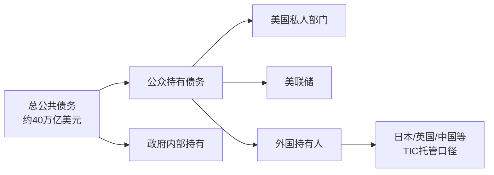
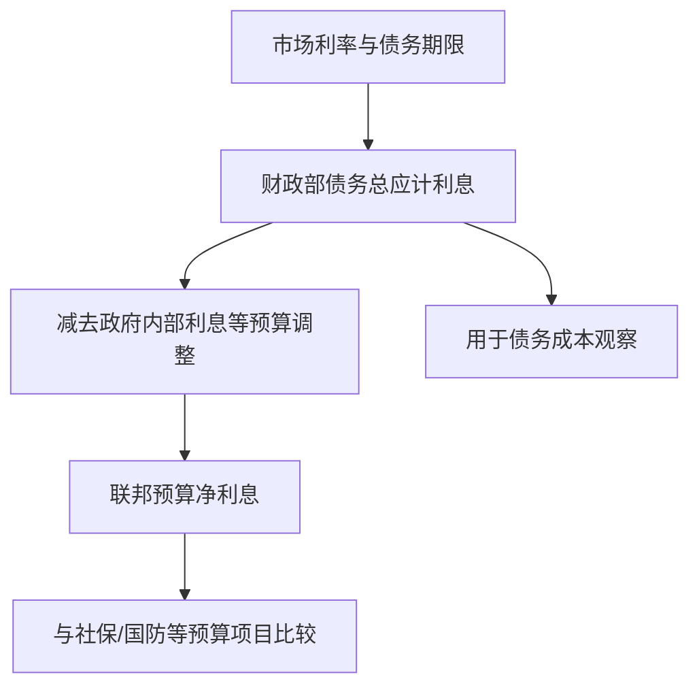
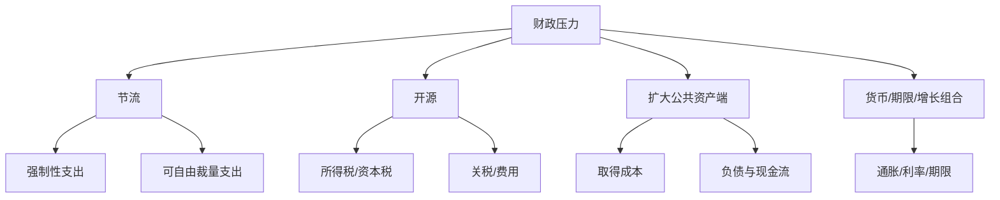
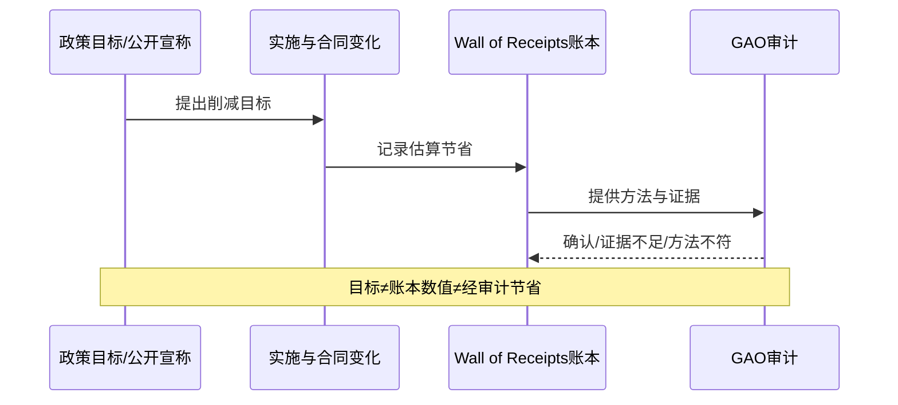
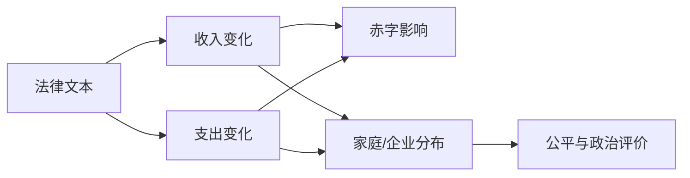
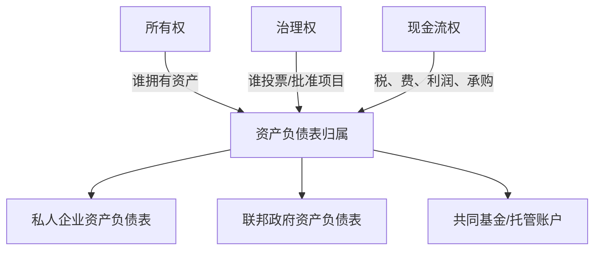
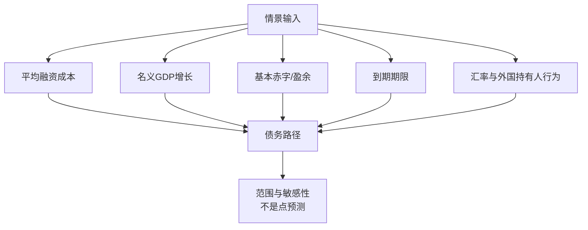
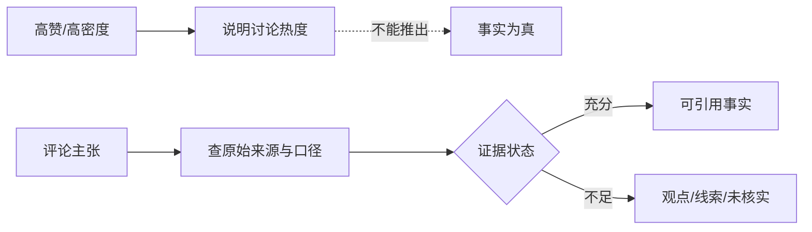

# 总结稿

[打开单页 HTML 总结](assets/bilibili-BV1Yr8j65ExQ-summary.html)

## 一句话结论

视频把美国财政问题组织成“节流、开源、扩大资产端”三条路，并最终主张通过国有化重做公共资产负债表。这个框架适合提问，却不能直接充当政策诊断：截至 2026-08-21，**40 万亿美元总债务已经发生**，但利息、赤字、持有人、关税、资源协议和国有资产都使用不同口径；讲者把若干预测、政策评价和因果叙事说成了近似事实。

> 本文是资料核查与方法性解读，不构成投资建议。收益率、汇率、预算与政策状态会变化；不要据此进行证券、外汇或衍生品交易。

## 先看已经核实的财政底图

- **债务总量**：美国财政部 Debt to the Penny 显示，2026-08-18 总公共债务已约 **40.047 万亿美元**，比视频说的“本月底将突破”更早兑现；8 月 19 日约 40.013 万亿美元。其中公众持有约 32.264 万亿，政府内部持有约 7.749 万亿。40 万亿不是“市场投资者持有的国债”这一单一数字。[财政部 Debt to the Penny](https://fiscaldata.treasury.gov/datasets/debt-to-the-penny/)
- **利率与利息**：2026-08-17 财政部日度曲线记录 10 年期 4.72%、30 年期 5.31%，随后已有回落。[财政部日度收益率](https://home.treasury.gov/resource-center/data-chart-center/interest-rates/TextView?type=daily_treasury_yield_curve&field_tdr_date_value=2026) 2025-08 至 2026-07 的财政部债务**总应计利息**约 1.373 万亿美元，能四舍五入为视频的 1.4 万亿；但 FY2025 的联邦预算**净利息**是 9700 亿美元。两者不是同一个指标。[财政部利息数据](https://fiscaldata.treasury.gov/datasets/interest-expense-debt-outstanding/) · [CBO FY2025](https://www.cbo.gov/publication/62286)
- **2028 预测**：视频称 2028 年利息 1.7 万亿并超过社保，当前 CBO 基线不支持这个年份—数值组合。CBO预计预算净利息从 2026 年约 1 万亿升至 2036 年约 2.1 万亿，而 FY2025 社保支出已经约 1.6 万亿并继续增长。更可能是总应计利息、旧预测或图表情景被混入预算净利息。[CBO 2026—2036 展望](https://www.cbo.gov/publication/62105)
- **赤字**：2026 年 7 月单月赤字 4320 亿美元成立，也是 2021 年 3 月以来最大单月值；但付款因周末提前，日历调整后约 3330 亿，不能把差额全部解释成结构性恶化。[财政部 2026 年 7 月月报](https://fiscal.treasury.gov/files/reports-statements/mts/mts0726.pdf)
- **与军费比较**：FY2025 预算净利息 9700 亿美元略高于 SIPRI 的 2025 日历年美国军费 9540 亿美元，方向上成立但会计期间不同；“美国军费超过其后十国总和”则被最新 SIPRI 数据反驳，其后十国合计已超过 1.16 万亿美元。[SIPRI 2025](https://www.sipri.org/sites/default/files/2026-04/2604_milex_2025.pdf)

## 视频的三条路：保留框架，降低断言强度

### 1. 节流：DOGE 的目标不等于已实现节省

视频认为 DOGE 节流失败。[04:03] GAO 确实发现 DOGE “Wall of Receipts”截至 2026-07-07 列出的 1100 亿美元合同、拨款与租约节省中，许多计算不符合其自述方法或缺乏复核信息；例如 96% 的拨款节省缺少足够方法说明，264 项租约中 108 项本来就在退出计划内。但 GAO 没有证明全部 1100 亿都是虚构。[GAO-26-108615](https://www.gao.gov/products/gao-26-108615)

FY2025 联邦支出约 6.96 万亿美元，视频概括成 7 万亿合理；与 FY2024 相比增加约 2100 亿，而非完整 3000 亿。[05:03] 由此可以说短期总支出没有下降，却不能推导“所有节流都不可能”：强制性支出、可自由裁量支出、利息与一次性项目需分别分析。

### 2. 开源：关税、税法和分配效应不是同一件事

- **关税**：[05:28] 最高法院于 2026-02-20 裁定 IEEPA 不授权相关关税；CBO随后估算，取消这部分关税会使 2026—2036 赤字相对旧基线增加约 2 万亿美元。判决前约收取 1500 亿美元，退款范围和时点曾不确定，7 月财政报表已经反映大额退款。[最高法院判决](https://www.supremecourt.gov/opinions/25pdf/24-1287_new_3135.pdf) · [CBO 更新](https://www.cbo.gov/publication/62210) 但 232 条款等其他关税仍在，“所有关税违法并全退”与“稳定每年 2000 亿收入”都过度简化。
- **税法**：[06:12] P.L.119-21 已于 2025-07-04 成法。CBO直接估算其在 2025—2034 年减少收入约 4.5 万亿、减少直接支出约 1.1 万亿，净增赤字约 3.4 万亿。[CBO 法案估算](https://www.cbo.gov/publication/61570) 视频提到的进一步削减资本利得税没有核实为已成法措施；“富人受益、穷人买单”是分配评价，需把税收收益与 Medicaid、SNAP 等支出变化放进同一分布模型，而不能只看一张图。
- **科技租金**：视频用 Token 单价、算力成本、企业现金流和芯片份额推导“AI/芯片垄断利润走不通”。这些数字缺少统一样本、输入/输出/缓存口径、公司边界和原始研究，最多是一条产业假设，不应连接成已经验证的美债偿还路径。

### 3. 扩大资产端：商业机会不等于国家取得所有权

视频最强的叙事是：政府通过地缘政治替私人资本找资产，财政只留下军费账单。[09:20] 这是值得审查的分配问题，但具体例证被明显放大：

- 美乌重建投资基金是美乌共同投入、共同治理的投资安排，聚焦关键矿产、能源与基础设施，也可能为美国企业带来承购和投资机会；它不等于乌克兰全部资源“到了美国手里”。[美国财政部](https://home.treasury.gov/news/press-releases/sb0548) · [DFC](https://www.dfc.gov/investment-story/investing-ukraines-reconstruction-and-americas-security)
- OFAC 对委内瑞拉油气交易设置许可、付款与托管规则；某些应付被封锁政府或 PdVSA 的款项需进入指定基金或账户，但这不表示所有石油美元、利润和资产归美国。[OFAC FAQ 1237](https://ofac.treasury.gov/faqs/1237) · [FAQ 1242](https://ofac.treasury.gov/faqs/1242)
- “打仗是为了金融”“救日元是为了救美债”“把格陵兰和加拿大并入资产负债表”是讲者的动机归因、因果叙事或反事实，不是已经核实的官方政策。跨国传导至少要拆成汇率制度、外币负债、贸易结算、储备、期限错配和资本流动。

## 国有化建议真正需要补的账

讲者在 [11:46] 主张把电信、电网、石油和银行收归国有，以现金流覆盖利息。这是规范性方案，而非从“企业市值很高”自然推出的偿债技术。完整分析至少要列出：收购或征收成本、被收购企业负债、法律与治理约束、现金流稳定性、资本开支、竞争效率、养老金与存款保障，以及收益是否真的进入财政部。

[12:33] 的“400 万亿元”数量级基本有官方依据，但对象应写成**全国国有非金融企业总资产约 401.7 万亿元**，国有资本权益约 109.4 万亿元，而不是某一级国资委可随意调用的净现金。按约 7 元兑 1 美元粗算约 57 万亿美元，接近 60 万亿；企业总资产不能与美国联邦总债务一比一抵消。[国家统计局材料](https://www.stats.gov.cn/zs/tjwh/tjkw/tjqk/zgxxb/202510/P020251028536029167134.pdf)

## 持有人与观众争论：先统一分母

财政部 TIC 2026 年 6 月数据中，日本约持有 1.117 万亿美元、英国 9400 亿、中国大陆 6330 亿，日本是最大外国持有人。[TIC 表 5](https://ticdata.treasury.gov/resource-center/data-chart-center/tic/Documents/slt_table5.html) 美联储 2026-08-12 持有约 4.538 万亿美元国债，确实多于任何单个外国国家；但“最大债主”仍取决于把 Fed、政府内部账户、美国私人部门和外国托管地怎样分组。[Fed H.4.1](https://www.federalreserve.gov/releases/h41/current/)

热门评论转述“美债衍生品至少 200 万亿、可能 300 万亿”，目前未找到原始人物、视频、日期与定义。BIS 的 2025 年 6 月全球 OTC 衍生品名义本金约 846 万亿美元、总市值约 21.8 万亿美元，却没有单列出这样的“美债衍生品”数字。[BIS](https://www.bis.org/publ/otc_hy2512.htm) **名义本金不等于潜在损失、净风险敞口或违约冲击**。

## 观众反馈告诉了我们什么

当前分析只覆盖 20 条热门顶层评论候选与 586 条当前可访问弹幕；平台报告 3148 条评论、2750 条弹幕。热门排序偏向高赞与争论，无嵌套回复，弹幕也不是历史全集。因此：

- 高赞评论集中在“加息—冲突—降息稀释债务”、债权人结构、美元跨国传导、国有化与分配冲突；这说明哪些叙事最能激发讨论，不说明它们正确。
- 弹幕密度在 720—750 秒最高，但未把逐条弹幕绑定到论点，不能认定国有化或 400 万亿数字获得共识。
- 词典信号 question 87、positive 48、joke 21、negative 5、surprise 5 可以重叠且会误判，不能换算成“总体情绪比例”。

## 更稳妥的思考顺序

1. 先选口径：总债务还是公众持有债务；总应计利息还是预算净利息；月度赤字还是日历调整后赤字。
2. 再区分存量与流量：资产/债务是存量，税收、利息、利润和军费是流量，不能直接相抵。
3. 再分事实、情景与价值判断：40 万亿是已发生数据；2028 利息和国有化收益是情景；分配公平与对外扩张是政策判断。
4. 最后讨论传导：利率、期限、增长、通胀、汇率和持有人行为需要不同证据，不能由一个热点数字决定。

# 辅助理解

## 辅助理解：把“40 万亿”拆成可检查的账

视频的优势是把复杂问题压缩成三条政策路径；风险是把不同统计口径和不同证据等级连接成一条确定故事。理解时可先把账本拆开。

40 万亿描述总公共债务；它不等于外国人持有，也不等于市场随时要展期的全部证券。[00:35] 日本是最大外国持有人这句话成立，但 TIC 的托管地未必等于最终受益所有人。[02:19]

## 两种“利息”为什么会差四千亿美元

Frame 1 展示的是机构的利率—利息情景图，适合说明假设如何改变预测，不是 2028 年结果已经实现。财政部债务总应计利息约 1.373 万亿美元，CBO FY2025 预算净利息为 9700 亿美元；摘要必须明确使用哪一个。

因此“利息超过军费”在特定年度和口径下大体成立；“2028 年 1.7 万亿并超过社保”却没有得到当前 CBO 基线支持。[00:12]

## 三条路不是穷尽性定理

讲者的“三条路”是分析框架。[03:38] 实务上还要把增长、通胀、期限管理、央行资产负债表和金融抑制等机制单列；每条路又有分配、法律与时点约束。

## 目标、账本与审计结果要分开

Frame 3 的新闻标题展示 DOGE 曾提出大幅削减目标；它不能证明目标已经实现。GAO核查的是 Wall of Receipts 的可复核性：大量条目方法不符或证据不足，但不等于全部 1100 亿都被证明为假。[04:03]

## 关税和税法：收入总量之外还有分配

Frame 5 是资本利得政策的分配模拟，不是已经通过的法律，也不能单独证明宏观赤字效果。P.L.119-21 已成法并被 CBO 估算为十年净增赤字约 3.4 万亿美元；视频提到的进一步资本利得税削减尚未核实为已成法政策。[06:12]

IEEPA 关税被最高法院判定缺乏法定授权并出现退款，但其他法源下的关税仍存在。[05:28] 所以“关税一年稳定收 2000 亿”和“关税全部取消”都不是准确概括。

## “扩大资产端”最容易混淆的三层

美乌共同基金可能产生投资和承购机会，却不是乌克兰全部资源所有权转让。[09:26] 委内瑞拉制裁许可规定某些款项的托管与付款渠道，也不是所有利润归美国。[09:33] 只有把合同所有权、治理权、现金流权和财政归属逐项核实，才能讨论是否改善联邦偿债能力。

## 400 万亿资产为什么不能直接抵 40 万亿债务

全国国有非金融企业总资产约 401.7 万亿元，国有资本权益约 109.4 万亿元。[12:33] 总资产包含由负债融资的资产，并非现金；跨国比较还受到汇率、估值、合并范围和公共服务义务影响。

## 情景不是预测：用变量而不是故事推演

“加息—战争—降息”“救日元就是救美债”“国有化即可覆盖利息”都应当被写成待检验情景。情景要显示假设、反馈和失败条件，不能把相关性、政治动机或历史类比当因果证据。

## 观众热点的正确读法

- 20 条热门顶层候选来自 3148 条平台报告评论；无嵌套回复，热门排序有显著偏差。
- 586 条弹幕只是 2750 条平台报告弹幕中的当前可访问部分；720—750 秒最密集只代表发送密度。
- “200—300 万亿美元美债衍生品”是未核实的二手转述。BIS 的全球 OTC 名义本金不能直接改名为美债风险，更不能把名义本金当潜在损失。

## 外部事实核验

### 声明 1（00:00）

- 视频陈述：30年期美债收益率突破5.3%，过去12个月美国政府利息支出达到1.4万亿美元。
- 核验状态：部分确认
- 核验结果：部分确认。美国财政部日度收益率数据记录2026-08-17的10年期为4.72%、30年期为5.31%，随后数日有所回落。财政部 Interest Expense API 对2025-08至2026-07各债务类别的月度应计利息合计约1.373万亿美元，可四舍五入为1.4万亿；但这是联邦债务的总应计利息，不是联邦预算口径的净利息。CBO记录FY2025预算净利息为9700亿美元，两个口径不可混用。
- 检索日期：2026-08-21
- 来源：
  - [U.S. Treasury daily Treasury par yield curve rates, 2026](https://home.treasury.gov/resource-center/data-chart-center/interest-rates/TextView?type=daily_treasury_yield_curve&field_tdr_date_value=2026)（primary）
  - [Fiscal Data: Interest Expense on the Public Debt Outstanding](https://fiscaldata.treasury.gov/datasets/interest-expense-debt-outstanding/)（primary）
  - [CBO: The Federal Budget in Fiscal Year 2025](https://www.cbo.gov/publication/62286)（primary）

### 声明 2（00:12）

- 视频陈述：预计到2028年利息支出会达到1.7万亿美元，并超过社会保障支出。
- 核验状态：存在矛盾
- 核验结果：现行CBO基线不支持这一具体年份与数值组合。CBO的2026长期预算展望称预算净利息从2026年约1万亿美元增至2036年约2.1万亿美元；社会保障支出FY2025已约1.6万亿美元并继续增长。因此“2028年净利息1.7万亿且超过社会保障”与当前官方基线不符，可能混入总应计利息、旧预测或不同统计口径。作为未来预测，它也不是已发生事实。
- 检索日期：2026-08-21
- 来源：
  - [CBO: The Budget and Economic Outlook: 2026 to 2036](https://www.cbo.gov/publication/62105)（primary）
  - [CBO: The Federal Budget in Fiscal Year 2025](https://www.cbo.gov/publication/62286)（primary）

### 声明 3（00:35）

- 视频陈述：到这个月底，美国债务将突破40万亿美元。
- 核验状态：已确认
- 核验结果：确认，但须明确是总公共债务（gross federal debt）。财政部 Debt to the Penny 数据显示：2026-08-18总公共债务约40.047万亿美元，2026-08-19约40.013万亿美元；其中8月19日公众持有债务约32.264万亿美元、政府内部持有约7.749万亿美元。视频的时间判断成立，但40万亿不能直接解释为市场投资者持有的国债余额。
- 检索日期：2026-08-21
- 来源：
  - [Fiscal Data: Debt to the Penny](https://fiscaldata.treasury.gov/datasets/debt-to-the-penny/)（primary）

### 声明 4（00:46）

- 视频陈述：美国政府仅利息支出已经超过国防开支。
- 核验状态：部分确认
- 核验结果：大体成立，但比较高度依赖口径。CBO给出的FY2025预算净利息为9700亿美元；SIPRI给出的2025日历年美国军事支出为9540亿美元，前者略高。若使用财政部约1.37万亿美元的总应计债务利息，差距更大；若只用国防部基础预算或国家防务预算功能，又会得到不同结果。该结论不应省略财政年度/日历年与净利息/总应计利息的差异。
- 检索日期：2026-08-21
- 来源：
  - [CBO: The Federal Budget in Fiscal Year 2025](https://www.cbo.gov/publication/62286)（primary）
  - [SIPRI Fact Sheet: Trends in World Military Expenditure, 2025](https://www.sipri.org/sites/default/files/2026-04/2604_milex_2025.pdf)（primary）

### 声明 5（00:48）

- 视频陈述：美国军费比后面十个国家加起来还多。
- 核验状态：存在矛盾
- 核验结果：被最新可得SIPRI数据反驳。SIPRI估算美国2025年军事支出9540亿美元，而其后十国合计超过1.16万亿美元。早期年份常见的说法是美国超过其后若干国或后九国之和，但不能直接沿用为2025/2026的“后十国”。
- 检索日期：2026-08-21
- 来源：
  - [SIPRI Fact Sheet: Trends in World Military Expenditure, 2025](https://www.sipri.org/sites/default/files/2026-04/2604_milex_2025.pdf)（primary）

### 声明 6（01:06）

- 视频陈述：7月财政赤字达到4320亿美元，这是自2021年3月以来最差的一个月。
- 核验状态：已确认
- 核验结果：确认，但存在日历移位效应。财政部2026年7月月度财政报表记录4320亿美元赤字；同期报道据财政部数据称其为2021年3月以来最大单月赤字。部分通常在8月支付的款项因周末提前到7月，财政部口径的日历调整后赤字约3330亿美元，因此4320亿不应全部解释为当月结构性恶化。
- 检索日期：2026-08-21
- 来源：
  - [U.S. Treasury: Monthly Treasury Statement, July 2026](https://fiscal.treasury.gov/files/reports-statements/mts/mts0726.pdf)（primary）
  - [Reuters: U.S. July deficit tops $432 billion](https://www.investing.com/news/economy-news/us-july-deficit-tops-432-billion-as-outlays-grow-tariff-receipts-stay-negative-4855854)（secondary）

### 声明 7（01:41）

- 视频陈述：美国财政部参与买入日元干预；美国救日元也是在救美债。
- 核验状态：未验证
- 核验结果：未核实到美国财政部对这次具体交易的官方确认。财政部汇率报告会讨论日本汇率政策与干预透明度，但不能据此证明美国在该时点直接买入日元。“救日元就是救美债”进一步属于因果叙事：日本利率、汇率、套息交易与国债持仓可能相关，但没有交易披露、反事实或因果识别，不能写成已证实的政策动机。
- 检索日期：2026-08-21
- 来源：
  - [U.S. Treasury: Macroeconomic and Foreign Exchange Policies of Major Trading Partners, January 2026](https://home.treasury.gov/system/files/136/January-2026-FX-Report.pdf)（primary）

### 声明 8（02:19）

- 视频陈述：日本是美国国债最大的海外持有者。
- 核验状态：已确认
- 核验结果：确认。财政部TIC表显示2026年6月日本持有约1.117万亿美元、英国约9400亿美元、中国大陆约6330亿美元，日本第一、英国第二、中国第三。观众所说“美联储比中国持有更多”也在数量级上成立：美联储2026-08-12持有约4.538万亿美元美国国债。但“美联储是美国最大债主”不是严谨的统一排名，因为政府内部账户、国内私人部门与外国持有人是不同聚合层级；TIC还存在托管地不等于最终所有人的归属限制。
- 检索日期：2026-08-21
- 来源：
  - [U.S. Treasury TIC: Major Foreign Holders of Treasury Securities](https://ticdata.treasury.gov/resource-center/data-chart-center/tic/Documents/slt_table5.html)（primary）
  - [Federal Reserve H.4.1, factors affecting reserve balances](https://www.federalreserve.gov/releases/h41/current/)（primary）

### 声明 9（04:03）

- 视频陈述：DOGE声称节省1100亿美元，但GAO发现大量数字有错误或缺乏证据。
- 核验状态：已确认
- 核验结果：确认，并应限定审计范围。GAO于2026-08-06审查DOGE Wall of Receipts截至2026-07-07列出的合同、拨款和租约节省：多数合同节省未按DOGE自己说明的方法计算，96%的拨款节省缺少足够方法信息，264项租约中108项本已计划退出。GAO并未证明全部1100亿美元都虚假，而是认定公开账本不足以支撑或准确复核许多条目。
- 检索日期：2026-08-21
- 来源：
  - [GAO-26-108615: DOGE Cost Savings](https://www.gao.gov/products/gao-26-108615)（primary）

### 声明 10（05:03）

- 视频陈述：2025财年政府支出7万亿美元，比上一年多3000亿美元。
- 核验状态：部分确认
- 核验结果：总量基本正确，增量偏高。CBO最新预算展望给出的FY2026支出7.4万亿美元，比FY2025增加4390亿美元，据此FY2025约6.96万亿美元，可概括为7万亿。FY2024实际支出约6.75万亿美元，因此同比增加约2100亿美元，而非完整3000亿美元；不同发布日期的初值和四舍五入可能造成差异。
- 检索日期：2026-08-21
- 来源：
  - [CBO: The Budget and Economic Outlook: 2026 to 2036](https://www.cbo.gov/publication/62105)（primary）
  - [CBO: The Federal Budget in Fiscal Year 2025](https://www.cbo.gov/publication/62286)（primary）

### 声明 11（05:28）

- 视频陈述：新关税一年增加约2000亿美元收入，但后来法院判无效，钱还得退。
- 核验状态：部分确认
- 核验结果：法院与退款方向确认，稳定的“每年2000亿”不成立为现行口径。美国最高法院2026-02-20裁定IEEPA不授权这些关税；CBO随后估计取消IEEPA关税会使2026—2036赤字比原基线增加2.0万亿美元，并指出判决前约收取1500亿美元、退款规模和时间当时仍不确定。财政部7月报表已反映大额退款，但232条款等其他关税仍存在，因此不能把所有关税都说成被整体取消，也不能把短期流量外推为固定年度收入。
- 检索日期：2026-08-21
- 来源：
  - [U.S. Supreme Court opinion on IEEPA tariffs](https://www.supremecourt.gov/opinions/25pdf/24-1287_new_3135.pdf)（primary）
  - [CBO: Budgetary Effects of Ending IEEPA Tariffs](https://www.cbo.gov/publication/62210)（primary）
  - [U.S. Treasury: Monthly Treasury Statement, July 2026](https://fiscal.treasury.gov/files/reports-statements/mts/mts0726.pdf)（primary）

### 声明 12（06:12）

- 视频陈述：大漂亮法案已经减税；政府还可能继续减资本利得税。
- 核验状态：部分确认
- 核验结果：已实施减税和扩大赤字的部分确认；未来再降资本利得税只是政策猜测。P.L.119-21于2025-07-04成法。CBO对该法的直接估算为2025—2034收入减少约4.5万亿美元、直接支出减少约1.1万亿美元，净增赤字约3.4万亿美元。视频对谁受益、谁承担成本的表述属于分配政策评价，需要另用税收分布与福利削减表分析；截至核查日未找到已成法的额外资本利得税下调，因此不得写成既定措施。
- 检索日期：2026-08-21
- 来源：
  - [Congressional Research Service: P.L. 119-21 tax provisions](https://www.congress.gov/crs-product/R48611)（primary）
  - [CBO cost estimate for P.L. 119-21](https://www.cbo.gov/publication/61570)（primary）

### 声明 13（09:26）

- 视频陈述：通过美乌资源协议，乌克兰资源到了美国手里。
- 核验状态：存在矛盾
- 核验结果：表述过度。官方材料显示这是美乌共同设立的重建投资基金，由美国DFC与乌克兰共同投入和治理，优先覆盖关键矿产、能源、基础设施等领域，并为美国企业创造承购和投资机会；它不等同于乌克兰全部资源所有权转让给美国。将投资权、项目收益与潜在承购权概括为“资源到了美国手里”会混淆治理、所有权与商业机会。
- 检索日期：2026-08-21
- 来源：
  - [U.S. Treasury: U.S.-Ukraine Reconstruction Investment Fund advances first investment](https://home.treasury.gov/news/press-releases/sb0548)（primary）
  - [U.S. DFC: Investing in Ukraine’s Reconstruction and America’s Security](https://www.dfc.gov/investment-story/investing-ukraines-reconstruction-and-americas-security)（primary）

### 声明 14（09:33）

- 视频陈述：委内瑞拉的石油美元和利润都流向美国。
- 核验状态：存在矛盾
- 核验结果：官方制裁许可不支持“所有利润归美国”。OFAC的相关一般许可允许特定油气业务及付款处理；对被封锁的委内瑞拉政府或PdVSA应付的某些特许权使用费、按桶征费和联邦税款，要求进入Foreign Government Deposit Funds或财政部指定账户，同时仍允许常规地方税费。这里是受制裁资金的托管与许可结构，不是美国取得全部石油利润或全部资产所有权。
- 检索日期：2026-08-21
- 来源：
  - [OFAC FAQ 1237: payments and taxes under Venezuela-related licenses](https://ofac.treasury.gov/faqs/1237)（primary）
  - [OFAC FAQ 1242: General License 50A oil and gas operations](https://ofac.treasury.gov/faqs/1242)（primary）
  - [OFAC: Venezuela-related sanctions](https://ofac.treasury.gov/sanctions-programs-and-country-information/venezuela-related-sanctions)（primary）

### 声明 15（11:16）

- 视频陈述：军费占GDP约3.4%，明年可能达到1.5万亿美元。
- 核验状态：部分确认
- 核验结果：3.4%可对应SIPRI对2024年美国军费负担的估计，但不宜当作2026年实时值；SIPRI估算2025年美国军事支出为9540亿美元。所谓“下一年1.5万亿美元”缺少明确预算口径和官方已通过拨款支持，更像预测或把更宽的国家安全/退伍军人/利息项目相加，不能作为军事支出事实。
- 检索日期：2026-08-21
- 来源：
  - [SIPRI Fact Sheet: Trends in World Military Expenditure, 2025](https://www.sipri.org/sites/default/files/2026-04/2604_milex_2025.pdf)（primary）

### 声明 16（12:33）

- 视频陈述：国资委管理的非金融资产已经超过400万亿元人民币，约60万亿美元。
- 核验状态：部分确认
- 核验结果：数量级基本确认，但主体和可比性需修正。官方统计材料给出全国国有非金融企业资产约401.7万亿元、国有资本权益约109.4万亿元；这不是“某一级国资委可以自由调配的净资产”。按约7元人民币兑1美元粗算约57万亿美元，接近60万亿，但汇率会变动。企业总资产包含负债对应资产，不能与美国联邦总债务直接一比一比较，更不能据此推出财政动员能力或投资回报。
- 检索日期：2026-08-21
- 来源：
  - [国家统计局《中国信息报》：全国国有非金融企业资产统计](https://www.stats.gov.cn/zs/tjwh/tjkw/tjqk/zgxxb/202510/P020251028536029167134.pdf)（primary）
  - [全国人大：2023年度国有资产管理情况综合报告](https://www.npc.gov.cn/npc/c2/c30834/202412/t20241225_442040.html)（primary）

### 声明 17（00:35）

- 视频陈述：该数字来自观众评论而非视频口播；因评论没有视频时间戳，此处仅锚定到00:35的债务规模讨论，不表示讲者在该时点说过这句话。
- 核验状态：未验证
- 核验结果：未验证。BIS统计显示2025年6月全球场外衍生品名义本金约846万亿美元、总市值约21.8万亿美元，但没有把其中“美债相关”单列为200万亿或300万亿美元；OCC银行衍生品季度报告也使用不同产品、机构和名义本金口径。名义本金不是潜在损失、市场价值或对美国国债的单向风险敞口。未找到该评论所称人物、原话、日期与统计定义，因此不能用它估算美债违约损失或跨国传导。
- 检索日期：2026-08-21
- 来源：
  - [BIS: OTC derivatives statistics at end-June 2025](https://www.bis.org/publ/otc_hy2512.htm)（primary）
  - [OCC: Quarterly Report on Bank Trading and Derivatives Activities](https://www.occ.treas.gov/publications-and-resources/publications/quarterly-report-on-bank-trading-and-derivatives-activities/index-quarterly-report-on-bank-trading-and-derivatives-activities.html)（primary）

# Data

## 增强转写稿

[00:00] 30 年期美债收益率已经突破 5.3% 了
[00:04] 美國政府的利息支出過去12個月
[00:06] 已經到了創紀錄的14000億美元
[00:10] 14000億是什麼概念呢?
[00:12] 從2020年到現在
[00:14] 美國還債的成本幾乎翻了三倍
[00:16] 而且按照現在的利率到了2028年
[00:20] 這個數字會漲到17000億
[00:22] 到那個時候利息將會第一次超過社保支出
[00:26] 成为美国政府最大的单项开支
[00:29] 換句話說 美國的財政已經被逼到絕境了
[00:32] 不出意外的話 這個月底
[00:35] 美債總量就要突破40萬億了
[00:38] 40萬億啊 朋友們
[00:39] 如果你一秒鐘數1塊錢 不吃不睡
[00:42] 你這數上120多萬年
[00:45] 你再看它的利息呢
[00:46] 利息支出已經比軍費還要高了
[00:48] 美國軍費本來就是世界第一的
[00:51] 比緊排在它後面的10個國家的總和還要多
[00:55] 付給債主的錢 比養軍隊的錢還多
[00:58] 一個帝國連軍隊都比債要便宜
[01:01] 你說這個國家下一步會幹什麼呢
[01:03] 然後我們再看一下它的財政支出情況
[01:06] 根據CNBC的報導
[01:07] 7月份的聯邦政府一個月的赤字
[01:11] 就幹到了4320億美元
[01:13] 是2021年3月以來最難看的一個月
[01:17] 一個月欠了4000多個億
[01:20] 同時 國債受益率也在飆升
[01:22] 美国 10 年期国债收益率现在已经突破 4.7% 了
[01:26] 是2025年初以來的最高水平
[01:29] 30 年期国债收益率更是突破了 5.3%
[01:33] 也就是說 美國現在不但要借新債還舊債
[01:36] 而且新債的利息還越來越高
[01:38] 另外 我們再看看財政部最近的動作
[01:41] 罕見地參與了買入日元干預匯率
[01:44] 這就很不正常
[01:46] 之前的視頻裡 我已經和大家說過了
[01:48] 美國救日元就是為了救美債
[01:50] 很多人還說我這個邏輯不對
[01:52] 说日元套利交易就是借便宜的日元
[01:55] 去買美國的高息資產
[01:57] 賺取中間的那個利差
[01:59] 這個邏輯是對的
[02:00] 但是這些人沒明白
[02:02] 这是一个两头堵的事情
[02:04] 日元跌虽然有利于套利交易
[02:06] 但是如果日元持續下跌
[02:08] 就會逼著日本央行去拋美國國債
[02:11] 用來穩定日元匯率
[02:13] 一個是日本央行
[02:14] 一個是對沖基金
[02:16] 這兩個是不同的主體
[02:18] 大家別忘了
[02:19] 日本是美債最大的海外持有國
[02:22] 这些持仓分散在银行
[02:24] 保險養老金這些機構手裡
[02:26] 真要动起来
[02:27] 動靜不會小的
[02:29] 所以貝森特他希望日元跌
[02:31] 但是不能跌太多
[02:33] 跌太多了
[02:34] 日本為了穩匯率
[02:35] 很可能會被逼著去賣美債
[02:37] 但是日元漲也不能漲太多
[02:40] 因为这样套利交易就有去杠杆的压力
[02:42] 所以貝森特真正想要的
[02:44] 是日本動在中間
[02:46] 跌也只能慢慢跌
[02:47] 漲也只能小漲
[02:49] 兩頭都給他按住
[02:50] 现在日元再次逼近 160 的大关
[02:54] 大家就想一想
[02:55] 他們現在有多難
[02:57] 所以現在的問題是
[02:58] 传统教科书里教的那些化债的方法
[03:01] 比如說讓經濟漲得快一點
[03:03] 多增加一些GDP
[03:05] 或者讓通脹把債務稀釋掉
[03:07] 再或者是讓央行直接把利率按下去
[03:10] 直接印錢把債給接下來
[03:12] 這些工具還能有效嗎
[03:14] 如果美債還是15年前的規模
[03:17] 也許還能再玩一把MMT
[03:19] 可是美債現在的體量
[03:21] 再加上它上漲的速度
[03:23] 你再看看現在的通脹水平
[03:25] 這些工具它還有條件用嗎
[03:27] 沒有的話還有什麼辦法呢
[03:30] 今天我就來講和大家聊一下
[03:32] 這個美債到底應該怎麼辦
[03:35] 其實川普上來也並不是沒有努力過
[03:38] 说到底万变不离其宗
[03:40] 想要還債就是三條路
[03:42] 第一 節流
[03:44] 第二 開源
[03:45] 第三 擴大資產端
[03:47] 我們先看看川普是怎麼做的
[03:49] 先說第一條路 節流
[03:51] 川普一上來就把馬斯克放出去
[03:53] 搞什麼政府效率部
[03:55] 去砍人、關機構、撤項目
[03:57] 砍的是誰呢
[03:59] 聯邦僱員
[04:00] 對外援助
[04:01] 一堆聽著很虎人的小項目
[04:03] 根据美联社的报道
[04:05] 美國政府問責局後來去查證
[04:07] 發現這個效率部
[04:09] 對外宣傳省下來的錢裡面
[04:10] 有很大的水分
[04:11] 效率部說省下了1100億美元
[04:14] 和審計一查
[04:16] 大量數字要麼是錯的
[04:17] 要麼就是根本拿不出證據
[04:19] 我就算退一步 按他們能核實的數來算
[04:22] 跟每年接近2萬億美元的赤字放在一起
[04:26] 是什麼概念
[04:27] 也就是一個零頭
[04:28] 我之前在視頻裡就和大家說過了
[04:30] 真正的大頭在哪
[04:32] 社保 医保 军费 利息
[04:34] 這四樣
[04:36] 沒人能夠真正的驅動
[04:37] 利息你不能賴上吧
[04:39] 軍費誰敢大砍
[04:40] 借保 依保敢動一下
[04:42] 这美国还不得社会动乱了
[04:44] 那最後能開刀的呢
[04:45] 就是給窮人的補助
[04:47] 像食品券、Medicaid 这类的穷人项目
[04:50] 大家想一想
[04:51] 敢窮人那點救濟
[04:53] 能填上這個赤字嗎
[04:55] 這叫截留嗎
[04:56] 你從窮人的那家風裡
[04:58] 能拷出幾個錢
[04:59] 所以我们现在看到的是
[05:01] 财政支出丝毫没有减少
[05:03] 根據美國財政部的結算數據
[05:05] 2025財年
[05:07] 聯邦政府總支出是7萬億美元
[05:10] 比上一財年還多花了3000個億
[05:12] 所以节流这一项
[05:13] 現在已經不提了
[05:15] 你就別想了它就是省不下來的
[05:18] 那第二條路就是開源
[05:20] 開源這條路
[05:21] 川普選的是關稅
[05:23] 關稅不是沒收到錢
[05:25] 這一點確實是出乎我的意料
[05:28] 根据美国海关与边境保护局的数据
[05:31] 川普的新關稅
[05:32] 一年大概也能收个 2000 亿美元左右
[05:35] 那國會預算辦公室
[05:36] 一度估计高关税能够在 10 年里
[05:39] 大幅地压低赤字
[05:41] 但是后来法院裁决
[05:43] 這部分關稅違法
[05:44] 收上它的關稅又給推回去了
[05:46] 原先估计减少赤字的效果
[05:49] 也要重新的打折扣
[05:51] 但是
[05:52] 我就算關稅全都收上來了
[05:54] 它替代得了所得稅嗎
[05:56] 扛得住利息嗎
[05:57] 而且關稅打出去
[05:59] 別的國家遲早要重新調整自己的貿易政策
[06:01] 想辦法繞開美國
[06:03] 最後如果算總賬的話
[06:05] 未必是賺的
[06:06] 那麼關稅收不上來
[06:08] 富人的稅能收上來嗎
[06:09] 不但收不上來
[06:11] 還得給他們減稅
[06:12] “大而美”法案已经减了一波了
[06:14] 這還不夠
[06:15] 減稅那邊還在繼續
[06:17] 根據美國媒體的報導
[06:18] 白宮到現在還在琢磨削減資本利得稅
[06:22] 而且想在中期選舉之前迅速通過
[06:24] 如果通過的話
[06:26] 根据税收与经济政策研究所的估算
[06:28] 最大的受益者
[06:30] 還是最富有的0.7%
[06:32] 也就是說還是經典的老套路
[06:34] 富人 受益 窮人買單
[06:37] 這個法案雖然還沒有通過
[06:38] 但是從這些事情
[06:40] 我們可以看出一個信號
[06:42] 就是想要靠加稅來開源
[06:44] 基本沒什麼希望了
[06:45] 特朗普政府也没有这个意愿
[06:47] 那除了這些之外
[06:49] 還有沒有其他開源的方法呢
[06:51] 還有一個就是收取超額科技壟斷利潤
[06:54] 主要就是芯片和AI
[06:57] 可是目前來看
[06:58] 芯片這個東西
[06:59] 最大的客戶是誰呢
[07:01] 是中國
[07:02] 但是中國你賣不了啊
[07:04] 那賣AI 詞源呢
[07:06] 它也有一個問題
[07:07] 就是它需要大量的數據中心
[07:09] 而數據中心需要巨大的電力
[07:12] 還有大量的水資源去冷卻
[07:14] 美國本土的電力設施是承受不住的
[07:17] 怎麼辦呢
[07:18] 把數據中心建在海灣國家
[07:21] 這些國家本來就需要轉型
[07:23] 以後他們可以從賣石油
[07:25] 轉向賣資源
[07:26] 你躺著收租就可以了
[07:28] 美國還可以利用他們的廉價能源
[07:31] 還有他們的資金
[07:32] 來維持住現有的巨額AI投資
[07:35] 這個事情他們要是能壟斷掉
[07:38] 那是一筆大買賣
[07:39] 可是現在的問題是
[07:41] 數據中心被伊朗給炸了
[07:44] 這就麻煩了
[07:45] 伊朗現在的戰略已經很清晰了
[07:47] 第一步就是对所有中东国家去军事化
[07:50] 摧毀所有的美軍基地
[07:52] 把美國軍事力量趕出中東
[07:54] 第二步呢
[07:55] 就是把美國的資本也趕出中東
[07:57] 讓這些中東國家從經濟上
[07:59] 也要脫離美國
[08:00] 伊朗搞不定
[08:01] 你這個生意它就做不成
[08:03] 那除此之外
[08:05] 還有一個很大的麻煩
[08:06] 就是中國
[08:07] 中國的AI大模型
[08:08] 在Deep Seek的感召之下
[08:10] 一大批開源模型
[08:11] 直接把你搞壟斷這一條路給堵住了
[08:14] 现在每百万 Token 的平均价格
[08:17] 是1.05美元
[08:19] 根據一些投資機構的估算
[08:21] 光是計算成本
[08:22] 每百万 Token 的价格
[08:24] 就在1.75美元左右
[08:26] 你再看看美國這些大公司的財報
[08:28] 他們的現金流也都開始轉負了
[08:31] 也就是說
[08:32] 現在收取壟斷利潤的可能性
[08:34] 已經不大了
[08:35] 還有就是芯片
[08:36] 美國未來壟斷芯片市場的概率也在下降
[08:39] 美國芯片市場
[08:41] 現在是處於全球主導地位的
[08:43] 佔全球市場總額的53%
[08:45] 韓國佔21%
[08:47] 中國佔6%
[08:48] 和日本歐盟相當
[08:50] 但是
[08:51] 中國芯片產業正在迅速的崛起
[08:54] 2025年
[08:54] 中國集成電路的收入
[08:56] 達到了2450億美元
[08:59] 一年漲了22%
[09:01] 四年几乎翻了一番
[09:03] 所以收取科技壟斷租的這條路
[09:06] 希望也不大
[09:07] 那現在就剩下這第三條路了
[09:10] 就是擴大資產端
[09:12] 我之前和大家說過
[09:13] 這個債務
[09:14] 不要只看它的大小
[09:16] 還要看它的資產端大小
[09:17] 不抵債才會出問題
[09:19] 那我們看到
[09:20] 川普在第一條路和第二條路都失敗之後
[09:23] 開始瘋狂的壓住第三條路
[09:26] 首先就是霸佔烏克蘭的資源
[09:28] 一纸协议把乌克兰的资源
[09:30] 實實在在地掌握在了美國手裡
[09:33] 然后是抢委内瑞拉的石油
[09:35] 現在美國財政部長
[09:37] 親口說的
[09:38] 委内瑞拉的石油用美元结算
[09:40] 利潤歸美國
[09:42] 下一步
[09:43] 還有格雷蘭島
[09:44] 還有加拿大
[09:45] 它都要給吞進去
[09:46] 合併在自己的資產負債表裡
[09:48] 還有打伊朗
[09:49] 還是為了控制中東的石油和結算權
[09:52] 如果這些資產
[09:54] 全都納入美國的資產負債表
[09:56] 那它和40萬億的負債不就平衡了嗎
[10:00] 大家想明白了嗎
[10:01] 川普不是在找錢
[10:02] 他是在找資產
[10:04] 我之前就和大家分析過
[10:06] 這些戰爭都是銀行家的戰爭
[10:08] 一切都是為了金融
[10:10] 可是這裡有一個問題
[10:11] 就是咱們看一下這個賬本的細節
[10:14] 你就會發現
[10:15] 這些資產真拿下來了
[10:17] 寫的是誰的名字呢
[10:18] 烏克蘭的資源
[10:20] 先給的是美國背景的財團
[10:22] 锂矿开采权
[10:23] 已經給了美資關聯企業
[10:25] 委内瑞拉的石油
[10:27] 給的也是美國的油企
[10:29] 這些都是私人部門
[10:30] 聯邦政府實際拿到的是什麼
[10:33] 是軍費賬單
[10:34] 大家發現沒有
[10:35] 資產端確實在擴張
[10:37] 可擴張的不是財政部的資產端
[10:40] 是私人資本的資產端
[10:41] 利潤都進了私人資本的手裡
[10:44] 而不是國家資本
[10:45] 所以這也解決不了你美債的問題
[10:48] 川普選的這條路
[10:49] 只是因為這條路阻力最小
[10:51] 這個國家的權力結構
[10:53] 它就是資本優先
[10:54] 你沒有辦法
[10:55] 還有這條路
[10:56] 最大的問題就是風險太大
[10:59] 它非常容易失控
[11:00] 一旦失控了
[11:01] 它就是财政的净成本
[11:03] 比如說伊朗戰爭
[11:04] 伊朗戰爭光是武器彈藥
[11:06] 就已經消耗美國幾百億美元了
[11:08] 這還沒有算其他的一些損失
[11:10] 一旦你無法從戰爭當中獲得收益
[11:13] 那麼成本立刻反噬
[11:14] 而美國的軍費已經佔GDP的比重
[11:16] 達到了3.4%了
[11:18] 明年軍費還有漲到1.5萬億
[11:20] 這個成本越來越重
[11:22] 羅馬共和國當年也是同樣的選擇
[11:25] 长期靠征服和掠夺支撑财政
[11:27] 后来扩张一停
[11:29] 随之军费、内战、土地集中
[11:31] 貨幣問題一起全都冒出來了
[11:34] 財政立刻就出問題
[11:35] 財政壓力與對外擴張
[11:37] 是歷史上反覆出現的組合
[11:40] 但結果沒有好的
[11:41] 所以對外擴張在我看來
[11:44] 是一條絕路
[11:45] 我個人認為
[11:46] 其實美國真正應該做的
[11:48] 不是刀刃向外
[11:50] 而是刀刃向內
[11:51] 不僅僅是要收稅
[11:53] 而是要收回所有權
[11:55] 國有化這些壟斷資本集團
[11:57] 你現在看
[11:58] 40 万亿美债好像挺高的
[12:00] 但是如果美國的三大電信服務商
[12:03] 被收歸國有
[12:04] 如果美國的電網被收歸國有
[12:06] 如果美國的石油公司被收歸國有
[12:09] 不過美國那幾家大銀行
[12:11] 全都被收歸國有
[12:13] 这 40 万亿美债还算多吗
[12:16] 而且這都是能夠產生穩定現金流的
[12:18] 今後產生的收益還可以覆蓋利息
[12:21] 而且這也會大幅增加
[12:23] 美國未來的競爭力
[12:25] 現在很多人都在研究
[12:26] 說中國的競爭力為什麼這麼強
[12:28] 但是很少有人提到
[12:30] 中國有一個東西叫做國資委
[12:33] 國資委的非金融企業資產總額
[12:36] 已經超過400萬億人民幣了
[12:38] 折合成美元是60萬億
[12:40] 其他國家所有那些大資本
[12:43] 在它面前都是小資本
[12:45] 根本沒法競爭
[12:46] 国资委能够把这些资本拧成一股绳
[12:49] 可是你在看美國的資本
[12:51] 面對外部的競爭壓力
[12:53] 內部就先打起來了
[12:54] 美国现在的财政赤字已经濒临绝境了
[12:58] 而且不只是美國一個國家
[13:00] 其他那些西方國家全都如此
[13:03] 40萬億的債務
[13:04] 沒有被戰爭積極消滅
[13:06] 战争机器可能替资本拿到矿产
[13:09] 航道和市场
[13:10] 也可能只給國家留下更多的賬單
[13:13] 歷史上的帝國要是沒錢了
[13:15] 可以在內部加稅
[13:17] 甚至是更改幣制
[13:18] 也可以向外打進行擴張
[13:20] 但是所有這些用擴張來替代內部改革的
[13:24] 最後都沒有好結果
[13:26] 好吧

## 原始转写稿

[00:00] 30年起美債受益率已經突破5.3%了
[00:04] 美國政府的利息支出過去12個月
[00:06] 已經到了創紀錄的14000億美元
[00:10] 14000億是什麼概念呢?
[00:12] 從2020年到現在
[00:14] 美國還債的成本幾乎翻了三倍
[00:16] 而且按照現在的利率到了2028年
[00:20] 這個數字會漲到17000億
[00:22] 到那個時候利息將會第一次超過社保支出
[00:26] 成為美國政府最大的單向開始
[00:29] 換句話說 美國的財政已經被逼到絕境了
[00:32] 不出意外的話 這個月底
[00:35] 美債總量就要突破40萬億了
[00:38] 40萬億啊 朋友們
[00:39] 如果你一秒鐘數1塊錢 不吃不睡
[00:42] 你這數上120多萬年
[00:45] 你再看它的利息呢
[00:46] 利息支出已經比軍費還要高了
[00:48] 美國軍費本來就是世界第一的
[00:51] 比緊排在它後面的10個國家的總和還要多
[00:55] 付給債主的錢 比養軍隊的錢還多
[00:58] 一個帝國連軍隊都比債要便宜
[01:01] 你說這個國家下一步會幹什麼呢
[01:03] 然後我們再看一下它的財政支出情況
[01:06] 根據CNBC的報導
[01:07] 7月份的聯邦政府一個月的赤字
[01:11] 就幹到了4320億美元
[01:13] 是2021年3月以來最難看的一個月
[01:17] 一個月欠了4000多個億
[01:20] 同時 國債受益率也在飆升
[01:22] 美國10年期國債受益率現在已經突破4.7%了
[01:26] 是2025年初以來的最高水平
[01:29] 30年期國債受益率更是突破了5.3%
[01:33] 也就是說 美國現在不但要借新債還舊債
[01:36] 而且新債的利息還越來越高
[01:38] 另外 我們再看看財政部最近的動作
[01:41] 罕見地參與了買入日元干預匯率
[01:44] 這就很不正常
[01:46] 之前的視頻裡 我已經和大家說過了
[01:48] 美國救日元就是為了救美債
[01:50] 很多人還說我這個邏輯不對
[01:52] 說日元開綠萃的就是借便宜的日元
[01:55] 去買美國的高息資產
[01:57] 賺取中間的那個利差
[01:59] 這個邏輯是對的
[02:00] 但是這些人沒明白
[02:02] 這是一個兩頭肚的事情
[02:04] 日元跌雖然有利於開熱稅的
[02:06] 但是如果日元持續下跌
[02:08] 就會逼著日本央行去拋美國國債
[02:11] 用來穩定日元匯率
[02:13] 一個是日本央行
[02:14] 一個是對沖基金
[02:16] 這兩個是不同的主體
[02:18] 大家別忘了
[02:19] 日本是美債最大的海外持有國
[02:22] 這些持藏分塞在銀行
[02:24] 保險養老金這些機構手裡
[02:26] 沾藥動起來
[02:27] 動靜不會小的
[02:29] 所以貝森特他希望日元跌
[02:31] 但是不能跌太多
[02:33] 跌太多了
[02:34] 日本為了穩匯率
[02:35] 很可能會被逼著去賣美債
[02:37] 但是日元漲也不能漲太多
[02:40] 因為這樣開綠萃的就有解槓桿的壓力
[02:42] 所以貝森特真正想要的
[02:44] 是日本動在中間
[02:46] 跌也只能慢慢跌
[02:47] 漲也只能小漲
[02:49] 兩頭都給他按住
[02:50] 現在日元再次逼近160元的大國恩
[02:54] 大家就想一想
[02:55] 他們現在有多難
[02:57] 所以現在的問題是
[02:58] 傳統教科書裡教的那些花債的方法
[03:01] 比如說讓經濟漲得快一點
[03:03] 多增加一些GDP
[03:05] 或者讓通脹把債務稀釋掉
[03:07] 再或者是讓央行直接把利率按下去
[03:10] 直接印錢把債給接下來
[03:12] 這些工具還能有效嗎
[03:14] 如果美債還是15年前的規模
[03:17] 也許還能再玩一把MMT
[03:19] 可是美債現在的體量
[03:21] 再加上它上漲的速度
[03:23] 你再看看現在的通脹水平
[03:25] 這些工具它還有條件用嗎
[03:27] 沒有的話還有什麼辦法呢
[03:30] 今天我就來講和大家聊一下
[03:32] 這個美債到底應該怎麼辦
[03:35] 其實川普上來也並不是沒有努力過
[03:38] 說到底萬變不離其總
[03:40] 想要還債就是三條路
[03:42] 第一 節流
[03:44] 第二 開源
[03:45] 第三 擴大資產端
[03:47] 我們先看看川普是怎麼做的
[03:49] 先說第一條路 節流
[03:51] 川普一上來就把馬斯克放出去
[03:53] 搞什麼政府效率部
[03:55] 去砍人、關機構、撤項目
[03:57] 砍的是誰呢
[03:59] 聯邦僱員
[04:00] 對外援助
[04:01] 一堆聽著很虎人的小項目
[04:03] 根據美聯社的報導
[04:05] 美國政府問責局後來去查證
[04:07] 發現這個效率部
[04:09] 對外宣傳省下來的錢裡面
[04:10] 有很大的水分
[04:11] 效率部說省下了1100億美元
[04:14] 和審計一查
[04:16] 大量數字要麼是錯的
[04:17] 要麼就是根本拿不出證據
[04:19] 我就算退一步 按他們能核實的數來算
[04:22] 跟每年接近2萬億美元的赤字放在一起
[04:26] 是什麼概念
[04:27] 也就是一個零頭
[04:28] 我之前在視頻裡就和大家說過了
[04:30] 真正的大頭在哪
[04:32] 借保 依保 軍費 利息
[04:34] 這四樣
[04:36] 沒人能夠真正的驅動
[04:37] 利息你不能賴上吧
[04:39] 軍費誰敢大砍
[04:40] 借保 依保敢動一下
[04:42] 這美國還不得社會動腕了
[04:44] 那最後能開刀的呢
[04:45] 就是給窮人的補助
[04:47] 像食品圈 賣DK的這類的窮人項目
[04:50] 大家想一想
[04:51] 敢窮人那點救濟
[04:53] 能填上這個赤字嗎
[04:55] 這叫截留嗎
[04:56] 你從窮人的那家風裡
[04:58] 能拷出幾個錢
[04:59] 所以我們現在看到的是
[05:01] 財政支出4號沒有減少
[05:03] 根據美國財政部的結算數據
[05:05] 2025財年
[05:07] 聯邦政府總支出是7萬億美元
[05:10] 比上一財年還多花了3000個億
[05:12] 所以截留這一項
[05:13] 現在已經不提了
[05:15] 你就別想了它就是省不下來的
[05:18] 那第二條路就是開源
[05:20] 開源這條路
[05:21] 川普選的是關稅
[05:23] 關稅不是沒收到錢
[05:25] 這一點確實是出乎我的意料
[05:28] 根據美國海關與編稅總局的數據
[05:31] 川普的新關稅
[05:32] 一年大貸也能收個2000億美元左右
[05:35] 那國會預算辦公室
[05:36] 一度估計高關稅能夠在10年裡
[05:39] 大幅的壓低14
[05:41] 但是後來法院才覺得
[05:43] 這部分關稅違法
[05:44] 收上它的關稅又給推回去了
[05:46] 原先估計減少隻字的效果
[05:49] 也要重新的打折扣
[05:51] 但是
[05:52] 我就算關稅全都收上來了
[05:54] 它替代得了所得稅嗎
[05:56] 扛得住利息嗎
[05:57] 而且關稅打出去
[05:59] 別的國家遲早要重新調整自己的貿易政策
[06:01] 想辦法繞開美國
[06:03] 最後如果算總賬的話
[06:05] 未必是賺的
[06:06] 那麼關稅收不上來
[06:08] 富人的稅能收上來嗎
[06:09] 不但收不上來
[06:11] 還得給他們減稅
[06:12] 大美利法案已經減了一波了
[06:14] 這還不夠
[06:15] 減稅那邊還在繼續
[06:17] 根據美國媒體的報導
[06:18] 白宮到現在還在琢磨削減資本利得稅
[06:22] 而且想在中期選舉之前迅速通過
[06:24] 如果通過的話
[06:26] 根據稅收和經濟政策研製所的估算
[06:28] 最大的受益者
[06:30] 還是最富有的0.7%
[06:32] 也就是說還是經典的老套路
[06:34] 富人 受益 窮人買單
[06:37] 這個法案雖然還沒有通過
[06:38] 但是從這些事情
[06:40] 我們可以看出一個信號
[06:42] 就是想要靠加稅來開源
[06:44] 基本沒什麼希望了
[06:45] 川普政府也沒有這個議員
[06:47] 那除了這些之外
[06:49] 還有沒有其他開源的方法呢
[06:51] 還有一個就是收取超額科技壟斷利潤
[06:54] 主要就是芯片和AI
[06:57] 可是目前來看
[06:58] 芯片這個東西
[06:59] 最大的客戶是誰呢
[07:01] 是中國
[07:02] 但是中國你賣不了啊
[07:04] 那賣AI 詞源呢
[07:06] 它也有一個問題
[07:07] 就是它需要大量的數據中心
[07:09] 而數據中心需要巨大的電力
[07:12] 還有大量的水資源去冷卻
[07:14] 美國本土的電力設施是承受不住的
[07:17] 怎麼辦呢
[07:18] 把數據中心建在海灣國家
[07:21] 這些國家本來就需要轉型
[07:23] 以後他們可以從賣石油
[07:25] 轉向賣資源
[07:26] 你躺著收租就可以了
[07:28] 美國還可以利用他們的廉價能源
[07:31] 還有他們的資金
[07:32] 來維持住現有的巨額AI投資
[07:35] 這個事情他們要是能壟斷掉
[07:38] 那是一筆大買賣
[07:39] 可是現在的問題是
[07:41] 數據中心被伊朗給炸了
[07:44] 這就麻煩了
[07:45] 伊朗現在的戰略已經很清晰了
[07:47] 第一步就是對所有中東國家去軍失化
[07:50] 摧毀所有的美軍基地
[07:52] 把美國軍事力量趕出中東
[07:54] 第二步呢
[07:55] 就是把美國的資本也趕出中東
[07:57] 讓這些中東國家從經濟上
[07:59] 也要脫離美國
[08:00] 伊朗搞不定
[08:01] 你這個生意它就做不成
[08:03] 那除此之外
[08:05] 還有一個很大的麻煩
[08:06] 就是中國
[08:07] 中國的AI大模型
[08:08] 在Deep Seek的感召之下
[08:10] 一大批開源模型
[08:11] 直接把你搞壟斷這一條路給堵住了
[08:14] 現在每百萬次元的平均價格
[08:17] 是1.05美元
[08:19] 根據一些投資機構的估算
[08:21] 光是計算成本
[08:22] 每百萬次元的價格
[08:24] 就在1.75美元左右
[08:26] 你再看看美國這些大公司的財報
[08:28] 他們的現金流也都開始轉負了
[08:31] 也就是說
[08:32] 現在收取壟斷利潤的可能性
[08:34] 已經不大了
[08:35] 還有就是芯片
[08:36] 美國未來壟斷芯片市場的概率也在下降
[08:39] 美國芯片市場
[08:41] 現在是處於全球主導地位的
[08:43] 佔全球市場總額的53%
[08:45] 韓國佔21%
[08:47] 中國佔6%
[08:48] 和日本歐盟相當
[08:50] 但是
[08:51] 中國芯片產業正在迅速的崛起
[08:54] 2025年
[08:54] 中國集成電路的收入
[08:56] 達到了2450億美元
[08:59] 一年漲了22%
[09:01] 四年幾乎翻了一反
[09:03] 所以收取科技壟斷租的這條路
[09:06] 西方也不大
[09:07] 那現在就剩下這第三條路了
[09:10] 就是擴大資產端
[09:12] 我之前和大家說過
[09:13] 這個債務
[09:14] 不要只看它的大小
[09:16] 還要看它的資產端大小
[09:17] 不抵債才會出問題
[09:19] 那我們看到
[09:20] 川普在第一條路和第二條路都失敗之後
[09:23] 開始瘋狂的壓住第三條路
[09:26] 首先就是霸佔烏克蘭的資源
[09:28] 一直協議把烏克蘭的資源
[09:30] 實實在在地掌握在了美國手裡
[09:33] 然後是強委內瑞拉的石油
[09:35] 現在美國財政部長
[09:37] 親口說的
[09:38] 美內瑞拉的石油用美元結算
[09:40] 利潤歸美國
[09:42] 下一步
[09:43] 還有格雷蘭島
[09:44] 還有加拿大
[09:45] 它都要給吞進去
[09:46] 合併在自己的資產負債表裡
[09:48] 還有打伊朗
[09:49] 還是為了控制中東的石油和結算權
[09:52] 如果這些資產
[09:54] 全都納入美國的資產負債表
[09:56] 那它和40萬億的負債不就平衡了嗎
[10:00] 大家想明白了嗎
[10:01] 川普不是在找錢
[10:02] 他是在找資產
[10:04] 我之前就和大家分析過
[10:06] 這些戰爭都是銀行家的戰爭
[10:08] 一切都是為了金融
[10:10] 可是這裡有一個問題
[10:11] 就是咱們看一下這個賬本的細節
[10:14] 你就會發現
[10:15] 這些資產真拿下來了
[10:17] 寫的是誰的名字呢
[10:18] 烏克蘭的資源
[10:20] 先給的是美國背景的財團
[10:22] 李礦開財權
[10:23] 已經給了美資關聯企業
[10:25] 美內瑞拉的石油
[10:27] 給的也是美國的油企
[10:29] 這些都是私人部門
[10:30] 聯邦政府實際拿到的是什麼
[10:33] 是軍費賬單
[10:34] 大家發現沒有
[10:35] 資產端確實在擴張
[10:37] 可擴張的不是財政部的資產端
[10:40] 是私人資本的資產端
[10:41] 利潤都進了私人資本的手裡
[10:44] 而不是國家資本
[10:45] 所以這也解決不了你美債的問題
[10:48] 川普選的這條路
[10:49] 只是因為這條路阻力最小
[10:51] 這個國家的權力結構
[10:53] 它就是資本優先
[10:54] 你沒有辦法
[10:55] 還有這條路
[10:56] 最大的問題就是風險太大
[10:59] 它非常容易失控
[11:00] 一旦失控了
[11:01] 它就是財政的進程本
[11:03] 比如說伊朗戰爭
[11:04] 伊朗戰爭光是武器彈藥
[11:06] 就已經消耗美國幾百億美元了
[11:08] 這還沒有算其他的一些損失
[11:10] 一旦你無法從戰爭當中獲得收益
[11:13] 那麼成本立刻反噬
[11:14] 而美國的軍費已經佔GDP的比重
[11:16] 達到了3.4%了
[11:18] 明年軍費還有漲到1.5萬億
[11:20] 這個成本越來越重
[11:22] 羅馬共和國當年也是同樣的選擇
[11:25] 長期靠政府和掠奪成為財政
[11:27] 後來擴張一庭
[11:29] 銳致軍費 內戰 土地集中
[11:31] 貨幣問題一起全都冒出來了
[11:34] 財政立刻就出問題
[11:35] 財政壓力與對外擴張
[11:37] 是歷史上反覆出現的組合
[11:40] 但結果沒有好的
[11:41] 所以對外擴張在我看來
[11:44] 是一條絕路
[11:45] 我個人認為
[11:46] 其實美國真正應該做的
[11:48] 不是刀刃向外
[11:50] 而是刀刃向內
[11:51] 不僅僅是要收稅
[11:53] 而是要收回所有權
[11:55] 國有化這些壟斷資本集團
[11:57] 你現在看
[11:58] 40萬億美幣好像挺高的
[12:00] 但是如果美國的三大電信服務商
[12:03] 被收歸國有
[12:04] 如果美國的電網被收歸國有
[12:06] 如果美國的石油公司被收歸國有
[12:09] 不過美國那幾家大銀行
[12:11] 全都被收歸國有
[12:13] 這40萬億美幣還算多嗎
[12:16] 而且這都是能夠產生穩定現金流的
[12:18] 今後產生的收益還可以覆蓋利息
[12:21] 而且這也會大幅增加
[12:23] 美國未來的競爭力
[12:25] 現在很多人都在研究
[12:26] 說中國的競爭力為什麼這麼強
[12:28] 但是很少有人提到
[12:30] 中國有一個東西叫做國資委
[12:33] 國資委的非金融企業資產總額
[12:36] 已經超過400萬億人民幣了
[12:38] 折合成美元是60萬億
[12:40] 其他國家所有那些大資本
[12:43] 在它面前都是小資本
[12:45] 根本沒法競爭
[12:46] 國資委能夠把這些資本頂成一股繩
[12:49] 可是你在看美國的資本
[12:51] 面對外部的競爭壓力
[12:53] 內部就先打起來了
[12:54] 美國現在的財政赤字已經冰雲絕境了
[12:58] 而且不只是美國一個國家
[13:00] 其他那些西方國家全都如此
[13:03] 40萬億的債務
[13:04] 沒有被戰爭積極消滅
[13:06] 戰爭機器可能替資本達到礦產
[13:09] 行道和市場
[13:10] 也可能只給國家留下更多的賬單
[13:13] 歷史上的帝國要是沒錢了
[13:15] 可以在內部加稅
[13:17] 甚至是更改幣制
[13:18] 也可以向外打進行擴張
[13:20] 但是所有這些用擴張來替代內部改革的
[13:24] 最後都沒有好結果
[13:26] 好吧

## 原始关键帧

### 关键帧 1

### 关键帧 2

### 关键帧 3

### 关键帧 4

### 关键帧 5

### 关键帧 6

### 关键帧 7

### 关键帧 8

### 关键帧 9

### 关键帧 10

## 补充原始数据

- [bilibili-BV1Yr8j65ExQ-comments.jsonl](assets/bilibili-BV1Yr8j65ExQ-comments.jsonl)
- [bilibili-BV1Yr8j65ExQ-comment-candidates.json](assets/bilibili-BV1Yr8j65ExQ-comment-candidates.json)
- [bilibili-BV1Yr8j65ExQ-danmaku.jsonl](assets/bilibili-BV1Yr8j65ExQ-danmaku.jsonl)
- [bilibili-BV1Yr8j65ExQ-danmaku-analysis.json](assets/bilibili-BV1Yr8j65ExQ-danmaku-analysis.json)
- [bilibili-BV1Yr8j65ExQ-visual-summary.png](assets/bilibili-BV1Yr8j65ExQ-visual-summary.png)
- [bilibili-BV1Yr8j65ExQ-summary.html](assets/bilibili-BV1Yr8j65ExQ-summary.html)
