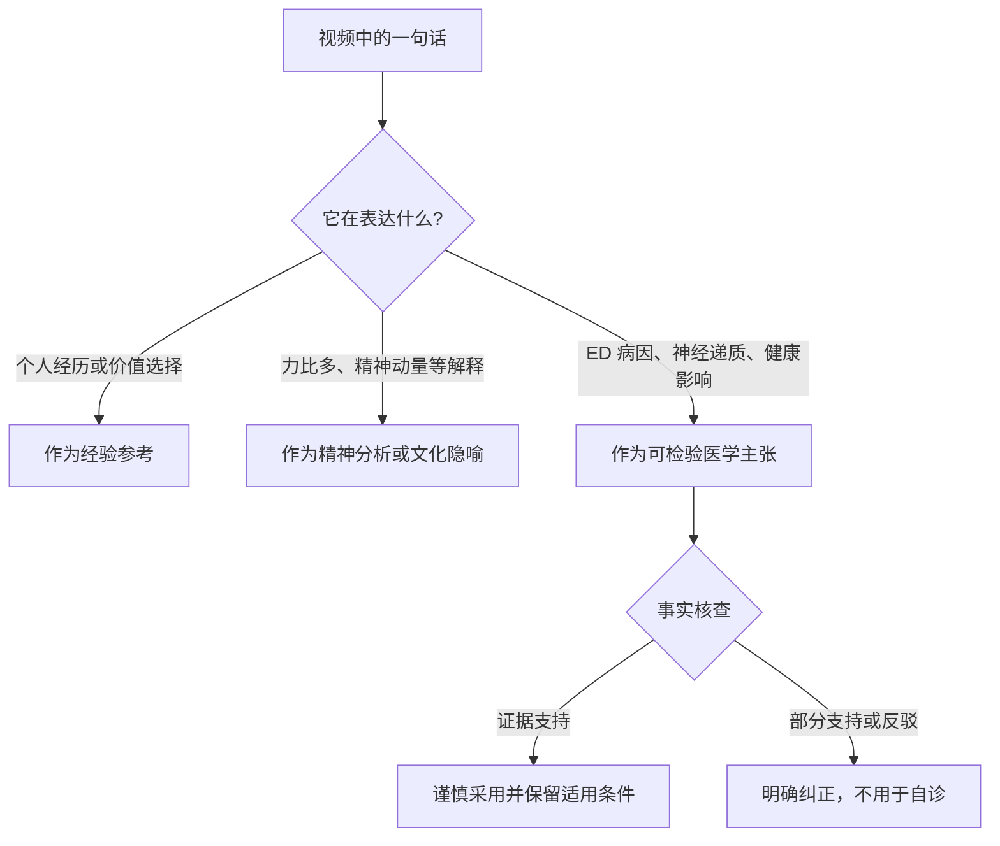
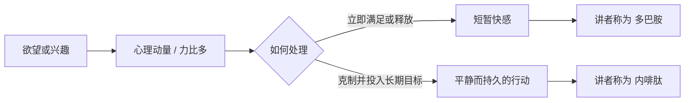
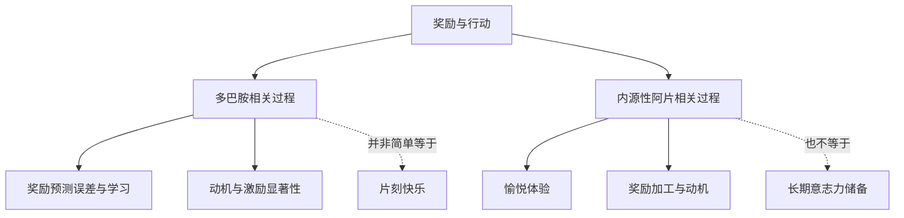
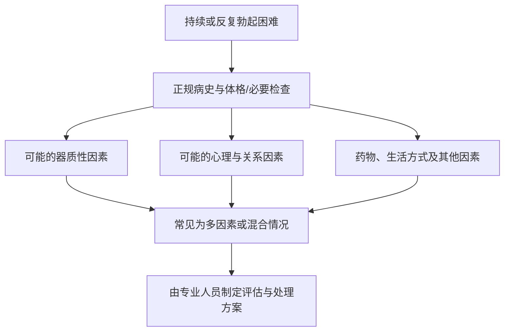
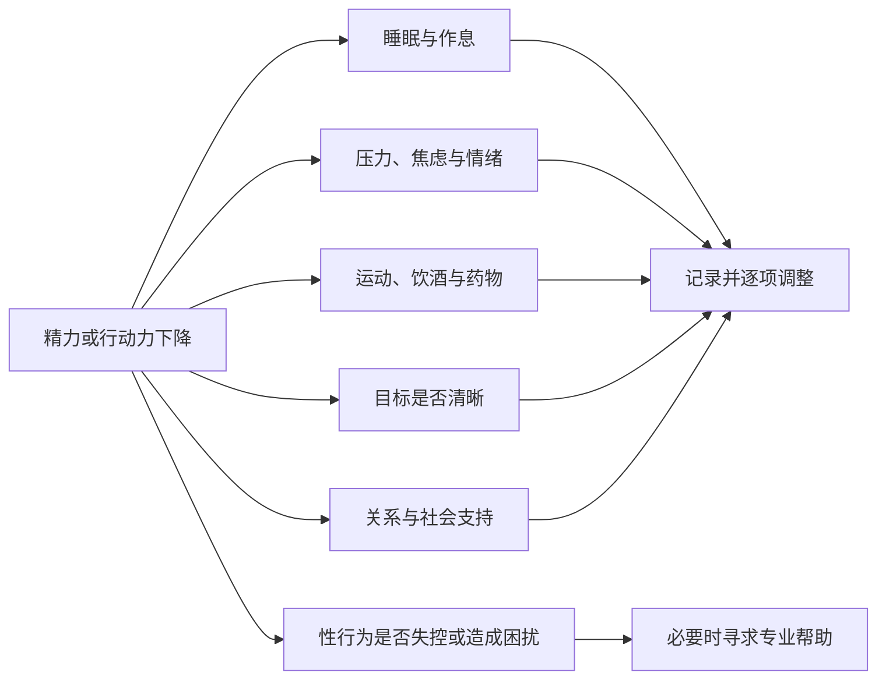

# 总结稿

[打开单页 HTML 总结](assets/bilibili-BV1PJgM6ZEH2-summary.html)

## 核心内容

视频试图回答一个偏人生经验的问题：**人怎样保留把想法转化为长期行动的“内在动量”？** 讲者借用弗洛伊德的“力比多”、精神分析、传统修身话语，以及“多巴胺 / 内啡肽”的对比来组织自己的解释。[02:44–08:52]

在这套个人模型里：

- 性欲力比多不只指性冲动，而被扩展为驱动行动、追求目标的心理能量。
- 即时消费、短暂快感或迅速释放欲望，会消耗这种动量。
- 延迟满足、长期目标和克制，则被讲者比作一种平静而持久的力量。
- 讲者把前者称为“多巴胺”，把后者称为“内啡肽”，并在结尾明确说这是“我个人的理解”。[03:35–03:48；17:34–18:26]

这套叙述可以作为**个人隐喻与价值观表达**来理解：它鼓励减少即时刺激、寻找长期目标、把欲望转化为行动。但它不能直接当作神经科学、性医学或精神分析已证实的因果模型。

## 三层内容要分开读

### 1. 可保留的生活观察

视频反复强调，长期目标、延迟满足和持续行动比片刻刺激更能给讲者带来充实感。这是个人经验层面的反思，可用于审视自己的注意力、消费习惯与目标结构，但不需要用某一种神经递质来证明才成立。

### 2. 精神分析与文化隐喻

“力比多”“精神动量”“交而不泄”等概念在视频中被连接为一套解释框架。讲者也承认自己无意深入论证精神分析理论。[11:48–12:58] 因此，更稳妥的读法是把它们视为帮助讲者表达欲望、动机和克制关系的语言，而不是现代医学的诊断或治疗理论。

### 3. 需要纠正的医学与神经科学断言

#### 多巴胺与内啡肽

视频把多巴胺描述成短暂快乐甚至“无能的愤怒”，把内啡肽描述成平静、长期行动力。事实核查结论为 **contradicted**：这不是现代神经科学接受的二分法。

- 多巴胺参与奖励预测误差、学习、动机和激励显著性，并不只是“快乐化学物质”。
- 内源性阿片系统参与愉悦与奖励加工，但没有证据表明“内啡肽”就是储存长期意志力的通用机制。

参考：[PNAS：多巴胺奖励预测误差假说](https://www.pnas.org/doi/10.1073/pnas.1014269108)、[PubMed：多巴胺与激励显著性](https://pubmed.ncbi.nlm.nih.gov/17072591/)、[Nature Communications：μ-阿片受体与奖励加工](https://www.nature.com/articles/s41467-018-03848-y)。

#### ED 与“贴邮票法”

视频介绍了睡眠时用一圈邮票观察夜间勃起的旧方法，并进一步声称几乎所有 ED 都是功能性问题。[10:02–11:39] 事实核查结论为 **partially confirmed**：

- 旧式“邮票测试”与夜间阴茎勃起/硬度监测的思路有关，但家庭测试不能单独确定病因。
- ED 可有器质性、心理性及混合性因素；当前指南提醒，多数情况并不能被简单分成“硬件正常”或“纯心理问题”。
- “几乎 100% 都是功能性”的说法没有得到支持；即使是正式夜间监测，也存在限制和混杂因素。

参考：[欧洲泌尿外科学会 ED 指南](https://uroweb.org/guidelines/sexual-and-reproductive-health/chapter/management-of-erectile-dysfunction)、[美国泌尿外科学会 ED 指南](https://www.auanet.org/guidelines-and-quality/guidelines/erectile-dysfunction-(ed)-guideline)。

#### 自慰、射精与“精力耗损”

视频一方面说自慰对身体危害不大，另一方面又把射精与心理动量下降、萎靡乃至 ED 联系起来。[14:00–14:50] 事实核查结论为 **partially confirmed**：

- 自慰通常是正常且身体风险较低的性行为。
- 普通自慰会普遍耗尽精力、削弱长期动力或导致 ED 的说法，尚无可靠证据支持。
- 自慰、幸福感和性功能研究较复杂，许多结果是观察性的；不能据此把禁欲当作恢复普遍精力的已证实疗法。

参考：[Archives of Sexual Behavior：自慰禁欲与性欲亢进](https://pmc.ncbi.nlm.nih.gov/articles/PMC7145784/)、[系统综述：自慰与性满意度](https://pubmed.ncbi.nlm.nih.gov/38255122/)、[NHS：自慰与健康](https://www.fyinorfolk.nhs.uk/friendships-relationships/masturbation/)。

## 如何把视频转成更稳健的行动建议

可以保留视频对“长期行动”的关注，但不必采用未经证实的生物化学解释：

1. 先描述行为，而不是贴神经递质标签：自己是否在用即时刺激逃避压力？
2. 观察睡眠、运动、饮酒、药物、关系压力、焦虑及整体健康，而不是把疲劳或性功能变化单因归于自慰。
3. 用可执行的小目标、规律作息、社会支持和减少信息过载来改善行动环境。
4. 若某种性行为已失去控制、妨碍生活或伴随强烈羞耻，可寻求专业心理或性健康支持，而不是用道德化自责替代评估。

## 非诊断与就医边界

本笔记不是诊断或治疗建议。持续或反复的勃起困难、晨勃明显变化、疼痛、阴茎结构变化，或伴随心血管/代谢问题、药物影响、焦虑抑郁等情况，都应由正规医疗专业人员评估。不要用“贴邮票”、能否自慰、评论区经验或自行购买药物来排除器质性因素，也不要因为一次或几次表现不佳就自行确诊 ED。

## 观众讨论与补充

以下只反映匿名观众意见，不是视频证据，也不代表总体观众：

- 有观众质疑精神分析的证据地位，提示应把象征性解释与可检验的医学主张分开。
- 有个人经历把状态较好与明确目标、规律睡眠、运动及同伴支持联系起来，为“性欲是否释放”之外提供了替代解释。
- 有观众提醒，射精后的自责感本身可能加重主观低落；这是一种心理层面的限定，不能被推广为统一原因。
- 评论区也出现关于 ED、药物和身体症状的未经核验建议与求助。较安全的共同边界是：不在评论区自诊或买药，有持续症状应就医。

评论材料来自 50 条热门顶层评论中的 20 条候选，不含嵌套回复；弹幕为当前可访问的 61 条而非历史全集。热度与点赞都不证明观点正确。

# 辅助理解

## 先建立“证据分层”

这段视频把人生经验、精神分析、传统修身语言和医学术语交织在一起。理解它的关键不是选择“全信”或“全不信”，而是判断每句话属于哪一层。

### 经验层

讲者珍视延迟满足、长期目标和持续行动，并把“有想法还能付诸实施”的状态称为内在动量。这是他对自己人生轨迹的总结。[01:43–02:31；15:27–18:26]

### 隐喻层

讲者借“性欲力比多”表达可被保存、释放或转化的心理动力，又借“多巴胺 / 内啡肽”给即时快感和长期力量命名。它们在叙事中有组织经验的作用，但不是等价的医学机制。

### 医学层

一旦谈到 ED 的病因比例、测试方法、自慰的健康后果或神经递质功能，就进入需要外部证据的领域。此时不能用讲者身份、个人体验或评论区共鸣代替指南和研究。

## 视频的隐喻模型是什么

下面这张图只复述视频的个人解释，不代表现代神经科学：

这套模型把复杂心理过程压缩成两个对立标签，因此很有传播力，也很容易造成误解。视频最后说“这是我个人的理解”[18:23–18:26]，应当把这句话视为重要限定。

## 神经科学事实核查

现代证据不支持“多巴胺 = 短暂快乐或愤怒、内啡肽 = 长期平静与意志力”的二分。

因此，减少即时刺激、追求长期目标可以是有价值的行为选择，但不应被包装成“拒绝多巴胺、获取内啡肽”的生理处方。支持该纠正的来源包括 [PNAS 的奖励预测误差综述](https://www.pnas.org/doi/10.1073/pnas.1014269108)、[多巴胺激励显著性综述](https://pubmed.ncbi.nlm.nih.gov/17072591/) 和 [人类 μ-阿片受体奖励加工研究](https://www.nature.com/articles/s41467-018-03848-y)。

## ED：不能用二分法自诊

视频用旧式“贴邮票法”说明夜间勃起，并由此把 ED 大幅归因于功能或心理问题。[10:02–11:39] 更稳健的框架是：

- 夜间勃起监测可以提供线索，但家庭邮票测试不能单独诊断病因。
- ED 不是简单的“硬件坏了 / 心理紧张”二选一；指南承认器质性、心理性与混合性因素。
- 视频所谓“几乎 100% 是功能性”的比例不受现有指南支持。

参见 [欧洲泌尿外科学会指南](https://uroweb.org/guidelines/sexual-and-reproductive-health/chapter/management-of-erectile-dysfunction) 与 [美国泌尿外科学会指南](https://www.auanet.org/guidelines-and-quality/guidelines/erectile-dysfunction-(ed)-guideline)。

## 自慰、主观精力与羞耻

视频认为普通自慰对身体危害不大，却又把射精与心理动量耗损、萎靡或 ED 相连。[14:00–14:50] 这两部分的证据强度不同：

| 说法                 | 更稳妥的结论                         |
| ------------------ | ------------------------------ |
| 自慰通常不会造成严重身体伤害     | 大体符合性健康资料，但仍需考虑具体行为是否造成损伤或妨碍生活 |
| 射精会普遍耗尽动力、导致萎靡或 ED | 缺少可靠证据，不宜作为一般因果结论              |
| 禁欲能恢复普遍精力          | 不能视为已证实疗法                      |
| 个人觉得自责、疲劳或失控       | 体验真实，但原因需结合睡眠、焦虑、关系、习惯和健康状况评估  |

相关证据见 [自慰禁欲与性欲亢进研究](https://pmc.ncbi.nlm.nih.gov/articles/PMC7145784/)、[自慰与性满意度系统综述](https://pubmed.ncbi.nlm.nih.gov/38255122/) 和 [NHS 性健康资料](https://www.fyinorfolk.nhs.uk/friendships-relationships/masturbation/)。

## 更可操作、也更少污名的替代框架

与其追问“我失去了多少力比多”，不如观察可改变的变量：

观众补充也应放在这一框架下理解：匿名评论中有人以明确目标、规律睡眠、运动和同伴支持解释自己曾经的充实状态；也有人提醒，未达到“戒除”目标后的自责可能加重低落。这些都是个人报告，只能帮助提出替代问题，不能证明病因。

## 安全边界

- 本笔记不提供 ED、肾病、激素问题或精神心理问题的诊断。
- 不要仅凭能否自慰、是否有晨勃、家庭邮票测试或一次失败排除器质性因素。
- 不要依据评论区建议自行购买或混用药物。
- 若勃起困难持续或反复、造成困扰，或伴随疼痛、结构变化、心血管/代谢风险、明显焦虑抑郁，应就医评估。
- 视觉代理未发现有独立解释价值的画面，因此本页不插入视频帧，避免用讲者近景制造额外“权威感”。

## 外部事实核验

### 声明 1（03:35）

- 视频陈述：The video contrasts dopamine as short-lived pleasure or 'impotent rage' with endorphins as a calm, durable force that sustains long-term action.
- 核验状态：存在矛盾
- 核验结果：This is not an accepted neuroscientific dichotomy. Dopamine has established roles in reward-prediction error, learning, incentive salience and motivation; it is not simply a momentary pleasure chemical. Endogenous opioid systems participate in hedonic experience and incentive motivation, but the evidence does not establish endorphins as a general store of calm, long-term willpower.
- 检索日期：2026-08-18
- 来源：
  - [Understanding dopamine and reinforcement learning: The dopamine reward prediction error hypothesis (PNAS)](https://www.pnas.org/doi/10.1073/pnas.1014269108)（primary）
  - [μ-opioid receptor system mediates reward processing in humans (Nature Communications)](https://www.nature.com/articles/s41467-018-03848-y)（primary）
  - [The debate over dopamine's role in reward: the case for incentive salience (PubMed)](https://pubmed.ncbi.nlm.nih.gov/17072591/)（secondary）

### 声明 2（10:42）

- 视频陈述：A ring of postage stamps broken by nocturnal erection can distinguish organic from functional erectile dysfunction, and nearly 100% of erectile dysfunction is functional rather than organic.
- 核验状态：部分确认
- 核验结果：The historical stamp test reflects the same general idea as nocturnal penile tumescence testing, but a home stamp result is not sufficient to diagnose cause. Current guidelines describe organic, psychogenic and mixed erectile dysfunction, caution that most cases are mixed, and note important limitations and confounders even for formal nocturnal rigidity monitoring. The near-100% functional figure is not supported.
- 检索日期：2026-08-18
- 来源：
  - [EAU Guidelines: Management of Erectile Dysfunction](https://uroweb.org/guidelines/sexual-and-reproductive-health/chapter/management-of-erectile-dysfunction)（primary）
  - [American Urological Association Erectile Dysfunction Guideline](https://www.auanet.org/guidelines-and-quality/guidelines/erectile-dysfunction-(ed)-guideline)（primary）

### 声明 3（14:00）

- 视频陈述：Masturbation is not very harmful to the body, but ejaculation depletes psychological momentum and can leave a person listless or contribute to erectile dysfunction.
- 核验状态：部分确认
- 核验结果：The first part is broadly consistent with sexual-health guidance: masturbation is generally a normal and physically safe sexual behavior. The claimed general depletion of energy, motivation or erectile function from ordinary masturbation is not established. Research on masturbation and wellbeing is heterogeneous and largely observational; evidence does not support treating abstinence as a proven way to restore general energy or motivation.
- 检索日期：2026-08-18
- 来源：
  - [NHS: Masturbation and health](https://www.fyinorfolk.nhs.uk/friendships-relationships/masturbation/)（primary）
  - [Abstinence from Masturbation and Hypersexuality (Archives of Sexual Behavior/PMC)](https://pmc.ncbi.nlm.nih.gov/articles/PMC7145784/)（secondary）
  - [Relationship between Solitary Masturbation and Sexual Satisfaction: A Systematic Review (PubMed)](https://pubmed.ncbi.nlm.nih.gov/38255122/)（secondary）

# Data

## 增强转写稿

# 校正字幕

[00:00] 今天白天晚上都没有安排课
[00:04] 小时候现在好像这个说法慢慢没有了
[00:08] 叫做工作狂
[00:10] 小时候那时候初中高中那时候到时候
[00:12] 说这个策畿啥就没有了
[00:14] 变成什么007 996是吧
[00:17] 这些词
[00:19] 时代实际上别切
[00:21] 我一直在想
[00:22] 在这么一个网络信息机器发达的时代里边
[00:25] 最近这两周给我学生讲
[00:27] 可不换灭书盒还是网课
[00:29] 一直在想一个词作为老师一路走来呀
[00:33] 新鲜色色的学生
[00:35] 什么1236大学1236本科
[00:38] 作为老师本知道有教务类
[00:40] 对学生是没有歧视的
[00:43] 但是对于一个专业科学
[00:44] 一个非常简单的一个专业问题
[00:48] 有时候你就没法砸他脑子里边去
[00:50] 你要说更复杂的
[00:51] 临床医学问题
[00:53] 就是需要很高的病例
[00:55] 甚至是一定的生活阅历
[00:57] 唯独以医学无关生活阅历
[01:00] 加上你专业的成变
[01:01] 去理解一些医学更复杂的临床现象
[01:04] 你比方说
[01:05] 今天晚上想想一个话题
[01:07] 昨天晚上讲的一句话
[01:08] 最后结尾地方说
[01:09] 要拿就拿
[01:10] 内啡肽
[01:12] 千万别拿多巴胺
[01:13] 所以实际上就用了这个道德经本的就老话
[01:17] 叫反者道之动
[01:19] 弱者道之用
[01:23] 就是但凡被社会提倡的
[01:25] 或者是被我们的日常的心理活动
[01:29] 驱动的一些欲望冲动想法等等
[01:34] 大概就是在损耗
[01:35] 或者是在不断的被人
[01:38] 应该叫掠夺走我的精神动量
[01:43] 就是我精神动量这么理解
[01:46] 就是比如说
[01:47] 我想起来吃一个好东西
[01:50] 半夜起床小店就往外冲
[01:52] 我想读一本专业书
[01:56] 百不睡觉
[01:56] 把这本书读完
[01:58] 我看了一篇喜欢的传递小说
[02:00] 一起合成
[02:02] 不吃不喝不睡三天多晚
[02:05] 做事情的时候那个
[02:09] 叫冲动是不对的
[02:15] 浓厚的兴趣
[02:18] 兴趣是一种想法
[02:19] 我脑子里边突然这会儿愣一下
[02:20] 没法找哪一个词合适
[02:22] 就是让我能够附着行动的
[02:26] 抱着想法变成行动的那个内心的驱动
[02:31] 那个力量
[02:31] 就是这两天你发现
[02:33] 妈妈我在试着给我
[02:35] 这个心动理学这本书呀
[02:37] 心里边够死了几十年的一本书
[02:39] 妈妈找一些素材
[02:41] 再找一些思路和线索
[02:44] 所以熟知我的学生
[02:46] 知道我要讲到心理和精神秘学的时候
[02:50] 是倾向于精神分析去
[02:53] 精神分析学派鼻祖就是弗洛伊德教授了
[02:55] 他提出一个伟大的想法
[02:57] 一个说法叫性欲力比多
[03:00] 所以刚才实际上我喝完我心爱的小豆浆
[03:04] 我一直几十年来喜欢喝豆浆
[03:06] 原来是买现现磨的台北这边六尾摘
[03:10] 现在网上都买到永和了
[03:12] 反正那个味道天和我口头有点偏偏
[03:15] 一边吃着打个烈镜一边喝着永和甜豆浆
[03:19] 这也是没谁了
[03:20] 就这个意思啊
[03:21] 一边喝豆浆一边还在想录点什么东西
[03:25] 一直在想比如说
[03:27] 刚才说能够驱动我把我的想法
[03:31] 变成行动的这个力量
[03:35] 如果叫内啡肽的话
[03:37] 内啡肽实际上表达出来是内心平和
[03:40] 一种平静的力量和无能的愤怒
[03:46] 平静的力量大概就是内啡肽
[03:48] 无能的愤怒大概就是多巴胺
[03:52] 我想试着通过塑型
[03:55] 证明我在人家说很牛
[03:57] 我不能像别人那样买那BVA
[04:00] 那我用一部iPhone手机
[04:02] 也至少证明我不比你差
[04:04] 我不跟你比车
[04:05] 跟你比手机开我最新款的
[04:07] iPhone 24 plus pro ad max
[04:13] 我用的不是小米是红米
[04:16] 类似这样啊不是华为是op
[04:19] 是微华是三不三
[04:22] 甚至现在没人用了
[04:23] shamp
[04:25] shamp
[04:27] 很大致力
[04:29] 其实shamp手机是很好的
[04:30] 我都不敢做火灯
[04:33] 能做手机屏幕的大概一个是shamp
[04:36] 一个是三不三
[04:38] 肯定是没问题
[04:39] 就这个意思
[04:40] 就说为什么我们现在总是心之瘟
[04:42] 淹于一些上的一些冲动想法
[04:45] 我一定要历史读一个博士
[04:48] 哪怕博士毕业就失业
[04:50] 我也好歹是博士毕业才失业的
[04:53] 我要出人头地
[04:55] 我今天要发四十篇ICI
[04:57] 我要做不出来
[04:57] 我就编
[04:58] 我要编不出来
[04:59] 我就花钱买
[05:01] 立岁这样
[05:03] 你还别笑
[05:03] 人家编你还别笑
[05:05] 人家买人家把想买文章
[05:07] 甚至把这个想法
[05:08] 付诸实施吧
[05:10] 而你什么想一想就没了
[05:11] 你心里动量不够
[05:13] 你把你的月本一个成变为内啡肽的
[05:16] 这么一个性欲力比多
[05:18] 你给释放了
[05:19] 所以你要读中国古籍古典的这个
[05:23] 药物的这个专业著作
[05:25] 就会讲交而不泄
[05:30] 所以同样一个动作
[05:31] 有人获得的是多巴胺
[05:36] 有人获得的是内啡肽
[05:38] 因为我们这不讲冯严明想
[05:40] 舒坊兄弟的这样子脏脏佛教去了
[05:42] 省着倒脚眼中
[05:43] 你至少经营小说是有这双修法
[05:47] 不符合人来不符情吧
[05:48] 瞎说的
[05:49] 这这这不让大战
[05:50] 这我我这个年轻人不能跟人家打比方
[05:53] 就是有这种冲动
[05:55] 省着一种行为
[05:56] 但是没有把这样一个内心的力量
[05:59] 释放成有一个动作或者过程
[06:02] 所以想起这事来
[06:03] 咱们既然讲那个性欲力比多了
[06:05] 其实我最早接触心理和精神比学
[06:09] 是因为你性欲力比多
[06:10] 从弗洛伊德教授里我们的信誉解释
[06:14] 但是在日常的临床的工作过程中
[06:19] 包括教学过程中使用的
[06:22] 其实是结构主义哲学
[06:26] 结构主义哲学的话
[06:26] 应该就不得不谈拉康教授
[06:30] 就对他所需要先生
[06:32] 这边学中文的同学比较熟悉
[06:35] 讲语言的能指和所指
[06:37] 语言本身是没问题的
[06:38] 但是提问一下抛开语境
[06:42] 只讲语句就他们耍肉麻
[06:46] 一个事情一定是在抹一个语言
[06:48] Fuck you 这话一定是骂人吗
[06:51] 有没有可能是老友用Eason
[06:54] 先生唱的歌好久不见
[06:57] 就在街角的咖啡店
[06:59] Fuck you
[07:00] Where are you so long time
[07:04] So long 怎么说的好久不见
[07:09] 好久不见
[07:13] So long not say
[07:15] 是这个意思吧
[07:16] 已经收入到这个
[07:17] 一看它
[07:18] 美国人民在广媒流传
[07:21] 是不是叫做叫So long not say
[07:24] So long 怎么都叫过的了
[07:27] 就那个意思啊
[07:30] 这种内心能够把想法
[07:33] 转化为动能的这个力量
[07:36] 就是那个平静的力量
[07:37] 那个一台
[07:40] 获得到片刻的快感之后
[07:42] 这种能量就释放标了
[07:45] 这个快感未必是在性的过程
[07:47] Sex这个过程过未必
[07:50] 比如说通过分期
[07:53] 买了一部手机
[07:55] 通过一夜情
[07:58] 认识一个漂亮的女孩
[08:00] 我们在年轻那个时代的时候
[08:02] 你可能爱了一个女孩很多年
[08:03] 说我一定要好好读书
[08:07] 学不成
[08:10] 这这应该怎么说
[08:11] 怎么说
[08:13] 学不成人这话也不对
[08:16] 学不成才不反向
[08:19] 我要这个
[08:20] 广州要走
[08:22] 我要证明给你看
[08:23] 我通过十年二十年的努力
[08:25] 作为一个业绩的大佬
[08:26] 一个成功的商人
[08:28] 看着我的小别客
[08:30] 看着小包马
[08:31] 看着我的小奥迪
[08:32] 看着小奔驰
[08:33] 来迎娶我心爱的姑娘
[08:36] 带上你的姑娘
[08:37] 带上你的妹妹
[08:38] 带上你的嫁妆
[08:39] 请你跟我来
[08:42] 这样的一个
[08:44] 长久的
[08:46] 内心缺东的力量
[08:49] 我们再也看不到了
[08:52] 所以讲到性欲力比多
[08:53] 别的叫他幸于作为一个医学老师
[08:55] 刚才还有人在后面说
[08:57] 你还医学老师
[08:58] 你这个状态太糙了
[09:00] 要往回的时候你是不是往吃药了
[09:03] 不是说什么时候
[09:04] 我这网友啊 本来就有网上不准备对谁
[09:07] 我支持很善意的问一下
[09:08] 是不是真的网上吃药 吃了药再过来评论
[09:12] 我没恶意啊
[09:13] 就这个意思就是说
[09:14] 我们说说开始对一个人健不健康的评论
[09:16] 是看胖瘦
[09:20] 胖子就不冰吗
[09:22] 瘦子就不健康吗
[09:24] 所以一直给我学生讲健康是什么
[09:26] 灵活的胖子 精干的瘦子
[09:30] 其实上一周身边人知道
[09:32] 我说我拍了一下两个
[09:35] 我一不调到三米多高的滑梯上
[09:39] 我六十岁了
[09:45] 不是要证明什么
[09:46] 因为这么多年一直感慨
[09:49] 一旦一个事情还选择证明一下的时候
[09:51] 事情本身就没有意义了
[09:53] 不是能不能证明
[09:54] 是在讲这么一个事实
[09:57] 就是我们什么时候开始我们的价值
[09:59] 义官判断标准出问题了
[10:02] 你比方说以临床医学一个很很糟糕的事情
[10:05] 对于男性患者来说吧
[10:08] 这个异地阳痿
[10:11] 有一个很残忍的事业
[10:13] 贴邮票
[10:15] 年轻人不知道年龄大人知道
[10:16] 原来我们写信的时候是要八分钱
[10:19] 后面别上八毛钱一张邮票
[10:20] 这邮票一大张呀
[10:21] 它中间是拿很粗的掙扎的睁眼
[10:24] 所以它只合着直接
[10:26] 那个连接是很松
[10:27] 就是让你买一版邮票
[10:28] 一半小的我们就买两张的票了不得了
[10:30] 你要撕下一张的贴到信封上面的话
[10:34] 它确实空眼轻轻一摆就开了
[10:37] 它的账里很小
[10:39] 抗击大那边很差
[10:40] 所以把这么个邮票呀
[10:42] 贴在你那个小机机上
[10:44] 如果晚上睡着之后
[10:45] 没有白贴的失业压力呀
[10:48] 房贷车贷呀
[10:49] 是把账目养这个十八万八的财理
[10:52] 没有这些压力睡着之后进入梦想
[10:54] 恢复到别状态的时候
[10:56] 如果你的小蛮样
[10:59] 有所举动的话
[11:00] 它不由小航运撑断
[11:03] 缠一圈嘛
[11:03] 它不接什么几片只通过这个真空
[11:06] 在一块连着今天一碰它就断了
[11:09] 我们叫贴邮票法
[11:12] 来证明一下
[11:13] 在我们专业社会的器质性改变
[11:18] 就是一个结构性破坏
[11:20] 这么一个背景上看
[11:22] 你说临床上的阳痿患者
[11:25] 器质性变变的
[11:28] 保守一点
[11:29] 有百分之一美
[11:31] 改个说法
[11:32] 我们几乎可以用统计学砖也属于说话
[11:36] 几乎接近百分之百的阳痿
[11:39] 都是功能性的
[11:48] 我们最初失去我们对于一个失误的探索
[11:52] 探索好奇行动力
[11:56] 就是从心开始的
[11:58] 这个事情完全可以提出反驳
[12:00] 实际上包括弗洛伊德教授本身
[12:02] 一直说荣格他把荣格打儿子
[12:04] 看认为荣格是他接完人
[12:05] 实际上在他去世以后
[12:07] 他的女儿安娜·弗洛伊德和荣格教授对他的看法
[12:11] 是不认可的
[12:12] 他的亲生女儿安娜·弗洛伊德都认为
[12:15] 不应该叫性欲力比多
[12:16] 应该叫中性力比多
[12:19] 我这儿都无意于去探究一个精神分析学
[12:23] 或者精神分析学派
[12:25] 他的更深层次的意识
[12:28] 潜意识和潜意识
[12:30] 什么unconscious
[12:32] preconscious
[12:33] 这些词
[12:34] 差异在哪里
[12:35] 这在临床世界中去业证就ok了
[12:38] 因为我用的很少
[12:39] 我要真的使用一些
[12:42] 叫做技术手段的话
[12:43] 更多的还是还是语言解构
[12:46] 能指和所指
[12:48] 在某一个语境下 他哪里出问题了
[12:50] 他讲的是to be
[12:51] or not to be
[12:52] 类似于这样一些
[12:53] 只是很严格的这种问题
[12:54] 我们这儿不展开探讨
[12:56] 这一探讨就已经专业领域了
[12:58] 我是这样举个例子
[12:59] 就是想讲一下
[12:59] 为什么说要拿就拿
[13:01] 内啡肽
[13:02] 最好别拿多巴胺
[13:04] 借多巴胺
[13:05] 躲着点跑
[13:07] 告诉我随便举了几个例子
[13:09] 我不能明白我说的多巴胺是什么
[13:12] 容易获取的
[13:13] 片刻的快乐
[13:16] 说不定我喝杯快点说
[13:17] 累了大热天的
[13:19] 我也还买了一整件二十四罐
[13:23] 香港的快乐手
[13:25] 喝完之后
[13:26] 纯齿之间
[13:27] 不想咱们喝的时候
[13:29] 留下的缺失
[13:30] 哎呀
[13:30] 他那个气泡的刺激味
[13:31] 有点麻麻的
[13:32] 是吧
[13:32] 有点刺刺的
[13:33] 那个杀口感
[13:35] 他喝完之后
[13:36] 好像在后嗓子眼上
[13:39] 有一层喝了红汤水的
[13:42] 他就标明了
[13:43] 他放的是白砂糖
[13:45] 放这套的是墨西哥版的墨西哥版
[13:47] 没买我先喝喝钢板的吧
[13:49] 没事干啥白写着去
[13:51] 尝试吧
[13:52] 至少证明我还一点力比多
[13:53] 要尝试点新鲜食物
[13:56] 就这个意思就说
[13:58] 为什么老祖宗们讲
[14:00] 一滴精十滴血
[14:02] 所以好多人担心说
[14:03] 年轻手淫
[14:04] 对身体危害是不是特别大
[14:06] 对身体危害不大
[14:07] 对我们去充满斗志
[14:10] 一定要附加一方回来营取我
[14:12] 小时候青梅猪马的姑娘
[14:15] 这一个心理动量
[14:18] 搞得整日浑浑噩噩
[14:21] 昏昏沉沉
[14:22] 萎靡不振
[14:25] 你脑大头像小头一样
[14:27] 阳痿，ED
[14:29] erectile
[14:32] dysfunction
[14:33] 一滴
[14:35] 类似一只
[14:37] 内心保持一个动量
[14:39] 这个动量用弗洛伊德教授的话讲
[14:41] 心理的驱动
[14:42] 用中国道教教教
[14:45] 而不惜
[14:46] 用咱们懈怠说法
[14:48] 就是我要内啡肽
[14:50] 我拒绝多巴胺
[14:54] 那算是给最大玩的视频做一个补充吧
[14:56] 就是为什么你要讲
[14:57] 要拿就拿内啡肽
[14:59] 千万别拿多巴胺
[15:00] 这个解说我不知道
[15:02] 有没有人感兴许去听
[15:05] 就像刚才网友
[15:06] 他不感兴许你讲的内容是吗
[15:07] 感兴许你这个外观
[15:09] 你这个looks like
[15:10] 就不像个好人
[15:13] 其实你注意啊
[15:16] 越是坏人
[15:17] 才越需要把自己打扮成好人
[15:19] 所以还有网友
[15:21] 我说你是不是也是趴到井沿上
[15:23] 掉下去那只蛤蟆嘛
[15:24] 其实不是
[15:25] 我的实话是说
[15:27] 辛苦了大半辈子了
[15:28] 到六十岁了
[15:29] 我还专门评论学回复了一下
[15:31] 我属于坐在井沿上
[15:35] 看风景的哪一个
[15:39] 应该讲
[15:40] 我应该具有相当充足的力量
[15:45] 不至于在掉掉回警内
[15:47] 慢慢的世界很精彩
[15:50] 慢慢的世界不无奈
[15:52] 我记得2015年的时候
[15:54] 回老家大春节的
[15:56] 很少很少好多年没有遇到
[15:57] 因为我初中高中六年
[15:59] 世界在县城读书
[16:00] 我每次上学回家的时候路上
[16:04] 有一个很大的土坡
[16:06] 老家叫三连坡三个坡连起来
[16:08] 就像我开出去眼门关
[16:10] 眼门十晚盘去跑山
[16:12] 他这三个坡连
[16:13] 他不长也不短
[16:14] 有一公里多长
[16:16] 正好那个时候还不开车
[16:17] 那我和儿子下雪天
[16:19] 穿着冲锋衣
[16:20] 大雪地里边很少结果
[16:22] 那么大的雪
[16:22] 挺美的
[16:24] 路上走着说我突然发现
[16:25] 这就是2015年
[16:26] 我突然发现我今年过了春节以后
[16:29] 也切打黑闪
[16:30] 大门
[16:30] 他说你啥意思
[16:32] 我说就是这门打开车后
[16:33] 基本上我想要什么就有什么
[16:37] 他说你想要什么
[16:38] 我说突然发现
[16:40] 不想要的
[16:42] 想二十来岁的时候
[16:43] 跟别人学的那个红院大致
[16:46] 想要的很简单
[16:48] 有一个能讲课的讲台
[16:50] 我不知道二十来岁
[16:50] 还当医生那会儿
[16:51] 怎么会对讲台这么感觉
[16:53] 不知道
[16:54] 或许那会儿就一语称称吧
[16:56] 也许这词不一定合适
[16:57] 就那个意思吧
[17:00] 一辈子和讲台
[17:01] 他教导
[17:02] 有一套能诸的方子
[17:04] 这个我从来没追求过大小
[17:07] 一辆能开的车
[17:09] 年轻时候二十来岁就有摩托车内
[17:12] 台湾进口的也不错
[17:13] 摩托车
[17:14] 一直到交通工具还受到过去
[17:17] 从那个时候
[17:17] 大概能体会到
[17:19] 爬到景院外面
[17:21] 而且从来不担心能掉下去的
[17:23] 那种弃义
[17:26] 如果作为老师
[17:27] 作为一个长者
[17:28] 想让我的年轻人
[17:30] 平常觉得你去听一听感受一下
[17:32] 就是我们实际上
[17:34] 之所以能够支撑我爬到景院
[17:36] 再调不回去的
[17:38] 不是多巴胺
[17:40] 是内心深处
[17:42] 驱动我去延迟
[17:44] 享受一个久远的
[17:45] 宏达目标的内心的那个动量
[17:47] 那个动量是什么
[17:48] 那个动量不是想一想
[17:50] 我们彼此是野心勃勃的
[17:52] 军心勃勃的
[17:53] 不是
[17:53] 是那个action power
[17:56] 行动的力量
[17:58] 能量
[18:01] 大概总结的说
[18:04] 就是多巴胺是获得
[18:05] 片刻的愉悦和快乐
[18:08] Happiness
[18:10] 那么内啡肽的话
[18:11] 是让我走行业的路
[18:15] 能坚持下去的内心的那个力量
[18:21] 平静的力量
[18:23] 无能的愤怒
[18:26] 这是我个人的理解
[18:27] 有什么问题咱们
[18:28] 当然你要说我长得不像医学老师
[18:30] 其实我是欢迎
[18:31] 但是我建议
[18:32] 知道要有脸比较好
[18:35] 我们这儿都知道
[18:36] 我刚才刚吃了
[18:37] 大哥已经轻轻吃药了
[18:39] 那么
[18:40] 好
[18:41] good night
[18:42] 下课了

## 原始转写稿

[00:00] 今天白天晚上都没有安排课
[00:04] 小时候现在好像这个说法慢慢没有了
[00:08] 叫做工作狂
[00:10] 小时候那时候初中高中那时候到时候
[00:12] 说这个策畿啥就没有了
[00:14] 变成什么007 996是吧
[00:17] 这些词
[00:19] 时代实际上别切
[00:21] 我一直在想
[00:22] 在这么一个网络信息机器发达的时代里边
[00:25] 最近这两周给我学生讲
[00:27] 可不换灭书盒还是网课
[00:29] 一直在想一个词作为老师一路走来呀
[00:33] 新鲜色色的学生
[00:35] 什么1236大学1236本科
[00:38] 作为老师本知道有教务类
[00:40] 对学生是没有歧视的
[00:43] 但是对于一个专业科学
[00:44] 一个非常简单的一个专业问题
[00:48] 有时候你就没法砸他脑子里边去
[00:50] 你要说更复杂的
[00:51] 领床医学问题
[00:53] 就是需要很高的病例
[00:55] 甚至是一定的生活阅历
[00:57] 唯独以医学无关生活阅历
[01:00] 加上你专业的成变
[01:01] 去理解一些医学更复杂的领床现象
[01:04] 你比方说
[01:05] 今天晚上想想一个话题
[01:07] 昨天晚上讲的一句话
[01:08] 最后结尾地方说
[01:09] 要拿就拿
[01:10] 美非派
[01:12] 千万别拿多巴胺
[01:13] 所以实际上就用了这个道德经本的就老话
[01:17] 叫反者道之动
[01:19] 弱者道之用
[01:23] 就是但凡被社会提倡的
[01:25] 或者是被我们的日常的心理活动
[01:29] 驱动的一些欲望冲动想法等等
[01:34] 大概就是在损耗
[01:35] 或者是在不断的被人
[01:38] 应该叫掠夺走我的精神动量
[01:43] 就是我精神动量这么理解
[01:46] 就是比如说
[01:47] 我想起来吃一个好东西
[01:50] 半夜起床小店就往外冲
[01:52] 我想读一本专业书
[01:56] 百不睡觉
[01:56] 把这本书读完
[01:58] 我看了一篇喜欢的传递小说
[02:00] 一起合成
[02:02] 不吃不喝不睡三天多晚
[02:05] 做事情的时候那个
[02:09] 叫冲动是不对的
[02:15] 浓厚的兴趣
[02:18] 兴趣是一种想法
[02:19] 我脑子里边突然这会儿愣一下
[02:20] 没法找哪一个词合适
[02:22] 就是让我能够附着行动的
[02:26] 抱着想法变成行动的那个内心的驱动
[02:31] 那个力量
[02:31] 就是这两天你发现
[02:33] 妈妈我在试着给我
[02:35] 这个心动理学这本书呀
[02:37] 心里边够死了几十年的一本书
[02:39] 妈妈找一些素材
[02:41] 再找一些思路和线索
[02:44] 所以熟知我的学生
[02:46] 知道我要讲到心理和精神秘学的时候
[02:50] 是倾向于精神分析去
[02:53] 精神不觉得彼祖就是弗洛伊德教授了
[02:55] 他提出一个伟大的想法
[02:57] 一个说法叫幸运力比多
[03:00] 所以刚才实际上我喝完我心爱的小豆浆
[03:04] 我一直几十年来喜欢喝豆浆
[03:06] 原来是买现现磨的台北这边六尾摘
[03:10] 现在网上都买到永和了
[03:12] 反正那个味道天和我口头有点偏偏
[03:15] 一边吃着打个烈镜一边喝着永和甜豆浆
[03:19] 这也是没谁了
[03:20] 就这个意思啊
[03:21] 一边喝豆浆一边还在想录点什么东西
[03:25] 一直在想比如说
[03:27] 刚才说能够驱动我把我的想法
[03:31] 变成行动的这个力量
[03:35] 如果叫内飞胎的话
[03:37] 内飞胎实际上表达出来是内心平和
[03:40] 一种平静的力量和无能的愤怒
[03:46] 平静的力量大概就是内飞胎
[03:48] 无能的愤怒大概就是多么爱
[03:52] 我想试着通过塑型
[03:55] 证明我在人家说很牛
[03:57] 我不能像别人那样买那BVA
[04:00] 那我用一部iPhone手机
[04:02] 也至少证明我不比你差
[04:04] 我不跟你比车
[04:05] 跟你比手机开我最新款的
[04:07] iPhone 24 plus pro ad max
[04:13] 我用的不是小米是红米
[04:16] 类似这样啊不是华为是op
[04:19] 是微华是三不三
[04:22] 甚至现在没人用了
[04:23] shamp
[04:25] shamp
[04:27] 很大致力
[04:29] 其实shamp手机是很好的
[04:30] 我都不敢做火灯
[04:33] 能做手机屏幕的大概一个是shamp
[04:36] 一个是三不三
[04:38] 肯定是没问题
[04:39] 就这个意思
[04:40] 就说为什么我们现在总是心之瘟
[04:42] 淹于一些上的一些冲动想法
[04:45] 我一定要历史读一个博士
[04:48] 哪怕博士毕业就失业
[04:50] 我也好歹是博士毕业才失业的
[04:53] 我要出人头地
[04:55] 我今天要发四十篇ICI
[04:57] 我要做不出来
[04:57] 我就编
[04:58] 我要编不出来
[04:59] 我就花钱买
[05:01] 立岁这样
[05:03] 你还别笑
[05:03] 人家编你还别笑
[05:05] 人家买人家把想买文章
[05:07] 声之称这个想法
[05:08] 付出事实吧
[05:10] 而你什么想一想就没了
[05:11] 你心里动量不够
[05:13] 你把你的月本一个成变为内飞胎的
[05:16] 这么一个信誉力比多
[05:18] 你给释放了
[05:19] 所以你要读中国古籍古典的这个
[05:23] 药物的这个专业著作
[05:25] 就会讲胶而不屑
[05:30] 所以同样一个动作
[05:31] 有人获得的是多巴胺
[05:36] 有人获得的是内飞胎
[05:38] 因为我们这不讲冯严明想
[05:40] 舒坊兄弟的这样子脏脏佛教去了
[05:42] 省着倒脚眼中
[05:43] 你至少经营小说是有这双修法
[05:47] 不符合人来不符情吧
[05:48] 瞎说的
[05:49] 这这这不让大战
[05:50] 这我我这个年轻人不能跟人家打比方
[05:53] 就是有这种冲动
[05:55] 省着一种行为
[05:56] 但是没有把这样一个内心的力量
[05:59] 释放成有一个动作或者过程
[06:02] 所以想起这事来
[06:03] 咱们既然讲那个信誉力比多了
[06:05] 其实我最早接触心理和精神比学
[06:09] 是因为你信誉力比多
[06:10] 从福利的教授里我们的信誉解释
[06:14] 但是在日常的龄庞的工作过程中
[06:19] 包括教学过程中使用的
[06:22] 其实是结构主义哲学
[06:26] 结构主义哲学的话
[06:26] 应该就不得不谈拉康教授
[06:30] 就对他所需要先生
[06:32] 这边学中文的同学比较熟悉
[06:35] 讲语言的能者和所指
[06:37] 语言本身是没问题的
[06:38] 但是提问一下抛开语境
[06:42] 只讲语句就他们耍肉麻
[06:46] 一个事情一定是在抹一个语言
[06:48] Fuck you 这话一定是骂人吗
[06:51] 有没有可能是老友用Eason
[06:54] 先生唱的歌好久不见
[06:57] 就在街角的咖啡店
[06:59] Fuck you
[07:00] Where are you so long time
[07:04] So long 怎么说的好久不见
[07:09] 好久不见
[07:13] So long not say
[07:15] 是这个意思吧
[07:16] 已经收入到这个
[07:17] 一看它
[07:18] 美国人民在广媒流传
[07:21] 是不是叫做叫So long not say
[07:24] So long 怎么都叫过的了
[07:27] 就那个意思啊
[07:30] 这种内心能够把想法
[07:33] 转化为动能的这个力量
[07:36] 就是那个平静的力量
[07:37] 那个一台
[07:40] 获得到片刻的快感之后
[07:42] 这种能量就释放标了
[07:45] 这个快感未必是在性的过程
[07:47] Sex这个过程过未必
[07:50] 比如说通过分期
[07:53] 买了一部手机
[07:55] 通过一夜情
[07:58] 认识一个漂亮的女孩
[08:00] 我们在年轻那个时代的时候
[08:02] 你可能爱了一个女孩很多年
[08:03] 说我一定要好好读书
[08:07] 学不成
[08:10] 这这应该怎么说
[08:11] 怎么说
[08:13] 学不成人这话也不对
[08:16] 学不成才不反向
[08:19] 我要这个
[08:20] 广州要走
[08:22] 我要证明给你看
[08:23] 我通过十年二十年的努力
[08:25] 作为一个业绩的大佬
[08:26] 一个成功的商人
[08:28] 看着我的小别客
[08:30] 看着小包马
[08:31] 看着我的小奥迪
[08:32] 看着小奔驰
[08:33] 来迎娶我心爱的姑娘
[08:36] 带上你的姑娘
[08:37] 带上你的妹妹
[08:38] 带上你的嫁妆
[08:39] 请你跟我来
[08:42] 这样的一个
[08:44] 长久的
[08:46] 内心缺东的力量
[08:49] 我们再也看不到了
[08:52] 所以讲到信于里
[08:53] 别的叫他幸于作为一个医学老师
[08:55] 刚才还有人在后面说
[08:57] 你还医学老师
[08:58] 你这个状态太糙了
[09:00] 要往回的时候你是不是往吃药了
[09:03] 不是说什么时候
[09:04] 我这网友啊 本来就有网上不准备对谁
[09:07] 我支持很善意的问一下
[09:08] 是不是真的网上吃药 吃了药再过来评论
[09:12] 我没饿意啊
[09:13] 就这个意思就是说
[09:14] 我们说说开始对一个人健不健康的评论
[09:16] 是看胖瘦
[09:20] 胖子就不冰吗
[09:22] 瘦子就不健康吗
[09:24] 所以一直给我学生讲健康是什么
[09:26] 灵活的胖子 精盖的瘦子
[09:30] 其实上一周身边人知道
[09:32] 我说我拍了一下两个
[09:35] 我一不调到三米多高的滑梯上
[09:39] 我六十岁了
[09:45] 不是要证明什么
[09:46] 因为这么多年一直感慨
[09:49] 一旦一个事情还选择证明一下的时候
[09:51] 事情本身就没有意义了
[09:53] 不是能不能证明
[09:54] 是在讲这么一个事实
[09:57] 就是我们什么时候开始我们的价值
[09:59] 义官判断标准出问题了
[10:02] 你比方说以临床医学一个很很糟糕的事情
[10:05] 对于男性患者来说吧
[10:08] 这个异地养美
[10:11] 有一个很残忍的事业
[10:13] 贴邮票
[10:15] 年轻人不知道年龄大人知道
[10:16] 原来我们写信的时候是要八分钱
[10:19] 后面别上八毛钱一张邮票
[10:20] 这邮票一大张呀
[10:21] 它中间是拿很粗的掙扎的睁眼
[10:24] 所以它只合着直接
[10:26] 那个连接是很松
[10:27] 就是让你买一版邮票
[10:28] 一半小的我们就买两张的票了不得了
[10:30] 你要撕下一张的贴到信份上面的话
[10:34] 它确实空眼轻轻一摆就开了
[10:37] 它的账里很小
[10:39] 抗击大那边很差
[10:40] 所以把这么个邮票呀
[10:42] 贴在你那个小机机上
[10:44] 如果晚上睡着之后
[10:45] 没有白贴的失业压力呀
[10:48] 房贷车贷呀
[10:49] 是把账目养这个十八万八的财理
[10:52] 没有这些压力睡着之后进入梦想
[10:54] 恢复到别状态的时候
[10:56] 如果你的小蛮样
[10:59] 有所举动的话
[11:00] 它不由小航运撑断
[11:03] 缠一圈嘛
[11:03] 它不接什么几片只通过这个真空
[11:06] 在一块连着今天一碰它就断了
[11:09] 我们叫贴邮票法
[11:12] 来证明一下
[11:13] 在我们专业社会的气质性改变
[11:18] 就是一个结构性破坏
[11:20] 这么一个背景上看
[11:22] 你说临床上的杨伟患者
[11:25] 气质性变变的
[11:28] 保守一点
[11:29] 有百分之一美
[11:31] 改个说法
[11:32] 我们几乎可以用统计学砖也属于说话
[11:36] 几乎接近百分之百的杨伟
[11:39] 都是功能性的
[11:48] 我们最初失去我们对于一个失误的探索
[11:52] 探索好奇行动力
[11:56] 就是从心开始的
[11:58] 这个事情完全可以提出反驳
[12:00] 实际上包括福利德教授本身
[12:02] 一直说中哥他把中哥打儿子
[12:04] 看认为中哥是他接完人
[12:05] 实际上在他去世以后
[12:07] 他的女儿安娜福利德和中哥教授对他的看法
[12:11] 是不认可的
[12:12] 他的亲生女儿安娜福利德都认为
[12:15] 不应该叫心理理别多
[12:16] 应该叫中性理别多
[12:19] 我这儿都无意于去探究一个精神分析并学
[12:23] 或者精神分析学派
[12:25] 他的更深层次的意识
[12:28] 潜意识和潜意识
[12:30] 什么unconsonance
[12:32] proconsonance
[12:33] 这些词
[12:34] 差异在哪里
[12:35] 这在临床世界中去业证就ok了
[12:38] 因为我用的很少
[12:39] 我要真的使用一些
[12:42] 叫做技术手段的话
[12:43] 更多的还是还是语言解构
[12:46] 能只和所指
[12:48] 在某一个语境下 他哪里出问题了
[12:50] 他讲的是托逼
[12:51] 偶然都托逼
[12:52] 类似于这样一些
[12:53] 只是很严格的这种问题
[12:54] 我们这儿不展开探讨
[12:56] 这一探讨就已经专业领域了
[12:58] 我是这样举个例子
[12:59] 就是想讲一下
[12:59] 为什么说要拿就拿
[13:01] 美肥胎
[13:02] 最好别拿多巴胺
[13:04] 借多巴胺
[13:05] 躲着点跑
[13:07] 告诉我随便举了几个例子
[13:09] 我不能明白我说的多巴胺是什么
[13:12] 容易获取的
[13:13] 片刻的快乐
[13:16] 说不定我喝杯快点说
[13:17] 累了大热天的
[13:19] 我也还买了一整件二十四罐
[13:23] 香港的快乐手
[13:25] 喝完之后
[13:26] 纯齿之间
[13:27] 不想咱们喝的时候
[13:29] 留下的缺失
[13:30] 哎呀
[13:30] 他那个气泡的刺激味
[13:31] 有点麻麻的
[13:32] 是吧
[13:32] 有点刺刺的
[13:33] 那个杀口感
[13:35] 他喝完之后
[13:36] 好像在后嗓子眼上
[13:39] 有一层喝了红汤水的
[13:42] 他就标明了
[13:43] 他放的是白砂糖
[13:45] 放这套的是墨西哥版的墨西哥版
[13:47] 没买我先喝喝钢板的吧
[13:49] 没事干啥白写着去
[13:51] 尝试吧
[13:52] 至少证明我还一点力比多
[13:53] 要尝试点新鲜食物
[13:56] 就这个意思就说
[13:58] 为什么老祖宗们讲
[14:00] 一滴精十滴血
[14:02] 所以好多人担心说
[14:03] 年轻手营
[14:04] 对身体危害是不是特别大
[14:06] 对身体危害不大
[14:07] 对我们去充满斗志
[14:10] 一定要附加一方回来营取我
[14:12] 小时候青梅猪马的姑娘
[14:15] 这一个心理动量
[14:18] 搞得整日昏昏饿饿
[14:21] 昏昏沉沉
[14:22] 伪灭不振
[14:25] 你脑大头像小头一样
[14:27] 扬伟一滴
[14:29] reaction
[14:32] disfaction
[14:33] 一滴
[14:35] 类似一只
[14:37] 内心保持一个动量
[14:39] 这个动量用福利德教授的话讲
[14:41] 心理的驱动
[14:42] 用中国道教教教
[14:45] 而不惜
[14:46] 用咱们懈怠说法
[14:48] 就是我要立肥胎
[14:50] 我拒绝道把安
[14:54] 那算是给最大玩的视频做一个补充吧
[14:56] 就是为什么你要讲
[14:57] 要拿就拿立肥胎
[14:59] 千万别拿道把安
[15:00] 这个解说我不知道
[15:02] 有没有人感兴许去听
[15:05] 就像刚才网友
[15:06] 他不感兴许你讲的内容是吗
[15:07] 感兴许你这个外观
[15:09] 你这个LOCKS LIKE
[15:10] 就不像个好人
[15:13] 其实你注意啊
[15:16] 越是坏人
[15:17] 才越需要把自己打扮成好人
[15:19] 所以还有网友
[15:21] 我说你是不是也是趴到警约上
[15:23] 掉下去那只寒嘛
[15:24] 其实不是
[15:25] 我的实话是说
[15:27] 辛苦了大半辈子了
[15:28] 到六十岁了
[15:29] 我还专门评论学回复了一下
[15:31] 我属于坐在警约上
[15:35] 砍风景的哪一个
[15:39] 应该讲
[15:40] 我应该具有相当充足的力量
[15:45] 不至于在掉掉回警内
[15:47] 慢慢的世界很精彩
[15:50] 慢慢的世界不无奈
[15:52] 我记得2015年的时候
[15:54] 回老家大春节的
[15:56] 很少很少好多年没有遇到
[15:57] 因为我初中高中六年
[15:59] 世界在县城读书
[16:00] 我每次上学回家的时候路上
[16:04] 有一个很大的土坡
[16:06] 老家叫三连坡三个坡连起来
[16:08] 就像我开出去眼门关
[16:10] 眼门十晚盘去跑山
[16:12] 他这三个坡连
[16:13] 他不长也不短
[16:14] 有一公里多长
[16:16] 正好那个时候还不开车
[16:17] 那我和儿子下雪天
[16:19] 穿着冲锋衣
[16:20] 大雪地里边很少结果
[16:22] 那么大的雪
[16:22] 挺美的
[16:24] 路上走着说我突然发现
[16:25] 这就是2015年
[16:26] 我突然发现我今年过了春节以后
[16:29] 也切打黑闪
[16:30] 大门
[16:30] 他说你啥意思
[16:32] 我说就是这门打开车后
[16:33] 基本上我想要什么就有什么
[16:37] 他说你想要什么
[16:38] 我说突然发现
[16:40] 不想要的
[16:42] 想二十来岁的时候
[16:43] 跟别人学的那个红院大致
[16:46] 想要的很简单
[16:48] 有一个能讲课的讲台
[16:50] 我不知道二十来岁
[16:50] 还当医生那会儿
[16:51] 怎么会对讲台这么感觉
[16:53] 不知道
[16:54] 或许那会儿就一语称称吧
[16:56] 也许这词不一定合适
[16:57] 就那个意思吧
[17:00] 一辈子和讲台
[17:01] 他教导
[17:02] 有一套能诸的方子
[17:04] 这个我从来没追求过大小
[17:07] 一辆能开的车
[17:09] 年轻时候二十来岁就有摩托车内
[17:12] 台湾进口的也不错
[17:13] 摩托车
[17:14] 一直到交通工具还受到过去
[17:17] 从那个时候
[17:17] 大概能体会到
[17:19] 爬到景院外面
[17:21] 而且从来不担心能掉下去的
[17:23] 那种弃义
[17:26] 如果作为老师
[17:27] 作为一个长者
[17:28] 想让我的年轻人
[17:30] 平常觉得你去听一听感受一下
[17:32] 就是我们实际上
[17:34] 只所以能够支撑我爬到景院
[17:36] 再调不回去的
[17:38] 不是多八岸
[17:40] 是内心生输
[17:42] 驱动我去延迟
[17:44] 享受一个久远的
[17:45] 宏达目标的内心的那个动量
[17:47] 那个动量是什么
[17:48] 那个动量不是想一想
[17:50] 我们彼此是野心勃勃的
[17:52] 军心勃勃的
[17:53] 不是
[17:53] 是那个action power
[17:56] 行动的力量
[17:58] 能量
[18:01] 大概总结的说
[18:04] 就是多八岸是获得
[18:05] 骗客的愉悦和快乐
[18:08] Happiness
[18:10] 那么哪些派的话
[18:11] 是让我走行业的路
[18:15] 能坚持下去的内心的那个力量
[18:21] 平静的力量
[18:23] 无能的愤怒
[18:26] 这是我个人的理解
[18:27] 有什么问题咱们
[18:28] 当然你要说我长得不像医学老师
[18:30] 其实我是欢迎
[18:31] 但是我建议
[18:32] 知道要有脸比较好
[18:35] 我们这儿都知道
[18:36] 我刚才刚吃了
[18:37] 大哥已经轻轻吃药了
[18:39] 那么
[18:40] 好
[18:41] good night
[18:42] 下课了

## 原始关键帧

### 关键帧 1

### 关键帧 2

### 关键帧 3

### 关键帧 4

### 关键帧 5

### 关键帧 6

### 关键帧 7

### 关键帧 8

### 关键帧 9

### 关键帧 10

## 补充原始数据

- [bilibili-BV1PJgM6ZEH2-comments.jsonl](assets/bilibili-BV1PJgM6ZEH2-comments.jsonl)
- [bilibili-BV1PJgM6ZEH2-comment-candidates.json](assets/bilibili-BV1PJgM6ZEH2-comment-candidates.json)
- [bilibili-BV1PJgM6ZEH2-danmaku.jsonl](assets/bilibili-BV1PJgM6ZEH2-danmaku.jsonl)
- [bilibili-BV1PJgM6ZEH2-danmaku-analysis.json](assets/bilibili-BV1PJgM6ZEH2-danmaku-analysis.json)
- [bilibili-BV1PJgM6ZEH2-visual-summary.png](assets/bilibili-BV1PJgM6ZEH2-visual-summary.png)
- [bilibili-BV1PJgM6ZEH2-summary.html](assets/bilibili-BV1PJgM6ZEH2-summary.html)
