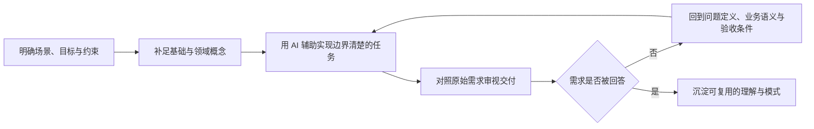

# 总结

## 核心摘要

这是一段讲者回顾自己带一名大一计算机专业实习生的**个案反思**，不是关于 AI 编程效率、实习培养或学生能力的可复现基准。讲者描述的安排是：先用不到一周补足基础，再在后续几周让实习生边实践边学习；任务从整理讲者个人知乎内容，逐步走向数据采集集成、数据建模、维度建模与自定义分析报表。基础阶段是后续任务的前提，而非可以跳过的“准备工作”。

案例的核心并不在于“AI 能把多少代码写出来”，而在于把学习链条拆开：理解场景与概念、定义问题和需求、借助 AI 实现、再用原始需求审视交付。讲者以自定义报表为例：交付虽然看起来功能较全，但实习生承认并未按最初的具体需求实现。由此得出的只是讲者在该带教案例中的判断——**结果看似可用，并不等于真正回答了需求。**

当任务进入数据贴源层、宽表、维度表与自定义报表时，讲者试图让实习生把抽象的学习目标落到特定领域任务上。这里可把“理解领域概念，再实现一项有边界的功能”视为该个案的带教结构，而不是画面证明的培训范式。

## 从个案中可迁移的工程判断

1. **先定义要解决的问题，再决定让 AI 写什么。** 需求应至少说清使用场景、目标用户或决策、输入与输出、边界条件，以及怎样判断“做对了”。否则 AI 可以产出一个完整界面或流程，却未必产出需要的东西。
2. **把“实现”与“理解”分开验收。** 可以让 AI 生成代码、测试草案或候选结构，但仍要追问：为什么需要这个字段、这张表服务什么分析、这个报表回答谁的什么问题、错误结果会造成什么后果。
3. **把反馈当作下一轮问题定义的材料。** 发现交付偏离需求时，先找缺失的约束、业务语义或验收标准，而不是只要求“再优化一版”。这样能把返工转为可学习的差异记录。

这些是从讲者叙述中整理出的实践框架，不保证对所有团队、实习生或项目同样有效；视频中的三周周期、任务规模和完成速度均属于其私有场景，未作外部核验。

## 技术概念与事实核验

- **[部分确认] 数据源、数据连接与编排任务。** 讲者列举的数据源、连接、元数据、建模、映射与调度，确实对应数据集成平台中常见的一组概念。以 [Microsoft Azure Data Factory 的 Linked services 文档](https://learn.microsoft.com/en-us/azure/data-factory/concepts-linked-services?tabs=synapse-analytics)为例，连接信息、数据集结构和管道/活动被明确区分。此处只能支持通用概念，不能验证讲者所在私有产品的全部功能或架构。
- **[部分确认] 维度建模。** 事实与维度、事实表与维度表是维度建模的基础概念，见 [Kimball Group 的维度建模方法资料](https://www.kimballgroup.com/data-warehouse-business-intelligence-resources/kimball-techniques/dimensional-modeling-techniques/)。贴源层和宽表则是团队可能采用的架构/呈现选择，不是所有数仓都必须使用的唯一结构。
- **[部分确认] 查看网页结构以明确抓取目标。** 网页自动化可以使用 DOM locator 定位元素，见 [Playwright 的官方 Locators 文档](https://playwright.dev/docs/locators)。这不等于能够绕过反爬、访问控制、网站条款或法律边界；具体抓取应确认授权、合规性与数据使用范围。

## 应保留为讲者观点的部分

“现在这些问题 AI 都能自行分析和解决”“纯技术工具类软件 AI 处理没有任何问题”属于未给出模型版本、环境、测试标准或失败案例的绝对化能力主张，本次核验标为**未验证**。学习笔记不应把它升级为“AI 已可独立解决所有技术问题”的结论。

更稳妥的表述是：AI 可以被用于协助某些实现和探索任务，但它是否可靠、是否符合需求、是否遵守权限与合规约束，仍要在具体场景中验证。

## 一句带走

AI 可以加速把想法变成候选交付；人的学习价值仍在于把模糊意图变成可判断的需求，并能解释、审视和修正交付与需求之间的差异。

# 辅助理解

## 辅助理解：把 AI 编程放回“理解—实现—验证”的学习闭环

下图不是视频中真实展示的项目流程，而是从讲者对其**个人带教案例**的叙述中抽取的理解框架。它的重点是：AI 处在“实现候选方案”的位置，不能跳过前面的需求理解，也不能替代后面的验收与反思。

图中最关键的不是“否”之后重写代码，而是回到**问题定义**：如果需求、边界或验收条件本来就不清楚，更快地产出只会更快地制造偏差。讲者对自定义报表交付的追问，正是这一步的案例化呈现。

## 三个层次：不要把“能生成”误作“已理解”

| 层次 | 要回答的问题 | AI 可以怎样参与 | 仍需由学习者/团队负责的部分 |
| --- | --- | --- | --- |
| 问题与业务 | 谁在什么情境下遇到什么问题？要作出什么决策？ | 帮助追问、整理访谈、列出未知项 | 确认语义、优先级、约束与风险 |
| 技术与实现 | 数据从哪里来？要如何处理、建模、展示？ | 生成候选代码、样例、测试草案和解释 | 判断架构是否匹配场景、验证安全性和正确性 |
| 验收与反馈 | 交付是否满足最初目标，而不仅是“功能能跑”？ | 协助生成检查清单、比较差异 | 给出验收标准、审阅真实结果、承担最终决策 |

这张表并不宣称 AI 与人的职责在所有组织中都固定不变；它只提供一个防止“把交付表面等同于问题解决”的检查视角。

## 用案例理解任务递进

讲者的叙述可以被读成三种不同难度的学习材料：

1. **基础与小任务。** 先理解已有编程基础和任务语境，再完成相对明确的内容整理任务。它适合练习把需求拆成可验证的小步骤，但不构成任何网站抓取的授权。
2. **领域概念与功能边界。** 数据源、数据连接、元数据、映射、调度等概念被放入“一体化采集”功能中；这让学习者不只记术语，还要解释它们在同一任务中的关系。
3. **从表结构到分析问题。** 贴源层、宽表、维度表和自定义报表把重点推向“数据怎样服务问题”。讲者描述的数仓维度建模学习任务可作为这一阶段的叙述锚点，但帧本身并未展示模型、报表或验收结果。

因此，一个合理的学习任务不只是“让 AI 做出某个页面”：它还要让学习者说清楚输入、输出、概念关系、失败条件和验收证据。基础理解在该案例中也不是独立的理论考试，而是进入后续任务前的必要铺垫。

## 术语护栏

- **数据连接与编排任务（部分确认）。** [Microsoft Azure Data Factory 的官方说明](https://learn.microsoft.com/en-us/azure/data-factory/concepts-linked-services?tabs=synapse-analytics)区分连接信息、数据集和执行活动/管道。视频中的产品功能列表可借此理解为一组常见数据集成概念，而非对某个私有产品的已验证规格。
- **维度建模（部分确认）。** [Kimball Group 的原始方法资料](https://www.kimballgroup.com/data-warehouse-business-intelligence-resources/kimball-techniques/dimensional-modeling-techniques/)支持“事实/维度及相应表结构是维度建模基础”的定义；贴源层、宽表如何使用仍取决于组织架构和具体需求。
- **网页元素定位（部分确认）。** [Playwright 官方文档](https://playwright.dev/docs/locators)说明 locator 用于定位页面 DOM 元素。它不支持“可以绕过反爬或任意抓取”的推论；自动化前需要确认授权、条款、robots 规则与适用法律。

## 可执行的学习卡片

在让 AI 开始写代码前，先写一张不超过一页的任务卡：

1. **问题一句话：** 谁需要解决什么问题，为什么现在要解决？
2. **输入与边界：** 允许使用哪些数据、接口和工具；哪些内容禁止触碰？
3. **最小交付：** 给出一个能观察的输出，而非“做一个完整平台”。
4. **验收问题：** 它是否回答原始问题？哪三项证据能够证明？
5. **复盘记录：** AI 做了什么、自己判断了什么、哪里偏离了需求、下一轮要补什么上下文？

如果回答不了第 1、2 或 4 项，最有价值的下一步通常不是追加提示词，而是补齐业务语义、约束和验收标准。

## 核验后的使用边界

视频中关于任务完成速度、学生表现和 AI 能力提升的描述都是讲者的个案经验；本笔记不把它们写成行业结论。尤其“AI 能自行解决全部纯技术问题”的说法缺少可复现条件与失败样本，仍是**未验证**主张。把 AI 当作需要明确上下文、约束与复核的协作工具，既保留其效率价值，也避免把个人体验误作可靠性保证。

## 一句话复盘

学习 AI 编程，不是把思考外包给模型；而是更早地把问题、概念、约束和验收说清楚，再用模型加快每一轮可验证的实现。

# Data

## 增强转写稿

[00:00] Hello 大家好 我是任月亮 IT
[00:03] 最近视频更新的不是特别频繁
[00:05] 主要的一个原因还是我最近在用 AI 编程
[00:10] 做一些关键的一些项目的一些预研
[00:12] 包括一些新的一些技术产品
[00:14] 包括基于本体的数据分析平台
[00:17] 包括基于哈利斯的整个 AI 智能服务工作台
[00:21] 所以前面我专门讲过一个视频
[00:23] 就是有了 AI 编程以后真的感觉比原来更累了
[00:27] 因为昨天晚上我在公司9点多差不多10点钟才回家
[00:31] 今天早上差不多不到6点半就已经到公司了
[00:35] 好了 言归正传 今天不聊技术的东西
[00:38] 因为聊一下上个月刚好有一个大一的小朋友
[00:42] 来我公司实习计算机专业的
[00:45] 说让我带一带
[00:47] 所以说刚好聊一下带这个大一计算机系小朋友的一些心得
[00:52] 整个实习的周期也相当短
[00:54] 差不多不到一个月的时间 三周多的一个时间
[00:58] 但是在整个三周多的时间里面
[01:01] 这个小朋友本身我感觉也是特别聪明
[01:04] 圆满的完成了我当初制定的整个的实习作业和实习任务
[01:09] 整个周期里面我是怎么分配的呢
[01:12] 整个时间里面实际上我只分配了不到一周的
[01:15] 前期的基础知识的学习和理解
[01:18] 然后后面每周基本上都是边实践边学习的这么一种模式
[01:23] 因为小朋友是大一计算机专业的
[01:26] 我唯一没有想到的一个点就是
[01:29] 有些学校大一虽然说是以基础课为主
[01:32] 但是已经开了少量的计算机编程语言的课程了
[01:35] 所以说小朋友还是有一些底子
[01:38] 在第一周把相关的一些底子初步的理解了以后
[01:42] 然后接着就做了一个重要的事情
[01:45] 就是我让它通过AI编程的方式
[01:47] 帮我把知乎我个人的文章和问题全部爬下来
[01:51] 包括图片然后存储为Markdown格式的文章
[01:55] 和PDF格式的文章
[01:57] 整个工作不到两天的时间就全部做完了
[02:01] 而且速度相当的快
[02:03] 在这个事情做完了以后
[02:05] 第二个安排的任务就是
[02:06] 结合我们自己的数据中台的产品
[02:09] 去熟悉整个的数据采集集成数据建模
[02:13] 包括数据服务能力的开放数据资产的管理
[02:16] 然后结合我们的数据中台在做完了充分的理解了以后
[02:20] 我又让小朋友自己手搓了一个简单的
[02:23] 一体化采集的功能
[02:25] 整个采集功能里面就包括了数据源、数据连接的定义
[02:29] 数据元数据的管理数据建模数据映射数据调度任务
[02:33] 整个工作通过AI编程也是不到两周全部做完了
[02:37] 做的整个效果也不错
[02:39] 然后到了最后一周的时候安排了另外一个作业
[02:42] 就是也是结合我们的数据中台
[02:45] 去了解在数据贴源层上面怎么样去建数据宽表
[02:51] 怎么样去结合数据分析去建相关的数据的维度表
[02:55] 包括去理解最基本的一些数仓维度建模的一些概念
[03:00] 把这个学习完了以后
[03:02] 我又让小朋友快速的通过AI编程
[03:04] 做一个自定义的分析报表功能
[03:07] 也就是说在我底层的数据表
[03:10] 包括维度表全部都有以后
[03:12] 你怎么样灵活的一个定义一个自定义的数据分析报表
[03:16] 整个工作也是不到两天全部做完了
[03:20] 所以做完了这些东西以后给了我两个关键的感受
[03:23] 我跟大家分享一下
[03:25] 第一个就是因为在差不多五六年前
[03:29] 我也带过一个实习生大四的
[03:32] 但是当时这个实习生也是差不多带了一个多月
[03:36] 但是只做完了一个比较完整的练习
[03:38] 因为当时整个AI编程还没有出来
[03:42] 包括现在我让小朋友实习做完了几个事情
[03:45] 我就回想倒退个十年前
[03:48] 即使一个工作了两三年的一个员工
[03:51] 他可能都要做一两个月才能够完成
[03:54] 所以整体来看就是AI编程发展的速度相当的快
[03:59] 包括在几年前我自己通过AI编程想爬去我知乎文章的时候
[04:04] 本身都还遇到你怎么样更好地去解决反爬的问题
[04:08] 你怎么样通过查看相关的网页源代码
[04:12] 更明确的类似于代表定义
[04:14] 给到AI让AI精确抓取的问题
[04:16] 但是现在这些问题AI全部自己可以分析可以自己解决了
[04:21] AI编程的能力快速的发展
[04:24] 特别是类似于是这种纯技术工具类的软件
[04:28] AI处理没有任何一点问题
[04:30] 这是我想说的第一个点
[04:32] 就是在整个AI快速发展下面编程还重不重要
[04:37] 我们计算机专业的学生究竟应该学什么东西
[04:41] 包括这个小朋友最终类似于自定义报表这个功能
[04:44] 最后交付给我以后我看了一下
[04:46] 整个功能实现了相当的全面
[04:49] 包括灵活的数据源的定义
[04:51] 数据维度的定义展现形式的定义
[04:54] 但是做完以后我就问了他一句话
[04:57] 就我说我当时是给了明确的具体到了每一个功能点
[05:03] 每一个实现的需求点的
[05:05] 你是不是按着我当初给你的这个需求来做的
[05:09] 他说不是
[05:11] 我说你没有真正的去理解我的需求按我的需求做
[05:15] 虽然说你通过AI把这个自定义报表做出来了
[05:19] 但是这个东西很有可能不是我想要的
[05:23] 我们通过AI编程通过AI去辅助学习
[05:27] 不是学习最终的一个结果
[05:29] 而是学习思考的过程
[05:32] 学习如何更好地在前面去做好问题和需求的定义
[05:38] 不是让你自己去手工写代码
[05:41] 但是你一定要去深刻的理解编程思想
[05:44] 过程的重要性远远重于结果
[05:47] 你可以通过几句话让AI帮你做一个自定义报表
[05:50] 那别人通过大模型也能做这个事情
[05:54] 那如果是简单这样的话你仍然没有价值
[05:58] 特别是在AI时代我们计算机专业的同学
[06:01] 更要意识到这一点
[06:03] 你的价值一定是体现在前期需求的分析问题的定义
[06:08] 包括我经常谈到的业务建模上面
[06:11] 你的价值一定是在对整个过程的理解上面
[06:16] 否则你通过AI编程你用AI辅助工具越多
[06:22] 你的思考越少
[06:24] 反而是你的价值越来越小
[06:27] 好了 今天关于我上个月带一个大一的实习生的简单思考
[06:33] 就跟大家分享到这里
[06:35] 再见

## 原始转写稿

[00:00] Hello 大家好 我是任月亮 IT
[00:03] 最近视频更新的不是特别频繁
[00:05] 主要的一个原因还是我最近在用 AI 编程
[00:10] 做一些关键的一些项目的一些预言
[00:12] 包括一些新的一些技术产品
[00:14] 包括基于本体的数据分析平台
[00:17] 包括基于哈利斯的整个 AI 智能服务工作台
[00:21] 所以前面我专门讲过一个视频
[00:23] 就是有了 AI 编程以后真的感觉比原来更累了
[00:27] 因为昨天晚上我在公司9点多差不多10点钟才回家
[00:31] 今天早上差不多不到6点半就已经到公司了
[00:35] 好了 言归正传 今天不聊技术的东西
[00:38] 因为聊一下上个月刚好有一个大一的小朋友
[00:42] 来我公司实习计算机专业的
[00:45] 说让我带一带
[00:47] 所以说刚好聊一下带这个大一计算机系小朋友的一些心得
[00:52] 整个实习的周期也相当短
[00:54] 差不多不到一个月的时间 三周多的一个时间
[00:58] 但是在整个三周多的时间里面
[01:01] 这个小朋友本身我感觉也是特别聪明
[01:04] 圆满的完成了我当初制定的整个的实习作业和实习任务
[01:09] 整个周期里面我是怎么分配的呢
[01:12] 整个时间里面实际上我只分配了不到一周的
[01:15] 前期的基础知识的学习和理解
[01:18] 然后后面每周基本上都是边时间边学习的这么一种模式
[01:23] 因为小朋友是大一计算机专业的
[01:26] 我唯一没有想到的一个点就是
[01:29] 有些学校大一虽然说是以基础课为主
[01:32] 但是已经开了少量的计算机编程语言的课程了
[01:35] 所以说小朋友还是有一些底子
[01:38] 在第一周把相关的一些底子初步的理解了以后
[01:42] 然后接着就做了一个重要的事情
[01:45] 就是我让它通过AI编程的方式
[01:47] 帮我把知乎我个人的文章和问题全部爬下来
[01:51] 包括图片然后存储为Markdown格式的文章
[01:55] 和PDF格式的文章
[01:57] 整个工作不到两天的时间就全部做完了
[02:01] 而且速度相当的快
[02:03] 在这个事情做完了以后
[02:05] 第二个安排的任务就是
[02:06] 结合我们自己的数据中台的产品
[02:09] 去熟悉整个的数据采集集成数据建模
[02:13] 包括数据服务能力的开放数据资产的管理
[02:16] 然后结合我们的数据中台在做完了充分的理解了以后
[02:20] 我又让小朋友自己手出了一个简单的
[02:23] 一提二采集的功能
[02:25] 整个采集功能里面就包括了数据元数据联系的定义
[02:29] 数据元数据的管理数据建模数据硬设数据调度任务
[02:33] 整个工作通过AI编程也是不到两周全部做完了
[02:37] 做的整个效果也不错
[02:39] 然后到了最后一周的时候安排了另外一个作业
[02:42] 就是也是结合我们的数据中台
[02:45] 去了解在数据贴源层上面怎么样去建数据宽表
[02:51] 怎么样去结合数据分析去建相关的数据的维度表
[02:55] 包括去理解最基本的一些数仓维度建模的一些概念
[03:00] 把这个学习完了以后
[03:02] 我又让小朋友快速的通过AI编程
[03:04] 做一个制定义的分析报表功能
[03:07] 也就是说在我底层的数据表
[03:10] 包括维度表全部都有以后
[03:12] 你怎么样灵活的一个定义一个制定义的数据分析报表
[03:16] 整个工作也是不到两天全部做完了
[03:20] 所以做完了这些东西以后给了我两个关键的感受
[03:23] 我跟大家分享一下
[03:25] 第一个就是因为在差不多五六年前
[03:29] 我也带过一个实习生大师的
[03:32] 但是当时这个实习生也是差不多带了一个多月
[03:36] 但是只做完了一个比较完整的练习
[03:38] 因为当时整个AI编程还没有出来
[03:42] 包括现在我让小朋友实习做完了几个事情
[03:45] 我就回想倒退个十年前
[03:48] 即使一个工作了两三年的一个员工
[03:51] 他可能都要做一两个月才能够完成
[03:54] 所以整体来看就是AI编程发展的速度相当的快
[03:59] 包括在几年前我自己通过AI编程想爬去我知乎文章的时候
[04:04] 本身都还遇到你怎么样更好地去解决反爬的问题
[04:08] 你怎么样通过查看相关的网约元代码
[04:12] 更明确的类似于代表定义
[04:14] 给到AI让AI精确抓取的问题
[04:16] 但是现在这些问题AI全部自己可以分析可以自己解决了
[04:21] AI编程的能力快速的发展
[04:24] 特别是类似于是这种纯技术工具类的软件
[04:28] AI处理没有任何一点问题
[04:30] 这是我想说的第一个点
[04:32] 就是在整个AI快速发展下面编程还重不重要
[04:37] 我们计算机专业的学生究竟应该学什么东西
[04:41] 包括这个小朋友最终类似于制定义报表这个功能
[04:44] 最后交付给我以后我看了一下
[04:46] 整个功能实现了相当的全面
[04:49] 包括灵活的数据源的定义
[04:51] 数据维度的定义展现形式的定义
[04:54] 但是做完以后我就问了他一句话
[04:57] 就我说我当时是给了明确的具体到了每一个功能点
[05:03] 每一个实现的需求点的
[05:05] 你是不是按着我当初给你的这个需求来做的
[05:09] 他说不是
[05:11] 我说你没有真正的去理解我的需求按我的需求做
[05:15] 虽然说你通过AI把这个制定义报表做出来了
[05:19] 但是这个东西很有可能不是我想要的
[05:23] 我们通过AI编程通过AI去辅助学习
[05:27] 不是学习最终的一个结果
[05:29] 而是学习思考的过程
[05:32] 学习如何更好地在前面去做好问题和需求的定义
[05:38] 不是让你自己去手工写代吗
[05:41] 但是你一定要去深刻的理解编程思想
[05:44] 过程的重要性远远终于结果
[05:47] 你可以通过几句话让AI帮你做一个制定义报表
[05:50] 那别人通过大模型也能做这个事情
[05:54] 那如果是简单这样的话你仍然没有价值
[05:58] 特别是在AI时代我们计算机专业的同学
[06:01] 更要意识到这一点
[06:03] 你的价值一定是体现在前期需求的分析问题的定义
[06:08] 包括我经常谈到的业务建模上面
[06:11] 你的价值一定是在对整个过程的理解上面
[06:16] 否则你通过AI编程你用AI辅助工具越多
[06:22] 你的思考越少
[06:24] 反而是你的价值越来越小
[06:27] 好了 今天关于我上个月带一个大一的实习生的简单思考
[06:33] 就跟大家分享到这里
[06:35] 再见

## 原始关键帧

### 关键帧 1

### 关键帧 2

### 关键帧 3

### 关键帧 4

### 关键帧 5

### 关键帧 6

### 关键帧 7

### 关键帧 8

### 关键帧 9

### 关键帧 10

