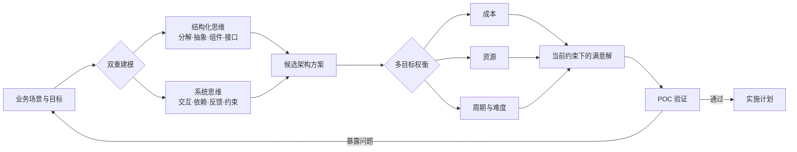
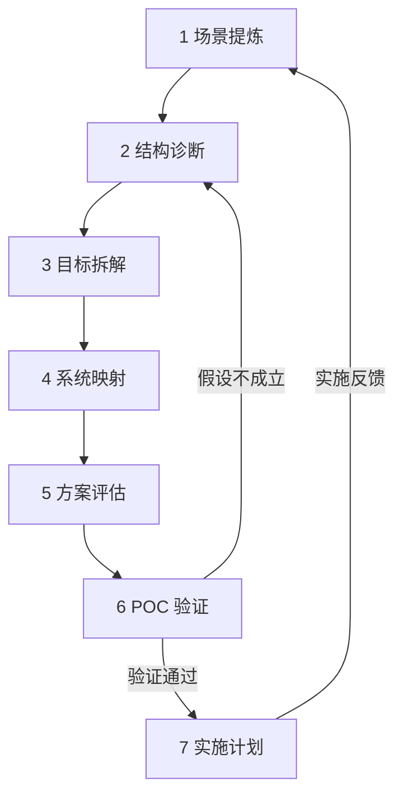

# 总结稿

[打开单页 HTML 总结](assets/bilibili-BV1UfhM6XESS-summary.html)

## 核心结论

软件架构不是“挑一个最先进的技术”，而是把**业务场景与目标**转译成可实施的技术结构，并在成本、资源、周期、难度与风险之间作出可解释的权衡。视频把这种能力概括为两种思维的配合：

- **结构化思维**处理静态结构：分解问题、抽象概念、划分组件、定义接口，再把局部重新组合成整体。[01:38–01:55]
- **系统思维**处理动态关系：观察组件间的交互、依赖与反馈，并在多个相互制约的目标之间寻找“满意解”，而非脱离约束追求单项最优。[02:03–02:43]

## 架构方案的闭环

视频给出的实践路径可以压缩为：

1. **定义场景与问题**：先说明现状、目标与真正需要解决的问题。[02:51–03:02]
2. **拆解并诊断**：从静态结构和动态流程两侧拆开问题，识别子目标及依赖。[03:02–03:19]
3. **提出多个假设方案**：避免直接把第一个想法当答案。[03:19–03:37]
4. **结构化评估**：结合成本、资源、难度等维度排序，而不是只比较技术参数。[03:30–03:40]
5. **用最小 POC 验证**：尽早暴露假设遗漏与落地阻碍，再决定是否扩大投入。[03:40–03:57]
6. **制定实施计划**：把验证后的方案转成可落地的步骤。[03:57–04:08]

`AS-IS → TO-BE` 是另一种表达：把当前问题与目标方案逐项映射，使每个设计选择都能回答“它具体解决了什么”。[06:39–07:03]

## 两个常见误区

### 1. 把熟悉新技术等同于具备架构能力

掌握新工具并不自动意味着能够完成复杂系统规划。架构还要求理解业务、拆解问题、设计高内聚/松耦合的组件与接口，并保证组件可以集成成可运行系统。[04:19–05:02]

### 2. 把技术新颖度当成方案质量

新技术可能引入新的运维、数据一致性与协作成本。视频用微服务和 MPP 数据库举例，但边界必须保留：**微服务并不必然要求传统分布式事务**；跨服务一致性是否成为问题，取决于服务边界、数据所有权与一致性目标。外部资料也把数据一致性列为微服务需要专门设计的问题，而非一条无条件因果律。[06:01–06:15] [Microsoft：微服务的数据设计考量](https://learn.microsoft.com/en-us/azure/architecture/microservices/design/data-considerations)

## 事实核查边界

- **4+1 视图：部分确认。** 原始模型确由逻辑、进程、开发、物理四个视图，加场景/用例这一“+1”构成，并采用场景驱动、迭代式过程；但视频在 [01:21] 口述的具体视图清单与原模型不完全一致，不能把两者直接画等号。[Kruchten 原始论文](https://www.cs.ubc.ca/~gregor/teaching/papers/4%2B1view-architecture.pdf)
- **微服务与分布式事务：部分确认。** 跨服务更新确实需要额外的一致性设计，但具体技术机制依赖系统约束，不能改写为“采用微服务就必然产生某种分布式事务”。
- **活动通知：未验证且可能过期。** 视频提到“9 月下旬深圳架构师技术沙龙”和腾讯云社区报名 [07:08–07:15]，但没有年份或可唯一定位的活动页。截至 2026-08-25 无法确认仍可报名，不应作为当前活动信息使用。

## 观众讨论与补充

本次热门顶层评论候选为 **0 条**，当前可访问弹幕为 **0 条**。这只说明本次抓取没有取得可分析文本，不代表“没有观众意见”，也不能据此推断受众态度、热点或共识。

## 一句话行动原则

先把“问题—目标—约束—方案—验证”连成闭环，再谈技术选型；能解释为什么适合当前系统，比证明某项技术“最先进”更重要。

# 辅助理解

## 辅助理解：把架构设计看成双循环

架构工作同时运行两个循环：**结构循环**回答“系统由什么组成”，**系统循环**回答“这些部分如何相互影响、在约束下怎样共同实现目标”。二者最后汇合到可验证的决策，而不是停留在图纸或技术名词上。[01:38–02:43]

### 为什么“满意解”比“最优技术”更实用

单项指标最优不等于系统最优。性能更强的组件可能提高成本和运维门槛；拆分更细的服务可能增加跨服务一致性与故障处理复杂度；成熟技术也可能更符合当前团队能力。这里的“满意解”不是降低标准，而是把不可同时最大化的目标显式化。[02:10–02:43][05:26–06:24]

## 七步法：每一步都要留下可检查的产物

| 步骤 | 核心问题 | 建议产物 |
|---|---|---|
| 1. 场景提炼 | 现状、问题和目标分别是什么？ | 问题陈述、成功条件 |
| 2. 结构诊断 | 静态组成与动态流程哪里受阻？ | 结构图、关键流程 |
| 3. 目标拆解 | 子目标之间有哪些依赖？ | 目标树、约束清单 |
| 4. 系统映射 | 哪个问题制约哪个目标？ | AS-IS/TO-BE 对照 |
| 5. 方案评估 | 多个方案在成本、风险、周期上如何取舍？ | 决策矩阵、优先级 |
| 6. POC 验证 | 哪个关键假设最可能让方案失败？ | 最小实验、验收指标 |
| 7. 实施计划 | 如何分阶段落地并反馈修正？ | 路线图、责任与回滚点 |

### 一个更可靠的 POC 问法

不要问“这个技术能不能跑起来”，而要问：“**如果最危险的前提是错的，最小代价怎样尽快发现？**”例如跨服务写入场景应验证失败恢复和一致性边界，而不只是演示一次成功调用。[03:40–03:57]

## 阅读 4+1 时的校准

视频用 4+1 说明场景驱动与多视图表达 [01:03–01:28]。原始模型的四个视图是逻辑、进程、开发、物理，“+1”是场景/用例；视频口述清单并不完全相同，因此应把画面与字幕理解为讲者的概括，而非标准定义。[Kruchten 原始论文](https://www.cs.ubc.ca/~gregor/teaching/papers/4%2B1view-architecture.pdf)

## AS-IS → TO-BE：防止方案与问题脱节

可用两列表强制建立映射：左侧列出现状问题及证据，右侧列目标状态和对应设计。若某项新技术无法对应任何已定义问题，它很可能只是“技术冲动”；若某个关键问题没有目标设计承接，方案仍不完整。[06:39–07:03]

## 证据与样本提醒

- 微服务中的数据一致性是需要设计的真实挑战，但并非每次采用微服务都会自动产生同一种分布式事务方案。[Microsoft：微服务的数据设计考量](https://learn.microsoft.com/en-us/azure/architecture/microservices/design/data-considerations)
- 活动通知 [07:08–07:15] 缺少年份和唯一页面，当前有效性未验证。
- 本次评论候选和可访问弹幕均为 0；样本不足，不能生成观众语义簇、情绪或热点结论。

## 外部事实核验

### 声明 1（01:03）

- 视频陈述：RUP 的 4+1 视图以场景/用例驱动，并围绕它组织多个架构视图。
- 核验状态：部分确认
- 核验结果：原始 4+1 论文确认：模型由逻辑、进程、开发、物理四个视图及场景（用例）这一“+1”构成，并采用架构中心、场景驱动、迭代式过程。视频的大意得到确认；但其口述的具体视图清单与原模型不完全一致。
- 检索日期：2026-08-25
- 来源：
  - [Architectural Blueprints—The 4+1 View Model of Software Architecture](https://www.cs.ubc.ca/~gregor/teaching/papers/4%2B1view-architecture.pdf)（primary）

### 声明 2（06:01）

- 视频陈述：引入微服务架构会带来更多分布式事务问题。
- 核验状态：部分确认
- 核验结果：方向上成立：跨服务业务操作需要额外的一致性协调模式。不过是否形成“分布式事务问题”取决于服务边界、数据所有权和一致性要求，不能理解为采用微服务后必然使用传统分布式事务。
- 检索日期：2026-08-25
- 来源：
  - [Data Considerations for Microservices](https://learn.microsoft.com/en-us/azure/architecture/microservices/design/data-considerations)（primary）

### 声明 3（07:09）

- 视频陈述：9 月下旬在深圳有架构师技术沙龙，可通过腾讯云社区报名。
- 核验状态：未验证
- 核验结果：视频未给出年份或可唯一定位的活动页面；截至核查日无法确认该报名仍有效。该信息应按视频发布时的活动通知处理，不用于当前报名决策。
- 检索日期：2026-08-25
- 来源：未找到可链接来源

# Data

## 增强转写稿

[00:00] Hello 大家好 我是人月聊IT
[00:03] 我們9月份架構師同盟在深圳的活動
[00:06] 核心的主題就是軟件架構設計和架構方案
[00:11] 我們會邀請各行各業的一些優秀的架構師
[00:15] 來分享他們的架構方案
[00:18] 包括就這些方案去做相關的一些研討和交流
[00:23] 所以我今天剛好就來講一下軟件架構方面的話題
[00:27] 我今天核心的講解的內容分三個部分
[00:30] 第一個什麼是軟件架構
[00:31] 第二個核心的架構思想究竟應該是什麼
[00:34] 第三個部分我們怎麼樣去做好一個完整的架構方案
[00:39] 首先講一下什麼是軟件架構
[00:42] 如果簡單一句話來總結的話
[00:45] 大家可以把軟件架構理解為
[00:48] 它本質是核心的業務需求加技術實現的一種
[00:54] 抽象化形式化的表達或者是建模
[00:58] 這個核心就是軟件架構
[01:00] 最早的時候我們會去看
[01:03] Rational UML去做架構設計
[01:06] 包括RUP 的 4+1 视图
[01:09] 裡面就提到了以用例驱动、架构为核心、增量迭代
[01:15] 包括在4+1 视图裡面它核心谈的
[01:18] 中間核心的一定是场景和用例驱动
[01:21] 然後圍繞這個去做你相關的逻辑视图、物理视图、进程视图、部署视图的設計
[01:27] 形成一個完整的架构视图
[01:30] 這個是核心的軟件架構的簡單的說明
[01:34] 那第二個核心的架構思想就應該什麼了
[01:37] 簡單的理解
[01:38] 核心的架構思想它本質就是结构化思维加系統思維的這麼一種融合
[01:46] 我們去做任何的架構規劃設計一定會涉及到
[01:49] 分解集成組合組裝抽象泛化
[01:55] 結合分成核心的這些東西這些東西它的本質其實就是結構化思維
[02:03] 第二個就是我們在去形成一個架構方案滿足業務目標的時候
[02:08] 我可能會去考慮到
[02:10] 架構本身的實現的難易度資源成本的投入實施的週期多個
[02:16] 維度目標的影響
[02:18] 我會去考慮多因素权衡下的多目標的之間的一種平衡
[02:23] 那這個典型的就是一個系統思維
[02:26] 所以說你要做好架構
[02:28] 架構系統思維和結構化思維兩者缺一不可
[02:33] 大部分的架構設計它都不是追求單個目標的追求解
[02:36] 而是去追求多因素影響下的動態的一個平衡或者是叫一個滿意解
[02:43] 這個是我想專門再強調的一個點
[02:45] 第三個點我們怎麼樣去做好一個優秀的架構設計或者是架構方案
[02:51] 大家要理解架構設計的過程它本质就是一個從場景和問題出發
[02:57] 你如何去做好問題定義問題分析問題解決的過程
[03:02] 其實它和諮詢裡面我們講的諮詢解決分析解決問題的方法論完全一致的
[03:09] 那是我們經常談到的麦肯锡的问题解决七步法
[03:13] 但是在整個的架構方案裡面往往在某一些地方會有所優化或者是增加
[03:19] 就是當我做完了問題的定義和分析以後我往往會去提出假設
[03:25] 這個假設可能就是你潛在的解決方案這個解決方案可能有多個
[03:30] 多個解決方案提出以後我往往會從成本資源難易度多個方面去權衡
[03:37] 我的每一個解決方案
[03:40] 我通過結構化決策去排了優先級以後然後才會到了假設的驗證
[03:47] 也就是說我會做一个最小的 POC的驗證去實現閉環來看一下我這個假設
[03:53] 我當前的一個選擇是不是一種最優的一個選擇
[03:57] 做完POC驗證我心裡有底了以後我最後再來制定詳細的實施計畫
[04:04] 這個就是一個完整的從需求場景出發
[04:08] 你怎麼樣去做分析怎麼樣去做架构设计並最終指導你落地的一個完整的過程
[04:15] 所以在上個月我跟一個朋友聊的時候其實我聊的比較多的一個事情就是什麼
[04:19] 就是當前有很多技術水平很高的人員
[04:23] 談到更多的都是一些新的一些技術的一些實踐落地
[04:28] 但是並不代表他們具備完整的做複雜系統架構規劃設計的這麼一種能力
[04:34] 你要做一個複雜系統的架構規劃設計它是相當困難的一個事情
[04:39] 你面除了你對業務需求的深刻理解以外你還要能夠知道
[04:45] 怎麼樣去做好問題的拆解
[04:48] 怎麼樣去定義好一個一個高内聚、松耦合的組件規劃好相應的組件之間的接口
[04:54] 最終又確保這些組件能夠通過接口集成和組裝形成一個完整的可運行的系統
[05:02] 這個事情它是相當困難的一個事情大家一定要意識的
[05:07] 最後就再講一下就是我們再去做架構設計裡面
[05:11] 會經常會出現哪一些問題點
[05:14] 第一個點就是很多技術人員做架構設計喜歡盲目的追求新技術
[05:21] 這個我其實在以前的視頻已經多次批評了這種事情
[05:26] 架構最終的方案往往是一種當前最適合的方案而不是說當前最優的一個技術
[05:34] 最適合的方案就是我剛才講的你需要去系統思維多目標权衡下的一个满意解
[05:41] 你往往去追求新技術上線的這麼一個產品
[05:46] 第一個投入的成本周期长第二個新技術沒有經過足夠的時間考驗不穩定
[05:52] 這些都是一些潛在的風險而且往往引入某一些新技術它又會帶來一些新的問題你要去解決
[06:01] 類似於你引入微服务架构的一些新技術那你一定存在引入更多的分布式事務的問題
[06:08] 你引入MPP數據庫這種新技術整個查詢統計的效率確實加快了
[06:15] 但是可能又會存在數據的同步數據的不一致的問題
[06:20] 所以說並不是說任何時候引入新技術它都是好的
[06:24] 更多的我們要去找一個适合的满意解這個是我們在去做架構規劃的時候一定要注意的
[06:31] 第二個就是任何一個架構方案的最終的規劃設計我們可以參考諮詢規劃的很核心的一個思路
[06:39] 我把它叫做从 AS-IS 到 TO-BE
[06:43] AS-IS就是你當前的現狀究竟是什麼樣的現狀下面究竟有什麼問題
[06:48] TO-BE就是我的目標的解決方案又是怎麼樣的
[06:51] 兩個形成一個一一的映射和對照
[06:54] 讓大家能夠很容易的理解你TO-BE的解決方案真正的解決了當前現狀下該有的一些問題
[07:02] 這個也是我們去做相關的问题分析、诊断常用的一個核心的一個思路
[07:08] 好了 如果大家關注9月下旬我們同盟的架構師技術沙龍活動的大家也可以留意一下
[07:15] 騰訊雲社區相關的一些報名的一些鏈接也歡迎各位架構師朋友積極參與積極討論
[07:23] 今天簡單分享就到這裡再見

## 原始转写稿

[00:00] Hello 大家好 我是任月亮 IT
[00:03] 我們9月份架構師同盟在深圳的活動
[00:06] 核心的主題就是軟件架構設計和架構方案
[00:11] 我們會邀請各行各業的一些優秀的架構師
[00:15] 來分享他們的架構方案
[00:18] 包括就這些方案去做相關的一些研討和交流
[00:23] 所以我今天剛好就來講一下軟件架構方面的話題
[00:27] 我今天核心的講解的內容分三個部分
[00:30] 第一個什麼是軟件架構
[00:31] 第二個核心的架構思想究竟應該是什麼
[00:34] 第三個部分我們怎麼樣去做好一個完整的架構方案
[00:39] 首先講一下什麼是軟件架構
[00:42] 如果簡單一句話來總結的話
[00:45] 大家可以把軟件架構理解為
[00:48] 它本質是核心的業務需求加技術實現的一種
[00:54] 抽象化形式化的表達或者是建模
[00:58] 這個核心就是軟件架構
[01:00] 最早的時候我們會去看
[01:03] Rational UML去做架構設計
[01:06] 包括RUP的4+1試圖
[01:09] 裡面就提到了以用力驅動架構為核心增量疊淡
[01:15] 包括在4+1試圖裡面它核心彈的
[01:18] 中間核心的一定是場景和用力驅動
[01:21] 然後圍繞這個去做你相關的邏輯試圖物理試圖進程試圖部署試圖的設計
[01:27] 形成一個完整的架構試圖
[01:30] 這個是核心的軟件架構的簡單的說明
[01:34] 那第二個核心的架構思想就應該什麼了
[01:37] 簡單的理解
[01:38] 核心的架構思想它本質就是結構化式為加系統思維的這麼一種融合
[01:46] 我們去做任何的架構規劃設計一定會涉及到
[01:49] 分解集成組合組裝抽象泛化
[01:55] 結合分成核心的這些東西這些東西它的本質其實就是結構化思維
[02:03] 第二個就是我們在去形成一個架構方案滿足業務目標的時候
[02:08] 我可能會去考慮到
[02:10] 架構本身的實現的難易度資源成本的投入實施的週期多個
[02:16] 維度目標的影響
[02:18] 我會去考慮多因素全橫下的多目標的之間的一種平衡
[02:23] 那這個典型的就是一個系統思維
[02:26] 所以說你要做好架構
[02:28] 架構系統思維和結構化思維兩者缺一不可
[02:33] 大部分的架構設計它都不是追求單個目標的追求解
[02:36] 而是去追求多因素影響下的動態的一個平衡或者是叫一個滿意解
[02:43] 這個是我想專門再強調的一個點
[02:45] 第三個點我們怎麼樣去做好一個優秀的架構設計或者是架構方案
[02:51] 大家要理解架構設計的過程它本质就是一個從場景和問題出發
[02:57] 你如何去做好問題定義問題分析問題解決的過程
[03:02] 其實它和諮詢裡面我們講的諮詢解決分析解決問題的方法論完全一致的
[03:09] 那是我們經常談到的麥肯西的問題解決期步法
[03:13] 但是在整個的架構方案裡面往往在某一些地方會有所優化或者是增加
[03:19] 就是當我做完了問題的定義和分析以後我往往會去提出假設
[03:25] 這個假設可能就是你潛在的解決方案這個解決方案可能有多個
[03:30] 多個解決方案提出以後我往往會從成本資源難易度多個方面去權衡
[03:37] 我的每一個解決方案
[03:40] 我通過結構化決策去排了優先級以後然後才會到了假設的驗證
[03:47] 也就是說我會做壺一個最小的POC的驗證去實現閉環來看一下我這個假設
[03:53] 我當前的一個選擇是不是一種最優的一個選擇
[03:57] 做完POC驗證我心裡有底了以後我最後再來制定詳細的實施計畫
[04:04] 這個就是一個完整的從需求場景出發
[04:08] 你怎麼樣去做分析怎麼樣去做價格設計並最終指導你落地的一個完整的過程
[04:15] 所以在上個月我跟一個朋友聊的時候其實我聊的比較多的一個事情就是什麼
[04:19] 就是當前有很多技術水平很高的人員
[04:23] 談到更多的都是一些新的一些技術的一些實踐落地
[04:28] 但是並不代表他們具備完整的做複雜系統架構規劃設計的這麼一種能力
[04:34] 你要做一個複雜系統的架構規劃設計它是相當困難的一個事情
[04:39] 你面除了你對業務需求的深刻理解以外你還要能夠知道
[04:45] 怎麼樣去做好問題的拆解
[04:48] 怎麼樣去定義好一個一個高內聚松偶核的組件規劃好相應的組件之間的接口
[04:54] 最終又確保這些組件能夠通過接口集成和組裝形成一個完整的可運行的系統
[05:02] 這個事情它是相當困難的一個事情大家一定要意識的
[05:07] 最後就再講一下就是我們再去做架構設計裡面
[05:11] 會經常會出現哪一些問題點
[05:14] 第一個點就是很多技術人員做架構設計喜歡盲目的追求新技術
[05:21] 這個我其實在以前的視頻已經多次批評了這種事情
[05:26] 架構最終的方案往往是一種當前最適合的方案而不是說當前最優的一個技術
[05:34] 最適合的方案就是我剛才講的你需要去系統思維多目標全衡下的一個買意見
[05:41] 你往往去追求新技術上線的這麼一個產品
[05:46] 第一個投入的成本週期廠第二個新技術沒有經過足夠的時間考驗不穩定
[05:52] 這些都是一些潛在的風險而且往往引入某一些新技術它又會帶來一些新的問題你要去解決
[06:01] 類似於你引入微幅價格的一些新技術那你一定存在引入更多的分布式事務的問題
[06:08] 你引入MPP數據庫這種新技術整個查詢統計的效率確實加快了
[06:15] 但是可能又會存在數據的同步數據的不一致的問題
[06:20] 所以說並不是說任何時候引入新技術它都是好的
[06:24] 更多的我們要去找一個適合的買意見這個是我們在去做架構規劃的時候一定要注意的
[06:31] 第二個就是任何一個架構方案的最終的規劃設計我們可以參考諮詢規劃的很核心的一個思路
[06:39] 我把它叫做從S一直到2B
[06:43] S一直就是你當前的現狀究竟是什麼樣的現狀下面究竟有什麼問題
[06:48] 2B就是我的目標的解決方案又是怎麼樣的
[06:51] 兩個形成一個一一的印射和對照
[06:54] 讓大家能夠很容易的理解你2B的解決方案真正的解決了當前現狀下該有的一些問題
[07:02] 這個也是我們去做相關的問題分析整段常用的一個核心的一個思路
[07:08] 好了 如果大家關注9月下旬我們同盟的架構師技術沙龍活動的大家也可以留意一下
[07:15] 騰訊雲社區相關的一些報名的一些鏈接也歡迎各位架構師朋友積極參與積極討論
[07:23] 今天簡單分享就到這裡再見

## 原始关键帧

### 关键帧 1

### 关键帧 2

### 关键帧 3

### 关键帧 4

### 关键帧 5

### 关键帧 6

### 关键帧 7

### 关键帧 8

### 关键帧 9

### 关键帧 10

## 补充原始数据

- [bilibili-BV1UfhM6XESS-comments.jsonl](assets/bilibili-BV1UfhM6XESS-comments.jsonl)
- [bilibili-BV1UfhM6XESS-comment-candidates.json](assets/bilibili-BV1UfhM6XESS-comment-candidates.json)
- [bilibili-BV1UfhM6XESS-danmaku.jsonl](assets/bilibili-BV1UfhM6XESS-danmaku.jsonl)
- [bilibili-BV1UfhM6XESS-danmaku-analysis.json](assets/bilibili-BV1UfhM6XESS-danmaku-analysis.json)
- [bilibili-BV1UfhM6XESS-visual-summary.png](assets/bilibili-BV1UfhM6XESS-visual-summary.png)
- [bilibili-BV1UfhM6XESS-summary.html](assets/bilibili-BV1UfhM6XESS-summary.html)
