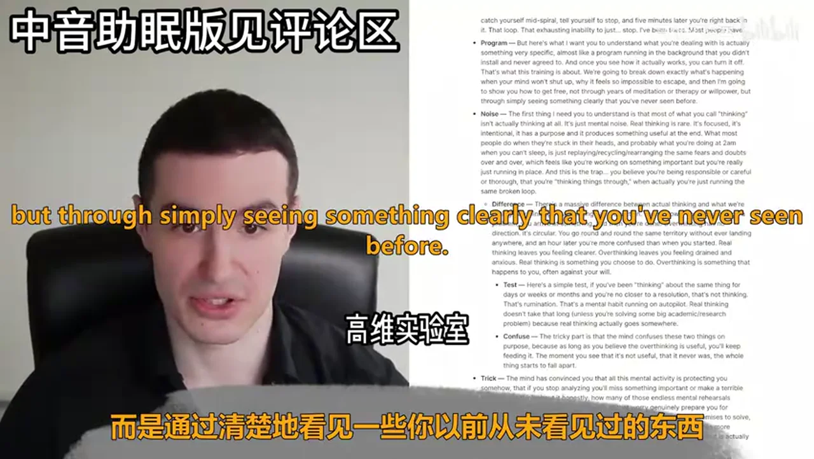
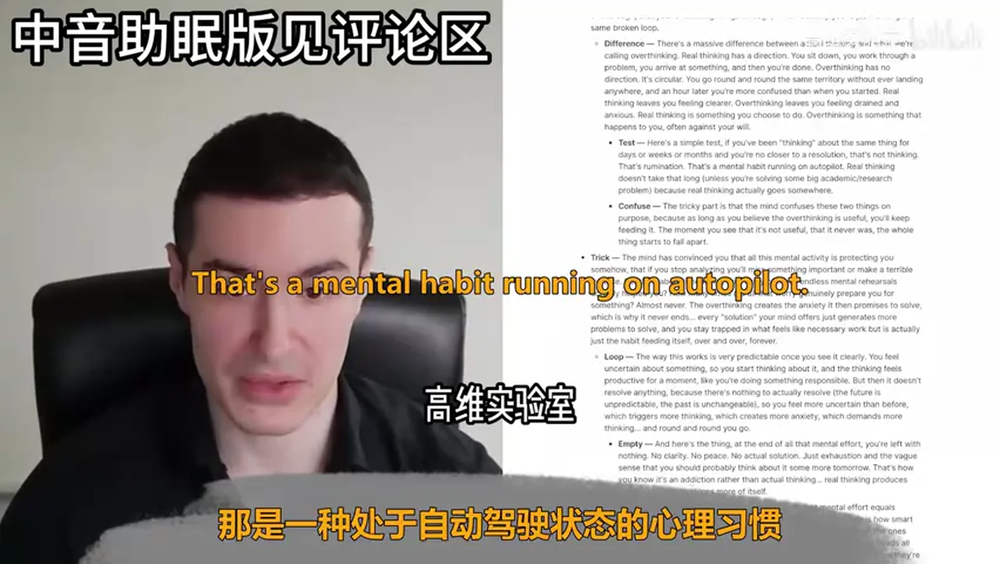
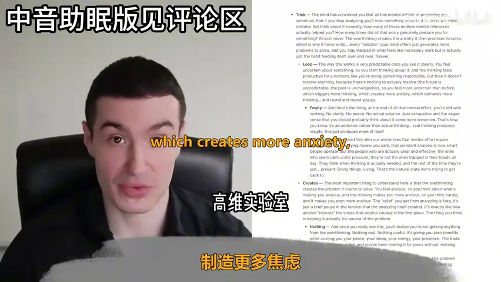
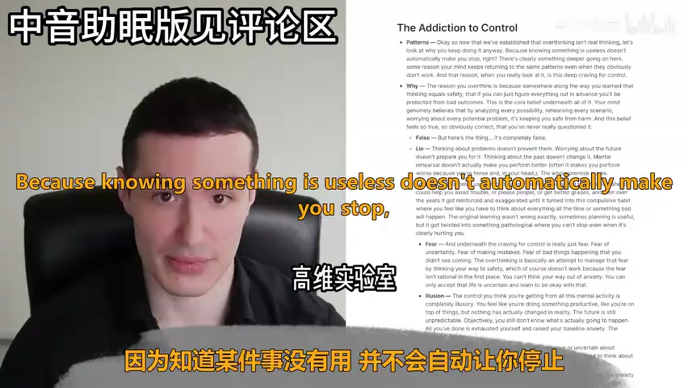
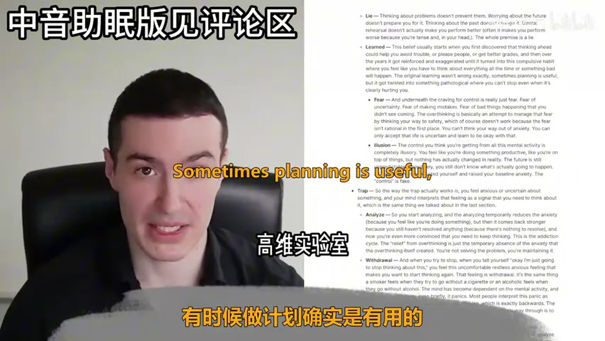
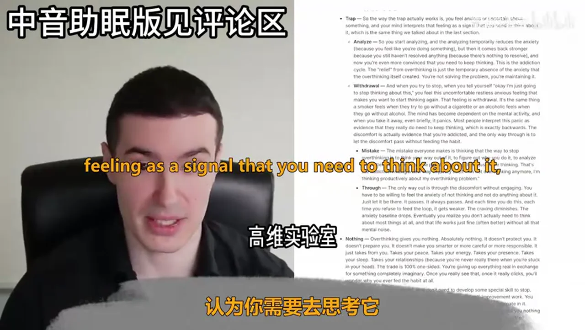
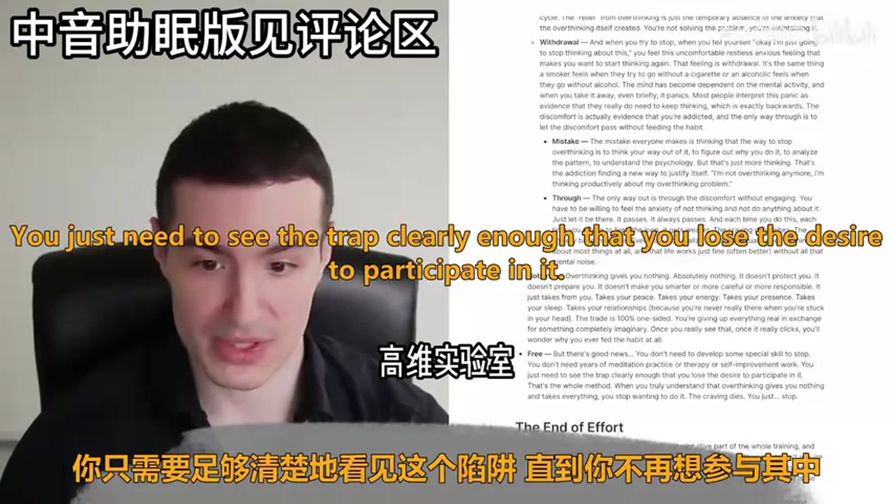
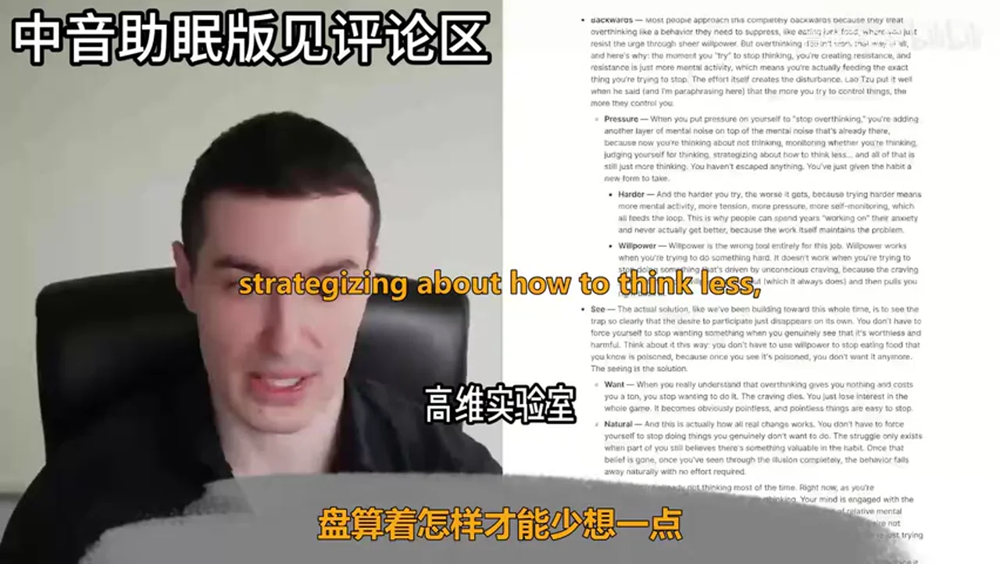
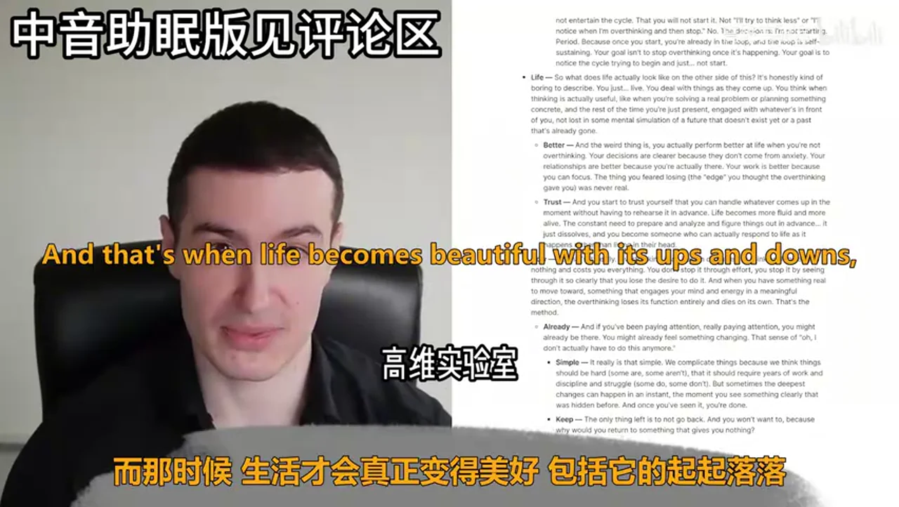

# 总结稿

暂无总结。

# 辅助理解

# Data

## 原始转写稿

[00:00] Alright hello and welcome to this training as you can see from the title what we're going to be covering is how to stop overthinking and as you can see from the overview what we're going to be talking about more specifically is first the overview itself the illusion of thinking the addiction to control the end of effort the power of purpose the natural end of overthinking the review and your action items for the day or the next few days.
[00:24] Let's get started and talk about the illusion of thinking.
[00:28] Alright so if you're watching you watching or listening to this, then you probably already know what it feels like to be stuck in your own head.
[00:35] It could be you're lying in bed at night replaying a conversation from three days ago or from three years ago for that matter, or you're sitting at your desk supposedly working but your mind is really running through every possible way.
[00:48] Some future thing could go wrong, you catch yourself mid-spiral tell yourself to stop and five minutes later you're right back in it that loop that exhausting inability to just stop.
[01:00] I've been there most people have, but the thing I want you to understand is that what you're dealing with is actually something very specific, almost like a program that is really running in the background that you didn't install and never agreed to and once you see how it actually works, you can turn it off.
[01:17] That's what this training is all about.We're going to break down exactly what's happening when your mind won't shut up.
[01:24] Why it feels so impossible to escape and then I'm going to show you how to actually get free, not through years of meditation or therapy or willpower, but through simply seeing something clearly that you've never seen before.
[01:35] Now, the first thing I need you to understand is that most of what you call thinking isn't actually thinking at all.It's just mental noise.Real thinking is actually very rare.It's focused.It's intentional.It has a purpose and it produces something useful at the end.
[01:49] What most people do when they're stuck in their hands and probably what you're doing at 2am when you can sleep is just replaying, recycling or rearranging the same fears and doubts over and over again, which feels like you're working on something important, but you're really just running in place, right?
[02:05] And this is the trap.You believe you're being responsible or careful or thorough that you're thinking things through when actually you're just running the same broken loop.
[02:15] Now, there's a massive difference between actual thinking and what we're calling overthinking, right? Real thinking has a direction.You sit down, you work through a problem, you arrive at something and then you're done.
[02:27] Overthinking has no direction.It's circular.You go round and round the same territory without ever landing anywhere.And an hour later you're more confused than when you actually started.Real thinking leaves you feeling clearer.Overthinking leaves you feeling drained and anxious.Real thinking is something you choose to do.
[02:49] Overthinking is something that actually happens to you, right? Often against your will.And here's a simple test.If you've been thinking about the same thing for days or weeks or months and you're no closer to a resolution, that's not thinking, right?
[03:06] That's rumination.That's a mental habit running on autopilot.Real thinking doesn't take that long unless you're solving some big academic research problem, right?Because real thinking actually goes somewhere.
[03:20] The tricky part is that the mind confuses these two things on purpose because as long as you believe that overthinking is useful, you'll keep feeding it.The moment you see that it's not useful, that it never was, the whole thing starts to fall apart.
[03:34] Now, the mind has convinced you that all this mental activity is actually protecting you somehow.That if you stop analyzing, you'll miss something important or make a terrible mistake.
[03:44] But think about it honestly, right?How many of those endless mental rehearsals actually helped you?How many times did all that worry genuinely prepare you for something?
[03:55] Almost never.The overthinking creates the anxiety it then promises to solve,which is why it never ends.Every solution your mind offers just generates more problems to solve.
[04:08] And you stay trapped in what feels like necessary work,but it's actually just the habit feeding itself over and over and over again forever, right?
[04:17] The way this works is very predictable once you see it clearly.You feel uncertain about something so you start thinking about it and then the thinking feels productive for a moment like you're actually doing something responsible,
[04:29] but then it doesn't resolve anything because there's nothing to actually resolve because the future is unpredictable and the past is unchangeable.
[04:37] So you feel more uncertain than you were before,which triggers more thinking,which creates more anxiety,which demands more thinking and round and round you go,right?
[04:48] And the thing is,at the end of all this mental effort,you're actually left with nothing.No clarity,no peace,no actual solution.
[04:56] Just exhaustion and the vague sense that you should probably think about it some more tomorrow,right?
[05:02] That's how you know it's an addiction rather than actual thinking.Real thinking produces results.This just produces more of itself.
[05:10] We've been sold this idea our whole lives that mental effort equals intelligence,that worrying means you care,that constant analysis is how smart people operate.
[05:21] That's not the case,right?The people who are actually clear and effective,the ones who seem calm under pressure,they're not the ones trapped in their heads all the time.
[05:31] They think when thinking is actually needed,and the rest of the time they're just present,they're just there doing things,living,solving problems when they need to.
[05:43] That's the natural state we're trying to get back to.And the most important thing to understand here is that the overthinking creates the problem it claims to solve.
[05:52] You feel anxious so you think about what's making you anxious,and the thinking makes you more anxious so you think harder and it makes you even more anxious.
[06:01] The relief you get from analyzing is fake.It's just a brief pause in the tension that the analyzing itself actually created.
[06:09] It's exactly how an alcohol,how alcohol relieves the stress that alcohol caused in the first place.
[06:17] The thing you think is helping is actually the source of the problem,right?
[06:22] And once you really see this,you'll realize you're not getting anything from the overthinking,nothing real,nothing useful.
[06:28] It's giving you zero benefits while costing you your peace,your sleep,your energy,your presence,right?
[06:35] The trade is completely one-sided and you've been making it for years without realizing how bad the deal actually is.
[06:42] See,the problem was never that you think too much.The problem was that you mistook overthinking for real thinking.
[06:49] And so you kept feeding something that was never actually serving you.
[06:53] And this should come as a huge relief because if overthinking were actually thinking,you'd be in real trouble,right?
[07:00] You'd need to somehow stop your own intelligence from working,which would be impossible.
[07:05] But that's not what's happening here,right?
[07:07] You're just caught in a mental habit that has nothing to do with your actual capacity to reason or solve problems or make decisions.
[07:15] The real you,the one who can actually think clearly and act decisively when it's actually needed,is still there underneath all that noise.
[07:23] You don't need to become someone different or develop some new skill.
[07:27] We just need to stop feeding the habit so the real version of you that can actually solve problems and think when it's needed can come back.
[07:35] So let's talk about the addiction to control.
[07:39] So now that we've established that overthinking isn't real thinking,let's look at why you keep doing it anyway.
[07:46] Because knowing something is useless doesn't automatically make you stop,right?
[07:51] There's clearly something deeper going on here.
[07:53] Some reason your mind keeps returning to the same patterns even when they obviously don't work.
[07:58] And that reason when you really look at it is this deep craving for control.
[08:03] The reason you overthink is because somewhere along the way you learn that thinking equals safety.
[08:09] That if you can just figure out everything in advance,you'll be protected from bad outcomes.
[08:14] This is the core belief underneath all of it,right?
[08:17] Your mind genuinely believes that by analyzing every possibility,rehearsing every scenario,worrying about every potential problem,it's keeping you safe from harm.
[08:27] And this belief feels so true,so obviously correct that you've never really questioned it.
[08:33] But here's the thing,it is completely false.
[08:36] Thinking about problems doesn't actually prevent them,right?
[08:39] Think about it,worrying about the future doesn't really prepare you for it.
[08:44] Thinking about the past doesn't really change it.
[08:47] Mental rehearsal doesn't actually make you perform better.
[08:51] Often it makes you perform worse because you're tense and in your head.The whole premise is a lie.
[08:59] So this belief usually starts when you first discovered that thinking ahead could actually help you avoid trouble or please people or get better grades.
[09:07] And then over the years it got reinforced and exaggerated until it turned into this compulsive habit where you feel like you have to think about everything all the time or something bad will happen.
[09:18] The original learning wasn't wrong exactly,right?
[09:22] Something sometimes planning is useful,but it got twisted into something pathological where you can't even stop when it's clearly hurting you.
[09:32] And underneath the craving for control is really just fear,fear of uncertainty,fear of making mistakes,fear of bad things happening that you didn't see coming.
[09:43] And fear that if you didn't see them coming then you're maybe not as perfect as you thought you were,right?
[09:51] The overthinking is basically an attempt to manage that fear by thinking your way to safety,which of course doesn't work because the fear isn't rational in the first place.
[10:02] You can't think your way out of anxiety.You can only accept that life is uncertain and learn to be okay with that.
[10:09] And learn to be okay with the fact that you won't be able to see everything ahead of time.
[10:14] And that that doesn't mean that,I mean it does mean that you're imperfect,right?And that's okay.
[10:21] The control you think you're getting from all this mental activity is completely illusory.
[10:26] You feel like you're doing something productive like you're on top of things,but nothing has actually changed in reality.
[10:33] The future is still unpredictable and it's still going to happen.Objectively you still don't know what's actually going to happen.
[10:40] All you've done is exhausted yourself and raised your baseline anxiety.The control is fake.
[10:46] There is no control there.So the way the trap actually works is you feel anxious or uncertain about something
[10:54] and then your mind interprets that feeling as a signal that you need to think about it,which is the same thing we talked about in the last section,right?
[11:02] So you start analyzing,and the analyzing temporarily reduces the anxiety because you feel like you're doing something.
[11:09] But then it comes back stronger because you still haven't resolved anything because there's nothing to resolve.
[11:14] And now you're even more convinced that you need to keep thinking.
[11:18] And this is the addiction cycle.The relief from overthinking is just the temporary absence of the anxiety that the overthinking itself created.
[11:28] You're not solving the problem,you're maintaining it.And when you try to stop when you tell yourself,
[11:34] Okay,I'm just going to stop thinking about this.You feel this uncomfortable,restless anxious feeling that makes you want to start thinking again.
[11:42] That feeling is withdrawal,right?It's the same thing a smoker feels when they try to go without a cigarette or an alcoholic feels
[11:50] when they go without alcohol or any drug added when they go without their drug of choice.
[11:57] The mind has become dependent on the mental activity,and when you take it away,even briefly,it panics.
[12:04] And most people interpret this panic as evidence that they really do need to keep thinking,which is exactly backwards.
[12:12] The discomfort is actually evidence that you are addicted,and the only way through is to let the discomfort pass without feeding the habit.
[12:22] Now,the mistake everyone makes is thinking that the way to stop overthinking is to think your way out of it.
[12:28] To figure out why you do it,to analyze the pattern,to understand the psychology.
[12:33] But that's just more thinking,right?That's the addiction finding a way to a new way to basically justify itself.
[12:41] I'm not overthinking anymore.I'm just thinking productively about my overthinking problem.
[12:46] Do you see how that sounds?The only way out is really through the discomfort without engaging.
[12:53] You have to be willing to feel the anxiety of not thinking and not do anything about it.
[12:58] That's all.Just let it be there.It passes.It always passes.
[13:02] And each time you do this,each time you refuse to feed the loop,it gets weaker.
[13:07] And the craving diminishes.The anxiety baseline drops.
[13:11] Eventually,you realize that you don't actually need to think about most things at all.
[13:16] And that life just works itself fine.
[13:19] Often better without all that mental noise,right?
[13:22] So overthinking gives you nothing,absolutely nothing,and it doesn't protect you.
[13:26] It doesn't prepare you.It doesn't make you smarter or more careful or more responsible.
[13:31] It just takes from you.It takes your peace.It takes your energy.It takes your presence.
[13:35] It takes your sleep.And it takes your relationships because you're never really there when you're stuck in your head.
[13:41] The trade is 100% one-sided.You're giving up everything real in exchange for something completely imaginary.
[13:50] And once you really see that,once it really clicks,you'll wonder why you ever fed the habit at all.
[13:56] But there's good news.You don't need to develop some special skill to stop.
[14:00] You don't need years of meditation practice or therapy or self-improvement work.
[14:05] You just need to see the trap clearly enough that you lose the desire to participate in it.
[14:10] That's the whole method.When you truly understand that overthinking gives you nothing and takes everything,
[14:15] you stop wanting to do it.The craving dies.You just stop,right?
[14:20] So let's talk about the end of Everett.
[14:22] So this is maybe the most counterintuitive part of the whole training.
[14:27] And it's also probably the most important,which is that stopping overthinking doesn't require effort.
[14:34] Like at all.In fact,effort is the problem.
[14:37] The whole "I'm going to try really hard to stop thinking" approach is doomed from the start.
[14:42] And I want to explain why that is so that you don't waste time doing it wrong.
[14:47] Now most people approach this completely backwards because they treat overthinking like a behavior they need to suppress.
[14:53] Like it's eating junk food,where you just resist the urge through sheer willpower.
[14:58] But overthinking doesn't work that way at all.
[15:01] And here's why.The moment you try to stop thinking,you're creating resistance,right?
[15:06] And resistance is just more mental activity,which means you're actually feeding the exact thing you're trying to stop.
[15:13] The effort itself creates the disturbance.
[15:16] Lautzer put it really well when he said,and I'm paraphrasing here,
[15:20] that the more you try to control things,the more they control you,right?
[15:24] And the same goes for this,when you put pressure on yourself to stop overthinking,
[15:28] you're adding another layer of mental noise on top of the mental noise that's already there.
[15:33] Because now you're thinking about not thinking,monitoring whether you're thinking,judging yourself for thinking,
[15:38] strategizing about how to think less.And all of that is just still more thinking,right?
[15:43] You haven't escaped anything.You've just given the habit a new form to take.
[15:48] And the harder you try,the worse it gets.Because trying harder means more mental activity,
[15:53] more attention,more pressure,more self-monitoring,which all feeds the loop.
[15:57] This is why people can spend years working on their anxiety problem
[16:01] and never actually get better because the work itself maintains the problem,right?
[16:07] willpower is the wrong tool entirely for this job.
[16:10] Willpower works when you're trying to do something hard for the first time.
[16:15] It doesn't work when you're trying to stop doing something that's driven by unconscious craving.
[16:20] Because the craving just waits for your willpower to run out,right?
[16:24] Which it always does,especially at the end of our day,right?
[16:28] And then it pulls you right back in.
[16:30] Now the actual solution,like we've been building towards this whole time
[16:34] is to see the trap so clearly that the desire to participate just disappears on its own.
[16:39] You don't have to force yourself to stop wanting something when you genuinely see it for what it is.
[16:45] And when you see that it's worthless and harmful.
[16:48] Think about it this way,you don't have to use willpower to stop eating food that you know is poisoned,right?
[16:54] Because once you see it's poisoned,you don't want it anymore.
[16:57] The seeing is the solution.
[17:00] So when you really understand that overthinking gives you nothing and costs you a ton,
[17:05] you stop wanting to do it.The craving dies,you just lose interest in the whole game.
[17:09] It becomes obviously pointless and pointless things are easy to stop.
[17:13] And this is actually how all real change works.
[17:16] You don't have to force yourself to stop doing things you genuinely don't want to do.
[17:21] The struggle only exists when a part of you still believes there's something valuable in the habit.
[17:26] Once that belief is gone,once you've seen through the illusion,because it is an illusion
[17:31] and once you've seen through that completely,the behavior falls away naturally with no effort required.
[17:37] So you're already not thinking most of the time.
[17:40] Right now,as you're watching or listening to this,or if you're reading it,you're not really overthinking,right?
[17:47] Your mind is engaged with the content following along and it's present.
[17:51] The natural state is already one of relative mental quiet,right?
[17:56] The overthinking is an interruption of that state,not the default,right?
[18:00] So we're not trying to create something new or achieve some advanced mental state.
[18:05] We're just actually trying to stop interrupting the peace that's already there underneath the noise.
[18:10] We're just going back to where we naturally are.
[18:14] And when you stop feeding the overthinking habit,you don't have to replace it with something or build a new skill or develop a practice.
[18:22] You just return to what was already there before the habit took over.
[18:26] Peace isn't something you build,right?It's what remains when you stop creating anxiety when there's no chaos.
[18:32] That's peace,right?So the instruction here isn't try harder to stop thinking.
[18:37] The instruction is more like allow yourself to stop,right?
[18:41] Give yourself permission to not engage with it.
[18:44] Stop treating every worry thought like it deserves your attention because it doesn't.It's just thoughts,right?
[18:51] They're just,there's a thousands of thousands of them a day.You can't pay attention to each one of them.
[18:59] And trust that you'll be fine,that you don't need all that mental activity to function or to stay safe or to make good decisions.
[19:06] You've been sold the idea that you need to think consistently and constantly,but you don't.
[19:12] Most of life works perfectly fine,right?
[19:15] It's often better without you really trying to figure it all out in advance.
[19:21] So with that said,let's talk about the power of purpose.
[19:24] So the single most effective thing you can actually do to end overthinking is to have something real to do,right?
[19:31] Like an actual purpose,a goal,something you're actively moving towards that demands your attention and energy.
[19:37] And a written goal,even better,not a goal in your head that you overthink about.
[19:43] Because overthinking doesn't just happen in a vacuum.It happens when your mind has nothing better to do,which is why you'll notice it's always worse when you're idle or bored or directionless.
[19:54] Nature abhors a vacuum,right?
[19:57] Overthinking thrives in a vacuum on purpose,of purpose.
[20:02] Your mind is constantly looking for something to do,something to work on,something to process.
[20:07] And if you don't give it something meaningful and real to engage with,it will just manufacture problems to solve,which is what overthinking is.
[20:15] The anxious overthinking fills the space that purpose should be filling.
[20:20] So in a weird way,the question isn't really how do I stop overthinking,it's what should I be doing instead.
[20:27] And once you have a clear answer to that second question,the first one tends to solve itself.
[20:33] So stagnant mental energy with nowhere productive to go turns into overthinking.
[20:38] But when you have a clear purpose,something you're actively building or working towards or trying to achieve,that energy gets channeled naturally into real productive thought and action.
[20:48] And there's simply less left over to waste on circular thinking,there's less energy literally.
[20:53] And this is why busy people with clear goals that are written down tend to overthink less,not because they're better at managing their minds.
[21:00] But because their minds are genuinely occupied with real tasks,other things to worry about,right?
[21:06] They don't have the spare capacity for endless rumination.
[21:10] The work absorbs the energy that would otherwise turn into anxiety.
[21:14] And this is also why overthinking gets worse when you have too much free time or when you're between projects or when you're unclear about what you're doing with your life.
[21:24] Or when you're in between jobs,the mind abhors a vacuum,give it nothing real to work on and it will invent problems to chew on.
[21:32] So having a clear direction in life,something you're actually moving towards,gives your mind a natural organizing principle that makes the overthinking kind of irrelevant.
[21:41] When you know what you're trying to do,when you have actual goals you're working towards,most of the things you used to worry about just stop mattering because you can evaluate everything in terms of does this help me get where I'm going or not.
[21:53] And if it doesn't help,you don't need to think about it.That purpose creates a filter for life,right?
[22:00] And when you know what you want and you're actively pursuing it,the endless what should I do with my life and am I making the right choices type of overthinking just disappears.
[22:10] Because you've already answered the question,you're already doing the thing.
[22:14] And Richard Frankel,who wrote man's search for meaning,observed that people with a strong sense of purpose tend to suffer less psychologically,even in objectively terrible circumstances because the meaning gives them something to orient towards that transcends their immediate discomfort.
[22:29] The same principle applies here,right?So if you're watching this and you're not clear on what you're actually trying to do with your life,or with this year,or even with this week,that might be a more important problem to solve than the overthinking itself.
[22:43] Because when you figure out what you want and start moving towards it,the overthinking often takes care of itself,your mind has real work to do.It doesn't need to manufacture fake work anymore.
[22:54] The rumination loses its function.And this doesn't have to be some big life purpose either,right?That can change over time anyway.
[23:02] It can be something simple and small,a project you want to start,a skill you want to develop,a hobby you want to start,a bunch of books you want to read,a problem you want to solve,something that genuinely interests you and pulls your attention forward into action rather than backwards into work.
[23:18] The specific goals matter less than having one and having it written down.The point is just to get your mind engaged with reality,with the actual world in front of you.Purpose pulls you out of your head and into actual doing.
[23:32] And even if you don't have any of that figured out yet,the best thing you can do is just do something,anything,clean your room,go for a walk,start a task you've been avoiding.There's an old saying that if you want to meet the devil,just do nothing and he'll come for you,right?
[23:47] idolness is where overthinking lives,movement,action is where it dies,right?And the beautiful thing is that when you're actually engaged in purposeful work,the mental state you're trying to achieve through all this effort just shows up naturally.
[24:02] The presence,the flow,the quiet mind,these aren't things you have to manufacture.They're a natural byproduct of being absorbed in something that matters to you.They're a natural byproduct of purpose.They just show up,right?They're inherent.
[24:17] So the,let's talk about the natural end of overthinking.So if you've been following along,you should be starting to see something pretty clear by now,which is that overthinking isn't really something you need to fight or fix or overcome through effort.It's something that ends naturally once you stop feeding it and once you see it for what it truly is.
[24:42] There's usually a moment and it might happen while you're watching this or it might happen later when you're going about your day where something just clicks and you realize you've been doing something completely pointless for years,maybe decades.
[24:55] And you suddenly say that you don't have to do it anymore because there's generally nothing in it for you.That moment is the beginning of the end.
[25:03] Once you've really seen that overthinking gives you absolutely nothing,that the control is fake,that the preparation doesn't actually prepare you,that the whole thing is just an addiction pretending to be responsibility,you can't unsee it.
[25:18] And when that desire is gone,you don't have to do anything special to maintain your freedom.You're not constantly fighting urges or using techniques to stay present or reminding yourself not to think too much.
[25:30] You're just free,right?And this is completely different than using willpower where you're constantly battling your own mind and the best you can hope for is a temporary victory before the next overthinking episode.
[25:44] This is permanent.This is easy because you're not suppressing anything.You've just lost interest because here's the thing you need to really get overthinking is an addiction.
[25:53] And like any addiction,it's a vicious cycle that perpetuates itself,right?The relief you get from overthinking only relieves the anxiety that the overthinking itself created in the first place.
[26:05] It's completely circular.It feeds on itself and once you start the cycle,it doesn't end on its own.It just keeps going until you're exhausted and it runs out of fuel for the night only to start again tomorrow.
[26:20] So the only way to actually stop is to make a firm decision that you will not entertain the cycle,that you will not start it,right?
[26:28] Not I'll try to think less,no,not,or,you know,I'll notice when I'm overthinking and then stop.No,right?The decision is I'm not starting.That's the decision period because once you start,you're already in the loop.
[26:43] And the loop is self-sustaining.It perpetuates itself.If you started,it continues.Your goal isn't to stop overthinking once it's happening.Your goal is to notice the cycle trying to begin and just not start,just not participate,right?
[27:01] So what does life actually look like on the other side of this?It's honestly kind of boring to describe,right?You just live.You deal with things as they come up.
[27:10] You think when thinking is actually useful,like when you're solving a real problem or planning something concrete,and then the rest of the time you're just present,engaged with whatever's in front of you,and you're not lost in some mental simulation of a future that doesn't exist yet,or a past that's already gone and unchangeable.
[27:27] And the weird thing is,you actually perform better at life when you're not overthinking,right?Your decisions are clearer because they don't come from anxiety.Your relationships are better because you're actually there.
[27:39] Your work is better because you can actually focus.The thing you feared losing,the edge you thought that the overthinking gave you was never real,right?And you start to trust yourself that you can actually handle whatever comes up in the moment without having to rehearse it in advance.
[27:56] Life becomes way more fluid and just more alive.The constant need to prepare and analyze and figure things out in advance,it just dissolves,and you become someone who can actually respond to life as it happens rather than living in their head.
[28:10] And that's when life becomes beautiful,with its ups and downs,right?So that's it,really overthinking is really an illusion disguised as thinking.It gives you nothing and costs you everything,and you don't stop it through effort.
[28:24] You stop it by seeing through it so clearly that you lose the desire to do it.And when you have something real to move towards something that engages your mind and energy in a meaningful direction,the overthinking loses its function entirely and dies on its own.
[28:39] That's the method,that's all it is.And if you've been paying attention,really paying attention,you might be there already,right?You might have already felt something changing.You might have had this aha moment during this training.
[28:54] Because of,oh,I don't actually have to do this anymore.And it really is that simple.We complicate things because we think things should be hard.And some are and some aren't,right?That it should require years of work and discipline and struggle.
[29:09] Some things do,some things don't.But sometimes the deepest changes can really happen in an instant.The moment you see something clearly that was hidden before.And once you've seen it,you're basically done.The only thing left is to just not go back,right?
[29:25] And you want to want to,because why would you return to something that gives you absolutely nothing.So,well,that said,let's go over the review.We talked about the illusion of thinking,the addiction to control,the end of effort,the power of purpose,the natural end of overthinking,the review,and your action items for the day or the next few days.
[29:45] First,recognize that what you've been calling thinking is actually just mental noise disguised as productivity.Real thinking has direction and it produces results.Overthinking is circular.It gives you nothing and it costs you everything.The control is fake.The preparation doesn't actually prepare you.
[30:04] And the moment you can tell the difference,you've already started to get free.Second,don't try to fight or suppress the overthinking through willpower.That just adds more mental activity on top of the mental activity that's already there.It just adds more thinking to the thinking.
[30:20] Instead,let the craving die by seeing through the illusion so completely that you lose the desire to actually participate.When an old thought pattern starts up,just recognize it for what it is.Noise pretending to be useful,right?And let it pass without engaging.
[30:37] And finally,get clear on what you're actually trying to do with your life or with this year or even just this week or even just today.Have something real to move towards that demands your attention and energy.Purpose fills the vacuum that overthinking would otherwise fill.And it gives your mind something meaningful to engage with so it doesn't have to manufacture fake problems to solve.
[30:59] And if it's late at night and you're overthinking,then make sure you have set some goals for the next day so you can actually just focus on them,right?Focus on going to sleep so you can attack your goals the next day.That's all you have to do.And don't engage with the overthinking.
[31:16] With that said, I hope you enjoyed this training.

## 原始关键帧

### 关键帧 1

### 关键帧 2

### 关键帧 3

### 关键帧 4

### 关键帧 5

### 关键帧 6

### 关键帧 7

### 关键帧 8

### 关键帧 9

### 关键帧 10

