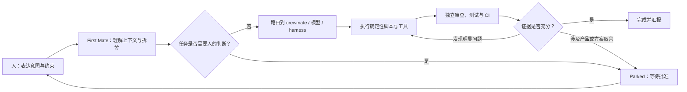
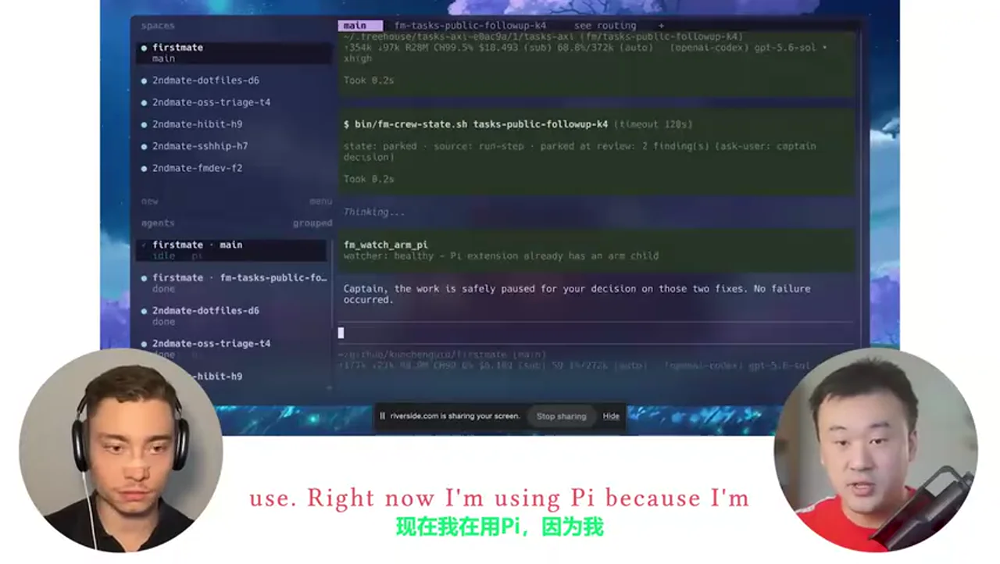
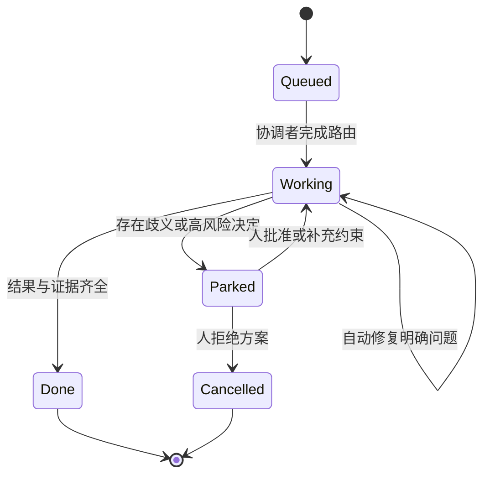
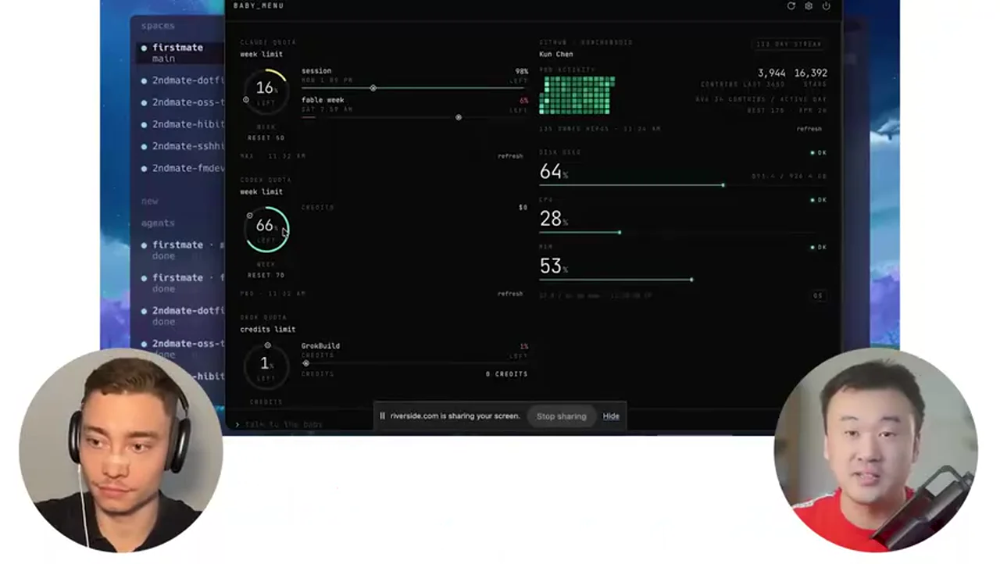
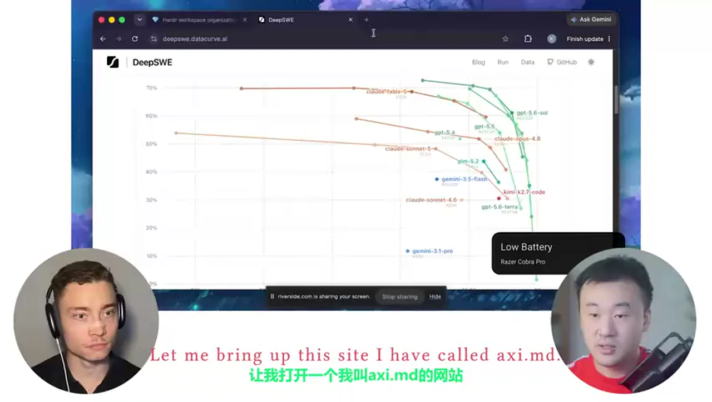
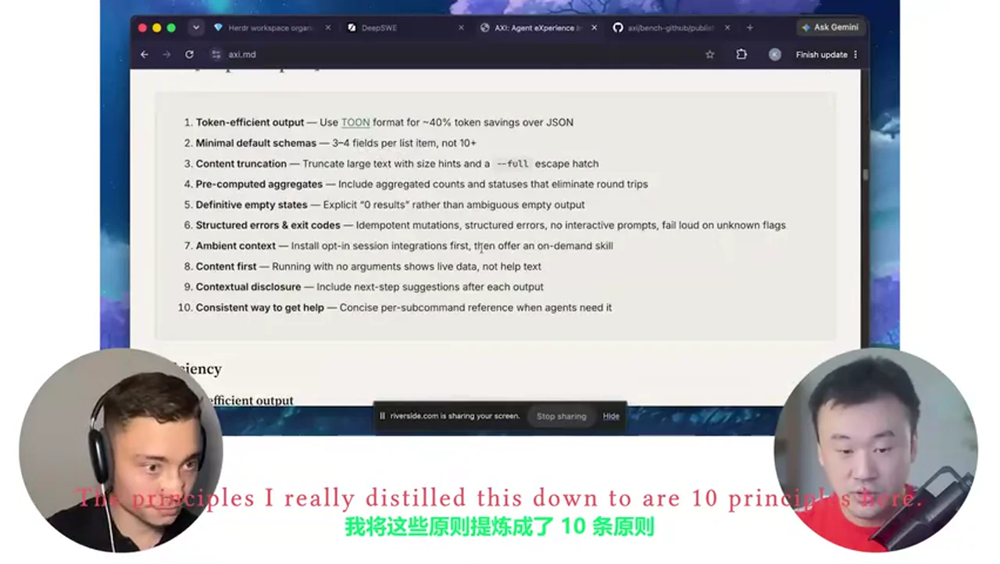
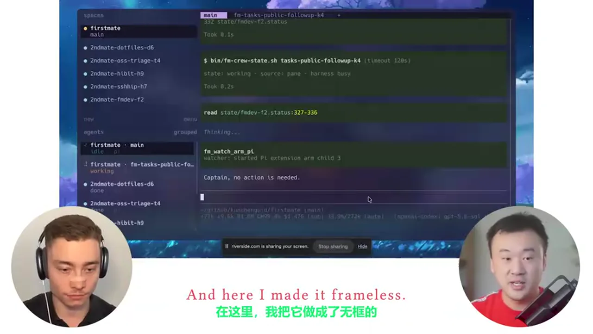

# 总结稿

## 一句话结论

Kun Chen 的核心不是“同时开很多 AI”，而是把自己从 **写代码与盯进度的人**，变成只负责 **表达意图、处理歧义、批准高风险决策的人**：日常只与协调 agent「First Mate」对话，由它分派 crewmate、追踪状态、选择模型与工具，并把复杂改动送进 NoMistakes 的独立验证流水线。

## 核心观点

- **瓶颈已经从编码转向协调与验收。** 单个 agent 会等待，直接开 20–30 个会把状态记忆和切换成本重新压回人脑；First Mate 的作用是让人只面对一个入口，其余会话由协调 agent 管理。[09:02–10:01]
- **人的稀缺资源是判断，而不是键盘时间。** Kun 把想到的事直接“倾倒”给 First Mate；任务要么完成，要么在真正需要取舍时回到他面前。[21:50–23:18]
- **并行必须配合明确的人工关口。** Agent 可以自主执行确定性步骤；涉及产品含义、方案取舍或非显然修复时应暂停并升级给人，而不是“自主到底”。[22:42–23:18]
- **信任靠逐步放权建立。** 早期要观察路由、上下文传递和重复执行问题，修正规则后再扩大自治范围；不是安装配置后立即全权托管。[11:39–12:22]
- **生成速度越快，验证越重要。** NoMistakes 将意图恢复、rebase、对抗式审查、修复/升级、测试证据、文档、lint、PR 与 CI 串成流水线，把人的检查对象从海量 diff 压缩为可判断的证据。[37:41–43:57]
- **工具应为 agent 设计。** Kun 的 AXI 思路强调低 token 输出、最小默认字段、明确空结果、结构化错误、幂等操作和下一步提示；接口质量本身会影响成本、延迟和成功率。[51:43–57:28]

## 视频中的配置栈

| 层级         | 配置/工具                                    | 在工作流中的职责                                                                             |
| ---------- | ---------------------------------------- | ------------------------------------------------------------------------------------ |
| 入口         | WezTerm                                  | 高度可定制的无边框终端；保持键盘优先体验。[06:01–06:25]                                                   |
| 会话层        | Herder                                   | 管理 spaces、agent 会话与 working/idle/done 等状态；会话可通过 SSH 从手机接回。[06:25–08:37]              |
| 协调层        | First Mate                               | 主对话入口；了解多个项目，把任务委派给 crewmate，并在需要判断时回来找人。[08:39–13:05]                               |
| 行为层        | `AGENTS.md` + 脚本                         | 前者规定协调和路由行为，后者封装确定性步骤，减少重复推理和 token 消耗；两者可被 agent 修改和修复。[35:45–37:25]                |
| 执行 harness | Pi / Claude Code / Grok Build / OpenCode | 按模型、配额和能力路由；视频中 Kun 因可定制性偏向 Pi，Anthropic 模型使用 Claude Code。[30:47–33:27]              |
| 设计协作       | Lavish                                   | 把复杂技术方案变成交互式 HTML/白板，展示层级、权衡、开放问题，并把人的修改反馈给 agent。[14:24–21:25]                      |
| 质量关卡       | NoMistakes                               | 在隔离 worktree 中做意图分析、对抗审查、测试、文档、lint、PR 和 CI 跟踪。[37:41–43:57]                         |
| 成本面板       | Baby Menu / quota AXI                    | 汇总模型订阅额度、重置周期和使用状态，辅助 First Mate 避免路由到快耗尽的额度。[17:17–18:50; 34:26–35:26; 56:44–57:12] |

## 可直接抄的最小步骤

1. **先统一入口，不先追求多 agent。** 选一个常驻协调 agent；所有需求、追问和项目状态都从这里进入。
2. **把项目与任务状态显式化。** 至少让协调者知道项目名称、仓库位置、当前任务、负责人/子 agent，以及 `working / waiting / done / parked` 状态。
3. **写一份协调规则。** 在 `AGENTS.md` 中明确：什么任务可直接做、何时委派、如何避免重复执行、必须带给子 agent 的上下文、何时必须回来问人。
4. **把确定性动作写成脚本。** 分支创建、状态检查、测试、lint、提交、CI 轮询等不要每次让模型重新发明步骤。
5. **先从低风险任务建立信任。** 观察一段时间，专门纠正错误路由、重复 crewmate、上下文丢失和越权，再逐步扩大自治。
6. **给复杂决策一个可视化出口。** 遇到架构权衡时，让 agent 产出树图、白板或 HTML，而非终端中的长段文字；人只回答开放问题。
7. **建立“确定性自动做、歧义就停”的关口。** 明显 bug 可自动修；会改变产品行为、用户体验或方案方向的修改必须 parked，等待批准。
8. **把复杂改动送进独立验证链。** 至少包含：恢复原始意图 → 更新到主分支 → 独立审查 → 测试证据 → 文档/lint → PR/CI。
9. **按任务路由模型与推理强度。** 协调者需要较强的上下文和推理；简单后台任务可用更便宜/更低强度的选择；不要把最高档当默认。
10. **监控额度与产出。** 统一看配额、重置周期、失败与审查命中，而不是只数 token；把高价额度保留给真正需要的复杂任务。

## 省钱版本

- 不必复制全部产品名；可先用“一个协调 agent + 一个执行 agent + 一套验证脚本”验证闭环。
- 后台任务优先低成本、可等待的配置；把低延迟额度留给临近截止时间的任务。[18:15–19:15]
- 对周末 demo、小范围试验等低后果项目，可跳过重型验证；生产项目或影响付费用户的改动才使用完整流水线。[42:37–43:57]
- 小而显然的修复可人工判断后直接合并；视频中 Kun 也没有把每一次修改都送入 NoMistakes。[43:33–43:57]
- 优先减少接口浪费：默认少字段、截断大文本、预计算汇总、明确空状态；这比单纯换便宜模型更接近视频的 agent-first 思路。[55:37–57:28]

## 风险与边界

- **不要把并行数当生产力。** 没有协调和状态机制时，更多会话只会增加认知负担。[09:02–09:48]
- **协调者也会犯错。** 错误路由、重复执行和上下文传递不足是 Kun 早期遇到的真实问题；自治来自持续调校，不是默认可靠。[11:45–12:22]
- **自动审查不是零成本。** 重型验证会消耗额度；应按项目后果和改动复杂度分级。[42:09–43:57]
- **审查结果仍需决策边界。** 非显然修复、产品含义和方案取舍不能由 agent 静默决定。[40:29–41:01]
- **本地模型并非总更省。** Kun 没有把本地模型作为主流程，因为 Mac mini 同时承担构建、远程连接等任务，本地推理会争用计算资源。[29:33–30:47]
- **视频中的具体模型、额度、价格和 benchmark 是录制时观点。** 可借鉴“按能力/成本路由”的方法，但不应把当时的型号、额度或曲线当作长期不变的结论。
- **04:22–05:57 是 CodeRabbit 赞助段。** 它说明审查需求，但不等同于 Kun 自己演示的 First Mate/NoMistakes 配置。

## 时间戳索引

- `00:00–04:18` 背景、终端偏好与 AI 编码转折
- `06:01–08:37` WezTerm、Herder、SSH 与 agent 状态
- `08:39–15:10` First Mate 的委派、项目记忆与 Lavish
- `15:19–18:50` 语音输入、模型路由、配额与成本
- `19:16–23:18` 可视化决策、深度工作与人工升级边界
- `23:19–30:47` 推理强度、benchmark 与本地模型取舍
- `30:47–35:45` Pi/Claude Code/Grok/OpenCode 与自修改软件
- `35:45–37:41` `AGENTS.md`、确定性脚本与自恢复
- `37:41–46:01` NoMistakes 验证流水线与统计
- `46:05–49:57` 避免只折腾工具、不交付产品
- `50:01–57:28` agent-first 软件、CLI 对 MCP、AXI 十原则
- `57:48–61:49` 采用曲线、适用时机与资源入口

# 辅助理解

## 这套工作流真正改变了什么

传统 AI 编程通常把 agent 当作更快的程序员：人下达一个任务，等它输出，再逐行检查。Kun 的 agent-first 版本改变的是组织结构——人不再直接管理每个执行会话，而是管理一个“代理团队的接口”。

First Mate 不是最忙的执行者，而是始终可响应的协调者。视频里的关键细节是：当 Kun 询问 App Store 审核状态时，First Mate 把查询交给 crewmate，自己仍能立即接收下一个关于 Treehouse PR 的请求。[10:01–11:39] 这使并发从“人同时盯多个终端”变成“协调者维护任务账本，人连续表达意图”。



因此，工作流的核心指标不是开了多少 agent，而是：

- 协调入口是否一直可用；
- 子任务是否携带足够上下文；
- 状态是否能被机器读取；
- 确定性动作是否可重复执行；
- 歧义是否会安全地回到人；
- 最终交付是否有独立证据。

## 三层控制面：意图、执行、验证

### 1. 意图控制面：只让人处理“为什么”和“选哪个”

Kun 的日常动作近似“脑内清空”：想到一个需求就告诉 First Mate，然后忘掉；系统要么完成它，要么把无法自行决定的部分重新呈现。[12:51–13:05; 21:50–22:40] 这并非让人退出流程，而是把人从状态轮询和机械操作中移到歧义决策上。

复杂设计尤其适合这样处理。终端长文不利于比较多种架构，Lavish 会把现状、推荐结构、开放问题和决策点做成交互式 HTML/白板；人移动节点或选择方案，再把反馈送回 agent。[14:24–15:10; 19:16–21:25]

这意味着一个好任务描述至少应包含：

- 想达到的结果；
- 不可违反的约束；
- 哪些决定可由 agent 自主做；
- 哪些变化必须停下来问；
- 什么证据算完成。

### 2. 执行控制面：协调者路由，不亲自阻塞

First Mate 的路由规则写在本地文件中：它根据任务复杂度、设计类型、模型能力、订阅额度与 harness 特性选择 crewmate。[15:54–17:18] 视频中，Kun 将强推理配置用于需要跨项目记忆和复杂判断的协调者；执行任务则按需选择不同模型和推理强度，而不是一律最高档。

Herder 为这一层提供运行时视图：spaces 组织项目，agent 列表显示 working/idle/done 等状态，让“仍在工作”与“正在等我”可区分。[07:42–08:37] 如果协调者认为某项修复需要人决定，任务可以安全地停在 review，而不是被当作失败。



这套状态机解决了并行 agent 最危险的误解：**暂停不等于失败，持续运行也不等于进展**。只有状态、原因和下一动作均清楚时，协调者才真正降低人的负担。

### 3. 验证控制面：让另一条流水线挑战生成结果

NoMistakes 处理的是 AI 编码的新上限：模型能快速制造巨大 diff，但人工逐行审查会重新成为吞吐瓶颈。[37:41–39:09] 视频演示的流程不是简单“再问一次模型”，而是：

1. 从产生代码的 agent 会话中恢复原始意图；
2. 创建分支和提交，在独立 worktree 中验证；
3. rebase 到最新主分支；
4. 用另一个审查步骤做对抗式检查；
5. 明显 bug 自动修复，涉及产品含义的决定升级给人；
6. 运行测试并生成可见证据；
7. 检查文档与 lint；
8. 创建 PR，并持续照看 CI 直至变绿。[39:13–41:53]

在 Kun 展示的统计中，过去约三个月、59 个仓库、1000 次变更里，63% 的变更被发现过问题；他说审查步骤抓到最多问题，文档步骤也经常发现 README 与实现不一致。[44:45–46:01] 这些是视频中的个人数据，不应外推为所有项目的普遍命中率，但它清楚解释了他为何不把“一次生成成功”当作可合并证据。

## `AGENTS.md` 与脚本为何必须同时存在

First Mate 主要由两类可修改资产组成：

- `AGENTS.md`：行为与协调规则，回答“应该怎样做”；
- 批处理/脚本：封装确定性步骤，回答“具体怎样可靠地重复做”。[35:45–36:36]

只用提示词会让模型反复推理本应固定的流程，浪费 token，也更容易出现步骤漂移；只用脚本又无法处理上下文、歧义和故障绕行。Kun 的组合让 agent 在脚本有 bug 时能够理解问题、绕过或修复，同时让正常路径尽量走便宜、稳定、可审计的确定性操作。[36:32–37:25]

一个可抄的规则骨架可以是：

```text
收到任务
→ 识别项目、目标、风险级别
→ 若可并行，创建互不重叠的子任务
→ 每个子任务附带目标、上下文、完成证据
→ 确定性步骤调用脚本
→ 发现非显然选择时 parked
→ 汇总结果，不隐藏失败与未决项
→ 高风险改动进入独立验证流水线
```

## 成本不是“选最便宜模型”，而是系统级路由

Kun 把额度做成 Baby Menu 面板，并通过 quota AXI 暴露给 agent：协调者不仅知道模型能力，也知道某项订阅是否接近耗尽。[17:17–18:50; 56:44–57:12] 

视频还以 Claude 使用限额变化为例，说明静态写死的额度假设很容易失效，因此配额状态需要成为路由输入，而不是只存在人的记忆中。

视频中的成本策略可归纳为四个维度：

| 维度 | 选择逻辑 |
|---|---|
| 任务难度 | 复杂架构与产品设计使用更强模型；简单任务降低推理强度。 |
| 时间敏感度 | 临近会议的任务需要低延迟；隔夜后台任务更关心总吞吐。[18:15–19:15] |
| 额度状态 | 保留稀缺额度给真正需要的任务，避免默认消耗最高档。 |
| 失败代价 | demo 可轻量验证；生产或影响付费用户的改动使用完整质量链。[42:37–43:57] |

本地模型也不是自动答案。Kun 的 Mac mini 同时负责构建、远程会话和其他任务，本地推理会与这些工作争用计算，所以他当时并未把本地开源模型作为主路径。[29:33–30:47] 这提示成本评估应包含机器资源、延迟和机会成本，而不仅是 API 单价。

具体型号、订阅额度和图表会变化；可迁移的是“能力 × 延迟 × 额度 × 风险”的路由框架，而不是照抄某一型号。视频用 DeepSWE 曲线说明，高推理档并不总意味着更好的性价比，较弱模型在困难任务上可能通过更多工具调用和推理循环消耗更多。[26:43–29:06] 

## Agent-first 工具接口：AXI 的真正含义

Kun 认为许多 MCP 与 CLI 仍是按人的使用方式设计的。他展示的 benchmark 观点是：对同类 GitHub 操作，已有 CLI 在成本、轮次和速度上优于其比较的 MCP 方案；他进一步用 AXI 原则包装工具，希望让 agent 的接口更紧凑、明确、可恢复。[51:43–55:31]

十条原则在画面中集中列出：

1. 使用 token-efficient 输出格式；
2. 默认 schema 只给必要字段；
3. 大内容截断，并提供大小提示与 `--full` 逃生口；
4. 预计算汇总，减少往返调用；
5. 明确表达空结果；
6. 结构化错误与退出码，变更幂等、无交互提示，未知参数明确失败；
7. 通过可选会话集成提供环境上下文，再按需提供 skill；
8. 无参数运行优先展示实时内容，而不是帮助页；
9. 根据当前结果提示下一步；
10. 每个子命令有一致、简洁的帮助方式。

这些原则的共同目标不是“让输出更短”，而是降低 agent 的不确定性。输出越明确，agent 越少需要追问、猜测或重复调用；错误越结构化，协调者越容易决定重试、修复还是升级给人。

## 为什么这不是“搭环境上瘾”

视频里 Kun 承认，他也曾连续一两周主要修工具而没有做真正产品。[46:05–47:01] 转折点不是强迫自己少碰工具，而是让 First Mate 接管那些由实际摩擦触发、但本身机械的维护任务，使他的时间自然回到产品与模糊决策。[47:01–47:41]

所以判断一个组件是否值得加入，可以用四问：

1. 它是否解决了真实、重复发生的瓶颈？
2. 它是否减少人的状态记忆、机械操作或重复审查？
3. 它是否带来可观测的完成证据？
4. 如果移除它，实际交付是否会变慢或更危险？

如果答案只是“可以跑更多 agent”，却没有明确任务、关口和交付指标，它更可能是展示性复杂度。Kun 自己的 First Mate、Lavish、NoMistakes 和 Baby Menu 都来自独立开发时遇到的具体瓶颈：会话太多、设计文本难理解、AI diff 难验证、额度难管理。[48:13–49:57]

## 最小可行落地路径

### 第 1 阶段：一个入口

让一个协调 agent 维护 1–3 个项目的任务列表；所有新想法只发给它。暂不追求大规模并行，只验证它能否准确恢复上下文并保持可响应。

### 第 2 阶段：显式状态与升级规则

为每个任务记录 `working / parked / done`、责任 agent、阻塞原因和下一动作。写清哪些动作允许自动完成，哪些必须由人批准。

### 第 3 阶段：脚本化重复动作

把创建分支、运行测试、lint、状态检查和 CI 轮询封装为确定性命令；让协调者调用，而不是每次临场编排。

### 第 4 阶段：独立验证

仅对复杂或高后果改动启用“意图恢复 → 独立审查 → 测试证据 → PR/CI”链路。小改动保留人工跳过权，防止质量系统反过来吞噬全部额度。

### 第 5 阶段：成本路由

记录每类任务使用的模型、推理强度、等待时间、失败和审查命中；再据此调整路由。先观察，再自动化，不依赖品牌偏好。

## 最终心智模型

Kun 的 workflow 可以看成一家公司被压缩到本地终端：

- 人是产品负责人和最终风险所有者；
- First Mate 是技术负责人/调度器；
- crewmates 是专职执行者；
- `AGENTS.md` 是组织制度；
- 脚本是标准作业流程；
- Herder 是运行态看板；
- Lavish 是设计评审室；
- NoMistakes 是质量与交付流水线；
- Baby Menu 是资源预算面板。

真正可复制的不是这组产品名，而是组织原则：**单一入口、明确状态、分层路由、确定性脚本、独立验证、人工歧义关口，以及按风险配置成本。**

# Data

## 增强转写稿

## 校正转写稿

> Evidence boundary: only the original transcript under `# Data` in the source note was used. All original timestamps are retained. Low-confidence guesses were intentionally left unchanged.

### 术语表

| Canonical term | Meaning in this video | Main ASR variants corrected |
|---|---|---|
| Kun Chen | Interview guest and engineer | `Rightkun` |
| WezTerm | Customizable terminal emulator | `western`, `west term`, `westerm` |
| Herder | Agent-aware terminal/session manager | `hearder`, lowercase variants |
| tmux | Terminal multiplexer | `T-Mux`, `T-Max`, `TMux` |
| cmux | GUI-framed orchestration/terminal app | `C-Max`, `CMux` |
| Zellij | Terminal multiplexer | `Zelige` |
| First Mate | Kun's primary coordinator agent | `firstmade`, `firstmate`, `FirstMate` |
| Pi | Customizable coding-agent harness | `pie agent`, `PIE` |
| Claude Code | Anthropic coding-agent harness | `cloud code`, `Cloud Code` |
| Codex / Codex CLI | OpenAI coding-agent product and CLI | `codecs`, `codecoli` |
| GPT-5.6 Sol | Main OpenAI model used for First Mate and reviews | `5.6 saw`, `5.6 sold`, `5.6 sole` |
| Terra / Luna | Other model variants discussed | inconsistent case retained where already intelligible |
| Fable | Anthropic model/quota nickname used in the recording | `fable`, `favor` |
| Grok / Grok Build | xAI model and agent harness | `grog`, `Groc`, `Groc build` |
| Claude Sonnet 5 | Model discussed in the DeepSWE benchmark | `Clock sonic 5`, `sonic 5` |
| Lavish | Interactive HTML artifact/whiteboard tool | `lavage`, case variants |
| AXI / AXI.md | Agent-oriented interface/tool concept and its site | `Axi`, `axis`, `axes` |
| MCP | Model Context Protocol | lowercase `mcp` |
| CLI / CLIs | Command-line interface(s) | `COI`, `cois` |
| AGENTS.md | Agent instruction file | `agents.md` |
| NoMistakes | Adversarial review and validation pipeline | `No Mistakes` |
| HiBit | Children's agent-learning app/project | `the hybrid` |
| CodeRabbit | AI code-review service | retained; already recognized correctly |
| DeepSWE | Software-engineering benchmark | `DeepSwee` |

### 完整转写
[00:00] I just have a frameless terminal window here, this is using WezTerm, I like WezTerm because it's really highly customizable, I can just like change everything about it, what I have here is a Herder session, Herder is kind of like a modern version of tmux, I was using tmux for like over 10 years and only recently discovered Herder and I just really like it, it's a more modern take, how you manage multiple sessions in your terminal window.
[00:26] So this is running on my Mac mini, and I can connect to this same session from my phone, so I can take my phone, I do a SSH connection, I can get this exact same terminal window, and that's a good thing about Herder, which is that it understands what agents are.
[00:41] So in order to get more work done, people have to manage multiple parallel agent sessions, because one agent can take a while to get work done, so people start to spin up more sessions, and sometimes I see people have like 20-30 sessions, but then I kind of like was going crazy, because 20 sessions you have to keep that in your head.
[01:04] So that pain caused me to develop First Mate, because I just don't think that's gonna be the end game, like I don't want to spend all day just juggling between the tabs, and remembering what was what.
[01:17] I developed First Mate because I think the agents as they become more capable should be able to juggle all those things for me, and I started experimenting with this setup since a few months ago, and it actually works, so now this is like the only agent I talk to most of the time.
[01:34] Right, Kun, so you were an elite engineer at some elite companies like Meta, Microsoft, Atlassian, what does your current AI coding setup look like?
[01:41] I have been using AI to pretty much like write everything I want to build, I very rarely would manually write any code now.
[01:48] And when did that change by the way?
[01:49] I think it was a gradual process, so initially I think three years ago we had GitHub co-pilot, code completion, and we started with just like taking the code suggestions one line after another, and then it evolved, it started to give us like multiple lines a whole function at a time,
[02:07] And then I think like one inflection point that changed that status quo was when Claude 3.5 Sonnet v2 was introduced, that was a game changing moment, so that was the first time I think an agent can take a task and start to do things for us and come back with like a complete set of results.
[02:26] So I started working with agents around that time.It was also very interesting because I was working at Atlassian at the time, and my job was to develop coding agents.
[02:36] So I played with the model a lot, I tried various kind of models starting from GPT-3.5, it was just not working, asking it to edit a file, it's already a lot of trouble.
[02:46] GPT-4 was a little bit better, but still not quite there, it was really Claude 3.5 Sonnet v2, that's really changed the game.
[02:52] So that was another I think inflection point, a few of these inflection points really like changed my workflow a lot through the past three years.
[03:00] So can you screenshot and show us your current setup?
[03:02] Yeah, yeah, sure. David, are you a terminal person or a GUI?
[03:06] I'm actually both, like literally there's weeks when I'm only using the terminal like cmux, and there's weeks when I'm like either the Codex app or the cursor agents window.
[03:14] So I'm a hybrid.
[03:15] Okay, cool, cool, cool.
[03:16] I'm more on the terminal side.
[03:17] So I try to use the terminal as my primary development experience.
[03:22] I have just built so much muscle memory with it.
[03:24] I have been using my setup for like over two decades writing code in terminal.
[03:29] I think the habit it creates for me is just to have my hands on the keyboards pretty much at all times.
[03:35] What would you tell to people who like are afraid of the terminal?
[03:38] You know, maybe they were not developers, they're not that technical.
[03:41] What would you say to those?
[03:42] There is a learning curve initially to get used to a different kind of workflow where you are using your keyboard to control like all the movements and everything in the terminal.
[03:53] So initially, I think you will feel there is like a productivity loss because you are not comfortable and you are just you're not sure how to get everything done, right?
[04:04] So there is the initial phase.
[04:05] But once you get past that, it keeps you in the flow because you can just have your hands on the keyboard, like control everything from here using keyboard shortcuts and everything.
[04:14] Your thoughts is like the only thing that's flowing.
[04:18] Awesome.
[04:19] So work us through it.
[04:20] We have Pigeon here.
[04:21] What's happening?
[04:22] The bottleneck isn't coding anymore.
[04:24] The bottleneck is reviewing thousands of lines of AI written code to make sure you're not shipping slop.
[04:30] And a lot of you already use Claude Code, cursor or codex to write code.
[04:35] But what you don't have yet is something that reviews your code as carefully as a human would.
[04:40] That is what CodeRabbit is.
[04:42] And CodeRabbit doesn't just take one look at your code through an LLM.
[04:46] Instead, you connect CodeRabbit to your repo and it understands your entire code base.
[04:50] It pulls in external context like linked issues and documentation.
[04:54] And on top of that, it runs 40 plus different linters and security scanners.
[04:57] Then it surfaces it in one digestible format so you can act on it.
[05:01] And the feedback CodeRabbit gives you isn't just add more tests.
[05:05] It's clear, specific and actionable.
[05:07] It shows you what changed, why it matters and how to fix it.
[05:10] And when it finds something like a bug, there's an easy fix with AI button that solves the issue with one click.
[05:16] And what's nice about CodeRabbit is that it meets you where you already work.
[05:19] Whether that is during PR review in your IDE, in the CLI, in Slack or Discord.
[05:24] So you can review where is the most convenient for you.
[05:27] And it's not a static checklist either.
[05:29] Give it feedback once in plain English and it remembers your standards and preferences every review after that.
[05:34] Even today CodeRabbit is already reviewing over 3 million unique pull requests every single week.
[05:40] Which makes it the most installed AI app on both github and GitLab.
[05:44] And if you're building a public open-source repository CodeRabbit is free forever.
[05:48] All of us are shipping more code than ever before.
[05:51] And it has never been more important to understand and review your pull requests properly.
[05:55] That is what CodeRabbit solves.
[05:57] If you wanna try CodeRabbit yourself, it's gonna be the first link in the description.
[06:01] I just have a frameless terminal window here.
[06:03] This is using WezTerm.
[06:05] I like WezTerm because it's really highly customizable.
[06:08] I can just like change everything about it.
[06:10] And here I made it frameless.
[06:12] So there is no window border.
[06:14] There is no nothing like it's just a pure terminal window.
[06:17] And with like background blur and everything.
[06:19] I like it to look good.
[06:22] So when I work I can look at a pleasing experience.
[06:25] What I have here is a Herder session.
[06:28] Herder is kind of like a modern version of tmux.
[06:31] I was using tmux for like over 10 years.
[06:33] And only recently discovered Herder and I just really like it.
[06:36] It's a more modern take.
[06:38] How you manage multiple sessions in your terminal window.
[06:41] So have you tried like cmux and what's the difference between like cmux and Herder?
[06:46] So Herder is even more in the terminal.
[06:49] cmux has a GUI frame.
[06:51] And within the frame there is like some pains that are terminals.
[06:55] But Herder is like entirely in the terminal.
[06:57] So the good thing about this is like this terminal window is just a program running.
[07:02] This is running on my Mac mini.
[07:04] And I can connect to this same session from my phone.
[07:07] So I can take my phone.
[07:08] I do a SSH connection.
[07:10] I can get this exact same terminal window.
[07:13] So everything stays the same.
[07:15] Other GUI applications is harder.
[07:17] Because you can't quite just like remove desktop.
[07:21] And that's not going to be a good experience either.
[07:23] So this is like the main difference for me.
[07:25] I see. Real quick.
[07:26] If you want to implement Kun's entire setup for yourself.
[07:28] It's going to be available in the second link below the video.
[07:31] Completely for free.
[07:32] This includes its First Mate setup,Herder,WezTerm.
[07:35] And everything else Kun uses to actually build with AI agents.
[07:38] Again grab it completely for free.
[07:40] Second link below the video.
[07:42] So here I have a Herder session running.
[07:44] And in this Herder session.
[07:46] You can see on the top left.
[07:48] There are spaces.
[07:49] And I'll talk about that in a bit.
[07:50] It's basically like work spaces in Herder.
[07:52] You can use that to organize your work.
[07:55] Your different projects and etc.
[07:57] And on the bottom left.
[07:58] There's agents.
[07:59] And that's a good thing about Herder.
[08:01] Which is that it understands what agents are.
[08:04] The previous like terminal multiplexers.
[08:06] Like tmux and Zellij.
[08:08] They don't quite understand agents.
[08:11] They understand your terminal windows.
[08:13] Your tabs and panes.
[08:16] They don't know what agents are.
[08:18] But Herder knows that I have a Pi agent working here.
[08:22] The working status basically tells me that I don't need to look at it.
[08:26] It's still working.It's not waiting on me.
[08:28] So that's a very useful thing.
[08:30] In this Herder,I use Herder to organize my agents.
[08:33] And allow me to navigate across all the sessions I'm working on.
[08:37] So that's the thing I like about it.
[08:39] But most of the time,I only work on one session,which is this First Mate.
[08:43] So this is a workflow that was developed like maybe since a few months ago.
[08:49] When I realized that I'm managing so many sessions all the time.
[08:53] Similarly,I think when people use cmux and other kind of orchestration apps.
[08:59] In order to get more work done.
[09:02] People have to manage multiple parallel agent sessions.
[09:05] Because one agent can take a while to get work done.
[09:09] So people start to spin up more sessions.
[09:11] And sometimes I see people have like 20-30 sessions.
[09:15] But then I kind of was going crazy.
[09:19] Because 20 sessions,you have to keep that in your head.
[09:23] You need to remember,Oh,what is this session?
[09:26] What is it doing?
[09:27] So that pain caused me to develop First Mate.
[09:31] Because I just don't think that's going to be the end game.
[09:34] I don't want to spend all day just juggling between the tabs.
[09:38] And remembering what was what.
[09:40] I developed First Mate because I think the agents,as they become more capable.
[09:45] Should be able to juggle all those things for me.
[09:48] And I started experimenting with this setup since a few months ago.
[09:51] And it actually works.
[09:53] So now this is like the only agent I talk to most of the time.
[09:56] I just talk to First Mate.
[09:58] And let First Mate manage all the other sessions for me.
[10:01] So I can maybe like walk through some examples here.
[10:03] So this is already something is already happening.
[10:06] It's doing some work.It's telling me no actions needed.
[10:09] And now I'm wondering about some some work that was happening a while ago.
[10:13] So I can just ask,Hey,did Apple approve our app review for this app?
[10:20] So that's an iOS app I was building.
[10:22] And I submitted for app store review.
[10:25] And I'm not sure whether that's approved.
[10:27] So I can just check with First Mate.
[10:29] And First Mate is not going to do that by itself.
[10:32] It's going to delegate the task to another crewmate.
[10:35] The reason is that if First Mate does this for me,
[10:38] then First Mate will get busy.
[10:40] And I cannot talk to First Mate again.
[10:43] So now you can see captain,I'm checking this now.
[10:45] It's asked another crewmate to check it for me.
[10:48] The benefit is that I can talk to First Mate now
[10:51] without it's like blocking on something else.
[10:53] I can just ask for something else.
[10:56] I remember there are some good PRs sitting on me
[11:01] for review in treehouse.
[11:04] Can you check?
[11:05] So First Mate has access to all the projects that we're working on.
[11:07] Yeah.It's the coordinator of everything.
[11:09] It knows about all my projects.
[11:11] I'll talk through some scaling issues later on as well.
[11:15] But basically I have maybe 20 to 30 GitHub repos
[11:20] that are public and have quite some popularity
[11:23] and people file issues and PRs to me.
[11:26] If I am to manually juggle all the 20-30 projects,
[11:31] I'll just go crazy.
[11:32] So I pretty much let First Mate manage all the projects for me.
[11:35] So when I say treehouse,
[11:37] First Mate knows which project that is.
[11:39] My main question would be like how did you develop
[11:41] enough trust to delegate so much responsibility
[11:44] to First Mate?
[11:45] So trust takes time to build.
[11:47] So I didn't initially just trust it for everything.
[11:50] I started playing with it initially as a prototype.
[11:53] And I started really letting it do more and more for me.
[11:57] And I observed how it does.
[11:59] And sometimes initially,especially when I just first began using it,
[12:03] there were many problems such as it's not delegating
[12:07] the right thing to the right crewmate.
[12:09] Or it's like sometimes having multiple crewmates
[12:12] doing the same thing,
[12:13] conflicting with each other things like that.
[12:15] And I started optimizing the process more and more
[12:18] and eventually got to a pretty sweet spot
[12:20] where I can just let First Mate handle all those for me.
[12:22] And I don't see mistakes or suboptimal routing anymore.
[12:27] So now it's also started a task to review
[12:31] some of the treehouse PRs,right?
[12:33] And now I can continue talking to it
[12:35] about something like anything else I want to do.
[12:37] Remember there was work happening around
[12:41] optimizing the workspace organization for First Mate.
[12:46] Where are we?
[12:47] So I can just keep asking about these things
[12:50] that are crossing my mind.
[12:51] The really good feeling I get here right now
[12:54] the thing I enjoy the most
[12:56] is that I'm constantly in a brain dump kind of mode.
[13:00] I have thoughts and I just dump my thoughts to First Mate
[13:03] and let First Mate do everything else.
[13:05] I don't need to worry about all the steps it needs to take
[13:08] to get things done.
[13:10] And do you ever go into the specific subagents
[13:12] to look at what they're doing or not really?
[13:14] Very rarely now.
[13:16] Initially when I was developing First Mate
[13:18] I did that a lot just to observe,right?
[13:20] Is it doing the right thing?
[13:22] Is First Mate communicating efficiently,right?
[13:26] Did it actually bring the context to the crewmates?
[13:29] So initially I did a lot of observation myself
[13:31] but now I don't do that much.
[13:33] But if I sometimes I will still feel like
[13:37] why is this taking so long,right?
[13:39] Kind of like working in a real company,in a real team.
[13:42] Sometimes the manager will still go to a direct report
[13:45] directly,right?
[13:46] Like maybe bypassing the tech lead
[13:48] because sometimes it's like more efficient
[13:50] to directly communicate.
[13:52] So if I want to do that,I can just like in Herder
[13:54] I can bring up this view.
[13:56] This view pretty much like lets me jump
[13:58] to any other agent session.
[14:00] I can just jump.
[14:02] And see like what is really happening there.
[14:04] Yeah,that's very,very nice.
[14:06] Yeah,so here basically First Mate answered
[14:09] my last question.
[14:11] This is at a strong design checkpoint.
[14:13] Okay,I discussed like an idea
[14:15] with First Mate a while ago.
[14:17] But we didn't proceed to implement
[14:19] because I wasn't sure about this approach.
[14:22] I felt like something was off.
[14:24] Let me actually show you something here.
[14:26] So with this kind of technical design
[14:28] sometimes it's a little bit complex,right?
[14:30] It has lots of moving pieces
[14:32] it has tradeoffs,it has like pros and cons.
[14:35] So this kind of case,I usually use Lavish
[14:38] a interactive HTML artifact
[14:41] to allow me to more easily understand
[14:44] what the idea is and what the tradeoffs are.
[14:47] So let me try that now.
[14:49] Can you use Lavish to reveal
[14:51] the Herder workspace
[14:54] design with me.
[14:56] What this does is that First Mate will
[14:58] create a HTML artifact
[15:01] with visuals about the design decisions
[15:03] we have to make.
[15:05] So it's going to be easier for us to collaborate on that.
[15:07] Yeah,it's using the Lavish AXI to do this.
[15:10] It can take a little while to create the artifact.
[15:13] Right now you were typing
[15:15] but you were a big proponent of speaking.
[15:17] When do you do which?
[15:19] I pretty much always use voice input now.
[15:22] The reason you saw me typing
[15:24] was I realized a while ago
[15:26] that if I use voice input
[15:29] it actually interferes with my microphone somehow.
[15:32] I haven't fixed that yet.
[15:34] But mostly when I prompt I just use voice input.
[15:37] The only exception I would say
[15:40] is when I have to copy paste a URL
[15:42] or a file path
[15:44] or something like that
[15:46] it just doesn't make sense to speak that out.
[15:48] So now it's writing the design review
[15:50] in a HTML
[15:52] and very soon we can probably see that in my browser.
[15:54] So you're using 5.6
[15:56] as your main agent.
[15:58] Why is that?
[15:59] Yeah,so GPT-5.6 Sol
[16:01] on xhigh as my First Mate.
[16:03] So First Mate
[16:05] the thing I learned is that
[16:07] First Mate is kind of like
[16:09] juggling through a lot of context.
[16:11] It rationalizes a lot of different things.
[16:13] Like which thing am I talking about?
[16:15] When I say Herder workspace
[16:17] view design
[16:19] it needs to know a while ago we worked on that
[16:22] and that's what I mean.
[16:24] So First Mate actually needs a lot of reasoning.
[16:26] It needs to really be able to rationalize
[16:28] all the complexity.
[16:30] And then I have different rules
[16:32] for different crewmates.
[16:34] So when First Mate is dispatching a task
[16:36] to a crewmate,it has a set of preferences.
[16:39] And it will use those preferences
[16:41] to route the task.
[16:43] Here this file is basically
[16:45] where I write the rules.
[16:47] And the rules will basically tell
[16:49] First Mate in what case
[16:51] should we use which agent
[16:53] which model and at what reasoning efforts.
[16:55] Previously there was
[16:57] a rule here that says
[16:59] for any high complexity
[17:01] technical design and product design
[17:03] use Fable in Claude Code.
[17:06] I think Fable has the depth
[17:08] and has the creativity that I really like.
[17:10] So for those very complex designs
[17:12] I like to use Fable as the crewmate.
[17:14] But by default right now
[17:16] it's using 5.6.
[17:18] So purely because of the subscription
[17:20] practicality.
[17:21] So I can show you.
[17:23] I have this thing tracking my quota.
[17:25] I ran out of my Grok quota
[17:27] and waiting for the reset.
[17:29] I'm almost out of the Fable quota this week.
[17:32] And the reset is still like ways to go.
[17:35] So I'm saving this remaining Fable quota
[17:37] for things I really need Fable for.
[17:40] This whole LLM quota
[17:42] from the subscriptions we get
[17:44] are just not enough.
[17:46] I think I would suggest
[17:48] the LLM companies to actually think
[17:50] about having a higher tier.
[17:52] Because the $200 tier
[17:54] right now is not sufficient.
[17:56] I agree completely.
[17:57] People are going to hate this take
[17:59] but we do need some $500 tier.
[18:01] So you never do API pricing?
[18:03] Yeah.So I think for individuals
[18:05] it doesn't make sense to do API pricing.
[18:07] If I actually take API pricing
[18:09] for everything I worked on for the past month
[18:11] it's going to cost more than like $10,000.
[18:14] It's just not sustainable.
[18:15] I think another thing that might help
[18:17] you know like GPT-5.5 and 5.6
[18:20] and a lot of the cloud models
[18:22] have a fast mode.
[18:24] Right.The fast mode will basically
[18:26] cost more to get you lower latency.
[18:29] I want the opposite of that.
[18:30] I want something that's slower
[18:32] but will be cheaper.
[18:34] Because there are so many tasks
[18:35] there are like background tasks
[18:37] that I don't really care about.
[18:39] It's being finished very fast.
[18:41] I care about how much work
[18:42] can I get done in total
[18:44] because my total quota
[18:46] is the bottleneck right now.
[18:48] So I wish they will
[18:50] eventually develop something like that.
[18:52] There is demand for this for sure.
[18:53] Different tasks require
[18:54] different tools and settings.
[18:56] If you're working on something
[18:57] I have this very important meaning
[18:59] in 10 minutes.
[19:00] We have a transcript from last week.
[19:02] You need the fast mode.
[19:03] But like if you're just
[19:04] dispatching the agent overnight
[19:05] you need the slowest of slow modes.
[19:07] You don't care if it's
[19:08] 5 tokens per second.
[19:09] You just want it done.
[19:10] Yeah exactly.
[19:11] I think the whole spectrum
[19:13] ideally the options are
[19:14] available to us to make the tradeoffs.
[19:16] So this is the question I asked
[19:18] earlier about the Herder organization.
[19:20] So this idea for some context
[19:23] is about how First Mate
[19:25] uses Herder to organize his crewmates.
[19:28] So right now everything
[19:29] is like a flat list.
[19:30] And it's sometimes hard to understand
[19:32] like which agent is doing what.
[19:34] So there was an idea
[19:35] to do better organization.
[19:37] So here basically it brought up
[19:39] this design review artifact.
[19:41] It has a recommendation.
[19:43] But let me walk through
[19:45] the actual proposals.
[19:47] Yeah this is kind of
[19:48] the hierarchy we have today.
[19:49] It used this kind
[19:51] of like a tree view
[19:53] to show me what this is.
[19:55] And this is very helpful.
[19:57] Otherwise what we usually do
[19:59] is like in the terminal
[20:00] we discuss with the agent
[20:01] and the agent will just print
[20:03] long wall of text.
[20:05] So here I can see this visually.
[20:07] It's a tree structure.
[20:09] This is what it does today.
[20:11] Native now,report tree
[20:14] and work tree hierarchy.
[20:16] Yeah different work trees
[20:18] get grouped into
[20:20] by repo.
[20:21] And there is a recommended architecture here.
[20:24] So this is also pretty cool.
[20:27] Lavish makes the agent
[20:29] actually produce a white board.
[20:30] So this is a kind of
[20:32] draw white board.
[20:33] And I can pretty much
[20:34] just look at
[20:36] other diagrams.
[20:39] I can adjust this as well.
[20:41] I can say this is not right.
[20:43] I will move the boxes around.
[20:45] And I can send the feedback
[20:47] back to the agent.
[20:49] So there's a lot we can do
[20:50] interactively on this artifact.
[20:52] And that's what I really
[20:54] like about using this
[20:56] Lavish-based workflow.
[20:58] At the end,it will usually point out
[21:00] the decisions I have to make.
[21:02] The open questions it has
[21:04] is ambiguous.
[21:06] So it has a few approaches.
[21:08] I need to decide on one.
[21:10] I think I want to prioritize the supervisor ownership
[21:13] because the grouping will make more sense
[21:15] when it's grouped by supervisor.
[21:17] There's a lot of context here.
[21:19] So I'll probably not spend too much time on this.
[21:21] But I'll kill this decision
[21:23] and I'll send that back to the agent.
[21:25] And that's it.
[21:26] The workflow to make a decision like this.
[21:29] So the main question,like you said,
[21:31] there's a lot of context with these different projects.
[21:33] You know them.How do you still
[21:35] achieve something like deep work?
[21:37] How do you still go into the flow
[21:39] without going crazy?
[21:41] Even with the setup,you can still
[21:43] have too many thoughts.
[21:44] I wonder how that project is doing.
[21:46] I wonder what this agent is doing.
[21:48] How do you still achieve deep work?
[21:50] Most of the time,when you think about
[21:52] the time I was spendingwith First Mate
[21:54] it was mostly spent on ambiguous decisions.
[21:57] So I was not really like
[21:59] jumping between tabs or wondering
[22:02] hey,was that work still happening?
[22:04] Was that waiting on something?
[22:06] I don't need to worry about those things.
[22:08] The only thing I spend my time on
[22:10] is like truly ambiguous decisions.
[22:12] The things that really does need my judgment.
[22:15] So pretty much like all day
[22:17] what I'm doing is like I
[22:19] one is that I'm dumping my thoughts
[22:21] into First Mate.Everything I want to do,
[22:24] I just tell First Mate I want to do that.
[22:26] And then I can forget about it.It will
[22:28] either get done or it will come back
[22:30] to me as a decision to be made.
[22:32] So that's one thing I do,just tell
[22:34] First Mate all my thoughts.The other
[22:36] thing is like to deal with the decisions
[22:38] that I have to make.That First Mate
[22:40] cannot determine by itself.
[22:42] I actually have a lot of instructions
[22:44] for First Mate when it should come
[22:46] back to me.Because that is actually
[22:49] a tricky thing to get right.Sometimes we
[22:51] see agents to just go wild.
[22:54] And they do a lot of things
[22:56] autonomously without really your eyes
[22:59] on it.And at the end you will notice
[23:01] it did the wrong thing.And I think
[23:03] that's one thing that we really need
[23:05] to tweak about our agent behaviors
[23:07] to figure out what is a sweet spot.
[23:09] And each person maybe have a slightly
[23:12] different preference for where that is.
[23:15] So that is something we need to really
[23:17] talk through with our agent.
[23:19] So with this set up,how many tokens
[23:21] are you doing on a typical day?
[23:23] I actually didn't count the tokens.I mostly
[23:25] count how many percentage of
[23:28] the quota I am using.
[23:30] Right now I try to keep a good
[23:33] balance.The reason you saw that I
[23:36] exhausted my Claude quota more
[23:40] quickly than I should,is that
[23:43] anthropic told usFable will be gone.
[23:46] Ive even called them out and said
[23:48] what are these childish games,either
[23:50] keep it or remove it.Don't do this
[23:52] weekly extensions.Or like give us
[23:54] the banked resets that OpenAI has.Right?
[23:57] So we can control it.So unfortunate
[23:59] situation.Almost out of Claude quota.
[24:02] There was even a couple of people that
[24:04] went to the hospital.Have you seen that?Because
[24:06] they stayed up for two days straight
[24:08] because they thought Fable was getting
[24:10] removed and they ended up in the ICU.
[24:12] Transparency I think.This is something I
[24:14] couldn't really struggle with.Everytime they
[24:16] communicate with developers like the way
[24:18] they have handled a lot of the major
[24:20] changes in the past.It's just not
[24:22] quite transparent enough and give
[24:24] everyone enough clarity to make
[24:26] their decisions.This is just like a
[24:28] quick rant.But usually I just use
[24:31] this to keep my eyes on my quota.And I
[24:34] try to make sure I'm at a good pace
[24:37] with the resets.Right?With OpenAI I can be
[24:40] a little bit more aggressive because I
[24:42] have a few resets I can use.And they
[24:44] give so many resets.But didn't you find
[24:46] like gbd GPT-5.6 Sol especially on
[24:48] extra-high or ultra is like
[24:50] burning like crazy?At least it was in the
[24:52] first like day or 24-48 hours.So there were
[24:55] a few things there.The first couple of days
[24:57] OpenAI made a mistake.They adjusted
[25:00] the context window,the compaction
[25:02] threshold for 5.6 to
[25:05] 372k tokens.Right?And later they
[25:10] advisedany request that goes beyond
[25:13] 272k tokens will get overcharged.So a
[25:17] lot of people are burning tokens more
[25:19] quickly than they should.And they did a
[25:21] reset for that.So I think they are fixing
[25:24] it.But that was one of the reasons
[25:26] people felt5.6 was burning tokens
[25:29] morequickly than they used to.The
[25:32] other interesting thing was that
[25:35] ultra is a special case.So I think
[25:39] ultra and theultracode in cloud
[25:42] they are not necessarily a reasoning
[25:45] effort level.They are a prompt
[25:48] that tells the agent to use subagents
[25:51] aggressively to fan out tasks.And
[25:54] for a while,I think maybe even right
[25:57] now,OpenAI Codex when it uses
[26:00] ultra,it will spin up so many subagents
[26:03] and every subagent is an ultra agent.It's
[26:06] just burning tokens way too fast.I think
[26:08] xhigh and high are very different.xhigh
[26:11] doesn't burn my tokens that fast.xhigh
[26:13] is actually my sweet spot.Because
[26:16] despiteit being xhigh,it's actually pretty
[26:19] fast.The prompts that we just went
[26:22] through,it usually comes back pretty
[26:24] quickly.Oh,actually,yesterday
[26:26] on that point,I did testing with
[26:28] some people.And I was observing
[26:30] they were running5.6 Luna.And I was like
[26:33] why is it so slow?They switched to 5.6
[26:35] medium.And it was faster.So I don't know
[26:38] what's happening at OpenAI.But literally,Luna is slower
[26:40] than so right now.Yeah.So you know
[26:43] why that's the case.There's a benchmark I can show
[26:46] here.It's called DeepSWE.I think you probably
[26:49] have seen this as well.DeepSWE.This is
[26:52] probably like the benchmark I currently trust the most.Because
[26:56] it's not contaminated yet.It's new enough.That's
[26:59] the training data does not have this.So maybe eventually
[27:02] it will need a refresh.But right now,I trust
[27:05] this a lot.And you can see there are a few
[27:08] reallyinteresting outliers here.Clock
[27:11] Sonnet 5.If you look at Sonnet 5,up until
[27:15] like from low,medium,high,xhigh,it's
[27:19] like it's a reasonable curve,right?So this
[27:24] graph is like the left-hand side is more
[27:27] expensive.And the top-end is more intelligent.So the
[27:32] top-right is good.So Sonnet 5 is reasonable
[27:36] up untilxhigh.But if you do max,it's going
[27:41] crazy.It's the most expensive model there
[27:45] is.Sonnet 5 is more expensive than Fable.So I
[27:49] think the reason this is happening is thatwhen the
[27:53] model itself is not intelligent enough,it will
[27:56] justwaste a lot of cycles,right?It's the wrong
[27:59] thing.Especially when you ask it to do
[28:02] max reasoning,it will think very hard,but it's
[28:05] still not intelligent enough to solve the
[28:07] problem.So it will justwaste a lot of time
[28:09] and tokens.So Ithink it's the same withlunar.The
[28:13] unique thing aboutlunar is thatit's a really
[28:16] tall curve.It meansit stretches between
[28:20] very,verylow intelligence to very high
[28:23] intelligence.So Ithink there is probably a similar
[28:26] thing happening withlunar,where if you asklunar to
[28:29] work on a hard problem,it willjust not be able
[28:32] to solve it,but it willwaste a lot of tokens
[28:35] trying to.My observation is exactly that.You did
[28:38] way too many tool calls to achieve something
[28:40] relatively simple.And then GPT-5.6 Sol on medium
[28:43] just did it in like a minute.Exactly.So right now
[28:47] I pretty much only use sole for my day-to-day
[28:50] tasks.So I can like adjust the reasoning level
[28:53] for sole,right?I find very little reason to use
[28:56] TERRA.Because why do I useTERRA when I can
[29:00] just adjust the reasoning level down for sole?
[29:03] Then I get more intelligent modelat a lower
[29:06] cost.I uselunar in some cases though,in my
[29:10] home assistant.So I have a home assistant
[29:13] running my house,and I can control my
[29:15] light,and everything,right?Music players,etc.etc.That
[29:20] I uselunar.Because it's fast.I need to be
[29:23] really,really fast.Why not like an open source
[29:25] model for that?Like you know,communicate 2.7 code
[29:27] with like the nitros to fix an open router.You can
[29:30] get like 200,300 tokens per second.Yeah.Yeah.So open
[29:33] source models.So there's a few ways to do
[29:36] that.One is to run that locally.Actually,I think
[29:39] for this kind of home assistant scenario,I can
[29:42] run something locally on my Mac mini,and get it
[29:45] to work reasonably well,right?The thing is
[29:48] that my Mac mini right now is a very
[29:51] precious resource.Because I do everything else
[29:54] on my Mac mini.I have a lot of tasks to be
[29:57] done,right?So when I build the iOS apps,when I
[30:01] build everything else I'm doing,it consumes
[30:04] the compute from my Mac mini.And I connect my
[30:07] phone to it.I connect everything else to it.Mac mini
[30:10] is kind of my personal compute.Make sense.And if I run
[30:15] a open source model on that,it will just like
[30:20] compete with everything else I'm doing.So that's
[30:23] one constraint.I could also run open
[30:27] source models through cloud providers,right?But I
[30:31] find that cost saving not meaningful enough
[30:35] for me to really like switch away from
[30:38] something like Luna.So far,I haven't really
[30:43] got into local LLMs and open source models
[30:47] that much.And in terms of the harness,is Pi
[30:50] your favourite harness right now?Yeah,so there's
[30:53] a few harnesses I use.Right now,I'm using Pi
[30:56] because I'm mostly working with GPT-5.6
[30:59] today,because of the quota.But what I do
[31:02] right now,is that if I use Anthropic's models,I
[31:05] use Claude Codebecause they banned everything else.If I
[31:08] use GPT-5.6today,I use that in Pi.The reason is
[31:11] that the Codex CLI is not that good as a
[31:15] harness.It has some strength.For example,it's got
[31:19] out-of-the-box integration with the image generation,which
[31:23] is very handy.A lot of the other capabilities,such
[31:26] as likemanaging background processes,it's just
[31:30] not as good.It doesn't have all the bells and whistles
[31:33] that make the CLI experience really smooth.If I compare
[31:36] that with Pi,Pi is highly customizable.Right,so
[31:39] everything I want to achieve,I can pretty much just build a plug-in
[31:43] to achieve that.So that's the main reason I choose Pi
[31:47] over Codex for GPT models.For
[31:51] Grok,it's the other model I use because I have a X subscription
[31:55] already and there's some quota there.I actually findGrok
[31:59] 4.5 really good.Yeah,I'm in the EU,so I cannot use it
[32:04] because it's banned in the EU.Oh,okay,that's unfortunate.So
[32:09] it's a pretty good model.The way I think aboutGrok 4.5
[32:13] is that it's opus,but on fast mode.Damn.Yeah,it's pretty much
[32:18] capable as doing everything opus can do,and it's super fast.And
[32:22] the interesting thing about usingGrok,especially in theGrok harness,the
[32:26] Grok Build harness,is that it seemsGrok Build
[32:30] gives you free X API access to like read
[32:34] post and search for things,whichotherwise would cost
[32:38] you,because X API cost money.So that's another benefit.
[32:42] I can useGrok Build to like search for tweets and rationalize
[32:46] like news,things like that for me.I think it's like one of the fastest
[32:49] improving harnesses as well,right.Yeah,yeah,totally.It's very young,right.It's
[32:53] it's very new,and they only recently started being really serious about
[32:57] that.Andit's already got like better capability than Codex,at some of
[33:01] the background process,polling,etc.I see.Okay,any other agent harness?
[33:07] I also use OpenCode,quite a bit.So OpenCode is also pretty smooth.
[33:12] I like the TUI experience there.But I think over time,I started leaning
[33:18] towards Pi for more and more things,because Pi is like
[33:23] more deeply customizable.You can pretty much change every aspect
[33:27] about Pi,and I kind of like about that.So like you are big on
[33:32] customizability,right.So do you think in the future,more and more people
[33:35] will have their own setup,instead of like these predefined,you know,packaged
[33:39] apps?I think likely there is going to be a spectrum of preference.
[33:44] What I think will happen is that there will be a group of people who are
[33:48] not very opinionated about how things should work.They are kind of
[33:52] looking for others,like give them proven playbooks.So they just want
[33:56] something that can work out of the box.They don't have to worry about
[34:00] tinkering with that all day.That I think will always exist.And that's good.
[34:05] And people will build tools and publish that to those people.So they
[34:10] can just use something that can work out of box.There will be another group
[34:13] of people who will start to have more and more personal preferences for
[34:17] how things should work.And those people will need things that can
[34:21] really be customized and evolve.One thing I showed you earlier was
[34:26] this quota widget I have on the menu bar,right.This thing,I call it baby
[34:31] menu.I built this myself.And this thing is self-modifiable.So right now
[34:37] you can see it's a bunch of things that would never exist together in a
[34:41] product.There's my github stats,right.And there's like CPU
[34:46] and memory.And then there's like my Claude and Codex quota.No one will
[34:51] build a product like this and ship it to other people.This is,this belongs
[34:55] to me.And the reason I have it like this,the way I got it to become
[35:00] like this,is through talking to babymenu.So babymenu started as empty
[35:05] thing.And I tell babymenu what I want.And babymenu will self
[35:10] modify and start to become like that.That's,I think one version
[35:15] of the future that I think will happen to a lot of software.They will
[35:19] ship a reasonable experience out of,out of the box.But now everyone has
[35:23] agents.So everyone should be able to talk to their agent and
[35:26] customize the software they use.And also like a lot of self healing
[35:30] loops.You know,like a lot of software will have like a way to easily report
[35:33] a bug.That starts like a Codex CLI,implements it,goes into PR.You have
[35:38] like something like code rabbit review it.And the bug could be fixed
[35:41] within 20 minutes without any human involvement.Yeah.Yeah.Totally.Totally.
[35:45] Something else that's very interesting that's happening is like
[35:48] First Mate.First Mate is basically an AGENTS.md file.So there's
[35:54] the AGENTS.md.That prescribes how First Mate should behave.How it should
[36:00] coordinate different tasks across a larger number of crewmates.So this is
[36:04] the instruction for First Mate.It also has a bunch of script files.So in
[36:10] this binary folder,it has a bunch of batch scripts.This batch
[36:15] scripts basically handle a lot of the deterministic steps that
[36:19] First Mate would otherwise have to take.So bundle them into a batch
[36:24] script so thatFirst Mate does not need to spend tokens going through
[36:28] all those deterministic steps.Now,the good thing about this is that
[36:32] boththeAGENTS.md and this batch scripts are in the current
[36:36] directory.So First Mate can modify this,right?So one
[36:41] interesting thing I didn't even realize what's going to happen was
[36:44] that when First Mate has a bug,that's likepreventing it from
[36:48] doing something correctly,right?It will just work around the bug
[36:52] by itself.So now this software is pretty much likeunstoppable.There's
[36:57] no way you can stop First Mate from doing what it needs to do.Even
[37:01] ifthis scripts have various kind of bugs,it will maybe make
[37:05] First Mate a little more inefficient.It will not stop it from working.This
[37:09] is a really big change fromtraditional software,right?In a
[37:13] traditional software,ifyou have a bug,then it's a bug.It may be like
[37:17] breaking the app,it may be crashing the app.You can never get through it.But now
[37:21] we have this intelligent software that's pretty muchalways flexible.And it's
[37:25] very hard to write a bug thatcan stop it from working.So basically
[37:29] then the challenge becomes likewhere are all the things thatwe humans are slowing
[37:33] down the agents.And how can we remove ourselves fromas many of them as possible
[37:37] only beinginvolved in the ones thatreally matter.Yeah,yeah,totally.What
[37:41] is about your setup,should people know?I think maybe the other thing is
[37:45] NoMistakes.So what we very,very often I run into
[37:49] so much is thatI get AI to generate codefor me,right?And
[37:53] Fable and 5.6,they can write codevery,very quickly
[37:57] and very well.They can dovery complex changes.But now
[38:01] ifthere is a complex changethat's made by AI
[38:05] how do I knowit's okay to merge it,right?So let me
[38:09] show you averyreal example here.I'll go to myother project
[38:13] for HiBit.This is aAI harness I'm building for children
[38:17] to learn to use agents.I just did
[38:21] a whole bunch of changes.You can see here.This is the diff.I made a bunch of changes
[38:25] usingFable yesterday.And now I have this
[38:29] change sitting here.What do I do now?If I go
[38:33] review everyline of this diff,it's going to take
[38:37] a long time,right?And our time is like really limited.So
[38:41] ifIreview AI-generated code,then
[38:45] there is an upper bound ofhow much workI can get done,right?Because
[38:49] it pretty much depends onhow much codeI can review every day,without going
[38:53] insane.So now what I dois that I have pretty much
[38:57] I send all these changes to NoMistakes,which performs
[39:01] a pipeline where it doesadversarial review
[39:05] and validation and everything,and present me with something that I can more
[39:09] easily determine whether it's okay.So the way I do that is just
[39:13] nm.This is ashort hand for NoMistakes
[39:17] -y,which pretty much like just
[39:21] means gets all the code changes that are in the current working directory
[39:25] into a branch and pass that to NoMistakes.So I just run
[39:29] that to show you.NoMistakes will create a branch,will ask the agent to create
[39:33] a branch for me,and create a commit,and like put all
[39:37] the necessary information in there,and then push that branch
[39:41] into a local git proxy,where it performs the validation in
[39:45] a isolated work tree.So we can see that in a bit.Yeah,it's already created
[39:49] the commit.So this is the NoMistakes pipeline.It first
[39:53] will analyze the intent,and the way it understands
[39:57] the intent is by analyzing the agent's session
[40:01] that produced this change.So the agent's session is where I worked
[40:05] with Fable to create this code change,right?I send
[40:09] my prompt,I expressed my intent originally there.So the first step is
[40:13] to understand that intent,because that intent is the true requirements
[40:17] that should be respected.It's what I said I want,right?It understands
[40:21] the intent.It does a rebaseon the latest
[40:25] remote origin main branch,so we don't runinto merge
[40:29] conflict later on.And now it's doing the adversarial review.So here it's
[40:33] using GPT-5.6 Sol on medium
[40:37] to review the change.If it found something,it will either auto fix
[40:41] if it's a very obvious bug,or it will escalate to me
[40:45] for approval,if it's not obvious enough.If it has some product implications
[40:49] sometimes we find a bug,and the solution to fix the bug
[40:53] will require changing the product,right?Those are the cases I want
[40:57] to actually have a say.I set some rules to sayfor those cases
[41:01] escalate to me.And here we can maybe see whether it will just auto
[41:05] complete or escalate something.But basically this review step will
[41:09] keep going for a while,and it will pretty muchcatch all the edge cases
[41:13] and bugs and missing things.And
[41:17] at the end,after the adversarial review,it will do testing
[41:21] as well.And the testing will produce some
[41:25] visible evidence that can really tell me it's really working
[41:29] as intended.And then documentation,linting,and it will push
[41:33] for PR.And it will babysit the CI pipeline until the PR is
[41:37] green.And then it will tell me,okay,now you can go look at that.So usually
[41:41] when I launch NoMistakes,I don't look at this view.I just go away
[41:45] and do something else.Now a days,I don't even launch NoMistakes
[41:49] myself.I ask First Mate to do that.So it's First Mate launching this
[41:53] for me.Yeah,but pretty much this is like something that I think helped me
[41:57] a ton.Because otherwise,I would have seen all the problems
[42:03] NoMistakes cut.Told me thatmy code basis would absolutely go into a mess
[42:09] if I didn't use something like this.But doesn't it on large project like burn up
[42:13] too much limits,too many tokens.Because for example,this reminded me of
[42:17] DeepSec from Vercel.And they have so many warnings that
[42:21] if you run this on a large code base,it's gonna burn tens of
[42:25] thousands of dollars of API credits because of how deep it goes.So how do you
[42:29] balance the number of review it does versusburning your
[42:33] usage?Yeah,good question.So I think there is one
[42:37] aspect,which is the inevitable cost of quality.So think
[42:41] of a software team.If we remove the code review
[42:45] process between humans,everyone will be able to merge code faster,right?
[42:49] But then you will have all kinds of like quality problems,incidents
[42:53] that will happen in production sites.And then eventually you have to pay the cost
[42:57] in another way.So that's the inevitable part.
[43:01] I think we have to make a tradeoff.How much do we care about the quality
[43:05] of a certain project?And in some projects.For example,it's
[43:09] a demo for a weekend showcase.It doesn't really matter
[43:13] that much,right?In those cases,we can probably skiprunning
[43:17] this kind of heavy validation pipeline.But if it's building
[43:21] a production software and there are a lot of users that would be affected,there
[43:25] are customers who will stop paying if we like break their experience,that's
[43:29] the case we want to be careful.So I think there's a tradeoff to be made
[43:33] which projects to apply this kind of approach.The other thing
[43:37] I do is thatI don't send every single change
[43:41] into this pipeline.Sometimes I make a very simple fix,right?
[43:45] I'm confident enoughthat it's not going to break.
[43:49] And I can make a judgment call to saythis change,let's just merge.
[43:53] So there are cases like that as well.But yeah,the vast majority
[43:57] of my changes will go into this pipeline.I can show you my stats
[44:01] here.I have this NoMistakes stats.
[44:05] I keep track of all the changes.I send to NoMistakes.
[44:09] And I have a bunch of counters to help me understand
[44:13] how my changes are doing.That's another great thing about AI.It's like you can
[44:17] measure so many things that otherwise would be a hassle to measure.Thanks to
[44:21] agentic engineering,you can start tracking literally everything about your work.
[44:25] Yeah,that's a really good point.So with humans,it's harder to track.
[44:29] But if I have a hundred humans working for me,I want to know everything
[44:33] they do,it's going to be hard,right?Unless I'm likeMark Zuckerberg
[44:37] who records everything.But yeah,so with agents
[44:41] it's just like everything can be automated.We can count everything.That's
[44:45] really awesome.So this is my NoMistakes stats.This is like maybe the past
[44:49] three months or something like that.Total changes a thousand across
[44:53] 59 repos.63%of the changes got a mistake caught.
[44:57] Andok,why do you think that is like if you had to guess which part
[45:01] of the process?Is it like an adversarial review by a different model?Which part
[45:05] is the most effective?Yeah,so this is this.Oh nice.Yeah,fixes
[45:09] by step.The review step cut and fixed most problems.So what I
[45:13] noticed is that I think every starting from GPT-5.5
[45:17] the GPT model got really good at catching edge cases.I compare
[45:21] the few models and I like GPT the mostas a reviewer.It's
[45:25] really thorough.It's really good at identifying edge cases
[45:29] that can happen in like a rare scenario
[45:33] but will happen.So those kindof adversarial review
[45:37] from GPT just help a lot in catching these kind
[45:41] of problems.Another big hitter is documentation.So very often
[45:45] what I notice is that I will make a change.The agents will make a change
[45:49] and it will not update for example the readme file
[45:53] which is still saying something that's like stale.That's conflicting
[45:57] with the change we made.So those cases all got cut
[46:01] by this step which is really helpful.Very nice.I mean one thing that comes to mind
[46:05] when I see these like advanced setups is that I know so many people from my audience
[46:09] who just spentall their time on their setup.They literally
[46:13] have like this crazy agentic engineering setupbut they never ship anything.So
[46:17] how do you keep yourself like in a rational way where like
[46:21] maybe 10-20% of your time is spentimproving your setupand building these scripts
[46:25] and systemsand other stuff is like you're actually building products with it.Yeah
[46:29] So that's a very very good topicbecause
[46:33] I see even myself a few months ago
[46:37] I was struggling with that.Everything takes time and when
[46:41] I'm building something I run into some frictionI want to build the tooling to
[46:45] remove that frictionbut building the tooling will take time from me.And
[46:49] the tooling will have problems.I have to fix those problemsand then for a while
[46:53] for a little whileI think a week or twoI found that I'm mostly
[46:57] just working on tooling.I'm not building the real things.So that changed
[47:01] after I started using First Mate.So the good thing about First Mate
[47:05] is that the mundane things like bug fixor
[47:09] I run into this problemand I just need that to be improved.I don't really
[47:13] need to spend much time at all.I just say to First Mate hey there's a problem
[47:17] and First Mate will get that fixed.The things that take my time will naturally
[47:21] gravitate towardsthe more interesting and ambiguous decisions
[47:25] which tends to be new product development.So now with First Mate
[47:29] managing all the mundane things for me.I have more time
[47:33] to actually work on the products I want to work on.Like HiBit and my iOS
[47:37] app.A thing I did not intendbut it was emergent
[47:41] after I started doing thiswith First Mate.Yeah I think that's like what I love about your setup
[47:45] is that it's also refreshing to see.Like a lot of these things actually emerge from real
[47:49] problems.Because there is a large percentage of people in the AI space which is like
[47:53] do things for the sake of it.You know it's like I connected this together or like I built this setup
[47:57] look how it works.You know look how many agents it can run.But like it's not from FirstPrinciples
[48:01] it's not because they needed to get their work done.It's just like oh it wouldn't it be cool
[48:05] if these 200 agents were running in parallel.But like as you're going through it
[48:09] I can see reasoning for everything.Yeah yeah so that's definitely
[48:13] like my approach.I initially I didn't even want to build any of these tools.
[48:17] I very recently three months ago I quit my big tech
[48:21] job to go solo.And my intention was to
[48:25] build a few B2C apps that I think have potential
[48:29] like the AI tutor for children and things like that.I have
[48:33] a few ideas I really want to build.And that was my planto spend
[48:37] all my time building those.The interesting thing about building solo versus working in a
[48:41] big company is that in a big company there is a lot of other bottlenecks
[48:45] slowing you down.So you spend your time in meetings coordinating
[48:49] with other people right.And I got to a pretty senior level and what happened
[48:53] was that all my time is spent on telling other people what to do
[48:57] instead of doing things myself.So I don't have these bottlenecks with
[49:01] like running agents and getting work done the way I do now
[49:05] when I build solo.When I build solo there is no
[49:09] bottleneck other than myself right.Everything is like bottlenecked
[49:13] on myself on my own work.So I started running into all these kind
[49:17] of problems.How do I validate AI generated code.How do I really plan
[49:21] with AI more interactively instead of like looking at the terminal like a long wall of text.
[49:25] How do I really juggle through all the 20s 30s sessions
[49:29] without going crazy right.I started running into these problems.And then
[49:33] I was forced to develop this tooling because there's nothing else that can
[49:37] solve it very well.So then I kindof accidentally became
[49:41] an open source maintainer.Now I have to deal
[49:45] with the open source issues and PRs which is good and it keeps
[49:49] the tooling become better.And now I have to balance my time.How much
[49:53] do I spend.Open source maintenance versus my original plan of building
[49:57] the apps I want to build.I see.Okay.Broad question
[50:01] what types of software you expect to be changing.And what do you think will stick around.
[50:05] That's a really good question.I think there's a few big trends that are happening.
[50:09] One is that a lot of the software especially the SaaS software
[50:13] that were built in the past two decades are mostly built for
[50:17] humans.They are essentially a human interface
[50:21] plugged in with a database in the back end and have a somewhat
[50:25] scalable system to manage that.The human interface part I think will
[50:29] pretty much like go away.We don't really want to click through
[50:33] all the websites ourselves in Salesforce in
[50:37] all those SaaS websites.Most of the time we want our agents
[50:41] to work with those services and agents need a different
[50:45] interface to work with that.So I think there is going to be a rebuild
[50:49] a very big rebuild of a lot of these services to really
[50:53] make them more headless and get rid of the human interface
[50:57] aspect of it or change the human interface to be something
[51:01] that allows the human to collaborate with AI to get work done.So there
[51:05] is a big rebuild that I think will be happening.The software that gives
[51:09] agents really good interfaces so that agents can work very
[51:13] productively with those services.Those I think will remain.So
[51:17] right now I think if we think of the new kind of like GitHub
[51:21] equivalence.I think whoever that will win that race to become
[51:25] the new GitHub has to nail this aspect.It needs to be a
[51:29] headless service that agents can operate.Not like a website that humans
[51:34] have to go click through.So what does that look like?Is it like better documentation,stabled
[51:38] API schema?What are the things that actually matter for agents?So this is something
[51:43] that's also very interesting.Let me bring up this site I have
[51:47] called AXI.md.So AXI this is something I discovered.I started to get into
[51:52] when I started building tools for agents.I noticed that a lot of the tools
[51:56] includingMCP servers andCLIs that people
[52:00] developed.They were not really optimized for agents.So take
[52:05] MCP servers for example.I think a lot of companies are still learning
[52:09] how to develop really good interfaces for agents.So as a result
[52:13] some of theMCP servers are really not very efficient.GitHub
[52:17] I will probably call them out.GitHubMCP server is probably the most inefficient
[52:21] and unnecessaryMCP server out there.Because GitHub has a really good
[52:25] CLIs and agents can use GitHubCLIs to get most of the work done.Why do we need
[52:30] a MCP server?And what I did was that I actually ran out of benchmarks.So let me
[52:35] see if I can find the GitHubbenchmark that we can
[52:40] look at here.I ran a benchmark to really evaluate for the same tasks.If we
[52:46] just change the interface,how much does that matter?And here we can see
[52:51] if we use the GitHubCLIs.This is GitHub measuring the GitHub operations.If we
[52:56] use the GitHubCLIs.This is the average cost.If we use the MCP server
[53:02] there's a few variants without tool search with tool search with code mode.But it's
[53:07] always more expensive than theCLIs to get the same work done.So this is like
[53:11] GitHub operations.This MCP-based approaches are slower,take more turns,spend more
[53:19] tokens.It's just worse in every way.The GitHubCLIs is more
[53:24] optimized and is better.I think because they have existed for a long time
[53:29] and the LLM's training data already has a lot of examples for how to use
[53:33] that very efficiently.So that's why it's already pretty good.So I think
[53:37] for GitHub operations there's pretty much no reason to do MCP except for
[53:42] some server-to-server integrations.So the thing aboutCLIs is that most
[53:48] CLIs out thereare designed in a human development kind of scenario.It's humans
[53:55] running thoseCLIs.So I thought there's probably room to improve.So I
[54:01] developed a bunch ofCLIs for agents and I started to really distill down a few
[54:08] principles that can makeCLIs very ergonomic for agents.And my proof point is
[54:15] here.The proof point I have here,besides the GitHub benchmark,where I built
[54:20] an AXI following the principles I haveto build agent ergonomicCLIs,it can be
[54:27] even cheaper than the GitHubCLIsand have higher success rate.That's one
[54:32] example.I also did one for the Chrome DevTools because browser automation is
[54:37] also a very commonuse case.A lot of people use agents and run their browser
[54:43] to do various kind of things.So I benchmarked various kind of common
[54:47] approaches to connect browser to the agent.There's Chrome DevTools
[54:53] MCP server,which is very popular.There's agent browser,there's dev browser.
[54:57] There's a few tools like that.I built a Chrome DevTools AXI by following
[55:02] the principles I defined and iterated on over time.Following those principles
[55:06] and I built a wrapper.This Chrome DevTools AXI is a wrapper of the Chrome
[55:11] DevTools MCP.So there's no functional difference.It does everything the
[55:16] same way.It's like the MCP server under the hood.I just only changed the
[55:21] interface.And now it's significantly more efficient.So the average cost
[55:26] reduced by over 20%without losing anything.And latency also improved
[55:31] a lot.So that's likethe browser use case.The principles I really
[55:37] distilled this down to are 10 principles here.So I documented.Everyone
[55:42] can go to the AXI.md website to see this.It's just like a public set of
[55:47] standards.The first one is like use token-efficient output.A lot of the MCP
[55:52] serversand CLI tools,they use JSON to output data.So JSON is very useful
[55:57] when you have something else that needs to parse the data in a structured way.
[56:02] But LLMs agents don't parse the data like that.They only needs to
[56:06] understand the content and the semantics of the data.So use the token-efficient
[56:10] output format.It can save a lot of tokens straight out of the gate.And
[56:15] then there's likeminimal default schema.Some like CLI tools when you ask for
[56:19] some data.It will produce likeliterally every single column,every
[56:23] single field.So various kind of things like that.I documented them as a set
[56:28] ofprinciples that can make an interface really ergonomic for agents.And by
[56:34] following this,I was able to consistently build wrappers and tools
[56:39] that are just more efficient for agents than their original counterparts.And
[56:44] I have a few published over here.There's a catalog here as well.I have
[56:49] github-axi,chrome-dev-tools-axi,Lavish itself is an AXI.I recently published a quota
[56:55] AXI as well that can expose the agent quota data to your agents.This is for
[57:01] First Mate to be smart about not using a crewmate that are like not using a
[57:08] subscription that's mostly out of quota.And then there's a bunch of
[57:12] community-contributed AXIs already.There's npm,sqlite.A lot of the common tools
[57:18] that we use already have an AXI version.So I definitely recommend people who
[57:23] like are running into the bottleneck of token efficiency to start looking into
[57:28] like just using more efficient tools. Real quick,if you want to implement
[57:32] kun's entire setup for yourself,it's going to be available in the second
[57:35] link below the video,completely for free.This includes its First Mate setup,
[57:39] Herder,WezTerm,and everything else Kun uses to actually build with AI agents.Again,
[57:44] grab it completely for free,second link below the video.Man,this is amazing.
[57:48] Like,I'm going to run all my software through this to make sure they're like agent native.
[57:52] Yeah,I could like talk about this for hours.Let me ask on the like product level
[57:57] basically.You know,I think B&U probably agree that like soon enough 99.9%
[58:02] of software and tools will be used by agents.And again,we will talk to our main
[58:06] agent,you know,whatever name we have for that.Why are so many people still missing
[58:10] this?Because so many people still are like focused on like,I won't be going to build
[58:14] this like human native web UI.They don't think about the backend at all.
[58:17] They don't think about the CLI at all.What was the moment you realized like agents
[58:21] are going to run all the software,which is going to talk to like our main agent.
[58:25] That's a good question.I think this is a learning curve.We have seen this repeated
[58:29] every time when there is a new technological transformation.So all the
[58:34] industrial revolutions,right?When like steam engines were introduced,when electricity
[58:39] was introduced,when internet was happening.It always started with a small
[58:45] set of early adopters,who are just really,who just really like to tinker around,right?
[58:53] Who likes to play with the technology,even if the technology is not paying off.
[58:58] So I think we are at that phase right now,where a lot of tinkering in some areas is
[59:04] indeed not going to pay off.So there are still a lot of legacy projects where AI
[59:10] can only help you so much.It can still help,but it's not going to be as big of a boost
[59:16] as what you get from a green field project,right?So people who are in those domains
[59:23] when they try AI,they will see oh,it's like not that helpful.Why do I spend
[59:28] the effort to really work with it?And those are reasonable arguments.
[59:32] But that's the reason we see the early adopters are usually tinkerers
[59:37] who are just playing with the technology for the sake of it.But those are the people
[59:41] who will figure out what is actually going to work.Those are the people who will figure
[59:45] out the tooling,the gaps,and ways of working that can really benefit from this
[59:51] new technology.And those people will start to share those tools and products
[59:56] with others.And this takes time.So it takes time for the early adopters
[60:01] to really prove something is good.It takes time for them to boil down those
[60:07] experiences into really good tools that others can also use.It takes time for
[60:13] others to really get convinced of the new tools and start to spend time with it.
[60:18] So all this is going to take time.And I think it's reasonable to expect
[60:23] that it's not going to be overnight.That everyone will realize the same thing.
[60:28] That AI is here.And this is the way everything will change.I think everyone
[60:34] is in a different circumstance.And their constraints,what they do every day,
[60:39] the projects they're working with,etc.etc.will shape what's the right timing
[60:44] for them to get through that inflection point.I think this is an amazing point
[60:48] to end this on, Kun.I couldn't agree more.Thank you very much for
[60:51] spending your time.What are the main things people should go and check out?
[60:55] Maybe check out my GitHub,where I listed a lot of the tooling that I built
[60:59] and shared.I pretty much open source everything I have.So everything I do
[61:05] in my workflow that helps me get a lot doneare already shared on my GitHub
[61:09] repo.And I also have a YouTube channel where I made some videos
[61:15] walking through exactly how I code,how I use the tools that I built
[61:19] to build new things efficiently.So those are really good resources as well.
[61:25] Those are probably good starting points.And if you run into any problems
[61:29] using the tools or have questions about how to use agents more efficiently,
[61:33] I have a discord channel as well,discord server,where we have a pretty good
[61:38] community of people who are really helpful at helping each other.
[61:42] And I often go there to discuss with everyone as well.
[61:45] Awesome,I'm going to link all of that below.
[61:47] Cool,cool.Thanks David for having me here.
[61:49] Yeah,like wise.

## 原始转写稿

[00:00] I just have a frameless terminal window here, this is using western, I like western because it's really highly customizable, I can just like change everything about it, what I have here is a hearder session, hearder is kind of like a modern version of T-Mux, I was using T-Mux for like over 10 years and only recently discovered hearder and I just really like it, it's a more modern take, how you manage multiple sessions in your terminal window.
[00:26] So this is running on my Mac mini, and I can connect to this same session from my phone, so I can take my phone, I do a SSH connection, I can get this exact same terminal window, and that's a good thing about hearder, which is that it understands what agents are.
[00:41] So in order to get more work done, people have to manage multiple parallel agent sessions, because one agent can take a while to get work done, so people start to spin up more sessions, and sometimes I see people have like 20-30 sessions, but then I kind of like was going crazy, because 20 sessions you have to keep that in your head.
[01:04] So that pain caused me to develop first mate, because I just don't think that's gonna be the end game, like I don't want to spend all day just juggling between the tabs, and remembering what was what.
[01:17] I developed first mate because I think the agents as they become more capable should be able to juggle all those things for me, and I started experimenting with this setup since a few months ago, and it actually works, so now this is like the only agent I talk to most of the time.
[01:34] Rightkun, so you were an elite engineer at some elite companies like Meta, Microsoft, Atlation, what does your current AI coding setup look like?
[01:41] I have been using AI to pretty much like write everything I want to build, I very rarely would manually write any code now.
[01:48] And when did that change by the way?
[01:49] I think it was a gradual process, so initially I think three years ago we had GitHub co-pilot, code completion, and we started with just like taking the code suggestions one line after another, and then it evolved, it started to give us like multiple lines a whole function at a time,
[02:07] And then I think like one inflection point that changed that status quo was when sonnet3.5v2 was introduced, that was a game changing moment, so that was the first time I think an agent can take a task and start to do things for us and come back with like a complete set of results.
[02:26] So I started working with agents around that time.It was also very interesting because I was working at Atlation at the time, and my job was to develop coding agents.
[02:36] So I played with the model a lot, I tried various kind of models starting from GPT3.5, it was just not working, asking it to edit a file, it's already a lot of trouble.
[02:46] GP4 was a little bit better, but still not quite there, it was really sonnet3.5v2, that's really changed the game.
[02:52] So that was another I think inflection point, a few of these inflection points really like changed my workflow a lot through the past three years.
[03:00] So can you screenshot and show us your current setup?
[03:02] Yeah, yeah, sure. David, are you a terminal person or a GUI?
[03:06] I'm actually both, like literally there's weeks when I'm only using the terminal like CMUX, and there's weeks when I'm like either the Codex app or the cursor agents window.
[03:14] So I'm a hybrid.
[03:15] Okay, cool, cool, cool.
[03:16] I'm more on the terminal side.
[03:17] So I try to use the terminal as my primary development experience.
[03:22] I have just built so much muscle memory with it.
[03:24] I have been using my setup for like over two decades writing code in terminal.
[03:29] I think the habit it creates for me is just to have my hands on the keyboards pretty much at all times.
[03:35] What would you tell to people who like are afraid of the terminal?
[03:38] You know, maybe they were not developers, they're not that technical.
[03:41] What would you say to those?
[03:42] There is a learning curve initially to get used to a different kind of workflow where you are using your keyboard to control like all the movements and everything in the terminal.
[03:53] So initially, I think you will feel there is like a productivity loss because you are not comfortable and you are just you're not sure how to get everything done, right?
[04:04] So there is the initial phase.
[04:05] But once you get past that, it keeps you in the flow because you can just have your hands on the keyboard, like control everything from here using keyboard shortcuts and everything.
[04:14] Your thoughts is like the only thing that's flowing.
[04:18] Awesome.
[04:19] So work us through it.
[04:20] We have Pigeon here.
[04:21] What's happening?
[04:22] The bottleneck isn't coding anymore.
[04:24] The bottleneck is reviewing thousands of lines of AI written code to make sure you're not shipping slop.
[04:30] And a lot of you already use cloud code, cursor or codex to write code.
[04:35] But what you don't have yet is something that reviews your code as carefully as a human would.
[04:40] That is what CodeRabbit is.
[04:42] And CodeRabbit doesn't just take one look at your code through an LLM.
[04:46] Instead, you connect CodeRabbit to your repo and it understands your entire code base.
[04:50] It pulls in external context like linked issues and documentation.
[04:54] And on top of that, it runs 40 plus different linters and security scanners.
[04:57] Then it surfaces it in one digestible format so you can act on it.
[05:01] And the feedback CodeRabbit gives you isn't just add more tests.
[05:05] It's clear, specific and actionable.
[05:07] It shows you what changed, why it matters and how to fix it.
[05:10] And when it finds something like a bug, there's an easy fix with AI button that solves the issue with one click.
[05:16] And what's nice about CodeRabbit is that it meets you where you already work.
[05:19] Whether that is during PR review in your IDE, in the CLI, in Slack or Discord.
[05:24] So you can review where is the most convenient for you.
[05:27] And it's not a static checklist either.
[05:29] Give it feedback once in plain English and it remembers your standards and preferences every review after that.
[05:34] Even today CodeRabbit is already reviewing over 3 million unique pull requests every single week.
[05:40] Which makes it the most installed AI app on both github and goodlap.
[05:44] And if you're building a public open source postory CodeRabbit is free forever.
[05:48] All of us are shipping more code than ever before.
[05:51] And it has never been more important to understand and review your pull requests properly.
[05:55] That is what CodeRabbit solves.
[05:57] If you wanna try CodeRabbit yourself, it's gonna be the first link in the description.
[06:01] I just have a frameless terminal window here.
[06:03] This is using west term.
[06:05] I like west term because it's really highly customizable.
[06:08] I can just like change everything about it.
[06:10] And here I made it frameless.
[06:12] So there is no window border.
[06:14] There is no nothing like it's just a pure terminal window.
[06:17] And with like background blur and everything.
[06:19] I like it to look good.
[06:22] So when I work I can look at a pleasing experience.
[06:25] What I have here is a herder session.
[06:28] Herder is kind of like a modern version of T-Max.
[06:31] I was using T-Max for like over 10 years.
[06:33] And only recently discovered herder and I just really like it.
[06:36] It's a more modern take.
[06:38] How you manage multiple sessions in your terminal window.
[06:41] So have you tried like C-Max and what's the difference between like C-Max and herder?
[06:46] So herder is even more in the terminal.
[06:49] C-Max has a GUI frame.
[06:51] And within the frame there is like some pains that are terminals.
[06:55] But herder is like entirely in the terminal.
[06:57] So the good thing about this is like this terminal window is just a program running.
[07:02] This is running on my Mac mini.
[07:04] And I can connect to this same session from my phone.
[07:07] So I can take my phone.
[07:08] I do a SSH connection.
[07:10] I can get this exact same terminal window.
[07:13] So everything stays the same.
[07:15] Other GUI applications is harder.
[07:17] Because you can't quite just like remove desktop.
[07:21] And that's not going to be a good experience either.
[07:23] So this is like the main difference for me.
[07:25] I see. Real quick.
[07:26] If you want to implement Kun's entire setup for yourself.
[07:28] It's going to be available in the second link below the video.
[07:31] Completely for free.
[07:32] This includes its first mate setup,herder,westerm.
[07:35] And everything else Kun uses to actually build with AI agents.
[07:38] Again grab it completely for free.
[07:40] Second link below the video.
[07:42] So here I have a herder session running.
[07:44] And in this herder session.
[07:46] You can see on the top left.
[07:48] There are spaces.
[07:49] And I'll talk about that in a bit.
[07:50] It's basically like work spaces in herder.
[07:52] You can use that to organize your work.
[07:55] Your different projects and etc.
[07:57] And on the bottom left.
[07:58] There's agents.
[07:59] And that's a good thing about herder.
[08:01] Which is that it understands what agents are.
[08:04] The previous like terminal multiplexers.
[08:06] Like TMux and Zelige.
[08:08] They don't quite understand agents.
[08:11] They understand your terminal windows.
[08:13] Your tabs and panes.
[08:16] They don't know what agents are.
[08:18] But herder knows that I have a pie agent working here.
[08:22] The working status basically tells me that I don't need to look at it.
[08:26] It's still working.It's not waiting on me.
[08:28] So that's a very useful thing.
[08:30] In this herder,I use herder to organize my agents.
[08:33] And allow me to navigate across all the sessions I'm working on.
[08:37] So that's the thing I like about it.
[08:39] But most of the time,I only work on one session,which is this first mate.
[08:43] So this is a workflow that was developed like maybe since a few months ago.
[08:49] When I realized that I'm managing so many sessions all the time.
[08:53] Similarly,I think when people use CMux and other kind of orchestration apps.
[08:59] In order to get more work done.
[09:02] People have to manage multiple parallel agent sessions.
[09:05] Because one agent can take a while to get work done.
[09:09] So people start to spin up more sessions.
[09:11] And sometimes I see people have like 20-30 sessions.
[09:15] But then I kind of was going crazy.
[09:19] Because 20 sessions,you have to keep that in your head.
[09:23] You need to remember,Oh,what is this session?
[09:26] What is it doing?
[09:27] So that pain caused me to develop first mate.
[09:31] Because I just don't think that's going to be the end game.
[09:34] I don't want to spend all day just juggling between the tabs.
[09:38] And remembering what was what.
[09:40] I developed first mate because I think the agents,as they become more capable.
[09:45] Should be able to juggle all those things for me.
[09:48] And I started experimenting with this setup since a few months ago.
[09:51] And it actually works.
[09:53] So now this is like the only agent I talk to most of the time.
[09:56] I just talk to first mates.
[09:58] And let first mates manage all the other sessions for me.
[10:01] So I can maybe like walk through some examples here.
[10:03] So this is already something is already happening.
[10:06] It's doing some work.It's telling me no actions needed.
[10:09] And now I'm wondering about some some work that was happening a while ago.
[10:13] So I can just ask,Hey,did Apple approve our app review for this app?
[10:20] So that's an iOS app I was building.
[10:22] And I submitted for app store review.
[10:25] And I'm not sure whether that's approved.
[10:27] So I can just check with first mate.
[10:29] And first mate is not going to do that by itself.
[10:32] It's going to delegate the task to another crewmate.
[10:35] The reason is that if first mate does this for me,
[10:38] then first mate will get busy.
[10:40] And I cannot talk to first mate again.
[10:43] So now you can see captain,I'm checking this now.
[10:45] It's asked another crewmate to check it for me.
[10:48] The benefit is that I can talk to first mate now
[10:51] without it's like blocking on something else.
[10:53] I can just ask for something else.
[10:56] I remember there are some good PRs sitting on me
[11:01] for review in treehouse.
[11:04] Can you check?
[11:05] So first mate has access to all the projects that we're working on.
[11:07] Yeah.It's the coordinator of everything.
[11:09] It knows about all my projects.
[11:11] I'll talk through some scaling issues later on as well.
[11:15] But basically I have maybe 20 to 30 GitHub repos
[11:20] that are public and have quite some popularity
[11:23] and people file issues and PRs to me.
[11:26] If I am to manually juggle all the 20-30 projects,
[11:31] I'll just go crazy.
[11:32] So I pretty much let first mate manage all the projects for me.
[11:35] So when I say treehouse,
[11:37] first mate knows which project that is.
[11:39] My main question would be like how did you develop
[11:41] enough trust to delegate so much responsibility
[11:44] to first mate?
[11:45] So trust takes time to build.
[11:47] So I didn't initially just trust it for everything.
[11:50] I started playing with it initially as a prototype.
[11:53] And I started really letting it do more and more for me.
[11:57] And I observed how it does.
[11:59] And sometimes initially,especially when I just first began using it,
[12:03] there were many problems such as it's not delegating
[12:07] the right thing to the right crewmate.
[12:09] Or it's like sometimes having multiple crewmates
[12:12] doing the same thing,
[12:13] conflicting with each other things like that.
[12:15] And I started optimizing the process more and more
[12:18] and eventually got to a pretty sweet spot
[12:20] where I can just let first mate handle all those for me.
[12:22] And I don't see mistakes or suboptimal routing anymore.
[12:27] So now it's also started a task to review
[12:31] some of the treehouse PRs,right?
[12:33] And now I can continue talking to it
[12:35] about something like anything else I want to do.
[12:37] Remember there was work happening around
[12:41] optimizing the workspace organization for first mate.
[12:46] Where are we?
[12:47] So I can just keep asking about these things
[12:50] that are crossing my mind.
[12:51] The really good feeling I get here right now
[12:54] the thing I enjoy the most
[12:56] is that I'm constantly in a brain dump kind of mode.
[13:00] I have thoughts and I just dump my thoughts to first mate
[13:03] and let first mate do everything else.
[13:05] I don't need to worry about all the steps it needs to take
[13:08] to get things done.
[13:10] And do you ever go into the specific subagents
[13:12] to look at what they're doing or not really?
[13:14] Very rarely now.
[13:16] Initially when I was developing first mate
[13:18] I did that a lot just to observe,right?
[13:20] Is it doing the right thing?
[13:22] Is first mate communicating efficiently,right?
[13:26] Did it actually bring the context to the crewmates?
[13:29] So initially I did a lot of observation myself
[13:31] but now I don't do that much.
[13:33] But if I sometimes I will still feel like
[13:37] why is this taking so long,right?
[13:39] Kind of like working in a real company,in a real team.
[13:42] Sometimes the manager will still go to a direct report
[13:45] directly,right?
[13:46] Like maybe bypassing the tech lead
[13:48] because sometimes it's like more efficient
[13:50] to directly communicate.
[13:52] So if I want to do that,I can just like in herder
[13:54] I can bring up this view.
[13:56] This view pretty much like lets me jump
[13:58] to any other agent session.
[14:00] I can just jump.
[14:02] And see like what is really happening there.
[14:04] Yeah,that's very,very nice.
[14:06] Yeah,so here basically first mate answered
[14:09] my last question.
[14:11] This is at a strong design checkpoint.
[14:13] Okay,I discussed like an idea
[14:15] with first mate a while ago.
[14:17] But we didn't proceed to implement
[14:19] because I wasn't sure about this approach.
[14:22] I felt like something was off.
[14:24] Let me actually show you something here.
[14:26] So with this kind of technical design
[14:28] sometimes it's a little bit complex,right?
[14:30] It has lots of moving pieces
[14:32] it has tradeoffs,it has like pros and cons.
[14:35] So this kind of case,I usually use lavish
[14:38] a interactive HTML artifact
[14:41] to allow me to more easily understand
[14:44] what the idea is and what the tradeoffs are.
[14:47] So let me try that now.
[14:49] Can you use lavish to reveal
[14:51] the herder workspace
[14:54] design with me.
[14:56] What this does is that first mate will
[14:58] create a HTML artifact
[15:01] with visuals about the design decisions
[15:03] we have to make.
[15:05] So it's going to be easier for us to collaborate on that.
[15:07] Yeah,it's using the lavish axis to do this.
[15:10] It can take a little while to create the artifact.
[15:13] Right now you were typing
[15:15] but you were a big proponent of speaking.
[15:17] When do you do which?
[15:19] I pretty much always use voice input now.
[15:22] The reason you saw me typing
[15:24] was I realized a while ago
[15:26] that if I use voice input
[15:29] it actually interferes with my microphone somehow.
[15:32] I haven't fixed that yet.
[15:34] But mostly when I prompt I just use voice input.
[15:37] The only exception I would say
[15:40] is when I have to copy paste a URL
[15:42] or a file path
[15:44] or something like that
[15:46] it just doesn't make sense to speak that out.
[15:48] So now it's writing the design review
[15:50] in a HTML
[15:52] and very soon we can probably see that in my browser.
[15:54] So you're using 5.6
[15:56] as your main agent.
[15:58] Why is that?
[15:59] Yeah,so 5.6 saw
[16:01] on xhigh as my first mate.
[16:03] So first mate
[16:05] the thing I learned is that
[16:07] first mate is kind of like
[16:09] juggling through a lot of context.
[16:11] It rationalizes a lot of different things.
[16:13] Like which thing am I talking about?
[16:15] When I say herder workspace
[16:17] view design
[16:19] it needs to know a while ago we worked on that
[16:22] and that's what I mean.
[16:24] So first mate actually needs a lot of reasoning.
[16:26] It needs to really be able to rationalize
[16:28] all the complexity.
[16:30] And then I have different rules
[16:32] for different crewmates.
[16:34] So when first mate is dispatching a task
[16:36] to a crewmate,it has a set of preferences.
[16:39] And it will use those preferences
[16:41] to route the task.
[16:43] Here this file is basically
[16:45] where I write the rules.
[16:47] And the rules will basically tell
[16:49] first mate in what case
[16:51] should we use which agent
[16:53] which model and at what reasoning efforts.
[16:55] Previously there was
[16:57] a rule here that says
[16:59] for any high complexity
[17:01] technical design and product design
[17:03] use fable in cloud code.
[17:06] I think fable has the depth
[17:08] and has the creativity that I really like.
[17:10] So for those very complex designs
[17:12] I like to use fable as the crewmate.
[17:14] But by default right now
[17:16] it's using 5.6.
[17:18] So purely because of the subscription
[17:20] practicality.
[17:21] So I can show you.
[17:23] I have this thing tracking my quota.
[17:25] I ran out of my grog quota
[17:27] and waiting for the reset.
[17:29] I'm almost out of the fable quota this week.
[17:32] And the reset is still like ways to go.
[17:35] So I'm saving this remaining fable quota
[17:37] for things I really need fable for.
[17:40] This whole LLM quota
[17:42] from the subscriptions we get
[17:44] are just not enough.
[17:46] I think I would suggest
[17:48] the LLM companies to actually think
[17:50] about having a higher tier.
[17:52] Because the $200 tier
[17:54] right now is not sufficient.
[17:56] I agree completely.
[17:57] People are going to hate this take
[17:59] but we do need some $500 tier.
[18:01] So you never do API pricing?
[18:03] Yeah.So I think for individuals
[18:05] it doesn't make sense to do API pricing.
[18:07] If I actually take API pricing
[18:09] for everything I worked on for the past month
[18:11] it's going to cost more than like $10,000.
[18:14] It's just not sustainable.
[18:15] I think another thing that might help
[18:17] you know like GPT 5.5 and 5.6
[18:20] and a lot of the cloud models
[18:22] have a fast mode.
[18:24] Right.The fast mode will basically
[18:26] cost more to get you lower latency.
[18:29] I want the opposite of that.
[18:30] I want something that's slower
[18:32] but will be cheaper.
[18:34] Because there are so many tasks
[18:35] there are like background tasks
[18:37] that I don't really care about.
[18:39] It's being finished very fast.
[18:41] I care about how much work
[18:42] can I get done in total
[18:44] because my total quota
[18:46] is the bottleneck right now.
[18:48] So I wish they will
[18:50] eventually develop something like that.
[18:52] There is demand for this for sure.
[18:53] Different tasks require
[18:54] different tools and settings.
[18:56] If you're working on something
[18:57] I have this very important meaning
[18:59] in 10 minutes.
[19:00] We have a transcript from last week.
[19:02] You need the fast mode.
[19:03] But like if you're just
[19:04] dispatching the agent overnight
[19:05] you need the slowest of slow modes.
[19:07] You don't care if it's
[19:08] 5 tokens per second.
[19:09] You just want it done.
[19:10] Yeah exactly.
[19:11] I think the whole spectrum
[19:13] ideally the options are
[19:14] available to us to make the tradeoffs.
[19:16] So this is the question I asked
[19:18] earlier about the herder organization.
[19:20] So this idea for some context
[19:23] is about how first mate
[19:25] uses herder to organize his crewmates.
[19:28] So right now everything
[19:29] is like a flat list.
[19:30] And it's sometimes hard to understand
[19:32] like which agent is doing what.
[19:34] So there was an idea
[19:35] to do better organization.
[19:37] So here basically it brought up
[19:39] this design review artifact.
[19:41] It has a recommendation.
[19:43] But let me walk through
[19:45] the actual proposals.
[19:47] Yeah this is kind of
[19:48] the hierarchy we have today.
[19:49] It used this kind
[19:51] of like a tree view
[19:53] to show me what this is.
[19:55] And this is very helpful.
[19:57] Otherwise what we usually do
[19:59] is like in the terminal
[20:00] we discuss with the agent
[20:01] and the agent will just print
[20:03] long wall of text.
[20:05] So here I can see this visually.
[20:07] It's a tree structure.
[20:09] This is what it does today.
[20:11] Native now,report tree
[20:14] and work tree hierarchy.
[20:16] Yeah different work trees
[20:18] get grouped into
[20:20] by repo.
[20:21] And there is a recommended architecture here.
[20:24] So this is also pretty cool.
[20:27] Lavage makes the agent
[20:29] actually produce a white board.
[20:30] So this is a kind of
[20:32] draw white board.
[20:33] And I can pretty much
[20:34] just look at
[20:36] other diagrams.
[20:39] I can adjust this as well.
[20:41] I can say this is not right.
[20:43] I will move the boxes around.
[20:45] And I can send the feedback
[20:47] back to the agent.
[20:49] So there's a lot we can do
[20:50] interactively on this artifact.
[20:52] And that's what I really
[20:54] like about using this
[20:56] lavage-based workflow.
[20:58] At the end,it will usually point out
[21:00] the decisions I have to make.
[21:02] The open questions it has
[21:04] is ambiguous.
[21:06] So it has a few approaches.
[21:08] I need to decide on one.
[21:10] I think I want to prioritize the supervisor ownership
[21:13] because the grouping will make more sense
[21:15] when it's grouped by supervisor.
[21:17] There's a lot of context here.
[21:19] So I'll probably not spend too much time on this.
[21:21] But I'll kill this decision
[21:23] and I'll send that back to the agent.
[21:25] And that's it.
[21:26] The workflow to make a decision like this.
[21:29] So the main question,like you said,
[21:31] there's a lot of context with these different projects.
[21:33] You know them.How do you still
[21:35] achieve something like deep work?
[21:37] How do you still go into the flow
[21:39] without going crazy?
[21:41] Even with the setup,you can still
[21:43] have too many thoughts.
[21:44] I wonder how that project is doing.
[21:46] I wonder what this agent is doing.
[21:48] How do you still achieve deep work?
[21:50] Most of the time,when you think about
[21:52] the time I was spendingwith first mates
[21:54] it was mostly spent on ambiguous decisions.
[21:57] So I was not really like
[21:59] jumping between tabs or wondering
[22:02] hey,was that work still happening?
[22:04] Was that waiting on something?
[22:06] I don't need to worry about those things.
[22:08] The only thing I spend my time on
[22:10] is like truly ambiguous decisions.
[22:12] The things that really does need my judgment.
[22:15] So pretty much like all day
[22:17] what I'm doing is like I
[22:19] one is that I'm dumping my thoughts
[22:21] into first mate.Everything I want to do,
[22:24] I just tell first mate I want to do that.
[22:26] And then I can forget about it.It will
[22:28] either get done or it will come back
[22:30] to me as a decision to be made.
[22:32] So that's one thing I do,just tell
[22:34] first mate all my thoughts.The other
[22:36] thing is like to deal with the decisions
[22:38] that I have to make.That first mate
[22:40] cannot determine by itself.
[22:42] I actually have a lot of instructions
[22:44] for first mate when it should come
[22:46] back to me.Because that is actually
[22:49] a tricky thing to get right.Sometimes we
[22:51] see agents to just go wild.
[22:54] And they do a lot of things
[22:56] autonomously without really your eyes
[22:59] on it.And at the end you will notice
[23:01] it did the wrong thing.And I think
[23:03] that's one thing that we really need
[23:05] to tweak about our agent behaviors
[23:07] to figure out what is a sweet spot.
[23:09] And each person maybe have a slightly
[23:12] different preference for where that is.
[23:15] So that is something we need to really
[23:17] talk through with our agent.
[23:19] So with this set up,how many tokens
[23:21] are you doing on a typical day?
[23:23] I actually didn't count the tokens.I mostly
[23:25] count how many percentage of
[23:28] the quota I am using.
[23:30] Right now I try to keep a good
[23:33] balance.The reason you saw that I
[23:36] exhausted my cloud quota more
[23:40] quickly than I should,is that
[23:43] anthropic told usfavor will be gone.
[23:46] Ive even called them out and said
[23:48] what are these childish games,either
[23:50] keep it or remove it.Don't do this
[23:52] weekly extensions.Or like give us
[23:54] the banked resets that OpenAI has.Right?
[23:57] So we can control it.So unfortunate
[23:59] situation.Almost out of cloud quota.
[24:02] There was even a couple of people that
[24:04] went to the hospital.Have you seen that?Because
[24:06] they stayed up for two days straight
[24:08] because they thought Fable was getting
[24:10] removed and they ended up in the ICU.
[24:12] Transparency I think.This is something I
[24:14] couldn't really struggle with.Everytime they
[24:16] communicate with developers like the way
[24:18] they have handled a lot of the major
[24:20] changes in the past.It's just not
[24:22] quite transparent enough and give
[24:24] everyone enough clarity to make
[24:26] their decisions.This is just like a
[24:28] quick rant.But usually I just use
[24:31] this to keep my eyes on my quota.And I
[24:34] try to make sure I'm at a good pace
[24:37] with the resets.Right?With OpenAI I can be
[24:40] a little bit more aggressive because I
[24:42] have a few resets I can use.And they
[24:44] give so many resets.But didn't you find
[24:46] like gbd 5.6 sold especially on
[24:48] extra-high or ultra is like
[24:50] burning like crazy?At least it was in the
[24:52] first like day or 24-48 hours.So there were
[24:55] a few things there.The first couple of days
[24:57] OpenAI made a mistake.They adjusted
[25:00] the context window,the compaction
[25:02] threshold for 5.6 to
[25:05] 372k tokens.Right?And later they
[25:10] advisedany request that goes beyond
[25:13] 272k tokens will get overcharged.So a
[25:17] lot of people are burning tokens more
[25:19] quickly than they should.And they did a
[25:21] reset for that.So I think they are fixing
[25:24] it.But that was one of the reasons
[25:26] people felt5.6 was burning tokens
[25:29] morequickly than they used to.The
[25:32] other interesting thing was that
[25:35] ultra is a special case.So I think
[25:39] ultra and theultracode in cloud
[25:42] they are not necessarily a reasoning
[25:45] effort level.They are a prompt
[25:48] that tells the agent to use subagents
[25:51] aggressively to fan out tasks.And
[25:54] for a while,I think maybe even right
[25:57] now,OpenAI codecs when it uses
[26:00] ultra,it will spin up so many subagents
[26:03] and every subagent is an ultra agent.It's
[26:06] just burning tokens way too fast.I think
[26:08] xhigh and high are very different.xhigh
[26:11] doesn't burn my tokens that fast.xhigh
[26:13] is actually my sweet spot.Because
[26:16] despiteit being xhigh,it's actually pretty
[26:19] fast.The prompts that we just went
[26:22] through,it usually comes back pretty
[26:24] quickly.Oh,actually,yesterday
[26:26] on that point,I did testing with
[26:28] some people.And I was observing
[26:30] they were running5.6 Luna.And I was like
[26:33] why is it so slow?They switched to 5.6
[26:35] medium.And it was faster.So I don't know
[26:38] what's happening at OpenAI.But literally,Luna is slower
[26:40] than so right now.Yeah.So you know
[26:43] why that's the case.There's a benchmark I can show
[26:46] here.It's called DeepSwee.I think you probably
[26:49] have seen this as well.DeepSwee.This is
[26:52] probably like the benchmark I currently trust the most.Because
[26:56] it's not contaminated yet.It's new enough.That's
[26:59] the training data does not have this.So maybe eventually
[27:02] it will need a refresh.But right now,I trust
[27:05] this a lot.And you can see there are a few
[27:08] reallyinteresting outliers here.Clock
[27:11] sonic 5.If you look at sonic 5,up until
[27:15] like from low,medium,high,xhigh,it's
[27:19] like it's a reasonable curve,right?So this
[27:24] graph is like the left-hand side is more
[27:27] expensive.And the top-end is more intelligent.So the
[27:32] top-right is good.So sonic 5 is reasonable
[27:36] up untilxhigh.But if you do max,it's going
[27:41] crazy.It's the most expensive model there
[27:45] is.Sonic 5 is more expensive than fable.So I
[27:49] think the reason this is happening is thatwhen the
[27:53] model itself is not intelligent enough,it will
[27:56] justwaste a lot of cycles,right?It's the wrong
[27:59] thing.Especially when you ask it to do
[28:02] max reasoning,it will think very hard,but it's
[28:05] still not intelligent enough to solve the
[28:07] problem.So it will justwaste a lot of time
[28:09] and tokens.So Ithink it's the same withlunar.The
[28:13] unique thing aboutlunar is thatit's a really
[28:16] tall curve.It meansit stretches between
[28:20] very,verylow intelligence to very high
[28:23] intelligence.So Ithink there is probably a similar
[28:26] thing happening withlunar,where if you asklunar to
[28:29] work on a hard problem,it willjust not be able
[28:32] to solve it,but it willwaste a lot of tokens
[28:35] trying to.My observation is exactly that.You did
[28:38] way too many tool calls to achieve something
[28:40] relatively simple.And then 5.6 sole on medium
[28:43] just did it in like a minute.Exactly.So right now
[28:47] I pretty much only use sole for my day-to-day
[28:50] tasks.So I can like adjust the reasoning level
[28:53] for sole,right?I find very little reason to use
[28:56] TERRA.Because why do I useTERRA when I can
[29:00] just adjust the reasoning level down for sole?
[29:03] Then I get more intelligent modelat a lower
[29:06] cost.I uselunar in some cases though,in my
[29:10] home assistant.So I have a home assistant
[29:13] running my house,and I can control my
[29:15] light,and everything,right?Music players,etc.etc.That
[29:20] I uselunar.Because it's fast.I need to be
[29:23] really,really fast.Why not like an open source
[29:25] model for that?Like you know,communicate 2.7 code
[29:27] with like the nitros to fix an open router.You can
[29:30] get like 200,300 tokens per second.Yeah.Yeah.So open
[29:33] source models.So there's a few ways to do
[29:36] that.One is to run that locally.Actually,I think
[29:39] for this kind of home assistant scenario,I can
[29:42] run something locally on my Mac mini,and get it
[29:45] to work reasonably well,right?The thing is
[29:48] that my Mac mini right now is a very
[29:51] precious resource.Because I do everything else
[29:54] on my Mac mini.I have a lot of tasks to be
[29:57] done,right?So when I build the iOS apps,when I
[30:01] build everything else I'm doing,it consumes
[30:04] the compute from my Mac mini.And I connect my
[30:07] phone to it.I connect everything else to it.Mac mini
[30:10] is kind of my personal compute.Make sense.And if I run
[30:15] a open source model on that,it will just like
[30:20] compete with everything else I'm doing.So that's
[30:23] one constraint.I could also run open
[30:27] source models through cloud providers,right?But I
[30:31] find that cost saving not meaningful enough
[30:35] for me to really like switch away from
[30:38] something like Luna.So far,I haven't really
[30:43] got into local LMS and open source models
[30:47] that much.And in terms of the harness,is Pi
[30:50] your favourite harness right now?Yeah,so there's
[30:53] a few harnesses I use.Right now,I'm using Pi
[30:56] because I'm mostly working with GPT 5.6
[30:59] today,because of the quota.But what I do
[31:02] right now,is that if I use Anthropics models,I
[31:05] use Cloud Codebecause they banned everything else.If I
[31:08] use GPT 5.6today,I use that in Pi.The reason is
[31:11] that the codecoli is not that good as a
[31:15] harness.It has some strength.For example,it's got
[31:19] out-of-the-box integration with the image generation,which
[31:23] is very handy.A lot of the other capabilities,such
[31:26] as likemanaging background processes,it's just
[31:30] not as good.It doesn't have all the bells and whistles
[31:33] that make the COI experience really smooth.If I compare
[31:36] that with Pi,Pi is highly customizable.Right,so
[31:39] everything I want to achieve,I can pretty much just build a plug-in
[31:43] to achieve that.So that's the main reason I choose Pi
[31:47] over codecs for GPT models.For
[31:51] Groc,it's the other model I use because I have a X subscription
[31:55] already and there's some quota there.I actually findGroc
[31:59] 4.5 really good.Yeah,I'm in the EU,so I cannot use it
[32:04] because it's banned in the EU.Oh,okay,that's unfortunate.So
[32:09] it's a pretty good model.The way I think aboutGroc 4.5
[32:13] is that it's opus,but on fast mode.Damn.Yeah,it's pretty much
[32:18] capable as doing everything opus can do,and it's super fast.And
[32:22] the interesting thing about usingGroc,especially in theGroc harness,the
[32:26] Groc build harness,is that it seemsGroc build
[32:30] gives you free XAPI access to like read
[32:34] post and search for things,whichotherwise would cost
[32:38] you,because XAPI cost money.So that's another benefit.
[32:42] I can useGroc build to like search for tweets and rationalize
[32:46] like news,things like that for me.I think it's like one of the fastest
[32:49] improving harnesses as well,right.Yeah,yeah,totally.It's very young,right.It's
[32:53] it's very new,and they only recently started being really serious about
[32:57] that.Andit's already got like better capability than Codex,at some of
[33:01] the background process,polling,etc.I see.Okay,any other Asian harness?
[33:07] I also use OpenCode,quite a bit.So OpenCode is also pretty smooth.
[33:12] I like the TUI experience there.But I think over time,I started leaning
[33:18] towards PIE for more and more things,because PIE is like
[33:23] more deeply customizable.You can pretty much change every aspect
[33:27] about PIE,and I kind of like about that.So like you are big on
[33:32] customizability,right.So do you think in the future,more and more people
[33:35] will have their own setup,instead of like these predefined,you know,packaged
[33:39] apps?I think likely there is going to be a spectrum of preference.
[33:44] What I think will happen is that there will be a group of people who are
[33:48] not very opinionated about how things should work.They are kind of
[33:52] looking for others,like give them proven playbooks.So they just want
[33:56] something that can work out of the box.They don't have to worry about
[34:00] tinkering with that all day.That I think will always exist.And that's good.
[34:05] And people will build tools and publish that to those people.So they
[34:10] can just use something that can work out of box.There will be another group
[34:13] of people who will start to have more and more personal preferences for
[34:17] how things should work.And those people will need things that can
[34:21] really be customized and evolve.One thing I showed you earlier was
[34:26] this quota widget I have on the menu bar,right.This thing,I call it baby
[34:31] menu.I built this myself.And this thing is self-modifiable.So right now
[34:37] you can see it's a bunch of things that would never exist together in a
[34:41] product.There's my github stats,right.And there's like CPU
[34:46] and memory.And then there's like mycloth and codex quota.No one will
[34:51] build a product like this and ship it to other people.This is,this belongs
[34:55] to me.And the reason I have it like this,the way I got it to become
[35:00] like this,is through talking to babymenu.So babymenu started as empty
[35:05] thing.And I tell babymenu what I want.And babymenu will self
[35:10] modify and start to become like that.That's,I think one version
[35:15] of the future that I think will happen to a lot of software.They will
[35:19] ship a reasonable experience out of,out of the box.But now everyone has
[35:23] agents.So everyone should be able to talk to their agent and
[35:26] customize the software they use.And also like a lot of self healing
[35:30] loops.You know,like a lot of software will have like a way to easily report
[35:33] a bug.That starts like a codex CLI,implements it,goes into PR.You have
[35:38] like something like code rabbit review it.And the bug could be fixed
[35:41] within 20 minutes without any human involvement.Yeah.Yeah.Totally.Totally.
[35:45] Something else that's very interesting that's happening is like
[35:48] firstmade.Firstmade is basically a agents.md file.So there's
[35:54] the agents.md.That prescribes how firstmade should behave.How it should
[36:00] coordinate different tasks across a larger number of crewmates.So this is
[36:04] the instruction for firstmade.It also has a bunch of script files.So in
[36:10] this binary folder,it has a bunch of batch scripts.This batch
[36:15] scripts basically handle a lot of the deterministic steps that
[36:19] firstmade would otherwise have to take.So bundle them into a batch
[36:24] script so thatfirstmade does not need to spend tokens going through
[36:28] all those deterministic steps.Now,the good thing about this is that
[36:32] boththeagents.md and this batch scripts are in the current
[36:36] directory.So firstmade can modify this,right?So one
[36:41] interesting thing I didn't even realize what's going to happen was
[36:44] that when firstmade has a bug,that's likepreventing it from
[36:48] doing something correctly,right?It will just work around the bug
[36:52] by itself.So now this software is pretty much likeunstoppable.There's
[36:57] no way you can stop firstmade from doing what it needs to do.Even
[37:01] ifthis scripts have various kind of bugs,it will maybe make
[37:05] firstmade a little more inefficient.It will not stop it from working.This
[37:09] is a really big change fromtraditional software,right?In a
[37:13] traditional software,ifyou have a bug,then it's a bug.It may be like
[37:17] breaking the app,it may be crashing the app.You can never get through it.But now
[37:21] we have this intelligent software that's pretty muchalways flexible.And it's
[37:25] very hard to write a bug thatcan stop it from working.So basically
[37:29] then the challenge becomes likewhere are all the things thatwe humans are slowing
[37:33] down the agents.And how can we remove ourselves fromas many of them as possible
[37:37] only beinginvolved in the ones thatreally matter.Yeah,yeah,totally.What
[37:41] is about your setup,should people know?I think maybe the other thing is
[37:45] no mistakes.So what we very,very often I run into
[37:49] so much is thatI get AI to generate codefor me,right?And
[37:53] fable and 5.6,they can write codevery,very quickly
[37:57] and very well.They can dovery complex changes.But now
[38:01] ifthere is a complex changethat's made by AI
[38:05] how do I knowit's okay to merge it,right?So let me
[38:09] show you averyreal example here.I'll go to myother project
[38:13] for the hybrid.This is aAI harness I'm building for children
[38:17] to learn to use agents.I just did
[38:21] a whole bunch of changes.You can see here.This is the diff.I made a bunch of changes
[38:25] usingfable yesterday.And now I have this
[38:29] change sitting here.What do I do now?If I go
[38:33] review everyline of this diff,it's going to take
[38:37] a long time,right?And our time is like really limited.So
[38:41] ifIreview AI-generated code,then
[38:45] there is an upper bound ofhow much workI can get done,right?Because
[38:49] it pretty much depends onhow much codeI can review every day,without going
[38:53] insane.So now what I dois that I have pretty much
[38:57] I send all these changes to NoMistakes,which performs
[39:01] a pipeline where it doesadversarial review
[39:05] and validation and everything,and present me with something that I can more
[39:09] easily determine whether it's okay.So the way I do that is just
[39:13] nm.This is ashort hand for NoMistakes
[39:17] -y,which pretty much like just
[39:21] means gets all the code changes that are in the current working directory
[39:25] into a branch and pass that to NoMistakes.So I just run
[39:29] that to show you.NoMistakes will create a branch,will ask the agent to create
[39:33] a branch for me,and create a commit,and like put all
[39:37] the necessary information in there,and then push that branch
[39:41] into a local git proxy,where it performs the validation in
[39:45] a isolated work tree.So we can see that in a bit.Yeah,it's already created
[39:49] the commit.So this is the NoMistakes pipeline.It first
[39:53] will analyze the intent,and the way it understands
[39:57] the intent is by analyzing the agent's session
[40:01] that produced this change.So the agent's session is where I worked
[40:05] with Fable to create this code change,right?I send
[40:09] my prompt,I expressed my intent originally there.So the first step is
[40:13] to understand that intent,because that intent is the true requirements
[40:17] that should be respected.It's what I said I want,right?It understands
[40:21] the intent.It does a rebaseon the latest
[40:25] remote origin main branch,so we don't runinto merge
[40:29] conflict later on.And now it's doing the adversarial review.So here it's
[40:33] using GPT 5.6 sole on medium
[40:37] to review the change.If it found something,it will either auto fix
[40:41] if it's a very obvious bug,or it will escalate to me
[40:45] for approval,if it's not obvious enough.If it has some product implications
[40:49] sometimes we find a bug,and the solution to fix the bug
[40:53] will require changing the product,right?Those are the cases I want
[40:57] to actually have a say.I set some rules to sayfor those cases
[41:01] escalate to me.And here we can maybe see whether it will just auto
[41:05] complete or escalate something.But basically this review step will
[41:09] keep going for a while,and it will pretty muchcatch all the edge cases
[41:13] and bugs and missing things.And
[41:17] at the end,after the adversarial review,it will do testing
[41:21] as well.And the testing will produce some
[41:25] visible evidence that can really tell me it's really working
[41:29] as intended.And then documentation,linting,and it will push
[41:33] for PR.And it will babysit the CI pipeline until the PR is
[41:37] green.And then it will tell me,okay,now you can go look at that.So usually
[41:41] when I launch NoMistakes,I don't look at this view.I just go away
[41:45] and do something else.Now a days,I don't even launch NoMistakes
[41:49] myself.I ask FirstMate to do that.So it's FirstMate launching this
[41:53] for me.Yeah,but pretty much this is like something that I think helped me
[41:57] a ton.Because otherwise,I would have seen all the problems
[42:03] NoMistakes cut.Told me thatmy code basis would absolutely go into a mess
[42:09] if I didn't use something like this.But doesn't it on large project like burn up
[42:13] too much limits,too many tokens.Because for example,this reminded me of
[42:17] DeepSec from Vercel.And they have so many warnings that
[42:21] if you run this on a large code base,it's gonna burn tens of
[42:25] thous of dollars of API credits because of how deep it goes.So how do you
[42:29] balance the number of review it does versusburning your
[42:33] usage?Yeah,good question.So I think there is one
[42:37] aspect,which is the inevitable cost of quality.So think
[42:41] of a software team.If we remove the code review
[42:45] process between humans,everyone will be able to merge code faster,right?
[42:49] But then you will have all kinds of like quality problems,incidents
[42:53] that will happen in production sites.And then eventually you have to pay the cost
[42:57] in another way.So that's the inevitable part.
[43:01] I think we have to make a tradeoff.How much do we care about the quality
[43:05] of a certain project?And in some projects.For example,it's
[43:09] a demo for a weekend showcase.It doesn't really matter
[43:13] that much,right?In those cases,we can probably skiprunning
[43:17] this kind of heavy validation pipeline.But if it's building
[43:21] a production software and there are a lot of users that would be affected,there
[43:25] are customers who will stop paying if we like break their experience,that's
[43:29] the case we want to be careful.So I think there's a tradeoff to be made
[43:33] which projects to apply this kind of approach.The other thing
[43:37] I do is thatI don't send every single change
[43:41] into this pipeline.Sometimes I make a very simple fix,right?
[43:45] I'm confident enoughthat it's not going to break.
[43:49] And I can make a judgment call to saythis change,let's just merge.
[43:53] So there are cases like that as well.But yeah,the vast majority
[43:57] of my changes will go into this pipeline.I can show you my stats
[44:01] here.I have this No Mistakes stats.
[44:05] I keep track of all the changes.I send to No Mistakes.
[44:09] And I have a bunch of counters to help me understand
[44:13] how my changes are doing.That's another great thing about AI.It's like you can
[44:17] measure so many things that otherwise would be a hassle to measure.Thanks to
[44:21] agentic engineering,you can start tracking literally everything about your work.
[44:25] Yeah,that's a really good point.So with humans,it's harder to track.
[44:29] But if I have a hundred humans working for me,I want to know everything
[44:33] they do,it's going to be hard,right?Unless I'm likeMark Zuckerberg
[44:37] who records everything.But yeah,so with agents
[44:41] it's just like everything can be automated.We can count everything.That's
[44:45] really awesome.So this is my No Mistakes stats.This is like maybe the past
[44:49] three months or something like that.Total changes a thousand across
[44:53] 59 repos.63%of the changes got a mistake cut.
[44:57] Andok,why do you think that is like if you had to guess which part
[45:01] of the process?Is it like an adversarial review by a different model?Which part
[45:05] is the most effective?Yeah,so this is this.Oh nice.Yeah,fixes
[45:09] by step.The review step cut and fixed most problems.So what I
[45:13] noticed is that I think every starting from GPT 5.5
[45:17] the GPT model got really good at catching edge cases.I compare
[45:21] the few models and I like GPT the mostas a reviewer.It's
[45:25] really thorough.It's really good at identifying edge cases
[45:29] that can happen in like a rare scenario
[45:33] but will happen.So those kindof adversarial review
[45:37] from GPT just help a lot in catching these kind
[45:41] of problems.Another big hitter is documentation.So very often
[45:45] what I notice is that I will make a change.The agents will make a change
[45:49] and it will not update for example the readme file
[45:53] which is still saying something that's like stale.That's conflicting
[45:57] with the change we made.So those cases all got cut
[46:01] by this step which is really helpful.Very nice.I mean one thing that comes to mind
[46:05] when I see these like advanced setups is that I know so many people from my audience
[46:09] who just spentall their time on their setup.They literally
[46:13] have like this crazy agentic engineering setupbut they never ship anything.So
[46:17] how do you keep yourself like in a rational way where like
[46:21] maybe 10-20% of your time is spentimproving your setupand building these scripts
[46:25] and systemsand other stuff is like you're actually building products with it.Yeah
[46:29] So that's a very very good topicbecause
[46:33] I see even myself a few months ago
[46:37] I was struggling with that.Everything takes time and when
[46:41] I'm building something I run into some frictionI want to build the tooling to
[46:45] remove that frictionbut building the tooling will take time from me.And
[46:49] the tooling will have problems.I have to fix those problemsand then for a while
[46:53] for a little whileI think a week or twoI found that I'm mostly
[46:57] just working on tooling.I'm not building the real things.So that changed
[47:01] after I started using FirstMate.So the good thing about FirstMate
[47:05] is that the mundane things like bug fixor
[47:09] I run into this problemand I just need that to be improved.I don't really
[47:13] need to spend much time at all.I just say to FirstMate hey there's a problem
[47:17] and FirstMate will get that fixed.The things that take my time will naturally
[47:21] gravitate towardsthe more interesting and ambiguous decisions
[47:25] which tends to be new product development.So now with FirstMate
[47:29] managing all the mundane things for me.I have more time
[47:33] to actually work on the products I want to work on.Like HiBit and my iOS
[47:37] app.A thing I did not intendbut it was emergent
[47:41] after I started doing thiswith FirstMate.Yeah I think that's like what I love about your setup
[47:45] is that it's also refreshing to see.Like a lot of these things actually emerge from real
[47:49] problems.Because there is a large percentage of people in the AI space which is like
[47:53] do things for the sake of it.You know it's like I connected this together or like I built this setup
[47:57] look how it works.You know look how many agents it can run.But like it's not from FirstPrinciples
[48:01] it's not because they needed to get their work done.It's just like oh it wouldn't it be cool
[48:05] if these 200 agents were running in parallel.But like as you're going through it
[48:09] I can see reasoning for everything.Yeah yeah so that's definitely
[48:13] like my approach.I initially I didn't even want to build any of these tools.
[48:17] I very recently three months ago I quit my big tech
[48:21] job to go solo.And my intention was to
[48:25] build a few B2C apps that I think have potential
[48:29] like the AI tutor for children and things like that.I have
[48:33] a few ideas I really want to build.And that was my planto spend
[48:37] all my time building those.The interesting thing about building solo versus working in a
[48:41] big company is that in a big company there is a lot of other bottlenecks
[48:45] slowing you down.So you spend your time in meetings coordinating
[48:49] with other people right.And I got to a pretty senior level and what happened
[48:53] was that all my time is spent on telling other people what to do
[48:57] instead of doing things myself.So I don't have these bottlenecks with
[49:01] like running agents and getting work done the way I do now
[49:05] when I build solo.When I build solo there is no
[49:09] bottleneck other than myself right.Everything is like bottlenecked
[49:13] on myself on my own work.So I started running into all these kind
[49:17] of problems.How do I validate AI generated code.How do I really plan
[49:21] with AI more interactively instead of like looking at the terminal like a long wall of text.
[49:25] How do I really juggle through all the 20s 30s sessions
[49:29] without going crazy right.I started running into these problems.And then
[49:33] I was forced to develop this tooling because there's nothing else that can
[49:37] solve it very well.So then I kindof accidentally became
[49:41] an open source maintainer.Now I have to deal
[49:45] with the open source issues and PRs which is good and it keeps
[49:49] the tooling become better.And now I have to balance my time.How much
[49:53] do I spend.Open source maintenance versus my original plan of building
[49:57] the apps I want to build.I see.Okay.Broad question
[50:01] what types of software you expect to be changing.And what do you think will stick around.
[50:05] That's a really good question.I think there's a few big trends that are happening.
[50:09] One is that a lot of the software especially the SaaS software
[50:13] that were built in the past two decades are mostly built for
[50:17] humans.They are essentially a human interface
[50:21] plugged in with a database in the back end and have a somewhat
[50:25] scalable system to manage that.The human interface part I think will
[50:29] pretty much like go away.We don't really want to click through
[50:33] all the websites ourselves in sales force in
[50:37] all those SaaS websites.Most of the time we want our agents
[50:41] to work with those services and agents need a different
[50:45] interface to work with that.So I think there is going to be a rebuild
[50:49] a very big rebuild of a lot of these services to really
[50:53] make them more headless and get rid of the human interface
[50:57] aspect of it or change the human interface to be something
[51:01] that allows the human to collaborate with AI to get work done.So there
[51:05] is a big rebuild that I think will be happening.The software that gives
[51:09] agents really good interfaces so that agents can work very
[51:13] productively with those services.Those I think will remain.So
[51:17] right now I think if we think of the new kind of like GitHub
[51:21] equivalence.I think whoever that will win that race to become
[51:25] the new GitHub has to nail this aspect.It needs to be a
[51:29] headless service that agents can operate.Not like a website that humans
[51:34] have to go click through.So what does that look like?Is it like better documentation,stabled
[51:38] API schema?What are the things that actually matter for agents?So this is something
[51:43] that's also very interesting.Let me bring up this site I have
[51:47] calledaxi.md.So Axi this is something I discovered.I started to get into
[51:52] when I started building tools for agents.I noticed that a lot of the tools
[51:56] includingmcp servers andcois that people
[52:00] developed.They were not really optimized for agents.So take
[52:05] mcp servers for example.I think a lot of companies are still learning
[52:09] how to develop really good interfaces for agents.So as a result
[52:13] some of themcp servers are really not very efficient.GitHub
[52:17] I will probably call them out.GitHubmcp server is probably the most inefficient
[52:21] and unnecessarymcp server out there.Because GitHub has a really good
[52:25] cois and agents can use GitHubcois to get most of the work done.Why do we need
[52:30] a mcp server?And what I did was that I actually ran out of benchmarks.So let me
[52:35] see if I can find the GitHubbenchmark that we can
[52:40] look at here.I ran a benchmark to really evaluate for the same tasks.If we
[52:46] just change the interface,how much does that matter?And here we can see
[52:51] if we use the GitHubcois.This is GitHub measuring the GitHub operations.If we
[52:56] use the GitHubcois.This is the average cost.If we use the mcp server
[53:02] there's a few variants without two-search with two-search with code mode.But it's
[53:07] always more expensive than thecois to get the same work done.So this is like
[53:11] GitHub operations.This mcp-based approaches are slower,take more turns,spend more
[53:19] tokens.It's just worse in every way.The GitHubcois is more
[53:24] optimized and is better.I think because they have existed for a long time
[53:29] and the LLM's training data already has a lot of examples for how to use
[53:33] that very efficiently.So that's why it's already pretty good.So I think
[53:37] for GitHub operations there's pretty much no reason to do mcp except for
[53:42] some server-to-server integrations.So the thing aboutcois is that most
[53:48] cois out thereare designed in a human development kind of scenario.It's humans
[53:55] running thosecois.So I thought there's probably room to improve.So I
[54:01] developed a bunch ofcois for agents and I started to really distill down a few
[54:08] principles that can makecois very ergonomic for agents.And my proof point is
[54:15] here.The proof point I have here,besides the GitHub benchmark,where I built
[54:20] an axi following the principles I haveto build agent ergonomiccois,it can be
[54:27] even cheaper than the GitHubcoisand have higher success rate.That's one
[54:32] example.I also did one for the Chrome DevTools because browser automation is
[54:37] also a very commonuse case.A lot of people use agents and run their browser
[54:43] to do various kind of things.So I benchmarked various kind of common
[54:47] approaches to connect browser to the agent.There's Chrome DevTools
[54:53] mcp server,which is very popular.There's agent browser,there's dev browser.
[54:57] There's a few tools like that.I built a Chrome DevTools axi by following
[55:02] the principles I defined and iterated on over time.Following those principles
[55:06] and I built a wrapper.This Chrome DevTools axi is a wrapper of the Chrome
[55:11] DevTools mcp.So there's no functional difference.It does everything the
[55:16] same way.It's like the mcp server under the hood.I just only changed the
[55:21] interface.And now it's significantly more efficient.So the average cost
[55:26] reduced by over 20%without losing anything.And latency also improved
[55:31] a lot.So that's likethe browser use case.The principles I really
[55:37] distilled this down to are 10 principles here.So I documented.Everyone
[55:42] can go to the axi.md website to see this.It's just like a public set of
[55:47] standers.The first one is like use token-efficient output.A lot of the mcp
[55:52] serversand COI tools,they use JSON to output data.So JSON is very useful
[55:57] when you have something else that needs to parse the data in a structured way.
[56:02] But LLMs agents don't parse the data like that.They only needs to
[56:06] understand the content and the semantics of the data.So use the token-efficient
[56:10] output format.It can save a lot of tokens straight out of the gate.And
[56:15] then there's likeminimal default schema.Some like COI tools when you ask for
[56:19] some data.It will produce likeliterally every single column,every
[56:23] single field.So various kind of things like that.I documented them as a set
[56:28] ofprinciples that can make an interface really ergonomic for agents.And by
[56:34] following this,I was able to consistently build wrappers and tools
[56:39] that are just more efficient for agents than their original counterparts.And
[56:44] I have a few published over here.There's a catalog here as well.I have
[56:49] github-axi,chrome-dev-tools-axi,lavish itself is an axi.I recently published a quota
[56:55] axi as well that can expose the agent quota data to your agents.This is for
[57:01] firstmate to be smart about not using a crewmate that are like not using a
[57:08] subscription that's mostly out of quota.And then there's a bunch of
[57:12] community-contributed axes already.There's npm,sqlite.A lot of the common tools
[57:18] that we use already have an axi version.So I definitely recommend people who
[57:23] like are running into the bottleneck of token efficiency to start looking into
[57:28] like just using more efficient tools. Real quick,if you want to implement
[57:32] kun's entire setup for yourself,it's going to be available in the second
[57:35] link below the video,completely for free.This includes its firstmate setup,
[57:39] herder,westerm,and everything else Kun uses to actually build with AI agents.Again,
[57:44] grab it completely for free,second link below the video.Man,this is amazing.
[57:48] Like,I'm going to run all my software through this to make sure they're like agent native.
[57:52] Yeah,I could like talk about this for hours.Let me ask on the like product level
[57:57] basically.You know,I think B&U probably agree that like soon enough 99.9%
[58:02] of software and tools will be used by agents.And again,we will talk to our main
[58:06] agent,you know,whatever name we have for that.Why are so many people still missing
[58:10] this?Because so many people still are like focused on like,I won't be going to build
[58:14] this like human native web UI.They don't think about the backend at all.
[58:17] They don't think about the CLI at all.What was the moment you realized like agents
[58:21] are going to run all the software,which is going to talk to like our main agent.
[58:25] That's a good question.I think this is a learning curve.We have seen this repeated
[58:29] every time when there is a new technological transformation.So all the
[58:34] industrial revolutions,right?When like steam engines were introduced,when electricity
[58:39] was introduced,when internet was happening.It always started with a small
[58:45] set of early adopters,who are just really,who just really like to tinker around,right?
[58:53] Who likes to play with the technology,even if the technology is not paying off.
[58:58] So I think we are at that phase right now,where a lot of tinkering in some areas is
[59:04] indeed not going to pay off.So there are still a lot of legacy projects where AI
[59:10] can only help you so much.It can still help,but it's not going to be as big of a boost
[59:16] as what you get from a green field project,right?So people who are in those domains
[59:23] when they try AI,they will see oh,it's like not that helpful.Why do I spend
[59:28] the effort to really work with it?And those are reasonable arguments.
[59:32] But that's the reason we see the early adopters are usually tinkerers
[59:37] who are just playing with the technology for the sake of it.But those are the people
[59:41] who will figure out what is actually going to work.Those are the people who will figure
[59:45] out the tooling,the gaps,and ways of working that can really benefit from this
[59:51] new technology.And those people will start to share those tools and products
[59:56] with others.And this takes time.So it takes time for the early adopters
[60:01] to really prove something is good.It takes time for them to boil down those
[60:07] experiences into really good tools that others can also use.It takes time for
[60:13] others to really get convinced of the new tools and start to spend time with it.
[60:18] So all this is going to take time.And I think it's reasonable to expect
[60:23] that it's not going to be overnight.That everyone will realize the same thing.
[60:28] That AI is here.And this is the way everything will change.I think everyone
[60:34] is in a different circumstance.And their constraints,what they do every day,
[60:39] the projects they're working with,etc.etc.will shape what's the right timing
[60:44] for them to get through that inflection point.I think this is an amazing point
[60:48] to end this alone,kun.I couldn't agree more.Thank you very much for
[60:51] spending your time.What are the main things people should go and check out?
[60:55] Maybe check out my GitHub,where I listed a lot of the tooling that I built
[60:59] and shared.I pretty much open source everything I have.So everything I do
[61:05] in my workflow that helps me get a lot doneare already shared on my GitHub
[61:09] repo.And I also have a YouTube channel where I made some videos
[61:15] walking through exactly how I code,how I use the tools that I built
[61:19] to build new things efficiently.So those are really good resources as well.
[61:25] Those are probably good starting points.And if you run into any problems
[61:29] using the tools or have questions about how to use agents more efficiently,
[61:33] I have a discord channel as well,discord server,where we have a pretty good
[61:38] community of people who are really helpful at helping each other.
[61:42] And I often go there to discuss with everyone as well.
[61:45] Awesome,I'm going to link all of that below.
[61:47] Cool,cool.Thanks David for having me here.
[61:49] Yeah,like wise.

## 原始关键帧

### 关键帧 1


### 关键帧 2



### 关键帧 3


### 关键帧 4


### 关键帧 5


### 关键帧 6


### 关键帧 7


### 关键帧 8


### 关键帧 9


### 关键帧 10


