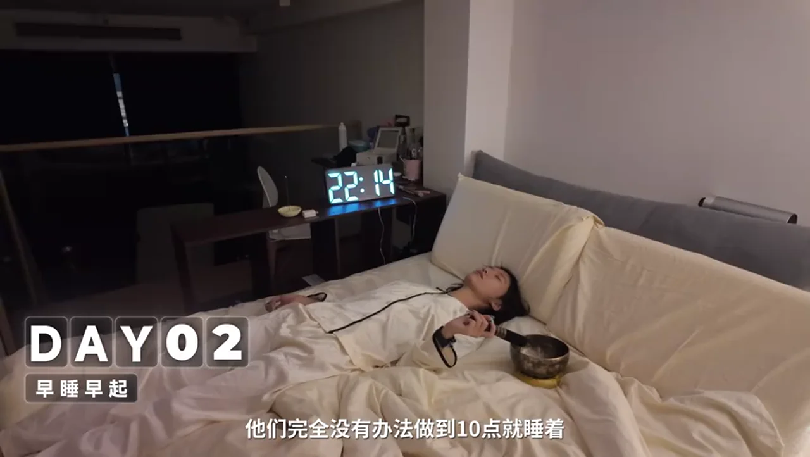
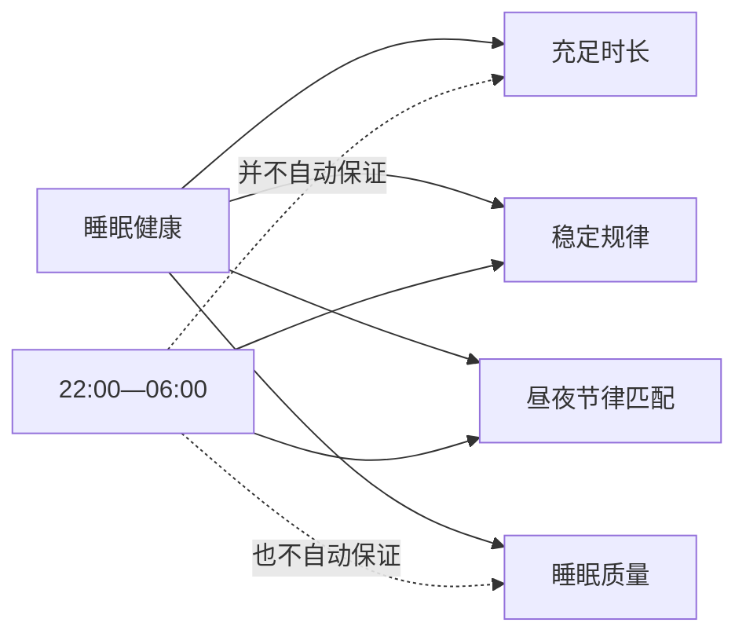
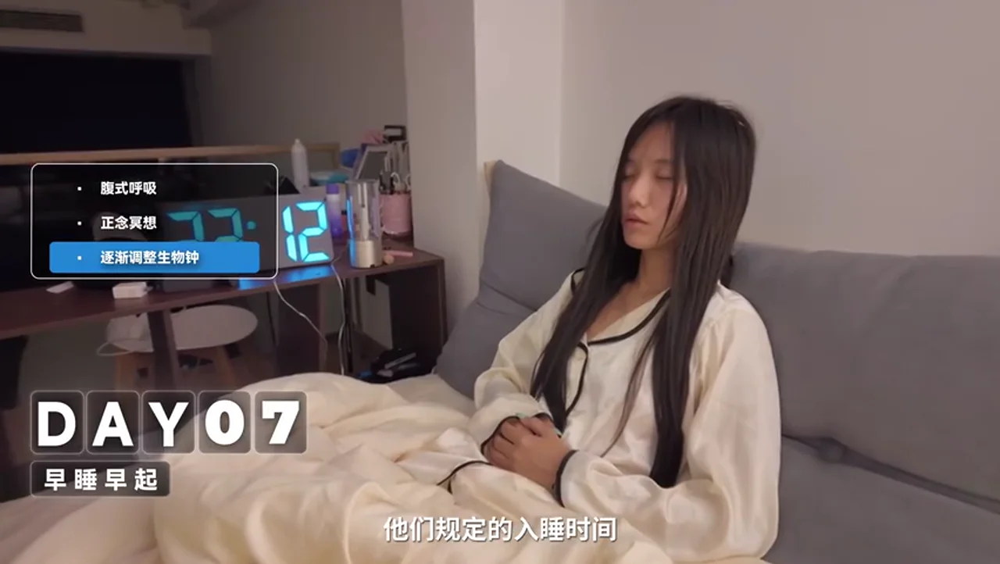
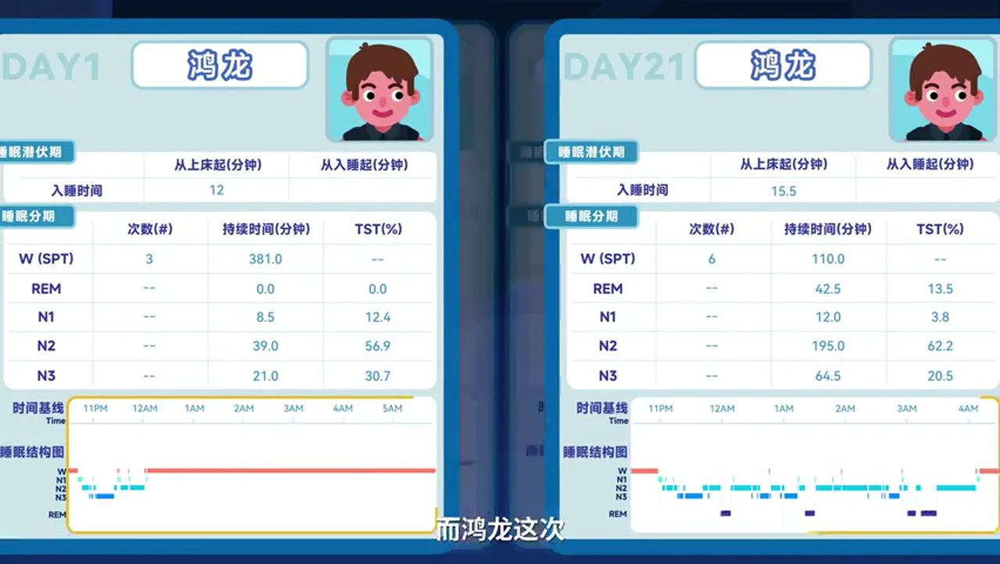
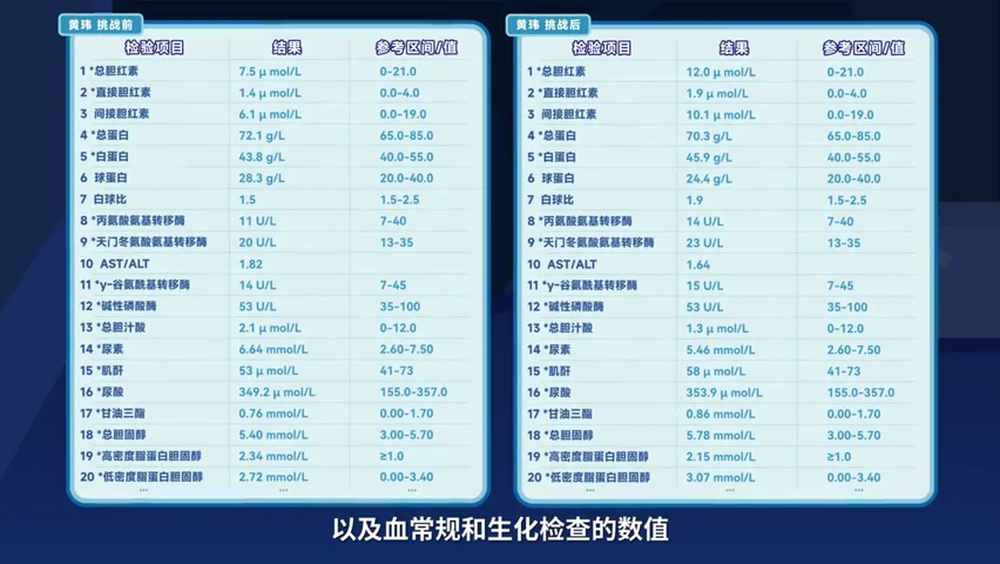
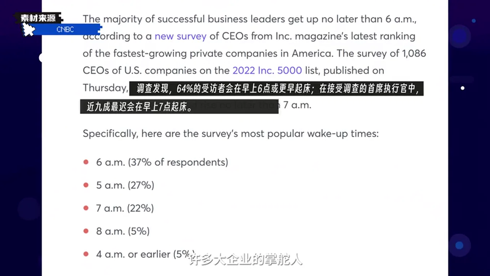
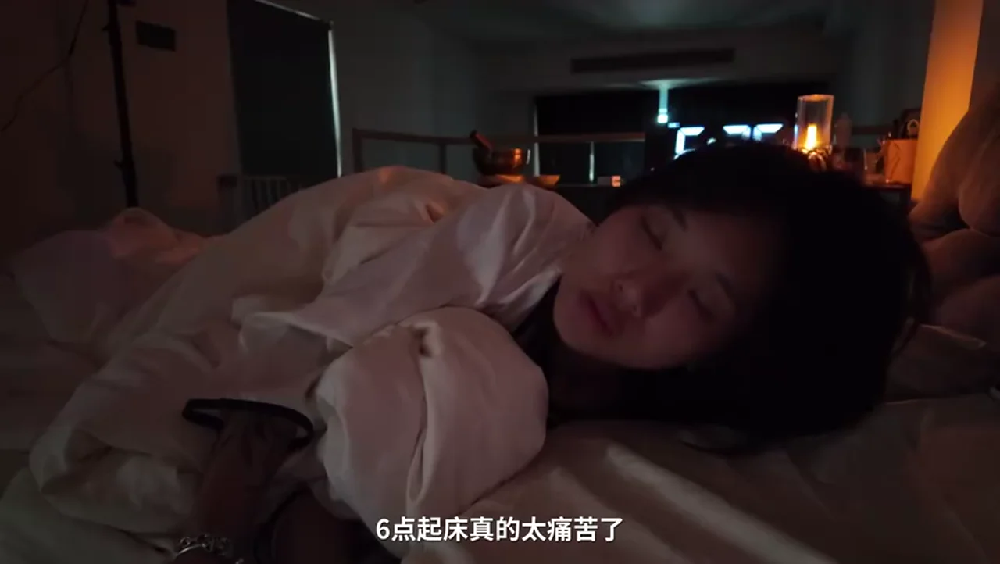
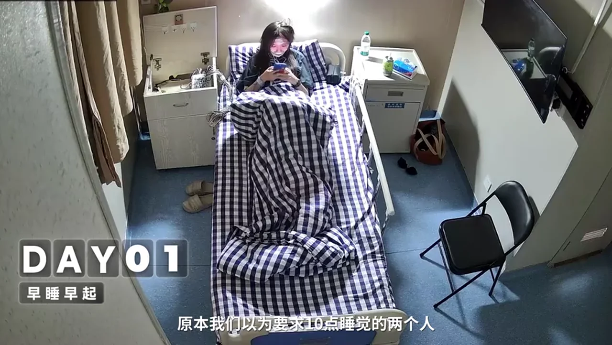
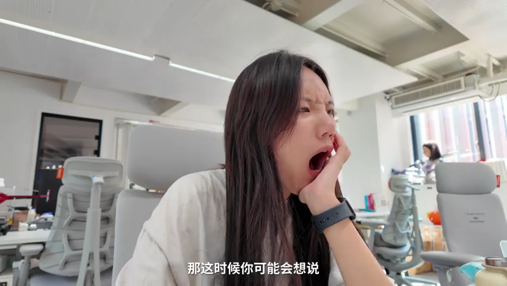
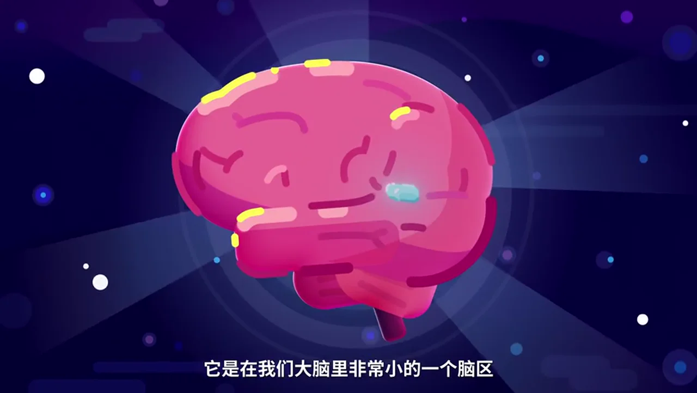

# 总结稿

## 一句话结论

这次 21 天挑战显示：两名长期晚睡者在经历明显的适应困难后，主观精神状态和部分睡眠监测表现有所改善；但它不能证明“晚上十点睡、早上六点起”本身会让人变健康。更合理的理解是，他们同时改变了睡眠时长、作息规律、光照时机、睡前行为和失眠应对方式，结果只能作为个案观察。

## 挑战做了什么

视频安排三名参与者：鸿龙和黄伟尝试固定在 22:00 上床、06:00 起床；欧欧不限定钟点，只要求每天睡够约 8 小时。前两人原本长期熬夜，刚开始即使早早上床也难以入睡，夜间醒来后无法再睡，第二天反而更疲惫。这个阶段最重要的发现不是“早起有害”，而是上床时间不等于实际入睡时间，生物节律也不能靠一晚强行切换。

随后，两人没有只靠意志硬撑，而是逐步提前入睡时间，并尝试视频所介绍的 CBT-I 相关做法，例如睡不着时离床、困了再回来，以及减少卧床清醒和睡前玩手机。到第二、三周，他们自述白天更清醒、注意力更集中，手表评分和夜间观察也出现改善趋势。

## 21 天显示了什么

鸿龙和黄伟的结果包括：重复 Stroop 测试成绩提高、主观疲劳减轻、部分睡眠结构与入睡表现改善，以及一次性血液检查中若干指标发生变化。欧欧虽然睡眠评分较高，但作息继续后移，白天清醒期也明显后移，并在需要白天工作时感到精力不足。这个对照提示：睡够时长很重要，但规律性、睡眠与社会活动时间是否匹配、醒后能否接触日光，也可能影响白天状态。

## 它不能说明什么

这不是随机对照试验：只有三人，基线差异很大，干预条件不一致，而且多项变量同时改变。Stroop 测试重复进行会有训练效应；手表评分不等同于临床诊断；前后各一次的睡眠监测和化验可能受首夜效应、饮食、活动、压力、采样时点及自然波动影响。因此，不能把任何改善单独归因于“十点睡六点起”，更不能据此认定所有人都应采用同一固定钟点。

## 更稳妥的实践

优先保证适合自己的充足睡眠，并让起床时间尽量稳定；若要提前作息，应渐进调整，醒后接触日光，睡前减少强光和刺激活动。不要因为名人早起就把早起等同于成功或健康，也不要自行长期服用褪黑素。若入睡困难、夜间觉醒或白天功能受损持续存在，应寻求医生或睡眠专业人员评估；慢性失眠可询问规范的 CBT-I，而不是只靠“硬睡”。

# 辅助理解

## 怎样读懂这次挑战

视频的价值不在于给出万能钟点，而在于区分四个维度：

- **睡眠时长**：实际睡了多久，是否满足个人需要。
- **规律性**：每天入睡和起床时间是否大幅漂移。
- **昼夜节律匹配**：睡眠窗口是否与个人生物节律、晨间光照和白天任务相协调。
- **固定钟点**：“22:00—06:00”只是其中一种安排，不是健康睡眠的定义。

两名早睡早起组参与者原本长期凌晨入睡，第一周直接把上床时间推到十点，结果是躺着清醒、半夜醒来和白天疲惫。“按时上床”不会让生物钟立刻改变，也不保证八小时有效睡眠。另一人虽睡够约八小时，但作息不断后移；当白天必须工作时，充足时长仍未解决时间错配。

*第2天22:14的画面：参与者已上床但尚未入睡，说明强行提前作息存在适应期；单帧不能判断失眠病因。*

## 为什么后半程看起来变好了

后续变化不只有“钟点提前”。参与者渐进调整作息，尝试腹式呼吸、正念、减少睡前手机，以及睡不着就离床、困了再回床。固定起床、光照、睡前活动和卧床行为一起变化，无法分辨哪一项起作用。

*第7天的入睡准备：视频列出腹式呼吸、正念冥想与渐进调整生物钟等策略；画面本身不证明疗效。*

到第 21 天，两人自述更清醒、专注。鸿龙的 DAY1 与 DAY21 对照中，第二次出现 REM，N2、N3 绝对时长增加；但这只是一人的两个夜晚，首夜效应、当日压力、咖啡因和活动都可能影响结果。

*鸿龙DAY1与DAY21睡眠结构对照（画面值）：第二次出现REM及更完整的睡眠阶段，但个体两夜对照不足以证明普遍因果。*

## 为什么不能得出因果结论

这是一项三人、21 天、非随机的内容实验。三人基线不同：两人长期熬夜且固定钟点，另一人解除上班约束、只保证时长。没有同质对照组、盲法或足够重复测量，多种条件又同时变化，无法把结果归因到“十点睡”或“六点起”。

重复 Stroop 测试存在训练效应；一次性化验还会受饮食、运动、压力、采样时间和自然波动影响，且各指标并非一致向“更健康”方向移动。视频医生也提醒：只能参考，不能建立直接联系。

*挑战前后生化指标对照（画面值）：各项目变化方向不一，且为个体前后测，不能据此判定健康改善或归因于早睡早起。*

这个个案最多提示：对长期晚睡、作息混乱且白天有固定任务的人，逐步建立充足、规律且与白天活动匹配的睡眠，可能伴随状态改善。它不支持“人人十点睡六点起都会更健康”，也不支持“早起造成成功”。

*视频引用的CEO起床时间调查：样本中64%在6点或更早起床；这是特定人群的描述性关联，不能推导早起会带来成功。*

## 可操作但非个体化的建议

1. 先保证适合自己的充足睡眠，再谈钟点；多数成年人通常至少约 7 小时，但个体有差异。
2. 稳定起床时间，周末勿大幅推迟；提前作息应小步渐进。
3. 起床后接触自然光，夜间减少强光、手机刺激和过晚的咖啡因；这不意味着必须六点起。
4. 睡不着时避免长期卧床焦虑。刺激控制只是 CBT-I 的一部分，完整治疗宜由专业人员指导。
5. 不凭短视频、手表或单次化验自诊，也不自行长期服褪黑素。失眠、夜醒或白天功能受损若持续，应就医或寻求睡眠专科评估。

## 外部事实核验

核验日期：**2026-07-28**。共 9 项；其中 2 项确认、5 项部分确认、2 项未核实。未核实意味着目前没有足够来源支持该具体说法，不能把它当成已证实事实。

1. **[01:02｜确认]** 多导睡眠监测记录多种生理信号，标准分期包括 N1、N2、N3 和 REM。来源：[NHLBI](https://www.nhlbi.nih.gov/health/sleep/stages-of-sleep)、[NCBI](https://www.ncbi.nlm.nih.gov/books/NBK563147/)。
2. **[03:25｜部分确认]** 八小时对多数成年人合理，但不是统一门槛；还要看质量、规律与个体需要。来源：[CDC 概览](https://www.cdc.gov/sleep/about/index.html)、[CDC 成人数据](https://www.cdc.gov/sleep/data-research/facts-stats/adults-sleep-facts-and-stats.html)。
3. **[04:48｜部分确认]** 褪黑素参与昼夜节律，短期补充或适用于部分节律问题；慢性失眠疗效与长期安全资料有限，“必然造成受体脱敏”证据不足。来源：[NCCIH 褪黑素](https://www.nccih.nih.gov/health/melatonin-what-you-need-to-know/)、[NCCIH 睡眠障碍](https://www.nccih.nih.gov/health/sleep-disorders-and-complementary-health-approaches)。
4. **[05:39｜确认]** CBT-I 是慢性失眠首选治疗之一；离床、困了再回床属于刺激控制，但不等同于完整 CBT-I。来源：[NHLBI](https://www.nhlbi.nih.gov/health/insomnia/treatment)、[ACP](https://www.acponline.org/acp-newsroom/acp-recommends-cognitive-behavioral-therapy-as-initial-treatment-forchronic-insomnia)。
5. **[08:15｜部分确认]** 晨间光照可调整睡眠—觉醒及褪黑素节律；视频所述其他激素时序未完整确认。来源：[NHLBI 治疗](https://www.nhlbi.nih.gov/health/circadian-rhythm-disorders/treatment)、[NHLBI 周期](https://www.nhlbi.nih.gov/health/sleep/sleep-wake-cycle)。
6. **[08:29｜未核实]** 无法唯一识别视频所称“2025 年论文”，因此不能确认其证明早睡早起者白天专注度更高；即使存在观察性关联，也不能推出因果。**无可用来源。**
7. **[09:25｜未核实]** 三人前后检测无法证明 21 天作息改变使睾酮、性激素、血常规或生化指标改善；视频医生也称只能参考、不能建立直接联系。**无可用来源。**
8. **[11:00｜部分确认]** 缺觉后可能出现深睡反弹，但深睡增加不能诊断“病理性补偿”，称生理性恢复反弹更准确。来源：[PMC 研究](https://pmc.ncbi.nlm.nih.gov/articles/PMC12500159/)、[PubMed 研究](https://pubmed.ncbi.nlm.nih.gov/12217973/)。
9. **[11:07｜部分确认]** 规律作息有依据，但没有适用于所有人的“午夜十二点”医学分界；周末补觉也不能完全抵消长期缺觉。来源：[NHLBI](https://www.nhlbi.nih.gov/health/sleep-deprivation/healthy-sleep-habits)、[NIH](https://www.nih.gov/news-events/nih-research-matters/weekend-catch-cant-counter-chronic-sleep-deprivation)。

以上核验只覆盖会影响健康决策的重要客观断言，不构成个人医疗建议。

# Data

## 增强转写稿

[00:00] 平常你几点睡、几点起？
[00:01] 我们之前做过一个熬夜的节目。
[00:02] 但我们再想挑战一下：
[00:04] 如果我们两位经常熬夜的同事，
[00:06] 现在变成晚上十点睡，
[00:08] 早上六点起，
[00:09] 持续二十一天，
[00:10] 他们会发生什么？
[00:11] 我们来试试吧。
[00:12] 二十一天后见。
[00:14] [听不清]
[00:15] 今晚十点，
[00:16] 一定要睡着。
[00:17] 六点起床真的太痛苦了。
[00:19] 我的大脑非常地兴奋，
[00:21] 它在里面蹦迪。
[00:22] 可能因为太早起了，
[00:24] 情绪太爱波动了。
[00:25] 好感动。
[00:27] 我觉得我脑子里面完全是空的，
[00:29] 整个人非常晕。
[00:30] 五点四十三。
[00:31] 我居然自然醒了。
[00:32] 我感觉我的生物钟彻底乱了。
[00:36] 众所周知，早睡早起是公认的好习惯。
[00:39] 于是我们公司的编导洪龙，
[00:40] 还有我们公司的 HR 黄伟，
[00:42] 主动参与了这次挑战。
[00:43] 因为他俩几乎每晚都会熬到一两点，
[00:46] 已经持续了有十年左右的时间。
[00:49] 距离他们上一次十点睡、六点起，
[00:51] 真的已经想不起来了。
[00:52] 作息晚了，他们身上也有着各种各样的小毛病。
[00:55] 那通过二十一天的早睡早起，
[00:57] 真的能变得更健康吗？
[00:59] 于是在挑战开始的第一天，
[01:00] 他们先去到了杭州市第七人民医院，
[01:02] 做这个叫作多导睡眠监测的检查。
[01:05] 那通过多根导线，
[01:06] 可以采集到身体不同部位的电活动，
[01:09] 评估出这个晚上的睡眠状态。
[01:11] 而在第一个晚上，
[01:12] 原本我们以为要求十点睡觉的两个人，
[01:14] 会难以入眠。
[01:16] 结果你看，
[01:16] 他们居然在十二点之前就睡着了。
[01:27] 现在是晚上的两点五十二。
[01:30] 我自从十点钟，
[01:31] 在这里睡几个小时觉之后，
[01:32] 我就莫名其妙醒了。
[01:34] 四点，四点四分。
[01:36] 我刚做了一个巨恐怖的噩梦，
[01:39] 直接吓醒了。
[01:41] 巨恐怖。
[01:42] 看来突然改变作息并不是那么容易的。
[01:44] 他们中途醒来之后，
[01:46] 就再也没有睡着。
[01:47] 你可以从这一晚的睡眠报告中看到，
[01:49] 他们睡得有多糟糕。
[01:50] 那这里的 N1、N2、N3、REM 又是什么意思呢？
[01:54] 那它们其实是代表睡眠的四个分期。
[01:57] 在每个分期里面，
[01:58] 大脑都在进行不同项目的维护。
[02:00] 那只睡了一个多小时的洪龙，
[02:02] 甚至连快速眼动期都没有。
[02:04] 同时两个人的深度睡眠时间，
[02:06] 也都非常地短。
[02:07] 所以他们醒来之后反而觉得更加疲惫。
[02:10] 你看他们脸上的表情，
[02:11] 显然不是神采奕奕的。
[02:13] 那我相信你也应该体验过这种睡了一觉，
[02:16] 但是感觉没有睡的痛苦。
[02:17] 那在这时候，
[02:18] 他们两个人都做了一个很有趣的测试，
[02:20] 叫作 Stroop 测试。
[02:22] 那这个测试需要你用最快的速度，
[02:23] 读出这个字的颜色。
[02:25] 比如这个字，你应该读“蓝”。
[02:28] 等一下，读什么？
[02:29] 读它的颜色。
[02:30] 读它的颜色，还不是它的字，好吗？
[02:32] OK，OK。
[02:32] 它颜色不是它的字。
[02:33] 好，好的。
[02:34] 现在有点困，
[02:36] 感觉我的成绩会很烂。
[02:38] 蓝，红。
[02:41] 白，黄，绿，紫，蓝。
[02:45] 你有没有发现，
[02:46] 你需要非常认真才能读对它？
[02:48] 这个测试可以看出你的专注程度。
[02:50] 你自己也可以试一下。
[02:51] 那昨晚缺少深度睡眠的两个人，
[02:53] 整个认知系统都处于混沌的状态。
[02:56] 第一次的成绩，
[02:57] 可以说是非常糟糕。
[02:58] 那这时候你可能会想说：
[03:00] 这早睡早起也太折磨人了，对吧？
[03:02] 那如果说我就是晚点睡，
[03:04] 但是我能睡够八个小时，
[03:05] 是不是也能算是健康的？
[03:07] 于是我们公司的欧欧自告奋勇，
[03:09] 也加入了实验。
[03:10] 他可以说是我们公司，
[03:11] 睡眠规律最混乱的人。
[03:13] 如果不是要上班，
[03:14] 他可以凌晨三四点，
[03:16] 还躺在床上玩手机。
[03:17] 但是他的睡眠质量评分呢，
[03:19] 又是出奇地好，睡得很香。
[03:21] 那在接下来二十一天的时间内，
[03:23] 欧欧将完全解除上班时间的约束，
[03:25] 只要他保证每天八小时的充足睡眠。
[03:28] 那接下来，
[03:29] 这三个人的身体，
[03:30] 会发生什么变化呢？
[03:32] 而洪龙和黄伟现在面临的最大困难就是，
[03:34] 他们完全没有办法做到十点就睡着。
[03:37] 现在是晚上的十一点零四分。
[03:39] 我在床上已经尝试入睡，
[03:41] 尝试了一个小时。
[03:42] 我的大脑非常地兴奋，
[03:44] 它在里面蹦迪。
[03:51] 如果不是夜视相机拍到这个画面，
[03:52] 我相信你也会觉得这是 AI。
[03:54] 但这是真的。
[03:55] 凌晨两点好不容易睡着的洪龙，
[03:58] 竟然会梦游开始玩手机。
[04:00] 这正是调整睡眠时间之前，
[04:02] 他每晚刷手机的点。
[04:04] 那很明显，早睡早起组，
[04:05] 并没有朝着我们想象的方向去发展，
[04:08] 也没有变得更好。
[04:09] 晚上难以入睡，
[04:10] 早上六点又强行起床。
[04:12] 通过每天佩戴的手表也监测到，
[04:14] 他们这几天的睡眠质量评分，
[04:16] 也都偏低。
[04:17] 睡眠不足让他们白天的精神状态，
[04:19] 变得更糟糕。
[04:20] 而欧欧每晚玩手机起码到三点才睡，
[04:23] 中午去上班的他，
[04:24] 直到晚上精神都还非常地兴奋。
[04:27] 所以现在对于早睡早起组来说，
[04:29] 最重要的是不失眠，
[04:30] 睡上一个安稳的觉。
[04:32] 终于在第五天，
[04:33] 这完全调整不过来作息的洪龙，
[04:35] 决定靠褪黑素来强行入睡。
[04:38] 现在是半夜两点钟。
[04:39] 自从中途醒来之后，
[04:40] 我就在床上又躺了一个多小时，
[04:42] 我还是没有睡着。
[04:43] 我不知道褪黑素是不是真的有效，
[04:45] 但是我得尝试一下。
[04:48] 那问题就来了：吃褪黑素辅助睡眠，这靠谱吗？
[04:51] 于是我们咨询了杭州市第七人民医院，
[04:53] 睡眠障碍科的刘主任。
[04:55] 我们首先要了解到褪黑素的一些产生，
[04:57] 它是在我们大脑里非常小的一个脑区，
[05:00] 我们叫松果体，
[05:01] 它来产生和分泌的。
[05:02] 它其实是在告诉我们天黑了，
[05:04] 我们该进入一个睡眠状态了。
[05:06] 什么样的人群使用褪黑素？
[05:08] 或者是一个倒时差的，
[05:09] 光线、光源的一些紊乱了以后，
[05:11] 他会出现这种褪黑素分泌的不足。
[05:13] 那么还有一类人群就是老年人。
[05:15] 但是其实我们现在门诊大部分的失眠，
[05:18] 因为过度觉醒，
[05:20] 诱发了一些失眠，
[05:21] 而不是真正的褪黑素缺乏的人群。
[05:23] 但是如果你觉得褪黑素对你有用，
[05:25] 那你确实可以吃，
[05:27] 但真的不建议长期吃。
[05:28] 长期服用可能会导致受体脱敏等各种问题。
[05:31] 如果需要的话，
[05:32] 咨询一下医生，
[05:34] 是个更好的选择。
[05:35] 那到底怎么样可以治疗失眠呢？
[05:38] 其实褪黑素不是最好的。
[05:39] 首先我们肯定是介绍 CBT-I，
[05:41] 也就是我们讲的失眠认知行为治疗。
[05:44] CBT-I 是一种被许多权威医疗学会，
[05:47] 推荐作为慢性失眠障碍治疗首选的方案。
[05:50] 那在接下来的一个星期，
[05:51] 早睡早起组开始亲身试验。
[05:53] 你需要的话，
[05:54] 也可以学起来。
[05:55] 那第一步就是把生物钟慢慢调整到早睡早起的状态，
[05:59] 而不是像头几天那样暴力执行。
[06:01] 所以接下来几天，
[06:02] 他们规定的入睡时间，
[06:04] 将从十二点慢慢地调整到十点。
[06:06] 治失眠真的不是学会如何入睡，
[06:09] 而是重新找回不需要努力，
[06:11] 就可以入睡的能力。
[06:12] 现在是晚上的十二点多。
[06:15] 虽然我睡前做了 CBT-I 那些腹式呼吸，
[06:18] 但是我的大脑它好像还没有想睡觉的意思。
[06:22] 那现在该怎么办呢？
[06:23] 没事的，不要硬睡。
[06:24] 你需要立刻爬起来离开卧室，
[06:26] 去别的房间做一些无聊的事，
[06:28] 看书、拉伸，
[06:30] 并且千万不要玩手机。
[06:32] 直到你困了再回到床上，
[06:33] 建立起上床就等于睡觉的关键联系。
[06:36] 因此醒了之后，
[06:37] 也要立即起床，
[06:38] 不能赖床。
[06:39] 那在尝试 CBT-I 的训练之后，
[06:42] 第十天的早上，
[06:43] 黄伟居然已经能够在六点前自然醒了。
[06:46] 现在才五点四十三。
[06:49] 我居然自然就醒了。
[06:50] 现在我真的很困，
[06:51] 我感觉我现在还是可以睡回去，
[06:53] 但是我这个能醒，
[06:54] 这个已经……
[06:56] 而在第二周，没有入睡时间限制的欧欧睡得越来越晚。
[07:00] 因为现在已经早上的这个五点四十几了，
[07:02] 但我现在仍然在[听不清]当中。
[07:05] 尽管欧欧这么晚睡，
[07:06] 但他的睡眠评分依旧高达九十二分。
[07:09] 那早睡早起的两人的睡眠评分有变化吗？
[07:11] 你可以看到这分数都有上升的趋势，
[07:14] 同时深度睡眠的时间也得到了增加。
[07:17] 通过夜间的监控，更是能明显看到具体的变化。
[07:20] 我们数了一下洪龙一周前后翻身次数的变化，
[07:23] 第二天晚上他翻滚了二十五次，
[07:26] 到了第十天只有十一次了。
[07:28] 睡眠质量的提升，
[07:29] 也让他们的白天不再那么迷糊。
[07:32] 而过往很多报道中也提到，
[07:33] 许多大企业的掌舵人或者顶尖的运动员，
[07:36] 都在早睡早起。
[07:37] 比如苹果的 CEO Tim Cook，
[07:39] 每天早上四、五点起。
[07:41] 所以这早睡早起，
[07:42] 是让人成功的秘诀之一吗？
[07:44] 那我们先来看看晚睡晚起十四天的欧欧，
[07:47] 现在状态怎么样了。
[07:49] 现在是下午的四点二十二分了。
[07:54] 我也不知道为什么自己一觉就可以睡到这个点，
[07:57] 整个人感觉就是非常地空虚，
[08:00] 还觉得自己脑子的思考也变慢了。
[08:03] 我刚刚前面在说话，都不知道自己哪一句接哪一句。
[08:06] 我相信你能感受到第二周的欧欧醒来之后，
[08:08] 他的状态非常地迷糊，他的生物钟已经开始紊乱，
[08:12] 直到半夜才恢复活力。
[08:13] 出现这个问题的重要原因之一就是，
[08:15] 欧欧错过了苏醒之后最重要的自然光。
[08:18] 因为阳光能让你的大脑接受到现在是白天的信号，
[08:21] 接着，使你犯困的褪黑素就会停止分泌，
[08:24] 去甲肾上腺素和皮质醇水平逐渐提高，
[08:26] 于是人开始变得精神起来。
[08:29] 在 2025 年这篇论文中提到，
[08:30] 早睡早起的人群在白天的专注度高于晚睡晚起的人群。
[08:35] 所以对于企业高管和运动员来说，
[08:37] 早睡早起能让他们在白天变得更加清醒，
[08:39] 做出关键的决策。
[08:41] 这可能是他们选择这样做的原因之一。
[08:44] Good morning.
[08:45] 好，那新的一次专注测试，
[08:47] 我们已经早睡早起十几天了，
[08:50] 我们现在拿出我们全部的实力。
[08:51] 没问题。
[08:52] 蓝，黄，紫，绿，白。
[08:56] 十五秒三七。
[08:58] 史诗级进步。
[09:00] 那到了第三周，
[09:01] 早睡早起的两个人不仅专注力测试成绩，
[09:03] 比第一次有了很大的提升，
[09:05] 他们身体的状态和精神状态，
[09:07] 也改变了很多。
[09:09] 我觉得我现在眼睛也没有前几天，
[09:11] 所以一起来我就会肿，
[09:12] 有点干、涩、痛，没有了。
[09:15] 我能感觉到我真的长脑子了。
[09:16] 就是从一开始可能觉得很困、浑浑沌沌的，
[09:20] 到现在我能够就是很专注去干自己的事情，
[09:23] 这个茅塞顿开的感觉。
[09:25] 在熬夜四十八小时节目中，
[09:27] 我们曾经提到过长期熬夜会影响睾酮水平。
[09:30] 那早睡早起对睾酮的提升会有帮助吗？
[09:33] 于是我们公司的洪龙也做了检查。
[09:35] 检测结果就是洪龙的睾酮确实有所上升，
[09:38] 而且据他本人所说，
[09:40] 早上也确实更有活力了。
[09:42] 而我们公司的黄伟原本失衡的性激素六项，
[09:45] 也有恢复正常的趋势，
[09:46] 以及血常规和生化检查的数值也有一些变化。
[09:50] 但是医生也说，这干扰项真的太多了，
[09:52] 这些数值只能作为参考，
[09:55] 不能说有直接的联系。
[09:56] 但是他们两个人体感上，
[09:58] 确实说有非常明显的变化。
[10:00] 而到了第三周，这混乱睡眠的欧欧出差之后，
[10:03] 面对白天密集的工作，明显显得力不从心了。
[10:07] 跟大家测试一下最新的这个游戏。
[10:10] 好累，好累啊。
[10:12] 我才这个动了三个小时，
[10:14] 浑身就已经酸透了，
[10:16] 然后眼睛已经想闭上了。
[10:18] 我感觉这个精力真的有点变得特别特别地低。
[10:22] 哇塞，在医院的最后一晚了。
[10:24] 我们二十一天终于要结束了。
[10:27] 我们最后一天。
[10:28] 没错。
[10:29] 虽然我们又戴上了这个。
[10:31] 是的，但是我有预感，
[10:32] 我今天能够睡得很好，
[10:33] 因为现在已经开始困了。
[10:35] 现在你肯定很好奇，
[10:36] 这规律的早睡早起生活，
[10:38] 到底对身体产生了什么实质性变化。
[10:40] 能确认的一点就是，
[10:42] 他们的睡眠质量得到了很大的提升。
[10:44] 相比挑战开始时的难以入睡，
[10:46] 这次黄伟只花了四分钟，
[10:48] 就睡着了。
[10:49] 同时他的深度睡眠时间，
[10:50] 增加了二十六分钟。
[10:52] 而洪龙这次也拥有了完整的多个睡眠周期。
[10:55] 反观欧欧的睡眠监测，
[10:56] 入睡困难是必然的事。
[10:58] 虽然这次睡眠分期之中，
[11:00] 深度睡眠时间很长，
[11:01] 然而这并不一定是一件好事，
[11:03] 说明平时睡眠不充分的大脑，
[11:05] 在这一晚出现了生理性的补偿。
[11:07] 但我们不建议大家，
[11:09] 超过十二点钟以后去睡觉。
[11:11] 在夜间的时候，
[11:12] 我们其实涉及到，
[11:13] 体内很多激素的一些分泌，
[11:15] 比如说我们的促甲状腺素，
[11:17] 我们的生长激素，
[11:20] 我们女性的一些泌乳素等等。
[11:23] 我们尽量要规律我们的生物节律，
[11:26] 那这个是非常重要的。
[11:27] 好了，
[11:28] 这就是本期节目的全部内容。
[11:29] 最后非常感谢杭州市第七人民医院，
[11:31] 对我们的支持和帮助。
[11:32] 也希望这个视频让你有所收获。
[11:34] 祝你每天睡一个好觉，
[11:35] 有良好的生物钟，
[11:36] 精力百倍。
[11:37] 如果你喜欢这个视频的话，
[11:38] 也可以给我们点个赞，
[11:39] 分享给你的家人们、
[11:40] 朋友们看一看，
[11:41] 应该会对他们有帮助。
[11:43] 那么下次再来点不一样。
[11:45] 其实很多现代人说，
[11:46] 我周一到周五，
[11:47] 我也是正常的生物钟，
[11:48] 为什么我还出现问题？
[11:49] 但现在年轻人群其实有一个叫，
[11:52] 节假日和周末的时候，
[11:54] 他会报复性地补觉。
[11:55] 我们可以比平时的时间，
[11:57] 延长一到两个小时，
[11:58] 而不是说睡到下午的四点、五点再起床。
[12:01] 那这样的话，会导致下一周的生物钟又出现有点乱。

## 原始转写稿

[00:00] 平常你几点睡几点起
[00:01] 我们之前做过一个熬夜的节目
[00:02] 但我们再想挑战一下
[00:04] 如果我们两位经常熬夜的同事
[00:06] 现在变成晚上十点睡
[00:08] 早上六点起
[00:09] 持续二十一天
[00:10] 他们会发生什么
[00:11] 我们来试试吧
[00:12] 二十一天后见
[00:14] 请看睡吧
[00:15] 今晚十点
[00:16] 一定要睡着
[00:17] 六点起床真的太痛苦了
[00:19] 我的大脑非常的兴奋
[00:21] 它在里面蹦低
[00:22] 可能因为太早起了
[00:24] 情绪太爱博多了
[00:25] 好感动
[00:27] 我觉得我脑子里面完全是空的
[00:29] 整个人非常晃
[00:30] 五点四三
[00:31] 我居然自然醒了
[00:32] 我感觉我的圣物中心条断
[00:36] 众所周知早睡早起是工人的好习惯
[00:39] 于是我们公司的编导洪龙
[00:40] 还有我们公司的HR黄尾
[00:42] 主动参与了这次挑战
[00:43] 因为它俩几乎每晚都会熬到一两点
[00:46] 已经持续了有十年左右的时间
[00:49] 距离它们上一次十点睡六点起
[00:51] 真的已经想不起来了
[00:52] 作息换了它们身上也有着各种各样的小毛病
[00:55] 那通过二十一天的早睡早起
[00:57] 真的能变得更健康吗
[00:59] 于是在挑战开始的第一天
[01:00] 他们先去到了杭州市第七人民医院
[01:02] 做这个叫做多岛睡眠监测的检查
[01:05] 那通过多根岛线
[01:06] 可以采集到身体不同部位的电活动
[01:09] 评估出这个晚上的睡眠状态
[01:11] 而在第一个晚上
[01:12] 原本我们以为要求十点睡觉的两个人
[01:14] 会难以入眠
[01:16] 结果你看
[01:16] 他们居然在十二点之前就睡着了
[01:27] 现在是晚上的两点五十二
[01:30] 我自从十点钟
[01:31] 在这里睡几个小时觉之后
[01:32] 我就莫名其妙醒了
[01:34] 四点四点四分
[01:36] 我刚做了一个居恐怖的噩梦
[01:39] 直接下醒了
[01:41] 居恐怖
[01:42] 看来突然改变作息并不是那么容易的
[01:44] 他们中途醒来之后
[01:46] 就再也没有睡着
[01:47] 你可以从这一晚的睡眠报告中看到
[01:49] 他们睡的有多糟糕
[01:50] 那这里的N1 N2 N3 R1 M又是什么意思呢
[01:54] 那他们其实是代表睡眠的四个分期
[01:57] 在每个分期里面
[01:58] 大脑坐在进行不同项目的维护
[02:00] 那只睡了一个多小时的红龙
[02:02] 甚至连快速眼动期都没有
[02:04] 同时两个人的深度睡眠时间
[02:06] 也都非常的短
[02:07] 所以他们醒来之后反而觉得更加的疲惫
[02:10] 你看他们脸上的表情
[02:11] 显然不是神采意义的
[02:13] 那我相信你也应该体验过这种睡了一觉
[02:16] 但是感觉没有睡得痛苦
[02:17] 那在这时候
[02:18] 他们两个人都做了一个很有趣的测试
[02:20] 叫做Stroop测试
[02:22] 那这个测试需要你用最快的速度
[02:23] 读出这个字的颜色
[02:25] 比如这个字 你应该读 蓝
[02:28] 等一下 读什么
[02:29] 读它的颜色
[02:30] 读它的颜色还不是它的字好吗
[02:32] OK OK
[02:32] 它颜色不是它的字
[02:33] 好 好的
[02:34] 现在有点困
[02:36] 感觉我的成绩会很烂
[02:38] 蓝 红
[02:41] 白 黄 绿 紫 蓝
[02:45] 你有沒有发现
[02:46] 你需要非常认真才能读对它
[02:48] 这个测试可以看出你的专注程度
[02:50] 你自己也可以试一下
[02:51] 那昨晚缺少深度睡眠的两个人
[02:53] 整个认知系统都处于混沌的状态
[02:56] 第一次的成绩
[02:57] 可以说是非常糟糕
[02:58] 那这时候你可能会想说
[03:00] 这早睡早起也太折磨人了 对吧
[03:02] 那如果说我就是晚点睡
[03:04] 但是我能睡过8个小时
[03:05] 是不是也能算是健康的
[03:07] 于是我们公司的O自告奋勇
[03:09] 也加入了实验
[03:10] 它可以说是我们公司
[03:11] 睡眠规律最后来的人
[03:13] 如果不是要上班
[03:14] 它可以凌晨三四点
[03:16] 还躺在床上玩手机
[03:17] 但是它的睡眠质量平分呢
[03:19] 又是初期的好 睡得很香
[03:21] 那在接下来21天的时间内
[03:23] 欧将完全解除上班时间的约定
[03:25] 只要它保证每天8小时的充足睡眠
[03:28] 那接下来
[03:29] 两子人的身体
[03:30] 会发生什么变化呢
[03:32] 而洪龙和黄伟现在面临的最大困难就是
[03:34] 他们完全没有办法做到10点就睡着
[03:37] 现在是晚上的11点04分
[03:39] 我在床上已经尝试入睡
[03:41] 尝试了一个小时
[03:42] 我的大脑非常的兴奋
[03:44] 它在里面蹦低
[03:51] 如果不是夜视相机拍到这个画面
[03:52] 我相信你也会觉得这是AI
[03:54] 但这是真的
[03:55] 凌晨2点好不容易睡着的洪龙
[03:58] 竟然会梦游开始玩手机
[04:00] 这正是调整睡眠时间之前
[04:02] 它每晚刷手机的点
[04:04] 那很明显早睡早起组
[04:05] 并没有朝着我们想象的方向去发展
[04:08] 也没有变得更好
[04:09] 晚上难以入睡
[04:10] 早上6点又强行起床
[04:12] 通过每天佩戴的手表也签测到
[04:14] 他们这几天的睡眠质量平分
[04:16] 也都偏低
[04:17] 睡眠不足让他们白天的精神状态
[04:19] 变得更糟糕
[04:20] 而欧欧每晚玩手机起码到3点才睡
[04:23] 中午去上班的他
[04:24] 直到晚上精神都还非常的兴奋
[04:27] 所以现在对于早睡早起组来说
[04:29] 最重要的是不失眠
[04:30] 睡上一个安稳的觉
[04:32] 终于在第五天
[04:33] 这完全调整不过来做些的洪龙
[04:35] 决定靠退黑素来强行入睡
[04:38] 现在是半夜两点钟
[04:39] 自从冻库醒来之后
[04:40] 我觉得床上又躺了一个多小时
[04:42] 我还是没有睡着
[04:43] 我不知道退黑素是不是真的有效
[04:45] 但是我得尝试一下
[04:48] 那问题就来了吃退黑素辅助睡眠这靠谱嘛
[04:51] 于是我们咨询了杭州市第七人民医院
[04:53] 睡眠障碍科的刘主任
[04:55] 我们首先要了解到退黑素的一些产生
[04:57] 它是在我们大脑里非常小的一个脑区
[05:00] 我们叫松果体
[05:01] 它来产生和分泌的
[05:02] 它其实是在告诉我们天黑了
[05:04] 我们该进入一个睡眠状态了
[05:06] 要什么样的人群使用退黑素
[05:08] 和是一个导师插的
[05:09] 光线光源的一些稳乱了以后
[05:11] 它会出现这种退黑素分泌的不足
[05:13] 那么还有一队人群就是老年人
[05:15] 但是其实我们现在在门着大部分的失眠
[05:18] 因为过度觉醒
[05:20] 又发了一些失眠
[05:21] 而不是真正的退黑素缺乏的人群
[05:23] 但是如果你觉得退黑素对你有用
[05:25] 那你确实可以吃
[05:27] 但真的不建议长期吃
[05:28] 长期服用可能会导致受体脱民等各种问题
[05:31] 如果需要的话
[05:32] 咨询一下医生
[05:34] 是个更好的选择
[05:35] 那到底怎么样可以治疗失眠呢
[05:38] 今天退黑素不是最好的
[05:39] 首先我们肯定是介绍的CBTI
[05:41] 也就是我们讲的失眠认知行为治疗
[05:44] CBTI是一种被许多全国医疗学会
[05:47] 推荐作为慢性失眠障碍治疗的首选的方案
[05:50] 那在接下来的一个星期
[05:51] 早睡早起组开始亲身试验
[05:53] 你需要的话
[05:54] 也可以学起来
[05:55] 那第一步就是把生物中慢慢调整到早睡早起的状态
[05:59] 而不是像头几天那样暴力执行
[06:01] 所以接下来几天
[06:02] 它们规定的入睡时间
[06:04] 将从12点慢慢的调整到10点
[06:06] 至于失眠真的不是学会如何入睡
[06:09] 而是重新找回不需要努力
[06:11] 就可以入睡的能力
[06:12] 现在是晚上的12点多
[06:15] 虽然我睡前做的CBTI那些复事呼吸
[06:18] 但是我的大脑它好像还没有想睡觉的意思
[06:22] 那现在该怎么办呢
[06:23] 没事的 不要硬睡
[06:24] 你需要立刻爬起来离开卧室
[06:26] 去别的房间做一些无聊的事
[06:28] 看书拉伸
[06:30] 并且千万不要玩手机
[06:32] 直到你困了再回到床上
[06:33] 建立起上床就等于睡觉的关键联系
[06:36] 因此醒了之后
[06:37] 也要立即起床
[06:38] 不能来床
[06:39] 那在尝试CBTI的训练之后
[06:42] 第10天的早上
[06:43] 黄伟居然已经能够在6点前自然醒了
[06:46] 现在才5点43
[06:49] 我居然自然就醒了
[06:50] 现在我真的很困
[06:51] 我感觉我现在还是可以睡回去
[06:53] 但是我这个能醒
[06:54] 这个已经
[06:56] 而在第二周没有入睡时间限制的OO睡得越来越晚
[07:00] 因为现在已经早上的这个5点40几了
[07:02] 但我现在仍然在世界背当中
[07:05] 尽管OO这么晚睡
[07:06] 但它的睡眠平分依旧高达92分
[07:09] 那早睡早起的两人的睡眠平分有变化吗
[07:11] 你可以看到这分数都有上升的趋势
[07:14] 同时深度睡眠的时间也得到了增加
[07:17] 通过夜间的监控更是能明显看到具体的变化
[07:20] 我们数了一下红龙一周前后翻身次数的变化
[07:23] 第二天晚上它翻滚了25次
[07:26] 到了第10天只有11次了
[07:28] 睡眠质量的提升
[07:29] 也让它们的白天不再那么离步
[07:32] 而过往很多报道中也提到
[07:33] 许多大企业的掌舵人或者顶尖的运动员
[07:36] 都在早睡早起
[07:37] 比如苹果的CEO Tim Cook
[07:39] 每天早上4-5点起
[07:41] 所以这早睡早起
[07:42] 是让人成功的秘诀之一吗
[07:44] 那我们先来看看晚睡晚起14天的OO
[07:47] 现在状态怎么样了
[07:49] 现在是下午的4点22分了
[07:54] 我也不知道为什么自己一觉就可以睡到这个点
[07:57] 整个人感觉就是非常的空虚
[08:00] 还觉得自己脑子的思考也变慢了
[08:03] 我刚刚前面在说话都不知道自己哪一句接哪一句
[08:06] 我相信你能感受到第二周的OO醒来之后
[08:08] 它的状态非常的迷惑 它的生物中已经开始纹乱
[08:12] 直到半夜才恢复活力
[08:13] 出现这个问题的重要原因之一就是
[08:15] OO错过了苏醒之后最重要的自然光
[08:18] 因为阳光能让你的大脑接受到现在是白天的信号
[08:21] 接着使你犯困的退黑素就会停止分泌
[08:24] 去甲身上现素和皮质纯水瓶逐渐提高
[08:26] 于是你人开始变得精神起来
[08:29] 在2025年这篇论文中提到
[08:30] 早睡早起的人群在白天的专注度高于晚睡晚起的人群
[08:35] 所以对于企业高管和运动员来说
[08:37] 早睡早起能让他们在白天变得更加清醒
[08:39] 做出关键的决策
[08:41] 这可能是他们选择这样做的原因之一
[08:44] Good morning
[08:45] 好 那新的一次专注设施
[08:47] 我们已经早睡早起十几天了
[08:50] 我们现在拿出我们全部的实力
[08:51] 没问题
[08:52] 蓝 黄 紫 绿 白
[08:56] 15秒37
[08:58] 史诗集进步
[09:00] 那到了第三周
[09:01] 早睡早起的两个人不仅专注力测试成绩
[09:03] 比第一次有了很大的提升
[09:05] 他们身体的状态和精神状态
[09:07] 也改变了很多
[09:09] 我觉得我现在眼睛也没有前几天
[09:11] 所以一起来我就会腫
[09:12] 有点肝 色 痛 没有了
[09:15] 我能感觉到我真的长脑子了
[09:16] 就是从一开始可能觉得很困 混混顿顿的
[09:20] 到现在我能够就是很专注去干自己的事情
[09:23] 这个毛色顿开的感觉
[09:25] 在熬夜48小时节目中
[09:27] 我们曾经提到过长期熬夜会影响稿筒水平
[09:30] 那早睡早起对稿筒的提升会有帮助吗
[09:33] 于是我们公司的红龙也做了检查
[09:35] 检测结果就是红龙的稿筒确实有所上升
[09:38] 而且据他本人所说
[09:40] 早上也确实更有活力了
[09:42] 而我们公司的黄尾原本施行的性激素六项
[09:45] 也有恢复正常的趋势
[09:46] 以及血肠规和生化检查的数值也有一些变化
[09:50] 但是医生也说这干扰项真的太多了
[09:52] 这些数值只能作为参考
[09:55] 不能说有直接的联系
[09:56] 但是他们两个人体感之上
[09:58] 确实说有非常明显的变化
[10:00] 而到了第三周这混乱睡眠的O出差之后
[10:03] 面对白天秘籍的工作明显显得离不从心了
[10:07] 跟大会测试一下最新的这个游戏
[10:10] 好累好累啊
[10:12] 我才这个动了三个小时
[10:14] 浑身就已经酸透了
[10:16] 然后眼睛已经想闭上了
[10:18] 我感觉这个经历真的有点变得特别特别的低
[10:22] 挖晒在医院的最后一晚了
[10:24] 我们21天终于要结束了
[10:27] 我们最后一天
[10:28] 没错
[10:29] 虽然我们又带上了这个
[10:31] 是的 但是我有预感
[10:32] 我今天能够睡得很好
[10:33] 因为现在已经开始困了
[10:35] 现在你肯定很好奇
[10:36] 这规律的早睡早起生活
[10:38] 到底对身体产生了什么实质性变化
[10:40] 能确认的一点就是
[10:42] 他们的睡眠质量得到了很大的提升
[10:44] 相比挑战开始时的难以入睡
[10:46] 这次黄尾只花了四分钟
[10:48] 就睡着了
[10:49] 同时他的深度睡眠时间
[10:50] 增加了26分钟
[10:52] 而红龙这次也拥有了完整的多个睡眠周期
[10:55] 反观欧欧的睡眠监测
[10:56] 入睡困难是必然的事
[10:58] 虽然这次睡眠分期之中
[11:00] 深度睡眠时间很长
[11:01] 然而这并不一定是一件好事
[11:03] 说明平时睡眠不充分的大脑
[11:05] 在这一晚出现了病理性的补偿
[11:07] 但我们不建议大家
[11:09] 超过12点钟以后去睡觉
[11:11] 在夜间的时候
[11:12] 我们其实设计到
[11:13] 体内很多技术的一些分明
[11:15] 比如说我们的粗假装性素
[11:17] 我们的生长发育技术
[11:20] 我们女性的一些秘乳素等等
[11:23] 我们尽量要规律我们的生物是结率
[11:26] 那这个是非常重要的
[11:27] 好了
[11:28] 这就是本期节目的全部内容
[11:29] 最后非常感谢杭州市的亲人秘医院
[11:31] 对我们的支持和帮助
[11:32] 也希望这个视频让你有所收获
[11:34] 祝你每天睡一个好觉
[11:35] 有良好的生物中
[11:36] 经历百倍
[11:37] 如果你喜欢这个视频的话
[11:38] 也可以给我们点个赞
[11:39] 分享给你的家人们
[11:40] 朋友们看一看
[11:41] 应该会对他们有帮助
[11:43] 那么下次再来点不一样
[11:45] 其实很多现代人说
[11:46] 我周一到周五
[11:47] 我也是政治的生物中
[11:48] 为什么我还出现问题
[11:49] 但现在年轻人群其实有一个叫
[11:52] 结假日和周末的时候
[11:54] 它会报复性的补教
[11:55] 我们可以比平时的时间
[11:57] 延长一到两个小时
[11:58] 而不是说睡到下午的四点五点在起床
[12:01] 那这样的话会导致下一周的生命中又出现了点乱

## 原始关键帧

### 关键帧 1

### 关键帧 2

### 关键帧 3

### 关键帧 4

### 关键帧 5

### 关键帧 6

### 关键帧 7

### 关键帧 8

### 关键帧 9

### 关键帧 10

