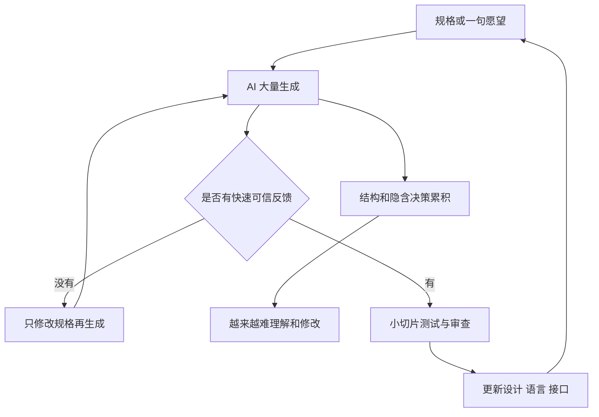
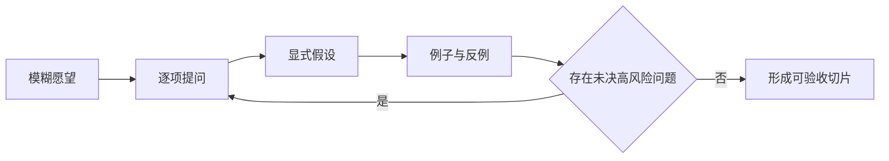
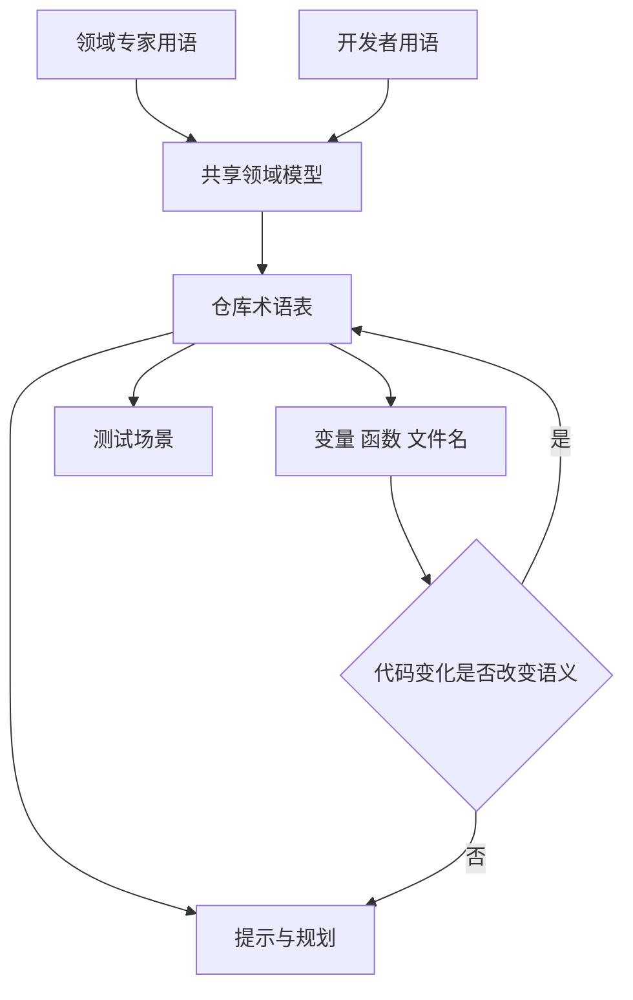
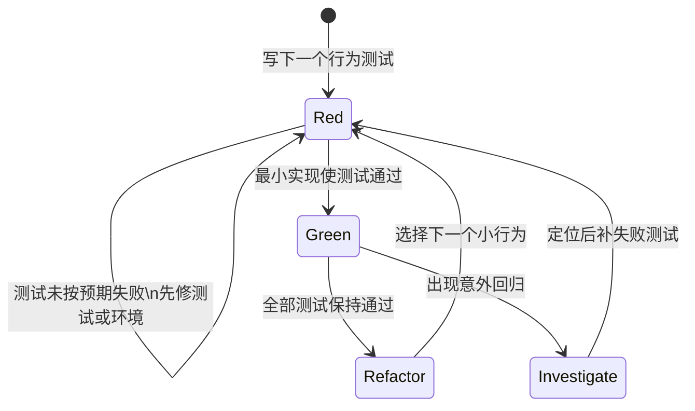
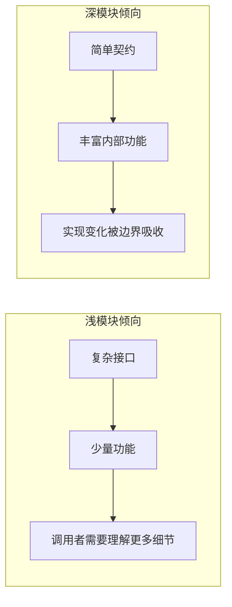
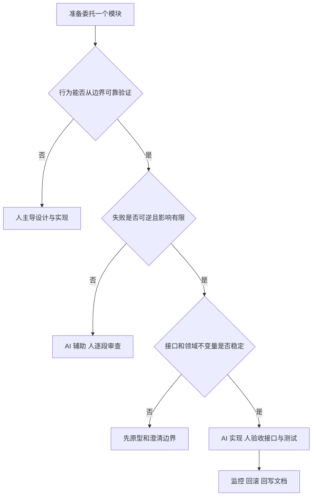

# 总结稿

[打开单页 HTML 总结](assets/bilibili-BV1ysjP68E82-summary.html)

## 一句话结论

Matt Pocock 的核心主张是：**AI 把写代码变快以后，软件基础能力不是贬值，而是从“亲手敲每一行”转移到需求对齐、共享语言、反馈循环、模块边界和持续设计。** 这套方法把 AI 当作执行者、把人放在设计与验收位置；它有经典软件工程概念支撑，但“会让 AI 更准确、更省 Token、更高质量”主要仍是讲者的实践建议，不是对所有模型、团队和代码库都成立的普遍实证。

## 从失败循环到五个控制点

演讲从一个反复出现的失败模型开始：写规格 → 生成代码 → 修改规格 → 全量重生成，代码反而越来越差（`[01:37–01:53]`）。这来自讲者的亲身体验，不是一条已测量的普遍规律。真正值得带走的是它暴露的五个失控点：

| 失控点 | 讲者的处理办法 | 需要保留的边界 |
|---|---|---|
| AI 没做出你想要的东西 | 先用 `/grill-me` 追问需求，形成 shared design concept | 提问数量不是质量指标；需要停止条件 |
| 人和 AI 不在说同一种语言 | 建立 Ubiquitous Language / 术语表 | DDD 不规定必须是 Markdown；文档可能漂移 |
| 代码写完才发现跑不起来 | 类型、浏览器、自动化测试和 TDD | 测试只覆盖写下的行为；错误测试也会误导模型 |
| 代码库变成零散浅模块 | 重组为深模块，以简单接口隐藏复杂实现 | 深模块不是“大文件”；边界仍需按职责设计 |
| 代码产量超过人的认知能力 | 人设计接口、AI 实现内部，并从外部验收 | 高风险模块不能只看黑盒测试；责任不能委托 |

## 1. 先对齐“要造什么”，再谈实现

`[04:38]` 起，讲者把需求偏差解释为开发者与 AI 没有形成共同设计概念。他提出 `/grill-me`：让 AI 不断追问设计树上的分支和决策依赖，直到双方形成 shared understanding（`[05:36]`）。

这个方法最有价值的地方，不是“让 AI 问 40、60 或 100 个问题”，而是把隐含假设显式化：用户是谁、成功标准是什么、哪些边界不可改变、异常如何处理、决策之间有什么依赖。仓库确实存在，也包含相关技能；截至 2026-08-21，GitHub 页面显示约 1.94 万 Star，但无法仅凭当前页面复原演讲时“1.3 万 Star”的精确历史值。[mattpocock/skills](https://github.com/mattpocock/skills)

一个可控的需求访谈至少要有三种停止条件：

1. 关键术语已经定义，歧义有明确归属；
2. 验收示例与反例足以区分“做对”和“看起来做了”；
3. 剩余未知被记录为待验证假设，而不是继续无限提问。

## 2. Ubiquitous Language：经典 DDD 概念，Markdown 是具体实现

`[07:48]` 引用的是 Eric Evans 在 DDD 中的 Ubiquitous Language：开发者、领域专家和代码表达应围绕同一领域模型使用共享语言。[Eric Evans 的 DDD Reference](https://www.domainlanguage.com/ddd/reference/)是原书定义的授权摘要。

讲者把这个概念适配到编码智能体：扫描代码库、抽取术语、生成 Markdown 表格，并在规划与讨论时持续打开它（`[08:14–08:55]`）。要区分两层：

- **经典概念**：语言来自开发者与领域专家持续协作，并反过来塑造模型和代码。
- **AI 实践建议**：把术语落进仓库文档，为智能体提供紧凑上下文。

后者并非 DDD 的格式要求，也不会自动保持正确。每当接口、业务规则或命名改变，术语表都需要审查；否则它会从“共享语言”变成高可信度的过期文档。

## 3. 反馈速度决定安全推进速度

在 `[09:34]`，讲者提出静态类型、浏览器访问与自动化测试等反馈回路；在 `[10:40]` 进一步建议 TDD：先写失败测试，让实现通过，再重构。TDD 的短循环是经典做法：Kent Beck 的说明明确包含一次写一个测试、观察失败、实现通过、重构并重复。[Kent Beck：TDD is Kanban for Code](https://newsletter.kentbeck.com/p/tdd-is-kanban-for-code)

但“采用 TDD 就会迫使任意大模型写出更好的代码”没有被这些经典资料证明。对 AI 工作流，测试至少要回答：

- 失败是否真的来自目标行为，而不是环境、fixture 或脆弱选择器？
- 实现是否只对当前样例过拟合？
- 是否有独立的类型检查、静态分析、端到端测试或人工复核？
- 反馈延迟是否足够短，让模型不会一次改动过大？

因此，小步迭代的核心不是仪式化地循环 Red–Green–Refactor，而是**每一步都有快速、可信、可定位的反馈**。

## 4. 深模块：人守住接口，AI 扩展实现

John Ousterhout 把复杂度定义为系统结构中使其难以理解和修改的因素；其 Stanford 讲义与视频引用一致。[复杂度讲义](https://web.stanford.edu/~ouster/cgi-bin/cs190-winter19/lecture.php?topic=intro) 深模块则用相对简单的接口提供较多功能，浅模块的接口成本相对功能过高。[模块化设计讲义](https://web.stanford.edu/~ouster/cgi-bin/cs190-winter18/lecture.php%3Ftopic%3DmodularDesign)（`[12:03]`）

讲者把这一原则转成 AI 分工：开发者设计和保护模块接口，把部分内部实现委托给 AI，再从外部测试（`[15:39]`）。这个策略成立需要几个前提：

1. 接口确实表达了领域不变量，而不仅是函数签名；
2. 模块内部错误不会绕过边界造成不可逆损失；
3. 测试覆盖关键行为、失败模式与跨模块契约；
4. 日志、可观察性和回滚路径足够；
5. 安全、金融、隐私等高风险实现仍接受深入审查。

视频自己也在 `[15:11]` 限定：金融等核心模块不能简单当作无需查看的内部实现。于是“设计接口、委托实现”不是放弃读代码，而是按风险分配审查深度。

## 5. 持续设计，而不是一次性规格

`[16:08]` 引用 Kent Beck 的“Invest in the design of the system every day”。Pearson 确认《Extreme Programming Explained》第二版作者为 Kent Beck 与 Cynthia Andres；Matt Pocock 的仓库也明确标注了这一出处。[Pearson 书目](https://www.pearson.com/en-us/subject-catalog/p/extreme-programming-explained-embrace-change/P200000000118/9780321278654)

这句话修正了两种极端：

- 不是先写一份完美规格，然后让 AI 永远照着生成；
- 也不是完全不设计，只靠连续提示和返工前进。

更稳妥的循环是：对齐目标 → 实现最小切片 → 获取反馈 → 更新语言与边界 → 重构 → 再继续。设计与代码同时演进，规格、术语表、接口和测试都要进入变更审查。

## 经典概念与 AI 适配不要混在一起

| 经典来源 | 可核验的概念 | 讲者的 AI 适配 | 不能直接声称 |
|---|---|---|---|
| Ousterhout | 复杂度、深/浅模块、简单接口 | 让 AI 实现模块内部 | AI 在深模块中必然更高效 |
| Eric Evans / DDD | Ubiquitous Language、共享领域模型 | 仓库 Markdown 术语表 | 一份自动生成表格就是完整 DDD |
| Kent Beck / TDD | 小测试循环、实现、重构、反馈 | 用测试约束编码智能体 | TDD 必然提高任意模型质量 |
| Kent Beck / XP | 每天投资系统设计 | PRD 中明确模块与接口变化 | 只写 PRD 就完成持续设计 |
| Brooks | 团队设计与设计决策关系 | `/grill-me` 沿设计树访谈 | 问题越多，共识越可靠 |

## 观众讨论：反例比赞同更有价值

观众把争论推进到三个现实问题：

- 如果产品短期能用，是否还要在乎代码难看？这需要把“产品好”拆为缺陷、安全、可观察性、变更成本和接手难度。
- 如果搭建流程太复杂，是否不如自己写？应把需求访谈、文档维护、测试和审查开销计入总成本。
- 能否让 AI 持续记录功能、接口、调用关系和变更原因？这是值得实验的项目记忆方案，但必须测量文档漂移与审查负担。

另有评论自述某农业碳汇项目用 schema/配置驱动约 800 张业务表，并声称一周上线、零 bug。它是未经独立核验的单项目自述，不能当作方法有效性的证据。

样本仅为 16 条顶层热门评论候选，平台报告/接口可见 40 条，且没有嵌套回复；当前可访问弹幕为 0/平台报告 1 条。0 条不代表历史上没有弹幕，也无法推断总体情绪。

## 可直接采用的最小工作流

1. **对齐**：写清目标、非目标、用户、例子、反例和停止条件。
2. **建语言**：把领域术语、同义词、禁用词和不变量放进可审查文档。
3. **切小步**：只实现一个可独立验收的行为切片。
4. **先反馈**：准备失败测试、类型检查、运行环境和可观察性。
5. **守接口**：人决定模块职责、契约和风险边界；AI 可实现低风险内部。
6. **独立验收**：不要只让生成代码的同一上下文宣布成功。
7. **回写设计**：通过后同步规格、术语、接口、测试和决策记录。

最重要的不是照抄五个技巧，而是把 AI 从“不可控的整库重生成器”变成**受需求、语言、反馈和边界约束的执行环节**。

# 辅助理解

## 如何理解这场演讲

这场演讲并不是要求开发者回到“拒绝 AI、所有代码手写”的时代，而是主张把 AI 放进一个经典的软件工程控制系统。代码生成速度上升后，系统最稀缺的部分变成：**意图是否明确、语言是否一致、反馈是否可信、模块边界是否简单、风险是否被人承担。**

frame 2 的 “Specs → Code → Worse Code” 是讲者对失败循环的抽象，不是缺陷率统计。它真正指出的是：如果每轮只改自然语言规格、却不检查结构与反馈，生成速度可能把错误方向放大。

## 1. 需求对齐不是无限提问

`/grill-me` 把 AI 从立刻执行者变成访谈者：沿设计树追问每个分支与依赖，直到形成 shared understanding。

可以把访谈问题分成五组：

| 组别 | 关键问题 | 停止信号 |
|---|---|---|
| 目标 | 谁获得什么结果？ | 成功可以观察 |
| 边界 | 明确不做什么？ | 非目标已经列出 |
| 术语 | 同一个词是否有不同含义？ | 每个核心词有示例 |
| 异常 | 失败、权限、空数据怎么办？ | 关键反例有处理方式 |
| 验收 | 如何知道真的完成？ | 可执行或可复核的标准 |

问题数量本身没有意义。若 AI 只是制造更多措辞，或用户对关键选择没有信息，继续问 100 个问题也不会自动得到好设计。未决问题应记录为假设或研究任务。

## 2. 共享语言连接需求、代码和测试

Eric Evans 的 Ubiquitous Language 要求领域专家与开发者围绕同一领域模型持续使用共同语言。[DDD Reference](https://www.domainlanguage.com/ddd/reference/) 视频把它应用到编码智能体：把术语写入仓库，让提示、代码命名和讨论共享词汇。

Markdown 只是一个可版本控制的载体，不是 DDD 定义。最危险的失败模式是术语表已经过期，但因为它写得很正式，模型把错误语义当成高可信上下文。术语文档应与接口和业务规则一起审查。

## 3. TDD 的价值在反馈，不在仪式

Kent Beck 描述的 TDD 是一次处理一个测试：先失败，再修改逻辑使其通过，清理复杂度，然后继续。[原始说明](https://newsletter.kentbeck.com/p/tdd-is-kanban-for-code)

对 AI 来说，TDD 提供了动作边界和可观察信号，但不能保证测试正确。应把反馈分成多层：

- 类型/静态分析：发现结构性不一致；
- 单元与契约测试：验证局部行为和边界；
- 端到端测试：验证真实组合路径；
- 浏览器、日志和指标：观察运行状态；
- 人工审查：检查未被测试表达的安全、可维护性和意图。

“反馈速度是速度上限”不等于越快越好；错误而快速的反馈会让模型更快过拟合。

## 4. 深模块不是更大的文件

Ousterhout 的深模块强调**接口相对简单、提供的功能相对丰富、实现决策被隐藏**。[Stanford 模块化设计讲义](https://web.stanford.edu/~ouster/cgi-bin/cs190-winter18/lecture.php%3Ftopic%3DmodularDesign)

深度不是代码行数。一个巨大的 God object 可能接口和依赖都非常复杂，仍然是糟糕的抽象。判断模块是否适合委托给 AI，应检查：

1. 接口是否小而稳定；
2. 不变量是否能从外部测试；
3. 内部失败是否被隔离；
4. 调用者是否不需要知道实现细节；
5. 模块是否有清楚的日志和回滚路径。

## 5. “设计接口，委托实现”是风险分配

这句口号不是一刀切的角色规则。可以按风险和可验证性选择自治程度：

金融、安全、权限、隐私、不可逆数据迁移等模块，即使接口测试通过，也可能需要深入实现审计。低风险、易回滚、可重复验证的模块才更适合较高自治。

## 6. 把五个技巧串成可控流程

这套流程的控制变量包括：单次改动大小、反馈延迟、测试可信度、模块耦合、任务风险和文档漂移。要验证它是否适合自己的团队，应做同类任务的对照记录，而不是只凭一次顺利演示。

## 7. 用观众反例设计实验

观众提出“流程这么复杂，不如自己写”和“产品能用，为什么在乎代码”的反例。可以把它们变成一个两周实验：

1. 选两个规模相近、风险较低的功能；
2. 一个用原有工作流，一个使用需求访谈、术语表、TDD 和接口边界；
3. 记录设置时间、实现时间、返工、缺陷、Token、审查时间；
4. 一周后让另一位开发者修改需求，测量接手和变更成本；
5. 检查文档与代码是否漂移；
6. 再决定哪些环节保留、简化或自动化。

评论样本只有 16 条热门顶层候选，没有嵌套回复；弹幕抓取为 0/平台报告 1 条。它们适合提供反例和问题，不适合证明观众支持率或方法效果。尤其“一周上线、零 bug”的项目自述必须有缺陷定义、测试记录和维护周期才能评价。

## 最终判断

经典软件工程概念提供的是**控制复杂度的语言**；Matt Pocock 提供的是把这些概念接到编码智能体上的一套工作假设。最稳妥的采用方式不是相信口号，而是：保留每项建议的前提，用可审计反馈验证效果，并让人继续拥有目标、边界与责任。

## 外部事实核验

### 声明 1（02:26）

- 视频陈述：演讲引用 John Ousterhout 的《软件设计的哲学》，称复杂度是软件系统结构中一切使系统难以理解和修改的因素。
- 核验状态：已确认
- 核验结果：已确认。Ousterhout 本人的 Stanford CS 190 讲义给出了几乎相同的定义，并把降低表观复杂度列为软件设计的核心目标；其个人页面也确认了该书及第二版。视频随后把“坏代码”概括为复杂代码属于演讲者的简化，不是书中对所有坏代码的穷尽定义。
- 检索日期：2026-08-21
- 来源：
  - [John Ousterhout — CS 190 Introduction: Complexity](https://web.stanford.edu/~ouster/cgi-bin/cs190-winter19/lecture.php?topic=intro)（primary）
  - [John Ousterhout — Software Design Book](https://web.stanford.edu/~ouster/cgi-bin/book.php)（primary）

### 声明 2（03:01）

- 视频陈述：演讲称《程序员修炼之道》有一章讲软件熵，并用它解释局部修改会让代码库越来越混乱。
- 核验状态：部分确认
- 核验结果：书目与主题已确认：Pragmatic Bookshelf 的官方目录确有“Software Entropy”，并把对抗 software rot 列为本书内容。视频把它直接套到反复 AI 生成代码上是演讲者的应用性类比；官方目录不能证明所有局部修改或 spec-to-code 流程必然恶化。
- 检索日期：2026-08-21
- 来源：
  - [The Pragmatic Programmer, 20th Anniversary Edition — official title page and contents](https://pragprog.com/titles/tpp20/the-pragmatic-programmer-20th-anniversary-edition/)（primary）
  - [Matt Pocock skills repository — software entropy application to coding agents](https://github.com/mattpocock/skills#4-we-built-a-ball-of-mud)（primary）

### 声明 3（05:00）

- 视频陈述：演讲把 shared design concept 和 design tree/决策依赖归于 Frederick P. Brooks 的《The Design of Design》。
- 核验状态：部分确认
- 核验结果：作者、书名及该书讨论团队化复杂系统设计已经确认。Matt Pocock 当前的技能仓库也确实把 grilling 描述为沿 design tree 逐项解决依赖决策。不过可公开访问的出版社简介不足以逐字核对视频对“design concept”和“design tree”的具体释义，因此只做部分确认。
- 检索日期：2026-08-21
- 来源：
  - [Pearson — The Design of Design: Essays from a Computer Scientist](https://www.pearson.com/en-ca/subject-catalog/p/design-of-design-the-essays-from-a-computer-scientist/P200000008942)（primary）
  - [Matt Pocock skills repository](https://github.com/mattpocock/skills)（primary）

### 声明 4（05:54）

- 视频陈述：演讲者称存放该技巧的代码仓库已有 1.3 万 Star。
- 核验状态：部分确认
- 核验结果：仓库及 Grill me 技巧的存在已确认；截至 2026-08-21，GitHub 页面显示约 1.94 万 Star，说明该数字具有明显时效性。GitHub 当前页面不提供演讲时点的可审计 Star 历史，本次也未找到可靠历史快照直接证明“当时 1.3 万”，因此精确历史数字仍未核实。
- 检索日期：2026-08-21
- 来源：
  - [mattpocock/skills GitHub repository](https://github.com/mattpocock/skills)（primary）
  - [AI Engineer — Software Fundamentals Matter More Than Ever](https://www.youtube.com/watch?v=v4F1gFy-hqg)（primary）

### 声明 5（07:48）

- 视频陈述：演讲称 DDD 的通用语言让开发者沟通、代码表达和领域专家对话基于同一领域模型，并把自己的实现描述为 Markdown 术语表。
- 核验状态：部分确认
- 核验结果：核心 DDD 描述已确认。Eric Evans 的 DDD Reference 是原书定义的授权摘要；Matt Pocock 仓库也准确引用了共同领域模型的表述。需要限定：Ubiquitous Language 是协作语言与模型实践，并不规定必须是一个 Markdown 文件；Markdown 术语表是演讲者针对编码智能体的具体实现。
- 检索日期：2026-08-21
- 来源：
  - [Eric Evans — Domain-Driven Design Reference](https://www.domainlanguage.com/ddd/reference/)（primary）
  - [Matt Pocock skills repository — shared language](https://github.com/mattpocock/skills#2-the-agent-is-way-too-verbose)（primary）

### 声明 6（10:40）

- 视频陈述：演讲建议采用 TDD，让模型先写测试、使代码通过测试，再重构，以迫使模型小步迭代。
- 核验状态：部分确认
- 核验结果：TDD 流程本身已确认。Kent Beck 对 TDD 的说明明确采用一次写一个测试、失败、实现通过、重构、重复的循环；Martin Fowler 也把核心概括为 Red–Green–Refactor。但“TDD 会迫使任意大模型产出更好代码”是 Matt Pocock 的工程方法判断，不是这些经典资料验证过的普遍 LLM 实证结论。
- 检索日期：2026-08-21
- 来源：
  - [Kent Beck — TDD is Kanban for Code](https://newsletter.kentbeck.com/p/tdd-is-kanban-for-code)（primary）
  - [Matt Pocock skills repository — TDD skill rationale](https://github.com/mattpocock/skills#3-the-code-doesnt-work)（primary）
  - [Martin Fowler — Test Driven Development](https://martinfowler.com/bliki/TestDrivenDevelopment.html)（secondary）

### 声明 7（12:03）

- 视频陈述：演讲称代码库应使用深度模块：简单接口后隐藏大量功能；浅模块功能少而接口复杂。
- 核验状态：已确认
- 核验结果：已确认。Ousterhout 本人的 Stanford 模块化设计讲义明确把 deep class 定义为“小接口、大量功能”，把 shallow class 描述为复杂接口和/或功能很少，并强调接口应显著简单于实现。视频进一步声称 AI 在深度模块代码库中一定更容易检索和修改，属于演讲者的应用假设，并未由该经典资料证明。
- 检索日期：2026-08-21
- 来源：
  - [John Ousterhout — CS 190 Modular Design](https://web.stanford.edu/~ouster/cgi-bin/cs190-winter18/lecture.php%3Ftopic%3DmodularDesign)（primary）
  - [John Ousterhout — A Philosophy of Software Design, second-edition page](https://web.stanford.edu/~ouster/cgi-bin/book.php)（primary）

### 声明 8（16:08）

- 视频陈述：演讲把“每天都要为系统的设计投入精力”归于 Kent Beck。
- 核验状态：已确认
- 核验结果：已确认。Matt Pocock 的原始仓库明确把该句归于 Kent Beck 的《Extreme Programming Explained》；Pearson 确认第二版作者为 Kent Beck 与 Cynthia Andres，公开的第二版材料与长期文献引用也保留这句 incremental design 表述。它是 XP 的设计原则，不是“每日投入必然提高 AI 代码质量”的实证结论。
- 检索日期：2026-08-21
- 来源：
  - [Matt Pocock skills repository — Kent Beck attribution](https://github.com/mattpocock/skills#4-we-built-a-ball-of-mud)（primary）
  - [Pearson — Extreme Programming Explained, 2nd edition](https://www.pearson.com/en-us/subject-catalog/p/extreme-programming-explained-embrace-change/P200000000118/9780321278654)（primary）

### 声明 9（16:57）

- 视频陈述：演讲者说相关内容都在 GitHub 仓库 mattpocock/skills 里。
- 核验状态：已确认
- 核验结果：已确认。该公开仓库由 GitHub 账号 mattpocock 持有，README 自述为其日常使用的工程技能集合，并包含 Grill me、共享语言、TDD、代码库架构等与演讲对应的内容。仓库持续更新，因此当前目录、名称和安装方式不能自动代表演讲当天的快照。
- 检索日期：2026-08-21
- 来源：
  - [mattpocock/skills GitHub repository](https://github.com/mattpocock/skills)（primary）
  - [AI Engineer — original Matt Pocock talk](https://www.youtube.com/watch?v=v4F1gFy-hqg)（primary）

# Data

## 增强转写稿

[00:00] (音乐)
[00:14] 大家好
[00:14] 到目前为止
[00:15] 大会体验还不错吧
[00:16] Yes 是的
[00:17] 大家到现在都觉得这次大会不错吗
[00:19] 是的
[00:20] 好的 太棒了
[00:21] 我有一个想法想告诉大家
[00:23] 我希望这能让那些觉得自己的技能
[00:26] 在新时代已经毫无价值的人感到宽慰
[00:29] 那就是我认为软件基础能力
[00:32] 现在比以往任何时候都更加重要
[00:37] 我是一名讲师
[00:39] 最近我在筹备一门面向实战工程师的
[00:42] Claude Code 课程
[00:44] 名字挺有意思
[00:44] 也很有争议性
[00:46] 在筹备这门课的过程中
[00:48] 我必须设计一套关于AI编程的课程体系
[00:53] 这其实挺头疼的
[00:54] 因为相关领域一直在变化 对吧
[00:57] AI是一种全新的范式
[00:59] 大家肯定会觉得
[01:00] 我们得把所有旧规则都扔掉
[01:02] 才能接纳新的内容
[01:04] 围绕这种想法还兴起了一种风潮
[01:08] 就是需求转代码风潮
[01:11] 需求转代码的理念是
[01:13] 你可以先写好一份
[01:14] 关于应用应该如何运行的需求说明
[01:17] 然后你就可以用AI把它转换成代码
[01:19] 如果应用出了问题
[01:20] 你就回去改需求说明
[01:23] 你不用去看代码
[01:24] 只要修改需求就可以
[01:25] 再跑一遍生成流程就行
[01:27] 最后你就能得到新的代码
[01:29] 听过这种做法的 请举手
[01:32] 试过这种做法的 请继续举着手
[01:34] 好的 我也试过
[01:35] 大家可以把手放下来
[01:37] 我发现我用这个方法的时候
[01:39] 会尽量不去看生成的代码
[01:43] 但我还是会忍不住去看
[01:44] 然后发现
[01:45] 第一次生成代码跑一遍之后再重新生成
[01:47] 得到的代码质量反而更差
[01:49] 我再试一次 代码质量更差了
[01:51] 我就一直重复生成流程
[01:53] 到最后得到的完全就是垃圾代码
[01:57] 对吧 遇到过这种情况的 请举手
[01:59] 是的 我觉得这个方法行不通
[02:02] 有人觉得我们可以完全忽略代码
[02:04] 让代码自己管理自己的想法
[02:07] 说白了就是换了个说法的蛮干而已
[02:10] 我当时就不认可这种理念
[02:12] 我就想
[02:13] 我要怎么改进这个生成流程
[02:14] 怎么才能让它不会每次都生成烂代码
[02:16] 甚至是越来越差的代码
[02:18] 所以我就想
[02:19] 我得用自然语言给大语言模型解释清楚
[02:22] 好的代码库到底是什么样的
[02:24] 我翻出了我以前最喜欢的一本书
[02:26] 就是约翰·奥斯特豪特写的《软件设计的哲学》
[02:29] 大家可以去亚马逊买本看看
[02:32] 它在书里对坏代码给出了定义
[02:37] 好吧 坏代码叫做复杂代码
[02:38] 复杂度指的是软件系统结构中
[02:41] 所有会让系统难以理解和修改的特性 对吧
[02:45] 所以说坏的代码库就是难以修改的代码库
[02:48] 如果你修改代码库的时候必然会引入 bug
[02:51] 那这就是个坏的代码库
[02:52] 好的代码库修改起来很轻松
[02:55] 所以我当时就觉得这个定义太好了
[02:57] 我们再看看另一本书
[02:58] 我们来看看程序员修炼之道
[02:59] 大家也可以去亚马逊买一本
[03:01] 书里有一整章讲的是软件熵
[03:04] 这恰好就是我之前遇到的情况
[03:06] 上个概念是事物总是会趋向混乱
[03:10] 分崩离析 最终崩溃
[03:13] 这也恰好是大多数软件系统的运行规律
[03:16] 每次你修改代码库的时候
[03:18] 如果你只考虑当下的修改
[03:20] 不考虑整个系统的设计
[03:22] 你的代码库就会变得越来越差
[03:24] 这就是我当时遇到的情况
[03:26] 需求转代码理念里那种反复运行
[03:28] 生成流程的做法
[03:29] 只会产出越来越差的代码
[03:32] 现在有一种观点
[03:34] 某种程度上推动了需求转代码风潮
[03:37] 这是代码很廉价的观点
[03:38] 听过代码很廉价这句话的请举手
[03:41] 对的
[03:43] 但我觉得这个说法不对
[03:46] 我认为代码并不廉价
[03:47] 实际上现在坏代码的成本
[03:49] 比以往任何时候都要高
[03:51] 因为如果你的代码库难以修改
[03:54] 你就没法享受到AI能带来的所有好处
[03:57] 毕竟AI在好的代码库里的表现
[04:00] 其实非常出色
[04:03] 这就意味着好的代码库
[04:04] 比以往任何时候都更重要
[04:05] 也就意味着软件基础能力比以往任何时候都更重要
[04:08] 这就是我本次演讲的核心观点
[04:10] 那我们直接来讲实用的内容
[04:11] 我会给大家介绍
[04:12] 使用AI时可能已经遇到过
[04:14] 或者还没遇到的各种失败场景
[04:16] 以及只要去翻翻旧书
[04:18] 借鉴优秀的软件开发实践
[04:19] 就能避免这些问题的方法
[04:21] 听起来不错吧
[04:23] 第一个场景是AI做出来的东西
[04:25] 不符合我的预期
[04:27] 一动了
[04:27] 我脑子里明明有很清晰的想法
[04:29] 结果AI做出来的东西完全不一样
[04:31] 或者说它做出来的功能产出的东西
[04:33] 根本不是我想要的
[04:35] 遇到过这种情况的请举个手
[04:37] 好的 明白了
[04:38] 其实《程序员修炼之道》里就提到过
[04:41] 没人能完全清楚自己到底想要什么
[04:44] 你和AI之间存在沟通障碍 对吧
[04:49] 所以你和AI沟通的过程
[04:51] 其实就相当于AI在做需求设计
[04:53] 它本质上就是要从你这里弄清楚
[04:56] 你到底需要什么
[04:58] 我还想到另一本书
[05:00] Frederick P. Brooks 的《设计原本》
[05:03] 书里提到了一个叫做设计概念的理念
[05:07] 就是当不止一个人共同设计某个东西的时候
[05:10] 你们之间会形成一个共识性的想法
[05:12] 一个关于你们正在构建的产品的
[05:14] 稍纵即逝的共同认知
[05:16] 你正在构建的这个东西
[05:17] 或者说关于它的这个共识
[05:18] 就叫做设计概念
[05:19] 它不是实体资产
[05:20] 也不是你能写到 Markdown 文件里的内容
[05:22] 它是关于你正在构建的产品的
[05:24] 一种无形的共识性的底层逻辑
[05:26] 所以我当时就想原来是这么回事
[05:29] 问题就出在这里
[05:30] 我和AI没有达成共同的设计概念
[05:32] 所以我想出了一个技巧
[05:34] 这个技巧非常非常简单
[05:36] 叫做“Grill me”
[05:38] 用法是这样的
[05:39] 不停地向我提问
[05:41] 问清楚这个计划的每一个细节
[05:43] 直到我们达成共同的认知
[05:45] 梳理清楚设计树的每一个分支
[05:47] 这也是 Frederick P. Brooks 提出的另一个概念
[05:49] 注意理清不同决策之间的依赖关系
[05:52] 这个技巧我用来存放它的代码仓库
[05:54] 已经有一点三万星了
[05:55] 特别火
[05:56] 传播得很快
[05:57] 大家都很喜欢这个方法
[06:00] 就这么几句话
[06:02] 就能让AI问你四十个六十个问题
[06:05] 我见过它问了用户一百个问题才满意
[06:08] 直到双方达成了共同的认知
[06:10] 这相当于把AI变成了一个挑战者
[06:13] 它会不断向你抛出想法
[06:15] 确认努力和你达成共同认知
[06:19] 这样产生的对话内容
[06:21] 你可以直接整理成
[06:22] 产品需求 文档之类的材料
[06:26] 如果只是小改动
[06:27] 你也可以直接把它转成一个 issue
[06:32] 之后你的 AI 智能体就可以接手处理了
[06:34] 大家别干我
[06:36] 但我个人认为
[06:37] 这个方法比我用的
[06:39] Claude Code 里默认的计划模式更好用
[06:43] 计划模式太急于产出实体内容了
[06:47] 它一门心思就想快速做个计划
[06:49] 然后立刻开始干活
[06:51] 但我认为先达成共同的设计概念
[06:54] 你要好得多
[06:57] 这就是第一个技巧
[07:00] 第二个常见的失败问题
[07:01] 是 AI 的输出太过冗长
[07:04] 你和 AI 的沟通几乎就像是鸡同鸭讲
[07:06] 各说各话
[07:07] 有过这种感受的请举个手
[07:09] 如果你遇到过这种失败场景
[07:12] 对 就是说你
[07:13] 感觉就是AI为了说明自己在做什么
[07:14] 翻来覆去用了太多不必要的表述
[07:16] 你们俩完全没再用同一套语言沟通
[07:19] 我对这种情况实在是太熟悉了 对吧
[07:23] 如果你做开发已经有一段时间
[07:25] 还和领域专家合作开发过应用
[07:27] 肯定懂这种感受
[07:29] 举个例子
[07:30] 领域专家让你做一个和 widget 相关的功能
[07:32] 但你根本不知道 widget 是什么
[07:34] 这时候你就得先建立一套
[07:35] 双方都认可的共享语言 对吧
[07:37] 不然的话他们用的术语你听不懂
[07:39] 你照着写出来的代码可能连你自己都不理解
[07:42] 领域专家就更看不懂了
[07:44] 这样你和领域专家之间就出现了语言隔阂
[07:48] 于是我就想到了领域驱动设计
[07:51] 也就是 DDD
[07:54] 我现在还在摸索 DDD 的相关内容
[07:56] 但我看到的所有关于 DDD 的内容
[07:58] 都让我觉得特别受用
[08:00] 我太喜欢这个思路了
[08:01] DDD 有一个概念叫通用语言
[08:06] 有了通用语言
[08:07] 开发人员之间的沟通
[08:09] 代码里的表述
[08:10] 还有和领域专家的对话
[08:12] 全都基于同一个领域模型
[08:14] 它本质上就是一个markdown文件
[08:16] 里面列满了你和 AI 都认可的术语列表
[08:19] 你要重点确认这些术语
[08:21] 保证它们的定义和实际含义完全一致
[08:24] 不管是写代码
[08:25] 讨论代码
[08:26] 和领域专家沟通
[08:27] 还是我们现在要做的和AI沟通
[08:30] 都要全程使用这些术语
[08:32] 所以我做了一个功能工具
[08:33] 这个工具就是通用语言生成工具
[08:36] 它的功能很简单
[08:37] 就是扫描你的代码库
[08:39] 找出里面的术语然后生成一个 Markdown 文件
[08:42] 生成的通用语言
[08:44] markdown文件里
[08:45] 会用多个markdown表格
[08:46] 整理好所有的术语
[08:48] 之后我可以把这个文件传给AI
[08:51] 我自己也可以随时查看
[08:52] 我和AI沟通需求做规划的时候
[08:55] 都会一直开着这个文件
[08:56] 我看AI的思考过程发现
[08:58] 这套方法不光能提升规划的质量
[09:01] 还能让 AI 的思考不再那么冗长
[09:04] 最终产出的代码
[09:06] 也会更符合你最初的规划
[09:09] 所以这个方法效果非常好
[09:11] 好用到超出我的预期
[09:13] 这就是第二个技巧
[09:14] 在AI建立一套共享的沟通语言
[09:18] 好 那想想一想
[09:18] 你已经和AI对齐了思路
[09:20] 清楚自己要开发的是什么
[09:22] AI也确实写出了正确的功能代码
[09:25] 但代码就是跑不起来
[09:27] 遇到过这种情况的请举个手
[09:29] 对 就是毫无缘由地跑不起来
[09:31] 改善这个问题
[09:32] 有个很直接的方法
[09:34] 就是引入反馈循环
[09:36] 我们可以用静态类型
[09:37] 要是你现在开发还不用 TypeScript
[09:40] 那也太离谱了
[09:41] 还有 如果你在开发前端应用
[09:43] 却不给大语言模型开放浏览器权限
[09:45] 让它能实际查看页面状态
[09:47] 那这一步是必须补偿的
[09:49] 另外很明显
[09:50] 你还需要自动化测试
[09:53] 但我发现了一个问题
[09:55] 就算有这些反馈循环
[09:58] 大语言模型也没法很好的利用它们
[10:01] 它没法像资深开发者那样
[10:03] 充分发挥反馈循环的作用
[10:06] 所以它往往会一下子产出过多的代码
[10:09] 写完之后才后知后觉
[10:11] 哦 我好像应该做个类型检查
[10:15] 或者说
[10:16] 我是不是应该跑个测试看看
[10:17] 或者做点类似的检查
[10:18] 这种情况在程序员修炼之道里
[10:21] 被描述为开的比车灯远
[10:23] 本质就是开得太快了
[10:24] 因为反馈的速度就是你的速度上限
[10:30] 反馈速度就是你的速度上限
[10:32] 这意味着你应该边开发边测试
[10:34] 一步一步稳扎稳打的推进
[10:36] 而AI在默认情况下
[10:38] 是完全不擅长这种开发模式的
[10:40] 所以第三个核心技能是测试驱动开发
[10:42] 你应该采用测试驱动开发
[10:45] 因为测试驱动开发会迫使大语言模型
[10:48] 真正地小步迭代
[10:51] 你先边写测试
[10:52] 再让代码通过测试
[10:54] 之后再重构代码优化结构
[10:56] 同时思考整体设计
[10:59] 但问题在于
[11:00] 写测试一直很难
[11:02] 测试本来就一直很难
[11:05] 原因在于
[11:08] 写测试的时候
[11:09] 你需要做一大堆不同的决策
[11:12] 你得确定要测试的单元粒度有多大
[11:15] 你得确定哪些部分需要做模拟
[11:18] 你首先得想清楚
[11:19] 你到底要测试哪些行为逻辑
[11:21] 所有这些决策都是相互关联的
[11:23] 如果你测试的单元力度非常大
[11:25] 比如一整个大型应用
[11:26] 测试结果可能会很不稳定
[11:28] 你可能也不会想测试太多行为逻辑
[11:31] 如果你只测试这个单元
[11:32] 你就需要对这个单元做模拟
[11:34] 这些都是环环相扣的
[11:36] 我整个开发生涯里
[11:37] 已经思考这个问题很多年了
[11:40] 我们发现
[11:41] 优秀的代码库
[11:42] 都是易于测试的代码库
[11:45] 对吧
[11:45] 而说到这里
[11:46] 我们又绕回的代码本身
[11:47] 很重要这个观点
[11:49] 你的代码库质量越高
[11:51] 反馈循环的效果就越好
[11:53] 因为你能给大语言模型提供
[11:55] 更优质的反馈
[11:56] 它就能写出更好的代码
[11:59] 所以我就思考一个优秀的
[12:01] 可测试的代码库到底是什么样的
[12:03] 这里我们又要提到约翰·奥斯特豪特
[12:06] 他提出
[12:07] 代码库中应该使用深度模块
[12:09] 而不是浅度模块
[12:11] 也不是那种暴露大量函数的模块
[12:15] 模块应该是数量相对较少
[12:17] 体积较大的深度模块
[12:18] 并且对外提供简单的接口
[12:20] 我来快速对比一下这两种模块
[12:22] 深度模块是把大量功能
[12:24] 都藏在简单的接口背后
[12:26] 把复杂度封装起来
[12:28] 如果你想的话
[12:28] 当然可以去看深度模块的内部实现
[12:30] 但你完全不需要这么做
[12:31] 直接用接口就可以了
[12:32] 浅度模块则是功能不多
[12:34] 接口却很复杂
[12:35] 哦
[12:36] 稍等一下
[12:37] 是你们刚才拍的照的话
[12:40] 代码库里的浅度模块
[12:41] 差不多就是这个样子
[12:42] 会有一大堆零散的小代码块
[12:45] AI需要逐个去梳理和查找
[12:47] 实际上
[12:48] AI很难在这种结构里
[12:50] 高效查找需要的内容
[12:52] 所以你经常会遇到的情况是
[12:54] 如果你的代码库是这种结构
[12:55] 而且AI本身就特别容易生成这种结构的代码
[12:58] 最后AI会根本看不懂你的代码在做什么
[13:01] 它会试着梳理代码
[13:03] 但因为代码结构设计得很差
[13:05] 全是浅度模块
[13:06] 它可能没法及时找到正确的模块
[13:09] 也理解不了所有的依赖关系之类的内容
[13:11] 它根本搞不懂你的代码逻辑
[13:14] 那全是深度模块的代码库是什么样的呢
[13:17] 它大概是这个样子的
[13:20] 代码本身还是同样的代码
[13:22] 只是按照边界做了结构化整理
[13:24] 顶层只暴露对外的接口
[13:28] 这些接口你应该牢牢把控
[13:30] 把它们设计得足够完善
[13:33] 不然的话AI可能会把接口设计搞砸
[13:35] 等具体的内部实现
[13:37] 大家可以交给AI去做
[13:40] 那你要怎么把这种零散结构的代码库
[13:43] 改成深度模块结构的代码库呢
[13:47] 我这里有对应的技巧
[13:49] 优化代码库架构
[13:50] 这件事做起来确实挺复杂的
[13:53] 但它是一套可以重复执行的固定步骤
[13:58] 你只需要先梳理整个代码库
[14:00] 找到那些逻辑相关的代码片段
[14:03] 把它们全部封装成一个深度模块
[14:07] 这样得到的就是可测试的代码库
[14:10] 因为代码的边界非常清晰简单
[14:13] 你针对接口做测试
[14:14] 通过接口验证功能就可以完成测试了
[14:17] 所以这种代码库非常适合用测试驱动开发
[14:21] 第五个失败场景是什么呢
[14:23] 假设你的反馈循环已经正常运行了
[14:25] 开发流程也步入正轨
[14:27] 你现在能产出比以往多的多的代码
[14:30] 但你的大脑跟不上这个节奏了
[14:32] 对吧
[14:33] 要是你觉得现在比开发生涯任何时候都累的话
[14:37] 举个手
[14:38] 对 我也是这样
[14:39] 这太难熬了
[14:41] 我觉得这种零散的代码库会加重你的大脑负担
[14:45] 因为你和AI都需要把所有相关信息都记在脑子里
[14:50] 而深度模块的代码库
[14:52] 不仅你读起来和理解起来更简单
[14:55] 还意味着你可以把这些深度模块当作黑盒来看待
[15:02] 你可以这么想
[15:03] 我只要把接口设计好就行
[15:05] 不用太担心内部实现
[15:07] 也不用仔细去检查每一行实现代码
[15:11] 当然你可以对应用里不那么关键的部分这么做
[15:14] 金融相关之类的核心模块肯定不能这么处理
[15:18] 但应用里的绝大多数模块你都不需要过多考虑内部实现
[15:22] 只要模块外部有可测试的边界就可以了
[15:25] 只要你理解模块的用途
[15:27] 能从外部设计好它的结构
[15:29] 我亲测这种方式真的非常省脑子
[15:31] 因为我可以直接说 好吧
[15:33] AI 模块内部的逻辑就交给你处理了
[15:35] 我只需要从外部做测试验证功能就行
[15:39] 这就是第五个技巧
[15:40] 设计接口把实现交给AI
[15:44] 但这意味着无论我们什么时候接触代码什么时候做规划
[15:48] 都需要考虑到并且清楚应用里的各个模块
[15:52] 我们必须对这个模块布局了如指掌
[15:54] 它应该成为我们通用语言的一部分
[15:57] 我们还需要把它融入我们的规划能力当中
[15:59] 所以我写产品需求文档的时候
[16:01] 会在里面明确说明要修改哪些模块
[16:03] 以及这些模块内部的接口要怎么调整
[16:05] 至于要怎么修改它们
[16:06] 我一直都在思考这些问题
[16:08] 这个理念来自 Kent Beck
[16:10] 每天都要为系统的设计投入精力
[16:13] 这就是核心 对吧
[16:15] 因为规范定义了代码
[16:16] 如果我们不为系统设计投入精力
[16:19] 就是在消耗它的价值
[16:20] 我们就是在放弃设计这件事
[16:23] 我觉得这一点是绝对的关键
[16:26] 所以说代码不是廉价资产
[16:29] 这就是我希望大家能记住的核心信息
[16:31] 代码很重要
[16:32] 如果我们把AI看作是非常优秀的一线程序员
[16:37] 是负责执行的程序员
[16:39] 是在一线修改代码的基层执行者
[16:42] 那你就需要有在这个层级之上的人
[16:45] 需要有人从战略层面思考问题
[16:47] 这个人就是你
[16:49] 而这需要的就是我们已经用了20年
[16:52] 甚至更久的软件基础能力
[16:55] 现在如果大家对我刚才提到的任何能力感兴趣
[16:57] 相关内容都在 GitHub 仓库 mattpocock/skills 里
[17:00] 如果大家对我做的培训
[17:02] 或者任何免费内容感兴趣
[17:03] 我在 YouTube 推特上都有账号
[17:05] 你也可以访问 aihero.dev
[17:07] 那里有我的时事通讯可以订阅查看
[17:09] 非常感谢大家
[17:10] 我希望这次分享能让大家在这个新的AI时代更有信心
[17:13] 真正做出有价值的成果

## 原始转写稿

[00:00] (音乐)
[00:14] 大家好
[00:14] 到目前为止
[00:15] 大会体验还不错吧
[00:16] Yes 是的
[00:17] 大家到现在都觉得这次大会不错吗
[00:19] 是的
[00:20] 好的 太棒了
[00:21] 我有一个想法想告诉大家
[00:23] 我希望这能让那些觉得自己的技能
[00:26] 在新时代已经毫无价值的人感到宽慰
[00:29] 那就是我认为软件基础能力
[00:32] 现在比以往任何时候都更加重要
[00:37] 我是一名讲师
[00:39] 最近我在看一门叫面向实战工程式的
[00:42] cloth code的课程
[00:44] 名字挺有意思
[00:44] 也很有争议性
[00:46] 在筹备这门课的过程中
[00:48] 我必须设计一套关于AI编程的课程体系
[00:53] 这其实挺头疼的
[00:54] 因为相关领域一直在变化 对吧
[00:57] AI是一种全新的范氏
[00:59] 大家肯定会觉得
[01:00] 我们得把所有旧规则都扔掉
[01:02] 才能接纳新的内容
[01:04] 围绕这种想法还兴起了一种风潮
[01:08] 就是需求转代码风潮
[01:11] 需求转代码的理念是
[01:13] 你可以先写好一份
[01:14] 关于应用应该如何运行的需求说明
[01:17] 然后你就可以用AI把它转换成代码
[01:19] 如果应用出了问题
[01:20] 你就回去改需求说明
[01:23] 你不用去看代码
[01:24] 只要修改需求就可以
[01:25] 再跑一遍生成流程就行
[01:27] 最后你就能得到新的代码
[01:29] 听过这种做法的 请举手
[01:32] 试过这种做法的 请继续举着手
[01:34] 好的 我也试过
[01:35] 大家可以把手放下来
[01:37] 我发现我用这个方法的时候
[01:39] 会尽量不去看生成的代码
[01:43] 但我还是会忍不住去看
[01:44] 然后发现
[01:45] 第一次生成代码跑一遍之后再重新生成
[01:47] 得到的代码质量反而更差
[01:49] 我再试一次 代码质量更差了
[01:51] 我就一直重复生成流程
[01:53] 到最后得到的完全就是垃圾代码
[01:57] 对吧 遇到过这种情况的 请举手
[01:59] 是的 我觉得这个方法行不通
[02:02] 内容觉得我们可以完全忽略代码
[02:04] 让代码自己管理自己的想法
[02:07] 说白了就是换了个说法的蛮干而已
[02:10] 我当时就不认可这种理念
[02:12] 我就想
[02:13] 我要怎么改进这个生成流程
[02:14] 怎么才能让它不会每次都生成烂代码
[02:16] 甚至是越来越差的代码
[02:18] 所以我就想
[02:19] 我得用自然语言给大语言模型解释清楚
[02:22] 好的代码库到底是什么样的
[02:24] 我翻出了我以前最喜欢的一本书
[02:26] 就是约翰奥斯的豪特写的软件设计哲学
[02:29] 大家可以去亚马逊买本看看
[02:32] 它在书里对坏代码给出了定义
[02:37] 好吧 坏代码叫做复杂代码
[02:38] 复杂度指的是软件系统结构中
[02:41] 所有会让系统难以理解和修改的特性 对吧
[02:45] 所以说坏的代码库就是难以修改的代码库
[02:48] 如果你修改代码库的时候必然会移入bug
[02:51] 那这就是个坏的代码库
[02:52] 好的代码库修改起来很轻松
[02:55] 所以我当时就觉得这个定义太好了
[02:57] 我们再看看另一本书
[02:58] 我们来看看程序员修炼之道
[02:59] 大家也可以去亚马逊买一本
[03:01] 书里有一阵章讲的是软件商
[03:04] 这恰好就是我之前遇到的情况
[03:06] 上个概念是事物总是会趋向混乱
[03:10] 分崩离析 最终崩溃
[03:13] 这也恰好是大多数软件系统的运行规律
[03:16] 每次你修改代码库的时候
[03:18] 如果你只考虑当下的修改
[03:20] 不考虑整个系统的设计
[03:22] 你的代码库就会变得越来越差
[03:24] 这就是我当时遇到的情况
[03:26] 需求转代码理念里那种反复运行
[03:28] 生成流程的做法
[03:29] 只会产出越来越差的代码
[03:32] 现在有一种观点
[03:34] 某种程度上推动了需求转代码风潮
[03:37] 这是代码很廉价的观点
[03:38] 听过代码很廉价这句话的请举手
[03:41] 对的
[03:43] 但我觉得这个说法不对
[03:46] 我认为代码并不廉价
[03:47] 实际上现在坏代码的成本
[03:49] 比以往任何时候都要高
[03:51] 因为如果你的代码库难以修改
[03:54] 你就没法享受到AI能带来的所有好处
[03:57] 毕竟AI在好的代码库里的表现
[04:00] 其实非常出色
[04:03] 这就意味着好的代码库
[04:04] 比以往任何时候都更重要
[04:05] 也就意味着软件基础能力比以往任何时候都更重要
[04:08] 这就是我本次演讲的核心观点
[04:10] 那我们直接来讲实用的内容
[04:11] 我会给大家介绍
[04:12] 使用AI时可能已经遇到过
[04:14] 或者还没遇到的各种失败场景
[04:16] 以及只要去翻翻就书
[04:18] 借鉴优秀的软件开发实践
[04:19] 就能避免这些问题的方法
[04:21] 听起来不错吧
[04:23] 第一个场景是AI做出来的东西
[04:25] 不符合我的预期
[04:27] 一动了
[04:27] 我脑子里明明有很清晰的想法
[04:29] 结果AI做出来的东西完全不一样
[04:31] 或者说它做出来的功能产出的东西
[04:33] 根本不是我想要的
[04:35] 遇到过这种情况的情绪个手
[04:37] 好的 明白了
[04:38] 其实程序员修炼之道理就提到过
[04:41] 没人能完全清楚自己到底想要什么
[04:44] 你和AI之间存在沟通障碍 对吧
[04:49] 所以你和AI沟通的过程
[04:51] 其实就相当于AI在做需求设计
[04:53] 它本质上就是要从你这里弄清楚
[04:56] 你到底需要什么
[04:58] 我还想到另一本书
[05:00] Flaid Liquor P. Blucus 的设计的设计
[05:03] 书里提到了一个叫做设计概念的理念
[05:07] 就是当不止一个人共同设计某个东西的时候
[05:10] 你们之间会形成一个共识性的想法
[05:12] 一个关于你们正在构建的产品的
[05:14] 稍纵及适的共同认知
[05:16] 你正在构建的这个东西
[05:17] 或者说关于它的这个共识
[05:18] 就叫做设计概念
[05:19] 它不是实体资产
[05:20] 也不是你能写到 Mark 这样问建立的内容
[05:22] 它是关于你正在构建的产品的
[05:24] 一种无形的共识性的底层逻辑
[05:26] 所以我当时就想原来是这么回事
[05:29] 问题就出在这里
[05:30] 我和AI没有达成共同的设计概念
[05:32] 所以我想出了一个技巧
[05:34] 这个技巧非常非常简单
[05:36] 叫做考问我
[05:38] 用法是这样的
[05:39] 不停地向我提问
[05:41] 问清楚这个计划的每一个细节
[05:43] 直到我们达成共同的认知
[05:45] 梳理清楚设计书的每一个分支
[05:47] 这也是Flaid Liquor P. Blucus 提出的另一个概念
[05:49] 主义理性不同决策之间的依赖关系
[05:52] 这个技巧我用来存放它的代码仓库
[05:54] 已经有一点三万星了
[05:55] 特别火
[05:56] 传播得很快
[05:57] 大家都很喜欢这个方法
[06:00] 就这么几句话
[06:02] 就能让AI问你四十个六十个问题
[06:05] 我见过它问了用户一百个问题才满意
[06:08] 直到双方达成了共同的认知
[06:10] 这相当于把AI变成了一个挑战者
[06:13] 它会不断向你抛出想法
[06:15] 确认努力和你达成共同认知
[06:19] 这样产生的对话内容
[06:21] 你可以直接整理成
[06:22] 产品需求 文档之类的材料
[06:26] 如果只是小改动
[06:27] 你也可以直接把它转成一许
[06:32] 之后你的AI职能体就可以接受处理了
[06:34] 大家别干我
[06:36] 但我个人认为
[06:37] 这个方法比我用的
[06:39] Club Code 里默认的计划模式更好用
[06:43] 计划模式太急于产出实体内容了
[06:47] 它一门心思就想快速做个计划
[06:49] 然后立刻开始干活
[06:51] 但我认为先达成共同的设计概念
[06:54] 你要好得多
[06:57] 这就是第一个技巧
[07:00] 第二个常见的失败问题
[07:01] 是AI的输出太过戎长
[07:04] 你和AI的沟通几乎就像是鸡童鸭讲
[07:06] 各说各话
[07:07] 有过这种感受的轻举个手
[07:09] 如果你遇到过这种失败场景
[07:12] 对 就是说你
[07:13] 感觉就是AI为了说明自己在做什么
[07:14] 翻来覆去用了太多不必要的表述
[07:16] 你们俩完全没再用同一套语言沟通
[07:19] 我对这种情况实在是太熟悉了 对吧
[07:23] 如果你做开发已经有一段时间
[07:25] 还和领域专家合作开发过应用
[07:27] 肯定懂这种感受
[07:29] 举个例子
[07:30] 领域专家让你做一个和微信片相关的功能
[07:32] 但你根本不知道微信片是什么
[07:34] 这时候你就得先建立一套
[07:35] 双方都认可的共享语言 对吧
[07:37] 不然的话他们用的术语你听不懂
[07:39] 你照着写出来的代码可能连你自己都不理解
[07:42] 领域专家就更看不懂了
[07:44] 这样你和领域专家之间就出现了语言隔阂
[07:48] 于是我就想到了领域驱动设计
[07:51] 也就是滴滴滴
[07:54] 我现在还在摩索滴滴滴滴的相关内容
[07:56] 但我看到的所有关于滴滴滴的内容
[07:58] 都让我觉得特别受用
[08:00] 我太喜欢这个思路了
[08:01] 滴滴滴滴滴有一个概念叫通用语言
[08:06] 有了通用语言
[08:07] 开发人员之间的沟通
[08:09] 代码里的表述
[08:10] 还有和领域专家的对话
[08:12] 全都基于同一个领域模型
[08:14] 它本质上就是一个markdown文件
[08:16] 里面列满了你和AI都认可的数语列表
[08:19] 你要重点确认这些数语
[08:21] 保证它们的定义和实际含义完全一致
[08:24] 不管是写代码
[08:25] 讨论代码
[08:26] 和领域专家沟通
[08:27] 还是我们现在要做的和AI沟通
[08:30] 都要全程使用这些数语
[08:32] 所以我做了一个功能工具
[08:33] 这个工具就是通用语言生成工具
[08:36] 它的功能很简单
[08:37] 就是扫描你的代码库
[08:39] 找出里面的数语然后生成一个markdown文件
[08:42] 生成的通用语言
[08:44] markdown文件里
[08:45] 会用多个markdown表格
[08:46] 整理好所有的数语
[08:48] 之后我可以把这个文件传给AI
[08:51] 我自己也可以随时查看
[08:52] 我和AI沟通需求做规划的时候
[08:55] 都会一直开着这个文件
[08:56] 我看AI的思考过程发现
[08:58] 这套方法不光能提升规划的质量
[09:01] 还能让AI的思考不再那么戎长
[09:04] 最终产出的代码
[09:06] 也会更符合你最初的规划
[09:09] 所以这个方法效果非常好
[09:11] 好用到超出我的预期
[09:13] 这就是第二个技巧
[09:14] 在AI建立一套共享的沟通语言
[09:18] 好 那想想一想
[09:18] 你已经和AI对齐了思路
[09:20] 清楚自己要开发的是什么
[09:22] AI也确实写出了正确的功能代码
[09:25] 但代码就是跑不起来
[09:27] 遇到过这种情况的新举个手
[09:29] 对 就是毫无原用的跑不起来
[09:31] 改善这个问题
[09:32] 有个很直接的方法
[09:34] 就是引入反馈循环
[09:36] 我们可以用静态类型
[09:37] 要是你现在开发还不用Texcript
[09:40] 那也太离谱了
[09:41] 还有 如果你在开发前端应用
[09:43] 却不给大语言模型开放浏览器全线
[09:45] 让它能实际查看页面状态
[09:47] 那这一步是必须补偿的
[09:49] 另外很明显
[09:50] 你还需要自动化测试
[09:53] 但我发现了一个问题
[09:55] 就算有这些反馈循环
[09:58] 大语言模型也没法很好的利用它们
[10:01] 它没法像自身开发者那样
[10:03] 充分发挥反馈循环的作用
[10:06] 所以它往往会一下子产出过多的代码
[10:09] 写完之后才后知后觉
[10:11] 哦 我好像应该做个类型检查
[10:15] 或者说
[10:16] 我是不是应该跑个测试看看
[10:17] 或者做点类似的检查
[10:18] 这种情况在程序员修炼之道里
[10:21] 被描述为开的比车灯远
[10:23] 本质就是开得太快了
[10:24] 因为反馈的速度就是你的速度上限
[10:30] 反馈速度就是你的速度上限
[10:32] 这意味着你应该边开发边测试
[10:34] 一步一步稳扎稳打的推进
[10:36] 而AI在默认情况下
[10:38] 是完全不擅长这种开发模式的
[10:40] 所以第三个核心技能是测试驱动开发
[10:42] 你应该采用测试驱动开发
[10:45] 因为测试驱动开发会迫使大语言模型
[10:48] 真正的小布叠带
[10:51] 你先边写测试
[10:52] 再让代码通过测试
[10:54] 之后再重构代码优化结构
[10:56] 同时思考整体设计
[10:59] 但问题在于
[11:00] 写测试事件很难的是
[11:02] 测试本来就一直很难
[11:05] 原因在于
[11:08] 写测试的时候
[11:09] 你需要做一大堆不同的决策
[11:12] 你得确定要测试的单元力度有多大
[11:15] 你得确定哪些部分需要做模拟
[11:18] 你首先得想清楚
[11:19] 你到底要测试哪些行为逻辑
[11:21] 所有这些决策都是相互关联的
[11:23] 如果你测试的单元力度非常大
[11:25] 比如一整个大型应用
[11:26] 测试结果可能会很不稳定
[11:28] 你可能也不会想测试太多行为逻辑
[11:31] 如果你只测试这个单元
[11:32] 你就需要对这个单元做模拟
[11:34] 这些都是环环相扣的
[11:36] 我整个开发生压力
[11:37] 已经思考这个问题很多年了
[11:40] 我们发现
[11:41] 优秀的代码库
[11:42] 都是异于测试的代码库
[11:45] 对吧
[11:45] 而说到这里
[11:46] 我们又绕回的代码本身
[11:47] 很重要这个观点
[11:49] 你的代码库质量越高
[11:51] 反馈循环的效果就越好
[11:53] 因为你能给大语言模型提供
[11:55] 更优质的反馈
[11:56] 它就能写出更好的代码
[11:59] 所以我就思考一个优秀的
[12:01] 可测试的代码库到底是什么样的
[12:03] 这里我们又要提到约翰·奥斯特豪特
[12:06] 他提出
[12:07] 代码库中应该使用深度模块
[12:09] 而不是浅度模块
[12:11] 也不是那种暴露大量寒暑的模块
[12:15] 模块应该是数量相对较少
[12:17] 体积较大的深度模块
[12:18] 并且对外提供简单的接口
[12:20] 我来快速对比一下这两种模块
[12:22] 深度模块是把大量功能
[12:24] 都藏在简单的接口背后
[12:26] 把复杂度缝装起来
[12:28] 如果你想的话
[12:28] 当然可以去看深度模块的内部实现
[12:30] 但你完全不需要这么做
[12:31] 直接用接口就可以了
[12:32] 浅度模块则是功能不多
[12:34] 接口却很复杂
[12:35] 哦
[12:36] 稍等一下
[12:37] 是你们刚才拍的照的话
[12:40] 代码库里的浅度模块
[12:41] 差不多就是这个样子
[12:42] 会有一大堆零散的小代码块
[12:45] AI需要逐个去梳理和查找
[12:47] 实际上
[12:48] AI很难在这种结构里
[12:50] 高效查找需要的内容
[12:52] 所以你经常会遇到的情况是
[12:54] 如果你的代码库是这种结构
[12:55] 而且AI本身就特别容易生成这种结构的代码
[12:58] 最后AI会根本看不懂你的代码在做什么
[13:01] 它会试着梳理代码
[13:03] 但因为代码结构设计得很差
[13:05] 全是浅度模块
[13:06] 它可能没法及时找到正确的模块
[13:09] 也理解不了所有的依赖关系之类的内容
[13:11] 它根本搞不懂你的代码逻辑
[13:14] 那全是深度模块的代码库是什么样的呢
[13:17] 它大概是这个样子的
[13:20] 代码本身还是同样的代码
[13:22] 只是按照边界做了结构化整理
[13:24] 顶层只暴露对外的接口
[13:28] 这些接口你应该牢牢把控
[13:30] 把它们设计得足够完善
[13:33] 不然的话AI可能会把接口设计搞砸
[13:35] 等具体的内部实现
[13:37] 大家可以交给AI去做
[13:40] 那你要怎么把这种零散结构的代码库
[13:43] 改成深度模块结构的代码库呢
[13:47] 或者有对岸的技巧
[13:49] 优化代码库架构
[13:50] 这件事做起来确实挺复杂的
[13:53] 但它是一套可以重复执行的固定步骤
[13:58] 你只需要先梳理整个代码库
[14:00] 找到那些逻辑相关的代码片段
[14:03] 把它们全部封装成一个深度模块
[14:07] 这样得到的就是可测试的代码库
[14:10] 因为代码的边界非常清晰简单
[14:13] 你针对接口做测试
[14:14] 通过接口验证功能就可以完成测试了
[14:17] 所以这种代码库非常适合用测试驱动开发
[14:21] 第六个失败场景是什么呢
[14:23] 假设你的反馈循环已经正常运行了
[14:25] 开发流程也不若正轨
[14:27] 你现在能产出比以往多的多的代码
[14:30] 但你的大脑跟不上这个节奏了
[14:32] 对吧
[14:33] 要是你觉得现在比开发生压力任何时候都累的话
[14:37] 举个手
[14:38] 对 我也是这样
[14:39] 这太好经历了
[14:41] 我觉得这种零散的代码库会加重你的大脑负担
[14:45] 因为你和AI都需要把所有相关信息都记在脑子里
[14:50] 而深度模块的代码库
[14:52] 不仅你读起来和理解起来更简单
[14:55] 还意味着你可以把这些深度模块当做回合来看待
[15:02] 你可以这么想
[15:03] 我只要把接口设计好就行
[15:05] 不用太担心内部实现
[15:07] 也不用仔细去检查每一行实现代码
[15:11] 当然你可以对应用力不那么关键的部分这么做
[15:14] 金融相关之类的核心模块肯定不能这么处理
[15:18] 但应用力的绝大多数模块你都不需要过多考虑内部实现
[15:22] 只要模块外部有可测试的边界就可以了
[15:25] 只要你理解模块的用途
[15:27] 能从外部设计好它的结构
[15:29] 我清测这种方式真的非常是脑子
[15:31] 因为我可以直接说 好吧
[15:33] AI 模块内部的逻辑就交给你处理了
[15:35] 我只需要从外部做测试验证功能就行
[15:39] 这就是第五个技巧
[15:40] 设计接口把实现交给AI
[15:44] 但这意味着无论我们什么时候接触代码什么时候做规划
[15:48] 都需要考虑到并且清除应用力的各个模块
[15:52] 我们必须对这个模块布局了如指掌
[15:54] 它应该成为我们通用语言的一部分
[15:57] 我们还需要把它融入我们的规划能力当中
[15:59] 所以我写产品需求文档的时候
[16:01] 会在里面明确说明要修改哪些模块
[16:03] 以及这些模块内部的接口要怎么调整
[16:05] 至于要怎么修改它们
[16:06] 我一直都在思考这些问题
[16:08] 这个理念来自 Kent Baker
[16:10] 每天都要为系统的设计投入精力
[16:13] 这就是核心 对吧
[16:15] 因为规范定义了代码
[16:16] 如果我们不会系统设计投入精力
[16:19] 就是在消耗它的价值
[16:20] 我们就是在放弃设计这件事
[16:23] 我觉得这一点是绝对的关键
[16:26] 所以说代码不是廉价资产
[16:29] 这就是我希望大家能记住的核心信息
[16:31] 代码很重要
[16:32] 如果我们把AI看作是非常优秀的一线程序员
[16:37] 是负责执行的程序员
[16:39] 是在一线修改代码的基层执行者
[16:42] 那你就需要有在这个层级之上的人
[16:45] 需要有人从战略层面思考问题
[16:47] 这个人就是你
[16:49] 而这需要的就是我们已经用了20年
[16:52] 甚至更久的软件基础能力
[16:55] 现在如果大家对我刚才提到的任何能力感兴趣
[16:57] 相关内容都在 GitHub 仓库 MacCock 鞋杠 Skills 里
[17:00] 如果大家对我做的培训
[17:02] 或者任何免费内容感兴趣
[17:03] 我在 YouTube 推特上都有账号
[17:05] 你也可以访问 aihero.dev
[17:07] 那里有我的时事通讯可以订阅查看
[17:09] 非常感谢大家
[17:10] 我希望这次分享能让大家在这个新的AI时代更有信心
[17:13] 真正做出有价值的成果

## 原始关键帧

### 关键帧 1

### 关键帧 2

### 关键帧 3

### 关键帧 4

### 关键帧 5

### 关键帧 6

### 关键帧 7

### 关键帧 8

### 关键帧 9

### 关键帧 10

## 补充原始数据

- [bilibili-BV1ysjP68E82-comments.jsonl](assets/bilibili-BV1ysjP68E82-comments.jsonl)
- [bilibili-BV1ysjP68E82-comment-candidates.json](assets/bilibili-BV1ysjP68E82-comment-candidates.json)
- [bilibili-BV1ysjP68E82-danmaku.jsonl](assets/bilibili-BV1ysjP68E82-danmaku.jsonl)
- [bilibili-BV1ysjP68E82-danmaku-analysis.json](assets/bilibili-BV1ysjP68E82-danmaku-analysis.json)
- [bilibili-BV1ysjP68E82-visual-summary.png](assets/bilibili-BV1ysjP68E82-visual-summary.png)
- [bilibili-BV1ysjP68E82-summary.html](assets/bilibili-BV1ysjP68E82-summary.html)
