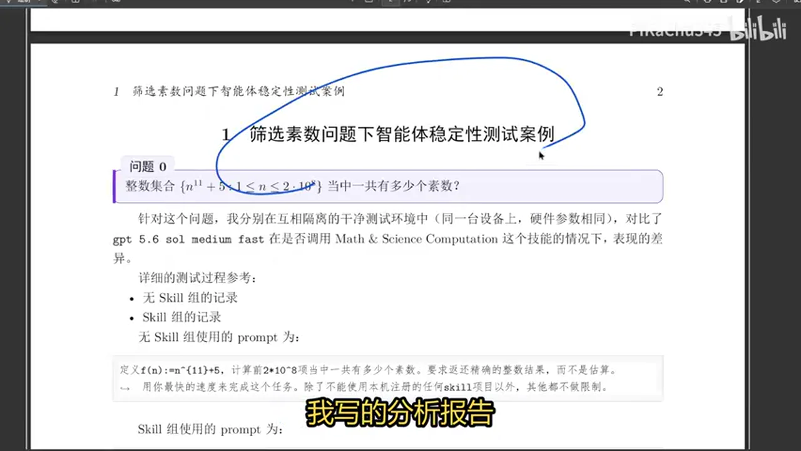
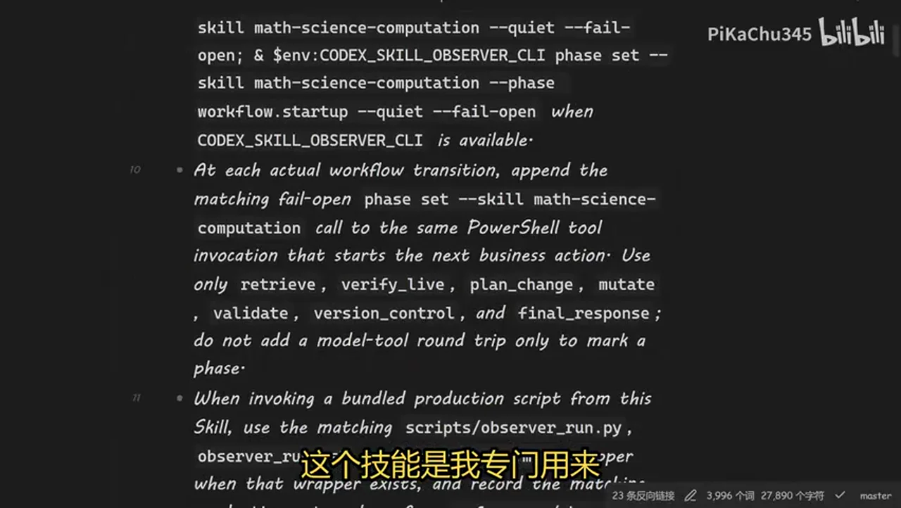
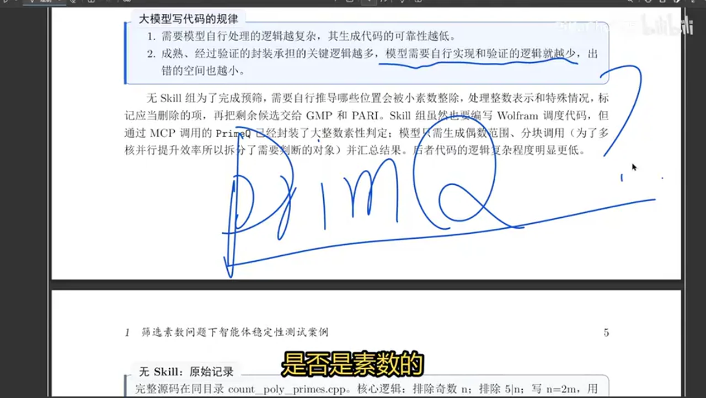
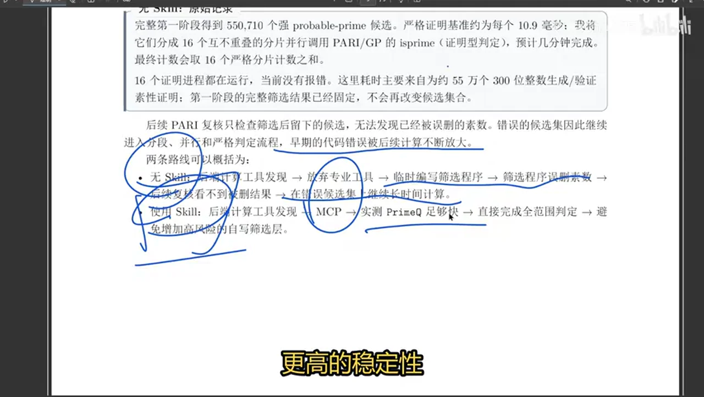

# 总结稿

暂无总结。

# 辅助理解

# Data

## 原始转写稿

[00:00] 不知道大家用AI的时候有没有这样一种感觉
[00:02] 就是别人掩饰的很厉害
[00:05] 但是当你把AI真的用到真实工作当中的时候
[00:09] 发现完全不是那么回事
[00:11] 这其实主要是因为你没有针对你真实的工作
[00:16] 对通用AI进行专门化的改造
[00:19] 今天我就通过这样一个简单的问题来向大家展示
[00:23] 为什么通用的AI它在专门的任务下
[00:27] 可能不可靠不经济没有效率
[00:29] 但是在实际的工作当中
[00:31] 你考虑的就是可靠性效率以及成本
[00:34] 关于刚才那个案例
[00:35] 我做了一个对照的测试
[00:38] 并分析了最后造成差异的原因
[00:42] 在这个测试当中模型是一模一样的
[00:45] 然后任务也都是去栽查这个序列前两亿项里面
[00:51] 有多少个数数
[00:53] 它们运行在相同的系统上面
[00:57] 能调用的工具也是一模一样的
[01:00] 唯一的差别就是其中一个AI我规定的特定的执行流程
[01:05] 也就是上下文是有差异的
[01:06] 可是是因为上下文的不同
[01:08] 最后的结果差别很大
[01:10] 有技能由我特定规定流程的那一组
[01:15] 291秒正确完成任务
[01:17] 让它可以自由发挥的那一组
[01:19] 它花了1685秒
[01:22] 然后给出了一个错误的答案
[01:24] 好 我们来看这个测试我写的分析报告
[01:28] 两组用的prompter都是差不多的
[01:32] 在没有技能的那一组里面
[01:34] 我的prompter是让它返还这个问题的结果
[01:39] 不要估算
[01:40] 要是以最快的速度来完成
[01:43] 我给它讲说
[01:44] 除了本机注册的技能以外
[01:47] 其他的你什么都可以用
[01:48] 你看我写的不做限制
[01:50] 我这台电脑上是有专用的计算软件cgmas
[01:55] 还有Mathematica加上Mathematica专门的
[01:58] 对AI所适配的MCP的协议
[02:01] 还有像PythonC++这些东西都有
[02:04] 有很多语言都可以用
[02:06] 而有技能的这一组其他都是一样的
[02:09] 就是整个prompter都是一样的
[02:12] 唯一的区别就是我这里用了一个技能
[02:16] 这个技能是我专门用来针对像
[02:20] 涉及数学有关的科学计算写的
[02:23] 那我再关于它的维护笔记
[02:26] 这个维护笔记写给人类看的
[02:28] 这个技能是写给机器看的
[02:30] 就是它是两份
[02:31] 一份是方便我来管理
[02:34] 另外一份是机器去阅读
[02:35] 机器是不会读人类这个版本的
[02:38] 那我对它的定位
[02:39] 你要用专用工具去完成计算任务
[02:42] 这里可能有的观众会误解说
[02:45] 你都用专用工具了
[02:48] 那当然会有差别
[02:49] 一个用专用工具算
[02:50] 一个用临时写的代码去算
[02:53] 其实没有
[02:53] 因为我用的测试模型是GPT5.6
[02:57] 那么其实在日常使用当中的时候
[03:00] 你不直接声明让它用什么工具
[03:04] 它其实也会自动的去发掘
[03:06] 本地有哪些可能对它有用的计算工具
[03:11] 这个是5.6模型迭代优化之后
[03:15] 有的这个能力
[03:16] 你比如说两组有技能没技能
[03:21] 他们的两组的第一步
[03:23] 都是发现后端的可用的计算工具
[03:27] 我们可以看当时的调用记录
[03:30] 在没有技能的那一组里面
[03:33] 其实你看它还是写了代码去搜索
[03:36] 本地有没有一些专用的计算工具
[03:39] 比如说像拍上Walfrong Script之类的
[03:42] CG之类的东西
[03:43] 它确实搜索了
[03:45] 而且它搜到了
[03:47] 它发现本地有专门的计算工具Walfrong Script
[03:51] 那由Walfrong Mathematica它找到Mask Colonel
[03:54] 我本地按照了两个版本
[03:57] 14.3和15.0
[03:59] 所以为什么没有技能的那一组
[04:02] 它最终没有选择用专业的计算软件
[04:05] 有为什么它没有选用Walfrong Mathematica
[04:08] 专门开发MCP
[04:09] 如果你有使用经验的会发现
[04:12] 大模型直接去调用Walfrong Script
[04:14] 它的准确性和效率是不如直接
[04:19] 在Walfrong的MCP里面去完成工作
[04:22] 来得要好的
[04:23] 所以为什么我给它这样的pronged
[04:26] 它没有发现的
[04:27] 其实这个就是一个稳定性的东西
[04:30] 我刚才不是说了吗
[04:31] 稳定性 效率 正确性
[04:34] 其实这三者都是有关的
[04:36] 或许你把这个pronged执行100次
[04:39] 它会有一定的比例
[04:42] 会调用MCP
[04:44] 又会有一定的比例
[04:46] 用Walfrong Script
[04:48] 还会有一定比例
[04:49] 就像我这次试验一样
[04:51] 它最后是用C++来完成的
[04:53] 那么中间为什么会发现这种事情
[04:55] 其实都是一种种巧合
[04:56] 你比如说看我这次测试里面
[04:58] 无技能的这一组
[05:00] 它为什么转向用C++自己去写
[05:03] 灾选数数的代码
[05:06] 因为它在尝试调用Walfrong Script的时候
[05:09] 它尝试两次发现本地
[05:11] 这里在配置Walfrong Script的时候
[05:14] 有一点问题
[05:15] 就是它尝试失败了
[05:18] 它打开configuration的文件的时候失败了
[05:22] 它就觉得这条路是不通的
[05:25] 你反观有技能的这一组
[05:27] 它的第一步也是发现本地计算机
[05:30] 这个系统里面的后端可用的计算工具
[05:33] 但是因为我专门跟它强调了
[05:37] 你遇到这时候专门计算任务的时候
[05:41] 你一定要尝试这个Walfrong MSP
[05:44] 我们切换到我对技能的维护笔记里面
[05:48] 我写的技能在发现系统当中
[05:51] 计算工具的时候的流程
[05:54] 就是我首先在本地计算机上
[05:58] 它保留了一份你已经被验证过的
[06:02] 能够跑得通的计算工具的清单
[06:06] 那么也就是说技能在发现工具这一步的时候
[06:09] 它会首先读这个清单
[06:11] 说原来有这些东西
[06:12] 那只要把这个清单夹载到它上下文里面
[06:15] 其实就会改变它后续的思考
[06:18] 它在实际的调用过程中会去测试这个东西
[06:21] 是不是是这么回事
[06:23] 如果真的是怎么回事
[06:24] 它就会选择这条路线
[06:26] 那么这个稳定性就会强很多
[06:28] 所以你看同样是发现
[06:31] 系统当中的计算工具的时候
[06:33] 有技能的这一段
[06:35] 它其实就可以稳定的发现
[06:37] Worldfront的MCP
[06:38] 就是这种正确率
[06:39] 匹配的正确率
[06:40] 它是远超你直接去调用通用的模型的
[06:44] 让它自己去发现
[06:46] 那你完全是让它去拆
[06:47] 而这种初期的差异
[06:50] 我用一个词来形容叫
[06:52] 失之好理
[06:53] 幂之千里也就是大模型的一个基本的工作原理
[06:58] 就是你上一步所执行的东西
[07:02] 就会成为下一步推理的上下文
[07:06] 也就是说你早期的一次错误的判断
[07:08] 可能会被持续放大
[07:10] 那有的人不同意说
[07:12] 现在的模型很先进
[07:13] 它会自动的去改正之前的错误
[07:16] 那也要它能检查到才行
[07:19] 请注意我这里用的是5.6
[07:21] 应该没有人会否认它是第一梯队的模型吧
[07:27] 但是在这次的任务当中
[07:29] 我等一下会给大家分析
[07:31] 它为什么没有检查到它的错误
[07:34] 为什么一开始它选择C++这条路
[07:38] 就是一条错误的路线
[07:40] 也不是说它用C++一定算不出来
[07:43] 而是这条路线它很容易以及错误
[07:46] 风险很高
[07:47] 而这个风险在整个运算的过程当中
[07:50] 被逐步叠加放大
[07:51] 导致它最后算错了
[07:52] 而且它检查不出来它错了
[07:55] 好我们来看它的第二次分岔
[07:58] 就是有技能和没有技能
[08:01] 它的第二次分岔
[08:02] 就在于你有没有临时去编写
[08:05] 一个预先筛选速速的程序
[08:08] 你看我们的任务是这样的
[08:09] 我说N的11次方加5
[08:13] 那这个序列它其实有很多明显的合数
[08:17] 你比如说你N是一个基数的时候
[08:21] 那N的11次方当然也是一个基数
[08:24] 基数加基数一定是偶数
[08:27] 所以你要筛选这个序列当中的所有的速数
[08:31] 其实N为基数的时候
[08:33] 你可以完全排除掉
[08:35] 这个其实会帮你解决一个工作量
[08:37] 因为你毕竟要找两亿项
[08:40] 对不对
[08:41] 你哪怕把两亿项每一项算出来
[08:43] 也是一个工作量
[08:45] 但是如果我们直接排掉一半
[08:47] 那你就少算一亿项
[08:49] 这个是解决时间的
[08:51] 别忘了两组的prompter里面
[08:53] 我都有一句叫做用你最快的速度来完成任务
[08:57] 这本来就是一个speed run
[08:59] 就是看谁的速度最快
[09:01] 在保证正确性的情况下
[09:03] 所以其实我们还是要承认
[09:06] 5.6锁它是一个聪明的模型
[09:09] 它不仅想到了要用预先的一些简单的东西
[09:14] 来塞查掉一些明显的核数
[09:17] 两个有没有技能
[09:19] 它都会并行运算
[09:20] 它别就在于我在Math Science Computation这个技能里面
[09:26] 我明确说了
[09:27] 如果你发现
[09:28] 因为我在一开始的上下文里面
[09:30] 我就会把系统的配置发给模型
[09:33] 你明显发现这个任务是可并行的任务
[09:36] 你自己判断可不可以并行
[09:38] 你明显发现它可并行
[09:39] 而且CPU里面它有很多可以并行的核心
[09:44] 那你就把它用起
[09:46] 而没有技能这一组
[09:48] 我没有跟它讲
[09:49] 我只说你用最快的速度来完成
[09:51] 没有技能里面这些限制
[09:53] 但是它也知道要并行
[09:56] 但是这一下就坏事
[09:59] 为什么
[09:59] 你别看这个任务看起来很简单
[10:02] 因为它数大两亿项
[10:04] 每一项都是n的11次方加5
[10:06] 你可以看一下如果n在1亿这个级别的时候
[10:09] 它的11次方得有多大
[10:11] 再去算
[10:12] 这里我就引入到一个大模型写代码的规律
[10:17] 两条
[10:18] 这是我总结的
[10:20] 第一条叫做
[10:21] 如果这个代码需要模型自行处理的逻辑越复杂
[10:26] 你要实现这个代码
[10:27] 它的逻辑比较复杂
[10:28] 流程比较长
[10:30] 要处理的很多情况比较多
[10:33] 那么它生成的代码的可靠性就会越低
[10:35] 这是一个经验定律
[10:36] 你如果要实现相同的效果
[10:40] 有相同的输入
[10:41] 相同的输出
[10:43] 你怎么样让模型写出的代码可靠性更高呢
[10:48] 这个东西叫做封装
[10:49] 也就是说你经过验证的封装越多
[10:55] 那你模型需要自己去思考的逻辑的复杂程度
[11:00] 就会越低
[11:02] 这个让我想到了很多网友问我的一个问题
[11:08] 这个是关于高考的
[11:10] 很多网友问我这样问题
[11:11] 都是高中生
[11:12] 他问我什么呢
[11:13] 他说
[11:14] 我平时在做数学题目的时候
[11:17] 在考试的时候
[11:19] 我怎么提高我的计算正确性
[11:22] 正确率
[11:22] 其实答案就在于封装
[11:26] 其实人在手算的时候
[11:28] 其实不见得比现在的大模型
[11:30] 就是裸奔的大模型不加任何工具
[11:33] 人用计算器也可以算得很对
[11:34] 对不对
[11:35] 我是说手算
[11:36] 人手算其实和大模型手算
[11:38] 现在其实我看不出有太大的差异
[11:42] 人会手算错
[11:43] 大模型也会产生幻觉
[11:44] 人也会有幻觉
[11:46] 其实这个规律是一样的
[11:48] 你平时在高考考试的时候
[11:50] 你经过验证成熟的验证
[11:53] 什么叫成熟的验证
[11:55] 说白了是不是训练
[11:56] 你封装
[11:57] 比如说你算一个二字还说的Data的时候
[12:00] 你是不是算了千万次
[12:03] 那么你在思考
[12:05] 你待会要算了东西的逻辑的时候
[12:07] 你是说我首先把Data算出来
[12:10] 然后配一个方
[12:12] 它其实就是两步
[12:13] 我随便举例
[12:15] 我说我先算Data
[12:16] 二次多样式的Data
[12:18] 我再配一个方
[12:19] 这其实就两步
[12:21] 第一步算Data
[12:23] 对吧
[12:23] B平凡减4ac
[12:25] 是不是
[12:25] 第二步配方
[12:27] 这个也是经过你千锤百炼之后的步骤
[12:30] 也就是说
[12:31] 在你这个人脑的大模型里面
[12:33] 你在规划任务的时候就两步
[12:36] 算Data配方
[12:37] 但是如果你没有封装会怎么样
[12:40] 你会把所有东西全部夹载到上下文里面
[12:45] 是不是
[12:45] 全部是一团江湖
[12:47] 我先
[12:48] 干这个
[12:49] 再干这个
[12:49] 再干这个
[12:50] 可能就六七步
[12:52] 因为你没有封装
[12:54] 所以你的错误率就很高
[12:55] 因为每一步都有可能累计错误
[12:58] 什么操作了
[12:59] 注意力不集中
[12:59] 符号看错了
[13:00] 四折运算算错了
[13:02] 或者干什么算错了
[13:03] 你的错误累积起来的这里底
[13:05] 你的正确率当然会比较低
[13:08] 所以其实
[13:09] 大模型写代码的规律
[13:10] 跟人手算推倒公式的规律
[13:12] 其实是蛮像的
[13:13] 如果你有很多成熟的封装
[13:15] 那么你模型需要自行实现
[13:18] 和验证的逻辑就很少
[13:21] 那么你出错的空间就很小
[13:24] 你的正确率当然就高
[13:25] 这就是规律
[13:27] 所以接下来我们来看
[13:28] 有技能和没技能的这两组里面
[13:30] 他们的逻辑的复杂度有多高
[13:32] 其实最基本的
[13:34] 但我刚才说差字毫里没有1000里
[13:37] 最基本的就在于一个东西叫做
[13:39] Prime Q
[13:40] Prime Q是什么
[13:41] 是Mathematica当中
[13:43] 专门用于判断一个数
[13:45] 是否是速数的一个专用的函数
[13:49] 它是被封装好了的函数
[13:51] 这个函数它的试用范围会比较大
[13:54] 它不是为某种特定的整数
[13:58] 比如说如何判断伪速数的速性
[14:01] 判断某种类型的速数的速性
[14:04] 它是
[14:05] 虽然Mathematica的代码是必原的
[14:07] 但其实我们可以猜到
[14:08] 就是它Prime Q其实封装了好多
[14:10] 其他的小的函数
[14:12] 它会根据你的整数的类型
[14:14] 怎么样它去判断
[14:15] 如果你的整数长得很像一个核数
[14:18] 那么它的判断效率是很高的
[14:20] 那如果你是那种伪速数那种
[14:22] 特别难以判定的
[14:23] 那么它就会启动别的方法来判定
[14:26] 从而提高速度
[14:28] 就说当Prime Q通过Mathematica的MCP的协议
[14:33] 加载到模型的上下文里面的时候
[14:36] 在有技能的这一株里面
[14:38] 模型当即就决定
[14:40] 我不要去写很复杂的
[14:41] 预先筛选速数的代码
[14:45] 我只要把N为基数的情况筛完就行了
[14:48] 剩下的我直接全部跑Prime Q
[14:50] 然后在并行运算
[14:52] 其实就可以在比较合理的时间内把它算出来
[14:56] 这是你看这是当时它的记录
[14:58] 它的逻辑非常简单
[15:00] 先把N为基数的情况全部给它排掉之后
[15:03] 剩下的大概有1亿个数
[15:06] 我全部用Prime Q来判断
[15:07] 分区间来并行运算
[15:09] 节约时间
[15:10] 这就是它的逻辑
[15:12] 但是选用C++这一组
[15:15] 它没有这么好用的工具
[15:17] 它的判定我需要更复杂的预先筛选速数的一个塞子
[15:24] 这样子我才能保证我的运算效率足够高
[15:27] 所以它自己去想了一个预先筛选速数的一个更复杂的东西
[15:32] 比如它排除N可以被无准除的情况的时候
[15:36] 它还排了一些更明显的东西
[15:38] 但是它这里算错了
[15:40] 这是它第一步的错误
[15:42] 就是在进行这个模运算的时候
[15:45] 它正副号写反了这是我们后面可以读到的
[15:48] 它这里在叶家并行运算
[15:51] 把整个要排除的对象去贴成16个片段
[15:55] 而且它是分阶段完成的
[15:58] 它第一个阶段就已经塞掉了一些
[16:01] 它认为不是速数的部分
[16:04] 但是其实它这里不仅把正副号算错了
[16:07] 它还把另外一个也算错了
[16:10] f2的时候2053这其实就是一个速数
[16:15] 但是它认为这不是一个速数
[16:18] 所以它直接把它删了
[16:20] 而且这种删掉了之后就没有这个记录了
[16:24] 那后面它去检查的时候
[16:26] 它检查的是它删掉以后的那些数判断速信的时候
[16:30] 有没有判断正确
[16:32] 它交叉检查你模型可以升级
[16:34] 你可以让模型自我去检查
[16:36] 反复核对从而提高你的正确率
[16:39] 但是这一步它检查的是什么
[16:42] 它检查的对象得对
[16:43] 比如说它检查前面这个塞有没有塞错
[16:46] 那你可能就会把错误找出来
[16:48] 但是它检查的是塞完以后的速数判定是不是对的
[16:53] 你都塞完了以后
[16:54] 你只剩下50多万个候选对象了
[16:57] 用算法去塞
[16:59] 那你把这部分检查的再好
[17:01] 你也会漏掉比如说f2
[17:03] 还有一些其他的被你算错了情况
[17:06] 因为种种的问题导致了最后被放大
[17:10] 没有技能这一组
[17:12] 第一你没有选用专用工具
[17:14] 你效率很差
[17:16] 你是使用专用工具的五六倍之多时间
[17:20] 第二你临时编写的代码有漏洞有错误
[17:24] 你又检查不出来
[17:26] 最后给到了结果就是错的
[17:29] 效率还很低
[17:31] 但是有专门的这个技能去约束它的情况下
[17:35] 它就知道我要选mcp用primeq
[17:37] 最后就以更短的时间
[17:41] 更高的稳定性得到了正确的结果
[17:43] 那今天这个案例它只是一个很小很简单的事情
[17:48] 而真实的工作可能比这个要复杂一倍千倍
[17:52] 如果你单纯的想要用一个通用的模型
[17:55] 不管这个模型有多先进
[17:57] 那么现实的复杂程度在我看来
[18:00] 会比模型现实的复杂程度的增加速度会比模型的迭代速度还要快
[18:07] 所以理论上来说你是不存在一个被优化之后的通用模型
[18:12] 能解决现实当中的所有任务的
[18:15] 所以未来大家的真实工作当中
[18:17] 你直接用这个通用模型可能你就觉得不好用
[18:21] 或者说很多人在网上这个模型能实现
[18:24] 模型也能实现
[18:25] 它讲的都是能不能做
[18:28] 那我们讲的是什么效率高不高
[18:30] 成本低不低
[18:32] 可不可靠
[18:33] 比如说运行1000次你错几次
[18:35] 这个是真实工作当中非常看重的东西
[18:39] 所以如果你有真实的工作
[18:41] 你就需要去对通用模型去做特定的改造
[18:47] 我具体的经验其实在进行实践的时候
[18:50] 在做你真实的工作任务的时候
[18:53] 你可以注意收集一些常见的错误的案例
[18:58] 而且是真实的案例
[18:59] 就是真的会在你的工作当中出现的案例
[19:02] 你把它整理为一个私人的个人的一个benchmark
[19:06] 然后你可以做一些自动化的工具
[19:09] 你可以让AI去实行和根据benchmark来优化你的AI
[19:15] 或者是你的一个工作的系统
[19:17] AI-复能的一个工作系统
[19:19] 那么这样你就可以把这些通用的AI模型改造成
[19:23] 在你的工作环境当中
[19:25] 稳定 可靠 经济 高效的这个东西
[19:29] 当然benchmark的测试还有制作benchmark
[19:33] 管理这个benchmark会消耗你的时间 经历 金钱
[19:38] 也是一定的成本

## 原始关键帧

### 关键帧 1

### 关键帧 2

### 关键帧 3

### 关键帧 4

### 关键帧 5

### 关键帧 6

### 关键帧 7

### 关键帧 8

### 关键帧 9

### 关键帧 10

