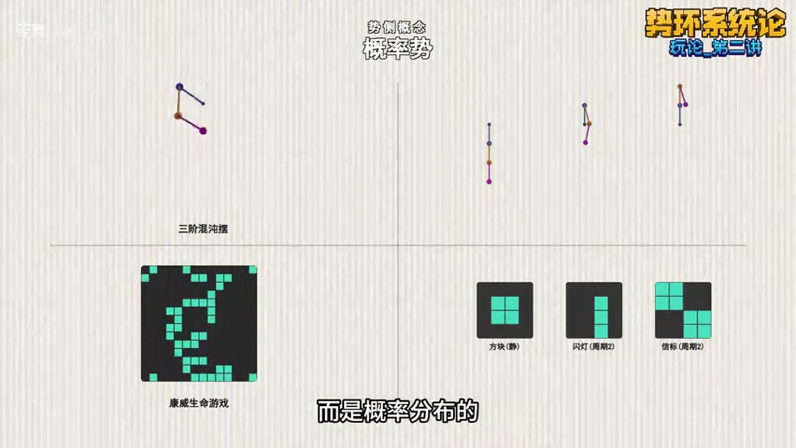
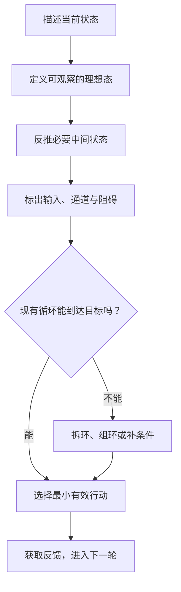
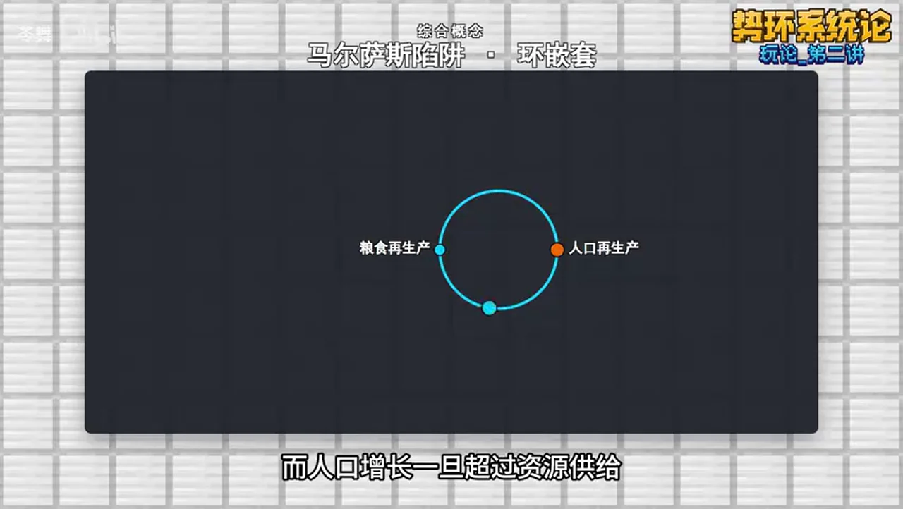
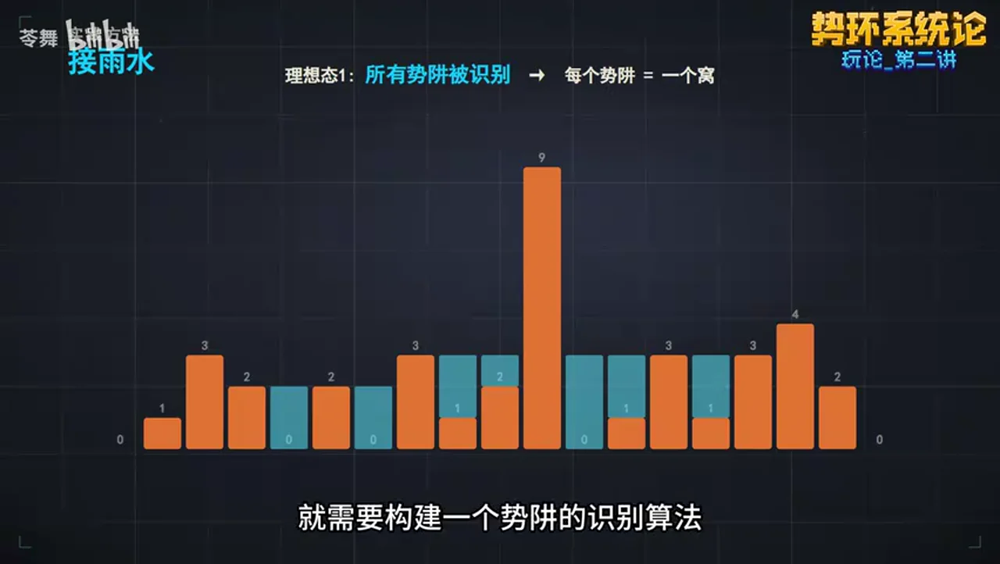
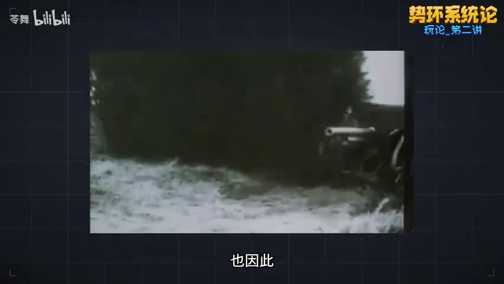
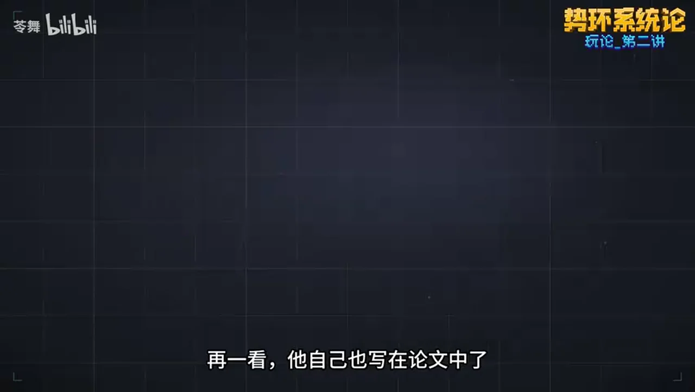
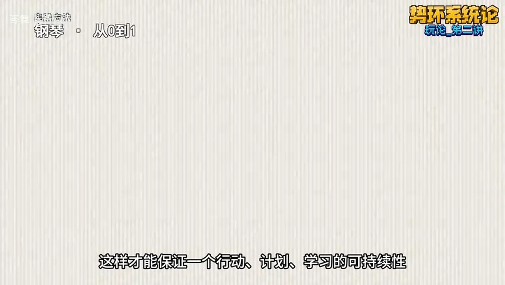

# 总结稿

## 一句话概括

视频作者提出“势环系统论”，试图用“有方向的变化（势）”和“反复运行的过程（环）”组织跨学科问题，再通过拆环、标记关键点、追踪流向、补齐条件和设计低门槛行动，把抽象分析转成实践。

> **定位提醒：**“势环系统论”是视频作者自建的解释与实践框架，不是已经建立或得到学界公认的系统科学理论。它借用了势能、反馈、势阱、OODA、PDCA 等既有概念，但这种重新编排和跨领域类比仍属作者观点。

## 核心框架

- **势层：变化往哪里去。** 增势、降势、转移势描述方向；理想态和理想势描述目标牵引；概率势用于表达多种可能走向。
- **环层：变化如何持续。** 环是反复运行并积累结果的过程；环可以嵌套，也可能增强自身鲁棒性（自强环）或削弱稳定性（自弱环）。
- **综合层：变化靠什么传递。** 势源提供输入，势位表示发生量变的节点，势链表示转移条件，势网表示多节点关系，环体表示抽取出的循环；势垒、势阱和安点描述障碍、局部困境与稳定位置。
- **方法层：从分析到行动。** 环拆解分离循环，势环标定寻找关键节点，势流追踪梳理影响路径；拆环组环、调势组环用于重构条件，“有效意识”强调选择有效且容易启动的行动。

## 论证路径

作者先从“势必”抽出“势”，再从 OODA、PDCA、机械和代谢循环抽出“环”；随后搭建势层、环层与综合概念，并用马尔萨斯模型、绘画、钢琴、债务重组和“接雨水”算法展示如何从目标反推中间状态、识别反馈与障碍。结尾把它定位为通用思维骨架，而非突破性的学术发现。

## 可复用的五问

1. 当前状态与理想状态之间有什么差异？
2. 哪些循环维持问题，哪些循环可能改善问题？
3. 输入、关键节点、传递条件和阻碍分别是什么？
4. 哪个环需要拆除、补齐或重新组合？
5. 什么行动有效、容易启动，并能在下一轮提供反馈？

## 适用边界

这套框架适合作为提问清单、类比工具和行动设计语言，尤其适合梳理学习路径、项目推进与反馈循环；它不能替代领域模型、数据、实验、因果识别、工程计算或专业决策。视频中的社会史、经济和房地产案例经过高度简化，部分细节未获充分核验。把物理术语迁移到社会或心理领域时，应视为启发式比喻，而不是已经证明的同构关系。

# 辅助理解

## 先确定它是什么

“势环系统论”是视频作者自行搭建的解释与实践框架，不是已经建立或得到学界公认的学术理论。它用“势”提问变化方向，用“环”提问反复运行并积累结果的过程。跨领域的统一语言可以启发思考，却不能证明不同领域遵循同一机制。

## 从两个原点到系统图

作者把“势”定义为运动的有向性：当前状态、理想态及二者差异构成行动方向；“概率势”表达复杂系统的不确定走向。视频没有给出其数学定义或估计方法。

*画面用混沌摆与生命游戏的多种状态辅助理解“概率势”；它没有给出具体概率值，单帧不能建立数学定义。*

“环”是一组为实现目的而反复发生的运动。小环可以嵌入大环；循环运行可能维持或增强鲁棒性，也可能逐步削弱稳定性。真实系统中反馈作用还取决于增益、延迟、非线性和边界条件，不能只按“正 / 负反馈”判定好坏。

*画面只提出“发达机器由三个本质不同部分组成”；具体分类来自上下文，单帧不能独立证明。*

## 方法如何落地

分析时先做**环拆解**，分离不同循环；再做**势环标定**，找输入、状态变量和瓶颈；随后做**势流追踪**，检查资源、信息或约束如何传播。最后从理想态反推中间状态，决定拆环、组环还是补齐条件。

马尔萨斯案例把粮食生产与人口再生产放入资源约束下的反馈环，帮助说明“环嵌套”，但只能作为经典模型的简化演示，不能概括全部农业史。

*画面把粮食与人口再生产放在同一环中；箭头、第三节点和历史条件并不完整，不能单凭此图证明模型普遍适用。*

绘画案例从成品反推线稿、明暗、上色与精修；钢琴案例先用喜欢的歌和简单和弦取得反馈，再补乐理。两者体现“有效意识”：起步时优先形成低成本、能运转的反馈环。若错误会造成安全风险或昂贵返工，就不能照搬。

“接雨水”案例先把低洼处类比为势阱，再从最终状态反推左右边界，走向左右最大值数组和双指针。真正有用的是重写问题，而不是给算法换名。

*画面把“识别势阱”连接到柱状序列；颜色和数值仍需上下文解释，单帧不能证明算法正确性。*

## 使用时的防误用检查

每次分析都应追问：目标是否可观察；变量是否有定义和数据；循环是真实机制还是相关性；传递条件是否成立；行动的失败成本是什么。无法落到证据或检验条件时，应标记为“作者观点 / 类比 / 假设”。

## 外部事实核验

核验日期：**2026-07-28**。仅核验 6 项重要客观断言；作者自建概念、价值判断及重庆房地产案例不视为已证实事实。

1. **确认｜[00:00] 马克思引文。** 《关于费尔巴哈的提纲》第十一条确有“解释世界 / 改变世界”的表达；中文为通行译法。来源：[Theses on Feuerbach](https://www.marxists.org/archive/marx/works/1845/theses/)。
2. **确认｜[03:17] OODA 与 PDCA。** OODA 是观察、定向、决策、行动；PDCA 对应计划、实施、检查、处理。来源：[Air University](https://www.airuniversity.af.edu/AFCLC/News/Article-Display/Article/1777083/cultural-ksas-skill-development-using-the-ooda-loop/)、[ASQ](https://asq.org/quality-resources/pdca-cycle)。
3. **部分确认｜[04:21] 李德昌《势论》。** 作者文选目录支持作者、题名、2008 年及卷期信息，但未取得期刊官网独立详情页。来源：[《李德昌势科学文选》](https://skx.hhstu.edu.cn/__local/B/67/A0/ED57E602E022C89E43431ED76CA_04420ADA_15E94D2.pdf?e=.pdf)。
4. **反驳｜[08:03] 艾根时间线。** 该论文发表于 **1971 年**，不是 1970 年；Springer 将超循环相关论文系列置于 1977—1978 年，不能把超循环直接归入该篇论文。来源：[CiNii](https://cir.nii.ac.jp/crid/1360574093659684352)、[Springer](https://link.springer.com/book/10.1007/978-3-642-67247-7)。
5. **部分确认｜[12:44] 马尔萨斯陷阱。** 视频机制接近经典模型，但“农业社会普遍存在”是更强且有争议的历史判断。来源：[相关同行评议论文](https://onlinelibrary.wiley.com/doi/10.1111/j.1467-6435.2010.00469.x)。
6. **部分确认｜[17:52] 农产品购销改革。** 官方材料支持 1979 年后逐步放开，并确认 1985 年多数统购派购制度取消；不足以逐字核实视频所列 1979、1980 年细则。来源：[农业农村部](https://jgs.agri.gov.cn/100/pte/third/1.html)、[全国人大](https://www.npc.gov.cn/zgrdw/npc/flsyywd/jingji/2000-11/25/content_8349.htm)。

## 结论

它适合把模糊问题外显为方向、循环、条件、障碍和行动；进入专业结论时，仍须使用相应领域的模型与证据。

# Data

## 增强转写稿

## 术语表

- **势**：运动的一种有向性；视频将其作为“势环系统论”的第一个原点。
- **环**：一系列为实现某种目的而反复发生的运动；视频将其作为第二个原点。
- **增势 / 降势 / 转移势**：势增大、势减小，以及势在系统或形态之间转换。
- **理想态 / 理想势 / 概率势（分布）**：生命系统预设或潜在预设的目标状态，以及复杂系统朝不同未来状态发展的倾向。
- **环嵌套 / 自强环 / 自弱环**：大环中嵌套小环；运行会增强或削弱自身鲁棒性的循环。
- **势源 / 势位 / 势链 / 势网 / 势心 / 环体**：系统外部输入、发生量变的点位、点位间传递通道、通道网络、网络节点，以及从系统中抽取出的循环整体。
- **势阱 / 势垒 / 势空间 / 安点**：借用物理学势能图景描述系统运动、局部最低点、跨越障碍与稳定点。
- **环拆解 / 势环标定 / 势流追踪**：拆出系统中的环、标记有影响力的点位、追踪势的流动。
- **拆环组环 / 调势组环 / 有效意识**：破坏或重组循环、以外部条件补齐循环，以及优先选择有效且容易启动的行动路径。

## 校正转写稿

[00:00] 哲学家们只是用不同的方式解释世界，而问题在于改变世界。
[00:05] 玩梗同样也要面对这句话的考验。可惜目前玩梗的内核只有一个“丸子”。
[00:11] 这个空无一物的麻将桌不仅没有解释世界，更是没有改变世界。
[00:16] 因此，作为这台麻将桌的庄家，要把麻将馆开起来。
[00:20] 我们势必要引入一些精彩史料来作为麻将桌上的麻将牌。
[00:25] 那就把上一句话的“势必”摘下来，当作一个麻将吧。
[00:28] 由于我们还没开始玩，这些等级还在零级，还处于小宝宝学步。
[00:34] 因此我们只能用最基础的打法，就是造句。
[00:38] 我势必要将这个视频做完；我势必要组建星际舰队，攻打银河中心黑洞中的终极克苏鲁。
[00:44] 你看，小宝宝的造句就是很天马行空的，但是高玩就不一样了。
[00:50] 马克思会告诉你，资本主义势必会产生周期性经济危机。
[00:55] 热力学第二定律会告诉你，孤立系统的熵势必增加。
[00:59] 凯恩斯会告诉你，有效需求不足时势必出现非自愿失业。
[01:04] 虽然我说，我势必要把这个视频做完，但可能是我做到一半不想做了，让视频流产了。
[01:12] 所以“势必”的“必”是势必要被去掉的，但是我又的确有做视频的结果，所以“势必”的“势”是势必要留下的。
[01:20] 而留下的这个“势”，便是势环系统论的原点。势即是运动的一种有向性，运动有物质的运动，也有精神的运动。
[01:29] 因而势在物质侧和观念侧一样存在，而物质侧的势和观念侧的势，也在不停地通过意识这个媒介相互沟通、相互影响。
[01:39] 进而形成了当今的世界。奴隶主的鞭子打在奴隶身上，鞭子的动势被奴隶的皮肤吸收，形成了痛觉。
[01:47] 痛觉集中起来，催生了反抗势；反抗势又在无数的现实机遇中转化为了起义。
[01:53] 但完成起义之后，原先的组织结构势必要发展壮大，势必会催生出一个强有力的权力中心；而这样的权力中心势必会产生新的奴隶主、新的压迫。因此王朝会迭代，权力会转移，各种力量此消彼长，却似乎是一种永恒的轮回。
[02:13] 看着轮回背后，一些注意力在生产上的农民发现，农具可以改良，灌溉技术可以升级；轮回死，组织会亡，而这些技术不会随着王朝的迭代而消失。因此生产力势必会发展，而新的经济形态势必会出现。
[02:30] 催生出资产阶级。因此会有一股更宏观的历史大势，汇聚轮回中不断再生的反抗势动力，把旧体系彻底推翻。也因此，历史是前进的车轮，而不是原地转圈的摩天轮。
[02:44] 当然，到目前为止，我也只是用另一种语言把同一个故事再讲了一遍。虽然解释意义有了一点，但是实践意义还没有产生。不过与此同时，我们又发现了在势的背面的另一种运动。
[02:59] 这种运动是轮回，是螺旋，是震荡，是反复，怎么说都可以；但在这里，我把它称为“环”，也就是势环系统论的第二个原点。环，即一系列为实现某种目的而反复发生的运动；环有周期，有向位。这个世界的环可就太多了。
[03:17] 比如军事上的博伊德循环，它有四步，分别是观察、定向、决策、行动；再比如说在质量管理中会用到的戴明环，它也有四步：计划、实施、检查、处理。看来“四”这个数字还是挺给力的。
[03:32] 汽车引擎也是四冲程的。可以再来个复杂的：柠檬酸循环，也叫 TCA 循环，它有七个主要反应，主要功能就是把一种化学能转变成更直接的化学能。我们稍微注意一下，就能发现上述的环都有一个共性。
[03:50] 这个环每运行一次，环指向的更宏观的势就会被推动一次。博伊德循环每运行一次，就会获得更高的战略优势；戴明环每运行一次，就能让产品质量提高一点；而四冲程和柠檬酸循环就更直接了。
[04:06] 它们直接推动物质的位移和能量转移。在我的理解中，势是一种矢量，一种属于系统的矢量，而这个矢量的模、方向是和时间同向的。但是中国学术圈里面也有人提过“势”的定义。
[04:21] 2008 年，《系统科学学报》第 16 卷第 1 期中有一篇论文叫作《势论》，作者是西安交通大学的李德昌教授。我两句话讲完。
[04:31] 这篇论文想把“势”这个文化概念通过明确定义转化为严谨的科学要素，进而开启所谓多方面造势实践的势科学体系。你可以去知网搜“势科学”，会找到很多文章。而它对势的定义是：差别除以距离。
[04:48] 学过数学的一看，这不就是梯度的公式吗？再一看，它自己也写在论文中了，然后它的理论 bug 就来了。
[04:57] 既然自然科学中已经有了梯度，为什么还要来一个势呢？因此这个体系如同是用咸菜蘸盐吃，在已有梯度概念的自然科学内部显得冗余。
[05:07] 这也是它的势科学没有在学术圈大规模铺开的原因：势思想是哲学，而非科学。
[05:14] 哲学的东西可以描述，但永远无法清晰定义。这不是因为哲学隐晦，而是因为哲学需要直面宇宙的无限复杂和无限深度。哲学对于问题不断追问的过程，就和一直放大一张高清图片是一样的。
[05:29] 一张图片再怎么清晰，放大到一定尺度，也会变得模糊起来，而这个尺度恰恰是哲学的细节。回到“势”，势也同样如此。我们谈地形会用到“地势”，谈情况会用到“形势”，谈战争会用到“攻势”。可见在座的各位都是使用势思想的哲学家。
[05:50] 这样一来，我的理论体系也很尴尬了。因为这么看，我的行为无异于跑到大街上，像小丑一样拿着喇叭大喊：“大家看过来，我成功证明了你们所有人都在用两条腿走路！”这比用咸菜蘸盐吃更加滑稽了。这样做虽然能当黑红网红，但我更想做点对大家有实际帮助的事。上一个视频我白白浪费了大家 14 分钟的时间。
[06:16] 我不能再这样了，我得认真了。接下来我将演示势环系统论真正的框架。经典系统论的出发点是系统的组成、结构、功能，由此衍生出了系统学、系统科学、方法论、系统工程学，总体更接近科学；而势环系统论的出发点是系统的运动和运动的有向性，总体更接近哲学。
[06:37] 势环系统论由这几部分组成：势层概念、环层概念、势环综合概念；接着是势环分析方法，然后是势环实践方法，最后是实践演示。首先是势层概念，主要有增势、降势、转移势、势的系统量化、理想态和理想势、概率势和概率势分布。增势就像扛着一桶水上楼，水的重力势能变高；降势就是把水倒下来，水的重力势能降低。
[07:05] 转移势就是把水倒掉的时候，水的重力势能转换为了动势。基于系统之间的运动关系，将不同系统中势的强度量化为可以比较计算的影响力，这便是势的系统量化。势的系统量化最经典的就是物理学中的能量。理想态是由生命系统或多生命系统预设或潜在预设、趋向于达到的事态，最常体现在劳动过程中。比如一个建筑师在施工前就已经在脑中构建好的建筑。
[07:35] 而这个理想的建筑驱使他通过各种活动、方式、方法去改变自然物的形态，实现自己的目的，这便是理想势。但我们面对的世界是复杂巨系统，因此不是机械的，而是有一定程度的混沌的。耗散系统理论告诉我们，一个混沌系统能以一定概率进入多种可以达到的未来状态。因此在这种系统中，势导向不是机械决定的，而是概率分布的。这就是概率势和概率势分布。
[08:03] 然后是环层概念：环嵌套、自强环和自弱环。所谓环嵌套，就是大环的运动中嵌套小环作为一个功能点位，且小环的运动频率通常高于大环。历史上曾有这样一个理论：1970 年，西德物理化学家艾根发表了《物质的自组织和生物大分子的进化》，提出了超循环理论。他认为信息和功能的关系是互为因果的封闭循环，在自然界的自组织中由循环形成。
[08:33] 但这个理论描述的重心，在于分子进化层面信息与功能的自催化、自复制关系，而环嵌套重在描述更为普遍的循环关系。
[08:43] 柠檬酸循环嵌套在细胞呼吸的三个阶段中，信贷循环的资源分配模式嵌套在经济周期的四个阶段中，工业生产产品生命周期嵌套在产业转移循环中。一个环的运动可以增强自己的鲁棒性，或是维持鲁棒性在安全区间。
[09:01] 这个环就是自强环。一个环的运动会削弱它的鲁棒性，这个环就是自弱环。自强环通常依托负反馈循环而存在。
[09:11] 比如 PID 就是经典的依托负反馈而存在的自强环；再和前面提到的环嵌套结合，就是鲁棒性更强的串级 PID 了。
[09:20] 自弱环通常具有影响稳定性的正反馈结构。
[09:24] 信贷循环就是在循环中不停地创造和积累经济泡沫，到最后蝴蝶翅膀一扇，就足以让循环坍塌。
[09:31] 自强环和自弱环都是动态的，但是前者坚固，后者脆弱。再然后是势环综合概念。
[09:38] 分别是势源、势位、势链和势网、势心、环体、势阱和势垒、势空间、安点。
[09:43] 势源是为系统注入初始势的外部输入。例如驱动单片机系统的电源就是势源。
[09:50] 势位是系统中参与运动并伴随量变的点位，如人体中的血糖浓度和离子浓度，或是一个粒子的动能、重力势能和电势能；而势链就是连接两个势位的传递通道。
[10:03] 在运动中，一个势位的势转移到另一个势位所依赖的充分条件便是势链，比如物理学中的经典方程、产业转移时承接地的经济政策。
[10:14] 所有发达的机器都由三个本质上不同的部分组成：发动机、传动机构、工具机或工作机。
[10:22] 这其中发动机就是势源，传动机构就是势链。紧接着是势心和势网。
[10:29] 势链很简单吧。
[10:30] 蒸汽机就是最典型的例子。在最开始，燃料的化学势转化为了炉膛高温，高温转移到蒸汽中变成高压，推动活塞往复运动，进而转化为机械能。
[10:44] 势网就比如在生物圈中，食物链组成的食物网便是生态系统能量流动的势网。
[10:51] 网中有很多节点，这些节点便是势心。这个网的一侧是生产者，接受的势源是阳光。
[10:58] 另一侧是分解者。物质就在这个势网中循环着，所以生物圈的运动大体可以概括为：能量流动，物质循环。把这其中的环取出来，就是环体。
[11:12] 就拿氮元素来说，大气中的氮通过微生物的固氮酶变成氨盐，然后在各个营养级中走一圈，变成有机氮；再通过分解者的氨化作用变成氨盐回归土壤，或是通过反硝化作用回到大气。
[11:27] 所以人一铲子下去，就把这个原本的环体打破了。
[11:31] 所以要增加一个环节，把氮元素的循环接上去。但是把氮元素的循环接上去并没有那么简单。
[11:39] 氮氮三键是强度很高的共价键，这就需要很高的活化能，这便是势垒。
[11:45] 为了穿越这个势垒，人们采用了哈伯法，也就是高温、高压，加点催化剂。再然后是势阱，这个是在物理学里面有描述的。
[11:55] 在物理学中，势阱是描述粒子在势能场中运动的概念。
[12:00] 势阱通常是在空间有限维内呈现最小值的区域。
[12:04] 粒子在势阱内处于束缚态，其能量被局部势能捕获，无法自由逃逸到全局势能最低点。
[12:12] 引申到势环系统论当中，就是势位被困在势空间中的一个局部最低点，难以跳出。
[12:19] 这个点即是势阱。就比如我们在优化神经网络时，梯度下降通过不断更新参数来最小化损失函数。
[12:28] 当损失函数的梯度接近零时，我们到达了临界点。这个临界点要么是鞍点，要么是局部最小值。
[12:36] 而局部最小值就是势阱，它会把势位困在一个区间中，进而使其难以触及势空间中更新的区域。
[12:44] 再比如普遍存在于农业社会的马尔萨斯陷阱：明明生产力在不断提升，为什么生活水平提不上去？
[12:52] 我们来做个环分析。首先是基本环：农民生产粮食，粮食养活农民。剩下的过剩粮食，一部分被地主或者赋税抽走，另一部分留在农民手里。
[13:04] 但是这部分粮食无法置换为各式各样的消费品，也很难兑换为土地这样的资本，而且不能长期保存，因此会把留不住的粮食兑换为留得住、能产出的劳动力。
[13:16] 因此这个基本环所积累的势变便是人口增长。而人口增长一旦超过自然供给，自然矛盾就会升级，就会产生战争和饥荒，因此人口增长会变成人口抑制。
[13:28] 这就是基本环嵌套的自弱环。所以我们可以看到，生产力是在发展的，农民创造的价值是越来越多的，但是生活水平会原地踏步。
[13:39] 这就是经济学中的解释。刚才我们用势环分析的方法拆解了马尔萨斯陷阱的基础。势环分析方法具体来讲有这几个。
[13:49] 环拆解、势环标定、势流追踪，以及解决迷茫和快速着手问题。所谓环拆解，就是把一个复杂系统的环拆出来，看看哪些环在低位，哪些环在高位，哪些环是耦合的，哪些环是嵌套的。
[14:05] 而势环标定，则是在这个复杂系统中标记有影响力的点位。比如做电工，就要去看各个关键点的电压有没有问题。而势流追踪，则是通过追踪系统的势流向，去了解结构、深入问题、锚定方向。所以我们可以通过这个框架解决迷茫，并快速着手问题。
[14:25] 先把握处境的势方向，这可以运用矛盾分析法；追踪势流找到问题的结症，并解决问题。这在面试上会很有用。
[14:35] 比如面试常问：什么情境下出现了什么问题，你要怎么解决？或者是有一个目标需要你完成，你要如何达到？
[14:44] 这时即便你没有任何思路，也可以当场开始推导。比如情境问题，就先设计一个理想的结果，然后从结果一步步反推当下要做什么。再比如遇到目标问题，不用去硬想方案，会堵塞。按照势环系统论的思想，就可以先比对目标和当下的差异，作为系统势差。
[15:04] 然后在其中设计理想的事态节点，再谈这些节点之间的贯通办法：自己可以解决哪些部分，哪些部分需要特定资源，或是特定的信息。
[15:15] 势环系统论在这里起到的作用，是把系统的复杂问题，通过势环模型的可分性拆解为专业问题。看到了问题，我们就可以启动最后的实践了。
[15:35] 势环系统的复杂问题，是势环的复杂问题。通过势环模型的设计……（本段原始转写连续重复“通过势环模型的设计”，疑似音频或 ASR 重复。）
[15:57] 然后直接上色，结果画着画着感觉有些地方要重新处理，或是又有新想法，然后又回去改，而且直接上色的难度也很高。
[16:07] 这难度没有天赋的等于掉血，所以我们用势来分解一下。
[16:12] 第一个阶段是线稿，最后的阶段是成品。但我没有做成品的实力，所以反推一步，先把颜色糊上去，让它像个成品。
[16:21] 糊颜色自然是小孩子都会的，但糊上去之后还是不很像，所以再退一步：让它有颜色，而且看起来立体。
[16:31] 但是上色了之后，这些颜色自带灰度，很难做立体的处理。那可不可以先立体再上色呢？可以，但是也很难。
[16:41] 这不考验素描基本功吗？那再反推一步，按最简单的来：先全部涂灰，然后受光的地方涂白，立体感一下子就有了。那我们就得到了如下的势层。
[16:53] 第一层，画好线稿；第二层，整体涂灰后画白色，也就是著名的二分明暗。
[17:01] 第三层，糊上去个大概颜色；第四层，再做精细修改，画就成了。这样一解剖之后，学画画就不再是打怪升级一样、通关那一百级的教程。
[17:12] 而是以疏通自己实际上的势通道为目的，有方向地去自主学习，却会让自己的技能成形得很快，也没有“我必须学会什么什么”的折磨感。
[17:23] 然后讲讲拆环组环吧。所谓拆环，就是把一个环拆开，终止它的运动。前面我们谈到了马尔萨斯陷阱，我们看基本环：农民种粮食，粮食养活农民。
[17:36] 通过这个环运动，剩余粮食被兑换为劳动力，进而进入了自弱环中。那么如果将自弱环破坏，阻止剩余粮食兑换为劳动力，是不是就解决了？这就是计划生育所做的事。但是问题只解决了一半。
[17:52] 既然不能兑换为劳动力，那粮食应该去哪？历史已经给出答案了。从 1979 年开始，国务院重新限定农副产品的统购和派购范围，三类产品和完成派购任务的二类产品可以自由上市。
[18:07] 1980 年又进一步放宽农副产品的购销政策，基层供销社可以选购、议购；集体所有制商业、个体商贩和农民可以长途贩运，多种经营形式相继出现。同期，独生子女政策开始推行。当然，这就是不严谨的分析，社会是极其复杂的。
[18:27] 远超势环系统论的理解范围。有关社会的一节，会在《玩论》第四讲重新讨论。回到拆环组环，要注意的是组起来的环最好是自强环。
[18:38] 第三个方法是调势组环，这是势环系统论最广泛的运用。在组环条件不足的时候，通过创造势源，获得有利条件，把构建环所缺失的条件补齐，并在环的运动中完成自己的目的，并将势返还。
[18:54] 简单来说，就是贷款。经营的条件不足时，贷一笔钱来补全客观条件的不足。此时虽然债务势被无中生有地造出来了。
[19:04] 但是这个势可以被经营起来的资本逐渐返还。药物也是如此，有些化学物质虽然有毒，但可以引入它激活一些良性的势环。
[19:14] 随着这些环的运行，机能能够得到复苏，有害物质也会被代谢掉；但如果对量的把握不对，反而会产生恶性势环。
[19:24] 因此药代动力学一个重要的研究目的，就是获得药代动力学参数。那我们再从药理回到经济。
[19:31] 在调势组环中对于量的把控不周，也会产生恶性势环。
[19:35] 所以下面请欣赏资本家的愚蠢操作。像 90 年代重庆地铁中心花园的房地产开发商，就是因为想玩这一套又没把账算对，整出来了烂尾楼。
[19:47] 他是这样算账的：项目预估花 2 亿，于是就去凑 2 亿。
[19:52] 首先是去告诉居民暂时不补偿动迁费，给居民利息；然后去银行要了 15 个百分点利息的砍头债，拿到了 1.4 亿。
[20:02] 剩下的 6000 万，是他搞售房返租这种非法集资行为弄出来的。
[20:07] 这样一来，他就凑够 2 亿了。看似具备条件了，实际上我们通过势环系统论一分析，就知道要出事。
[20:15] 同样的资本，你拿去买飞机，飞机飞一趟，你能收回来点机票钱。
[20:20] 但房地产建设是不具备返环属性的，反而要偿还利息，因此随着环的运行，建设资金是递减的。
[20:28] 所以过了五年，这个项目就烂尾了。项目烂尾了该怎么解决呢？
[20:34] 所以还有政府教学，运用调势组环的思想。
[20:38] 我们先算一算，大势还在不在。项目值 4 亿，现在已有 1 亿花在了项目上。
[20:44] 房子卖完能回收 4 亿，投 1 亿得 4 亿，因此在大势上是成立的。
[20:50] 但接手的人还要处理银行和人民的债，因此总投入实际上是 4.3 亿；投 4.3 亿得 4 亿。
[20:57] 因此对于接手方来说是不成立的，那我们就来调势。
[21:02] 首先看在理想过程中，各个势位是如何运动的。
[21:06] 居民从动迁费和购房款受损，势为得到应得的补偿和住上房子。
[21:11] 以及售房承诺的利息；银行从亏损本金，势为得到本金加利息。
[21:16] 施工单位得到工程款；接手方从投入 4.3 亿，势为得到 4 亿。
[21:21] 那现在把银行的利息和售房承诺的高利息砍掉一部分。
[21:26] 这并不影响两个势位的走向，因此可以谈判。
[21:30] 而谈判势必成功，那么接手方的势位就扭亏为盈了。
[21:34] 所有势位的理想态都成立了，这个项目自然就被救活了。这就是所谓的债务重组。
[21:41] 第四个思想是有效意识。
[21:43] 势的量变，需要由一轮又一轮的环运动来积累。
[21:47] 那么，对于一个环来说，最重要的是有效且容易开始。
[21:52] 这样才能保证一个行动、计划、学习的可持续性，尤其是从 0 到 1 的时候，更要遵循这个思想。
[21:59] 例如学钢琴，正常来说要先学五线谱，还有基础乐理，但学下来头都大了，而且也不可能一开始就视奏。
[22:08] 其实可以简单一点：先找首喜欢的歌，扒一下里面的和弦怎么按。
[22:14] 学几十分钟就可以给喜欢的歌弹简单的伴奏。这自然是毫无难度，但是有效。
[22:21] 弹了两遍，自己都自信了。那就是谱单滚动着、瀑布流弹，旋律和分解和弦都可以，这也是毫无难度的。
[22:31] 有人这时候就要说，瀑布流并不包含全部信息。你都不知道你弹的是几分音符，音高和调性也不会表现，更没有演奏法的标记。
[22:42] 这么走野路子并不是系统的。但其实不然，传统的教学路线固然是系统的，是静态的结构功能系统观。
[22:51] 它会告诉你这个踏板的功能是什么，那个符号的功能是什么，并设计一层层难度梯度，通过讲练循环去攀爬这个天梯。但有效意识同样是系统的。
[23:04] 它关心的是系统的势、环、运动。它会告诉你一个环有没有效、成本大不大、会把你带到何方。你可以去各个平台上搜“学习方法”，会出来很多的。
[23:16] 势环系统论的有效意识思想，本质上是把“成绩随难度上升”的学习曲线，截取一条斜率稳定的切线，使得学习者在任何阶段都能够拾级而上。等到水平上去了，再补之前遗留的系统理论也不急。
[23:31] 最后，我们用势环系统论来解一道编程题。我编程水平不好，可能讲错。
[23:37] 这个题叫“接雨水”：给定 n 个非负整数，表示每个宽度为 1 的柱子的高度图，计算按此排列的柱子，下雨之后能接多少雨水。
[23:47] 我们一看，这个接雨水的“窝”不就是势阱吗？那就设计理想态。理想态一：所有势阱被识别；理想态二：所有势阱的雨水被统计。那从理想态一反推中间态，就是要构建一个势阱的识别算法，那不就简单了？
[24:05] 每一个最低点都是一个窝，这个窝不就是势阱吗？直接把所有窝的大小统计出来不就是了？但是这就出问题了，有可能几个小窝能合成一个更大的窝。
[24:18] 这个大窝的水等于所有小窝的水之和，但这样就很难判断了，要做属性合成，不方便。那我们再换个思维：既然所有水都被接住了，就意味着水的动势归零了。
[24:31] 雨水至平地，各自东西南北流；不流了就说明东西南北都被堵了。那我们直接反复遍历坐标灌入雨水：雨水要么可以继续向下，要么就不可以继续向下。若雨水流到两边则不管，没流到两边则继续。
[24:49] 运行一轮没有更新势，则输出雨水数。这是根据物质在势系统中运动规律的算法，但还是不够。做计算一向来不就是精卫填海了么？那再来，我们对系统本身的运动进行思考。
[25:04] 这个空间一开始有很多势阱，最后所有势阱都被填满了，那不就没有势阱了么？到最后水从最高点往下流，不会被任何势阱困住，不就说明它在拓扑上是单调地先增后降了么？那算法就简单了。
[25:21] 构建两个长度相同的新数组，取两个变量扫描原数组，一个从左往右，一个从右往左；每个变量都给自己的数组赋以扫描到的最大值。对两个数组求交集，再和原数组求补集，就是答案了。再稍微改一下，用两个指针互相靠拢的算法，就是标准答案了。
[25:42] 以上就是《玩论》第二讲“势环系统论”的内容了。虽然很多人可能会觉得这期的内容太简单，里面的很多思想都在被广泛使用着，没有什么新的东西，没有突破性的发现、颠覆运行的维度，也没有什么学术意义。但我想，势环系统论是为了提供一种通用的思维骨架、新的看问题的角度。很多人爱谈系统性方法、结构性思维，但系统到底是怎样的系统？
[26:11] 结构到底是怎样的结构？又要开始回归定义和概念了。我想更重要的是织一张网，让各个定义和概念落到这张网中，我们才能一直有高度、韧性和精力的认知，去把握无限的世界。
[26:26] 这也是在为《玩论》第四讲做准备。希望我的内容能够为大家带来启发，希望大家都能好好发展，我们下一讲再会。
[26:41] 字幕 by 索兰娅。

## 原始转写稿

[00:00] 这些家们只是用不同的方式解释世界,还问题在于改变世界。
[00:05] 玩伦同样也要面对这句话的考验,可惜目前玩伦的内核只有一个丸子。
[00:11] 这个空无一物的麻将桌不仅没有解释世界,更是没有改变世界。
[00:16] 因此作为这台麻将桌的装甲,要把麻将管开起来。
[00:20] 我们势必要引入一些精彩食料来作为麻将桌上的麻将丸。
[00:25] 那就把上一句话的势必摘下来,当作一个麻将吧。
[00:28] 由于我们还没开始玩,这些等级还在零级,还处于小宝宝雪梯。
[00:34] 因此我们只能用最基础的打法,就是造句。
[00:38] 我势必要将这个视频作玩,我势必要组建星际舰队攻打银河周星黑洞中的终极克苏鲁。
[00:44] 你看,小宝宝的造句就是很天马行空的,但是高玩就不一样了。
[00:50] 马克思会告诉你,资本主义势必会产生周期性经济危机。
[00:55] 约利学第二定律会告诉你,孤立系统的相势必增加。
[00:59] 台恩斯会告诉你,有效吸球不足时势必出现非自愿使业。
[01:04] 虽然我说,我势必要把这个视频作玩,但可能是是是我做到一半不想做了,让视频流产了。
[01:12] 所以势必的必是势必要被去掉的,但是我又的确有做视频的结极,所以势必的势是势必要留下的。
[01:20] 而留下的这个视,便是视环系统论的原点。 视极是运动的一种有向性,运动有物质的运动,也有精神的运动。
[01:29] 因而视在物质侧和观念侧一样存在,而物质侧的视和观念侧的视,也在不停的通过意识这个媒介相互沟通、相互影响。
[01:39] 进而形成了当今的世界,努力组的鞭子打在奴隶身上,鞭子的动系被奴隶的皮肤吸收形成了痛节。
[01:47] 痛节集中起来,催生了反抗时,反抗时又在无数的现实机遇中转化为了起义。
[01:53] 但完成起义之后,远先的组织结构势必要发展壮大,势必会催生出一个强有力的权力中心,而这样的权力中心势必会产生新的奴隶主、新的压迫,因此王朝会迭代,权力会转移,各种力量子肖比掌,却似乎是一种永恒的轮回。
[02:13] 看着轮回背后,一些注意力尽量的农民发现农具可以改良,关盖技术可以升级,轮回死,组织会亡,而这些技术不会随着王朝的迭代而消失,因此生产力势必会发展,而新的经济形态势必会出现。
[02:30] 催生出资产阶级,因此会有一点,更宏观的历史大势会征教轮回中不断再生的反抗势动力,把旧体系彻底推翻,也因此,历史是前进的车轮而不是沿地转圈的摩天轮。
[02:44] 当然,到目前为止,我也只是用另一种译言把同一个故事再讲了一遍,虽然说解释意义有了一点,但是时间意义还没有产生,不过与此同时,我们又发现了在系的背面的另一种运动。
[02:59] 这种运动是轮回,是螺旋,是震荡,是反复,怎么说的可以,但在这里,我把它称为还,也就是是环系统论的第二个原点,环系以一系列世界未需游戏反复发生的运动,还游周期游向未,这个世界的还可就太多了。
[03:17] 比如今世上的包尔德循环,它有四步,分别是观察定向决策行动,再比如说在计量管理中会用到的代名环,它也有四步,需策划实习检查处理,看来四这个数字还是挺极力的。
[03:32] 汽车引擎也是四重成的,可以再来个复杂的,凝盲算循环,高考绘考,它有七个主要反应,主要的功能就是把一种化学能转变成更直接的化学能,我们可以使用注意力注意一下,就能发现,上述的环都有一个共性。
[03:50] 这个环每一斤一次,环记向更宏观的事,就会被推动一次,包尔德循环每一斤一次,就会获得更高的战略优势,但凝环每一斤一次,就能让产品质量提高一点,而四重成和凝盲算循环就更直接了。
[04:06] 他们直接推动物质的试验和能量讲仪,在我的理解中,是一种相量,一种属于系统的相量,而这个相量的末连方向是和时间同向的,但是中国学术圈里面也有人提过试的定义。
[04:21] 2008年,系统科学学报上,第16件第一期中有一篇论文叫做试论,作者是西安交通大学的李德昌教授,我两句话讲完。
[04:31] 这篇论文想把试这个文化概念通过明确定义转化为严谨的科学要素,竟而开启所谓多方面造势实践的试科学体系,你可以去今往搜试科学,会找到很多文章的,而它对系的定义是,差别处于纪离。
[04:48] 学过数学的一看,这不就是T度的公式吗?再一看,它自己也写在论文中了,然后它的理论bug就来了。
[04:57] 既然自然科学中已经有了T度,为什么还要来一个系呢?因此这个体系如同是用咸菜蘸盐区,在依有T度概念的自然科学内部显得容易。
[05:07] 这也是它的试科学没有在学术圈大规模铺开的原因,是思想是哲学而非科学。
[05:14] 哲学的东西可以描述,但永远无法清晰定义,这不是因为哲学一魅,而是因为哲学需要级面宇宙的无限复杂和无限深度,哲学对于问题不断追问的过程就和一直放大一张高清图片系一样的。
[05:29] 一张图片,再怎么清晰,放大到一定旗度,两会变得模糊起来,而这个旗度恰恰是哲学的细节。回到系,系也同样如此,我们谈地形会用到地形,谈情况会用到形式,谈战争会用到攻略,可见在座的各位都是游戏思想的哲学家。
[05:50] 这样以来,我的理论体系也很尴尬了,因为这么看,我的行为无异于跳的大街像小舞组组的拿着喇叭大喊。大家看过来,我成功证明了,你们所有人都在用两条腿走路,这比用咸菜蘸盐吃更加滑稽了,这样做虽然能当黑网红,但我更想做点对大家有实际帮助的事,像一个视频我白白浪费了大家14分钟的时间。
[06:16] 我不能再这样了,我的认真了。接下来我将演示徙环系统论真正的框架,近点系统论的出发点是系统的组成结构功能,由此衍生出了系统学、系统科学、方法论系统工程学,总体更接近科学。而徙环系统论节的出发点是系统的适应洞和怀应洞,总体更接近哲学。
[06:37] 徙环系统论由这几部分组成,试测概念、环测概念、徙环综合概念,接着是徙环分析方法,然后是徙环实践方法,最后是实践演示,首先是试测概念,主要由相似降式转移势势的系统量化理想态和理想势概率,相似就是扛着一桶水向楼,水的重力使能变高,降式就是把水倒掉来,水的重力使能降低,
[07:05] 转移势就是把水倒掉的时候,水的重力使转换为了动系,基于系统之间的运动关系,将不同系统中适的强度量化为可以比较计算的影响力,这便是适的系统量化,适的系统量化最经典的就是物理学中的能量,理想态是由生命系统或多生命系统预设或潜在预设的趋向取达到的事态,最常体现在劳动过程中,比如一个建筑师在施工前就已经在脑中构建好的建筑。
[07:35] 而这个理想的建筑去使它通过各种活动方式方法去改变自然物的形态,实现自己的目的,这便是理想性,但我们的面对的世界是复杂级系统,因此不是机械的,而是有一定程度的混沌的,好伞系统理论告诉我们,一个混沌系统能以一定概率进入多种可以达到的未来状态,因此在这种系统中,是导向不是机械决定的,而是概率分布的,这就是概率式和概率式分布,
[08:03] 然后是环色概念,环浅套自强环和自弱环,所谓环浅套,就是大环的运动中浅套小环作为一个功能点位,且小环的运动频率通常高于大环,历史上曾有这样一个理论,1970年,西德物理化学家艾根发表了物技的自组区和生物大分子的进化,提出了超循环理论,他认为信息和功能的关系是互为英国的封闭权。在自然界的自组区中循环系分成的,
[08:33] 但这个理论描述的重心,在于分子进化层面信息与功能的自催化自负级关系,而环浅套中在描述更为普遍的循环关系。
[08:43] 尼蒙森循环浅套在细胞呼吸的三个阶段中,信贷循环的资源分配模式浅套在经济周期的四个阶段中,工业生产产品生命周期浅套在产业转移循环中,一个环的运动可以增强自己的卢棒性,或是维持卢棒性在安全区别。
[09:01] 这个环就是自强环,一个环的运动会削弱它的卢棒性,这个环就是自弱环,自强环通常依托复返会循环而存在。
[09:11] 比如PA就是经典的依托复返会而存在的自强环,再和效益个提到的环浅套结合,就是卢棒性更强的串击PA了。
[09:20] 自弱环通常具有影响稳定性的正反馈结构。
[09:24] 新大循环就是在循环中不停地创造和积累经济泡沫,到最后蝴蝶翅膀一向就足以让循环摊塌。
[09:31] 自强环和自弱环都是稳定的,但是前者坚骨,后者脆弱,再然后是循环综合感应。
[09:38] 誓言是为世潮试炼和世王试心环体试景和试雷试空间安点。
[09:43] 誓言是为系统注入初始系的外部输入,以如驱动单片机系统的电源就是誓言。
[09:50] 试尾系系统中参与运动并伴随量变的点位,如文泰众的血糖能度和离子能度,或是一个粒子的动能重力性能和电性能,而试炼就是连接两个试尾的传递通道。
[10:03] 在运动中,一个试尾的系转移到另一个试尾下所依赖的充分条件便是试炼,比如物理学中的经典方程,产业转移习承接侧的经济政策。
[10:14] 所有发达的机器都有三个本质上不同的部分组成,发动机、传动机构、攻击机或工作机。
[10:22] 这机中发动机就是试炼,传动机构就是试炼,紧接着是试炼和试网。
[10:29] 试炼很简单吧。
[10:30] 争计机就是最典型的粒子,在最开始,粮料的化学系,转化为了卢堂高温,高温转移到水晶器中变成高压,推动活塞王附印斩,进而转化为机械能。
[10:44] 试网就比如在生物圈中,食物链组成的食物王便是生态系统能量流动的试网。
[10:51] 网中有很多节点,这些节点便是世心,这个网的依测是生成者,接受的是炎是阳光,
[10:58] 另一侧是分解者,是香僧,物积就在这个世王中循环者,所以生物圈的运动率大体可以概括位,能量系统,物积环动,把这其中的环取出来,就是环体。
[11:12] 就拿弹元素来说,大气中的弹通过微生物的固弹煤变成暗烟,然后在各个营养机中走一点,变成有鸡蛋,再通过分解者的消化作用变成暗烟回归土壤,或是通过反消化作用回到大气。
[11:27] 所以人一钦球进来,就把这个原本的环体打破了。
[11:31] 所以要增加一个环节,把弹元素的循环接上去,但是把弹元素的循环接上去并没有那么简单。
[11:39] 弹弹三件是强度很高的共价件,这就是要很高的活法能,这边是序雷。
[11:45] 为了穿越这个序雷,人们采用了哈伯法,也就是高温高压加点催化剂,再然后是戏剂,这个是在物理学里面有描述的。
[11:55] 在物理学中,戏剂是描述粒子在性能场中运动的概念。
[12:00] 戏剂含述在空间有线三维内,呈现最小级的区域。
[12:04] 粒子在戏剂内处于束缚态,请能量被局部性能补货,无法自由逃逸到全局性能最低点。
[12:12] 隐心到戏怀系统论当中,就是示威被困在室空间中的一个局部最低点,难以跳出。
[12:19] 这个点即使是紧,就比如我们在优化神经网落时,T度下降吧,通过不断更新参数来最小化损失函数。
[12:28] 当损失函数的T度接近零十,我们到达了零界点,这个零界点要么是安点,要么是局部最小级。
[12:36] 而局部最小级就是事紧,它会把世卫困在一个区间中,进而使其难以触及室空间中更新的区域。
[12:44] 再比如普遍纪约在农业社会的马尔萨斯陷阱,明明生产力在不断提升,为什么生活水平提不上去。
[12:52] 我们来做个还分系,首先是基本花,农民生产粮食,粮食养活农民,剩下的过剩的粮食一部分被地主或者腹穴抽走,另一部分留在农民手里,
[13:04] 但是这部分粮食无法置换为各式各样的消费体,也很难对换为土地这样的资本,而且不能长期保存,因此会把留不住的粮食对换为留得住能产出的劳动力。
[13:16] 因此这个基本环所继续的细变便是人口增长,而人口增长一旦超过自然攻击,自然矛盾就会升级,就会产生战争和激化,因此人口增长会变成人口季节。
[13:28] 这就是基本环项的爱节环,所以我们可以看到,生产力是在发展的,原民创造的价值是越来越多的,但是生活水平会原地踏步。
[13:39] 这就是经济学中的事件,刚才我们用叙环分析的方法采取了马尔萨斯陷阱的基础,叙环分析方法具体来讲由这几个。
[13:49] 环拆节示威标定是留追踪,以及解决迷茫和快速着手问题,所谓环拆节,就是把一个复杂系统的环拆出来,看看哪些环在低位,哪些环在高位,哪些环是偶和的,哪些环是嵌套的。
[14:05] 而叙环标定,则是在这个复杂系统中,标记由影响力的点位,比如做电工,就要去看各个关键点的电压有没有问题,而叙楼追踪则是通过追踪系统的适留下,去了解结构,坚入问题毛顶方向,所以我们可以通过这个框架解决迷茫,并快速着手问题。
[14:25] 先把握处境的系方向,这可以运用矛盾分析法,追踪系统找到问题的结证,并解决问题,这在面试上会很有用。
[14:35] 比如面试关题问,什么情境下出现了什么问题,你要怎么解决,或者是有一个目标需要你完成,你要如何达到。
[14:44] 这是即便你没有任何思路,也可以当场开始推导。比如情境问题,就先设计一个理想的结果,然后从结果一步步反推当下要做什么。再比如遇到目标问题,不用去印象方案,会堵塞。按照叙怀系统论的思想,就可以先比对目标和当下的差异作为系统下。
[15:04] 然后再其中设计理想的事态节点,然后再谈这些节点之间的贯通办法,自己可以解决哪些部分,哪些部分需要特定资源,或是特定的信息。
[15:15] 适环系统论在这里提到的作用是,把系统的复杂问题,通过适环模型的可分性拆解为了专业问题。看到了问题,我们就可以启动最后的实践了。
[15:35] 适环系统的复杂问题是适环的复杂问题,通过适环模型的设计,通过适环模型的设计,通过适环模型的设计,通过适环模型的设计,通过适环模型的设计,通过适环模型的设计,通过适环模型的设计,通过适环模型的设计,通过适环模型的设计,通过适环模型的设计,
[15:57] 然后直接上色,结果像着像着感觉游戏节要重新处理,或是又有新想法,然后又回去改,而且直接上色的难度也很高。
[16:07] 这地度没有贴妇的等于跳牙,所以我们用细来分解一下。
[16:12] 第一个阶段线稿,最后的阶段是成品,但我没有做成品的实力,所以反退一步,先把颜色弧上去让它像个成品。
[16:21] 弧颜色自然是小孩子都会的,但弧上去之后,还是不是很像,所以正退一步,让它有颜色,而且看起来立体。
[16:31] 但是上色了之后,这些颜色自带灰度,很难做立体的处理。那可不可以先立体再上色呢?可以,但是也很难。
[16:41] 就不考验塑描基本功吗?那再反退一步,按最简单的来,先全部涂灰,然后教得到的地方涂白,立体感一下子就有了,那我们就得到了如下的试层。
[16:53] 第一层,画好线稿,第二层,整体涂灰后像白色,也就是著名的二分项色。
[17:01] 第三层,弧上去个大级颜色,第四层再做精细修改,画就成了,这样一解剖之后,学画画就不再是打怪生机一样通关那一百级的教程,
[17:12] 而是以疏通自己实际上的试通大为目的,有方向离去自主学习,却会让自己的技能成形得很快,也没有我必须学会什么什么的折磨感,
[17:23] 然后讲讲拆环组环吧,所谓拆环,就是把一个环拆开,终极它的印斗,前面我们谈到了马尔萨斯陷阱,我们看基本环,农民种粮食,粮食养活农民,
[17:36] 通过这个环运动,剩余粮食被兑换为劳动力,竟然进入了二届环中,那么如果将二届环破坏,足及剩余粮食兑换为劳动力,是不是就解结了,这就是计划相遇所做的事,但是问题只解结了一半。
[17:52] 既然不能兑换为劳动力,那粮食应该去哪,历史已经给出答案了,从1979开始,国务院重新限定农副产品的统购和派购范围,三类产品和完成派购列物的二类产品可以自由向细,
[18:07] 1980年又进一步放宽农副产品的购乡政策,基层公社可以出现出选购乡,极低所有继乡业,个体乡贩和农民可以长途反映,多种经营形势相近出现,同期,独向子女政策开始推行,当然,这就是不严谨的分析,社会是极其复杂的。
[18:27] 远悄徙环系统论的理解范围,有关社会的一介,会在玩论第四讲重新讨论,回到拆环组环,要注意的是组起来的环最好是自强环。
[18:38] 第三个方法是调系组环,这些徙环系统论最广泛的运用,在组环条件不足的时候,通过创造试点,获得有力条件,把构建环缺席的条件补齐,并在环的运动中完成自己的目的,并将释返环。
[18:54] 简单来说,就是带款,经营的条件不足时,带一笔钱来补全客观条件的不足,此其虽然债务系被无中生有的造出来了,
[19:04] 但是这个系可以被经营起来的资本逐渐返环,药物也是如此,有些化学物质虽然有毒,但可以引入它激活一些良性的徙环。
[19:14] 随着这些环的运行,既能能够得到复苏,好些物质也会被代谢掉,但如果对量的把握不对,反而会产生热性徙环。
[19:24] 因此独带动力学一个重要的研究目的,就是获得独带动力学参数,那我们再从独里回到经济。
[19:31] 在调戏组环中对于量的把控不周,也会产生热性徙环。
[19:35] 所以下面请分享资本家的愚蠢操作,像戏剂90年代,重进地铁中心花园的房地产开发商,就是因为想完这一套又没把酱算对,整出来了烂尾喽。
[19:47] 它是这样算酱的,项目预估花2亿,与其它就去凑2亿。
[19:52] 首先是去告诉金铭暂时不补偿动奸费,给金铭利息,然后去银行要了比15个百分点利息的砍头债,拿到了1.4亿。
[20:02] 剩下的6000万,是它搞秀房反租这种非法集资行为弄出来的。
[20:07] 这样一来,它就凑够2亿了。看似具备条件了,实际上我们通过叙环系统论一分息就知道要出息。
[20:15] 同样的资本你拿去买飞机,飞机飞一趟,你能救回来点机票钱。
[20:20] 但房地产建设是不具备反环属性的,反而要偿还利息,因此随着还的运行,建设资金是递减的。
[20:28] 所以过了五年,这个项目就烂尾了。项目烂尾了该怎么解决呢?
[20:34] 所以还有正凡手教学,扬行用钓系组还的思想。
[20:38] 我们先说一算,大事还在不在,第三2亿,现在已有1亿花在了项目下。
[20:44] 房子卖完能回收4亿,投1亿的4亿,因此在大事上是成立的。
[20:50] 但接手的人还要处理银行和人民的债,因此总投入实际上是4.3亿,去投4.3亿的4亿。
[20:57] 因此对于接手方来说,是不成立,那我们就来调解。
[21:02] 首先看在理想过程中,各个世卫是如何运动的。
[21:06] 连零从冻建费和购房款双厚,便为得到应得的补偿和住下房子。
[21:11] 以及资房承诺的利息,银行从亏省本金,便为得到本金加利息。
[21:16] 区工单位得到工程款,接手方从投入4.3亿,便为得到4亿。
[21:21] 那现在把银行的利息和资房承诺的高利息,砍掉一部分。
[21:26] 这并不影响两个世卫的走向,因此可以弹弹。
[21:30] 而弹弹势必成功,那么接手方的世卫就扭溃为赢了。
[21:34] 所有世卫的试骗都成立了,这个项目自然就被救活了,这就是所谓的债务重组。
[21:41] 第四个思想是有效意识。
[21:43] 是的量变,需要由一轮又一轮的还运动来积累。
[21:47] 那么,对于一个还来说,最重要的是有效且容易开始。
[21:52] 这样才能保证一个行动计划学习的可持细性,尤其是从0到1的时候,更要遵循这个思想。
[21:59] 例如学钢琴,正常来说要先学无线普,还有基础业力,但学下来透都大了,而且也不可能一开始就失踪。
[22:08] 七七可以简单一点,先找修喜欢的歌,离一下里面的和弦怎么爱。
[22:14] 学几十分钟就可以给喜欢的歌弹简单的伴奏,这自然是毫无难度,但是有效。
[22:21] 弹了两遍,修自己都自信了,那就是习单修叫着瀑布流弹,旋律和分解和弦都可以,这也是毫无难度的。
[22:31] 有人这时候就要说,瀑布流并不包含全部信息,你都不知道你弹的是几分音符,音高和调性也不会表现,更没有演奏法的标净。
[22:42] 这么走戏也路子,并不是系统的,但其心不来,传统的机学系路线固然是系统的,是静态的结构功能系统官。
[22:51] 他会告诉你,这个踏板的功能是什么,那个符号的功能是什么,并设计一层层难度T度,通过讲练循环去攀爬这个天梯,但有效意识同样是系统的。
[23:04] 他尊心的是系统的系环运动力,他会告诉你,一个怀有没有效,成本大不大,会把你带到何方,你可以去各个平台上搜学修方法,会出来很多的。
[23:16] 系环系统论的有效意识思想,本计上是把成绩数难度上升的学习曲线,接着一条协理稳定的纸线,使得学习者在任何阶段都能够脚上升的台阶,等到水平上去了,再补之前一路的系统理论也不急。
[23:31] 最后,我们用系环系统论来解释到编程题,我编程水平不好,可能讲错。
[23:37] 这个题叫借以水,给定 n 个非负整数,表示每个宽度位1的柱子的高度图,计算按次排列的柱子,下一之后能借多小以水。
[23:47] 我们一看,这个借以水的窝不就是仕景吗?那就设计理想态,理想态一,所有仕景被识别,理想态爱,所有仕景的以水被同进,那从理想态一反推中间态,就是要构建一个仕景的识别算法,那不就简单了?
[24:05] 每一个最低点都是一个窝,这个窝不就是仕景吗?直接把所有窝的大小统计出来不就是了,但是这就出问题了,有可能几个小窝能合成一个更大的窝。
[24:18] 这个大窝的水带于所有小窝的水质盒,但这样就很难判断了,要做宿性合成,不方便,那我们再换个思维,既然所有水都被接住了,就意味着水的东西归零了。
[24:31] 卸水至平地,各自东西南北流,不流了就说明东西南北都被堵了,那我们直接反复便利坐标贯入仪水,仪水要么可以继续向下,要么就不可以继续向下,若仪水流到两边则不管,没流到双边则继续。
[24:49] 举行一轮没有技术系,则属出仪水属,这是经营物质在系系统中运动规律的算法,但还是不够,数计量一向来不就是经萎填海了么,那再来,我们对系统本心的运动进行思考。
[25:04] 这个空间一开始有很多系统,最后所有系统都被填满了,那不就没有系统了么,到最后水从最高点往下流,不会被任何系统困住,不就说明它在拓布上是单调的新增后降了么,那算法就简单了。
[25:21] 构建两个强度相同的新数组,取两个变量扫描研修组,一个从左往右一个从右往左,每个变量都给自己的数组负以扫描到的最大级,对两个数组求交级,再和研修组求补级,就是答案了,再稍微改一下,用两个级真互相攀爬的算法,就是标准答案了。
[25:42] 以上就是完论第二奖,叙怀系统论的内容了。副爷,很多人可能会觉得旧级的内容太简单,里面的很多思想都是在被广泛使用着的,没有什么新的东西,没有突破性的发现,颠覆运机的维度,也没有什么学术意义,但我学叙怀系统论是为了提供一种通用的思维股价,新的看问题的角度,很多人爱抬系统新方法,结构性思维,但系统到底是怎样的系统?
[26:11] 结构到底是怎样的结构?又要开始回归定义和概念了,我想更重要的是新之王,让各个定义和概念落到这张网中,我们才能一致有高度任性和精力的认知去把握无限的世界。
[26:26] 这也是在为完论第四奖做准备,希望我的内容能够为大家带来启发,希望大家都能好好发展,我们下一奖再会。
[26:41] 字幕by索兰娅

## 原始关键帧

### 关键帧 1

### 关键帧 2

### 关键帧 3

### 关键帧 4

### 关键帧 5

### 关键帧 6

### 关键帧 7

### 关键帧 8

### 关键帧 9

### 关键帧 10

