# 总结稿

视频讨论的不是“Agent 能不能写代码”，而是当代码生成进入规模化阶段后，工程组织该如何避免失去对系统的理解。作者从一段由 HumanLayer 联合创始人 Dex Horthy 讲述的四个月实践切入：自动化代码工厂持续运行、测试保持通过，却因长期无人阅读生成代码，在深层问题出现时陷入艰难排查。这个案例应被视为当事方经验报告，而非独立审计；它说明了一种值得防范的风险，但不能证明无人值守开发必然失败。

视频用 Loop → Harness → Factory 描述能力升级路径。Loop 是 Agent “收集上下文—行动—验证—重试”的最小循环；Harness 是限制工具、权限、记忆和完成证据的运行环境；Factory 则把多个受约束的 Loop 通过队列、并行执行、检查与部署组织起来。生成、测试和扫描都容易横向扩展，真正难扩展的是需要人类判断的 review gate。若为了提高吞吐量直接移除它，短期指标会很好看，长期却可能积累“理解债务”：代码持续增长，而团队对系统的共同理解没有同步增长。尤其要注意，测试全绿只代表已编码的检查通过，不等于维护性良好、架构正确或生产行为已被完整覆盖。

作者据此提出 Backpressure（背压）原则：Agent 的自主权不能超过组织能够低成本、可靠验证的范围。模型更强只会提高生成速度，不会自动提高验证质量。工程上可采取四项措施：第一，把产品方向、架构边界和验收条件的人工判断前移，并用类型、清晰接口、测试接缝和模块边界建立模型外安全网；第二，把大任务拆成目标单一、失败可定位的短 Loop；第三，为每个 Loop 设计稳定、便宜、可重复运行且要求外部证据的验收机制；第四，按风险为自动化设置开关——Lint 修复、固定小重构等低风险任务可提高自治，高风险或大爆炸半径的认证、计费、公共 API 与架构变更必须人在环。视频提到的“3—10 步较稳定、超过 20 步易丢线索”只是未经验证的经验阈值，不宜当作通用规律。

在复杂任务中，Graph 或 State Machine 可把复现、定位、修复、测试、审查和完成显式连接，并为失败设置回退路径。最终分工是：Agent 跑 Inner Loop，负责人完成调查、修改、测试和报告；人守 Outer Loop，负责定义问题、判断诊断、评估风险和批准变更。两者通过 diff、测试结果、运行日志和解释组成的证据栈交接。结论不是让人退出软件工厂，而是让人从逐行生产转向设计约束、配置风险开关并守住判断闸门。

# 辅助理解

## 从 Loop 到 Factory

视频把 Agent 编程分成三层。**Loop** 是“观察—行动—验证—重试”的最小循环；**Harness** 为 Loop 规定沙箱、工具、权限、记忆和完成证据；**Factory** 再用队列、并行执行、检查和部署组织多个受约束的 Loop。这套 Loop → Harness → Factory 框架来自 Addy Osmani 的公开文章，适合作为工程思考工具，但不是行业标准。

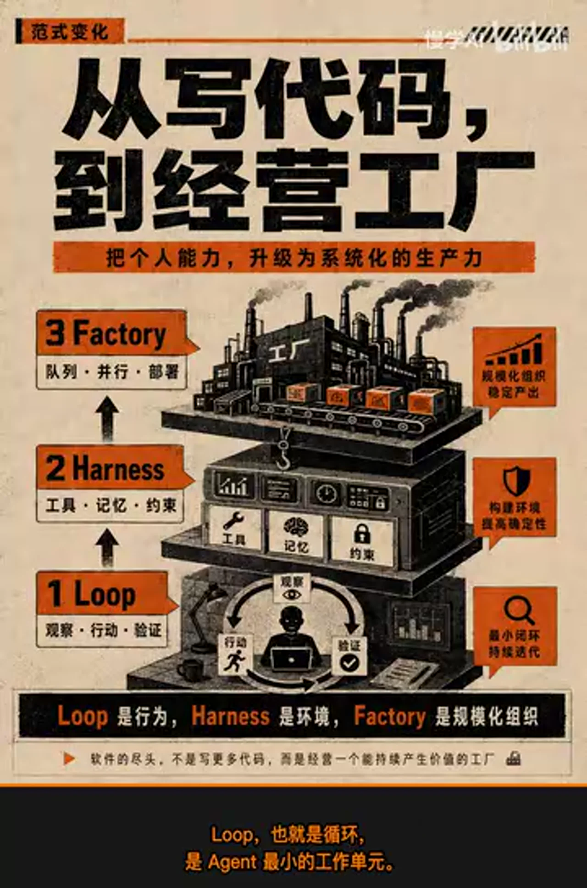

*图：作者用 Loop、Harness、Factory 表示行为、约束环境与规模化组织；这是概念分类，不是采用后必然提升产出的实证证据。*

生成、测试和扫描可以并行，review gate 却消耗稀缺的人类判断。拿掉闸门会提高吞吐量，也取消代码进入团队共同理解的机会。

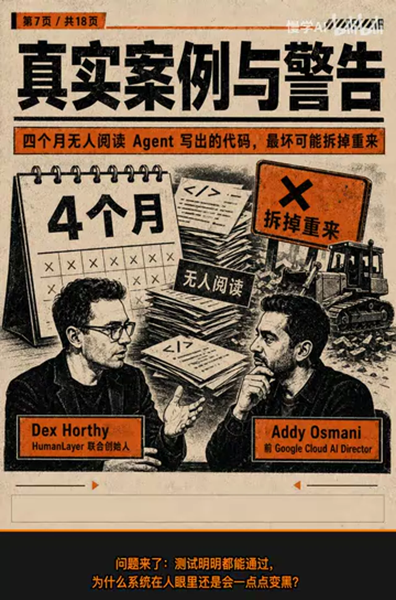

*图：视频以 Dex Horthy 讲述的“四个月无人阅读 Agent 代码”作警示；画面只是作者概括，不含仓库、事故报告或量化数据，不能独立证明案例或普遍因果。*

## 理解债务与背压

自动测试只回答“已编码的检查是否通过”，不回答系统是否易维护、架构是否合理。因此，测试全绿不等于维护性或架构正确。代码增长而无人阅读关键设计时，团队知识与系统的差距会扩大，即“理解债务”；它可能表现为诊断变慢和影响范围难预测。

Dex/HumanLayer 的经历是当事方报告而非独立审计，不能推出无人值守开发必然失败。Addy 的文章也只是工程观点。

作者用 **Backpressure（背压）** 表达一条设计原则：Agent 自主权不能超过组织能够低成本、可靠验证的范围。模型更强会提高生成速度，却不会自动提高验收质量。

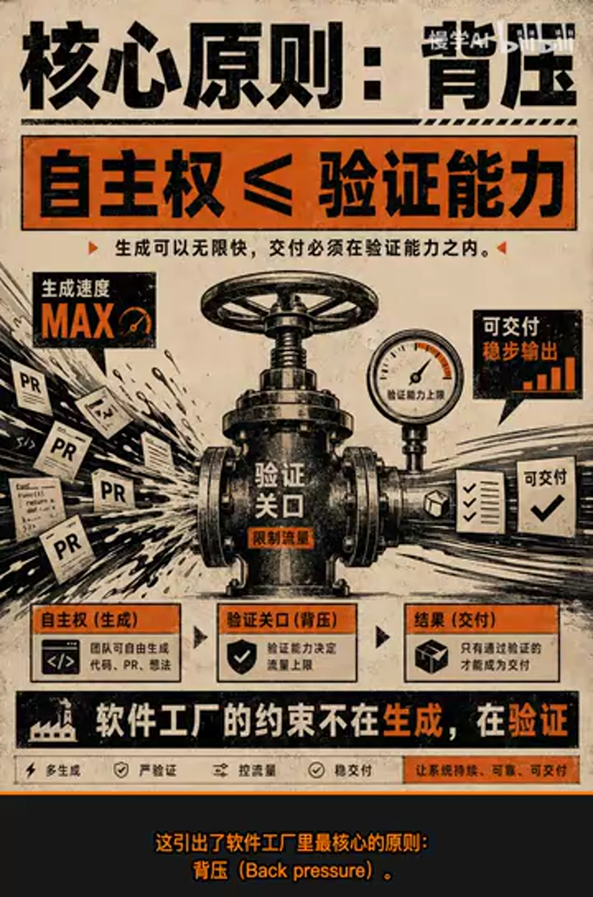

*图：阀门表示生成必须受验证能力约束；“自主权 ≤ 验证能力”是规范性主张，图中没有量化定义或普遍有效性的实验证据。*

四项落地措施是：

1. **判断前移、模型外设网。** 执行前由人确认问题、架构边界和验收条件；用类型、明确接口、测试接缝、短调用链和模块边界制造稳定机器信号，高风险 diff 仍由人审查。
2. **缩短 Loop。** 把大任务拆成目标单一、输出可观察、失败可定位的小任务。“3—10 步较稳定、超过 20 步易丢线索”没有公开实验或统计支持，只能视为 Dex 的经验提示。
3. **稳定验收。** 为每个 Loop 配置便宜、可重复、快速返回且尽量不漂移的完成条件；不能只听 Agent 自述，要检查 diff、类型检查、测试和日志。
4. **按风险开灯。** 明确、局部、可回滚且验收清晰的 Lint 修复或固定重构可自动化；认证、计费、公共 API、数据迁移、不可逆操作和架构方向等高风险或大爆炸半径变更必须人在环。

## Graph、双层循环与证据交接

复杂任务可用 Graph 或 State Machine 把步骤、条件、检查点和失败回路变成可见状态。Agent 仍能在节点内工作，但不能绕过规定路径。

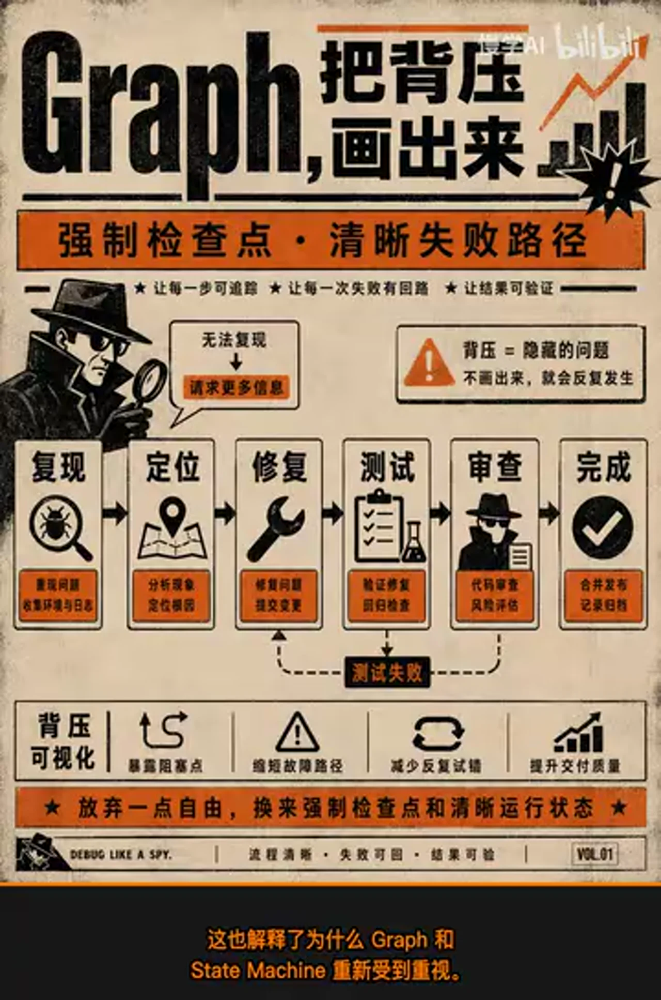

*图：示例串联复现、定位、修复、测试、审查与完成，并为无法复现和测试失败设置回路；这是方法示意，不是实际工具截图，也不能证明图结构必然减少缺陷。*

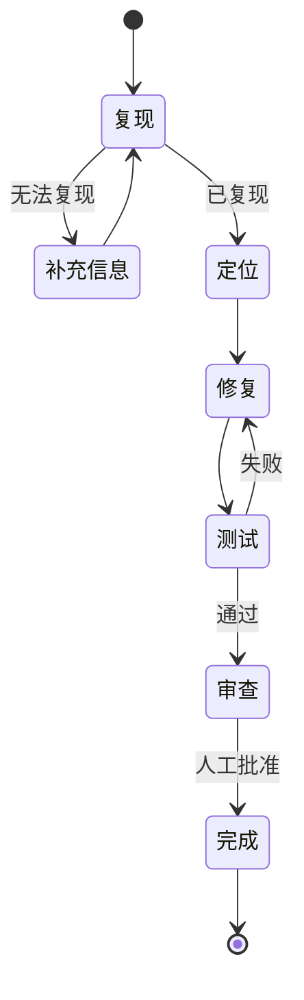

图结构的价值是定位状态和失败点；可靠性仍取决于节点设计、状态持久化、权限控制与验证器质量。

Agent 跑 **Inner Loop**，完成人工明确边界内的调查、修改、测试和报告；人守 **Outer Loop**，定义问题、评估风险并批准变更。两者用 diff、测试、日志和诊断解释组成的证据栈交接。

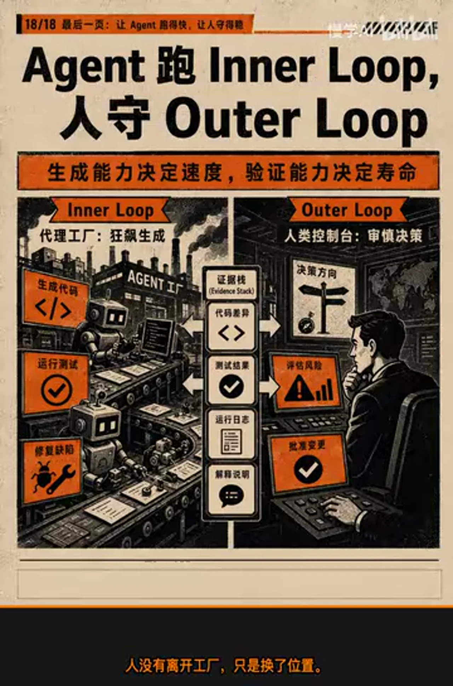

*图：Agent 执行内循环，人保留方向、风险和批准等外循环判断；这是目标职责设计，未展示真实组织落地后的效果。*

## 外部事实核验（2026-07-29）

本次共 6 项：

- **部分确认｜00:47 四个月案例。** [HumanLayer 当事方材料](https://github.com/humanlayer/advanced-context-engineering-for-coding-agents/blob/main/wsff.md)与 [Addy 转述](https://addyosmani.com/blog/software-factories/)支持主要叙述，但没有独立审计、仓库或量化数据，不宜外推。
- **确认｜01:02 Addy Osmani 经历。** [官方简介](https://addyosmani.com/)确认其曾任 Google Cloud AI Director；姓名应为 Addy，并非 Eddie。
- **确认｜01:18 三层框架。** [Addy 原文](https://addyosmani.com/blog/software-factories/)确有 Loop、Harness、Factory、review gate 与人类外循环；这是作者框架而非行业标准。
- **部分确认｜03:28 理解债务。** [Addy 分析](https://addyosmani.com/blog/software-factories/)及 [Dex 访谈](https://newsletter.pragmaticengineer.com/p/context-engineering-with-dex-horthy)支持该经验性风险，但缺少适用于所有团队的对照研究。
- **未验证｜06:08 “3—10/20 步”。** 未找到实验设计、模型版本、任务分布或统计数据，应视为启发式经验。
- **部分确认｜07:44 Graph / State Machine。** [Addy 原文](https://addyosmani.com/blog/software-factories/)支持显式节点、条件边和检查点；实际可靠性取决于实现，图结构本身不保证正确。

# Data

## 增强转写稿

## 校订转写稿

[00:00] 软件黑灯工厂正在成为现实
[00:02] 工程目标、线上事故和用户请求不断进入队列
[00:06] Agent 接到任务后自动修改代码、跑测试
[00:09] 变更只经过机器验证就被送进生产环境
[00:12] 看上去，团队的交付量突然飙升
[00:14] 整个工程团队像是一夜之间突破了瓶颈
[00:17] 把人彻底移出审查环节
[00:19] 会带来一种前所未有的极速爽感
[00:21] 人的阅读和审查，是流水线上最难增加产能的一环
[00:25] 拿掉这一环，所有机器都能在黑暗中全速狂飙
[00:29] 然而四个月后，现实的冷水泼了下来
[00:32] 系统没有轰然崩溃，测试甚至一直是绿的
[00:35] 可一旦团队要定位一个深层问题
[00:37] 已经没人能直接说清代码里发生了什么
[00:39] 他们只能重新钻进那片从未被人读过的代码里
[00:42] 靠极其痛苦的人工调试，一点点找到问题
[00:46] 测试全绿，但理解全黑
[00:47] 这段真实经历来自 HumanLayer 联合创始人 Dex Horthy
[00:51] 那座全自动代码工厂运行了大约四个月
[00:54] 整整四个月，没有人读过 Agent 写出的代码
[00:57] 问题来了：测试明明都能通过
[00:59] 为什么系统在人眼里还是会一点点变黑
[01:02] 曾任 Google Cloud AI Director 的 Eddie Osmani
[01:04] 把全黑模式最坏的结局说得很直接
[01:07] 如果把所有生产线都设成黑灯模式
[01:09] 四个月后，你可能会陷入把一切拆掉重来的局面
[01:13] 你以为省掉的是程序员
[01:14] 四个月后才发现，被一起省掉的可能是整套软件资产
[01:18] Eddie Osmani 对这个现象的分析是
[01:20] 软件开发正在经历一次范式变化
[01:23] 我们正在从亲手编写代码
[01:25] 转向经营一座生产代码的工厂
[01:27] 过去工程师直接处理的是一段代码
[01:29] 一个函数、一次 diff
[01:31] 现在工程师要设计和管理的对象
[01:34] 上移到了 loop、harness 和 factory
[01:36] loop，也就是循环，是 Agent 最小的工作单元
[01:40] Agent 先收集上下文，再采取行动、检查结果
[01:43] 没有达到条件，就根据反馈再跑一轮
[01:46] harness 是包在 loop 外面的运行环境
[01:48] 它规定 Agent 在什么 sandbox 里工作
[01:50] 能调用哪些工具，哪些记忆可以跨轮次保留
[01:53] 以及要拿出什么证据才算完成
[01:55] loop 决定 Agent 怎么行动
[01:57] harness 规定它能在什么边界内行动
[02:00] 工作队列持续分发任务
[02:02] 让多个带有 harness 的 loop 同时运行
[02:04] 每个结果经过检查和审查后
[02:06] 才能进入生产环境
[02:07] 这样组成的系统就是 software factory
[02:10] 也就是软件工厂
[02:11] 软件工厂靠许多 loop 并行扩张、扩大规模
[02:15] 就是同时运行更多 loop
[02:17] 整座工厂更像一张由 loop 组成的组织结构图
[02:20] 把这座工厂完整画出来，会看到一个闭环
[02:23] 工程目标、线上事故和用户请求先变成信号
[02:27] 进入工作队列
[02:28] harness 从队列里取出任务
[02:30] 驱动 Agent 修改代码
[02:32] 接着 CI、自动化测试、静态分析和安全扫描同时运行
[02:36] 检查通过后，变更来到 review gate
[02:39] 也就是审查闸门
[02:41] 获得批准，代码才会部署上线
[02:43] 生产环境里的监控结果
[02:44] 又变成新的信号，回到队列
[02:46] 在这张图里
[02:48] 生成、测试和扫描都很容易横向扩张
[02:51] 你可以运行更多 Agent，可以并行跑更多测试
[02:54] 也可以让扫描工具自动工作
[02:55] 只有一个方框顽固地拒绝扩张：review gate
[02:59] 因为这里需要人来做判断
[03:01] 而人的判断不能靠多加算力复制出来
[03:03] 人的注意力有限，无法像算力一样不断扩容
[03:06] AI 的生成能力却几乎没有上限
[03:08] 于是工厂里形成了一个漏斗
[03:10] 生成端是一个宽阔的大口
[03:12] 验证端却只有一条狭窄的瓶颈
[03:14] 代码生成得再多，也要经过可信的闸门才有价值
[03:17] 缺少这道闸门，堆出来的只会是大量坏 PR
[03:21] 以及被批量制造出来的缺陷
[03:23] 所以，删掉 review gate，短期当然极爽
[03:25] 因为你拿掉了工厂里唯一难以扩张的瓶颈
[03:28] 但代价不会立刻表现为测试失败
[03:30] 它会变成一种更安静的债务：理解债务
[03:32] 所谓理解债务，就是系统里的代码越来越多
[03:35] 团队能理解的部分却越来越少
[03:37] 两者之间的差距还在不断扩大
[03:39] 它和普通技术债不完全一样
[03:41] 代码可以很整齐，测试也可以一直是绿的
[03:43] 每一次局部修改甚至都说得过去，可如果代码不断增加
[03:47] 团队却没人读，大家对系统的理解就会停在原地
[03:50] 对全新项目、周末玩具和副项目来说
[03:52] 这种差距未必马上暴露
[03:54] 因为几个月时间通常已经足够把东西做到能用
[03:57] 可面对维护了十年以上的复杂旧系统
[04:00] 项目推进三到六个月后
[04:01] 团队就可能淹没在大量从未读过的代码里
[04:04] Dex 的四个月经历暴露了两个指标之间的冲突
[04:08] 一个是机器的 Token 利用率和代码产出
[04:10] 另一个是人对系统的理解：前者不断上升，后者却在减少
[04:14] 更危险的是，理解债务可以在测试全绿时悄悄累积
[04:18] 它的清算不会以一次戏剧性的全面崩溃到来
[04:21] 很久以后，你只会发现排查越来越慢，改动越来越难
[04:25] 这引出了软件工厂里最核心的原则：背压，Backpressure
[04:29] 背压划出了一条不可逾越的界线
[04:31] 你只能赋予 Agent 那些能够低成本、可靠验证的自主权
[04:35] 多一寸都不行
[04:36] 软件工厂最终受限于验证能力。模型变强
[04:39] 也不会自动补上生成和验证之间的差距
[04:42] 让模型通过简单的单元测试相对容易
[04:45] 可要判断一个架构能不能长期维护，难度高得多
[04:48] 架构好不好，几秒钟、几分钟看不出来
[04:51] 往往要放进真实业务里，用几个月甚至几年检验
[04:54] 没有即时、清晰的评估，模型就得不到稳定反馈
[04:58] 也很难学会怎么处理复杂的架构决策
[05:01] 要让工厂长期运行，灯必须在需要判断的地方重新亮起来
[05:05] 具体可以从四件事入手
[05:07] 第一，先把人的判断移到上游，再在模型之外建立安全网
[05:11] 如果等 Agent 写完几千行代码
[05:12] 再把所有压力都塞给末端 code review，已经太晚了
[05:15] 产品方向、设计取舍、架构边界和验收条件
[05:18] 都应该在 Agent 启动 loop 之前有人确认
[05:21] 比如，提前审一份写清楚的 200 行计划
[05:24] 通常比事后钻进 2000 行生成代码
[05:26] 追查它当初为什么这样设计，便宜得多
[05:28] 安全网还必须建在模型之外
[05:30] 清楚的类型和方法签名，能让编译器尽早抓错
[05:33] 测试接缝，能让关键行为固定下来，方便观察
[05:37] 合理的代码布局
[05:38] 也能让下一位人类或模型知道去哪里找相关代码
[05:42] 调用栈要短而清晰，组件边界也要足够明确
[05:45] 避免一次改动波及整个系统
[05:47] 再通过依赖注入，把某个组件单独替换出来验证
[05:50] 这些都是传统的软件工程实践
[05:52] 到了 Agent 写代码的时代，它们会有更大的作用
[05:55] 充当便宜、难以伪造的外部安全网
[05:57] 即使判断已经前移，末端的代码审查仍然要保留
[06:00] Agent 交付结果后，遇到错误代价高的变更
[06:03] 人仍然要读必要的地方，再决定是否放行
[06:06] 第二，让 loop 足够短
[06:08] Dex 的经验法则是
[06:09] Agent 在三到十个步骤内通常还能保持稳定
[06:13] 超过二十步以后，就更容易丢失线索
[06:15] 这只是一条经验判断，但方向很明确
[06:18] loop 越长，积累的上下文越多
[06:20] 错误就越容易藏在角落里，验证成本也会越高
[06:23] 所以，别把开发一个完整系统塞进一个巨大的 loop
[06:27] 应该把它拆成多个短 loop
[06:29] 每个 loop 目标单一、结果可观察，失败位置也很清楚
[06:32] 第三，为每个 loop 设计一套稳定的验收机制
[06:35] 它只需要回答一个问题
[06:37] 这项任务到底完成了没有
[06:39] 这套验收机制要足够便宜，可以高频运行
[06:41] 还要马上返回结果
[06:43] 而且标准不会随着时间变化
[06:45] 验收也不能只听 Agent 自己解释
[06:47] 必须要求它拿出外部可以检查的证据
[06:50] 测试要能明确给出通过或失败的结果
[06:53] 类型检查、属性测试
[06:55] 以及按照真实评分标准检查结果的 review agent
[06:58] 也都可以承担这项工作
[07:00] 当机器能够按照稳定标准证明任务已经完成
[07:03] 这个 loop 才有资格进一步扩大自动化
[07:05] 第四，按照风险为每个 loop 单独设置开关
[07:09] 比如一个夜间自动任务
[07:10] 每次只修复一处明确的 Lint 违规
[07:12] 或者执行一种固定的重构模式
[07:14] 改动很小，检查结果也很清楚
[07:16] 第二天只会生成一个很短的 PR
[07:18] 这种 loop 可以把灯关得更安全
[07:20] 可一旦任务涉及身份认证、计费系统
[07:23] 公共 API 合约
[07:24] 或者测试捕捉不到的隐蔽生产问题
[07:26] 风险就完全不同
[07:27] 尤其是那些会决定未来一年架构方向的任务
[07:30] 错误代价高、波及范围大，灯必须亮着
[07:33] 全黑，短期吞吐量很高
[07:35] 长期可能积累出没人理解的系统
[07:37] 全亮，所有改动都等人审查
[07:39] review gate 又会堵死整座工厂
[07:41] 工程难点是为每个 loop 找到合适的开关位置
[07:44] 这也解释了为什么 graph 和 state machine 重新受到重视
[07:47] 在纯 loop 里
[07:48] 模型自己决定读什么、改什么、跑什么测试
[07:51] 也决定什么时候重试、什么时候结束
[07:53] 这种自由在小任务里很顺
[07:55] 可一旦进入复杂的老系统
[07:56] 执行路径就越来越难预测
[07:58] 失败点也越来越难定位
[08:00] 这里说的 graph 和知识图谱无关
[08:02] 它是一张提前定义好的工作流图
[08:04] 每个节点代表一个明确步骤
[08:06] 每条边代表一个明确条件
[08:08] 比如修复一个 bug，先复现问题
[08:11] 复现不了，就补充信息
[08:12] 复现成功，再定位原因，并尝试修复
[08:15] 测试失败，就回到修复节点
[08:17] 测试通过，才进入审查节点
[08:19] 拿到批准后，任务才算完成
[08:21] Agent 在每个节点内部仍然可以发挥能力
[08:23] 但它不能绕过规定的检查
[08:25] 也不能擅自跳出既定路径
[08:27] graph 的价值就是把背压画出来
[08:30] 让 Agent 少一些自由
[08:32] 换来的是强制检查点、清晰的失败路径
[08:35] 以及可以定位的运行状态
[08:37] 一次任务失败后
[08:38] 你能明确知道问题出在复现、测试还是审查
[08:41] 最后，人到底去了哪里
[08:43] 人没有离开工厂，只是换了位置
[08:45] Agent 负责执行 inner loop，也就是内循环
[08:48] 它可以调查 bug、写诊断、实现修复
[08:50] 运行测试，整理报告
[08:52] 人则越来越多地掌控 outer loop，也就是外循环
[08:55] 问题定义对不对，诊断可不可信
[08:58] 方案值不值得合并
[08:59] 风险能不能承担，都由人来判断
[09:02] 最后，也由人批准变更
[09:04] 内循环和外循环之间要用证据交接
[09:07] diff、测试结果、运行日志
[09:09] 再加一段解释，说明问题是怎么诊断的
[09:12] 代码改了什么，最后结果如何
[09:14] 你不再需要站在生产线上
[09:15] 亲手完成每次变更
[09:17] 你的工作变成站在生产线之上设计它
[09:20] 你要决定哪里可以关灯
[09:21] 哪里必须开灯
[09:23] 还要守住最后那道判断闸门
[09:25] 类型、测试、接缝和审查标准
[09:27] 可以降低监督成本
[09:29] 可那些长期代价高昂的问题
[09:31] 通常仍然很难靠自动化识别
[09:33] 当 Agent 写得越来越快
[09:35] 验证能力却没有同步扩张
[09:37] 黑灯软件工厂的风险反而会被放大
[09:39] 生成能力决定工厂跑得多快
[09:41] 验证能力决定它能不能长期跑下去
[09:43] inner loop 可以交给 Agent 执行
[09:45] outer loop 需要人越来越多地掌控

## 术语表

- **黑灯软件工厂（dark software factory）**：视频用来描述高度自动化、几乎无人逐行阅读生成代码的软件生产模式。
- **loop**：Agent 收集上下文、行动、检查结果，并根据反馈迭代的最小工作循环。
- **harness**：约束 Agent 工具、记忆、权限边界和完成证据的外部运行环境。
- **review gate**：代码进入生产前需要通过的审查闸门。
- **Backpressure（背压）**：视频用来表示“可可靠验证的能力”对 Agent 自主权和产出速度形成的约束。
- **理解债务**：视频对“代码增长速度超过团队理解增长速度”这一风险的命名，区别于通常所说的技术债。
- **graph / state machine**：预先定义节点、条件和失败路径的工作流控制方式，不是知识图谱。
- **inner loop / outer loop**：Agent 执行调查、修改和测试的内循环，以及人负责定义、诊断可信度、合并和风险判断的外循环。

## 原始转写稿

[00:00] 軟件黑燈工廠正在成為現實
[00:02] 工程目標 線上事故和用戶請求不斷進入對列
[00:06] Agent接到任務後自動攜帶碼 跑測試
[00:09] 變更只經過機器驗證就被送進生產環境
[00:12] 看上去 團隊的交付量突然飆升
[00:14] 整個工程團隊像是一夜之間突破了陰障
[00:17] 把人徹底移出審查環節
[00:19] 會帶來一種前所未有的極速爽感
[00:21] 人的閱讀和審查是流水線上最難增加產能的一環
[00:25] 拿掉這一環 所有機器都能在黑暗中全速狂飆
[00:29] 然後 它四個月後現實的冷水潑了下來
[00:32] 系統沒有轟然崩潰 測試甚至一直是綠等
[00:35] 可一旦團隊要定位一個深層問題
[00:37] 已經沒人能直接說清代碼裡發生了什麼
[00:39] 他們只能重新鑽進那片從未被人讀過的代碼裡
[00:42] 靠極其痛苦的人工調試一點點找到問題
[00:46] 測試權率但理解權黑
[00:47] 這段真實經歷來自Human Layer聯合創始人Dex Horthy
[00:51] 那座全自動代碼工廠運行了大約四個月
[00:54] 整整四個月沒有人讀過Agent寫出的代碼
[00:57] 問題來了 測試明明都能通過
[00:59] 為什麼系統在人眼裡還是會一點點變黑
[01:02] 曾任Google Cloud AI Director的Eddie Osmani
[01:04] 把權黑模式最壞的結局說得很直接
[01:07] 如果把所有生產線都射成黑燈模式
[01:09] 四個月後你可能會陷入把一切拆掉重來的局面
[01:13] 你以為省掉的是程序員
[01:14] 四個月後才發現被一起省掉的可能是整套軟件資產
[01:18] Eddie Osmani對這個現象的分析是
[01:20] 軟件開發正在經歷一次範式變化
[01:23] 我們正在從親手編寫代碼
[01:25] 轉向經營一座生產代碼的工廠
[01:27] 過去工程師直接處理的是一段代碼
[01:29] 一個函數一次Deep
[01:31] 現在工程師要設計和管理的對象
[01:34] 上移到了loop harness和factory
[01:36] loop也就是循環 是Agent最小的工作單元
[01:40] Agent先收集上下文再採取行動 檢查結果
[01:43] 沒有達到條件就根據反饋再跑一輪
[01:46] harness是包在loop外面的運行環境
[01:48] 它規定Agent在什麼沙漿裡工作
[01:50] 能調用哪些工具 哪些記憶可以跨輪自保留
[01:53] 以及要拿出什麼證據才算完成
[01:55] loop決定Agent怎麼行動
[01:57] harness規定它能在什麼邊界內行動
[02:00] 工作對列持續分發任務
[02:02] 讓多個帶有harness的loop同時運行
[02:04] 每個結果經過檢查和審查後
[02:06] 才能進入生產環境
[02:07] 這樣組成的系統就是software factory
[02:10] 也就是軟件工廠
[02:11] 軟件工廠靠許多loop並行擴張 擴大規模
[02:15] 就是同時運行更多loop
[02:17] 整座工廠更像一張由loop組成的組織結構圖
[02:20] 把這座工廠完整畫出來 會看到一個閉環
[02:23] 工程目標 線上事故和用戶請求先變成信號
[02:27] 進入工作對列
[02:28] harness從對列裡取出任務
[02:30] 驅動Agent修改代碼
[02:32] 接著CI自動化測試 靜態分析和安全掃描同時運行
[02:36] 檢查通過後 變更來到review gate
[02:39] 也就是審查閘門
[02:41] 獲得批准 代碼才會部署上線
[02:43] 生產環境裡的監控結果
[02:44] 又變成新的信號 回到對列
[02:46] 在這張圖裡
[02:48] 生成 測試和掃描都很容易橫向擴張
[02:51] 你可以運行更多Agent 可以並行跑更多測試
[02:54] 也可以讓掃描工具自動工作
[02:55] 只有一個方框 頑固的拒絕擴張Review gate
[02:59] 因為這裡需要人來做判斷
[03:01] 而人的判斷不能靠多加算力複製出來
[03:03] 人的注意力有限 無法像算力一樣不斷擴容
[03:06] AI的生成能力卻幾乎沒有上線
[03:08] 於是工廠力形成了一個漏斗
[03:10] 生成端是一張雪盆大口
[03:12] 驗證端卻只有一條狹窄的瓶頸
[03:14] 代碼生成的再多 也要經過可信的閘門才有價值
[03:17] 缺少這道閘門 堆出來的只會是大量壞PR
[03:21] 以及被批量製造出來的缺陷
[03:23] 所以 刪掉Review gate 短期當然極爽
[03:25] 因為你拿掉了工廠力唯一難以擴張的瓶頸
[03:28] 但代價不會立刻表現為測試失敗
[03:30] 它會變成一種更安靜的債務 理解債務
[03:32] 所謂理解債務 就是系統裡的代碼越來越多
[03:35] 團隊能理解的部分卻越來越少
[03:37] 兩者之間的差距還在不斷擴大
[03:39] 它和普通技術債不完全一樣
[03:41] 代碼可以很整齊 測試也可以一直是綠的
[03:43] 每一次局部修改甚至都說得過去 可如果代碼不斷增加
[03:47] 團隊卻沒人讀 大家對系統的理解就會停在原地
[03:50] 對全新項目 週末玩具和副項目來說
[03:52] 這種差距未必馬上暴露
[03:54] 因為幾個月時間 通常已經足夠把東西做到能用
[03:57] 可面對維護了十年以上的複雜舊系統
[04:00] 項目推進三到六個月後
[04:01] 團隊就可能淹沒在大量從未讀過的代碼裡
[04:04] DEX的四個月經歷暴露了兩個指標之間的衝突
[04:08] 一個是機器的Token利用率和代碼產出
[04:10] 另一個是人對系統的理解 前者不斷上升 後者卻在減少
[04:14] 更危險的是 理解債務可以在測試權利時悄悄累積
[04:18] 它的清算不會以一次戲劇性的全面崩潰到來
[04:21] 很久以後 你只會發現排查越來越慢 改動越來越難
[04:25] 這引出了軟體工廠裡最核心的原則 被壓 Backpressure
[04:29] 被壓滑出了一條不可愉悅的界線
[04:31] 你只能賦予Agent那些能夠低成本 可靠驗證的自主權
[04:35] 多一寸都不行
[04:36] 軟體工廠最終受限於驗證能力 模型變強
[04:39] 也不會自動補上生成和驗證之間的差距
[04:42] 讓模型通過簡單的單元測試相對容易
[04:45] 可要判斷一個架構能不能長期維護 難度高得多
[04:48] 架構好不好 幾秒鐘 幾分鐘 看不出來
[04:51] 往往要放進真實業務裡 用幾個月甚至幾年檢驗
[04:54] 沒有即時 清晰的評估 模型就得不到穩定反饋
[04:58] 也很難學會怎麼處理複雜的架構決策
[05:01] 要讓工廠長期運行 燈必須在需要判斷的地方重新亮起來
[05:05] 具體可以從四件事入手
[05:07] 第一 先把人的判斷移到上游 再在模型之外建立安全網
[05:11] 如果等Agent寫完幾千行代碼
[05:12] 再把所有壓力都塞給末端codereview已經太晚了
[05:15] 產品方向 設計取捨 架構邊界和驗收條件
[05:18] 都應該在Agent啟動loop之前有人確認
[05:21] 比如 提前審一份寫了清楚的200行計畫
[05:24] 通常比事後鑽進2000行生成代碼
[05:26] 追查它當初為什麼這樣設計 便宜得多
[05:28] 安全網還必須建在模型之外
[05:30] 清楚的類型和方法簽名 能讓編譯器盡早抓錯
[05:33] 測試接縫 能讓關鍵行為固定下來 方便觀察
[05:37] 合理的代碼布局
[05:38] 也能讓下一位人類或模型之道去哪裡找相關代碼
[05:42] 調用站要短而清晰 組件邊界也要足夠明確
[05:45] 避免一次改動波及整個系統
[05:47] 再通過依賴注入把某個組件單獨替換出來驗證
[05:50] 這些都是傳統的軟件工程實踐
[05:52] 到了Agent寫代碼的時代 它沒有多力向作用
[05:55] 充當便宜難以偽造的外部安全網
[05:57] 即使判斷已經前移 末端的代碼審查仍然要保留
[06:00] Agent交付結果後 遇到錯誤代價高的變更
[06:03] 人仍然要讀必要的地步 再決定是否放行
[06:06] 第二 讓loop足夠短
[06:08] Dex的經驗法則是
[06:09] Agent在三到十個步驟內通常還能保持穩定
[06:13] 超過二十步以後就更容易丟失線索
[06:15] 這只是一條經驗判斷 但方向很明確
[06:18] loop越長 積累的上下文越多
[06:20] 錯誤就越容易藏在角落裡 驗證成本也會越高
[06:23] 所以 別把開發一個完整系統塞進一個巨大的loop
[06:27] 應該把它拆成多個短loop
[06:29] 每個loop目標單一 結果可觀察 失敗位置也很清楚
[06:32] 第三 為每個loop設計一套穩定的驗收機制
[06:35] 它只需要回答一個問題
[06:37] 這項任務到底完成了沒有
[06:39] 這套驗收機制要足夠便宜 可以高頻運行
[06:41] 還要馬上返回結果
[06:43] 而且標準不會隨著時間變化
[06:45] 驗收也不能只聽Agent的自己解釋
[06:47] 必須要求它拿出外部可以檢查的證據
[06:50] 測試要能明確給出通過或失敗的結果
[06:53] 類型檢查 屬性測試
[06:55] 以及按照真實評分標準檢查結果的review agent
[06:58] 也都可以承擔這項工作
[07:00] 當機器能夠按照穩定標準證明任務已經完成
[07:03] 這個loop才有資格進一步擴大自動化
[07:05] 第四 按照風險為每個loop單獨設置開關
[07:09] 比如一個夜間自動任務
[07:10] 每次只修復一處明確的Lint違規
[07:12] 或者一個固定法模式
[07:14] 改動很小 檢查結果也很清楚
[07:16] 第二天只會生成一個很短的PR
[07:18] 這種loop可以把燈關得更安
[07:20] 可一旦任務設計身份認證 積費系統
[07:23] 公共API合約
[07:24] 或者測試捕捉不到的隱蔽生產問題
[07:26] 風險就完全不同
[07:27] 尤其是那些會決定未來一年架構方向的任務
[07:30] 錯誤 代價高 波級範圍大 燈必須亮著
[07:33] 全黑 短期吞吐量很高
[07:35] 長期可能積累 沒人理解的系統
[07:37] 全亮 所有改動都等人審查
[07:39] review gate又會堵死整座工廠
[07:41] 工程難點是為每個loop找到合適的開關位置
[07:44] 這也解釋了為什麼graph和statemason重新受到重視
[07:47] 在純loop裡
[07:48] 模型自己決定讀什麼 改什麼 跑什麼測試
[07:51] 也決定什麼時候重視 什麼時候結束
[07:53] 這種自由在小任務裡很順
[07:55] 可一旦進入複雜的老系統
[07:56] 執行路徑就越來越難預測
[07:58] 失敗點也越來越難定位
[08:00] 這裡說的graph和知識圖普無關
[08:02] 它是一張提前定義好的工作流圖
[08:04] 每個節點代表一個明確步驟
[08:06] 每條編代表一個明確條件
[08:08] 比如修復一個bug 先復現問題
[08:11] 復現不了 就補充信息
[08:12] 復現成功 在定位原因 並嘗試修復
[08:15] 測試失敗 就回到修復節點
[08:17] 測試通過 才進入審查節點
[08:19] 拿到批准後 任務才算完成
[08:21] agents在每個節點內部仍然可以發揮能力
[08:23] 但它不能繞過規定的檢查
[08:25] 也不能擅自跳出既定路徑
[08:27] graph的價值就是把被壓劃出來
[08:30] 讓agents少一些自由
[08:32] 換來的是強制檢查點 清晰的失敗路徑
[08:35] 以及可以定位的運行狀態
[08:37] 一次任務失敗後
[08:38] 你能明確知道問題出在復現 測試還是審查
[08:41] 最後 人到底去了哪裡
[08:43] 人沒有離開工廠 只是換了位置
[08:45] agent負責執行inner loop 也就是內循環
[08:48] 它可以調查bug 寫診段 實現修復
[08:50] 運行測試 整理報告
[08:52] 人則越來越多的掌控outer loop 也就是外循環
[08:55] 問題定義對不對 診斷可不可信
[08:58] 方案值不值得合併
[08:59] 風險能不能承擔 都由人來判斷
[09:02] 最後 也由人批准變更
[09:04] 內循環和外循環之間要用證據交接
[09:07] DIF 測試結果 運行日誌
[09:09] 再加一段解釋 說明問題是怎麼診斷的
[09:12] 代碼改了什麼 最後結果如何
[09:14] 你不再需要站在生產線上
[09:15] 親手完成每次變更
[09:17] 你的工作 變成站在生產線之上設計它
[09:20] 你要決定哪裡可以關燈
[09:21] 哪裡必須開燈
[09:23] 還要守住最後那道判斷閘門
[09:25] 類型 測試 接縫和審查標準
[09:27] 可以降低監督成本
[09:29] 可那些長期代價高昂的問題
[09:31] 通常仍然很難靠自動化識別
[09:33] 當agent寫得越來越快
[09:35] 驗證能力卻沒有同步擴張
[09:37] 黑燈軟件工廠的風險反而會被放大
[09:39] 生成能力決定工廠跑得多快
[09:41] 驗證能力決定它能不能長期跑下去
[09:43] in the loop 可以交給agent執行
[09:45] outer loop需要人越來越多的掌控

## 原始关键帧

### 关键帧 1

### 关键帧 2

### 关键帧 3

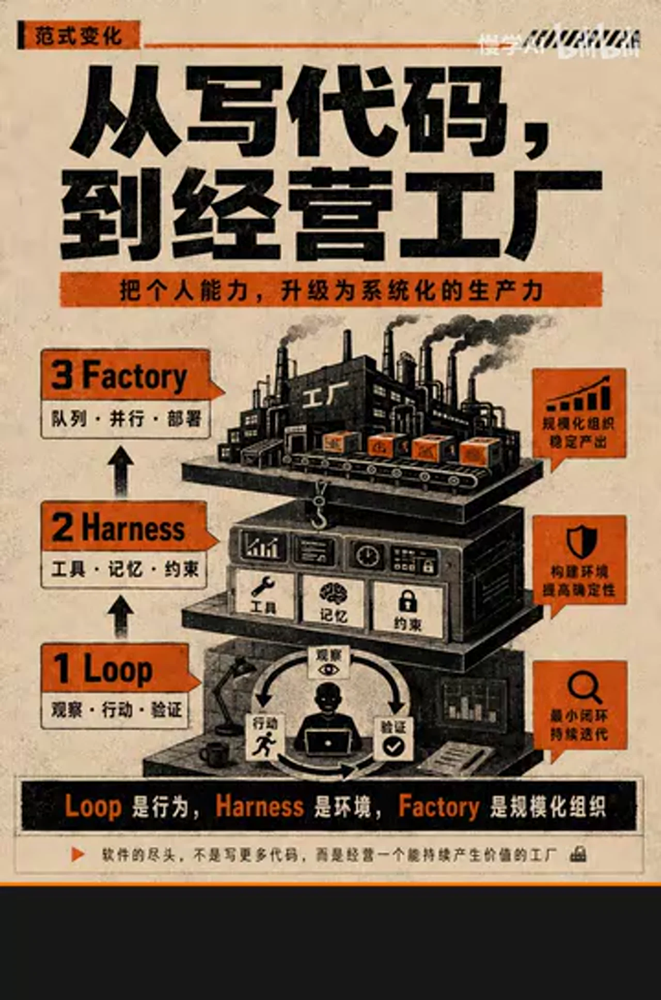

### 关键帧 4

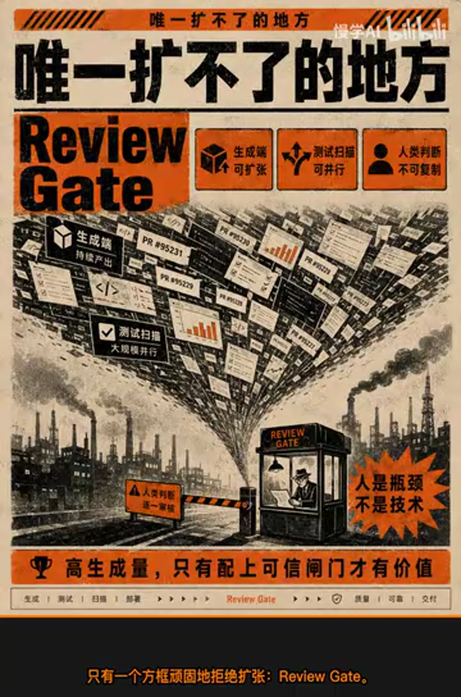

### 关键帧 5

### 关键帧 6

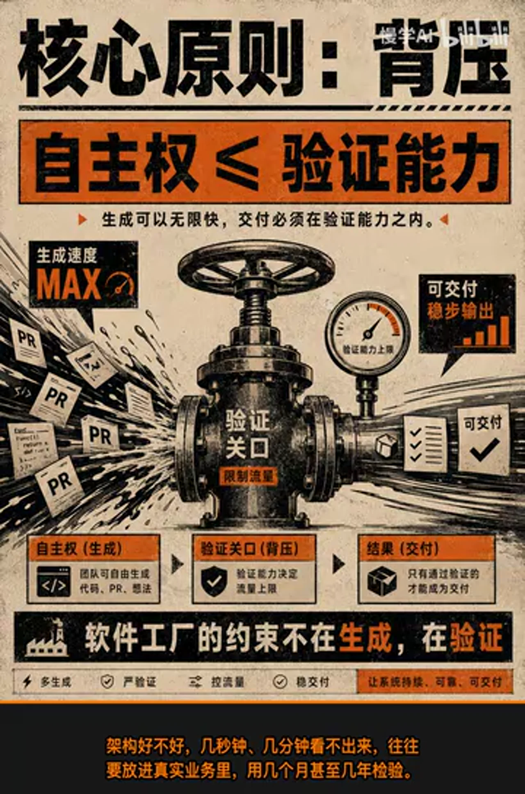

### 关键帧 7

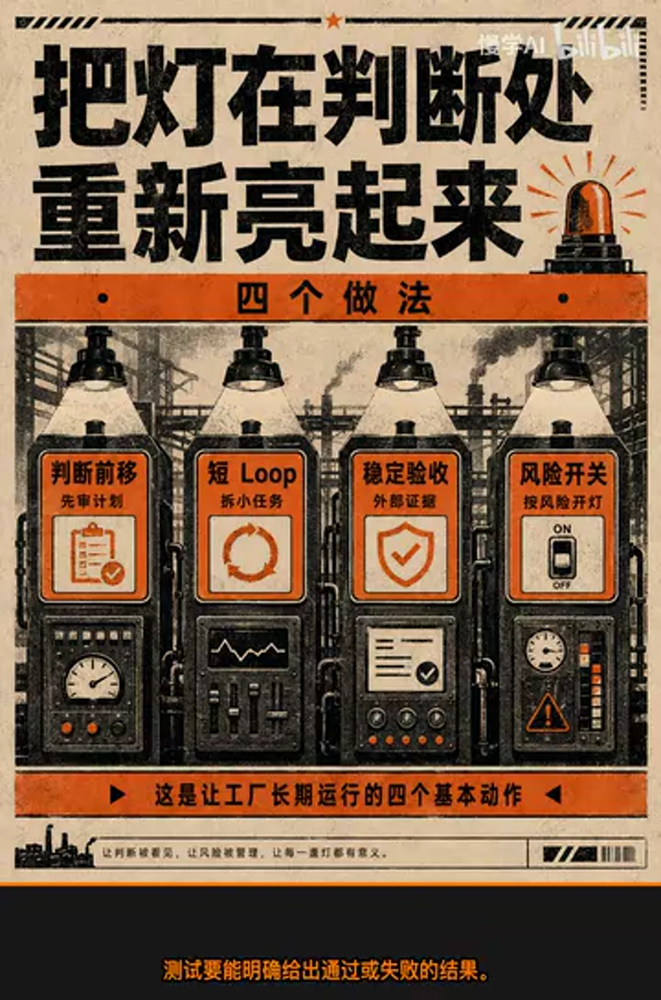

### 关键帧 8

### 关键帧 9

### 关键帧 10

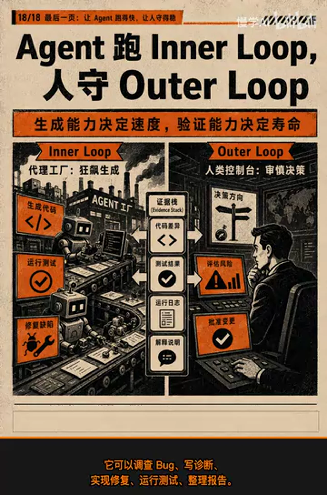
